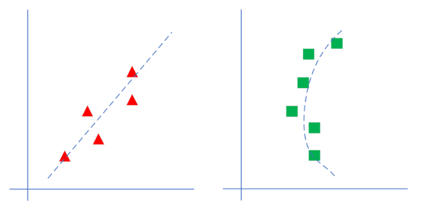
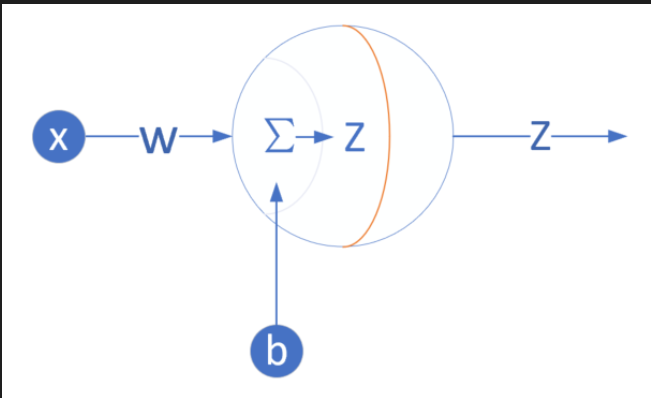
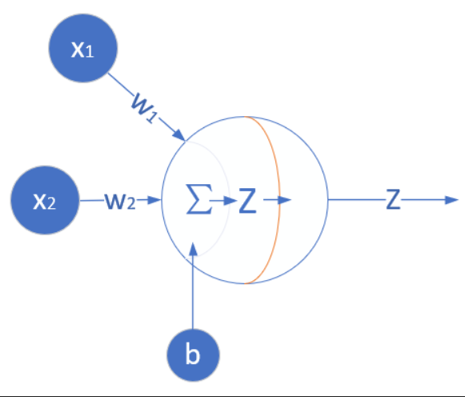
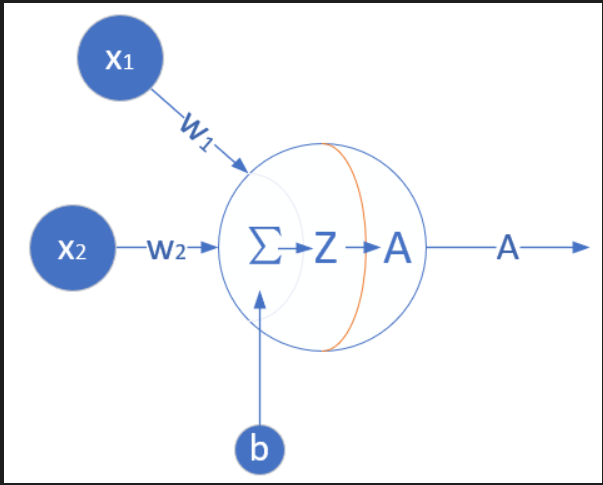
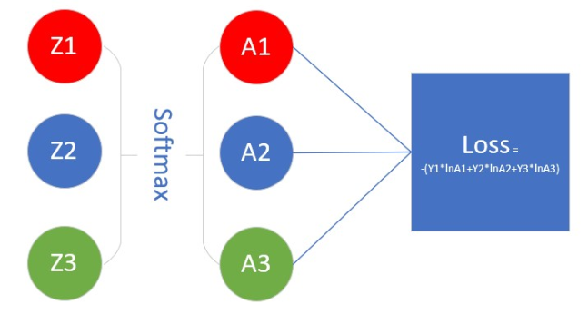

# 1线性回归
## 1.1单变量线性回归问题
### 1.1.1一元线性回归模型

回归分析是一种数学模型。当因变量和自变量为线性关系时，它是一种特殊的线性模型。最简单的情形是一元线性回归，由大体上有线性关系的一个自变量和一个因变量组成，模型是：

Y=a+bX+&epsilon;

X是自变量，Y是因变量，&epsilon;是随机误差，a和b是参数，在线性回归模型中，a,b是我们要通过算法学习出来的。

对于线性回归模型，有如下一些概念需要了解：

- 通常假定随机误差&epsilon;的均值为0，方差为σ2（σ2>0，σ2与X 的值无关）
- 若进一步假定随机误差遵从正态分布，就叫做正态线性模型
- 一般地，若有k个自变量和1个因变量（即公式1中的Y），则因变量的值分为两部分：一部分由自变量影响，即表示为它的函数，函数形式已知且含有未知参数；另一部分由其他的未考虑因素和随机性影响，即随机误差
- 当函数为参数未知的线性函数时，称为线性回归分析模型
- 当函数为参数未知的非线性函数时，称为非线性回归分析模型
- 当自变量个数大于1时称为多元回归
- 当因变量个数大于1时称为多重回归

通过对数据的观察，可以大致认为它符合线性回归模型的条件，于是列出了线性回归模型，不考虑随机误差的话，我们的任务就是找到合适的a,b，这就是线性回归的任务。

如图，左侧为线性模型，可以看到直线穿过了一组三角形所形成的区域的中心线，并不要求这条直线穿过每一个三角形。右侧为非线性模型，一条曲线穿过了一组矩形所形成的区域的中心线。
### 1.1.2公式形态

三种公式形态：

$$Y = W^{\top}X+B \tag{1}$$
$$Y = W \cdot X + B \tag{2}$$
$$Y = X \cdot W + B \tag{3}$$
这三者的主要区别是样本数据 $X$ 的形状定义，相应地会影响到 $W$ 的形状定义。如果 $X$ 有三个特征值，那么 $W$ 必须有三个权重值与特征值对应。
## 1.2最小二乘法
### 数学原理
线性回归试图学得：

$$z_i=w \cdot x_i+b \tag{1}$$

使得：

$$z_i \simeq y_i \tag{2}$$

其中，$x_i$ 是样本特征值，$y_i$ 是样本标签值，$z_i$ 是模型预测值。

如何学得 $w$ 和 $b$ 呢？均方差(MSE - mean squared error)是回归任务中常用的手段：
$$
J = \frac{1}{2m}\sum_{i=1}^m(z_i-y_i)^2 = \frac{1}{2m}\sum_{i=1}^m(y_i-wx_i-b)^2 \tag{3}
$$

$J$ 称为损失函数。实际上就是试图找到一条直线，使所有样本到直线上的残差的平方和最小。
## 1.3梯度下降法
### 1.3.1数学原理
在下面的公式中，规定 $x$ 是样本特征值（单特征），$y$ 是样本标签值，$z$ 是预测值，下标 $i$ 表示其中一个样本。

预设函数（Hypothesis Function）

线性函数：

$$z_i = x_i \cdot w + b \tag{1}$$

损失函数（Loss Function）

均方误差：

$$loss_i(w,b) = \frac{1}{2} (z_i-y_i)^2 \tag{2}$$

与最小二乘法比较可以看到，梯度下降法和最小二乘法的模型及损失函数是相同的，都是一个线性模型加均方差损失函数，模型用于拟合，损失函数用于评估效果。

区别在于，最小二乘法从损失函数求导，直接求得数学解析解，而梯度下降以及后面的神经网络，都是利用导数传递误差，再通过迭代方式一步一步（用近似解）逼近真实解。

### 1.3.2梯度计算
z的梯度
$$
\frac{\partial loss}{\partial z_i}=z_i - y_i \tag{3}
$$

计算 $w$ 的梯度
根据公式1和公式3：

$$
\frac{\partial{loss}}{\partial{w}} = \frac{\partial{loss}}{\partial{z_i}}\frac{\partial{z_i}}{\partial{w}}=(z_i-y_i)x_i \tag{4}
$$

计算 $b$ 的梯度

$$
\frac{\partial{loss}}{\partial{b}} = \frac{\partial{loss}}{\partial{z_i}}\frac{\partial{z_i}}{\partial{b}}=z_i-y_i \tag{5}
$$
## 1.4神经网络法
### 1.4.1定义神经网络结构

输入层

此神经元在输入层只接受一个输入特征，经过参数 $w,b$ 的计算后，直接输出结果。这样一个简单的“网络”，只能解决简单的一元线性回归问题，而且由于是线性的，我们不需要定义激活函数，这就大大简化了程序，而且便于大家循序渐进地理解各种知识点。

严格来说输入层在神经网络中并不能称为一个层。

权重 $w,b$

因为是一元线性问题，所以 $w,b$ 都是标量。

输出层

输出层 $1$ 个神经元，线性预测公式是：

$$z_i = x_i \cdot w + b$$

$z$ 是模型的预测输出，$y$ 是实际的样本标签值，下标 $i$ 为样本。

损失函数

因为是线性回归问题，所以损失函数使用均方差函数。

$$loss(w,b) = \frac{1}{2} (z_i-y_i)^2$$

### 1.4.2反向传播
计算 $w$ 的梯度

$$
{\partial{loss} \over \partial{w}} = \frac{\partial{loss}}{\partial{z_i}}\frac{\partial{z_i}}{\partial{w}}=(z_i-y_i)x_i
$$

计算 $b$ 的梯度

$$
\frac{\partial{loss}}{\partial{b}} = \frac{\partial{loss}}{\partial{z_i}}\frac{\partial{z_i}}{\partial{b}}=z_i-y_i
$$
## 1.5多样本单特征值计算
### 1.5.1 前向计算

由于有多个样本同时计算，所以 $x_i$ 表示第 $i$ 个样本，$X$ 是样本组成的矩阵，$Z$ 是计算结果矩阵，$w$ 和 $b$ 都是标量：

$$
Z = X \cdot w + b \tag{1}
$$

把它展开成3个样本（3行，每行代表一个样本）的形式：

$$
X=\begin{pmatrix}
    x_1 \\\\ 
    x_2 \\\\ 
    x_3
\end{pmatrix}
$$

$$
Z= 
\begin{pmatrix}
    x_1 \\\\ 
    x_2 \\\\ 
    x_3
\end{pmatrix} \cdot w + b 
=\begin{pmatrix}
    x_1 \cdot w + b \\\\ 
    x_2 \cdot w + b \\\\ 
    x_3 \cdot w + b
\end{pmatrix}
=\begin{pmatrix}
    z_1 \\\\ 
    z_2 \\\\ 
    z_3
\end{pmatrix} \tag{2}
$$

$z_1,z_2,z_3$ 是三个样本的计算结果。

### 1.5.2 损失函数
损失函数为：
$$J(w,b) = \frac{1}{2m}\sum_{i=1}^{m}(z_i - y_i)^2$$
损失函数实例化后的情形：

$$
\begin{aligned}
J(w,b) &= \frac{1}{2\times3}[(z_1-y_1)^2+(z_2-y_2)^2+(z_3-y_3)^2] \\\\
&=\frac{1}{2\times3}\sum_{i=1}^3[(z_i-y_i)^2]
\end{aligned} 
\tag{3}
$$

公式3中大写的 $Z$ 和 $Y$ 都是矩阵形式。

### 1.5.3 求 $w$ 的梯度
$J$ 对 $w$ 的偏导：

$$
\begin{aligned}
\frac{\partial{J}}{\partial{w}}&=\frac{\partial{J}}{\partial{z_1}}\frac{\partial{z_1}}{\partial{w}}+\frac{\partial{J}}{\partial{z_2}}\frac{\partial{z_2}}{\partial{w}}+\frac{\partial{J}}{\partial{z_3}}\frac{\partial{z_3}}{\partial{w}} \\\\
&=\frac{1}{m} X^{\top} \cdot (Z-Y) \\\\ 
\end{aligned} \tag{4}
$$

其中：
$$X = 
\begin{pmatrix}
    x_1 \\\\ 
    x_2 \\\\ 
    x_3
\end{pmatrix}, X^{\top} =
\begin{pmatrix}
    x_1 & x_2 & x_3
\end{pmatrix}
$$

### 1.5.4 求 $b$ 的梯度

$$
\begin{aligned}    
\frac{\partial{J}}{\partial{b}}&=\frac{\partial{J}}{\partial{z_1}}\frac{\partial{z_1}}{\partial{b}}+\frac{\partial{J}}{\partial{z_2}}\frac{\partial{z_2}}{\partial{b}}+\frac{\partial{J}}{\partial{z_3}}\frac{\partial{z_3}}{\partial{b}} \\\\
&=\frac{1}{m}(Z-Y)
\end{aligned} \tag{5}
$$

# 2多入单出的单层神经网络 - 多变量线性回归
## 2.1正规方程解法
$W$ 的正规方程:
$$W = (X^{\top} X)^{-1}{X^{\top} Y} $$
## 2.2神经网络解法
### 2.2.1 定义神经网络结构
定义一个如图所示的一层的神经网络，输入层为2或者更多。这个一层的神经网络的特点是：

1. 没有中间层，只有输入项和输出层（输入项不算做一层）；
2. 输出层只有一个神经元；
3. 神经元有一个线性输出，不经过激活函数处理，即在下图中，经过 $\Sigma$ 求和得到 $Z$ 值之后，直接把 $Z$ 值输出。
 
输入层
$$
W=
\begin{pmatrix}
w_1 \\\\ w_2
\end{pmatrix}
$$

$$B=(b)$$

输出层
$$
\begin{aligned}
Z&=
\begin{pmatrix}
  x_{11} & x_{12}
\end{pmatrix}
\begin{pmatrix}
  w_1 \\\\ w_2
\end{pmatrix}
+(b) \\\\
&=x_{11}w_1+x_{12}w_2+b
\end{aligned}
$$

写成矩阵形式：

$$Z = X\cdot W + B$$

损失函数
$$loss_i(W,B) = \frac{1}{2} (z_i-y_i)^2 \tag{1}$$
其中，$z_i$ 是样本预测值，$y_i$ 是样本的标签值。
### 2.2.2 反向传播
单样本多特征计算

前向计算是多特征值的公式：

$$\begin{aligned}
z_i &= x_{i1} \cdot w_1 + x_{i2} \cdot w_2 + b \\\\
&=\begin{pmatrix}
  x_{i1} & x_{i2}
\end{pmatrix}
\begin{pmatrix}
  w_1 \\\\
  w_2
\end{pmatrix}+b
\end{aligned} \tag{1}
$$
 $W$ 的偏导：

$$
\frac{\partial loss_i}{\partial B}=z_i-y_i \tag{2}
$$

多样本多特征计算

当进行多样本计算时，我们用 $m=3$ 个样本做一个实例化推导：

注：3泛化为m。
$$
\frac{\partial J}{\partial B}=\frac{1}{m}(Z-Y) \tag{3}
$$
## 2.3样本特征数据标准化

- Min-Max标准化（离差标准化），将数据映射到 $[0,1]$ 区间

$$x_{new}=\frac{x-x_{min}}{x_{max} - x_{min}} \tag{1}$$

- 平均值标准化，将数据映射到[-1,1]区间
   
$$x_{new} = \frac{x - \bar{x}}{x_{max} - x_{min}} \tag{2}$$

- 对数转换
$$x_{new}=\ln(x_i) \tag{3}$$

- 反正切转换
$$x_{new}=\frac{2}{\pi}\arctan(x_i) \tag{4}$$

- Z-Score法

把每个特征值中的所有数据，变成平均值为0，标准差为1的数据，最后为正态分布。Z-Score规范化（标准差标准化 / 零均值标准化，其中std是标准差）：

$$x_{new} = \frac{x_i - \bar{x}}{std} \tag{5}$$

- 中心化，平均值为0，无标准差要求
  
$$x_{new} = x_i - \bar{x} \tag{6}$$

- 比例法，要求数据全是正值

$$
x_{new} = \frac{x_k}{\sum_{i=1}^m{x_i}} \tag{7}
$$

# 3线性分类
## 3.1 二分类函数
### 3.1.1 二分类函数

对率函数Logistic Function，即可以做为激活函数使用，又可以当作二分类函数使用。它在二分类任务中，叫做Logistic函数，而在作为激活函数时，叫做Sigmoid函数。

- Logistic函数公式

$$Logistic(z) = \frac{1}{1 + e^{-z}}$$

- 函数图像
- 
- Logistic函数图像

- 使用方式

此函数实际上是一个概率计算，它把 $(-\infty, \infty)$ 之间的任何数字都压缩到 $(0,1)$ 之间，返回一个概率值，这个概率值接近 $1$ 时，认为是正例，否则认为是负例。

训练时，一个样本 $x$ 在经过神经网络的最后一层的矩阵运算结果作为输入 $z$，经过Logistic计算后，输出一个 $(0,1)$ 之间的预测值。我们假设这个样本的标签值为 $0$ 属于负类，如果其预测值越接近 $0$，就越接近标签值，那么误差越小，反向传播的力度就越小。

推理时，我们预先设定一个阈值比如 $0.5$，则当推理结果大于 $0.5$ 时，认为是正类；小于 $0.5$ 时认为是负类；等于 $0.5$ 时，根据情况自己定义。阈值也不一定就是 $0.5$，也可以是 $0.65$ 等等，阈值越大，准确率越高，召回率越低；阈值越小则相反，准确度越低，召回率越高。
### 3.1.2 正向传播

矩阵运算

$$
z=x \cdot w + b \tag{1}
$$

分类计算

$$
a = Logistic(z)=\frac{1}{1 + e^{-z}} \tag{2}
$$

损失函数计算

二分类交叉熵损失函数：

$$
loss(w,b) = -[y \ln a+(1-y) \ln(1-a)] \tag{3}
$$

### 3.1.3 反向传播

损失函数对 $a$ 的偏导

$$
\frac{\partial loss}{\partial a}=-\left[\frac{y}{a}-\frac{1-y}{1-a}\right]=\frac{a-y}{a(1-a)} \tag{4}
$$

$a$ 对 $z$ 的偏导

$$
\frac{\partial a}{\partial z}= a(1-a) \tag{5}
$$

求误差 $loss$ 对 $z$ 的偏导

使用链式法则链接公式4和公式5：

$$
\frac{\partial loss}{\partial z}=\frac{\partial loss}{\partial a}\frac{\partial a}{\partial z}=\frac{a-y}{a(1-a)} \cdot a(1-a)=a-y \tag{6}
$$
使用交叉熵函数求导得到的分母，与Logistic分类函数求导后的结果，正好可以抵消，最后只剩下了 $a-y$ 这一项,以满足以下条件：

1. 损失函数满足二分类的要求，无论是正例还是反例，都是单调的；
2. 损失函数可导，以便于使用反向传播算法；
3. 计算过程非常简单，一个减法就可以搞定。

多样本情况

我们用三个样本做实例化推导：

$$Z=
\begin{pmatrix}
  z_1 \\\\ z_2 \\\\ z_3
\end{pmatrix},
A=Logistic\begin{pmatrix}
  z_1 \\\\ z_2 \\\\ z_3
\end{pmatrix}=
\begin{pmatrix}
  a_1 \\\\ a_2 \\\\ a_3
\end{pmatrix}
$$

$$
\begin{aligned}
J(w,b)=&-[y_1 \ln a_1+(1-y_1)\ln(1-a_1)]  \\\\
&-[y_2 \ln a_2+(1-y_2)\ln(1-a_2)]  \\\\
&-[y_3 \ln a_3+(1-y_3)\ln(1-a_3)]  \\\\
\end{aligned}
$$
代入公式6结果：
$$ 
\frac{\partial J(w,b)}{\partial Z}=
\begin{pmatrix}
  \frac{\partial J(w,b)}{\partial z_1} \\\\
  \frac{\partial J(w,b)}{\partial z_2} \\\\
  \frac{\partial J(w,b)}{\partial z_3}
\end{pmatrix}
=\begin{pmatrix}
  a_1-y_1 \\\\
  a_2-y_2 \\\\
  a_3-y_3 
\end{pmatrix}=A-Y
$$
用矩阵运算时可以简化为矩阵相减的形式：$A-Y$。

### 3.1.4 对数几率的来历

经过数学推导后可以知道，神经网络实际也是在做这样一件事：经过调整 $w$ 和 $b$ 的值，把所有正例的样本都归纳到大于 $0.5$ 的范围内，所有负例都小于 $0.5$。但是如果只说大于或者小于，无法做准确的量化计算，所以用一个对率函数来模拟。
## 3.2 用神经网络实现线性二分类
### 3.2.1 定义神经网络结构
我们只需要一个二入一出的神经元就可以搞定。这个网络只有输入层和输出层，由于输入层不算在内，所以是一层网络

与上一章的网络结构图的区别是，这次我们在神经元输出时使用了分类函数，所以输出为 $A$，而不是以往直接输出的 $Z$。

输入层
$$
X=\begin{pmatrix}
x_{1} & x_{2}
\end{pmatrix}
$$

权重矩阵
$$
W=\begin{pmatrix}
w_{1} \\\\ w_{2}
\end{pmatrix}
$$

$B$ 的尺寸是 $1\times 1$，行数永远是1，列数永远和 $W$ 一样。

$$
B=\begin{pmatrix}
b
\end{pmatrix}
$$

输出层

$$
\begin{aligned}    
z &= x_1 \cdot w_1 + x_2 \cdot w_2 + b 
\end{aligned}
\tag{1}
$$
$$a = Logistic(z) \tag{2}$$

损失函数
$$
loss(W,B) = -[y\ln a+(1-y)\ln(1-a)] \tag{3}
$$

### 3.2.2反向传播

$W$ 的偏导时，要对向量求导：

$$
\frac{\partial loss}{\partial w}=
\begin{pmatrix}
    \frac{\partial loss}{\partial w_1} \\\\ 
    \frac{\partial loss}{\partial w_2}
\end{pmatrix}
$$
$$
=(x_1 \ x_2)^{\top} (a-y) \tag{4}
$$

上式中$x_1,x_2$是一个样本的两个特征值。如果是多样本的话，公式4将会变成其矩阵形式，以3个样本为例：

$$
\frac{\partial J(W,B)}{\partial W}=
\begin{pmatrix}
    x_{11} & x_{12} \\\\
    x_{21} & x_{22} \\\\
    x_{31} & x_{32} 
\end{pmatrix}^{\top}
\begin{pmatrix}
    a_1-y_1 \\\\
    a_2-y_2 \\\\
    a_3-y_3 
\end{pmatrix}
=X^{\top}(A-Y) \tag{5}
$$
## 3.3线性二分类原理
### 3.3.1线性分类和线性回归的异同
||线性回归|线性分类|
|---|---|---|
|相同点|需要在样本群中找到一条直线|需要在样本群中找到一条直线|
|不同点|用直线来拟合所有样本，使得各个样本到这条直线的距离尽可能最短|用直线来分割所有样本，使得正例样本和负例样本尽可能分布在直线两侧|
### 3.3.2二分类的代数原理

代数方式：通过一个分类函数计算所有样本点在经过线性变换后的概率值，使得正例样本的概率大于0.5，而负例样本的概率小于0.5。

基本公式回顾

1. 正向计算

$$
z = x_1 w_1+ x_2 w_2 + b  \tag{1}
$$

2. 分类计算

$$
a={1 \over 1 + e^{-z}} \tag{2}
$$

3. 损失函数计算

$$
loss = -[y \ln (a)+(1-y) \ln (1-a)] \tag{3}
$$
### 3.3.3 二分类的几何原理

几何方式：让所有正例样本处于直线的一侧，所有负例样本处于直线的另一侧，直线尽可能处于两类样本的中间。

二分类函数的几何作:
二分类函数的最终结果是把正例都映射到图中的上半部分的曲线上，而把负类都映射到下半部分的曲线上。
## 3.4 实现逻辑与或非门
单层神经网络，又叫做感知机，它可以轻松实现逻辑与、或、非门。由于逻辑与、或门，需要有两个变量输入，而逻辑非门只有一个变量输入。但是它们共同的特点是输入为0或1，可以看作是正负两个类别。

学习了二分类知识后，可以用分类的思想来实现下列5个逻辑门：

- 与门 AND
- 与非门 NAND
- 或门 OR
- 或非门 NOR
- 非门 NOT
  
# 4多入多出的单层神经网路 - 线性多分类
## 4.1 多分类函数
### 4.1.1 多分类函数定义 - Softmax
Softmax加了个"soft"来模拟max的行为，但同时又保留了相对大小的信息。

$$
a_j = \frac{e^{z_j}}{\sum\limits_{i=1}^m e^{z_i}}=\frac{e^{z_j}}{e^{z_1}+e^{z_2}+\dots+e^{z_m}}
$$

上式中:

- $z_j$ 是对第 $j$ 项的分类原始值，即矩阵运算的结果
- $z_i$ 是参与分类计算的每个类别的原始值
- $m$ 是总分类数
- $a_j$ 是对第 $j$ 项的计算结果
### 4.1.2 正向传播

矩阵运算

$$
z=x \cdot w + b \tag{1}
$$

分类计算

$$
a_j = \frac{e^{z_j}}{\sum\limits_{i=1}^m e^{z_i}}=\frac{e^{z_j}}{e^{z_1}+e^{z_2}+\dots+e^{z_m}} \tag{2}
$$

损失函数计算

计算单样本时，m是分类数：
$$
loss(w,b)=-\sum_{i=1}^m y_i \ln a_i \tag{3}
$$

计算多样本时，m是分类数，n是样本数：
$$J(w,b) =- \sum_{j=1}^n \sum_{i=1}^m y_{ij} \log a_{ij} \tag{4}$$

如图示意

Softmax在神经网络结构中的示意图
### 4.1.3 反向传播
$$
\frac{\partial loss}{\partial z_i}=a_i-y_i \tag{5}
$$
## 4.2线性多分类原理
### 4.2.1 多分类过程
1. 线性计算

$$z_1 = x_1 w_{11} + x_2 w_{21} + b_1 \tag{1}$$
$$z_2 = x_1 w_{12} + x_2 w_{22} + b_2 \tag{2}$$
$$z_3 = x_1 w_{13} + x_2 w_{23} + b_3 \tag{3}$$

2. 分类计算

$$
a_1=\frac{e^{z_1}}{\sum_i e^{z_i}}=\frac{e^{z_1}}{e^{z_1}+e^{z_2}+e^{z_3}}  \tag{4}
$$
$$
a_2=\frac{e^{z_2}}{\sum_i e^{z_i}}=\frac{e^{z_2}}{e^{z_1}+e^{z_2}+e^{z_3}}  \tag{5}
$$
$$
a_3=\frac{e^{z_3}}{\sum_i e^{z_i}}=\frac{e^{z_3}}{e^{z_1}+e^{z_2}+e^{z_3}}  \tag{6}
$$

3. 损失函数计算

单样本时，$n$表示类别数，$j$表示类别序号：

$$
\begin{aligned}
loss(w,b)&=-(y_1 \ln a_1 + y_2 \ln a_2 + y_3 \ln a_3) \\\\
&=-\sum_{j=1}^{n} y_j \ln a_j 
\end{aligned}
\tag{7}
$$

批量样本时，$m$ 表示样本数，$i$ 表示样本序号：

$$
\begin{aligned}
J(w,b) &=- \sum_{i=1}^m (y_{i1} \ln a_{i1} + y_{i2} \ln a_{i2} + y_{i3} \ln a_{i3}) \\\\
&=- \sum_{i=1}^m \sum_{j=1}^n y_{ij} \ln a_{ij}
\end{aligned}
 \tag{8}
$$
### 4.2.2 多分类的几何原理
对于多分类问题，也可以沿用二分类原理中的几何解释

# 心得
这章主要学习了用最小二乘法、梯度下降法和神经网络法求回归模型。多变量线性回归的解法有正规方程解法和神经网络解法。线性二分类及原理和线性多分类及原理。重点有梯度下降、损失函数、反向传播等内容。