# Step 4 非线性回归

# 第八章 激活函数

## 激活函数概论

### 激活函数的基本作用
> 激活函数的作用：
> 1、给神经网络增加非线性因素，这个问题在第1章神经网络基本工作原理中已经讲过了；
> 2、把公式1的计算结果压缩到 $[0,1]$ 之间，便于后面的计算。

> 激活函数的基本性质：
> 1、非线性：线性的激活函数和没有激活函数一样；
> 2、可导性：做误差反向传播和梯度下降，必须要保证激活函数的可导性；
> 3、单调性：单一的输入会得到单一的输出，较大值的输入得到较大值的输出。

### 使用激活函数的时间

> 激活函数用在神经网络的层与层之间，但是神经网络的最后一层不用激活函数。


1. 神经网络最后一层不需要激活函数
2. 激活函数只用于连接前后两层神经网络


##  挤压型激活函数

有两个常用的挤压型激活函数，一个是Lodistic函数，另一个是Tanh函数。

### Logistic函数

$$Sigmoid(z) = \frac{1}{1 + e^{-z}} \rightarrow a \tag{1}$$

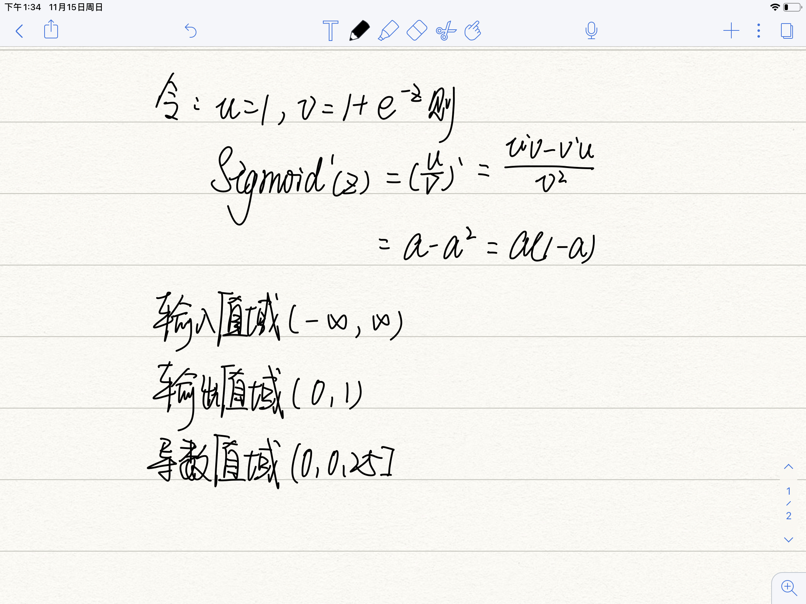

#### 优点

从函数图像来看，Sigmoid函数的作用是将输入压缩到 $(0,1)$ 这个区间范围内，这种输出在0~1之间的函数可以用来模拟一些概率分布的情况。它还是一个连续函数，导数简单易求。  

从数学上来看，Sigmoid函数对中央区的信号增益较大，对两侧区的信号增益小，在信号的特征空间映射上，有很好的效果。 

从神经科学上来看，中央区酷似神经元的兴奋态，两侧区酷似神经元的抑制态，因而在神经网络学习方面，可以将重点特征推向中央区，
将非重点特征推向两侧区。

#### 缺点

指数计算代价大。

反向传播时梯度消失：从梯度图像中可以看到，Sigmoid的梯度在两端都会接近于0，根据链式法则，如果传回的误差是$\delta$，那么梯度传递函数是$\delta \cdot a'$，而$a'$这时接近零，也就是说整体的梯度也接近零。这就出现梯度消失的问题，并且这个问题可能导致网络收敛速度比较慢。

### Tanh函数

$$Tanh(z) = \frac{e^{z} - e^{-z}}{e^{z} + e^{-z}} = (\frac{2}{1 + e^{-2z}}-1) \rightarrow a \tag{3}$$
即
$$Tanh(z) = 2 \cdot Sigmoid(2z) - 1 \tag{4}$$

#### 优点

具有Sigmoid的所有优点。

#### 缺点

exp指数计算代价大。梯度消失问题仍然存在。

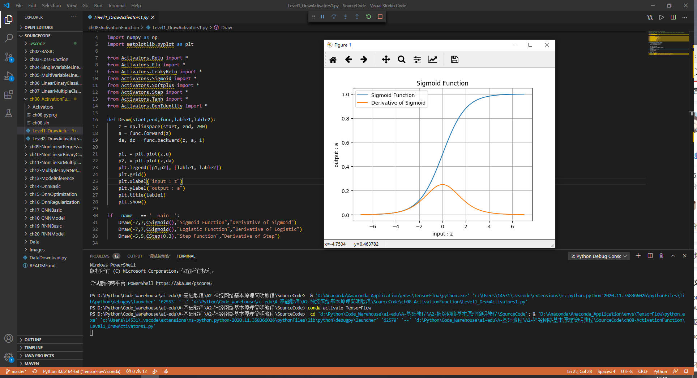


## 8.2 半线性激活函数

又可以叫非饱和型激活函数。

### 8.2.1 ReLU函数 

Rectified Linear Unit，修正线性单元，线性整流函数，斜坡函数。

#### 公式

$$ReLU(z) = max(0,z) = \begin{cases} 
  z, & z \geq 0 \\\\ 
  0, & z < 0 
\end{cases}$$

#### 导数

$$ReLU'(z) = \begin{cases} 1 & z \geq 0 \\\\ 0 & z < 0 \end{cases}$$

#### 值域

- 输入值域：$(-\infty, \infty)$
- 输出值域：$(0,\infty)$
- 导数值域：$\\{0,1\\}$


图8-6 线性整流函数ReLU

#### 优点

- 反向导数恒等于1，更加有效率的反向传播梯度值，收敛速度快；
- 避免梯度消失问题；
- 计算简单，速度快；
- 活跃度的分散性使得神经网络的整体计算成本下降。

#### 缺点

无界。

### Leaky ReLU函数

LReLU，带泄露的线性整流函数。

#### 公式

$$LReLU(z) = \begin{cases} z & z \geq 0 \\\\ \alpha \cdot z & z < 0 \end{cases}$$

#### 导数

$$LReLU'(z) = \begin{cases} 1 & z \geq 0 \\\\ \alpha & z < 0 \end{cases}$$

#### 值域

输入值域：$(-\infty, \infty)$

输出值域：$(-\infty,\infty)$

导数值域：$\\{\alpha,1\\}$

#### 优点

继承了ReLU函数的优点。

Leaky ReLU同样有收敛快速和运算复杂度低的优点，而且由于给了$z<0$时一个比较小的梯度$\alpha$,使得$z<0$时依旧可以进行梯度传递和更新，可以在一定程度上避免神经元“死”掉的问题。

### Softplus函数

#### 公式

$$Softplus(z) = \ln (1 + e^z)$$

#### 导数

$$Softplus'(z) = \frac{e^z}{1 + e^z}$$

#### 

输入值域：$(-\infty, \infty)$

输出值域：$(0,\infty)$

导数值域：$(0,1)$

### ELU函数

#### 公式

$$ELU(z) = \begin{cases} z & z \geq 0 \\ \alpha (e^z-1) & z < 0 \end{cases}$$

#### 导数

$$ELU'(z) = \begin{cases} 1 & z \geq 0 \\ \alpha e^z & z < 0 \end{cases}$$

#### 值域

输入值域：$(-\infty, \infty)$

输出值域：$(-\alpha,\infty)$

导数值域：$(0,1]$


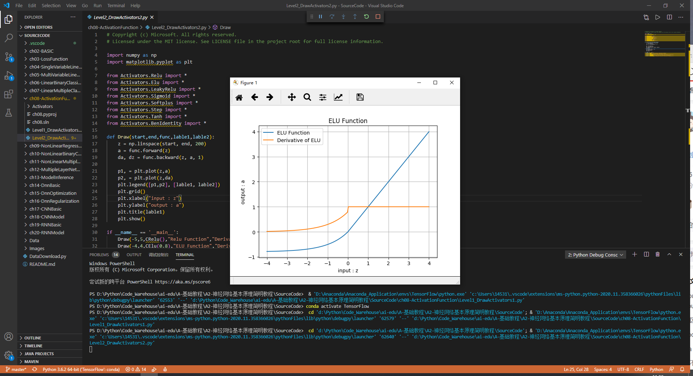
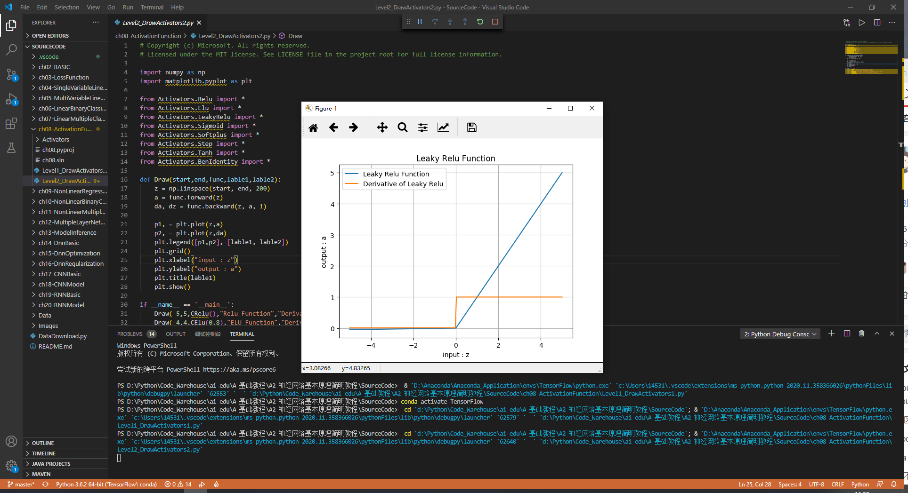


# 第9章 单入单出的双层神经网络 - 非线性回归

## 9.0 非线性回归问题

#### 9.0.3 回归模型的评估标准

回归问题主要是求值，评价标准主要是看求得值与实际结果的偏差有多大，所以，回归问题主要以下方法来评价模型。

#### 平均绝对误差

MAE（Mean Abolute Error）。

$$MAE=\frac{1}{m} \sum_{i=1}^m \lvert a_i-y_i \rvert \tag{1}$$

对异常值不如均方差敏感，类似中位数。

#### 绝对平均值率误差

MAPE（Mean Absolute Percentage Error）。

$$MAPE=\frac{100}{m} \sum^m_{i=1} \left\lvert {a_i - y_i \over y_i} \right\rvert \tag{2}$$

#### 和方差

SSE（Sum Squared Error）。

$$SSE=\sum_{i=1}^m (a_i-y_i)^2 \tag{3}$$

得出的值与样本数量有关系，假设有1000个测试样本，得到的值是120；如果只有100个测试样本，得到的值可能是11，我们不能说11就比120要好。

#### 均方差

MSE（Mean Squared Error）。

$$MSE = \frac{1}{m} \sum_{i=1}^m (a_i-y_i)^2 \tag{4}$$

就是实际值减去预测值的平方再求期望，没错，就是线性回归的代价函数。由于MSE计算的是误差的平方，所以它对异常值是非常敏感的，因为一旦出现异常值，MSE指标会变得非常大。MSE越小，证明误差越小。

#### 均方根误差

RMSE（Root Mean Squard Error）。

$$RMSE = \sqrt{\frac{1}{m} \sum_{i=1}^m (a_i-y_i)^2} \tag{5}$$

是均方差开根号的结果，其实质是一样的，只不过对结果有更好的解释。

例如：要做房价预测，每平方是万元，我们预测结果也是万元，那么MSE差值的平方单位应该是千万级别的。假设我们的模型预测结果与真实值相差1000元，则用MSE的计算结果是1000,000，这个值没有单位，如何描述这个差距？于是就求个平方根就好了，这样误差可以是标签值是同一个数量级的，在描述模型的时候就说，我们模型的误差是多少元。

#### R平方

R-Squared。

上面的几种衡量标准针对不同的模型会有不同的值。比如说预测房价，那么误差单位就是元，比如3000元、11000元等。如果预测身高就可能是0.1、0.2米之类的。也就是说，对于不同的场景，会有不同量纲，因而也会有不同的数值，无法用一句话说得很清楚，必须啰啰嗦嗦带一大堆条件才能表达完整。

我们通常用概率来表达一个准确率，比如89%的准确率。那么线性回归有没有这样的衡量标准呢？答案就是R-Squared。

$$R^2=1-\frac{\sum (a_i - y_i)^2}{\sum(\bar y_i-y_i)^2}=1-\frac{MSE(a,y)}{Var(y)} \tag{6}$$

R平方是多元回归中的回归平方和（分子）占总平方和（分母）的比例，它是度量多元回归方程中拟合程度的一个统计量。R平方值越接近1，表明回归平方和占总平方和的比例越大，回归线与各观测点越接近，回归的拟合程度就越好。

## 9.1 用多项式回归法拟合正弦曲线

多项式回归有几种形式：

#### 一元一次线性模型

因为只有一项，所以不能称为多项式了。它可以解决单变量的线性回归，我们在第4章学习过相关内容。其模型为：

$$z = x w + b \tag{1}$$

#### 多元一次多项式

多变量的线性回归，我们在第5章学习过相关内容。其模型为：

$$z = x_1 w_1 + x_2 w_2 + ...+ x_m w_m + b \tag{2}$$

这里的多变量，是指样本数据的特征值为多个，上式中的 $x_1,x_2,...,x_m$ 代表了m个特征值。

#### 多元多次多项式

多变量的非线性回归，其参数与特征组合繁复，但最终都可以归结为公式2和公式4的形式。

### 9.1.2 用二次多项式拟合

鉴于以上的认知，我们要考虑使用几次的多项式来拟合正弦曲线。在没有什么经验的情况下，可以先试一下二次多项式，即：

$$z = x w_1 + x^2 w_2 + b \tag{5}$$


## 9.2 用多项式回归法拟合复合函数曲线

### 9.2.1 用四次多项式拟合


## 9.3 验证与测试

### 9.3.1 基本概念

#### 训练集

Training Set，用于模型训练的数据样本。

#### 验证集

Validation Set，或者叫做Dev Set，是模型训练过程中单独留出的样本集，它可以用于调整模型的超参数和用于对模型的能力进行初步评估。
  
在神经网络中，验证数据集用于：

- 寻找最优的网络深度
- 或者决定反向传播算法的停止点
- 或者在神经网络中选择隐藏层神经元的数量
- 在普通的机器学习中常用的交叉验证（Cross Validation）就是把训练数据集本身再细分成不同的验证数据集去训练模型。

#### 测试集

Test Set，用来评估最终模型的泛化能力。但不能作为调参、选择特征等算法相关的选择的依据。

三者之间的关系如图9-5所示。


图9-5 训练集、验证集、测试集的关系


### 9.3.2 交叉验证

### 9.3.3 留出法 Hold out

使用交叉验证的方法虽然比较保险，但是非常耗时，尤其是在大数据量时，训练出一个模型都要很长时间，没有可能去训练出10个模型再去比较。

在深度学习中，有另外一种方法使用验证集，称为留出法。亦即从训练数据中保留出验证样本集，主要用于解决过拟合情况，这部分数据不用于训练。如果训练数据的准确度持续增长，但是验证数据的准确度保持不变或者反而下降，说明神经网络亦即过拟合了，此时需要停止训练，用测试集做最终测试。

## 9.4 双层神经网络实现非线性回归

### 9.4.1 万能近似定理

万能近似定理(universal approximation theorem) $^{[1]}$，是深度学习最根本的理论依据。它证明了在给定网络具有足够多的隐藏单元的条件下，配备一个线性输出层和一个带有任何“挤压”性质的激活函数（如Sigmoid激活函数）的隐藏层的前馈神经网络，能够以任何想要的误差量近似任何从一个有限维度的空间映射到另一个有限维度空间的Borel可测的函数。

前馈网络的导数也可以以任意好地程度近似函数的导数。

万能近似定理其实说明了理论上神经网络可以近似任何函数。但实践上我们不能保证学习算法一定能学习到目标函数。即使网络可以表示这个函数，学习也可能因为两个不同的原因而失败：

1. 用于训练的优化算法可能找不到用于期望函数的参数值；
2. 训练算法可能由于过拟合而选择了错误的函数。


## 9.5 曲线拟合

### 9.5.1 正弦曲线的拟合

#### 隐层只有一个神经元的情况

令`n_hidden=1`，并指定模型名称为`sin_111`，训练过程见图9-10。图9-11为拟合效果图。


图9-10 训练过程中损失函数值和准确率的变化


图9-11 一个神经元的拟合效果

### 9.5.2 复合函数的拟合

基本过程与正弦曲线相似，区别是这个例子要复杂不少，所以首先需要耐心，增大`max_epoch`的数值，多迭代几次。其次需要精心调参，找到最佳参数组合。

#### 隐层只有两个神经元的情况


图9-14 两个神经元的拟合效果


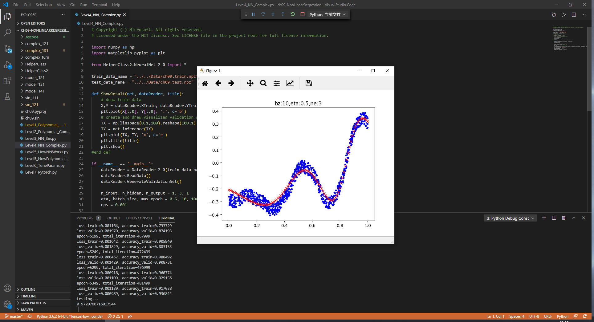

## 9.6 非线性回归的工作原理

### 9.6.1 多项式为何能拟合曲线

单层神经网络的多项式回归法，需要$x,x^2,x^3$三个特征值，组成如下公式来得到拟合结果：

$$
z = x \cdot w_1 + x^2 \cdot w_2 + x^3 \cdot w_3 + b \tag{1}
$$

我们可以回忆一下第5章学习的多变量线性回归问题，公式1实际上是把一维的x的特征信息，增加到了三维，然后再使用多变量线性回归来解决问题的。本来一维的特征只能得到线性的结果，但是三维的特征就可以得到非线性的结果，这就是多项式拟合的原理。

### 9.6.2 神经网络的非线性拟合工作原理

1. 隐层把x拆成不同的特征，根据问题复杂度决定神经元数量，神经元的数量相当于特征值的数量；
2. 隐层通过激活函数做一次非线性变换；
3. 输出层使用多变量线性回归，把隐层的输出当作输入特征值，再做一次线性变换，得出拟合结果。

与多项式回归不同的是，不需要指定变换参数，而是从训练中学习到参数，这样的话权重值不会大得离谱。


## 9.7 超参数优化的初步认识

超参数优化（Hyperparameter Optimization）主要存在两方面的困难：

1. 超参数优化是一个组合优化问题，无法像一般参数那样通过梯度下降方法来优化，也没有一种通用有效的优化方法。
2. 评估一组超参数配置（Configuration）的时间代价非常高，从而导致一些优化方法（比如演化算法）在超参数优化中难以应用。

对于超参数的设置，比较简单的方法有人工搜索、网格搜索和随机搜索。 

### 9.7.1 可调的参数

我们使用表9-21所示的参数做第一次的训练。

表9-21 参数配置

|参数|缺省值|是否可调|注释|
|---|---|---|---|
|输入层神经元数|1|No|
|隐层神经元数|4|Yes|影响迭代次数|
|输出层神经元数|1|No|
|学习率|0.1|Yes|影响迭代次数|
|批样本量|10|Yes|影响迭代次数|
|最大epoch|10000|Yes|影响终止条件,建议不改动|
|损失门限值|0.001|Yes|影响终止条件,建议不改动|
|损失函数|MSE|No|
|权重矩阵初始化方法|Xavier|Yes|参看15.1|

表9-21中的参数，最终可以调节的其实只有三个：

- 隐层神经元数
- 学习率
- 批样本量

#### 避免权重矩阵初始化的影响

权重矩阵中的参数，是神经网络要学习的参数，所以不能称作超参数。

权重矩阵初始化是神经网络训练非常重要的环节之一，不同的初始化方法，甚至是相同的方法但不同的随机值，都会给结果带来或多或少的影响。

在后面的几组比较中，都是用Xavier方法初始化的。在两次参数完全相同的试验中，即使两次都使用Xavier初始化，因为权重矩阵参数的差异，也会得到不同的结果。为了避免这个随机性，我们在代码`WeightsBias.py`中使用了一个小技巧，调用下面这个函数：

### 9.7.2 手动调整参数

手动调整超参数，我们必须了解超参数、训练误差、泛化误差和计算资源（内存和运行时间）之间的关系。手动调整超参数的主要目标是调整模型的有效容量以匹配任务的复杂性。有效容量受限于3个因素：

- 模型的表示容量；
- 学习算法与代价函数的匹配程度；
- 代价函数和训练过程正则化模型的程度。

表9-22比较了几个超参数的作用。具有更多网络层、每层有更多隐藏单元的模型具有较高的表示能力，能够表示更复杂的函数。学习率是最重要的超参数。如果你只有一个超参数调整的机会，那就调整学习率。

表9-22 各种超参数的作用

|超参数|目标|作用|副作用|
|---|---|---|---|
|学习率|调至最优|低的学习率会导致收敛慢，高的学习率会导致错失最佳解|容易忽略其它参数的调整|
|隐层神经元数量|增加|增加数量会增加模型的表示能力|参数增多、训练时间增长|
|批大小|有限范围内尽量大|大批量的数据可以保持训练平稳，缩短训练时间|可能会收敛速度慢|

通常的做法是，按经验设置好隐层神经元数量和批大小，并使之相对固定，然后调整学习率。

#### 学习率的调整

我们固定其它参数，即隐层神经元`ne=4`、`batch_size=10`不变，改变学习率，来试验网络训练情况。为了节省时间，不做无限轮次的训练，而是设置`eps=0.001`为最低精度要求，一旦到达，就停止训练。

#### 批大小的调整

我们固定其它参数，即隐层神经元`ne=4`、`eta=0.5`不变，调整批大小，来试验网络训练情况，设置`eps=0.001`为精度要求。

表9-25和图9-24展示了四种批大小值的不同结果。

表9-25 四种批大小数值的比较

|批大小|迭代次数|说明|
|----|----|----|
|5|2500|批数据量小到1，收敛最快|
|10|8200|批数据量增大，收敛变慢|
|15|10000|批数据量进一步增大，收敛变慢|
|20|10000|批数据量太大，反而会降低收敛速度|

#### 隐层神经元数量的调整

我们固定其它参数，即`batch_size=10`、`eta=0.5`不变，调整隐层神经元的数量，来试验网络训练情况，设置`eps=0.001`为精度要求。

表9-26和图9-25展示了四种神经元数值的不同结果。

表9-26 四种隐层神经元数量值的比较

|隐层神经元数量|迭代次数|说明|
|---|---|---|
|2|10000|神经元数量少，拟合能力低|
|4|8000|神经元数量增加会有帮助|
|6|5500|神经元数量进一步增加，收敛更快|
|8|3500|再多一些神经元，还会继续提供收敛速度|


# 第五步  非线性分类

# 第10章 多入单出的双层神经网络 - 非线性二分类

## 10.0 非线性二分类问题

### 10.0.3 二分类模型的评估标准

#### 准确率 Accuracy

也可以称之为精度，我们在本书中混用这两个词。

对于二分类问题，假设测试集上一共1000个样本，其中550个正例，450个负例。测试一个模型时，得到的结果是：521个正例样本被判断为正类，435个负例样本被判断为负类，则正确率计算如下：

$$Accuracy=(521+435)/1000=0.956$$

即正确率为95.6%。这种方式对多分类也是有效的，即三类中判别正确的样本数除以总样本数，即为准确率。

但是这种计算方法丢失了很多细节，比如：是正类判断的精度高还是负类判断的精度高呢？因此，我们还有如下一种评估标准。

#### 混淆矩阵

还是用上面的例子，如果具体深入到每个类别上，会分成4部分来评估：

- 正例中被判断为正类的样本数（TP-True Positive）：521
- 正例中被判断为负类的样本数（FN-False Negative）：550-521=29
- 负例中被判断为负类的样本数（TN-True Negative）：435
- 负例中被判断为正类的样本数（FP-False Positive）：450-435=15

从混淆矩阵中可以得出以下统计指标：

- 准确率 Accuracy

$$
\begin{aligned}
Accuracy &= \frac{TP+TN}{TP+TN+FP+FN} \\\\
&=\frac{521+435}{521+29+435+15}=0.956
\end{aligned}
$$

这个指标就是上面提到的准确率，越大越好。

- 精确率/查准率 Precision

分子为被判断为正类并且真的是正类的样本数，分母是被判断为正类的样本数。越大越好。

$$
Precision=\frac{TP}{TP+FP}=\frac{521}{521+15}=0.972
$$

- 召回率/查全率 Recall

$$
Recall = \frac{TP}{TP+FN}=\frac{521}{521+29}=0.947
$$

分子为被判断为正类并且真的是正类的样本数，分母是真的正类的样本数。越大越好。

- TPR - True Positive Rate 真正例率

$$
TPR = \frac{TP}{TP + FN}=Recall=0.947
$$

- FPR - False Positive Rate 假正例率

$$
FPR = \frac{FP}{FP+TN}=\frac{15}{15+435}=0.033
$$

分子为被判断为正类的负例样本数，分母为所有负类样本数。越小越好。

- 调和平均值 F1

$$
\begin{aligned}
F1&=\frac{2 \times Precision \times Recall}{recision+Recall}\\\\
&=\frac{2 \times 0.972 \times 0.947}{0.972+0.947}=0.959
\end{aligned}
$$

该值越大越好。

- ROC曲线与AUC

ROC，Receiver Operating Characteristic，接收者操作特征，又称为感受曲线（Sensitivity Curve），是反映敏感性和特异性连续变量的综合指标，曲线上各点反映着相同的感受性，它们都是对同一信号刺激的感受性。
ROC曲线的横坐标是FPR，纵坐标是TPR。

AUC，Area Under Roc，即ROC曲线下面的面积。

在二分类器中，如果使用Logistic函数作为分类函数，可以设置一系列不同的阈值，比如[0.1,0.2,0.3...0.9]，把测试样本输入，从而得到一系列的TP、FP、TN、FN，然后就可以绘制如下曲线，如图10-4。


图10-4 ROC曲线图

图中红色的曲线就是ROC曲线，曲线下的面积就是AUC值，取值区间为$[0.5,1.0]$，面积越大越好。

- ROC曲线越靠近左上角，该分类器的性能越好。
- 对角线表示一个随机猜测分类器。
- 若一个学习器的ROC曲线被另一个学习器的曲线完全包住，则可判断后者性能优于前者。
- 若两个学习器的ROC曲线没有包含关系，则可以判断ROC曲线下的面积，即AUC，谁大谁好。

当然在实际应用中，取决于阈值的采样间隔，红色曲线不会这么平滑，由于采样间隔会导致该曲线呈阶梯状。

既然已经这么多标准，为什么还要使用ROC和AUC呢？因为ROC曲线有个很好的特性：当测试集中的正负样本的分布变换的时候，ROC曲线能够保持不变。在实际的数据集中经常会出现样本类不平衡，即正负样本比例差距较大，而且测试数据中的正负样本也可能随着时间变化。

#### Kappa statics 

Kappa值，即内部一致性系数(inter-rater,coefficient of internal consistency)，是作为评价判断的一致性程度的重要指标。取值在0～1之间。

## 10.1 为什么必须用双层神经网络

## 10.1.3 非线性的可能性

我们前边学习过如何实现与、与非、或、或非，我们看看如何用已有的逻辑搭建异或门，如图10-5所示。


图10-5 用基本逻辑单元搭建异或运算单元

表10-6 组合运算的过程

|样本与计算|1|2|3|4|
|----|----|----|----|----|
|$x_1$|0|0|1|1|
|$x_2$|0|1|0|1|#
|$s_1=x_1$ NAND $x_2$|1|1|1|0|
|$s_2=x_1$ OR $x_2$|0|1|1|1|
|$y=s_1$ AND $s_2$|0|1|1|0|

经过表10-6所示的组合运算后，可以看到$y$的输出与$x_1,x_2$的输入相比，就是异或逻辑了。所以，实践证明两层逻辑电路可以解决问题。另外，我们在地四步中学习了非线性回归，使用双层神经网络可以完成一些神奇的事情，比如复杂曲线的拟合，只需要6、7个参数就搞定了。我们可以模拟这个思路，用两层神经网络搭建模型，来解决非线性分类问题。

## 10.2 非线性二分类实现

### 10.2.1 定义神经网络结构

首先定义可以完成非线性二分类的神经网络结构图，如图10-6所示。


图10-6 非线性二分类神经网络结构图

对于一般的用于二分类的双层神经网络可以是图10-7的样子。


图10-7 通用的二分类神经网络结构图

输入特征值可以有很多，隐层单元也可以有很多，输出单元只有一个，且后面要接Logistic分类函数和二分类交叉熵损失函数。

### 10.2.2 前向计算

根据网络结构，我们有了前向计算过程图10-8。


图10-8 前向计算过程

### 10.2.3 反向传播

图10-9展示了反向传播的过程。


图10-9 反向传播过程

## 10.3 实现逻辑异或门


## 10.4 逻辑异或门的工作原理

### 10.4.2 更直观的可视化结果

#### 3D图

神经网络真的可以同时画两条分割线吗？这颠覆了笔者的认知，因为笔者一直认为最后一层的神经网络只是一个线性单元，它能做的事情有限，所以它的行为就是线性的行为，画一条线做拟合或分割，......，稍等，为什么只能是一条线呢？难道不可以是一个平面吗？

这让笔者想起了在第5章里，曾经用一个平面拟合了空间中的样本点，如表10-10所示。

表10-10 平面拟合的可视化结果

|正向|侧向|
|---|---|
|||

### 10.4.4 隐层神经元数量的影响

一般来说，隐层的神经元数量要大于等于输入特征的数量，在本例中特征值数量是2。出于研究目的，笔者使用了6种数量的神经元配置来试验神经网络的工作情况，请看表10-14中的比较图。

表10-14 隐层神经元数量对分类结果的影响

|||
|---|---|
|||
|1个神经元，无法完成分类任务|2个神经元，迭代6200次到达精度要求|
|||
|3个神经元，迭代4900次到达精度要求|4个神经元，迭代4300次到达精度要求|
|||
|8个神经元，迭代4400次到达精度要求|16个神经元，迭代4500次到达精度要求|

以上各情况的迭代次数是在Xavier初始化的情况下测试一次得到的数值，并不意味着神经元越多越好，合适的数量才好。总结如下：

- 2个神经元肯定是足够的；
- 4个神经元肯定要轻松一些，用的迭代次数最少。
- 而更多的神经元也并不是更轻松，比如8个神经元，杀鸡用了宰牛刀，由于功能过于强大，出现了曲线的分类边界；
- 而16个神经元更是事倍功半地把4个样本分到了4个区域上，当然这也给了我们一些暗示：神经网络可以做更强大的事情！
- 表中图3的分隔带角度与前面几张图相反，但是红色样本点仍处于蓝色区，蓝色样本点仍处于红色区，这个性质没有变。这只是初始化参数不同造成的神经网络的多个解，与神经元数量无关。


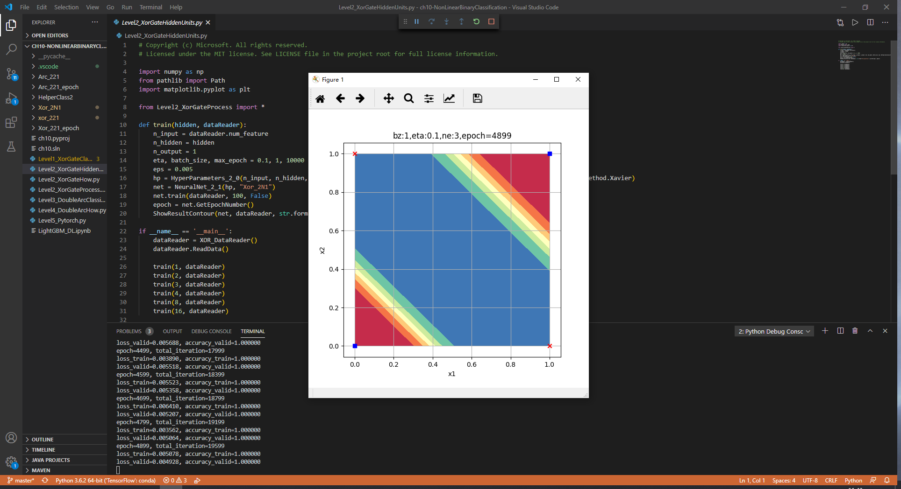
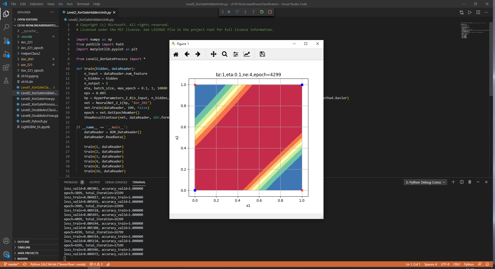

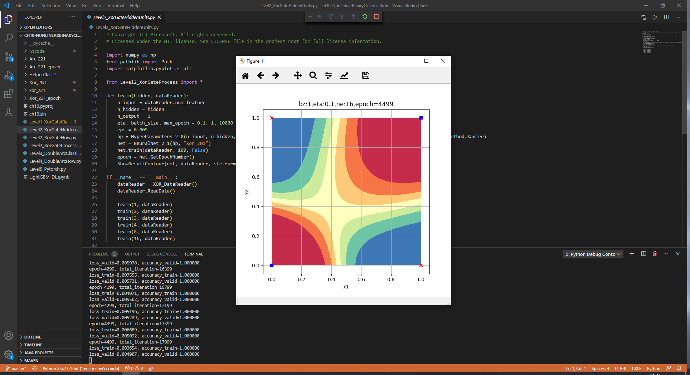


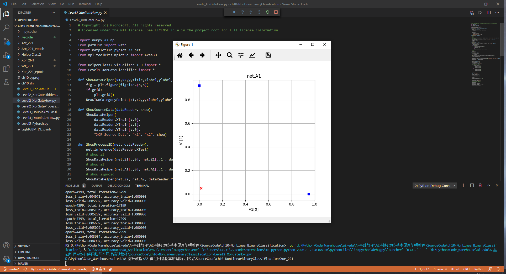
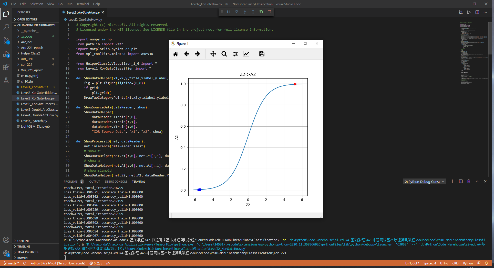

## 10.5 实现双弧形二分类


# 第11章 多入多出的双层神经网络 - 非线性多分类

## 11.0 非线性多分类问题

### 11.1.1 定义神经网络结构
### 11.1.2 前向计算
### 11.1.3 反向传播


## 11.2 非线性多分类的工作原理
### 11.2.1 隐层神经元数量的影响

下面列出了隐层神经元为2、4、8、16、32、64的情况，设定好最大epoch数为10000，以比较它们各自能达到的最大精度值的区别。每个配置只测试一轮，所以测出来的数据有一定的随机性。

表11-3展示了隐层神经元数与分类结果的关系。

表11-3 神经元数与网络能力及分类结果的关系

|神经元数|损失函数|分类结果|
|---|---|---|
|2|||
||测试集准确度0.618，耗时49秒，损失函数值0.795。类似这种曲线的情况，损失函数值降不下去，准确度值升不上去，主要原因是网络能力不够。|没有完成分类任务|
|4|||
||测试准确度0.954，耗时51秒，损失函数值0.132。虽然可以基本完成分类任务，网络能力仍然不够。|基本完成，但是边缘不够清晰|
|8|||
||测试准确度0.97，耗时52秒，损失函数值0.105。可以先试试在后期衰减学习率，如果再训练5000轮没有改善的话，可以考虑增加网络能力。|基本完成，但是边缘不够清晰|
|16|||
||测试准确度0.978，耗时53秒，损失函数值0.094。同上，可以同时试着使用优化算法，看看是否能收敛更快。|较好地完成了分类任务|
|32|||
||测试准确度0.974，耗时53秒，损失函数值0.085。网络能力够了，从损失值下降趋势和准确度值上升趋势来看，可能需要更多的迭代次数。|较好地完成了分类任务|
|64|||
||测试准确度0.972，耗时64秒，损失函数值0.075。网络能力足够。|较好地完成了分类任务|

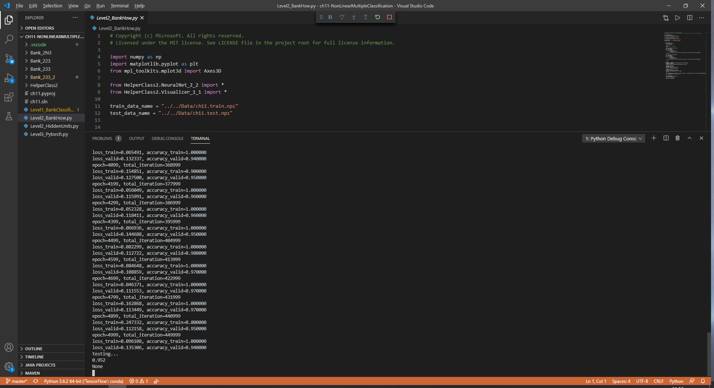


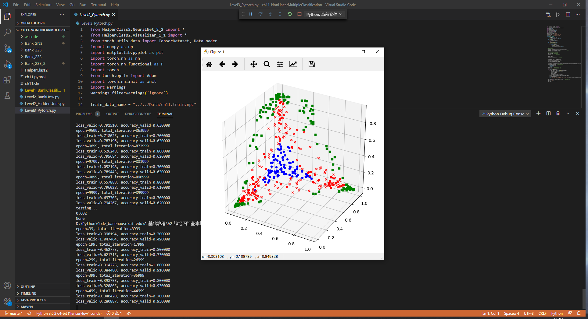

## 11.3 分类样本不平衡问题
#### 平衡数据集

有一句话叫做“更多的数据往往战胜更好的算法”。所以一定要先想办法扩充样本数量少的类别的数据，比如目前的正负类样本数量是1000:100，则可以再搜集2000个数据，最后得到了2800:300的比例，此时可以从正类样本中丢弃一些，变成500:300，就可以训练了。

一些经验法则：

- 考虑对大类下的样本（超过1万、十万甚至更多）进行欠采样，即删除部分样本；
- 考虑对小类下的样本（不足1万甚至更少）进行过采样，即添加部分样本的副本；
- 考虑尝试随机采样与非随机采样两种采样方法；
- 考虑对各类别尝试不同的采样比例，比一定是1:1，有时候1:1反而不好，因为与现实情况相差甚远；
- 考虑同时使用过采样（over-sampling）与欠采样（under-sampling）。

#### 尝试其它评价指标 

从前面的分析可以看出，准确度这个评价指标在类别不均衡的分类任务中并不能work，甚至进行误导（分类器不work，但是从这个指标来看，该分类器有着很好的评价指标得分）。因此在类别不均衡分类任务中，需要使用更有说服力的评价指标来对分类器进行评价。如何对不同的问题选择有效的评价指标参见这里。 

常规的分类评价指标可能会失效，比如将所有的样本都分类成大类，那么准确率、精确率等都会很高。这种情况下，AUC是最好的评价指标。

#### 尝试产生人工数据样本 

一种简单的人工样本数据产生的方法便是，对该类下的所有样本每个属性特征的取值空间中随机选取一个组成新的样本，即属性值随机采样。你可以使用基于经验对属性值进行随机采样而构造新的人工样本，或者使用类似朴素贝叶斯方法假设各属性之间互相独立进行采样，这样便可得到更多的数据，但是无法保证属性之前的线性关系（如果本身是存在的）。 

有一个系统的构造人工数据样本的方法SMOTE(Synthetic Minority Over-sampling Technique)。SMOTE是一种过采样算法，它构造新的小类样本而不是产生小类中已有的样本的副本，即该算法构造的数据是新样本，原数据集中不存在的。该基于距离度量选择小类别下两个或者更多的相似样本，然后选择其中一个样本，并随机选择一定数量的邻居样本对选择的那个样本的一个属性增加噪声，每次处理一个属性。这样就构造了更多的新生数据。具体可以参见原始论文。 

使用命令：

```
pip install imblearn
```
可以安装SMOTE算法包，用于实现样本平衡。

#### 尝试一个新的角度理解问题 

我们可以从不同于分类的角度去解决数据不均衡性问题，我们可以把那些小类的样本作为异常点(outliers)，因此该问题便转化为异常点检测(anomaly detection)与变化趋势检测问题(change detection)。 

异常点检测即是对那些罕见事件进行识别。如通过机器的部件的振动识别机器故障，又如通过系统调用序列识别恶意程序。这些事件相对于正常情况是很少见的。 

变化趋势检测类似于异常点检测，不同在于其通过检测不寻常的变化趋势来识别。如通过观察用户模式或银行交易来检测用户行为的不寻常改变。 

将小类样本作为异常点这种思维的转变，可以帮助考虑新的方法去分离或分类样本。这两种方法从不同的角度去思考，让你尝试新的方法去解决问题。

#### 修改现有算法

- 设超大类中样本的个数是极小类中样本个数的L倍，那么在随机梯度下降（SGD，stochastic gradient descent）算法中，每次遇到一个极小类中样本进行训练时，训练L次。
- 将大类中样本划分到L个聚类中，然后训练L个分类器，每个分类器使用大类中的一个簇与所有的小类样本进行训练得到。最后对这L个分类器采取少数服从多数对未知类别数据进行分类，如果是连续值（预测），那么采用平均值。
- 设小类中有N个样本。将大类聚类成N个簇，然后使用每个簇的中心组成大类中的N个样本，加上小类中所有的样本进行训练。

无论你使用前面的何种方法，都对某个或某些类进行了损害。为了不进行损害，那么可以使用全部的训练集采用多种分类方法分别建立分类器而得到多个分类器，采用投票的方式对未知类别的数据进行分类，如果是连续值（预测），那么采用平均值。
在最近的ICML论文中，表明增加数据量使得已知分布的训练集的误差增加了，即破坏了原有训练集的分布，从而可以提高分类器的性能。这篇论文与类别不平衡问题不相关，因为它隐式地使用数学方式增加数据而使得数据集大小不变。但是，我认为破坏原有的分布是有益的。

#### 集成学习

一个很好的方法去处理非平衡数据问题，并且在理论上证明了。这个方法便是由Robert E. Schapire于1990年在Machine Learning提出的”The strength of weak learnability” ，该方法是一个boosting算法，它递归地训练三个弱学习器，然后将这三个弱学习器结合起形成一个强的学习器。我们可以使用这个算法的第一步去解决数据不平衡问题。 

1. 首先使用原始数据集训练第一个学习器L1；
2. 然后使用50%在L1学习正确和50%学习错误的那些样本训练得到学习器L2，即从L1中学习错误的样本集与学习正确的样本集中，循环一边采样一个；
3. 接着，使用L1与L2不一致的那些样本去训练得到学习器L3；
4. 最后，使用投票方式作为最后输出。 

那么如何使用该算法来解决类别不平衡问题呢？ 

假设是一个二分类问题，大部分的样本都是true类。让L1输出始终为true。使用50%在L1分类正确的与50%分类错误的样本训练得到L2，即从L1中学习错误的样本集与学习正确的样本集中，循环一边采样一个。因此，L2的训练样本是平衡的。L使用L1与L2分类不一致的那些样本训练得到L3，即在L2中分类为false的那些样本。最后，结合这三个分类器，采用投票的方式来决定分类结果，因此只有当L2与L3都分类为false时，最终结果才为false，否则true。 

# 第12章 多入多出的三层神经网络 - 深度非线性多分类

## 12.0 多变量非线性多分类

## 12.1 三层神经网络的实现

### 12.1.1 定义神经网络

为了完成MNIST分类，我们需要设计一个三层神经网络结构，如图12-2所示。


图12-2 三层神经网络结构
### 12.1.2 前向计算

我们都是用大写符号的矩阵形式的公式来描述，在每个矩阵符号的右上角是其形状。
### 12.1.3 反向传播

和以前的两层网络没有多大区别，只不过多了一层，而且用了tanh激活函数，目的是想把更多的梯度值回传，因为tanh函数比sigmoid函数稍微好一些，比如原点对称，零点梯度值大。

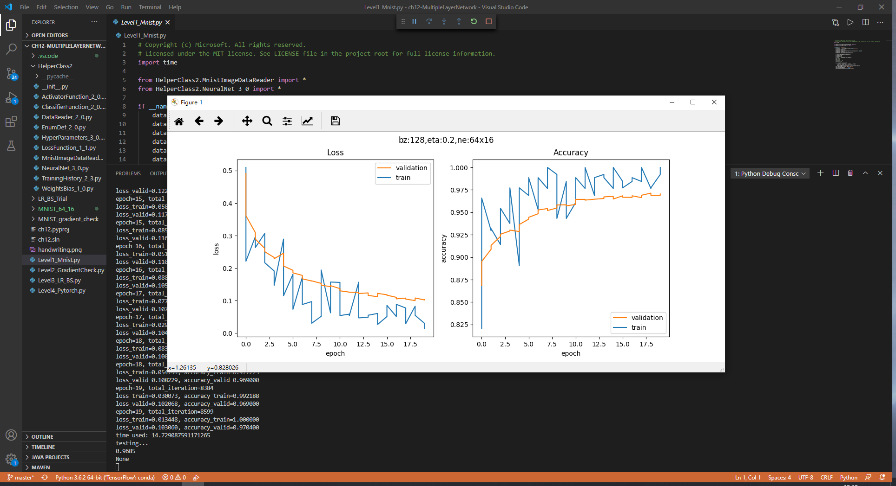
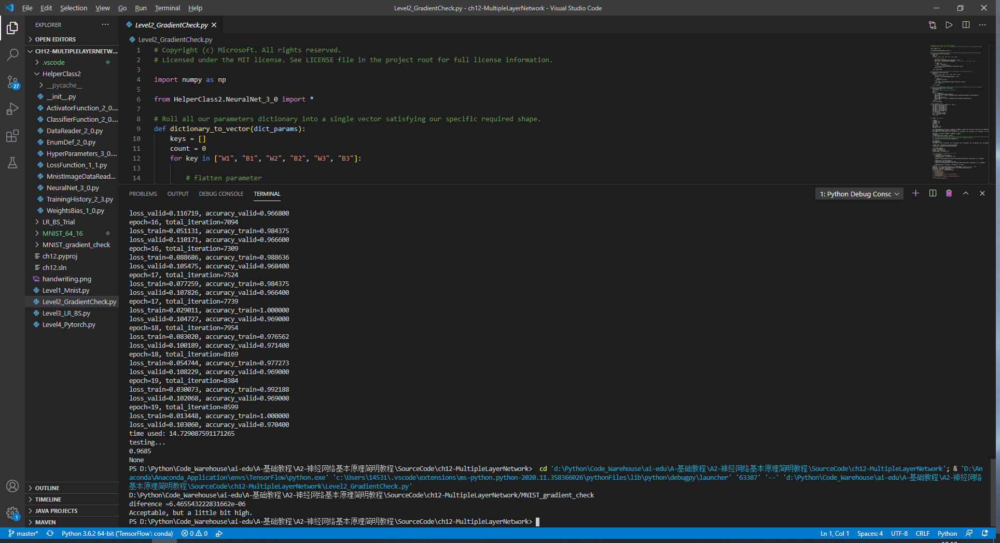

## 12.2 梯度检查

### 12.2.2 数值微分

#### 导数概念回忆

$$
f'(x)=\lim_{h \to 0} \frac{f(x+h)-f(x)}{h} \tag{1}
$$

其含义就是$x$的微小变化$h$（$h$为无限小的值），会导致函数$f(x)$的值有多大变化。在`Python`中可以这样实现：

```Python
def numerical_diff(f, x):
    h = 1e-5
    d = (f(x+h) - f(x))/h
    return d
```

因为计算机的舍入误差的原因，`h`不能太小，比如`1e-10`，会造成计算结果上的误差，所以我们一般用`[1e-4,1e-7]`之间的数值。

但是如果使用上述方法会有一个问题，如图12-4所示。


图12-4 数值微分方法

#### 泰勒公式

泰勒公式是将一个在$x=x_0$处具有n阶导数的函数$f(x)$利用关于$(x-x_0)$的n次多项式来逼近函数的方法。若函数$f(x)$在包含$x_0$的某个闭区间$[a,b]$上具有n阶导数，且在开区间$(a,b)$上具有$n+1$阶导数，则对闭区间$[a,b]$上任意一点$x$，下式成立：

$$f(x)=\frac{f(x_0)}{0!} + \frac{f'(x_0)}{1!}(x-x_0)+\frac{f''(x_0)}{2!}(x-x_0)^2 + ...+\frac{f^{(n)}(x_0)}{n!}(x-x_0)^n+R_n(x) \tag{3}$$

其中,$f^{(n)}(x)$表示$f(x)$的$n$阶导数，等号后的多项式称为函数$f(x)$在$x_0$处的泰勒展开式，剩余的$R_n(x)$是泰勒公式的余项，是$(x-x_0)^n$的高阶无穷小。 

### 12.2.4 算法实现

在神经网络中，我们假设使用多分类的交叉熵函数，则其形式为：

$$J(w,b) =- \sum_{i=1}^m \sum_{j=1}^n y_{ij} \ln a_{ij}$$

m是样本数，n是分类数。

## 12.3 学习率与批大小

普通梯度下降法，包含三种形式：

1. 单样本
2. 全批量样本
3. 小批量样本

我们前面一直使用固定的学习率，比如0.1或者0.05，而没有采用0.5、0.8这样高的学习率。这是因为在接近极小点时，损失函数的梯度也会变小，使用小的学习率时，不会担心步子太大越过极小点。

保证SGD收敛的充分条件是：

$$\sum_{k=1}^\infty \eta_k = \infty \tag{2}$$

且： 

$$\sum_{k=1}^\infty \eta^2_k < \infty \tag{3}$$ 

图12-5是不同的学习率的选择对训练结果的影响。


图12-5 学习率对训练的影响

- 黄色：学习率太大，loss值增高，网络发散
- 红色：学习率可以使网络收敛，但值较大，开始时loss值下降很快，但到达极值点附近时，在最优解附近来回跳跃
- 绿色：正确的学习率设置
- 蓝色：学习率值太小，loss值下降速度慢，训练次数长，收敛慢

有一种方式可以帮助我们快速找到合适的初始学习率。

Leslie N. Smith 在2015年的一篇论文[Cyclical Learning Rates for Training Neural Networks](https://arxiv.org/abs/1506.01186)中的描述了一个非常棒的方法来找初始学习率。

这个方法在论文中是用来估计网络允许的最小学习率和最大学习率，我们也可以用来找我们的最优初始学习率，方法非常简单：

1. 首先我们设置一个非常小的初始学习率，比如`1e-5`；
2. 然后在每个`batch`之后都更新网络，计算损失函数值，同时增加学习率；
3. 最后我们可以描绘出学习率的变化曲线和loss的变化曲线，从中就能够发现最好的学习率。

表12-2就是随着迭代次数的增加，学习率不断增加的曲线，以及不同的学习率对应的loss的曲线（理想中的曲线）。

表12-2 试验最佳学习率

|随着迭代次数增加学习率|观察Loss值与学习率的关系|
|---|---|
|||

从表12-2的右图可以看到，学习率在0.3左右表现最好，再大就有可能发散了。我们把这个方法用于到我们的代码中试一下是否有效。

首先，设计一个数据结构，做出表12-3。

表12-3 学习率与迭代次数试验设计

|学习率段|0.0001~0.0009|0.001~0.009|0.01~0.09|0.1~0.9|1.0~1.1|
|----|----|----|----|---|---|
|步长|0.0001|0.001|0.01|0.1|0.01|
|迭代|10|10|10|10|10|

对于每个学习率段，在每个点上迭代10次，然后：

$$当前学习率+步长 \rightarrow 下一个学习率$$

以第一段为例，会在0.1迭代100次，在0.2上迭代100次，......，在0.9上迭代100次。步长和迭代次数可以分段设置，得到图12-6。


图12-6 第一轮的学习率测试

横坐标用了`np.log10()`函数来显示对数值，所以横坐标与学习率的对应关系如表12-4所示。

表12-4 横坐标与学习率的对应关系

|横坐标|-1.0|-0.8|-0.6|-0.4|-0.2|0.0|
|--|--|--|--|--|--|--|
|学习率|0.1|0.16|0.25|0.4|0.62|1.0|

前面一大段都是在下降，说明学习率为0.1、0.16、0.25、0.4时都太小了，那我们就继续探查-0.4后的段，得到第二轮测试结果如图12-7。


图12-7 第二轮的学习率测试

到-0.13时（对应学习率0.74）开始，损失值上升，所以合理的初始学习率应该是0.7左右，于是我们再次把范围缩小的0.6，0.7，0.8去做试验，得到第三轮测试结果，如图12-8。


图12-8 第三轮的学习率测试

最后得到的最佳初始学习率是0.8左右。由于loss值是渐渐从下降变为上升的，前面有一个积累的过程，如果想避免由于前几轮迭代带来的影响，可以使用比0.8小一些的数值，比如0.75作为初始学习率。

### 12.3.3 学习率的后期修正

用12.1的MNIST的例子，固定批大小为128时，我们分别使用学习率为0.2，0.3，0.5，0.8来比较一下学习曲线。


图12-9 不同学习率对应的迭代次数与准确度值的

学习率为0.5时效果最好，虽然0.8的学习率开始时上升得很快，但是到了10个`epoch`时，0.5的曲线就超上来了，最后稳定在0.8的曲线之上。

这就给了我们一个提示：可以在开始时，把学习率设置大一些，让准确率快速上升，损失值快速下降；到了一定阶段后，可以换用小一些的学习率继续训练。用公式表示：

$$
LR_{new}=LR_{current} * DecayRate^{GlobalStep/DecaySteps} \tag{4}
$$

举例来说：

- 当前的LR = 0.1
- DecayRate = 0.9
- DecaySteps = 50

公式变为：

$$lr = 0.1 * 0.9^{GlobalSteps/50}$$

意思是初始学习率为0.1，每训练50轮计算一次新的$lr$，是当前的$0.9^n$倍，其中$n$是正整数，因为一般用$GlobalSteps/50$的结果取整，所以$n=1,2,3,\ldots$


图12-10 阶梯状学习率下降法

如果计算一下每50轮的衰减的具体数值，见表12-5。

表12-5 学习率衰减值计算

|迭代|0|50|100|150|200|250|300|...|
|---|---|---|---|---|---|---|---|---|
|学习率|0.1|0.09|0.081|0.073|0.065|0.059|0.053|...|

这样的话，在开始时可以快速收敛，到后来变得很谨慎，小心翼翼地向极值点逼近，避免由于步子过大而跳过去。

上面描述的算法叫做step算法，还有一些其他的算法如下。


图12-11 其他各种学习率下降算法

#### fixed

使用固定的学习率，比如全程都用0.1。要注意的是，这个值不能大，否则在后期接近极值点时不易收敛。

#### step

每迭代一个预订的次数后（比如500步），就调低一次学习率。离散型，简单实用。

#### multistep

预设几个迭代次数，到达后调低学习率。与step不同的是，这里的次数可以是不均匀的，比如3000、5500、8000。离散型，简单实用。

#### exp

连续的指数变化的学习率，公式为：

$$lr_{new}=lr_{base} * \gamma^{iteration} \tag{5}$$

由于一般的iteration都很大（训练需要很多次迭代），所以学习率衰减得很快。$\gamma$可以取值0.9、0.99等接近于1的数值，数值越大，学习率的衰减越慢。

#### inv

倒数型变化，公式为：

$$lr_{new}=lr_{base} * \frac{1}{( 1 + \gamma * iteration)^{p}} \tag{6}$$

$\gamma$控制下降速率，取值越大下降速率越快；$p$控制最小极限值，取值越大时最小值越小，可以用0.5来做缺省值。

#### poly

多项式衰减，公式为：

$$lr_{new}=lr_{base} * (1 - {iteration \over iteration_{max}})^p \tag{7}$$

$p=1$时，为线性下降；$p>1$时，下降趋势向上突起；$p<1$时，下降趋势向下凹陷。$p$可以设置为0.9。

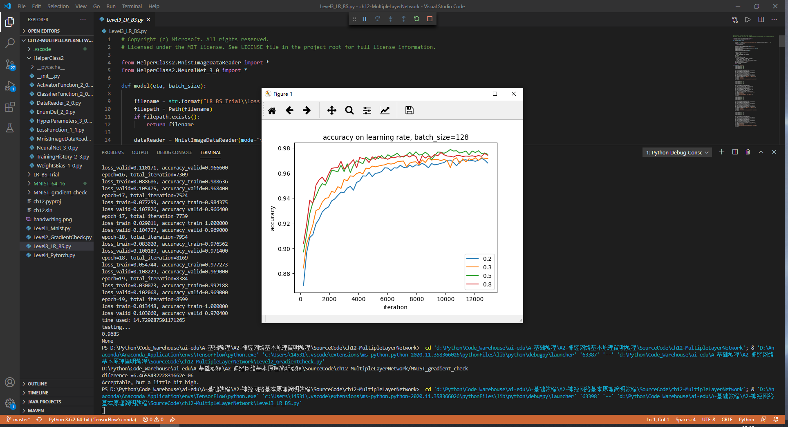

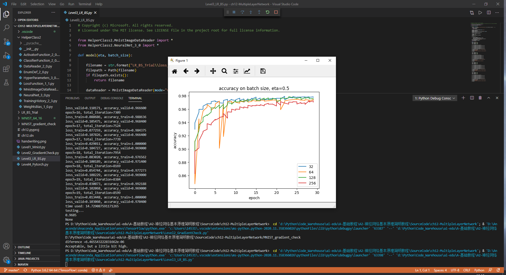


