# $Step4$ & $Step5$ 学习笔记 #
# $Step4$ 非线性回归#
## 非线性回归 ##
### 8.0 激活函数 ###
**激活函数的基本作用**
设某神经元有三个输入，分别为$x_1,x_2,x_3$，则有数学模型：

$$z=x_1 w_1 + x_2 w_2 + x_3 w_3 +b $$
$$a = \sigma(z) $$

                图8.0.1 激活函数在三输入神经元中的位置

激活函数 $a=\sigma(z)$ 作用：
1. 给神经网络增加非线性因素；
2. 把计算结果压缩到 $[0,1]$ 之间，便于后面的计算。

**激活函数的基本性质**
+ 非线性：线性的激活函数和没有激活函数一样；
+ 可导性：做误差反向传播和梯度下降，必须要保证激活函数的可导性；
+ 单调性：单一的输入会得到单一的输出，较大值的输入得到较大值的输出。

**激活函数的用处与功能**
激活函数用在神经网络的层与层之间的连接，神经网络的最后一层不用激活函数。
神经网络不管有多少层，最后的输出层决定了这个神经网络能干什么。

                表8.0.1 单层的神经网络的参数与功能

|网络|输入|输出|激活函数|分类函数|功能|
|---|---|---|---|---|---|
|单层|单变量|单输出|无|无|线性回归|
|单层|多变量|单输出|无|无|线性回归|
|单层|多变量|单输出|无|二分类函数|二分类|
|单层|多变量|多输出|无|多分类函数|多分类|

由表可得：
1. 神经网络最后一层不需要激活函数
2. 激活函数只用于连接前后两层神经网络

## 8.1 挤压型激活函数 ##
**函数定义/特点**
当输入值域的绝对值较大的时候，其输出在两端是饱和的，都具有S形的函数曲线以及压缩输入值域的作用；故成为挤压型激活函数，又可称为饱和型激活函数。

### Logistic函数 ###
对数几率函数（Logistic Function，简称对率函数）。

**公式**

$$Sigmoid(z) = \frac{1}{1 + e^{-z}} \rightarrow a $$

**导数**

$$Sigmoid'(z) = a(1 - a) $$
若为矩阵运算，则有：
$$Sigmoid'(z) =a\odot (1-a)$$

**值域**

- 输入值域：$(-\infty, \infty)$
- 输出值域：$(0,1)$
- 导数值域：$(0,0.25]$

**公式推导**

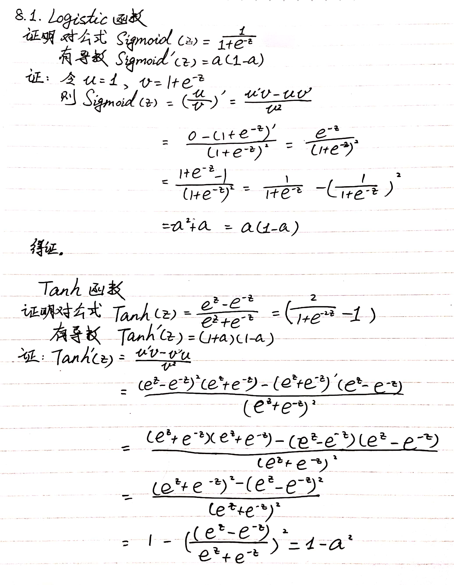

**函数图像**

                图8.1.1 Sigmoid函数图像

### Tanh函数 ###
TanHyperbolic，即双曲正切函数。

公式：  
$$Tanh(z) = \frac{e^{z} - e^{-z}}{e^{z} + e^{-z}} = (\frac{2}{1 + e^{-2z}}-1) \rightarrow a $$
即
$$Tanh(z) = 2 \cdot Sigmoid(2z) - 1 $$

**导数公式**

$$Tanh'(z) = (1 + a)(1 - a)$$

**值域**

- 输入值域：$(-\infty,\infty)$
- 输出值域：$(-1,1)$
- 导数值域：$(0,1)$

**函数图像**

                图8.1.2 双曲正切函数图像

### 代码测试 ###
**结果图像**
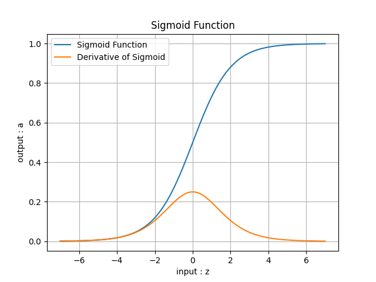

                图level1-1 Sigmoid Function

                图level1-2 Logistic Function

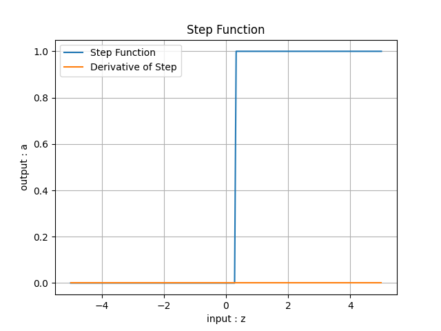

                图level1-3 Step Fuction

## 8.2 半线性激活函数 ##
半线性激活函数又称非饱和型激活函数。
### ReLU函数 ###
Rectified Linear Unit，修正线性单元，线性整流函数，斜坡函数。

**公式**
$$ReLU(z) = max(0,z) = \begin{cases} 
  z, & z \geq 0 \\\\ 
  0, & z < 0 
\end{cases}$$

**导数**

$$ReLU'(z) = \begin{cases} 1 & z \geq 0 \\\\ 0 & z < 0 \end{cases}$$

**值域**

- 输入值域：$(-\infty, \infty)$
- 输出值域：$(0,\infty)$
- 导数值域：${(0,1)}$

                图8.2.1 线性整流函数ReLU

### Leaky ReLU函数 ###

LReLU，带泄露的线性整流函数。

**公式**

$$LReLU(z) = \begin{cases} z & z \geq 0 \\\\ \alpha \cdot z & z < 0 \end{cases}$$

**导数**

$$LReLU'(z) = \begin{cases} 1 & z \geq 0 \\\\ \alpha & z < 0 \end{cases}$$

**值域**

输入值域：$(-\infty, \infty)$

输出值域：$(-\infty,\infty)$

导数值域：${(\alpha,1)}$

#### 函数图像

                图8.2.2 LeakyReLU的函数图像

### Softplus函数 ###

**公式**

$$Softplus(z) = \ln (1 + e^z)$$

**导数**

$$Softplus'(z) = \frac{e^z}{1 + e^z}$$

**值域**

输入值域：$(-\infty, \infty)$

输出值域：$(0,\infty)$

导数值域：$(0,1)$

**函数图像**

                图8.2.3 Softplus的函数图像
                
### ELU函数 ###

#### 公式

$$ELU(z) = \begin{cases} z & z \geq 0 \\ \alpha (e^z-1) & z < 0 \end{cases}$$

#### 导数

$$ELU'(z) = \begin{cases} 1 & z \geq 0 \\ \alpha e^z & z < 0 \end{cases}$$

#### 值域

输入值域：$(-\infty, \infty)$

输出值域：$(-\alpha,\infty)$

导数值域：$(0,1]$

**函数图像**

                图8.2.4 ELU的函数图像

### 代码测试 ###
**结果图像**
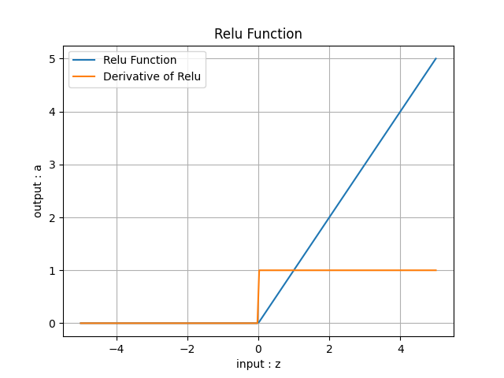

                图level2-1 Rule Function

                图level2-2 ELU Function

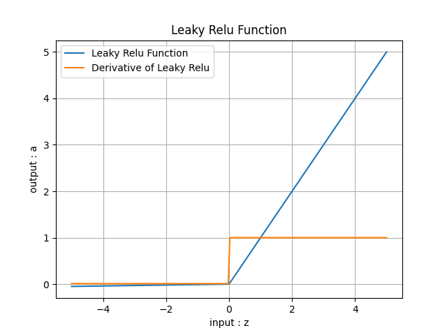

                图level2-3 Leaky Relu Function

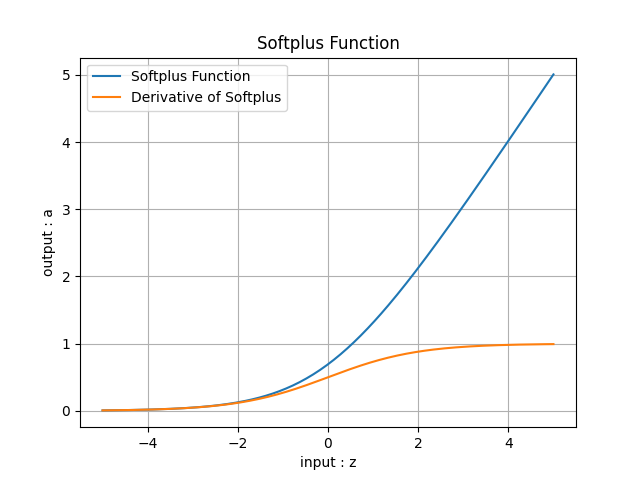

                图level2-4 Softplus Function

                图level2-5 BenIdentity Function

## 9.0 单入单出的双层神经网络 - 非线性回归 ##
**回归模型的评估标准**

**平均绝对误差**

MAE（Mean Abolute Error）——对异常值不如均方差敏感，类似中位数。

$$MAE=\frac{1}{m} \sum_{i=1}^m \lvert a_i-y_i \rvert $$

**绝对平均值率误差**

MAPE（Mean Absolute Percentage Error）。

$$MAPE=\frac{100}{m} \sum^m_{i=1} \left\lvert {a_i - y_i \over y_i} \right\rvert $$

**和方差**

SSE（Sum Squared Error）。

$$SSE=\sum_{i=1}^m (a_i-y_i)^2 $$

得出的值与样本数量有关系。

**均方差**

MSE（Mean Squared Error）。

$$MSE = \frac{1}{m} \sum_{i=1}^m (a_i-y_i)^2  $$

MSE越小，误差越小。

**均方根误差**

RMSE（Root Mean Squard Error）。

$$RMSE = \sqrt{\frac{1}{m} \sum_{i=1}^m (a_i-y_i)^2} $$

**R平方**

R-Squared。

$$R^2=1-\frac{\sum (a_i - y_i)^2}{\sum(\bar y_i-y_i)^2}=1-\frac{MSE(a,y)}{Var(y)} $$

R平方值越接近1，回归的拟合程度就越好。

## 9.1 用多项式回归法拟合正弦曲线 ##
### 多项式回归的概念 ###
多项式回归形式：
**一元一次线性模型**

$$z = x w + b $$

**多元一次多项式**

$$z = x_1 w_1 + x_2 w_2 + ...+ x_m w_m + b $$

**一元多次多项式**
对于只有一个特征值的问题，将特征值的高次方作为另外的特征值，加入到回归分析中，用公式描述：
$$z = x w_1 + x^2 w_2 + ... + x^m w_m + b $$
上式中x是原有的唯一特征值，$x^m$ 是利用 $x$ 的 $m$ 次方作为额外的特征值，这样就把特征值的数量从 $1$ 个变为 $m$ 个。

换一种表达形式，令：$x_1 = x,x_2=x^2,\ldots,x_m=x^m$，则：

$$z = x_1 w_1 + x_2 w_2 + ... + x_m w_m + b $$

## 9.2 用多项式回归法拟合复合函数曲线
### 代码测试 ###
**运行结果图**
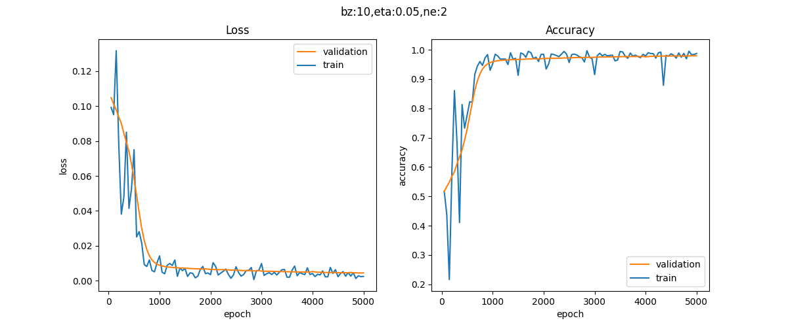

                图ch09-level3-1

                图ch09-level3-2

## 9.4 双层神经网络实现非线性回归

                图9.4.1 单入单出的双层神经网络

**输入层**

输入层就是一个标量x值，如果是成批输入，则是一个矢量或者矩阵，但是特征值数量总为1，因为只有一个横坐标值做为输入。

$$X = (x)$$

**权重矩阵W1/B1**

$$
W1=
\begin{pmatrix}
w1_{11} & w1_{12} & w1_{13}
\end{pmatrix}
$$

$$
B1=
\begin{pmatrix}
b1_{1} & b1_{2} & b1_{3} 
\end{pmatrix}
$$

**隐层**

对3个神经元：

$$
Z1 = \begin{pmatrix}
    z1_1 & z1_2 & z1_3
\end{pmatrix}
$$

$$
A1 = \begin{pmatrix}
    a1_1 & a1_2 & a1_3
\end{pmatrix}
$$

**权重矩阵W2/B2**

W2的尺寸是3x1，B2的尺寸是1x1。

$$
W2=
\begin{pmatrix}
w2_{11} \\\\
w2_{21} \\\\
w2_{31}
\end{pmatrix}
$$

$$
B2=
\begin{pmatrix}
b2_{1}
\end{pmatrix}
$$

**输出层**

完成一个拟合任务输出层只有一个神经元，尺寸为1x1：

$$
Z2 = 
\begin{pmatrix}
    z2_{1}
\end{pmatrix}
$$

### 前向计算 ###
前向计算图。

               图9.4.2 前向计算图

**隐层**

- 线性计算

$$
z1_{1} = x \cdot w1_{11} + b1_{1}
$$

$$
z1_{2} = x \cdot w1_{12} + b1_{2}
$$

$$
z1_{3} = x \cdot w1_{13} + b1_{3}
$$

矩阵形式：

$$
\begin{aligned}
Z1 &=x \cdot 
\begin{pmatrix}
    w1_{11} & w1_{12} & w1_{13}
\end{pmatrix}
+
\begin{pmatrix}
    b1_{1} & b1_{2} & b1_{3}
\end{pmatrix}
 \\\\
&= X \cdot W1 + B1  
\end{aligned} 
$$

- 激活函数

$$
a1_{1} = Sigmoid(z1_{1})
$$

$$
a1_{2} = Sigmoid(z1_{2})
$$

$$
a1_{3} = Sigmoid(z1_{3})
$$

矩阵形式：

$$
A1 = Sigmoid(Z1) 
$$

**输出层**

完成一个拟合任务时输出层只有一个神经元：

$$
\begin{aligned}
Z2&=a1_{1}w2_{11}+a1_{2}w2_{21}+a1_{3}w2_{31}+b2_{1} \\\\
&= 
\begin{pmatrix}
a1_{1} & a1_{2} & a1_{3}
\end{pmatrix}
\begin{pmatrix}
w2_{11} \\\\ w2_{21} \\\\ w2_{31}
\end{pmatrix}
+b2_1 \\\\
&=A1 \cdot W2+B2
\end{aligned} 
$$

**损失函数**

均方差损失函数：

$$loss(w,b) = \frac{1}{2} (z2-y)^2 $$

其中：
1. $z2$：预测值。
2. $y$：样本的标签值。

### 反向传播 ###
**求损失函数对输出层的反向误差**
$$
\frac{\partial loss}{\partial z2} = z2 - y \rightarrow dZ2 
$$

**求W2的梯度**

$$
\begin{aligned}
\frac{\partial loss}{\partial W2} &= 
\begin{pmatrix}
    \frac{\partial loss}{\partial z2}\frac{\partial z2}{\partial w2_{11}} \\\\
    \frac{\partial loss}{\partial z2}\frac{\partial z2}{\partial w2_{21}} \\\\
    \frac{\partial loss}{\partial z2}\frac{\partial z2}{\partial w2_{31}}
\end{pmatrix}
\begin{pmatrix}
    dZ2 \cdot a1_{1} \\\\
    dZ2 \cdot a1_{2} \\\\
    dZ2 \cdot a1_{3}
\end{pmatrix} \\\\
&=\begin{pmatrix}
    a1_{1} \\\\ a1_{2} \\\\ a1_{3}
\end{pmatrix} \cdot dZ2
=A1^{\top} \cdot dZ2 \rightarrow dW2
\end{aligned} 
$$

**求B2的梯度**

$$
\frac{\partial loss}{\partial B2}=dZ2 \rightarrow dB2 
$$

## 9.5 曲线拟合 ##
### 代码运行 ###
**运行结果图**

         
                图level4-1

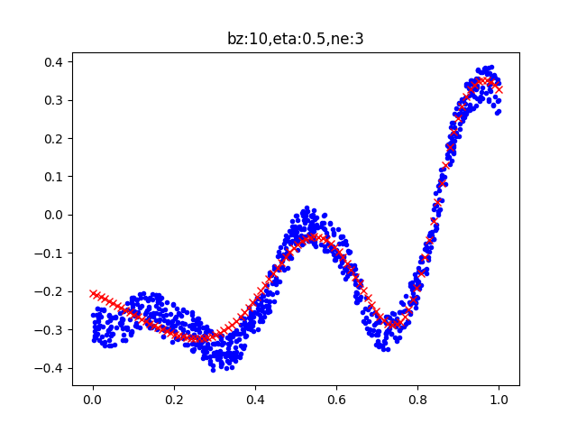
         
                图level4-2   

## 9.6 非线性回归的工作原理 ##
### 代码测试 ###
**运行结果图**

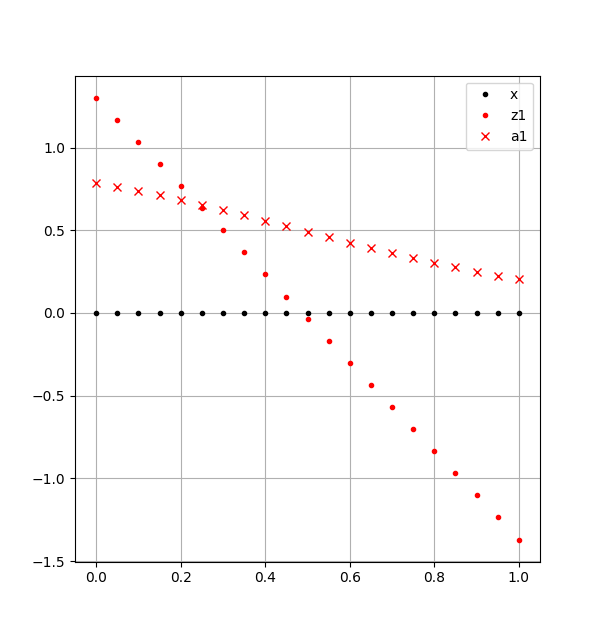

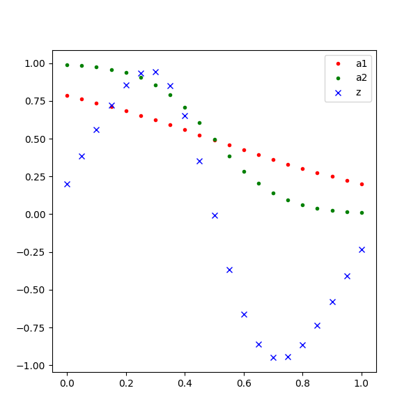

## 9.7 超参数优化的初步认识
超参数优化（Hyperparameter Optimization）主要存在两方面的困难：

1. 超参数优化是一个组合优化问题，无法像一般参数那样通过梯度下降方法来优化，也没有一种通用有效的优化方法。
2. 评估一组超参数配置（Configuration）的时间代价非常高，从而导致一些优化方法（比如演化算法）在超参数优化中难以应用。

### 代码测试 ###

**运行结果图**
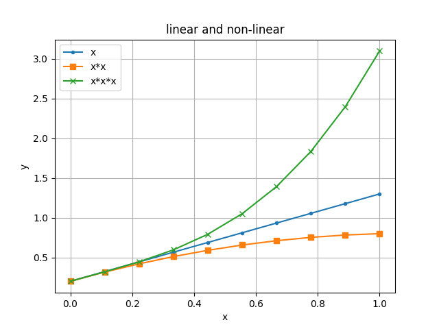
 

# $Step5$ 非线性分类 #

## 10.0 非线性二分类问题 ##
### 二分类模型的评估标准 ###
**准确率 Accuracy** 即精度。
**混淆矩阵**

                表10-1 四类样本的矩阵关系

|预测值|被判断为正类|被判断为负类|Total|
|---|---|---|---|
|样本实际为正例|TP-True Positive|FN-False Negative|Actual Positive=TP+FN|
|样本实际为负例|FP-False Positive|TN-True Negative|Actual Negative=FP+TN|
|Total|Predicated Postivie=TP+FP|Predicated Negative=FN+TN|

- 准确率 Accuracy
即准确率，其值越大越好。
$$
\begin{aligned}
Accuracy &= \frac{TP+TN}{TP+TN+FP+FN} \end{aligned}
$$
- 精确率/查准率 Precision
分子为被判断为正类并且真的是正类的样本数，分母是被判断为正类的样本数。该数值越大越好。
$$
Precision=\frac{TP}{TP+FP}
$$
- 召回率/查全率 Recall
分子为被判断为正类并且真的是正类的样本数，分母是真的正类的样本数。该数值越大越好。
$$
Recall = \frac{TP}{TP+FN}=\frac{521}{521+29}
$$
- TPR - True Positive Rate 真正例率
$$
TPR = \frac{TP}{TP + FN}=Recall
$$
- FPR - False Positive Rate 假正例率
$$
FPR = \frac{FP}{FP+TN}=\frac{15}{15+435}
$$
分子为被判断为正类的负例样本数，分母为所有负类样本数。越小越好。

- 调和平均值 F1

$$
\begin{aligned}
F1&=\frac{2 \times Precision \times Recall}{recision+Recall}\\\\
&=\frac{2 \times 0.972 \times 0.947}{0.972+0.947}
\end{aligned}
$$

该值越大越好。

## 10.2 非线性二分类实现 ##
### 定义神经网络结构 ###

定义可完成非线性二分类的神经网络结构图：

                图10.2 非线性二分类神经网络结构图

- 输入层两个特征值$x_1,x_2$
  $$
  X=\begin{pmatrix}
    x_1 & x_2
  \end{pmatrix}
  $$
- 隐层$2\times 2$的权重矩阵$W1$
$$
  W1=\begin{pmatrix}
    w1_{11} & w1_{12} \\\\
    w1_{21} & w1_{22} 
  \end{pmatrix}
$$
- 隐层$1\times 2$的偏移矩阵$B1$

$$
  B1=\begin{pmatrix}
    b1_{1} & b1_{2}
  \end{pmatrix}
$$

- 隐层由两个神经元构成
$$
Z1=\begin{pmatrix}
  z1_{1} & z1_{2}
\end{pmatrix}
$$
$$
A1=\begin{pmatrix}
  a1_{1} & a1_{2}
\end{pmatrix}
$$
- 输出层$2\times 1$的权重矩阵$W2$
$$
  W2=\begin{pmatrix}
    w2_{11} \\\\
    w2_{21}  
  \end{pmatrix}
$$

- 输出层$1\times 1$的偏移矩阵$B2$

$$
  B2=\begin{pmatrix}
    b2_{1}
  \end{pmatrix}
$$

- 输出层有一个神经元使用Logistic函数进行分类
$$
  Z2=\begin{pmatrix}
    z2_{1}
  \end{pmatrix}
$$
$$
  A2=\begin{pmatrix}
    a2_{1}
  \end{pmatrix}
$$

## 10.3 实现逻辑异或门
### 代码实现 ###
**结果图像**

## 10.4 逻辑异或门的工作原理
### 代码实现 ###
**代码结果图**
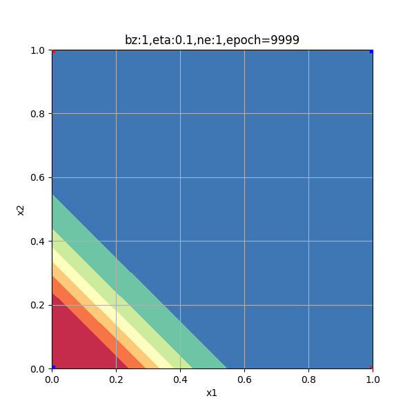

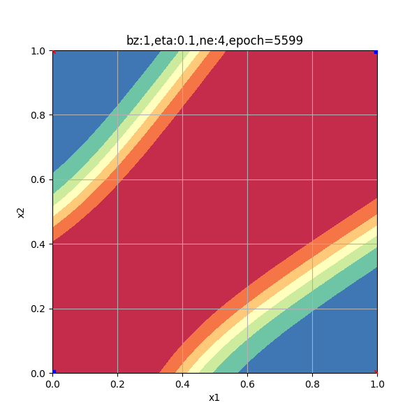

## 10.5 实现双弧形二分类
## 代码实现 ##
**结果图像**

## 10.6 双弧形二分类的工作原理
### 代码测试 ###
**实现结果图像**

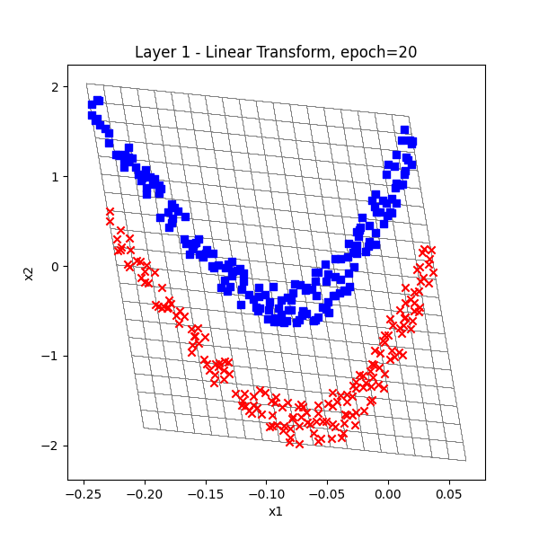
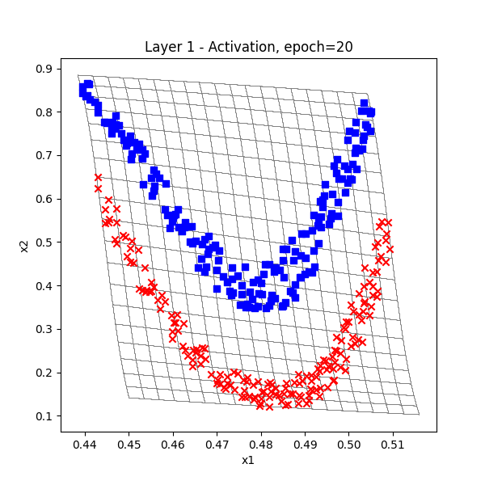

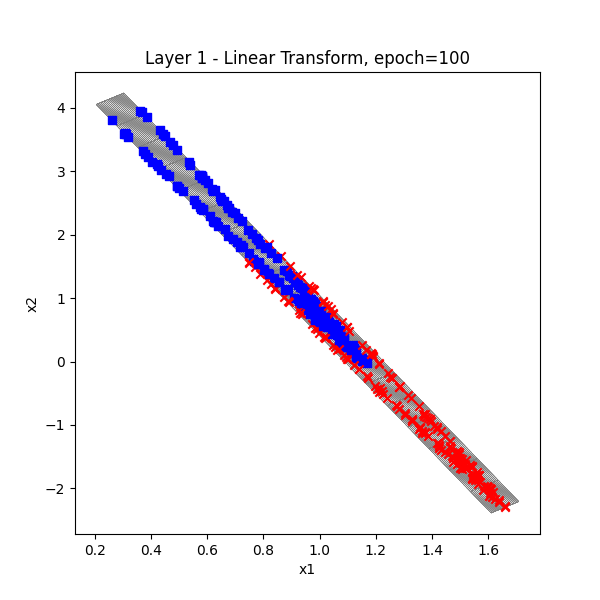
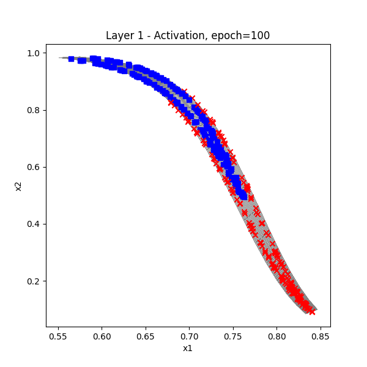
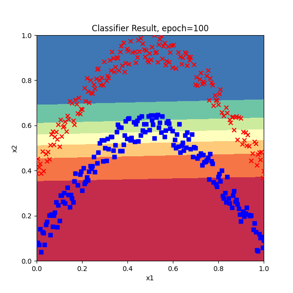
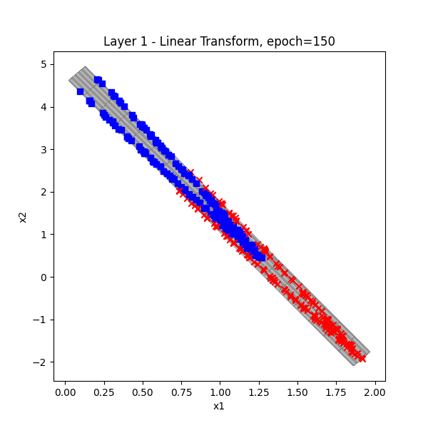

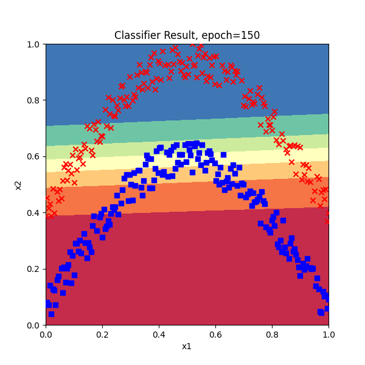

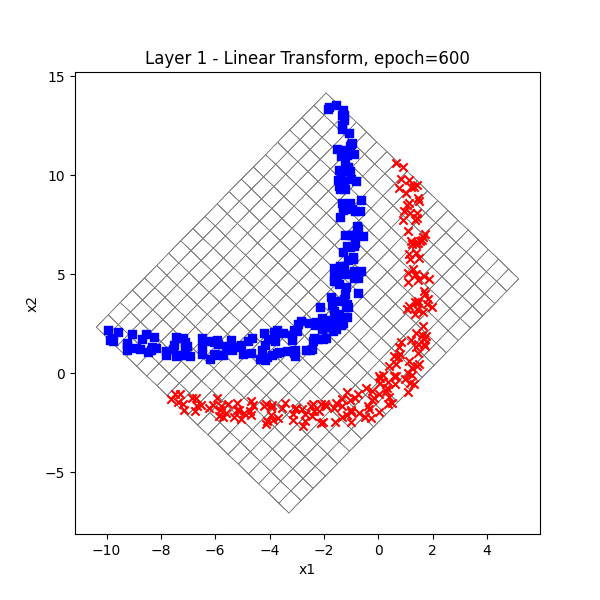

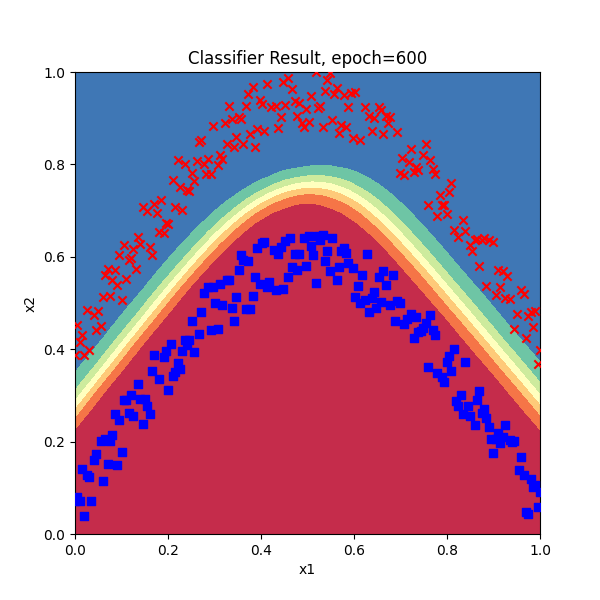

## 11.1 非线性多分类 ##
### 定义神经网络结构 ###
有可完成非线性多分类的网络结构如图所示：

                图11.1 非线性多分类的神经网络结构图

- 输入层两个特征值$x_1, x_2$
$$
x=
\begin{pmatrix}
    x_1 & x_2
\end{pmatrix}
$$
- 隐层$2\times 3$的权重矩阵$W1$
$$
W1=
\begin{pmatrix}
    w1_{11} & w1_{12} & w1_{13} \\\\
    w1_{21} & w1_{22} & w1_{23}
\end{pmatrix}
$$

- 隐层$1\times 3$的偏移矩阵$B1$

$$
B1=\begin{pmatrix}
    b1_1 & b1_2 & b1_3 
\end{pmatrix}
$$

- 隐层由3个神经元构成
- 输出层$3\times 3$的权重矩阵$W2$
$$
W2=\begin{pmatrix}
    w2_{11} & w2_{12} & w2_{13} \\\\
    w2_{21} & w2_{22} & w2_{23} \\\\
    w2_{31} & w2_{32} & w2_{33} 
\end{pmatrix}
$$

- 输出层$1\times 1$的偏移矩阵$B2$

$$
B2=\begin{pmatrix}
    b2_1 & b2_2 & b2_3 
  \end{pmatrix}
$$

### 代码实现 ###
**结果图像**
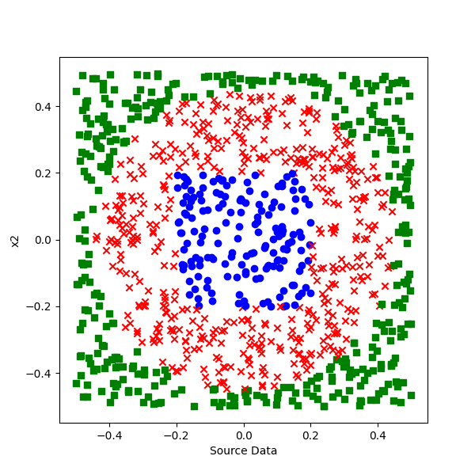

## 11.2 非线性多分类的工作原理
### 代码实现 ###
**实现结果图像**
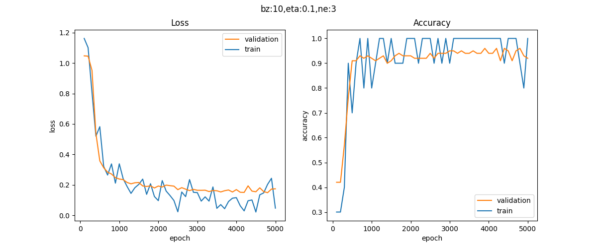
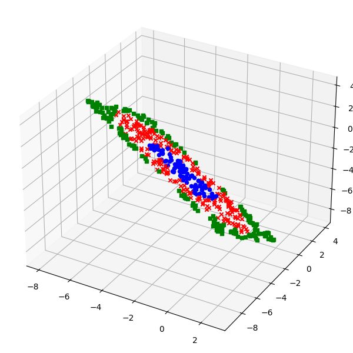

## 12.0 多变量非线性多分类
### 学习率与批大小
学习率与批大小是对梯度下降影响最大的两个因子。
梯度下降公式：
$$
w_{t+1} = w_t - \frac{\eta}{m} \sum_i^m \nabla J(w,b) 
$$

其中:
1. $\eta$：学习率.
2. m：批大小。

### 代码实现 ###
**代码结果图像**

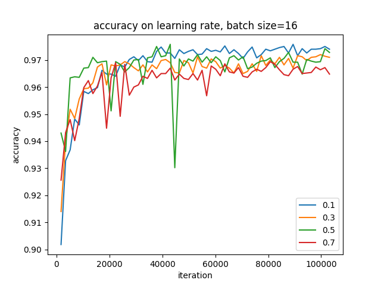

# 学习心得 #
$step4$ 部分围绕非线性回归，介绍了激活函数、多项式回归、曲线拟合等方面。
$step5$ 部分围绕非线性分类，介绍了各类门的工作原理及实现、非线性多分类的工作原理等。
而无论是非线性回归的问题还是非线性分类的问题，都可以通过神经网络解决。
