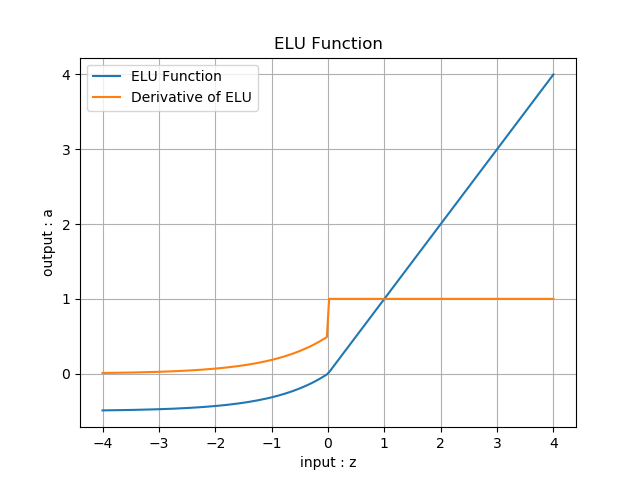

# 人工智能第三次作业
## 学号：201809035   姓名：胡厚淮
### 一、激活函数
1.1、激活函数的表示方式
下图是神经网络中的一个神经元，假设该神经元有三个输入，分别为$x_1,x_2,x_3$，那么：

$$z=x_1 w_1 + x_2 w_2 + x_3 w_3 +b \tag{1}$$
$$a = \sigma(z) \tag{2}$$


激活函数的内容对应
$$a = \sigma(z) \tag{2}$$
他的作用是
1. 给神经网络增加非线性因素，这个问题在第1章神经网络基本工作原理中已经讲过了；
2. 把公式1的计算结果压缩到 $[0,1]$ 之间，便于后面的计算。
   激活函数的基本性质有
+ 非线性：线性的激活函数和没有激活函数一样；
+ 可导性：做误差反向传播和梯度下降，必须要保证激活函数的可导性；
+ 单调性：单一的输入会得到单一的输出，较大值的输入得到较大值的输出。

激活函数的注意事项  
1. 神经网络最后一层不需要激活函数
2. 激活函数只用于连接前后两层神经网络
### 二、激活函数的类型
#### 2.1、挤压型激活函数
2.1.1、这一类函数的特点是，当输入值域的绝对值较大的时候，其输出在两端是饱和的，都具有S形的函数曲线以及压缩输入值域的作用，所以叫挤压型激活函数，又可以叫饱和型激活函数。
在英文中，通常用Sigmoid来表示，原意是S型的曲线，在数学中是指一类具有压缩作用的S型的函数，在神经网络中，有两个常用的Sigmoid函数，一个是Logistic函数，另一个是Tanh函数。

2.1.2、挤压激活函数的表示方法

公式：
$$Sigmoid(z) = \frac{1}{1 + e^{-z}} \rightarrow a \tag{1}$$
导数：

$$Sigmoid'(z) = a(1 - a) \tag{2}$$
值域

- 输入值域：$(-\infty, \infty)$
- 输出值域：$(0,1)$
- 导数值域：$(0,0.25]$
函数图像：

优点

从函数图像来看，Sigmoid函数的作用是将输出压缩到 $(0,1)$ 这个区间范围内，这种输出在0~1之间的函数可以用来模拟一些概率分布的情况。它还是一个连续函数，导数简单易求。  

从数学上来看，Sigmoid函数对中央区的信号增益较大，对两侧区的信号增益小，在信号的特征空间映射上，有很好的效果。 

从神经科学上来看，中央区酷似神经元的兴奋态，两侧区酷似神经元的抑制态，因而在神经网络学习方面，可以将重点特征推向中央区，
将非重点特征推向两侧区。

缺点

指数计算代价大。

反向传播时梯度消失：从梯度图像中可以看到，Sigmoid的梯度在两端都会接近于0，根据链式法则，如果传回的误差是$\delta$，那么梯度传递函数是$\delta \cdot a'$，而$a'$这时接近零，也就是说整体的梯度也接近零。这就出现梯度消失的问题，并且这个问题可能导致网络收敛速度比较慢。

2.1.3 Tanh函数

TanHyperbolic，即双曲正切函数。
公式  
$$Tanh(z) = \frac{e^{z} - e^{-z}}{e^{z} + e^{-z}} = (\frac{2}{1 + e^{-2z}}-1) \rightarrow a \tag{3}$$
即
$$Tanh(z) = 2 \cdot Sigmoid(2z) - 1 \tag{4}$$

#### 导数公式

$$Tanh'(z) = (1 + a)(1 - a)$$
函数图像

优点

具有Sigmoid的所有优点。

无论从理论公式还是函数图像，这个函数都是一个和Sigmoid非常相像的激活函数，他们的性质也确实如此。但是比起Sigmoid，Tanh减少了一个缺点，就是他本身是零均值的，也就是说，在传递过程中，输入数据的均值并不会发生改变，这就使他在很多应用中能表现出比Sigmoid优异一些的效果。

#### 缺点

exp指数计算代价大。梯度消失问题仍然存在

### 2.2半线性激活函数
 #### 2.2.1 ReLU函数 

Rectified Linear Unit，修正线性单元，线性整流函数，斜坡函数。

#### 公式

$$ReLU(z) = max(0,z) = \begin{cases} 
  z, & z \geq 0 \\\\ 
  0, & z < 0 
\end{cases}$$

#### 导数

$$ReLU'(z) = \begin{cases} 1 & z \geq 0 \\\\ 0 & z < 0 \end{cases}$$

#### 值域

- 输入值域：$(-\infty, \infty)$
- 输出值域：$(0,\infty)$
- 导数值域：$[0,1]$

图像

优点

- 反向导数恒等于1，更加有效率的反向传播梯度值，收敛速度快；
- 避免梯度消失问题；
- 计算简单，速度快；
- 活跃度的分散性使得神经网络的整体计算成本下降。

缺点

无界。

梯度很大的时候可能导致的神经元“死”掉。

### 2.3 Leaky ReLU函数

LReLU，带泄露的线性整流函数。

#### 公式

$$LReLU(z) = \begin{cases} z & z \geq 0 \\\\ \alpha \cdot z & z < 0 \end{cases}$$

#### 导数

$$LReLU'(z) = \begin{cases} 1 & z \geq 0 \\\\ \alpha & z < 0 \end{cases}$$

#### 值域

输入值域：$(-\infty, \infty)$

输出值域：$(-\infty,\infty)$

导数值域：$\\{\alpha,1\\}$

#### 函数图像


图8-7 LeakyReLU的函数图像

#### 优点

继承了ReLU函数的优点。

Leaky ReLU同样有收敛快速和运算复杂度低的优点，而且由于给了$z<0$时一个比较小的梯度$\alpha$,使得$z<0$时依旧可以进行梯度传递和更新，可以在一定程度上避免神经元“死”掉的问题。

8.2.4 ELU函数

#### 公式

$$ELU(z) = \begin{cases} z & z \geq 0 \\ \alpha (e^z-1) & z < 0 \end{cases}$$

#### 导数

$$ELU'(z) = \begin{cases} 1 & z \geq 0 \\ \alpha e^z & z < 0 \end{cases}$$

#### 值域

输入值域：$(-\infty, \infty)$

输出值域：$(-\alpha,\infty)$

导数值域：$(0,1]$

#### 函数图像

ELU的函数图像如图8-9所示。


### 三、非线性回归分析标准
非线性回归为了评估曲线拟合的程度通过以下几个方式评价拟合的程度。
- 平均绝对误差 MAE（Mean Abolute Error）。

$$MAE=\frac{1}{m} \sum_{i=1}^m \lvert a_i-y_i \rvert \tag{1}$$
- 绝对平均值率误差
MAPE（Mean Absolute Percentage Error）。

$$MAPE=\frac{100}{m} \sum^m_{i=1} \left\lvert {a_i - y_i \over y_i} \right\rvert \tag{2}$$
- 和方差
  SSE（Sum Squared Error）。

$$SSE=\sum_{i=1}^m (a_i-y_i)^2 \tag{3}$$
- 均方差
 MSE（Mean Squared Error）。

$$MSE = \frac{1}{m} \sum_{i=1}^m (a_i-y_i)^2 \tag{4}$$
- 均方根误差
  RMSE（Root Mean Squard Error）。

$$RMSE = \sqrt{\frac{1}{m} \sum_{i=1}^m (a_i-y_i)^2} \tag{5}$$
- R平方
  $$R^2=1-\frac{\sum (a_i - y_i)^2}{\sum(\bar y_i-y_i)^2}=1-\frac{MSE(a,y)}{Var(y)} \tag{6}$$
### 四、万能近似定理

万能近似定理(universal approximation theorem) $^{[1]}$，是深度学习最根本的理论依据。它证明了在给定网络具有足够多的隐藏单元的条件下，配备一个线性输出层和一个带有任何“挤压”性质的激活函数（如Sigmoid激活函数）的隐藏层的前馈神经网络，能够以任何想要的误差量近似任何从一个有限维度的空间映射到另一个有限维度空间的Borel可测的函数。
### 五、根据万能近似定理构建深度学习网络框架
功能模块的分析
```Python
def backward3(dict_Param,cache,X,Y):
    ...
    # layer 3
    dZ3= A3 - Y
    dW3 = np.dot(dZ3, A2.T)
    dB3 = np.sum(dZ3, axis=1, keepdims=True)
    # layer 2
    dZ2 = np.dot(W3.T, dZ3) * (1-A2*A2) # tanh
    dW2 = np.dot(dZ2, A1.T)
    dB2 = np.sum(dZ2, axis=1, keepdims=True)
    # layer 1
    dZ1 = np.dot(W2.T, dZ2) * A1 * (1-A1)   #sigmoid
    dW1 = np.dot(dZ1, X.T)
    dB1 = np.sum(dZ1, axis=1, keepdims=True)
    ...
```
因为三层网络比两层网络多了一层，所以会在初始化、前向、反向、更新参数等四个环节有所不同，但却是有规律的。
（2）抽象与设计

#### NeuralNet

我们首先需要一个NeuralNet类，来包装基本的神经网络结构和功能：

- Layers - 神经网络各层的容器，按添加顺序维护一个列表
- Parameters - 基本参数，包括普通参数和超参
- Loss Function - 提供计算损失函数值，存储历史记录并最后绘图的功能
- LayerManagement() - 添加神经网络层
- ForwardCalculation() - 调用各层的前向计算方法
- BackPropagation() - 调用各层的反向传播方法
- PreUpdateWeights() - 预更新各层的权重参数
- UpdateWeights() - 更新各层的权重参数
- Train() - 训练
- SaveWeights() - 保存各层的权重参数
- LoadWeights() - 加载各层的权重参数
 
Layer是一个抽象类，以及更加需要增加的实际类，包括：
- Fully Connected Layer
- Classification Layer
- Activator Layer
- Dropout Layer
- Batch Norm Layer

将来还会包括：
- Convolution Layer
- Max Pool Layer

每个Layer都包括以下基本方法：
 - ForwardCalculation() - 调用本层的前向计算方法
 - BackPropagation() - 调用本层的反向传播方法
 - PreUpdateWeights() - 预更新本层的权重参数
 - UpdateWeights() - 更新本层的权重参数
 - SaveWeights() - 保存本层的权重参数
 - LoadWeights() - 加载本层的权重参数
  Activator Layer

激活函数和分类函数：

- Identity - 直传函数，即没有激活处理
- Sigmoid
- Tanh
- Relu

 Classification Layer

分类函数，包括：
- Sigmoid二分类
- Softmax多分类

Parameters

 基本神经网络运行参数：

 - 学习率
 - 最大epoch
 - batch size
 - 损失函数定义
 - 初始化方法
 - 优化器类型
 - 停止条件
 - 正则类型和条件

LossFunction

损失函数及帮助方法：

- 均方差函数
- 交叉熵函数二分类
- 交叉熵函数多分类
- 记录损失函数
- 显示损失函数历史记录
- 获得最小函数值时的权重参数

Optimizer

优化器：

- SGD
- Momentum
- Nag
- AdaGrad
- AdaDelta
- RMSProp
- Adam


 WeightsBias

权重矩阵，仅供全连接层使用：

- 初始化 
  - Zero, Normal, MSRA (HE), Xavier
  - 保存初始化值
  - 加载初始化值
- Pre_Update - 预更新
- Update - 更新
- Save - 保存训练结果值
- Load - 加载训练结果值

 DataReader

样本数据读取器：

- ReadData - 从文件中读取数据
- NormalizeX - 归一化样本值
- NormalizeY - 归一化标签值
- GetBatchSamples - 获得批数据
- ToOneHot - 标签值变成OneHot编码用于多分类
- ToZeorOne - 标签值变成0/1编码用于二分类
- Shuffle - 打乱样本顺序

从中派生出两个数据读取器：
- MnistImageDataReader - 读取MNIST数据
- CifarImageReader - 读取Cifar10数据

 搭建模型


```Python
def model():
    dataReader = LoadData()
    num_input = 1
    num_hidden1 = 4
    num_output = 1

    max_epoch = 10000
    batch_size = 10
    learning_rate = 0.5

    params = HyperParameters_4_0(
        learning_rate, max_epoch, batch_size,
        net_type=NetType.Fitting,
        init_method=InitialMethod.Xavier,
        stopper=Stopper(StopCondition.StopLoss, 0.001))

    net = NeuralNet_4_0(params, "Level1_CurveFittingNet")
    fc1 = FcLayer_1_0(num_input, num_hidden1, params)
    net.add_layer(fc1, "fc1")
    sigmoid1 = ActivationLayer(Sigmoid())
    net.add_layer(sigmoid1, "sigmoid1")
    fc2 = FcLayer_1_0(num_hidden1, num_output, params)
    net.add_layer(fc2, "fc2")

    net.train(dataReader, checkpoint=100, need_test=True)

    net.ShowLossHistory()
    ShowResult(net, dataReader)
```
超参数说明：

1. 输入层1个神经元，因为只有一个x值
2. 隐层4个神经元，对于此问题来说应该是足够了，因为特征很少
3. 输出层1个神经元，因为是拟合任务
4. 学习率=0.5
5. 最大epoch=10000轮
6. 批量样本数=10
7. 拟合网络类型
8. Xavier初始化
9. 绝对损失停止条件=0.001

### 五、学习小结

  - 这次课老师主要为我们讲解了两层神经网络的学习，在两层神经网络之间，必须有激活函数连接，从而加入非线性因素，提高神经网络的能力。所以，我们先从激活函数学起，一类是挤压型的激活函数，常用于简单网络的学习；
  - 后面围绕非线性问题展开讨论，介绍了非线性问题的回归方法，为了更加准确的拟合曲线，教程上提供了一系列的方式。
  - 后面我们学习了如何构建一些简单的深度学习框架，使用万能近似定理去理解深度学习，我们还通过一系列的代码实现深度学习的框架。
  - 在学习型中，我也学习到了著名的反向传播四大公式，它对我们理解神经网络有很大帮助。
### 六、心得体会
    在本章的学习中，我遇到了较多的问题，不过都借助网络和信息解决了，整个学习过程非常的充实。虽然对于激活函数和深度学习的实际内容还有很多需要学习的地方，但这本来就是很漫长的路。同时在学习的过程中，我明白了实践比理论重要，在开学初我就学习了python既有对python语言简单实用的感慨也有对掌握一门新语言的惊喜和新奇，但在具体使用python语言做一些东西的时候，我又发现实际的操作空间并没有我想的那么大，整个过程也没有那么轻松。