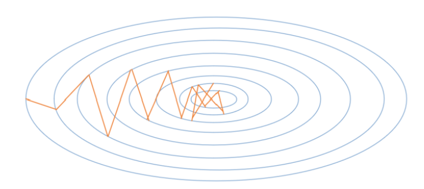
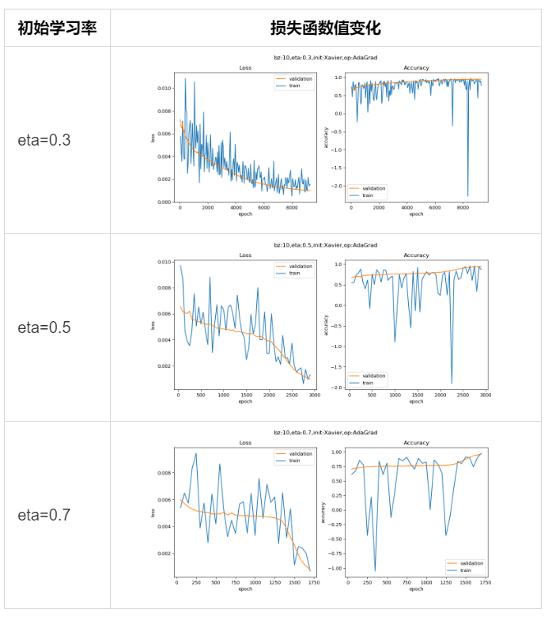
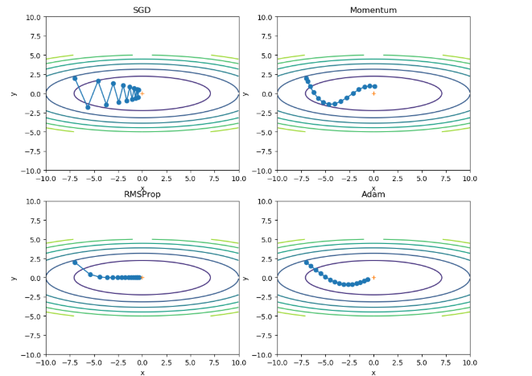

## 深度神经网络
### 深度神经网络框架设计
因为三层网络比两层网络多了一层，所以会在初始化、前向、反向、更新参数等四个环节有所不同，但却是有规律的。再加上前面章节中，为了实现一些辅助功能，我们已经写了很多类。所以，现在可以动手搭建一个深度学习的迷你框架了。
回归任务测试

```Python
def model():
    dataReader = LoadData()
    num_input = 1
    num_hidden1 = 4
    num_output = 1

    max_epoch = 10000
    batch_size = 10
    learning_rate = 0.5

    params = HyperParameters_4_0(
        learning_rate, max_epoch, batch_size,
        net_type=NetType.Fitting,
        init_method=InitialMethod.Xavier,
        stopper=Stopper(StopCondition.StopLoss, 0.001))

    net = NeuralNet_4_0(params, "Level1_CurveFittingNet")
    fc1 = FcLayer_1_0(num_input, num_hidden1, params)
    net.add_layer(fc1, "fc1")
    sigmoid1 = ActivationLayer(Sigmoid())
    net.add_layer(sigmoid1, "sigmoid1")
    fc2 = FcLayer_1_0(num_hidden1, num_output, params)
    net.add_layer(fc2, "fc2")

    net.train(dataReader, checkpoint=100, need_test=True)

    net.ShowLossHistory()
    ShowResult(net, dataReader)
```
NeuralNet

首先需要一个`NeuralNet`类，来包装基本的神经网络结构和功能：

- `Layers` - 神经网络各层的容器，按添加顺序维护一个列表
- `Parameters` - 基本参数，包括普通参数和超参
- `Loss Function` - 提供计算损失函数值，存储历史记录并最后绘图的功能
- `LayerManagement()` - 添加神经网络层
- `ForwardCalculation()` - 调用各层的前向计算方法
- `BackPropagation()` - 调用各层的反向传播方法
- `PreUpdateWeights()` - 预更新各层的权重参数
- `UpdateWeights()` - 更新各层的权重参数
- `Train()` - 训练
- `SaveWeights()` - 保存各层的权重参数
- `LoadWeights()` - 加载各层的权重参数

#### Layer

是一个抽象类，以及更加需要增加的实际类，包括：

- Fully Connected Layer
- Classification Layer
- Activator Layer
- Dropout Layer
- Batch Norm Layer

将来还会包括：

- Convolution Layer
- Max Pool Layer

每个Layer都包括以下基本方法：
 - `ForwardCalculation()` - 调用本层的前向计算方法
 - `BackPropagation()` - 调用本层的反向传播方法
 - `PreUpdateWeights()` - 预更新本层的权重参数
 - `UpdateWeights()` - 更新本层的权重参数
 - `SaveWeights()` - 保存本层的权重参数
 - `LoadWeights()` - 加载本层的权重参数

#### Activator Layer

激活函数和分类函数：

- `Identity` - 直传函数，即没有激活处理
- `Sigmoid`
- `Tanh`
- `Relu`

#### Classification Layer

分类函数，包括：

- `Sigmoid`二分类
- `Softmax`多分类


 #### Parameters

 基本神经网络运行参数：

 - 学习率
 - 最大`epoch`
 - `batch size`
 - 损失函数定义
 - 初始化方法
 - 优化器类型
 - 停止条件
 - 正则类型和条件

#### LossFunction

损失函数及帮助方法：

- 均方差函数
- 交叉熵函数二分类
- 交叉熵函数多分类
- 记录损失函数
- 显示损失函数历史记录
- 获得最小函数值时的权重参数

#### Optimizer

优化器：

- `SGD`
- `Momentum`
- `Nag`
- `AdaGrad`
- `AdaDelta`
- `RMSProp`
- `Adam`

#### WeightsBias

权重矩阵，仅供全连接层使用：

- 初始化 
  - `Zero`, `Normal`, `MSRA` (`HE`), `Xavier`
  - 保存初始化值
  - 加载初始化值
- `Pre_Update` - 预更新
- `Update` - 更新
- `Save` - 保存训练结果值
- `Load` - 加载训练结果值

#### DataReader

样本数据读取器：

- `ReadData` - 从文件中读取数据
- `NormalizeX` - 归一化样本值
- `NormalizeY` - 归一化标签值
- `GetBatchSamples` - 获得批数据
- `ToOneHot` - 标签值变成OneHot编码用于多分类
- `ToZeroOne` - 标签值变成0/1编码用于二分类
- `Shuffle` - 打乱样本顺序

从中派生出两个数据读取器：

- `MnistImageDataReader` - 读取MNIST数据
- `CifarImageReader` - 读取Cifar10数据

## 网络优化
随着网络的加深，训练变得越来越困难，时间越来越长可能的原因
- 参数多
- 数据量大
- 梯度消失
- 损失函数坡度平缓

问题的解决方法：
- 权重矩阵初始化
- 批量归一化
- 梯度下降优化算法
- 自适应学习率算法
  
#### 权重矩阵初始化
权重矩阵初始化是一个非常重要的环节，是训练神经网络的第一步，选择正确的初始化方法会带了事半功倍的效果。这就好比攀登喜马拉雅山，如果选择从南坡登山，会比从北坡容易很多。而初始化权重矩阵，相当于下山时选择不同的道路，在选择之前并不知道这条路的难易程度，只是知道它可以抵达山下。这种选择是随机的，即使你使用了正确的初始化算法，每次重新初始化时也会给训练结果带来很多影响。
零初始化
即把所有层的`W`值的初始值都设置为0
标准初始化
标准正态初始化方法保证激活函数的输入均值为0，方差为1。


#### 随机梯度下降 SGD

随机梯度下降算法，在当前点计算梯度，根据学习率前进到下一点。到中点附近时，由于样本误差或者学习率问题，会发生来回徘徊的现象，很可能会错过最优解。
动量算法 Momentum
SGD方法的一个缺点是其更新方向完全依赖于当前batch计算出的梯度，因而十分不稳定，因为数据有噪音。
梯度加速算法 NAG
Nesterov Accelerated Gradient，或者叫做Nesterov Momentum。
在小球向下滚动的过程中，我们希望小球能够提前知道在哪些地方坡面会上升，这样在遇到上升坡面之前，小球就开始减速。这方法就是Nesterov Momentum，其在凸优化中有较强的理论保证收敛。并且，在实践中Nesterov Momentum也比单纯的Momentum 的效果好。

#### 自适应学习率算法
AdaGrad
Adaptive subgradient method.

AdaGrad是一个基于梯度的优化算法，它的主要功能是：它对不同的参数调整学习率，具体而言，对低频出现的参数进行大的更新，对高频出现的参数进行小的更新。因此，他很适合于处理稀疏数据。

在这之前，我们对于所有的参数使用相同的学习率进行更新。但 Adagrad 则不然，对不同的训练迭代次数t，AdaGrad 对每个参数都有一个不同的学习率。这里开方、除法和乘法的运算都是按元素运算的。这些按元素运算使得目标函数自变量中每个元素都分别拥有自己的学习率

实际效果


#### 算法在等高线图上的效果比较
每种方法都迭代20次，记录下每次反向过程的(x,y)坐标点

- SGD算法，每次迭代完全受当前梯度的控制，所以会以折线方式前进。
- Momentum算法，学习率只有0.1，每次继承上一次的动量方向，所以会以比较平滑的曲线方式前进，不会出现突然的转向。
- RMSProp算法，有历史梯度值参与做指数加权平均，所以可以看到比较平缓，不会波动太大，都后期步长越来越短也是符合学习规律的。
- Adam算法，因为可以被理解为Momentum和RMSProp的组合，所以比Momentum要平缓一些，比RMSProp要平滑一些。


 正态分布

正态分布，又叫做高斯分布。

若随机变量$X$，服从一个位置参数为$\mu$、尺度参数为$\sigma$的概率分布，且其概率密度函数为：

$$
f(x)=\frac{1}{\sigma\sqrt{2 \pi} } e^{- \frac{{(x-\mu)^2}}{2\sigma^2}} \tag{1}
$$

则这个随机变量就称为正态随机变量，正态随机变量服从的分布就称为正态分布，记作：

$$
X \sim N(\mu,\sigma^2) \tag{2}
$$


### 心得体会
本次学习了解了深度神经网络的架构，并且了解了回归任务和二分类任务的测试与真实案例。并掌握了网络优化的相关知识。
出现过拟合的原因：

1. 训练集的数量和模型的复杂度不匹配，样本数量级小于模型的参数
2. 训练集和测试集的特征分布不一致
3. 样本噪音大，使得神经网络学习到了噪音，正常样本的行为被抑制
4. 迭代次数过多，过分拟合了训练数据，包括噪音部分和一些非重要特征