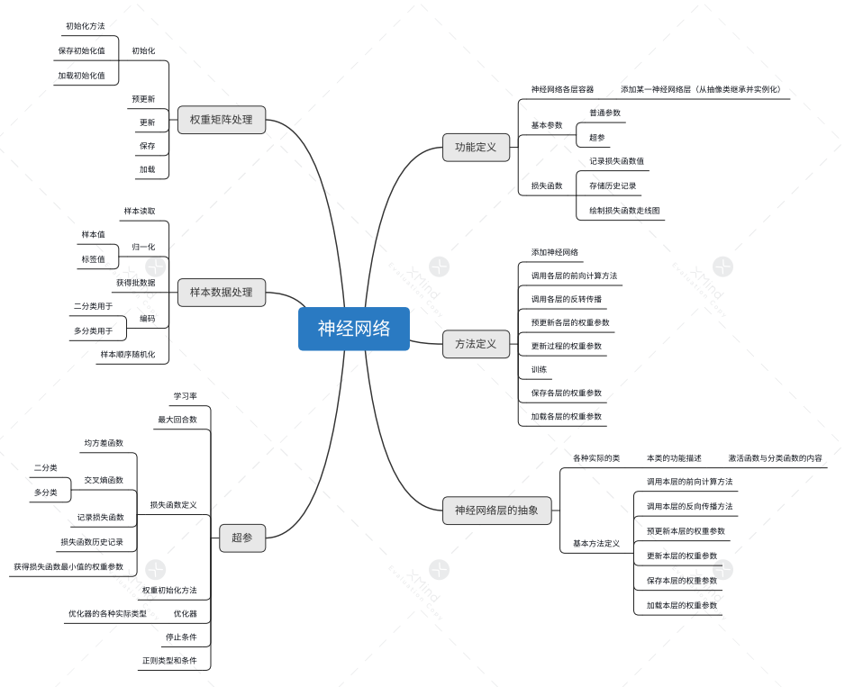

# DNN(框架)

## 本章思维导图



**要点**:

- `损失函数值在训练过程中一般的表现情况为一段平缓期之后会急速下降（在训练过程中，需要根据经验来判断神经网络是否还要继续训练）`
- `规划的时候需要将所有样本数据同时做归一化`
- `在设计模型的时候，就可以直接设计神经网络就行了`
- `在对原始数据的手工处理当中，将不需要的数据给去掉，将没有代表的数据给去掉，将数据之间进行比较，选其中较好性能的数据，数据集最好转换成扩展名为npz的numpy压缩形式`
- `Simoid弯曲用，Relu直线适用`
  
**小技巧**：
s
- `应用python的list功能，取元素的下标用作整数编码`

**DNN框架搭建**：

``` python
import numpy as np
class NeuralNet(object):
    #功能定义
    def __init__(self,num,eta,max_epoch,bat_size):
        #神经网络层
        self.layers = []#容纳神经网络各层
        self.layer_num = num #神经网络层数
        #神经网络运行参数
        self.eta = eta #学习率
        self.max_epoch = max_epoch #最大回合数
        self.bat_size = bat_size#每批数
        #损失函数
        self.j#损失函数值
        self.j_his#损失函数历史值
        self.j_graph#损失函数画图许可
    return print("Neural init is OK")
    #方法定义
    def Add_layer(self,lay): #神经网络层的添加
        len = self.layers.lenth()
        if len < self.layer_num:
            self.layers[len] = lay
        else print("神经网络层数已达上限")
        return print("lay添加成功")
    def Com_neural(self,X,i):#调用i层线性计算方法
        Z = np.dot(self.layer[i].w,X) + self.layer[i].b
        return Z
    def Back_method(self,Y,A):#反向传播
        dZ = A - Y
        dW = np.dot(A.dZ)
        dB = dZ
        return dW,dB
    def layer_u(self,dW,dB,i)：#本层的更新参数
        w = self.layers[i].w
        b = self.layers[i].b
        w = w - eta*dW
        b = b - eta*dB
        self.layers[i].w = w
        self.layers[i].b = b
    def train_N(self,X,Y):#训练
        A1 = X
        A2 = array([])
        A3 = Y
        for i in range(self.layer_num):
            Z = Com_neural(A1,i)
            A1 = Mothd_act.Identity(Z)
            A2[i] = A1
            A3[i] = Z
        for i in range(self.layer_num):
            dW,dB = Back_method(A3[self.layer_num-i],A2[self.layer_num-i])
            layer_u(dW,dB,i)


```
```python
class Mothd_act(object):# 激活函数与分类函数
    #激活函数
    @classmethod
    def Identity(cls,Z):
        A = Z
        return A
    @classmethod
    def Sigmoid(cls,Z):
        A = 1/1+np.exp(-Z)
        return A
    @classmethod
    def Tanh(cls,Z):
        A = (np.exp(Z) - np.exp(-Z)) /  (np.exp(Z) + np.exp(-Z))
        return A
    @classmethod
    def Relu(cls,Z):
        A = np.max(0,Z)
        return A
    #分类函数
    @classmethod
    def Sigmoid(cls,Z):
        A = 1/1+np.exp(-Z)
        return A
    @classmethod
    def Softmax(cls,Z):
        A = np.exp(z)/np.sum(np.exp(z),axis = 1,keepims = True)
        return A
```
```python
class Layer(object):
    def __init__(self,n,b):
        self.w = [] #权重
        self.w_num = n#每层连接数
        self.b = b #偏置
    def set_w(self,w): #权重添加
        i = self.w.lenth()
        if i < self.w_num:
            self.w[i] = w
        else print("权重个数已到最大值")
        return print("w初始化结束")

```

**心得**：

`在搭建DNN框架的过程中，遇到了很多的困难，最终还是不能完美的运行，展示的代码只是其中的一部分，剩下的代码还有一点不知所措，写的比较杂乱。通过阅读已有的代码，和自己的实践，使我对机器学习模型的理解更加的深入了 `
