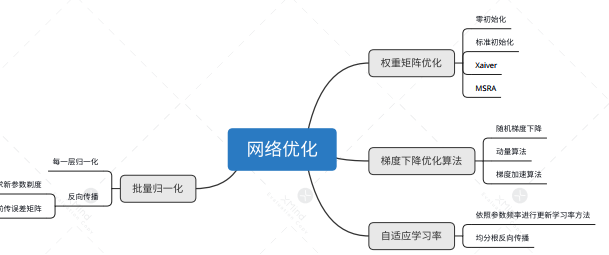

# 网络优化

## 思维导图




## 权重矩阵优化


- **零初始化**：在初始化时将权重值设为0，对于多层网络来说，不能用零初始化。

$$
    W = 0
$$
```python
def init_0(self):
    for i in range(self.w.lenth()):
        self.w[i] = 0
    print("init：0 is OK")
```

- **标准初始化**： 对于权重进行随机初始化，并使其满足正态分布或者是均匀分布，但神经网络的层数过多的时候不适用此初始化
  
$$  
    W \sim N\begin{pmatrix} 0, \frac{1}{\sqrt{n_{in}}}\end{pmatrix}
    W \sim U\begin{pmatrix} -\frac{1}{\sqrt{n_{in}}}, \frac{1}{\sqrt{n_{in}}}\end{pmatrix}

$$
```python
def init_S(self):
    for i in range(self.layer_num)
        self.layer.w = np.random.randn(1,self.layer.w_num)*0.01
        #乘0.01是因为要把W随机初始化到一个相对较小的值，因为如果X很大的话，W又相对较大，会导致Z非常大，这样如果激活函数是sigmoid，就会导致sigmoid的输出值1或者0，然后会导致一系列问题（比如cost function计算的时候，log里是0，这样会有点麻烦）
    print("init: S is Ok")
```

- **Xavier初始化**：正向传播时，激活值的方差保持不变；反向传播时，关于状态值的梯度的方差保持不变，也就是说他们在输入输出的分布要保持相似(适用于Sigmoid函数)

$$
W \sim N\begin{pmatrix} 0, \sqrt{\frac{2}{{n_{in}+n_{out}}}}\end{pmatrix}
    W \sim U\begin{pmatrix} -\sqrt{\frac{6}{n_{in}+n_{out}}}, \sqrt{\frac{6}{n_{in}+n_{out}}}\end{pmatrix}
$$
```python
def init_X(self)
     for i in range(self.layer_num)
        self.layer.w = np.random.randn(1,self.layer.w_num)*np.sqrt(1/(layer_num))
    print("init: X is OK")
```

- **MSRA初始化**：正向传播时，状态值的方差保持不变；反向传播时，关于激活值的梯度的方差保持不变（适用于ReLu函数）

$$
W \sim N \begin{pmatrix}0, \sqrt{\frac{2}{n_{in} + n_{out}}}\end{pmatrix}
W \sim U \begin{pmatrix} -\sqrt{\frac{6}{n_{in} + n_{out}}}, \sqrt{\frac{6}{n_{in} + n_{out}}} \end{pmatrix}
$$
```python
def init_M(self)
     for i in range(self.layer_num)
        self.layer.w = np.random.randn(1,self.layer.w_num)*np.sqrt(2/(layer_num))
    print("init: M is OK")
```
## 梯度下降

`梯度下降是指在神经网络的反向传播过程中权重矩阵的更新方式`

- **随机梯度下降**：`作为梯度下降法的提出，此方法借由损失函数，对要更新的参数的梯度计算来更新`
  
$$
    g_t = \nabla_{\theta} J(\theta_{t-1})
    \\ \theta_t = \theta_{t-1} - \eta \cdot g_t
$$

```python
def update_S(self,dW,dB):
    self.layer.w =  self.layer.w - dW *self.eta
    return dW,dB
```
- **动量梯度下降**：`参考历史的梯度下降来更新本次的参数`

$$
    g_t = \nabla_{\theta} J(\theta_{t-1}) \\
    v_t = \alpha \cdot v_{t-1} + \eta \cdot g_t \\ \theta_t = \theta_{t-1} - v_t
$$
```python
def update_M(self,dW,dB):
    alf =  0.9
    self.v = alf*self.v + self.eta * dW
    self.layer.w = self.layer.w - self.v  
```
- **加速梯度下降**：`预测到下一点的梯度方向，然后结合当前点的梯度方向，得到我们应该进行更新的方向`
  

**进一步理解**：`在原始形式中，Nesterov Accelerated Gradient（NAG）算法相对于Momentum的改进在于，以“向前看”看到的梯度而不是当前位置梯度去更新。经过变换之后的等效形式中，NAG算法相对于Momentum多了一个本次梯度相对上次梯度的变化量，这个变化量本质上是对目标函数二阶导的近似。由于利用了二阶导的信息，NAG算法才会比Momentum具有更快的收敛速度。`

## 自适应学习率

- **AdaGrad**：
 
 `在一般的梯度下降法中，对于每一个参数的训练都使用了相同的学习率α。Adagrad算法能够在训练中自动的对学习率进行调整，对于出现频率较低参数采用较大的α更新；相反，对于出现频率较高的参数采用较小的α更新。
因此，Adagrad非常适合处理稀疏数据`

- **Adadelta**:
  
  `Adadelta是对Adagrad的扩展，最初方案依然是对学习率进行自适应约束，但是进行了计算上的简化。 Adagrad会累加之前所有的梯度平方，而Adadelta只累加固定大小的项，并且也不直接存储这些项，仅仅是近似计算对应的平均值`

- **RMSProp**:

`RMSprop  使用的是指数加权平均，旨在消除梯度下降中的摆动，与Momentum的效果一样，某一维度的导数比较大，则指数加权平均就大，某一维度的导数比较小，则其指数加权平均就小，这样就保证了各维度导数都在一个量级，进而减少了摆动。允许使用一个更大的学习率η`

- **Adam**:
  
  `Adam(Adaptive Moment Estimation)本质上是带有动量项的RMSprop，它利用梯度的一阶矩估计和二阶矩估计动态调整每个参数的学习率。Adam的优点主要在于经过偏置校正后，每一次迭代学习率都有个确定范围，使得参数比较平稳`

## 批量归一化：

- **简介**：

批量归一化（batch normalization）层能让较深的神经网络的训练变得更加容易

通常来说，数据标准化预处理对于浅层模型就足够有效了。随着模型训练的进行，当每层中参数更新时，靠近输出层的输出较难出现剧烈变化。
但对深层神经网络来说，即使输入数据已做标准化，训练中模型参数的更新依然很容易造成靠近输出层输出的剧烈变化。这种计算数值的不稳定性通常令我们难以训练出有效的深度模型。

批量归一化的提出正是为了应对深度模型训练的挑战。

在模型训练时，批量归一化利用小批量上的均值和标准差，不断调整神经网络中间输出，从而使整个神经网络在各层的中间输出的数值更稳定。

- **作用**：
  
`1.加快训练速度
2.可以省去dropout，L1, L2等正则化处理方法
3.提高模型训练精度`

- **原理**：

