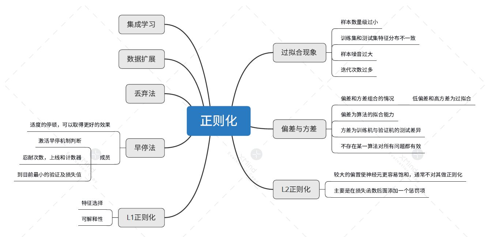

# 正则化

## 偏差与方差

**介绍**：
- 偏差：度量了学习算法的期望与真实结果的偏离程度，即学习算法的拟合能力。
- 方差：训练集与验证集的差异造成的模型表现的差异。
- 噪声：当前数据集上任何算法所能到达的泛化误差的下线，即学习问题本身的难度。

**定理**：

- 对于基于迭代的最优化算法，不存在某种算法对所有问题（有限的搜索空间内）都有效。如果一个算法对某些问题有效，那么它一定在另外一些问题上比纯随机搜索算法更差。

## L正则化

**范数**：
L0：L0范数是指向量中非0的元素的个数。
L1：L1范数是指向量中各个元素绝对值之和，也叫“稀疏规则算子”（Lasso regularization）。
L2:L2范数是向量所有元素的平方和的开平方

**正则化**：

L1：利用绝对值来作惩罚项
$$
\arg\min_wJ(w) = \sum_i^n(y_i-w^Tx_i)^2+\lambda\sum_j^m{\lvert w_j \rvert} 
$$
L2：利用平方值来作惩罚项
$$
\arg\min_wJ(w) = \sum_i^n(y_i-w^Tx_i)^2+\lambda\sum_j^m{w_j^2} 
$$

**异同点**：

相同点：都用于避免过拟合

不同点：1.L1可以让一部分特征的系数缩小到0，从而间接实现特征选择。所以L1适用于特征之间有关联的情况。

2.L2让所有特征的系数都缩小，但是不会减为0，它会使优化求解稳定快速。所以L2适用于特征之间没有关联的情况

**L1和L2的结合**：

## 过拟合（缓解办法）

**过拟合**：
过拟合是指为了得到一致假设而使假设变得过度严格。避免过拟合是分类器设计中的一个核心任务。通常采用增大数据量和测试样本集的方法对分类器性能进行评价。

**产生原因**：

1.样本数量级过⼩
2.训练集和测试集特征分布不⼀致
3.样本噪⾳过⼤
4.迭代次数过多

**早停法**：
1. 将原始的训练数据集划分成训练集和验证集
2. 只在训练集上进行训练，并每个一个周期计算模型在验证集上的误差，例如，每15次epoch（mini batch训练中的一个周期）
3. 当模型在验证集上的误差比上一次训练结果差的时候停止训练
4. 使用上一次迭代结果中的参数作为模型的最终参数

**丢弃法（MOOC有讲）**：

为了确保测试模型的确定性，丢弃法的使用只发生在训练模型时，并非测试模型时。当神经网络中的某一层使用丢弃法时，该层的神经元将有一定概率被丢弃掉。保证了模型不受某一元素支配

## 集成学习与数据扩展

**数据扩展（图片处理使用较多）**

一般获得新的数据方法比较麻烦，需要大量的成本，
对数据进行增强，即利用已有的数据比如翻转、平移或旋转，创造出更多的数据，来使得神经网络具有更好的泛化效果。数据扩充方法包括：镜像、旋转、尺度变换、随机抠取、色彩抖动

**集成学习**：

- 介绍：
  
  - 在机器学习的有监督学习算法中，我们的目标是学习出一个稳定的且在各个方面表现都较好的模型，但实际情况
  - 往往不这么理想，有时我们只能得到多个有偏好的模型（弱监督模型，在某些方面表现的比较好）。集成学习就
  - 是组合这里的多个弱监督模型以期得到一个更好更全面的强监督模型，集成学习潜在的思想是即便某一个弱分类器得到了错误的预测，其他的弱分类器也可以将错误纠正回来。

- 特点:

    - 序列集成方法，其中参与训练的基础学习器按照顺序生成（例如 AdaBoost）。序列方法的原理是利用基础学习器之间的依赖关系。通过对之前训练中错误标记的样本赋值较高的权重，可以提高整体的预测效果。
    - 并行集成方法，其中参与训练的基础学习器并行生成（例如 Random Forest）。并行方法的原理是利用基础学习器之间的独立性，通过平均可以显著降低错误。
  
**Bagging**:

Bagging即套袋法，先说一下bootstrap，bootstrap也称为自助法，它是一种有放回的抽样方法.

A）从原始样本集中抽取训练集。每轮从原始样本集中使用Bootstraping的方法抽取n个训练样本（在训练集中，有些样本可能被多次抽取到，而有些样本可能一次都没有被抽中）。共进行k轮抽取，得到k个训练集。（k个训练集之间是相互独立的）

B）每次使用一个训练集得到一个模型，k个训练集共得到k个模型。（注：这里并没有具体的分类算法或回归方法，我
们可以根据具体问题采用不同的分类或回归方法，如决策树、感知器等）

C）对分类问题：将上步得到的k个模型采用投票的方式得到分类结果；对回归问题，计算上述模型的均值作为最后的结果。（所有模型的重要性相同）

**Boosting**

其主要思想是将弱分类器组装成一个强分类器。在PAC（probably approximately correct，概率近似正确）学习框架下，则一定可以将弱分类器组装成一个强分类器。

**Stacking**:

Stacking方法是指训练一个模型用于组合其他各个模型。首先我们先训练多个不同的模型，然后把之前训练的各个模型的输出为输入来训练一个模型，以得到一个最终的输出。
理论上，Stacking可以表示上面提到的两种Ensemble方法，只要我们采用合适的模型组合策略即可。但在实际中，我们通常使用logistic回归作为组合策略。

