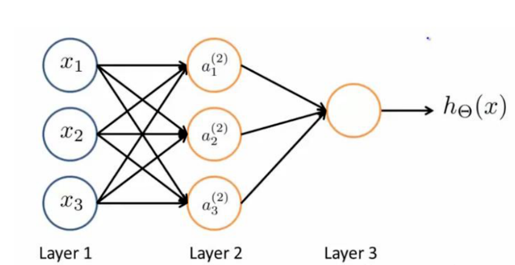
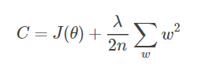
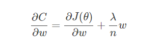
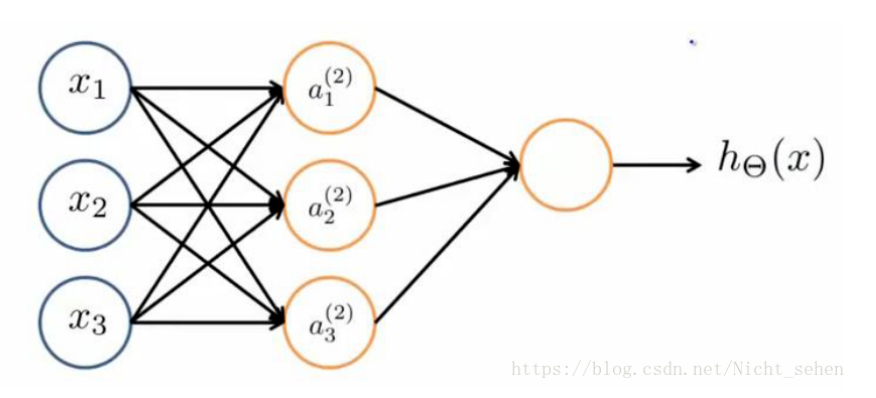
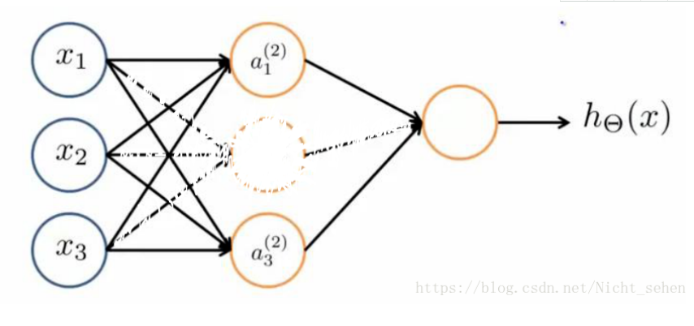

## 抽象与设计
#### NeuralNet

首先需要一个`NeuralNet`类，来包装基本的神经网络结构和功能：

- `Layers` - 神经网络各层的容器，按添加顺序维护一个列表
- `Parameters` - 基本参数，包括普通参数和超参
- `Loss Function` - 提供计算损失函数值，存储历史记录并最后绘图的功能
- `LayerManagement()` - 添加神经网络层
- `ForwardCalculation()` - 调用各层的前向计算方法
- `BackPropagation()` - 调用各层的反向传播方法
- `PreUpdateWeights()` - 预更新各层的权重参数
- `UpdateWeights()` - 更新各层的权重参数
- `Train()` - 训练
- `SaveWeights()` - 保存各层的权重参数
- `LoadWeights()` - 加载各层的权重参数

#### Layer

是一个抽象类，以及更加需要增加的实际类，包括：

- Fully Connected Layer
- Classification Layer
- Activator Layer
- Dropout Layer
- Batch Norm Layer

将来还会包括：

- Convolution Layer
- Max Pool Layer

每个Layer都包括以下基本方法：
 - `ForwardCalculation()` - 调用本层的前向计算方法
 - `BackPropagation()` - 调用本层的反向传播方法
 - `PreUpdateWeights()` - 预更新本层的权重参数
 - `UpdateWeights()` - 更新本层的权重参数
 - `SaveWeights()` - 保存本层的权重参数
 - `LoadWeights()` - 加载本层的权重参数

#### Activator Layer

激活函数和分类函数：

- `Identity` - 直传函数，即没有激活处理
- `Sigmoid`
- `Tanh`
- `Relu`

#### Classification Layer

分类函数，包括：

- `Sigmoid`二分类
- `Softmax`多分类


 #### Parameters

 基本神经网络运行参数：

 - 学习率
 - 最大`epoch`
 - `batch size`
 - 损失函数定义
 - 初始化方法
 - 优化器类型
 - 停止条件
 - 正则类型和条件

#### LossFunction

损失函数及帮助方法：

- 均方差函数
- 交叉熵函数二分类
- 交叉熵函数多分类
- 记录损失函数
- 显示损失函数历史记录
- 获得最小函数值时的权重参数

#### Optimizer

优化器：

- `SGD`
- `Momentum`
- `Nag`
- `AdaGrad`
- `AdaDelta`
- `RMSProp`
- `Adam`

#### WeightsBias

权重矩阵，仅供全连接层使用：

- 初始化 
  - `Zero`, `Normal`, `MSRA` (`HE`), `Xavier`
  - 保存初始化值
  - 加载初始化值
- `Pre_Update` - 预更新
- `Update` - 更新
- `Save` - 保存训练结果值
- `Load` - 加载训练结果值

#### DataReader

样本数据读取器：

- `ReadData` - 从文件中读取数据
- `NormalizeX` - 归一化样本值
- `NormalizeY` - 归一化标签值
- `GetBatchSamples` - 获得批数据
- `ToOneHot` - 标签值变成OneHot编码用于多分类
- `ToZeroOne` - 标签值变成0/1编码用于二分类
- `Shuffle` - 打乱样本顺序

从中派生出两个数据读取器：

- `MnistImageDataReader` - 读取MNIST数据
- `CifarImageReader` - 读取Cifar10数据
- 

超参数说明：

1. 输入层1个神经元，因为只有一个`x`值
2. 隐层4个神经元，对于此问题来说应该是足够了，因为特征很少
3. 输出层1个神经元，因为是拟合任务
4. 学习率=0.5
5. 最大`epoch=10000`轮
6. 批量样本数=10
7. 拟合网络类型
8. Xavier初始化
9. 绝对损失停止条件=0.001

### 二分类任务


超参数说明：

1. 输入层神经元数为2
2. 隐层的神经元数为3，使用Sigmoid激活函数
3. 由于是二分类任务，所以输出层只有一个神经元，用Logistic做二分类函数
4. 最多训练1000轮
5. 批大小=5
6. 学习率=0.1
7. 绝对误差停止条件=0.02

## 14.5 多分类功能测试

#### 超参数说明

1. 隐层8个神经元
2. 最大`epoch=5000`
3. 批大小=10
4. 学习率0.1
5. 绝对误差停止条件=0.08
6. 多分类网络类型
7. 初始化方法为Xavier

# 网络优化

随着网络的加深，训练变得越来越困难，时间越来越长，原因可能是：

- 参数多
- 数据量大
- 梯度消失
- 损失函数坡度平缓

为了解决上面这些问题，科学家们在深入研究网络表现的前提下，发现在下面这些方向上经过一些努力，可以给深度网络的训练带来或多或少的改善：

- 权重矩阵初始化
- 批量归一化
- 梯度下降优化算法
- 自适应学习率算法

## 权重矩阵初始化
### 零初始化

即把所有层的`W`值的初始值都设置为0。

$$
W = 0
$$

但是对于多层网络来说，绝对不能用零初始化，否则权重值不能学习到合理的结果

### 标准初始化

标准正态初始化方法保证激活函数的输入均值为0，方差为1。将W按如下公式进行初始化：

$$
W \sim N \begin{bmatrix} 0, 1 \end{bmatrix}
$$

其中的W为权重矩阵，N表示高斯分布，Gaussian Distribution，也叫做正态分布，Normal Distribution，所以有的地方也称这种初始化为Normal初始化。

### Xavier初始化方法

基于上述观察，Xavier Glorot等人研究出了下面的Xavier$^{[1]}$初始化方法。

条件：正向传播时，激活值的方差保持不变；反向传播时，关于状态值的梯度的方差保持不变。

$$
W \sim N
\begin{pmatrix}
0, \sqrt{\frac{2}{n_{in} + n_{out}}} 
\end{pmatrix}
$$

$$
W \sim U 
\begin{pmatrix}
 -\sqrt{\frac{6}{n_{in} + n_{out}}}, \sqrt{\frac{6}{n_{in} + n_{out}}} 
\end{pmatrix}
$$

其中的W为权重矩阵，N表示正态分布（Normal Distribution），U表示均匀分布（Uniform Distribution)
### MSRA初始化方法

MSRA初始化方法$^{[2]}$，又叫做He方法，

条件：正向传播时，状态值的方差保持不变；反向传播时，关于激活值的梯度的方差保持不变。

网络初始化是一件很重要的事情。但是，传统的固定方差的高斯分布初始化，在网络变深的时候使得模型很难收敛。

### 小结

表 几种初始化方法的应用场景

|ID|网络深度|初始化方法|激活函数|说明|
|---|---|---|---|---|
|1|单层|零初始化|无|可以|
|2|双层|零初始化|Sigmoid|错误，不能进行正确的反向传播|
|3|双层|随机初始化|Sigmoid|可以|
|4|多层|随机初始化|Sigmoid|激活值分布成凹形，不利于反向传播|
|5|多层|Xavier初始化|Tanh|正确|
|6|多层|Xavier初始化|ReLU|激活值分布偏向0，不利于反向传播|
|7|多层|MSRA初始化|ReLU|正确|

从表可以看到，由于网络深度和激活函数的变化，使得人们不断地研究新的初始化方法来适应，最终得到1、3、5、7这几种组合。


## 15.2 梯度下降优化算法

### 15.2.1 随机梯度下降 SGD

#### 输入和参数

- $\eta$ - 全局学习率

#### 算法

---

计算梯度：$g_t = \nabla_\theta J(\theta_{t-1})$

更新参数：$\theta_t = \theta_{t-1}  - \eta \cdot g_t$

---

随机梯度下降算法，在当前点计算梯度，根据学习率前进到下一点。到中点附近时，由于样本误差或者学习率问题，会发生来回徘徊的现象，很可能会错过最优解。


### 动量算法 Momentum

SGD方法的一个缺点是其更新方向完全依赖于当前batch计算出的梯度，因而十分不稳定，因为数据有噪音。

Momentum算法借用了物理中的动量概念，它模拟的是物体运动时的惯性，即更新的时候在一定程度上保留之前更新的方向，同时利用当前batch的梯度微调最终的更新方向。这样一来，可以在一定程度上增加稳定性，从而学习地更快，并且还有一定摆脱局部最优的能力。Momentum算法会观察历史梯度，若当前梯度的方向与历史梯度一致（表明当前样本不太可能为异常点），则会增强这个方向的梯度。若当前梯度与历史梯度方向不一致，则梯度会衰减。


#### 输入和参数

- $\eta$ - 全局学习率
- $\alpha$ - 动量参数，一般取值为0.5, 0.9, 0.99
- $v_t$ - 当前时刻的动量，初值为0
  
#### 算法

---

计算梯度：$g_t = \nabla_\theta J(\theta_{t-1})$

计算速度更新：$v_t = \alpha \cdot v_{t-1} + \eta \cdot g_t$ (公式1)
 
更新参数：$\theta_t = \theta_{t-1}  - v_t$ (公式2)

---


### 15.2.3 梯度加速算法 NAG

Nesterov Accelerated Gradient，或者叫做Nesterov Momentum。

#### 输入和参数

- $\eta$ - 全局学习率
- $\alpha$ - 动量参数，缺省取值0.9
- $v$ - 动量，初始值为0
  
#### 算法

---

临时更新：$\hat \theta = \theta_{t-1} - \alpha \cdot v_{t-1}$

前向计算：$f(\hat \theta)$

计算梯度：$g_t = \nabla_{\hat\theta} J(\hat \theta)$

计算速度更新：$v_t = \alpha \cdot v_{t-1} + \eta \cdot g_t$

更新参数：$\theta_t = \theta_{t-1}  - v_t$

---

## 自适应学习率算法

### AdaGrad

#### 输入和参数

- $\eta$ - 全局学习率
- $\epsilon$ - 用于数值稳定的小常数，建议缺省值为`1e-6`
- $r=0$ 初始值
  
#### 算法

---

计算梯度：$g_t = \nabla_\theta J(\theta_{t-1})$

累计平方梯度：$r_t = r_{t-1} + g_t \odot g_t$

计算梯度更新：$\Delta \theta = {\eta \over \epsilon + \sqrt{r_t}} \odot g_t$

更新参数：$\theta_t=\theta_{t-1} - \Delta \theta$

---

### AdaDelta

Adaptive Learning Rate Method. $^{[2]}$

AdaDelta法是AdaGrad 法的一个延伸，它旨在解决它学习率不断单调下降的问题。相比计算之前所有梯度值的平方和，AdaDelta法仅计算在一个大小为w的时间区间内梯度值的累积和。

但该方法并不会存储之前梯度的平方值，而是将梯度值累积值按如下的方式递归地定义：关于过去梯度值的衰减均值，当前时间的梯度均值是基于过去梯度均值和当前梯度值平方的加权平均，其中是类似上述动量项的权值。

#### 输入和参数

- $\epsilon$ - 用于数值稳定的小常数，建议缺省值为1e-5
- $\alpha \in [0,1)$ - 衰减速率，建议0.9
- $s$ - 累积变量，初始值0
- $r$ - 累积变量变化量，初始为0
 
#### 算法

---

计算梯度：$g_t = \nabla_\theta J(\theta_{t-1})$

累积平方梯度：$s_t = \alpha \cdot s_{t-1} + (1-\alpha) \cdot g_t \odot g_t$

计算梯度更新：$\Delta \theta = \sqrt{r_{t-1} + \epsilon \over s_t + \epsilon} \odot g_t$

更新梯度：$\theta_t = \theta_{t-1} - \Delta \theta$

更新变化量：$r = \alpha \cdot r_{t-1} + (1-\alpha) \cdot \Delta \theta \odot \Delta \theta$

---

### 均方根反向传播 RMSProp

Root Mean Square Prop。$^{[3]}$

RMSprop 是由 Geoff Hinton 在他 Coursera 课程中提出的一种适应性学习率方法，至今仍未被公开发表。RMSprop法要解决AdaGrad的学习率缩减问题。

#### 输入和参数

- $\eta$ - 全局学习率，建议设置为0.001
- $\epsilon$ - 用于数值稳定的小常数，建议缺省值为1e-8
- $\alpha$ - 衰减速率，建议缺省取值0.9
- $r$ - 累积变量矩阵，与$\theta$尺寸相同，初始化为0
  
#### 算法

---

计算梯度：$g_t = \nabla_\theta J(\theta_{t-1})$

累计平方梯度：$r = \alpha \cdot r + (1-\alpha)(g_t \odot g_t)$

计算梯度更新：$\Delta \theta = {\eta \over \sqrt{r + \epsilon}} \odot g_t$

更新参数：$\theta_{t}=\theta_{t-1} - \Delta \theta$

---


### Adam - Adaptive Moment Estimation

计算每个参数的自适应学习率，相当于RMSProp + Momentum的效果，Adam$^{[4]}$算法在RMSProp算法基础上对小批量随机梯度也做了指数加权移动平均。和AdaGrad算法、RMSProp算法以及AdaDelta算法一样，目标函数自变量中每个元素都分别拥有自己的学习率。

#### 输入和参数

- $t$ - 当前迭代次数
- $\eta$ - 全局学习率，建议缺省值为0.001
- $\epsilon$ - 用于数值稳定的小常数，建议缺省值为1e-8
- $\beta_1, \beta_2$ - 矩估计的指数衰减速率，$\in[0,1)$，建议缺省值分别为0.9和0.999

#### 算法

---

计算梯度：$g_t = \nabla_\theta J(\theta_{t-1})$

计数器加一：$t=t+1$

更新有偏一阶矩估计：$m_t = \beta_1 \cdot m_{t-1} + (1-\beta_1) \cdot g_t$

更新有偏二阶矩估计：$v_t = \beta_2 \cdot v_{t-1} + (1-\beta_2)(g_t \odot g_t)$

修正一阶矩的偏差：$\hat m_t = m_t / (1-\beta_1^t)$

修正二阶矩的偏差：$\hat v_t = v_t / (1-\beta_2^t)$

计算梯度更新：$\Delta \theta = \eta \cdot \hat m_t /(\epsilon + \sqrt{\hat v_t})$

更新参数：$\theta_t=\theta_{t-1} - \Delta \theta$

---
## 算法在等高线图上的效果比较

### 模拟效果比较

我们依次测试4种方法：

- 普通SGD, 学习率0.95
- 动量Momentum, 学习率0.1
- RMPSProp，学习率0.5
- Adam，学习率0.5


## 批量归一化的原理

### 基本数学知识

#### 正态分布

正态分布，又叫做高斯分布。

若随机变量$X$，服从一个位置参数为$\mu$、尺度参数为$\sigma$的概率分布，且其概率密度函数为：

$$
f(x)=\frac{1}{\sigma\sqrt{2 \pi} } e^{- \frac{{(x-\mu)^2}}{2\sigma^2}} \tag{1}
$$

则这个随机变量就称为正态随机变量，正态随机变量服从的分布就称为正态分布，记作：

$$
X \sim N(\mu,\sigma^2) \tag{2}
$$

当μ=0,σ=1时，称为标准正态分布：

$$X \sim N(0,1) \tag{3}$$

此时公式简化为：

$$
f(x)=\frac{1}{\sqrt{2 \pi}} e^{- \frac{x^2}{2}} \tag{4}
$$

图 不同参数的正态分布函数曲线

### 批量归一化

既然可以把原始训练样本做归一化，那么如果在深度神经网络的每一层，都可以有类似的手段，也就是说把层之间传递的数据移到0点附近，那么训练效果就应该会很理想。这就是批归一化BN的想法的来源。

深度神经网络随着网络深度加深，训练起来越困难，收敛越来越慢，这是个在DL领域很接近本质的问题。很多论文都是解决这个问题的，比如ReLU激活函数，再比如Residual Network。BN本质上也是解释并从某个不同的角度来解决这个问题的。

BN就是在深度神经网络训练过程中使得每一层神经网络的输入保持相同的分布，致力于将每一层的输入数据正则化成$N(0,1)$的分布。因次，每次训练的数据必须是mini-batch形式，一般取32，64等数值。


### 前向计算

#### 符号表
m表示batch_size的大小，比如32或64个样本/批；n表示features数量，即样本特征值数量。

|符号|数据类型|数据形状|
|:---------:|:-----------:|:---------:|
|$X$| 输入数据矩阵 | [m, n] |
|$x_i$|输入数据第i个样本| [1, n] |
|$N$| 经过归一化的数据矩阵 | [m, n] |
|$n_i$| 经过归一化的单样本 | [1, n] |
|$\mu_B$| 批数据均值 | [1, n] |
|$\sigma^2_B$| 批数据方差 | [1, n] |
|$m$|批样本数量| [1] |
|$\gamma$|线性变换参数| [1, n] |
|$\beta$|线性变换参数| [1, n] |
|$Z$|线性变换后的矩阵| [1, n] |
|$z_i$|线性变换后的单样本| [1, n] |
|$\delta$| 反向传入的误差 | [m, n] |

如无特殊说明，以下乘法为元素乘，即element wise的乘法。

具体的算法步骤是：

$$
\mu_B = \frac{1}{m}\sum_1^m x_i \tag{6}
$$

$$
\sigma^2_B = \frac{1}{m} \sum_1^m (x_i-\mu_B)^2 \tag{7}
$$

$$
n_i = \frac{x_i-\mu_B}{\sqrt{\sigma^2_B + \epsilon}} \tag{8}
$$

$$
z_i = \gamma n_i + \beta \tag{9}
$$

其中，$\gamma,\beta$是训练出来的，$\epsilon$是防止$\sigma_B^2$为0时加的一个很小的数值，通常为`1e-5`。

### 批量归一化的优点

1. 可以选择比较大的初始学习率，让你的训练速度提高。
   
    以前还需要慢慢调整学习率，甚至在网络训练到一定程度时，还需要想着学习率进一步调小的比例选择多少比较合适，现在我们可以采用初始很大的学习率，因为这个算法收敛很快。当然这个算法即使你选择了较小的学习率，也比以前的收敛速度快，因为它具有快速训练收敛的特性；

2. 减少对初始化的依赖
   
    一个不太幸运的初始化，可能会造成网络训练实际很长，甚至不收敛。

3. 减少对正则的依赖
   
  采用BN算法后，我们会逐步减少对正则的依赖，比如令人头疼的dropout、L2正则项参数的选择问题，或者可以选择更小的L2正则约束参数了，因为BN具有提高网络泛化能力的特性；


# 正则化

正则化的英文为Regularization，用于防止过拟合。

##  过拟合

###  拟合程度比较

神经网络的两大功能：回归和分类。这两类任务，都会出现欠拟合和过拟合现象。

回归任务中的三种情况，依次为：欠拟合、正确的拟合、过拟合。

分类任务中的三种情况，依次为：分类欠妥、正确的分类、分类过度。由于分类可以看作是对分类边界的拟合，所以我们经常也统称其为拟合。

出现过拟合的原因：

1. 训练集的数量和模型的复杂度不匹配，样本数量级小于模型的参数
2. 训练集和测试集的特征分布不一致
3. 样本噪音大，使得神经网络学习到了噪音，正常样本的行为被抑制
4. 迭代次数过多，过分拟合了训练数据，包括噪音部分和一些非重要特征

### 16.0.4 解决过拟合问题

有了直观感受和理论知识，下面我们看看如何解决过拟合问题：

1. 数据扩展
2. 正则
3. 丢弃法
4. 早停法
5. 集成学习法
6. 特征工程（属于传统机器学习范畴，不在此处讨论）
7. 简化模型，减小网络的宽度和深度

## 16.1 偏差与方差

### 16.1.3 偏差-方差分解

除了用上面的试验来估计泛化误差外，我们还希望在理论上分析其必然性，这就是偏差-方差分解的作用。

符号含义

|符号|含义|
|---|---|
|$x$|测试样本|
|$D$|数据集|
|$y$|x的真实标记|
|$y_D$|x在数据集中标记(可能有误差)|
|$f$|从数据集D学习的模型|
|$f_{x;D}$|从数据集D学习的模型对x的预测输出|
|$f_x$|模型f对x的期望预测输出|

学习算法期望的预测：
$$f_x=E[f_{x;D}] \tag{1}$$
不同的训练集/验证集产生的预测方差：
$$var(x)=E[(f_{x;D}-f_x)^2] \tag{2}$$
噪声：
$$\epsilon^2=E[(y_D-y)^2] \tag{3}$$
期望输出与真实标记的偏差：
$$bias^2(x)=(f_x-y)^2 \tag{4}$$
算法的期望泛化误差：

$$
\begin{aligned}
E(f;D)&=E[(f_{x;D}-y_D)^2]=E[(f_{x;D}-f_x+f_x-y_D)^2] \\\\
&=E[(f_{x;D}-f_x)^2]+E[(f_x-y_D)^2]+E[2(f_{x;D}-f_x)(f_x-y_D)]=E[(f_{x;D}-f_x)^2]+E[(f_x-y_D)^2] \\\\
&=E[(f_{x;D}-f_x)^2]+E[(f_x-y+y-y_D)^2]=E[(f_{x;D}-f_x)^2]+E[(f_x-y)^2]+E(y-y_D)^2]+E[2(f_x-y)(y-y_D)] \\\\
&=E[(f_{x;D}-f_x)^2]+(f_x-y)^2+E[(y-y_D)^2]=var(x) + bias^2(x) + \epsilon^2
\end{aligned}
$$

各个项的含义是：

- 偏差：度量了学习算法的期望与真实结果的偏离程度，即学习算法的拟合能力。
- 方差：训练集与验证集的差异造成的模型表现的差异。
- 噪声：当前数据集上任何算法所能到达的泛化误差的下线，即学习问题本身的难度。

想当然地，我们希望偏差与方差越小越好，但实际并非如此。一般来说，偏差与方差是有冲突的，称为偏差-方差窘境 (bias-variance dilemma)。


###  基本数学知识

#### 范数
范数的基本概念：

$$L_p = \lVert x \rVert_p = ({\sum^n_{i=1}\lvert x_i \rvert^p})^{1/p} \tag{1}$$

范数包含向量范数和矩阵范数，我们只关心向量范数。我们用具体的数值来理解范数。假设有一个向量a：

$$a=[1,-2,0,-4]$$

$$L_0=3 \tag{非0元素数}$$
$$L_1 = \sum^3_{i=0}\lvert x_i \rvert = 1+2+0+4=7 \tag{绝对值求和}$$
$$L_2 = \sqrt[2]{\sum^3_{i=0}\lvert x_i \rvert^2} =\sqrt[2]{21}=4.5826 \tag{平方和求方根}$$
$$L_{\infty}=4 \tag{最大值的绝对值}$$

注意p可以是小数

###  基本数学知识

#### 拉普拉斯分布

$$
\begin{aligned}
f(x)&=\frac{1}{2b}\exp(-\frac{|x-\mu|}{b})\\\\
&= \frac{1}{2b} \begin{cases} \exp(\frac{x-\mu}{b}), & x \lt \mu \\\\ \exp(\frac{\mu-x}{b}), & x \gt \mu \end{cases}
\end{aligned}
$$


#### L0范数与L1范数

L0范数是指向量中非0的元素的个数。如果我们用L0范数来规则化一个参数矩阵W的话，就是希望W的大部分元素都是0，即让参数W是稀疏的。

L1范数是指向量中各个元素绝对值之和，也叫“稀疏规则算子”（Lasso regularization）。为什么L1范数会使权值稀疏？有人可能会这样给你回答“它是L0范数的最优凸近似”。实际上，还存在一个更美的回答：任何的规则化算子，如果他在$w_i=0$的地方不可微，并且可以分解为一个“求和”的形式，那么这个规则化算子就可以实现稀疏。w的L1范数是绝对值，所以$|w|$在$w=0$处是不可微。

为什么L0和L1都可以实现稀疏，但常用的为L1？一是因为L0范数很难优化求解，二是L1范数是L0范数的最优凸近似，而且它比L0范数要容易优化求解。所以大家才把目光转于L1范数。

综上，L1范数和L0范数可以实现稀疏，L1因具有比L0更好的优化求解特性而被广泛应用。

###  L1正则化

假设：

- W参数服从拉普拉斯分布，即$w_j \sim Laplace(0,b)$
- Y服从高斯分布，即$y_i \sim N(w^Tx_i,\sigma^2)$

贝叶斯最大后验估计：
$$
\begin{aligned}
\arg\max_wL(w) = &\ln \prod_i^n \frac{1}{\sigma\sqrt{2 \pi}}\exp(-\frac{1}{2}(\frac{y_i-w^Tx_i}{\sigma})^2) 
\cdot \prod_j^m{\frac{1}{2b}\exp(-\frac{\lvert w_j \rvert}{b})}
\\\\
=&-\frac{1}{2\sigma^2}\sum_i^n(y_i-w^Tx_i)^2-\frac{1}{2b}\sum_j^m{\lvert w_j \rvert}
-n\ln\sigma\sqrt{2\pi}-m\ln b\sqrt{2\pi} 
\end{aligned}
\tag{1}
$$

因为$\sigma,b,n,\pi,m$等都是常数，所以损失函数$J(w)$的最小值可以简化为：

$$
\arg\min_wJ(w) = \sum_i^n(y_i-w^Tx_i)^2+\lambda\sum_j^m{\lvert w_j \rvert} \tag{2}
$$

我们仍以两个参数为例，公式2的后半部分的正则形式为：

$$L_1 = \lvert w_1 \rvert + \lvert w_2 \rvert \tag{3}$$

因为$w_1,w_2$有可能是正数或者负数，我们令$x=|w_1|,y=|w_2|,c=L_1$，则公式3可以拆成以下4个公式的组合：

$$
y=-x+c \quad (当w_1 \gt 0, w_2 \gt 0时)
$$
$$
y=\quad x+c \quad (当w_1 \lt 0, w_2 \gt 0时)
$$
$$
y=\quad x-c \quad (当w_1 \gt 0, w_2 \lt 0时)
$$
$$
y=-x-c \quad (当w_1 \lt 0, w_2 \lt 0时)
$$

所以上述4个公式（4条直线）会组成一个二维平面上的一个菱形。


##  早停法 Early Stopping

###  理论基础

早停法，实际上也是一种正则化的策略，可以理解为在网络训练不断逼近最优解的过程种（实际上这个最优解是过拟合的），在梯度等高线的外围就停止了训练，所以其原理上和L2正则是一样的，区别在于得到解的过程。

###  算法

一般的做法是，在训练的过程中，记录到目前为止最好的validation 准确率，当连续N次Epoch（比如N=10或者更多次）没达到最佳准确率时，则可以认为准确率不再提高了。此时便可以停止迭代了（Early Stopping）。这种策略也称为“No-improvement-in-N”，N即Epoch的次数，可以根据实际情况取，如10、20、30……

算法描述如下：

***

```
初始化
    初始权重均值参数：theta = theta_0
    迭代次数：i = 0
    忍耐次数：patience = N (e.g. N=10)
    忍耐次数计数器：counter = 0
    验证集损失函数值：lastLoss = 10000 (给一个特别大的数值)

while (epoch < maxEpoch) 循环迭代训练过程
    正向计算，反向传播更新theta
    迭代次数加1：i++
    计算验证集损失函数值：newLoss = loss
    if (newLoss < lastLoss) // 新的损失值更小
        忍耐次数计数器归零：counter = 0
        记录当前最佳权重矩阵训练参数：theta_best = theta
        记录当前迭代次数：i_best = i
        更新最新验证集损失函数值：lastLoss = newLoss
    else // 新的损失值大于上一步的损失值
        忍耐次数计数器加1：counter++
        if (counter >= patience) 停止训练！！！
    end if
end while
```

***

此时，`theta_best`和`i_best`就是最佳权重值和迭代次数。

#### 要注意的问题

1. 门限值`patience`不能太小，比如小于5，因为很可能在5个`epoch`之外，损失函数值又会再次下降
2. `patience`不能太大，比如大于30，因为在这30个`epoch`之内，由于样本数量少和数据`shuffle`的关系，很可能某个`epoch`的损失函数值会比上一次低，这样忍耐次数计数器`counter`就清零了，从而不能及时停止。
3. 当样本数量少时，为了获得平滑的变化曲线，可以考虑使用加权平均的方式处理当前和历史损失函数值，以避免某一次的高低带来的影响。


##  丢弃法 Dropout

###  算法与实现

#### 前向计算

正常的隐层计算公式是：

$$
Z = W \cdot X + B \tag{1}
$$

加入随机丢弃步骤后，变成了：

$$
r \sim Bernoulli(p) \tag{2}
$$
$$Y = r \cdot X \tag{3}$$
$$Z = Y \cdot W + B \tag{4}
$$

公式2是得到一个分布概率为p的伯努利分布，伯努利分布在这里可以简单地理解为0-1分布，$p=0.5$时，会以相同概率产生0、1，假设一共10个数，则：
$$
r=[0,0,1,1,0,1,0,1,1,0]
$$
或者
$$
r=[0,1,1,0,0,1,0,1,0,1]
$$
或者其它一些分布。

从公式3，Y将会是X经过r的mask的结果，1的位置保留原x值，0的位置相乘后为0。

#### 反向传播

在反向传播时，和Relu函数的反向差不多，需要记住正向计算时得到的mask值，反向的误差矩阵直接乘以这个mask值就可以了。

## 数据增强 Data Augmentation

###  图像数据增强

#### 旋转

定义图片中心和旋转角度，进行微小的旋转。


#### 缩放

#### 平移和添加噪音

#### 其它图像处理方法

- 翻转图像：即左右镜像，或者上下镜像，但是对于数字识别来说不合适
- 剪裁图像：从图像中随机选择一部分，再调整为原始图像大小，对于本例也不适合
- 颜色变化：对图像进行颜色抖动，即对RGB值进行随机扰动，如椒盐噪声和高斯噪声
- 对比度变化：通过修改HSV空间中的色调和饱和度来改变图像的对比度，也可以用直方图均衡化
- 亮度变化：改变整个图像的亮度
- 颜色增强：对于颜色暗淡的图片进行全图的颜色增强

###  多样本合成法

#### SMOTE

SMOTE,Synthetic Minority Over-sampling Technique$^{[1]}$，通过人工合成新样本来处理样本不平衡问题，提升分类器性能。

类不平衡现象是数据集中各类别数量不近似相等。如果样本类别之间相差很大，会影响分类器的分类效果。假设小样本数据数量极少，仅占总体的1%，所能提取的相应特征也极少，即使小样本被错误地全部识别为大样本，在经验风险最小化策略下的分类器识别准确率仍能达到99%，但在验证环节分类效果不佳。

基于插值的SMOTE方法为小样本类合成新的样本，主要思路为：

1. 定义好特征空间，将每个样本对应到特征空间中的某一点，根据样本不平衡比例确定采样倍率N；
2. 对每一个小样本类样本$(x,y)$，按欧氏距离找K个最近邻样本，从中随机选取一个样本点，假设选择的近邻点为$(x_n,y_n)$。在特征空间中样本点与最近邻样本点的连线段上随机选取一点作为新样本点，满足以下公式:

$$(x_{new},y_{new})=(x,y)+rand(0,1)\times ((x_n-x),(y_n-y))$$

#### SamplePairing

SamplePairing$^{[2]}$方法，从训练集中随机抽取两张图片分别经过基础数据增强操作（如随机翻转等）处理后经像素取平均值的形式叠加合成一个新的样本，标签为原样本标签中的一种。

#### Mixup

Mixup$^{[3]}$是基于邻域风险最小化（VRM）原则的数据增强方法，使用线性插值得到新样本数据。在邻域风险最小化原则下，根据特征向量线性插值将导致相关目标线性插值的先验知识，可得出简单且与数据无关的mixup公式：

$$
x_n=\lambda x_i + (1-\lambda)x_j \\\\
y_n=\lambda y_i + (1-\lambda)y_j
$$

其中$(x_n，y_n)$是插值生成的新数据，$(x_i,y_i)$和$(x_j，y_j)$是训练集中随机选取的两个数据，λ的取值满足贝塔分布，取值范围介于0到1，超参数α控制特征目标之间的插值强度。

#### 小结

Mixup、SMOTE、SamplePairing三者思路上有相同之处，都是试图将离散样本点连续化来拟合真实样本分布，但所增加的样本点在特征空间中仍位于已知小样本点所围成的区域内。但在特征空间中，小样本数据的真实分布可能并不限于该区域中，在给定范围之外适当插值，也许能实现更好的数据增强效果。


##  集成学习 Ensemble Learning

###  集成学习的概念

当数据集有问题，或者网络学习能力不足，或准确度不够时，我们可以采取集成学习的方法，来提升性能。说得通俗一些，就是发挥团队的智慧，根据团队中不同背景、不同能力的成员的独立意见，通过某种决策方法来解决一个问题。所以集成学习也称为多分类器系统(multi-classifier system)、基于委员会的学习(committee-based learning)等。


#### Individual Learner 个体学习器

如果所有的个体学习器都是同一类型的学习器，即同质模式，比如都用神经网路，称为“基学习器”（base learner），相应的学习算法称为“基学习算法”（base learning algorithm）。

在传统的机器学习中，个体学习器可以是不同的，比如用决策树、支持向量机等，此时称为异质模式。

#### Aggregator 结合模块

个体学习器的输出，通过一定的结合策略，在结合模块中有机结合在一起，可以形成一个能力较强的学习器，所以有时称为强学习器，而相应地称个体学习器为弱学习器。

个体学习器之间是否存在依赖关系呢？这取决于产生个体学习器的方法：

- Boosting系列算法，一系列的个体学习器需要一个个地串行生成，有前后依赖关系。
- Bagging算法和随机森林算法（Random Forest），个体学习器可以独立或并行生成，没有依赖关系。

###  Bagging法集成学习的基本流程

图16-37是Bagging集成学习的示意图。

1. 首先是数据集的使用，采用自助采样法（Bootstrap Sampling）。假设原始数据集Training Set中有1000个样本，我们从中随机取一个样本的拷贝放到Training Set-1中，此样本不会从原始数据集中被删除，原始数据集中还有1000个样本，而不是999个，这样下次再随机取样本时，此样本还有可能被再次选到。如此重复m次（此例m=1000），我们可以生成Training Set-1。一共重复N次（此例N=9），可以得到N个数据集。
2. 然后搭建一个神经网络模型，可以参数相同。在N个数据集上，训练出N个模型来。
3. 最后再进入Aggregator。N值不能太小，否则无法提供差异化的模型，也不能太大而带来训练模型的时间花销，一般来说取5到10就能满足要求。

###  集成方法选择

#### 平均法

在回归任务中，输出为一个数值，可以使用平均法来处理多个神经网络的输出值。下面公式中的$h_i(x)$表示第i个神经网络的输出，$H(x)$表示集成后的输出。

- 简单平均法：所有值加起来除以N。
  $$H(x)=\frac{1}{N} \sum_{i=1}^N h_i(x)$$

- 加权平均法：给每个输出值一个人为定义的权重。
$$H(x)=\sum_{i=1}^N w_i \cdot h_i(x)$$

权重值如何给出呢？假设第一个神经网络的准确率为80%，第二个为85%，我们可以令：

$$w_1=0.8,w_2=0.85$$

这样准确率高的网络会得到较大的权重值。

#### 投票法

对于分类任务，将会从类别标签集合$\\{c_1, c_2, ...,c_n\\}$中预测出一个值，多个神经网络可能会预测出不一样的值，此时可以采样投票法。

- 绝对多数投票法（majority voting）

    当有半数以上的神经网路预测出同一个类别标签时，我们可以认为此预测有效。如果少于半数，则可以认为预测无效。

    比如9个神经网络，5个预测图片上的数字为7，则最终结果就是7。如果有4个神经网络预测为7，3个预测为4，2个预测为1，则认为预测失败。

- 加权投票法(weighted voting)

    与加权平均法类似。

- 相对多数投票法（plurality voting）

    即得票最多的标签获胜。如果有多个标签获得相同的票数，随机选一个。

#### 学习法

学习法，就是用另外一个神经网络，通过训练的方式，把9个神经网路的输出结果作为输入，把图片的真实数字作为标签，得到一个强学习器。

# 总结
## DNN模型

x1,x2,x3 是输入的数据，a(2)1,a(2)2,a(2)3表示第2层的数据，从x1到第二层，需要一个激活函数，这个函数可以是逻辑回归的Sigmoid函数，也可以是其他的函数。一般有以下三种常用的函数：


## 损失函数（交叉熵）
交叉熵可以用来衡量两个概率分布之间的距离，是分类问题中使用比较光的一种损失函数。对于两个概率分布 p 和 q，表示交叉熵如下：


## DNN反向传播
反向传播算法是训练神经网络的核心算法，它可以根据定义好的损失函数优化神经网络的参数值，是神经网络模型的损失函数达到一个较小的值。梯度下降算法是最常用的神经网络优化方法。

## L2 正则化（权重衰减）
L2正则化就是在代价函数后面再加上一个正则化项

J(θ)代表原始的代价函数，后面那一项就是L2正则化项，它是这样来的：所有参数w的平方的和，除以训练集的样本大小 n。λ就是正则项系数，权衡正则项与 J(θ)项的比重。另外还有一个系数 1/2，主要是为了后面求导的结果方便。
求偏导：


其中 α为学习率，显然可以看出L2正则化使得 w减小，而更小的权值w，从某种意义上说，表示网络的复杂度更低，对数据的拟合刚刚好。
## L1正则化
在原始的代价函数后面加上一个L1正则化项

## Dropout
所谓的Dropout指的是在对训练集中的一批数据进行训练时，随机的从全连接DNN网络中去掉一部分隐藏层的神经元。并用去掉隐藏层的神经元的网络来拟合我们的一批训练数据。然后用这个去掉隐藏层的神经元的网络来进行一轮迭代、更新。当然，dropout并不意味着这些神经元永远的消失了。在下一批数据迭代前，我们会把DNN模型恢复成最初的全连接模型，然后再用随机的方法去掉部分隐藏层的神经元，接着去迭代更新。
如：之前


之后



