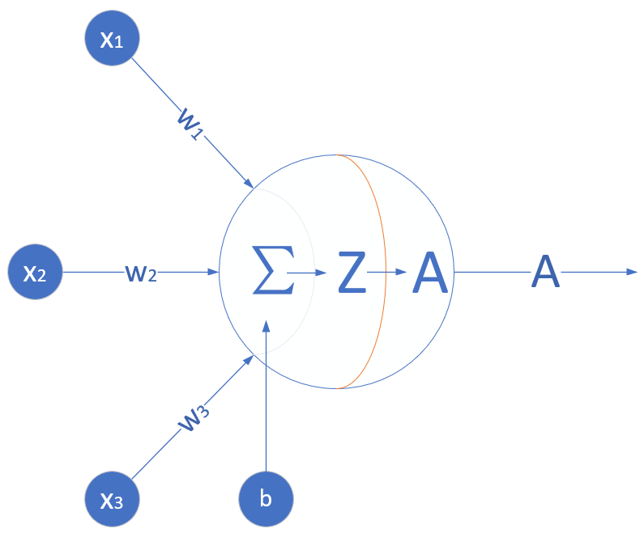
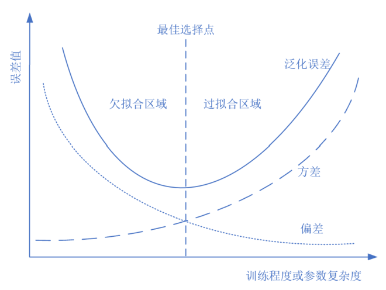
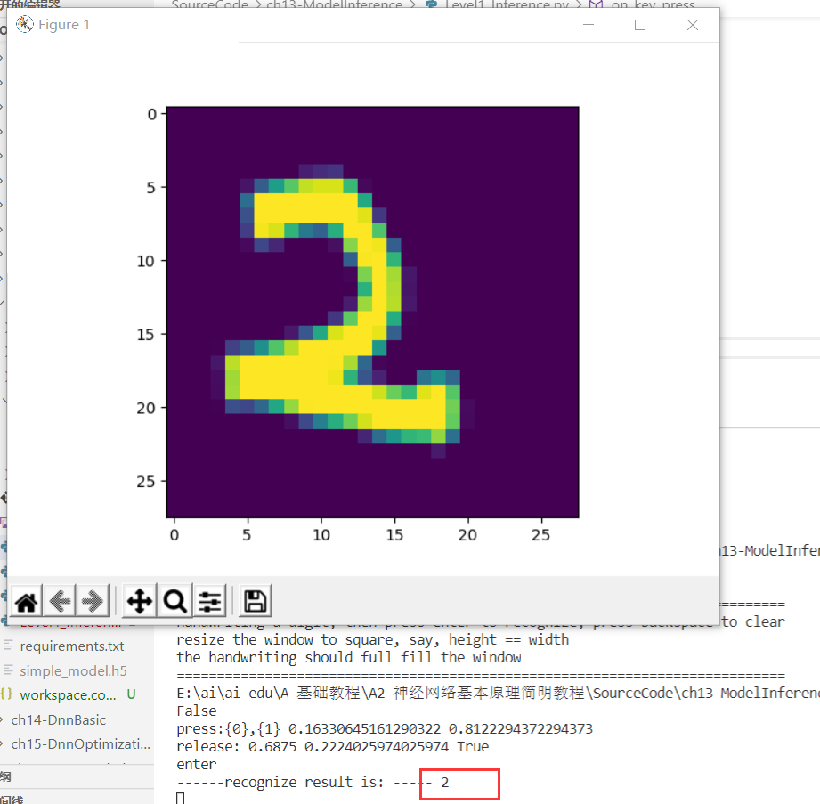
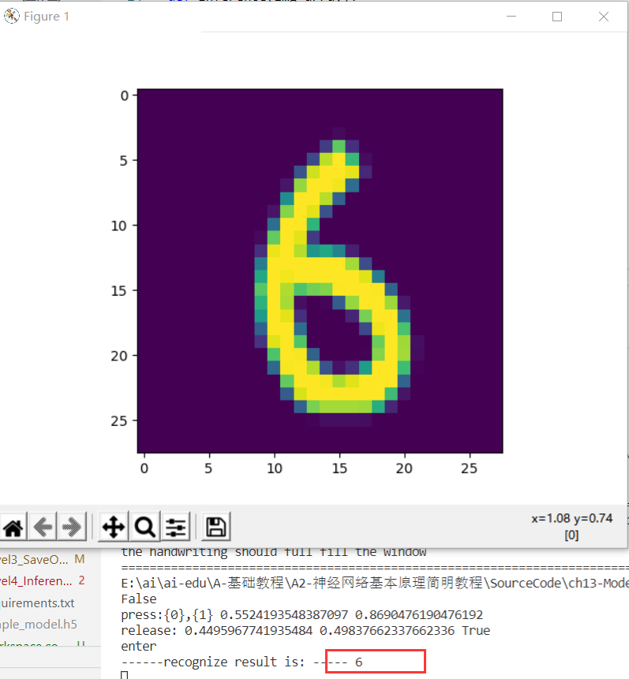
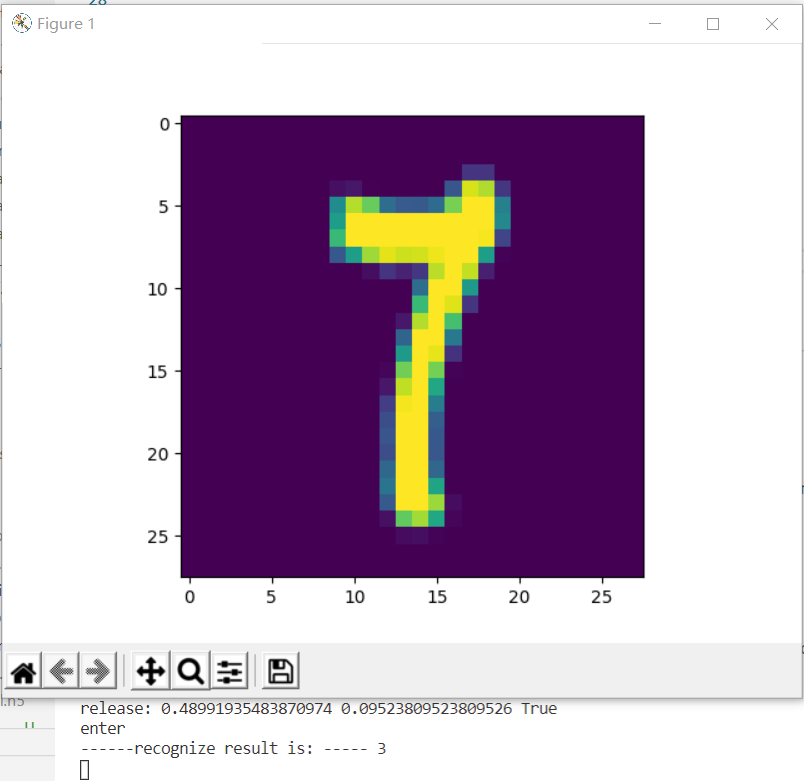

# 人工智能课程考核作业
## 学号：201809035   姓名：胡厚淮  时间：2020年11月25日
### 一、课程内容
#### 1.1、人工智能的基本内容
##### 1.1.1、人工智能的定义
- 人工智能是研究、开发用于模拟、延伸和扩展人的智能的理论、方法、技术及应用系统的一门新的技术科学。
- 人工智能(机器学习)一般分为三种：
  <br/>监督学习（Supervised Learning）：通过标注的数据来学习；<br>
  无监督学习（Unsupervised Learning）：通过没有标注的数据来学习；
  <br/>强化学习（Reinforcement Learning）: 我们可以让程序选择和它的环境互动（例如玩一个游戏），环境给程序的反馈是一些“奖励”（例如游戏中获得高分），程序要学习到一个模型，能在这种环境中得到高的分数，不仅是当前局面要得到高分，而且最终的结果也要是高分才行。<br>
- 神经网络(神经元)的基本结构：
  <br/>人工神经网络（Artificial Neural Networks，简写为ANNs）也简称为神经网络（NNs）或称作连接模型（Connection Model），它是一种模仿动物神经网络行为特征，进行分布式并行信息处理的算法数学模型。这种网络依靠系统的复杂程度，通过调整内部大量节点之间相互连接的关系，从而达到处理信息的目的<br>
  如下图：

- 范式：一种被公认、广泛认知的模型、定律以及公式。
  <br/>一般分为四个阶段<br>
  经验：根据自然现象总结经验，他可能是对的也可能错的(重的球掉的快)。
  <br>理论：对一些事物给出准确的描述(比萨斜塔实验)<br>
计算仿真：使用计算机等技术对理论在理想状态下进行实验仿真。
<br/>数据实验：通过大量数据来验证。<br>
##### 1.1.2、基本数学描述
- 反向传播：反向传播把损失值反向传给神经网络的每一层，让每一层都根据损失值反向调整权重；
搭建一个神经网络，给出初始权重值，我们先假设这个黑盒子的逻辑是：$z=x + x^2$；
1. 输入1，根据 $z=x + x^2$ 得到输出为2，而实际的输出值是2.21，则误差值为 $2-2.21=-0.21$，小了；
2. 调整权重值，比如 $z=1.5x+x^2$，再输入1.1，得到的输出为2.86，实际输出为2.431，则误差值为 $2.86-2.431=0.429$，大了；
3. 调整权重值，比如 $z=1.2x+x^2$，再输入1.2……
4. 调整权重值，再输入2……
5. 所有样本遍历一遍，计算平均的损失函数值；
6. 依此类推，重复3，4，5，6过程，直到损失函数值小于一个指标，比如 $0.001$，我们就可以认为网络训练完毕，黑盒子“破解”了，实际是被复制了，因为神经网络并不能得到黑盒子里的真实函数体，而只是近似模拟。
- 
- 梯度下降：梯度下降是在损失函数基础上向着损失最小的点靠近而指引了网络权重调整的方向；
- 损失函数：计算比较学习模型的计算值和实际值的偏差。

#### 线性回归

#### 线性回归概念
线性回归是利用数理统计中回归分析，来确定两种或两种以上变量间相互依赖的定量关系的一种统计分析方法。根据确定变量关系的变量的数量可分为一元线性回归(只包括一个自变量和一个因变量)，多元线性回归(两个或两个以上的自变量，且因变量和自变量之间是线性关系) 
####  线性回归的方法
##### 最小二乘法
最小二乘法（又称最小平方法）是一种数学优化技术。它通过最小化误差的平方和寻找数据的最佳函数匹配。利用最小二乘法可以简便地求得未知的数据，并使得这些求得的数据与实际数据之间误差的平方和为最小。
##### 梯度下降法
与最小二乘法比较可以看到，梯度下降法和最小二乘法的模型及损失函数是相同的，都是一个线性模型加均方差损失函数，模型用于拟合，损失函数用于评估效果。

区别在于，最小二乘法从损失函数求导，直接求得数学解析解，而梯度下降以及后面的神经网络，都是利用导数传递误差，再通过迭代方式一步一步（用近似解）逼近真实解。
代码实现如下
##### 神经网络法
计算方法

 输入层

此神经元在输入层只接受一个输入特征，经过参数 $w,b$ 的计算后，直接输出结果。这样一个简单的“网络”，只能解决简单的一元线性回归问题，而且由于是线性的，我们不需要定义激活函数，这就大大简化了程序，而且便于大家循序渐进地理解各种知识点。

严格来说输入层在神经网络中并不能称为一个层。

 权重 $w,b$

因为是一元线性问题，所以 $w,b$ 都是标量。

 输出层

输出层 $1$ 个神经元，线性预测公式是：

$$z_i = x_i \cdot w + b$$

$z$ 是模型的预测输出，$y$ 是实际的样本标签值，下标 $i$ 为样本。

 损失函数

因为是线性回归问题，所以损失函数使用均方差函数。

$$loss(w,b) = \frac{1}{2} (z_i-y_i)^2$$

 4.3.2 反向传播

由于我们使用了和上一节中的梯度下降法同样的数学原理，所以反向传播的算法也是一样的，细节请查看4.2.2。

 计算 $w$ 的梯度

$$
{\partial{loss} \over \partial{w}} = \frac{\partial{loss}}{\partial{z_i}}\frac{\partial{z_i}}{\partial{w}}=(z_i-y_i)x_i
$$

 计算 $b$ 的梯度

$$
\frac{\partial{loss}}{\partial{b}} = \frac{\partial{loss}}{\partial{z_i}}\frac{\partial{z_i}}{\partial{b}}=z_i-y_i
$$

为了简化问题，在本小节中，反向传播使用单样本方式，在下一小节中，我们将介绍多样本方式。
#### 激活函数
1.1、激活函数的表示方式
下图是神经网络中的一个神经元，假设该神经元有三个输入，分别为$x_1,x_2,x_3$，那么：

$$z=x_1 w_1 + x_2 w_2 + x_3 w_3 +b \tag{1}$$
$$a = \sigma(z) \tag{2}$$


激活函数的内容对应
$$a = \sigma(z) \tag{2}$$
他的作用是
1. 给神经网络增加非线性因素，这个问题在第1章神经网络基本工作原理中已经讲过了；
2. 把公式1的计算结果压缩到 $[0,1]$ 之间，便于后面的计算。
   激活函数的基本性质有
+ 非线性：线性的激活函数和没有激活函数一样；
+ 可导性：做误差反向传播和梯度下降，必须要保证激活函数的可导性；
+ 单调性：单一的输入会得到单一的输出，较大值的输入得到较大值的输出。

激活函数的注意事项  
1. 神经网络最后一层不需要激活函数
2. 激活函数只用于连接前后两层神经网络
#### 激活函数的类型
#### 挤压型激活函数
这一类函数的特点是，当输入值域的绝对值较大的时候，其输出在两端是饱和的，都具有S形的函数曲线以及压缩输入值域的作用，所以叫挤压型激活函数，又可以叫饱和型激活函数。
在英文中，通常用Sigmoid来表示，原意是S型的曲线，在数学中是指一类具有压缩作用的S型的函数，在神经网络中，有两个常用的Sigmoid函数，一个是Logistic函数，另一个是Tanh函数
优点

从函数图像来看，Sigmoid函数的作用是将输出压缩到 $(0,1)$ 这个区间范围内，这种输出在0~1之间的函数可以用来模拟一些概率分布的情况。它还是一个连续函数，导数简单易求。  

从数学上来看，Sigmoid函数对中央区的信号增益较大，对两侧区的信号增益小，在信号的特征空间映射上，有很好的效果。 

从神经科学上来看，中央区酷似神经元的兴奋态，两侧区酷似神经元的抑制态，因而在神经网络学习方面，可以将重点特征推向中央区，
将非重点特征推向两侧区。

缺点

指数计算代价大。

### 2.2半线性激活函数
 #### 2.2.1 ReLU函数 

Rectified Linear Unit，修正线性单元，线性整流函数，斜坡函数
优点

- 反向导数恒等于1，更加有效率的反向传播梯度值，收敛速度快；
- 避免梯度消失问题；
- 计算简单，速度快；
- 活跃度的分散性使得神经网络的整体计算成本下降。

缺点

无界。

梯度很大的时候可能导致的神经元“死”掉。


### 非线性回归分析标准
非线性回归为了评估曲线拟合的程度通过以下几个方式评价拟合的程度。
- 平均绝对误差 MAE（Mean Abolute Error）。

$$MAE=\frac{1}{m} \sum_{i=1}^m \lvert a_i-y_i \rvert \tag{1}$$
- 绝对平均值率误差
MAPE（Mean Absolute Percentage Error）。

$$MAPE=\frac{100}{m} \sum^m_{i=1} \left\lvert {a_i - y_i \over y_i} \right\rvert \tag{2}$$
- 和方差
  SSE（Sum Squared Error）。

$$SSE=\sum_{i=1}^m (a_i-y_i)^2 \tag{3}$$
- 均方差
 MSE（Mean Squared Error）。

$$MSE = \frac{1}{m} \sum_{i=1}^m (a_i-y_i)^2 \tag{4}$$
- 均方根误差
  RMSE（Root Mean Squard Error）。

$$RMSE = \sqrt{\frac{1}{m} \sum_{i=1}^m (a_i-y_i)^2} \tag{5}$$
- R平方
  $$R^2=1-\frac{\sum (a_i - y_i)^2}{\sum(\bar y_i-y_i)^2}=1-\frac{MSE(a,y)}{Var(y)} \tag{6}$$
#### 万能近似定理

万能近似定理(universal approximation theorem) $^{[1]}$，是深度学习最根本的理论依据。它证明了在给定网络具有足够多的隐藏单元的条件下，配备一个线性输出层和一个带有任何“挤压”性质的激活函数（如Sigmoid激活函数）的隐藏层的前馈神经网络，能够以任何想要的误差量近似任何从一个有限维度的空间映射到另一个有限维度空间的Borel可测的函数。

### 正则化
#### 1.1、过拟合
上图是回归任务中的三种情况，依次为：欠拟合、正确的拟合、过拟合。


上图是分类任务中的三种情况，依次为：分类欠妥、正确的分类、分类过度。由于分类可以看作是对分类边界的拟合，所以我们经常也统称其为拟合。

出现过拟合的原因：

1. 训练集的数量和模型的复杂度不匹配，样本数量级小于模型的参数
2. 训练集和测试集的特征分布不一致
3. 样本噪音大，使得神经网络学习到了噪音，正常样本的行为被抑制
4. 迭代次数过多，过分拟合了训练数据，包括噪音部分和一些非重要特征
   
### 偏差与方差

偏差-方差分解

|符号|含义|
|---|---|
|$x$|测试样本|
|$D$|数据集|
|$y$|x的真实标记|
|$y_D$|x在数据集中标记(可能有误差)|
|$f$|从数据集D学习的模型|
|$f_{x;D}$|从数据集D学习的模型对x的预测输出|
|$f_x$|模型f对x的期望预测输出|

学习算法期望的预测：
$$f_x=E[f_{x;D}] \tag{1}$$
不同的训练集/验证集产生的预测方差：
$$var(x)=E[(f_{x;D}-f_x)^2] \tag{2}$$
噪声：
$$\epsilon^2=E[(y_D-y)^2] \tag{3}$$
期望输出与真实标记的偏差：
$$bias^2(x)=(f_x-y)^2 \tag{4}$$
算法的期望泛化误差：
$$
\begin{aligned}
E(f;D)&=E[(f_{x;D}-y_D)^2] \\
&=E[(f_{x;D}-f_x+f_x-y_D)^2] \\
&=E[(f_{x;D}-f_x)^2]+E[(f_x-y_D)^2] \\
&+E[2(f_{x;D}-f_x)(f_x-y_D)](从公式1，此项为0) \\
&=E[(f_{x;D}-f_x)^2]+E[(f_x-y_D)^2] \\
&=E[(f_{x;D}-f_x)^2]+E[(f_x-y+y-y_D)^2] \\
&=E[(f_{x;D}-f_x)^2]+E[(f_x-y)^2]+E(y-y_D)^2] \\
&+E[2(f_x-y)(y-y_D)](噪声期望为0，所以此项为0)\\
&=E[(f_{x;D}-f_x)^2]+(f_x-y)^2+E[(y-y_D)^2] \\
&=var(x) + bias^2(x) + \epsilon^2
\end{aligned}
$$


### 卷积神经网络
（1）卷积网络的典型结构
一个典型的卷积神经网络的结构如下图所示：


在一个典型的卷积神经网络中，会至少包含以下几个层：
- 卷积层
- 激活函数层
- 池化层
- 全连接分类层

卷积核的具体作用：


上面的九张图，是使用9个不同的卷积核在同一张图上运算后得到的结果，而下面的表格中按顺序列出了9个卷积核的数值和名称，可以一一对应到上面的9张图中：

### 六、卷积的前向计算

#### 1、卷积的前向计算原理
#### （1）单入多出的升维卷积

原始输入是一维的图片，但是我们可以用多个卷积核分别对其计算，从而得到多个特征输出。如下图所示：


一张4x4的图片，用两个卷积核并行地处理，输出为2个2x2的图片。在训练过程中，这两个卷积核会完成不同的特征学习。

#### （2）多入单出的降维卷积

一张图片，通常是彩色的，具有红绿蓝三个通道。我们可以有两个选择来处理：


1. 变成灰度的，每个像素只剩下一个值，就可以用二维卷积
2. 对于三个通道，每个通道都使用一个卷积核，分别处理红绿蓝三种颜色的信息

显然第2种方法可以从图中学习到更多的特征，于是出现了三维卷积，即有三个卷积核分别对应书的三个通道，三个子核的尺寸是一样的，比如都是2x2，这样的话，这三个卷积核就是一个3x2x2的立体核，称为过滤器Filter，所以称为三维卷积。


在上图中，每一个卷积核对应着左侧相同颜色的输入通道，三个过滤器的值并不一定相同。对三个通道各自做卷积后，得到右侧的三张特征图，然后在按照原始值不加权地相加在一起，得到最右侧的黑色特征图，这张图里面已经把三种颜色的特征混在一起了，所以画成了黑色。

虽然输入图片是多个通道的，或者说是三维的，但是在相同数量的过滤器的计算后，相加在一起的结果是一个通道，即2维数据，所以称为降维。这当然简化了对多通道数据的计算难度，但同时也会损失多通道数据自带的颜色信息。

#### （3）多入多出的同维卷积

在上面的例子中，是一个过滤器Filter内含三个卷积核Kernal。我们假设有一个彩色图片为3x3的，如果有两组3x2x2的卷积核的话，会做什么样的卷积计算？看下图：


第一个过滤器Filter-1为棕色所示，它有三卷积核(Kernal)，命名为Kernal-1，Keanrl-2，Kernal-3，分别在红绿蓝三个输入通道上进行卷积操作，生成三个2x2的输出Feature-1,n。然后三个Feature-1,n相加，并再加上b1偏移值，形成最后的棕色输出Result-1。

对于灰色的过滤器Filter-2也是一样，先生成三个Feature-2,n，然后相加再加b2，最后得到Result-2。

之所以Feature-m,n还用红绿蓝三色表示，是因为在此时，它们还保留着红绿蓝三种色彩的各自的信息，一旦相加后得到Result，这种信息就丢失了。
#### （4）步长 stride

前面的例子中，每次计算后，卷积核会向右或者向下移动一个单元，即步长stride = 1。而在下面这个卷积操作中，卷积核每次向右或向下移动两个单元，即stride = 2。


在后续的步骤中，由于每次移动两格，所以最终得到一个2x2的图片。

#### （5）填充 padding

如果原始图为4x4，用3x3的卷积核进行卷积后，目标图片变成了2x2。如果我们想保持目标图片和原始图片为同样大小，该怎么办呢？一般我们会向原始图片周围填充一圈0，然后再做卷积。如下图：


#### （6） 输出结果

综合以上所有情况，可以得到卷积后的输出图片的大小的公式：

$$
H_{Output}= {H_{Input} - H_{Kernal} + 2Padding \over Stride} + 1
$$

$$
W_{Output}= {W_{Input} - W_{Kernal} + 2Padding \over Stride} + 1
$$
### 八、卷积的反向传播原理
#### 1、计算反向传播的梯度矩阵

正向公式：

$$Z = W*A+b \tag{0}$$

其中，W是卷积核，*表示卷积（互相关）计算，A为当前层的输入项，b是偏移（未在图中画出），Z为当前层的输出项，但尚未经过激活函数处理。
#### 2、有多个卷积核时的梯度计算

有多个卷积核也就意味着有多个输出通道。


#### 3、有多个输入时的梯度计算

当输入层是多个图层时，每个图层必须对应一个卷积核，如下图：


#### 4、权重（卷积核）梯度计算


要求J对w11的梯度，从正向公式可以看到，w11对所有的z都有贡献，所以：

$$
\frac{\partial J}{\partial w_{11}} = \frac{\partial J}{\partial z_{11}}\frac{\partial z_{11}}{\partial w_{11}} + \frac{\partial J}{\partial z_{12}}\frac{\partial z_{12}}{\partial w_{11}} + \frac{\partial J}{\partial z_{21}}\frac{\partial z_{21}}{\partial w_{11}} + \frac{\partial J}{\partial z_{22}}\frac{\partial z_{22}}{\partial w_{11}}
$$
$$
=\delta_{z11} \cdot a_{11} + \delta_{z12} \cdot a_{12} + \delta_{z21} \cdot a_{21} + \delta_{z22} \cdot a_{22} \tag{9}
$$

对W22也是一样的：

$$
\frac{\partial J}{\partial w_{12}} = \frac{\partial J}{\partial z_{11}}\frac{\partial z_{11}}{\partial w_{12}} + \frac{\partial J}{\partial z_{12}}\frac{\partial z_{12}}{\partial w_{12}} + \frac{\partial J}{\partial z_{21}}\frac{\partial z_{21}}{\partial w_{12}} + \frac{\partial J}{\partial z_{22}}\frac{\partial z_{22}}{\partial w_{12}}
$$
$$
=\delta_{z11} \cdot a_{12} + \delta_{z12} \cdot a_{13} + \delta_{z21} \cdot a_{22} + \delta_{z22} \cdot a_{23} \tag{10}
$$

### 手写字识别系统的设计
本次手写数字的识别的代码位于E:\ai\ai-edu\A-基础教程\A2-神经网络基本原理简明教程\SourceCode\ch13-ModelInference。
整个文件工程包含14个文件，其中MINIST_64_16文件夹是存放数据集的文件，ONNXConverter文件是一些编辑函数为主函数提供基础调用函数，至于UMP、WPF两个文件夹都是一些看不懂的配置文件。那就开始吧!<br>
我们只需要执行主函数就行了运行结果如下图<br>



从上面的运行结果来看，整个的训练效果并不太理想，对于测试集2，6，3有较高的识别率，但对于其他的一位数字的准确率明显下降。部分代码如下
```python
## 主函数部分
from matplotlib import pyplot as plt
import numpy as np
from PIL import Image

from HelperClass2.NeuralNet_3_0 import *

def ReadImage(img_file_name):
    img = Image.open(img_file_name)
    out1 = img.convert('L')
    out2 = out1.resize((28,28))
    a = np.array(out2)
    b = 255 - a
    x_max = np.max(b)
    x_min = np.min(b)
    X_NEW = (b - x_min)/(x_max-x_min)
    plt.cla()
    plt.imshow(X_NEW)
    plt.plot()
    return X_NEW.reshape(1,-1)

def Inference(img_array):
    output = net.inference(img_array)
    n = np.argmax(output)
    print("------recognize result is: -----", n)

def on_key_press(event):
    img_file_name = "handwriting.png"
    print(event.key)
    if event.key == 'enter':
        plt.axis('off')
        plt.savefig(img_file_name)
        plt.axis('on')
        img_array = ReadImage(img_file_name)
        Inference(img_array)
    elif event.key == 'backspace':
        plt.cla()
        plt.axis([0,1,0,1])
        ax.figure.canvas.draw()
    #end if

def on_mouse_press(event):
    global startx, starty, isdraw
    print(isdraw)
    isdraw = True
    startx = event.xdata
    starty = event.ydata
    print("press:{0},{1}", startx, starty)
    
def on_mouse_release(event):
    global isdraw, startx, starty
    print("release:", event.xdata, event.ydata, isdraw)
    isdraw = False

def on_mouse_move(event):
    global isdraw, startx, starty
    if isdraw:
        endx = event.xdata        
        endy = event.ydata        
        x1 = [startx, endx]
        y1 = [starty, endy]
        ax.plot(x1, y1, color='black', linestyle='-', linewidth='40')
        ax.figure.canvas.draw()
        startx = endx
        starty = endy
    # end if

def LoadNet():
    n_input = 784
    n_hidden1 = 64
    n_hidden2 = 16
    n_output = 10
    eta = 0.2
    eps = 0.01
    batch_size = 128
    max_epoch = 40

    hp = HyperParameters_3_0(
        n_input, n_hidden1, n_hidden2, n_output, 
        eta, max_epoch, batch_size, eps, 
        NetType.MultipleClassifier, 
        InitialMethod.Xavier)
    net = NeuralNet_3_0(hp, "MNIST_64_16")
    net.LoadResult()
    return net
   
if __name__ == "__main__":
    isdraw = False
    startx, starty = 0, 0

    print("need to run level3 first to get result")
    print("============================================================================")
    print("handwriting a digit, then press enter to recognize, press backspace to clear")
    print("resize the window to square, say, height == width")
    print("the handwriting should full fill the window")
    print("============================================================================")

    net = LoadNet()

    fig, ax = plt.subplots()
    fig.canvas.mpl_connect('key_press_event', on_key_press)
    fig.canvas.mpl_connect('button_release_event', on_mouse_release)
    fig.canvas.mpl_connect('button_press_event', on_mouse_press)
    fig.canvas.mpl_connect('motion_notify_event', on_mouse_move)
    
    plt.axis([0,1,0,1])
    plt.show()
```
主函数部分负责链接各个函数部分<br>
其余函数则是负责获取各个数据和与使用者交互。如level3是负责将数据集读入并训练权重，level4则是负责让用户绘制手写数字并传给level2验证识别。
```python
## level2 负责读入和处理用户绘制的图片
from tensorflow import keras

inputs = keras.Input(shape=(784,), name='input_data')
dense_result = keras.layers.Dense(10)(inputs)
outputs = keras.layers.ReLU()(dense_result)

model = keras.Model(inputs=inputs, outputs=outputs, name='simple_model')
model.save('simple_model.h5')

```
但是实际上这个训练的结果非常的不正确,特别是在识别4和9时几乎毫无意外的识别出错，如果解决这个这个问题可以从一下几个地方入手：
- 1、增加训练集，正确的标识全部手写数字
- 2、减小每次权重变化的数值(这是这个函数的主要问题)
- 3、调整权重的策略应该做出适当的变化在4和9这个案例在9的识别中显然对于4右边出头的部分的权重过于高。
- 4、加强对图像的处理，由于这是我在学习完机器视觉后总结的，所以我建议函数应该减小每次图片处理的变化值，或者说把图片的处理换成opencv中的"膨胀"效果会更加明显。


### 个人总结 
- 神经网络是由五个部分组成的是输入，权重，偏移，求和，激活函数。
- 深度学习得到的模型是拟合，意味着与实际的真实模型存在一定的差异。
- 梯度下降是矢量，既有大小也有方向。
- 处理环节的数量应该适量，多或者少都会偏离实际。
- python语言与一般的计算机语言不同，不以分号为语句的结束，c语言的大括号结构以:（引号）开始和空行结束。
- 通过学习单变量线性回归的问题，我又了解到了几种将要研究问题转换为线性回归问题的方：① 最小二乘法② 梯度下降法③ 简单的神经网络法。
 - 这次课老师主要为我们讲解了两层神经网络的学习，在两层神经网络之间，必须有激活函数连接，从而加入非线性因素，提高神经网络的能力。所以，我们先从激活函数学起，一类是挤压型的激活函数，常用于简单网络的学习；
- 后面围绕非线性问题展开讨论，介绍了非线性问题的回归方法，为了更加准确的拟合曲线，教程上提供了一系列的方式。
- 后面我们学习了如何构建一些简单的深度学习框架，使用万能近似定理去理解深度学习，我们还通过一系列的代码实现深度学习的框架。
 - 在学习型中，我也学习到了著名的反向传播四大公式，它对我们理解神经网络有很大帮助。
### 心得体会
通过AI的学习，我明白了BP神经网络的基本原理，我知道了反向传播和梯度下降，通过在慕课平台的学习和老师的讲解对深入学习有了更加深刻的认识，也让我知道了在人类在AI方向的学习还有很长的路要走，同样也告诉我数学是科学的根源，要提升自己的逻辑思维能力。我遇到了较多的问题，不过都借助网络和信息解决了，整个学习过程非常的充实。虽然对于激活函数和深度学习的实际内容还有很多需要学习的地方，但这本来就是很漫长的路。同时在学习的过程中，我明白了实践比理论重要，在开学初我就学习了python既有对python语言简单实用的感慨也有对掌握一门新语言的惊喜和新奇，但在具体使用python语言做一些东西的时候，我又发现实际的操作空间并没有我想的那么大，整个过程也没有那么轻松。<br>
对于手写字体的识别系统的设计，由于是在原来已经存在的代码上更改因此只需要将程序的运行环境进行设置就行。但是实际上这个训练的结果非常的不正确,特别是在识别4和9时几乎毫无意外的识别出错，如果解决这个这个问题可以从一下几个地方入手：
- 1、增加训练集，正确的标识全部手写数字
- 2、减小每次权重变化的数值(这是这个函数的主要问题)
- 3、调整权重的策略应该做出适当的变化在4和9这个案例在9的识别中显然对于4右边出头的部分的权重过于高。
- 4、加强对图像的处理，由于这是我在学习完机器视觉后总结的，所以我建议函数应该减小每次图片处理的变化值，或者说把图片的处理换成opencv中的"膨胀"效果会更加明显。


