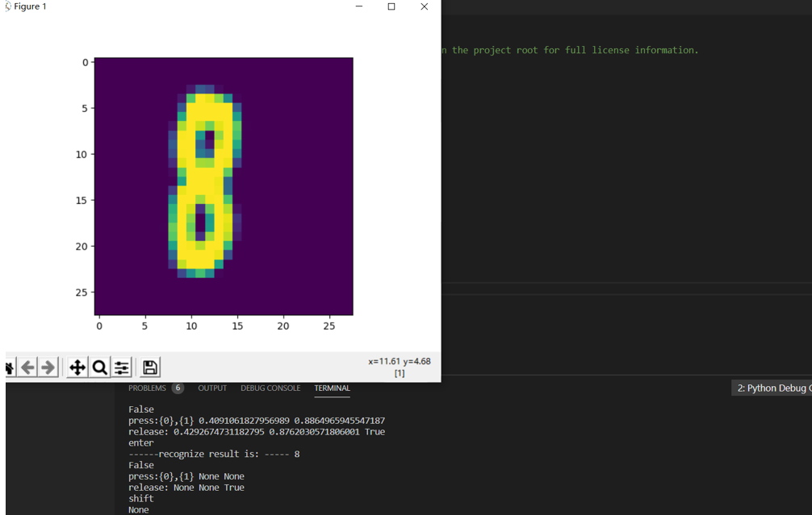

# 人工智能实验报告 
# 201808093
# 张博文

#  学习总结
通过这门课程我学习到了很多的人工智能专业知识指导，讲述很多内容:

反向传播、梯度下降、损失函数、正向传播、最小二乘法、梯度下降法、网络神经法、二分类函数、线性二分类、激活函数的性质（Sigmoid、Logistic、Tanh）、非线性分类、梯度检查、学习率概念、梯度检测查。

其中,反向传播、梯度下降、损失函数、正向传播是最基础的也是最重要的，因为后面会频繁地使用它，而且后面要使用他们来分析问题，这里我简要分析一下他们，梯度下降，“梯度”是指函数当前位置的最快上升点。


“下降”是指与导数相反的方向，用数学语言描述就是那个减号，就是与上升相反的方向。另外在讲解中我也学到了单变量梯度下降与双变量梯度下降的差别，了解到梯度下降对神经网络研究的重要性。另外我学习了神经网络中常用的两种损失函数，其中均方差函数，主要用于回归；交叉熵函数，主要用于分类。这两种损失函数对我们解决神经网络中的一些问题是很有用的，线性回归问题的方：1最小二乘法2 梯度下降法3 简单的神经网络法4 更通用的神经网络算法。梯度下降的三种形式，即最小二乘法、梯度下降法、神经网络法；另外神经网络中的线性分类问题，神经网络的一个重要功能就是分类，在线性多分类问题中主要讲解了一对一、一对多、多对多的问题，两层神经网络的学习，在两层神经网络之间，必须有激活函数连接，从而加入非线性因素，提高神经网络的能力。

所以，我们先从激活函数学起，一类是挤压型的激活函数，常用于简单网络的学习；另一类是半线性的激活函数，常用于深度网络的学习。然后，我们又学习了生活中非线性问题的解决方法--非线性回归，另外用一些回归方法去拟合一些曲线。非线性问题在工程实践中比较常见，我学到了用线性回归的方法去解决这个问题，这就体现出了神经网络的作用，它能为我们解决一些常见的难题。另外之前学习了上面的python代码，算法明白了，代码有很多方法去实现，而且前面几章我发现书给的代码是很相似的。

#  心得体会
这门课学起来很是令人头大，光是一些基本概念就让人头痛，多切杂，更别说代码操作运行。
如果只看书的话肯定是不能理解的，我们还需要查阅资料和将代码在自己电脑上跑一边，慢慢分析，学习就是这样从啥都不会慢慢积累深入，当然开始是很难的，但后面就逐渐好起来了。


卷积神经网络

#### 单层神经网络模型

这是一个单层的神经网络，有 $m$ 个输入 (这里 $m=3$)，有 $n$ 个输出 (这里 $n=2$)。在神经网络中，$b$ 到每个神经元的权值来表示实际的偏移值，亦即 $(b_1,b_2)$，这样便于矩阵运算。也有些人把 $b$ 写成 $x_0$，其实是同一个效果，即把偏移值看做是神经元的一个输入。

- $(x_1,x_2,x_3)$ 是一个样本数据的三个特征值
- $(w_{11},w_{21},w_{31})$ 是 $(x_1,x_2,x_3)$ 到 $n1$ 的权重
- $(w_{12},w_{22},w_{32})$ 是 $(x_1,x_2,x_3)$ 到 $n2$ 的权重
- $b_1$ 是 $n1$ 的偏移
- $b_2$ 是 $n2$ 的偏移


图1-15 单层神经网络模型

从图1-15大家可以看到，同一个特征 $x_1$，对于$n1,n2$来说，权重是不相同的，因为 $n1,n2$ 是两个神经元，它们完成不同的任务（特征识别）。我们假设 $x_1,x_2,x_3$ 分别代表红绿蓝三种颜色，而 $n1,n2$ 分别用于识别暖色和冷色，那么 $x_1$ 到 $n1$ 的权重，肯定要大于 $x_1$ 到 $n2$ 的权重，因为 $x_1$ 代表红色，是暖色。

而对于 $n1$ 来说，$x_1,x_2,x_3$ 输入的权重也是不相同的，因为它要对不同特征有选择地接纳。如同上面的例子，$n1$ 对于代表红色的 $x_1$，肯定是特别重视，权重值较高；而对于代表蓝色的 $x_3$，尽量把权重值降低，才能有正确的输出。

#### 训练流程

从真正的“零”开始学习神经网络时，我没有看到过任何一个流程图来讲述训练过程，大神们写书或者博客时都忽略了这一点，图1-16是一个简单的流程图。


。


###  神经网络中的矩阵运算

图1-17是一个两层的神经网络，包含隐藏层和输出层，输入层不算做一层。


###  神经网络的主要功能

#### 回归（Regression）或者叫做拟合（Fitting）

单层的神经网络能够模拟一条二维平面上的直线，从而可以完成线性分割任务。而理论证明，两层神经网络可以无限逼近任意连续函数。图1-18所示就是一个两层神经网络拟合复杂曲线的实例。


图1-18 回归/拟合示意图

所谓回归或者拟合，其实就是给出x值输出y值的过程，并且让y值与样本数据形成的曲线的距离尽量小，可以理解为是对样本数据的一种骨架式的抽象。

以图1-18为例，蓝色的点是样本点，从中可以大致地看出一个轮廓或骨架，而红色的点所连成的线就是神经网络的学习结果，它可以“穿过”样本点群形成中心线，尽量让所有的样本点到中心线的距离的和最近。

#### 分类（Classification）

如图1-19，二维平面中有两类点，红色的和蓝色的，用一条直线肯定不能把两者分开了。


图1-19 分类示意图

我们使用一个两层的神经网络可以得到一个非常近似的结果，使得分类误差在满意的范围之内。图1-19中那条淡蓝色的曲线，本来并不存在，是通过神经网络训练出来的分界线，可以比较完美地把两类样本分开，所以分类可以理解为是对两类或多类样本数据的边界的抽象。

图1-18和图1-19的曲线形态实际上是一个真实的函数在 $[0,1]$ 区间内的形状，其原型是：

$$y=0.4x^2 + 0.3x\sin(15x) + 0.01\cos(50x)-0.3$$

这么复杂的函数，一个两层的神经网络是如何做到的呢？其实从输入层到隐藏层的矩阵计算，就是对输入数据进行了空间变换，使其可以被线性可分，然后在输出层画出一个分界线。而训练的过程，就是确定那个空间变换矩阵的过程。因此，多层神经网络的本质就是对复杂函数的拟合。我们可以在后面的试验中来学习如何拟合上述的复杂函数的。

神经网络的训练结果，是一大堆的权重组成的数组（近似解），并不能得到上面那种精确的数学表达式（数学解析解）。
 神经网络中的三个基本概念

##  通俗地理解三大概念

这三大概念是：反向传播，梯度下降，损失函数。

 线性反向传播


###  从自然现象中理解梯度下降

在大多数文章中，都以“一个人被困在山上，需要迅速下到谷底”来举例，这个人会“寻找当前所处位置最陡峭的地方向下走”。这个例子中忽略了安全因素，这个人不可能沿着最陡峭的方向走，要考虑坡度。

在自然界中，梯度下降的最好例子，就是泉水下山的过程：

1. 水受重力影响，会在当前位置，沿着最陡峭的方向流动，有时会形成瀑布（梯度下降）；
2. 水流下山的路径不是唯一的，在同一个地点，有可能有多个位置具有同样的陡峭程度，而造成了分流（可以得到多个解）；
3. 遇到坑洼地区，有可能形成湖泊，而终止下山过程（不能得到全局最优解，而是局部最优解）。

### 2 梯度下降的数学理解

梯度下降的数学公式：

$$\theta_{n+1} = \theta_{n} - \eta \cdot \nabla J(\theta) \tag{1}$$

其中：

- $\theta_{n+1}$：下一个值；
- $\theta_n$：当前值；
- $-$：减号，梯度的反向；
- $\eta$：学习率或步长，控制每一步走的距离，不要太快以免错过了最佳景点，不要太慢以免时间太长；
- $\nabla$：梯度，函数当前位置的最快上升点；
- $J(\theta)$：函数。

#### 梯度下降的三要素

1. 当前点；
2. 方向；
3. 步长。
4. 损失函数概论


#  单变量函数的梯度下降


# 双变量的梯度下降


# 学习率η的选择


#### 损失函数的作用

损失函数的作用，就是计算神经网络每次迭代的前向计算结果与真实值的差距，从而指导下一步的训练向正确的方向进行。

如何使用损失函数呢？具体步骤：

1. 用随机值初始化前向计算公式的参数；
2. 代入样本，计算输出的预测值；
3. 用损失函数计算预测值和标签值（真实值）的误差；
4. 根据损失函数的导数，沿梯度最小方向将误差回传，修正前向计算公式中的各个权重值；
5. 进入第2步重复, 直到损失函数值达到一个满意的值就停止迭代。

###  机器学习常用损失函数

符号规则：$a$ 是预测值，$y$ 是样本标签值，$loss$ 是损失函数值。

- Gold Standard Loss，又称0-1误差
$$
loss=\begin{cases}
0 & a=y \\\\
1 & a \ne y 
\end{cases}
$$

- 绝对值损失函数

$$
loss = |y-a|
$$

- Hinge Loss，铰链/折页损失函数或最大边界损失函数，主要用于SVM（支持向量机）中

$$
loss=\max(0,1-y \cdot a) \qquad y=\pm 1
$$

- Log Loss，对数损失函数，又叫交叉熵损失函数(cross entropy error)

$$
loss = -[y \cdot \ln (a) + (1-y) \cdot \ln (1-a)]  \qquad y \in \\{ 0,1 \\} 
$$

- Squared Loss，均方差损失函数
$$
loss=(a-y)^2
$$

- Exponential Loss，指数损失函数
$$
loss = e^{-(y \cdot a)}
$$


###  损失函数图像理解

#### 用二维函数图像理解单变量对损失函数的影响


图3-1 单变量的损失函数图

图3-1中，纵坐标是损失函数值，横坐标是变量。不断地改变变量的值，会造成损失函数值的上升或下降。而梯度下降算法会让我们沿着损失函数值下降的方向前进。

1. 假设我们的初始位置在 $A$ 点，$x=x_0$，损失函数值（纵坐标）较大，回传给网络做训练；
2. 经过一次迭代后，我们移动到了 $B$ 点，$x=x_1$，损失函数值也相应减小，再次回传重新训练；
3. 以此节奏不断向损失函数的最低点靠近，经历了 $x_2,x_3,x_4,x_5$；
4. 直到损失值达到可接受的程度，比如 $x_5$ 的位置，就停止训练。

#### 用等高线图理解双变量对损失函数影响


图3-2 双变量的损失函数图

图3-2中，横坐标是一个变量 $w$，纵坐标是另一个变量 $b$。两个变量的组合形成的损失函数值，在图中对应处于等高线上的唯一的一个坐标点。$w,b$ 所有不同值的组合会形成一个损失函数值的矩阵，我们把矩阵中具有相同（相近）损失函数值的点连接起来，可以形成一个不规则椭圆，其圆心位置，是损失值为 $0$ 的位置，也是我们要逼近的目标。

这个椭圆如同平面地图的等高线，来表示的一个洼地，中心位置比边缘位置要低，通过对损失函数值的计算，对损失函数的求导，会带领我们沿着等高线形成的梯子一步步下降，无限逼近中心点。

###  神经网络中常用的损失函数

- 均方差函数，主要用于回归

- 交叉熵函数，主要用于分类

二者都是非负函数，极值在底部，用梯度下降法可以求解。
 均方差函数

MSE - Mean Square Error。

该函数就是最直观的一个损失函数了，计算预测值和真实值之间的欧式距离。预测值和真实值越接近，两者的均方差就越小。

均方差函数常用于线性回归(linear regression)，即函数拟合(function fitting)。公式如下：

$$
loss = {1 \over 2}(z-y)^2 \tag{单样本}
$$

$$
J=\frac{1}{2m} \sum_{i=1}^m (z_i-y_i)^2 \tag{多样本}
$$

###工作原理

要想得到预测值 $a$ 与真实值 $y$ 的差距，最朴素的想法就是用 $Error=a_i-y_i$。

对于单个样本来说，这样做没问题，但是多个样本累计时，$a_i-y_i$ 可能有正有负，误差求和时就会导致相互抵消，从而失去价值。所以有了绝对值差的想法，即 $Error=|a_i-y_i|$ 。这看上去很简单，并且也很理想，那为什么还要引入均方差损失函数呢？两种损失函数的比较如表3-1所示。

表3-1 绝对值损失函数与均方差损失函数的比较

|样本标签值|样本预测值|绝对值损失函数|均方差损失函数|
|------|------|------|------|
|$[1,1,1]$|$[1,2,3]$|$(1-1)+(2-1)+(3-1)=3$|$(1-1)^2+(2-1)^2+(3-1)^2=5$|
|$[1,1,1]$|$[1,3,3]$|$(1-1)+(3-1)+(3-1)=4$|$(1-1)^2+(3-1)^2+(3-1)^2=8$|
|||$4/3=1.33$|$8/5=1.6$|

可以看到5比3已经大了很多，8比4大了一倍，而8比5也放大了某个样本的局部损失对全局带来的影响，用术语说，就是“对某些偏离大的样本比较敏感”，从而引起监督训练过程的足够重视，以便回传误差。

###  实际案例

假设有一组数据如图3-3，我们想找到一条拟合的直线。


图3-3 平面上的样本数据

图3-4中，前三张显示了一个逐渐找到最佳拟合直线的过程。

- 第一张，用均方差函数计算得到 $Loss=0.53$；
- 第二张，直线向上平移一些，误差计算 $Loss=0.16$，比图一的误差小很多；
- 第三张，又向上平移了一些，误差计算 $Loss=0.048$，此后还可以继续尝试平移（改变 $b$ 值）或者变换角度（改变 $w$ 值），得到更小的损失函数值；
- 第四张，偏离了最佳位置，误差值 $Loss=0.18$，这种情况，算法会让尝试方向反向向下。


图3-4 损失函数值与直线位置的关系

第三张图损失函数值最小的情况。比较第二张和第四张图，由于均方差的损失函数值都是正值，如何判断是向上移动还是向下移动呢？

在实际的训练过程中，是没有必要计算损失函数值的，因为损失函数值会体现在反向传播的过程中。我们来看看均方差函数的导数：

$$
\frac{\partial{J}}{\partial{a_i}} = a_i-y_i
$$

虽然 $(a_i-y_i)^2$ 永远是正数，但是 $a_i-y_i$ 却可以是正数（直线在点下方时）或者负数（直线在点上方时），这个正数或者负数被反向传播回到前面的计算过程中，就会引导训练过程朝正确的方向尝试。

在上面的例子中，我们有两个变量 $w,b$，这两个值的变化都会影响最终的损失函数值的。

我们假设该拟合直线的方程是 $y=2x+3$，当我们固定 $w=2$，把 $b$ 值从 $2$ 到 $4$ 变化时，损失函数值的变化如图3-5所示。


图3-5 固定 $w$ 时，$b$ 变化时损失函数值的变化

我们假设该拟合直线的方程是 $y=2x+3$，当我们固定 $b=3$，把 $w$ 值从 $1$ 到 $3$ 变化时，损失函数值的变化如图3-6所示。


图3-6 固定 $b$ 时，$w$ 变化时损失函数值的变化

###  损失函数的可视化

#### 损失函数值的3D示意图

横坐标为 $w$，纵坐标为 $b$，针对每一个$(w,b)$的组合计算出一个损失函数值，用三维图的高度来表示这个损失函数值。下图中的底部并非一个平面，而是一个有些下凹的曲面，只不过曲率较小，如图3-7。


图3-7 $w$ 和 $b$ 同时变化时的损失值形成的曲面

#### 损失函数值的2D示意图

在平面地图中，我们经常会看到用等高线的方式来表示海拔高度值，下图就是上图在平面上的投影，即损失函数值的等高线图，如图3-8所示。


图3-8 损失函数的等高线图

如果还不能理解的话，我们用最笨的方法来画一张图，代码如下：

```Python
    s = 200
    W = np.linspace(w-2,w+2,s)
    B = np.linspace(b-2,b+2,s)
    LOSS = np.zeros((s,s))
    for i in range(len(W)):
        for j in range(len(B)):
            z = W[i] * x + B[j]
            loss = CostFunction(x,y,z,m)
            LOSS[i,j] = round(loss, 2)
```

上述代码针对每个 $(w,b)$ 组合计算出了一个损失值，保留小数点后2位，放在`LOSS`矩阵中，如下所示：

```
[[4.69 4.63 4.57 ... 0.72 0.74 0.76]
 [4.66 4.6  4.54 ... 0.73 0.75 0.77]
 [4.62 4.56 4.5  ... 0.73 0.75 0.77]
 ...
 [0.7  0.68 0.66 ... 4.57 4.63 4.69]
 [0.69 0.67 0.65 ... 4.6  4.66 4.72]
 [0.68 0.66 0.64 ... 4.63 4.69 4.75]]
```

然后遍历矩阵中的损失函数值，在具有相同值的位置上绘制相同颜色的点，比如，把所有值为0.72的点绘制成红色，把所有值为0.75的点绘制成蓝色......，这样就可以得到图3-9。


图3-9 用笨办法绘制等高线图

此图和等高线图的表达方式等价，但由于等高线图比较简明清晰，所以以后我们都使用等高线图来说明问题。

交叉熵损失函数

交叉熵（Cross Entropy）是Shannon信息论中一个重要概念，主要用于度量两个概率分布间的差异性信息。在信息论中，交叉熵是表示两个概率分布 $p,q$ 的差异，其中 $p$ 表示真实分布，$q$ 表示预测分布，那么 $H(p,q)$ 就称为交叉熵：

$$H(p,q)=\sum_i p_i \cdot \ln {1 \over q_i} = - \sum_i p_i \ln q_i \tag{1}$$

交叉熵可在神经网络中作为损失函数，$p$ 表示真实标记的分布，$q$ 则为训练后的模型的预测标记分布，交叉熵损失函数可以衡量 $p$ 与 $q$ 的相似性。


### 交叉熵的由来

#### 信息量

信息论中，信息量的表示方式：

$$I(x_j) = -\ln (p(x_j)) \tag{2}$$

$x_j$：表示一个事件

$p(x_j)$：表示 $x_j$ 发生的概率

$I(x_j)$：信息量，$x_j$ 越不可能发生时，它一旦发生后的信息量就越大

假设对于学习神经网络原理课程，我们有三种可能的情况发生，如表3-2所示。

表3-2 三种事件的概论和信息量

|事件编号|事件|概率 $p$|信息量 $I$|
|---|---|---|---|
|$x_1$|优秀|$p=0.7$|$I=-\ln(0.7)=0.36$|
|$x_2$|及格|$p=0.2$|$I=-\ln(0.2)=1.61$|
|$x_3$|不及格|$p=0.1$|$I=-\ln(0.1)=2.30$|

WoW，某某同学不及格！好大的信息量！相比较来说，“优秀”事件的信息量反而小了很多。

#### 熵

$$H(p) = - \sum_j^n p(x_j) \ln (p(x_j)) \tag{3}$$

则上面的问题的熵是：

$$
\begin{aligned}  
H(p)&=-[p(x_1) \ln p(x_1) + p(x_2) \ln p(x_2) + p(x_3) \ln p(x_3)] \\\\
&=0.7 \times 0.36 + 0.2 \times 1.61 + 0.1 \times 2.30 \\\\
&=0.804
\end{aligned}
$$

#### 相对熵(KL散度)

相对熵又称KL散度，如果我们对于同一个随机变量 $x$ 有两个单独的概率分布 $P(x)$ 和 $Q(x)$，我们可以使用 KL 散度（Kullback-Leibler (KL) divergence）来衡量这两个分布的差异，这个相当于信息论范畴的均方差。

KL散度的计算公式：

$$D_{KL}(p||q)=\sum_{j=1}^n p(x_j) \ln{p(x_j) \over q(x_j)} \tag{4}$$

$n$ 为事件的所有可能性。$D$ 的值越小，表示 $q$ 分布和 $p$ 分布越接近。

#### 交叉熵

把上述公式变形：

$$
\begin{aligned}  
D_{KL}(p||q)&=\sum_{j=1}^n p(x_j) \ln{p(x_j)} - \sum_{j=1}^n p(x_j) \ln q(x_j) \\\\
&=- H(p(x)) + H(p,q) 
\end{aligned}
\tag{5}
$$

等式的前一部分恰巧就是 $p$ 的熵，等式的后一部分，就是交叉熵：

$$H(p,q) =- \sum_{j=1}^n p(x_j) \ln q(x_j) \tag{6}$$

在机器学习中，我们需要评估标签值 $y$ 和预测值 $a$ 之间的差距，使用KL散度刚刚好，即 $D_{KL}(y||a)$，由于KL散度中的前一部分 $H(y)$ 不变，故在优化过程中，只需要关注交叉熵就可以了。所以一般在机器学习中直接用交叉熵做损失函数来评估模型。

$$loss =- \sum_{j=1}^n y_j \ln a_j \tag{7}$$

公式7是单个样本的情况，$n$ 并不是样本个数，而是分类个数。所以，对于批量样本的交叉熵计算公式是：

$$J =- \sum_{i=1}^m \sum_{j=1}^n y_{ij} \ln a_{ij} \tag{8}$$

$m$ 是样本数，$n$ 是分类数。

有一类特殊问题，就是事件只有两种情况发生的可能，比如“学会了”和“没学会”，称为 $0/1$ 分类或二分类。对于这类问题，由于$n=2，y_1=1-y_2，a_1=1-a_2$，所以交叉熵可以简化为：

$$loss =-[y \ln a + (1-y) \ln (1-a)] \tag{9}$$

二分类对于批量样本的交叉熵计算公式是：

$$J= - \sum_{i=1}^m [y_i \ln a_i + (1-y_i) \ln (1-a_i)] \tag{10}$$

###  二分类问题交叉熵

把公式10分解开两种情况，当 $y=1$ 时，即标签值是 $1$，是个正例，加号后面的项为 $0$：

$$loss = -\ln(a) \tag{11}$$

横坐标是预测输出，纵坐标是损失函数值。$y=1$ 意味着当前样本标签值是1，当预测输出越接近1时，损失函数值越小，训练结果越准确。当预测输出越接近0时，损失函数值越大，训练结果越糟糕。

当 $y=0$ 时，即标签值是0，是个反例，加号前面的项为0：

$$loss = -\ln (1-a) \tag{12}$$

此时，损失函数值如图3-10。


图3-10 二分类交叉熵损失函数图

假设学会了课程的标签值为1，没有学会的标签值为0。我们想建立一个预测器，对于一个特定的学员，根据出勤率、课堂表现、作业情况、学习能力等等来预测其学会课程的概率。

对于学员甲，预测其学会的概率为0.6，而实际上该学员通过了考试，真实值为1。所以，学员甲的交叉熵损失函数值是：

$$
loss_1 = -(1 \times \ln 0.6 + (1-1) \times \ln (1-0.6)) = 0.51
$$

对于学员乙，预测其学会的概率为0.7，而实际上该学员也通过了考试。所以，学员乙的交叉熵损失函数值是：

$$
loss_2 = -(1 \times \ln 0.7 + (1-1) \times \ln (1-0.7)) = 0.36
$$

由于0.7比0.6更接近1，是相对准确的值，所以 $loss2$ 要比 $loss1$ 小，反向传播的力度也会小。

###  多分类问题交叉熵

当标签值不是非0即1的情况时，就是多分类了。假设期末考试有三种情况：

1. 优秀，标签值OneHot编码为 $[1,0,0]$；
2. 及格，标签值OneHot编码为 $[0,1,0]$；
3. 不及格，标签值OneHot编码为 $[0,0,1]$。

假设我们预测学员丙的成绩为优秀、及格、不及格的概率为：$[0.2,0.5,0.3]$，而真实情况是该学员不及格，则得到的交叉熵是：

$$
loss_1 = -(0 \times \ln 0.2 + 0 \times \ln 0.5 + 1 \times \ln 0.3) = 1.2
$$


假设我们预测学员丁的成绩为优秀、及格、不及格的概率为：$[0.2,0.2,0.6]$，而真实情况是该学员不及格，则得到的交叉熵是：

$$
loss_2 = -(0 \times \ln 0.2 + 0 \times \ln 0.2 + 1 \times \ln 0.6) = 0.51
$$

可以看到，0.51比1.2的损失值小很多，这说明预测值越接近真实标签值（0.6 vs 0.3），交叉熵损失函数值越小，反向传播的力度越小。
卷积神经网络原理

 搭建深度神经网络框架

 <!--Copyright © Microsoft Corporation. All rights reserved.
  适用于[License](https://github.com/Microsoft/ai-edu/blob/master/LICENSE.md)版权许可-->


<!--Copyright © Microsoft Corporation. All rights reserved.
  适用于[License](https://github.com/Microsoft/ai-edu/blob/master/LICENSE.md)版权许可-->

##  线性多分类原理

此原理对线性多分类和非线性多分类都适用。

###  多分类过程

我们在此以具有两个特征值的三分类举例。可以扩展到更多的分类或任意特征值，比如在ImageNet的图像分类任务中，最后一层全连接层输出给分类器的特征值有成千上万个，分类有1000个。

1. 线性计算

$$z_1 = x_1 w_{11} + x_2 w_{21} + b_1 \tag{1}$$
$$z_2 = x_1 w_{12} + x_2 w_{22} + b_2 \tag{2}$$
$$z_3 = x_1 w_{13} + x_2 w_{23} + b_3 \tag{3}$$

2. 分类计算

$$
a_1=\frac{e^{z_1}}{\sum_i e^{z_i}}=\frac{e^{z_1}}{e^{z_1}+e^{z_2}+e^{z_3}}  \tag{4}
$$
$$
a_2=\frac{e^{z_2}}{\sum_i e^{z_i}}=\frac{e^{z_2}}{e^{z_1}+e^{z_2}+e^{z_3}}  \tag{5}
$$
$$
a_3=\frac{e^{z_3}}{\sum_i e^{z_i}}=\frac{e^{z_3}}{e^{z_1}+e^{z_2}+e^{z_3}}  \tag{6}
$$

3. 损失函数计算

单样本时，$n$表示类别数，$j$表示类别序号：

$$
\begin{aligned}
loss(w,b)&=-(y_1 \ln a_1 + y_2 \ln a_2 + y_3 \ln a_3) \\\\
&=-\sum_{j=1}^{n} y_j \ln a_j 
\end{aligned}
\tag{7}
$$

批量样本时，$m$ 表示样本数，$i$ 表示样本序号：

$$
\begin{aligned}
J(w,b) &=- \sum_{i=1}^m (y_{i1} \ln a_{i1} + y_{i2} \ln a_{i2} + y_{i3} \ln a_{i3}) \\\\
&=- \sum_{i=1}^m \sum_{j=1}^n y_{ij} \ln a_{ij}
\end{aligned}
 \tag{8}
$$

损失函数计算在交叉熵函数一节有详细介绍。

###  数值计算举例

假设对预测一个样本的计算得到的 $z$ 值为：

$$z=[z_1,z_2,z_3]=[3,1,-3]$$

则按公式4、5、6进行计算，可以得出Softmax的概率分布是：

$$a=[a_1,a_2,a_3]=[0.879,0.119,0.002]$$

#### 如果标签值表明此样本为第一类

即：

$$y=[1,0,0]$$

则损失函数为：

$$
loss_1=-(1 \times \ln 0.879 + 0 \times \ln 0.119 + 0 \times \ln 0.002)=0.123
$$

反向传播误差矩阵为：

$$a-y=[-0.121,0.119,0.002]$$

因为$a_1=0.879$，为三者最大，分类正确，所以$a-y$的三个值都不大。

#### 如果标签值表明此样本为第二类

即：

$$y=[0,1,0]$$

则损失函数为：

$$
loss_2=-(0 \times \ln 0.879 + 1 \times \ln 0.119 + 0 \times \ln 0.002)=2.128
$$

可以看到由于分类错误，$loss_2$的值比$loss_1$的值大很多。

反向传播误差矩阵为：

$$a-y=[0.879,0.881,0.002]$$

本来是第二类，误判为第一类，所以前两个元素的值很大，反向传播的力度就大。

###  多分类的几何原理

在前面的二分类原理中，很容易理解为我们用一条直线分开两个部分。对于多分类问题，是否可以沿用二分类原理中的几何解释呢？答案是肯定的，只不过需要单独判定每一个类别。

假设一共有三类样本，蓝色为1，红色为2，绿色为3，那么Softmax的形式应该是：

$$
a_j = \frac{e^{z_j}}{\sum\limits_{i=1}^3 e^{z_i}}=\frac{e^{z_j}}{e^{z_1}+e^{z_2}+^{z_3}}
$$

#### 当样本属于第一类时

把蓝色点与其它颜色的点分开。

如果判定一个点属于第一类，则 $a_1$ 概率值一定会比 $a_2,a_3$ 大，表示为公式：

$$a_1 > a_2 且 a_1 > a_3 \tag{9}$$

由于Softmax的特殊形式，分母都一样，所以只比较分子就行了。而分子是一个自然指数，输出值域大于零且单调递增，所以只比较指数就可以了，因此，公式9等同于下式：

$$z_1 > z_2, z_1 > z_3 \tag{10}$$

把公式1、2、3引入到10：

$$x_1 w_{11}  + x_2 w_{21} + b_1  > x_1 w_{12} + x_2 w_{22} + b_2 \tag{11}$$
$$x_1 w_{11}  + x_2 w_{21} + b_1  > x_1 w_{13} + x_2 w_{23} + b_3 \tag{12}$$

变形：

$$(w_{21} - w_{22})x_2 > (w_{12} - w_{11})x_1 + (b_2 - b_1) \tag{13}$$

$$(w_{21} - w_{23})x_2 > (w_{13} - w_{11})x_1 + (b_3 - b_1) \tag{14}$$

我们先假设：

$$w_{21} > w_{22}, w_{21}> w_{23} \tag{15}$$

所以公式13、14左侧的系数都大于零，两边同时除以系数：

$$x_2 > \frac{w_{12} - w_{11}}{w_{21} - w_{22}}x_1 + \frac{b_2 - b_1}{w_{21} - w_{22}} \tag{16}$$

$$x_2 > \frac{w_{13} - w_{11}}{w_{21} - w_{23}} x_1 + \frac{b_3 - b_1}{w_{21} - w_{23}} \tag{17}$$

简化，即把公式16、17的分数形式的因子分别简化成一个变量$W$和$B$，并令$y = x_2,x = x_1$，利于理解：

$$y > W_{12} \cdot x + B_{12} \tag{18}$$

$$y > W_{13} \cdot x + B_{13} \tag{19}$$

此时y代表了第一类的蓝色点。


图7-9 如何把蓝色样本与其它两色的样本分开

借用二分类中的概念，公式18的几何含义是：有一条直线可以分开第一类（蓝色点）和第二类（红色点），使得所有蓝色点都在直线的上方，所有的红色点都在直线的下方。于是我们可以画出图7-9中的那条绿色直线。

而公式19的几何含义是：有一条直线可以分开第一类（蓝色点）和第三类（绿色点），使得所有蓝色点都在直线的上方，所有的绿色点都在直线的下方。于是我们可以画出图7-9中的那条红色直线。

也就是说在图中画两条直线，所有蓝点都同时在红线和绿线这两条直线的上方。

#### 当样本属于第二类时

即如何把红色点与其它两色点分开。

$$z_2 > z_1,z_2 > z_3 \tag{20}$$

同理可得

$$y < W_{12} \cdot x + B_{12} \tag{21}$$

$$y > W_{23} \cdot x + B_{23} \tag{22}$$


图7-10 如何把红色样本与其它两色的样本分开


此时$y$代表了第二类的红色点。

公式21和公式18几何含义相同，不等号相反，代表了图7-10中绿色直线的分割作用，即红色点在绿色直线下方。

公式22的几何含义是，有一条蓝色直线可以分开第二类（红色点）和第三类（绿色点），使得所有红色点都在直线的上方，所有的绿色点都在直线的下方。

#### 当样本属于第三类时

即如何把绿色点与其它两色点分开。

$$z_3 > z_1,z_3 > z_2 \tag{22}$$

最后可得：

$$y < W_{13} \cdot x + B_{13} \tag{23}$$

$$y < W_{23} \cdot x + B_{23} \tag{24}$$

此时$y$代表了第三类的绿色点。


图7-11 如何把绿色样本与其它两色的样本分开

公式23与公式19不等号相反，几何含义相同，代表了图7-11中红色直线的分割作用，绿色点在红色直线下方。

公式24与公式22不等号相反，几何含义相同，代表了图7-11中蓝色直线的分割作用，绿色点在蓝色直线下方。

#### 综合效果

把三张图综合在一起。


##  回归任务功能测试

在第九章中，我们用一个两层的神经网络，验证了万能近似定理。当时是用hard code方式写的，现在我们用迷你框架来搭建一下。

###  搭建模型

这个模型很简单，一个双层的神经网络，第一层后面接一个Sigmoid激活函数，第二层直接输出拟合数据，如图14-2所示。


图14-2 完成拟合任务的抽象模型

```Python
def model():
    dataReader = LoadData()
    num_input = 1
    num_hidden1 = 4
    num_output = 1

    max_epoch = 10000
    batch_size = 10
    learning_rate = 0.5

    params = HyperParameters_4_0(
        learning_rate, max_epoch, batch_size,
        net_type=NetType.Fitting,
        init_method=InitialMethod.Xavier,
        stopper=Stopper(StopCondition.StopLoss, 0.001))

    net = NeuralNet_4_0(params, "Level1_CurveFittingNet")
    fc1 = FcLayer_1_0(num_input, num_hidden1, params)
    net.add_layer(fc1, "fc1")
    sigmoid1 = ActivationLayer(Sigmoid())
    net.add_layer(sigmoid1, "sigmoid1")
    fc2 = FcLayer_1_0(num_hidden1, num_output, params)
    net.add_layer(fc2, "fc2")

    net.train(dataReader, checkpoint=100, need_test=True)

    net.ShowLossHistory()
    ShowResult(net, dataReader)
```


###  训练结果


代码生成：

```Python
    y_test_real = net.inference(dr.XTest)
    axes.scatter(y_test_real, y_test_real-dr.YTestRaw, marker='o')
```


```
epoch=4999, total_iteration=449999
loss_train=0.000920, accuracy_train=0.968329
loss_valid=0.000839, accuracy_valid=0.962375
time used: 28.002626419067383
save parameters
total weights abs sum= 45.27530164993504
total weights = 8
little weights = 0
zero weights = 0
testing...
0.9817814550687021
0.9817814550687021
```

由于我们设置了`eps=0.001`，所以在5000多个`epoch`时便达到了要求，训练停止。最后用测试集得到的准确率为98.17%，已经非常不错了。如果训练更多的轮，可以得到更好的结果。


##  深度神经网络框架设计

###  功能/模式分析

比较第12章中的三层神经网络的代码，我们可以看到大量的重复之处，比如前向计算中：

```Python
def forward3(X, dict_Param):
    ...
    # layer 1
    Z1 = np.dot(W1,X) + B1
    A1 = Sigmoid(Z1)
    # layer 2
    Z2 = np.dot(W2,A1) + B2
    A2 = Tanh(Z2)
    # layer 3
    Z3 = np.dot(W3,A2) + B3
    A3 = Softmax(Z3)
    ...    
```

1，2，3三层的模式完全一样：矩阵运算+激活/分类函数。

再看看反向传播：

```Python
def backward3(dict_Param,cache,X,Y):
    ...
    # layer 3
    dZ3= A3 - Y
    dW3 = np.dot(dZ3, A2.T)
    dB3 = np.sum(dZ3, axis=1, keepdims=True)
    # layer 2
    dZ2 = np.dot(W3.T, dZ3) * (1-A2*A2) # tanh
    dW2 = np.dot(dZ2, A1.T)
    dB2 = np.sum(dZ2, axis=1, keepdims=True)
    # layer 1
    dZ1 = np.dot(W2.T, dZ2) * A1 * (1-A1)   #sigmoid
    dW1 = np.dot(dZ1, X.T)
    dB1 = np.sum(dZ1, axis=1, keepdims=True)
    ...
```
每一层的模式也非常相近：计算本层的`dZ`，再根据`dZ`计算`dW`和`dB`。

因为三层网络比两层网络多了一层，所以会在初始化、前向、反向、更新参数等四个环节有所不同，但却是有规律的。再加上前面章节中，为了实现一些辅助功能，我们已经写了很多类。所以，现在可以动手搭建一个深度学习的迷你框架了。

# 抽象与设计

图14-1是迷你框架的模块化设计，下面对各个模块做功能点上的解释。


# 回归任务


###  搭建模型

在不知道一个问题的实际复杂度之前，我们不妨把模型设计得复杂一些。如下图所示，这个模型包含了四组全连接层-Relu层的组合，最后是一个单输出做拟合。


图14-5 完成房价预测任务的抽象模型

```Python
def model():
    dr = LoadData()

    num_input = dr.num_feature
    num_hidden1 = 32
    num_hidden2 = 16
    num_hidden3 = 8
    num_hidden4 = 4
    num_output = 1

    max_epoch = 1000
    batch_size = 16
    learning_rate = 0.1

    params = HyperParameters_4_0(
        learning_rate, max_epoch, batch_size,
        net_type=NetType.Fitting,
        init_method=InitialMethod.Xavier,
        stopper=Stopper(StopCondition.StopDiff, 1e-7))

    net = NeuralNet_4_0(params, "HouseSingle")

    fc1 = FcLayer_1_0(num_input, num_hidden1, params)
    net.add_layer(fc1, "fc1")
    r1 = ActivationLayer(Relu())
    net.add_layer(r1, "r1")
    ......
    fc5 = FcLayer_1_0(num_hidden4, num_output, params)
    net.add_layer(fc5, "fc5")

    net.train(dr, checkpoint=10, need_test=True)
    
    output = net.inference(dr.XTest)
    real_output = dr.DeNormalizeY(output)
    mse = np.sum((dr.YTestRaw - real_output)**2)/dr.YTest.shape[0]/10000
    print("mse=", mse)
    
    net.ShowLossHistory()

    ShowResult(net, dr)
```


###  训练结果


图14-6 训练过程中损失函数值和准确率的变化

由于标签数据也做了归一化，变换为都是0至1间的小数，所以均方差的数值很小，需要观察小数点以后的第4位。从图14-6中可以看到，损失函数值很快就降到了0.0002以下，然后就很缓慢地下降。而精度值在不断的上升，相信更多的迭代次数会带来更高的精度。

再看下面的打印输出部分，用R2_Score法得到的值为0.841，而用数据城堡官方的评测标准，得到的MSE值为2384411，还比较大，说明模型精度还应该有上升的空间。

```
......
epoch=999, total_iteration=972999
loss_train=0.000079, accuracy_train=0.740406
loss_valid=0.000193, accuracy_valid=0.857289
time used: 193.5549156665802
testing...
0.8412989144927305
mse= 2384411.5840510926
```


##  二分类任务功能测试

###  搭建模型

同样是一个双层神经网络，但是最后一层要接一个Logistic二分类函数来完成二分类任务，如图14-7所示。


图14-7 完成非线性二分类教学案例的抽象模型

```Python

def model(dataReader):
    num_input = 2
    num_hidden = 3
    num_output = 1

    max_epoch = 1000
    batch_size = 5
    learning_rate = 0.1

    params = HyperParameters_4_0(
        learning_rate, max_epoch, batch_size,
        net_type=NetType.BinaryClassifier,
        init_method=InitialMethod.Xavier,
        stopper=Stopper(StopCondition.StopLoss, 0.02))

    net = NeuralNet_4_0(params, "Arc")

    fc1 = FcLayer_1_0(num_input, num_hidden, params)
    net.add_layer(fc1, "fc1")
    sigmoid1 = ActivationLayer(Sigmoid())
    net.add_layer(sigmoid1, "sigmoid1")
    
    fc2 = FcLayer_1_0(num_hidden, num_output, params)
    net.add_layer(fc2, "fc2")
    logistic = ClassificationLayer(Logistic())
    net.add_layer(logistic, "logistic")

    net.train(dataReader, checkpoint=10, need_test=True)
    return net
```

超参数说明：

1. 输入层神经元数为2
2. 隐层的神经元数为3，使用Sigmoid激活函数
3. 由于是二分类任务，所以输出层只有一个神经元，用Logistic做二分类函数
4. 最多训练1000轮
5. 批大小=5
6. 学习率=0.1
7. 绝对误差停止条件=0.02

###  运行结果


图14-8 训练过程中损失函数值和准确率的变化

图14-8是训练记录，再看下面的打印输出结果：

```
......
epoch=419, total_iteration=30239
loss_train=0.010094, accuracy_train=1.000000
loss_valid=0.019141, accuracy_valid=1.000000
time used: 2.149379253387451
testing...
1.0
```
最后的testing...的结果是1.0，表示100%正确，这初步说明mini框架在这个基本case上工作得很好。图14-9所示的分类效果也不错。


图14-9 分类效果


###  搭建模型

我们搭建一个与14.2一样的网络结构，不同的是为了完成二分类任务，在最后接一个Logistic函数。


图14-10 完成二分类真实案例的抽象模型

```Python
def model(dr):
    num_input = dr.num_feature
    num_hidden1 = 32
    num_hidden2 = 16
    num_hidden3 = 8
    num_hidden4 = 4
    num_output = 1

    max_epoch = 100
    batch_size = 16
    learning_rate = 0.1

    params = HyperParameters_4_0(
        learning_rate, max_epoch, batch_size,
        net_type=NetType.BinaryClassifier,
        init_method=InitialMethod.MSRA,
        stopper=Stopper(StopCondition.StopDiff, 1e-3))

    net = NeuralNet_4_0(params, "Income")

    fc1 = FcLayer_1_0(num_input, num_hidden1, params)
    net.add_layer(fc1, "fc1")
    a1 = ActivationLayer(Relu())
    net.add_layer(a1, "relu1")
    ......
    fc5 = FcLayer_1_0(num_hidden4, num_output, params)
    net.add_layer(fc5, "fc5")
    logistic = ClassificationLayer(Logistic())
    net.add_layer(logistic, "logistic")

    net.train(dr, checkpoint=1, need_test=True)
    return net
```


###  训练结果

下图左边是损失函数图，右边是准确率图。忽略测试数据的波动，只看红色的验证集的趋势，损失函数值不断下降，准确率不断上升。


图14-11 训练过程中损失函数值和准确率的变化

下面是最后的打印输出：

```
......
epoch=99, total_iteration=169699
loss_train=0.296219, accuracy_train=0.800000
loss_valid=nan, accuracy_valid=0.838859
time used: 29.866002321243286
testing...
0.8431606905710491
```

最后用独立的测试集得到的结果是84%，与该数据集相关的其它论文相比，已经是一个不错的成绩了。


## 多分类功能测试

在第11章里，我们讲解了如何使用神经网络做多分类。在本节我们将会用Mini框架重现那个教学案例，然后使用一个真实的案例验证多分类的用法。

###  搭建模型一

#### 模型

使用Sigmoid做为激活函数的两层网络，如图14-12。


图14-12 完成非线性多分类教学案例的抽象模型

#### 代码

```Python
def model_sigmoid(num_input, num_hidden, num_output, hp):
    net = NeuralNet_4_0(hp, "chinabank_sigmoid")

    fc1 = FcLayer_1_0(num_input, num_hidden, hp)
    net.add_layer(fc1, "fc1")
    s1 = ActivationLayer(Sigmoid())
    net.add_layer(s1, "Sigmoid1")

    fc2 = FcLayer_1_0(num_hidden, num_output, hp)
    net.add_layer(fc2, "fc2")
    softmax1 = ClassificationLayer(Softmax())
    net.add_layer(softmax1, "softmax1")

    net.train(dataReader, checkpoint=50, need_test=True)
    net.ShowLossHistory()
    
    ShowResult(net, hp.toString())
    ShowData(dataReader)
```


#### 运行结果

训练过程如图14-13所示，分类效果如图14-14所示。


图14-13 训练过程中损失函数值和准确率的变化


图14-14 分类效果图

### 14.5.2 搭建模型二

#### 模型

使用ReLU做为激活函数的三层网络，如图14-15。


图14-15 使用ReLU函数抽象模型

用两层网络也可以实现，但是使用ReLE函数时，训练效果不是很稳定，用三层比较保险。

#### 代码

```Python
def model_relu(num_input, num_hidden, num_output, hp):
    net = NeuralNet_4_0(hp, "chinabank_relu")

    fc1 = FcLayer_1_0(num_input, num_hidden, hp)
    net.add_layer(fc1, "fc1")
    r1 = ActivationLayer(Relu())
    net.add_layer(r1, "Relu1")

    fc2 = FcLayer_1_0(num_hidden, num_hidden, hp)
    net.add_layer(fc2, "fc2")
    r2 = ActivationLayer(Relu())
    net.add_layer(r2, "Relu2")

    fc3 = FcLayer_1_0(num_hidden, num_output, hp)
    net.add_layer(fc3, "fc3")
    softmax = ClassificationLayer(Softmax())
    net.add_layer(softmax, "softmax")

    net.train(dataReader, checkpoint=50, need_test=True)
    net.ShowLossHistory()
    
    ShowResult(net, hp.toString())
    ShowData(dataReader)    
```


#### 运行结果

训练过程如图14-16所示，分类效果如图14-17所示。


图14-16 训练过程中损失函数值和准确率的变化


图14-17 分类效果图

### 比较

表14-1比较一下使用不同的激活函数的分类效果图。

表14-1 使用不同的激活函数的分类结果比较

|Sigmoid|ReLU|
|---|---|
|||

可以看到左图中的边界要平滑许多，这也就是ReLU和Sigmoid的区别，ReLU是用分段线性拟合曲线，Sigmoid有真正的曲线拟合能力。但是Sigmoid也有缺点，看分类的边界，使用ReLU函数的分类边界比较清晰，而使用Sigmoid函数的分类边界要平缓一些，过渡区较宽。

用一句简单的话来描述二者的差别：Relu能直则直，对方形边界适用；Sigmoid能弯则弯，对圆形边界适用。

### 代码位置

ch14, Level5
<!--Copyright © Microsoft Corporation. All rights reserved.
  适用于[License](https://github.com/Microsoft/ai-edu/blob/master/LICENSE.md)版权许可-->

##  多分类任务 - MNIST手写体识别

### 数据读取

MNIST数据本身是图像格式的，我们用`mode="vector"`去读取，转变成矢量格式。

```Python
def LoadData():
    print("reading data...")
    dr = MnistImageDataReader(mode="vector")
    ......
```

###  搭建模型

一共4个隐层，都用ReLU激活函数连接，最后的输出层接Softmax分类函数。


图14-18 完成MNIST分类任务的抽象模型

以下是主要的参数设置：

```Python
if __name__ == '__main__':
    dataReader = LoadData()
    num_feature = dataReader.num_feature
    num_example = dataReader.num_example
    num_input = num_feature
    num_hidden1 = 128
    num_hidden2 = 64
    num_hidden3 = 32
    num_hidden4 = 16
    num_output = 10
    max_epoch = 10
    batch_size = 64
    learning_rate = 0.1

    params = HyperParameters_4_0(
        learning_rate, max_epoch, batch_size,
        net_type=NetType.MultipleClassifier,
        init_method=InitialMethod.MSRA,
        stopper=Stopper(StopCondition.StopLoss, 0.12))

    net = NeuralNet_4_0(params, "MNIST")

    fc1 = FcLayer_1_0(num_input, num_hidden1, params)
    net.add_layer(fc1, "fc1")
    r1 = ActivationLayer(Relu())
    net.add_layer(r1, "r1")
    ......
    fc5 = FcLayer_1_0(num_hidden4, num_output, params)
    net.add_layer(fc5, "fc5")
    softmax = ClassificationLayer(Softmax())
    net.add_layer(softmax, "softmax")

    net.train(dataReader, checkpoint=0.05, need_test=True)
    net.ShowLossHistory(xcoord=XCoordinate.Iteration)
```

###  运行结果

我们设计的停止条件是绝对Loss值达到0.12时，所以迭代到6个epoch时，达到了0.119的损失值，就停止训练了。


图14-19 训练过程中损失函数值和准确率的变化

图14-19是训练过程图示，下面是最后几行的打印输出。

```
......
epoch=6, total_iteration=5763
loss_train=0.005559, accuracy_train=1.000000
loss_valid=0.119701, accuracy_valid=0.971667
time used: 17.500738859176636
save parameters
testing...
0.9697
```


##  卷积神经网络概述

###  卷积神经网络的能力

卷积神经网络（CNN，Convolutional Neural Net)是神经网络的类型之一，在图像识别和分类领域中取得了非常好的效果，比如识别人脸、物体、交通标识等，这就为机器人、自动驾驶等应用提供了坚实的技术基础。

在下面图17-1$^{[1]}$和图17-2中$^{[1]}$，卷积神经网络展现了识别人类日常生活中的各种物体的能力。


图17-3 两匹斑马


图17-4 两个骑车人

卷积神经网络可以识别出上面两张图中的物体和场景，图17-3$^{[2]}$是“两匹斑马站在泥地上”，图17-4$^{[2]}$是“一个在道路上骑车的男人旁边还有个女人”。当然，识别物体和给出简要的场景描述是两套系统配合才能完成的任务，第一个系统只负责识别，第二个系统可以根据第一个系统的输出形成摘要文字。

###  卷积神经网络的典型结构

一个典型的卷积神经网络的结构如图17-5所示。


图17-5 卷积神经网络的典型结构图

我们分析一下它的层级结构：

1. 原始的输入是一张图片，可以是彩色的，也可以是灰度的或黑白的。这里假设是只有一个通道的图片，目的是识别0~9的手写体数字；
2. 第一层卷积，我们使用了4个卷积核，得到了4张feature map；激活函数层没有单独画出来，这里我们紧接着卷积操作使用了Relu激活函数；
3. 第二层是池化，使用了Max Pooling方式，把图片的高宽各缩小一倍，但仍然是4个feature map；
4. 第三层卷积，我们使用了4x6个卷积核，其中4对应着输入通道，6对应着输出通道，从而得到了6张feature map，当然也使用了Relu激活函数；
5. 第四层再次做一次池化，现在得到的图片尺寸只是原始尺寸的四分之一左右；
6. 第五层把第四层的6个图片展平成一维，成为一个fully connected层；
7. 第六层再接一个小一些的fully connected层；
8. 最后接一个softmax函数，判别10个分类。

所以，在一个典型的卷积神经网络中，会至少包含以下几个层：

- 卷积层
- 激活函数层
- 池化层
- 全连接分类层

我们会在后续的小节中讲解卷积层和池化层的具体工作原理。

###  卷积核的作用

我们遇到了一个新的概念：卷积核。卷积网络之所以能工作，完全是卷积核的功劳。什么是卷积核呢？卷积核其实就是一个小矩阵，类似这样：

```
1.1  0.23  -0.45
0.1  -2.1   1.24
0.74 -1.32  0.01
```

这是一个3x3的卷积核，还会有1x1、5x5、7x7、9x9、11x11的卷积核。在卷积层中，我们会用输入数据与卷积核相乘，得到输出数据，就类似全连接层中的Weights一样，所以卷积核里的数值，也是通过反向传播的方法学习到的。

下面我们看看卷积核的具体作用。


图17-6 卷积核的作用

图17-6中所示的内容，是使用9个不同的卷积核在同一张图上运算后得到的结果，而表17-1中按顺序列出了9个卷积核的数值和名称，可以一一对应到上面的9张图中。

表17-1 卷积的效果

||1|2|3|
|---|---|---|---|
|1|0,-1, 0<br>-1, 5,-1<br>0,-1, 0|0, 0, 0 <br> -1, 2,-1 <br> 0, 0, 0|1, 1, 1 <br> 1,-9, 1 <br> 1, 1, 1|
||sharpness|vertical edge|surround|
|2|-1,-2, -1 <br> 0, 0, 0<br>1, 2, 1|0, 0, 0 <br> 0, 1, 0 <br> 0, 0, 0|0,-1, 0 <br> 0, 2, 0 <br> 0,-1, 0|
||sobel y|nothing|horizontal edge|
|3|0.11,0.11,0.11 <br>0.11,0.11,0.11<br>0.11,0.11,0.11|-1, 0, 1 <br> -2, 0, 2 <br> -1, 0, 1|2, 0, 0 <br> 0,-1, 0 <br> 0, 0,-1|
||blur|sobel x|embossing|


### 卷积后续的运算

前面我们认识到了卷积核的强大能力，卷积神经网络通过反向传播而令卷积核自我学习，找到分布在图片中的不同的feature，最后形成的卷积核中的数据。但是如果想达到这种效果，只有卷积层的话是不够的，还需要激活函数、池化等操作的配合。

图17-7中的四个子图，依次展示了：

1. 原图
2. 卷积结果
3. 激活结果
4. 池化结果


图17-7 原图经过卷积-激活-池化操作后的效果

1. 注意图一是原始图片，用cv2读取出来的图片，其顺序是反向的，即：

- 第一维是高度
- 第二维是宽度
- 第三维是彩色通道数，但是其顺序为BGR，而不是常用的RGB

1. 我们对原始图片使用了一个3x1x3x3的卷积核，因为原始图片为彩色图片，所以第一个维度是3，对应RGB三个彩色通道；我们希望只输出一张feature map，以便于说明，所以第二维是1；我们使用了3x3的卷积核，用的是sobel x算子。所以图二是卷积后的结果。

2. 图三做了一层Relu激活计算，把小于0的值都去掉了，只留下了一些边的特征。

3. 图四是图三的四分之一大小，虽然图片缩小了，但是特征都没有丢失，反而因为图像尺寸变小而变得密集，亮点的密度要比图三大而粗。

### 卷积神经网络的学习



###  GRU 的基本概念

LSTM 存在很多变体，其中门控循环单元（Gated Recurrent Unit, GRU）是最常见的一种，也是目前比较流行的一种。GRU是由 [Cho](https://arxiv.org/pdf/1406.1078v3.pdf) 等人在2014年提出的，它对LSTM做了一些简化：

1. GRU将LSTM原来的三个门简化成为两个：重置门 $r_t$（Reset Gate）和更新门 $z_t$ (Update Gate)。
2. GRU不保留单元状态 $c_t$，只保留隐藏状态 $h_t$作为单元输出，这样就和传统RNN的结构保持一致。
3. 重置门直接作用于前一时刻的隐藏状态 $h_{t-1}$。


### GRU的前向计算

#### GRU的单元结构

图20-7展示了GRU的单元结构。


图20-7 GRU单元结构图

GRU单元的前向计算公式如下：

1. 更新门

   $$
   z_t = \sigma(h_{t-1} \cdot W_z + x_t \cdot U_z)
   \tag{1}
   $$

2. 重置门

   $$
   r_t = \sigma(h_{t-1} \cdot W_r + x_t \cdot U_r)
   \tag{2}
   $$

3. 候选隐藏状态

    $$
   \tilde h_t = \tanh((r_t \circ h_{t-1}) \cdot W_h + x_t \cdot U_h)
   \tag{3}
   $$

4. 隐藏状态

   $$
   h = (1 - z_t) \circ h_{t-1} + z_t \circ \tilde{h}_t
   \tag{4}
   $$

#### GRU的原理浅析

从上面的公式可以看出，GRU通过更新们和重置门控制长期状态的遗忘和保留，以及当前输入信息的选择。更新门和重置门通过$sigmoid$函数，将输入信息映射到$[0,1]$区间，实现门控功能。

首先，上一时刻的状态$h_{t-1}$通过重置门，加上当前时刻输入信息，共同构成当前时刻的即时状态$\tilde{h}_t$，并通过$\tanh$函数映射到$[-1,1]$区间。

然后，通过更新门实现遗忘和记忆两个部分。从隐藏状态的公式可以看出，通过$z_t$进行选择性的遗忘和记忆。$(1-z_t)$和$z_t$有联动关系，上一时刻信息遗忘的越多，当前信息记住的就越多，实现了LSTM中$f_t$和$i_t$的功能。

20.3.4 代码实现

本节进行了GRU网络单元前向计算和反向传播的实现。为了统一和简单，测试用例依然是二进制减法。

#### 初始化

本案例实现了没有bias的GRU单元，只需初始化输入维度和隐层维度。

```Python
def __init__(self, input_size, hidden_size):
        self.input_size = input_size
        self.hidden_size = hidden_size
```

#### 前向计算

```Python
def forward(self, x, h_p, W, U):
    self.get_params(W, U)
    self.x = x

    self.z = Sigmoid().forward(np.dot(h_p, self.wz) + np.dot(x, self.uz))
    self.r = Sigmoid().forward(np.dot(h_p, self.wr) + np.dot(x, self.ur))
    self.n = Tanh().forward(np.dot((self.r * h_p), self.wn) + np.dot(x, self.un))
    self.h = (1 - self.z) * h_p + self.z * self.n

def split_params(self, w, size):
        s=[]
        for i in range(3):
            s.append(w[(i*size):((i+1)*size)])
        return s[0], s[1], s[2]

# Get shared parameters, and split them to fit 3 gates, in the order of z, r, \tilde{h} (n stands for \tilde{h} in code)
def get_params(self, W, U):
    self.wz, self.wr, self.wn = self.split_params(W, self.hidden_size)
    self.uz, self.ur, self.un = self.split_params(U, self.input_size)
```

#### 反向传播

```Python
def backward(self, h_p, in_grad):
    self.dzz = in_grad * (self.n - h_p) * self.z * (1 - self.z)
    self.dzn = in_grad * self.z * (1 - self.n * self.n)
    self.dzr = np.dot(self.dzn, self.wn.T) * h_p * self.r * (1 - self.r)

    self.dwn = np.dot((self.r * h_p).T, self.dzn)
    self.dun = np.dot(self.x.T, self.dzn)
    self.dwr = np.dot(h_p.T, self.dzr)
    self.dur = np.dot(self.x.T, self.dzr)
    self.dwz = np.dot(h_p.T, self.dzz)
    self.duz = np.dot(self.x.T, self.dzz)

    self.merge_params()

    # pass to previous time step
    self.dh = in_grad * (1 - self.z) + np.dot(self.dzn, self.wn.T) * self.r + np.dot(self.dzr, self.wr.T) + np.dot(self.dzz, self.wz.T)
    # pass to previous layer
    self.dx = np.dot(self.dzn, self.un.T) + np.dot(self.dzr, self.ur.T) + np.dot(self.dzz, self.uz.T)
```

我们将所有拆分的参数merge到一起，便于更新梯度。

```Python
def merge_params(self):
    self.dW = np.concatenate((self.dwz, self.dwr, self.dwn), axis=0)
    self.dU = np.concatenate((self.duz, self.dur, self.dun), axis=0)

```
###  最终结果


