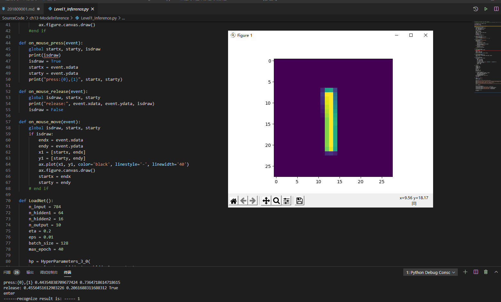
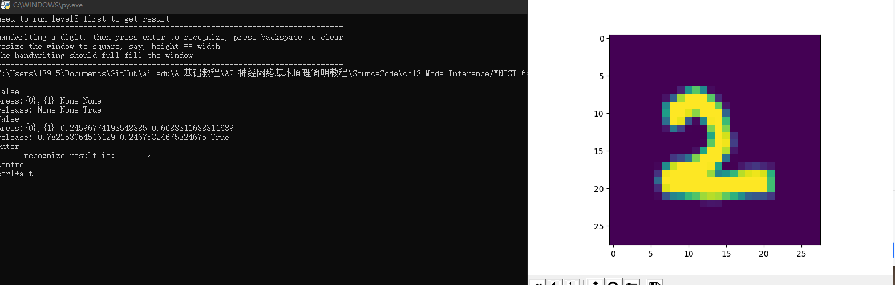

 # 课程总结

 ## 人工智能

 - 人工智能（Artificial Intelligence），英文缩写为AI。它是研究、开发用于模拟、延伸和扩展人的智能的理论、方法、技术及应用系统的一门新的技术科学。

 - 人工智能是计算机科学的一个分支，它企图了解智能的实质，并生产出一种新的能以人类智能相似的方式做出反应的智能机器，该领域的研究包括机器人、语言识别、图像识别、自然语言处理和专家系统等。人工智能从诞生以来，理论和技术日益成熟，应用领域也不断扩大，可以设想，未来人工智能带来的科技产品，将会是人类智慧的“容器”。人工智能可以对人的意识、思维的信息过程的模拟。人工智能不是人的智能，但能像人那样思考、也可能超过人的智能。

 - 人工智能是一门极富挑战性的科学，从事这项工作的人必须懂得计算机知识，心理学和哲学。人工智能是包括十分广泛的科学，它由不同的领域组成，如机器学习，计算机视觉等等，总的说来，人工智能研究的一个主要目标是使机器能够胜任一些通常需要人类智能才能完成的复杂工作。但不同的时代、不同的人对这种“复杂工作”的理解是不同的。

 ## 线性回归

 - 在统计学中，线性回归（Linear Regression）是利用称为线性回归方程的最小平方函数对一个或多个自变量和因变量之间关系进行建模的一种回归分析。这种函数是一个或多个称为回归系数的模型参数的线性组合。只有一个自变量的情况称为简单回归，大于一个自变量情况的叫做多元回归。（这反过来又应当由多个相关的因变量预测的多元线性回归区别，而不是一个单一的标量变量。）

 - 在线性回归中，数据使用线性预测函数来建模，并且未知的模型参数也是通过数据来估计。这些模型被叫做线性模型。最常用的线性回归建模是给定X值的y的条件均值是X的仿射函数。不太一般的情况，线性回归模型可以是一个中位数或一些其他的给定X的条件下y的条件分布的分位数作为X的线性函数表示。像所有形式的回归分析一样，线性回归也把焦点放在给定X值的y的条件概率分布，而不是X和y的联合概率分布（多元分析领域）。

 - 线性回归是回归分析中第一种经过严格研究并在实际应用中广泛使用的类型。这是因为线性依赖于其未知参数的模型比非线性依赖于其未知参数的模型更容易拟合，而且产生的估计的统计特性也更容易确定。

 - 单层的神经网络，其实就是一个神经元，可以完成一些线性的工作，比如拟合一条直线，这用一个神经元就可以实现。当这个神经元只接收一个输入时，就是单变量线性回归，可以在二维平面上用可视化方法理解。当接收多个变量输入时，叫做多变量线性回归，此时可视化方法理解就比较困难了，通常我们会用变量两两组对的方式来表现。

 ## 非线性回归

 - 如果回归模型的因变量是自变量的一次以上函数形式，回归规律在图形上表现为形态各异的各种曲线，称为非线性回归。这类模型称为非线性回归模型。在许多实际问题中，回归函数往往是较复杂的非线性函数。非线性函数的求解一般可分为将非线性变换成线性和不能变换成线性两大类。
 
 - 在两层神经网络之间，必须有激活函数连接，从而加入非线性因素，提高神经网络的能力。所以，我们先从激活函数学起，一类是挤压型的激活函数，常用于简单网络的学习；另一类是半线性的激活函数，常用于深度网络的学习。可以利用万能近似定理建立一个双层的神经网络，来拟合一个比较复杂的函数。

 ## DNN

 - 深度神经网络是机器学习(ML, Machine Learning)领域中一种技术。
  
 - 特点：
      
       多层的好处是可以用较少的参数表示复杂的函数。

       在监督学习中，以前的多层神经网络的问题是容易陷入局部极值点。如果训练样本足够充分覆盖未来的样本，那么学到的多层权重可以很好的用来预测新的测试样本。但是很多任务难以得到足够多的标记样本，在这种情况下，简单的模型，比如线性回归或者决策树往往能得到比多层神经网络更好的结果（更好的泛化性，更差的训练误差）。

       非监督学习中，以往没有有效的方法构造多层网络。多层神经网络的顶层是底层特征的高级表示，比如底层是像素点，上一层的结点可能表示横线，三角； 而顶层可能有一个结点表示人脸。一个成功的算法应该能让生成的顶层特征最大化的代表底层的样例。如果对所有层同时训练，时间复杂度会太高； 如果每次训练一层，偏差就会逐层传递。这会面临跟上面监督学习中相反的问题，会严重欠拟合。

 ## 搭建miniFramework实现手写数字识别

 1. 配置python（本人使用的为python 3.8.6 64位），此处不再赘述。

 - 详情课见教程https://www.cnblogs.com/xiaojwang/p/11331202.html（引用自 xiaoj_wang ）

 - 
 
 2. 运行代码

        from matplotlib import pyplot as plt
        import numpy as np
        from PIL import Image

        from HelperClass2.NeuralNet_3_0 import *

        def ReadImage(img_file_name):
        img = Image.open(img_file_name)
        out1 = img.convert('L')
        out2 = out1.resize((28,28))
        a = np.array(out2)
        b = 255 - a
        x_max = np.max(b)
        x_min = np.min(b)
        X_NEW = (b - x_min)/(x_max-x_min)
        plt.cla()
        plt.imshow(X_NEW)
        plt.plot()
        return X_NEW.reshape(1,-1)

        def Inference(img_array):
        output = net.inference(img_array)
        n = np.argmax(output)
        print("------recognize result is: -----", n)

        def on_key_press(event):
        img_file_name = "handwriting.png"
        print(event.key)
        if event.key == 'enter':
        plt.axis('off')
        plt.savefig(img_file_name)
        plt.axis('on')
        img_array = ReadImage(img_file_name)
        Inference(img_array)
        elif event.key == 'backspace':
        plt.cla()
        plt.axis([0,1,0,1])
        ax.figure.canvas.draw()
        #end if

        def on_mouse_press(event):
        global startx, starty, isdraw
        print(isdraw)
        isdraw = True
        startx = event.xdata
        starty = event.ydata
        print("press:{0},{1}", startx, starty)
    
        def on_mouse_release(event):
        global isdraw, startx, starty
        print("release:", event.xdata, event.ydata, isdraw)
        isdraw = False

        def on_mouse_move(event):
        global isdraw, startx, starty
        if isdraw:
        endx = event.xdata        
        endy = event.ydata        
        x1 = [startx, endx]
        y1 = [starty, endy]
        ax.plot(x1, y1, color='black', linestyle='-', linewidth='40')
        ax.figure.canvas.draw()
        startx = endx
        starty = endy
        # end if

        def LoadNet():
        n_input = 784
        n_hidden1 = 64
        n_hidden2 = 16
        n_output = 10
        eta = 0.2
        eps = 0.01
        batch_size = 128
        max_epoch = 40

        hp = HyperParameters_3_0(
        n_input, n_hidden1, n_hidden2, n_output, 
        eta, max_epoch, batch_size, eps, 
        NetType.MultipleClassifier, 
        InitialMethod.Xavier)
        net = NeuralNet_3_0(hp, "MNIST_64_16")
        net.LoadResult()
        return net
   
        if __name__ == "__main__":
        isdraw = False
        startx, starty = 0, 0

        print("need to run level3 first to get result")
        print("============================================================================")
        print("handwriting a digit, then press enter to recognize, press backspace to clear")
        print("resize the window to square, say, height == width")
        print("the handwriting should full fill the window")
        print("============================================================================")

        net = LoadNet()

        fig, ax = plt.subplots()
        fig.canvas.mpl_connect('key_press_event', on_key_press)
        fig.canvas.mpl_connect('button_release_event', on_mouse_release)
        fig.canvas.mpl_connect('button_press_event', on_mouse_press)
        fig.canvas.mpl_connect('motion_notify_event', on_mouse_move)
    
        plt.axis([0,1,0,1])
        plt.show()

 3. 运行效果
   
 - vscode：
 - 

 - 控制台：
 - 

 ## 总结

 - 本次总结为对本次课程的总结，在这此课程中我们先是学习了人工智能的历史，在有趣的中文房间问题之后，我们开始接触了python这一语言，由此我们正式开始了人工智能这一课程的学习。之后我们分别学习了线性回归方法和非线性回归方法，这两种方法中由包含了各种各样的算法。线性回归方法中的最小二乘法和其他逼近方法我们也进行了代码的实际运行。最后我们结合网课内容对DNN又进行了了解。

 ## 心得

 - 这次课程对我数学知识的考验是十分严格的，我仍然没能了解许多算法的数学介绍部分。这和我之前学习语言的坏习惯也有关——“哦，是这个函数”，这种浅尝辄止的算法学习在这次的人工智能学习过程暴露的更为明显。机器为什么能学习，学习过程真的只是数学阐述的过程吗？这直接对我过去的认知提出挑战。通过本次的学习过程，我对人工智能有了全新的理解。