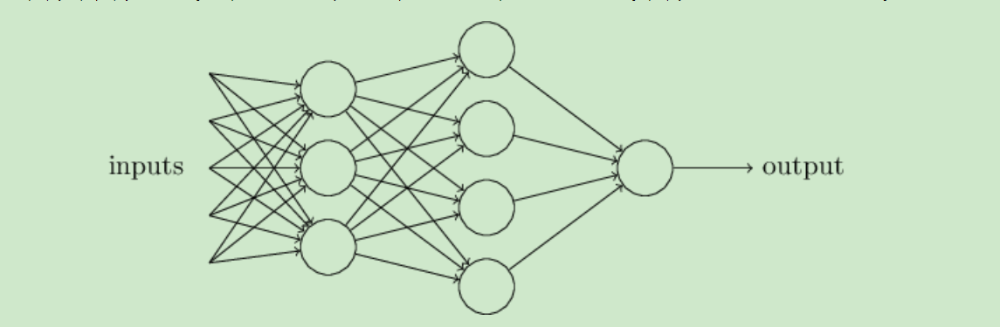
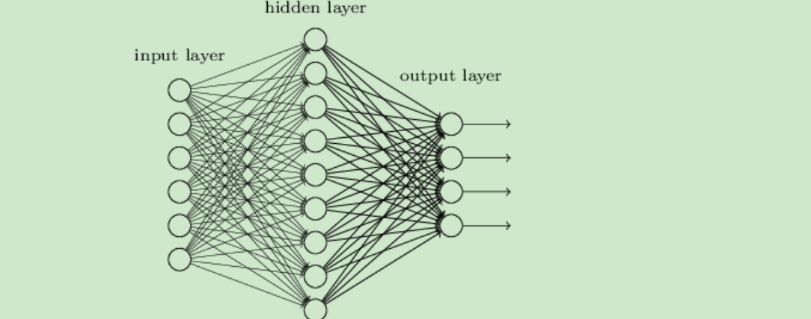
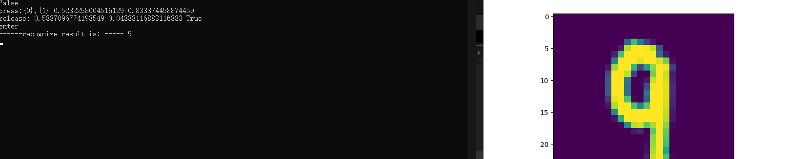

# 人工智能概论报告

## step 1

### 人工智能的定义

智能地把某件特定的事情做好，在某个领域增强人类的智慧，这种方式又叫做智能增强。
像人类一样能认知，思考，判断：模拟人类的智能。

### 神经网络的主要功能

回归或者叫做拟合
单层的神经网络能够模拟一条二维平面上的直线，从而可以完成线性分割任务。而理论证明，两层神经网络可以无限逼近任意连续函数。
神经网络中的三个基本概念：

#### 1. 线性反向传播：总的来说就是链式求导法则反复用。注意这里 x,y,z 不是变量，只是中间计算结果；w,b 才是变量。因为在后面要学习的神经网络中，要最终求解的目标是 w 和 b 的值。最终的 zz 值，受到了前面很多因素的影响：变量 w，变量 b，计算式 x，计算式 y。

### 神经网络的基本原理

神经网络由基本的神经元组成，图1-13就是一个神经元的数学/计算模型，便于我们用程序来实现。


### 梯度下降的三要素

1.当前点；
2.方向；
3.步长。

### 损失函数

纵坐标是损失函数值，横坐标是变量。不断地改变变量的值，会造成损失函数值的上升或下降。而梯度下降算法会让我们沿着损失函数值下降的方向前进。

###  为什么不能使用均方差做为分类问题的损失函数？

1. 回归问题通常用均方差损失函数，可以保证损失函数是个凸函数，即可以得到最优解。而分类问题如果用均方差的话，损失函数的表现不是凸函数，就很难得到最优解。而交叉熵函数可以保证区间内单调。

2. 分类问题的最后一层网络，需要分类函数，Sigmoid或者Softmax，如果再接均方差函数的话，其求导结果复杂，运算量比较大。用交叉熵函数的话，可以得到比较简单的计算结果，一个简单的减法就可以得到反向误差。

## Step 2

### 一元线性回归模型
回归分析是一种数学模型。当因变量和自变量为线性关系时，它是一种特殊的线性模型。

最简单的情形是一元线性回归，由大体上有线性关系的一个自变量和一个因变量组成，模型是：

$$Y=a+bX+\varepsilon \tag{1}$$

对于线性回归模型，有如下一些概念需要了解：

- 通常假定随机误差 $\varepsilon$ 的均值为 $0$，方差为$σ^2$（$σ^2>0$，$σ^2$ 与 $X$ 的值无关）
- 若进一步假定随机误差遵从正态分布，就叫做正态线性模型
- 一般地，若有 $k$ 个自变量和 $1$ 个因变量（即公式1中的 $Y$），则因变量的值分为两部分：一部分由自变量影响，即表示为它的函数，函数形式已知且含有未知参数；另一部分由其他的未考虑因素和随机性影响，即随机误差
- 当函数为参数未知的线性函数时，称为线性回归分析模型
- 当函数为参数未知的非线性函数时，称为非线性回归分析模型
- 当自变量个数大于 $1$ 时称为多元回归
- 当因变量个数大于 $1$ 时称为多重回归.

### 最小二乘法
概念： 最小二乘法，也叫做最小平方法（Least Square），它通过最小化误差的平方和寻找数据的最佳函数匹配。利用最小二乘法可以简便地求得未知的数据，并使得这些求得的数据与实际数据之间误差的平方和为最小。最小二乘法还可用于曲线拟合。其他一些优化问题也可通过最小化能量或最小二乘法来表达。

### 神经网络解法

（1）定义神经网络结构

我们定义一个一层的神经网络，输入层为2或者更多，反正大于2了就没区别。这个一层的神经网络的特点是：
1.没有中间层，只有输入项和输出层（输入项不算做一层），
2.输出层只有一个神经元，
3.神经元有一个线性输出，不经过激活函数处理，即在下图中，经过$\Sigma$求和得到Z值之后，直接把Z值输出。

## step 3

### 二分类函数
此函数对线性和非线性二分类都适用。

### 二分类函数

对率函数Logistic Function，即可以做为激活函数使用，又可以当作二分类函数使用。而在很多不太正规的文字材料中，把这两个概念混用了，比如下面这个说法：“我们在最后使用Sigmoid激活函数来做二分类”，这是不恰当的。在本书中，我们会根据不同的任务区分激活函数和分类函数这两个概念，在二分类任务中，叫做Logistic函数，而在作为激活函数时，叫做Sigmoid函数。

#### 二分类问题总结

分类问题是机器学习中非常重要的一个课题。现实生活中有很多实际的二分类场景，如对于借贷问题，我们会根据某个人的收入、存款、职业、年龄等因素进行分析，判断是否进行借贷；对于一封邮件，根据邮件内容判断该邮件是否属于垃圾邮件等等。

### 二分类与多分类的关系

我们已经学习过了使用神经网络做二分类的方法，它并不能用于多分类。在传统的机器学习中，有些二分类算法可以直接推广到多分类，但是在更多的时候，我们会基于一些基本策略，利用二分类学习器来解决多分类问题。

### 权重矩阵

$W$权重矩阵的尺寸，可以从前往后看，比如：输入层是2个特征，输出层是3个神经元，则$W$的尺寸就是 $2\times 3$。

### 多分类过程

我们在此以具有两个特征值的三分类举例。可以扩展到更多的分类或任意特征值，比如在ImageNet的图像分类任务中，最后一层全连接层输出给分类器的特征值有成千上万个，分类有1000个。

1. 线性计算

$$z_1 = x_1 w_{11} + x_2 w_{21} + b_1 \tag{1}$$
$$z_2 = x_1 w_{12} + x_2 w_{22} + b_2 \tag{2}$$
$$z_3 = x_1 w_{13} + x_2 w_{23} + b_3 \tag{3}$$

2. 分类计算

$$
a_1=\frac{e^{z_1}}{\sum_i e^{z_i}}=\frac{e^{z_1}}{e^{z_1}+e^{z_2}+e^{z_3}}  \tag{4}
$$
$$
a_2=\frac{e^{z_2}}{\sum_i e^{z_i}}=\frac{e^{z_2}}{e^{z_1}+e^{z_2}+e^{z_3}}  \tag{5}
$$
$$
a_3=\frac{e^{z_3}}{\sum_i e^{z_i}}=\frac{e^{z_3}}{e^{z_1}+e^{z_2}+e^{z_3}}  \tag{6}
$$

### 多分类结果可视化

同理，用于分开红色点和其它两类的分割线是蓝色射线和绿色射线，用于分开绿色点和其它两类的分割线是红色射线和蓝色射线。

## step 4

这章主要讲解了激活函数的应用。

### 激活函数的基本性质：

+ 非线性：线性的激活函数和没有激活函数一样；
+ 可导性：做误差反向传播和梯度下降，必须要保证激活函数的可导性；
+ 单调性：单一的输入会得到单一的输出，较大值的输入得到较大值的输出。
用到神经网络中的概念，用‘1’来代表一个神经元被激活，‘0’代表一个神经元未被激活。

### Logistic函数
在二分类任务中最后一层使用的对率函数与在神经网络层与层之间连接的Sigmoid激活函数，是同样的形式。所以它既是激活函数，又是分类函数，

### 值域

- 输入值域：$(-\infty, \infty)$
- 输出值域：$(0,1)$
- 导数值域：$(0,0.25]$

### 优点

具有Sigmoid的所有优点。

无论从理论公式还是函数图像，这个函数都是一个和Sigmoid非常相像的激活函数，他们的性质也确实如此。但是比起Sigmoid，Tanh减少了一个缺点，就是他本身是零均值的，也就是说，在传递过程中，输入数据的均值并不会发生改变，这就使他在很多应用中能表现出比Sigmoid优异一些的效果。

### 缺点

exp指数计算代价大。梯度消失问题仍然存在。
再强调一下本书中的约定：

1. Sigmoid，指的是对数几率函数用于激活函数时的称呼；
2. Logistic，指的是对数几率函数用于二分类函数时的称呼；
3. Tanh，指的是双曲正切函数用于激活函数时的称呼。

### 结论
- 如果结果是0，说明模型跟瞎猜差不多；
- 如果结果是1，说明模型无错误；
- 如果结果是0-1之间的数，就是模型的好坏程度；
- 如果结果是负数，说明模型还不如瞎猜。
### 代码实现：

```Python
def R2(a, y):
    assert (a.shape == y.shape)
    m = a.shape[0]
    var = np.var(y)
    mse = np.sum((a-y)**2)/m
    r2 = 1 - mse / var
    return r2
```
多项式回归有几种形式：

### 验证集

Validation Set，或者叫做Dev Set，是模型训练过程中单独留出的样本集，它可以用于调整模型的超参数和用于对模型的能力进行初步评估。
在神经网络中，验证数据集用于：

- 寻找最优的网络深度
- 或者决定反向传播算法的停止点
- 或者在神经网络中选择隐藏层神经元的数量
- 在普通的机器学习中常用的交叉验证（Cross Validation）就是把训练数据集本身再细分成不同的验证数据集去训练模型。


## step 5

### 准确率 Accuracy
- 左侧实心圆点是正类，右侧空心圆是负类；
- 在圆圈中的样本是被模型判断为正类的，圆圈之外的样本是被判断为负类的；
- 左侧圆圈外的点是正类但是误判为负类，右侧圆圈内的点是负类但是误判为正类；
- 左侧圆圈内的点是正类且被正确判别为正类，右侧圆圈外的点是负类且被正确判别为负类。
分子为被判断为正类并且真的是正类的样本数，分母是真的正类的样本数。越大越好。
分子为被判断为正类的负例样本数，分母为所有负类样本数。越小越好。

### 为什么必须用双层神经网络
- 从复杂程度上分，有线性/非线性之分；
- 从样本类别上分，有二分类/多分类之分。

### 代码实现

```Python
class XOR_DataReader(DataReader):
    def ReadData(self):
        self.XTrainRaw = np.array([0,0,0,1,1,0,1,1]).reshape(4,2)
        self.YTrainRaw = np.array([0,1,1,0]).reshape(4,1)
        self.XTrain = self.XTrainRaw
        self.YTrain = self.YTrainRaw
        self.num_category = 1
        self.num_train = self.XTrainRaw.shape[0]
        self.num_feature = self.XTrainRaw.shape[1]
        self.XTestRaw = self.XTrainRaw
        self.YTestRaw = self.YTrainRaw
        self.XTest = self.XTestRaw
        self.YTest = self.YTestRaw
        self.num_test = self.num_train

    def GenerateValidationSet(self, k = 10):
        self.XVld = self.XTrain
        self.YVld = self.YTrain
```

### 简言之：

1. 神经网络最后一层不需要激活函数
2. 激活函数只用于连接前后两层神经网络

## step 7

DNN可以理解为有很多隐藏层的神经网络。这个很多其实也没有什么度量标准, 多层神经网络和深度神经网络DNN其实也是指的一个东西，当然，DNN有时也叫做多层感知机（Multi-Layer perceptron,MLP）, 名字实在是多。后面我们讲到的神经网络都默认为DNN。

以我的理解，DNN内部的神经网络层可以分为三类，输入层，隐藏层和输出层。

### 激活函数和分类函数：

- `Identity` - 直传函数，即没有激活处理
- `Sigmoid`
- `Tanh`
- `Relu`

基本神经网络运行参数：

 - 学习率
 - 最大`epoch`
 - `batch size`
 - 损失函数定义
 - 初始化方法
 - 优化器类型
 - 停止条件
 - 正则类型和条件

### 损失函数及帮助方法：

- 均方差函数
- 交叉熵函数二分类
- 交叉熵函数多分类
- 记录损失函数
- 显示损失函数历史记录
- 获得最小函数值时的权重参数

1.入了隐藏层，隐藏层可以有多层，增强模型的表达能力，如下图实例，当然增加了这么多隐藏层模型的复杂度也增加了好多。



2.输出层的神经元也可以不止一个输出，可以有多个输出，这样模型可以灵活的应用于分类回归，以及其他的机器学习领域比如降维和聚类等。多个神经元输出的输出层对应的一个实例如下图，输出层现在有4个神经元了。




### 随着网络的加深，训练变得越来越困难，时间越来越长，原因可能是：

- 参数多
- 数据量大
- 梯度消失
- 损失函数坡度平缓
改善：
- 权重矩阵初始化
- 批量归一化
- 梯度下降优化算法
- 自适应学习率算法

### 深度神经网络的挑战

机器学习领域有个很重要的假设：I.I.D.（独立同分布）假设，就是假设训练数据和测试数据是满足相同分布的，这样就能做到通过训练数据获得的模型能够在测试集获得好的效果。

在深度神经网络中，我们可以将每一层视为对输入的信号做了一次变换：

### 拟合程度比较

在深度神经网络中，我们遇到的另外一个挑战，就是网络的泛化问题。所谓泛化，就是模型在测试集上的表现要和训练集上一样好。经常有这样的例子：一个模型在训练集上千锤百炼，能到达99%的准确率，拿到测试集上一试，准确率还不到90%。这说明模型过度拟合了训练数据，而不能反映真实世界的情况。解决过度拟合的手段和过程，就叫做泛化。
出现过拟合的原因：

1. 训练集的数量和模型的复杂度不匹配，样本数量级小于模型的参数
2. 训练集和测试集的特征分布不一致
3. 样本噪音大，使得神经网络学习到了噪音，正常样本的行为被抑制
4. 迭代次数过多，过分拟合了训练数据，包括噪音部分和一些非重要特征

### 学习法

学习法，就是用另外一个神经网络，通过训练的方式，把9个神经网路的输出结果作为输入，把图片的真实数字作为标签，得到一个强学习器。

## 搭建miniFramework实现手写数字识别

### 步骤：
1.首先你要用本机进行fook老师的库，里面会有资料以及运行的代码。
2.其次，就是环境的以及软件的选择。这个步骤就是八仙过海各显神通了。最终目的就是把这个手写数字识别出来即可。
3.有的人会选择用Visual Studio 2017 ，但是我发现官网找不到旧版的Visual Studio 2017，都是2019版的，别的途径下载又会有很多垃圾软件，所以我选择是直接用vs code。用的顺手就是最适合我们的。
4.最后一步就是要注意在vs code里面用到python。所以要在vs code中进行python的下载。

### 结果展示（以9为例子）



### 代码展示

```Python
from matplotlib import pyplot as plt
import numpy as np
from PIL import Image

from HelperClass2.NeuralNet_3_0 import *

def ReadImage(img_file_name):
    img = Image.open(img_file_name)
    out1 = img.convert('L')
    out2 = out1.resize((28,28))
    a = np.array(out2)
    b = 255 - a
    x_max = np.max(b)
    x_min = np.min(b)
    X_NEW = (b - x_min)/(x_max-x_min)
    plt.cla()
    plt.imshow(X_NEW)
    plt.plot()
    return X_NEW.reshape(1,-1)

def Inference(img_array):
    output = net.inference(img_array)
    n = np.argmax(output)
    print("------recognize result is: -----", n)

def on_key_press(event):
    img_file_name = "handwriting.png"
    print(event.key)
    if event.key == 'enter':
        plt.axis('off')
        plt.savefig(img_file_name)
        plt.axis('on')
        img_array = ReadImage(img_file_name)
        Inference(img_array)
    elif event.key == 'backspace':
        plt.cla()
        plt.axis([0,1,0,1])
        ax.figure.canvas.draw()
    #end if

def on_mouse_press(event):
    global startx, starty, isdraw
    print(isdraw)
    isdraw = True
    startx = event.xdata
    starty = event.ydata
    print("press:{0},{1}", startx, starty)
    
def on_mouse_release(event):
    global isdraw, startx, starty
    print("release:", event.xdata, event.ydata, isdraw)
    isdraw = False

def on_mouse_move(event):
    global isdraw, startx, starty
    if isdraw:
        endx = event.xdata        
        endy = event.ydata        
        x1 = [startx, endx]
        y1 = [starty, endy]
        ax.plot(x1, y1, color='black', linestyle='-', linewidth='40')
        ax.figure.canvas.draw()
        startx = endx
        starty = endy
    # end if

def LoadNet():
    n_input = 784
    n_hidden1 = 64
    n_hidden2 = 16
    n_output = 10
    eta = 0.2
    eps = 0.01
    batch_size = 128
    max_epoch = 40

    hp = HyperParameters_3_0(
        n_input, n_hidden1, n_hidden2, n_output, 
        eta, max_epoch, batch_size, eps, 
        NetType.MultipleClassifier, 
        InitialMethod.Xavier)
    net = NeuralNet_3_0(hp, "MNIST_64_16")
    net.LoadResult()
    return net
   
if __name__ == "__main__":
    isdraw = False
    startx, starty = 0, 0

    print("need to run level3 first to get result")
    print("============================================================================")
    print("handwriting a digit, then press enter to recognize, press backspace to clear")
    print("resize the window to square, say, height == width")
    print("the handwriting should full fill the window")
    print("============================================================================")

    net = LoadNet()

    fig, ax = plt.subplots()
    fig.canvas.mpl_connect('key_press_event', on_key_press)
    fig.canvas.mpl_connect('button_release_event', on_mouse_release)
    fig.canvas.mpl_connect('button_press_event', on_mouse_press)
    fig.canvas.mpl_connect('motion_notify_event', on_mouse_move)
    
    plt.axis([0,1,0,1])
    plt.show()

```

## 课程学习心得

这个课程总结写完也就代表着我们的这门课程学习完了，其实在这节课讲解过程中还是有很多收获的。由浅入深，学习了神经网络，又学习了深度神经网络等等。老师讲解的也很耐心，当我们代码运行出问题或者环境配不好，老师都会来给我们讲解。但是学习是无止境的，这门课对AI人工智能发展还是有很大的帮助，所以有时间还是要继续研究下去。毕竟以后我们也会走AI这一条道路。

还有一点就是数学还是要学好，不然给我们带来的困扰就是:在理解代码的同时还要把数学复习一遍，这样会加快我们掉头发的速度！！！