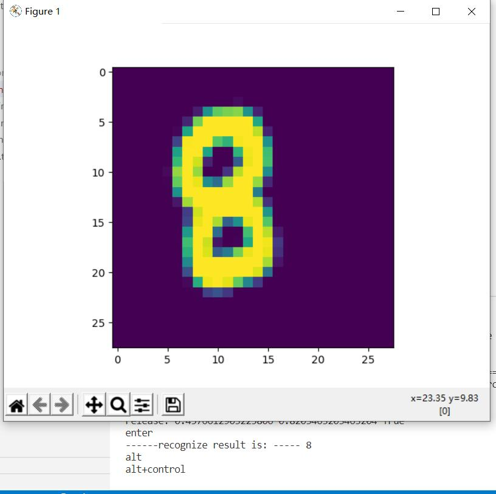

<style>
table {
margin: auto;
}
</style>


# **课程报告**

## 利用搭建的miniFramework实现手写数字的识别

**实验结果**



# Step1

##  介绍

* **人工神经网络(Artificial Neural Netork,即ANN)** 是由简单神经元经过相互连接形成网状结构，通过调节各连接的权重值改变连接的强度，进而实现感知判断

* **反向传播(Back Propagation,BP)** 算法的提出进一步推动了神经网络的发展。目前，神经网络作为一种重要的数据挖掘方法，已在医学诊断、信用卡欺诈识别、手写数字识别以及发动机的故障诊断等领域得到了广泛的应用
  
## 神经网络

* ### **“神经网络”** 的图示:
<div align=center>

</div>


我们使用圆圈来表示神经网络的输入，标上“$+$ $1$”的圆圈被称为**偏置节点**，也就是截距项。神经网络最左边的一层叫做**输入层**，最右的一层叫做**输出层**（本例中，输出层只有一个节点）。中间所有节点组成的一层叫做**隐藏层**，因为我们不能在训练样本集中观测到它们的值。同时可以看到，以上神经网络的例子中有$3$个**输入单元**（偏置单元不计在内），$3$个**隐藏单元**及一个**输出单元**。

## **神经网络中的三个基本概念**

>### 反向传播

* **BP神经网络**是一种按误差反向传播(简称误差反传)训练的多层前馈网络，其算法称为BP算法，它的基本思想是梯度下降法，利用梯度搜索技术，以期使网络的实际输出值和期望输出值的误差均方差为最小。
  
* 假设有一个函数：

$$z = x \cdot y \tag{1}$$

其中:

$$x = 2w + 3b \tag{2}$$

$$y = 2b + 1 \tag{3}$$

注意这里 $x,y,z$ 不是变量，只是中间计算结果；$w,b$ 才是变量。因为在后面要学习的神经网络中，要最终求解的目标是 $w$ 和 $b$ 的值。
>### 梯度下降

* 在自然界中，梯度下降的最好例子，就是泉水下山的过程：

1. 水受重力影响，会在当前位置，沿着最陡峭的方向流动，有时会形成瀑布（梯度下降）；
2. 水流下山的路径不是唯一的，在同一个地点，有可能有多个位置具有同样的陡峭程度，而造成了分流（可以得到多个解）；
3. 遇到坑洼地区，有可能形成湖泊，而终止下山过程（不能得到全局最优解，而是局部最优解）。

“梯度下降”包含了两层含义：

1. 梯度：函数当前位置的最快上升点；
2. 下降：与导数相反的方向，用数学语言描述就是那个减号。

亦即与上升相反的方向运动，就是下降。

<div align=center>

</div>

  
#### **梯度下降的数学公式**：

$$\theta_{n+1} = \theta_{n} - \eta \cdot \nabla J(\theta) \tag{1}$$

#### 其中：

- $\theta_{n+1}$：下一个值；
- $\theta_n$：当前值；
- $-$：减号，梯度的反向；
- $\eta$：学习率或步长，控制每一步走的距离，不要太快以免错过了最佳景点，不要太慢以免时间太长；
- $\nabla$：梯度，函数当前位置的最快上升点；
- $J(\theta)$：函数。

#### **梯度下降的三要素**

1. 当前点；
2. 方向；
3. 步长。

### 一.**单变量梯度下降**

***假设单变量函数***

$$J(x) = x ^2$$

***其微分为***

$$J'(x) = 2x$$

***假设初始位置为***：

$$x_0=1.2$$

***假设学习率***：

$$\eta = 0.3$$

***假设终止条件为 $J(x)<0.01$，迭代过程是***：
```
x=0.480000, y=0.230400
x=0.192000, y=0.036864
x=0.076800, y=0.005898
x=0.030720, y=0.000944
```

<div align=center>

</div>

### 二.**双变量的梯度下降**

***假设一个双变量函数***：

$$J(x,y) = x^2 + \sin^2(y)$$

***两个一阶偏导数为***

$${\partial{J(x,y)} \over \partial{x}} = 2x$$
$${\partial{J(x,y)} \over \partial{y}} = 2 \sin y \cos y$$

$$双变量梯度下降的迭代过程$$

|迭代次数|x|y|J(x,y)|
|:----:|:----:|:----:|:----:|
|1|3|1|9.708073|
|2|2.4|0.909070|6.382415|
|...|...|...|...|
|15|0.105553|0.063481|0.015166|
|16|0.084442|0.050819|0.009711|

* 可视化结果：梯度下降的过程，从红色的高地一直沿着坡度向下走，直到蓝色的洼地。

|观察角度1|观察角度2|
|--|--|
|||

>### 损失函数

* **概念**：在各种材料中经常看到的中英文词汇有：误差，偏差，Error，Cost，Loss，损失，代价......意思都差不多，在本书中，使用“损失函数”和“Loss Function”这两个词汇，具体的损失函数符号用 $J$ 来表示，误差值用 $loss$ 表示。

***“损失”就是所有样本的“误差”的总和，亦即（$m$ 为样本数）***：

$$损失 = \sum^m_{i=1}误差_i$$

$$J = \sum_{i=1}^m loss_i$$

在黑盒子的例子中，我们如果说“某个样本的损失”是不对的，只能说“某个样本的误差”，因为样本是一个一个计算的。如果我们把神经网络的参数调整到完全满足独立样本的输出误差为 $0$，通常会令其它样本的误差变得更大，这样作为误差之和的损失函数值，就会变得更大。所以，我们通常会在根据某个样本的误差调整权重后，计算一下整体样本的损失函数值，来判定网络是不是已经训练到了可接受的状态。

* **损失函数的作用**

损失函数的作用，就是计算神经网络每次迭代的前向计算结果与真实值的差距，从而指导下一步的训练向正确的方向进行。

如何使用损失函数呢？具体步骤：

1. 用随机值初始化前向计算公式的参数；
2. 代入样本，计算输出的预测值；
3. 用损失函数计算预测值和标签值（真实值）的误差；
4. 根据损失函数的导数，沿梯度最小方向将误差回传，修正前向计算公式中的各个权重值；
5. 进入第2步重复, 直到损失函数值达到一个满意的值就停止迭代。

# 代码测试

## **Level1_BP_Linear**
<div align=center>

</div>

## **Level2_BP_NoneLinear**
<div align=center>

</div>

<div align=center>

</div>

## **Level3_GDSingleVariable**
<div align=center>


</div>

## **Level4_GDDoubleVariable**
<div align=center>


</div>

## **Level5_LearningRate**
<div align=center>


</div>


# Step2

## **一、算法简介**

### **1.1 什么是回归分析**

回归分析是一种预测性的建模技术，它研究的是因变量（目标）和自变量（预测器）之间的关系。这种技术通常用于预测分析，时间序列模型以及发现变量之间的因果关系。通常使用曲线/线来拟合数据点，目标是使曲线到数据点的距离差异最小。

### **1.2 线性回归**

线性回归是回归问题中的一种，线性回归假设目标值与特征之间线性相关，即满足一个多元一次方程。通过构建损失函数，来求解损失函数最小时的参数$w$和$b$。通长我们可以表达成如下公式：

$$\widehat{y}=wx+b$$

$\widehat{y}$为预测值，自变量$x$和因变量$y$是已知的，而我们想实现的是预测新增一个$x$，其对应的$y$是多少。因此，为了构建这个函数关系，目标是通过已知数据点，求解线性模型中$w$和$b$两个参数。

### **1.3 目标/损失函数**

求解最佳参数，需要一个标准来对结果进行衡量，为此我们需要定量化一个目标函数式，使得计算机可以在求解过程中不断地优化。

针对任何模型求解问题，都是最终都是可以得到一组预测值$\widehat{y}$，对比已有的真实值 $y$ ，数据行数为 $n$ ，可以将损失函数定义如下：

<div align=center>

</div>

即预测值与真实值之间的平均的平方距离，统计中一般称其为**MAE(mean square error)均方误差**。把之前的函数式代入损失函数，并且将需要求解的参数$w$和$b$看做是函数$L$的自变量，可得

<div align=center>

</div>

现在的任务是求解最小化$L$时$w$和$b$的值，
即核心目标优化式为

<div align=center>

</div>

求解方式有：
>**1）最小二乘法(least square method)**
求解 $w$ 和 $b$ 是使损失函数最小化的过程，在统计中，称为**线性回归模型的最小二乘“参数估计”(parameter estimation)**。

我们可以将 $L(w,b)$ 分别对 $w$ 和 $b$ 求导，得到

<div align=center>

</div>

令上述两式为$0$，可得到 $w$ 和 $b$ **最优解的闭式(closed-form)解**：

<div align=center>

</div>

>**2）梯度下降(gradient descent)**

梯度下降核心内容是对自变量进行不断的更新（针对w和b求偏导），使得目标函数不断逼近最小值的过程

<div align=center>

</div>

>**3)神经网络法** 
### 1. **定义神经网络结构**

我们是首次尝试建立神经网络，先用一个最简单的单层单点神经元，如图4-4所示。


图4-4 单层单点神经元

#### **输入层**

此神经元在输入层只接受一个输入特征，经过参数 $w,b$ 的计算后，直接输出结果。这样一个简单的“网络”，只能解决简单的一元线性回归问题，而且由于是线性的，我们不需要定义激活函数，这就大大简化了程序，而且便于大家循序渐进地理解各种知识点。

严格来说输入层在神经网络中并不能称为一个层。

#### **权重 $w,b$**

因为是一元线性问题，所以 $w,b$ 都是标量。

#### **输出层**

输出层 $1$ 个神经元，线性预测公式是：

$$z_i = x_i \cdot w + b$$

$z$ 是模型的预测输出，$y$ 是实际的样本标签值，下标 $i$ 为样本。

#### **损失函数**

因为是线性回归问题，所以损失函数使用均方差函数。

$$loss(w,b) = \frac{1}{2} (z_i-y_i)^2$$

### 2.**反向传播**

由于我们使用了和上一节中的梯度下降法同样的数学原理，所以反向传播的算法也是一样的，细节请查看4.2.2。

#### **计算 $w$ 的梯度**

$$
{\partial{loss} \over \partial{w}} = \frac{\partial{loss}}{\partial{z_i}}\frac{\partial{z_i}}{\partial{w}}=(z_i-y_i)x_i
$$

#### **计算 $b$ 的梯度**

$$
\frac{\partial{loss}}{\partial{b}} = \frac{\partial{loss}}{\partial{z_i}}\frac{\partial{z_i}}{\partial{b}}=z_i-y_i
$$

>**4)多样本计算** 

### **前向计算**

<div align=center>

</div>

举个例子，假设上一层结点$i,j,k,…$等一些结点与本层的结点$w$有连接，那么结点$w$的值怎么算呢？就是通过上一层的$i,j,k$等结点以及对应的连接权值进行加权和运算，最终结果再加上一个偏置项（图中为了简单省略了），最后在通过一个非线性函数（即激活函数），如$ReLu，sigmoid$等函数，最后得到的结果就是本层结点$w$的输出。最终不断的通过这种方法一层层的运算，得到输出层结果。

对于前向传播来说，不管维度多高，其过程都可以用如下公式表示：

$$a^2=\sigma(aW^2+b^2)$$

其中，上标代表层数，星号表示卷积，$b$表示偏置项$bias$，$\sigma$表示激活函数。

>**5)正规方程解法**

英文名是 Normal Equations。

对于线性回归问题，除了前面提到的最小二乘法可以解决一元线性回归的问题外，也可以解决多元线性回归问题。

对于多元线性回归，可以用正规方程来解决，也就是得到一个数学上的解析解。它可以解决下面这个公式描述的问题：

$$y=a_0+a_1x_1+a_2x_2+\dots+a_kx_k \tag{1}$$


## **二、数据标准化（Normalization）**

### **为什么要做归一化**

理论层面上，神经网络是以**样本在事件中的统计分布概率为基础**进行训练和预测的，也就是说：

>1.**样本的各个特征的取值要符合概率分布**，即$[0,1]$

>2.**样本的度量单位要相同**。我们并没有办法去比较$1$米和$1$公斤的区别，但是，如果我们知道了$1$米在整个样本中的大小比例，以及$1$公斤在整个样本中的大小比例，比如一个处于$0.2$的比例位置，另一个处于$0.3$的比例位置，就可以说这个样本的$1$米比$1$公斤要小！

>3.**神经网络**:假设所有的输入输出数据都是标准差为$1$，均值为$0$，包括权重值的初始化，激活函数的选择，以及优化算法的的设计。

>4.**数值问题**：归一化/标准化可以避免一些不必要的数值问题。因为**sigmoid/tanh**的非线性区间大约在$[-1.7，1.7]$。意味着要使神经元有效，$tanh( w_1x_1 + w_2x_2 +b)$ 里的 $w_1x_1 +w_2x_2 +b$ 数量级应该在 $1$ （$1.7$所在的数量级）左右。这时输入较大，就意味着权值必须较小，一个较大，一个较小，两者相乘，就引起数值问题了。

>5.**初始化**：在初始化时我们希望每个神经元初始化成有效的状态，**tansig函数**在$[-1.7, 1.7]$范围内有较好的非线性，所以我们希望函数的输入和神经元的初始化都能在合理的范围内使得每个神经元在初始时是有效的。（如果权值初始化在$[-1,1]$且输入没有归一化且过大，会使得神经元饱和）

>6.**梯度**：以**输入-隐层-输出**这样的三层**BP**为例，我们知道对于**输入-隐层**权值的梯度有$2ew(1-a^2)\cdot x$的形式（$e$是误差，$w$是隐层到输出层的权重，$a$是隐层神经元的值，$x$是输入），若果输出层的数量级很大，会引起$e$的数量级很大，同理，$w$为了将隐层（数量级为$1$）映身到输出层，$w$也会很大，再加上$x$也很大的话，从梯度公式可以看出，三者相乘，梯度就非常大了。这时会给梯度的更新带来数值问题。

>7.**学习率**：知道梯度非常大，学习率就必须非常小，因此，学习率（学习率初始值）的选择需要参考输入的范围，不如直接将数据归一化，这样学习率就不必再根据数据范围作调整。 对$w_1$适合的学习率，可能相对于$w_2$来说会太小，若果使用适合$w_1$的学习率，会导致在$w_2$方向上步进非常慢，会消耗非常多的时间，而使用适合$w_2$的学习率，对$w_1$来说又太大，搜索不到适合$w_1$的解。如果使用固定学习率，而数据没归一化，则后果可想而知。

### **标准化的常用方法**


- Min-Max标准化（离差标准化），将数据映射到 $[0,1]$ 区间

$$x_{new}=\frac{x-x_{min}}{x_{max} - x_{min}} \tag{1}$$

- 平均值标准化，将数据映射到[-1,1]区间
   
$$x_{new} = \frac{x - \bar{x}}{x_{max} - x_{min}} \tag{2}$$

- 对数转换
$$x_{new}=\ln(x_i) \tag{3}$$

- 反正切转换
$$x_{new}=\frac{2}{\pi}\arctan(x_i) \tag{4}$$

- Z-Score法

把每个特征值中的所有数据，变成平均值为0，标准差为1的数据，最后为正态分布。Z-Score规范化（标准差标准化 / 零均值标准化，其中std是标准差）：

$$x_{new} = \frac{x_i - \bar{x}}{std} \tag{5}$$

- 中心化，平均值为0，无标准差要求
  
$$x_{new} = x_i - \bar{x} \tag{6}$$

- 比例法，要求数据全是正值

$$
x_{new} = \frac{x_k}{\sum_{i=1}^m{x_i}} \tag{7}
$$

# Step3

## **线性分类**

### **1.二分类函数**
对率函数Logistic Function，即可以做为激活函数使用，又可以当作二分类函数使用。而在很多不太正规的文字材料中，把这两个概念混用了，比如下面这个说法：“我们在最后使用$Sigmoid$激活函数来做二分类”，这是不恰当的。在本书中，我们会根据不同的任务区分激活函数和分类函数这两个概念，在二分类任务中，叫做$Logistic$函数，而在作为激活函数时，叫做$Sigmoid$函数。

- Logistic函数公式

$$Logistic(z) = \frac{1}{1 + e^{-z}}$$

以下记 $a=Logistic(z)$。

- 导数

$$Logistic'(z) = a(1 - a)$$

具体求导过程可以参考8.1节。

- 输入值域

$$(-\infty, \infty)$$

- 输出值域

$$(0,1)$$

- 函数图像（图6-2）


图6-2 $Logistic$函数图像

#### **二分类的代数原理**

代数方式：通过一个分类函数计算所有样本点在经过线性变换后的概率值，使得正例样本的概率大于0.5，而负例样本的概率小于0.5。

### **2.多分类函数**

$softmax$函数，又称归一化指数函数。它是二分类函数$sigmoid$在多分类上的推广，目的是将多分类的结果以概率的形式展现出来。下图展示了$softmax$的计算方法：

<div align=center>

</div>

#### **为什么$softmax$是这种形式?**

概率有两个性质：
>1）预测的概率为非负数；

下图为$y=exp(x）$的图像，我们可以知道**指数函数**的值域取值范围是零到正无穷。$softmax$第一步就是将模型的预测结果转化到指数函数上，这样保证了概率的非负性。

<div align=center>

</div>

>2）各种预测结果概率之和等于1。

为了确保各个预测结果的概率之和等于1。我们只需要将转换后的结果进行归一化处理。方法就是将转化后的结果除以所有转化后结果之和，可以理解为转化后结果占总数的百分比。这样就得到近似的概率。

**$softmax$**就是将在**负无穷到正无穷**上的预测结果按照这两步转换为概率的。

下面为大家举一个例子，假如模型对一个三分类问题的预测结果为$-3、1.5、2.7$。我们要用$softmax$将模型结果转为概率。步骤如下：

1）将预测结果转化为非负数

$y_1 = exp(x1) = exp(-3) = 0.05$

$y_2 = exp(x2) = exp(1.5) = 4.48$

$y_3 = exp(x3) = exp(2.7) = 14.88$

2）各种预测结果概率之和等于1

$z_1 = y_1/(y_1+y_2+y_3) = 0.05/(0.05+4.48+14.88) = 0.0026$

$z_2 = y_2/(y_1+y_2+y_3) = 4.48/(0.05+4.48+14.88) = 0.2308$

$z_3 = y_3/(y_1+y_2+y_3) = 14.88/(0.05+4.48+14.88) = 0.7666$

总结一下$softmax$如何将多分类输出转换为概率，可以分为两步：

1）分子：通过指数函数，将实数输出映射到零到正无穷。

2）分母：将所有结果相加，进行归一化。

# Step 4

## **激活函数**

所谓**激活函数（Activation Function）**，就是在人工神经网络的神经元上运行的函数，负责将神经元的输入映射到输出端。

**激活函数（Activation functions）** 对于人工神经网络模型去学习、理解非常复杂和非线性的函数来说具有十分重要的作用。它们将非线性特性引入到我们的网络中。如图1，在神经元中，输入的 inputs 通过加权，求和后，还被作用了一个函数，这个函数就是激活函数。引入激活函数是为了增加神经网络模型的非线性。没有激活函数的每层都相当于矩阵相乘。就算你叠加了若干层之后，无非还是个矩阵相乘罢了。

<div align=center>

</div>

### **为什么要用激活函数?**

如果不用激活函数，每一层输出都是上层输入的线性函数，无论神经网络有多少层，输出都是输入的线性组合，这种情况就是最原始的**感知机（Perceptron）**。
如果使用的话，激活函数给神经元引入了非线性因素，使得神经网络可以任意逼近任何非线性函数，这样神经网络就可以应用到众多的非线性模型中。

# Step 5

## **为什么必须用双层神经网络?**

我们先回忆一下各种分类的含义：

- 从复杂程度上分，有线性/非线性之分；
- 从样本类别上分，有二分类/多分类之分。

从直观上理解，这几个概念应该符合表10-2中的示例。

表10-2 各种分类的组合关系

||二分类|多分类|
|---|---|---|
|线性|||
|非线性|||

在第三步中我们学习过线性分类，如果用于此处的话，我们可能会得到表10-3所示的绿色分割线。

表10-3 线性分类结果

|XOR问题|弧形问题|
|---|---|
|||
|图中两根直线中的任何一根，都不可能把蓝色点分到一侧，同时红色点在另一侧|对于线性技术来说，它已经尽力了，使得两类样本尽可能地分布在直线的两侧|

### 简单证明异或问题的不可能性

用单个感知机或者单层神经网络，是否能完成异或任务呢？我们自己做个简单的证明。先看样本数据，如表10-4。

表10-4 异或的样本数据

|样本|$x_1$|$x_2$|$y$|
|---|---|---|---|
|1|0|0|0|
|2|0|1|1|
|3|1|0|1|
|4|1|1|0|

用单个神经元（感知机）的话，就是表10-5中两种技术的组合。

表10-5 神经元结构与二分类函数

|神经元|分类函数Logistic|
|--|--|
|||

前向计算公式：

$$z = x_1  w_1 + x_2  w_2 + b \tag{1}$$
$$a = Logistic(z) \tag{2}$$

- 对于第一个样本数据

$x_1=0,x_2=0,y=0$。如果需要$a=y$的话，从Logistic函数曲线看，需要$z<0$，于是有：

$$x_1 w_1 + x_2  w_2 + b < 0$$

因为$x_1=0,x_2=0$，所以只剩下$b$项：

$$b < 0 \tag{3}$$

- 对于第二个样本数据

$x_1=0,x_2=1,y=1$。如果需要$a=y$，则要求$z>0$，不等式为：

$$x_1w_1 + x_2w_2+b=w_2+b > 0 \tag{4}$$

- 对于第三个样本数据

$x_1=1,x_2=0,y=1$。如果需要$a=y$，则要求$z>0$，不等式为：

$$x_1w_1 + x_2w_2+b=w_1+b > 0 \tag{5}$$

- 对于第四个样本

$x_1=1,x_2=1,y=0$。如果需要$a=y$，则要求$z<0$，不等式为：

$$x_1w_1 + x_2w_2+b=w_1+w_2+b < 0 \tag{6}$$

把公式6两边都加$b$，并把公式3接续：

$$(w_1 + b) + (w_2 + b) < b < 0 \tag{7}$$

再看公式4、5，不等式左侧括号内的两个因子都大于0，其和必然也大于0，不可能小于$b$。因此公式7不成立，无论如何也不能满足所有的4个样本的条件，所以单个神经元做异或运算是不可能的。

# Step 7

# Step 7

## 深度神经网络

### 搭建深度神经网络框架

>向前计算

```Python
def forward3(X, dict_Param):
    ...
    # layer 1
    Z1 = np.dot(W1,X) + B1
    A1 = Sigmoid(Z1)
    # layer 2
    Z2 = np.dot(W2,A1) + B2
    A2 = Tanh(Z2)
    # layer 3
    Z3 = np.dot(W3,A2) + B3
    A3 = Softmax(Z3)
    ...    
```

1，2，3三层的模式完全一样：矩阵运算+激活/分类函数。

>反向传播

```Python
def backward3(dict_Param,cache,X,Y):
    ...
    # layer 3
    dZ3= A3 - Y
    dW3 = np.dot(dZ3, A2.T)
    dB3 = np.sum(dZ3, axis=1, keepdims=True)
    # layer 2
    dZ2 = np.dot(W3.T, dZ3) * (1-A2*A2) # tanh
    dW2 = np.dot(dZ2, A1.T)
    dB2 = np.sum(dZ2, axis=1, keepdims=True)
    # layer 1
    dZ1 = np.dot(W2.T, dZ2) * A1 * (1-A1)   #sigmoid
    dW1 = np.dot(dZ1, X.T)
    dB1 = np.sum(dZ1, axis=1, keepdims=True)
    ...
```
每一层的模式也非常相近：计算本层的`dZ`，再根据`dZ`计算`dW`和`dB`。

因为三层网络比两层网络多了一层，所以会在初始化、前向、反向、更新参数等四个环节有所不同，但却是有规律的。再加上前面章节中，为了实现一些辅助功能，我们已经写了很多类。所以，现在可以动手搭建一个深度学习的迷你框架了。

### 抽象与设计

图14-1是迷你框架的模块化设计，下面对各个模块做功能点上的解释。


图14-1 迷你框架设计

#### NeuralNet

首先需要一个`NeuralNet`类，来包装基本的神经网络结构和功能：

- `Layers` - 神经网络各层的容器，按添加顺序维护一个列表
- `Parameters` - 基本参数，包括普通参数和超参
- `Loss Function` - 提供计算损失函数值，存储历史记录并最后绘图的功能
- `LayerManagement()` - 添加神经网络层
- `ForwardCalculation()` - 调用各层的前向计算方法
- `BackPropagation()` - 调用各层的反向传播方法
- `PreUpdateWeights()` - 预更新各层的权重参数
- `UpdateWeights()` - 更新各层的权重参数
- `Train()` - 训练
- `SaveWeights()` - 保存各层的权重参数
- `LoadWeights()` - 加载各层的权重参数

#### Layer

是一个抽象类，以及更加需要增加的实际类，包括：

- Fully Connected Layer
- Classification Layer
- Activator Layer
- Dropout Layer
- Batch Norm Layer

将来还会包括：

- Convolution Layer
- Max Pool Layer

每个Layer都包括以下基本方法：
 - `ForwardCalculation()` - 调用本层的前向计算方法
 - `BackPropagation()` - 调用本层的反向传播方法
 - `PreUpdateWeights()` - 预更新本层的权重参数
 - `UpdateWeights()` - 更新本层的权重参数
 - `SaveWeights()` - 保存本层的权重参数
 - `LoadWeights()` - 加载本层的权重参数

#### Activator Layer

激活函数和分类函数：

- `Identity` - 直传函数，即没有激活处理
- `Sigmoid`
- `Tanh`
- `Relu`

#### Classification Layer

分类函数，包括：

- `Sigmoid`二分类
- `Softmax`多分类


 #### Parameters

 基本神经网络运行参数：

 - 学习率
 - 最大`epoch`
 - `batch size`
 - 损失函数定义
 - 初始化方法
 - 优化器类型
 - 停止条件
 - 正则类型和条件

#### LossFunction

损失函数及帮助方法：

- 均方差函数
- 交叉熵函数二分类
- 交叉熵函数多分类
- 记录损失函数
- 显示损失函数历史记录
- 获得最小函数值时的权重参数

#### Optimizer

优化器：

- `SGD`
- `Momentum`
- `Nag`
- `AdaGrad`
- `AdaDelta`
- `RMSProp`
- `Adam`

#### WeightsBias

权重矩阵，仅供全连接层使用：

- 初始化 
  - `Zero`, `Normal`, `MSRA` (`HE`), `Xavier`
  - 保存初始化值
  - 加载初始化值
- `Pre_Update` - 预更新
- `Update` - 更新
- `Save` - 保存训练结果值
- `Load` - 加载训练结果值

#### DataReader

样本数据读取器：

- `ReadData` - 从文件中读取数据
- `NormalizeX` - 归一化样本值
- `NormalizeY` - 归一化标签值
- `GetBatchSamples` - 获得批数据
- `ToOneHot` - 标签值变成OneHot编码用于多分类
- `ToZeroOne` - 标签值变成0/1编码用于二分类
- `Shuffle` - 打乱样本顺序

从中派生出两个数据读取器：

- `MnistImageDataReader` - 读取MNIST数据
- `CifarImageReader` - 读取Cifar10数据

### 搭建模型

``` 完成拟合任务的抽象模型```

```Python
def model():
    dataReader = LoadData()
    num_input = 1
    num_hidden1 = 4
    num_output = 1
    max_epoch = 10000
    batch_size = 10
    learning_rate = 0.5
    params = HyperParameters_4_0(
        learning_rate, max_epoch, batch_size,
        net_type=NetType.Fitting,
        init_method=InitialMethod.Xavier,
        stopper=Stopper(StopCondition.StopLoss, 0.001))
    net = NeuralNet_4_0(params, "Level1_CurveFittingNet")
    fc1 = FcLayer_1_0(num_input, num_hidden1, params)
    net.add_layer(fc1, "fc1")
    sigmoid1 = ActivationLayer(Sigmoid())
    net.add_layer(sigmoid1, "sigmoid1")
    fc2 = FcLayer_1_0(num_hidden1, num_output, params)
    net.add_layer(fc2, "fc2")
    net.train(dataReader, checkpoint=100, need_test=True)
    net.ShowLossHistory()
    ShowResult(net, dataReader)
```

1. 输入层1个神经元，因为只有一个`x`值
2. 隐层4个神经元，对于此问题来说应该是足够了，因为特征很少
3. 输出层1个神经元，因为是拟合任务
4. 学习率=0.5
5. 最大`epoch=10000`轮
6. 批量样本数=10
7. 拟合网络类型
8. Xavier初始化
9. 绝对损失停止条件=0.001


### 训练结果   

```训练过程中损失函数值和准确率的变化```

```拟合结果```

#### 数据字段解读
- id：唯一id
- date：售出日期
- price：售出价格（标签值）
- bedrooms：卧室数量
- bathrooms：浴室数量
- sqft_living：居住面积
- sqft_lot：停车场面积
- floors：楼层数
- waterfront：泳池
- view：有多少次看房记录
- condition：房屋状况
- grade：评级
- sqft_above：地面上的面积
- sqft_basement：地下室的面积
- yr_built：建筑年份
- yr_renovated：翻修年份
- zipcode：邮政编码
- lat：维度
- long：经度
- sqft_living15：2015年翻修后的居住面积
- sqft_lot15：2015年翻修后的停车场面积
``完成房价预测任务的抽象模型``

```Python
def model():
    dr = LoadData()
    num_input = dr.num_feature
    num_hidden1 = 32
    num_hidden2 = 16
    num_hidden3 = 8
    num_hidden4 = 4
    num_output = 1
    max_epoch = 1000
    batch_size = 16
    learning_rate = 0.1
    params = HyperParameters_4_0(
        learning_rate, max_epoch, batch_size,
        net_type=NetType.Fitting,
        init_method=InitialMethod.Xavier,
        stopper=Stopper(StopCondition.StopDiff, 1e-7))
    net = NeuralNet_4_0(params, "HouseSingle")
    fc1 = FcLayer_1_0(num_input, num_hidden1, params)
    net.add_layer(fc1, "fc1")
    r1 = ActivationLayer(Relu())
    net.add_layer(r1, "r1")
    ......
    fc5 = FcLayer_1_0(num_hidden4, num_output, params)
    net.add_layer(fc5, "fc5")
    net.train(dr, checkpoint=10, need_test=True)
    
    output = net.inference(dr.XTest)
    real_output = dr.DeNormalizeY(output)
    mse = np.sum((dr.YTestRaw - real_output)**2)/dr.YTest.shape[0]/10000
    print("mse=", mse)
    
    net.ShowLossHistory()
    ShowResult(net, dr)
```

1. 学习率=0.1
2. 最大`epoch=1000`
3. 批大小=16
4. 拟合网络
5. 初始化方法Xavier
6. 停止条件为相对误差`1e-7`

``训练过程中损失函数值和准确率的变化``


## 二分类任务功能测试

``完成非线性二分类教学案例的抽象模型``


```Python
def model(dataReader):
    num_input = 2
    num_hidden = 3
    num_output = 1
    max_epoch = 1000
    batch_size = 5
    learning_rate = 0.1
    params = HyperParameters_4_0(
        learning_rate, max_epoch, batch_size,
        net_type=NetType.BinaryClassifier,
        init_method=InitialMethod.Xavier,
        stopper=Stopper(StopCondition.StopLoss, 0.02))
    net = NeuralNet_4_0(params, "Arc")
    fc1 = FcLayer_1_0(num_input, num_hidden, params)
    net.add_layer(fc1, "fc1")
    sigmoid1 = ActivationLayer(Sigmoid())
    net.add_layer(sigmoid1, "sigmoid1")
    
    fc2 = FcLayer_1_0(num_hidden, num_output, params)
    net.add_layer(fc2, "fc2")
    logistic = ClassificationLayer(Logistic())
    net.add_layer(logistic, "logistic")
    net.train(dataReader, checkpoint=10, need_test=True)
    return net
```

1. 输入层神经元数为2
2. 隐层的神经元数为3，使用Sigmoid激活函数
3. 由于是二分类任务，所以输出层只有一个神经元，用Logistic做二分类函数
4. 最多训练1000轮
5. 批大小=5
6. 学习率=0.1
7. 绝对误差停止条件=0.02


``训练过程中损失函数值和准确率的变化``


``分类效果``


## 模型
``完成非线性多分类教学案例的抽象模型``


```Python
def model_sigmoid(num_input, num_hidden, num_output, hp):
    net = NeuralNet_4_0(hp, "chinabank_sigmoid")
    fc1 = FcLayer_1_0(num_input, num_hidden, hp)
    net.add_layer(fc1, "fc1")
    s1 = ActivationLayer(Sigmoid())
    net.add_layer(s1, "Sigmoid1")
    fc2 = FcLayer_1_0(num_hidden, num_output, hp)
    net.add_layer(fc2, "fc2")
    softmax1 = ClassificationLayer(Softmax())
    net.add_layer(softmax1, "softmax1")
    net.train(dataReader, checkpoint=50, need_test=True)
    net.ShowLossHistory()
    
    ShowResult(net, hp.toString())
    ShowData(dataReader)
```

1. 隐层8个神经元
2. 最大`epoch=5000`
3. 批大小=10
4. 学习率0.1
5. 绝对误差停止条件=0.08
6. 多分类网络类型
7. 初始化方法为Xavier

`net.train()`函数是一个阻塞函数，只有当训练完毕后才返回。

### 运行结果
``训练过程中损失函数值和准确率的变化``


``分类效果图``


#### 模型
``使用ReLU函数抽象模型``


```Python
def model_relu(num_input, num_hidden, num_output, hp):
    net = NeuralNet_4_0(hp, "chinabank_relu")
    fc1 = FcLayer_1_0(num_input, num_hidden, hp)
    net.add_layer(fc1, "fc1")
    r1 = ActivationLayer(Relu())
    net.add_layer(r1, "Relu1")
    fc2 = FcLayer_1_0(num_hidden, num_hidden, hp)
    net.add_layer(fc2, "fc2")
    r2 = ActivationLayer(Relu())
    net.add_layer(r2, "Relu2")
    fc3 = FcLayer_1_0(num_hidden, num_output, hp)
    net.add_layer(fc3, "fc3")
    softmax = ClassificationLayer(Softmax())
    net.add_layer(softmax, "softmax")
    net.train(dataReader, checkpoint=50, need_test=True)
    net.ShowLossHistory()
    
    ShowResult(net, hp.toString())
    ShowData(dataReader)    
```

1. 隐层8个神经元
2. 最大`epoch=5000`
3. 批大小=10
4. 学习率0.1
5. 绝对误差停止条件=0.08
6. 多分类网络类型
7. 初始化方法为MSRA

### 运行结果
``训练过程中损失函数值和准确率的变化``


``分类效果图``


# 网络优化

随着网络的加深，训练变得越来越困难，时间越来越长，原因可能是：

- 参数多
- 数据量大
- 梯度消失
- 损失函数坡度平缓

为了解决上面这些问题，科学家们在深入研究网络表现的前提下，发现在下面这些方向上经过一些努力，可以给深度网络的训练带来或多或少的改善：

- 权重矩阵初始化
- 批量归一化
- 梯度下降优化算法
- 自适应学习率算法

###  零初始化
即把所有层的`W`值的初始值都设置为0。

$$
W = 0
$$

但是对于多层网络来说，绝对不能用零初始化，否则权重值不能学习到合理的结果。看下面的零值初始化的权重矩阵值打印输出：
```
W1= [[-0.82452497 -0.82452497 -0.82452497]]
B1= [[-0.01143752 -0.01143752 -0.01143752]]
W2= [[-0.68583865]
 [-0.68583865]
 [-0.68583865]]
B2= [[0.68359678]]
```

### 15.1.2 标准初始化

标准正态初始化方法保证激活函数的输入均值为0，方差为1。将W按如下公式进行初始化：

$$
W \sim N \begin{bmatrix} 0, 1 \end{bmatrix}
$$

其中的W为权重矩阵，N表示高斯分布，Gaussian Distribution，也叫做正态分布，Normal Distribution，所以有的地方也称这种初始化为Normal初始化。

一般会根据全连接层的输入和输出数量来决定初始化的细节：

$$
W \sim N
\begin{pmatrix} 
0, \frac{1}{\sqrt{n_{in}}}
\end{pmatrix}
$$

$$
W \sim U
\begin{pmatrix} 
-\frac{1}{\sqrt{n_{in}}}, \frac{1}{\sqrt{n_{in}}}
\end{pmatrix}
$$

``标准初始化在Sigmoid激活函数上的表现``


###  Xavier初始化方法
基于上述观察，Xavier Glorot等人研究出了下面的Xavier$^{[1]}$初始化方法。

条件：正向传播时，激活值的方差保持不变；反向传播时，关于状态值的梯度的方差保持不变。

$$
W \sim N
\begin{pmatrix}
0, \sqrt{\frac{2}{n_{in} + n_{out}}} 
\end{pmatrix}
$$

$$
W \sim U 
\begin{pmatrix}
 -\sqrt{\frac{6}{n_{in} + n_{out}}}, \sqrt{\frac{6}{n_{in} + n_{out}}} 
\end{pmatrix}
$$

``Xavier初始化在Sigmoid激活函数上的表现``


随机初始化和Xavier初始化的各层激活值与反向传播梯度比较

| |各层的激活值|各层的反向传播梯度|
|---|---|---|
| 随机初始化 |<br/>激活值分布渐渐集中|<br/>反向传播力度逐层衰退|
| Xavier初始化 |<br/>激活值分布均匀|<br/>反向传播力度保持不变|

``Xavier初始化在ReLU激活函数上的表现``


###  MSRA初始化方法

MSRA初始化方法$^{[2]}$，又叫做He方法，因为作者姓何

只考虑输入个数时，MSRA初始化是一个均值为0，方差为2/n的高斯分布，适合于ReLU激活函数：

$$
W \sim N 
\begin{pmatrix} 
0, \sqrt{\frac{2}{n}} 
\end{pmatrix}
$$

$$
W \sim U 
\begin{pmatrix} 
-\sqrt{\frac{6}{n_{in}}}, \sqrt{\frac{6}{n_{out}}} 
\end{pmatrix}
$$

``MSRA初始化在ReLU激活函数上的表现``


几种初始化方法的应用场景

|ID|网络深度|初始化方法|激活函数|说明|
|---|---|---|---|---|
|1|单层|零初始化|无|可以|
|2|双层|零初始化|Sigmoid|错误，不能进行正确的反向传播|
|3|双层|随机初始化|Sigmoid|可以|
|4|多层|随机初始化|Sigmoid|激活值分布成凹形，不利于反向传播|
|5|多层|Xavier初始化|Tanh|正确|
|6|多层|Xavier初始化|ReLU|激活值分布偏向0，不利于反向传播|
|7|多层|MSRA初始化|ReLU|正确|

### 随机梯度下降 SGD

``随机梯度下降算法的梯度搜索轨迹示意图``


学习率对SGD的影响

|学习率|损失函数与准确率|
|---|---|
|0.1||
|0.3||


###  动量算法 Momentum

``动量算法的前进方向``


#### 输入和参数
- $\eta$ - 全局学习率
- $\alpha$ - 动量参数，一般取值为0.5, 0.9, 0.99
- $v_t$ - 当前时刻的动量，初值为0

#### 实际效果

  SGD和动量法的比较

|算法|损失函数和准确率|
|---|---|
|SGD||
|Momentum||

###  梯度加速算法 NAG
Nesterov Accelerated Gradient，或者叫做Nesterov Momentum。
在小球向下滚动的过程中，我们希望小球能够提前知道在哪些地方坡面会上升，这样在遇到上升坡面之前，小球就开始减速。这方法就是Nesterov Momentum，其在凸优化中有较强的理论保证收敛。并且，在实践中Nesterov Momentum也比单纯的Momentum 的效果好。

#### 输入和参数

- $\eta$ - 全局学习率
- $\alpha$ - 动量参数，缺省取值0.9
- $v$ - 动量，初始值为0

动量法和NAG法的比较

|算法|损失函数和准确率|
|---|---|
|Momentum||
|NAG||


###  AdaGrad

Adaptive subgradient method.$^{[1]}$

AdaGrad是一个基于梯度的优化算法，它的主要功能是：它对不同的参数调整学习率，具体而言，对低频出现的参数进行大的更新，对高频出现的参数进行小的更新。因此，他很适合于处理稀疏数据。

在这之前，我们对于所有的参数使用相同的学习率进行更新。但 Adagrad 则不然，对不同的训练迭代次数t，AdaGrad 对每个参数都有一个不同的学习率。这里开方、除法和乘法的运算都是按元素运算的。这些按元素运算使得目标函数自变量中每个元素都分别拥有自己的学习率。

AdaGrad算法的学习率设置

|初始学习率|损失函数值变化|
|---|---|
|eta=0.3||
|eta=0.5||
|eta=0.7||

### AdaDelta

Adaptive Learning Rate Method. $^{[2]}$

AdaDelta法是AdaGrad 法的一个延伸，它旨在解决它学习率不断单调下降的问题。相比计算之前所有梯度值的平方和，AdaDelta法仅计算在一个大小为w的时间区间内梯度值的累积和。

但该方法并不会存储之前梯度的平方值，而是将梯度值累积值按如下的方式递归地定义：关于过去梯度值的衰减均值，当前时间的梯度均值是基于过去梯度均值和当前梯度值平方的加权平均，其中是类似上述动量项的权值。

#### 输入和参数

- $\epsilon$ - 用于数值稳定的小常数，建议缺省值为1e-5
- $\alpha \in [0,1)$ - 衰减速率，建议0.9
- $s$ - 累积变量，初始值0
- $r$ - 累积变量变化量，初始为0


AdaDelta法的学习率设置

|初始学习率|损失函数值|
|---|---|
|eta=0.1||
|eta=0.01||

### 均方根反向传播 RMSProp

Root Mean Square Prop。$^{[3]}$

RMSprop 是由 Geoff Hinton 在他 Coursera 课程中提出的一种适应性学习率方法，至今仍未被公开发表。RMSprop法要解决AdaGrad的学习率缩减问题。


#### 输入和参数

- $\eta$ - 全局学习率，建议设置为0.001
- $\epsilon$ - 用于数值稳定的小常数，建议缺省值为1e-8
- $\alpha$ - 衰减速率，建议缺省取值0.9
- $r$ - 累积变量矩阵，与$\theta$尺寸相同，初始化为0


RMSProp的学习率设置

|初始学习率|损失函数值|
|---|---|
|eta=0.1||<
||迭代了10000次，损失值一直在0.005下不来，说明初始学习率太高了，需要给一个小一些的初值|
|eta=0.01||
||合适的学习率初值设置||
|eta=0.005||


###  Adam - Adaptive Moment Estimation

计算每个参数的自适应学习率，相当于RMSProp + Momentum的效果，Adam$^{[4]}$算法在RMSProp算法基础上对小批量随机梯度也做了指数加权移动平均。和AdaGrad算法、RMSProp算法以及AdaDelta算法一样，目标函数自变量中每个元素都分别拥有自己的学习率。

#### 输入和参数

- $t$ - 当前迭代次数
- $\eta$ - 全局学习率，建议缺省值为0.001
- $\epsilon$ - 用于数值稳定的小常数，建议缺省值为1e-8
- $\beta_1, \beta_2$ - 矩估计的指数衰减速率，$\in[0,1)$，建议缺省值分别为0.9和0.999


Adam法的学习率设置

|初始学习率|损失函数值|
|---|---|
|eta=0.1||
||迭代了10000次，但是损失值没有降下来，因为初始学习率0.1太高了|
|eta=0.01||
||比较合适的学习率|
|eta=0.005||
||学习率较低|
|eta=0.001||
||初始学习率太低，收敛到目标损失值的速度慢|


###  模拟效果比较

**``不同梯度下降优化算法的模拟比较``**


- SGD算法，每次迭代完全受当前梯度的控制，所以会以折线方式前进。
- Momentum算法，学习率只有0.1，每次继承上一次的动量方向，所以会以比较平滑的曲线方式前进，不会出现突然的转向。
- RMSProp算法，有历史梯度值参与做指数加权平均，所以可以看到比较平缓，不会波动太大，都后期步长越来越短也是符合学习规律的。
- Adam算法，因为可以被理解为Momentum和RMSProp的组合，所以比Momentum要平缓一些，比RMSProp要平滑一些。

### 真实效果比较

用`Python`代码实现的前向计算、反向计算、损失函数计算的函数：

```Python
def ForwardCalculationBatch(W,B,batch_x):
    Z = np.dot(W, batch_x) + B
    return Z
def BackPropagationBatch(batch_x, batch_y, batch_z):
    m = batch_x.shape[1]
    dZ = batch_z - batch_y
    dB = dZ.sum(axis=1, keepdims=True)/m
    dW = np.dot(dZ, batch_x.T)/m
    return dW, dB
def CheckLoss(W, B, X, Y):
    m = X.shape[1]
    Z = np.dot(W, X) + B
    LOSS = (Z - Y)**2
    loss = LOSS.sum()/m/2
    return loss
```

各种算法的效果比较

|||
|---|---|
|||
|SGD当学习率为0.1时，需要很多次迭代才能逐渐向中心靠近|SGD当学习率为0.5时，会比较快速地向中心靠近，但是在中心的附近有较大震荡|
|||
|Momentum由于惯性存在，一下子越过了中心点，但是很快就会得到纠正|Nag是Momentum的改进，有预判方向功能|
|||
|AdaGrad的学习率在开始时可以设置大一些，因为会很快衰减|AdaDelta即使把学习率设置为0，也不会影响，因为有内置的学习率策略|
|||
|RMSProp解决AdaGrad的学习率下降问题，即使学习率设置为0.1，收敛也会快|Adam到达中点的路径比较直接|

``放大后各优化器的训练轨迹``


- SGD：接近中点的过程很曲折，步伐很慢，甚至有反方向的，容易陷入局部最优。
- Momentum：快速接近中点，但中间跳跃较大。
- RMSProp：接近中点很曲折，但是没有反方向的，用的步数比SGD少，跳动较大，有可能摆脱局部最优解的。
- Adam：快速接近中点，难怪很多人喜欢用这个优化器。


##  批量归一化的原理
###  深度神经网络的挑战

在深度神经网络中，我们可以将每一层视为对输入的信号做了一次变换：

$$
Z = W \cdot X + B \tag{5}
$$

``标准正态分布的数值密度占比``


``偏移后的数据分布区域和Sigmoid激活函数``


``ReLU函数曲线``


###  批量归一化

``数据处理过程``


###  前向计算
各个参数的含义和数据形状 

|符号|数据类型|数据形状|
|:---------:|:-----------:|:---------:|
|$X$| 输入数据矩阵 | [m, n] |
|$x_i$|输入数据第i个样本| [1, n] |
|$N$| 经过归一化的数据矩阵 | [m, n] |
|$n_i$| 经过归一化的单样本 | [1, n] |
|$\mu_B$| 批数据均值 | [1, n] |
|$\sigma^2_B$| 批数据方差 | [1, n] |
|$m$|批样本数量| [1] |
|$\gamma$|线性变换参数| [1, n] |
|$\beta$|线性变换参数| [1, n] |
|$Z$|线性变换后的矩阵| [1, n] |
|$z_i$|线性变换后的单样本| [1, n] |
|$\delta$| 反向传入的误差 | [m, n] |

#  正则化
正则化的英文为Regularization，用于防止过拟合。

###  拟合程度比较
``回归任务中的欠拟合、正确的拟合、过拟合``


``分类任务中的欠拟合、正确的拟合、过拟合``


出现过拟合的原因：

1. 训练集的数量和模型的复杂度不匹配，样本数量级小于模型的参数
2. 训练集和测试集的特征分布不一致
3. 样本噪音大，使得神经网络学习到了噪音，正常样本的行为被抑制
4. 迭代次数过多，过分拟合了训练数据，包括噪音部分和一些非重要特征

既然模型过于复杂，那么我们简化模型不就行了吗？为什么要用复杂度不匹配的模型呢？有两个原因：

1. 因为有的模型以及非常成熟了，比如VGG16，可以不调参而直接用于你自己的数据训练，此时如果你的数据数量不够多，但是又想使用现有模型，就需要给模型加正则项了。
2. 使用相对复杂的模型，可以比较快速地使得网络训练收敛，以节省时间。


### 16.1.3 偏差-方差分解

 符号含义

|符号|含义|
|---|---|
|$x$|测试样本|
|$D$|数据集|
|$y$|x的真实标记|
|$y_D$|x在数据集中标记(可能有误差)|
|$f$|从数据集D学习的模型|
|$f_{x;D}$|从数据集D学习的模型对x的预测输出|
|$f_x$|模型f对x的期望预测输出|

学习算法期望的预测：
$$f_x=E[f_{x;D}] \tag{1}$$
不同的训练集/验证集产生的预测方差：
$$var(x)=E[(f_{x;D}-f_x)^2] \tag{2}$$
噪声：
$$\epsilon^2=E[(y_D-y)^2] \tag{3}$$
期望输出与真实标记的偏差：
$$bias^2(x)=(f_x-y)^2 \tag{4}$$
算法的期望泛化误差：

$$
\begin{aligned}
E(f;D)&=E[(f_{x;D}-y_D)^2]=E[(f_{x;D}-f_x+f_x-y_D)^2] \\\\
&=E[(f_{x;D}-f_x)^2]+E[(f_x-y_D)^2]+E[2(f_{x;D}-f_x)(f_x-y_D)]=E[(f_{x;D}-f_x)^2]+E[(f_x-y_D)^2] \\\\
&=E[(f_{x;D}-f_x)^2]+E[(f_x-y+y-y_D)^2]=E[(f_{x;D}-f_x)^2]+E[(f_x-y)^2]+E(y-y_D)^2]+E[2(f_x-y)(y-y_D)] \\\\
&=E[(f_{x;D}-f_x)^2]+(f_x-y)^2+E[(y-y_D)^2]=var(x) + bias^2(x) + \epsilon^2
\end{aligned}
$$

``训练过程中的偏差和方差变化``


###  理论基础

``损失函数值的等高线图``


算法描述如下：

***

```
初始化
    初始权重均值参数：theta = theta_0
    迭代次数：i = 0
    忍耐次数：patience = N (e.g. N=10)
    忍耐次数计数器：counter = 0
    验证集损失函数值：lastLoss = 10000 (给一个特别大的数值)
while (epoch < maxEpoch) 循环迭代训练过程
    正向计算，反向传播更新theta
    迭代次数加1：i++
    计算验证集损失函数值：newLoss = loss
    if (newLoss < lastLoss) // 新的损失值更小
        忍耐次数计数器归零：counter = 0
        记录当前最佳权重矩阵训练参数：theta_best = theta
        记录当前迭代次数：i_best = i
        更新最新验证集损失函数值：lastLoss = newLoss
    else // 新的损失值大于上一步的损失值
        忍耐次数计数器加1：counter++
        if (counter >= patience) 停止训练！！！
    end if
end while
```

***

此时，`theta_best`和`i_best`就是最佳权重值和迭代次数。

在`TrainingTrace`类中，增加以下成员以支持早停机制：

- `early_stop`：True表示激活早停机制判断
- `patience`：忍耐次数上限，缺省值为5次
- `patience_counter`：忍耐次数计数器
- `last_vld_loss`：到目前为止最小的验证集损失值

```Python
class TrainingTrace(object):
    def __init__(self, need_earlyStop = False, patience = 5):
        ......
        # for early stop
        self.early_stop = need_earlyStop
        self.patience = patience
        self.patience_counter = 0
        self.last_vld_loss = float("inf")
    def Add(self, epoch, total_iteration, loss_train, accuracy_train, loss_vld, accuracy_vld):
        ......
        if self.early_stop:
            if loss_vld < self.last_vld_loss:
                self.patience_counter = 0
                self.last_vld_loss = loss_vld
            else:
                self.patience_counter += 1
                if self.patience_counter >= self.patience:
                    return True     # need to stop
            # end if
        return False
```


##  集成学习 Ensemble Learning

``集成学习的示意图``


#### Individual Learner 个体学习器

如果所有的个体学习器都是同一类型的学习器，即同质模式，比如都用神经网路，称为“基学习器”（base learner），相应的学习算法称为“基学习算法”（base learning algorithm）。

在传统的机器学习中，个体学习器可以是不同的，比如用决策树、支持向量机等，此时称为异质模式。

#### Aggregator 结合模块

个体学习器的输出，通过一定的结合策略，在结合模块中有机结合在一起，可以形成一个能力较强的学习器，所以有时称为强学习器，而相应地称个体学习器为弱学习器。

###  Bagging法集成学习的基本流程

``Bagging集成学习示意图``


1. 首先是数据集的使用，采用自助采样法（Bootstrap Sampling）。假设原始数据集Training Set中有1000个样本，我们从中随机取一个样本的拷贝放到Training Set-1中，此样本不会从原始数据集中被删除，原始数据集中还有1000个样本，而不是999个，这样下次再随机取样本时，此样本还有可能被再次选到。如此重复m次（此例m=1000），我们可以生成Training Set-1。一共重复N次（此例N=9），可以得到N个数据集。
2. 然后搭建一个神经网络模型，可以参数相同。在N个数据集上，训练出N个模型来。
3. 最后再进入Aggregator。N值不能太小，否则无法提供差异化的模型，也不能太大而带来训练模型的时间花销，一般来说取5到10就能满足要求。


###  生成数据集

```Python
def GenerateDataSet(count=9):
    mdr = MnistImageDataReader(train_image_file, train_label_file, test_image_file, test_label_file, "vector")
    mdr.ReadLessData(1000)
    
    for i in range(count):
        X = np.zeros_like(mdr.XTrainRaw)
        Y = np.zeros_like(mdr.YTrainRaw)
        list = np.random.choice(1000,1000)
        k=0
        for j in list:
            X[k] = mdr.XTrainRaw[j]
            Y[k] = mdr.YTrainRaw[j]
            k = k+1
        # end for
        np.savez("level6_" + str(i)+".npz", data=X, label=Y)
    # end for
```
在上面的代码中，我们假设只有1000个手写数据样本，用`np.random.choice(1000,1000)`函数来可重复地选取1000个数字，分别取出对应的图像数据X和标签数据Y，命名为`level6_N.npz`，`N=[1,9]`，保存到9个`npz`文件中。

假设数据集中有m个样本，这样的采样方法，某个样本在第一次被选择的概率是1/m，那么不被选择的概率就是1-1/m，则选择m次后，不被采样到的概率是$(1-\frac{1}{m})^m$，取极限值：

$$\lim_{m \rightarrow \infty} (1-\frac{1}{m})^m \simeq \frac{1}{e} = 0.368$$

即，对于一个新生成的训练数据集来说，原始数据集中的样本没有被使用的概率为36.8%。

# 总结

通过这门课程主要学习了几个常用软件：GitHub、python、vscode、git。这使我的学习能力更上一层楼。虽然之前没有学过python，但是我们学过C语言和Java，基础的python也大体上能看懂一部分，剩下的一部分就要自己学习。合理的运用这些软件，会让学习变得更加简单。

人工智能在很多领域得到了发展，在我们的日常生活和学习中发挥了重要的作用。如：机器翻译，机器翻译是利用计算机把一种自然语言转变成另一种自然语言的过程，用以完成这一过程的软件系统叫做机器翻译系统。利用这些机器翻译系统我们可以很方便的完成一些语言翻译工作。目前，国内的机器翻译软件有很多，富有代表性意义的当属“金山词霸”，它可以迅速的查询英文单词和词组句子翻译，重要的是它还可以提供发音功能，为用户提供了极大的方便。通过这堂课，我明白了人工智能发展的历史和所处的地位，它始终处于计算机发展的最前沿。我相信人工智能在不久的将来将会得到更深一步的实现，会创造出一个全新的人工智能世界。

虽然学习时间很短，但通过学习，大致了解到了神经网络的基本工作原理，什么是反向传播和梯度下降，这些在人工智能领域都是非常重要的一部分。不懂的地方还有很多，还需要继续学习。