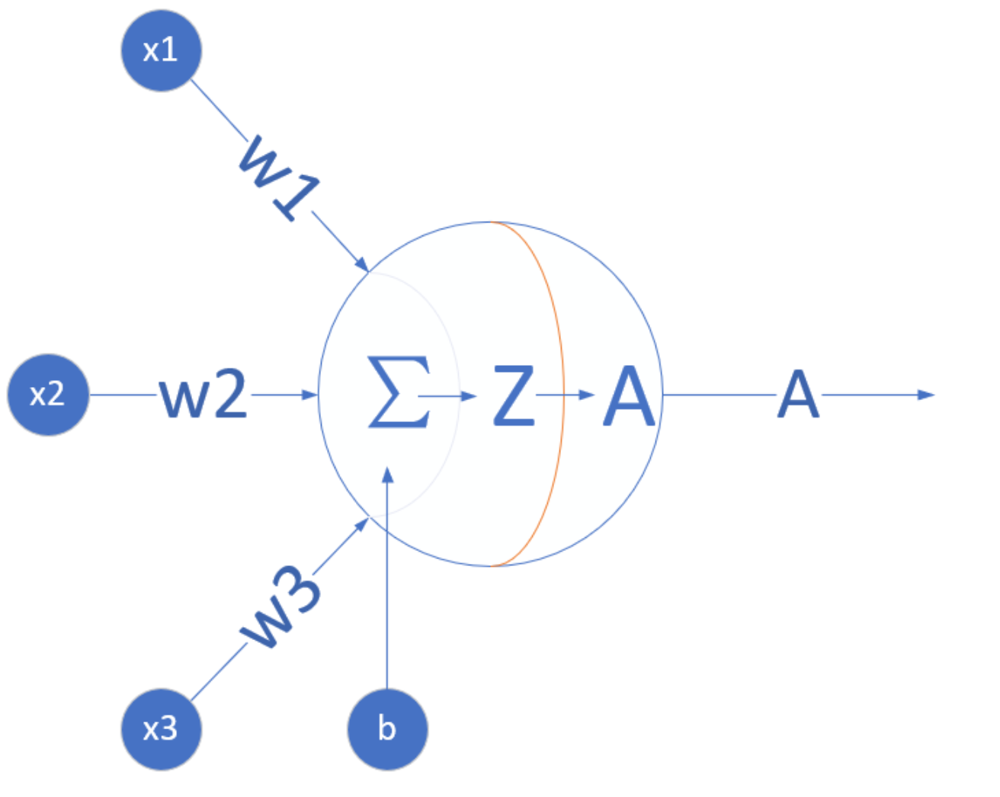
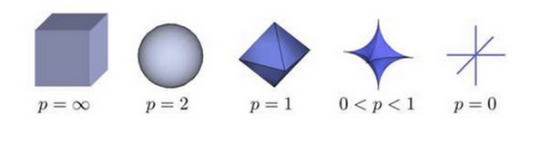

# 《人工智能概论》课程报告

## 学号：201809009  姓名：王征宇

# 第一章 神经网络概论与基本概念

**概论**

- 人工智能发展简史
- 人工智能的定义
- 范式的演化

**基本概念**

- 神经网络的基本工作原理
- 反向传播
- 梯度下降
- 线性反向传播
- 非线性反向传播
- 梯度下降
- 损失函数
    -均方差损失函数
    -交叉熵损失函数

### 人工智能的定义

#### 第一个层面，人们对人工智能的**期待**可以分为：

- **智能地把某件特定的事情做好，在某个领域增强人类的智慧，这种方式又叫做智能增强**
- **像人类一样能认知，思考，判断：模拟人类的智能**

#### 第二个层面，**从技术的特点来看**。

1. 监督学习（Supervised Learning）
2. 无监督学习（Unsupervised Learning）
3. 强化学习（Reinforcement Learning）

综合来看，如果我们把机器学习当作一个小孩，那么，教育小孩的方式就有根据正确答案指导学习（监督学习）；根据小孩实践的过程给予各种鼓励（强化学习）；还有自由探索世界，让小孩自己总结规律（无监督学习）。

#### 第三个层面，**从应用的角度来看**，我们看到狭义人工智能在各个领域都取得了很大的成果。

- 翻译领域（微软的中英翻译超过人类）
- 阅读理解（SQuAD 比赛）
- 下围棋（2016）德州扑克（2019）麻将（2019）

### 神经网络的基本工作原理

#### 神经元细胞的数学模型

神经网络由基本的神经元组成，下图就是一个神经元的数学/计算模型



由五部分组成：
（1）输入 input：(x1,x2,x3) 是外界输入信号，一般是一个训练数据样本的多个属性；
（2）权重 weights：(w1,w2,w3) 是每个输入信号的权重值。
（3）偏移 bias：从生物学上解释，在脑神经细胞中，一定是输入信号的电平/电流大于某个临界值时，神经元细胞才会处于兴奋状态，这个b实际就是那个临界值。
（4）求和计算 sum：$$Z = w1 \cdot x1 + w2 \cdot x2 + w3 \cdot x3 + b = \sum_{i=1}^m(w_i \cdot x_i) + b$$
（5）激活函数 activation：求和之后，神经细胞已经处于兴奋状态了，已经决定要向下一个神经元传递信号了，但是要传递多强烈的信号，要由激活函数来确定。

#### 神经网络的训练过程

##### 单层神经网络模型

- $(x_1,x_2,x_3)$ 是一个样本数据的三个特征值
- $(w_{11},w_{21},w_{31})$ 是 $(x_1,x_2,x_3)$ 到 $n1$ 的权重
- $(w_{12},w_{22},w_{32})$ 是 $(x_1,x_2,x_3)$ 到 $n2$ 的权重
- $b_1$ 是 $n1$ 的偏移
- $b_2$ 是 $n2$ 的偏移


#### 梯度下降的三要素

1. 当前点；
2. 方向；
3. 步长。

### 损失函数

### 损失函数概念

在各种材料中经常看到的中英文词汇有：误差，偏差，Error，Cost，Loss，损失，代价......意思都差不多，在本系列文章中，使用损失函数和Loss Function这两个词汇，具体的损失函数符号用J()来表示，误差值用loss表示。

**损失**就是所有样本的**误差**的总和，亦即：
$$损失 = \sum^m_{i=1}误差_i$$
$$J = \sum_{i=1}^m loss$$

#### 损失函数的作用

损失函数的作用，就是计算神经网络每次迭代的前向计算结果与真实值的差距，从而指导下一步的训练向正确的方向进行。

###  神经网络中常用的损失函数

- 均方差函数，主要用于回归

- 交叉熵函数，主要用于分类

二者都是非负函数，极值在底部，用梯度下降法可以求解。

# 第二章 线性回归

### 单入单出的单层神经网络

#### 一元线性回归模型

回归分析是一种数学模型。当因变量和自变量为线性关系时，它是一种特殊的线性模型。

最简单的情形是一元线性回归，由大体上有线性关系的一个自变量和一个因变量组成，模型是：

$$Y=a+bX+ε \tag{1}$$

X是自变量，Y是因变量，ε是随机误差，a和b是参数，在线性回归模型中，a和b是我们要通过算法学习出来的。

## 多入单出的单层神经网络

#### ①多变量线性回归问题

#### （1）多元线性回归模型

准则：

1. 自变量对因变量必须有显著的影响，并呈密切的线性相关；
2. 自变量与因变量之间的线性相关必须是真实的，而不是形式上的；
3. 自变量之间应具有一定的互斥性，即自变量之间的相关程度不应高于自变量与因变量之因的相关程度；
4. 自变量应具有完整的统计数据，其预测值容易确定。

|方法|正规方程|梯度下降|
|---|-----|-----|
|原理|几次矩阵运算|多次迭代|
|特殊要求|$X^TX$的逆矩阵存在|需要确定学习率|
|复杂度|$O(n^3)$|$O(n^2)$|
|适用样本数|$m \lt 10000$|$m \ge 10000$|

#### 神经网络解法

#### （1）定义神经网络结构

我们定义一个一层的神经网络，输入层为2或者更多，反正大于2了就没区别。这个一层的神经网络的特点是：

1. 没有中间层，只有输入项和输出层（输入项不算做一层），
2. 输出层只有一个神经元，
3. 神经元有一个线性输出，不经过激活函数处理，即在下图中，经过$\Sigma$求和得到Z值之后，直接把Z值输出。

与上一章的神经元相比，这次仅仅是多了一个输入，但却是质的变化，即，一个神经元可以同时接收多个输入，这是神经网络能够处理复杂逻辑的根本。


# 第三章 线性分类--线性二分类

### 1、多入单出的单层神经网路

#### （1）线性二分类

①二分类函数
- 公式

$$a(z) = \frac{1}{1 + e^{-z}}$$

- 导数

$$a^{'}(z) = a(z)(1 - a(z))$$

具体求导过程可以参考8.1节。

- 输入值域

$$(-\infty, \infty)$$

- 输出值域

$$(0,1)$$

- 函数图像


#### (2) 正向传播

#### 矩阵运算

$$
z=x \cdot w + b \tag{1}
$$

#### 分类计算

$$
a = Logistic(z)={1 \over 1 + e^{-z}} \tag{2}
$$

#### 损失函数计算

二分类交叉熵损失函数：

$$
loss(w,b) = -[y \ln a+(1-y)\ln(1-a)] \tag{3}
$$

#### (3) 反向传播

#### 求损失函数loss对a的偏导

$$
\frac{\partial loss}{\partial a}=-[{y \over a}+{-(1-y) \over 1-a}]=\frac{a-y}{a(1-a)} \tag{4}
$$

#### 求损失函数a对z的偏导

$$
\frac{\partial a}{\partial z}= a(1-a) \tag{5}
$$

#### 求损失函数loss对z的偏导

使用链式法则链接公式4和公式5：

$$
\frac{\partial loss}{\partial z}=\frac{\partial loss}{\partial a}\frac{\partial a}{\partial z}
$$
$$
=\frac{a-y}{a(1-a)} \cdot a(1-a)=a-y \tag{6}
$$

## 二、线性多分类---多入单出的单层神经网路

### 线性多分类问题

多分类问题一共有三种解法：

1. 一对一
   
每次先只保留两个类别的数据，训练一个分类器。如果一共有N个类别，则需要训练$C^2_N$个分类器。以N=3时举例，需要训练(A|B)，(B|C)，(A|C)三个分类器。


如上图最左侧所示，这个二分类器只关心蓝色和绿色样本的分类，而不管红色样本的情况，也就是说在训练时，只把蓝色和绿色样本输入网络。
   
推理时，(A|B)分类器告诉你是A类时，需要到(A|C)分类器再试一下，如果也是A类，则就是A类。如果(A|C)告诉你是C类，则基本是C类了，不可能是B类，不信的话可以到(B|C)分类器再去测试一下。

2. 一对多
   
如下图，处理一个类别时，暂时把其它所有类别看作是一类，这样对于三分类问题，可以得到三个分类器。


如最左图，这种情况是在训练时，把红色样本当作一类，把蓝色和绿色样本混在一起当作另外一类。

推理时，同时调用三个分类器，再把三种结果组合起来，就是真实的结果。比如，第一个分类器告诉你是“红类”，那么它确实就是红类；如果告诉你是非红类，则需要看第二个分类器的结果，绿类或者非绿类；依此类推。

3. 多对多

假设有4个类别ABCD，我们可以把AB算作一类，CD算作一类，训练一个分类器1；再把AC算作一类，BD算作一类，训练一个分类器2。
    
推理时，第1个分类器告诉你是AB类，第二个分类器告诉你是BD类，则做“与”操作，就是B类。

#### 多分类的几何原理

在前面的二分类原理中，很容易理解为我们用一条直线分开两个部分。对于多分类问题，是否可以沿用二分类原理中的几何解释呢？答案是肯定的，只不过需要单独判定每一个类别。


如上图，假设一共有三类样本，蓝色为1，红色为2，绿色为3，那么Softmax的形式应该是：

$$
a_j = \frac{e^{z_j}}{\sum\limits_{i=1}^3 e^{z_i}}=\frac{e^{z_j}}{e^{z_1}+e^{z_2}+^{z_3}}
$$
把三张图综合分析在一起，应该是这个样子：


# 第四章 非线性回归

#### 1、激活函数

#### (1)激活函数的基本作用

看神经网络中的一个神经元，为了简化，假设该神经元接受三个输入，分别为$x_1, x_2, x_3$，那么：

$$z=x_1 w_1 + x_2 w_2 + x_3 w_3 +b \tag{1}$$
$$a = \sigma(z) \tag{2}$$


激活函数也就是$a=\sigma(z)$这一步了，他有什么作用呢？

1. 给神经网络增加非线性因素，这个问题在第1章《神经网络基本工作原理》中已经讲过了；
2. 把公式1的计算结果压缩到[0,1]之间，便于后面的计算。

#### (2)激活函数的基本性质：

+ 非线性：线性的激活函数和没有激活函数一样
+ 可导性：做误差反向传播和梯度下降，必须要保证激活函数的可导性
+ 单调性：单一的输入会得到单一的输出，较大值的输入得到较大值的输出

## 二、 单入单出的双层神经网络

## 验证与测试

### 基本概念

#### 训练集

Training Set，用于模型训练的数据样本。

#### 验证集

Validation Set，或者叫做Dev Set，是模型训练过程中单独留出的样本集，它可以用于调整模型的超参数和用于对模型的能力进行初步评估。
  
在神经网络中，验证数据集用于：

- 寻找最优的网络深度
- 或者决定反向传播算法的停止点
- 或者在神经网络中选择隐藏层神经元的数量
- 在普通的机器学习中常用的交叉验证（Cross Validation）就是把训练数据集本身再细分成不同的验证数据集去训练模型。

#### 测试集

Test Set，用来评估最终模型的泛化能力。但不能作为调参、选择特征等算法相关的选择的依据。

三者之间的关系如图9-5所示。


### 复合函数的拟合

#### 隐层只有两个神经元的情况


图9-14 两个神经元的拟合效果

图9-14是两个神经元的拟合效果图，拟合情况很不理想，和正弦曲线只用一个神经元的情况类似。观察打印输出的损失值，有波动，久久徘徊在0.003附近不能下降，说明网络能力不够。

#### 隐层有三个神经元的情况

```Python
if __name__ == '__main__':
    ......
    n_input, n_hidden, n_output = 1, 3, 1
    eta, batch_size, max_epoch = 0.5, 10, 10000
    eps = 0.001
    hp = HyperParameters2(n_input, n_hidden, n_output, eta, max_epoch, batch_size, eps, NetType.Fitting, InitialMethod.Xavier)
    net = NeuralNet2(hp, "model_131")
    ......
```


图9-16 三个神经元的拟合效果

最佳组合：

- 隐层3个神经元
- 学习率=0.5
- 批量=10


### 广义的回归/拟合

“曲线”在这里是一个广义的概念，它不仅可以代表二维平面上的数学曲线，也可以代表工程实践中的任何拟合问题，比如房价预测问题，影响房价的自变量可以达到20个左右，显然已经超出了线性回归的范畴，此时我们可以用多层神经网络来做预测。。

简言之，只要是数值拟合问题，确定不能用线性回归的话，都可以用非线性回归来尝试解决。


# 第五章 非线性分类

## 多入单出的双层神经网络 - 非线性二分类

### 二分类模型的评估标准

对于二分类问题，假设测试集上一共1000个样本，其中550个正例，450个负例。测试一个模型时，得到的结果是：521个正例样本被判断为正类，435个负例样本被判断为负类，则正确率计算如下：

$$Accuracy=(521+435)/1000=0.956$$

即正确率为95.6%。这种方式对多分类也是有效的，即三类中判别正确的样本数除以总样本数，即为准确率。

#### 混淆矩阵

- 正例中被判断为正类的样本数（TP-True Positive）：521
- 正例中被判断为负类的样本数（FN-False Negative）：550-521=29
- 负例中被判断为负类的样本数（TN-True Negative）：435
- 负例中被判断为正类的样本数（FP-False Positive）：450-435=15

可以用图10-3来帮助理解。


图10-3 二分类中四种类别的示意图

- 左侧实心圆点是正类，右侧空心圆是负类；
- 在圆圈中的样本是被模型判断为正类的，圆圈之外的样本是被判断为负类的；
- 左侧圆圈外的点是正类但是误判为负类，右侧圆圈内的点是负类但是误判为正类；
- 左侧圆圈内的点是正类且被正确判别为正类，右侧圆圈外的点是负类且被正确判别为负类。

### 为什么必须用双层神经网络

### 分类

- 从复杂程度上分，有线性/非线性之分；
- 从样本类别上分，有二分类/多分类之分。

##3 非线性多分类的工作原理

表11-4 工作原理可视化

||正视角|侧视角|
|---|---|---|
|z1|||
||通过线性变换得到在三维空间中的线性平面|从侧面看的线性平面|
|a1|||
||通过激活函数的非线性变化，被空间挤压成三角形|从侧面看三种颜色分成了三层|

### 分类样本不平衡问题

### 11.3.1 什么是样本不平衡

英文名叫做Imbalanced Data。

在一般的分类学习方法中都有一个假设，就是不同类别的训练样本的数量相对平衡。

以二分类为例，比如正负例都各有1000个左右。如果是1200:800的比例，也是可以接受的，但是如果是1900:100，就需要有些措施来解决不平衡问题了，否则最后的训练结果很大可能是忽略了负例，将所有样本都分类为正类了。

### 如何解决样本不平衡问题

#### 平衡数据集

一些经验法则：

- 考虑对大类下的样本（超过1万、十万甚至更多）进行欠采样，即删除部分样本；
- 考虑对小类下的样本（不足1万甚至更少）进行过采样，即添加部分样本的副本；
- 考虑尝试随机采样与非随机采样两种采样方法；
- 考虑对各类别尝试不同的采样比例，比一定是1:1，有时候1:1反而不好，因为与现实情况相差甚远；
- 考虑同时使用过采样（over-sampling）与欠采样（under-sampling）。

## 多入多出的三层神经网络 - 深度非线性多分类

#### 图片数据归一化

```Python
    def __NormalizeData(self, XRawData):
        X_NEW = np.zeros(XRawData.shape)#初始化为0
        x_max = np.max(XRawData)#最大值
        x_min = np.min(XRawData)#最新之
        X_NEW = (XRawData - x_min)/(x_max-x_min)#归一化
        return X_NEW
```
### 定义神经网络

为了完成MNIST分类，我们需要设计一个三层神经网络结构，如图12-2所示。


图12-2 三层神经网络结构

### 学习率与批大小

batch size和学习率的关系可以大致总结如下：

1. 增加batch size，需要增加学习率来适应，可以用线性缩放的规则，成比例放大
2. 到一定程度，学习率的增加会缩小，变成batch size的$\sqrt m$倍
3. 到了比较极端的程度，无论batch size再怎么增加，也不能增加学习率了

# 第七章 深度神经网络

### 批量归一化的原理

#### （1）正态分布

正态分布，又叫做高斯分布。

若随机变量X，服从一个位置参数为μ、尺度参数为σ的概率分布，且其概率密度函数为：

$$
f(x)={1 \over \sigma\sqrt{2 \pi} } e^{- {(x-\mu)^2} \over 2\sigma^2} \tag{1}
$$

则这个随机变量就称为正态随机变量，正态随机变量服从的分布就称为正态分布，记作：

$$
X \sim N(\mu,\sigma^2) \tag{2}
$$

当μ=0,σ=1时，称为标准正态分布：

$$X \sim N(0,1) \tag{3}$$

此时公式简化为：

$$
f(x)={1 \over \sqrt{2 \pi}} e^{- {x^2} \over 2} \tag{4}
$$

下图就是三种（μ, σ）组合的函数图像：


#### （2）批量归一化

既然可以把原始训练样本做归一化，那么如果在深度神经网络的每一层，都可以有类似的手段，也就是说把层之间传递的数据移到0点附近，那么训练效果就应该会很理想。这就是批归一化BN的想法的来源。

深度神经网络随着网络深度加深，训练起来越困难，收敛越来越慢，这是个在DL领域很接近本质的问题。很多论文都是解决这个问题的，比如ReLU激活函数，再比如Residual Network。BN本质上也是解释并从某个不同的角度来解决这个问题的。

BN就是在深度神经网络训练过程中使得每一层神经网络的输入保持相同的分布，致力于将每一层的输入数据正则化成$N(0,1)$的分布。因次，每次训练的数据必须是mini-batch形式，一般取32，64等数值。

具体的数据处理过程如下图所示：


1. 数据在训练过程中，在网络的某一层会发生Internal Covariate Shift，导致数据处于激活函数的饱和区；
2. 经过均值为0、方差为1的变换后，位移到了0点附近。但是只做到这一步的话，会带来两个问题：
   
   a. 在[-1,1]这个区域，Sigmoid激活函数是近似线性的，造成激活函数失去非线性的作用；
   
   b. 在二分类问题中我们学习过，神经网络把正类样本点推向了右侧，把负类样本点推向了左侧，如果再把它们强行向中间集中的话，那么前面学习到的成果就会被破坏；

3. 经过$\gamma、\beta$的线性变换后，把数据区域拉宽，则激活函数的输出既有线性的部分，也有非线性的部分，这就解决了问题a；而且由于$\gamma、\beta$也是通过网络进行学习的，所以以前学到的成果也会保持，这就解决了问题b。

在实际的工程中，我们把BN当作一个层来看待，一般架设在全连接层（或卷积层）与激活函数层之间。

#### （3）批量归一化的优点

1. 可以选择比较大的初始学习率，让你的训练速度提高。
   
    以前还需要慢慢调整学习率，甚至在网络训练到一定程度时，还需要想着学习率进一步调小的比例选择多少比较合适，现在我们可以采用初始很大的学习率，因为这个算法收敛很快。当然这个算法即使你选择了较小的学习率，也比以前的收敛速度快，因为它具有快速训练收敛的特性；

2. 减少对初始化的依赖
   
    一个不太幸运的初始化，可能会造成网络训练实际很长，甚至不收敛。

3. 减少对正则的依赖
   
   在第16章中，我们将会学习正则化知识，以增强网络的泛化能力。采用BN算法后，我们会逐步减少对正则的依赖，比如令人头疼的dropout、L2正则项参数的选择问题，或者可以选择更小的L2正则约束参数了，因为BN具有提高网络泛化能力的特性；


### 正则化

#### 1、过拟合
上图是回归任务中的三种情况，依次为：欠拟合、正确的拟合、过拟合。


上图是分类任务中的三种情况，依次为：分类欠妥、正确的分类、分类过度。由于分类可以看作是对分类边界的拟合，所以我们经常也统称其为拟合。

出现过拟合的原因：

1. 训练集的数量和模型的复杂度不匹配，样本数量级小于模型的参数
2. 训练集和测试集的特征分布不一致
3. 样本噪音大，使得神经网络学习到了噪音，正常样本的行为被抑制
4. 迭代次数过多，过分拟合了训练数据，包括噪音部分和一些非重要特征
 
### 2、L2正则

#### 范数

范数的基本概念：

$$L_p = \lVert x \rVert_p = ({\sum^n_{i=1}\lvert x_i \rvert^p})^{1/p} \tag{1}$$

范数包含向量范数和矩阵范数，我们只关心向量范数。我们用具体的数值来理解范数。假设有一个向量a：

$$a=[1,-2,0,-4]$$

$$L_0=3 \tag{非0元素数}$$
$$L_1 = \sum^3_{i=0}\lvert x_i \rvert = 1+2+0+4=7 \tag{绝对值求和}$$
$$L_2 = \sqrt[2]{\sum^3_{i=0}\lvert x_i \rvert^2} =\sqrt[2]{21}=4.5826 \tag{平方和求方根}$$
$$L_{\infty}=4 \tag{最大值的绝对值}$$

注意p可以是小数，比如0.5：

$$L_{0.5}=19.7052$$

一个经典的关于P范数的变化图如下：


我们只关心L1和L2范数：
- L1范数是个菱形体，在平面上是一个菱形
- L2范数是个球体，在平面上是一个圆

### 3、L1正则

#### 拉普拉斯分布

$$f(x)=\frac{1}{2b}exp(-\frac{|x-\mu|}{b})$$
$$= \frac{1}{2b} \begin{cases} exp(\frac{x-\mu}{b}), & x \lt \mu \\ exp(\frac{\mu-x}{b}), & x \gt \mu \end{cases}$$


#### L0范数与L1范数

L0范数是指向量中非0的元素的个数。如果我们用L0范数来规则化一个参数矩阵W的话，就是希望W的大部分元素都是0，即让参数W是稀疏的。

L1范数是指向量中各个元素绝对值之和，也叫“稀疏规则算子”（Lasso regularization）。为什么L1范数会使权值稀疏？有人可能会这样给你回答“它是L0范数的最优凸近似”。实际上，还存在一个更美的回答：任何的规则化算子，如果他在$w_i=0$的地方不可微，并且可以分解为一个“求和”的形式，那么这个规则化算子就可以实现稀疏。w的L1范数是绝对值，所以$|w|$在$w=0$处是不可微。

总结：

1. 特征选择(Feature Selection)：

    大家对稀疏规则化趋之若鹜的一个关键原因在于它能实现特征的自动选择。一般来说，x的大部分元素（也就是特征）都是和最终的输出y没有关系或者不提供任何信息的，在最小化目标函数的时候考虑x这些额外的特征，虽然可以获得更小的训练误差，但在预测新的样本时，这些没用的信息反而会被考虑，从而干扰了对正确y的预测。稀疏规则化算子的引入就是为了完成特征自动选择的光荣使命，它会学习地去掉这些没有信息的特征，也就是把这些特征对应的权重置为0。

2. 可解释性(Interpretability)：

    另一个青睐于稀疏的理由是，模型更容易解释。例如患某种病的概率是y，然后我们收集到的数据x是1000维的，也就是我们需要寻找这1000种因素到底是怎么影响患上这种病的概率的。假设我们这个是个回归模型：$y=w1*x1+w2*x2+…+w1000*x1000+b$（当然了，为了让y限定在[0,1]的范围，一般还得加个Logistic函数）。通过学习，如果最后学习到的w就只有很少的非零元素，例如只有5个非零的wi，那么我们就有理由相信，这些对应的特征在患病分析上面提供的信息是巨大的，决策性的。也就是说，患不患这种病只和这5个因素有关，那医生就好分析多了。但如果1000个wi都非0，医生面对这1000种因素,无法采取针对性治疗。

# 用搭建的miniFramework实现手写数字的识别

## 第一种方法：使用AI-edu-MNIST HUAT-方案2

在如图路径下用VSCODE studio打开


点开解决方案资源管理器中的mnist.cs打开代码
如图：


具体代码如下；

```C++
using System;
using System.Collections.Generic;
using System.Threading.Tasks;
using Windows.Media;
using Windows.Storage;
using Windows.Storage.Streams;
using Windows.AI.MachineLearning;
namespace MNIST_Demo
{

    public sealed class mnistInput
    {
        public ImageFeatureValue Input3; // BitmapPixelFormat: Gray8, BitmapAlphaMode: Premultiplied, width: 28, height: 28
    }

    public sealed class mnistOutput
    {
        public TensorFloat Plus214_Output_0; // shape(1,10)
    }

    public sealed class mnistModel
    {
        private LearningModel model;
        private LearningModelSession session;
        private LearningModelBinding binding;
        public static async Task<mnistModel> CreateFromStreamAsync(IRandomAccessStreamReference stream)
        {
            mnistModel learningModel = new mnistModel();
            learningModel.model = await LearningModel.LoadFromStreamAsync(stream);
            learningModel.session = new LearningModelSession(learningModel.model);
            learningModel.binding = new LearningModelBinding(learningModel.session);
            return learningModel;
        }
        public async Task<mnistOutput> EvaluateAsync(mnistInput input)
        {
            binding.Bind("Input3", input.Input3);
            var result = await session.EvaluateAsync(binding, "0");
            var output = new mnistOutput();
            output.Plus214_Output_0 = result.Outputs["Plus214_Output_0"] as TensorFloat;
            return output;
        }
    }
}

```

代码分析：

此代码为pictureBox1在Mouse下双击MouseDown、MouseUp、MouseMove来生成对应的响应事件函数。

点击测试，测试结果如下：


## 第二种方法：使用人工智能概论学习文件里的SourceCode\ch13-ModelInference中Level1_Inference.py

在VSCODE中打开Level1_Inference.py


运行以下代码：

``` C++
# Copyright (c) Microsoft. All rights reserved.
# Licensed under the MIT license. See LICENSE file in the project root for full license information.

from matplotlib import pyplot as plt
import numpy as np
from PIL import Image

from HelperClass2.NeuralNet_3_0 import *

def ReadImage(img_file_name):
    img = Image.open(img_file_name)
    out1 = img.convert('L')
    out2 = out1.resize((28,28))
    a = np.array(out2)
    b = 255 - a
    x_max = np.max(b)
    x_min = np.min(b)
    X_NEW = (b - x_min)/(x_max-x_min)
    plt.cla()
    plt.imshow(X_NEW)
    plt.plot()
    return X_NEW.reshape(1,-1)

def Inference(img_array):
    output = net.inference(img_array)
    n = np.argmax(output)
    print("------recognize result is: -----", n)

def on_key_press(event):
    img_file_name = "handwriting.png"
    print(event.key)
    if event.key == 'enter':
        plt.axis('off')
        plt.savefig(img_file_name)
        plt.axis('on')
        img_array = ReadImage(img_file_name)
        Inference(img_array)
    elif event.key == 'backspace':
        plt.cla()
        plt.axis([0,1,0,1])
        ax.figure.canvas.draw()
    #end if

def on_mouse_press(event):
    global startx, starty, isdraw
    print(isdraw)
    isdraw = True
    startx = event.xdata
    starty = event.ydata
    print("press:{0},{1}", startx, starty)
    
def on_mouse_release(event):
    global isdraw, startx, starty
    print("release:", event.xdata, event.ydata, isdraw)
    isdraw = False

def on_mouse_move(event):
    global isdraw, startx, starty
    if isdraw:
        endx = event.xdata        
        endy = event.ydata        
        x1 = [startx, endx]
        y1 = [starty, endy]
        ax.plot(x1, y1, color='black', linestyle='-', linewidth='40')
        ax.figure.canvas.draw()
        startx = endx
        starty = endy
    # end if

def LoadNet():
    n_input = 784
    n_hidden1 = 64
    n_hidden2 = 16
    n_output = 10
    eta = 0.2
    eps = 0.01
    batch_size = 128
    max_epoch = 40

    hp = HyperParameters_3_0(
        n_input, n_hidden1, n_hidden2, n_output, 
        eta, max_epoch, batch_size, eps, 
        NetType.MultipleClassifier, 
        InitialMethod.Xavier)
    net = NeuralNet_3_0(hp, "MNIST_64_16")
    net.LoadResult()
    return net
   
if __name__ == "__main__":
    isdraw = False
    startx, starty = 0, 0

    print("need to run level3 first to get result")
    print("============================================================================")
    print("handwriting a digit, then press enter to recognize, press backspace to clear")
    print("resize the window to square, say, height == width")
    print("the handwriting should full fill the window")
    print("============================================================================")

    net = LoadNet()

    fig, ax = plt.subplots()
    fig.canvas.mpl_connect('key_press_event', on_key_press)
    fig.canvas.mpl_connect('button_release_event', on_mouse_release)
    fig.canvas.mpl_connect('button_press_event', on_mouse_press)
    fig.canvas.mpl_connect('motion_notify_event', on_mouse_move)
    
    plt.axis([0,1,0,1])
    plt.show()

```

代码分析：

此代码为pictureBox1在Mouse下双击MouseDown、MouseUp、MouseMove，button1中在Action下双击Click。Form1在Behavior下双击Load，来生成对应的响应事件函数。

点击测试，测试结果如下：


## 第三种方法：使用AI-edu-MNIST HUAT-方案3

参考两篇博客：

https://blog.csdn.net/softwareteacher/article/details/80770079

https://blog.csdn.net/SoftwareTeacher/article/details/80770347

第一篇博客为整体环境的配置

第二篇博客为VSstudio中环境的配置与运行步骤

### 1、安装CUDA与cuDNN

如何电脑装有Nvidia的显卡，请进行这一步配置，否则请跳过。

首先通过操作系统更新，升级显卡驱动到最新版。

3.1 安装CUDA
打开 https://developer.nvidia.com/cuda-toolkit-archive

选择CUDA 9.0 进行安装。


打开安装包,进行安装，请自行配置CUDA的安装路径，并手动将CUDA库添加至PATH环境变量中。


<em>
note：
在Windows中，CUDA的默认安装路径是:
“C:\Program Files\NVIDIA GPU Computing Toolkit\CUDA\v9.0\bin”
</em>


### 2、安装cuDNN

访问 https://developer.nvidia.com/rdp/cudnn-archive 找到我们需要的cuDNN版本：

cuDNN v7.0.5 (Dec 5, 2017), for CUDA 9.0
cuDNN v7.0.5 Library for Windows 10


在下载cuDNN之前需要注册Nvidia会员并验证邮箱。不过还好可以微信登录，省掉一些步骤。

一番操作之后，得到cuDNN。


把文件解压，取出这个路径的cudnn64_7.dll,复制到CUDA的bin目录下即可。默认的地址是：

C:\Program Files\NVIDIA GPU Computing Toolkit\CUDA\v9.0\bin


### 3、安装机器学习的软件及依赖

步骤：
1、win + R ，打开cmd，在命令行中输入：
2、cd c:\  //选择一个你喜欢的路径
3、md  AI  //在这里创建一个AI目录
4、cd AI   //打开这个目录
//克隆仓库到本地
5、git clone https://github.com/Microsoft/samples-for-ai.git
6、cd samples-for-ai //打开这个目录
7、cd installer //还有这个目录
8、python.exe install.py //开始安装


### 4、安装tools for ai插件

打开Visual Studio，选择工具->扩展和更新->选择“联机”->搜索“AI” 

此处没有tools for ai，下载的为错误的插件


搜遍了所有的博客都无法解决此处没有插件的问题

此时我联系了Microsoft的客服

截图如下：


意思理解为VS2019没有此插件，只有VS2017或者VS2015有此插件

所以此处我重新下载了个VS2017版本


安装完成，发现VS2017中有此插件！！


### 5、获取手写的数字

1、首先，我们打开Visual Studio，选择文件->新建->项目。

2、在弹出的窗口里选择Visual C#->Windows窗体应用，项目名称不妨叫做DrawDigit，解决方案名称不妨叫做MnistForm，点击确定。


3、此时，Visual Studio也自动弹出了一个窗口的设计图。


4、在DrawDigit项目上点击右键，选择属性，在生成一栏将平台目标从Any CPU改为x64。


5、然后我们对这个窗口做一些简单的修改：

首先我们打开VS窗口左侧的工具箱，这个窗口程序需要以下三种组件：

1. PictureBox：用来手写数字，并且把数字保存成图片 
2. Label：用来显示模型的识别结果 
3. Button：用来清理PictureBox的手写结果

那经过一些简单的选择与拖动还有调整大小，这个窗口现在是这样的：


pictureBox1在Mouse下双击MouseDown、MouseUp、MouseMove来生成对应的响应事件函数。
button1如上，在Action下双击Click。
Form1如上，在Behavior下双击Load。

在frame.cs主题中加载如下代码

```C++
using System;
using System.Collections.Generic;
using System.ComponentModel;
using System.Data;
using System.Drawing;
using System.Drawing.Drawing2D;//用于优化绘制的结果
using System.Linq;
using System.Text;
using System.Threading.Tasks;
using System.Windows.Forms;
using MnistModel;

namespace DrawDigit
{
    public partial class Form1 : Form
    {
        public Form1()
        {
            InitializeComponent();
        }

        private Bitmap digitImage;//用来保存手写数字
        private Point startPoint;//用于绘制线段，作为线段的初始端点坐标
        private Mnist model;//用于识别手写数字
        private const int MnistImageSize = 28;//Mnist模型所需的输入图片大小

        private void Form1_Load(object sender, EventArgs e)
        {
            //当窗口加载时，绘制一个白色方框
            model = new Mnist();
            digitImage = new Bitmap(pictureBox1.Width, pictureBox1.Height);
            Graphics g = Graphics.FromImage(digitImage);
            g.Clear(Color.White);
            pictureBox1.Image = digitImage;
        }

        private void clean_click(object sender, EventArgs e)
        {
            //当点击清除时，重新绘制一个白色方框，同时清除label1显示的文本
            digitImage = new Bitmap(pictureBox1.Width, pictureBox1.Height);
            Graphics g = Graphics.FromImage(digitImage);
            g.Clear(Color.White);
            pictureBox1.Image = digitImage;
            label1.Text = "";
        }

        private void pictureBox1_MouseDown(object sender, MouseEventArgs e)
        {
            //当鼠标左键被按下时，记录下需要绘制的线段的起始坐标
            startPoint = (e.Button == MouseButtons.Left) ? e.Location : startPoint;
        }

        private void pictureBox1_MouseMove(object sender, MouseEventArgs e)
        {
            //当鼠标在移动，且当前处于绘制状态时，根据鼠标的实时位置与记录的起始坐标绘制线段，同时更新需要绘制的线段的起始坐标
            if (e.Button == MouseButtons.Left)
            {
                Graphics g = Graphics.FromImage(digitImage);
                Pen myPen = new Pen(Color.Black, 40);
                myPen.StartCap = LineCap.Round;
                myPen.EndCap = LineCap.Round;
                g.DrawLine(myPen,startPoint, e.Location);
                pictureBox1.Image = digitImage;
                g.Dispose();
                startPoint = e.Location;
            }
        }

        private void pictureBox1_MouseUp(object sender, MouseEventArgs e)
        {
            //当鼠标左键释放时
            //同时开始处理图片进行推理
            //暂时不处理这里的代码
        }
    }
}
```

## 6、把模型包装成一个类

1、首先，我们在解决方案MnistForm下点击鼠标右键，选择添加->新建项目，在弹出的窗口里选择AI Tools->Inference->模型推理类库，名称不妨叫做MnistModel，点击确定，于是我们又多了一个项目，


2、然后自己配置好这个项目的名称、位置，点击确定。

3、然后弹出一个模型推理类库创建向导，这个时候就需要我们选择自己之前训练好的模型


4、模型可在/samples-for-ai/examples/tensorflow/MNIST目录下找到，其中output文件夹保存了检查点文件，export文件夹保存了模型文件。

对于TensorFlow，我们可以选择检查点的.meta文件，或者是保存的模型的.pb文件


5、类名可以自己定义，因为我们用的是MNIST，那么类名就叫Mnist好了，然后点击确定。

这样，在解决方案资源管理器里，在解决方案MnistForm下，就多了一个MnistModel：


6、双击Mnist.cs，我们可以看到项目自动把模型进行了封装，生成了一个公开的infer函数，然后我们在MnistModel上右击。

## 7、连接两个部分

1、首先，我们来给DrawDigit添加引用，让它能使用MnistModel。在DrawDigit项目的引用上点击鼠标右键，点击添加引用，在弹出的窗口中选择MnistModel，点击确定。


然后，由于MNIST的模型的输入是一个28×28的白字黑底的灰度图，因此我们首先要对图片进行一些处理。 
首先将图片转为28×28的大小。 
然后将RGB图片转化为灰阶图，将灰阶标准化到[-0.5,0.5]区间内，转换为黑底白字。 
最后将图片用mnist模型要求的格式包装起来，并传送给它进行推理。 
于是，我们在pictureBox1_MouseUp中添加上这些代码，并且在文件最初添加上using MnistModel;：

```C++
        private void pictureBox1_MouseUp(object sender, MouseEventArgs e)
        {
            //当鼠标左键释放时
            //开始处理图片进行推理
            if (e.Button == MouseButtons.Left)
            {
                Bitmap digitTmp = (Bitmap)digitImage.Clone();//复制digitImage
                                                             //调整图片大小为Mnist模型可接收的大小：28×28
                using (Graphics g = Graphics.FromImage(digitTmp))
                {
                    g.InterpolationMode = InterpolationMode.HighQualityBicubic;
                    g.DrawImage(digitTmp, 0, 0, MnistImageSize, MnistImageSize);
                }
                //将图片转为灰阶图，并将图片的像素信息保存在list中
                var image = new List<float>(MnistImageSize * MnistImageSize);
                for (var x = 0; x < MnistImageSize; x++)
                {
                    for (var y = 0; y < MnistImageSize; y++)
                    {
                        var color = digitTmp.GetPixel(y, x);
                        var a = (float)(0.5 - (color.R + color.G + color.B) / (3.0 * 255));
                        image.Add(a);
                    }
                }
                //将图片信息包装为mnist模型规定的输入格式
                var batch = new List<IEnumerable<float>>();
                batch.Add(image);
                //将图片传送给mnist模型进行推理
                var result = model.Infer(batch);
                //将推理结果输出
                label1.Text = result.First().First().ToString();
            }
        }
```


## 学习总结 

通过人工智能概率这门课的学习我可以通过这些问题，来系统的总结这门课，当我回头来阅读自己写的markdown的时候，可以通过问题，来发现与总结自己的不足，且我是顺序排列的问题，这样也方便查阅

在Step1中，我学习到了

- 什么是人工智能？
- 人工智能是基于什么上的？
- 范式的演化分哪四步？
- 神经网络的基本工作原理，是通过什么公式？
- 这个公式的各个变量分别代表什么？
- 神经网络的训练过程是什么？
- 神经网络的主要功能是什么？ 
- 激活函数的作用是什么？ 
- 反向传播与梯度下降的基本工作原理是什么？ 
- 在线性反向传播中，怎么分别从反向传播求解w,求解b，同时求解w和b的变化求解？ 
- 在非线性反向传播，相对于线性反向传播的优势在哪里？
- 梯度下降的数学公式是什么？各个符号的含义是什么？
- 梯度下降的两层含义是什么？ 
- 理解什么是单变量函数和双变量函数的梯度下降。 
- 在不同的学习率对梯度下降有什么影响？ 
- 损失函数的概念是什么？ 
- 损失函数的作用什么？ 
- 损失函数的具体步骤是什么？ 
- 损失函数在二维图像和等高线图的理解。 
- 神经网络中常用的损失函数分为哪两种？ 
- 它们分别主要用于哪里？

在Step2和Step3中，我学习到了

- 最小二乘法算法是什么？
- 梯度下降法是什么？
- 神经网络法是什么？
- 多变量线性回归有哪两种方法？
- 正规方程法是什么？
- 神经网络法是什么？
- 样本特征数据归一化是什么？
- 归一化的后遗症和正确的推理方法。
- 线性分类和线性多分类。
- 二分类的两种函数。
- 激活函数和分类函数分别是什么？
- 它们的工作原理和数学原理是什么？
- 神经网络的多线性分类。
- 线性二分类的概念和基本原理。
- 神经网络线性多分类。
- 分类函数和各个运算公式。
- 神经网络怎么实现？
- 多分类结果的可视化是什么样的？
- 理想中一对多的方式还有现实中的情况是什么样的？

在Step4和Step5中，我学习到了

- 激活函数的基本作用是什么？
- 激活函数的基本性质是什么？
- 挤压型激活函数有哪些？
- 对数几率函数公式是什么？
- Tanh函数公式和图像是什么？
- 半线性激活函数有哪些？
- ReLU函数公式和图像是什么？
- Leaky ReLU函数公式和图像是什么？相对于ReLU函数优点是什么？
- 用多项式回归法拟合正弦曲线用几次多项式拟合？
- 用多项式回归法拟合复合函数曲线用几次多项式拟合？
- 几次多项式拟合的算法怎么写？
- 验证与测试的基本概念是什么？
- 交叉验证的传统和现代机器学习的区别
- 留出法是什么？
- 双层神经网络实现非线性回归神经网络结构的定义是什么？
- 图形是什么？
- 公式怎么推导
- 代码怎么实现
- 复合曲线的拟合在隐层只有一个和两个神经元的情况
- 正弦曲线的拟合在隐层只有两个和三个神经元的情况
- 广义的回归/拟合是什么
- 非线性回归的工作原理是什么
- 比较多项式回归和双层神经网络解法
- 可调的参数有几个？哪几个？
- 网格搜索是什么？
- 各种超参数的作用是什么？
- 随机搜索过程是什么？
- 三个参数调整分别会发生什么？
- 随机搜索与网格搜索的对比
- 二分类模型的评估标准
- Kappa statics 是什么，公式是什么
- 双层神经网络的分类
- 非线性二分类神经网络结构的定义
- 非线性多分类的工作原理是什么
- 什么是样本不平衡
- 如何解决样本不平衡问题
- 深度非线性多分类神经网络的定义

经过Step7的学习，我具体学习了以下知识：

- 迷你框架的模块化设计是怎么样的
- 各个模块化分哪些类型
- 回归任务的搭建模型是什么
- 在回归任务-房价预测中，怎么通过回归任务搭建模型
- 怎么通过具体代码实现回归任务
- 二分类任务是什么
- 二分类搭建模型是什么
- 二分类代码是怎么实现的
- 在二分类-收入调查与预测中，怎么通过二分类搭建模型
- 怎么通过具体代码实现二分类
- 多分类任务是什么
- 多分类搭建模型是什么
- 多分类代码是怎么实现的
- 在多分类-MNIST手写体识别中，怎么通过二分类搭建模型
- 怎么通过具体代码实现二分类
- 训练变得越来越困难的因素有哪几个
- 通过深度网络的哪些训练可以改善
- 权重矩阵初始化份哪四种
- 这四种初始化的区别是什么
- 梯度下降优化算法的三种算法是什么
- 动量发和NAG法的比较
- 自适应学习率算法是什么
- 它分为哪四种算法
- 算法在等高线图上的效果比较
- 批量归一化的原理是什么
- 深度神经网络的挑战是什么
- 批量归一化的优点是什么
- 批量归一化的实现的公式推导和代码是什么
- 正则化是什么
- 出现过拟合的原因是什么
- 解决过拟合问题分为那七种
- 偏差与方差怎么解释
- L2正则是什么
- L1正则是什么
- 早停法 Early Stopping是什么
- 丢弃法 Dropout的基本原理是什么
- 怎么进行数据增强
- 集成学习的概念是什么
- 简单的集成学习分为哪两个组件
- Bagging法集成学习的基本流程是什么
- 集成方法选择分为哪三种

经过手写数字的识别实验的实践，我从中学到了

1. 目标检测与识别的知识
2. 手写数字识别代码的理解
3. 如何实现简单的界面，将用户用鼠标或者触屏的输入变成图片。
4. 如何将生成的模型包装起来，成为有公开数据接口的类。
5. 如何将输入的图片进行规范化，成为数据接口能够使用的格式。最后通过模型来推理(inference)出图片应该是哪个数字，并显示出来。

### 心得总结

在本次学习中:

1. 更加熟练的掌握了markdown的阅读与书写规则
2. 逐渐理解掌握了基于Python代码的神经网络代码
3. 掌握了通过mingw64从GitHub网站上拷贝到本地 代码：git clone + 网址 , #更新本地 git pull 
4. 掌握了GitHub Desktop APP的应用方法，使得自己的作业可以通过本地传送到自己的网址上，再自己GitHub的作业上传到老师的账户上
5. 学习了python的基本语法和进阶
6. 掌握了线性回归和线性分类的思想
7. 掌握了非线性回归和非线性分类的思想
8.  掌握了深度神经网络、网络优化、正则化等等
9.  安装了OPENVIVN软件，注册页面，并运行相关程序

在两层神经网络之间，必须有激活函数连接，从而加入非线性因素，提高神经网络的能力。所以，我们先从激活函数学起，一类是挤压型的激活函数，常用于简单网络的学习；另一类是半线性的激活函数，常用于深度网络的学习。
接下来我们将验证著名的万能近似定理，建立一个双层的神经网络，来拟合一个比较复杂的函数。
在上面的双层神经网络中，已经出现了很多的超参，都会影响到神经网络的训练结果。所以在完成了基本的拟合任务之后，我们将尝试着调试这些参数，得到又快又好的训练效果，从而得到超参调试的第一手经验。
我们在第三步中学习了线性分类，在本部分中，我们将学习更复杂的分类问题，比如，在很多年前，两位著名的学者证明了感知机无法解决逻辑中的异或问题，从而使感知机这个研究领域陷入了长期的停滞。我们将会在使用双层网络解决异或问题。
异或问题是个简单的二分类问题，因为毕竟只有4个样本数据，我们会用更复杂的数据样本来学习非线性多分类问题，并理解其工作原理。
然后我们将会用一个稍微复杂些的二分类例子，来说明在二维平面上，神经网络是通过怎样的神奇的线性变换加激活函数压缩，把线性不可分的问题转化为线性可分问题的。
解决完二分类问题，我们将学习如何解决更复杂的三分类问题，由于样本的复杂性，必须在隐层使用多个神经元才能完成分类任务。
最后我们将搭建一个三层神经网络，来解决MNIST手写数字识别问题，并学习使用梯度检查来帮助我们测试反向传播代码的正确性。
数据集的使用，是深度学习的一个基本技能，开发集、验证集、测试集，合理地使用才能得到理想的泛化能力强的模型。
在前面的几步中，我通过简单的案例，逐步学习了众多的知识，使得我可以更轻松地接触深度学习。
从Step7开始，探讨深度学习了的一些细节，如权重矩阵初始化、梯度下降优化算法、批量归一化等高级知识。
由于深度网络的学习能力强的特点，会造成网络对样本数据过分拟合，从而造成泛化能力不足，因此我们通过一些算法来改善网络的泛化能力。如通过一些偏差与方差，L2、L1正则等等来解决
随着网络的加深，训练变得越来越困难，时间越来越长，原因可能是：
- 参数多
- 数据量大
- 梯度消失
- 损失函数坡度平缓
为了解决上面这些问题，科学家们在深入研究网络表现的前提下，发现在下面这些方向上经过一些努力，可以给深度网络的训练带来或多或少的改善：
- 权重矩阵初始化
- 批量归一化
- 梯度下降优化算法
- 自适应学习率算法
在深度神经网络中，遇到的另外一个挑战，网络的泛化问题，通过一些偏差与方差，L2、L1正则等等解决了泛化问题
