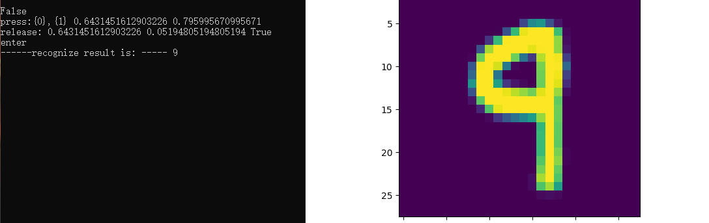

# ai-edu step1学习笔记

## 一. 对人工智能的基本了解

### 人工智能定义

#### 根据作用定义

- **智能地把某件特定的事情做好，在某个领域增强人类的智慧，这种方式又叫做智能增强**
- **像人类一样能认知，思考，判断：模拟人类的智能**
 
  #### 根据技术定义

- **一个程序解决任务（T）的效能（用P表示）随着经验（E）得到了提高，那么，这个程序就能从经验（E）中学到了关于任务（T）的知识，并让衡量值（P）得到提高**
  
#### 机器学习三种类型

1.监督学习（Supervised Learning）
通过标注的数据来学习  
2.无监督学习（Unsupervised Learning）
通过没有标注的数据进行学习  
3.强化学习（Reinforcement Learning）
程序和环境互动，环境给的反馈。  

## 二.范式的四个阶段

### 第一个阶段：经验

### 第二个阶段：理论

### 第三个阶段：计算仿真  

### 第四个阶段：数据探索  

## 三.神经网络的基本工作原理

### 1.神经元细胞的数学模型

神经网络由基本的神经元组成，早期的M-P模型如图所示


### 2.神经元计算模型

2.1输入(input)
如图中的x1，x2....到Xn，都是外界的输入信号
2.2权重（weights）
如图中的$w1j$到$wnj$,都是每个输入信号的权重值
2.3偏移（bias）
从生物学上解释，在脑神经细胞中，一定是输入信号的电平/电流大于某个临界值时，神经元细胞才会处于兴奋状态，这个 $b$ 实际就是那个临界值。
2.4求和计算(sum)

$$
\begin{aligned}
Z &= w_1 \cdot x_1 + w_2 \cdot x_2 + w_3 \cdot x_3 + b \\\\
&= \sum_{i=1}^m(w_i \cdot x_i) + b
\end{aligned}
$$
2.5激活函数
求和之后，神经细胞已经处于兴奋状态了，已经决定要向下一个神经元传递信号了，但是传递信号的强度，要由激活函数（图中的非线性函数f）来确定：

$$A=\sigma{(Z)}$$

#### 小结

 1.一个神经元可以有多个输入  
 2. 一个神经元只能有一个输出，这个输出可以同时输入给多个神经元。  
 3. 一个神经元的 $w$ 的数量和输入的数量一致。  
 4.  一个神经元只有一个 $b$。   
 5. $w$ 和 $b$ 有人为的初始值，在训练过程中被不断修改。$A$ 可以等于 $Z$，即激活函数不是必须有的。  
 6. 一层神经网络中的所有神经元的激活函数必须一致。

## 四.神经网络的三大基本概念

反向传播与梯度下降的基本工作原理：

1. 初始化；
2. 正向计算；
3. 损失函数为我们提供了计算损失的方法；
4. 梯度下降是在损失函数基础上向着损失最小的点靠近而指引了网络权重调整的方向；
5. 反向传播把损失值反向传给神经网络的每一层，让每一层都根据损失值反向调整权重；
6. 继续正向计算，直到精度足够好（比如损失函数值小于 $0.001$）。
   
## 五.线性反向传播
### 2.1.1 正向计算的实例

假设有一个函数：

$$z = x \cdot y \tag{1}$$

其中:

$$x = 2w + 3b \tag{2}$$

$$y = 2b + 1 \tag{3}$$

计算图如图2-4。


图2-4 简单线性计算的计算图

注意这里 $x,y,z$ 不是变量，只是中间计算结果；$w,b$ 才是变量。因为在后面要学习的神经网络中，要最终求解的目标是 $w$ 和 $b$ 的值，所以在这里先预热一下。

当 $w = 3, b = 4$ 时，会得到图2-5的结果。


图2-5 计算结果

最终的 $z$ 值，受到了前面很多因素的影响：变量 $w$，变量 $b$，计算式 $x$，计算式 $y$。
对其进行分析：

因为 $$z = x \cdot y$$，其中 $$x = 2w + 3b, y = 2b + 1$$

所以：

$$\frac{\partial{z}}{\partial{w}}=\frac{\partial{z}}{\partial{x}} \cdot \frac{\partial{x}}{\partial{w}}=y \cdot 2=18 \tag{4}$$

其中：

$$\frac{\partial{z}}{\partial{x}}=\frac{\partial{}}{\partial{x}}(x \cdot y)=y=9$$

$$\frac{\partial{x}}{\partial{w}}=\frac{\partial{}}{\partial{w}}(2w+3b)=2$$


运行结果图：


## 六.非线性反向传播
### 2.2.1 提出问题

在上面的线性例子中，我们可以发现，误差一次性地传递给了初始值 $w$ 和 $b$，即，只经过一步，直接修改 $w$ 和 $b$ 的值，就能做到误差校正。因为从它的计算图看，无论中间计算过程有多么复杂，它都是线性的，所以可以一次传到底。缺点是这种线性的组合最多只能解决线性问题，不能解决更复杂的问题。这个我们在神经网络基本原理中已经阐述过了，需要有激活函数连接两个线性单元。

下面我们看一个非线性的例子，如图2-8所示。


图2-8 非线性的反向传播

其中$1<x<=10,0<y<2.15$。假设有5个人分别代表 $x,a,b,c,y$：

#### 正向过程

1. 第1个人，输入层，随机输入第一个 $x$ 值，$x$ 的取值范围 $(1,10]$，假设第一个数是 $2$；
2. 第2个人，第一层网络计算，接收第1个人传入 $x$ 的值，计算：$a=x^2$；
3. 第3个人，第二层网络计算，接收第2个人传入 $a$ 的值，计算：$b=\ln (a)$；
4. 第4个人，第三层网络计算，接收第3个人传入 $b$ 的值，计算：$c=\sqrt{b}$；
5. 第5个人，输出层，接收第4个人传入 $c$ 的值

#### 反向过程

6. 第5个人，计算 $y$ 与 $c$ 的差值：$\Delta c = c - y$，传回给第4个人
7. 第4个人，接收第5个人传回$\Delta c$，计算 $\Delta b = \Delta c \cdot 2\sqrt{b}$
8. 第3个人，接收第4个人传回$\Delta b$，计算 $\Delta a = \Delta b \cdot a$
9. 第2个人，接收第3个人传回$\Delta a$，计算 $\Delta x = \frac{\Delta}{2x}$
10. 第1个人，接收第2个人传回$\Delta x$，更新 $x \leftarrow x - \Delta x$，回到第1步

提出问题：假设我们想最后得到 $c=2.13$ 的值，$x$ 应该是多少？（误差小于 $0.001$ 即可）

### 2.2.2 数学解析解

$$c=\sqrt{b}=\sqrt{\ln(a)}=\sqrt{\ln(x^2)}=2.13$$
$$x = 9.6653$$

### 2.2.3 梯度迭代解

$$
\frac{da}{dx}=\frac{d(x^2)}{dx}=2x=\frac{\Delta a}{\Delta x} \tag{1}
$$
$$
\frac{db}{da} =\frac{d(\ln{a})}{da} =\frac{1}{a} = \frac{\Delta b}{\Delta a} \tag{2}
$$
$$
\frac{dc}{db}=\frac{d(\sqrt{b})}{db}=\frac{1}{2\sqrt{b}}=\frac{\Delta c}{\Delta b} \tag{3}
$$
因此得到如下一组公式，可以把最后一层 $\Delta c$ 的误差一直反向传播给最前面的 $\Delta x$，从而更新 $x$ 值：
$$
\Delta c = c - y \tag{4}
$$
$$
\Delta b = \Delta c \cdot 2\sqrt{b}  \tag{根据式3}
$$
$$
\Delta a = \Delta b \cdot a  \tag{根据式2}
$$
$$
\Delta x = \Delta a / 2x \tag{根据式1}
$$

我们给定初始值 $x=2$，$\Delta x=0$，依次计算结果如表2-2。

表2-2 正向与反向的迭代计算

|方向|公式|迭代1|迭代2|迭代3|迭代4|迭代5|
|---|---|---|---|---|---|---|
|正向|$x=x-\Delta x$|2|4.243|7.344|9.295|9.665|
|正向|$a=x^2$|4|18.005|53.934|86.404|93.233|
|正向|$b=\ln(a)$|1.386|2.891|3.988|4.459|4.535|
|正向|$c=\sqrt{b}$|1.177|1.700|1.997|2.112|2.129|
||标签值y|2.13|2.13|2.13|2.13|2.13|
|反向|$\Delta c = c - y$|-0.953|-0.430|-0.133|-0.018||
|反向|$\Delta b = \Delta c \cdot 2\sqrt{b}$|-2.243|-1.462|-0.531|-0.078||
|反向|$\Delta a = \Delta b \cdot a$|-8.973|-26.317|-28.662|-6.698||
|反向|$\Delta x = \Delta a / 2x$|-2.243|-3.101|-1.951|-0.360||


代码运行截图：


## 七.梯度下降
### 1. 梯度下降的数学理解

梯度下降的数学公式：

$$\theta_{n+1} = \theta_{n} - \eta \cdot \nabla J(\theta) \tag{1}$$

其中：

- $\theta_{n+1}$：下一个值；
- $\theta_n$：当前值；
- $-$：减号，梯度的反向；
- $\eta$：学习率或步长，控制每一步走的距离，不要太快以免错过了最佳景点，不要太慢以免时间太长；
- $\nabla$：梯度，函数当前位置的最快上升点；
- $J(\theta)$：函数。

#### 梯度下降的三要素

1. 当前点；
2. 方向；
3. 步长。

#### 为什么说是“梯度下降”？

“梯度下降”包含了两层含义：

1. 梯度：函数当前位置的最快上升点；
2. 下降：与导数相反的方向，用数学语言描述就是那个减号。

亦即与上升相反的方向运动，就是下降。


### 2.
 学习率η的选择

在公式表达时，学习率被表示为$\eta$。在代码里，我们把学习率定义为`learning_rate`，或者`eta`。针对上面的例子，试验不同的学习率对迭代情况的影响，如表2-5所示。

表2-5 不同学习率对迭代情况的影响

|学习率|迭代路线图|说明|
|---|---|---|
|1.0||学习率太大，迭代的情况很糟糕，在一条水平线上跳来跳去，永远也不能下降。|
|0.8||学习率大，会有这种左右跳跃的情况发生，这不利于神经网络的训练。|
|0.4||学习率合适，损失值会从单侧下降，4步以后基本接近了理想值。|
|0.1||学习率较小，损失值会从单侧下降，但下降速度非常慢，10步了还没有到达理想状态。|


运行截图区：


## 八.损失函数

“损失”就是所有样本的“误差”的总和，亦即（$m$ 为样本数）：

$$损失 = \sum^m_{i=1}误差_i$$

$$J = \sum_{i=1}^m loss_i$$
#### 1.损失函数的作用

损失函数的作用，就是计算神经网络每次迭代的前向计算结果与真实值的差距，从而指导下一步的训练向正确的方向进行。

如何使用损失函数呢？具体步骤：

1. 用随机值初始化前向计算公式的参数；
2. 代入样本，计算输出的预测值；
3. 用损失函数计算预测值和标签值（真实值）的误差；
4. 根据损失函数的导数，沿梯度最小方向将误差回传，修正前向计算公式中的各个权重值；
5. 进入第2步重复, 直到损失函数值达到一个满意的值就停止迭代。
#### 用二维函数图像理解单变量对损失函数的影响


图3-1 单变量的损失函数图

图3-1中，纵坐标是损失函数值，横坐标是变量。不断地改变变量的值，会造成损失函数值的上升或下降。而梯度下降算法会让我们沿着损失函数值下降的方向前进。

1. 假设我们的初始位置在 $A$ 点，$x=x_0$，损失函数值（纵坐标）较大，回传给网络做训练；
2. 经过一次迭代后，我们移动到了 $B$ 点，$x=x_1$，损失函数值也相应减小，再次回传重新训练；
3. 以此节奏不断向损失函数的最低点靠近，经历了 $x_2,x_3,x_4,x_5$；
4. 直到损失值达到可接受的程度，比如 $x_5$ 的位置，就停止训练。

#### 2.用等高线图理解双变量对损失函数影响


图3-2 双变量的损失函数图

图3-2中，横坐标是一个变量 $w$，纵坐标是另一个变量 $b$。两个变量的组合形成的损失函数值，在图中对应处于等高线上的唯一的一个坐标点。$w,b$ 所有不同值的组合会形成一个损失函数值的矩阵，我们把矩阵中具有相同（相近）损失函数值的点连接起来，可以形成一个不规则椭圆，其圆心位置，是损失值为 $0$ 的位置，也是我们要逼近的目标。

这个椭圆如同平面地图的等高线，来表示的一个洼地，中心位置比边缘位置要低，通过对损失函数值的计算，对损失函数的求导，会带领我们沿着等高线形成的梯子一步步下降，无限逼近中心点。

### 3.神经网络中常用的损失函数

- 均方差函数，主要用于回归

- 交叉熵函数，主要用于分类

### 3.1 均方差函数

MSE - Mean Square Error。

该函数就是最直观的一个损失函数了，计算预测值和真实值之间的欧式距离。预测值和真实值越接近，两者的均方差就越小。

均方差函数常用于线性回归(linear regression)，即函数拟合(function fitting)。公式如下：

$$
loss = {1 \over 2}(z-y)^2 \tag{单样本}
$$

$$
J=\frac{1}{2m} \sum_{i=1}^m (z_i-y_i)^2 \tag{多样本}
$$


代码运行截图：


### 3.2 交叉熵损失函数

交叉熵（Cross Entropy）是Shannon信息论中一个重要概念，主要用于度量两个概率分布间的差异性信息。在信息论中，交叉熵是表示两个概率分布 $p,q$ 的差异，其中 $p$ 表示真实分布，$q$ 表示预测分布，那么 $H(p,q)$ 就称为交叉熵：

$$H(p,q)=\sum_i p_i \cdot \ln {1 \over q_i} = - \sum_i p_i \ln q_i \tag{1}$$

交叉熵可在神经网络中作为损失函数，$p$ 表示真实标记的分布，$q$ 则为训练后的模型的预测标记分布，交叉熵损失函数可以衡量 $p$ 与 $q$ 的相似性。

**交叉熵函数常用于逻辑回归(logistic regression)，也就是分类(classification)。**

### 3.2.1为什么不能使用均方差做为分类问题的损失函数？

1. 回归问题通常用均方差损失函数，可以保证损失函数是个凸函数，即可以得到最优解。而分类问题如果用均方差的话，损失函数的表现不是凸函数，就很难得到最优解。而交叉熵函数可以保证区间内单调。

2. 分类问题的最后一层网络，需要分类函数，Sigmoid或者Softmax，如果再接均方差函数的话，其求导结果复杂，运算量比较大。用交叉熵函数的话，可以得到比较简单的计算结果，一个简单的减法就可以得到反向误差。

## 学习总结
基本了解了人工智能的定义，范式的演化，神经网络的基本工作原理，反向传播和梯度下降，反向传播有线性和非线性，还有损失函数等公式。但是对于python代码部分还是不是很会，因此没有对代码进行基本分析。只是对代码进行了基本运行，一些基本知识点也是百度的，并没有进行深入学习。
## 心得：
在学习过程中由于第一次使用github，这花了我大量时间来了解并使用它，因此学习的过程中工具的使用方法及其重要


# mooc学习笔记

## 学习总结

### 1.神经网络的基本原理:

网络就是将复杂的问题简单化，它的基本元素是：一系列的结点和连接点之间的线。人工神经网络是是自然神经元静息电位和动作电位产生机制启发而建立的一个运算模型。神经元通过位于细胞膜或树突上的突触接收信号，当接收的信号足够大时（超过某个门限值），神经元被激活然后通过轴突发射信号，发射的信号也许被另一个突触接受，并且可能激活别的神经元。

人工神经元模型就是把自然神经元的复杂性进行了高度抽象的符号性概括。神经元模型基本上包括多个输入（类似突触），这些输入分别被不同的权值相乘（收到的信号强度不同），然后被一个数学函数用来计算是否激发神经元。还有一个函数（也许是不变，就是复制）计算人工神经元的输出（优势依赖于某个门限）。人工神经网络把这些人工神经元融合在一起用于处理信息。

### 2.如何有效地训练神经网络？

首先正确理解相关模型和方法的原理。

然后要知道神经网络无法训练的原因可能有：

（1）数据集的问题：解决办法是-① 检查馈送到网络的输入数据是否正确。② 尝试随机输入，看错误产生的方式是否相同。 ③ 检查数据加载器。 ④确保输入与输出向关联。 ⑤判断输入与输出时间的关系是太随机。 ⑥数据集中是否有太多噪音。 ⑦shuffle数据集。 ⑧ 减少类别失衡。⑨每个类别是否有1000张甚至更多的图像。 ⑩确保采用的批量数据不是单一标签。缩减批量大小。

（2）数据归一化/增强 ①输入归一化到零均值和单位方差。②过量数据增强导致的网络欠拟合。③预训练模型的预处理过程。④ 检查训练、验证、测试集的预处理

（3）实现的问题：①试着解决某一问题的简易的版本。 ②寻找正确的损失。③检查你的损失函数。 ④核实损失输入。⑤调整损失权重。⑥监控其它指标。⑦测试任意的自定义层。⑧检查冷冻层或变量。⑨扩大网络规模。⑩检查隐维度误差。探索梯度检查。

（4）训练问题：①一个真正小的数据集。②检查权重初始化。③改变超参数。④减少正则化。⑤给他一些时间。⑥从训练模式转化为测试模式。⑦可视化训练。⑧尝试不同的优化器。⑨梯度爆炸、梯度消失。⑩增加、减少学习速率。克服NzNs

### 3.关于神经网络的结构的认知：

基本神经网络结构：

前馈神经网络。第一层输入，最后一层输出，中间有一个或者多个隐藏层，各层神经元的活动是前一层神经元活动的非线性函数；

循环网络。更具有生物真实性，是从输入层到隐含层再到输出层，层层之间全连接，层内结点可以连接也可以不连接；

对称连接网络。类似于加强限制的循环神经网络，层层之间全连接，且传导权重不改变；

### 4.神经网络训练过程中常遇到的问题：
数据基础处理，包括降噪、归一化、异常值处理等；构建完整的训练评估架构；模型的选择，避免欠拟合或者过拟合；调参，调整模型，使之更易于实践和拿到跟合理有效的结论。

### 5.优化算法的功能，
是通过改善训练方式，来最小化(或最大化)损失函数E(x)。在有效地训练模型并产生准确结果时，模型的内部参数起到了非常重要的作用。优化算法分为两大类：1. 一阶优化算法:这种算法使用各参数的梯度值来最小化或最大化损失函数E(x)。最常用的一阶优化算法是梯度下降。2. 二阶优化算法:二阶优化算法使用了二阶导数(也叫做Hessian方法)来最小化或最大化损失函数。由于二阶导数的计算成本很高，所以这种方法并没有广泛使用。


# step2和step3的预习笔记

## step2 线性回归

### 2.1 单变量线性回归

#### 2.1.1 一元线性回归模型


回归分析是一种数学模型。当因变量和自变量为线性关系时，它是一种特殊的线性模型。

最简单的情形是一元线性回归，由大体上有线性关系的一个自变量和一个因变量组成，模型是：

$$Y=a+bX+\varepsilon \tag{1}$$

$X$ 是自变量，$Y$ 是因变量，$\varepsilon$ 是随机误差，$a$ 和 $b$ 是参数，在线性回归模型中，$a,b$ 是我们要通过算法学习出来的。  

对于线性回归模型，有如下一些概念需要了解：

- 通常假定随机误差 $\varepsilon$ 的均值为 $0$，方差为$σ^2$（$σ^2>0$，$σ^2$ 与 $X$ 的值无关）
- 若进一步假定随机误差遵从正态分布，就叫做正态线性模型
- 一般地，若有 $k$ 个自变量和 $1$ 个因变量（即公式1中的 $Y$），则因变量的值分为两部分：一部分由自变量影响，即表示为它的函数，函数形式已知且含有未知参数；另一部分由其他的未考虑因素和随机性影响，即随机误差
- 当函数为参数未知的线性函数时，称为线性回归分析模型
- 当函数为参数未知的非线性函数时，称为非线性回归分析模型
- 当自变量个数大于 $1$ 时称为多元回归
- 当因变量个数大于 $1$ 时称为多重回归  


我们接下来会用几种方法来解决线性回归问题：

1. 最小二乘法；
2. 梯度下降法；
3. 简单的神经网络法；
4. 更通用的神经网络算法。  

### 2.1.2公式

这里要解释一下线性公式中 $W$ 和 $X$ 的顺序问题。在很多教科书中，我们可以看到下面的公式：

$$Y = W^{\top}X+B \tag{1}$$

或者：  

$$Y = W \cdot X + B \tag{2}$$

而我们在本书中使用：

$$Y = X \cdot W + B \tag{3}$$

这三者的主要区别是样本数据 $X$ 的形状定义，相应地会影响到 $W$ 的形状定义。但是其实本质是一样的。最后结果都是  
$$w_1 \cdot x_1 + w_2 \cdot x_2 + w_3 \cdot x_3 + b$$  
推导过程简单此处不提

### 2.2最小二乘法

#### 2.2.1数学原理

$$z_i=w \cdot x_i+b \tag{1}$$

使得：

$$z_i \simeq y_i \tag{2}$$

其中，$x_i$ 是样本特征值，$y_i$ 是样本标签值，$z_i$ 是模型预测值。

如何求得 $w$ 和 $b$ 呢？均方差(MSE - mean squared error)是回归任务中常用的手段：
$$
J = \frac{1}{2m}\sum_{i=1}^m(z_i-y_i)^2 = \frac{1}{2m}\sum_{i=1}^m(y_i-wx_i-b)^2 \ tag{1}
$$

$J$ 称为损失函数。实际上就是试图找到一条直线，使所有样本到直线上的残差的平方和最小。  

以下是$w$和$b$的表达式，推导过程略

$$
w = \frac{m\sum_{i=1}^m x_i y_i - \sum_{i=1}^m x_i \sum_{i=1}^m y_i}{m\sum_{i=1}^m x^2_i - (\sum_{i=1}^m x_i)^2} \tag{2}
$$

$$
b= \frac{1}{m} \sum_{i=1}^m(y_i-wx_i) \tag{3}
$$

$w$还有几种表达形式，如下所示：
$$
w = \frac{\sum_{i=1}^m y_i(x_i-\bar x)}{\sum_{i=1}^m x^2_i - (\sum_{i=1}^m x_i)^2/m} \tag{4}
$$

$$
w = \frac{\sum_{i=1}^m x_i(y_i-\bar y)}{\sum_{i=1}^m x^2_i - \bar x \sum_{i=1}^m x_i} \tag{5}
$$


### 2.3梯度下降法

#### 2.3.1 数学原理
在下面的公式中，我们规定 $x$ 是样本特征值（单特征），$y$ 是样本标签值，$z$ 是预测值，下标 $i$ 表示其中一个样本。

##### 预设函数（Hypothesis Function）


$$z_i = x_i \cdot w + b \tag{1}$$

##### 损失函数（Loss Function）

均方误差：

$$loss_i(w,b) = \frac{1}{2} (z_i-y_i)^2 \tag{2}$$


与最小二乘法比较可以看到，梯度下降法和最小二乘法的模型及损失函数是相同的，都是一个线性模型加均方差损失函数，模型用于拟合，损失函数用于评估效果。

区别在于，最小二乘法从损失函数求导，直接求得数学解析解，而梯度下降以及后面的神经网络，都是利用导数传递误差，再通过迭代方式一步一步（用近似解）逼近真实解。
####  2.3.2梯度计算

##### 计算z的梯度

根据公式2：
$$
\frac{\partial loss}{\partial z_i}=z_i - y_i \tag{3}
$$

#### 计算 $w$ 的梯度

我们用 $loss$ 的值作为误差衡量标准，通过求 $w$ 对它的影响，也就是 $loss$ 对 $w$ 的偏导数，来得到 $w$ 的梯度。由于 $loss$ 是通过公式2->公式1间接地联系到 $w$ 的，所以我们使用链式求导法则，通过单个样本来求导。

根据公式1和公式3：

$$
\frac{\partial{loss}}{\partial{w}} = \frac{\partial{loss}}{\partial{z_i}}\frac{\partial{z_i}}{\partial{w}}=(z_i-y_i)x_i \tag{4}
$$

#### 计算 $b$ 的梯度

$$
\frac{\partial{loss}}{\partial{b}} = \frac{\partial{loss}}{\partial{z_i}}\frac{\partial{z_i}}{\partial{b}}=z_i-y_i \tag{5}
$$

### 2.4神经网络法

在梯度下降法中，我们简单讲述了一下神经网络做线性拟合的原理，即：

1. 初始化权重值
2. 根据权重值放出一个解
3. 根据均方差函数求误差
4. 误差反向传播给线性计算部分以调整权重值
5. 是否满足终止条件？不满足的话继续放出解

由前面可知单层单点神经元的基本结构

#### 输入层

此神经元在输入层只接受一个输入特征，经过参数 $w,b$ 的计算后，直接输出结果。

严格来说输入层在神经网络中并不能称为一个层。

#### 权重 $w,b$

因为是一元线性问题，所以 $w,b$ 都是标量。

####  输出层

输出层 $1$ 个神经元，线性预测公式是：

$$z_i = x_i \cdot w + b$$

$z$ 是模型的预测输出，$y$ 是实际的样本标签值，下标 $i$ 为样本。

##### 损失函数

因为是线性回归问题，所以损失函数使用均方差函数。

$$loss(w,b) = \frac{1}{2} (z_i-y_i)^2$$

#### 2.4.2反向传播

由于我们使用了和上一节中的梯度下降法同样的数学原理，所以反向传播的算法也是一样的

#### 计算 $w$ 的梯度

$$
{\partial{loss} \over \partial{w}} = \frac{\partial{loss}}{\partial{z_i}}\frac{\partial{z_i}}{\partial{w}}=(z_i-y_i)x_i
$$

#### 计算 $b$ 的梯度

$$
\frac{\partial{loss}}{\partial{b}} = \frac{\partial{loss}}{\partial{z_i}}\frac{\partial{z_i}}{\partial{b}}=z_i-y_i
$$


### 2.5多样本特征值计算
在前面的代码中，我们一直使用单样本计算来实现神经网络的训练过程，但是单样本计算有一些缺点：

1. 前后两个相邻的样本很有可能会对反向传播产生相反的作用而互相抵消。假设样本1造成了误差为 $0.5$，$w$ 的梯度计算结果是 $0.1$；紧接着样本2造成的误差为 $-0.5$，$w$ 的梯度计算结果是 $-0.1$，那么前后两次更新 $w$ 就会产生互相抵消的作用。
2. 在样本数据量大时，逐个计算会花费很长的时间。  
3. 多样本计算涉及到矩阵运算，大幅度提高运算速度，计算时间少


##### 2.5.1 前向计算

由于有多个样本同时计算，所以我们使用 $x_i$ 表示第 $i$ 个样本，$X$ 是样本组成的矩阵，$Z$ 是计算结果矩阵，$w$ 和 $b$ 都是标量：

$$
Z = X \cdot w + b \tag{1}
$$


##### 2.5.2损失函数
用传统的均方差函数，其中，$z$ 是每一次迭代的预测输出，$y$ 是样本标签数据。我们使用 $m$ 个样本参与计算，因此损失函数为：

$$J(w,b) = \frac{1}{2m}\sum_{i=1}^{m}(z_i - y_i)^2$$

其中的分母中有个2，实际上是想在求导数时把这个2约掉，没有什么原则上的区别。

我们假设每次有3个样本参与计算，即 $m=3$，则损失函数实例化后的情形是：

$$
\begin{aligned}
J(w,b) &= \frac{1}{2\times3}[(z_1-y_1)^2+(z_2-y_2)^2+(z_3-y_3)^2] \\\\
&=\frac{1}{2\times3}\sum_{i=1}^3[(z_i-y_i)^2]
\end{aligned} 
\tag{3}
$$

##### 2.5.3求$w$的梯度
我们用 $J$ 的值作为基准，去求 $w$ 对它的影响，也就是 $J$ 对 $w$ 的偏导数，就可以得到 $w$ 的梯度了。从公式3看 $J$ 的计算过程，$z_1,z_2,z_3$都对它有贡献；再从公式2看 $z_1,z_2,z_3$ 的生成过程，都有 $w$ 的参与。所以，$J$ 对 $w$ 的偏导应该是这样的：

$$
\begin{aligned}
\frac{\partial{J}}{\partial{w}}&=\frac{\partial{J}}{\partial{z_1}}\frac{\partial{z_1}}{\partial{w}}+\frac{\partial{J}}{\partial{z_2}}\frac{\partial{z_2}}{\partial{w}}+\frac{\partial{J}}{\partial{z_3}}\frac{\partial{z_3}}{\partial{w}} \\\\
&=\frac{1}{3}[(z_1-y_1)x_1+(z_2-y_2)x_2+(z_3-y_3)x_3] \\\\
&=\frac{1}{3}
\begin{pmatrix}
    x_1 & x_2 & x_3
\end{pmatrix}
\begin{pmatrix}
    z_1-y_1 \\\\
    z_2-y_2 \\\\
    z_3-y_3 
\end{pmatrix} \\\\
&=\frac{1}{m} \sum^m_{i=1} (z_i-y_i)x_i \\\\ 
&=\frac{1}{m} X^{\top} \cdot (Z-Y) \\\\ 
\end{aligned} \tag{4}
$$

其中：
$$X = 
\begin{pmatrix}
    x_1 \\\\ 
    x_2 \\\\ 
    x_3
\end{pmatrix}, X^{\top} =
\begin{pmatrix}
    x_1 & x_2 & x_3
\end{pmatrix}
$$

公式4中最后两个等式其实是等价的，只不过倒数第二个公式用求和方式计算每个样本，最后一个公式用矩阵方式做一次性计算。

##### 2.5.4 求 $b$ 的梯度

$$
\begin{aligned}    
\frac{\partial{J}}{\partial{b}}&=\frac{\partial{J}}{\partial{z_1}}\frac{\partial{z_1}}{\partial{b}}+\frac{\partial{J}}{\partial{z_2}}\frac{\partial{z_2}}{\partial{b}}+\frac{\partial{J}}{\partial{z_3}}\frac{\partial{z_3}}{\partial{b}} \\\\
&=\frac{1}{3}[(z_1-y_1)+(z_2-y_2)+(z_3-y_3)] \\\\
&=\frac{1}{m} \sum^m_{i=1} (z_i-y_i) \\\\ 
&=\frac{1}{m}(Z-Y)
\end{aligned} \tag{5}
$$

### 2.6多入单出单层

#### 2.6.1 多元线性回归模型
多元线性回归的函数模型如下：

$$y=a_0+a_1x_1+a_2x_2+\dots+a_kx_k$$
对于一般的应用问题，建立多元线性回归模型时，为了保证回归模型具有优良的解释能力和预测效果，应首先注意自变量的选择，其准则是：

1. 自变量对因变量必须有显著的影响，并呈密切的线性相关；
2. 自变量与因变量之间的线性相关必须是真实的，而不是形式上的；
3. 自变量之间应具有一定的互斥性，即自变量之间的相关程度不应高于自变量与因变量之因的相关程度；
4. 自变量应具有完整的统计数据，其预测值容易确定。

### 2.7 正规方程法(Normal Equation)

对于线性回归问题，除了前面提到的最小二乘法可以解决一元线性回归的问题外，也可以解决多元线性回归问题。

对于多元线性回归，可以用正规方程来解决，也就是得到一个数学上的解析解。它可以解决下面这个公式描述的问题：

$$y=a_0+a_1x_1+a_2x_2+\dots+a_kx_k \tag{1}$$

### 2.8 神经网络法

### 2.8.1 定义神经网络结构

我们定义一个如图5-1所示的一层的神经网络，输入层为2或者更多，反正大于2了就没区别。这个一层的神经网络的特点是：

1. 没有中间层，只有输入项和输出层（输入项不算做一层）；
2. 输出层只有一个神经元；
3. 神经元有一个线性输出，不经过激活函数处理，即在下图中，经过 $\Sigma$ 求和得到 $Z$ 值之后，直接把 $Z$ 值输出。


图5-1 多入单出的单层神经元结构

与上一章的神经元相比，这次仅仅是多了一个输入，但却是质的变化，即，一个神经元可以同时接收多个输入，这是神经网络能够处理复杂逻辑的根本。


### 2.9样本特征数据标准化

#### 2.9.1标准化的原因

理论层面上，神经网络是以样本在事件中的统计分布概率为基础进行训练和预测的，所以它对样本数据的要求比较苛刻。具体说明如下：

1. 样本的各个特征的取值要符合概率分布，即 $[0,1]$。
2. 样本的度量单位要相同。。
3. 神经网络假设所有的输入输出数据都是标准差为1，均值为0，包括权重值的初始化，激活函数的选择，以及优化算法的设计。

4. 数值问题
 标准化可以避免一些不必要的数值问题。因为激活函数sigmoid/tanh的非线性区间大约在 $[-1.7，1.7]$。意味着要使神经元有效，线性计算输出的值的数量级应该在1（1.7所在的数量级）左右。这时如果输入较大，就意味着权值必须较小，一个较大，一个较小，两者相乘，就引起数值问题了。

5. 梯度更新
    若果输出层的数量级很大，会引起损失函数的数量级很大，这样做反向传播时的梯度也就很大，这时会给梯度的更新带来数值问题。

6. 学习率

    如果梯度非常大，学习率就必须非常小，因此，学习率（学习率初始值）的选择需要参考输入的范围，不如直接将数据标准化，这样学习率就不必再根据数据范围作调整。

### 2.10 还原参数值

根据测试结果与正规方程的结果进行比较从而还原真正的$w$和$b$值

### 2.11 正确的推理方法

在预测时把预测数据进行和样本数据标准化一样的标准化方式，主要是将训练数据的最小值和最大值记录下来，使用它们对预测数据进行标准化，前提是预测数据的特征值不能超出训练数据的特征值范围，以免影响精度。

### 2.12对标签值标准化

由于前面对样本数据特征值做了标准化然而损失函数还是很大，因此希望对标签值做标准化可以减小损失函数值

### 3.1 线性分类

#### 3.1.1 逻辑回归模型

逻辑回归（Logistic Regression）回归给出的结果是事件成功或失败的概率。当因变量的类型属于二值（1/0，真/假，是/否）变量时，我们就应该使用逻辑回归。常用于数据挖掘，疾病自动诊断，经济预测等领域。逻辑回归的另外一个名字叫做分类器，分为线性分类器和非线性分类器，而无论是线性还是非线性分类器，又分为两种：二分类问题和多分类问题

区别：
|线性二分类|非线性二分类|
|---|---|
|||

### 3.2 二分类函数

根据不同的任务区分激活函数和分类函数这两个概念，在二分类任务中，叫做Logistic函数，而在作为激活函数时，叫做Sigmoid函数。
- Logistic函数公式

$$Logistic(z) = \frac{1}{1 + e^{-z}}$$

以下记 $a=Logistic(z)$。

- 导数

$$Logistic'(z) = a(1 - a)$$
- 输入值域

$$(-\infty, \infty)$$

- 输出值域

$$(0,1)$$

- 函数图像（图6-2）


此函数实际上是一个概率计算，它把 $(-\infty, \infty)$ 之间的任何数字都压缩到 $(0,1)$ 之间，返回一个概率值，这个概率值接近 $1$ 时，认为是正例，否则认为是负例。

### 3.3线性二分类实现

#### 3.3.1 定义神经网络结构

我们只需要一个二入一出的神经元就可以搞定。这个网络只有输入层和输出层，由于输入层不算在内，所以是一层网络，见图6-3。


### 3.4 线性二分类的工作原理

#### 3.4.1 线性分类和线性回归的异同

||线性回归|线性分类|
|---|---|---|
|相同点|需要在样本群中找到一条直线|需要在样本群中找到一条直线|
|不同点|用直线来拟合所有样本，使得各个样本到这条直线的距离尽可能最短|用直线来分割所有样本，使得正例样本和负例样本尽可能分布在直线两侧|

#### 3.4.2 二分类的工作原理
1. 正向计算

$$
z = x_1 w_1+ x_2 w_2 + b  \tag{1}
$$

2. 分类计算

$$
a={1 \over 1 + e^{-z}} \tag{2}
$$

3. 损失函数计算

$$
loss = -[y \ln (a)+(1-y) \ln (1-a)] \tag{3}
$$

### 3.5 二分类结果可视化

可视化可以让我们清楚知道结果的重要性，实验更加轻松

### 3.6 实现逻辑与非门
单层神经网络（感知机）它可以轻松实现逻辑与、或、非门。由于逻辑与、或门，需要有两个变量输入，而逻辑非门只有一个变量输入。但是它们共同的特点是输入为0或1，可以看作是正负两个类别。

所以，在学习了二分类知识后，我们可以用分类的思想来实现下列5个逻辑门：

- 与门 AND
- 与非门 NAND
- 或门 OR
- 或非门 NOR
- 非门 NOT
- 五种逻辑门的结果比较

|逻辑门|分类结果|参数值|
|---|---|---|
|非||W=-12.468<br/>B=6.031|
|与||W1=11.757<br/>W2=11.757<br/>B=-17.804|
|与非||W1=-11.763<br/>W2=-11.763<br/>B=17.812|
|或||W1=11.743<br/>W2=11.743<br/>B=-11.738|
|或非||W1=-11.738<br/>W2=-11.738<br/>B=5.409|

### 3.7 双曲正切函数分类

#### 3.7.1对率函数和双曲正切函数的比较

|对率函数|双曲正切函数|
|---|---|
|||
|正负类分界线：$a=0.5$|正负类分界线：$a=0$|

### 3.8 多入多出单层神经网络

多分类问题三种解法
1.一对一方式（每次只保留两个类别数据）
2.一对多方式（处理一个类别，把其他类别看作一类）
3.多对多方式

### 3.9 多分类函数
Softmax加了个"soft"来模拟max的行为，但同时又保留了相对大小的信息。

$$
a_j = \frac{e^{z_j}}{\sum\limits_{i=1}^m e^{z_i}}=\frac{e^{z_j}}{e^{z_1}+e^{z_2}+\dots+e^{z_m}}
$$

上式中:

- $z_j$ 是对第 $j$ 项的分类原始值，即矩阵运算的结果
- $z_i$ 是参与分类计算的每个类别的原始值
- $m$ 是总分类数
- $a_j$ 是对第 $j$ 项的计算结果

假设 $j=1,m=3$，上式为：

$$a_1=\frac{e^{z_1}}{e^{z_1}+e^{z_2}+e^{z_3}}$$

用图7-5来形象地说明这个过程。


### 3.10 线性多分类的实现，工作原理以及结果可视化

#### 实现
这个网络只有输入层和输出层，由于输入层不算在内，所以是一层网络，如图7-7所示。


图7-7 多入多出单层神经网络

与前面的单层网络不同的是，图7-7最右侧的输出层还多出来一个Softmax分类函数，这是多分类任务中的标准配置，可以看作是输出层的激活函数，并不单独成为一层，与二分类中的Logistic函数一样。

#### 原理
1. 线性计算

$$z_1 = x_1 w_{11} + x_2 w_{21} + b_1 \tag{1}$$
$$z_2 = x_1 w_{12} + x_2 w_{22} + b_2 \tag{2}$$
$$z_3 = x_1 w_{13} + x_2 w_{23} + b_3 \tag{3}$$

2. 分类计算

$$
a_1=\frac{e^{z_1}}{\sum_i e^{z_i}}=\frac{e^{z_1}}{e^{z_1}+e^{z_2}+e^{z_3}}  \tag{4}
$$
$$
a_2=\frac{e^{z_2}}{\sum_i e^{z_i}}=\frac{e^{z_2}}{e^{z_1}+e^{z_2}+e^{z_3}}  \tag{5}
$$
$$
a_3=\frac{e^{z_3}}{\sum_i e^{z_i}}=\frac{e^{z_3}}{e^{z_1}+e^{z_2}+e^{z_3}}  \tag{6}
$$

3. 损失函数计算

单样本时，$n$表示类别数，$j$表示类别序号：

$$
\begin{aligned}
loss(w,b)&=-(y_1 \ln a_1 + y_2 \ln a_2 + y_3 \ln a_3) \\\\
&=-\sum_{j=1}^{n} y_j \ln a_j 
\end{aligned}
\tag{7}
$$

批量样本时，$m$ 表示样本数，$i$ 表示样本序号：

$$
\begin{aligned}
J(w,b) &=- \sum_{i=1}^m (y_{i1} \ln a_{i1} + y_{i2} \ln a_{i2} + y_{i3} \ln a_{i3}) \\\\
&=- \sum_{i=1}^m \sum_{j=1}^n y_{ij} \ln a_{ij}
\end{aligned}
 \tag{8}
 $$

### 可视化

理想中的一对多方式应该是图7-13所示的样子。


图7-13 理想中的一对多方式的分割线


图7-14 神经网络绘出的分类结果图

# Step4 非线性回归学习笔记
## 4.1 激活函数
### 4.1.1激活函数的基本作用
1. 给神经网络增加非线性因素，这个问题在第1章神经网络基本工作原理中已经讲过了；
2. 把公式1的计算结果压缩到 $[0,1]$ 之间，便于后面的计算。
   
### 4.1.2激活函数的基本性质
+ 非线性：线性的激活函数和没有激活函数一样；
+ 可导性：做误差反向传播和梯度下降，必须要保证激活函数的可导性；
+ 单调性：单一的输入会得到单一的输出，较大值的输入得到较大值的输出。

### 4.1.3激活函数的用处
1. 神经网络最后一层不需要激活函数
2. 激活函数只用于连接前后两层神经网络
   
### 4.2 挤压型激活函数 
#### 4.2.1   logistic函数
##### 公式
$$Sigmoid(z) = \frac{1}{1 + e^{-z}} \rightarrow a \tag{1}$$
##### 导数
$$Sigmoid'(z) = a(1 - a) \  tag{2} $$
##### 值域

- 输入值域：$(-\infty, \infty)$
- 输出值域：$(0,1)$
- 导数值域：$(0,0.25]$

##### 函数图像


#### 4.2.2 Tanh函数（双曲正切函数）
##### 公式  
$$Tanh(z) = \frac{e^{z} - e^{-z}}{e^{z} + e^{-z}} = (\frac{2}{1 + e^{-2z}}-1) \rightarrow a \tag{3}$$
即
$$Tanh(z) = 2 \cdot Sigmoid(2z) - 1 \tag{4}$$

##### 导数公式

$$Tanh'(z) = (1 + a)(1 - a)$$

#### 值域

- 输入值域：$(-\infty,\infty)$
- 输出值域：$(-1,1)$
- 导数值域：$(0,1)$


#### 函数图像

双曲正切的函数图像。


 双曲正切函数图像

### 4.3半线性激活函数（非饱和型激活函数）

#### 4.3.1ReLU函数
#### 公式

$$ReLU(z) = max(0,z) = \begin{cases} 
  z, & z \geq 0 \\\\ 
  0, & z < 0 
\end{cases}$$

#### 导数

$$ReLU'(z) = \begin{cases} 1 & z \geq 0 \\\\ 0 & z < 0 \end{cases}$$

#### 值域

- 输入值域：$(-\infty, \infty)$
- 输出值域：$(0,\infty)$
- 导数值域：$\\{0,1\\}$


图8-6 线性整流函数ReLU
#### 4.3.2 Leaky ReLU函数

LReLU，带泄露的线性整流函数。

#### 公式

$$LReLU(z) = \begin{cases} z & z \geq 0 \\\\ \alpha \cdot z & z < 0 \end{cases}$$

#### 导数

$$LReLU'(z) = \begin{cases} 1 & z \geq 0 \\\\ \alpha & z < 0 \end{cases}$$

#### 值域

输入值域：$(-\infty, \infty)$

输出值域：$(-\infty,\infty)$

导数值域：$\\{\alpha,1\\}$

#### 函数图像

函数图像如图所示。


 LeakyReLU的函数图像
### 4.3.3 Softplus函数

#### 公式

$$Softplus(z) = \ln (1 + e^z)$$

#### 导数

$$Softplus'(z) = \frac{e^z}{1 + e^z}$$

#### 

输入值域：$(-\infty, \infty)$

输出值域：$(0,\infty)$

导数值域：$(0,1)$

#### 函数图像

Softplus的函数图像如图8-8所示。


图8-8 Softplus的函数图像

#### 4.3.4 ELU函数

### 公式

$$ELU(z) = \begin{cases} z & z \geq 0 \\ \alpha (e^z-1) & z < 0 \end{cases}$$

#### 导数

$$ELU'(z) = \begin{cases} 1 & z \geq 0 \\ \alpha e^z & z < 0 \end{cases}$$

#### 值域

输入值域：$(-\infty, \infty)$

输出值域：$(-\alpha,\infty)$

导数值域：$(0,1]$

#### 函数图像

ELU的函数图像如图8-9所示。


 ELU的函数图像

### 回归模型的评估标准
#### 1.平均绝对误差
$$MAE=\frac{1}{m} \sum_{i=1}^m \lvert a_i-y_i \rvert \tag{1}$$
#### 2.绝对平均值误差
$$MAPE=\frac{100}{m} \sum^m_{i=1} \left\lvert {a_i - y_i \over y_i} \right\rvert \tag{2}$$
#### 3.和方差
$$SSE=\sum_{i=1}^m (a_i-y_i)^2 \tag{3}$$
#### 4.均方差
$$MSE = \frac{1}{m} \sum_{i=1}^m (a_i-y_i)^2 \tag{4}$$
#### 5.均方根误差
$$RMSE = \sqrt{\frac{1}{m} \sum_{i=1}^m (a_i-y_i)^2} \tag{5}$$
#### 6.R平方
$$R^2=1-\frac{\sum (a_i - y_i)^2}{\sum(\bar y_i-y_i)^2}=1-\frac{MSE(a,y)}{Var(y)} \tag{6}$$

### 4.4 多项式回归法拟合
多项式拟合的数学表达式如下：
$\displaystyle y(x,w)=\sum_{j=0}^{M}w_{j}x^j$
### 4.5验证与测试
#### 验证集

Validation Set，或者叫做Dev Set，是模型训练过程中单独留出的样本集，它可以用于调整模型的超参数和用于对模型的能力进行初步评估。
  
在神经网络中，验证数据集用于：

- 寻找最优的网络深度
- 或者决定反向传播算法的停止点
- 或者在神经网络中选择隐藏层神经元的数量
- 在普通的机器学习中常用的交叉验证（Cross Validation）就是把训练数据集本身再细分成不同的验证数据集去训练模型。
#### 测试集

Test Set，用来评估最终模型的泛化能力。但不能作为调参、选择特征等算法相关的选择的依据。
三者之间的关系如图9-5所示。


#### 留出法 Hold out

使用交叉验证的方法虽然比较保险，但是非常耗时，尤其是在大数据量时，训练出一个模型都要很长时间，没有可能去训练出10个模型再去比较。

在深度学习中，有另外一种方法使用验证集，称为留出法。亦即从训练数据中保留出验证样本集，主要用于解决过拟合情况，这部分数据不用于训练。如果训练数据的准确度持续增长，但是验证数据的准确度保持不变或者反而下降，说明神经网络亦即过拟合了，此时需要停止训练，用测试集做最终测试。


#### 学习总结和心得体会
从step4中，我学习了激活函数的基本作用和性质，知道了激活函数分为挤压型激活函数和半线性激活函数。知道了非线性回归中回归模型的评估标准有哪几种。了解了多项式回归法拟合复合函数曲线和正弦曲线以及非线性回归的工作原理和参数调优。对于非线性回归有着基本的认知了。


### Step5非线性分类的学习笔记
#### 5.1 二分类模型的评估标准
#### 5.1.1 准确率 Accurary
#### 混淆矩阵

- 正例中被判断为正类的样本数（TP-True Positive）：521
- 正例中被判断为负类的样本数（FN-False Negative）：550-521=29
- 负例中被判断为负类的样本数（TN-True Negative）：435
- 负例中被判断为正类的样本数（FP-False Positive）：450-435=15

可以用图10-3来帮助理解。


准确率（越大越好）的公式如下：
$$
\begin{aligned}
Accuracy &= \frac{TP+TN}{TP+TN+FP+FN} \\\\
&=\frac{521+435}{521+29+435+15}=0.956
\end{aligned}
$$
- 精确率/查准率 Precision 越大越好


$$
Precision=\frac{TP}{TP+FP}=\frac{521}{521+15}=0.972
$$

- 召回率/查全率 Recall 越大越好                                           

$$
Recall = \frac{TP}{TP+FN}=\frac{521}{521+29}=0.947
$$

- TPR - True Positive Rate 真正例率

$$
TPR = \frac{TP}{TP + FN}=Recall=0.947
$$

- FPR - False Positive Rate 假正例率

$$
FPR = \frac{FP}{FP+TN}=\frac{15}{15+435}=0.033
$$

分子为被判断为正类的负例样本数，分母为所有负类样本数。越小越好。

- 调和平均值 F1

$$
\begin{aligned}
F1&=\frac{2 \times Precision \times Recall}{recision+Recall}\\\\
&=\frac{2 \times 0.972 \times 0.947}{0.972+0.947}=0.959
\end{aligned}
$$

该值越大越好。
### 5.2 非线性二分类的实现
#### 5.2.1 定义神经网络结构

首先定义可以完成非线性二分类的神经网络结构图，如图10-6所示。


 非线性二分类神经网络结构图

- 输入层两个特征值$x_1,x_2$
  $$
  X=\begin{pmatrix}
    x_1 & x_2
  \end{pmatrix}
  $$
- 隐层$2\times 2$的权重矩阵$W1$
$$
  W1=\begin{pmatrix}
    w1_{11} & w1_{12} \\\\
    w1_{21} & w1_{22} 
  \end{pmatrix}
$$
- 隐层$1\times 2$的偏移矩阵$B1$

$$
  B1=\begin{pmatrix}
    b1_{1} & b1_{2}
  \end{pmatrix}
$$

- 隐层由两个神经元构成
$$
Z1=\begin{pmatrix}
  z1_{1} & z1_{2}
\end{pmatrix}
$$
$$
A1=\begin{pmatrix}
  a1_{1} & a1_{2}
\end{pmatrix}
$$
- 输出层$2\times 1$的权重矩阵$W2$
$$
  W2=\begin{pmatrix}
    w2_{11} \\\\
    w2_{21}  
  \end{pmatrix}
$$

- 输出层$1\times 1$的偏移矩阵$B2$

$$
  B2=\begin{pmatrix}
    b2_{1}
  \end{pmatrix}
$$

- 输出层有一个神经元使用Logistic函数进行分类
$$
  Z2=\begin{pmatrix}
    z2_{1}
  \end{pmatrix}
$$
$$
  A2=\begin{pmatrix}
    a2_{1}
  \end{pmatrix}
$$

对于一般的用于二分类的双层神经网络可以是下图的样子。


图10-7 通用的二分类神经网络结构图

输入特征值可以有很多，隐层单元也可以有很多，输出单元只有一个，且后面要接Logistic分类函数和二分类交叉熵损失函数。

### 5.2.2 前向计算

根据网络结构，我们有了前向计算过程图


图10-8 前向计算过程

#### 第一层

- 线性计算

$$
z1_{1} = x_{1} w1_{11} + x_{2} w1_{21} + b1_{1}
$$
$$
z1_{2} = x_{1} w1_{12} + x_{2} w1_{22} + b1_{2}
$$
$$
Z1 = X \cdot W1 + B1
$$

- 激活函数

$$
a1_{1} = Sigmoid(z1_{1})
$$
$$
a1_{2} = Sigmoid(z1_{2})
$$
$$
A1=\begin{pmatrix}
  a1_{1} & a1_{2}
\end{pmatrix}=Sigmoid(Z1)
$$

#### 第二层

- 线性计算

$$
z2_1 = a1_{1} w2_{11} + a1_{2} w2_{21} + b2_{1}
$$
$$
Z2 = A1 \cdot W2 + B2
$$

- 分类函数

$$a2_1 = Logistic(z2_1)$$
$$A2 = Logistic(Z2)$$

### 5.3实现逻辑异或
什么是异或

在数字逻辑中，异或是对两个运算元的一种逻辑分析类型，符号为XOR或EOR或⊕。与一般的或（OR）不同，当两两数值相同时为否，而数值不同时为真。异或的真值表如下：
XOR truth table Input	Output
A	B
0 	0 	0
0 	1 	1
1 	0 	1
1 	1 	0

    0, false
    1, true

据说在人工神经网络（artificial neural network, ANN）发展初期，由于无法实现对多层神经网络（包括异或逻辑）的训练而造成了一场ANN危机，到最后BP算法的出现，才让训练带有隐藏层的多层神经网络成为可能。因此异或的实现在ANN的发展史是也是具有里程碑意义的。异或之所以重要，是因为它相对于其他逻辑关系，例如与（AND）, 或（OR）等，异或是线性不可分的。如下图：

在实际应用中，异或门（Exclusive-OR gate, XOR gate）是数字逻辑中实现逻辑异或的逻辑门，这一函数能实现模为2的加法。因此，异或门可以实现计算机中的二进制加法。

 
异或的神经网络结构

 在【机器学习】课程中，使用了AND（与），NOR（或非）和OR（或）的组合实现了XNOR（同或），与我们要实现的异或（XOR）正好相反。因此还是可以采用课程中的神经网络结构，如下图：

 

 

如果算上输入层我们的网络共有三层，如下图所示，其中第1层和第2层中的1分别是这两层的偏置单元。连线上是连接前后层的参数。

 

    输入：我们一共有四个训练样本，每个样本有两个特征，分别是(0, 0), (1, 0), (0, 1), (1, 1);
    理想输出：参考上面的真值表，样本中两个特征相同时为0，相异为1
    参数：随机初始化，范围为(-1, 1)

### 5.4非线性多分类

非线性多分类的网络结构，如图所示。


非线性多分类的神经网络结构图

- 输入层两个特征值$x_1, x_2$
$$
x=
\begin{pmatrix}
    x_1 & x_2
\end{pmatrix}
$$
- 隐层$2\times 3$的权重矩阵$W1$
$$
W1=
\begin{pmatrix}
    w1_{11} & w1_{12} & w1_{13} \\\\
    w1_{21} & w1_{22} & w1_{23}
\end{pmatrix}
$$

- 隐层$1\times 3$的偏移矩阵$B1$

$$
B1=\begin{pmatrix}
    b1_1 & b1_2 & b1_3 
\end{pmatrix}
$$

- 隐层由3个神经元构成
- 输出层$3\times 3$的权重矩阵$W2$
$$
W2=\begin{pmatrix}
    w2_{11} & w2_{12} & w2_{13} \\\\
    w2_{21} & w2_{22} & w2_{23} \\\\
    w2_{31} & w2_{32} & w2_{33} 
\end{pmatrix}
$$

- 输出层$1\times 1$的偏移矩阵$B2$

$$
B2=\begin{pmatrix}
    b2_1 & b2_2 & b2_3 
  \end{pmatrix}
$$

- 输出层有3个神经元使用Softmax函数进行分类

### 5.4.2 前向计算

根据网络结构，可以绘制前向计算图，如图11-3所示。


图11-3 前向计算图

#### 第一层

- 线性计算

$$
z1_1 = x_1 w1_{11} + x_2 w1_{21} + b1_1
$$
$$
z1_2 = x_1 w1_{12} + x_2 w1_{22} + b1_2
$$
$$
z1_3 = x_1 w1_{13} + x_2 w1_{23} + b1_3
$$
$$
Z1 = X \cdot W1 + B1
$$

- 激活函数

$$
a1_1 = Sigmoid(z1_1) 
$$
$$
a1_2 = Sigmoid(z1_2) 
$$
$$
a1_3 = Sigmoid(z1_3) 
$$
$$
A1 = Sigmoid(Z1)
$$

#### 第二层

- 线性计算

$$
z2_1 = a1_1 w2_{11} + a1_2 w2_{21} + a1_3 w2_{31} + b2_1
$$
$$
z2_2 = a1_1 w2_{12} + a1_2 w2_{22} + a1_3 w2_{32} + b2_2
$$
$$
z2_3 = a1_1 w2_{13} + a1_2 w2_{23} + a1_3 w2_{33} + b2_3
$$
$$
Z2 = A1 \cdot W2 + B2
$$

- 分类函数

$$
a2_1 = \frac{e^{z2_1}}{e^{z2_1} + e^{z2_2} + e^{z2_3}}
$$
$$
a2_2 = \frac{e^{z2_2}}{e^{z2_1} + e^{z2_2} + e^{z2_3}}
$$
$$
a2_3 = \frac{e^{z2_3}}{e^{z2_1} + e^{z2_2} + e^{z2_3}}
$$
$$
A2 = Softmax(Z2)
$$

#### 损失函数

使用多分类交叉熵损失函数：
$$
loss = -(y_1 \ln a2_1 + y_2 \ln a2_2 + y_3 \ln a2_3)
$$
$$
J(w,b) = -\frac{1}{m} \sum^m_{i=1} \sum^n_{j=1} y_{ij} \ln (a2_{ij})
$$

$m$为样本数，$n$为类别数。

### 5.4.3 反向传播

根据前向计算图，可以绘制出反向传播的路径如图11-4。


图11-4 反向传播图

在第7.1中学习过了Softmax与多分类交叉熵配合时的反向传播推导过程，最后是一个很简单的减法：

$$
\frac{\partial loss}{\partial Z2}=A2-y \rightarrow dZ2
$$

从Z2开始再向前推的话，和10.2节是一模一样的，所以直接把结论拿过来：

$$
\frac{\partial loss}{\partial W2}=A1^{\top} \cdot dZ2 \rightarrow dW2
$$
$$\frac{\partial{loss}}{\partial{B2}}=dZ2 \rightarrow dB2$$
$$
\frac{\partial A1}{\partial Z1}=A1 \odot (1-A1) \rightarrow dA1
$$
$$
\frac{\partial loss}{\partial Z1}=dZ2 \cdot W2^{\top} \odot dA1 \rightarrow dZ1 
$$
$$
dW1=X^{\top} \cdot dZ1
$$
$$
dB1=dZ1
$$
### 5.5梯度检查
#### 5.5.1梯度检查的原因

神经网络算法使用反向传播计算目标函数关于每个参数的梯度，可以看做解析梯度。由于计算过程中涉及到的参数很多，用代码实现的反向传播计算的梯度很容易出现误差，导致最后迭代得到效果很差的参数值。为了确认代码中反向传播计算的梯度是否正确，可以采用梯度检验（gradient check）的方法。通过计算数值梯度，得到梯度的近似值，然后和反向传播得到的梯度进行比较，若两者相差很小的话则证明反向传播的代码是正确无误的。
#### 泰勒公式

泰勒公式是将一个在$x=x_0$处具有n阶导数的函数$f(x)$利用关于$(x-x_0)$的n次多项式来逼近函数的方法。若函数$f(x)$在包含$x_0$的某个闭区间$[a,b]$上具有n阶导数，且在开区间$(a,b)$上具有$n+1$阶导数，则对闭区间$[a,b]$上任意一点$x$，下式成立：

$$f(x)=\frac{f(x_0)}{0!} + \frac{f'(x_0)}{1!}(x-x_0)+\frac{f''(x_0)}{2!}(x-x_0)^2 + ...+\frac{f^{(n)}(x_0)}{n!}(x-x_0)^n+R_n(x) \tag{3}$$

其中,$f^{(n)}(x)$表示$f(x)$的$n$阶导数，等号后的多项式称为函数$f(x)$在$x_0$处的泰勒展开式，剩余的$R_n(x)$是泰勒公式的余项，是$(x-x_0)^n$的高阶无穷小。 

利用泰勒展开公式，令$x=\theta + h, x_0=\theta$，我们可以得到：

$$f(\theta + h)=f(\theta) + f'(\theta)h + O(h^2) \tag{4}$$

#### 单边逼近误差

如果用单边逼近，把公式4两边除以$h$后变形：

$$f'(\theta) + O(h)=\frac{f(\theta+h)-f(\theta)}{h} \tag{5}$$

公式5已经和公式1的定义非常接近了，只是左侧多出来的第二项，就是逼近的误差，是个$O(h)$级别的误差项。

#### 双边逼近误差

如果用双边逼近，我们用三阶泰勒展开：

令$x=\theta + h, x_0=\theta$，我们可以得到：

$$f(\theta + h)=f(\theta) + f'(\theta)h + f''(\theta)h^2 + O(h^3) \tag{6}$$

再令$x=\theta - h, x_0=\theta$我们可以得到：

$$f(\theta - h)=f(\theta) - f'(\theta)h + f''(\theta)h^2 - O(h^3) \tag{7}$$

公式6减去公式7，有：

$$f(\theta + h) - f(\theta - h)=2f'(\theta)h + 2O(h^3) \tag{8}$$

两边除以$2h$：

$$f'(\theta) + O(h^2)={f(\theta + h) - f(\theta - h) \over 2h} \tag{9}$$

公式9中，左侧多出来的第二项，就是双边逼近的误差，是个$O(h^2)$级别的误差项，比公式5中的误差项小很多数量级

#### 学习总结和心得体会
从step5中我学习到了非线性二分类中二分类模型和多分类模型的评估标准，四种分类类别，逻辑异或门的工作原理。双弧形二分类的工作原理，非线性多分类的实现和工作原理，其中给我印象最深的是梯度检查和学习率，因为这两个容易理解，因此对于非线性分类还有很多没有弄懂需要后面慢慢看

# Step7 DNN学习笔记

## 7. 深度神经网络

### 7.1  搭建深度神经网络框架

#### 7.1.1 深度神经网络框架设计

1.功能和模式的分析
（1）前向计算代码如下，可以看出一二三层都是矩阵运算+激活/分类函数
```Python
def forward3(X, dict_Param):
    ...
    # layer 1
    Z1 = np.dot(W1,X) + B1
    A1 = Sigmoid(Z1)
    # layer 2
    Z2 = np.dot(W2,A1) + B2
    A2 = Tanh(Z2)
    # layer 3
    Z3 = np.dot(W3,A2) + B3
    A3 = Softmax(Z3)
    ...    
```

（2）反向计算代码如下，可以看出每层都是先求出dz，再求出dw和db
```Python
def backward3(dict_Param,cache,X,Y):
    ...
    # layer 3
    dZ3= A3 - Y
    dW3 = np.dot(dZ3, A2.T)
    dB3 = np.sum(dZ3, axis=1, keepdims=True)
    # layer 2
    dZ2 = np.dot(W3.T, dZ3) * (1-A2*A2) # tanh
    dW2 = np.dot(dZ2, A1.T)
    dB2 = np.sum(dZ2, axis=1, keepdims=True)
    # layer 1
    dZ1 = np.dot(W2.T, dZ2) * A1 * (1-A1)   #sigmoid
    dW1 = np.dot(dZ1, X.T)
    dB1 = np.sum(dZ1, axis=1, keepdims=True)
    ...
```

2.抽象与设计
首先需要一个`NeuralNet`类，来包装基本的神经网络结构和功能：

- `Layers` - 神经网络各层的容器，按添加顺序维护一个列表
- `Parameters` - 基本参数，包括普通参数和超参
- `Loss Function` - 提供计算损失函数值，存储历史记录并最后绘图的功能
- `LayerManagement()` - 添加神经网络层
- `ForwardCalculation()` - 调用各层的前向计算方法
- `BackPropagation()` - 调用各层的反向传播方法
- `PreUpdateWeights()` - 预更新各层的权重参数
- `UpdateWeights()` - 更新各层的权重参数
- `Train()` - 训练
- `SaveWeights()` - 保存各层的权重参数
- `LoadWeights()` - 加载各层的权重参数

#### Layer

是一个抽象类，以及更加需要增加的实际类，包括：

- Fully Connected Layer
- Classification Layer
- Activator Layer
- Dropout Layer
- Batch Norm Layer

将来还会包括：

- Convolution Layer
- Max Pool Layer

每个Layer都包括以下基本方法：
 - `ForwardCalculation()` - 调用本层的前向计算方法
 - `BackPropagation()` - 调用本层的反向传播方法
 - `PreUpdateWeights()` - 预更新本层的权重参数
 - `UpdateWeights()` - 更新本层的权重参数
 - `SaveWeights()` - 保存本层的权重参数
 - `LoadWeights()` - 加载本层的权重参数

#### Activator Layer

激活函数和分类函数：

- `Identity` - 直传函数，即没有激活处理
- `Sigmoid`
- `Tanh`
- `Relu`

#### Classification Layer

分类函数，包括：

- `Sigmoid`二分类
- `Softmax`多分类


 #### Parameters

 基本神经网络运行参数：

 - 学习率
 - 最大`epoch`
 - `batch size`
 - 损失函数定义
 - 初始化方法
 - 优化器类型
 - 停止条件
 - 正则类型和条件

#### LossFunction

损失函数及帮助方法：

- 均方差函数
- 交叉熵函数二分类
- 交叉熵函数多分类
- 记录损失函数
- 显示损失函数历史记录
- 获得最小函数值时的权重参数

#### Optimizer

优化器：

- `SGD`
- `Momentum`
- `Nag`
- `AdaGrad`
- `AdaDelta`
- `RMSProp`
- `Adam`

#### WeightsBias

权重矩阵，仅供全连接层使用：

- 初始化 
  - `Zero`, `Normal`, `MSRA` (`HE`), `Xavier`
  - 保存初始化值
  - 加载初始化值
- `Pre_Update` - 预更新
- `Update` - 更新
- `Save` - 保存训练结果值
- `Load` - 加载训练结果值

#### DataReader

样本数据读取器：

- `ReadData` - 从文件中读取数据
- `NormalizeX` - 归一化样本值
- `NormalizeY` - 归一化标签值
- `GetBatchSamples` - 获得批数据
- `ToOneHot` - 标签值变成OneHot编码用于多分类
- `ToZeroOne` - 标签值变成0/1编码用于二分类
- `Shuffle` - 打乱样本顺序

从中派生出两个数据读取器：

- `MnistImageDataReader` - 读取MNIST数据
- `CifarImageReader` - 读取Cifar10数据

#### 7.1.2 搭建模型
1.完成拟合任务的抽象模型

```Python
def model():
    dataReader = LoadData()
    num_input = 1
    num_hidden1 = 4
    num_output = 1

    max_epoch = 10000
    batch_size = 10
    learning_rate = 0.5

    params = HyperParameters_4_0(
        learning_rate, max_epoch, batch_size,
        net_type=NetType.Fitting,
        init_method=InitialMethod.Xavier,
        stopper=Stopper(StopCondition.StopLoss, 0.001))

    net = NeuralNet_4_0(params, "Level1_CurveFittingNet")
    fc1 = FcLayer_1_0(num_input, num_hidden1, params)
    net.add_layer(fc1, "fc1")
    sigmoid1 = ActivationLayer(Sigmoid())
    net.add_layer(sigmoid1, "sigmoid1")
    fc2 = FcLayer_1_0(num_hidden1, num_output, params)
    net.add_layer(fc2, "fc2")

    net.train(dataReader, checkpoint=100, need_test=True)

    net.ShowLossHistory()
    ShowResult(net, dataReader)
```

超参数说明：

1. 输入层1个神经元，因为只有一个`x`值
2. 隐层4个神经元，对于此问题来说应该是足够了，因为特征很少
3. 输出层1个神经元，因为是拟合任务
4. 学习率=0.5
5. 最大`epoch=10000`轮
6. 批量样本数=10
7. 拟合网络类型
8. Xavier初始化
9. 绝对损失停止条件=0.001

 
 
2.训练结果


图14-3 训练过程中损失函数值和准确率的变化

如图14-3所示，损失函数值在一段平缓期过后，开始陡降，这种现象在神经网络的训练中是常见的，最有可能的是当时处于一个梯度变化的平缓地带，算法在艰难地寻找下坡路，然后忽然就找到了。这种情况同时也带来一个弊端：我们会经常遇到缓坡，到底要不要还继续训练？是不是再坚持一会儿就能找到出路呢？抑或是模型能力不够，永远找不到出路呢？这个问题没有准确答案，只能靠试验和经验了。


### 7.2 二分类任务功能测试

#### 7.2.1 非线性二分类

```Python

def model(dataReader):
    num_input = 2
    num_hidden = 3
    num_output = 1

    max_epoch = 1000
    batch_size = 5
    learning_rate = 0.1

    params = HyperParameters_4_0(
        learning_rate, max_epoch, batch_size,
        net_type=NetType.BinaryClassifier,
        init_method=InitialMethod.Xavier,
        stopper=Stopper(StopCondition.StopLoss, 0.02))

    net = NeuralNet_4_0(params, "Arc")

    fc1 = FcLayer_1_0(num_input, num_hidden, params)
    net.add_layer(fc1, "fc1")
    sigmoid1 = ActivationLayer(Sigmoid())
    net.add_layer(sigmoid1, "sigmoid1")
    
    fc2 = FcLayer_1_0(num_hidden, num_output, params)
    net.add_layer(fc2, "fc2")
    logistic = ClassificationLayer(Logistic())
    net.add_layer(logistic, "logistic")

    net.train(dataReader, checkpoint=10, need_test=True)
    return net
```
超参数说明：

1. 输入层神经元数为2
2. 隐层的神经元数为3，使用Sigmoid激活函数
3. 由于是二分类任务，所以输出层只有一个神经元，用Logistic做二分类函数
4. 最多训练1000轮
5. 批大小=5
6. 学习率=0.1
7. 绝对误差停止条件=0.02

#### 7.2.2 完成二分类真实案例的抽象模型

```Python
def model(dr):
    num_input = dr.num_feature
    num_hidden1 = 32
    num_hidden2 = 16
    num_hidden3 = 8
    num_hidden4 = 4
    num_output = 1

    max_epoch = 100
    batch_size = 16
    learning_rate = 0.1

    params = HyperParameters_4_0(
        learning_rate, max_epoch, batch_size,
        net_type=NetType.BinaryClassifier,
        init_method=InitialMethod.MSRA,
        stopper=Stopper(StopCondition.StopDiff, 1e-3))

    net = NeuralNet_4_0(params, "Income")

    fc1 = FcLayer_1_0(num_input, num_hidden1, params)
    net.add_layer(fc1, "fc1")
    a1 = ActivationLayer(Relu())
    net.add_layer(a1, "relu1")
    ......
    fc5 = FcLayer_1_0(num_hidden4, num_output, params)
    net.add_layer(fc5, "fc5")
    logistic = ClassificationLayer(Logistic())
    net.add_layer(logistic, "logistic")

    net.train(dr, checkpoint=1, need_test=True)
    return net
```

超参数说明：

1. 学习率=0.1
2. 最大`epoch=100`
3. 批大小=16
4. 二分类网络类型
5. MSRA初始化
6. 相对误差停止条件1e-3

`net.train()`函数是一个阻塞函数，只有当训练完毕后才返回。

#### 7.2.3 完成非线性多分类教学案例的抽象模型

```Python
def model_sigmoid(num_input, num_hidden, num_output, hp):
    net = NeuralNet_4_0(hp, "chinabank_sigmoid")

    fc1 = FcLayer_1_0(num_input, num_hidden, hp)
    net.add_layer(fc1, "fc1")
    s1 = ActivationLayer(Sigmoid())
    net.add_layer(s1, "Sigmoid1")

    fc2 = FcLayer_1_0(num_hidden, num_output, hp)
    net.add_layer(fc2, "fc2")
    softmax1 = ClassificationLayer(Softmax())
    net.add_layer(softmax1, "softmax1")

    net.train(dataReader, checkpoint=50, need_test=True)
    net.ShowLossHistory()
    
    ShowResult(net, hp.toString())
    ShowData(dataReader)
```

#### 超参数说明

1. 隐层8个神经元
2. 最大`epoch=5000`
3. 批大小=10
4. 学习率0.1
5. 绝对误差停止条件=0.08
6. 多分类网络类型
7. 初始化方法为Xavier

`net.train()`函数是一个阻塞函数，只有当训练完毕后才返回。

#### 7.2.4 多分类任务 - MNIST手写体识别，完成MNIST分类任务的抽象模型

一共4个隐层，都用ReLU激活函数连接，最后的输出层接Softmax分类函数。
完成MNIST分类任务的抽象模型

以下是主要的参数设置：

```Python
if __name__ == '__main__':
    dataReader = LoadData()
    num_feature = dataReader.num_feature
    num_example = dataReader.num_example
    num_input = num_feature
    num_hidden1 = 128
    num_hidden2 = 64
    num_hidden3 = 32
    num_hidden4 = 16
    num_output = 10
    max_epoch = 10
    batch_size = 64
    learning_rate = 0.1

    params = HyperParameters_4_0(
        learning_rate, max_epoch, batch_size,
        net_type=NetType.MultipleClassifier,
        init_method=InitialMethod.MSRA,
        stopper=Stopper(StopCondition.StopLoss, 0.12))

    net = NeuralNet_4_0(params, "MNIST")

    fc1 = FcLayer_1_0(num_input, num_hidden1, params)
    net.add_layer(fc1, "fc1")
    r1 = ActivationLayer(Relu())
    net.add_layer(r1, "r1")
    ......
    fc5 = FcLayer_1_0(num_hidden4, num_output, params)
    net.add_layer(fc5, "fc5")
    softmax = ClassificationLayer(Softmax())
    net.add_layer(softmax, "softmax")

    net.train(dataReader, checkpoint=0.05, need_test=True)
    net.ShowLossHistory(xcoord=XCoordinate.Iteration)
```

### 7.3 网络优化

#### 7.3.1 权重矩阵初始化

权重矩阵初始化是一个非常重要的环节，是训练神经网络的第一步，选择正确的初始化方法会带了事半功倍的效果。

（1）零初始化
即把所有层的`W`值的初始值都设置为0。

$$
W = 0
$$

但是对于多层网络来说，绝对不能用零初始化，否则权重值不能学习到合理的结果。看下面的零值初始化的权重矩阵值打印输出：
```
W1= [[-0.82452497 -0.82452497 -0.82452497]]
B1= [[-0.01143752 -0.01143752 -0.01143752]]
W2= [[-0.68583865]
 [-0.68583865]
 [-0.68583865]]
B2= [[0.68359678]]
```

可以看到`W1`、`B1`、`W2`内部3个单元的值都一样，这是因为初始值都是0，所以梯度均匀回传，导致所有`W`的值都同步更新，没有差别。这样的话，无论多少轮，最终的结果也不会正确。
（2）标准初始化

标准正态初始化方法保证激活函数的输入均值为0，方差为1。将W按如下公式进行初始化：

$$
W \sim N \begin{bmatrix} 0, 1 \end{bmatrix}
$$

其中的W为权重矩阵，N表示高斯分布，Gaussian Distribution，也叫做正态分布，Normal Distribution，所以有的地方也称这种初始化为Normal初始化。

一般会根据全连接层的输入和输出数量来决定初始化的细节：

$$
W \sim N
\begin{pmatrix} 
0, \frac{1}{\sqrt{n_{in}}}
\end{pmatrix}
$$

$$
W \sim U
\begin{pmatrix} 
-\frac{1}{\sqrt{n_{in}}}, \frac{1}{\sqrt{n_{in}}}
\end{pmatrix}
$$

当目标问题较为简单时，网络深度不大，所以用标准初始化就可以了。但是当使用深度网络时，会遇到如图15-1所示的问题。


图15-1 标准初始化在Sigmoid激活函数上的表现

图15-1是一个6层的深度网络，使用全连接层+Sigmoid激活函数，图中表示的是各层激活函数的直方图。可以看到各层的激活值严重向两侧[0,1]靠近，从Sigmoid的函数曲线可以知道这些值的导数趋近于0，反向传播时的梯度逐步消失。处于中间地段的值比较少，对参数学习非常不利。

（3）Xavier初始化方法
基于上述观察，Xavier Glorot等人研究出了下面的Xavier$^{[1]}$初始化方法。

条件：正向传播时，激活值的方差保持不变；反向传播时，关于状态值的梯度的方差保持不变。

$$
W \sim N
\begin{pmatrix}
0, \sqrt{\frac{2}{n_{in} + n_{out}}} 
\end{pmatrix}
$$

$$
W \sim U 
\begin{pmatrix}
 -\sqrt{\frac{6}{n_{in} + n_{out}}}, \sqrt{\frac{6}{n_{in} + n_{out}}} 
\end{pmatrix}
$$

其中的W为权重矩阵，N表示正态分布（Normal Distribution），U表示均匀分布（Uniform Distribution)。下同。

假设激活函数关于0对称，且主要针对于全连接神经网络。适用于tanh和softsign。

即权重矩阵参数应该满足在该区间内的均匀分布。其中的W是权重矩阵，U是Uniform分布，即均匀分布。

小结

表15-2 几种初始化方法的应用场景

|ID|网络深度|初始化方法|激活函数|说明|
|---|---|---|---|---|
|1|单层|零初始化|无|可以|
|2|双层|零初始化|Sigmoid|错误，不能进行正确的反向传播|
|3|双层|随机初始化|Sigmoid|可以|
|4|多层|随机初始化|Sigmoid|激活值分布成凹形，不利于反向传播|
|5|多层|Xavier初始化|Tanh|正确|
|6|多层|Xavier初始化|ReLU|激活值分布偏向0，不利于反向传播|
|7|多层|MSRA初始化|ReLU|正确|

#### 7.3.2 梯度下降优化
（1)随机梯度下降 SGD

先回忆一下随机梯度下降的基本算法，便于和后面的各种算法比较。图15-5中的梯度搜索轨迹为示意图。


图15-5 随机梯度下降算法的梯度搜索轨迹示意图

#### 输入和参数

- $\eta$ - 全局学习率

#### 算法

---

计算梯度：$g_t = \nabla_\theta J(\theta_{t-1})$

更新参数：$\theta_t = \theta_{t-1}  - \eta \cdot g_t$

---

随机梯度下降算法，在当前点计算梯度，根据学习率前进到下一点。到中点附近时，由于样本误差或者学习率问题，会发生来回徘徊的现象，很可能会错过最优解。

(2)动量算法 Momentum

SGD方法的一个缺点是其更新方向完全依赖于当前batch计算出的梯度，因而十分不稳定，因为数据有噪音。

Momentum算法借用了物理中的动量概念，它模拟的是物体运动时的惯性，即更新的时候在一定程度上保留之前更新的方向，同时利用当前batch的梯度微调最终的更新方向。这样一来，可以在一定程度上增加稳定性，从而学习地更快，并且还有一定摆脱局部最优的能力。Momentum算法会观察历史梯度，若当前梯度的方向与历史梯度一致（表明当前样本不太可能为异常点），则会增强这个方向的梯度。若当前梯度与历史梯度方向不一致，则梯度会衰减。

(3)梯度加速算法 NAG

Nesterov Accelerated Gradient，或者叫做Nesterov Momentum。

在小球向下滚动的过程中，我们希望小球能够提前知道在哪些地方坡面会上升，这样在遇到上升坡面之前，小球就开始减速。这方法就是Nesterov Momentum，其在凸优化中有较强的理论保证收敛。并且，在实践中Nesterov Momentum也比单纯的Momentum 的效果好。

#### 输入和参数

- $\eta$ - 全局学习率
- $\alpha$ - 动量参数，缺省取值0.9
- $v$ - 动量，初始值为0
  
#### 算法

---

临时更新：$\hat \theta = \theta_{t-1} - \alpha \cdot v_{t-1}$

前向计算：$f(\hat \theta)$

计算梯度：$g_t = \nabla_{\hat\theta} J(\hat \theta)$

计算速度更新：$v_t = \alpha \cdot v_{t-1} + \eta \cdot g_t$

更新参数：$\theta_t = \theta_{t-1}  - v_t$

### 7.4 自适应学习率算法

（1）AdaGrad

Adaptive subgradient method.$^{[1]}$

AdaGrad是一个基于梯度的优化算法，它的主要功能是：它对不同的参数调整学习率，具体而言，对低频出现的参数进行大的更新，对高频出现的参数进行小的更新。因此，他很适合于处理稀疏数据。

在这之前，我们对于所有的参数使用相同的学习率进行更新。但 Adagrad 则不然，对不同的训练迭代次数t，AdaGrad 对每个参数都有一个不同的学习率。这里开方、除法和乘法的运算都是按元素运算的。这些按元素运算使得目标函数自变量中每个元素都分别拥有自己的学习率。

#### 输入和参数

- $\eta$ - 全局学习率
- $\epsilon$ - 用于数值稳定的小常数，建议缺省值为`1e-6`
- $r=0$ 初始值
  
#### 算法

---

计算梯度：$g_t = \nabla_\theta J(\theta_{t-1})$

累计平方梯度：$r_t = r_{t-1} + g_t \odot g_t$

计算梯度更新：$\Delta \theta = {\eta \over \epsilon + \sqrt{r_t}} \odot g_t$

更新参数：$\theta_t=\theta_{t-1} - \Delta \theta$

（2）daDelta

Adaptive Learning Rate Method. $^{[2]}$

AdaDelta法是AdaGrad 法的一个延伸，它旨在解决它学习率不断单调下降的问题。相比计算之前所有梯度值的平方和，AdaDelta法仅计算在一个大小为w的时间区间内梯度值的累积和。

但该方法并不会存储之前梯度的平方值，而是将梯度值累积值按如下的方式递归地定义：关于过去梯度值的衰减均值，当前时间的梯度均值是基于过去梯度均值和当前梯度值平方的加权平均，其中是类似上述动量项的权值。

#### 输入和参数

- $\epsilon$ - 用于数值稳定的小常数，建议缺省值为1e-5
- $\alpha \in [0,1)$ - 衰减速率，建议0.9
- $s$ - 累积变量，初始值0
- $r$ - 累积变量变化量，初始为0
 
#### 算法

---

计算梯度：$g_t = \nabla_\theta J(\theta_{t-1})$

累积平方梯度：$s_t = \alpha \cdot s_{t-1} + (1-\alpha) \cdot g_t \odot g_t$

计算梯度更新：$\Delta \theta = \sqrt{r_{t-1} + \epsilon \over s_t + \epsilon} \odot g_t$

更新梯度：$\theta_t = \theta_{t-1} - \Delta \theta$

更新变化量：$r = \alpha \cdot r_{t-1} + (1-\alpha) \cdot \Delta \theta \odot \Delta \theta$

---

（3）均方根反向传播 RMSProp

Root Mean Square Prop。$^{[3]}$

RMSprop 是由 Geoff Hinton 在他 Coursera 课程中提出的一种适应性学习率方法，至今仍未被公开发表。RMSprop法要解决AdaGrad的学习率缩减问题。

#### 输入和参数

- $\eta$ - 全局学习率，建议设置为0.001
- $\epsilon$ - 用于数值稳定的小常数，建议缺省值为1e-8
- $\alpha$ - 衰减速率，建议缺省取值0.9
- $r$ - 累积变量矩阵，与$\theta$尺寸相同，初始化为0
  
#### 算法

---

计算梯度：$g_t = \nabla_\theta J(\theta_{t-1})$

累计平方梯度：$r = \alpha \cdot r + (1-\alpha)(g_t \odot g_t)$

计算梯度更新：$\Delta \theta = {\eta \over \sqrt{r + \epsilon}} \odot g_t$

更新参数：$\theta_{t}=\theta_{t-1} - \Delta \theta$

---

RMSprop也将学习率除以了一个指数衰减的衰减均值。为了进一步优化损失函数在更新中存在摆动幅度过大的问题，并且进一步加快函数的收敛速度，RMSProp算法对权重$W$和偏置$b$的梯度使用了微分平方加权平均数，这种做法有利于消除了摆动幅度大的方向，用来修正摆动幅度，使得各个维度的摆动幅度都较小。另一方面也使得网络函数收敛更快。

其中，$r$值的变化如下：

0. $r_0 = 0$
1. $r_1=0.1g_1^2$
2. $r_2=0.9r_1+0.1g_2^2=0.09g_1^2+0.1g_2^2$
3. $r_3=0.9r_2+0.1g_3^2=0.081g_1^2+0.09g_2^2+0.1g_3^2$


### 7.5正则化

#### 7.5.1过拟合

1 拟合程度比较
在深度神经网络中，我们遇到的另外一个挑战，就是网络的泛化问题。所谓泛化，就是模型在测试集上的表现要和训练集上一样好。经常有这样的例子：一个模型在训练集上千锤百炼，能到达99%的准确率，拿到测试集上一试，准确率还不到90%。这说明模型过度拟合了训练数据，而不能反映真实世界的情况。解决过度拟合的手段和过程，就叫做泛化。
神经网络的两大功能：回归和分类。这两类任务，都会出现欠拟合和过拟合现象

2.出现过拟合的原因：

1. 训练集的数量和模型的复杂度不匹配，样本数量级小于模型的参数
2. 训练集和测试集的特征分布不一致
3. 样本噪音大，使得神经网络学习到了噪音，正常样本的行为被抑制
4. 迭代次数过多，过分拟合了训练数据，包括噪音部分和一些非重要特征

3.解决过拟合问题

有了直观感受和理论知识，下面我们看看如何解决过拟合问题：

1. 数据扩展
2. 正则
3. 丢弃法
4. 早停法
5. 集成学习法
6. 特征工程（属于传统机器学习范畴，不在此处讨论）
7. 简化模型，减小网络的宽度和深度

#### 7.5.2 偏差与方差

偏差：描述的是预测值（估计值）的期望与真实值之间的差距。偏差越大，越偏离真实数据，如下图第二行所示。

方差：描述的是预测值的变化范围，离散程度，也就是离其期望值的距离。方差越大，数据的分布越分散，如下图右列所示。


#### 7.5.3偏差-方差分解

除了用上面的试验来估计泛化误差外，我们还希望在理论上分析其必然性，这就是偏差-方差分解的作用，bias-variance decomposition。表16-3是本章中使用的符号的含义，后续在推导公式的时候会用到。

表16-3 符号含义

|符号|含义|
|---|---|
|$x$|测试样本|
|$D$|数据集|
|$y$|x的真实标记|
|$y_D$|x在数据集中标记(可能有误差)|
|$f$|从数据集D学习的模型|
|$f_{x;D}$|从数据集D学习的模型对x的预测输出|
|$f_x$|模型f对x的期望预测输出|

学习算法期望的预测：
$$f_x=E[f_{x;D}] \tag{1}$$
不同的训练集/验证集产生的预测方差：
$$var(x)=E[(f_{x;D}-f_x)^2] \tag{2}$$
噪声：
$$\epsilon^2=E[(y_D-y)^2] \tag{3}$$
期望输出与真实标记的偏差：
$$bias^2(x)=(f_x-y)^2 \tag{4}$$
算法的期望泛化误差：

$$
\begin{aligned}
E(f;D)&=E[(f_{x;D}-y_D)^2]=E[(f_{x;D}-f_x+f_x-y_D)^2] \\\\
&=E[(f_{x;D}-f_x)^2]+E[(f_x-y_D)^2]+E[2(f_{x;D}-f_x)(f_x-y_D)]=E[(f_{x;D}-f_x)^2]+E[(f_x-y_D)^2] \\\\
&=E[(f_{x;D}-f_x)^2]+E[(f_x-y+y-y_D)^2]=E[(f_{x;D}-f_x)^2]+E[(f_x-y)^2]+E(y-y_D)^2]+E[2(f_x-y)(y-y_D)] \\\\
&=E[(f_{x;D}-f_x)^2]+(f_x-y)^2+E[(y-y_D)^2]=var(x) + bias^2(x) + \epsilon^2
\end{aligned}
$$

所以，各个项的含义是：

- 偏差：度量了学习算法的期望与真实结果的偏离程度，即学习算法的拟合能力。
- 方差：训练集与验证集的差异造成的模型表现的差异。
- 噪声：当前数据集上任何算法所能到达的泛化误差的下线，即学习问题本身的难度。

想当然地，我们希望偏差与方差越小越好，但实际并非如此。一般来说，偏差与方差是有冲突的，称为偏差-方差窘境 (bias-variance dilemma)。

- 给定一个学习任务，在训练初期，由于训练不足，网络的拟合能力不够强，偏差比较大，也是由于拟合能力不强，数据集的特征也无法使网络产生显著变化，也就是欠拟合的情况。
- 随着训练程度的加深，网络的拟合能力逐渐增强，训练数据的特征也能够渐渐被网络学到。
- 充分训练后，网络的拟合能力已非常强，训练数据的微小特征都会导致网络发生显著变化，当训练数据自身的、非全局的特征被网络学到了，则将发生过拟合。


#### 7.5.4高斯分布

$$
f(x)=\frac{1}{\sigma\sqrt{2 \pi}} \exp{- \frac{(x-\mu)^2}{2\sigma^2}} \tag{2}
$$


#### 7.5.5L2正则化

假设：

- W参数服从高斯分布，即：$w_j \sim N(0,\tau^2)$
- Y服从高斯分布，即：$y_i \sim N(w^Tx_i,\sigma^2)$

贝叶斯最大后验估计：

$$
\arg\max_wL(w) = \ln \prod_i^n \frac{1}{\sigma\sqrt{2 \pi}}\exp(-(\frac{y_i-w^Tx_i}{\sigma})^2/2) \cdot \prod_j^m{\frac{1}{\tau\sqrt{2\pi}}\exp(-(\frac{w_j}{\tau})^2/2)}
$$

$$
=-\frac{1}{2\sigma^2}\sum_i^n(y_i-w^Tx_i)^2-\frac{1}{2\tau^2}\sum_j^m{w_j^2}-n\ln\sigma\sqrt{2\pi}-m\ln \tau\sqrt{2\pi} \tag{3}
$$

因为$\sigma,b,n,\pi,m$等都是常数，所以损失函数$J(w)$的最小值可以简化为：

$$
\arg\min_wJ(w) = \sum_i^n(y_i-w^Tx_i)^2+\lambda\sum_j^m{w_j^2} \tag{4}
$$

看公式4，相当于是线性回归的均方差损失函数，再加上一个正则项（也称为惩罚项），共同构成损失函数。如果想求这个函数的最小值，则需要两者协调，并不是说分别求其最小值就能实现整体最小，因为它们具有共同的W项，当W比较大时，第一项比较小，第二项比较大，或者正好相反。所以它们是矛盾组合体。

损失函数的变化

假设是均方差损失函数：

$$J(w,b)=\frac{1}{2m}\sum_{i=1}^m (z_i-y_i)^2 + \frac{\lambda}{2m}\sum_{j=1}^n{w_j^2} \tag{5}$$

如果是交叉熵损失函数：

$$J(w,b)= -\frac{1}{m} \sum_{i=1}^m [y_i \ln a_i + (1-y_i) \ln (1-a_i)]+ \frac{\lambda}{2m}\sum_{j=1}^n{w_j^2} \tag{6}$$

在`NeuralNet.py`中的代码片段如下，计算公式5或公式6的第二项：

```Python
for i in range(self.layer_count-1,-1,-1):
    layer = self.layer_list[i]
    if isinstance(layer, FcLayer):
        if regularName == RegularMethod.L2:
            regular_cost += np.sum(np.square(layer.weights.W))

return regular_cost * self.params.lambd
```
如果是FC层，则取出W值的平方，再求和，最后乘以$\lambda$系数返回。

在计算Loss值时，用上面函数的返回值再除以样本数m，即下面代码中的`train_y.shape[0]`，附加到原始的loss值之后即可。下述代码就是对公式5或6的实现。

```Python
loss_train = self.lossFunc.CheckLoss(train_y, self.output)
loss_train += regular_cost / train_y.shape[0]
```

#### 7.5.6 L1正则化

基本数学知识

1. 拉普拉斯分布

$$
\begin{aligned}
f(x)&=\frac{1}{2b}\exp(-\frac{|x-\mu|}{b})\\\\
&= \frac{1}{2b} \begin{cases} \exp(\frac{x-\mu}{b}), & x \lt \mu \\\\ \exp(\frac{\mu-x}{b}), & x \gt \mu \end{cases}
\end{aligned}
$$


2.L0范数与L1范数

L0范数是指向量中非0的元素的个数。如果我们用L0范数来规则化一个参数矩阵W的话，就是希望W的大部分元素都是0，即让参数W是稀疏的。

L1范数是指向量中各个元素绝对值之和，也叫“稀疏规则算子”（Lasso regularization）。为什么L1范数会使权值稀疏？有人可能会这样给你回答“它是L0范数的最优凸近似”。实际上，还存在一个更美的回答：任何的规则化算子，如果他在$w_i=0$的地方不可微，并且可以分解为一个“求和”的形式，那么这个规则化算子就可以实现稀疏。w的L1范数是绝对值，所以$|w|$在$w=0$处是不可微。

为什么L0和L1都可以实现稀疏，但常用的为L1？一是因为L0范数很难优化求解，二是L1范数是L0范数的最优凸近似，而且它比L0范数要容易优化求解。所以大家才把目光转于L1范数。

综上，L1范数和L0范数可以实现稀疏，L1因具有比L0更好的优化求解特性而被广泛应用。

3.L1正则化

假设：

- W参数服从拉普拉斯分布，即$w_j \sim Laplace(0,b)$
- Y服从高斯分布，即$y_i \sim N(w^Tx_i,\s
#### 7.5.6 早停法
1.理论基础

早停法，实际上也是一种正则化的策略，可以理解为在网络训练不断逼近最优解的过程种（实际上这个最优解是过拟合的），在梯度等高线的外围就停止了训练，所以其原理上和L2正则是一样的，区别在于得到解的过程。

我们把图16-21再拿出来讨论一下。


图16-21 损失函数值的等高线图

图中所示的等高线图，是当前带噪音的样本点所组成梯度图，并不代表测试集数据，所以其中心位置也不代表这个问题的最优解。我们假设红线是最优解，则早停法的目的就是在到达红线附近时停止训练。

2.算法

一般的做法是，在训练的过程中，记录到目前为止最好的validation 准确率，当连续N次Epoch（比如N=10或者更多次）没达到最佳准确率时，则可以认为准确率不再提高了。此时便可以停止迭代了（Early Stopping）。这种策略也称为“No-improvement-in-N”，N即Epoch的次数，可以根据实际情况取，如10、20、30……

算法描述如下：

***

```
初始化
    初始权重均值参数：theta = theta_0
    迭代次数：i = 0
    忍耐次数：patience = N (e.g. N=10)
    忍耐次数计数器：counter = 0
    验证集损失函数值：lastLoss = 10000 (给一个特别大的数值)

while (epoch < maxEpoch) 循环迭代训练过程
    正向计算，反向传播更新theta
    迭代次数加1：i++
    计算验证集损失函数值：newLoss = loss
    if (newLoss < lastLoss) // 新的损失值更小
        忍耐次数计数器归零：counter = 0
        记录当前最佳权重矩阵训练参数：theta_best = theta
        记录当前迭代次数：i_best = i
        更新最新验证集损失函数值：lastLoss = newLoss
    else // 新的损失值大于上一步的损失值
        忍耐次数计数器加1：counter++
        if (counter >= patience) 停止训练！！！
    end if
end while
```

***

此时，`theta_best`和`i_best`就是最佳权重值和迭代次数。

3.要注意的问题

1. 门限值`patience`不能太小，比如小于5，因为很可能在5个`epoch`之外，损失函数值又会再次下降
2. `patience`不能太大，比如大于30，因为在这30个`epoch`之内，由于样本数量少和数据`shuffle`的关系，很可能某个`epoch`的损失函数值会比上一次低，这样忍耐次数计数器`counter`就清零了，从而不能及时停止。
3. 当样本数量少时，为了获得平滑的变化曲线，可以考虑使用加权平均的方式处理当前和历史损失函数值，以避免某一次的高低带来的影响。

#### 7.5.7 丢弃法
假设原来的神经网络是这个结构，最后输出三分类结果，如图16-24所示。


图16-24 输出三分类的神经网络结构图

Dropout可以作为训练深度神经网络的一种正则方法供选择。在每个训练批次中，通过忽略一部分的神经元（让其隐层节点值为0），可以明显地减少过拟合现象。这种方式可以减少隐层节点间的相互作用，高层的神经元需要低层的神经元的输出才能发挥作用，如果高层神经元过分依赖某个低层神经元，就会有过拟合发生。在一次正向/反向的过程中，通过随机丢弃一些神经元，迫使高层神经元和其它的一些低层神经元协同工作，可以有效地防止神经元因为接收到过多的同类型参数而陷入过拟合的状态，来提高泛化程度。

丢弃后的结果如图16-25所示。


图16-25 使用丢弃法的神经网络结构图

其中有叉子的神经元在本次迭代训练中被暂时的封闭了，在下一次迭代训练中，再随机地封闭一些神经元，同一个神经元也许被连续封闭两次，也许一次都没有被封闭，完全随机。封闭多少个神经元是由一个超参来控制的，叫做丢弃率。
数据增强 Data Augmentation

过拟合的原因之一是训练数据不够，而在现代的机器学习中，数据量却是不成问题，因为通过互联网上用户的交互行为，或者和手机App的交互行为，可以收集大量的数据用于网络训练。

但是对于一些图片类数据，不是很容易从原始渠道搞到，所以可以采用增加一些假数据的方式来满足需要，尤其是当这个任务是分类任务时，更加适合。

对于拟合任务，在当前样本数据附近增加一些假的样本数据并无意义，相当于把整个样本数据变“粗”。对于概率密度计算任务，增加假样本很可能破坏原始样本的概率密度。

通过丰富的图像处理手段，我们往往可以把样本数量翻好几倍。下面我们通过手写数字识别的例子，来说明如何做简单的图片增强。

### 16.6.1 图像数据增强

#### 旋转

定义图片中心和旋转角度，进行微小的旋转。


图16-30 原始图片与旋转后的图片

图16-30中，中间的是原始图片，左右是旋转后的图片。

选择操作的代码：

```Python
def rotate(image, angle):
    height, width = image.shape
    center = (height // 2, width // 2)
    rotation = cv2.getRotationMatrix2D(center, angle, 1)
    rotated_image = cv2.warpAffine(image, rotation, (width, height))
    return rotated_image
```
在调用上面的代码时，angle=10或者-10，相当于向左或向右旋转10度。

#### 缩放


图16-31 原始图片与缩放后的图片

图16-31中各部分的图片分别是：

- 上：水平方向放大到1.2倍
- 左：垂直方向放大到1.2倍
- 中：原始图片
- 右：垂直方向缩小到0.8倍
- 下：水平方向缩小到0.8倍

#### 平移和添加噪音


图16-32 原始图片与平移后的图片、带噪声的图片

图16-32中各部分的图片分别是：

- 上左：原始图片
- 上右：向下平移2像素
- 下左：向右平移2像素
- 下右：添加噪音

平移操作的代码：
```Python
def translate(image, distance, direction=0):
    height, width = image.shape

    if direction == 0:
        M = np.float32([[1, 0, 0], [0, 1, distance]])
    else:
        M = np.float32([[1, 0, distance], [0, 1, 0]])
    # end if

    return cv2.warpAffine(image, M, (width, height))
```    

添加噪音的代码：
```Python
def noise(image, var=0.1):
    gaussian_noise = np.random.normal(0, var ** 0.5, image.shape)
    noise_image = image + gaussian_noise
    return np.clip(noise_image, 0, 1)
```

做完上述变换后，我们得到了额外的9000个数据，连同原始的1000个数据一起保存在.npz文件中，供后面使用。
 
#### 7.5.8 集成方法选择

1.平均法

在回归任务中，输出为一个数值，可以使用平均法来处理多个神经网络的输出值。下面公式中的$h_i(x)$表示第i个神经网络的输出，$H(x)$表示集成后的输出。

- 简单平均法：所有值加起来除以N。
  $$H(x)=\frac{1}{N} \sum_{i=1}^N h_i(x)$$

- 加权平均法：给每个输出值一个人为定义的权重。
$$H(x)=\sum_{i=1}^N w_i \cdot h_i(x)$$

权重值如何给出呢？假设第一个神经网络的准确率为80%，第二个为85%，我们可以令：

$$w_1=0.8,w_2=0.85$$

这样准确率高的网络会得到较大的权重值。

2.投票法

对于分类任务，将会从类别标签集合$\\{c_1, c_2, ...,c_n\\}$中预测出一个值，多个神经网络可能会预测出不一样的值，此时可以采样投票法。

- 绝对多数投票法（majority voting）

    当有半数以上的神经网路预测出同一个类别标签时，我们可以认为此预测有效。如果少于半数，则可以认为预测无效。

    比如9个神经网络，5个预测图片上的数字为7，则最终结果就是7。如果有4个神经网络预测为7，3个预测为4，2个预测为1，则认为预测失败。

- 加权投票法(weighted voting)

    与加权平均法类似。

- 相对多数投票法（plurality voting）

    即得票最多的标签获胜。如果有多个标签获得相同的票数，随机选一个。

### 7.6 MOOC第四章

#### 7.6.1 章节介绍

深度学习是一种利用复杂结构的多个处理层来实现对数据进行高层次抽象的算法，是机器学习的一个重要分支。传统的BP算法仅有几层网络，需要手工指定特征且易出现局部最优问题，而深度学习引入了概率生成模型，可自动地从训练集提取特征，解决了手工特征考虑不周的问题，而且初始化了神经网络权重，采用反向传播算法进行训练，与BP算法相比取得了很好的效果。本章主要介绍了深度学习相关的概念和主流框架，重点介绍卷积神经网络和循环神经网络的结构以及常见应用。

#### 7.6.2 内容

1.AlexNet最早现代神经网络，AlexNet有八个带权层，前五个是卷积层，剩下三层是全连接层。第一个卷积层利用96个大小为11X11x3、步长为4个像素的核，对大小为224X224x3的输入图像进行卷积。第二个卷积层接收第一个卷积层输出为输入，用
5X5X48的核对其进行滤波。第三、四、五个卷积层彼此相连，中间没有池化层。第二、四、五个卷积层的核只连接到前一个卷积层也位于同一GPU中的那些核映射上。第三个卷积层的核被连接到第二个卷积层中的所有核映射上。全连接层中的神经元被连接到前一层中所有的神经元上。响应归一化层跟在第一、第二个卷积层后面。最大化池化层跟在响应归一化层以及第五个卷积层之后。ReLU非线性应用于每个卷积层及全连接层的输出。
2.vGG是5个group的卷积、2层全连接层用于提取图像特征、1层全连接层用于分类特征。根据前5个卷积层组每个组中的不同配置，卷积层数从8到16递增，网络结构如下图所示。
3.GoogleNet使用了一种网中网的结构，即原来的结点也是一个网络。用了Inception之后整个网络结构的宽度和深度都可扩大，能够带来较大的性能提升。主要思想是普通卷积层只做一次卷积得到一组特征映射。最后的全连接层被替换为一个全局平均池化层，直接通过softmax来计算loss。
4.第一个构建层，由1个普通卷积层和最大池化层构建。第二个构建层，由3个残差模块构成。第三、第四、第五构建层，都是由降采样残差模块开始，紧接着3个、5个、2个残差模块。


#### 7.7学习总结
经过Step7的学习，我具体学习了以下知识：

    1.迷你框架的模块化设计是怎么样的
    2.各个模块化分哪些类型
    3. 回归任务的搭建模型是什么
    4.在回归任务-房价预测中，怎么通过回归任务搭建模型
    5.怎么通过具体代码实现回归任务
    6.二分类任务是什么
    7.二分类搭建模型是什么
    8.多分类任务是什么
    9.多分类搭建模型是什么
    10.多分类代码是怎么实现的
    11.在多分类-MNIST手写体识别中，怎么通过二分类搭建模型
    12.怎么通过具体代码实现二分类
    13.出现过拟合的原因是什么
    14.解决过拟合问题分为那七种
    15.偏差与方差怎么解释
    16.L2正则是什么
    17.L1正则是什么
    18.早停法 Early Stopping是什么
    19.丢弃法 Dropout的基本原理是什么
    20.怎么进行数据增强
    21.集成学习的概念是什么
    22.简单的集成学习分为哪两个组件

#### 7.8 心得体会

在本章中，我通过一些简单的案例，逐步学习了众多的知识，使得我对深度学习有了一个基本的印象 ，之后学习了如权重矩阵初始化、梯度下降优化算法、批量归一化等高级知识。 由于深度网络的学习能力强的特点，会造成网络对样本数据过分拟合，从而造成泛化能力不足，因此我们通过一些算法来改善网络的泛化能力。如通过一些偏差与方差，L2、L1正则等等来解决 随着网络的加深，训练变得越来越困难，时间越来越长，后面也通过一些代码加深了我的印象，mooc的第四章开阔了下step7没有出现的知识，如.AlexNet，vgg等网络，受益匪浅。

#### 手写数字识别实验
VSCODE studio打开解决方案资源管理器中的mnist.cs打开代码  

具体代码如下；
```
using System;
using System.Collections.Generic;
using System.Threading.Tasks;
using Windows.Media;
using Windows.Storage;
using Windows.Storage.Streams;
using Windows.AI.MachineLearning;
namespace MNIST_Demo
{

    public sealed class mnistInput
    {
        public ImageFeatureValue Input3; // BitmapPixelFormat: Gray8, BitmapAlphaMode: Premultiplied, width: 28, height: 28
    }

    public sealed class mnistOutput
    {
        public TensorFloat Plus214_Output_0; // shape(1,10)
    }

    public sealed class mnistModel
    {
        private LearningModel model;
        private LearningModelSession session;
        private LearningModelBinding binding;
        public static async Task<mnistModel> CreateFromStreamAsync(IRandomAccessStreamReference stream)
        {
            mnistModel learningModel = new mnistModel();
            learningModel.model = await LearningModel.LoadFromStreamAsync(stream);
            learningModel.session = new LearningModelSession(learningModel.model);
            learningModel.binding = new LearningModelBinding(learningModel.session);
            return learningModel;
        }
        public async Task<mnistOutput> EvaluateAsync(mnistInput input)
        {
            binding.Bind("Input3", input.Input3);
            var result = await session.EvaluateAsync(binding, "0");
            var output = new mnistOutput();
            output.Plus214_Output_0 = result.Outputs["Plus214_Output_0"] as TensorFloat;
            return output;
        }
    }
}
```
代码分析：

此代码为pictureBox1在Mouse下双击MouseDown、MouseUp、MouseMove来生成对应的响应事件函数。
点击测试，测试结果如下：


经过手写数字的识别实验的实践，我从中学到了

目标检测与识别的知识
手写数字识别代码的理解
如何实现简单的界面，将用户用鼠标或者触屏的输入变成图片。

心得总结
在本次学习中:

更加熟练的掌握了markdown的阅读与书写规则
逐渐理解掌握了基于Python代码的神经网络代码
学习了python的基本语法和进阶
掌握了线性回归和线性分类的思想
掌握了非线性回归和非线性分类的思想
掌握了深度神经网络、网络优化、正则化等等
安装了OPENVIVN软件，注册页面，并运行相关程序
