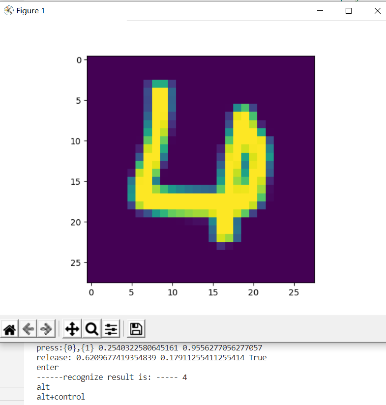

# 总结报告
# 一. 神经网络的基本概念
## 人工智能发展简史

1950年，英国科学家艾伦图灵发表了论文讨论创造出具有真正智能的机器的可能性，并提出了著名的图灵测试：如果一台机器能够与人类展开对话而不能被辨别出其机器身份，那么称这台机器具有智能。现在活跃于电脑，手机，还有各种硬件上的“智能助手”在各自的功能领域，通常被大众认为挺有智能的。

从1956年的达特茅斯会议开始，人工智能（Artificial Intelligence，AI）作为一个专门的研究领域出现，经历了超过半个世纪的起伏，终于在2007年前后，迎来了又一次大发展。图展现了人工智能历史的一些里程碑事件。

图 人工智能发展史

##  人工智能的定义

现在（2019年），人们口中的人工智能其实是一个非常庞杂的概念，从人们对人工智能的期待，技术，和应用角度，都有很多不同的概念。我们详细分析如下：

#### 第一个层面，人们对人工智能的**期待**可以分为：

- **智能地把某件特定的事情做好，在某个领域增强人类的智慧，这种方式又叫做智能增强**——像搜索引擎，自动语言翻译，某个领域的智能助手那样的程序，帮助人类完成某种特定任务。这也叫做“弱人工智能”，或者“狭义人工智能”。
- **像人类一样能认知，思考，判断：模拟人类的智能**——像人类一样能认知，思考，判断的智能软件。这是人工智能学科一开始就有的梦想。这样的智能也叫做“通用人工智能”（Artificial General Intelligence， AGI）， 或“强人工智能”。对于这样的人工智能，科幻小说有很多描写，也有一些研究，但是在实际的应用还没有什么突破。有学者认为，AGI是不可能通过目前人们编程程序的方式实现的$^{[1]}$。尽管如此，社会上还是有人担忧有一天电脑的AGI会超过人类的智能，人类再也赶不上电脑，从而永远受制于电脑。

#### 第二个层面，**从技术的特点来看**。

要实现某种狭义的人工智能，我们很自然地想到，如果我们能让运行程序的电脑来学习并自动掌握某些规律，那该多好啊，这就是“机器学习”。机器学习在几十年的发展历史中，产生了很多技术，这些技术都有下面的共性：

> 如果一个程序解决任务（T）的效能（用P表示）随着经验（E）得到了提高，那么，这个程序就能从经验（E）中学到了关于任务（T）的知识，并让衡量值（P）得到提高。$^{[2]}$

1. 选择一个模型结构（例如逻辑回归，决策树等），这就是上面说的程序。
2. 用训练数据（输入和输出）输入模型。这就是上面的经验（E）。
3. 通过不断执行任务（T）并衡量结果（P），让P不断提高，直到达到一个满意的值。

## 范式的演化

**范式演化的四个阶段**

第一阶段：经验

第二阶段：理论

第三阶段：计算仿真

第四阶段：数据探索

## 神经网络的基本工作原理简介

神经网络由基本的神经元组成，图1-13就是一个神经元的数学/计算模型，便于我们用程序来实现。

图 神经元计算模型

输入 input   权重 weights  偏移 bias  求和计算 sum  激活函数 activation

**小结**

- 一个神经元可以有多个输入。
- 一个神经元只能有一个输出，这个输出可以同时输入给多个神经元。
- 一个神经元的 $w$ 的数量和输入的数量一致。
- 一个神经元只有一个 $b$。
- $w$ 和 $b$ 有人为的初始值，在训练过程中被不断修改。
- $A$ 可以等于 $Z$，即激活函数不是必须有的。
- 一层神经网络中的所有神经元的激活函数必须一致。

###  神经网络的训练过程

#### 单层神经网络模型

这是一个单层的神经网络，有 $m$ 个输入 (这里 $m=3$)，有 $n$ 个输出 (这里 $n=2$)。在神经网络中，$b$ 到每个神经元的权值来表示实际的偏移值，亦即 $(b_1,b_2)$，这样便于矩阵运算。也有些人把 $b$ 写成 $x_0$，其实是同一个效果，即把偏移值看做是神经元的一个输入。

- $(x_1,x_2,x_3)$ 是一个样本数据的三个特征值
- $(w_{11},w_{21},w_{31})$ 是 $(x_1,x_2,x_3)$ 到 $n1$ 的权重
- $(w_{12},w_{22},w_{32})$ 是 $(x_1,x_2,x_3)$ 到 $n2$ 的权重
- $b_1$ 是 $n1$ 的偏移
- $b_2$ 是 $n2$ 的偏移

图 单层神经网络模型

从图大家可以看到，同一个特征 $x_1$，对于$n1,n2$来说，权重是不相同的，因为 $n1,n2$ 是两个神经元，它们完成不同的任务（特征识别）。我们假设 $x_1,x_2,x_3$ 分别代表红绿蓝三种颜色，而 $n1,n2$ 分别用于识别暖色和冷色，那么 $x_1$ 到 $n1$ 的权重，肯定要大于 $x_1$ 到 $n2$ 的权重，因为 $x_1$ 代表红色，是暖色。

而对于 $n1$ 来说，$x_1,x_2,x_3$ 输入的权重也是不相同的，因为它要对不同特征有选择地接纳。如同上面的例子，$n1$ 对于代表红色的 $x_1$，肯定是特别重视，权重值较高；而对于代表蓝色的 $x_3$，尽量把权重值降低，才能有正确的输出。

#### 训练流程

从真正的“零”开始学习神经网络时，我没有看到过任何一个流程图来讲述训练过程，大神们写书或者博客时都忽略了这一点，图是一个简单的流程图。

### 神经网络中的矩阵运算

图是一个两层的神经网络，包含隐藏层和输出层，输入层不算做一层。

图 神经网络中的各种符号约定

$$
z1_1 = x_1 \cdot w1_{1,1}+ x_2 \cdot w1_{2,1}+b1_1
$$
$$
z1_2 = x_1 \cdot w1_{1,2}+ x_2 \cdot w1_{2,2}+b1_2
$$
$$
z1_3 = x_1 \cdot w1_{1,3}+ x_2 \cdot w1_{2,3}+b1_3
$$

变成矩阵运算：

$$
z1_1=
\begin{pmatrix}
x_1 & x_2
\end{pmatrix}
\begin{pmatrix}
w1_{1,1} \\\\
w1_{2,1}
\end{pmatrix}
+b1_1
$$

$$
z1_2=
\begin{pmatrix}
x_1 & x_2
\end{pmatrix}
\begin{pmatrix}
w1_{1,2} \\\\
w1_{2,2}
\end{pmatrix}
+b1_2
$$

$$
z1_3=
\begin{pmatrix}
x_1 & x_2
\end{pmatrix}
\begin{pmatrix}
w1_{1,3} \\\\
w1_{2,3}
\end{pmatrix}
+b1_3
$$

再变成大矩阵：

$$
Z1 =
\begin{pmatrix}
x_1 & x_2 
\end{pmatrix}
\begin{pmatrix}
w1_{1,1}&w1_{1,2}&w1_{1,3} \\\\
w1_{2,1}&w1_{2,2}&w1_{2,3} \\\\
\end{pmatrix}
+\begin{pmatrix}
b1_1 & b1_2 & b1_3
\end{pmatrix}
$$

最后变成矩阵符号：

$$Z1 = X \cdot W1 + B1$$

然后是激活函数运算：

$$A1=a(Z1)$$

同理可得：

$$Z2 = A1 \cdot W2 + B2$$

注意：损失函数不是前向计算的一部分。

### 神经网络的主要功能

#### 回归（Regression）或者叫做拟合（Fitting）

单层的神经网络能够模拟一条二维平面上的直线，从而可以完成线性分割任务。而理论证明，两层神经网络可以无限逼近任意连续函数。图所示就是一个两层神经网络拟合复杂曲线的实例。

图 回归/拟合示意图

所谓回归或者拟合，其实就是给出x值输出y值的过程，并且让y值与样本数据形成的曲线的距离尽量小，可以理解为是对样本数据的一种骨架式的抽象。

以图为例，蓝色的点是样本点，从中可以大致地看出一个轮廓或骨架，而红色的点所连成的线就是神经网络的学习结果，它可以“穿过”样本点群形成中心线，尽量让所有的样本点到中心线的距离的和最近。

#### 分类（Classification）

如图，二维平面中有两类点，红色的和蓝色的，用一条直线肯定不能把两者分开了。

图 分类示意图

我们使用一个两层的神经网络可以得到一个非常近似的结果，使得分类误差在满意的范围之内。图中那条淡蓝色的曲线，本来并不存在，是通过神经网络训练出来的分界线，可以比较完美地把两类样本分开，所以分类可以理解为是对两类或多类样本数据的边界的抽象。

两图的曲线形态实际上是一个真实的函数在 $[0,1]$ 区间内的形状，其原型是：

$$y=0.4x^2 + 0.3x\sin(15x) + 0.01\cos(50x)-0.3$$

## 总结

这个部分主要了解了神经网络的基本原理、人工智能的发展过程。让我们对人工智能的世界观方法论形成一个基本的认识。

# 二. 反向传播与梯度下降

##  线性反向传播

假设有一个函数：

$$z = x \cdot y \tag{1}$$

其中:

$$x = 2w + 3b \tag{2}$$

$$y = 2b + 1 \tag{3}$$

计算图如图。

图 简单线性计算的计算图

当 $w = 3, b = 4$ 时，会得到图的结果。

图 计算结果

最终的 $z$ 值，受到了前面很多因素的影响：变量 $w$，变量 $b$，计算式 $x$，计算式 $y$。

###  反向传播求解 $w$

#### 求 $w$ 的偏导

目前 $z=162$，如果想让 $z$ 变小一些，比如目标是 $z=150$，$w$ 应该如何变化呢？为了简化问题，先只考虑改变 $w$ 的值，而令 $b$ 值固定为 $4$。

从 $z$ 开始一层一层向回看，图中各节点关于变量 $w$ 的偏导计算结果如下：

因为 $$z = x \cdot y$$，其中 $$x = 2w + 3b, y = 2b + 1$$

所以：

$$\frac{\partial{z}}{\partial{w}}=\frac{\partial{z}}{\partial{x}} \cdot \frac{\partial{x}}{\partial{w}}=y \cdot 2=18 \tag{4}$$

其中：

$$\frac{\partial{z}}{\partial{x}}=\frac{\partial{}}{\partial{x}}(x \cdot y)=y=9$$

$$\frac{\partial{x}}{\partial{w}}=\frac{\partial{}}{\partial{w}}(2w+3b)=2$$

图 对 $w$ 的偏导求解过程

图其实就是链式法则的具体表现，$z$ 的误差通过中间的 $x$ 传递到 $w$。如果不是用链式法则，而是直接用 $z$ 的表达式计算对 $w$ 的偏导数，会怎么样呢？我们来试验一下。

根据公式1、2、3，我们有：

$$z=x \cdot y=(2w+3b)(2b+1)=4wb+2w+6b^2+3b \tag{5}$$

对上式求 $w$ 的偏导：

$$
\frac{\partial z}{\partial w}=4b+2=4 \cdot 4 + 2=18 \tag{6}
$$

公式4和公式6的结果完全一致！

#### 求 $w$ 的具体变化值

公式4和公式6的含义是：当 $w$ 变化一点点时，$z$ 会产生 $w$ 的变化值18倍的变化。记住我们的目标是让 $z=150$，目前在初始状态时是 $z=162$，所以，问题转化为：当需要 $z$ 从 $162$ 变到 $150$ 时，$w$ 需要变化多少？

既然：

$$
\Delta z = 18 \cdot \Delta w
$$

则：

$$
\Delta w = {\Delta z \over 18}=\frac{162-150}{18}= 0.6667
$$

所以：

$$w = w - 0.6667=2.3333$$
$$x=2w+3b=16.6667$$
$$z=x \cdot y=16.6667 \times 9=150.0003$$

## 非线性反向传播

图 非线性的反向传播

其中$1<x<=10,0<y<2.15$。假设有5个人分别代表 $x,a,b,c,y$：

#### 正向过程

1. 第1个人，输入层，随机输入第一个 $x$ 值，$x$ 的取值范围 $(1,10]$，假设第一个数是 $2$；
2. 第2个人，第一层网络计算，接收第1个人传入 $x$ 的值，计算：$a=x^2$；
3. 第3个人，第二层网络计算，接收第2个人传入 $a$ 的值，计算：$b=\ln (a)$；
4. 第4个人，第三层网络计算，接收第3个人传入 $b$ 的值，计算：$c=\sqrt{b}$；
5. 第5个人，输出层，接收第4个人传入 $c$ 的值

#### 反向过程

6. 第5个人，计算 $y$ 与 $c$ 的差值：$\Delta c = c - y$，传回给第4个人
7. 第4个人，接收第5个人传回$\Delta c$，计算 $\Delta b = \Delta c \cdot 2\sqrt{b}$
8. 第3个人，接收第4个人传回$\Delta b$，计算 $\Delta a = \Delta b \cdot a$
9. 第2个人，接收第3个人传回$\Delta a$，计算 $\Delta x = \frac{\Delta}{2x}$
10. 第1个人，接收第2个人传回$\Delta x$，更新 $x \leftarrow x - \Delta x$，回到第1步

##  梯度下降

在大多数文章中，都以“一个人被困在山上，需要迅速下到谷底”来举例，这个人会“寻找当前所处位置最陡峭的地方向下走”。这个例子中忽略了安全因素，这个人不可能沿着最陡峭的方向走，要考虑坡度。

在自然界中，梯度下降的最好例子，就是泉水下山的过程：

1. 水受重力影响，会在当前位置，沿着最陡峭的方向流动，有时会形成瀑布（梯度下降）；
2. 水流下山的路径不是唯一的，在同一个地点，有可能有多个位置具有同样的陡峭程度，而造成了分流（可以得到多个解）；
3. 遇到坑洼地区，有可能形成湖泊，而终止下山过程（不能得到全局最优解，而是局部最优解）。

### 梯度下降的数学理解

梯度下降的数学公式：

$$\theta_{n+1} = \theta_{n} - \eta \cdot \nabla J(\theta) \tag{1}$$

其中：

- $\theta_{n+1}$：下一个值；
- $\theta_n$：当前值；
- $-$：减号，梯度的反向；
- $\eta$：学习率或步长，控制每一步走的距离，不要太快以免错过了最佳景点，不要太慢以免时间太长；
- $\nabla$：梯度，函数当前位置的最快上升点；
- $J(\theta)$：函数。

#### 梯度下降的三要素

1. 当前点；
2. 方向；
3. 步长。

## 总结

这部分主要讲了反向传播与梯度下降的概论与原理。反向传播主要用线性方程讲解，梯度下降是神经网络的基本学习方法，用单变量和双变量两种方式说明，配以可视化的图解。

# 三. 损失函数

在各种材料中经常看到的中英文词汇有：误差，偏差，Error，Cost，Loss，损失，代价......意思都差不多，在本书中，使用“损失函数”和“Loss Function”这两个词汇，具体的损失函数符号用 $J$ 来表示，误差值用 $loss$ 表示。

“损失”就是所有样本的“误差”的总和，亦即（$m$ 为样本数）：

$$损失 = \sum^m_{i=1}误差_i$$

$$J = \sum_{i=1}^m loss_i$$

**损失函数的作用**

损失函数的作用，就是计算神经网络每次迭代的前向计算结果与真实值的差距，从而指导下一步的训练向正确的方向进行。

## 损失函数图像理解

图 单变量的损失函数图

图中，纵坐标是损失函数值，横坐标是变量。不断地改变变量的值，会造成损失函数值的上升或下降。而梯度下降算法会让我们沿着损失函数值下降的方向前进。

**用等高线图理解双变量对损失函数影响**

图 双变量的损失函数图

图中，横坐标是一个变量 $w$，纵坐标是另一个变量 $b$。两个变量的组合形成的损失函数值，在图中对应处于等高线上的唯一的一个坐标点。$w,b$ 所有不同值的组合会形成一个损失函数值的矩阵，我们把矩阵中具有相同（相近）损失函数值的点连接起来，可以形成一个不规则椭圆，其圆心位置，是损失值为 $0$ 的位置，也是我们要逼近的目标。

这个椭圆如同平面地图的等高线，来表示的一个洼地，中心位置比边缘位置要低，通过对损失函数值的计算，对损失函数的求导，会带领我们沿着等高线形成的梯子一步步下降，无限逼近中心点。

**神经网络中常用的损失函数**

- 均方差函数，主要用于回归

- 交叉熵函数，主要用于分类

二者都是非负函数，极值在底部，用梯度下降法可以求解。

## 均方差函数

该函数就是最直观的一个损失函数了，计算预测值和真实值之间的欧式距离。预测值和真实值越接近，两者的均方差就越小。

**工作原理**

要想得到预测值 $a$ 与真实值 $y$ 的差距，最朴素的想法就是用 $Error=a_i-y_i$。

对于单个样本来说，这样做没问题，但是多个样本累计时，$a_i-y_i$ 可能有正有负，误差求和时就会导致相互抵消，从而失去价值。所以有了绝对值差的想法，即 $Error=|a_i-y_i|$ 。

**损失函数的可视化**

横坐标为 $w$，纵坐标为 $b$，针对每一个$(w,b)$的组合计算出一个损失函数值，用三维图的高度来表示这个损失函数值。下图中的底部并非一个平面，而是一个有些下凹的曲面，只不过曲率较小，如图3-7。

图 $w$ 和 $b$ 同时变化时的损失值形成的曲面

#### 损失函数值的2D示意图

在平面地图中，我们经常会看到用等高线的方式来表示海拔高度值，下图就是上图在平面上的投影，即损失函数值的等高线图，如图3-8所示。

图 损失函数的等高线图

## 交叉熵损失函数

交叉熵（Cross Entropy）是Shannon信息论中一个重要概念，主要用于度量两个概率分布间的差异性信息。在信息论中，交叉熵是表示两个概率分布 $p,q$ 的差异，其中 $p$ 表示真实分布，$q$ 表示预测分布，那么 $H(p,q)$ 就称为交叉熵：

$$H(p,q)=\sum_i p_i \cdot \ln {1 \over q_i} = - \sum_i p_i \ln q_i \tag{1}$$

交叉熵可在神经网络中作为损失函数，$p$ 表示真实标记的分布，$q$ 则为训练后的模型的预测标记分布，交叉熵损失函数可以衡量 $p$ 与 $q$ 的相似性。

**交叉熵函数常用于逻辑回归(logistic regression)，也就是分类(classification)。**

## 总结

这个部分说明了神经网络中目前最常用的均方差损失函数（用于回归）和交叉熵损失函数（用于分类）。

# 四. 线性回归

# 单变量线性回归

线性回归是一种有监督的学习，解决的是自变量和因变量之间的关系。本次学习的是单变量线性回归。回归指的是因变量是连续性的，而如果因变量是离散型的，则是分类问题。比如房子的面积与房价之间的关系，这是回归问题。而一个人是否逾期是一个分类问题。

## 最小二乘法

最小二乘法是一种在误差估计、不确定度、系统辨识及预测、预报等数据处理诸多学科领域得到广泛应用的数学工具

最小二乘法（又称最小平方法）是一种数学优化技术。它通过最小化误差的平方和寻找数据的最佳函数匹配。利用最小二乘法可以简便地求得未知的数据，并使得这些求得的数据与实际数据之间误差的平方和为最小

最小二乘法还可用于曲线拟合，其他一些优化问题也可通过最小化能量或最大化熵用最小二乘法来表达

**特征**

根据样本数据，采用最小二乘估计式可以得到简单线性回归模型参数的估计量。但是估计量参数与总体真实参数的接近程度如何，是否存在更好的其它估计式，这就涉及到最小二乘估计式或估计量的最小方差（或最佳）（Best）性、线性（Linear）及无偏（ Unbiased）性，简称为BLU特性。这就是广泛应用普通最小二乘法估计经济计量模型的主要原因。下面证明普通最小二乘估计量具有上述三特性。

1、线性特性
所谓线性特性，是指估计量分别是样本观测值的线性函数，亦即估计量和观测值的线性组合。

2、无偏性
无偏性，是指参数估计量的期望值分别等于总体真实参数。

3、最小方差性
所谓最小方差性，是指估计量与用其它方法求得的估计量比较，其方差最小，即最佳。最小方差性又称有效性。这一性质就是著名的高斯一马尔可夫（ Gauss-Markov）定理。这个定理阐明了普通最小二乘估计量与用其它方法求得的任何线性无偏估计量相比，它是最佳的。

## 梯度下降法

**数学原理**

在下面的公式中，我们规定 $x$ 是样本特征值（单特征），$y$ 是样本标签值，$z$ 是预测值，下标 $i$ 表示其中一个样本。

**预设函数（Hypothesis Function）**

线性函数：

$$z_i = x_i \cdot w + b \tag{1}$$

**损失函数（Loss Function）**

均方误差：

$$loss_i(w,b) = \frac{1}{2} (z_i-y_i)^2 \tag{2}$$

与最小二乘法比较可以看到，梯度下降法和最小二乘法的模型及损失函数是相同的，都是一个线性模型加均方差损失函数，模型用于拟合，损失函数用于评估效果。

区别在于，最小二乘法从损失函数求导，直接求得数学解析解，而梯度下降以及后面的神经网络，都是利用导数传递误差，再通过迭代方式一步一步（用近似解）逼近真实解。

## 神经网络法

在梯度下降法中，我们简单讲述了一下神经网络做线性拟合的原理，即：

1. 初始化权重值
2. 根据权重值放出一个解
3. 根据均方差函数求误差
4. 误差反向传播给线性计算部分以调整权重值
5. 是否满足终止条件？不满足的话跳回2

一个不恰当的比喻就是穿糖葫芦：桌子上放了一溜儿12个红果，给你一个足够长的竹签子，选定一个角度，在不移动红果的前提下，想办法用竹签子穿起最多的红果。

最开始你可能会任意选一个方向，用竹签子比划一下，数数能穿到几个红果，发现是5个；然后调整一下竹签子在桌面上的水平角度，发现能穿到6个......最终你找到了能穿10个红果的的角度。

### 定义神经网络结构

我们是首次尝试建立神经网络，先用一个最简单的单层单点神经元，如图所示。

图 单层单点神经元

**工作原理**

就单纯地看待这个线性回归问题，其原理就是先假设样本点是呈线性分布的，注意这里的线性有可能是高维空间的，而不仅仅是二维平面上的。但是高维空间人类无法想象，所以我们不妨用二维平面上的问题来举例。

在4.2的梯度下降法中，首先假设这个问题是个线性问题，因而有了公式 $z=xw+b$，用梯度下降的方式求解最佳的 $w,b$ 的值。

在本节中，用神经元的编程模型把梯度下降法包装了一下，这样就进入了神经网络的世界，从而可以有成熟的方法论可以解决更复杂的问题，比如多个神经元协同工作、多层神经网络的协同工作等等。

如图4-5所示，样本点摆在那里，位置都是固定的了，神经网络的任务就是找到一根直线（注意我们首先假设这是线性问题），让该直线穿过样本点阵，并且所有样本点到该直线的距离的平方的和最小。

可以想象成每一个样本点都有一根橡皮筋连接到直线上，连接点距离该样本点最近，所有的橡皮筋形成一个合力，不断地调整该直线的位置。该合力具备两种调节方式：

1. 如果上方的拉力大一些，直线就会向上平移一些，这相当于调节 $b$ 值；
2. 如果侧方的拉力大一些，直线就会向侧方旋转一些，这相当于调节 $w$ 值。

直到该直线处于平衡位置时，也就是线性拟合的最佳位置了。

如果样本点不是呈线性分布的，可以用直线拟合吗？

答案是“可以的”，只是最终的效果不太理想，误差可以做到在线性条件下的最小，但是误差值本身还是比较大的。比如一个半圆形的样本点阵，用直线拟合可以达到误差值最小为 $1.2$（不妨假设这个值的单位是厘米），已经尽力了但能力有限。如果用弧线去拟合，可以达到误差值最小为 $0.3$。

## 多样本单特征值计算

在前面的代码中，我们一直使用单样本计算来实现神经网络的训练过程，但是单样本计算有一些缺点：

1. 前后两个相邻的样本很有可能会对反向传播产生相反的作用而互相抵消。假设样本1造成了误差为 $0.5$，$w$ 的梯度计算结果是 $0.1$；紧接着样本2造成的误差为 $-0.5$，$w$ 的梯度计算结果是 $-0.1$，那么前后两次更新 $w$ 就会产生互相抵消的作用。
2. 在样本数据量大时，逐个计算会花费很长的时间。由于我们在本例中样本量不大（200个样本），所以计算速度很快，觉察不到这一点。在实际的工程实践中，动辄10万甚至100万的数据量，轮询一次要花费很长的时间。

如果使用多样本计算，就要涉及到矩阵运算了，而所有的深度学习框架，都对矩阵运算做了优化，会大幅提升运算速度。打个比方：如果200个样本，循环计算一次需要2秒的话，那么把200个样本打包成矩阵，做一次计算也许只需要0.1秒。

## 梯度下降的三种形式

**单样本随机梯度下降**

SGD(Stochastic Gradient Descent)

样本访问示意图如图所示。
  

图 单样本访问方式

**小批量样本梯度下降**

Mini-Batch Gradient Descent

样本访问示意图如图所示。

图 小批量样本访问方式

**全批量样本梯度下降**

Full Batch Gradient Descent

样本访问示意图如图所示。

图  全批量样本访问方式

# 多变量线性回归

##  正规方程解法

英文名是 Normal Equations。

对于线性回归问题，除了前面提到的最小二乘法可以解决一元线性回归的问题外，也可以解决多元线性回归问题。

对于多元线性回归，可以用正规方程来解决，也就是得到一个数学上的解析解。它可以解决下面这个公式描述的问题：

$$y=a_0+a_1x_1+a_2x_2+\dots+a_kx_k \tag{1}$$

## 神经网络解法

与单特征值的线性回归问题类似，多变量（多特征值）的线性回归可以被看做是一种高维空间的线性拟合。以具有两个特征的情况为例，这种线性拟合不再是用直线去拟合点，而是用平面去拟合点。

**定义神经网络结构**

我们定义一个一层的神经网络，输入层为2或者更多，反正大于2了就没区别。这个一层的神经网络的特点是：

1. 没有中间层，只有输入项和输出层（输入项不算做一层）；
2. 输出层只有一个神经元；
3. 神经元有一个线性输出，不经过激活函数处理，即在下图中，经过 $\Sigma$ 求和得到 $Z$ 值之后，直接把 $Z$ 值输出。

## 样本特征数据标准化

数据标准化（Normalization），又可以叫做数据归一化。

归一化
就是将训练集中某一列数值特征（假设是第i列）的值缩放到0和1之间。

标准化
就是将训练集中某一列数值特征（假设是第i列）的值缩放成均值为0，方差为1的状态。

**标准化的常用方法**

- Min-Max标准化（离差标准化），将数据映射到 $[0,1]$ 区间

$$x_{new}=\frac{x-x_{min}}{x_{max} - x_{min}} \tag{1}$$

- 平均值标准化，将数据映射到[-1,1]区间
   
$$x_{new} = \frac{x - \bar{x}}{x_{max} - x_{min}} \tag{2}$$

- 对数转换
$$x_{new}=\ln(x_i) \tag{3}$$

- 反正切转换
$$x_{new}=\frac{2}{\pi}\arctan(x_i) \tag{4}$$

- Z-Score法

把每个特征值中的所有数据，变成平均值为0，标准差为1的数据，最后为正态分布。Z-Score规范化（标准差标准化 / 零均值标准化，其中std是标准差）：

$$x_{new} = \frac{x_i - \bar{x}}{std} \tag{5}$$

- 中心化，平均值为0，无标准差要求
  
$$x_{new} = x_i - \bar{x} \tag{6}$$

- 比例法，要求数据全是正值

$$
x_{new} = \frac{x_k}{\sum_{i=1}^m{x_i}} \tag{7}
$$

## 还原参数值

1.对比结果

2.还原真实的 $W,B$ 值

3.代码实现

**接着预测数据的标准化**

**最后对标签值标准化**

归纳总结一下前面遇到的困难及解决办法：

1. 样本不做标准化的话，网络发散，训练无法进行；
2. 训练样本标准化后，网络训练可以得到结果，但是预测结果有问题；
3. 还原参数值后，预测结果正确，但是此还原方法并不能普遍适用；
4. 标准化测试样本，而不需要还原参数值，可以保证普遍适用；
5. 标准化标签值，可以使得网络训练收敛快，但是在预测时需要把结果反标准化，以便得到真实值。

## 总结

这个部分介绍了单变量线性回归与多变量线性回归。

单层的神经网络，其实就是一个神经元，可以完成一些线性的工作，比如拟合一条直线，这用一个神经元就可以实现。当这个神经元只接收一个输入时，就是单变量线性回归，可以在二维平面上用可视化方法理解。当接收多个变量输入时，叫做多变量线性回归，此时可视化方法理解就比较困难了，通常我们会用变量两两组对的方式来表现。

当变量多于一个时，两个变量的量纲和数值有可能差别很大，这种情况下，我们通常需要对样本特征数据做归一化，然后把数据喂给神经网络进行训练，否则会出现“消化不良”的情况。

# 五. 线性分类

# 线性二分类

二分类函数

对率函数Logistic Function，即可以做为激活函数使用，又可以当作二分类函数使用。而在很多不太正规的文字材料中，把这两个概念混用了，比如下面这个说法：“我们在最后使用Sigmoid激活函数来做二分类”，这是不恰当的。在本书中，我们会根据不同的任务区分激活函数和分类函数这两个概念，在二分类任务中，叫做Logistic函数，而在作为激活函数时，叫做Sigmoid函数。

- Logistic函数公式

$$Logistic(z) = \frac{1}{1 + e^{-z}}$$

以下记 $a=Logistic(z)$。

- 导数

$$Logistic'(z) = a(1 - a)$$

具体求导过程可以参考8.1节。

- 输入值域

$$(-\infty, \infty)$$

- 输出值域

$$(0,1)$$

- 函数图像（图6-2）

图 Logistic函数图像

- 使用方式

此函数实际上是一个概率计算，它把 $(-\infty, \infty)$ 之间的任何数字都压缩到 $(0,1)$ 之间，返回一个概率值，这个概率值接近 $1$ 时，认为是正例，否则认为是负例。

训练时，一个样本 $x$ 在经过神经网络的最后一层的矩阵运算结果作为输入 $z$，经过Logistic计算后，输出一个 $(0,1)$ 之间的预测值。我们假设这个样本的标签值为 $0$ 属于负类，如果其预测值越接近 $0$，就越接近标签值，那么误差越小，反向传播的力度就越小。

推理时，我们预先设定一个阈值比如 $0.5$，则当推理结果大于 $0.5$ 时，认为是正类；小于 $0.5$ 时认为是负类；等于 $0.5$ 时，根据情况自己定义。阈值也不一定就是 $0.5$，也可以是 $0.65$ 等等，阈值越大，准确率越高，召回率越低；阈值越小则相反，准确度越低，召回率越高。

比如：

- input=2时，output=0.88，而0.88>0.5，算作正例
- input=-1时，output=0.27，而0.27<0.5，算作负例

## 用神经网络实现线性二分类

我们先看看如何用神经网络在两组不同标签的样本之间画一条明显的分界线。这条分界线可以是直线，也可以是曲线。这就是二分类问题。如果只画一条分界线的话，无论是直线还是曲线，我们可以用一支假想的笔（即一个神经元），就可以达到目的，也就是说笔的走向，完全依赖于这一个神经元根据输入信号的判断。

再看楚汉城池示意图，在两个颜色区域之间似乎存在一条分割的直线，即线性可分的。

1. 从视觉上判断是线性可分的，所以我们使用单层神经网络即可；
2. 输入特征是经度和纬度，所以我们在输入层设置两个输入单元。其中$x_1=$经度，$x_2=$纬度；
3. 最后输出的是一个二分类结果，分别是楚汉地盘，可以看成非0即1的二分类问题，所以我们只用一个输出单元就可以了。

## 线性二分类原理

**性分类和线性回归的异同**

此原理对线性和非线性二分类都适用。

回忆一下前面学习过的线性回归，通过均方差函数误差反向传播的方法，不断矫正拟合直线的角度（Weights）和偏移（Bias），因为均方差函数能够准确地反映出当前的拟合程度。那么在线性分类中，我们能不能采取类似的方法呢？

线性分类，试图在含有两种样本的空间中划出一条分界线，让双方截然分开，就好像是中国象棋的棋盘中的楚河汉界一样。与线性回归相似的地方是，两者都需要划出那条“直线”来，但是不同的地方也很明显，见表。

表 线性回归和线性分类的比较

||线性回归|线性分类|
|---|---|---|
|相同点|需要在样本群中找到一条直线|需要在样本群中找到一条直线|
|不同点|用直线来拟合所有样本，使得各个样本到这条直线的距离尽可能最短|用直线来分割所有样本，使得正例样本和负例样本尽可能分布在直线两侧|

可以看到线性回归中的目标--“距离最短”，还是很容易理解的，但是线性分类的目标--“分布在两侧”，用数学方式如何描述呢？我们可以有代数和几何两种方式来描述。

**二分类的代数原理**

代数方式：通过一个分类函数计算所有样本点在经过线性变换后的概率值，使得正例样本的概率大于0.5，而负例样本的概率小于0.5。

**分类的几何原理**

几何方式：让所有正例样本处于直线的一侧，所有负例样本处于直线的另一侧，直线尽可能处于两类样本的中间。

**二分类函数的几何作用**

二分类函数的最终结果是把正例都映射到图中的上半部分的曲线上，而把负类都映射到下半部分的曲线上。

图 $Logistic$ 函数把输入的点映射到 $(0,1)$ 区间内实现分类

## 二分类结果可视化

图 稍有欠缺的二分类结果

图 比较完美的二分类的结果

## 实现逻辑与或非门

单层神经网络，又叫做感知机，它可以轻松实现逻辑与、或、非门。由于逻辑与、或门，需要有两个变量输入，而逻辑非门只有一个变量输入。但是它们共同的特点是输入为0或1，可以看作是正负两个类别。

所以，在学习了二分类知识后，我们可以用分类的思想来实现下列5个逻辑门：

- 与门 AND
- 与非门 NAND
- 或门 OR
- 或非门 NOR
- 非门 NOT
 
以逻辑AND为例，图中的4个点分别代表4个样本数据，蓝色圆点表示负例（$y=0$），红色三角表示正例（$y=1$）。

如果用分类思想的话，根据前面学到的知识，应该在红色点和蓝色点之间划出一条分割线来，可以正好把正例和负例完全分开。由于样本数据稀疏，所以这条分割线的角度和位置可以比较自由。

## 用双曲正切函数做二分类函数

双曲正切函数（hyperbolic tangent function）是双曲函数的一种。双曲正切函数在数学语言上一般写作tanh，也可简写成th。与三角函数一样，双曲函数也分为双曲正弦、双曲余弦、双曲正切、双曲余切、双曲正割、双曲余割6种，双曲正切函数便是其中之一。

与正切函数类似，双曲正切函数在计算上等于双曲正弦与双曲余弦的比值，即tanh(x)=sinh(x)/cosh(x)。

1.修改前向计算和反向传播函数

2.增加双曲正切分类函数

3.修改前向计算方法

4.修改反向传播方法

5.修改损失函数

6.增加新的损失函数

7.修改反向传播方法

8.再次修改损失函数代码

9.修改样本数据标签值

#  线性多分类
多分类函数

此函数对线性多分类和非线性多分类都适用。

表示分类任务中有多个类别, 比如对一堆水果图片分类, 它们可能是橘子、苹果、梨等. 多类分类是假设每个样本都被设置了一个且仅有一个标签: 一个水果可以是苹果或者梨, 但是同时不可能是两者

## 线性多分类原理

此原理对线性多分类和非线性多分类都适用。

多分类过程

我们在此以具有两个特征值的三分类举例。可以扩展到更多的分类或任意特征值，比如在ImageNet的图像分类任务中，最后一层全连接层输出给分类器的特征值有成千上万个，分类有1000个。

1. 线性计算

$$z_1 = x_1 w_{11} + x_2 w_{21} + b_1 \tag{1}$$
$$z_2 = x_1 w_{12} + x_2 w_{22} + b_2 \tag{2}$$
$$z_3 = x_1 w_{13} + x_2 w_{23} + b_3 \tag{3}$$

2. 分类计算

$$
a_1=\frac{e^{z_1}}{\sum_i e^{z_i}}=\frac{e^{z_1}}{e^{z_1}+e^{z_2}+e^{z_3}}  \tag{4}
$$
$$
a_2=\frac{e^{z_2}}{\sum_i e^{z_i}}=\frac{e^{z_2}}{e^{z_1}+e^{z_2}+e^{z_3}}  \tag{5}
$$
$$
a_3=\frac{e^{z_3}}{\sum_i e^{z_i}}=\frac{e^{z_3}}{e^{z_1}+e^{z_2}+e^{z_3}}  \tag{6}
$$

3. 损失函数计算

单样本时，$n$表示类别数，$j$表示类别序号：

$$
\begin{aligned}
loss(w,b)&=-(y_1 \ln a_1 + y_2 \ln a_2 + y_3 \ln a_3) \\\\
&=-\sum_{j=1}^{n} y_j \ln a_j 
\end{aligned}
\tag{7}
$$

批量样本时，$m$ 表示样本数，$i$ 表示样本序号：

$$
\begin{aligned}
J(w,b) &=- \sum_{i=1}^m (y_{i1} \ln a_{i1} + y_{i2} \ln a_{i2} + y_{i3} \ln a_{i3}) \\\\
&=- \sum_{i=1}^m \sum_{j=1}^n y_{ij} \ln a_{ij}
\end{aligned}
 \tag{8}
$$

多分类的几何原理

在前面的二分类原理中，很容易理解为我们用一条直线分开两个部分。对于多分类问题，是否可以沿用二分类原理中的几何解释呢？答案是肯定的，只不过需要单独判定每一个类别。

假设一共有三类样本，蓝色为1，红色为2，绿色为3

### 当样本属于第一类时

把蓝色点与其它颜色的点分开。

### 当样本属于第二类时

把红色点与其它两色点分开。

### 当样本属于第三类时

把绿色点与其它两色点分开

## 多分类结果可视化

图 理想中的一对多方式的分割线

**显示分类结果分割线图**

图 神经网络绘出的分类结果图

- 蓝色线是2|3的边界，不考虑第1类
- 绿色线是1|2的边界，不考虑第3类
- 红色线是1|3的边界，不考虑第2类

图 分段线性的分割作用

## 总结
本部分对线性分类的两种形式：线性二分类和线性多分类进行了介绍。在本部分中，利用学到的二分类知识，实现逻辑与门、与非门，或门，或非门。

分类问题在很多资料中都称之为逻辑回归，Logistic Regression，其原因是使用了线性回归中的线性模型，加上一个Logistic二分类函数，共同构造了一个分类器。我们在本书中统称之为分类。

# 六. 非线性回归
# 激活函数
所谓激活函数（Activation Function），就是在人工神经网络的神经元上运行的函数，负责将神经元的输入映射到输出端。

**作用**

激活函数（Activation functions）对于人工神经网络模型去学习、理解非常复杂和非线性的函数来说具有十分重要的作用。它们将非线性特性引入到我们的网络中。在神经元中，输入的 inputs 通过加权，求和后，还被作用了一个函数，这个函数就是激活函数。引入激活函数是为了增加神经网络模型的非线性。没有激活函数的每层都相当于矩阵相乘。

如果不用激活函数，每一层输出都是上层输入的线性函数，无论神经网络有多少层，输出都是输入的线性组合，这种情况就是最原始的感知机（Perceptron）。
如果使用的话，激活函数给神经元引入了非线性因素，使得神经网络可以任意逼近任何非线性函数，这样神经网络就可以应用到众多的非线性模型中。

## 挤压型激活函数
这一类函数的特点是，当输入值域的绝对值较大的时候，其输出在两端是饱和的，都具有S形的函数曲线以及压缩输入值域的作用，所以叫挤压型激活函数，又可以叫饱和型激活函数。

在英文中，通常用Sigmoid来表示，原意是S型的曲线，在数学中是指一类具有压缩作用的S型的函数，在神经网络中，有两个常用的Sigmoid函数，一个是Logistic函数，另一个是Tanh函数。

### **Logistic函数**

对数几率函数（Logistic Function，简称对率函数）。

很多文字材料中通常把激活函数和分类函数混淆在一起说，有一个原因是：在二分类任务中最后一层使用的对率函数与在神经网络层与层之间连接的Sigmoid激活函数，是同样的形式。所以它既是激活函数，又是分类函数，是个特例。

**优点**

从函数图像来看，Sigmoid函数的作用是将输入压缩到 $(0,1)$ 这个区间范围内，这种输出在0~1之间的函数可以用来模拟一些概率分布的情况。它还是一个连续函数，导数简单易求。  

从数学上来看，Sigmoid函数对中央区的信号增益较大，对两侧区的信号增益小，在信号的特征空间映射上，有很好的效果。 

从神经科学上来看，中央区酷似神经元的兴奋态，两侧区酷似神经元的抑制态，因而在神经网络学习方面，可以将重点特征推向中央区，
将非重点特征推向两侧区。

分类功能：我们经常听到这样的对白：

- 甲：“你觉得这件事情成功概率有多大？”
- 乙：“我有六成把握能成功。”

Sigmoid函数在这里就起到了如何把一个数值转化成一个通俗意义上的“把握”的表示。z坐标值越大，经过Sigmoid函数之后的结果就越接近1，把握就越大。

**缺点**

指数计算代价大。

反向传播时梯度消失：从梯度图像中可以看到，Sigmoid的梯度在两端都会接近于0，根据链式法则，如果传回的误差是$\delta$，那么梯度传递函数是$\delta \cdot a'$，而$a'$这时接近零，也就是说整体的梯度也接近零。这就出现梯度消失的问题，并且这个问题可能导致网络收敛速度比较慢。

### **Tanh函数**

TanHyperbolic，即双曲正切函数。

**优点**

具有Sigmoid的所有优点。

无论从理论公式还是函数图像，这个函数都是一个和Sigmoid非常相像的激活函数，他们的性质也确实如此。但是比起Sigmoid，Tanh减少了一个缺点，就是他本身是零均值的，也就是说，在传递过程中，输入数据的均值并不会发生改变，这就使他在很多应用中能表现出比Sigmoid优异一些的效果。

**缺点**

exp指数计算代价大。梯度消失问题仍然存在。

## 半线性激活函数
又可以叫非饱和型激活函数

### **ReLU函数**

Rectified Linear Unit，修正线性单元，线性整流函数，斜坡函数。

**仿生学原理**

相关大脑方面的研究表明生物神经元的信息编码通常是比较分散及稀疏的。通常情况下，大脑中在同一时间大概只有1%~4%的神经元处于活跃状态。使用线性修正以及正则化可以对机器神经网络中神经元的活跃度（即输出为正值）进行调试；相比之下，Sigmoid函数在输入为0时输出为0.5，即已经是半饱和的稳定状态，不够符合实际生物学对模拟神经网络的期望。不过需要指出的是，一般情况下，在一个使用修正线性单元（即线性整流）的神经网络中大概有50%的神经元处于激活态。

**优点**

- 反向导数恒等于1，更加有效率的反向传播梯度值，收敛速度快；
- 避免梯度消失问题；
- 计算简单，速度快；
- 活跃度的分散性使得神经网络的整体计算成本下降。

**缺点**

无界。

梯度很大的时候可能导致的神经元“死”掉。

**Softplus函数**

图 Softplus的函数图像

**ELU函数**

图 ELU的函数图像

# 单入单出的双层神经网络 - 非线性回归
非线性回归是回归函数关于未知回归系数具有非线性结构的回归。常用的处理方法有回归函数的线性迭代法、分段回归法、迭代最小二乘法等。非线性回归分析的主要内容与线性回归分析相似。

如果回归模型的因变量是自变量的一次以上函数形式，回归规律在图形上表现为形态各异的各种曲线，称为非线性回归。这类模型称为非线性回归模型。在许多实际问题中，回归函数往往是较复杂的非线性函数。非线性函数的求解一般可分为将非线性变换成线性和不能变换成线性两大类。

## 用多项式回归法拟合正弦曲线
多项式回归有几种形式：
1.一元一次线性模型

2.多元一次多项式

3.一元多次多项式

4.多元多次多项式

**用二次多项式拟合**
|损失函数值|拟合结果|
|---|---|
|||

**用三次多项式拟合**
|损失函数值|拟合结果|
|---|---|
|||

**用四次多项式拟合**
|损失函数值|拟合结果|
|---|---|
|||

结果比较

不同项数的多项式拟合结果比较

|多项式次数|迭代数|损失函数值|
|:---:|---:|---:|
|2|10000|0.095|
|3|2380|0.005|
|4|8290|0.005|

从表的结果比较中可以得到以下结论：

1. 二次多项式的损失值在下降了一定程度后，一直处于平缓期，不再下降，说明网络能力到了一定的限制，直到10000次迭代也没有达到目的；
2. 损失值达到0.005时，四项式迭代了8290次，比三次多项式的2380次要多很多，说明四次多项式多出的一个特征值，没有给我们带来什么好处，反而是增加了网络训练的复杂度。

## 用多项式回归法拟合复合函数曲线

图 样本数据可视化

**用四次多项式拟合**

四次多项式1万次迭代的训练结果

|损失函数历史|曲线拟合结果|
|---|---|
|||

四次多项式10万次迭代的训练结果

|损失函数历史|曲线拟合结果|
|---|---|
|||

**用六次多项式拟合**

六次多项式5万次迭代的训练结果

|损失函数历史|曲线拟合结果|
|---|---|
|||

**用八次多项式拟合**

八项式5万次迭代的训练结果

|损失函数历史|曲线拟合结果|
|---|---|
|||

八项式100万次迭代的训练结果

|损失函数历史|曲线拟合结果|
|---|---|
|||

## 验证与测试

### **基本概念**
**训练集**

Training Set，用于模型训练的数据样本。

**验证集**

Validation Set，或者叫做Dev Set，是模型训练过程中单独留出的样本集，它可以用于调整模型的超参数和用于对模型的能力进行初步评估。
  
在神经网络中，验证数据集用于：

- 寻找最优的网络深度
- 或者决定反向传播算法的停止点
- 或者在神经网络中选择隐藏层神经元的数量
- 在普通的机器学习中常用的交叉验证（Cross Validation）就是把训练数据集本身再细分成不同的验证数据集去训练模型。

**测试集**

Test Set，用来评估最终模型的泛化能力。但不能作为调参、选择特征等算法相关的选择的依据。

三者之间的关系如图所示。

图 训练集、验证集、测试集的关系

## 双层神经网络实现非线性回归
万能近似定理

万能近似定理(universal approximation theorem) $^{[1]}$，是深度学习最根本的理论依据。它证明了在给定网络具有足够多的隐藏单元的条件下，配备一个线性输出层和一个带有任何“挤压”性质的激活函数（如Sigmoid激活函数）的隐藏层的前馈神经网络，能够以任何想要的误差量近似任何从一个有限维度的空间映射到另一个有限维度空间的Borel可测的函数。

前馈网络的导数也可以以任意好地程度近似函数的导数。

万能近似定理其实说明了理论上神经网络可以近似任何函数。但实践上我们不能保证学习算法一定能学习到目标函数。即使网络可以表示这个函数，学习也可能因为两个不同的原因而失败：

1. 用于训练的优化算法可能找不到用于期望函数的参数值；
2. 训练算法可能由于过拟合而选择了错误的函数。

根据“没有免费的午餐”定理，说明了没有普遍优越的机器学习算法。前馈网络提供了表示函数的万能系统，在这种意义上，给定一个函数，存在一个前馈网络能够近似该函数。但不存在万能的过程既能够验证训练集上的特殊样本，又能够选择一个函数来扩展到训练集上没有的点。

总之，具有单层的前馈网络足以表示任何函数，但是网络层可能大得不可实现，并且可能无法正确地学习和泛化。在很多情况下，使用更深的模型能够减少表示期望函数所需的单元的数量，并且可以减少泛化误差。

**1.定义神经网络结构**

根据万能近似定理的要求，我们定义一个两层的神经网络，输入层不算，一个隐藏层，含3个神经元，一个输出层。图显示了此次用到的神经网络结构。

图 单入单出的双层神经网络

**2.前向计算**

根据网络结构，我们可以得到如图的前向计算图。

**3.反向传播**

**4.代码实现**

## 曲线拟合
实际工作中，变量间未必都有线性关系，如服药后血药浓度与时间的关系；疾病疗效与疗程长短的关系；毒物剂量与致死率的关系等常呈曲线关系。曲线拟合（curve fitting）是指选择适当的曲线类型来拟合观测数据，并用拟合的曲线方程分析两变量间的关系。

用连续曲线近似地刻画或比拟平面上离散点组所表示的坐标之间的函数关系的一种数据处理方法。用解析表达式逼近离散数据的一种方法。在科学实验或社会活动中，通过实验或观测得到量x与y的一组数据对(xi，yi)（i=1，2，…m），其中各xi是彼此不同的 。人们希望用一类与数据的背景材料规律相适应的解析表达式，y=f(x，c）来反映量x与y之间的依赖关系，即在一定意义下“最佳”地逼近或拟合已知数据。f(x，c)常称作拟合模型 ，式中c=(c1，c2，…cn)是一些待定参数。当c在f中线性出现时，称为线性模型，否则称为非线性模型。有许多衡量拟合优度的标准，最常用的一种做法是选择参数c使得拟合模型与实际观测值在各点的残差(或离差)ek=yk－f(xk，c)的加权平方和达到最小，此时所求曲线称作在加权最小二乘意义下对数据的拟合曲线。有许多求解拟合曲线的成功方法，对于线性模型一般通过建立和求解方程组来确定参数，从而求得拟合曲线。至于非线性模型，则要借助求解非线性方程组或用最优化方法求得所需参数才能得到拟合曲线，有时称之为非线性最小二乘拟合。

曲线拟合：贝塞尔曲线与路径转化时的误差。值越大，误差越大；值越小，越精确。

## 非线性回归的工作原理

图 多项式回归方法的特征值输入

图 线性到非线性的变换

**神经网络的非线性拟合工作原理**

|单层多项式回归|双层神经网络|
|---|---|
|||

1.把X拆成两个线性序列z1和z2

2.计算z1的激活函数值a1

3.计算z2的激活函数值a2

4.计算Z值

**比较多项式回归和双层神经网络解法**
多项式回归和神经网络的比较

||多项式回归|双层神经网络|
|---|---|---|
|特征提取方式|特征值的高次方|线性变换拆分|
|特征值数量级|高几倍的数量级|数量级与原特征值相同|
|训练效率|低，需要迭代次数多|高，比前者少好几个数量级|

## 超参数优化的初步认识

超参数优化（Hyperparameter Optimization）主要存在两方面的困难：

1. 超参数优化是一个组合优化问题，无法像一般参数那样通过梯度下降方法来优化，也没有一种通用有效的优化方法。
2. 评估一组超参数配置（Configuration）的时间代价非常高，从而导致一些优化方法（比如演化算法）在超参数优化中难以应用。

对于超参数的设置，比较简单的方法有人工搜索、网格搜索和随机搜索。 

## 总结
本部分我们初步了解了非线性回归，知道了万能近似定理。在两层神经网络之间，必须有激活函数连接，从而加入非线性因素，提高神经网络的能力。所以，我们先从激活函数学起，一类是挤压型的激活函数，常用于简单网络的学习；另一类是半线性的激活函数，常用于深度网络的学习。

# 六. 非线性分类

# 多入单出的双层神经网络 - 非线性二分类

## 非线性二分类实现

**1.定义神经网络结构**

图 非线性二分类神经网络结构图

图 通用的二分类神经网络结构图

**2.前向计算**

**3.反向传播**

图 反向传播过程

## 实现逻辑异或门
**1.准备数据**

**2.测试函数**

**运行结果**

图 训练过程中的损失函数值和准确率值的变化

## 逻辑异或门的工作原理
**可视化分类结果**

图 异或样本数据

## 实现双弧形二分类

## 双弧形二分类的工作原理

**两层神经网络的可视化**

图 经过空间变换后的样本数据

# 多入多出的双层神经网络 - 非线性多分类

## 非线性多分类

**1.定义神经网络结构**

图 非线性多分类的神经网络结构图

**2.前向计算**

**3.反向传播**

**4.代码实现**

图 训练过程中的损失函数值和准确率值的变化

图 分类效果图

## 分类样本不平衡
英文名叫做Imbalanced Data。

在一般的分类学习方法中都有一个假设，就是不同类别的训练样本的数量相对平衡。

以二分类为例，比如正负例都各有1000个左右。如果是1200:800的比例，也是可以接受的，但是如果是1900:100，就需要有些措施来解决不平衡问题了，否则最后的训练结果很大可能是忽略了负例，将所有样本都分类为正类了。

如果是三分类，假设三个类别的样本比例为：1000:800:600，这是可以接受的；但如果是1000:300:100，就属于不平衡了。它带来的结果是分类器对第一类样本过拟合，而对其它两个类别的样本欠拟合，测试效果一定很糟糕。

类别不均衡问题是现实中很常见的问题，大部分分类任务中，各类别下的数据个数基本上不可能完全相等，但是一点点差异是不会产生任何影响与问题的。在现实中有很多类别不均衡问题，它是常见的，并且也是合理的，符合人们期望的。

在前面，我们使用准确度这个指标来评价分类质量，可以看出，在类别不均衡时，准确度这个评价指标并不能work。比如一个极端的例子是，在疾病预测时，有98个正例，2个反例，那么分类器只要将所有样本预测为正类，就可以得到98%的准确度，则此分类器就失去了价值。

**解决方法：**
1.平衡数据集

2.尝试其他评价指标

3.尝试产生人工数据样本

4.尝试一个新的角度理解问题

5.修改现有算法

6.集成学习

# 多入多出的三层神经网络 - 深度非线性多分类

## 三层神经网络的实现

**1.定义神经网络结构**

图 三层神经网络结构

**2.前向计算**

**3.反向传播**

**4.代码实现**

图 训练过程中损失函数和准确度的变化

## 梯度检查

神经网络算法使用反向传播计算目标函数关于每个参数的梯度，可以看做解析梯度。由于计算过程中涉及到的参数很多，反向传播计算的梯度很容易出现误差，导致最后迭代得到效果很差的参数值。

为了确认代码中反向传播计算的梯度是否正确，可以采用梯度检验（gradient check）的方法。通过计算数值梯度，得到梯度的近似值，然后和反向传播得到的梯度进行比较，若两者相差很小的话则证明反向传播的代码是正确无误的。

## 学习率与批大小
在梯度下降公式中：

$$
w_{t+1} = w_t - \frac{\eta}{m} \sum_i^m \nabla J(w,b) \tag{1}
$$

其中，$\eta$是学习率，m是批大小。所以，学习率与批大小是对梯度下降影响最大的两个因子。

## 总结
本部分为非线性分类。了解了非线性二分类、非线性多分类、深度非线性多分类。

# 八. 深度神经网络

# 搭建深度神经网络框架

##  回归任务功能测试
**1.搭建模型**

这个模型很简单，一个双层的神经网络，第一层后面接一个Sigmoid激活函数，第二层直接输出拟合数据，如图所示。

图 完成拟合任务的抽象模型

**2.训练结果**

图 训练过程中损失函数值和准确率的变化

如图所示，损失函数值在一段平缓期过后，开始陡降，这种现象在神经网络的训练中是常见的，最有可能的是当时处于一个梯度变化的平缓地带，算法在艰难地寻找下坡路，然后忽然就找到了。这种情况同时也带来一个弊端：我们会经常遇到缓坡，到底要不要还继续训练？是不是再坚持一会儿就能找到出路呢？抑或是模型能力不够，永远找不到出路呢？这个问题没有准确答案，只能靠试验和经验了。

图 拟合结果

图左侧子图是拟合的情况，绿色点是测试集数据，红色点是神经网路的推理结果，可以看到除了最左侧开始的部分，其它部分都拟合的不错。注意，这里我们不是在讨论过拟合、欠拟合的问题，我们在这个章节的目的就是更好地拟合一条曲线。

##  二分类任务功能测试
**搭建模型**

同样是一个双层神经网络，但是最后一层要接一个Logistic二分类函数来完成二分类任务，如图所示。

图 完成非线性二分类教学案例的抽象模型

**运行结果**

图 训练过程中损失函数值和准确率的变化

## 多分类功能测试

**搭建模型一**

使用Sigmoid做为激活函数的两层网络，如图14-12。

图 完成非线性多分类教学案例的抽象模型

**运行结果**

训练过程如上图所示，分类效果如下图所示。

图 训练过程中损失函数值和准确率的变化

图 分类效果图

**搭建模型二**

使用ReLU做为激活函数的三层网络，如图。

图 使用ReLU函数抽象模型

用两层网络也可以实现，但是使用ReLE函数时，训练效果不是很稳定，用三层比较保险。

**运行结果**

训练过程如上图所示，分类效果如下图所示。

图 训练过程中损失函数值和准确率的变化

图 分类效果图

### 比较

用一句简单的话来描述二者的差别：Relu能直则直，对方形边界适用；Sigmoid能弯则弯，对圆形边界适用。

# 网络优化

随着网络的加深，训练变得越来越困难，时间越来越长，原因可能是：

- 参数多
- 数据量大
- 梯度消失
- 损失函数坡度平缓

为了解决上面这些问题，科学家们在深入研究网络表现的前提下，发现在下面这些方向上经过一些努力，可以给深度网络的训练带来或多或少的改善：

- 权重矩阵初始化
- 批量归一化
- 梯度下降优化算法
- 自适应学习率算法

## 权重矩阵初始化

权重矩阵初始化是一个非常重要的环节，是训练神经网络的第一步，选择正确的初始化方法会带了事半功倍的效果。这就好比攀登喜马拉雅山，如果选择从南坡登山，会比从北坡容易很多。而初始化权重矩阵，相当于下山时选择不同的道路，在选择之前并不知道这条路的难易程度，只是知道它可以抵达山下。这种选择是随机的，即使你使用了正确的初始化算法，每次重新初始化时也会给训练结果带来很多影响。

比如第一次初始化时得到权重值为(0.12847，0.36453)，而第二次初始化得到(0.23334，0.24352)，经过试验，第一次初始化用了3000次迭代达到精度为96%的模型，第二次初始化只用了2000次迭代就达到了相同精度。这种情况在实践中是常见的。

表 几种初始化方法的应用场景

|ID|网络深度|初始化方法|激活函数|说明|
|---|---|---|---|---|
|1|单层|零初始化|无|可以|
|2|双层|零初始化|Sigmoid|错误，不能进行正确的反向传播|
|3|双层|随机初始化|Sigmoid|可以|
|4|多层|随机初始化|Sigmoid|激活值分布成凹形，不利于反向传播|
|5|多层|Xavier初始化|Tanh|正确|
|6|多层|Xavier初始化|ReLU|激活值分布偏向0，不利于反向传播|
|7|多层|MSRA初始化|ReLU|正确|

从表可以看到，由于网络深度和激活函数的变化，使得人们不断地研究新的初始化方法来适应，最终得到1、3、5、7这几种组合。

## 梯度下降优化算法

**随机梯度下降 SGD**

图 随机梯度下降算法的梯度搜索轨迹示意图

**实际效果**

表 学习率对SGD的影响

|学习率|损失函数与准确率|
|---|---|
|0.1||
|0.3||

**动量算法 Momentum**

SGD方法的一个缺点是其更新方向完全依赖于当前batch计算出的梯度，因而十分不稳定，因为数据有噪音。

Momentum算法借用了物理中的动量概念，它模拟的是物体运动时的惯性，即更新的时候在一定程度上保留之前更新的方向，同时利用当前batch的梯度微调最终的更新方向。这样一来，可以在一定程度上增加稳定性，从而学习地更快，并且还有一定摆脱局部最优的能力。Momentum算法会观察历史梯度，若当前梯度的方向与历史梯度一致（表明当前样本不太可能为异常点），则会增强这个方向的梯度。若当前梯度与历史梯度方向不一致，则梯度会衰减。

图 动量算法的前进方向

图中，第一次的梯度更新完毕后，会记录$v_1$的动量值。在“求梯度点”进行第二次梯度检查时，得到2号方向，与$v_1$的动量组合后，最终的更新为2'方向。这样一来，由于有$v_1$的存在，会迫使梯度更新方向具备“惯性”，从而可以减小随机样本造成的震荡。

**实际效果**

表 SGD和动量法的比较

|算法|损失函数和准确率|
|---|---|
|SGD||
|Momentum||

从表的比较可以看到，使用同等的超参数设置，普通梯度下降算法经过epoch=10000次没有到达预定0.001的损失值；动量算法经过2000个epoch迭代结束。

在损失函数历史数据图中，中间有一大段比较平坦的区域，梯度值很小，或者是随机梯度下降算法找不到合适的方向前进，只能慢慢搜索。而下侧的动量法，利用惯性，判断当前梯度与上次梯度的关系，如果方向相同，则会加速前进；如果不同，则会减速，并趋向平衡。所以很快地就达到了停止条件。

**梯度加速算法 NAG**

Nesterov Accelerated Gradient，或者叫做Nesterov Momentum。

在小球向下滚动的过程中，我们希望小球能够提前知道在哪些地方坡面会上升，这样在遇到上升坡面之前，小球就开始减速。这方法就是Nesterov Momentum，其在凸优化中有较强的理论保证收敛。并且，在实践中Nesterov Momentum也比单纯的Momentum 的效果好。

**实际效果**

表 动量法和NAG法的比较

|算法|损失函数和准确率|
|---|---|
|Momentum||
|NAG||

表显示，使用动量算法经过2000个epoch迭代结束，NAG算法是加速的动量法，因此只用1400个epoch迭代结束。

NAG 可以使 RNN 在很多任务上有更好的表现。

## 自适应学习率算法

**AdaGrad**

Adaptive subgradient method.$^{[1]}$

AdaGrad是一个基于梯度的优化算法，它的主要功能是：它对不同的参数调整学习率，具体而言，对低频出现的参数进行大的更新，对高频出现的参数进行小的更新。因此，他很适合于处理稀疏数据。

在这之前，我们对于所有的参数使用相同的学习率进行更新。但 Adagrad 则不然，对不同的训练迭代次数t，AdaGrad 对每个参数都有一个不同的学习率。这里开方、除法和乘法的运算都是按元素运算的。这些按元素运算使得目标函数自变量中每个元素都分别拥有自己的学习率。

**AdaDelta**

Adaptive Learning Rate Method. $^{[2]}$

AdaDelta法是AdaGrad 法的一个延伸，它旨在解决它学习率不断单调下降的问题。相比计算之前所有梯度值的平方和，AdaDelta法仅计算在一个大小为w的时间区间内梯度值的累积和。

但该方法并不会存储之前梯度的平方值，而是将梯度值累积值按如下的方式递归地定义：关于过去梯度值的衰减均值，当前时间的梯度均值是基于过去梯度均值和当前梯度值平方的加权平均，其中是类似上述动量项的权值。

**Adam - Adaptive Moment Estimation**

计算每个参数的自适应学习率，相当于RMSProp + Momentum的效果，Adam$^{[4]}$算法在RMSProp算法基础上对小批量随机梯度也做了指数加权移动平均。和AdaGrad算法、RMSProp算法以及AdaDelta算法一样，目标函数自变量中每个元素都分别拥有自己的学习率。

## 算法在等高线图上的效果比较

**模拟效果比较**

为了简化起见，我们先用一个简单的二元二次函数来模拟损失函数的等高线图，测试一下我们在前面实现的各种优化器。但是以下测试结果只是一个示意性质的，可以理解为在绝对理想的条件下（样本无噪音，损失函数平滑等等）的各算法的表现。

$$z = \frac{x^2}{10} + y^2 \tag{1}$$

公式1是模拟均方差函数的形式。

我们依次测试4种方法：

- 普通SGD, 学习率0.95
- 动量Momentum, 学习率0.1
- RMPSProp，学习率0.5
- Adam，学习率0.5

每种方法都迭代20次，记录下每次反向过程的(x,y)坐标点，绘制图15-8如下。

图 不同梯度下降优化算法的模拟比较

- SGD算法，每次迭代完全受当前梯度的控制，所以会以折线方式前进。
- Momentum算法，学习率只有0.1，每次继承上一次的动量方向，所以会以比较平滑的曲线方式前进，不会出现突然的转向。
- RMSProp算法，有历史梯度值参与做指数加权平均，所以可以看到比较平缓，不会波动太大，都后期步长越来越短也是符合学习规律的。
- Adam算法，因为可以被理解为Momentum和RMSProp的组合，所以比Momentum要平缓一些，比RMSProp要平滑一些。

**真实效果比较**
表 各种算法的效果比较

|||
|---|---|
|||
|SGD当学习率为0.1时，需要很多次迭代才能逐渐向中心靠近|SGD当学习率为0.5时，会比较快速地向中心靠近，但是在中心的附近有较大震荡|
|||
|Momentum由于惯性存在，一下子越过了中心点，但是很快就会得到纠正|Nag是Momentum的改进，有预判方向功能|
|||
|AdaGrad的学习率在开始时可以设置大一些，因为会很快衰减|AdaDelta即使把学习率设置为0，也不会影响，因为有内置的学习率策略|
|||
|RMSProp解决AdaGrad的学习率下降问题，即使学习率设置为0.1，收敛也会快|Adam到达中点的路径比较直接|

在表中，观察其中4组优化器的训练轨迹：

- SGD：在较远的地方，沿梯度方向下降，越靠近中心的地方，抖动得越多，似乎找不准方向，得到loss值等于0.005迭代了148次。
- Momentum：由于惯性存在，一下子越过了中心点，但是很快就会得到纠正，得到loss值等于0.005迭代了128次。
- RMSProp：与SGD的行为差不多，抖动大，得到loss值等于0.005迭代了130次。
- Adam：与Momentum一样，越过中心点，但后来的收敛很快，得到loss值等于0.005迭代了107次。

## 批量归一化的原理
**正态分布**

正态分布，又叫做高斯分布。

若随机变量$X$，服从一个位置参数为$\mu$、尺度参数为$\sigma$的概率分布，且其概率密度函数为：

$$
f(x)=\frac{1}{\sigma\sqrt{2 \pi} } e^{- \frac{{(x-\mu)^2}}{2\sigma^2}} \tag{1}
$$

则这个随机变量就称为正态随机变量，正态随机变量服从的分布就称为正态分布，记作：

$$
X \sim N(\mu,\sigma^2) \tag{2}
$$

当μ=0,σ=1时，称为标准正态分布：

$$X \sim N(0,1) \tag{3}$$

此时公式简化为：

$$
f(x)=\frac{1}{\sqrt{2 \pi}} e^{- \frac{x^2}{2}} \tag{4}
$$

图是三种（$\mu,\sigma$）组合的函数图像。

图 不同参数的正态分布函数曲线

**批量归一化**

既然可以把原始训练样本做归一化，那么如果在深度神经网络的每一层，都可以有类似的手段，也就是说把层之间传递的数据移到0点附近，那么训练效果就应该会很理想。这就是批归一化BN的想法的来源。

深度神经网络随着网络深度加深，训练起来越困难，收敛越来越慢，这是个在DL领域很接近本质的问题。很多论文都是解决这个问题的，比如ReLU激活函数，再比如Residual Network。BN本质上也是解释并从某个不同的角度来解决这个问题的。

BN就是在深度神经网络训练过程中使得每一层神经网络的输入保持相同的分布，致力于将每一层的输入数据正则化成$N(0,1)$的分布。因次，每次训练的数据必须是mini-batch形式，一般取32，64等数值。

具体的数据处理过程如图所示。

图1 数据处理过程

**批量归一化的优点**

1. 可以选择比较大的初始学习率，让你的训练速度提高。
   
    以前还需要慢慢调整学习率，甚至在网络训练到一定程度时，还需要想着学习率进一步调小的比例选择多少比较合适，现在我们可以采用初始很大的学习率，因为这个算法收敛很快。当然这个算法即使你选择了较小的学习率，也比以前的收敛速度快，因为它具有快速训练收敛的特性；

2. 减少对初始化的依赖
   
    一个不太幸运的初始化，可能会造成网络训练实际很长，甚至不收敛。

3. 减少对正则的依赖
   
# 过拟合

## 拟合程度比较

在深度神经网络中，我们遇到的另外一个挑战，就是网络的泛化问题。所谓泛化，就是模型在测试集上的表现要和训练集上一样好。经常有这样的例子：一个模型在训练集上千锤百炼，能到达99%的准确率，拿到测试集上一试，准确率还不到90%。这说明模型过度拟合了训练数据，而不能反映真实世界的情况。解决过度拟合的手段和过程，就叫做泛化。

神经网络的两大功能：回归和分类。这两类任务，都会出现欠拟合和过拟合现象，如图所示。

图 回归任务中的欠拟合、正确的拟合、过拟合

图是回归任务中的三种情况，依次为：欠拟合、正确的拟合、过拟合。

图 分类任务中的欠拟合、正确的拟合、过拟合

图是分类任务中的三种情况，依次为：分类欠妥、正确的分类、分类过度。由于分类可以看作是对分类边界的拟合，所以我们经常也统称其为拟合。

上图中对于“深入敌后”的那颗绿色点样本，正确的做法是把它当作噪音看待，而不要让它对网络产生影响。而对于上例中的欠拟合情况，如果简单的（线性）模型不能很好地完成任务，我们可以考虑使用复杂的（非线性或深度）模型，即加深网络的宽度和深度，提高神经网络的能力。

但是如果网络过于宽和深，就会出现第三张图展示的过拟合的情况。

出现过拟合的原因：

1. 训练集的数量和模型的复杂度不匹配，样本数量级小于模型的参数
2. 训练集和测试集的特征分布不一致
3. 样本噪音大，使得神经网络学习到了噪音，正常样本的行为被抑制
4. 迭代次数过多，过分拟合了训练数据，包括噪音部分和一些非重要特征

既然模型过于复杂，那么我们简化模型不就行了吗？为什么要用复杂度不匹配的模型呢？有两个原因：

1. 因为有的模型以及非常成熟了，比如VGG16，可以不调参而直接用于你自己的数据训练，此时如果你的数据数量不够多，但是又想使用现有模型，就需要给模型加正则项了。
2. 使用相对复杂的模型，可以比较快速地使得网络训练收敛，以节省时间。

**解决过拟合问题**

有了直观感受和理论知识，下面我们看看如何解决过拟合问题：

1. 数据扩展
2. 正则
3. 丢弃法
4. 早停法
5. 集成学习法
6. 特征工程（属于传统机器学习范畴，不在此处讨论）
7. 简化模型，减小网络的宽度和深度

## 16.1 偏差与方差

用一个直观的例子来理解偏差和方差。比如打靶，如图16-9所示。

图 打靶中的偏差和方差

总结一下，不同偏差和方差反映的射手的特点如表16-1所示。

表 不同偏差和方差的射手特点

||低偏差|高偏差|
|---|---|---|
|低方差|射手很稳，枪的准星也很准。|射手很稳，但是枪的准星有问题，所有子弹都固定地偏向一侧。|
|高方差|射手不太稳，但枪的准星没问题，虽然弹着点分布很散，但没有整体偏移。|射手不稳，而且枪的准星也有问题，弹着点分布很散且有规律地偏向一侧。|

## L2正则

从过拟合的现象分析，是因为神经网络的权重矩阵参数过度地学习，即针对训练集，其损失函数值已经逼近了最小值。我们用熟悉的等高线图来解释，如图所示。

图 损失函数值的等高线图

假设只有两个参数需要学习，那么这两个参数的损失函数就构成了上面的等高线图。由于样本数据量比较小（这是造成过拟合的原因之一），所以神经网络在训练过程中沿着箭头方向不断向最优解靠近，最终达到了过拟合的状态。也就是说在这个等高线图中的最优解，实际是针对有限的样本数据的最优解，而不是针对这个特点问题的最优解。

**基本数学知识**
1.范数

2.高斯分布

## L1正则

**另一个朴素的想法**

我们把熟悉的等高线图拿出来再看一眼，如图16-16所示。

图 损失函数值的等高线图

假设只有两个参数需要学习，那么这两个参数的损失函数就构成了上面的等高线图。

在L2正则中，我们想办法让W的值都变得比较小，这样就不会对特征敏感。但是也会杀敌一千，自损八百，连有用特征一起被忽视掉了。那么换个思路，能不能让神经网络自动选取有用特征，忽视无用特征呢？也就是让有用特征的权重比较大，让无用特征的权重比较小，甚至为0。

用上面的图举例，公式为：

$$z=x_1 \cdot w_1 + x_2 \cdot w_2 + b$$

假设$x_1$是无用特征，想办法让$w_1$变得很小或者是0，就会得到比较满意的模型。这种想法在只有两个特征值时不明显，甚至不正确，但是当特征值有很多时，比如MNIST数据中的784个特征，肯定有些是非常重要的特征，有些是没什么用的特征。

**基本数学知识**
1.拉普拉斯分布

2.L0范数与L1范数

## 早停法 Early Stopping
**理论基础**

早停法，实际上也是一种正则化的策略，可以理解为在网络训练不断逼近最优解的过程种（实际上这个最优解是过拟合的），在梯度等高线的外围就停止了训练，所以其原理上和L2正则是一样的，区别在于得到解的过程。

图 损失函数值的等高线图

图中所示的等高线图，是当前带噪音的样本点所组成梯度图，并不代表测试集数据，所以其中心位置也不代表这个问题的最优解。我们假设红线是最优解，则早停法的目的就是在到达红线附近时停止训练。

## 丢弃法 Dropout

**基本原理**

2012年，Alex、Hinton在其论文《ImageNet Classification with Deep Convolutional Neural Networks》中用到了Dropout算法，用于防止过拟合。

我们假设原来的神经网络是这个结构，最后输出三分类结果，如图所示。

图 输出三分类的神经网络结构图

Dropout可以作为训练深度神经网络的一种正则方法供选择。在每个训练批次中，通过忽略一部分的神经元（让其隐层节点值为0），可以明显地减少过拟合现象。这种方式可以减少隐层节点间的相互作用，高层的神经元需要低层的神经元的输出才能发挥作用，如果高层神经元过分依赖某个低层神经元，就会有过拟合发生。在一次正向/反向的过程中，通过随机丢弃一些神经元，迫使高层神经元和其它的一些低层神经元协同工作，可以有效地防止神经元因为接收到过多的同类型参数而陷入过拟合的状态，来提高泛化程度。

丢弃后的结果如图所示。

图 使用丢弃法的神经网络结构图

其中有叉子的神经元在本次迭代训练中被暂时的封闭了，在下一次迭代训练中，再随机地封闭一些神经元，同一个神经元也许被连续封闭两次，也许一次都没有被封闭，完全随机。封闭多少个神经元是由一个超参来控制的，叫做丢弃率。

## 数据增强 Data Augmentation

过拟合的原因之一是训练数据不够，而在现代的机器学习中，数据量却是不成问题，因为通过互联网上用户的交互行为，或者和手机App的交互行为，可以收集大量的数据用于网络训练。

但是对于一些图片类数据，不是很容易从原始渠道搞到，所以可以采用增加一些假数据的方式来满足需要，尤其是当这个任务是分类任务时，更加适合。

对于拟合任务，在当前样本数据附近增加一些假的样本数据并无意义，相当于把整个样本数据变“粗”。对于概率密度计算任务，增加假样本很可能破坏原始样本的概率密度。

通过丰富的图像处理手段，我们往往可以把样本数量翻好几倍。下面我们通过手写数字识别的例子，来说明如何做简单的图片增强。

**图像数据增强**

旋转

定义图片中心和旋转角度，进行微小的旋转。

图 原始图片与旋转后的图片

图中，中间的是原始图片，左右是旋转后的图片。

缩放

图 原始图片与缩放后的图片

图中各部分的图片分别是：

- 上：水平方向放大到1.2倍
- 左：垂直方向放大到1.2倍
- 中：原始图片
- 右：垂直方向缩小到0.8倍
- 下：水平方向缩小到0.8倍

平移和添加噪音

图 原始图片与平移后的图片、带噪声的图片

图中各部分的图片分别是：

- 上左：原始图片
- 上右：向下平移2像素
- 下左：向右平移2像素
- 下右：添加噪音

其它图像处理方法

- 翻转图像：即左右镜像，或者上下镜像，但是对于数字识别来说不合适
- 剪裁图像：从图像中随机选择一部分，再调整为原始图像大小，对于本例也不适合
- 颜色变化：对图像进行颜色抖动，即对RGB值进行随机扰动，如椒盐噪声和高斯噪声
- 对比度变化：通过修改HSV空间中的色调和饱和度来改变图像的对比度，也可以用直方图均衡化
- 亮度变化：改变整个图像的亮度
- 颜色增强：对于颜色暗淡的图片进行全图的颜色增强

以上这些方法，其实就相当于用照相机在不同的角度、光线、背景、远近的条件下，对目标数据进行再次采样，所以从原理上来说是完全合理的。

## 集成学习 Ensemble Learning

**集成学习的概念**

当数据集有问题，或者网络学习能力不足，或准确度不够时，我们可以采取集成学习的方法，来提升性能。说得通俗一些，就是发挥团队的智慧，根据团队中不同背景、不同能力的成员的独立意见，通过某种决策方法来解决一个问题。所以集成学习也称为多分类器系统(multi-classifier system)、基于委员会的学习(committee-based learning)等。

图是一个简单的集成学习的示意图。

图 集成学习的示意图

图中有两个组件：

Individual Learner 个体学习器

如果所有的个体学习器都是同一类型的学习器，即同质模式，比如都用神经网路，称为“基学习器”（base learner），相应的学习算法称为“基学习算法”（base learning algorithm）。

在传统的机器学习中，个体学习器可以是不同的，比如用决策树、支持向量机等，此时称为异质模式。

Aggregator 结合模块

个体学习器的输出，通过一定的结合策略，在结合模块中有机结合在一起，可以形成一个能力较强的学习器，所以有时称为强学习器，而相应地称个体学习器为弱学习器。

个体学习器之间是否存在依赖关系呢？这取决于产生个体学习器的方法：

- Boosting系列算法，一系列的个体学习器需要一个个地串行生成，有前后依赖关系。
- Bagging算法和随机森林算法（Random Forest），个体学习器可以独立或并行生成，没有依赖关系。

我们只讨论使用神经网络的同质个体学习方法，和Bagging集成算法。由于神经网络的复杂性，即使使用相同的网络参数，由于初始化的不同或者训练数据的不同，也可以得到差别很大的模型。

**Bagging法集成学习的基本流程**

图是Bagging集成学习的示意图。

图 Bagging集成学习示意图

1. 首先是数据集的使用，采用自助采样法（Bootstrap Sampling）。假设原始数据集Training Set中有1000个样本，我们从中随机取一个样本的拷贝放到Training Set-1中，此样本不会从原始数据集中被删除，原始数据集中还有1000个样本，而不是999个，这样下次再随机取样本时，此样本还有可能被再次选到。如此重复m次（此例m=1000），我们可以生成Training Set-1。一共重复N次（此例N=9），可以得到N个数据集。
2. 然后搭建一个神经网络模型，可以参数相同。在N个数据集上，训练出N个模型来。
3. 最后再进入Aggregator。N值不能太小，否则无法提供差异化的模型，也不能太大而带来训练模型的时间花销，一般来说取5到10就能满足要求。

## 总结
本部分探讨了深度学习的一些细节，如权重矩阵初始化、梯度下降优化算法、批量归一化等高级知识。

由于深度网络的学习能力强的特点，会造成网络对样本数据过分拟合，从而造成泛化能力不足，因此我们需要一些手段来改善网络的泛化能力。

介绍了L2正则、L1正则、早停法、丢弃法。还了解了数据扩展和集成学习。

# miniFramework实验

# 总结
通过人工智能概论的学习了线性回归、线性归类、非线性回归、非线性分类和深度神经网络。人工智能在未来将会成为主流发展趋势，所以更早的了解人工智能有关知识将会为未来的发展做好铺垫。

人工智能概论是一门灵活性比较大的学科，专业术语又多得数不胜数，对知识的掌握有一定的难度，同时也提高对人工智能的本质与内涵理解的难度，所以对我来说，挑战性还是比较大的。这次学习了解了有关的基础知识。

