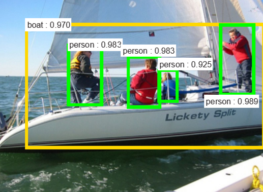
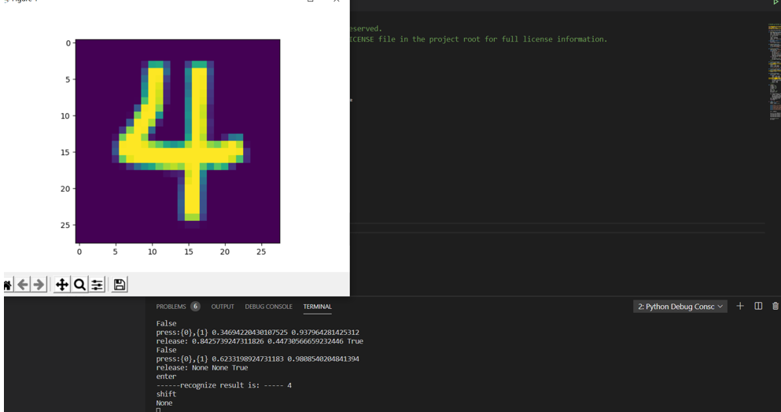
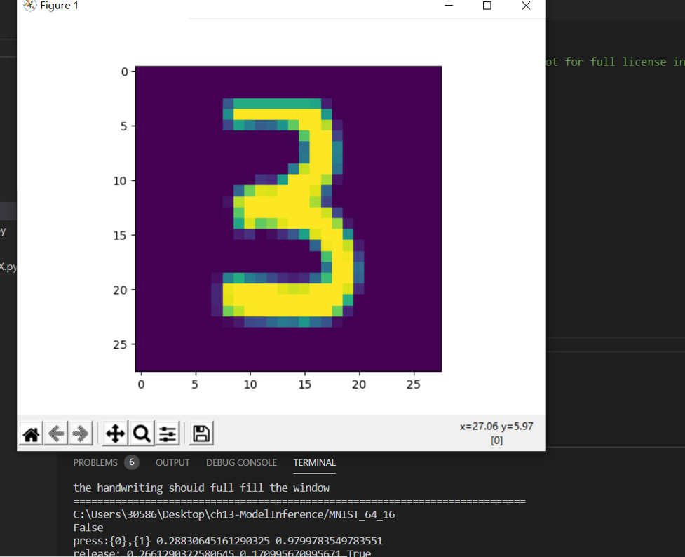

# 实验

##  卷积神经网络

卷积神经网络在图像识别和分类领域中取得了非常好的效果。
这就为机器人、自动驾驶等应用提供了坚实的技术基础。
卷积神经网络原理介绍

### CNN卷积神经网络识别图片步骤：

卷积层初步提取特征

池化层提取主要特征

全连接层将各部分特征汇总

产生分类器，进行预测识别

在下面图1$^{[1]}$和图2中$^{[1]}$，卷积神经网络展现了识别人类日常生活中的各种物体的能力。





图3 两匹斑马


图4 两个骑车人

卷积神经网络可以识别出上面两张图中的物体和场景，图17-3$^{[2]}$是“两匹斑马站在泥地上”，图17-4$^{[2]}$是“一个在道路上骑车的男人旁边还有个女人”。当然，识别物体和给出简要的场景描述是两套系统配合才能完成的任务，第一个系统只负责识别，第二个系统可以根据第一个系统的输出形成摘要文字。

###  卷积神经网络的典型结构

一个典型的卷积神经网络的结构如图17-5所示。


图5 卷积神经网络的典型结构图

我们分析一下它的层级结构：

1. 原始的输入是一张图片，可以是彩色的，也可以是灰度的或黑白的。这里假设是只有一个通道的图片，目的是识别0~9的手写体数字；
2. 第一层卷积，我们使用了4个卷积核，得到了4张feature map；激活函数层没有单独画出来，这里我们紧接着卷积操作使用了Relu激活函数；
3. 第二层是池化，使用了Max Pooling方式，把图片的高宽各缩小一倍，但仍然是4个feature map；
4. 第三层卷积，我们使用了4x6个卷积核，其中4对应着输入通道，6对应着输出通道，从而得到了6张feature map，当然也使用了Relu激活函数；
5. 第四层再次做一次池化，现在得到的图片尺寸只是原始尺寸的四分之一左右；
6. 第五层把第四层的6个图片展平成一维，成为一个fully connected层；
7. 第六层再接一个小一些的fully connected层；
8. 最后接一个softmax函数，判别10个分类。

所以，在一个典型的卷积神经网络中，会至少包含以下几个层：

- 卷积层
- 激活函数层
- 池化层
- 全连接分类层

我们会在后续的小节中讲解卷积层和池化层的具体工作原理。

###  卷积核的作用

我们遇到了一个新的概念：卷积核。卷积网络之所以能工作，完全是卷积核的功劳。什么是卷积核呢？卷积核其实就是一个小矩阵，类似这样：

```
1.1  0.23  -0.45
0.1  -2.1   1.24
0.74 -1.32  0.01
```

这是一个3x3的卷积核，还会有1x1、5x5、7x7、9x9、11x11的卷积核。在卷积层中，我们会用输入数据与卷积核相乘，得到输出数据，就类似全连接层中的Weights一样，所以卷积核里的数值，也是通过反向传播的方法学习到的。

下面我们看看卷积核的具体作用。


图17-6 卷积核的作用

图17-6中所示的内容，是使用9个不同的卷积核在同一张图上运算后得到的结果，而表17-1中按顺序列出了9个卷积核的数值和名称，可以一一对应到上面的9张图中。

表17-1 卷积的效果

||1|2|3|
|---|---|---|---|
|1|0,-1, 0<br>-1, 5,-1<br>0,-1, 0|0, 0, 0 <br> -1, 2,-1 <br> 0, 0, 0|1, 1, 1 <br> 1,-9, 1 <br> 1, 1, 1|
||sharpness|vertical edge|surround|
|2|-1,-2, -1 <br> 0, 0, 0<br>1, 2, 1|0, 0, 0 <br> 0, 1, 0 <br> 0, 0, 0|0,-1, 0 <br> 0, 2, 0 <br> 0,-1, 0|
||sobel y|nothing|horizontal edge|
|3|0.11,0.11,0.11 <br>0.11,0.11,0.11<br>0.11,0.11,0.11|-1, 0, 1 <br> -2, 0, 2 <br> -1, 0, 1|2, 0, 0 <br> 0,-1, 0 <br> 0, 0,-1|
||blur|sobel x|embossing|


### 卷积后续的运算

前面我们认识到了卷积核的强大能力，卷积神经网络通过反向传播而令卷积核自我学习，找到分布在图片中的不同的feature，最后形成的卷积核中的数据。但是如果想达到这种效果，只有卷积层的话是不够的，还需要激活函数、池化等操作的配合。

图17-7中的四个子图，依次展示了：

1. 原图
2. 卷积结果
3. 激活结果
4. 池化结果


图17-7 原图经过卷积-激活-池化操作后的效果

1. 注意图一是原始图片，用cv2读取出来的图片，其顺序是反向的，即：

- 第一维是高度
- 第二维是宽度
- 第三维是彩色通道数，但是其顺序为BGR，而不是常用的RGB

1. 我们对原始图片使用了一个3x1x3x3的卷积核，因为原始图片为彩色图片，所以第一个维度是3，对应RGB三个彩色通道；我们希望只输出一张feature map，以便于说明，所以第二维是1；我们使用了3x3的卷积核，用的是sobel x算子。所以图二是卷积后的结果。

2. 图三做了一层Relu激活计算，把小于0的值都去掉了，只留下了一些边的特征。

3. 图四是图三的四分之一大小，虽然图片缩小了，但是特征都没有丢失，反而因为图像尺寸变小而变得密集，亮点的密度要比图三大而粗。

### 卷积神经网络的学习





###  GRU 的基本概念

LSTM 存在很多变体，其中门控循环单元（Gated Recurrent Unit, GRU）是最常见的一种，也是目前比较流行的一种。GRU是由 [Cho](https://arxiv.org/pdf/1406.1078v3.pdf) 等人在2014年提出的，它对LSTM做了一些简化：

1. GRU将LSTM原来的三个门简化成为两个：重置门 $r_t$（Reset Gate）和更新门 $z_t$ (Update Gate)。
2. GRU不保留单元状态 $c_t$，只保留隐藏状态 $h_t$作为单元输出，这样就和传统RNN的结构保持一致。
3. 重置门直接作用于前一时刻的隐藏状态 $h_{t-1}$。


### GRU的前向计算

#### GRU的单元结构

图20-7展示了GRU的单元结构。


图20-7 GRU单元结构图

GRU单元的前向计算公式如下：

1. 更新门

   $$
   z_t = \sigma(h_{t-1} \cdot W_z + x_t \cdot U_z)
   \tag{1}
   $$

2. 重置门

   $$
   r_t = \sigma(h_{t-1} \cdot W_r + x_t \cdot U_r)
   \tag{2}
   $$

3. 候选隐藏状态

    $$
   \tilde h_t = \tanh((r_t \circ h_{t-1}) \cdot W_h + x_t \cdot U_h)
   \tag{3}
   $$

4. 隐藏状态

   $$
   h = (1 - z_t) \circ h_{t-1} + z_t \circ \tilde{h}_t
   \tag{4}
   $$

#### GRU的原理浅析

从上面的公式可以看出，GRU通过更新们和重置门控制长期状态的遗忘和保留，以及当前输入信息的选择。更新门和重置门通过$sigmoid$函数，将输入信息映射到$[0,1]$区间，实现门控功能。

首先，上一时刻的状态$h_{t-1}$通过重置门，加上当前时刻输入信息，共同构成当前时刻的即时状态$\tilde{h}_t$，并通过$\tanh$函数映射到$[-1,1]$区间。

然后，通过更新门实现遗忘和记忆两个部分。从隐藏状态的公式可以看出，通过$z_t$进行选择性的遗忘和记忆。$(1-z_t)$和$z_t$有联动关系，上一时刻信息遗忘的越多，当前信息记住的就越多，实现了LSTM中$f_t$和$i_t$的功能。

20.3.4 代码实现

本节进行了GRU网络单元前向计算和反向传播的实现。为了统一和简单，测试用例依然是二进制减法。

#### 初始化

本案例实现了没有bias的GRU单元，只需初始化输入维度和隐层维度。

```Python
def __init__(self, input_size, hidden_size):
        self.input_size = input_size
        self.hidden_size = hidden_size
```

#### 前向计算

```Python
def forward(self, x, h_p, W, U):
    self.get_params(W, U)
    self.x = x

    self.z = Sigmoid().forward(np.dot(h_p, self.wz) + np.dot(x, self.uz))
    self.r = Sigmoid().forward(np.dot(h_p, self.wr) + np.dot(x, self.ur))
    self.n = Tanh().forward(np.dot((self.r * h_p), self.wn) + np.dot(x, self.un))
    self.h = (1 - self.z) * h_p + self.z * self.n

def split_params(self, w, size):
        s=[]
        for i in range(3):
            s.append(w[(i*size):((i+1)*size)])
        return s[0], s[1], s[2]

# Get shared parameters, and split them to fit 3 gates, in the order of z, r, \tilde{h} (n stands for \tilde{h} in code)
def get_params(self, W, U):
    self.wz, self.wr, self.wn = self.split_params(W, self.hidden_size)
    self.uz, self.ur, self.un = self.split_params(U, self.input_size)
```

#### 反向传播

```Python
def backward(self, h_p, in_grad):
    self.dzz = in_grad * (self.n - h_p) * self.z * (1 - self.z)
    self.dzn = in_grad * self.z * (1 - self.n * self.n)
    self.dzr = np.dot(self.dzn, self.wn.T) * h_p * self.r * (1 - self.r)

    self.dwn = np.dot((self.r * h_p).T, self.dzn)
    self.dun = np.dot(self.x.T, self.dzn)
    self.dwr = np.dot(h_p.T, self.dzr)
    self.dur = np.dot(self.x.T, self.dzr)
    self.dwz = np.dot(h_p.T, self.dzz)
    self.duz = np.dot(self.x.T, self.dzz)

    self.merge_params()

    # pass to previous time step
    self.dh = in_grad * (1 - self.z) + np.dot(self.dzn, self.wn.T) * self.r + np.dot(self.dzr, self.wr.T) + np.dot(self.dzz, self.wz.T)
    # pass to previous layer
    self.dx = np.dot(self.dzn, self.un.T) + np.dot(self.dzr, self.ur.T) + np.dot(self.dzz, self.uz.T)
```

我们将所有拆分的参数merge到一起，便于更新梯度。

```Python
def merge_params(self):
    self.dW = np.concatenate((self.dwz, self.dwr, self.dwn), axis=0)
    self.dU = np.concatenate((self.duz, self.dur, self.dun), axis=0)

```
###  最终结果


## 学习心得
1.往后学习，准确率越高。
2.运行非常占内存。
3.卷积层的作用就是提取图片每个小部分里具有的特征。
4.池化层可以减少训练参数的数量，只保留最有用的图片信息。

