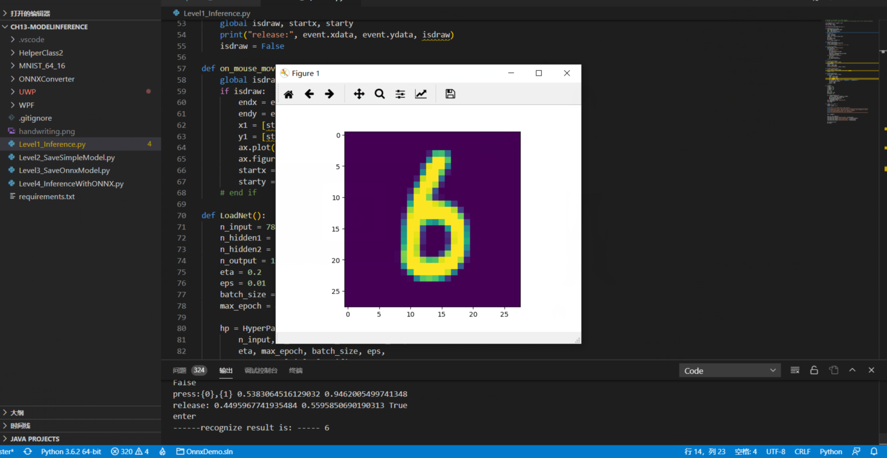

# 报告

## 符号约定

|符号|含义|
|---|---|
|$x$|训练用样本值|
|$x_1$|第一个样本或样本的第一个特征值，在上下文中会有说明|
|$x_{12},x_{1,2}$|第1个样本的第2个特征值|
|$X$|训练用多样本矩阵|
|$y$|训练用样本标签值|
|$y_1$|第一个样本的标签值|
|$Y$|训练用多样本标签矩阵|
|$z$|线性运算的结果值|
|$Z$|线性运算的结果矩阵|
|$Z1$|第一层网络的线性运算结果矩阵|
|$\sigma$|激活函数|
|$a$|激活函数结果值|
|$A$|激活函数结果矩阵|
|$A1$|第一层网络的激活函数结果矩阵|
|$w$|权重参数值|
|$w_{12},w_{1,2}$|权重参数矩阵中的第1行第2列的权重值|
|$w1_{12},w1_{1,2}$|第一层网络的权重参数矩阵中的第1行第2列的权重值|
|$W$|权重参数矩阵|
|$W1$|第一层网络的权重参数矩阵|
|$b$|偏移参数值|
|$b_1$|偏移参数矩阵中的第1个偏移值|
|$b2_1$|第二层网络的偏移参数矩阵中的第1个偏移值|
|$B$|偏移参数矩阵（向量）|
|$B1$|第一层网络的偏移参数矩阵（向量）|
|$X^T$|X的转置矩阵|
|$X^{-1}$|X的逆矩阵|
|$loss,loss(w,b)$|单样本误差函数|
|$J, J(w,b)$|多样本损失函数|


## 人工智能发展
- 简单的程序流程图


```    ···中间放图片链接```

-  人工智能发展史


1. 神经元输入分兴奋性输入和抑制性输入两种类型；

2. 神经元具有空间整合特性和阈值特性（兴奋和抑制，超过阈值为兴奋，低于是抑制）；

3. 神经元输入与输出间有固定的时滞，主要取决于突触延搁；

4. 每个神经元都是一个多输入单输出的信息处理单元；
   
   按照生物神经元，我们建立M-P模型
   

   训练AI模型，需要一系列专门的工具，业界有不少成熟的训练平台（TensorFlow，PyTorch，MXNet等），这些平台也在不断演化，支持新的模型，提高训练的效率，改进易用性，等等。
   2015年，AI取得了超过人类的成果。在其它的领域中，我们也看到了AI取得了达到或超过人类最高水平的成绩：

- 翻译领域（微软的中英翻译超过人类）
- 阅读理解（SQuAD 比赛）
- 下围棋（2016）德州扑克（2019）麻将（2019）

- 弱人工智能领域中机器学习部分的内容


## 范式的演化

### 1.2.1 范式演化的四个阶段

#### 第一个阶段：经验
#### 第二个阶段：理论
由伽利略在比萨斜塔做实验，得出真空中自由落体下落的公式：
$$h = \frac{1}{2}gt^{2}$$  
 ```$$ $$  中间放公式 分式命令写法：\frac{分母}{分子}```

#### 第三个阶段：计算仿真
#### 第四个阶段：数据探索

### 范式各阶段的应用

- `智能之门问题`


#### 求和计算 sum

$$
\begin{aligned}
Z &= w_1 \cdot x_1 + w_2 \cdot x_2 + w_3 \cdot x_3 + b \\\\
&= \sum_{i=1}^m(w_i \cdot x_i) + b
\end{aligned}
$$

在上面的例子中 $m=3$。我们把$w_i \cdot x_i$变成矩阵运算的话，就变成了：

$$Z = W \cdot X + b$$

- 神经网络训练流程图


##  线性反向传播

假设有一个函数：

$$z = x \cdot y \tag{1}$$

其中:

$$x = 2w + 3b \tag{2}$$

$$y = 2b + 1 \tag{3}$$


当 $w = 3, b = 4$ 


## 非线性反向传播

- 非线性的反向传播

其中$1<x<=10,0<y<2.15$。假设有5个人分别代表 $x,a,b,c,y$：

正向与反向的迭代计算

|方向|公式|迭代1|迭代2|迭代3|迭代4|迭代5|
|---|---|---|---|---|---|---|
|正向|$x=x-\Delta x$|2|4.243|7.344|9.295|9.665|
|正向|$a=x^2$|4|18.005|53.934|86.404|93.233|
|正向|$b=\ln(a)$|1.386|2.891|3.988|4.459|4.535|
|正向|$c=\sqrt{b}$|1.177|1.700|1.997|2.112|2.129|
||标签值y|2.13|2.13|2.13|2.13|2.13|
|反向|$\Delta c = c - y$|-0.953|-0.430|-0.133|-0.018||
|反向|$\Delta b = \Delta c \cdot 2\sqrt{b}$|-2.243|-1.462|-0.531|-0.078||
|反向|$\Delta a = \Delta b \cdot a$|-8.973|-26.317|-28.662|-6.698||
|反向|$\Delta x = \Delta a / 2x$|-2.243|-3.101|-1.951|-0.360||

代码可以得到如下结果：

```
how to play: 1) input x, 2) calculate c, 3) input target number but not faraway from c
input x as initial number(1.2,10), you can try 1.3:
2
c=1.177410
input y as target number(0.5,2), you can try 1.8:
2.13
forward...
x=2.000000,a=4.000000,b=1.386294,c=1.177410
backward...
delta_c=-0.952590, delta_b=-2.243178, delta_a=-8.972712, delta_x=-2.243178
......
forward...
x=9.655706,a=93.232666,b=4.535098,c=2.129577
backward...
done!
```

第一步时`c=1.177410`，最后一步时`c=2.129577`，停止迭代。


##  损失函数概论

## 概念

在各种材料中经常看到的中英文词汇有：误差，偏差，Error，Cost，Loss，损失，代价......意思都差不多，在本书中，使用“损失函数”和“Loss Function”这两个词汇，具体的损失函数符号用 $J$ 来表示，误差值用 $loss$ 表示。

“损失”就是所有样本的“误差”的总和，亦即（$m$ 为样本数）：

$$损失 = \sum^m_{i=1}误差_i$$

$$J = \sum_{i=1}^m loss_i$$


### 损失函数的作用

损失函数的作用，就是计算神经网络每次迭代的前向计算结果与真实值的差距，从而指导下一步的训练向正确的方向进行。
具体步骤：

1. 用随机值初始化前向计算公式的参数；
2. 代入样本，计算输出的预测值；
3. 用损失函数计算预测值和标签值（真实值）的误差；
4. 根据损失函数的导数，沿梯度最小方向将误差回传，修正前向计算公式中的各个权重值；
5. 进入第2步重复, 直到损失函数值达到一个满意的值就停止迭代。

###  机器学习常用损失函数

符号规则：$a$ 是预测值，$y$ 是样本标签值，$loss$ 是损失函数值。

- Gold Standard Loss，又称0-1误差
$$
loss=\begin{cases}
0 & a=y \\\\
1 & a \ne y 
\end{cases}
$$
``` \begin{cases} 是大括号 ```


#### 用二维函数图像理解单变量对损失函数的影响

- 单变量的损失函数图


##  均方差函数

均方差函数常用于线性回归(linear regression)，即函数拟合(function fitting)。公式如下：

$$
loss = {1 \over 2}(z-y)^2 \tag{单样本}
$$

$$
J=\frac{1}{2m} \sum_{i=1}^m (z_i-y_i)^2 \tag{多样本}
$$


### 实际案例

假设有一组数据图，我们想找到一条拟合的直线。


前三张显示了一个逐渐找到最佳拟合直线的过程。


- 第一张，用均方差函数计算得到 $Loss=0.53$；
- 第二张，直线向上平移一些，误差计算 $Loss=0.16$，比图一的误差小很多；
- 第三张，又向上平移了一些，误差计算 $Loss=0.048$，此后还可以继续尝试平移（改变 $b$ 值）或者变换角度（改变 $w$ 值），得到更小的损失函数值；
- 第四张，偏离了最佳位置，误差值 $Loss=0.18$，这种情况，算法会让尝试方向反向向下。

我们假设该拟合直线的方程是 $y=2x+3$，当我们固定 $w=2$，把 $b$ 值从 $2$ 到 $4$ 变化时，损失函数值的变化
如图


#### 损失函数值的2D示意图

损失函数的等高线图


用代码来表示：

```Python
    s = 200
    W = np.linspace(w-2,w+2,s)
    B = np.linspace(b-2,b+2,s)
    LOSS = np.zeros((s,s))
    for i in range(len(W)):
        for j in range(len(B)):
            z = W[i] * x + B[j]
            loss = CostFunction(x,y,z,m)
            LOSS[i,j] = round(loss, 2)
```
上述代码针对每个 $(w,b)$ 组合计算出了一个损失值，保留小数点后2位，放在`LOSS`矩阵中：
```
[[4.69 4.63 4.57 ... 0.72 0.74 0.76]
 [4.66 4.6  4.54 ... 0.73 0.75 0.77]
 [4.62 4.56 4.5  ... 0.73 0.75 0.77]
 ...
 [0.7  0.68 0.66 ... 4.57 4.63 4.69]
 [0.69 0.67 0.65 ... 4.6  4.66 4.72]
 [0.68 0.66 0.64 ... 4.63 4.69 4.75]]
```

当我们把所有值为0.72的点绘制成红色，把所有值为0.75的点绘制成蓝色


##  交叉熵损失函数
交叉熵是Shannon信息论中一个重要概念，主要用于度量两个概率分布间的差异性信息。在信息论中，交叉熵是表示两个概率分布 $p,q$ 的差异，其中 $p$ 表示真实分布，$q$ 表示预测分布，那么 $H(p,q)$ 就称为交叉熵：

$$H(p,q)=\sum_i p_i \cdot \ln {1 \over q_i} = - \sum_i p_i \ln q_i \tag{1}$$


#### 熵

$$H(p) = - \sum_j^n p(x_j) \ln (p(x_j)) \tag{3}$$

则上面的问题的熵是：

$$
\begin{aligned}  
H(p)&=-[p(x_1) \ln p(x_1) + p(x_2) \ln p(x_2) + p(x_3) \ln p(x_3)] \\\\
&=0.7 \times 0.36 + 0.2 \times 1.61 + 0.1 \times 2.30 \\\\
&=0.804
\end{aligned}
$$

###  二分类问题交叉熵
- 二分类交叉熵损失函数图


二分类对于批量样本的交叉熵计算公式是：

$$J= - \sum_{i=1}^m [y_i \ln a_i + (1-y_i) \ln (1-a_i)] \tag{1}$$
把公式1分解开两种情况，当 $y=1$ 时，即标签值是 $1$，是个正例，加号后面的项为 $0$：
$$loss = -\ln(a) \tag{2}$$


# Markdown数学公式语法

- 行内与独行:

1. 行内公式：将公式插入到本行内，符号：$公式内容$，如：$xyz$
2. 独行公式：将公式插入到新的一行内，并且居中，符号：$$公式内容$$，如：$$xyz$$

- 上标、下标与组合
  
1. 上标符号，符号：^，如：$x^4$
2. 下标符号，符号：_，如：$x_1$
3. 组合符号，符号：{}，如：${16}_{8}O{2+}_{2}$

- 汉字、字体与格式
1. 汉字形式，符号：\mbox{}，如：$V_{\mbox{初始}}$
2. 字体控制，符号：\displaystyle，如：$\displaystyle \frac{x+y}{y+z}$
3. 下划线符号，符号：\underline，如：$\underline{x+y}$
4. 标签，符号\tag{数字}，如：$\tag{11}$
5. 上大括号，符号：\overbrace{算式}，如：$\overbrace{a+b+c+d}^{2.0}$
6. 下大括号，符号：\underbrace{算式}，如：$a+\underbrace{b+c}_{1.0}+d$
7. 上位符号，符号：\stacrel{上位符号}{基位符号}，如：$\vec{x}\stackrel{\mathrm{def}}{=}{x_1,\dots,x_n}$

- 占位符
1. 两个quad空格，符号：\qquad，如：$x \qquad y$
2. quad空格，符号：\quad，如：$x \quad y$
3. 大空格，符号\，如：$x \ y$
4. 中空格，符号\:，如：$x : y$
5. 小空格，符号\,，如：$x , y$
6. 没有空格，符号``，如：$xy$
7. 紧贴，符号\!，如：$x ! y$

- 定界符与组合
1. 括号，符号：（）\big(\big) \Big(\Big) \bigg(\bigg) \Bigg(\Bigg)，如：$（）\big(\big) \Big(\Big) \bigg(\bigg) \Bigg(\Bigg)$
2. 中括号，符号：[]，如：$[x+y]$
3. 大括号，符号：\{ \}，如：${x+y}$
4. 自适应括号，符号：\left \right，如：$\left(x\right)$，$\left(x{yz}\right)$
5. 组合公式，符号：{上位公式 \choose 下位公式}，如：${n+1 \choose k}={n \choose k}+{n \choose k-1}$
6. 组合公式，符号：{上位公式 \atop 下位公式}，如：$\sum_{k_0,k_1,\ldots>0 \atop k_0+k_1+\cdots=n}A_{k_0}A_{k_1}\cdots$

- 四则运算
1. 加法运算，符号：+，如：$x+y=z$
2. 减法运算，符号：-，如：$x-y=z$
3. 加减运算，符号：\pm，如：$x \pm y=z$
4. 减甲运算，符号：\mp，如：$x \mp y=z$
5. 乘法运算，符号：\times，如：$x \times y=z$
6. 点乘运算，符号：\cdot，如：$x \cdot y=z$
7. 星乘运算，符号：\ast，如：$x \ast y=z$
8. 除法运算，符号：\div，如：$x \div y=z$
9. 斜法运算，符号：/，如：$x/y=z$
10. 分式表示，符号：\frac{分子}{分母}，如：$\frac{x+y}{y+z}$
11. 分式表示，符号：{分子} \voer {分母}，如：${x+y} \over {y+z}$
12. 绝对值表示，符号：||，如：$|x+y|$

- 高级运算
1. 平均数运算，符号：\overline{算式}，如：$\overline{xyz}$
2. 开二次方运算，符号：\sqrt，如：$\sqrt x$
3. 开方运算，符号：\sqrt[开方数]{被开方数}，如：$\sqrt[3]{x+y}$
4. 对数运算，符号：\log，如：$\log(x)$
5. 极限运算，符号：\lim，如：$\lim^{x \to \infty}_{y \to 0}{\frac{x}{y}}$
6. 极限运算，符号：\displaystyle \lim，如：$\displaystyle \lim^{x \to \infty}_{y \to 0}{\frac{x}{y}}$
7. 求和运算，符号：\sum，如：$\sum^{x \to \infty}_{y \to 0}{\frac{x}{y}}$
8. 求和运算，符号：\displaystyle \sum，如：$\displaystyle \sum^{x \to \infty}_{y \to 0}{\frac{x}{y}}$
9. 积分运算，符号：\int，如：$\int^{\infty}_{0}{xdx}$
10. 积分运算，符号：\displaystyle \int，如：$\displaystyle \int^{\infty}_{0}{xdx}$
11. 微分运算，符号：\partial，如：$\frac{\partial x}{\partial y}$
12. 矩阵表示，符号：\begin{matrix} \end{matrix}，如：$\left[ \begin{matrix} 1 &2 &\cdots &4\5 &6 &\cdots &8\\vdots &\vdots &\ddots &\vdots\13 &14 &\cdots &16\end{matrix} \right]$


## 线性回归

用线性回归作为学习神经网络的起点，是一个非常好的选择，因为线性回归问题本身比较容易理解，在它的基础上，逐步的增加一些新的知识点，会形成一条比较平缓的学习曲线，或者说是迈向神经网络的第一个小台阶。

单层的神经网络，其实就是一个神经元，可以完成一些线性的工作，比如拟合一条直线，这用一个神经元就可以实现。当这个神经元只接收一个输入时，就是单变量线性回归，可以在二维平面上用可视化方法理解。当接收多个变量输入时，叫做多变量线性回归，此时可视化方法理解就比较困难了，通常我们会用变量两两组对的方式来表现。

当变量多于一个时，两个变量的量纲和数值有可能差别很大，这种情况下，我们通常需要对样本特征数据做归一化，然后把数据喂给神经网络进行训练，否则会出现“消化不良”的情况。

## 最小二乘法
最小二乘法是一种在误差估计、不确定度、系统辨识及预测、预报等数据处理诸多学科领域得到广泛应用的数学工具

### 定义
最小二乘法，也叫做最小平方法（Least Square），它通过最小化误差的平方和寻找数据的最佳函数匹配。利用最小二乘法可以简便地求得未知的数据，并使得这些求得的数据与实际数据之间误差的平方和为最小。最小二乘法还可用于曲线拟合。其他一些优化问题也可通过最小化能量或最小二乘法来表达。

最小二乘法是解决曲线拟合问题最常用的方法。其基本思路是：令


### 数学原理
线性回归试图学得：

$$z_i=w \cdot x_i+b \tag{1}$$

使得：

$$z_i \simeq y_i \tag{2}$$

其中，$x_i$ 是样本特征值，$y_i$ 是样本标签值，$z_i$ 是模型预测值。

``` z_i的意思是Z左下为i  \cdot 为乘法 \simeq为约号```

均方差是回归任务中常用的手段：
$$
J = \frac{1}{2m}\sum_{i=1}^m(z_i-y_i)^2 = \frac{1}{2m}\sum_{i=1}^m(y_i-wx_i-b)^2 \tag{3}
$$

```   $\sum_{i=0}^n$是求和上下标    ```

- 均方差函数的评估原理


推导过程如下：

$$
\begin{aligned}
\frac{\partial{J}}{\partial{w}} &=\frac{\partial{(\frac{1}{2m}\sum_{i=1}^m(y_i-wx_i-b)^2)}}{\partial{w}} \\\\
&= \frac{1}{m}\sum_{i=1}^m(y_i-wx_i-b)(-x_i) 
\end{aligned}
\tag{4}
$$

令公式4为 $0$：

$$
\sum_{i=1}^m(y_i-wx_i-b)x_i=0 \tag{5}
$$

$$
\begin{aligned}
\frac{\partial{J}}{\partial{b}} &=\frac{\partial{(\frac{1}{2m}\sum_{i=1}^m(y_i-wx_i-b)^2)}}{\partial{b}} \\\\
&=\frac{1}{m}\sum_{i=1}^m(y_i-wx_i-b)(-1) 
\end{aligned}
\tag{6}
$$

令公式6为 $0$：

$$
\sum_{i=1}^m(y_i-wx_i-b)=0 \tag{7}
$$

由式7得到（假设有 $m$ 个样本）：

$$
\sum_{i=1}^m b = m \cdot b = \sum_{i=1}^m{y_i} - w\sum_{i=1}^m{x_i} \tag{8}
$$

两边除以 $m$：

$$
b = \frac{1}{m}\left(\sum_{i=1}^m{y_i} - w\sum_{i=1}^m{x_i}\right)=\bar y-w \bar x \tag{9}
$$

其中：

$$
\bar y = \frac{1}{m}\sum_{i=1}^m y_i, \bar x=\frac{1}{m}\sum_{i=1}^m x_i \tag{10}
$$

将公式10代入公式5：

$$
\sum_{i=1}^m(y_i-wx_i-\bar y + w \bar x)x_i=0
$$

$$
\sum_{i=1}^m(x_i y_i-wx^2_i-x_i \bar y + w \bar x x_i)=0
$$

$$
\sum_{i=1}^m(x_iy_i-x_i \bar y)-w\sum_{i=1}^m(x^2_i - \bar x x_i) = 0
$$

$$
w = \frac{\sum_{i=1}^m(x_iy_i-x_i \bar y)}{\sum_{i=1}^m(x^2_i - \bar x x_i)} \tag{11}
$$

将公式10代入公式11：

$$
w = \frac{\sum_{i=1}^m (x_i \cdot y_i) - \sum_{i=1}^m x_i \cdot \frac{1}{m} \sum_{i=1}^m y_i}{\sum_{i=1}^m x^2_i - \sum_{i=1}^m x_i \cdot \frac{1}{m}\sum_{i=1}^m x_i} \tag{12}
$$

分子分母都乘以 $m$：

$$
w = \frac{m\sum_{i=1}^m x_i y_i - \sum_{i=1}^m x_i \sum_{i=1}^m y_i}{m\sum_{i=1}^m x^2_i - (\sum_{i=1}^m x_i)^2} \tag{13}
$$

$$
b= \frac{1}{m} \sum_{i=1}^m(y_i-wx_i) \tag{14}
$$

而事实上，式13有很多个变种，大家会在不同的文章里看到不同版本，往往感到困惑，比如下面两个公式也是正确的解：

$$
w = \frac{\sum_{i=1}^m y_i(x_i-\bar x)}{\sum_{i=1}^m x^2_i - (\sum_{i=1}^m x_i)^2/m} \tag{15}
$$

$$
w = \frac{\sum_{i=1}^m x_i(y_i-\bar y)}{\sum_{i=1}^m x^2_i - \bar x \sum_{i=1}^m x_i} \tag{16}
$$

以上两个公式，如果把公式10代入，也应该可以得到和式13相同的答案，只不过需要一些运算技巧。比如，很多人不知道这个神奇的公式：

$$
\begin{aligned}
\sum_{i=1}^m (x_i \bar y) &= \bar y \sum_{i=1}^m x_i =\frac{1}{m}(\sum_{i=1}^m y_i) (\sum_{i=1}^m x_i) \\\\
&=\frac{1}{m}(\sum_{i=1}^m x_i) (\sum_{i=1}^m y_i)= \bar x \sum_{i=1}^m y_i \\\\
&=\sum_{i=1}^m (y_i \bar x) 
\end{aligned}
\tag{17}
$$


可以用`python`代码实现以上计算过程：
## 计算$w$值

```python
# 根据公式15
def method1(X,Y,m):
    x_mean = X.mean()
    p = sum(Y*(X-x_mean))
    q = sum(X*X) - sum(X)*sum(X)/m
    w = p/q
    return w

# 根据公式16
def method2(X,Y,m):
    x_mean = X.mean()
    y_mean = Y.mean()
    p = sum(X*(Y-y_mean))
    q = sum(X*X) - x_mean*sum(X)
    w = p/q
    return w

# 根据公式13
def method3(X,Y,m):
    p = m*sum(X*Y) - sum(X)*sum(Y)
    q = m*sum(X*X) - sum(X)*sum(X)
    w = p/q
    return w
```

## 计算$b$值

```Python
# 根据公式14
def calculate_b_1(X,Y,w,m):
    b = sum(Y-w*X)/m
    return b

# 根据公式9
def calculate_b_2(X,Y,w):
    b = Y.mean() - w * X.mean()
    return b
```
###  运算结果

用以上几种方法，最后得出的结果都是一致的，可以起到交叉验证的作用：

```
w1=2.056827, b1=2.965434
w2=2.056827, b2=2.965434
w3=2.056827, b3=2.965434
```

## 4.2 梯度下降法

有了上一节的最小二乘法做基准，我们这次用梯度下降法求解 $w$ 和 $b$，从而可以比较二者的结果。

### 4.2.1 数学原理

在下面的公式中，我们规定 $x$ 是样本特征值（单特征），$y$ 是样本标签值，$z$ 是预测值，下标 $i$ 表示其中一个样本。

#### 预设函数（Hypothesis Function）

线性函数：

$$z_i = x_i \cdot w + b \tag{1}$$

#### 损失函数（Loss Function）

均方误差：

$$loss_i(w,b) = \frac{1}{2} (z_i-y_i)^2 \tag{2}$$


与最小二乘法比较可以看到，梯度下降法和最小二乘法的模型及损失函数是相同的，都是一个线性模型加均方差损失函数，模型用于拟合，损失函数用于评估效果。

区别在于，最小二乘法从损失函数求导，直接求得数学解析解，而梯度下降以及后面的神经网络，都是利用导数传递误差，再通过迭代方式一步一步（用近似解）逼近真实解。

### 梯度计算

### 计算z的梯度
根据公式2：
$$
\frac{\partial loss}{\partial z_i}=z_i - y_i \tag{3}
$$

#### 计算 $w$ 的梯度

我们用 $loss$ 的值作为误差衡量标准，通过求 $w$ 对它的影响，也就是 $loss$ 对 $w$ 的偏导数，来得到 $w$ 的梯度。由于 $loss$ 是通过公式2->公式1间接地联系到 $w$ 的，所以我们使用链式求导法则，通过单个样本来求导。

根据公式1和公式3：

$$
\frac{\partial{loss}}{\partial{w}} = \frac{\partial{loss}}{\partial{z_i}}\frac{\partial{z_i}}{\partial{w}}=(z_i-y_i)x_i \tag{4}
$$

#### 计算 $b$ 的梯度

$$
\frac{\partial{loss}}{\partial{b}} = \frac{\partial{loss}}{\partial{z_i}}\frac{\partial{z_i}}{\partial{b}}=z_i-y_i \tag{5}
$$

### 代码实现

```Python
if __name__ == '__main__':

    reader = SimpleDataReader()
    reader.ReadData()
    X,Y = reader.GetWholeTrainSamples()

    eta = 0.1
    w, b = 0.0, 0.0
    for i in range(reader.num_train):
        # get x and y value for one sample
        xi = X[i]
        yi = Y[i]
        # 公式1
        zi = xi * w + b
        # 公式3
        dz = zi - yi
        # 公式4
        dw = dz * xi
        # 公式5
        db = dz
        # update w,b
        w = w - eta * dw
        b = b - eta * db

    print("w=", w)    
    print("b=", b)
```


运行结果：
```
w= [1.71629006]
b= [3.19684087]
```


## 神经网络法
神经网络做线性拟合的原理，即：
1. 初始化权重值
2. 根据权重值放出一个解
3. 根据均方差函数求误差
4. 误差反向传播给线性计算部分以调整权重值
5. 是否满足终止条件？不满足的话跳回2

- 单层单点神经元


#### 输入层

#### 权重 $w,b$
  因为是一元线性问题，所以 $w,b$ 都是标量。
#### 输出层

输出层 $1$ 个神经元，线性预测公式是：

$$z_i = x_i \cdot w + b$$

$z$ 是模型的预测输出，$y$ 是实际的样本标签值，下标 $i$ 为样本。

#### 损失函数

因为是线性回归问题，所以损失函数使用均方差函数。

$$loss(w,b) = \frac{1}{2} (z_i-y_i)^2$$

###  反向传播

由于我们使用了和上一节中的梯度下降法同样的数学原理，所以反向传播的算法也是一样的，细节请查看4.2.2。

#### 计算 $w$ 的梯度

$$
{\partial{loss} \over \partial{w}} = \frac{\partial{loss}}{\partial{z_i}}\frac{\partial{z_i}}{\partial{w}}=(z_i-y_i)x_i
$$

#### 计算 $b$ 的梯度

$$
\frac{\partial{loss}}{\partial{b}} = \frac{\partial{loss}}{\partial{z_i}}\frac{\partial{z_i}}{\partial{b}}=z_i-y_i
$$

```Python
class NeuralNet(object):
    def __init__(self, eta):
        self.eta = eta
        self.w = 0
        self.b = 0
```
`NeuralNet`类从`object`类派生，并具有初始化函数，其参数是`eta`，也就是学习率，需要调用者指定。另外两个成员变量是`w`和`b`，初始化为`0`。

#### 反向传播

下面的代码是通过梯度下降法中的公式推导而得的，也设计成私有方法：

```Python
    def __backward(self, x,y,z):
        dz = z - y
        db = dz
        dw = x * dz
        return dw, db
```
`dz`是中间变量，避免重复计算。`dz`又可以写成`delta_Z`，是当前层神经网络的反向误差输入。

#### 梯度更新

```Python
    def __update(self, dw, db):
        self.w = self.w - self.eta * dw
        self.b = self.b - self.eta * db
```

每次更新好新的`w`和`b`的值以后，直接存储在成员变量中，方便下次迭代时直接使用，不需要在全局范围当作参数内传来传去的。

### 运行结果可视化

打印输出结果：

```
w=1.716290,b=3.196841
result= [3.79067723]
```

结果显示函数：

```Python
def ShowResult(net, dataReader):
    ......
```

- 拟合效果
- 


## 多样本单特征值计算
单样本计算有一些缺点：

1. 前后两个相邻的样本很有可能会对反向传播产生相反的作用而互相抵消。假设样本1造成了误差为 $0.5$，$w$ 的梯度计算结果是 $0.1$；紧接着样本2造成的误差为 $-0.5$，$w$ 的梯度计算结果是 $-0.1$，那么前后两次更新 $w$ 就会产生互相抵消的作用。
2. 在样本数据量大时，逐个计算会花费很长的时间。由于我们在本例中样本量不大（200个样本），所以计算速度很快，觉察不到这一点。在实际的工程实践中，动辄10万甚至100万的数据量，轮询一次要花费很长的时间。

### 前向计算
由于有多个样本同时计算，所以我们使用 $x_i$ 表示第 $i$ 个样本，$X$ 是样本组成的矩阵，$Z$ 是计算结果矩阵，$w$ 和 $b$ 都是标量：

$$
Z = X \cdot w + b \tag{1}
$$

把它展开成3个样本（3行，每行代表一个样本）的形式：

$$
X=\begin{pmatrix}
    x_1 \\\\ 
    x_2 \\\\ 
    x_3
\end{pmatrix}
$$

$$
Z= 
\begin{pmatrix}
    x_1 \\\\ 
    x_2 \\\\ 
    x_3
\end{pmatrix} \cdot w + b 
=\begin{pmatrix}
    x_1 \cdot w + b \\\\ 
    x_2 \cdot w + b \\\\ 
    x_3 \cdot w + b
\end{pmatrix}
=\begin{pmatrix}
    z_1 \\\\ 
    z_2 \\\\ 
    z_3
\end{pmatrix} \tag{2}
$$

根据公式1和公式2，我们的前向计算`Python`代码可以写成：

```Python
    def __forwardBatch(self, batch_x):
        Z = np.dot(batch_x, self.w) + self.b
        return Z
```

### 损失函数
用传统的均方差函数，其中，$z$ 是每一次迭代的预测输出，$y$ 是样本标签数据。我们使用 $m$ 个样本参与计算，因此损失函数为：

$$J(w,b) = \frac{1}{2m}\sum_{i=1}^{m}(z_i - y_i)^2$$

其中的分母中有个2，实际上是想在求导数时把这个2约掉，没有什么原则上的区别。

我们假设每次有3个样本参与计算，即 $m=3$，则损失函数实例化后的情形是：

$$
\begin{aligned}
J(w,b) &= \frac{1}{2\times3}[(z_1-y_1)^2+(z_2-y_2)^2+(z_3-y_3)^2] \\\\
&=\frac{1}{2\times3}\sum_{i=1}^3[(z_i-y_i)^2]
\end{aligned} 
\tag{3}
$$

公式3中大写的 $Z$ 和 $Y$ 都是矩阵形式，用代码实现：

```Python
    def __checkLoss(self, dataReader):
        X,Y = dataReader.GetWholeTrainSamples()
        m = X.shape[0]
        Z = self.__forwardBatch(X)
        LOSS = (Z - Y)**2
        loss = LOSS.sum()/m/2
        return loss
```

## 梯度下降的三种形式

- 三种方法的结果比较
|方法|$w$|$b$|
|----|----|----|
|最小二乘法|2.056827|2.965434|
|梯度下降法|1.71629006|3.19684087|
|神经网络法|1.71629006|3.19684087|

- 拟合效果


我们使用如下假设，以便简化问题易于理解：

1. 使用可以解决本章的问题的线性回归模型，即 $z=x \cdot w+b$；
2. 样本特征值数量为1，即 $x,w,b$ 都是标量；
3. 使用均方差损失函数。

计算 $w$ 的梯度：

$$
\frac{\partial{loss}}{\partial{w}} = \frac{\partial{loss}}{\partial{z_i}}\frac{\partial{z_i}}{\partial{w}}=(z_i-y_i)x_i
$$

计算 $b$ 的梯度：

$$
\frac{\partial{loss}}{\partial{b}} = \frac{\partial{loss}}{\partial{z_i}}\frac{\partial{z_i}}{\partial{b}}=z_i-y_i
$$

###  单样本随机梯度下降

- 单样本访问方式


假设一共100个样本，每次使用1个样本：

***

$repeat \\{ \\\\ $
$\quad for \quad i=1,2,3,...,100\{ \\\\ $
$\quad \quad z_i = x_i \cdot w + b\\\\ $
$\quad \quad dw= x_i \cdot (z_i - y_i)\\\\ $
$\quad \quad db= z_i - y_i \\\\ $
$\quad \quad w=w-\eta \cdot dw \\\\ $
$\quad \quad db=b-\eta \cdot db \\\\ $
$\\}$

***

#### 特点
  
  - 训练样本：每次使用一个样本数据进行一次训练，更新一次梯度，重复以上过程。
  - 优点：训练开始时损失值下降很快，随机性大，找到最优解的可能性大。
  - 缺点：受单个样本的影响最大，损失函数值波动大，到后期徘徊不前，在最优解附近震荡。不能并行计算。

设置`batch_size=1`，即单样本方式：

```Python
if __name__ == '__main__':
    sdr = SimpleDataReader()
    sdr.ReadData()
    params = HyperParameters(1, 1, eta=0.1, max_epoch=100, batch_size=1, eps = 0.02)
    net = NeuralNet(params)
    net.train(sdr)
```    

# 多入单出的单层神经网络 - 多变量线性回归

## 多变量线性回归问题

影响北京通州房价的因素有很多，居住面积、地理位置、朝向、学区房、周边设施、建筑年份等等，其中，面积和地理位置是两个比较重要的因素。地理位置信息一般采用经纬度方式表示，但是经纬度是两个特征值，联合起来才有意义，因此，我们把它转换成了到通州区中心的距离。

- 样本数据
|样本序号|地理位置|居住面积|价格（万元）|
|---|---|---|---|
|1|10.06|60|302.86|
|2|15.47|74|393.04|
|3|18.66|46|270.67|
|4|5.20|77|450.59|
|...|...|...|...|

- 特征值1 - 地理位置，统计得到：
  - 最大值：21.96公里
  - 最小值：2.02公里
  - 平均值：12.13公里

- 特征值2 - 房屋面积，统计得到：
  - 最大值：119平米
  - 最小值：40平米
  - 平均值：78.9平米

- 标签值 - 房价，单位为百万元：
  - 最大值：674.37
  - 最小值：181.38
  - 平均值：420.64

这个数据是三维的，所以可以用两个特征值作为 $x$ 和 $y$，用标签值作为 $z$

- 样本在三维空间的可视化

|正向|侧向|
|---|---|
|||

## 正规方程解法
最小二乘法可以将误差方程转化为有确定解的代数方程组（其方程式数目正好等于未知数的个数），从而可求解出这些未知参数。这个有确定解的代数方程组称为最小二乘法估计的正规方程（或称为法方程）。

线性参数的误差方程式为:


### 简单的推导方法
在做函数拟合（回归）时，我们假设函数 $H$ 为：

$$H(w,b) = b + x_1 w_1+x_2 w_2+ \dots +x_n w_n \tag{2}$$

令 $b=w_0$，则：

$$H(W) = w_0 + x_1 \cdot w_1 + x_2 \cdot w_2 + \dots + x_n \cdot w_n\tag{3}$$

公式3中的 $x$ 是一个样本的 $n$ 个特征值，如果我们把 $m$ 个样本一起计算，将会得到下面这个矩阵：

$$H(W) = X \cdot W \tag{4}$$

公式5中的 $X$ 和 $W$ 的矩阵形状如下：

$$
X = 
\begin{pmatrix} 
1 & x_{1,1} & x_{1,2} & \dots & x_{1,n} \\\\
1 & x_{2,1} & x_{2,2} & \dots & x_{2,n} \\\\
\vdots & \vdots & \vdots & \ddots & \vdots \\\\
1 & x_{m,1} & x_{m,2} & \dots & x_{m,n}
\end{pmatrix} \tag{5}
$$

$$
W= \begin{pmatrix}
w_0 \\\\
w_1 \\\\
\vdots \\\\
 w_n
\end{pmatrix}  \tag{6}
$$

然后我们期望假设函数的输出与真实值一致，则有：

$$H(W) = X \cdot W = Y \tag{7}$$

其中，Y的形状如下：

$$
Y= \begin{pmatrix}
y_1 \\\\
y_2 \\\\
\vdots \\\\
y_m
\end{pmatrix}  \tag{8}
$$

直观上看，$W = Y/X$，但是这里三个值都是矩阵，而矩阵没有除法，所以需要得到 $X$ 的逆矩阵，用 $Y$ 乘以 $X$ 的逆矩阵即可。但是又会遇到一个问题，只有方阵才有逆矩阵，而 $X$ 不一定是方阵，所以要先把左侧变成方阵，就可能会有逆矩阵存在了。所以，先把等式两边同时乘以 $X$ 的转置矩阵，以便得到 $X$ 的方阵：

$$X^{\top} X W = X^{\top} Y \tag{9}$$

其中，$X^{\top}$ 是 $X$ 的转置矩阵，$ X^{\top}X$ 一定是个方阵，并且假设其存在逆矩阵，把它移到等式右侧来：

$$W = (X^{\top} X)^{-1}{X^{\top} Y} \tag{10}$$

至此可以求出 $W$ 的正规方程。

### 复杂的推导方法
我们仍然使用均方差损失函数（略去了系数$\frac{1}{2m}$）：

$$J(w,b) = \sum_{i=1}^m (z_i - y_i)^2 \tag{11}$$

把 $b$ 看作是一个恒等于 $1$ 的feature，并把 $Z=XW$ 计算公式带入，并变成矩阵形式：

$$J(W) = \sum_{i=1}^m \left(\sum_{j=0}^nx_{ij}w_j -y_i\right)^2=(XW - Y)^{\top} \cdot (XW - Y) \tag{12}$$

对 $W$ 求导，令导数为 $0$，可得到 $W$ 的最小值解：

$$
\begin{aligned}
\frac{\partial J(W)}{\partial W} &= \frac{\partial}{\partial W}[(XW - Y)^{\top} \cdot (XW - Y)] \\\\
&=\frac{\partial}{\partial W}[(W^{\top}X^{\top} - Y^{\top}) \cdot (XW - Y)] \\\\
&=\frac{\partial}{\partial W}[(W^{\top}X^{\top}XW -W^{\top}X^{\top}Y - Y^{\top}XW + Y^{\top}Y)] 
\end{aligned}
\tag{13}
$$

求导后（请参考矩阵/向量求导公式）：

第一项的结果是：$2X^{\top}XW$（分母布局，denominator layout）

第二项的结果是：$X^{\top}Y$（分母布局方式，denominator layout）

第三项的结果是：$X^{\top}Y$（分子布局方式，numerator layout，需要转置$Y^{\top}X$）

第四项的结果是：$0$

再令导数为 $0$：

$$
\frac{\partial J}{\partial W}=2X^{\top}XW - 2X^{\top}Y=0 \tag{14}
$$
$$
X^{\top}XW = X^{\top}Y \tag{15}
$$
$$
W=(X^{\top}X)^{-1}X^{\top}Y \tag{16}
$$


## 代码实现

$$
X = \begin{pmatrix} 
1 & 10.06 & 60 \\\\
1 & 15.47 & 74 \\\\
1 & 18.66 & 46 \\\\
1 & 5.20 & 77 \\\\
\vdots & \vdots & \vdots \\\\
\end{pmatrix} \tag{17}
$$

$$
Y= \begin{pmatrix}
302.86 \\\\
393.04 \\\\
270.67 \\\\
450.59 \\\\
\vdots \\\\
\end{pmatrix}  \tag{18}
$$

根据公式(10)：

$$W = (X^{\top} X)^{-1}{X^{\top} Y} \tag{19}$$

1. $X$ 是 $1000\times 3$ 的矩阵，$X$ 的转置是 $3\times 1000$，$X^{\top}X$ 生成 $3\times 3$ 的矩阵；
2. $(X^{\top}X)^{-1}$ 也是 $3\times 3$ 的矩阵；
3. 再乘以 $X^{\top}$，即 $3\times 3$ 的矩阵乘以 $3\times 1000$ 的矩阵，变成 $3\times 1000$ 的矩阵；
4. 再乘以 $Y$，$Y$是 $1000\times 1$ 的矩阵，所以最后变成 $3\times 1$ 的矩阵，成为 $W$ 的解，其中包括一个偏移值 $b$ 和两个权重值 $w$，3个值在一个向量里。

```Python
if __name__ == '__main__':
    reader = SimpleDataReader()
    reader.ReadData()
    X,Y = reader.GetWholeTrainSamples()
    num_example = X.shape[0]
    one = np.ones((num_example,1))
    x = np.column_stack((one, (X[0:num_example,:])))
    a = np.dot(x.T, x)
    # need to convert to matrix, because np.linalg.inv only works on matrix instead of array
    b = np.asmatrix(a)
    c = np.linalg.inv(b)
    d = np.dot(c, x.T)
    e = np.dot(d, Y)
    #print(e)
    b=e[0,0]
    w1=e[1,0]
    w2=e[2,0]
    print("w1=", w1)
    print("w2=", w2)
    print("b=", b)
    # inference
    z = w1 * 15 + w2 * 93 + b
    print("z=",z)
```

### 运行结果

```
w1= -2.0184092853092226
w2= 5.055333475112755
b= 46.235258613837644
z= 486.1051325196855
```

##  神经网络解法
神经网络是一门重要的机器学习技术。它是目前最为火热的研究方向--深度学习的基础。学习神经网络不仅可以让你掌握一门强大的机器学习方法，同时也可以更好地帮助你理解深度学习技术。

　　本文以一种简单的，循序的方式讲解神经网络。适合对神经网络了解不多的同学。本文对阅读没有一定的前提要求，但是懂一些机器学习基础会更好地帮助理解本文。

　　神经网络是一种模拟人脑的神经网络以期能够实现类人工智能的机器学习技术。人脑中的神经网络是一个非常复杂的组织。成人的大脑中估计有1000亿个神经元之多。

与单特征值的线性回归问题类似，多变量（多特征值）的线性回归可以被看做是一种高维空间的线性拟合。以具有两个特征的情况为例，这种线性拟合不再是用直线去拟合点，而是用平面去拟合点。

### 定义神经网络结构

这个一层的神经网络的特点是：

1. 没有中间层，只有输入项和输出层（输入项不算做一层）；
2. 输出层只有一个神经元；
3. 神经元有一个线性输出，不经过激活函数处理，即在下图中，经过 $\Sigma$ 求和得到 $Z$ 值之后，直接把 $Z$ 值输出。

- 多入单出的单层神经元结构


#### 输入层

单独看第一个样本是这样的：
$$
x_1 =
\begin{pmatrix}
x_{11} & x_{12}
\end{pmatrix} = 
\begin{pmatrix}
10.06 & 60
\end{pmatrix} 
$$

$$
y_1 = \begin{pmatrix} 302.86 \end{pmatrix}
$$

一共有1000个样本，每个样本2个特征值，X就是一个$1000 \times 2$的矩阵：

$$
X = 
\begin{pmatrix} 
x_1 \\\\ x_2 \\\\ \vdots \\\\ x_{1000}
\end{pmatrix} =
\begin{pmatrix} 
x_{1,1} & x_{1,2} \\\\
x_{2,1} & x_{2,2} \\\\
\vdots & \vdots \\\\
x_{1000,1} & x_{1000,2}
\end{pmatrix}
$$

$$
Y =
\begin{pmatrix}
y_1 \\\\ y_2 \\\\ \vdots \\\\ y_{1000}
\end{pmatrix}=
\begin{pmatrix}
302.86 \\\\ 393.04 \\\\ \vdots \\\\ 450.59
\end{pmatrix}
$$

#### 权重 $W$ 和 $B$

由于输入层是两个特征，输出层是一个变量，所以 $W$ 的形状是 $2\times 1$，而 $B$ 的形状是 $1\times 1$。

$$
W=
\begin{pmatrix}
w_1 \\\\ w_2
\end{pmatrix}
$$

$$B=(b)$$

#### 输出层

$$
\begin{aligned}
Z&=
\begin{pmatrix}
  x_{11} & x_{12}
\end{pmatrix}
\begin{pmatrix}
  w_1 \\\\ w_2
\end{pmatrix}
+(b) \\\\
&=x_{11}w_1+x_{12}w_2+b
\end{aligned}
$$

#### 损失函数
$$loss_i(W,B) = \frac{1}{2} (z_i-y_i)^2 \tag{1}$$

#### 单样本多特征计算

与上一章不同，本章中的前向计算是多特征值的公式：

$$\begin{aligned}
z_i &= x_{i1} \cdot w_1 + x_{i2} \cdot w_2 + b \\\\
&=\begin{pmatrix}
  x_{i1} & x_{i2}
\end{pmatrix}
\begin{pmatrix}
  w_1 \\\\
  w_2
\end{pmatrix}+b
\end{aligned} \tag{2}
$$

#### 正向计算的代码

```Python
class NeuralNet(object):
    def __forwardBatch(self, batch_x):
        Z = np.dot(batch_x, self.W) + self.B
        return Z
```

#### 误差反向传播的代码

```Python
class NeuralNet(object):
    def __backwardBatch(self, batch_x, batch_y, batch_z):
        m = batch_x.shape[0]
        dZ = batch_z - batch_y
        dB = dZ.sum(axis=0, keepdims=True)/m
        dW = np.dot(batch_x.T, dZ)/m
        return dW, dB
```

### 运行结果

```
epoch=0
NeuralNet.py:32: RuntimeWarning: invalid value encountered in subtract
  self.W = self.W - self.params.eta * dW
0 500 nan
epoch=1
1 500 nan
epoch=2
2 500 nan
epoch=3
3 500 nan
......
```

## 对标签值标准化

### 发现问题

损失函数定义：

$$
J(w,b)=\frac{1}{2m} \sum_{i=1}^m (z_i-y_i)^2 \tag{1}
$$

其中，$z_i$ 是预测值，$y_i$ 是标签值。初始状态时，$W$ 和 $B$ 都是 $0$，所以，经过前向计算函数 $Z=X \cdot W+B$ 的结果是 $0$，但是 $Y$ 值很大，处于 $[181.38, 674.37]$ 之间，再经过平方计算后，一下子就成为至少5位数的数值了。

再看反向传播时的过程：

```Python
    def __backwardBatch(self, batch_x, batch_y, batch_z):
        m = batch_x.shape[0]
        dZ = batch_z - batch_y
        dB = dZ.sum(axis=0, keepdims=True)/m
        dW = np.dot(batch_x.T, dZ)/m
        return dW, dB
```
第一反向传播时的数值是：
```
dW
array([[-142.59982906],
       [-283.62409678]])
dB
array([[-443.04543906]])
```

### 代码实现


$$y_{new} = \frac{y-y_{min}}{y_{max}-y_{min}} \tag{2}$$

在`SimpleDataReader`类中增加新方法如下：

```Python
class SimpleDataReader(object):
    def NormalizeY(self):
        self.Y_norm = np.zeros((1,2))
        max_value = np.max(self.YRaw)
        min_value = np.min(self.YRaw)
        # min value
        self.Y_norm[0, 0] = min_value 
        # range value
        self.Y_norm[0, 1] = max_value - min_value 
        y_new = (self.YRaw - min_value) / self.Y_norm[0, 1]
        self.YTrain = y_new
```

原始数据中，$Y$ 的数值范围是：

  - 最大值：674.37
  - 最小值：181.38
  - 平均值：420.64

标准化后，$Y$ 的数值范围是：
  - 最大值：1.0
  - 最小值：0.0
  - 平均值：0.485

修改主程序代码，增加对 $Y$ 标准化的方法调用`NormalizeY()`：

```Python
# main
if __name__ == '__main__':
    # data
    reader = SimpleDataReader()
    reader.ReadData()
    reader.NormalizeX()
    reader.NormalizeY()
    ......
```

### 运行结果

```
......
199 99 0.0015663978030319194 
[[-0.08194777] [ 0.80973365]] [[0.12714971]]
W= [[-0.08194777]
 [ 0.80973365]]
B= [[0.12714971]]
z= [[0.61707273]]
```

根据公式2，反标准化的公式应该是：

$$y = y_{new}(y_{max}-y_{min})+y_{min} \tag{3}$$

代码如下：

```Python
if __name__ == '__main__':
    # data
    reader = SimpleDataReader()
    reader.ReadData()
    reader.NormalizeX()
    reader.NormalizeY()
    # net
    params = HyperParameters(eta=0.01, max_epoch=200, batch_size=10, eps=1e-5)
    net = NeuralNet(params, 2, 1)
    net.train(reader, checkpoint=0.1)
    # inference
    x1 = 15
    x2 = 93
    x = np.array([x1,x2]).reshape(1,2)
    x_new = reader.NormalizePredicateData(x)
    z = net.inference(x_new)
    print("z=", z)
    Z_real = z * reader.Y_norm[0,1] + reader.Y_norm[0,0]
    print("Z_real=", Z_real)
```

倒数第二行代码，就是公式3。运行结果如下：

```
W= [[-0.08149004]
 [ 0.81022449]]
B= [[0.12801985]]
z= [[0.61856996]]
Z_real= [[486.33591769]]
```

## 总结
正确的方法：

1. $X$ 必须标准化，否则无法训练；
2. $Y$ 值不在 $[0,1]$ 之间时，要做标准化，好处是迭代次数少；
3. 如果 $Y$ 做了标准化，对得出来的预测结果做关于 $Y$ 的反标准化

归纳总结一下前面遇到的困难及解决办法：

1. 样本不做标准化的话，网络发散，训练无法进行；
2. 训练样本标准化后，网络训练可以得到结果，但是预测结果有问题；
3. 还原参数值后，预测结果正确，但是此还原方法并不能普遍适用；
4. 标准化测试样本，而不需要还原参数值，可以保证普遍适用；
5. 标准化标签值，可以使得网络训练收敛快，但是在预测时需要把结果反标准化，以便得到真实值。


# 第8章 激活函数

###  激活函数的基本作用
假设该神经元有三个输入，分别为$x_1,x_2,x_3$，那么：

$$z=x_1 w_1 + x_2 w_2 + x_3 w_3 +b \tag{1}$$
$$a = \sigma(z) \tag{2}$$


激活函数的基本性质：

+ 非线性：线性的激活函数和没有激活函数一样；
+ 可导性：做误差反向传播和梯度下降，必须要保证激活函数的可导性；
+ 单调性：单一的输入会得到单一的输出，较大值的输入得到较大值的输出。

###  何时会用到激活函数
- 单层的神经网络的参数与功能

|网络|输入|输出|激活函数|分类函数|功能|
|---|---|---|---|---|---|
|单层|单变量|单输出|无|无|线性回归|
|单层|多变量|单输出|无|无|线性回归|
|单层|多变量|单输出|无|二分类函数|二分类|
|单层|多变量|多输出|无|多分类函数|多分类|

##  挤压型激活函数

这一类函数的特点是，当输入值域的绝对值较大的时候，其输出在两端是饱和的，都具有S形的函数曲线以及压缩输入值域的作用，所以叫挤压型激活函数，又可以叫饱和型激活函数。

#### 公式

$$  Sigmoid(z) = \frac{1}{1 + e^{-z}} \rightarrow a  $$

#### 导数

$$  Sigmoid'(z) = a(1 - a)  $$

- 推导 
令：$u=1,v=1+e^{-z}$ 则：

$$
\begin{aligned}
Sigmoid'(z)&= (\frac{u}{v})'=\frac{u'v-v'u}{v^2} \\\\
&=\frac{0-(1+e^{-z})'}{(1+e^{-z})^2}=\frac{e^{-z}}{(1+e^{-z})^2} \\\\
&=\frac{1+e^{-z}-1}{(1+e^{-z})^2}=\frac{1}{1+e^{-z}}-(\frac{1}{1+e^{-z}})^2 \\\\
&=a-a^2=a(1-a)
\end{aligned}
$$

#### 值域

- 输入值域：$(-\infty, \infty)$
- 输出值域：$(0,1)$
- 导数值域：$(0,0.25]$

- Sigmoid函数图像


## 数值计算

求出当前输入的值：
$$a=\frac{1}{1 + e^{-z}} = 0.9$$
$$z = \ln{9}$$

求出当前梯度：
$$\delta = a \times (1 - a) = 0.9 \times 0.1= 0.09$$

根据梯度更新当前输入值：
$$z_{new} = z - \eta \times \delta = \ln{9} - 0.2 \times 0.09 = \ln(9) - 0.018$$

判断当前函数值是否接近0.5：
$$a=\frac{1}{1 + e^{-z_{new}}} = 0.898368$$

然后重复梯度和梯度更新当前输入值，直到当前函数值接近0.5

### Tanh函数

TanHyperbolic，即双曲正切函数。

##公式
$$  Tanh(z) = \frac{e^{z} - e^{-z}}{e^{z} + e^{-z}} = (\frac{2}{1 + e^{-2z}}-1) \rightarrow a $$
即
$$  Tanh(z) = 2 \cdot Sigmoid(2z) - 1 $$

### 导数公式

$$Tanh'(z) = (1 + a)(1 - a)$$

令：$u={e^{z}-e^{-z}}，v=e^{z}+e^{-z}$ 则有：
$$
\begin{aligned}
Tanh'(z)&=\frac{u'v-v'u}{v^2} \\\\
&=\frac{(e^{z}-e^{-z})'(e^{z}+e^{-z})-(e^{z}+e^{-z})'(e^{z}-e^{-z})}{(e^{z}+e^{-z})^2} \\\\
&=\frac{(e^{z}+e^{-z})(e^{z}+e^{-z})-(e^{z}-e^{-z})(e^{z}-e^ {-z})}{(e^{z}+e^{-z})^2} \\\\
&=\frac{(e^{z}+e^{-z})^2-(e^{z}-e^{-z})^2}{(e^{z}+e^{-z})^2} \\\\
&=1-(\frac{(e^{z}-e^{-z}}{e^{z}+e^{-z}})^2=1-a^2
\end{aligned}
$$

#### 值域

- 输入值域：$(-\infty,\infty)$
- 输出值域：$(-1,1)$
- 导数值域：$(0,1)$

## 半线性激活函数

又可以叫非饱和型激活函数。

###  ReLU函数 
Rectified Linear Unit，修正线性单元，线性整流函数，斜坡函数。

#### 公式

$$ReLU(z) = max(0,z) = \begin{cases} 
  z, & z \geq 0 \\\\ 
  0, & z < 0 
\end{cases}$$

#### 导数

$$ReLU'(z) = \begin{cases} 1 & z \geq 0 \\\\ 0 & z < 0 \end{cases}$$

#### 值域

- 输入值域：$(-\infty, \infty)$
- 输出值域：$(0,\infty)$
- 导数值域：$\\{0,1\\}$


###  Leaky ReLU函数

LReLU，带泄露的线性整流函数。

#### 公式

$$LReLU(z) = \begin{cases} z & z \geq 0 \\\\ \alpha \cdot z & z < 0 \end{cases}$$

#### 导数

$$LReLU'(z) = \begin{cases} 1 & z \geq 0 \\\\ \alpha & z < 0 \end{cases}$$

#### 值域

输入值域：$(-\infty, \infty)$

输出值域：$(-\infty,\infty)$

导数值域：$\\{\alpha,1\\}$

### Softplus函数

#### 公式

$$Softplus(z) = \ln (1 + e^z)$$

#### 导数

$$Softplus'(z) = \frac{e^z}{1 + e^z}$$

#### 值域

输入值域：$(-\infty, \infty)$

输出值域：$(0,\infty)$

导数值域：$(0,1)$


###  ELU函数

#### 公式

$$ELU(z) = \begin{cases} z & z \geq 0 \\ \alpha (e^z-1) & z < 0 \end{cases}$$

#### 导数

$$ELU'(z) = \begin{cases} 1 & z \geq 0 \\ \alpha e^z & z < 0 \end{cases}$$

#### 值域

输入值域：$(-\infty, \infty)$

输出值域：$(-\alpha,\infty)$

导数值域：$(0,1]$


# 第9章 单入单出的双层神经网络 - 非线性回归

成正弦曲线分布的样本值

|样本|x|y|
|---|---|---|
|1|0.1199|0.6108|
|2|0.0535|0.3832|
|3|0.6978|0.9496|
|...|...|...|


复杂曲线样本数据

|样本|x|y|
|---|---|---|
|1|0.606|-0.113|
|2|0.129|-0.269|
|3|0.582|0.027|
|...|...|...|
|1000|0.199|-0.281|

#### 平均绝对误差

MAE（Mean Abolute Error）。

$$MAE=\frac{1}{m} \sum_{i=1}^m \lvert a_i-y_i \rvert \tag{1}$$

对异常值不如均方差敏感，类似中位数。

#### 绝对平均值率误差

MAPE（Mean Absolute Percentage Error）。

$$MAPE=\frac{100}{m} \sum^m_{i=1} \left\lvert {a_i - y_i \over y_i} \right\rvert \tag{2}$$

#### 和方差

SSE（Sum Squared Error）。

$$SSE=\sum_{i=1}^m (a_i-y_i)^2 \tag{3}$$

得出的值与样本数量有关系，假设有1000个测试样本，得到的值是120；如果只有100个测试样本，得到的值可能是11，我们不能说11就比120要好。

#### 均方差

MSE（Mean Squared Error）。

$$MSE = \frac{1}{m} \sum_{i=1}^m (a_i-y_i)^2 \tag{4}$$


##  双层神经网络实现非线性回归

###  万能近似定理

万能近似定理(universal approximation theorem) $^{[1]}$，是深度学习最根本的理论依据。它证明了在给定网络具有足够多的隐藏单元的条件下，配备一个线性输出层和一个带有任何“挤压”性质的激活函数（如Sigmoid激活函数）的隐藏层的前馈神经网络，能够以任何想要的误差量近似任何从一个有限维度的空间映射到另一个有限维度空间的Borel可测的函数。

- 单入单出的双层神经网络


#### 输入层

输入层就是一个标量x值，如果是成批输入，则是一个矢量或者矩阵，但是特征值数量总为1，因为只有一个横坐标值做为输入。

$$X = (x)$$

#### 权重矩阵W1/B1

$$
W1=
\begin{pmatrix}
w1_{11} & w1_{12} & w1_{13}
\end{pmatrix}
$$

$$
B1=
\begin{pmatrix}
b1_{1} & b1_{2} & b1_{3} 
\end{pmatrix}
$$

#### 隐层

我们用3个神经元：

$$
Z1 = \begin{pmatrix}
    z1_1 & z1_2 & z1_3
\end{pmatrix}
$$

$$
A1 = \begin{pmatrix}
    a1_1 & a1_2 & a1_3
\end{pmatrix}
$$


#### 权重矩阵W2/B2

W2的尺寸是3x1，B2的尺寸是1x1。

$$
W2=
\begin{pmatrix}
w2_{11} \\\\
w2_{21} \\\\
w2_{31}
\end{pmatrix}
$$

$$
B2=
\begin{pmatrix}
b2_{1}
\end{pmatrix}
$$

#### 输出层

由于我们只想完成一个拟合任务，所以输出层只有一个神经元，尺寸为1x1：

$$
Z2 = 
\begin{pmatrix}
    z2_{1}
\end{pmatrix}
$$


- 前向计算图


#### 隐层

- 线性计算

$$
z1_{1} = x \cdot w1_{11} + b1_{1}
$$

$$
z1_{2} = x \cdot w1_{12} + b1_{2}
$$

$$
z1_{3} = x \cdot w1_{13} + b1_{3}
$$

矩阵形式：

$$
\begin{aligned}
Z1 &=x \cdot 
\begin{pmatrix}
    w1_{11} & w1_{12} & w1_{13}
\end{pmatrix}
+
\begin{pmatrix}
    b1_{1} & b1_{2} & b1_{3}
\end{pmatrix}
 \\\\
&= X \cdot W1 + B1  
\end{aligned} \tag{1}
$$

- 激活函数

$$
a1_{1} = Sigmoid(z1_{1})
$$

$$
a1_{2} = Sigmoid(z1_{2})
$$

$$
a1_{3} = Sigmoid(z1_{3})
$$

矩阵形式：

$$
A1 = Sigmoid(Z1) \tag{2}
$$

#### 输出层

由于我们只想完成一个拟合任务，所以输出层只有一个神经元：

$$
\begin{aligned}
Z2&=a1_{1}w2_{11}+a1_{2}w2_{21}+a1_{3}w2_{31}+b2_{1} \\\\
&= 
\begin{pmatrix}
a1_{1} & a1_{2} & a1_{3}
\end{pmatrix}
\begin{pmatrix}
w2_{11} \\\\ w2_{21} \\\\ w2_{31}
\end{pmatrix}
+b2_1 \\\\
&=A1 \cdot W2+B2
\end{aligned} \tag{3}
$$

#### 损失函数

均方差损失函数：

$$loss(w,b) = \frac{1}{2} (z2-y)^2 \tag{4}$$

#### 求损失函数对隐层的反向误差

- 正向计算和反向传播路径图


##  超参数优化的初步认识

超参数优化（Hyperparameter Optimization）主要存在两方面的困难：

1. 超参数优化是一个组合优化问题，无法像一般参数那样通过梯度下降方法来优化，也没有一种通用有效的优化方法。
2. 评估一组超参数配置（Configuration）的时间代价非常高，从而导致一些优化方法（比如演化算法）在超参数优化中难以应用。

对于超参数的设置，比较简单的方法有人工搜索、网格搜索和随机搜索。 

###  可调的参数
参数配置

|参数|缺省值|是否可调|注释|
|---|---|---|---|
|输入层神经元数|1|No|
|隐层神经元数|4|Yes|影响迭代次数|
|输出层神经元数|1|No|
|学习率|0.1|Yes|影响迭代次数|
|批样本量|10|Yes|影响迭代次数|
|最大epoch|10000|Yes|影响终止条件,建议不改动|
|损失门限值|0.001|Yes|影响终止条件,建议不改动|
|损失函数|MSE|No|
|权重矩阵初始化方法|Xavier|Yes|参看15.1|


四种学习率值的比较

|学习率|迭代次数|说明|
|----|----|----|
|0.1|10000|学习率小，收敛最慢，没有在规定的次数内达到精度要求|
|0.3|10000|学习率增大，收敛慢，没有在规定的次数内达到精度要求|
|0.5|8200|学习率增大，在8200次左右达到精度要求|
|0.7|3500|学习率进一步增大，在3500次达到精度|

- 四种学习率值造成的损失函数值的变化


# 第10章 多入单出的双层神经网络 - 非线性二分类

- 异或问题的样本数据


四类样本的矩阵关系

|预测值|被判断为正类|被判断为负类|Total|
|---|---|---|---|
|样本实际为正例|TP-True Positive|FN-False Negative|Actual Positive=TP+FN|
|样本实际为负例|FP-False Positive|TN-True Negative|Actual Negative=FP+TN|
|Total|Predicated Postivie=TP+FP|Predicated Negative=FN+TN|

- 准确率 Accuracy

$$
\begin{aligned}
Accuracy &= \frac{TP+TN}{TP+TN+FP+FN} \\\\
&=\frac{521+435}{521+29+435+15}=0.956
\end{aligned}
$$

这个指标就是上面提到的准确率，越大越好。

- 精确率/查准率 Precision

分子为被判断为正类并且真的是正类的样本数，分母是被判断为正类的样本数。越大越好。

$$
Precision=\frac{TP}{TP+FP}=\frac{521}{521+15}=0.972
$$

- 召回率/查全率 Recall

$$
Recall = \frac{TP}{TP+FN}=\frac{521}{521+29}=0.947
$$

分子为被判断为正类并且真的是正类的样本数，分母是真的正类的样本数。越大越好。

- TPR - True Positive Rate 真正例率

$$
TPR = \frac{TP}{TP + FN}=Recall=0.947
$$

- FPR - False Positive Rate 假正例率

$$
FPR = \frac{FP}{FP+TN}=\frac{15}{15+435}=0.033
$$

分子为被判断为正类的负例样本数，分母为所有负类样本数。越小越好。

- 调和平均值 F1

$$
\begin{aligned}
F1&=\frac{2 \times Precision \times Recall}{recision+Recall}\\\\
&=\frac{2 \times 0.972 \times 0.947}{0.972+0.947}=0.959
\end{aligned}
$$

该值越大越好。

各种分类的组合关系

||二分类|多分类|
|---|---|---|
|线性|||
|非线性|||

## 非线性二分类实现

- 非线性二分类神经网络结构图


- 输入层两个特征值$x_1,x_2$
  $$
  X=\begin{pmatrix}
    x_1 & x_2
  \end{pmatrix}
  $$
- 隐层$2\times 2$的权重矩阵$W1$
$$
  W1=\begin{pmatrix}
    w1_{11} & w1_{12} \\\\
    w1_{21} & w1_{22} 
  \end{pmatrix}
$$
- 隐层$1\times 2$的偏移矩阵$B1$

$$
  B1=\begin{pmatrix}
    b1_{1} & b1_{2}
  \end{pmatrix}
$$

- 隐层由两个神经元构成
$$
Z1=\begin{pmatrix}
  z1_{1} & z1_{2}
\end{pmatrix}
$$
$$
A1=\begin{pmatrix}
  a1_{1} & a1_{2}
\end{pmatrix}
$$
- 输出层$2\times 1$的权重矩阵$W2$
$$
  W2=\begin{pmatrix}
    w2_{11} \\\\
    w2_{21}  
  \end{pmatrix}
$$

- 输出层$1\times 1$的偏移矩阵$B2$

$$
  B2=\begin{pmatrix}
    b2_{1}
  \end{pmatrix}
$$

- 输出层有一个神经元使用Logistic函数进行分类
$$
  Z2=\begin{pmatrix}
    z2_{1}
  \end{pmatrix}
$$
$$  
  A2=\begin{pmatrix}
    a2_{1}
  \end{pmatrix}
$$

- 前向计算过程


#### 第一层

- 线性计算

$$
z1_{1} = x_{1} w1_{11} + x_{2} w1_{21} + b1_{1}
$$
$$
z1_{2} = x_{1} w1_{12} + x_{2} w1_{22} + b1_{2}
$$
$$
Z1 = X \cdot W1 + B1
$$

- 激活函数

$$
a1_{1} = Sigmoid(z1_{1})
$$
$$
a1_{2} = Sigmoid(z1_{2})
$$
$$
A1=\begin{pmatrix}
  a1_{1} & a1_{2}
\end{pmatrix}=Sigmoid(Z1)
$$

#### 第二层

- 线性计算

$$
z2_1 = a1_{1} w2_{11} + a1_{2} w2_{21} + b2_{1}
$$
$$
Z2 = A1 \cdot W2 + B2
$$

- 分类函数

$$a2_1 = Logistic(z2_1)$$
$$A2 = Logistic(Z2)$$

## 学习率与批大小

在梯度下降公式中：

$$
w_{t+1} = w_t - \frac{\eta}{m} \sum_i^m \nabla J(w,b) \tag{1}
$$


# 深度神经网络
## 搭建深度神经网络框架

###  功能/模式分析
前向计算中：

```Python
def forward3(X, dict_Param):
    ...
    # layer 1
    Z1 = np.dot(W1,X) + B1
    A1 = Sigmoid(Z1)
    # layer 2
    Z2 = np.dot(W2,A1) + B2
    A2 = Tanh(Z2)
    # layer 3
    Z3 = np.dot(W3,A2) + B3
    A3 = Softmax(Z3)
    ...    
```

1，2，3三层的模式完全一样：矩阵运算+激活/分类函数。

再看看反向传播：

```Python
def backward3(dict_Param,cache,X,Y):
    ...
    # layer 3
    dZ3= A3 - Y
    dW3 = np.dot(dZ3, A2.T)
    dB3 = np.sum(dZ3, axis=1, keepdims=True)
    # layer 2
    dZ2 = np.dot(W3.T, dZ3) * (1-A2*A2) # tanh
    dW2 = np.dot(dZ2, A1.T)
    dB2 = np.sum(dZ2, axis=1, keepdims=True)
    # layer 1
    dZ1 = np.dot(W2.T, dZ2) * A1 * (1-A1)   #sigmoid
    dW1 = np.dot(dZ1, X.T)
    dB1 = np.sum(dZ1, axis=1, keepdims=True)
    ...
```
每一层的模式也非常相近：计算本层的`dZ`，再根据`dZ`计算`dW`和`dB`。

###  抽象与设计

``迷你框架设计``


#### NeuralNet

首先需要一个`NeuralNet`类，来包装基本的神经网络结构和功能：

- `Layers` - 神经网络各层的容器，按添加顺序维护一个列表
- `Parameters` - 基本参数，包括普通参数和超参
- `Loss Function` - 提供计算损失函数值，存储历史记录并最后绘图的功能
- `LayerManagement()` - 添加神经网络层
- `ForwardCalculation()` - 调用各层的前向计算方法
- `BackPropagation()` - 调用各层的反向传播方法
- `PreUpdateWeights()` - 预更新各层的权重参数
- `UpdateWeights()` - 更新各层的权重参数
- `Train()` - 训练
- `SaveWeights()` - 保存各层的权重参数
- `LoadWeights()` - 加载各层的权重参数

#### Layer

是一个抽象类，以及更加需要增加的实际类，包括：

- Fully Connected Layer
- Classification Layer
- Activator Layer
- Dropout Layer
- Batch Norm Layer

将来还会包括：

- Convolution Layer
- Max Pool Layer

每个Layer都包括以下基本方法：
 - `ForwardCalculation()` - 调用本层的前向计算方法
 - `BackPropagation()` - 调用本层的反向传播方法
 - `PreUpdateWeights()` - 预更新本层的权重参数
 - `UpdateWeights()` - 更新本层的权重参数
 - `SaveWeights()` - 保存本层的权重参数
 - `LoadWeights()` - 加载本层的权重参数

#### Activator Layer

激活函数和分类函数：

- `Identity` - 直传函数，即没有激活处理
- `Sigmoid`
- `Tanh`
- `Relu`

#### Classification Layer

分类函数，包括：

- `Sigmoid`二分类
- `Softmax`多分类


 #### Parameters

 基本神经网络运行参数：

 - 学习率
 - 最大`epoch`
 - `batch size`
 - 损失函数定义
 - 初始化方法
 - 优化器类型
 - 停止条件
 - 正则类型和条件

#### LossFunction

损失函数及帮助方法：

- 均方差函数
- 交叉熵函数二分类
- 交叉熵函数多分类
- 记录损失函数
- 显示损失函数历史记录
- 获得最小函数值时的权重参数

#### Optimizer

优化器：

- `SGD`
- `Momentum`
- `Nag`
- `AdaGrad`
- `AdaDelta`
- `RMSProp`
- `Adam`

#### WeightsBias

权重矩阵，仅供全连接层使用：

- 初始化 
  - `Zero`, `Normal`, `MSRA` (`HE`), `Xavier`
  - 保存初始化值
  - 加载初始化值
- `Pre_Update` - 预更新
- `Update` - 更新
- `Save` - 保存训练结果值
- `Load` - 加载训练结果值

#### DataReader

样本数据读取器：

- `ReadData` - 从文件中读取数据
- `NormalizeX` - 归一化样本值
- `NormalizeY` - 归一化标签值
- `GetBatchSamples` - 获得批数据
- `ToOneHot` - 标签值变成OneHot编码用于多分类
- `ToZeroOne` - 标签值变成0/1编码用于二分类
- `Shuffle` - 打乱样本顺序

从中派生出两个数据读取器：

- `MnistImageDataReader` - 读取MNIST数据
- `CifarImageReader` - 读取Cifar10数据


### 搭建模型

``` 完成拟合任务的抽象模型```


```Python
def model():
    dataReader = LoadData()
    num_input = 1
    num_hidden1 = 4
    num_output = 1

    max_epoch = 10000
    batch_size = 10
    learning_rate = 0.5

    params = HyperParameters_4_0(
        learning_rate, max_epoch, batch_size,
        net_type=NetType.Fitting,
        init_method=InitialMethod.Xavier,
        stopper=Stopper(StopCondition.StopLoss, 0.001))

    net = NeuralNet_4_0(params, "Level1_CurveFittingNet")
    fc1 = FcLayer_1_0(num_input, num_hidden1, params)
    net.add_layer(fc1, "fc1")
    sigmoid1 = ActivationLayer(Sigmoid())
    net.add_layer(sigmoid1, "sigmoid1")
    fc2 = FcLayer_1_0(num_hidden1, num_output, params)
    net.add_layer(fc2, "fc2")

    net.train(dataReader, checkpoint=100, need_test=True)

    net.ShowLossHistory()
    ShowResult(net, dataReader)
```

1. 输入层1个神经元，因为只有一个`x`值
2. 隐层4个神经元，对于此问题来说应该是足够了，因为特征很少
3. 输出层1个神经元，因为是拟合任务
4. 学习率=0.5
5. 最大`epoch=10000`轮
6. 批量样本数=10
7. 拟合网络类型
8. Xavier初始化
9. 绝对损失停止条件=0.001


### 训练结果   

```训练过程中损失函数值和准确率的变化```


```拟合结果```


#### 数据字段解读

- id：唯一id
- date：售出日期
- price：售出价格（标签值）
- bedrooms：卧室数量
- bathrooms：浴室数量
- sqft_living：居住面积
- sqft_lot：停车场面积
- floors：楼层数
- waterfront：泳池
- view：有多少次看房记录
- condition：房屋状况
- grade：评级
- sqft_above：地面上的面积
- sqft_basement：地下室的面积
- yr_built：建筑年份
- yr_renovated：翻修年份
- zipcode：邮政编码
- lat：维度
- long：经度
- sqft_living15：2015年翻修后的居住面积
- sqft_lot15：2015年翻修后的停车场面积

``完成房价预测任务的抽象模型``


```Python
def model():
    dr = LoadData()

    num_input = dr.num_feature
    num_hidden1 = 32
    num_hidden2 = 16
    num_hidden3 = 8
    num_hidden4 = 4
    num_output = 1

    max_epoch = 1000
    batch_size = 16
    learning_rate = 0.1

    params = HyperParameters_4_0(
        learning_rate, max_epoch, batch_size,
        net_type=NetType.Fitting,
        init_method=InitialMethod.Xavier,
        stopper=Stopper(StopCondition.StopDiff, 1e-7))

    net = NeuralNet_4_0(params, "HouseSingle")

    fc1 = FcLayer_1_0(num_input, num_hidden1, params)
    net.add_layer(fc1, "fc1")
    r1 = ActivationLayer(Relu())
    net.add_layer(r1, "r1")
    ......
    fc5 = FcLayer_1_0(num_hidden4, num_output, params)
    net.add_layer(fc5, "fc5")

    net.train(dr, checkpoint=10, need_test=True)
    
    output = net.inference(dr.XTest)
    real_output = dr.DeNormalizeY(output)
    mse = np.sum((dr.YTestRaw - real_output)**2)/dr.YTest.shape[0]/10000
    print("mse=", mse)
    
    net.ShowLossHistory()

    ShowResult(net, dr)
```

1. 学习率=0.1
2. 最大`epoch=1000`
3. 批大小=16
4. 拟合网络
5. 初始化方法Xavier
6. 停止条件为相对误差`1e-7`

``训练过程中损失函数值和准确率的变化``


## 二分类任务功能测试

``完成非线性二分类教学案例的抽象模型``


```Python

def model(dataReader):
    num_input = 2
    num_hidden = 3
    num_output = 1

    max_epoch = 1000
    batch_size = 5
    learning_rate = 0.1

    params = HyperParameters_4_0(
        learning_rate, max_epoch, batch_size,
        net_type=NetType.BinaryClassifier,
        init_method=InitialMethod.Xavier,
        stopper=Stopper(StopCondition.StopLoss, 0.02))

    net = NeuralNet_4_0(params, "Arc")

    fc1 = FcLayer_1_0(num_input, num_hidden, params)
    net.add_layer(fc1, "fc1")
    sigmoid1 = ActivationLayer(Sigmoid())
    net.add_layer(sigmoid1, "sigmoid1")
    
    fc2 = FcLayer_1_0(num_hidden, num_output, params)
    net.add_layer(fc2, "fc2")
    logistic = ClassificationLayer(Logistic())
    net.add_layer(logistic, "logistic")

    net.train(dataReader, checkpoint=10, need_test=True)
    return net
```

1. 输入层神经元数为2
2. 隐层的神经元数为3，使用Sigmoid激活函数
3. 由于是二分类任务，所以输出层只有一个神经元，用Logistic做二分类函数
4. 最多训练1000轮
5. 批大小=5
6. 学习率=0.1
7. 绝对误差停止条件=0.02


``训练过程中损失函数值和准确率的变化``


``分类效果``


## 模型
``完成非线性多分类教学案例的抽象模型``


```Python
def model_sigmoid(num_input, num_hidden, num_output, hp):
    net = NeuralNet_4_0(hp, "chinabank_sigmoid")

    fc1 = FcLayer_1_0(num_input, num_hidden, hp)
    net.add_layer(fc1, "fc1")
    s1 = ActivationLayer(Sigmoid())
    net.add_layer(s1, "Sigmoid1")

    fc2 = FcLayer_1_0(num_hidden, num_output, hp)
    net.add_layer(fc2, "fc2")
    softmax1 = ClassificationLayer(Softmax())
    net.add_layer(softmax1, "softmax1")

    net.train(dataReader, checkpoint=50, need_test=True)
    net.ShowLossHistory()
    
    ShowResult(net, hp.toString())
    ShowData(dataReader)
```

1. 隐层8个神经元
2. 最大`epoch=5000`
3. 批大小=10
4. 学习率0.1
5. 绝对误差停止条件=0.08
6. 多分类网络类型
7. 初始化方法为Xavier

`net.train()`函数是一个阻塞函数，只有当训练完毕后才返回。

### 运行结果
``训练过程中损失函数值和准确率的变化``


``分类效果图``


#### 模型
``使用ReLU函数抽象模型``


```Python
def model_relu(num_input, num_hidden, num_output, hp):
    net = NeuralNet_4_0(hp, "chinabank_relu")

    fc1 = FcLayer_1_0(num_input, num_hidden, hp)
    net.add_layer(fc1, "fc1")
    r1 = ActivationLayer(Relu())
    net.add_layer(r1, "Relu1")

    fc2 = FcLayer_1_0(num_hidden, num_hidden, hp)
    net.add_layer(fc2, "fc2")
    r2 = ActivationLayer(Relu())
    net.add_layer(r2, "Relu2")

    fc3 = FcLayer_1_0(num_hidden, num_output, hp)
    net.add_layer(fc3, "fc3")
    softmax = ClassificationLayer(Softmax())
    net.add_layer(softmax, "softmax")

    net.train(dataReader, checkpoint=50, need_test=True)
    net.ShowLossHistory()
    
    ShowResult(net, hp.toString())
    ShowData(dataReader)    
```

1. 隐层8个神经元
2. 最大`epoch=5000`
3. 批大小=10
4. 学习率0.1
5. 绝对误差停止条件=0.08
6. 多分类网络类型
7. 初始化方法为MSRA

### 运行结果
``训练过程中损失函数值和准确率的变化``


``分类效果图``


使用不同的激活函数的分类结果比较

|Sigmoid|ReLU|
|---|---|
|||

Relu能直则直，对方形边界适用；Sigmoid能弯则弯，对圆形边界适用。


# 网络优化

随着网络的加深，训练变得越来越困难，时间越来越长，原因可能是：

- 参数多
- 数据量大
- 梯度消失
- 损失函数坡度平缓

为了解决上面这些问题，科学家们在深入研究网络表现的前提下，发现在下面这些方向上经过一些努力，可以给深度网络的训练带来或多或少的改善：

- 权重矩阵初始化
- 批量归一化
- 梯度下降优化算法
- 自适应学习率算法

###  零初始化
即把所有层的`W`值的初始值都设置为0。

$$
W = 0
$$

但是对于多层网络来说，绝对不能用零初始化，否则权重值不能学习到合理的结果。看下面的零值初始化的权重矩阵值打印输出：
```
W1= [[-0.82452497 -0.82452497 -0.82452497]]
B1= [[-0.01143752 -0.01143752 -0.01143752]]
W2= [[-0.68583865]
 [-0.68583865]
 [-0.68583865]]
B2= [[0.68359678]]
```

### 15.1.2 标准初始化

标准正态初始化方法保证激活函数的输入均值为0，方差为1。将W按如下公式进行初始化：

$$
W \sim N \begin{bmatrix} 0, 1 \end{bmatrix}
$$

其中的W为权重矩阵，N表示高斯分布，Gaussian Distribution，也叫做正态分布，Normal Distribution，所以有的地方也称这种初始化为Normal初始化。

一般会根据全连接层的输入和输出数量来决定初始化的细节：

$$
W \sim N
\begin{pmatrix} 
0, \frac{1}{\sqrt{n_{in}}}
\end{pmatrix}
$$

$$
W \sim U
\begin{pmatrix} 
-\frac{1}{\sqrt{n_{in}}}, \frac{1}{\sqrt{n_{in}}}
\end{pmatrix}
$$

``标准初始化在Sigmoid激活函数上的表现``


###  Xavier初始化方法
基于上述观察，Xavier Glorot等人研究出了下面的Xavier$^{[1]}$初始化方法。

条件：正向传播时，激活值的方差保持不变；反向传播时，关于状态值的梯度的方差保持不变。

$$
W \sim N
\begin{pmatrix}
0, \sqrt{\frac{2}{n_{in} + n_{out}}} 
\end{pmatrix}
$$

$$
W \sim U 
\begin{pmatrix}
 -\sqrt{\frac{6}{n_{in} + n_{out}}}, \sqrt{\frac{6}{n_{in} + n_{out}}} 
\end{pmatrix}
$$

``Xavier初始化在Sigmoid激活函数上的表现``


随机初始化和Xavier初始化的各层激活值与反向传播梯度比较

| |各层的激活值|各层的反向传播梯度|
|---|---|---|
| 随机初始化 |<br/>激活值分布渐渐集中|<br/>反向传播力度逐层衰退|
| Xavier初始化 |<br/>激活值分布均匀|<br/>反向传播力度保持不变|

``Xavier初始化在ReLU激活函数上的表现``


###  MSRA初始化方法

MSRA初始化方法$^{[2]}$，又叫做He方法，因为作者姓何

只考虑输入个数时，MSRA初始化是一个均值为0，方差为2/n的高斯分布，适合于ReLU激活函数：

$$
W \sim N 
\begin{pmatrix} 
0, \sqrt{\frac{2}{n}} 
\end{pmatrix}
$$

$$
W \sim U 
\begin{pmatrix} 
-\sqrt{\frac{6}{n_{in}}}, \sqrt{\frac{6}{n_{out}}} 
\end{pmatrix}
$$

``MSRA初始化在ReLU激活函数上的表现``


几种初始化方法的应用场景

|ID|网络深度|初始化方法|激活函数|说明|
|---|---|---|---|---|
|1|单层|零初始化|无|可以|
|2|双层|零初始化|Sigmoid|错误，不能进行正确的反向传播|
|3|双层|随机初始化|Sigmoid|可以|
|4|多层|随机初始化|Sigmoid|激活值分布成凹形，不利于反向传播|
|5|多层|Xavier初始化|Tanh|正确|
|6|多层|Xavier初始化|ReLU|激活值分布偏向0，不利于反向传播|
|7|多层|MSRA初始化|ReLU|正确|

### 随机梯度下降 SGD

``随机梯度下降算法的梯度搜索轨迹示意图``


学习率对SGD的影响

|学习率|损失函数与准确率|
|---|---|
|0.1||
|0.3||


###  动量算法 Momentum

``动量算法的前进方向``


#### 输入和参数
- $\eta$ - 全局学习率
- $\alpha$ - 动量参数，一般取值为0.5, 0.9, 0.99
- $v_t$ - 当前时刻的动量，初值为0

#### 实际效果

  SGD和动量法的比较

|算法|损失函数和准确率|
|---|---|
|SGD||
|Momentum||

###  梯度加速算法 NAG
Nesterov Accelerated Gradient，或者叫做Nesterov Momentum。
在小球向下滚动的过程中，我们希望小球能够提前知道在哪些地方坡面会上升，这样在遇到上升坡面之前，小球就开始减速。这方法就是Nesterov Momentum，其在凸优化中有较强的理论保证收敛。并且，在实践中Nesterov Momentum也比单纯的Momentum 的效果好。

#### 输入和参数

- $\eta$ - 全局学习率
- $\alpha$ - 动量参数，缺省取值0.9
- $v$ - 动量，初始值为0

动量法和NAG法的比较

|算法|损失函数和准确率|
|---|---|
|Momentum||
|NAG||


###  AdaGrad

Adaptive subgradient method.$^{[1]}$

AdaGrad是一个基于梯度的优化算法，它的主要功能是：它对不同的参数调整学习率，具体而言，对低频出现的参数进行大的更新，对高频出现的参数进行小的更新。因此，他很适合于处理稀疏数据。

在这之前，我们对于所有的参数使用相同的学习率进行更新。但 Adagrad 则不然，对不同的训练迭代次数t，AdaGrad 对每个参数都有一个不同的学习率。这里开方、除法和乘法的运算都是按元素运算的。这些按元素运算使得目标函数自变量中每个元素都分别拥有自己的学习率。

AdaGrad算法的学习率设置

|初始学习率|损失函数值变化|
|---|---|
|eta=0.3||
|eta=0.5||
|eta=0.7||

### AdaDelta

Adaptive Learning Rate Method. $^{[2]}$

AdaDelta法是AdaGrad 法的一个延伸，它旨在解决它学习率不断单调下降的问题。相比计算之前所有梯度值的平方和，AdaDelta法仅计算在一个大小为w的时间区间内梯度值的累积和。

但该方法并不会存储之前梯度的平方值，而是将梯度值累积值按如下的方式递归地定义：关于过去梯度值的衰减均值，当前时间的梯度均值是基于过去梯度均值和当前梯度值平方的加权平均，其中是类似上述动量项的权值。

#### 输入和参数

- $\epsilon$ - 用于数值稳定的小常数，建议缺省值为1e-5
- $\alpha \in [0,1)$ - 衰减速率，建议0.9
- $s$ - 累积变量，初始值0
- $r$ - 累积变量变化量，初始为0


AdaDelta法的学习率设置

|初始学习率|损失函数值|
|---|---|
|eta=0.1||
|eta=0.01||

### 均方根反向传播 RMSProp

Root Mean Square Prop。$^{[3]}$

RMSprop 是由 Geoff Hinton 在他 Coursera 课程中提出的一种适应性学习率方法，至今仍未被公开发表。RMSprop法要解决AdaGrad的学习率缩减问题。


#### 输入和参数

- $\eta$ - 全局学习率，建议设置为0.001
- $\epsilon$ - 用于数值稳定的小常数，建议缺省值为1e-8
- $\alpha$ - 衰减速率，建议缺省取值0.9
- $r$ - 累积变量矩阵，与$\theta$尺寸相同，初始化为0


RMSProp的学习率设置

|初始学习率|损失函数值|
|---|---|
|eta=0.1||<
||迭代了10000次，损失值一直在0.005下不来，说明初始学习率太高了，需要给一个小一些的初值|
|eta=0.01||
||合适的学习率初值设置||
|eta=0.005||


###  Adam - Adaptive Moment Estimation

计算每个参数的自适应学习率，相当于RMSProp + Momentum的效果，Adam$^{[4]}$算法在RMSProp算法基础上对小批量随机梯度也做了指数加权移动平均。和AdaGrad算法、RMSProp算法以及AdaDelta算法一样，目标函数自变量中每个元素都分别拥有自己的学习率。

#### 输入和参数

- $t$ - 当前迭代次数
- $\eta$ - 全局学习率，建议缺省值为0.001
- $\epsilon$ - 用于数值稳定的小常数，建议缺省值为1e-8
- $\beta_1, \beta_2$ - 矩估计的指数衰减速率，$\in[0,1)$，建议缺省值分别为0.9和0.999


Adam法的学习率设置

|初始学习率|损失函数值|
|---|---|
|eta=0.1||
||迭代了10000次，但是损失值没有降下来，因为初始学习率0.1太高了|
|eta=0.01||
||比较合适的学习率|
|eta=0.005||
||学习率较低|
|eta=0.001||
||初始学习率太低，收敛到目标损失值的速度慢|


###  模拟效果比较

``不同梯度下降优化算法的模拟比较``


- SGD算法，每次迭代完全受当前梯度的控制，所以会以折线方式前进。
- Momentum算法，学习率只有0.1，每次继承上一次的动量方向，所以会以比较平滑的曲线方式前进，不会出现突然的转向。
- RMSProp算法，有历史梯度值参与做指数加权平均，所以可以看到比较平缓，不会波动太大，都后期步长越来越短也是符合学习规律的。
- Adam算法，因为可以被理解为Momentum和RMSProp的组合，所以比Momentum要平缓一些，比RMSProp要平滑一些。

### 真实效果比较

用`Python`代码实现的前向计算、反向计算、损失函数计算的函数：

```Python
def ForwardCalculationBatch(W,B,batch_x):
    Z = np.dot(W, batch_x) + B
    return Z

def BackPropagationBatch(batch_x, batch_y, batch_z):
    m = batch_x.shape[1]
    dZ = batch_z - batch_y
    dB = dZ.sum(axis=1, keepdims=True)/m
    dW = np.dot(dZ, batch_x.T)/m
    return dW, dB

def CheckLoss(W, B, X, Y):
    m = X.shape[1]
    Z = np.dot(W, X) + B
    LOSS = (Z - Y)**2
    loss = LOSS.sum()/m/2
    return loss
```

各种算法的效果比较

|||
|---|---|
|||
|SGD当学习率为0.1时，需要很多次迭代才能逐渐向中心靠近|SGD当学习率为0.5时，会比较快速地向中心靠近，但是在中心的附近有较大震荡|
|||
|Momentum由于惯性存在，一下子越过了中心点，但是很快就会得到纠正|Nag是Momentum的改进，有预判方向功能|
|||
|AdaGrad的学习率在开始时可以设置大一些，因为会很快衰减|AdaDelta即使把学习率设置为0，也不会影响，因为有内置的学习率策略|
|||
|RMSProp解决AdaGrad的学习率下降问题，即使学习率设置为0.1，收敛也会快|Adam到达中点的路径比较直接|

``放大后各优化器的训练轨迹``


- SGD：接近中点的过程很曲折，步伐很慢，甚至有反方向的，容易陷入局部最优。
- Momentum：快速接近中点，但中间跳跃较大。
- RMSProp：接近中点很曲折，但是没有反方向的，用的步数比SGD少，跳动较大，有可能摆脱局部最优解的。
- Adam：快速接近中点，难怪很多人喜欢用这个优化器。


##  批量归一化的原理
###  深度神经网络的挑战

在深度神经网络中，我们可以将每一层视为对输入的信号做了一次变换：

$$
Z = W \cdot X + B \tag{5}
$$

``标准正态分布的数值密度占比``


``偏移后的数据分布区域和Sigmoid激活函数``


``ReLU函数曲线``


###  批量归一化

``数据处理过程``


###  前向计算
各个参数的含义和数据形状 

|符号|数据类型|数据形状|
|:---------:|:-----------:|:---------:|
|$X$| 输入数据矩阵 | [m, n] |
|$x_i$|输入数据第i个样本| [1, n] |
|$N$| 经过归一化的数据矩阵 | [m, n] |
|$n_i$| 经过归一化的单样本 | [1, n] |
|$\mu_B$| 批数据均值 | [1, n] |
|$\sigma^2_B$| 批数据方差 | [1, n] |
|$m$|批样本数量| [1] |
|$\gamma$|线性变换参数| [1, n] |
|$\beta$|线性变换参数| [1, n] |
|$Z$|线性变换后的矩阵| [1, n] |
|$z_i$|线性变换后的单样本| [1, n] |
|$\delta$| 反向传入的误差 | [m, n] |

#  正则化
正则化的英文为Regularization，用于防止过拟合。

###  拟合程度比较
``回归任务中的欠拟合、正确的拟合、过拟合``


``分类任务中的欠拟合、正确的拟合、过拟合``


出现过拟合的原因：

1. 训练集的数量和模型的复杂度不匹配，样本数量级小于模型的参数
2. 训练集和测试集的特征分布不一致
3. 样本噪音大，使得神经网络学习到了噪音，正常样本的行为被抑制
4. 迭代次数过多，过分拟合了训练数据，包括噪音部分和一些非重要特征

既然模型过于复杂，那么我们简化模型不就行了吗？为什么要用复杂度不匹配的模型呢？有两个原因：

1. 因为有的模型以及非常成熟了，比如VGG16，可以不调参而直接用于你自己的数据训练，此时如果你的数据数量不够多，但是又想使用现有模型，就需要给模型加正则项了。
2. 使用相对复杂的模型，可以比较快速地使得网络训练收敛，以节省时间。


### 16.1.3 偏差-方差分解

 符号含义

|符号|含义|
|---|---|
|$x$|测试样本|
|$D$|数据集|
|$y$|x的真实标记|
|$y_D$|x在数据集中标记(可能有误差)|
|$f$|从数据集D学习的模型|
|$f_{x;D}$|从数据集D学习的模型对x的预测输出|
|$f_x$|模型f对x的期望预测输出|

学习算法期望的预测：
$$f_x=E[f_{x;D}] \tag{1}$$
不同的训练集/验证集产生的预测方差：
$$var(x)=E[(f_{x;D}-f_x)^2] \tag{2}$$
噪声：
$$\epsilon^2=E[(y_D-y)^2] \tag{3}$$
期望输出与真实标记的偏差：
$$bias^2(x)=(f_x-y)^2 \tag{4}$$
算法的期望泛化误差：

$$
\begin{aligned}
E(f;D)&=E[(f_{x;D}-y_D)^2]=E[(f_{x;D}-f_x+f_x-y_D)^2] \\\\
&=E[(f_{x;D}-f_x)^2]+E[(f_x-y_D)^2]+E[2(f_{x;D}-f_x)(f_x-y_D)]=E[(f_{x;D}-f_x)^2]+E[(f_x-y_D)^2] \\\\
&=E[(f_{x;D}-f_x)^2]+E[(f_x-y+y-y_D)^2]=E[(f_{x;D}-f_x)^2]+E[(f_x-y)^2]+E(y-y_D)^2]+E[2(f_x-y)(y-y_D)] \\\\
&=E[(f_{x;D}-f_x)^2]+(f_x-y)^2+E[(y-y_D)^2]=var(x) + bias^2(x) + \epsilon^2
\end{aligned}
$$

``训练过程中的偏差和方差变化``


###  理论基础

``损失函数值的等高线图``


算法描述如下：

***

```
初始化
    初始权重均值参数：theta = theta_0
    迭代次数：i = 0
    忍耐次数：patience = N (e.g. N=10)
    忍耐次数计数器：counter = 0
    验证集损失函数值：lastLoss = 10000 (给一个特别大的数值)

while (epoch < maxEpoch) 循环迭代训练过程
    正向计算，反向传播更新theta
    迭代次数加1：i++
    计算验证集损失函数值：newLoss = loss
    if (newLoss < lastLoss) // 新的损失值更小
        忍耐次数计数器归零：counter = 0
        记录当前最佳权重矩阵训练参数：theta_best = theta
        记录当前迭代次数：i_best = i
        更新最新验证集损失函数值：lastLoss = newLoss
    else // 新的损失值大于上一步的损失值
        忍耐次数计数器加1：counter++
        if (counter >= patience) 停止训练！！！
    end if
end while
```

***

此时，`theta_best`和`i_best`就是最佳权重值和迭代次数。

在`TrainingTrace`类中，增加以下成员以支持早停机制：

- `early_stop`：True表示激活早停机制判断
- `patience`：忍耐次数上限，缺省值为5次
- `patience_counter`：忍耐次数计数器
- `last_vld_loss`：到目前为止最小的验证集损失值

```Python
class TrainingTrace(object):
    def __init__(self, need_earlyStop = False, patience = 5):
        ......
        # for early stop
        self.early_stop = need_earlyStop
        self.patience = patience
        self.patience_counter = 0
        self.last_vld_loss = float("inf")

    def Add(self, epoch, total_iteration, loss_train, accuracy_train, loss_vld, accuracy_vld):
        ......
        if self.early_stop:
            if loss_vld < self.last_vld_loss:
                self.patience_counter = 0
                self.last_vld_loss = loss_vld
            else:
                self.patience_counter += 1
                if self.patience_counter >= self.patience:
                    return True     # need to stop
            # end if
        return False
```


##  集成学习 Ensemble Learning

``集成学习的示意图``


#### Individual Learner 个体学习器

如果所有的个体学习器都是同一类型的学习器，即同质模式，比如都用神经网路，称为“基学习器”（base learner），相应的学习算法称为“基学习算法”（base learning algorithm）。

在传统的机器学习中，个体学习器可以是不同的，比如用决策树、支持向量机等，此时称为异质模式。

#### Aggregator 结合模块

个体学习器的输出，通过一定的结合策略，在结合模块中有机结合在一起，可以形成一个能力较强的学习器，所以有时称为强学习器，而相应地称个体学习器为弱学习器。

###  Bagging法集成学习的基本流程

``Bagging集成学习示意图``


1. 首先是数据集的使用，采用自助采样法（Bootstrap Sampling）。假设原始数据集Training Set中有1000个样本，我们从中随机取一个样本的拷贝放到Training Set-1中，此样本不会从原始数据集中被删除，原始数据集中还有1000个样本，而不是999个，这样下次再随机取样本时，此样本还有可能被再次选到。如此重复m次（此例m=1000），我们可以生成Training Set-1。一共重复N次（此例N=9），可以得到N个数据集。
2. 然后搭建一个神经网络模型，可以参数相同。在N个数据集上，训练出N个模型来。
3. 最后再进入Aggregator。N值不能太小，否则无法提供差异化的模型，也不能太大而带来训练模型的时间花销，一般来说取5到10就能满足要求。


###  生成数据集

```Python
def GenerateDataSet(count=9):
    mdr = MnistImageDataReader(train_image_file, train_label_file, test_image_file, test_label_file, "vector")
    mdr.ReadLessData(1000)
    
    for i in range(count):
        X = np.zeros_like(mdr.XTrainRaw)
        Y = np.zeros_like(mdr.YTrainRaw)
        list = np.random.choice(1000,1000)
        k=0
        for j in list:
            X[k] = mdr.XTrainRaw[j]
            Y[k] = mdr.YTrainRaw[j]
            k = k+1
        # end for
        np.savez("level6_" + str(i)+".npz", data=X, label=Y)
    # end for
```
在上面的代码中，我们假设只有1000个手写数据样本，用`np.random.choice(1000,1000)`函数来可重复地选取1000个数字，分别取出对应的图像数据X和标签数据Y，命名为`level6_N.npz`，`N=[1,9]`，保存到9个`npz`文件中。

假设数据集中有m个样本，这样的采样方法，某个样本在第一次被选择的概率是1/m，那么不被选择的概率就是1-1/m，则选择m次后，不被采样到的概率是$(1-\frac{1}{m})^m$，取极限值：

$$\lim_{m \rightarrow \infty} (1-\frac{1}{m})^m \simeq \frac{1}{e} = 0.368$$

即，对于一个新生成的训练数据集来说，原始数据集中的样本没有被使用的概率为36.8%。


代码运行结果
---


# 基于miniFramework的手写数字识别

在Visual Studio Code中 需要python环境，装一个matplotlib库

代码：
```
# Copyright (c) Microsoft. All rights reserved.
# Licensed under the MIT license. See LICENSE file in the project root for full license information.

from matplotlib import pyplot as plt
import numpy as np
from PIL import Image

from HelperClass2.NeuralNet_3_0 import *

def ReadImage(img_file_name):
    img = Image.open(img_file_name)
    out1 = img.convert('L')
    out2 = out1.resize((28,28))
    a = np.array(out2)
    b = 255 - a
    x_max = np.max(b)
    x_min = np.min(b)
    X_NEW = (b - x_min)/(x_max-x_min)
    plt.cla()
    plt.imshow(X_NEW)
    plt.plot()
    return X_NEW.reshape(1,-1)

def Inference(img_array):
    output = net.inference(img_array)
    n = np.argmax(output)
    print("------recognize result is: -----", n)

def on_key_press(event):
    img_file_name = "handwriting.png"
    print(event.key)
    if event.key == 'enter':
        plt.axis('off')
        plt.savefig(img_file_name)
        plt.axis('on')
        img_array = ReadImage(img_file_name)
        Inference(img_array)
    elif event.key == 'backspace':
        plt.cla()
        plt.axis([0,1,0,1])
        ax.figure.canvas.draw()
    #end if

def on_mouse_press(event):
    global startx, starty, isdraw
    print(isdraw)
    isdraw = True
    startx = event.xdata
    starty = event.ydata
    print("press:{0},{1}", startx, starty)
    
def on_mouse_release(event):
    global isdraw, startx, starty
    print("release:", event.xdata, event.ydata, isdraw)
    isdraw = False

def on_mouse_move(event):
    global isdraw, startx, starty
    if isdraw:
        endx = event.xdata        
        endy = event.ydata        
        x1 = [startx, endx]
        y1 = [starty, endy]
        ax.plot(x1, y1, color='red', linestyle='-', linewidth='30')
        ax.figure.canvas.draw()
        startx = endx
        starty = endy
    # end if

def LoadNet():
    n_input = 784
    n_hidden1 = 64
    n_hidden2 = 16
    n_output = 10
    eta = 0.2
    eps = 0.01
    batch_size = 128
    max_epoch = 40

    hp = HyperParameters_3_0(
        n_input, n_hidden1, n_hidden2, n_output, 
        eta, max_epoch, batch_size, eps, 
        NetType.MultipleClassifier, 
        InitialMethod.Xavier)
    net = NeuralNet_3_0(hp, "MNIST_64_16")
    net.LoadResult()
    return net
   
if __name__ == "__main__":
    isdraw = False
    startx, starty = 0, 0

    print("need to run level3 first to get result")
    print("============================================================================")
    print("handwriting a digit, then press enter to recognize, press backspace to clear")
    print("resize the window to square, say, height == width")
    print("the handwriting should full fill the window")
    print("============================================================================")

    net = LoadNet()

    fig, ax = plt.subplots()
    fig.canvas.mpl_connect('key_press_event', on_key_press)
    fig.canvas.mpl_connect('button_release_event', on_mouse_release)
    fig.canvas.mpl_connect('button_press_event', on_mouse_press)
    fig.canvas.mpl_connect('motion_notify_event', on_mouse_move)
    
    plt.axis([0,1,0,1])
    plt.show()
```


## 结果：



## 总结

1. 超参数优化是一个组合优化问题，无法像一般参数那样通过梯度下降方法来优化，也没有一种通用有效的优化方法。
2. 评估一组超参数配置（Configuration）的时间代价非常高，从而导致一些优化方法（比如演化算法）在超参数优化中难以应用。

神经网络是一门重要的机器学习技术。它是目前最为火热的研究方向--深度学习的基础。学习神经网络不仅可以让你掌握一门强大的机器学习方法，同时也可以更好地帮助你理解深度学习技术。


正确的方法：

1. $X$ 必须标准化，否则无法训练；
2. $Y$ 值不在 $[0,1]$ 之间时，要做标准化，好处是迭代次数少；
3. 如果 $Y$ 做了标准化，对得出来的预测结果做关于 $Y$ 的反标准化

归纳总结一下前面遇到的困难及解决办法：

1. 样本不做标准化的话，网络发散，训练无法进行；
2. 训练样本标准化后，网络训练可以得到结果，但是预测结果有问题；
3. 还原参数值后，预测结果正确，但是此还原方法并不能普遍适用；
4. 标准化测试样本，而不需要还原参数值，可以保证普遍适用；
5. 标准化标签值，可以使得网络训练收敛快，但是在预测时需要把结果反标准化，以便得到真实值。


单样本计算有一些缺点：

6. 前后两个相邻的样本很有可能会对反向传播产生相反的作用而互相抵消。假设样本1造成了误差为 $0.5$，$w$ 的梯度计算结果是 $0.1$；紧接着样本2造成的误差为 $-0.5$，$w$ 的梯度计算结果是 $-0.1$，那么前后两次更新 $w$ 就会产生互相抵消的作用。
7. 在样本数据量大时，逐个计算会花费很长的时间。由于我们在本例中样本量不大（200个样本），所以计算速度很快，觉察不到这一点。在实际的工程实践中，动辄10万甚至100万的数据量，轮询一次要花费很长的时间。