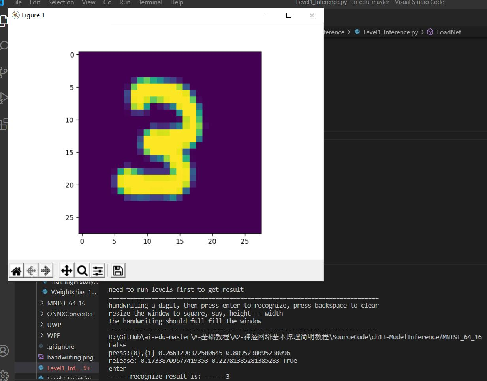
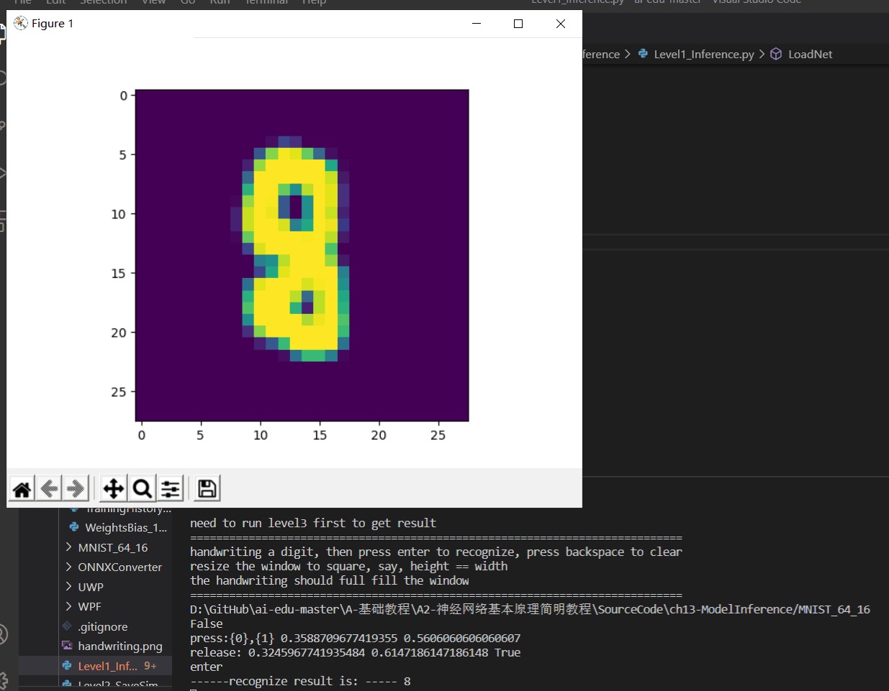
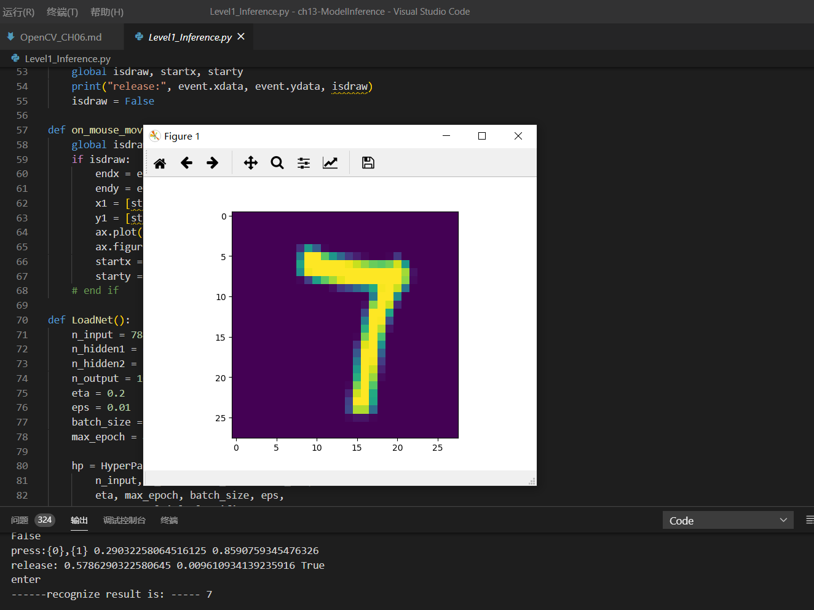

# 神经网络的基本工作原理
### 神经元细胞的数学模型


图2-1 神经元计算模型

#### 输入 input
$(x_1,x_2,x_3)$ 是外界输入信号
#### 权重 weights
$(w_1,w_2,w_3)$ 是每个输入信号的权重值
#### 偏移 bias
#### 求和计算 sum

$$
\begin{aligned}
Z &= w_1 \cdot x_1 + w_2 \cdot x_2 + w_3 \cdot x_3 + b \\\\
&= \sum_{i=1}^m(w_i \cdot x_i) + b
\end{aligned}
$$
#### 激活函数 activation

求和之后，神经细胞已经处于兴奋状态了，已经决定要向下一个神经元传递信号了，但是要传递多强烈的信号，要由激活函数来确定：

$$A=\sigma{(Z)}$$

如果激活函数是一个阶跃信号的话，会像继电器开合一样咔咔的开启和闭合，在生物体中是不可能有这种装置的，而是一个渐渐变化的过程。所以一般激活函数都是有一个渐变的过程，也就是说是个曲线，如图1-14所示。


图1-2 激活函数图像

至此，一个神经元的工作过程就在电光火石般的一瞬间结束了。

#### 小结

- 一个神经元可以有多个输入。
- 一个神经元只能有一个输出，这个输出可以同时输入给多个神经元。
- 一个神经元的 $w$ 的数量和输入的数量一致。
- 一个神经元只有一个 $b$。
- $w$ 和 $b$ 有人为的初始值，在训练过程中被不断修改。
- $A$ 可以等于 $Z$，即激活函数不是必须有的。
- 一层神经网络中的所有神经元的激活函数必须一致。
  
#### 激活函数的作用
激活函数就是连接一个有一个简单的线性关系，让复杂的问题简化成简单的问题从而连接起来解决这个复杂的问题。来完成神经网络回归和拟合这两个功能。

## 梯度下降
#### 梯度下降的三要素

1. 当前点；
2. 方向；
3. 步长。
>梯度下降主要分为单变量函数的梯度下降、双变量梯度函数的下降。

## 损失函数
### 神经网络中常用的损失函数

- 均方差函数，主要用于回归

- 交叉熵函数，主要用于分类

二者都是非负函数，极值在底部，用梯度下降法可以求解。
#### 均方差函数 
该函数就是最直观的一个损失函数了，计算预测值和真实值之间的欧式距离。预测值和真实值越接近，两者的均方差就越小。

均方差函数常用于线性回归(linear regression)，即函数拟合(function fitting)。公式如下：

$$
loss = {1 \over 2}(z-y)^2 \tag{单样本}
$$

$$
J=\frac{1}{2m} \sum_{i=1}^m (z_i-y_i)^2 \tag{多样本}
$$

# 线性分类
线性回归使用一条直线拟合样本数据，而逻辑回归的目标是“拟合”0或1两个数值，而不是具体连续数值，所以称为广义线性模型。逻辑回归又称Logistic回归分析，常用于数据挖掘，疾病自动诊断，经济预测等领域。
表6-1示意说明了线性二分类和非线性二分类的区别。

表6-1 直观理解线性二分类与非线性二分类的区别

|线性二分类|非线性二分类|
|---|---|
|||
## 线性二分类的工作原理
表6-4 线性回归和线性分类的比较

||线性回归|线性分类|
|---|---|---|
|相同点|需要在样本群中找到一条直线|需要在样本群中找到一条直线|
|不同点|用直线来拟合所有样本，使得各个样本到这条直线的距离尽可能最短|用直线来分割所有样本，使得正例样本和负例样本尽可能分布在直线两侧|

### 二分类的代数原理
代数方式：通过一个分类函数计算所有样本点在经过线性变换后的概率值，使得正例样本的概率大于0.5，而负例样本的概率小于0.5。

### 二分类的几何原理
几何方式：让所有正例样本处于直线的一侧，所有负例样本处于直线的另一侧，直线尽可能处于两类样本的中间。

#### 二分类函数的几何作用
二分类函数的最终结果是把正例都映射到图6-5中的上半部分的曲线上，而把负类都映射到下半部分的曲线上。


图6-5 $Logistic$ 函数把输入的点映射到 $(0,1)$ 区间内实现分类
## 线性二分类结果可视化
神经网络的可视化，说简单也很简单，说难也很难，关键是对框架系统的理解，对运行机制和工作原理的理解，掌握了这些，可视化就会使一件轻而易举且令人愉快的事情。
## 线性多分类结果可视化
神经网络到底是一对一方式，还是一对多方式呢？从Softmax公式，好像是一对多方式，因为只取一个最大值，那么理想中的一对多方式应该是图6-19所示的样子。


图6-19 理想中的一对多方式的分割线
# 线性回归
## 最小二乘法
## 梯度下降法
#### 损失函数（Loss Function）

均方误差：

$$loss_i(w,b) = \frac{1}{2} (z_i-y_i)^2 \tag{2}$$


与最小二乘法比较可以看到，梯度下降法和最小二乘法的模型及损失函数是相同的，都是一个线性模型加均方差损失函数，模型用于拟合，损失函数用于评估效果。

区别在于，最小二乘法从损失函数求导，直接求得数学解析解，而梯度下降以及后面的神经网络，都是利用导数传递误差，再通过迭代方式一步一步（用近似解）逼近真实解。
## 神经网络法

在梯度下降法中，我们简单讲述了一下神经网络做线性拟合的原理，即：

1. 初始化权重值
2. 根据权重值放出一个解
3. 根据均方差函数求误差
4. 误差反向传播给线性计算部分以调整权重值
5. 是否满足终止条件？不满足的话跳回2

### 定义神经网络结构

建立最简单的单层单点神经元：

然后我们用这个最简单的线性回归的例子，来说明神经网络中最重要的反向传播和梯度下降的概念、过程以及代码实现。
### 代码实现

其实神经网络法和梯度下降法在本质上是一样的，只不过神经网络法使用一个崭新的编程模型，即以神经元为中心的代码结构设计，这样便于以后的功能扩充。

在`Python`中可以使用面向对象的技术，通过创建一个类来描述神经网络的属性和行为，下面我们将会创建一个叫做`NeuralNet`的`class`，然后通过逐步向此类中添加方法，来实现神经网络的训练和推理过程。

###  反向传播

#### 单样本多特征计算

与上一章不同，本章中的前向计算是多特征值的公式：

$$\begin{aligned}
z_i &= x_{i1} \cdot w_1 + x_{i2} \cdot w_2 + b \\\\
&=\begin{pmatrix}
  x_{i1} & x_{i2}
\end{pmatrix}
\begin{pmatrix}
  w_1 \\\\
  w_2
\end{pmatrix}+b
\end{aligned} \tag{2}
$$
#### 多样本多特征计算
当进行多样本计算时，我们用 $m=3$ 个样本做一个实例化推导：

$$
z_1 = x_{11}w_1+x_{12}w_2+b
$$

$$
z_2= x_{21}w_1+x_{22}w_2+b
$$

$$
z_3 = x_{31}w_1+x_{32}w_2+b
$$

$$
J(W,B) = \frac{1}{2 \times 3}[(z_1-y_1)^2+(z_2-y_2)^2+(z_3-y_3)^2]
$$

$$
\begin{aligned}  
\frac{\partial J}{\partial W}&=
\begin{pmatrix}
  \frac{\partial J}{\partial w_1} \\\\
  \frac{\partial J}{\partial w_2}
\end{pmatrix}
=\begin{pmatrix}
  \frac{\partial J}{\partial z_1}\frac{\partial z_1}{\partial w_1}+\frac{\partial J}{\partial z_2}\frac{\partial z_2}{\partial w_1}+\frac{\partial J}{\partial z_3}\frac{\partial z_3}{\partial w_1} \\\\
  \frac{\partial J}{\partial z_1}\frac{\partial z_1}{\partial w_2}+\frac{\partial J}{\partial z_2}\frac{\partial z_2}{\partial w_2}+\frac{\partial J}{\partial z_3}\frac{\partial z_3}{\partial w_2}  
\end{pmatrix}
\\\\
&=\begin{pmatrix}
  \frac{1}{3}(z_1-y_1)x_{11}+\frac{1}{3}(z_2-y_2)x_{21}+\frac{1}{3}(z_3-y_3)x_{31} \\\\
  \frac{1}{3}(z_1-y_1)x_{12}+\frac{1}{3}(z_2-y_2)x_{22}+\frac{1}{3}(z_3-y_3)x_{32}
\end{pmatrix}
\\\\
&=\frac{1}{3}
\begin{pmatrix}
  x_{11} & x_{21} & x_{31} \\\\
  x_{12} & x_{22} & x_{32}
\end{pmatrix}
\begin{pmatrix}
  z_1-y_1 \\\\
  z_2-y_2 \\\\
  z_3-y_3
\end{pmatrix}
\\\\
&=\frac{1}{3}
\begin{pmatrix}
  x_{11} & x_{12} \\\\
  x_{21} & x_{22} \\\\
  x_{31} & x_{32} 
\end{pmatrix}^{\top}
\begin{pmatrix}
  z_1-y_1 \\\\
  z_2-y_2 \\\\
  z_3-y_3
\end{pmatrix}
\\\\
&=\frac{1}{m}X^{\top}(Z-Y) 
\end{aligned}
\tag{7}
$$
注：3泛化为m。
$$
\frac{\partial J}{\partial B}=\frac{1}{m}(Z-Y) \tag{8}
$$

# 非线性回归
## 激活函数
图8-1是神经网络中的一个神经元，假设该神经元有三个输入，分别为$x_1,x_2,x_3$，那么：

$$z=x_1 w_1 + x_2 w_2 + x_3 w_3 +b \tag{1}$$
$$a = \sigma(z) \tag{2}$$


图8-1 激活函数在神经元中的位置
激活函数的作用：
1. 给神经网络增加非线性因素，这个问题在第1章神经网络基本工作原理中已经讲过了；
2. 把公式1的计算结果压缩到 $[0,1]$ 之间，便于后面的计算。

激活函数的基本性质：

+ 非线性：线性的激活函数和没有激活函数一样；
+ 可导性：做误差反向传播和梯度下降，必须要保证激活函数的可导性；
+ 单调性：单一的输入会得到单一的输出，较大值的输入得到较大值的输出。


# 非线性分类
# 二、非线性分类
数据集的使用，是深度学习的一个基本技能，开发集、验证集、测试集，合理地使用才能得到理想的泛化能力强的模型。

## 多入单出的双层神经网络- 非线性二分类


图10-1 二分类中四种类别的示意图

- 左侧实心圆点是正类，右侧空心圆是负类；
- 在圆圈中的样本是被模型判断为正类的，圆圈之外的样本是被判断为负类的；
- 左侧圆圈外的点是正类但是误判为负类，右侧圆圈内的点是负类但是误判为正类；
- 左侧圆圈内的点是正类且被正确判别为正类，右侧圆圈外的点是负类且被正确判别为负类。

用表格的方式描述矩阵的话是表10-1的样子。

表10-2 四类样本的矩阵关系

|预测值|被判断为正类|被判断为负类|Total|
|---|---|---|---|
|样本实际为正例|TP-True Positive|FN-False Negative|Actual Positive=TP+FN|
|样本实际为负例|FP-False Positive|TN-True Negative|Actual Negative=FP+TN|
|Total|Predicated Postivie=TP+FP|Predicated Negative=FN+TN|

从混淆矩阵中可以得出以下统计指标：

- 准确率 Accuracy

$$
\begin{aligned}
Accuracy &= \frac{TP+TN}{TP+TN+FP+FN} \\\\
&=\frac{521+435}{521+29+435+15}=0.956
\end{aligned}
$$

这个指标就是上面提到的准确率，越大越好。

- 精确率/查准率 Precision

分子为被判断为正类并且真的是正类的样本数，分母是被判断为正类的样本数。越大越好。

$$
Precision=\frac{TP}{TP+FP}=\frac{521}{521+15}=0.972
$$

- 召回率/查全率 Recall

$$
Recall = \frac{TP}{TP+FN}=\frac{521}{521+29}=0.947
$$

分子为被判断为正类并且真的是正类的样本数，分母是真的正类的样本数。越大越好。

- TPR - True Positive Rate 真正例率

$$
TPR = \frac{TP}{TP + FN}=Recall=0.947
$$

- FPR - False Positive Rate 假正例率

$$
FPR = \frac{FP}{FP+TN}=\frac{15}{15+435}=0.033
$$

分子为被判断为正类的负例样本数，分母为所有负类样本数。越小越好。

- 调和平均值 F1

$$
\begin{aligned}
F1&=\frac{2 \times Precision \times Recall}{recision+Recall}\\\\
&=\frac{2 \times 0.972 \times 0.947}{0.972+0.947}=0.959
\end{aligned}
$$

该值越大越好。

- ROC曲线与AUC

ROC，Receiver Operating Characteristic，接收者操作特征，又称为感受曲线（Sensitivity Curve），是反映敏感性和特异性连续变量的综合指标，曲线上各点反映着相同的感受性，它们都是对同一信号刺激的感受性。
ROC曲线的横坐标是FPR，纵坐标是TPR。

AUC，Area Under Roc，即ROC曲线下面的面积。

相对绝对误差和相对均方根误差，有时绝对误差不能体现误差的真实大小，而相对误差通过体现误差占真值的比重来反映误差大小。

## 双层神经网络分类
表10-3 各种分类的组合关系

||二分类|多分类|
|---|---|---|
|线性|||
|非线性|||

在第三步中我们学习过线性分类，如果用于此处的话，我们可能会得到表10-4所示的绿色分割线。

表10-4 线性分类结果

|XOR问题|弧形问题|
|---|---|
|||
|图中两根直线中的任何一根，都不可能把蓝色点分到一侧，同时红色点在另一侧|对于线性技术来说，它已经尽力了，使得两类样本尽可能地分布在直线的两侧|

## 非线性二分类实现
首先定义可以完成非线性二分类的神经网络结构图，如图10-5所示。


图10-5 非线性二分类神经网络结构图

对于一般的用于二分类的双层神经网络可以是图10-6的样子。


图10-6 通用的二分类神经网络结构图

## 总结
**反向传播**

就我个人来说：反向传播就是一个利用链式法则，由外而内逐层计算最终输出对每层的变量的梯度的简便算法。该算法在神经网络中得以普遍应用，因为在神经网络中这样由外而内计算梯度的顺序是从输出层到输入层反向进行的。训练神经网络通过优化一个损失函数loss，使其数值越来越小，那么我们的网络的性能就会越来越好。通过改变我们网络每一层的参数，就能改变网络的输出，进而就可以改变loss的值。
计算loss对每层参数的梯度，每层参数都向loss对其的负梯度方略微改变，只要当前的loss不处于局部最小值且改变的幅度得当，这种操作一般是能够使loss减小的，这便是梯度下降GD的核心思想。

**损失函数**

损失函数或代价函数是将随机事件或其有关随机变量的取值映射为非负实数以表示该随机事件的“风险”或“损失”的函数。在应用中，损失函数通常作为学习准则与优化问题相联系，即通过最小化损失函数求解和评估模型。例如在统计学和机器学习中被用于模型的参数估计在宏观经济学中被用于风险管理和决策，在控制理论中被应用于最优控制理论。

**梯度下降**
 在最小化损失函数时，可以通过梯度下降法来一步一步的迭代求解，得到最小化的损失函数。梯度下降不一定能找到全局的最优解，有可能是一个局部的最优解。当损失函数是一个凸函数时，梯度下降就一定能得到最优解。梯度下降的相关概念有： 步长。步长决定在梯度下降的过程中，每一步沿梯度负方向前进的长度。 特征。指的是样本特征。 假设函数：在监督学习中，为了拟合输入样本，而使用假设函数。 损失函数：为了评估模型的好坏。通常用损失函数来度量拟合的程度。损失函数最小化，意味着拟合程度较好，参数对于模型是最优的。损失函数通常采用假设函数和样本输出的差取平方。

在构建深度神经网络时，ReLU 是最好的非线性（激活函数），但说实话，ReLU 确实是运行速度最快、最简便的，而且令人惊讶的是，它们在工作时梯度并不会逐渐减小（从而能够防止梯度消失）。尽管 sigmoid 是一个常用激活函数，但是它在 DNN 中传播梯度的效果并不太好。 不要在输出层使用激活函数。这应该是显而易见的，但是如果你通过一个共用的函数构建每一层，那这可能是一个很容易犯的错误：请确保在输出层不要使用激活函数。 为每一层添加一个偏置项。这是机器学习的入门知识：本质上，偏置项将一个平面转换到最佳拟合位置。在 y=mx+b 式中，b 是偏置项，使直线能够向上或向下移动到最佳的拟合位置。

在深度学习中，对神经网络的权重进行初始化对模型的收敛速度和性能的提升有着重要的影响。而且在神经网络在计算过程中需要对权重参数w不断的迭代更新，已达到较好的性能效果。但在训练的过程中，会遇到梯度消失和梯度爆炸等现象。因此，一个好的初始化权重能够对这两个问题有很好的帮助，并且，初始化权重能够有利于模型性能的提升，以及增快收敛速度。

>**心得体会**这几部分是我们在这门课程中的我觉得比较重要部分，老师所给的资料很多也比较全面，但是想要全部弄懂是一件很困难的事情，只有静下心来慢慢摸索才会发现它的突破点。并且我深刻的体会到一个函数算法的实现是基于大量的公式演算以及实践推论的。而且对于线性回归和非线性回归，线性分类与非线性分类也都是基于一些数学公式推导演算而来的。除此之外，在这个学期的学习过程中，慢慢地感受到了我们专业涉及地内容与知识，也慢慢感受到了人工智能是如何实现的，更加深刻地感受到了我们目前掌握的知识是不够的，还要继续探索。

## miniFramework实现手写数字的识别
> 实现代码
``` python
/*
from matplotlib import pyplot as plt
import numpy as np
from PIL import Image

from HelperClass2.NeuralNet_3_0 import *

dimg = Image.open(img_file_name)
out1 = img.convert('L')
out2 = out1.resize((28,28))
a = np.array(out2)
b = 255 - a
x_max = np.max(b)
x_min = np.min(b)
X_NEW = (b - x_min)/(x_max-x_min)
plt.cla()
plt.imshow(X_NEW)
plt.plot()
return X_NEW.reshape(1,-1)
def Inference(img_array):
output = net.inference(img_array)
n = np.argmax(output)
print("------recognize result is: -----", n)

def on_key_press(event):
img_file_name = "handwriting.png"
print(event.key)
if event.key == 'enter':
plt.axis('off')
plt.savefig(img_file_name)
plt.axis('on')
img_array = ReadImage(img_file_name)
Inference(img_array)
elif event.key == 'backspace':
plt.cla()
plt.axis([0,1,0,1])
ax.figure.canvas.draw()
#end if

def on_mouse_press(event):
global startx, starty, isdraw
print(isdraw)
isdraw = True
startx = event.xdata
starty = event.ydata
print("press:{0},{1}", startx, starty)
    
def on_mouse_release(event):
global isdraw, startx, starty
print("release:", event.xdata, event.ydata, isdraw)
isdraw = False

def on_mouse_move(event):
global isdraw, startx, starty
if isdraw:
endx = event.xdata        
endy = event.ydata        
x1 = [startx, endx]
y1 = [starty, endy]
ax.plot(x1, y1, color='black', linestyle='-', linewidth='40')
ax.figure.canvas.draw()
startx = endx
starty = endy
# end if

def LoadNet():
n_input = 784
n_hidden1 = 64
n_hidden2 = 16
n_output = 10
eta = 0.2
eps = 0.01
batch_size = 128
max_epoch = 40

hp = HyperParameters_3_0(
n_input, n_hidden1, n_hidden2, n_output, 
eta, max_epoch, batch_size, eps, 
NetType.MultipleClassifier, 
InitialMethod.Xavier)
net = NeuralNet_3_0(hp, "MNIST_64_16")
net.LoadResult()
return net 
if __name__ == "__main__":
isdraw = False
startx, starty = 0, 0

print("need to run level3 first to get result")
print("============================================================================")
print("handwriting a digit, then press enter to recognize, press backspace to clear")
print("resize the window to square, say, height == width")
print("the handwriting should full fill the window")
print("============================================================================")

net = LoadNet()

fig, ax = plt.subplots()
fig.canvas.mpl_connect('key_press_event', on_key_press)
fig.canvas.mpl_connect('button_release_event', on_mouse_release)
fig.canvas.mpl_connect('button_press_event', on_mouse_press)
fig.canvas.mpl_connect('motion_notify_event', on_mouse_move)
plt.plt.show()
*/
```
>运行结果




