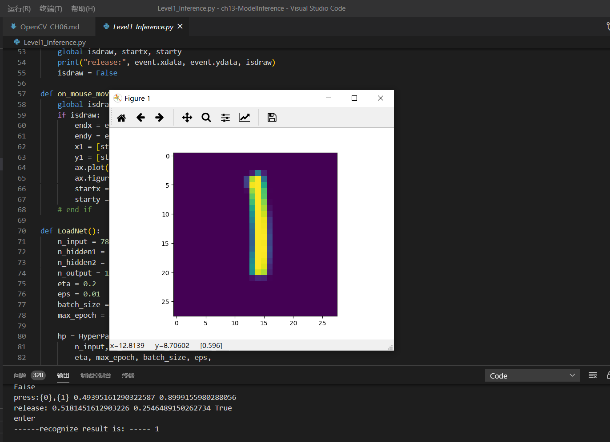
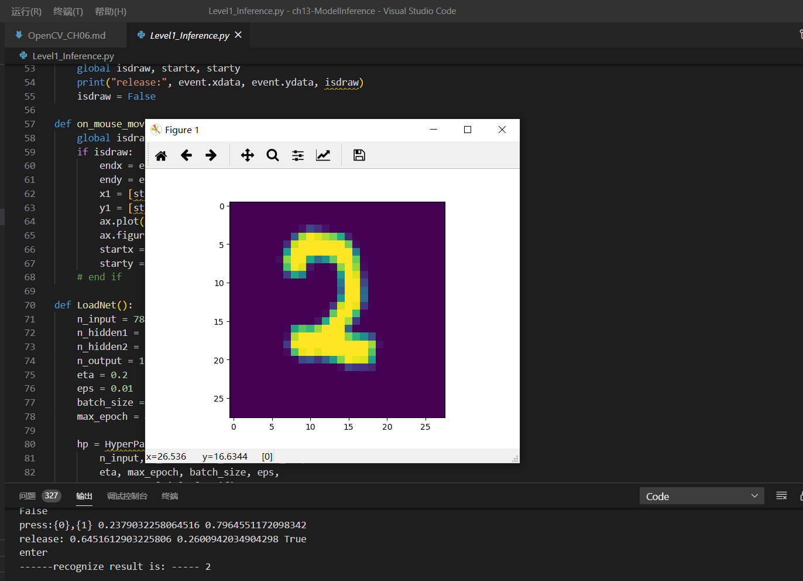
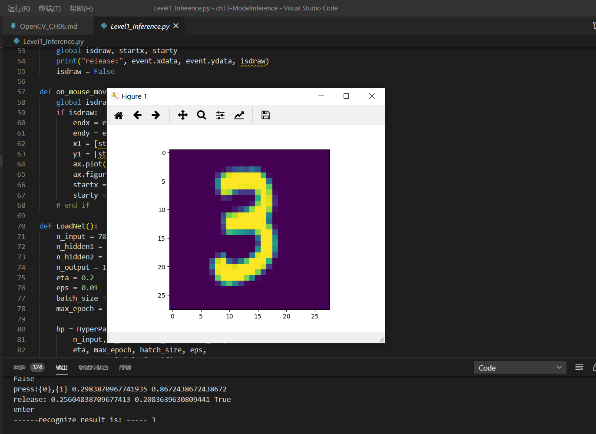
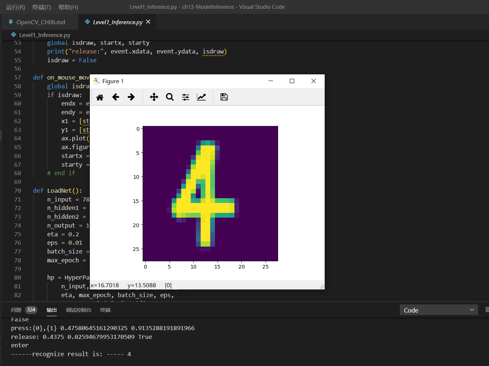
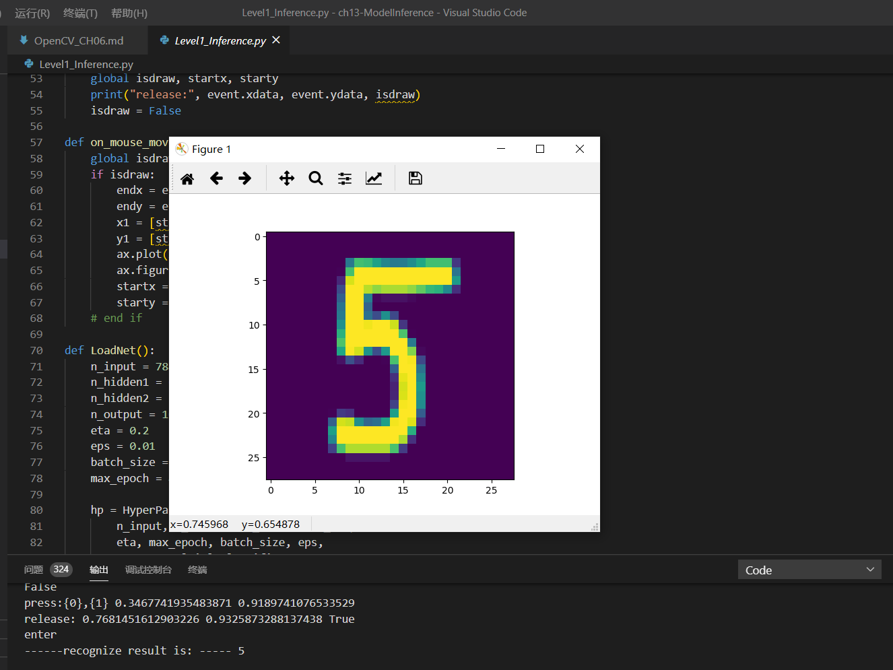
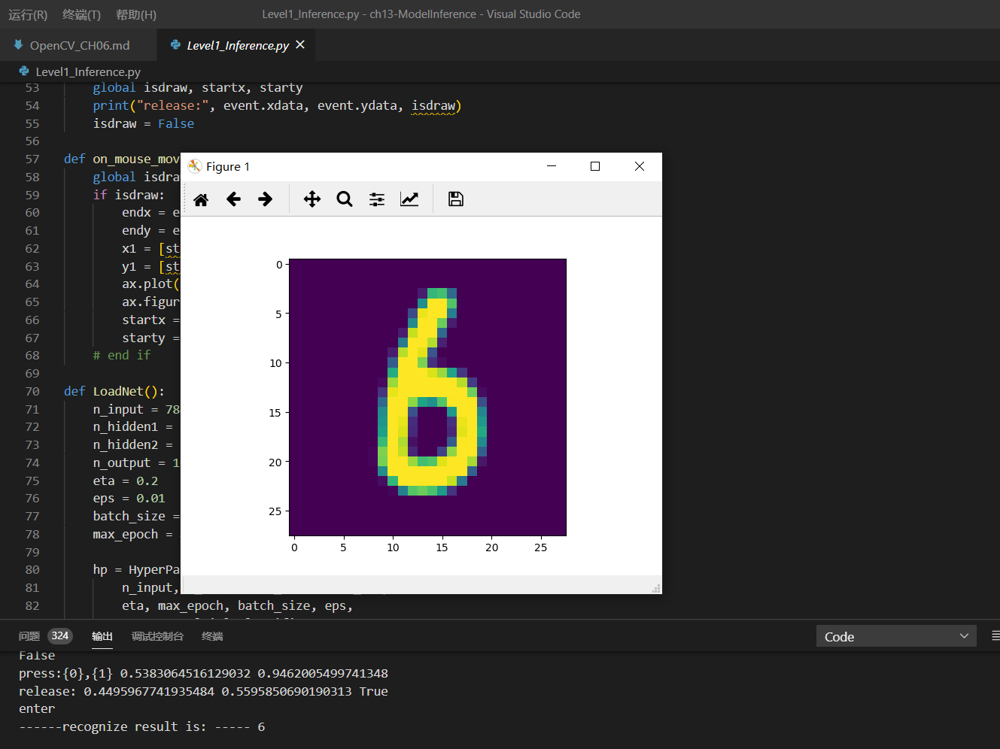

# 《人工智能概论》课程考核报告 #
## 201809027 郭小凡 ##

# 学习笔记 #
### 后文符号约定：
|符号|含义|
|---|---|
|$x$|训练用样本值|
|$x_1$|第一个样本或样本的第一个特征值，在上下文中会有说明|
|$x_{12},x_{1,2}$|第1个样本的第2个特征值|
|$X$|训练用多样本矩阵|
|$y$|训练用样本标签值|
|$y_1$|第一个样本的标签值|
|$Y$|训练用多样本标签矩阵|
|$z$|线性运算的结果值|
|$Z$|线性运算的结果矩阵|
|$Z1$|第一层网络的线性运算结果矩阵|
|$\sigma$|激活函数|
|$a$|激活函数结果值|
|$A$|激活函数结果矩阵|
|$A1$|第一层网络的激活函数结果矩阵|
|$w$|权重参数值|
|$w_{12},w_{1,2}$|权重参数矩阵中的第1行第2列的权重值|
|$w1_{12},w1_{1,2}$|第一层网络的权重参数矩阵中的第1行第2列的权重值|
|$W$|权重参数矩阵|
|$W1$|第一层网络的权重参数矩阵|
|$b$|偏移参数值|
|$b_1$|偏移参数矩阵中的第1个偏移值|
|$b2_1$|第二层网络的偏移参数矩阵中的第1个偏移值|
|$B$|偏移参数矩阵（向量）|
|$B1$|第一层网络的偏移参数矩阵（向量）|
|$X^T$|X的转置矩阵|
|$X^{-1}$|X的逆矩阵|
|$loss,loss(w,b)$|单样本误差函数|
|$J, J(w,b)$|多样本损失函数|


## 1.1 人工智能的定义 ##
人工智能是一个非常庞杂的概念———从人们的期待、技术、应用等角度，人工智能都有不同的定义。

### 第一层面：人们对人工智能的期待 ###
- **可以智能地把某件特定的事情做好，在某个领域增强人类的智慧，即“智能增强”。** 如搜索引擎、自动语言翻译等，也称作“弱人工智能”，或“狭义人工智能”
- **像人类一样能认知，思考，判断，即“模拟人类的智能”。** 也称作“通用人工智能”（Artificial General Intelligence，AGI），或“强人工智能”。这类人工智能暂时未能取得实际应用。

### 第二层面：技术特点 ###
机器学习可以大致分为三种类型：
1. 监督学习（Supervised Learning）
    通过标注的数据来学习。

2. 无监督学习（Unsupervised Learning）
    通过没有标注的数据来学习。这种算法可以发现数据中自然形成的共同特性（聚类），可以用来发现不同数据之间的联系。
3. 强化学习（Reinforcement Learning）
    我们可以让程序选择和它的环境互动，环境给程序的反馈，程序从反馈中学习到新的模型。

#### 神经网络模型 ####
在生物神经网络中，每个神经元与其他神经元相连，当它兴奋时，就会像相邻的神经元发送化学物质，从而改变这些神经元内的电位；如果某神经元的电位超过了一个阈值，那么它就会激活（兴奋），向其他神经元发送化学物质。把许多这样的神经元按照一定的层次结构连接起来，我们就构建了一个神经网络，如图所示：


                        图1.1 M-P神经元模型

### 第三层面：应用角度 ###
1. 标杆式任务。
2. AI技术和其他技术结合，解决实际需求。
狭义人工智能已在各个领域取得很大成果。

## 1.2 范式的演化 ##
### 范式演化的四个阶段 ###
1. **第一阶段——经验总结**：描述自然现象，归纳总结规律。
2. **第二阶段——理论推导**：定量定性计算，构建各种模型。
3. **第三阶段——计算仿真**：实验模拟仿真，推演复杂现象。
4. **第四阶段——数据探索**：收集分析数据，探索全兴规律。


## 1.3 神经网络基本工作原理 ##
神经网络由基本的神经元组成。

### 神经元细胞的数学模型 ###


            图1.3.1 神经元计算模型
1. **输入 input**【多个】：$(x_1,x_2,x_3)$ 是外界输入信号，一般是一个训练数据样本的多个属性。
2. **输出 output**【一个】：输出可同时输入给多个神经元。
3. **权重 weights**【数量与输入量一致】：$(w_1,w_2,w_3)$ 是每个输入信号的权重值。
4. **偏移 bias**【一个】：使得直线能够沿 $Y$ 轴上下移动。
5. **求和计算 sum**：
$$
\begin{aligned}
Z &= w_1 \cdot x_1 + w_2 \cdot x_2 + w_3 \cdot x_3 + b = \sum_{i=1}^m(w_i \cdot x_i) + b
\end{aligned}
$$
5. **激活函数 activation**【非必须存在】：$$A=\sigma{(Z)}$$
  若激活函数是一个阶跃信号的话，信号传输口会不断开启、闭合。但在生物体中信号的变化一定是一个渐渐变化的过程。所以一般激活函数都有一个渐变的过程，即**激活函数是曲线**。

### 神经网络训练过程 ###
#### 单层神经网络模型 ####


              图1.3.2 单层神经网络模型
由图易得，单层神经网络中有 $m$ 个输入 (示例模型中 $m=3$)，有 $n$ 个输出 (示例模型中 $n=2$)。在神经网络中，$b$ 到每个神经元的权值表示实际的偏移值，即 $(b_1,b_2)$。

- $(x_1,x_2,x_3)$ 是一个样本数据的三个特征值
- $(w_{11},w_{21},w_{31})$ 是 $(x_1,x_2,x_3)$ 到 $n1$ 的权重
- $(w_{12},w_{22},w_{32})$ 是 $(x_1,x_2,x_3)$ 到 $n2$ 的权重
- $b_1$ 是 $n1$ 的偏移
- $b_2$ 是 $n2$ 的偏移   

#### 训练流程图 ####


                  图1.3.3 神经网络训练流程图    
##### 训练条件 #####
1. 已拥有一定的训练数据；
2. 已根据数据的规模、领域，建立神经网络的基本结构；
3. 定义损失函数，以便合理计算误差。

#### 神经网络中的矩阵运算 ####


                    图1.3.4 双层神经网络示例
由图易得：
$$z1_1 = x_1 \cdot w1_{1,1}+ x_2 \cdot w1_{2,1}+b1_1$$
$$z1_2 = x_1 \cdot w1_{1,2}+ x_2 \cdot w1_{2,2}+b1_2$$
$$z1_3 = x_1 \cdot w1_{1,3}+ x_2 \cdot w1_{2,3}+b1_3$$
矩阵写为：
$$
z1_1=
\begin{pmatrix}
x_1 & x_2
\end{pmatrix}
\begin{pmatrix}
w1_{1,1} \\\\
w1_{2,1}
\end{pmatrix}
+b1_1
$$

$$
z1_2=
\begin{pmatrix}
x_1 & x_2
\end{pmatrix}
\begin{pmatrix}
w1_{1,2} \\\\
w1_{2,2}
\end{pmatrix}
+b1_2
$$

$$
z1_3=
\begin{pmatrix}
x_1 & x_2
\end{pmatrix}
\begin{pmatrix}
w1_{1,3} \\\\
w1_{2,3}
\end{pmatrix}
+b1_3
$$
可转化为：

$$
Z1 =
\begin{pmatrix}
x_1 & x_2 
\end{pmatrix}
\begin{pmatrix}
w1_{1,1}&w1_{1,2}&w1_{1,3} \\\\
w1_{2,1}&w1_{2,2}&w1_{2,3} \\\\
\end{pmatrix}
+\begin{pmatrix}
b1_1 & b1_2 & b1_3
\end{pmatrix}
$$
即：
$$Z1 = X \cdot W1 + B1$$
激活函数：
$$A1=a(Z1)$$
同理可得：$$Z2 = A1 \cdot W2 + B2$$
**注：** 损失函数不是前向计算的一部分。

#### 神经网络主要功能 ####
1. **回归（Regression）** 或称 **拟合（Fitting）**
  单层的神经网络能够模拟一条二维平面上的直线，从而可以完成线性分割任务。理论证明，两层神经网络可以无限逼近任意连续函数。
2. **分类（Classification）**
   对两类或多类样本数据的边界的抽象。

**神经网络的训练结果，是一大堆的权重组成的数组（近似解）**

## 2.0 神经网络中重要基本概念 ##
### 反向传播与梯度下降的基本工作原理： ###
1. 初始化；
2. 正向计算；
3. 损失函数提供计算损失的方法；
4. 梯度下降是在损失函数基础上向着损失最小的点靠近，指引网络权重调整的方向；
5. 反向传播把损失值反向传给神经网络的每一层，让每一层都根据损失值反向调整权重；
6. Go to 2，直到精度满足要求。

### 2.1 线性反向传播 ###
**正向计算**
最终的 z 值受到许多因素的影响：变量 $w$ ，变量 $b$，计算式 $x$，计算式 $y$。

**代码测试结果**
```
PS C:\Users\DELL\Desktop\apprendre\人工智能\ai-edu\A-基础教程\A2-神经网络基本原理简明教程\SourceCode\ch02-BASIC> & C:/Users/DELL/AppData/Local/Programs/Python/Python38-32/python.exe c:/Users/DELL/Desktop/apprendre/人工智能/ai-edu/A-基础教程/A2-神经网络基本原理简明教程/SourceCode/ch02-BASIC/Level1_BP_Linear.py

single variable: b ----- 
w=3.000000,b=4.000000,z=162.000000,delta_z=12.000000
delta_b=0.190476
w=3.000000,b=3.809524,z=150.217687,delta_z=0.217687
delta_b=0.003455
w=3.000000,b=3.806068,z=150.007970,delta_z=0.007970
delta_b=0.000127
w=3.000000,b=3.805942,z=150.000294,delta_z=0.000294
delta_b=0.000005
w=3.000000,b=3.805937,z=150.000011,delta_z=0.000011
delta_b=0.000000
w=3.000000,b=3.805937,z=150.000000,delta_z=0.000000
done!
final b=3.805937

single variable new: b -----
w=3.000000,b=4.000000,z=162.000000,delta_z=12.000000
factor_b=63.000000, delta_b=0.190476
w=3.000000,b=3.809524,z=150.217687,delta_z=0.217687
factor_b=60.714286, delta_b=0.003585
w=3.000000,b=3.805938,z=150.000077,delta_z=0.000077
factor_b=60.671261, delta_b=0.000001
w=3.000000,b=3.805937,z=150.000000,delta_z=0.000000
done!
final b=3.805937

double variable: w, b -----
w=3.000000,b=4.000000,z=162.000000,delta_z=12.000000
delta_b=0.095238, delta_w=0.333333
w=2.666667,b=3.904762,z=150.181406,delta_z=0.181406
delta_b=0.001440, delta_w=0.005039
w=2.661628,b=3.903322,z=150.005526,delta_z=0.005526
delta_b=0.000044, delta_w=0.000154
w=2.661474,b=3.903278,z=150.000170,delta_z=0.000170
delta_b=0.000001, delta_w=0.000005
w=2.661469,b=3.903277,z=150.000005,delta_z=0.000005
done!
final b=3.903277
final w=2.661469

double variable new: w, b -----
w=3.000000,b=4.000000,z=162.000000,delta_z=12.000000
factor_b=63.000000, factor_w=18.000000, delta_b=0.095238, delta_w=0.333333
w=2.666667,b=3.904762,z=150.181406,delta_z=0.181406
factor_b=60.523810, factor_w=17.619048, delta_b=0.001499, delta_w=0.005148
w=2.661519,b=3.903263,z=150.000044,delta_z=0.000044
factor_b=60.485234, factor_w=17.613053, delta_b=0.000000, delta_w=0.000001
w=2.661517,b=3.903263,z=150.000000,delta_z=0.000000
done!
final b=3.903263
final w=2.661517
PS C:\Users\DELL\Desktop\apprendre\人工智能\ai-edu\A-基础教程\A2-神经网络基本原理简明教程\SourceCode\ch02-BASIC>
```

### 2.2 非线性反向传播 ###


               图2.2.1 非线性的反向传播
其中$1<x<=10,0<y<2.15$。

**正向过程**
1. 输入层，随机输入第一个 $x$ 值，$x$ 的取值范围 $(1,10]$；
2. 第一层网络计算，接收传入的 $x$ 值，计算：$a=x^2$；
3. 第二层网络计算，接收传入的 $a$ 值，计算：$b=\ln (a)$；
4. 第三层网络计算，接收传入的 $b$ 值，计算：$c=\sqrt{b}$；
5. 输出层，接收传入的 $c$ 的值。

**反向过程**
1. 计算 $y$ 与 $c$ 的差值：$\Delta c = c - y$，前传；
2. 接收传回的 $\Delta c$，计算 $\Delta b = \Delta c \cdot 2\sqrt{b}$；
3. 接收传回的 $\Delta b$，计算 $\Delta a = \Delta b \cdot a$；
4. 接收传回的 $\Delta a$，计算 $\Delta x = \frac{\Delta}{2x}$；
5. 接收传回的 $\Delta x$，更新 $x \leftarrow x - \Delta x$；
6. 回到第1步。

#### 正向与反向的迭代计算公式 ####

|方向|公式|
|---|---|
|正向|$x=x-\Delta x$|
|正向|$a=x^2$|
|正向|$b=\ln(a)$|
|正向|$c=\sqrt{b}$|
||标签值y|
|反向|$\Delta c = c - y$|
|反向|$\Delta b = \Delta c \cdot 2\sqrt{b}$|
|反向|$\Delta a = \Delta b \cdot a$|
|反向|$\Delta x = \Delta a / 2x$|

**代码测试**
**运行终端**
```

C:\Users\DELL>python c:/Users/DELL/Desktop/apprendre/人工智能/ai-edu/A-基础教程/A2-神经网络基本原理简明教程/SourceCode/ch02-BASIC/Level2_BP_NoneLinear.py
how to play: 1) input x, 2) calculate c, 3) input target number but not faraway from c
input x as initial number(1.2,10), you can try 1.3:
1.3
c=0.724381
input y as target number(0.5,2), you can try 1.8:
1.8
forward...
x=1.300000,a=1.690000,b=0.524729,c=0.724381
backward...
delta_c=-1.075619, delta_b=-1.558316, delta_a=-2.633554, delta_x=-1.012906

forward...
x=2.312906,a=5.349532,b=1.677009,c=1.294994
backward...
delta_c=-0.505006, delta_b=-1.307960, delta_a=-6.996972, delta_x=-1.512594

forward...
x=3.825499,a=14.634444,b=2.683378,c=1.638102
backward...
delta_c=-0.161898, delta_b=-0.530411, delta_a=-7.762271, delta_x=-1.014544

forward...
x=4.840043,a=23.426014,b=3.153847,c=1.775907
backward...
delta_c=-0.024093, delta_b=-0.085572, delta_a=-2.004621, delta_x=-0.207087

forward...
x=5.047130,a=25.473520,b=3.237639,c=1.799344
backward...
done!
```
**运行结果图像**


### 2.3 梯度下降 ###
梯度下降的数学公式：

$$\theta_{n+1} = \theta_{n} - \eta \cdot \nabla J(\theta) $$

其中：
1. $\theta_{n+1}$：下一个值；
2. $\theta_n$：当前值；
3. $-$：减号，梯度的反向；
4. $\eta$：学习率/步长；
5. $\nabla$：梯度，函数当前位置的最快上升点；
6. $J(\theta)$：函数。

#### 梯度下降的三要素 ####

1. 当前点；
2. 方向；
3. 步长。

**梯度**：函数当前位置的最快上升点；
**下降**：与导数相反的方向，用数学语言描述就是那个减号。
**梯度下降的目的就是使得x值向极值点逼近。**

                表2.3.1 在三维空间内的梯度下降过程

|观察角度1|观察角度2|
|--|--|
|||

#### 学习率η的选择 ####
在公式表达时，学习率被表示为$\eta$。

                 表2.3.2 不同学习率对迭代情况的影响

|学习率|迭代路线图|说明|
|---|---|---|
|1.0||学习率太大，迭代的情况很糟糕，在一条水平线上跳来跳去，永远也不能下降。|
|0.8||学习率大，会有这种左右跳跃的情况发生，这不利于神经网络的训练。|
|0.4||学习率合适，损失值会从单侧下降，4步以后基本接近了理想值。|
|0.1||学习率较小，损失值会从单侧下降，但下降速度非常慢，10步了还没有到达理想状态。|

**代码测试**
**1. GDSingleVariable**
**运行终端**
```
PS C:\Users\DELL\Desktop\apprendre\人工智能\ai-edu\A-基础教程\A2-神经网络基本原理简明教程\SourceCode\ch02-BASIC> & C:/Users/DELL/AppData/Local/Programs/Python/Python38-32/python.exe c:/Users/DELL/Desktop/apprendre/人工智能/ai-edu/A-基础教程/A2-神经网络基本原理简明教程/SourceCode/ch02-BASIC/Level3_GDSingleVariable.py
x=0.480000, y=0.230400
x=0.192000, y=0.036864
x=0.076800, y=0.005898
x=0.030720, y=0.000944
```
**运行结果图像**


**2. GDDoubleVariable**
**运行终端**
```
PS C:\Users\DELL\Desktop\apprendre\人工智能\ai-edu\A-基础教程\A2-神经网络基本原理简明教程\SourceCode2-BASIC> & C:/Users/DELL/AppData/Local/Programs/Python/Python38-32/python.exe c:/Users/DELL/Desktop/endre/人工智能/ai-edu/A-基础教程/A2-神经网络基本原理简明教程/SourceCode/ch02-BASIC/Level4_GDDoubleVale.py
[3 1]
0: x=3.000000, y=1.000000, z=9.708073
     [6.         0.90929743]
[2.4        0.90907026]
1: x=2.400000, y=0.909070, z=6.382415
     [4.8        0.96956606]
[1.92       0.81211365]
2: x=1.920000, y=0.812114, z=4.213103
     [3.84      0.9985729]
[1.536      0.71225636]
3: x=1.536000, y=0.712256, z=2.786415
     [3.072      0.98931962]
[1.2288    0.6133244]
4: x=1.228800, y=0.613324, z=1.841252
     [2.4576     0.94136341]
[0.98304    0.51918806]
5: x=0.983040, y=0.519188, z=1.212558
     [1.96608    0.86158105]
[0.786432   0.43302995]
6: x=0.786432, y=0.433030, z=0.794559
     [1.572864   0.76178233]
[0.6291456  0.35685172]
7: x=0.629146, y=0.356852, z=0.517853
     [1.2582912  0.65463784]
[0.50331648 0.29138794]
8: x=0.503316, y=0.291388, z=0.335858
     [1.00663296 0.55034373]
[0.40265318 0.23635356]
9: x=0.402653, y=0.236354, z=0.216960
     [0.80530637 0.45529821]
[0.32212255 0.19082374]
10: x=0.322123, y=0.190824, z=0.139737
     [0.64424509 0.37244992]
[0.25769804 0.15357875]
11: x=0.257698, y=0.153579, z=0.089810
     [0.51539608 0.3023504 ]
[0.20615843 0.12334371]
12: x=0.206158, y=0.123344, z=0.057638
     [0.41231686 0.24419301]
[0.16492674 0.09892441]
13: x=0.164927, y=0.098924, z=0.036955
     [0.32985349 0.19656057]
[0.1319414  0.07926835]
14: x=0.131941, y=0.079268, z=0.023679
15: x=0.105553, y=0.063481, z=0.015166
     [0.21110623 0.1266212 ]
     [0.16888499 0.10146288]
PS C:\Users\DELL\Desktop\apprendre\人工智能\ai-edu\A-基础教程\A2-神经网络基本原理简明教程\SourceCodeurceCode\ch02-BASIC> & C:/Users/DELL/AppData/Local/Programs/Python/Python38-32/python.exe c:Desktop/ode/ch02-BASIC/Level5_LearningRate.py                                                       arningRa
PS C:\Users\DELL\Desktop\apprendre\人工智能\ai-edu\A-基础教程\A2-神经网络基本原理简明教程\SourceCode\ch02-BASIC> & C:/Users/DELL/AppData/Local/Programs/Python/Python38-32/python.exe c:urceCode/Users/DELL/Desktop/apprendre/人工智能/ai-edu/A-基础教程/A2-神经网络基本原理简明教程/SourceCDesktop/ode/ch02-BASIC/Level5_LearningRate.py                                                       arningRa
PS C:\Users\DELL\Desktop\apprendre\人工智能\ai-edu\A-基础教程\A2-神经网络基本原理简明教程\SourceCod> & C:/Users/DELL/AppData/Local/Programs/Python/Python38-32/python.exe c:/Users/DELL/urceCodeDesktop/apprendre/人工智能/ai-edu/A-基础教程/A2-神经网络基本原理简明教程/SourceCode/ch02-BASIC/Level4_GDDoubleVariable.py
[3 1]
0: x=3.000000, y=1.000000, z=9.708073
     [6.         0.90929743]
[2.4        0.90907026]
1: x=2.400000, y=0.909070, z=6.382415
     [4.8        0.96956606]
[1.92       0.81211365]
2: x=1.920000, y=0.812114, z=4.213103
     [3.84      0.9985729]
[1.536      0.71225636]
3: x=1.536000, y=0.712256, z=2.786415
     [3.072      0.98931962]
[1.2288    0.6133244]
4: x=1.228800, y=0.613324, z=1.841252
     [2.4576     0.94136341]
[0.98304    0.51918806]
5: x=0.983040, y=0.519188, z=1.212558
     [1.96608    0.86158105]
[0.786432   0.43302995]
6: x=0.786432, y=0.433030, z=0.794559
     [1.572864   0.76178233]
[0.6291456  0.35685172]
7: x=0.629146, y=0.356852, z=0.517853
     [1.2582912  0.65463784]
[0.50331648 0.29138794]
8: x=0.503316, y=0.291388, z=0.335858
     [1.00663296 0.55034373]
[0.40265318 0.23635356]
9: x=0.402653, y=0.236354, z=0.216960
     [0.80530637 0.45529821]
[0.32212255 0.19082374]
10: x=0.322123, y=0.190824, z=0.139737
     [0.64424509 0.37244992]
[0.25769804 0.15357875]
11: x=0.257698, y=0.153579, z=0.089810
     [0.51539608 0.3023504 ]
[0.20615843 0.12334371]
12: x=0.206158, y=0.123344, z=0.057638
     [0.41231686 0.24419301]
[0.16492674 0.09892441]
13: x=0.164927, y=0.098924, z=0.036955
     [0.32985349 0.19656057]
[0.1319414  0.07926835]
PS C:\Users\DELL\Desktop\apprendre\人工智能\ai-edu\A-基础教程\A2-神经网络基本原理简明教程\SourceCode\ch02-BASIC> & C:/Users/DELL/AppData/Local/Programs/Python/Python38-32/python.exe c:/Users/DELL/Desktop/apprendre/人工智能/ai-edu/A-基础教程/A2-神经网络基本原理简明教程/SourceCode/ch02-BASIC/Level4_GDDoubleVariable.py
[3 1]
0: x=3.000000, y=1.000000, z=9.708073
     [6.         0.90929743]
[2.4        0.90907026]
1: x=2.400000, y=0.909070, z=6.382415
     [4.8        0.96956606]
[1.92       0.81211365]
2: x=1.920000, y=0.812114, z=4.213103
     [3.84      0.9985729]
[1.536      0.71225636]
3: x=1.536000, y=0.712256, z=2.786415
     [3.072      0.98931962]
[1.2288    0.6133244]
4: x=1.228800, y=0.613324, z=1.841252
     [2.4576     0.94136341]
[0.98304    0.51918806]
5: x=0.983040, y=0.519188, z=1.212558
     [1.96608    0.86158105]
[0.786432   0.43302995]
6: x=0.786432, y=0.433030, z=0.794559
     [1.572864   0.76178233]
[0.6291456  0.35685172]
7: x=0.629146, y=0.356852, z=0.517853
     [1.2582912  0.65463784]
[0.50331648 0.29138794]
8: x=0.503316, y=0.291388, z=0.335858
     [1.00663296 0.55034373]
[0.40265318 0.23635356]
9: x=0.402653, y=0.236354, z=0.216960
     [0.80530637 0.45529821]
[0.32212255 0.19082374]
10: x=0.322123, y=0.190824, z=0.139737
     [0.64424509 0.37244992]
[0.25769804 0.15357875]
11: x=0.257698, y=0.153579, z=0.089810
     [0.51539608 0.3023504 ]
[0.20615843 0.12334371]
12: x=0.206158, y=0.123344, z=0.057638
     [0.41231686 0.24419301]
[0.16492674 0.09892441]
13: x=0.164927, y=0.098924, z=0.036955
     [0.32985349 0.19656057]
[0.1319414  0.07926835]
14: x=0.131941, y=0.079268, z=0.023679
     [0.26388279 0.15787343]
[0.10555312 0.06348101]
15: x=0.105553, y=0.063481, z=0.015166
     [0.21110623 0.1266212 ]
[0.08444249 0.05081889]
16: x=0.084442, y=0.050819, z=0.009711
     [0.16888499 0.10146288]
PS C:\Users\DELL\Desktop\apprendre\人工智能\ai-edu\A-基础教程\A2-神经网络基本原理简明教程\SourceCode\ch02-BASIC>
```
**运行结果图像**


**3. LearningRate**
**运行终端**
```
PS C:\Users\DELL\Desktop\apprendre\人工智能\ai-edu\A-基础教程\A2-神经网络基本原理简明教程\SourceCode\ch02-BASIC> & C:/Users/DELL/AppData/Local/Programs/Python/Python38-32/python.exe c:/Users/DELL/Desktop/apprendre/人工智能/ai-edu/A-基础教程/A2-神经网络基本原理简明教程/SourceCode/ch02-BASIC/Level5_LearningRate.py
```
**运行结果图像**


 
## 3.0 损失函数 ##
**“损失”就是所有样本的“误差”的总和**，亦即（$m$ 为样本数）：

$$损失 = \sum^m_{i=1}误差_i$$

$$J = \sum_{i=1}^m loss_i$$
其中：
1.  $J$ ：具体的损失函数。
2.  $loss$ ：误差值。

### 损失函数的作用 ###
计算神经网络每次迭代的前向计算结果与真实值的差距，从而指导下一步的训练向正确的方向进行。
#### 损失函数使用方法 ####

1. 用随机值初始化前向计算公式的参数；
2. 代入样本，计算输出的预测值；
3. 用损失函数计算预测值和标签值（真实值）的误差；
4. 根据损失函数的导数，沿梯度最小方向将误差回传，修正前向计算公式中的各个权重值；
5. 进入第2步重复, 直到损失函数值达到一个满意的值就停止迭代。

### 机器学习常用损失函数 ###

1. Gold Standard Loss $/$ 0-1误差
$$
loss=\begin{cases}
0 & a=y \\\\
1 & a \ne y 
\end{cases}
$$

2. 绝对值损失函数

$$
loss = |y-a|
$$

3.  Hinge Loss，铰链/折页损失函数 $/$ 最大边界损失函数

$$
loss=\max(0,1-y \cdot a) \qquad y=\pm 1
$$

4. Log Loss，对数损失函数 $/$ 交叉熵损失函数(cross entropy error)【主要用于分类】

$$
loss = -[y \cdot \ln (a) + (1-y) \cdot \ln (1-a)]  \qquad y \in { (0,1) } 
$$

5. Squared Loss，均方差损失函数【主要用于回归】
$$
loss=(a-y)^2
$$

6. Exponential Loss，指数损失函数
$$
loss = e^{-(y \cdot a)}
$$

### 损失函数和图像理解 ###
#### 二维函数图像理解单变量对损失函数的影响


           图3.0.1 单变量的损失函数图
其中：
1. 纵坐标：损失函数值
2. 横坐标：变量。
3. 不断地改变变量的值，会造成损失函数值的上升或下降。
4. 梯度下降算法会让函数图像沿着损失函数值下降的方向前进。

**训练过程** 
1. 假设我们的初始位置在 $A$ 点，$x=x_0$，损失函数值（纵坐标）较大，回传给网络做训练；
2. 经过一次迭代后，我们移动到了 $B$ 点，$x=x_1$，损失函数值也相应减小，再次回传重新训练；
3. 以此节奏不断向损失函数的最低点靠近，经历了 $x_2,x_3,x_4,x_5$；
4. 直到损失值达到可接受的程度，比如 $x_5$ 的位置，就停止训练。

#### 用等高线图理解双变量对损失函数影响


           图3.0.2 双变量的损失函数图
其中：
1. 横坐标是变量 $w$.
2. 纵坐标是变量 $b$。
3. 两个变量的组合形成的损失函数值，在图中对应处于等高线上的唯一的一个坐标点。$w,b$ 所有不同值的组合会形成一个损失函数值的矩阵，我们把矩阵中具有相同（相近）损失函数值的点连接起来，可以形成一个不规则椭圆，其圆心位置，是损失值为 $0$ 的位置，也是我们要逼近的目标。
 
### 3.1 均方差损失函数MSE ###
均方差函数计算预测值和真实值之间的欧式距离。预测值和真实值越接近，两者的均方差就越小。
公式如下：

$$
loss = {1 \over 2}(z-y)^2 \tag{单样本}
$$

$$
J=\frac{1}{2m} \sum_{i=1}^m (z_i-y_i)^2 \tag{多样本}
$$
MSE 函数常用于线性回归(linear regression)，即函数拟合(function fitting)。

#### 损失函数的可视化 ####
**损失函数值的2D示意图**


     
            图3.3.1 损失函数的等高线图

**损失函数值的3D示意图**


            图3.1.2  w和b同时变化时的损失值形成的曲面

#### 不使用均方差做为分类问题损失函数的原因 ####

1. 回归问题通常用均方差损失函数，可以保证损失函数是个凸函数，即可以得到最优解。而分类问题如果用均方差的话，损失函数的表现不是凸函数，就很难得到最优解。而交叉熵函数可以保证区间内单调。

2. 分类问题的最后一层网络，需要分类函数，Sigmoid或者Softmax，若再接均方差函数的话，其求导结果复杂，运算量比较大。用交叉熵函数的话，可以得到比较简单的计算结果，一个简单的减法就可以得到反向误差。
   
**代码测试**
  
**代码测试**
**运行终端**
```
C:\Users\DELL\Desktop\apprendre\人工智能\ai-edu\A-基础教程\A2-神经网络基本原理简明教程\SourceCode\ch03-LossFunction>C:/Users/DELL/AppData/Local/Programs/Python/Python38-32/python.exe c:/Users/DELL/Desktop/apprendre/人工智能/ai-edu/A-基础教程/A2-神经网络基本原理简明教程/SourceCode/ch03-LossFunction/Level1_MSE.py
[[4.69 4.63 4.57 ... 0.72 0.74 0.76]
 [4.66 4.6  4.54 ... 0.73 0.75 0.77]
 [4.62 4.56 4.5  ... 0.73 0.75 0.77]
 ...
 [0.7  0.68 0.66 ... 4.57 4.63 4.69]
 [0.69 0.67 0.65 ... 4.6  4.66 4.72]
 [0.68 0.66 0.64 ... 4.63 4.69 4.75]]
please wait for 20 seconds...
```
**运行结果图像**


### 3.2 交叉熵损失函数 ###
交叉熵（Cross Entropy）主要用于度量两个概率分布间的差异性信息。

$$H(p,q)=\sum_i p_i \cdot \ln {1 \over q_i} = - \sum_i p_i \ln q_i $$
在神经网络中：
1. 交叉熵可作为损失函数。
2. $p$ ：真实标记的分布。
3. $q$ ：训练后的模型的预测标记分布
4. 交叉熵损失函数可以衡量 $p$ 与 $q$ 的相似性。
**交叉熵函数常用于逻辑回归(logistic regression)，也就是分类(classification)。**

#### 二分类问题交叉熵 ####
二分类对于批量样本的交叉熵计算公式为：

$$J= - \sum_{i=1}^m [y_i \ln a_i + (1-y_i) \ln (1-a_i)] $$

1. 当 $y=1$ 时，即标签值是 $1$，是个正例，加号后面的项为 $0$：

  $$loss = -\ln(a) $$

  横坐标是预测输出，纵坐标是损失函数值。
  $y=1$ 即当前样本标签值是1。当预测输出越接近1时，损失函数值越小，训练结果越准确。当预测输出越接近0时，损失函数值越大，训练结果越差。

2. 当 $y=0$ 时，即标签值是0，是个反例，加号前面的项为0：

  $$loss = -\ln (1-a) $$

  此时，损失函数值如图所示。


         图3.2.1 二分类交叉熵损失函数图

## MOOC案例：银行流失用户分析 ##
银行客户流失是指银行的客户终止在该行的所有业务，并销号。但在实际运营中，对于具体业务部门，银行客户流失可以定位为特定的业务终止行为。
客户流失的主要原因有：价格流失、产品流失、服务流失、市场流失、促销流失、技术流失、政治流失。维护客户关系的基本方法：追踪制度，产品跟进，扩大销售，维护访问，机制维护。
因此建立量化模型，合理预测客群的流失风险是很有必要的。
#### 数据读取 ####

#### 数据编码 ####

#### 网络结构设计 ####


## 4 线性回归 ##
1. 单层的神经网络：即一个神经元，可完成一些线性工作。
2. 单变量线性回归：当神经元只接收一个输入时。
3. 多变量线性回归：当神经元接收多个变量输入时。

## 4.0 单变量线性回归问题 ##
### 一元线性回归模型 ###
**回归分析**是一种数学模型。当因变量和自变量为线性关系时，它是一种特殊的线性模型。
最简单的情形是**一元线性回归**，由大体上有线性关系的一个自变量和一个因变量组成。
一元线性回归数学模型为：
$$Y=a+bX+\varepsilon $$
其中：
1. $X$ ：自变量。
2. $Y$ ：因变量。
3. $\varepsilon$ ：随机误差。
4. $a$ ， $b$ ：参数。在线性回归模型中$a,b$需要通过算法学习得到。
   
### 线性回归模型有关概念 ###
- 通常假定随机误差 $\varepsilon$ 的均值为 $0$，方差为$σ^2$（$σ^2>0$，$σ^2$ 与 $X$ 的值无关）
- 若进一步假定随机误差遵从正态分布，就叫做正态线性模型
- 一般地，若有 $k$ 个自变量和 $1$ 个因变量（即公式1中的 $Y$），则因变量的值分为两部分：一部分由自变量影响，即表示为它的函数，函数形式已知且含有未知参数；另一部分由其他的未考虑因素和随机性影响，即随机误差
- 当函数为参数未知的线性函数时，称为线性回归分析模型
- 当函数为参数未知的非线性函数时，称为非线性回归分析模型
- 当自变量个数大于 $1$ 时称为多元回归
- 当因变量个数大于 $1$ 时称为多重回归

## 4.1 最小二乘法 ##
最小二乘法数学模型为：
$$z_i=w \cdot x_i+b $$
使得：
$$z_i \simeq y_i $$
求 $w$ & $b$ ：均方差(MSE - mean squared error)
$$J = \frac{1}{2m}\sum_{i=1}^m(z_i-y_i)^2 = \frac{1}{2m}\sum_{i=1}^m(y_i-wx_i-b)^2 $$
可得：
$$w = \frac{m\sum_{i=1}^m x_i y_i - \sum_{i=1}^m x_i \sum_{i=1}^m y_i}{m\sum_{i=1}^m x^2_i - (\sum_{i=1}^m x_i)^2} $$
$$b= \frac{1}{m} \sum_{i=1}^m(y_i-wx_i) $$
其中：
1. $x_i$ :样本特征值。
2. $y_i$ 是样本标签值。
3. $z_i$ 是模型预测值。
4. $J$：损失函数。

## 4.2 梯度下降法 ##
梯度下降法可用来求解 $w$ 和 $b$。
对于预设线性函数：
$$z_i = x_i \cdot w + b $$
有误差函数均方误差：
$$loss_i(w,b) = \frac{1}{2} (z_i-y_i)^2 $$
其中：
1. $x$ ：样本特征值（单特征）。
2. $y$ ：样本标签值。
3. $z$ ：预测值。
4. 下标 $i$ ：其中一个样本。
#### 计算 $w$ 的梯度 ####

$$\frac{\partial{loss}}{\partial{w}} = \frac{\partial{loss}}{\partial{z_i}}\frac{\partial{z_i}}{\partial{w}}=(z_i-y_i)x_i $$

#### 计算 $b$ 的梯度 ####

$$\frac{\partial{loss}}{\partial{b}} = \frac{\partial{loss}}{\partial{z_i}}\frac{\partial{z_i}}{\partial{b}}=z_i-y_i $$

## 4.3 神经网络法 ##
**神经网络线性拟合原理**：
1. 初始化权重值
2. 根据权重值放出一个解
3. 根据均方差函数求误差
4. 误差反向传播给线性计算部分以调整权重值
5. 判断是否满足终止条件；若不满足则跳回2

### 神经网络结构 ###


                图4.3.1 单层单点神经元

#### 输入层 ####
此神经元在输入层只接受一个输入特征，经过参数 $w,b$ 的计算后，直接输出结果。
严格来说输入层在神经网络中并不能称为一个层。
#### 权重 $w,b$ ####
在一元线性问题中 $w,b$ 均为标量。
#### 输出层 ####
输出层 $1$ 个神经元，线性预测公式是：

$$z_i = x_i \cdot w + b$$

$z$ 是模型的预测输出，$y$ 是实际的样本标签值，下标 $i$ 为样本。

#### 损失函数
在线性回归问题中损失函数使用均方差函数，即：
$$loss(w,b) = \frac{1}{2} (z_i-y_i)^2$$

### 反向传播 ###
反向传播算法也可用来求解 $w$ 和 $b$。
#### 计算 $w$ 的梯度 ####
$$
{\partial{loss} \over \partial{w}} = \frac{\partial{loss}}{\partial{z_i}}\frac{\partial{z_i}}{\partial{w}}=(z_i-y_i)x_i
$$
#### 计算 $b$ 的梯度 ####
$$
\frac{\partial{loss}}{\partial{b}} = \frac{\partial{loss}}{\partial{z_i}}\frac{\partial{z_i}}{\partial{b}}=z_i-y_i
$$

## 4.4 多样本计算 ##
单样本计算存在缺点：
1. 前后相邻的样本可能会对反向传播产生相反的作用而互相抵消。
2. 在样本数据量大时，逐个计算花费时间长。

### 前向计算 ###
对于数学模型：
$$
Z = X \cdot w + b 
$$

把它展开成i行，（每行代表一个样本,此处以i=3为例）的形式：

$$
X=\begin{pmatrix}
    x_1 \\\\ 
    x_2 \\\\ 
    x_3
\end{pmatrix}
$$

$$
Z= 
\begin{pmatrix}
    x_1 \\\\ 
    x_2 \\\\ 
    x_3
\end{pmatrix} \cdot w + b 
=\begin{pmatrix}
    x_1 \cdot w + b \\\\ 
    x_2 \cdot w + b \\\\ 
    x_3 \cdot w + b
\end{pmatrix}
=\begin{pmatrix}
    z_1 \\\\ 
    z_2 \\\\ 
    z_3
\end{pmatrix} 
$$
其中：
1. $X$ 是样本组成的矩阵
2. $x_i$ ：第 $i$ 个样本
3. $Z$ ：计算结果矩阵
4. $w$ & $b$ ：均为标量。

### 损失函数 ###
损失函数为：
$$J(w,b) = \frac{1}{2m}\sum_{i=1}^{m}(z_i - y_i)^2$$
其中：
1. $z$ ：每一次迭代的预测输出。
2. $y$ ：样本标签数据。
3. $m$ ：参与计算样本个数。
   
### $w$ 的梯度 ###
$J$ 对 $w$ 的偏导为：

$$
\begin{aligned}
\frac{\partial{J}}{\partial{w}}&=\frac{\partial{J}}{\partial{z_1}}\frac{\partial{z_1}}{\partial{w}}+\frac{\partial{J}}{\partial{z_2}}\frac{\partial{z_2}}{\partial{w}}+\frac{\partial{J}}{\partial{z_3}}\frac{\partial{z_3}}{\partial{w}} \\\\
&=\frac{1}{3}[(z_1-y_1)x_1+(z_2-y_2)x_2+(z_3-y_3)x_3] \\\\
&=\frac{1}{3}
\begin{pmatrix}
    x_1 & x_2 & x_3
\end{pmatrix}
\begin{pmatrix}
    z_1-y_1 \\\\
    z_2-y_2 \\\\
    z_3-y_3 
\end{pmatrix} \\\\
&=\frac{1}{m} \sum^m_{i=1} (z_i-y_i)x_i \\\\ 
&=\frac{1}{m} X^{\top} \cdot (Z-Y) \\\\ 
\end{aligned} 
$$
其中：
$$X = 
\begin{pmatrix}
    x_1 \\\\ 
    x_2 \\\\ 
    x_3
\end{pmatrix}, X^{\top} =
\begin{pmatrix}
    x_1 & x_2 & x_3
\end{pmatrix}
$$

### $b$ 的梯度 ###

$$
\begin{aligned}    
\frac{\partial{J}}{\partial{b}}&=\frac{\partial{J}}{\partial{z_1}}\frac{\partial{z_1}}{\partial{b}}+\frac{\partial{J}}{\partial{z_2}}\frac{\partial{z_2}}{\partial{b}}+\frac{\partial{J}}{\partial{z_3}}\frac{\partial{z_3}}{\partial{b}} \\\\
&=\frac{1}{3}[(z_1-y_1)+(z_2-y_2)+(z_3-y_3)] \\\\
&=\frac{1}{m} \sum^m_{i=1} (z_i-y_i) \\\\ 
&=\frac{1}{m}(Z-Y)
\end{aligned} 
$$

## 4.5 梯度下降的三种形式 ##
### 单样本随机梯度下降 ### 
单样本随机梯度下降SGD(Stochastic Gradient Descent)样本访问示意图：
 

                图4.5.1 单样本访问方式

#### 特点 ####
- 训练样本：每次使用一个样本数据进行一次训练，更新一次梯度;重复以上过程。
- 优点：训练开始时损失值下降很快，随机性大，找到最优解的可能性大。
- 缺点：受单个样本的影响最大，损失函数值波动大，到后期徘徊不前，在最优解附近震荡;不能并行计算。

### 小批量样本梯度下降 ###
小批量样本梯度下降(Mini-Batch Gradient Descent)样本访问示意图：


                图4.5.2 小批量样本访问方式


#### 特点 ####
  - 训练样本：选择一小部分样本进行训练，更新一次梯度，然后再选取另外一小部分样本进行训练，再更新一次梯度。
  - 优点：不受单样本噪声影响，训练速度较快。
  - 缺点：batch size的数值选择很关键，会影响训练结果。

#### 小批量的大小通常决定因素 ####
- 更大的批量会计算更精确的梯度，但回报小于线性。
- 极小批量通常难以充分利用多核架构。这决定了最小批量的数值，低于这个值的小批量处理不会减少计算时间。
- 若批量处理中的所有样本可以并行地处理，那么内存消耗和批量大小成正比。对于多硬件设施，这是批量大小的限制因素。
- 某些硬件上使用特定大小的数组时，运行时间会更少。

**在实际工程中，我们通常使用小批量梯度下降形式。**

### 全批量样本梯度下降 ###
全批量样本梯度下降(Full Batch Gradient Descent)样本访问示意图如下：


             图4.5.3  全批量样本访问方式


#### 特点 ####
  - 训练样本：每次使用全部数据集进行一次训练，更新一次梯度，重复以上过程。
  - 优点：受单个样本的影响最小，一次计算全体样本速度快，损失函数值没有波动，到达最优点平稳。方便并行计算。
  - 缺点：数据量较大时不能实现（内存限制），训练过程变慢。初始值不同，可能导致获得局部最优解，并非全局最优解。

### 三种方式比较 ###

||单样本|小批量|全批量|
|---|---|---|---|
|梯度下降过程图解||||
|批大小|1|10|100|
|学习率|0.1|0.3|0.5|
|迭代次数|304|110|60|
|epoch|3|10|60|
|结果|w=2.003, b=2.990|w=2.006, b=2.997|w=1.993, b=2.998|
从结果来看，三种方式的结果都接近于 $w=2,b=3$ 的原始解。

## 5.0 多变量线性回归问题 ##
典型的多元线性回归，即包括两个或两个以上自变量的回归。函数模型如下：

$$y=a_0+a_1x_1+a_2x_2+\dots+a_kx_k$$
为了保证回归模型具有优良的解释能力和预测效果，应首先注意**自变量的选择**，其准则是：

1. 自变量对因变量必须有显著的影响，并呈密切的线性相关；
2. 自变量与因变量之间的线性相关必须是真实的，而不是形式上的；
3. 自变量之间应具有一定的互斥性，即自变量之间的相关程度不应高于自变量与因变量之因的相关程度；
4. 自变量应具有完整的统计数据，其预测值容易确定。

## 5.1 正规方程解法 ##
多元线性回归问题可以用正规方程来解决。这种解法可以解决下面这个公式描述的问题：

$$y=a_0+a_1x_1+a_2x_2+\dots+a_kx_k $$


## 5.2 神经网络解法 ##
多变量（多特征值）的线性回归可以被看做是一种高维空间的线性拟合。
### 神经网络结构定义 ###

定义一个如图所示的一层的神经网络：


                图5.2.1 多入单出的单层神经元结构

该神经网络的特点为：
1. 没有中间层，只有输入项和输出层（输入项不算为一层）。
2. 输出层只有一个神经元。
3. 神经元有一个线性输出，不经过激活函数处理；即在下图中，经过 $\Sigma$ 求和得到 $Z$ 值之后，直接把 $Z$ 值输出。

#### 输入层 ####
对 $i$ 个样本，每个样本 $2$ 个特征值，X就是一个 $i \times 2$ 的矩阵：

$$
X = 
\begin{pmatrix} 
x_1 \\\\ x_2 \\\\ \vdots \\\\ x_{i}
\end{pmatrix} =
\begin{pmatrix} 
x_{1,1} & x_{1,2} \\\\
x_{2,1} & x_{2,2} \\\\
\vdots & \vdots \\\\
x_{i,1} & x_{i,2}
\end{pmatrix}
$$

$$
Y =
\begin{pmatrix}
y_1 \\\\ y_2 \\\\ \vdots \\\\ y_{i}
\end{pmatrix}=
\begin{pmatrix}
302.86 \\\\ 393.04 \\\\ \vdots \\\\ 450.59
\end{pmatrix}
$$
其中：
1. $x_1$ :第一个样本。
2. $x_{1,1}$ ：第一个样本的一个特征值。
3. $y_1$ ：第一个样本的标签值。

#### 权重 $W$ 和 $B$ ####

由于输入层是两个特征，输出层是一个变量，所以 $W$ 的形状是 $2\times 1$，而 $B$ 的形状是 $1\times 1$。

$$
W=
\begin{pmatrix}
w_1 \\\\ w_2
\end{pmatrix}
$$

$$B=(b)$$

$B$ 是个单值。
若有多个神经元，它们都会有各自的 $b$ 值。

#### 输出层 ####

由于目标是完成一个回归（拟合）任务，故输出层只有一个神经元。由于是线性的，所以没有用激活函数。
$$
\begin{aligned}
Z&=
\begin{pmatrix}
  x_{11} & x_{12}
\end{pmatrix}
\begin{pmatrix}
  w_1 \\\\ w_2
\end{pmatrix}
+(b) \\\\
&=x_{11}w_1+x_{12}w_2+b
\end{aligned}
$$

写成矩阵形式：

$$Z = X\cdot W + B$$

#### 损失函数 ####

因为是线性回归问题，所以损失函数使用均方差函数。

$$loss_i(W,B) = \frac{1}{2} (z_i-y_i)^2 $$

其中:
1. $z_i$ ：样本预测值。
2. $y_i$ ：样本的标签值。

### 反向传播 ###

#### 单样本多特征计算

前向计算（多特征值的公式）：

$$\begin{aligned}
z_i &= x_{i1} \cdot w_1 + x_{i2} \cdot w_2 + b \\\\
&=\begin{pmatrix}
  x_{i1} & x_{i2}
\end{pmatrix}
\begin{pmatrix}
  w_1 \\\\
  w_2
\end{pmatrix}+b
\end{aligned}
$$
其中：
1. $x_{i1}$ ：第 $i$ 个样本的第 $1$ 个特征值。
**因为 $x$ 有两个特征值，对应的 $W$ 也有两个权重值。**

## 5.3 样本特征数据标准化 ##
数据标准化（Normalization），又成为数据归一化。
### 标准化目的 ###
理论层面上，神经网络是以样本在事件中的统计分布概率为基础进行训练和预测的，所以它对样本数据的要求比较苛刻。
具体说明如下：

1. 样本的各个特征的取值要符合概率分布，即 $[0,1]$。
2. 样本的度量单位要相同。
3. 神经网络假设所有的输入输出数据都是标准差为1，均值为0，包括权重值的初始化，激活函数的选择，以及优化算法的设计。

4. 数值问题

    标准化可以避免一些不必要的数值问题。因为激活函数sigmoid/tanh的非线性区间大约在 $[-1.7，1.7]$。意味着要使神经元有效，线性计算输出的值的数量级应该在1（1.7所在的数量级）左右。这时如果输入较大，就意味着权值必须较小，一个较大，一个较小，两者相乘，就引起数值问题了。
    
5. 梯度更新
    
    若果输出层的数量级很大，会引起损失函数的数量级很大，这样做反向传播时的梯度也就很大，这时会给梯度的更新带来数值问题。
    
6. 学习率
   
    如果梯度非常大，学习率就必须非常小，因此，学习率（学习率初始值）的选择需要参考输入的范围，不如直接将数据标准化，这样学习率就不必再根据数据范围作调整。

### 标准化的常用方法 ###

- Min-Max标准化（离差标准化），将数据映射到 $[0,1]$ 区间

$$x_{new}=\frac{x-x_{min}}{x_{max} - x_{min}} $$

- 平均值标准化，将数据映射到[-1,1]区间
   
$$x_{new} = \frac{x - \bar{x}}{x_{max} - x_{min}} $$

- 对数转换
$$x_{new}=\ln(x_i) $$

- 反正切转换
$$x_{new}=\frac{2}{\pi}\arctan(x_i) $$

- Z-Score法

把每个特征值中的所有数据，变成平均值为0，标准差为1的数据，最后为正态分布。Z-Score规范化（标准差标准化 / 零均值标准化，其中std是标准差）：

$$x_{new} = \frac{x_i - \bar{x}}{std} $$

- 中心化，平均值为0，无标准差要求
  
$$x_{new} = x_i - \bar{x} $$

- 比例法，要求数据全是正值

$$
x_{new} = \frac{x_k}{\sum_{i=1}^m{x_i}} $$

## 6 线性分类 ##
神经网络的一个重要功能就是分类。
## 6.1 线性二分类 ##
回归问题可以分为两类：**线性回归**和**逻辑回归**。
1. 线性回归使用一条直线拟合样本数据；
2. 逻辑回归的目标是“拟合”0或1两个数值，而不是具体连续数值，也称为广义线性模型。
### 逻辑回归 ###
逻辑回归（Logistic Regression）：回归给出的结果是事件成功或失败的概率。其自变量既可以是连续的，也可以是分类的。
当因变量的类型属于二值（1/0，真/假，是/否）变量时，我们就应该使用逻辑回归。

## 6.1 二分类函数 ##
此函数对线性和非线性二分类都适用。
### 对率函数 ###
对率函数(Logistic Function)，即可以做为激活函数使用，又可以当作二分类函数使用。在二分类任务中，称其为Logistic函数；而在作为激活函数时，成为Sigmoid函数。
- Logistic函数公式

$$Logistic(z) = \frac{1}{1 + e^{-z}}$$

以下记 $a=Logistic(z)$。
- 导数
$$Logistic'(z) = a(1 - a)$$
- 输入值域
$$(-\infty, \infty)$$
- 输出值域
$$(0,1)$$
- 函数图像


                   图6.1.1 Logistic函数图像

- 使用方式
此函数实际上是一个概率计算——它把 $(-\infty, \infty)$ 之间的任何数字都压缩到 $(0,1)$ 之间，返回一个概率值，这个概率值接近 $1$ 时，认为是正例，否则认为是负例。

### 正向传播 ###
#### 矩阵运算
$$
z=x \cdot w + b 
$$
#### 分类计算
$$
a = Logistic(z)=\frac{1}{1 + e^{-z}} 
$$
#### 损失函数计算
二分类交叉熵损失函数：
$$
loss(w,b) = -[y \ln a+(1-y) \ln(1-a)] 
$$

### 反向传播 ###
#### 求损失函数对 $a$ 的偏导
$$
\frac{\partial loss}{\partial a}=-\left[\frac{y}{a}-\frac{1-y}{1-a}\right]=\frac{a-y}{a(1-a)} 
$$
#### 求 $a$ 对 $z$ 的偏导
$$
\frac{\partial a}{\partial z}= a(1-a) 
$$
#### 求误差 $loss$ 对 $z$ 的偏导

$$
\frac{\partial loss}{\partial z}=\frac{\partial loss}{\partial a}\frac{\partial a}{\partial z}=\frac{a-y}{a(1-a)} \cdot a(1-a)=a-y 
$$

## 6.2 用神经网络实现先行二分类 ##
### 神经网络结构定义 ###
神经网络结构图如下：


              图6.2.1 完成二分类任务的神经元结构

#### 输入层
输入经度 $x_1$ 和纬度 $x_2$ 两个特征：
$$
X=\begin{pmatrix}
x_{1} & x_{2}
\end{pmatrix}
$$

#### 权重矩阵
输入是2个特征，输出一个数，则 $W$ 的尺寸就是 $2\times 1$：

$$
W=\begin{pmatrix}
w_{1} \\\\ w_{2}
\end{pmatrix}
$$

$B$ 的尺寸是 $1\times 1$，行数永远是1，列数永远和 $W$ 一样。

$$
B=\begin{pmatrix}
b
\end{pmatrix}
$$

#### 输出层

$$
\begin{aligned}    
z &= X \cdot W + B
=\begin{pmatrix}
    x_1 & x_2
\end{pmatrix}
\begin{pmatrix}
    w_1 \\\\ w_2
\end{pmatrix} + b \\\\
&=x_1 \cdot w_1 + x_2 \cdot w_2 + b 
\end{aligned}
$$
$$a = Logistic(z) $$

#### 损失函数
二分类交叉熵损失函数：
$$
loss(W,B) = -[y\ln a+(1-y)\ln(1-a)] 
$$

### 反向传播 ###
对$W$ 为一个2行1列的向量求偏导时，要对向量求导，即：

$$
\frac{\partial loss}{\partial w}=
\begin{pmatrix}
    \frac{\partial loss}{\partial w_1} \\\\ 
    \frac{\partial loss}{\partial w_2}
\end{pmatrix}
$$
$$
=\begin{pmatrix}
 \frac{\partial loss}{\partial z}\frac{\partial z}{\partial w_1} \\\\
 \frac{\partial loss}{\partial z}\frac{\partial z}{\partial w_2}   
\end{pmatrix}
=\begin{pmatrix}
    (a-y)x_1 \\\\
    (a-y)x_2
\end{pmatrix}
$$
$$
=(x_1 \ x_2)^{\top} (a-y)
$$

## 6.3 线性二分类原理 ##
### 线性分类 VS 线性回归

||线性回归|线性分类|
|---|---|---|
|相同点|需要在样本群中找到一条直线|需要在样本群中找到一条直线|
|不同点|用直线来拟合所有样本，使得各个样本到这条直线的距离尽可能最短|用直线来分割所有样本，使得正例样本和负例样本尽可能分布在直线两侧|

## 6.5 实现逻辑与或非门 ##
单层神经网络，又叫做感知机，它可以轻松实现逻辑与、或、非门。由于逻辑与、或门，需要有两个变量输入，而逻辑非门只有一个变量输入。
### 实现逻辑非门 ###
逻辑非问题的样本数据：

|样本序号|样本值$x$|标签值$y$|
|:---:|:---:|:---:|
|1|0|1|
|2|1|0|

逻辑非门神经元模型如下：

 
           图6.5.1 逻辑非门的神经元实现

### 实现逻辑与或门 ###
#### 神经元模型

神经元模型如下：


          图6.5.2 逻辑与或门的神经元实现

#### 训练样本

每个类型的逻辑门都只有4个训练样本。四种逻辑门的样本和标签数据：
|样本|$x_1$|$x_2$|逻辑与$y$|逻辑与非$y$|逻辑或$y$|逻辑或非$y$|
|:---:|:--:|:--:|:--:|:--:|:--:|:--:|
|1|0|0|0|1|0|1|
|2|0|1|0|1|1|0|
|3|1|0|0|1|1|0|
|4|1|1|1|0|1|0|

### 五种逻辑门比较 ###

|逻辑门|分类结果|参数值|
|---|---|---|
|非||W=-12.468<br/>B=6.031|
|与||W1=11.757<br/>W2=11.757<br/>B=-17.804|
|与非||W1=-11.763<br/>W2=-11.763<br/>B=17.812|
|或||W1=11.743<br/>W2=11.743<br/>B=-11.738|
|或非||W1=-11.738<br/>W2=-11.738<br/>B=5.409|

**结论**：
1. `W1`和`W2`的值基本相同而且符号相同，说明分割线一定是135°斜率
2. 精度越高，则分割线的起点和终点越接近四边的中点0.5的位置

## 7 多入多出的单层神经网路 ##
### 7.0 线性多分类问题 ###
#### 线性多分类和非线性多分类的区别 ####
线性多分类与非线性多分类示意图：


           图7.0.1 线性多分类与分线性多分类示意图

左侧为线性多分类，右侧为非线性多分类。它们的区别在于不同类别的样本点之间是否可以用一条直线来互相分割。对神经网络来说，线性多分类可以使用单层结构来解决，而分线性多分类需要使用双层结构。

### 7.1 多分类函数定义 ###
#### 引入Softmax ####

Softmax加了个"soft"来模拟max的行为，但同时又保留了相对大小的信息。

$$
a_j = \frac{e^{z_j}}{\sum\limits_{i=1}^m e^{z_i}}=\frac{e^{z_j}}{e^{z_1}+e^{z_2}+\dots+e^{z_m}}
$$

其中:

- $z_j$ ：对第 $j$ 项的分类原始值，即矩阵运算的结果
- $z_i$ ：参与分类计算的每个类别的原始值
- $m$ ：总分类数
- $a_j$ ：对第 $j$ 项的计算结果

### 正向传播 ###

#### 矩阵运算 ####

$$
z=x \cdot w + b 
$$

#### 分类计算

$$
a_j = \frac{e^{z_j}}{\sum\limits_{i=1}^m e^{z_i}}=\frac{e^{z_j}}{e^{z_1}+e^{z_2}+\dots+e^{z_m}} 
$$

#### 损失函数计算

计算单样本时，m是分类数：
$$
loss(w,b)=-\sum_{i=1}^m y_i \ln a_i $$

计算多样本时，m是分类数，n是样本数：
$$J(w,b) =- \sum_{j=1}^n \sum_{i=1}^m y_{ij} \log a_{ij} $$

如图所示：


图7.1.1 Softmax在神经网络结构中的示意图

### 线性多分类实现 ###
多入多出单层神经网络结构图：


             图7.2.1 多入多出单层神经网络


#### 输入层

输入经度 $x_1$ 和纬度 $x_2$ 两个特征：

$$
x=\begin{pmatrix}
x_1 & x_2
\end{pmatrix}
$$

#### 权重矩阵

$W$权重矩阵的尺寸，可以从前往后看，比如：输入层是2个特征，输出层是3个神经元，则$W$的尺寸就是 $2\times 3$。

$$
W=\begin{pmatrix}
w_{11} & w_{12} & w_{13}\\\\
w_{21} & w_{22} & w_{23} 
\end{pmatrix}
$$

$B$的尺寸是1x3，列数永远和神经元的数量一样，行数永远是1。

$$
B=\begin{pmatrix}
b_1 & b_2 & b_3 
\end{pmatrix}
$$

#### 输出层

输出层三个神经元，再加上一个Softmax计算，最后有$A1,A2,A3$三个输出，写作：

$$
Z = \begin{pmatrix}z_1 & z_2 & z_3 \end{pmatrix}
$$
$$
A = \begin{pmatrix}a_1 & a_2 & a_3 \end{pmatrix}
$$

其中，$Z=X \cdot W+B，A = Softmax(Z)$

## 7.3 线性多分类原理 ##
### 多分类过程 ###

1. 线性计算

$$z_1 = x_1 w_{11} + x_2 w_{21} + b_1 $$
$$z_2 = x_1 w_{12} + x_2 w_{22} + b_2 $$
$$z_3 = x_1 w_{13} + x_2 w_{23} + b_3 $$

2. 分类计算

$$
a_1=\frac{e^{z_1}}{\sum_i e^{z_i}}=\frac{e^{z_1}}{e^{z_1}+e^{z_2}+e^{z_3}}  $$
$$
a_2=\frac{e^{z_2}}{\sum_i e^{z_i}}=\frac{e^{z_2}}{e^{z_1}+e^{z_2}+e^{z_3}}  $$
$$
a_3=\frac{e^{z_3}}{\sum_i e^{z_i}}=\frac{e^{z_3}}{e^{z_1}+e^{z_2}+e^{z_3}}  $$

3. 损失函数计算

单样本时，$n$表示类别数，$j$表示类别序号：

$$
\begin{aligned}
loss(w,b)&=-(y_1 \ln a_1 + y_2 \ln a_2 + y_3 \ln a_3) \\\\
&=-\sum_{j=1}^{n} y_j \ln a_j 
\end{aligned}
$$

批量样本时，$m$ 表示样本数，$i$ 表示样本序号：

$$
\begin{aligned}
J(w,b) &=- \sum_{i=1}^m (y_{i1} \ln a_{i1} + y_{i2} \ln a_{i2} + y_{i3} \ln a_{i3}) \\\\
&=- \sum_{i=1}^m \sum_{j=1}^n y_{ij} \ln a_{ij}
\end{aligned}
 $$

## 非线性回归 ##
### 8.0 激活函数 ###
**激活函数的基本作用**
设某神经元有三个输入，分别为$x_1,x_2,x_3$，则有数学模型：

$$z=x_1 w_1 + x_2 w_2 + x_3 w_3 +b $$
$$a = \sigma(z) $$


                图8.0.1 激活函数在三输入神经元中的位置

激活函数 $a=\sigma(z)$ 作用：
1. 给神经网络增加非线性因素；
2. 把计算结果压缩到 $[0,1]$ 之间，便于后面的计算。

**激活函数的基本性质**
+ 非线性：线性的激活函数和没有激活函数一样；
+ 可导性：做误差反向传播和梯度下降，必须要保证激活函数的可导性；
+ 单调性：单一的输入会得到单一的输出，较大值的输入得到较大值的输出。

**激活函数的用处与功能**
激活函数用在神经网络的层与层之间的连接，神经网络的最后一层不用激活函数。
神经网络不管有多少层，最后的输出层决定了这个神经网络能干什么。

                表8.0.1 单层的神经网络的参数与功能

|网络|输入|输出|激活函数|分类函数|功能|
|---|---|---|---|---|---|
|单层|单变量|单输出|无|无|线性回归|
|单层|多变量|单输出|无|无|线性回归|
|单层|多变量|单输出|无|二分类函数|二分类|
|单层|多变量|多输出|无|多分类函数|多分类|

由表可得：
1. 神经网络最后一层不需要激活函数
2. 激活函数只用于连接前后两层神经网络

## 8.1 挤压型激活函数 ##
**函数定义/特点**
当输入值域的绝对值较大的时候，其输出在两端是饱和的，都具有S形的函数曲线以及压缩输入值域的作用；故成为挤压型激活函数，又可称为饱和型激活函数。

### Logistic函数 ###
对数几率函数（Logistic Function，简称对率函数）。

**公式**

$$Sigmoid(z) = \frac{1}{1 + e^{-z}} \rightarrow a $$

**导数**

$$Sigmoid'(z) = a(1 - a) $$
若为矩阵运算，则有：
$$Sigmoid'(z) =a\odot (1-a)$$

**值域**

- 输入值域：$(-\infty, \infty)$
- 输出值域：$(0,1)$
- 导数值域：$(0,0.25]$

**公式推导**


**函数图像**


                图8.1.1 Sigmoid函数图像

### Tanh函数 ###
TanHyperbolic，即双曲正切函数。

公式：  
$$Tanh(z) = \frac{e^{z} - e^{-z}}{e^{z} + e^{-z}} = (\frac{2}{1 + e^{-2z}}-1) \rightarrow a $$
即
$$Tanh(z) = 2 \cdot Sigmoid(2z) - 1 $$

**导数公式**

$$Tanh'(z) = (1 + a)(1 - a)$$

**值域**

- 输入值域：$(-\infty,\infty)$
- 输出值域：$(-1,1)$
- 导数值域：$(0,1)$


**函数图像**


                图8.1.2 双曲正切函数图像

### 代码测试 ###
**结果图像**


                图level1-1 Sigmoid Function


                图level1-2 Logistic Function


                图level1-3 Step Fuction

## 8.2 半线性激活函数 ##
半线性激活函数又称非饱和型激活函数。
### ReLU函数 ###
Rectified Linear Unit，修正线性单元，线性整流函数，斜坡函数。

**公式**
$$ReLU(z) = max(0,z) = \begin{cases} 
  z, & z \geq 0 \\\\ 
  0, & z < 0 
\end{cases}$$

**导数**

$$ReLU'(z) = \begin{cases} 1 & z \geq 0 \\\\ 0 & z < 0 \end{cases}$$

**值域**

- 输入值域：$(-\infty, \infty)$
- 输出值域：$(0,\infty)$
- 导数值域：${(0,1)}$


                图8.2.1 线性整流函数ReLU

### Leaky ReLU函数 ###

LReLU，带泄露的线性整流函数。

**公式**

$$LReLU(z) = \begin{cases} z & z \geq 0 \\\\ \alpha \cdot z & z < 0 \end{cases}$$

**导数**

$$LReLU'(z) = \begin{cases} 1 & z \geq 0 \\\\ \alpha & z < 0 \end{cases}$$

**值域**

输入值域：$(-\infty, \infty)$

输出值域：$(-\infty,\infty)$

导数值域：${(\alpha,1)}$

#### 函数图像


                图8.2.2 LeakyReLU的函数图像

### Softplus函数 ###

**公式**

$$Softplus(z) = \ln (1 + e^z)$$

**导数**

$$Softplus'(z) = \frac{e^z}{1 + e^z}$$

**值域**

输入值域：$(-\infty, \infty)$

输出值域：$(0,\infty)$

导数值域：$(0,1)$

**函数图像**


                图8.2.3 Softplus的函数图像
                
### ELU函数 ###

#### 公式

$$ELU(z) = \begin{cases} z & z \geq 0 \\ \alpha (e^z-1) & z < 0 \end{cases}$$

#### 导数

$$ELU'(z) = \begin{cases} 1 & z \geq 0 \\ \alpha e^z & z < 0 \end{cases}$$

#### 值域

输入值域：$(-\infty, \infty)$

输出值域：$(-\alpha,\infty)$

导数值域：$(0,1]$

**函数图像**


                图8.2.4 ELU的函数图像

### 代码测试 ###
**结果图像**


                图level2-1 Rule Function


                图level2-2 ELU Function


                图level2-3 Leaky Relu Function


                图level2-4 Softplus Function


                图level2-5 BenIdentity Function


## 9.0 单入单出的双层神经网络 - 非线性回归 ##
**回归模型的评估标准**

**平均绝对误差**

MAE（Mean Abolute Error）——对异常值不如均方差敏感，类似中位数。

$$MAE=\frac{1}{m} \sum_{i=1}^m \lvert a_i-y_i \rvert $$

**绝对平均值率误差**

MAPE（Mean Absolute Percentage Error）。

$$MAPE=\frac{100}{m} \sum^m_{i=1} \left\lvert {a_i - y_i \over y_i} \right\rvert $$

**和方差**

SSE（Sum Squared Error）。

$$SSE=\sum_{i=1}^m (a_i-y_i)^2 $$

得出的值与样本数量有关系。

**均方差**

MSE（Mean Squared Error）。

$$MSE = \frac{1}{m} \sum_{i=1}^m (a_i-y_i)^2  $$

MSE越小，误差越小。

**均方根误差**

RMSE（Root Mean Squard Error）。

$$RMSE = \sqrt{\frac{1}{m} \sum_{i=1}^m (a_i-y_i)^2} $$


**R平方**

R-Squared。

$$R^2=1-\frac{\sum (a_i - y_i)^2}{\sum(\bar y_i-y_i)^2}=1-\frac{MSE(a,y)}{Var(y)} $$

R平方值越接近1，回归的拟合程度就越好。

## 9.1 用多项式回归法拟合正弦曲线 ##
### 多项式回归的概念 ###
多项式回归形式：
**一元一次线性模型**

$$z = x w + b $$

**多元一次多项式**

$$z = x_1 w_1 + x_2 w_2 + ...+ x_m w_m + b $$

**一元多次多项式**
对于只有一个特征值的问题，将特征值的高次方作为另外的特征值，加入到回归分析中，用公式描述：
$$z = x w_1 + x^2 w_2 + ... + x^m w_m + b $$
上式中x是原有的唯一特征值，$x^m$ 是利用 $x$ 的 $m$ 次方作为额外的特征值，这样就把特征值的数量从 $1$ 个变为 $m$ 个。

换一种表达形式，令：$x_1 = x,x_2=x^2,\ldots,x_m=x^m$，则：

$$z = x_1 w_1 + x_2 w_2 + ... + x_m w_m + b $$

## 9.2 用多项式回归法拟合复合函数曲线
### 代码测试 ###
**运行结果图**


                图ch09-level3-1


                图ch09-level3-2


## 9.4 双层神经网络实现非线性回归


                图9.4.1 单入单出的双层神经网络

**输入层**

输入层就是一个标量x值，如果是成批输入，则是一个矢量或者矩阵，但是特征值数量总为1，因为只有一个横坐标值做为输入。

$$X = (x)$$

**权重矩阵W1/B1**

$$
W1=
\begin{pmatrix}
w1_{11} & w1_{12} & w1_{13}
\end{pmatrix}
$$

$$
B1=
\begin{pmatrix}
b1_{1} & b1_{2} & b1_{3} 
\end{pmatrix}
$$

**隐层**

对3个神经元：

$$
Z1 = \begin{pmatrix}
    z1_1 & z1_2 & z1_3
\end{pmatrix}
$$

$$
A1 = \begin{pmatrix}
    a1_1 & a1_2 & a1_3
\end{pmatrix}
$$


**权重矩阵W2/B2**

W2的尺寸是3x1，B2的尺寸是1x1。

$$
W2=
\begin{pmatrix}
w2_{11} \\\\
w2_{21} \\\\
w2_{31}
\end{pmatrix}
$$

$$
B2=
\begin{pmatrix}
b2_{1}
\end{pmatrix}
$$

**输出层**

完成一个拟合任务输出层只有一个神经元，尺寸为1x1：

$$
Z2 = 
\begin{pmatrix}
    z2_{1}
\end{pmatrix}
$$

### 前向计算 ###
前向计算图。


               图9.4.2 前向计算图

**隐层**

- 线性计算

$$
z1_{1} = x \cdot w1_{11} + b1_{1}
$$

$$
z1_{2} = x \cdot w1_{12} + b1_{2}
$$

$$
z1_{3} = x \cdot w1_{13} + b1_{3}
$$

矩阵形式：

$$
\begin{aligned}
Z1 &=x \cdot 
\begin{pmatrix}
    w1_{11} & w1_{12} & w1_{13}
\end{pmatrix}
+
\begin{pmatrix}
    b1_{1} & b1_{2} & b1_{3}
\end{pmatrix}
 \\\\
&= X \cdot W1 + B1  
\end{aligned} 
$$

- 激活函数

$$
a1_{1} = Sigmoid(z1_{1})
$$

$$
a1_{2} = Sigmoid(z1_{2})
$$

$$
a1_{3} = Sigmoid(z1_{3})
$$

矩阵形式：

$$
A1 = Sigmoid(Z1) 
$$

**输出层**

完成一个拟合任务时输出层只有一个神经元：

$$
\begin{aligned}
Z2&=a1_{1}w2_{11}+a1_{2}w2_{21}+a1_{3}w2_{31}+b2_{1} \\\\
&= 
\begin{pmatrix}
a1_{1} & a1_{2} & a1_{3}
\end{pmatrix}
\begin{pmatrix}
w2_{11} \\\\ w2_{21} \\\\ w2_{31}
\end{pmatrix}
+b2_1 \\\\
&=A1 \cdot W2+B2
\end{aligned} 
$$

**损失函数**

均方差损失函数：

$$loss(w,b) = \frac{1}{2} (z2-y)^2 $$

其中：
1. $z2$：预测值。
2. $y$：样本的标签值。

### 反向传播 ###
**求损失函数对输出层的反向误差**
$$
\frac{\partial loss}{\partial z2} = z2 - y \rightarrow dZ2 
$$

**求W2的梯度**

$$
\begin{aligned}
\frac{\partial loss}{\partial W2} &= 
\begin{pmatrix}
    \frac{\partial loss}{\partial z2}\frac{\partial z2}{\partial w2_{11}} \\\\
    \frac{\partial loss}{\partial z2}\frac{\partial z2}{\partial w2_{21}} \\\\
    \frac{\partial loss}{\partial z2}\frac{\partial z2}{\partial w2_{31}}
\end{pmatrix}
\begin{pmatrix}
    dZ2 \cdot a1_{1} \\\\
    dZ2 \cdot a1_{2} \\\\
    dZ2 \cdot a1_{3}
\end{pmatrix} \\\\
&=\begin{pmatrix}
    a1_{1} \\\\ a1_{2} \\\\ a1_{3}
\end{pmatrix} \cdot dZ2
=A1^{\top} \cdot dZ2 \rightarrow dW2
\end{aligned} 
$$

**求B2的梯度**

$$
\frac{\partial loss}{\partial B2}=dZ2 \rightarrow dB2 
$$

## 9.5 曲线拟合 ##
### 代码运行 ###
**运行结果图**

         
                图level4-1


         
                图level4-2   

## 9.6 非线性回归的工作原理 ##
### 代码测试 ###
**运行结果图**


## 9.7 超参数优化的初步认识
超参数优化（Hyperparameter Optimization）主要存在两方面的困难：

1. 超参数优化是一个组合优化问题，无法像一般参数那样通过梯度下降方法来优化，也没有一种通用有效的优化方法。
2. 评估一组超参数配置（Configuration）的时间代价非常高，从而导致一些优化方法（比如演化算法）在超参数优化中难以应用。

### 代码测试 ###

**运行结果图**

 


# $Step5$ 非线性分类 #

## 10.0 非线性二分类问题 ##
### 二分类模型的评估标准 ###
**准确率 Accuracy** 即精度。
**混淆矩阵**

                表10-1 四类样本的矩阵关系

|预测值|被判断为正类|被判断为负类|Total|
|---|---|---|---|
|样本实际为正例|TP-True Positive|FN-False Negative|Actual Positive=TP+FN|
|样本实际为负例|FP-False Positive|TN-True Negative|Actual Negative=FP+TN|
|Total|Predicated Postivie=TP+FP|Predicated Negative=FN+TN|

- 准确率 Accuracy
即准确率，其值越大越好。
$$
\begin{aligned}
Accuracy &= \frac{TP+TN}{TP+TN+FP+FN} \end{aligned}
$$
- 精确率/查准率 Precision
分子为被判断为正类并且真的是正类的样本数，分母是被判断为正类的样本数。该数值越大越好。
$$
Precision=\frac{TP}{TP+FP}
$$
- 召回率/查全率 Recall
分子为被判断为正类并且真的是正类的样本数，分母是真的正类的样本数。该数值越大越好。
$$
Recall = \frac{TP}{TP+FN}=\frac{521}{521+29}
$$
- TPR - True Positive Rate 真正例率
$$
TPR = \frac{TP}{TP + FN}=Recall
$$
- FPR - False Positive Rate 假正例率
$$
FPR = \frac{FP}{FP+TN}=\frac{15}{15+435}
$$
分子为被判断为正类的负例样本数，分母为所有负类样本数。越小越好。

- 调和平均值 F1

$$
\begin{aligned}
F1&=\frac{2 \times Precision \times Recall}{recision+Recall}\\\\
&=\frac{2 \times 0.972 \times 0.947}{0.972+0.947}
\end{aligned}
$$

该值越大越好。

## 10.2 非线性二分类实现 ##
### 定义神经网络结构 ###

定义可完成非线性二分类的神经网络结构图：


                图10.2 非线性二分类神经网络结构图

- 输入层两个特征值$x_1,x_2$
  $$
  X=\begin{pmatrix}
    x_1 & x_2
  \end{pmatrix}
  $$
- 隐层$2\times 2$的权重矩阵$W1$
$$
  W1=\begin{pmatrix}
    w1_{11} & w1_{12} \\\\
    w1_{21} & w1_{22} 
  \end{pmatrix}
$$
- 隐层$1\times 2$的偏移矩阵$B1$

$$
  B1=\begin{pmatrix}
    b1_{1} & b1_{2}
  \end{pmatrix}
$$

- 隐层由两个神经元构成
$$
Z1=\begin{pmatrix}
  z1_{1} & z1_{2}
\end{pmatrix}
$$
$$
A1=\begin{pmatrix}
  a1_{1} & a1_{2}
\end{pmatrix}
$$
- 输出层$2\times 1$的权重矩阵$W2$
$$
  W2=\begin{pmatrix}
    w2_{11} \\\\
    w2_{21}  
  \end{pmatrix}
$$

- 输出层$1\times 1$的偏移矩阵$B2$

$$
  B2=\begin{pmatrix}
    b2_{1}
  \end{pmatrix}
$$

- 输出层有一个神经元使用Logistic函数进行分类
$$
  Z2=\begin{pmatrix}
    z2_{1}
  \end{pmatrix}
$$
$$
  A2=\begin{pmatrix}
    a2_{1}
  \end{pmatrix}
$$

## 10.3 实现逻辑异或门
### 代码实现 ###
**结果图像**


## 10.4 逻辑异或门的工作原理
### 代码实现 ###
**代码结果图**


## 10.5 实现双弧形二分类
## 代码实现 ##
**结果图像**


## 10.6 双弧形二分类的工作原理
### 代码测试 ###
**实现结果图像**


## 11.1 非线性多分类 ##
### 定义神经网络结构 ###
有可完成非线性多分类的网络结构如图所示：


                图11.1 非线性多分类的神经网络结构图


- 输入层两个特征值$x_1, x_2$
$$
x=
\begin{pmatrix}
    x_1 & x_2
\end{pmatrix}
$$
- 隐层$2\times 3$的权重矩阵$W1$
$$
W1=
\begin{pmatrix}
    w1_{11} & w1_{12} & w1_{13} \\\\
    w1_{21} & w1_{22} & w1_{23}
\end{pmatrix}
$$

- 隐层$1\times 3$的偏移矩阵$B1$

$$
B1=\begin{pmatrix}
    b1_1 & b1_2 & b1_3 
\end{pmatrix}
$$

- 隐层由3个神经元构成
- 输出层$3\times 3$的权重矩阵$W2$
$$
W2=\begin{pmatrix}
    w2_{11} & w2_{12} & w2_{13} \\\\
    w2_{21} & w2_{22} & w2_{23} \\\\
    w2_{31} & w2_{32} & w2_{33} 
\end{pmatrix}
$$

- 输出层$1\times 1$的偏移矩阵$B2$

$$
B2=\begin{pmatrix}
    b2_1 & b2_2 & b2_3 
  \end{pmatrix}
$$

### 代码实现 ###
**结果图像**


## 11.2 非线性多分类的工作原理
### 代码实现 ###
**实现结果图像**


## 12.0 多变量非线性多分类
### 学习率与批大小
学习率与批大小是对梯度下降影响最大的两个因子。
梯度下降公式：
$$
w_{t+1} = w_t - \frac{\eta}{m} \sum_i^m \nabla J(w,b) 
$$

其中:
1. $\eta$：学习率.
2. m：批大小。

### 代码实现 ###
**代码结果图像**


## 14.0 搭建深度神经网络框架 ##
迷你框架的模块化设计如下图所示：


                图14-1 迷你框架设计

- `NeuralNet`类：包装基本的神经网络结构和功能

- `Layers` - 神经网络各层的容器，按添加顺序维护一个列表
- `Parameters` - 基本参数，包括普通参数和超参
- `Loss Function` - 提供计算损失函数值，存储历史记录并最后绘图的功能
- `LayerManagement()` - 添加神经网络层
- `ForwardCalculation()` - 调用各层的前向计算方法
- `BackPropagation()` - 调用各层的反向传播方法
- `PreUpdateWeights()` - 预更新各层的权重参数
- `UpdateWeights()` - 更新各层的权重参数
- `Train()` - 训练
- `SaveWeights()` - 保存各层的权重参数
- `LoadWeights()` - 加载各层的权重参数

## 14.1 回归任务功能测试 ##
### 搭建模型 ###
搭建一个双层的神经网络，第一层后面接一个Sigmoid激活函数，第二层直接输出拟合数据，如图所示：


                图14-2 完成拟合任务的抽象模型

### 代码实现 ###


                图ch04-level1-1

如图ch04-level1-1 所示，损失函数值在一段平缓期过后，开始陡降。


                图ch04-level1-2

图ch04-level1-2 绿色点为测试集数据，红色点为神经网路推理结果。显然除了最左侧开始的部分，其它部分都拟合得很好。

## 14.2 回归任务 - 房价预测
### 搭建模型 ###
建立一模型包含四组全连接层-Relu层的组合，最后一个单输出做拟合。


                图14-3 完成房价预测任务的抽象模型

### 代码实现 ###


                图ch04-level2-1


                图ch04-level2-2

由图可得，损失函数值下降，而精度值在不断的上升。

## 14.3 二分类任务功能测试 ##
### 搭建模型 ###
搭建一个双层的神经网络，第一层后面接一个Sigmoid激活函数，第二层直接输出拟合数据，最后接一个Logistic二分类函数用于完成二分类任务，如图14-4所示。


                图14-4 完成非线性二分类教学案例的抽象模型
### 代码实现 ###


                图ch04-level3-1

图ch04-level3-1 记录了训练过程中损失函数值和准确率的变化。


                图ch04-level3-2

图ch04-level3-2 展现出分类效果。

## 14.4 二分类任务真实案例 ##
### 搭建模型 ###
建立一模型包含四组全连接层-Relu层的组合，单输出做拟合，在最后接一个Logistic函数用于完成二分类任务。


                图14-5 完成二分类真实案例的抽象模型


                图ch04-level4-1

图ch04-level4-1 所示。左边为是损失函数图，右边为准确率图。忽略测试数据的波动，只看红色的验证集的趋势，损失函数值不断下降，准确率不断上升。

## 14.5 多分类功能测试 ##
### 搭建模型一 ###
使用Sigmoid做为激活函数的两层网络，如图所示：


                图14-6 完成非线性多分类教学案例的抽象模型
### 代码实现一 ###


                图ch04-level5-1

图ch04-level5-1 展现出模型一训练过程中损失函数值和准确率的变化。


                图ch04-level5-2

图ch04-level5-2 展现出模型一训练结果分类效果。

### 搭建模型二 ###
使用ReLU做为激活函数的三层网络，如图所示：


图14-7 使用ReLU函数抽象模型

### 运行结果二 ###


                图ch04-level5-3

图ch04-level5-3 展现出模型二训练过程中损失函数值和准确率的变化。


                图ch04-level5-4

图ch04-level5-4 展现出模型一训练结果分类效果。

## 14.6 多分类任务 - MNIST手写体识别 ##
### 搭建模型 ###

搭建一个共含4个隐层的模型，隐层间都用ReLU激活函数连接，最后的输出层接Softmax分类函数。搭建模型如图所示：


                图14-8 完成MNIST分类任务的抽象模型

## 15.1 权重矩阵初始化 ##
权重矩阵初始化是训练神经网络的第一步，选择正确的初始化方法尤为重要。每次重新初始化时会给训练结果带来影响。

### 零初始化 ###
即把所有层的`W`值的初始值都设置为0。

$$
W = 0
$$

**注**：对于多层网络不能用零初始化，否则权重值不能学习到合理的结果。

### 标准初始化 ###
标准正态初始化方法保证激活函数的输入均值为0，方差为1。

$$
W \sim N \begin{bmatrix} 0, 1 \end{bmatrix}
$$

其中：
1. W：权重矩阵
2. N：高斯分布

### Xavier初始化方法 ###
正向传播时，激活值的方差保持不变；反向传播时，关于状态值的梯度的方差保持不变。


$$
W \sim N
\begin{pmatrix}
0, \sqrt{\frac{2}{n_{in} + n_{out}}} 
\end{pmatrix}
$$

$$
W \sim U 
\begin{pmatrix}
 -\sqrt{\frac{6}{n_{in} + n_{out}}}, \sqrt{\frac{6}{n_{in} + n_{out}}} 
\end{pmatrix}
$$

其中：
W：权重矩阵
N：正态分布（Normal Distribution）
U：均匀分布（Uniform Distribution)

### MSRA初始化方法（He方法） ###
正向传播时，状态值的方差保持不变；反向传播时，关于激活值的梯度的方差保持不变。

只考虑输入个数时，MSRA初始化是一个均值为0，方差为2/n的高斯分布，适合于ReLU激活函数：

$$
W \sim N 
\begin{pmatrix} 
0, \sqrt{\frac{2}{n}} 
\end{pmatrix}
$$

$$
W \sim U 
\begin{pmatrix} 
-\sqrt{\frac{6}{n_{in}}}, \sqrt{\frac{6}{n_{out}}} 
\end{pmatrix}
$$

### 小结 ###

                表15-1 几种初始化方法的应用场景

|ID|网络深度|初始化方法|激活函数|说明|
|---|---|---|---|---|
|1|单层|零初始化|无|可以|
|2|双层|零初始化|Sigmoid|错误，不能进行正确的反向传播|
|3|双层|随机初始化|Sigmoid|可以|
|4|多层|随机初始化|Sigmoid|激活值分布成凹形，不利于反向传播|
|5|多层|Xavier初始化|Tanh|正确|
|6|多层|Xavier初始化|ReLU|激活值分布偏向0，不利于反向传播|
|7|多层|MSRA初始化|ReLU|正确|

由表可得，由于网络深度和激活函数的变化，使得人们不断地研究新的初始化方法来适应，最终得到1、3、5、7几种组合。

### 代码实现 ###


                图ch15-level1-1

图ch15-level1-1 为标准初始化在Sigmoid激活函数上的表现。
图中是一个6层的深度网络，使用全连接层+Sigmoid激活函数，图中表示的是各层激活函数的直方图。可以看到各层的激活值严重向两侧[0,1]靠近，从Sigmoid的函数曲线可以知道这些值的导数趋近于0，反向传播时的梯度逐步消失。处于中间地段的值比较少，对参数学习是十分不利的。


                图ch15-level1-2

图ch15-level1-2 为Xavier初始化在Sigmoid激活函数上的表现。
图中是深度为6层的网络中的表现情况。后面几层的激活函数输出值的分布仍然基本符合正态分布，有利于神经网络的学习。


                图ch15-level1-3

图ch15-level1-3是Xavier初始化在ReLU激活函数上的表现。由图易得，随着层的加深，使用ReLU时激活值逐步向0偏向，同样会导致梯度消失问题。


                图ch15-level1-4

图ch15-level1-4 为MSRA初始化在ReLU激活函数上的表现。

## 15.2 梯度下降优化算法 ##
### 代码实现 ###


                图ch15-level2-1


                图ch15-level2-2


                图ch15-level2-3


                图ch15-level2-4

图ch15-level2-1 至 图ch15-level2-4 四个图像分别为 $eta$ 取值 $0.1$ 和 $0.3$ 时通过 $SDG算法$ 得到的损失函数和准确率。
可得 $eta$ 取值越大准确率越高。


                图ch15-level2-5


                图ch15-level2-6


                图ch15-level2-7


                图ch15-level2-8

图ch15-level2-1 至 图ch15-level2-4 四个图像分别为通过 $Momentum$ 和 $Nag$ 算法得到的损失函数和准确率。

## 15.3 自适应学习率算法
### 代码实现 ###
                表2 AdaGrad算法损失函数值变化
|初始学习率|损失函数值变化|
|---|---|
|eta=0.3||
|eta=0.5||
|eta=0.7||

                表3 AdaGrad算法准确率变化

|初始学习率|与目标结果关系变化|
|---|---|
|eta=0.3||
|eta=0.5||
|eta=0.7||

                表4 AdaDelta算法损失函数值变化
|初始学习率|损失函数值变化|
|---|---|
|eta=0.1||
|eta=0.01||


                表5 AdaDelta算法准确率变化

|初始学习率|与目标结果关系变化|
|---|---|
|eta=0.1||
|eta=0.01||

                表6 RMSProp算法损失函数值变化
|初始学习率|损失函数值变化|
|---|---|
|eta=0.1||
|eta=0.01||
|eta=0.005||

                表7 RMSProp算法准确率变化

|初始学习率|与目标结果关系变化|
|---|---|
|eta=0.1||
|eta=0.01||
|eta=0.005||

## 15.4 算法在等高线图上的效果比较 ##

                表8 各种算法的效果比较

|||
|---|---|
||
|SGD当学习率为0.1时，需要很多次迭代才能逐渐向中心靠近|SGD当学习率为0.5时，会比较快速地向中心靠近，但是在中心的附近有较大震荡|
|||
|Momentum由于惯性存在，一下子越过了中心点，但是很快就会得到纠正|Nag是Momentum的改进，有预判方向功能|
|||
|AdaGrad的学习率在开始时可以设置大一些，因为会很快衰减|AdaDelta即使把学习率设置为0，也不会影响，因为有内置的学习率策略|
|||
|RMSProp解决AdaGrad的学习率下降问题，即使学习率设置为0.1，收敛也会快|Adam到达中点的路径比较直接|

## 15.5 批量归一化的原理 ##
### 正态分布(高斯分布) ###
若随机变量$X$，服从一个位置参数为$\mu$、尺度参数为$\sigma$的概率分布，且其概率密度函数为：

$$
f(x)=\frac{1}{\sigma\sqrt{2 \pi} } e^{- \frac{{(x-\mu)^2}}{2\sigma^2}} 
$$

则这个随机变量就称为正态随机变量，正态随机变量服从的分布就称为正态分布，记作：

$$
X \sim N(\mu,\sigma^2)  
$$

当μ=0,σ=1时，称为标准正态分布：

$$X \sim N(0,1) $$

此时公式简化为：

$$
f(x)=\frac{1}{\sqrt{2 \pi}} e^{- \frac{x^2}{2}} 
$$

#### 代码实现 ###


                图ch15-level5-1

图ch15-level5-1为三种（$\mu,\sigma$）组合的函数图像。

### 深度神经网络的挑战 ###
#### 代码实现 ####


                图ch15-level5-2

图ch15-level5-2为偏移后的数据分布区域和Sigmoid激活函数图像。


                图ch15-level5-3

图ch15-level5-3为ReLU函数曲线.
图中蓝色为数据分布，已经从0点向右偏移了，黄色为ReLU的激活值，可以看到95%以上的数据都在大于0的区域，从而被Relu激活函数原封不动第传到了下一层网络中，而没有被小于0的部分剪裁。该网络和线性网络基本失去深层网络的能力。

## 16.0 过拟合 ##
正则化用于防止过拟合。

**出现过拟合的原因：**
1. 训练集的数量和模型的复杂度不匹配，样本数量级小于模型的参数
2. 训练集和测试集的特征分布不一致
3. 样本噪音大，使得神经网络学习到了噪音，正常样本的行为被抑制
4. 迭代次数过多，过分拟合了训练数据，包括噪音部分和一些非重要特征

### 代码实现 ###


                图ch16-level0-1


                图ch16-level0-2


                图ch16-level1-1
                


                图ch16-level1-2

## 16.1 偏差与方差 ##

                表9 符号含义

|符号|含义|
|---|---|
|$x$|测试样本|
|$D$|数据集|
|$y$|x的真实标记|
|$y_D$|x在数据集中标记(可能有误差)|
|$f$|从数据集D学习的模型|
|$f_{x;D}$|从数据集D学习的模型对x的预测输出|
|$f_x$|模型f对x的期望预测输出|

- 学习算法期望的预测：
$$f_x=E[f_{x;D}]  $$
- 不同的训练集/验证集产生的预测方差：
$$var(x)=E[(f_{x;D}-f_x)^2]  $$
- 噪声：
$$\epsilon^2=E[(y_D-y)^2]  $$
- 期望输出与真实标记的偏差：
$$bias^2(x)=(f_x-y)^2  $$
- 算法的期望泛化误差：
$$
\begin{aligned}
E(f;D)&=var(x) + bias^2(x) + \epsilon^2
\end{aligned}
$$

- 各个项的含义为：

1. 偏差：度量了学习算法的期望与真实结果的偏离程度，即学习算法的拟合能力。
2. 方差：训练集与验证集的差异造成的模型表现的差异。
3. 噪声：当前数据集上任何算法所能到达的泛化误差的下线，即学习问题本身的难度。

**算法的期望泛化误差公式证明**


            图 算法期望泛化误差公式证明
## 16.2 L2正则 ##
### 损失函数的变化 ###

假设是均方差损失函数：

$$J(w,b)=\frac{1}{2m}\sum_{i=1}^m (z_i-y_i)^2 + \frac{\lambda}{2m}\sum_{j=1}^n{w_j^2} $$

如果是交叉熵损失函数：

$$J(w,b)= -\frac{1}{m} \sum_{i=1}^m [y_i \ln a_i + (1-y_i) \ln (1-a_i)]+ \frac{\lambda}{2m}\sum_{j=1}^n{w_j^2} $$

### 代码实现 ###


                图ch16-level2-1

图ch16-level2-1为训练过程中损失函数值和准确率的变化曲线。


                图ch16-level2-2

图ch16-level2-2为拟合后的曲线与训练数据的分布图。


## 16.3 L1正则 ##
**拉普拉斯分布**
$$
\begin{aligned}
f(x)&=\frac{1}{2b}\exp(-\frac{|x-\mu|}{b})\\\\
&= \frac{1}{2b} \begin{cases} \exp(\frac{x-\mu}{b}), & x \lt \mu \\\\ \exp(\frac{\mu-x}{b}), & x \gt \mu \end{cases}
\end{aligned}
$$

### 代码实现 ###


                图ch16-level3-1

图ch16-level3-1为训练过程中损失函数值和准确率的变化曲线。


                图ch16-level3-2

图ch16-level3-2为拟合后的曲线与训练数据的分布图。

## 16.4 早停法 Early Stopping ##
**早停法**实际上也是一种正则化的策略，可以理解为在网络训练不断逼近最优解的过程种，在梯度等高线的外围就停止了训练。
算法描述如下：

***

```
初始化
    初始权重均值参数：theta = theta_0
    迭代次数：i = 0
    忍耐次数：patience = N (e.g. N=10)
    忍耐次数计数器：counter = 0
    验证集损失函数值：lastLoss = 10000 (给一个特别大的数值)

while (epoch < maxEpoch) 循环迭代训练过程
    正向计算，反向传播更新theta
    迭代次数加1：i++
    计算验证集损失函数值：newLoss = loss
    if (newLoss < lastLoss) // 新的损失值更小
        忍耐次数计数器归零：counter = 0
        记录当前最佳权重矩阵训练参数：theta_best = theta
        记录当前迭代次数：i_best = i
        更新最新验证集损失函数值：lastLoss = newLoss
    else // 新的损失值大于上一步的损失值
        忍耐次数计数器加1：counter++
        if (counter >= patience) 停止训练！！！
    end if
end while
```

***

### 代码实现 ###


                图ch16-level4-1

图ch16-level4-1为训练过程中损失函数值和准确率的变化曲线。


                图ch16-level4-2

图ch16-level4-2为拟合后的曲线与训练数据的分布图。

## 16.5 丢弃法 Dropout ##
**代码**

```Python
class DropoutLayer(CLayer):
    def __init__(self, input_size, ratio=0.5):
        self.dropout_ratio = ratio
        self.mask = None
        self.input_size = input_size
        self.output_size = input_size

    def forward(self, input, train=True):
        assert(input.ndim == 2)
        if train:
            self.mask = np.random.rand(*input.shape) > self.dropout_ratio
            self.z = input * self.mask
        else:
            self.z = input * (1.0 - self.dropout_ratio)

        return self.z
       
    def backward(self, delta_in, idx):
        delta_out = self.mask * delta_in
        return delta_out
```

### 代码实现 ###


                图ch16-level5-1

图ch16-level4-1为训练过程中损失函数值和准确率的变化曲线。


                图ch16-level5-2

图ch16-level4-2为拟合后的曲线与训练数据的分布图。

## 16.6 数据增强 Data Augmentation ##
### SamplePairing

SamplePairing方法的处理流程如下图所示，从训练集中随机抽取两张图片分别经过基础数据增强操作（如随机翻转等）处理后经像素取平均值的形式叠加合成一个新的样本，标签为原样本标签中的一种。


图  SamplePairing方法的处理流程

### 代码实现 ###


                图ch16-level6-1

## 16.7 集成学习 Ensemble Learning ##
当数据集有问题，或者网络学习能力不足，或准确度不够时，就可以采取集成学习的方法来提升性能。
下是一个简单的集成学习的示意图。


                图16-7.1 集成学习的示意图

### Bagging法集成学习的基本流程 ###
下是Bagging集成学习的示意图。


图16-7.2 Bagging集成学习示意图

### 集成方法选择 ###
**平均法**

在回归任务中，输出为一个数值，可以使用平均法来处理多个神经网络的输出值。下面公式中的$h_i(x)$表示第i个神经网络的输出，$H(x)$表示集成后的输出。

- 简单平均法：所有值加起来除以N。
  $$H(x)=\frac{1}{N} \sum_{i=1}^N h_i(x)$$

- 加权平均法：给每个输出值一个人为定义的权重。
$$H(x)=\sum_{i=1}^N w_i \cdot h_i(x)$$

**投票法**

对于分类任务，将会从类别标签集合$\\{c_1, c_2, ...,c_n\\}$中预测出一个值，多个神经网络可能会预测出不一样的值，此时可以采样投票法。

- 绝对多数投票法（majority voting）

    当有半数以上的神经网路预测出同一个类别标签时，我们可以认为此预测有效。如果少于半数，则可以认为预测无效。

- 加权投票法(weighted voting)

    与加权平均法类似。

- 相对多数投票法（plurality voting）

    即得票最多的标签获胜。如果有多个标签获得相同的票数，随机选一个。

**学习法**
学习法即用另外一个神经网络，通过训练的方式，将神经网路的输出结果作为输入，把图片的真实数字作为标签，得到一个强学习器。

## miniFramework实现手写数字的识别 ##

### 源代码 ###
```
# Copyright (c) Microsoft. All rights reserved.

# Licensed under the MIT license. See LICENSE file in the project root for full license information.


from matplotlib import pyplot as plt

import numpy as np

from PIL import Image


from HelperClass2.NeuralNet_3_0 import *


def ReadImage(img_file_name):

    img = Image.open(img_file_name)

    out1 = img.convert('L')

    out2 = out1.resize((28,28))

    a = np.array(out2)

    b = 255 - a

    x_max = np.max(b)

    x_min = np.min(b)

    X_NEW = (b - x_min)/(x_max-x_min)

    plt.cla()

    plt.imshow(X_NEW)

    plt.plot()

    return X_NEW.reshape(1,-1)


def Inference(img_array):

    output = net.inference(img_array)

    n = np.argmax(output)

    print("------recognize result is: -----", n)


def on_key_press(event):

    img_file_name = "handwriting.png"

    print(event.key)

    if event.key == 'enter':

        plt.axis('off')

        plt.savefig(img_file_name)

        plt.axis('on')

        img_array = ReadImage(img_file_name)

        Inference(img_array)

    elif event.key == 'backspace':

        plt.cla()

        plt.axis([0,1,0,1])

        ax.figure.canvas.draw()

    #end if


def on_mouse_press(event):

    global startx, starty, isdraw

    print(isdraw)

    isdraw = True

    startx = event.xdata

    starty = event.ydata

    print("press:{0},{1}", startx, starty)

    

def on_mouse_release(event):

    global isdraw, startx, starty

    print("release:", event.xdata, event.ydata, isdraw)

    isdraw = False


def on_mouse_move(event):

    global isdraw, startx, starty

    if isdraw:

        endx = event.xdata        

        endy = event.ydata        

        x1 = [startx, endx]

        y1 = [starty, endy]

        ax.plot(x1, y1, color='black', linestyle='-', linewidth='40')

        ax.figure.canvas.draw()

        startx = endx

        starty = endy

    # end if


def LoadNet():

    n_input = 784

    n_hidden1 = 64

    n_hidden2 = 16

    n_output = 10

    eta = 0.2

    eps = 0.01

    batch_size = 128

    max_epoch = 40


    hp = HyperParameters_3_0(

        n_input, n_hidden1, n_hidden2, n_output, 

        eta, max_epoch, batch_size, eps, 

        NetType.MultipleClassifier, 

        InitialMethod.Xavier)

    net = NeuralNet_3_0(hp, "MNIST_64_16")

    net.LoadResult()

    return net

   

if __name__ == "__main__":

    isdraw = False

    startx, starty = 0, 0


    print("need to run level3 first to get result")

    print("============================================================================")

    print("handwriting a digit, then press enter to recognize, press backspace to clear")

    print("resize the window to square, say, height == width")

    print("the handwriting should full fill the window")

    print("============================================================================")


    net = LoadNet()


    fig, ax = plt.subplots()

    fig.canvas.mpl_connect('key_press_event', on_key_press)

    fig.canvas.mpl_connect('button_release_event', on_mouse_release)

    fig.canvas.mpl_connect('button_press_event', on_mouse_press)

    fig.canvas.mpl_connect('motion_notify_event', on_mouse_move)

    

    plt.axis([0,1,0,1])

    plt.show()
```

$运行结果$








## 总结与心得 ##
1. 通过对人工智能概论的学习，我了解到了人工智能最基本的发展、定义，学习了人工智能实现所需的范式、反向传播、梯度下降、损失函数等数学知识。
2. 学习到了激活函数、多项式回归、曲线拟合等方面。
3. 了解了非线性分类，介绍了各类门的工作原理及实现、非线性多分类的工作原理等。
4. 在对回归任务、二分类任务、多分类任务的学习过程中我学习到了如何分析训练过程中损失函数值和准确率的变化。
5. 在对网络优化的学习过程中，我了解到了有关梯度下降优化算法的知识，包括——NAG 可以使 RNN 在很多任务上有更好的表现等。
6. 通过对正则化的部分的学习，我了解到Mixup、SMOTE、SamplePairing三者思路上有相同之处，都是试图将离散样本点连续化来拟合真实样本分布，但所增加的样本点在特征空间中仍位于已知小样本点所围成的区域内。但在特征空间中，小样本数据的真实分布可能并不限于该区域中，在给定范围之外适当插值，也许能实现更好的数据增强效果。
7. 最后通过miniFramework实现手写数字的识别，在应用层面再次感受到有关人工智能的知识。
8. 通过对这门课程的学习，我初步的了解了有关人工智能的知识，并在计算机层面了解了人工智能的初步应用。但对人工智能仍需加强，需要在今后的学习中继续努力。