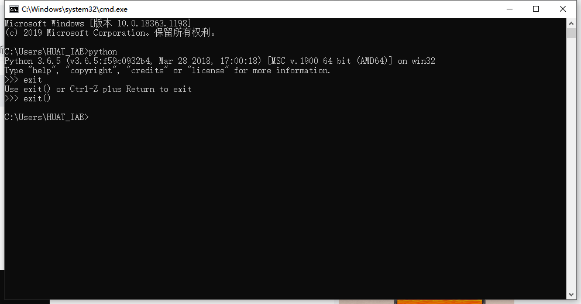
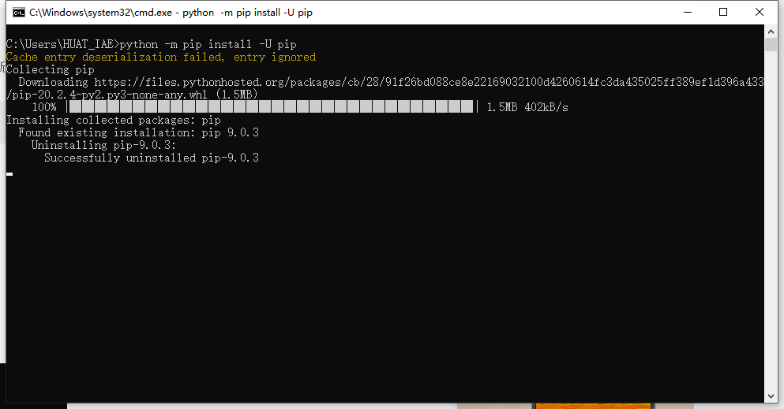
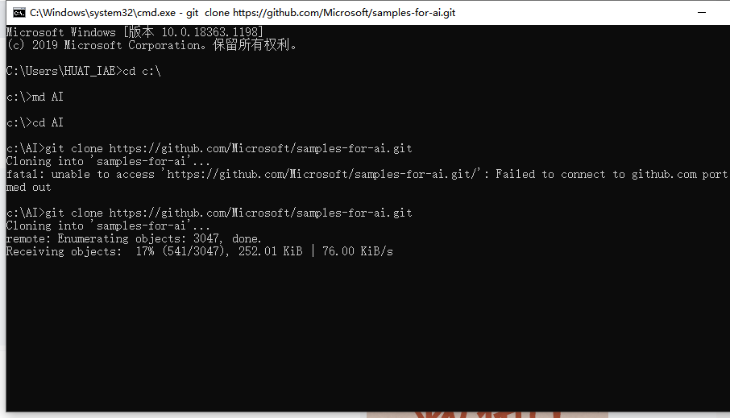
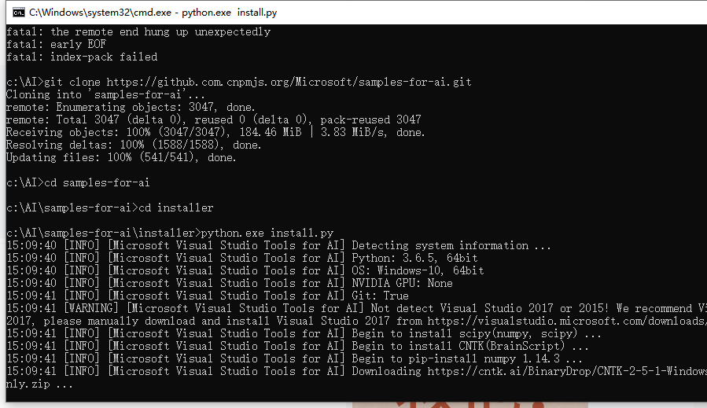
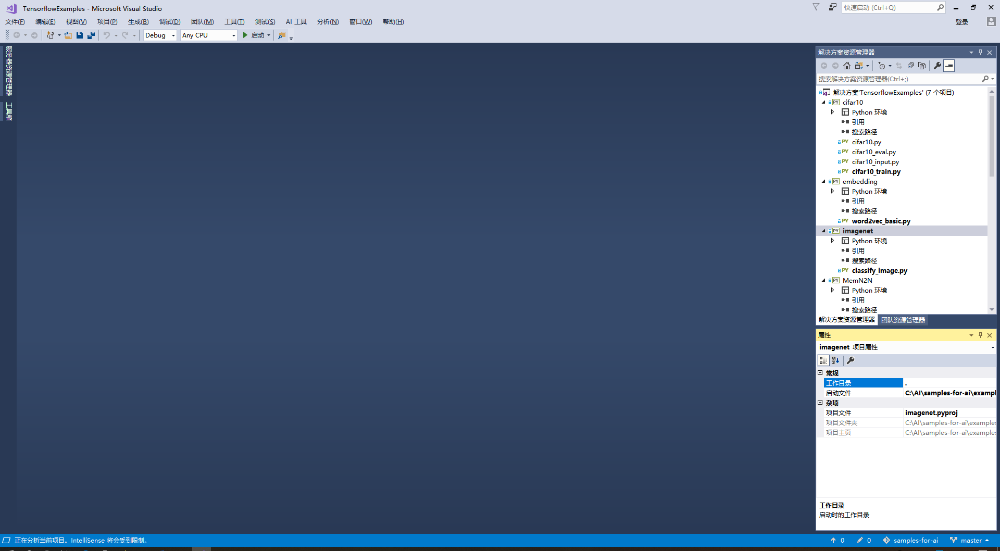
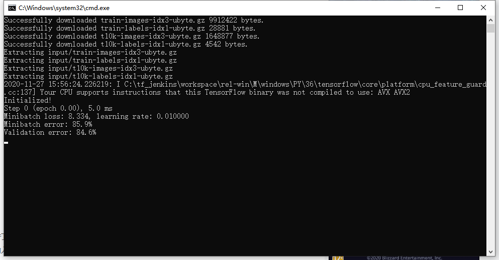
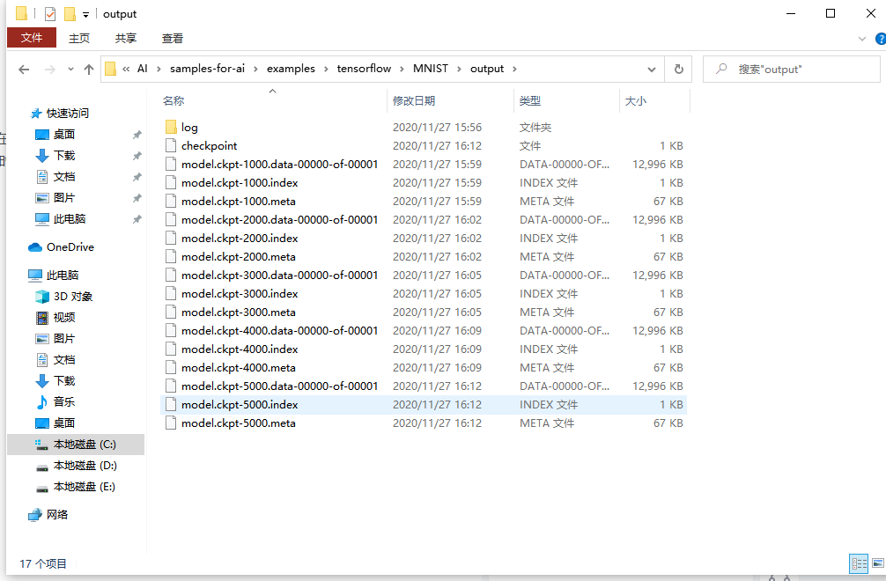
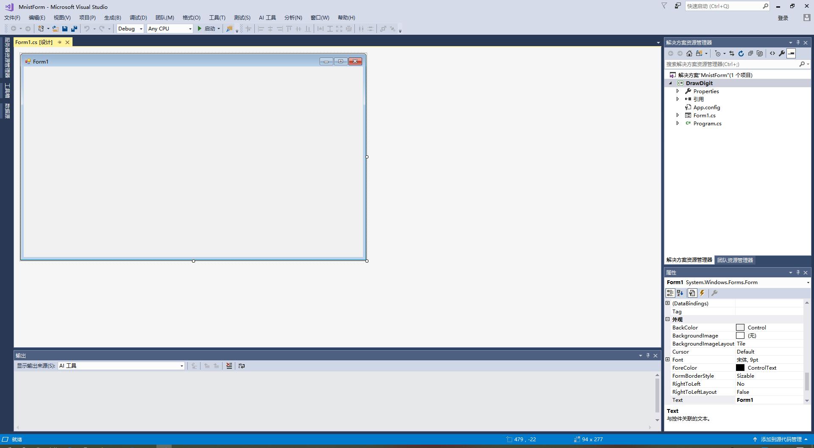

# 一、Windows下开发环境搭建

### 1.安装Git
访问 https://git-scm.com/download/win
选择64-bit Git for Windows Setup下载
双击.exe开始安装
选择好自己的安装路径，一路next，直到Adjusting your PATH environment
请选择Use Git from the Windows Command Prompt
这一步就已经将Git添加到环境变量中了，然后就可以直接在命令行里使用Git啦。


### 2.安装VS
打开Visual Studio Installer进行如下的配置：
仅选择.NET桌面开发与Python开发即可

### 3.安装python
访问 https://www.python.org/downloads/
选择版本3.5.4或3.6.5 ，Windows x86-64 executable installer下载。
打开安装包，在安装前，请选择Add Python 3.X to PATH，随后按照默认选项安装即可。
点选后，程序将自动将Python加入环境变量，这样避免在安装后手动配置环境变量。


安装结束后，请进行如下操作验证python是否安装成功
1.同时按下 win 与 R，在弹出的输入框里输入cmd
2.在弹出的窗口中输入 python 
3.输入exit()退出
4.输入python -m pip install -U pip以更新pip到最新版本





###　4.安装机器学习的软件及依赖
1 win + R ，打开cmd，在命令行中输入：
2 cd c:\  //选择一个你喜欢的路径
3 md  AI  //在这里创建一个AI目录
4 cd AI   //打开这个目录
//克隆仓库到本地
5 git clone https://github.com/Microsoft/samples-for-ai.git
6 cd samples-for-ai //打开这个目录
7 cd installer //还有这个目录
8 python.exe install.py //开始安装




### 5.安装tools for ai插件
打开Visual Studio，选择工具->扩展和更新->选择“联机”->搜索“AI”
就像这样：


等待下载完成之后，关闭Visual Studio，系统将自动安装AI插件。


安装完毕后再次打开Visual Studio，你将在界面上看到这样的内容：


安装成功！


# 二、离线模型的训练
首先我们打开这个路径：C:\AI\samples-for-ai\examples\tensorflow，如果你在别的目录下克隆了目录，那么请打开你对应的目录。然后双击TensorflowExamples.sln





等待一段时间之后，模型就训练好了！这个时候打开MNIST所在的文件夹，MNIST下多了三个文件夹，分别是input和output还有export，这三个文件夹分别存储了训练模型的输入文件、训练时的检查点文件，还有最终导出的模型文件

检查点文件：



# 三、手写识别应用入门
### 一、 思路

大致的步骤如下：
1.实现简单的界面，将用户用鼠标或者触屏的输入变成图片。
2.将生成的模型包装起来，成为有公开数据接口的类。
3.将输入的图片进行规范化，成为数据接口能够使用的格式。
4.最后通过模型来推理(inference)出图片应该是哪个数字，并显示出来。

### 二、动手
首先，我们打开Visual Studio，选择文件->新建->项目。

在弹出的窗口里选择Visual C#->Windows窗体应用，项目名称不妨叫做DrawDigit，解决方案名称不妨叫做MnistForm，点击确定。


此时，Visual Studio也自动弹出了一个窗口的设计图。



结果


#    课程报告
#第1章 概论
## 1.1 人工智能的定义
#### 第一个层面，人们对人工智能的**期待**可以分为：

- **智能地把某件特定的事情做好，在某个领域增强人类的智慧，这种方式又叫做智能增强**——像搜索引擎，自动语言翻译，某个领域的智能助手那样的程序，帮助人类完成某种特定任务。这也叫做“弱人工智能”，或者“狭义人工智能”。
- **像人类一样能认知，思考，判断：模拟人类的智能**——像人类一样能认知，思考，判断的智能软件。这是人工智能学科一开始就有的梦想。这样的智能也叫做“通用人工智能”（Artificial General Intelligence， AGI）， 或“强人工智能”。对于这样的人工智能，科幻小说有很多描写，也有一些研究，但是在实际的应用还没有什么突破。有学者认为，AGI是不可能通过目前人们编程程序的方式实现的。尽管如此，社会上还是有人担忧有一天电脑的AGI会超过人类的智能，人类再也赶不上电脑，从而永远受制于电脑。

#### 第二个层面，**从技术的特点来看**。

要实现某种狭义的人工智能，我们很自然地想到，如果我们能让运行程序的电脑来学习并自动掌握某些规律，那该多好啊，这就是“机器学习”。机器学习在几十年的发展历史中，产生了很多技术，这些技术都有下面的共性：

> 如果一个程序解决任务（T）的效能（用P表示）随着经验（E）得到了提高，那么，这个程序就能从经验（E）中学到了关于任务（T）的知识，并让衡量值（P）得到提高。

1. 选择一个模型结构（例如逻辑回归，决策树等），这就是上面说的程序。
2. 用训练数据（输入和输出）输入模型。这就是上面的经验（E）。
3. 通过不断执行任务（T）并衡量结果（P），让P
不断提高，直到达到一个满意的值。

那么，机器学习的各种方法是如何从经验中学习呢？我们可以大致地分为下面三种类型：

1. 监督学习（Supervised Learning）

    通过标注的数据来学习，例如，程序通过学习标注了正确答案的手写数字的图像数据，它就能认识其他的手写数字。

2. 无监督学习（Unsupervised Learning）

    通过没有标注的数据来学习。这种算法可以发现数据中自然形成的共同特性（聚类），可以用来发现不同数据之间的联系，例如，买了商品A的顾客往往也购买了商品B。

3. 强化学习（Reinforcement Learning）

    我们可以让程序选择和它的环境互动（例如玩一个游戏），环境给程序的反馈是一些“奖励”（例如游戏中获得高分），程序要学习到一个模型，能在这种环境中得到高的分数，不仅是当前局面要得到高分，而且最终的结果也要是高分才行。

综合来看，如果我们把机器学习当作一个小孩，那么，教育小孩的方式就有根据正确答案指导学习（监督学习）；根据小孩实践的过程给予各种鼓励（强化学习）；还有自由探索世界，让小孩自己总结规律（无监督学习）。

  机器学习领域出现了各种模型，其中，神经网络模型是一个重要的方法，它的原型在1943就出现了，在生物神经网络中，每个神经元与其他神经元相连，当它兴奋时，就会像相邻的神经元发送化学物质，从而改变这些神经元内的电位；如果某神经元的电位超过了一个阈值，那么它就会被激活（兴奋），向其他神经元发送化学物质。把许多这样的神经元按照一定的层次结构连接起来，我们就构建了一个神经网络。图1-4是M-P神经元模型的示意图。


    图1-4 M-P神经元模型


#### 第三个层面，**从应用的角度来看**，我们看到狭义人工智能在各个领域都取得了很大的成果。
一种是标杆式的任务，例如ImageNet，考察AI模型能否识别图像的类别，2015年，AI取得了超过人类的成果。在其它的领域中，我们也看到了AI取得了达到或超过人类最高水平的成绩：

- 翻译领域（微软的中英翻译超过人类）
- 阅读理解（SQuAD 比赛）
- 下围棋（2016）德州扑克（2019）麻将（2019）

另一种，是AI技术和各种其他技术结合，解决政府，企业，个人用户的需求。在政府方面，把所有计算，数据，云端和物联网终端的设备联系起来，搭建一个能支持智能决定的系统，现代社会的城市管理，金融，医疗，物流和交通管理等等都运行在这样的系统上。专家称之为智能基础建设。
## 1.2 范式的演化
#### 数据模拟

我们还可以用数据模拟的方法，来看看在各种情况下，换或者不换的结果如何。

看我们的`Python`程序示例，如图1-11所示。


图1-11 用程序模拟智能之门问题

我们看到，当我们随机模拟一百万轮换门（switching）和不换门（not switching）的情况后，我们得到了这样的结果：

- 换门：最后得奖的概率是 $0.666572$（约$\displaystyle \frac{2}{3}$）
- 不换门：最后得奖的概率是 $0.334115$（约$\displaystyle \frac{1}{3}$）
#### 数据探索

当人类探索客观世界的时候，大部分情况下，我们是不了解新环境的运行规则的。这个时候，我们可以观察自己的行动和客观世界的反馈，判断得失，再总结出规律。这种学习方法，叫强化学习（Reinforcement Learning），可以使用这种方法来找出适合的策略。

我们假设顾客就是图1-12的行动者（Agent），他身处环境中，有一定的状态，他为了达到一定的目的（总的奖励），不断地采取一系列的动作去尝试与环境进行交互，这些交互会给他带来奖励，同时改变他的状态，他可以交互中根据反馈不断地调整策略，试图了解到状态、动作和总的奖励关系。强化学习可以通过表格来跟踪和调整这些关系（例如Q-Learning方法）或者通过神经网络来达到同样的目的。


## 1.3 神经网络的基本工作原理简介
### 1.3.1 神经元细胞的数学模型

神经网络由基本的神经元组成，图1-13就是一个神经元的数学/计算模型，便于我们用程序来实现。


图1-13 神经元计算模型

#### 输入 input

$(x_1,x_2,x_3)$ 是外界输入信号，一般是一个训练数据样本的多个属性，比如，我们要预测一套房子的价格，那么在房屋价格数据样本中，$x_1$ 可能代表了面积，$x_2$ 可能代表地理位置，$x_3$ 可能代表朝向。另外一个例子是，$(x_1,x_2,x_3)$ 分别代表了(红,绿,蓝)三种颜色，而此神经元用于识别输入的信号是暖色还是冷色。

#### 权重 weights

$(w_1,w_2,w_3)$ 是每个输入信号的权重值，以上面的 $(x_1,x_2,x_3)$ 的例子来说，$x_1$ 的权重可能是 $0.92$，$x_2$ 的权重可能是 $0.2$，$x_3$ 的权重可能是 $0.03$。当然权重值相加之后可以不是 $1$。

#### 偏移 bias

还有个 $b$ 是怎么来的？一般的书或者博客上会告诉你那是因为 $y=wx+b$，$b$ 是偏移值，使得直线能够沿 $Y$ 轴上下移动。这是用结果来解释原因，并非 $b$ 存在的真实原因。从生物学上解释，在脑神经细胞中，一定是输入信号的电平/电流大于某个临界值时，神经元细胞才会处于兴奋状态，这个 $b$ 实际就是那个临界值。亦即当：

$$w_1 \cdot x_1 + w_2 \cdot x_2 + w_3 \cdot x_3 \geq t$$

时，该神经元细胞才会兴奋。我们把t挪到等式左侧来，变成$(-t)$，然后把它写成 $b$，变成了：

$$w_1 \cdot x_1 + w_2 \cdot x_2 + w_3 \cdot x_3 + b \geq 0$$

于是 $b$ 诞生了！

#### 求和计算 sum

$$
\begin{aligned}
Z &= w_1 \cdot x_1 + w_2 \cdot x_2 + w_3 \cdot x_3 + b \\\\
&= \sum_{i=1}^m(w_i \cdot x_i) + b
\end{aligned}
$$

在上面的例子中 $m=3$。我们把$w_i \cdot x_i$变成矩阵运算的话，就变成了：

$$Z = W \cdot X + b$$

#### 激活函数 activation

求和之后，神经细胞已经处于兴奋状态了，已经决定要向下一个神经元传递信号了，但是要传递多强烈的信号，要由激活函数来确定：

$$A=\sigma{(Z)}$$

如果激活函数是一个阶跃信号的话，会像继电器开合一样咔咔的开启和闭合，在生物体中是不可能有这种装置的，而是一个渐渐变化的过程。所以一般激活函数都是有一个渐变的过程，也就是说是个曲线，如图1-14所示。


图1-14 激活函数图像

至此，一个神经元的工作过程就在电光火石般的一瞬间结束了。

#### 小结

- 一个神经元可以有多个输入。
- 一个神经元只能有一个输出，这个输出可以同时输入给多个神经元。
- 一个神经元的 $w$ 的数量和输入的数量一致。
- 一个神经元只有一个 $b$。
- $w$ 和 $b$ 有人为的初始值，在训练过程中被不断修改。
- $A$ 可以等于 $Z$，即激活函数不是必须有的。
- 一层神经网络中的所有神经元的激活函数必须一致。
### 1.3.2 神经网络的训练过程

#### 单层神经网络模型

这是一个单层的神经网络，有 $m$ 个输入 (这里 $m=3$)，有 $n$ 个输出 (这里 $n=2$)。在神经网络中，$b$ 到每个神经元的权值来表示实际的偏移值，亦即 $(b_1,b_2)$，这样便于矩阵运算。也有些人把 $b$ 写成 $x_0$，其实是同一个效果，即把偏移值看做是神经元的一个输入。

- $(x_1,x_2,x_3)$ 是一个样本数据的三个特征值
- $(w_{11},w_{21},w_{31})$ 是 $(x_1,x_2,x_3)$ 到 $n1$ 的权重
- $(w_{12},w_{22},w_{32})$ 是 $(x_1,x_2,x_3)$ 到 $n2$ 的权重
- $b_1$ 是 $n1$ 的偏移
- $b_2$ 是 $n2$ 的偏移


图1-15 单层神经网络模型

从图1-15大家可以看到，同一个特征 $x_1$，对于$n1,n2$来说，权重是不相同的，因为 $n1,n2$ 是两个神经元，它们完成不同的任务（特征识别）。我们假设 $x_1,x_2,x_3$ 分别代表红绿蓝三种颜色，而 $n1,n2$ 分别用于识别暖色和冷色，那么 $x_1$ 到 $n1$ 的权重，肯定要大于 $x_1$ 到 $n2$ 的权重，因为 $x_1$ 代表红色，是暖色。

而对于 $n1$ 来说，$x_1,x_2,x_3$ 输入的权重也是不相同的，因为它要对不同特征有选择地接纳。如同上面的例子，$n1$ 对于代表红色的 $x_1$，肯定是特别重视，权重值较高；而对于代表蓝色的 $x_3$，尽量把权重值降低，才能有正确的输出。

#### 训练流程

从真正的“零”开始学习神经网络时，我没有看到过任何一个流程图来讲述训练过程，大神们写书或者博客时都忽略了这一点，图1-16是一个简单的流程图。


图1-16 神经网络训练流程图
### 1.3.3 神经网络中的矩阵运算

图1-17是一个两层的神经网络，包含隐藏层和输出层，输入层不算做一层。


图1-17 神经网络中的各种符号约定

$$
z1_1 = x_1 \cdot w1_{1,1}+ x_2 \cdot w1_{2,1}+b1_1
$$
$$
z1_2 = x_1 \cdot w1_{1,2}+ x_2 \cdot w1_{2,2}+b1_2
$$
$$
z1_3 = x_1 \cdot w1_{1,3}+ x_2 \cdot w1_{2,3}+b1_3
$$

变成矩阵运算：

$$
z1_1=
\begin{pmatrix}
x_1 & x_2
\end{pmatrix}
\begin{pmatrix}
w1_{1,1} \\\\
w1_{2,1}
\end{pmatrix}
+b1_1
$$

$$
z1_2=
\begin{pmatrix}
x_1 & x_2
\end{pmatrix}
\begin{pmatrix}
w1_{1,2} \\\\
w1_{2,2}
\end{pmatrix}
+b1_2
$$

$$
z1_3=
\begin{pmatrix}
x_1 & x_2
\end{pmatrix}
\begin{pmatrix}
w1_{1,3} \\\\
w1_{2,3}
\end{pmatrix}
+b1_3
$$

再变成大矩阵：

$$
Z1 =
\begin{pmatrix}
x_1 & x_2 
\end{pmatrix}
\begin{pmatrix}
w1_{1,1}&w1_{1,2}&w1_{1,3} \\\\
w1_{2,1}&w1_{2,2}&w1_{2,3} \\\\
\end{pmatrix}
+\begin{pmatrix}
b1_1 & b1_2 & b1_3
\end{pmatrix}
$$

最后变成矩阵符号：

$$Z1 = X \cdot W1 + B1$$

然后是激活函数运算：

$$A1=a(Z1)$$

同理可得：

$$Z2 = A1 \cdot W2 + B2$$

注意：损失函数不是前向计算的一部分。
### 1.3.4 神经网络的主要功能

#### 回归（Regression）或者叫做拟合（Fitting）

单层的神经网络能够模拟一条二维平面上的直线，从而可以完成线性分割任务。而理论证明，两层神经网络可以无限逼近任意连续函数。图1-18所示就是一个两层神经网络拟合复杂曲线的实例。


图1-18 回归/拟合示意图

所谓回归或者拟合，其实就是给出x值输出y值的过程，并且让y值与样本数据形成的曲线的距离尽量小，可以理解为是对样本数据的一种骨架式的抽象。

以图1-18为例，蓝色的点是样本点，从中可以大致地看出一个轮廓或骨架，而红色的点所连成的线就是神经网络的学习结果，它可以“穿过”样本点群形成中心线，尽量让所有的样本点到中心线的距离的和最近。

#### 分类（Classification）

如图1-19，二维平面中有两类点，红色的和蓝色的，用一条直线肯定不能把两者分开了。


图1-19 分类示意图

我们使用一个两层的神经网络可以得到一个非常近似的结果，使得分类误差在满意的范围之内。图1-19中那条淡蓝色的曲线，本来并不存在，是通过神经网络训练出来的分界线，可以比较完美地把两类样本分开，所以分类可以理解为是对两类或多类样本数据的边界的抽象。

图1-18和图1-19的曲线形态实际上是一个真实的函数在 $[0,1]$ 区间内的形状，其原型是：

$$y=0.4x^2 + 0.3x\sin(15x) + 0.01\cos(50x)-0.3$$

这么复杂的函数，一个两层的神经网络是如何做到的呢？其实从输入层到隐藏层的矩阵计算，就是对输入数据进行了空间变换，使其可以被线性可分，然后在输出层画出一个分界线。而训练的过程，就是确定那个空间变换矩阵的过程。因此，多层神经网络的本质就是对复杂函数的拟合。我们可以在后面的试验中来学习如何拟合上述的复杂函数的。

神经网络的训练结果，是一大堆的权重组成的数组（近似解），并不能得到上面那种精确的数学表达式（数学解析解）。
# 第2章 神经网络中的三个基本概念

## 通俗地理解三大概念

这三大概念是：反向传播，梯度下降，损失函数。
神经网络训练的最基本的思想就是：先“猜”一个结果，称为预测结果 aa，看看这个预测结果和事先标记好的训练集中的真实结果 yy 之间的差距，然后调整策略，再试一次，这一次就不是“猜”了，而是有依据地向正确的方向靠近。如此反复多次，一直到预测结果和真实结果之间相差无几，亦即 |a-y|\rightarrow 0∣a−y∣→0，就结束训练。


简单总结一下反向传播与梯度下降的基本工作原理：

1. 初始化；
2. 正向计算；
3. 损失函数为我们提供了计算损失的方法；
4. 梯度下降是在损失函数基础上向着损失最小的点靠近而指引了网络权重调整的方向；
5. 反向传播把损失值反向传给神经网络的每一层，让每一层都根据损失值反向调整权重；
6. Go to 2，直到精度足够好（比如损失函数值小于 $0.001$）。
##  线性反向传播
正向计算的实例

假设有一个函数：

$$z = x \cdot y \tag{1}$$

其中:

$$x = 2w + 3b \tag{2}$$

$$y = 2b + 1 \tag{3}$$

计算图如图2-4。


图2-4 简单线性计算的计算图

注意这里 $x,y,z$ 不是变量，只是中间计算结果；$w,b$ 才是变量。因为在后面要学习的神经网络中，要最终求解的目标是 $w$ 和 $b$ 的值，所以在这里先预热一下。

当 $w = 3, b = 4$ 时，会得到图2-5的结果。


图2-5 计算结果

最终的 $z$ 值，受到了前面很多因素的影响：变量 $w$，变量 $b$，计算式 $x$，计算式 $y$。

### 反向传播求解 $w$

#### 求 $w$ 的偏导

目前 $z=162$，如果想让 $z$ 变小一些，比如目标是 $z=150$，$w$ 应该如何变化呢？为了简化问题，先只考虑改变 $w$ 的值，而令 $b$ 值固定为 $4$。

如果想解决这个问题，最笨的办法是可以在输入端一点一点的试，把 $w$ 变成 $3.5$ 试试，再变成 $3$ 试试......直到满意为止。现在我们将要学习一个更好的解决办法：反向传播。

从 $z$ 开始一层一层向回看，图中各节点关于变量 $w$ 的偏导计算结果如下：

因为 $$z = x \cdot y$$，其中 $$x = 2w + 3b, y = 2b + 1$$

所以：

$$\frac{\partial{z}}{\partial{w}}=\frac{\partial{z}}{\partial{x}} \cdot \frac{\partial{x}}{\partial{w}}=y \cdot 2=18 \tag{4}$$

其中：

$$\frac{\partial{z}}{\partial{x}}=\frac{\partial{}}{\partial{x}}(x \cdot y)=y=9$$

$$\frac{\partial{x}}{\partial{w}}=\frac{\partial{}}{\partial{w}}(2w+3b)=2$$


图2-6 对 $w$ 的偏导求解过程

图2-6其实就是链式法则的具体表现，$z$ 的误差通过中间的 $x$ 传递到 $w$。如果不是用链式法则，而是直接用 $z$ 的表达式计算对 $w$ 的偏导数，会怎么样呢？我们来试验一下。

根据公式1、2、3，我们有：

$$z=x \cdot y=(2w+3b)(2b+1)=4wb+2w+6b^2+3b \tag{5}$$

对上式求 $w$ 的偏导：

$$
\frac{\partial z}{\partial w}=4b+2=4 \cdot 4 + 2=18 \tag{6}
$$

公式4和公式6的结果完全一致！所以，请大家相信链式法则的科学性。

#### 求 $w$ 的具体变化值

公式4和公式6的含义是：当 $w$ 变化一点点时，$z$ 会产生 $w$ 的变化值18倍的变化。记住我们的目标是让 $z=150$，目前在初始状态时是 $z=162$，所以，问题转化为：当需要 $z$ 从 $162$ 变到 $150$ 时，$w$ 需要变化多少？

既然：

$$
\Delta z = 18 \cdot \Delta w
$$

则：

$$
\Delta w = {\Delta z \over 18}=\frac{162-150}{18}= 0.6667
$$

所以：

$$w = w - 0.6667=2.3333$$
$$x=2w+3b=16.6667$$
$$z=x \cdot y=16.6667 \times 9=150.0003$$

我们一下子就成功地让 $z$ 值变成了 $150.0003$，与 $150$ 的目标非常地接近，这就是偏导数的威力所在。

###  反向传播求解 $b$

#### 求 $b$ 的偏导

这次我们令 $w$ 的值固定为 $3$，变化 $b$ 的值，目标还是让 $z=150$。同上一小节一样，先求 $b$ 的偏导数。

注意，在上一小节中，求 $w$ 的导数只经过了一条路：从 $z$ 到 $x$ 到 $w$。但是求 $b$ 的导数时要经过两条路，如图2-7所示：

1. 从 $z$ 到 $x$ 到 $b$；
2. 从 $z$ 到 $y$ 到 $b$。


图2-7 对b的偏导求解过程

从复合导数公式来看，这两者应该是相加的关系，所以有：

$$\frac{\partial{z}}{\partial{b}}=\frac{\partial{z}}{\partial{x}} \cdot \frac{\partial{x}}{\partial{b}}+\frac{\partial{z}}{\partial{y}}\cdot\frac{\partial{y}}{\partial{b}}=y \cdot 3+x \cdot 2=63 \tag{7}$$

其中：

$$\frac{\partial{z}}{\partial{x}}=\frac{\partial{}}{\partial{x}}(x \cdot y)=y=9$$
$$\frac{\partial{z}}{\partial{y}}=\frac{\partial{}}{\partial{y}}(x \cdot y)=x=18$$
$$\frac{\partial{x}}{\partial{b}}=\frac{\partial{}}{\partial{b}}(2w+3b)=3$$
$$\frac{\partial{y}}{\partial{b}}=\frac{\partial{}}{\partial{b}}(2b+1)=2$$

我们不妨再验证一下链式求导的正确性。把公式5再拿过来：

$$z=x \cdot y=(2w+3b)(2b+1)=4wb+2w+6b^2+3b \tag{5}$$

对上式求b的偏导：

$$
\frac{\partial z}{\partial b}=4w+12b+3=12+48+3=63 \tag{8}
$$

结果和公式7的链式法则一样。

#### 求 $b$ 的具体变化值

公式7和公式8的含义是：当 $b$ 变化一点点时，$z$ 会发生 $b$ 的变化值 $63$ 倍的变化。记住我们的目标是让 $z=150$，目前在初始状态时是 $162$，所以，问题转化为：当我们需要 $z$ 从 $162$ 变到 $150$ 时，$b$ 需要变化多少？

既然：

$$\Delta z = 63 \cdot \Delta b$$

则：

$$
\Delta b = \frac{\Delta z}{63}=\frac{162-150}{63}=0.1905
$$

所以：
$$
b=b-0.1905=3.8095
$$
$$x=2w+3b=17.4285$$
$$y=2b+1=8.619$$
$$z=x \cdot y=17.4285 \times 8.619=150.2162$$

这个结果也是与 $150$ 很接近了，但是精度还不够。再迭代几次，直到误差不大于 `1e-4` 时，我们就可以结束迭代了，对于计算机来说，这些运算的执行速度很快。

###  同时求解 $w$ 和 $b$ 的变化值

这次我们要同时改变 $w$ 和 $b$，到达最终结果为 $z=150$ 的目的。

已知 $\Delta z=12$，我们不妨把这个误差的一半算在 $w$ 的账上，另外一半算在 $b$ 的账上：

$$\Delta b=\frac{\Delta z / 2}{63} = \frac{12/2}{63}=0.095$$

$$\Delta w=\frac{\Delta z / 2}{18} = \frac{12/2}{18}=0.333$$

- $w = w-\Delta w=3-0.333=2.667$
- $b = b - \Delta b=4-0.095=3.905$
- $x=2w+3b=2 \times 2.667+3 \times 3.905=17.049$
- $y=2b+1=2 \times 3.905+1=8.81$
- $z=x \times y=17.049 \times 8.81=150.2$

容易出现的问题：

1. 在检查 $\Delta z$ 时的值时，注意要用绝对值，因为有可能是个负数
2. 在计算 $\Delta b$ 和 $\Delta w$ 时，第一次时，它们对 $z$ 的贡献值分别是 $1/63$ 和 $1/18$，但是第二次时，由于 $b,w$ 值的变化，对 $z$ 的贡献值也会有微小变化，所以要重新计算。具体解释如下：

$$
\frac{\partial{z}}{\partial{b}}=\frac{\partial{z}}{\partial{x}} \cdot \frac{\partial{x}}{\partial{b}}+\frac{\partial{z}}{\partial{y}}\cdot\frac{\partial{y}}{\partial{b}}=y \cdot 3+x \cdot 2=3y+2x
$$
$$
\frac{\partial{z}}{\partial{w}}=\frac{\partial{z}}{\partial{x}} \cdot \frac{\partial{x}}{\partial{w}}+\frac{\partial{z}}{\partial{y}}\cdot\frac{\partial{y}}{\partial{w}}=y \cdot 2+x \cdot 0 = 2y
$$
所以，在每次迭代中，要重新计算下面两个值：
$$
\Delta b=\frac{\Delta z}{3y+2x}
$$
$$
\Delta w=\frac{\Delta z}{2y}
$$

以下是程序的运行结果。

没有在迭代中重新计算 $\Delta b$ 的贡献值：
```
single variable: b -----
w=3.000000,b=4.000000,z=162.000000,delta_z=12.000000
delta_b=0.190476
w=3.000000,b=3.809524,z=150.217687,delta_z=0.217687
delta_b=0.003455
w=3.000000,b=3.806068,z=150.007970,delta_z=0.007970
delta_b=0.000127
w=3.000000,b=3.805942,z=150.000294,delta_z=0.000294
delta_b=0.000005
w=3.000000,b=3.805937,z=150.000011,delta_z=0.000011
delta_b=0.000000
w=3.000000,b=3.805937,z=150.000000,delta_z=0.000000
done!
final b=3.805937
```
在每次迭代中都重新计算 $\Delta b$ 的贡献值：
```
single variable new: b -----
w=3.000000,b=4.000000,z=162.000000,delta_z=12.000000
factor_b=63.000000, delta_b=0.190476
w=3.000000,b=3.809524,z=150.217687,delta_z=0.217687
factor_b=60.714286, delta_b=0.003585
w=3.000000,b=3.805938,z=150.000077,delta_z=0.000077
factor_b=60.671261, delta_b=0.000001
w=3.000000,b=3.805937,z=150.000000,delta_z=0.000000
done!
final b=3.805937
```
从以上两个结果对比中，可以看到三点：

1. `factor_b`第一次是`63`，以后每次都会略微降低一些
2. 第二个函数迭代了3次就结束了，而第一个函数迭代了5次，效率不一样
3. 最后得到的结果是一样的，因为这个问题只有一个解

对于双变量的迭代，有同样的问题：

没有在迭代中重新计算 $\Delta b,\Delta w$ 的贡献值(`factor_b`和`factor_w`每次都保持`63`和`18`)：
```
double variable: w, b -----
w=3.000000,b=4.000000,z=162.000000,delta_z=12.000000
delta_b=0.095238, delta_w=0.333333
w=2.666667,b=3.904762,z=150.181406,delta_z=0.181406
delta_b=0.001440, delta_w=0.005039
w=2.661628,b=3.903322,z=150.005526,delta_z=0.005526
delta_b=0.000044, delta_w=0.000154
w=2.661474,b=3.903278,z=150.000170,delta_z=0.000170
delta_b=0.000001, delta_w=0.000005
w=2.661469,b=3.903277,z=150.000005,delta_z=0.000005
done!
final b=3.903277
final w=2.661469
```

在每次迭代中都重新计算 $\Delta b,\Delta w$ 的贡献值(`factor_b`和`factor_w`每次都变化)：
```
double variable new: w, b -----
w=3.000000,b=4.000000,z=162.000000,delta_z=12.000000
factor_b=63.000000, factor_w=18.000000, delta_b=0.095238, delta_w=0.333333
w=2.666667,b=3.904762,z=150.181406,delta_z=0.181406
factor_b=60.523810, factor_w=17.619048, delta_b=0.001499, delta_w=0.005148
w=2.661519,b=3.903263,z=150.000044,delta_z=0.000044
factor_b=60.485234, factor_w=17.613053, delta_b=0.000000, delta_w=0.000001
w=2.661517,b=3.903263,z=150.000000,delta_z=0.000000
done!
final b=3.903263
final w=2.661517
```
##  非线性反向传播


#### 正向过程

1. 第1个人，输入层，随机输入第一个 $x$ 值，$x$ 的取值范围 $(1,10]$，假设第一个数是 $2$；
2. 第2个人，第一层网络计算，接收第1个人传入 $x$ 的值，计算：$a=x^2$；
3. 第3个人，第二层网络计算，接收第2个人传入 $a$ 的值，计算：$b=\ln (a)$；
4. 第4个人，第三层网络计算，接收第3个人传入 $b$ 的值，计算：$c=\sqrt{b}$；
5. 第5个人，输出层，接收第4个人传入 $c$ 的值

#### 反向过程

6. 第5个人，计算 $y$ 与 $c$ 的差值：$\Delta c = c - y$，传回给第4个人
7. 第4个人，接收第5个人传回$\Delta c$，计算 $\Delta b = \Delta c \cdot 2\sqrt{b}$
8. 第3个人，接收第4个人传回$\Delta b$，计算 $\Delta a = \Delta b \cdot a$
9. 第2个人，接收第3个人传回$\Delta a$，计算 $\Delta x = \frac{\Delta}{2x}$
10. 第1个人，接收第2个人传回$\Delta x$，更新 $x \leftarrow x - \Delta x$，回到第1步

提出问题：假设我们想最后得到 $c=2.13$ 的值，$x$ 应该是多少？（误差小于 $0.001$ 即可）

### 数学解析解

$$c=\sqrt{b}=\sqrt{\ln(a)}=\sqrt{\ln(x^2)}=2.13$$
$$x = 9.6653$$

### 梯度迭代解

$$
\frac{da}{dx}=\frac{d(x^2)}{dx}=2x=\frac{\Delta a}{\Delta x} \tag{1}
$$
$$
\frac{db}{da} =\frac{d(\ln{a})}{da} =\frac{1}{a} = \frac{\Delta b}{\Delta a} \tag{2}
$$
$$
\frac{dc}{db}=\frac{d(\sqrt{b})}{db}=\frac{1}{2\sqrt{b}}=\frac{\Delta c}{\Delta b} \tag{3}
$$
因此得到如下一组公式，可以把最后一层 $\Delta c$ 的误差一直反向传播给最前面的 $\Delta x$，从而更新 $x$ 值：
$$
\Delta c = c - y \tag{4}
$$
$$
\Delta b = \Delta c \cdot 2\sqrt{b}  \tag{根据式3}
$$
$$
\Delta a = \Delta b \cdot a  \tag{根据式2}
$$
$$
\Delta x = \Delta a / 2x \tag{根据式1}
$$

我们给定初始值 $x=2$，$\Delta x=0$，依次计算结果如表2-2。

表2-2 正向与反向的迭代计算

|方向|公式|迭代1|迭代2|迭代3|迭代4|迭代5|
|---|---|---|---|---|---|---|
|正向|$x=x-\Delta x$|2|4.243|7.344|9.295|9.665|
|正向|$a=x^2$|4|18.005|53.934|86.404|93.233|
|正向|$b=\ln(a)$|1.386|2.891|3.988|4.459|4.535|
|正向|$c=\sqrt{b}$|1.177|1.700|1.997|2.112|2.129|
||标签值y|2.13|2.13|2.13|2.13|2.13|
|反向|$\Delta c = c - y$|-0.953|-0.430|-0.133|-0.018||
|反向|$\Delta b = \Delta c \cdot 2\sqrt{b}$|-2.243|-1.462|-0.531|-0.078||
|反向|$\Delta a = \Delta b \cdot a$|-8.973|-26.317|-28.662|-6.698||
|反向|$\Delta x = \Delta a / 2x$|-2.243|-3.101|-1.951|-0.360||

表2-2，先看“迭代-1”列，从上到下是一个完整的正向+反向的过程，最后一行是 $-2.243$，回到“迭代-2”列的第一行，$2-(-2.243)=4.243$，然后继续向下。到第5轮时，正向计算得到的 $c=2.129$，非常接近 $2.13$ 了，迭代结束。

运行示例代码可以得到如下结果：

```
how to play: 1) input x, 2) calculate c, 3) input target number but not faraway from c
input x as initial number(1.2,10), you can try 1.3:
2
c=1.177410
input y as target number(0.5,2), you can try 1.8:
2.13
forward...
x=2.000000,a=4.000000,b=1.386294,c=1.177410
backward...
delta_c=-0.952590, delta_b=-2.243178, delta_a=-8.972712, delta_x=-2.243178
......
forward...
x=9.655706,a=93.232666,b=4.535098,c=2.129577
backward...
done!
```

为节省篇幅只列出了第一步和最后一步（第5步）的结果，第一步时`c=1.177410`，最后一步时`c=2.129577`，停止迭代。

## 梯度下降

#### 从自然现象中理解梯度下降

在大多数文章中，都以“一个人被困在山上，需要迅速下到谷底”来举例，这个人会“寻找当前所处位置最陡峭的地方向下走”。这个例子中忽略了安全因素，这个人不可能沿着最陡峭的方向走，要考虑坡度。

在自然界中，梯度下降的最好例子，就是泉水下山的过程：

1. 水受重力影响，会在当前位置，沿着最陡峭的方向流动，有时会形成瀑布（梯度下降）；
2. 水流下山的路径不是唯一的，在同一个地点，有可能有多个位置具有同样的陡峭程度，而造成了分流（可以得到多个解）；
3. 遇到坑洼地区，有可能形成湖泊，而终止下山过程（不能得到全局最优解，而是局部最优解）。
#### 梯度下降的数学理解

梯度下降的数学公式：

$$\theta_{n+1} = \theta_{n} - \eta \cdot \nabla J(\theta) \tag{1}$$

其中：

- $\theta_{n+1}$：下一个值；
- $\theta_n$：当前值；
- $-$：减号，梯度的反向；
- $\eta$：学习率或步长，控制每一步走的距离，不要太快以免错过了最佳景点，不要太慢以免时间太长；
- $\nabla$：梯度，函数当前位置的最快上升点；
- $J(\theta)$：函数。

#### 梯度下降的三要素

1. 当前点；
2. 方向；
3. 步长。

#### 为什么说是“梯度下降”？

“梯度下降”包含了两层含义：

1. 梯度：函数当前位置的最快上升点；
2. 下降：与导数相反的方向，用数学语言描述就是那个减号。

亦即与上升相反的方向运动，就是下降。


图2-9 梯度下降的步骤

图2-9解释了在函数极值点的两侧做梯度下降的计算过程，梯度下降的目的就是使得x值向极值点逼近。

#### 单变量函数的梯度下降

假设一个单变量函数：

$$J(x) = x ^2$$

我们的目的是找到该函数的最小值，于是计算其微分：

$$J'(x) = 2x$$

假设初始位置为：

$$x_0=1.2$$

假设学习率：

$$\eta = 0.3$$

根据公式(1)，迭代公式：

$$x_{n+1} = x_{n} - \eta \cdot \nabla J(x)= x_{n} - \eta \cdot 2x$$

假设终止条件为 $J(x)<0.01$，迭代过程是：
```
x=0.480000, y=0.230400
x=0.192000, y=0.036864
x=0.076800, y=0.005898
x=0.030720, y=0.000944
```

上面的过程如图2-10所示。


图2-10 使用梯度下降法迭代的过程

####  双变量的梯度下降

假设一个双变量函数：

$$J(x,y) = x^2 + \sin^2(y)$$

我们的目的是找到该函数的最小值，于是计算其微分：

$${\partial{J(x,y)} \over \partial{x}} = 2x$$
$${\partial{J(x,y)} \over \partial{y}} = 2 \sin y \cos y$$

假设初始位置为：

$$(x_0,y_0)=(3,1)$$

假设学习率：

$$\eta = 0.1$$

根据公式(1)，迭代过程是的计算公式：
$$(x_{n+1},y_{n+1}) = (x_n,y_n) - \eta \cdot \nabla J(x,y)$$
$$ = (x_n,y_n) - \eta \cdot (2x,2 \cdot \sin y \cdot \cos y) \tag{1}$$

根据公式(1)，假设终止条件为 $J(x,y)<0.01$，迭代过程如表2-3所示。

表2-3 双变量梯度下降的迭代过程

|迭代次数|x|y|J(x,y)|
|---|---|---|---|
|1|3|1|9.708073|
|2|2.4|0.909070|6.382415|
|...|...|...|...|
|15|0.105553|0.063481|0.015166|
|16|0.084442|0.050819|0.009711|

迭代16次后，$J(x,y)$ 的值为 $0.009711$，满足小于 $0.01$ 的条件，停止迭代。

上面的过程如表2-4所示，由于是双变量，所以需要用三维图来解释。请注意看两张图中间那条隐隐的黑色线，表示梯度下降的过程，从红色的高地一直沿着坡度向下走，直到蓝色的洼地。

表2-4 在三维空间内的梯度下降过程

|观察角度1|观察角度2|
|--|--|
|||

#### 学习率η的选择

在公式表达时，学习率被表示为$\eta$。在代码里，我们把学习率定义为`learning_rate`，或者`eta`。针对上面的例子，试验不同的学习率对迭代情况的影响，如表2-5所示。

表2-5 不同学习率对迭代情况的影响

|学习率|迭代路线图|说明|
|---|---|---|
|1.0||学习率太大，迭代的情况很糟糕，在一条水平线上跳来跳去，永远也不能下降。|
|0.8||学习率大，会有这种左右跳跃的情况发生，这不利于神经网络的训练。|
|0.4||学习率合适，损失值会从单侧下降，4步以后基本接近了理想值。|
|0.1||学习率较小，损失值会从单侧下降，但下降速度非常慢，10步了还没有到达理想状态。|
# 第3章 损失函数
## 3.0 损失函数概论

### 3.0.1 概念

在各种材料中经常看到的中英文词汇有：误差，偏差，Error，Cost，Loss，损失，代价......意思都差不多，在本书中，使用“损失函数”和“Loss Function”这两个词汇，具体的损失函数符号用 $J$ 来表示，误差值用 $loss$ 表示。

“损失”就是所有样本的“误差”的总和，亦即（$m$ 为样本数）：

$$损失 = \sum^m_{i=1}误差_i$$

$$J = \sum_{i=1}^m loss_i$$

在黑盒子的例子中，我们如果说“某个样本的损失”是不对的，只能说“某个样本的误差”，因为样本是一个一个计算的。如果我们把神经网络的参数调整到完全满足独立样本的输出误差为 $0$，通常会令其它样本的误差变得更大，这样作为误差之和的损失函数值，就会变得更大。所以，我们通常会在根据某个样本的误差调整权重后，计算一下整体样本的损失函数值，来判定网络是不是已经训练到了可接受的状态。

#### 损失函数的作用

损失函数的作用，就是计算神经网络每次迭代的前向计算结果与真实值的差距，从而指导下一步的训练向正确的方向进行。

如何使用损失函数呢？具体步骤：

1. 用随机值初始化前向计算公式的参数；
2. 代入样本，计算输出的预测值；
3. 用损失函数计算预测值和标签值（真实值）的误差；
4. 根据损失函数的导数，沿梯度最小方向将误差回传，修正前向计算公式中的各个权重值；
5. 进入第2步重复, 直到损失函数值达到一个满意的值就停止迭代。

### 3.0.2 机器学习常用损失函数

符号规则：$a$ 是预测值，$y$ 是样本标签值，$loss$ 是损失函数值。

- Gold Standard Loss，又称0-1误差
$$
loss=\begin{cases}
0 & a=y \\\\
1 & a \ne y 
\end{cases}
$$

- 绝对值损失函数

$$
loss = |y-a|
$$

- Hinge Loss，铰链/折页损失函数或最大边界损失函数，主要用于SVM（支持向量机）中

$$
loss=\max(0,1-y \cdot a) \qquad y=\pm 1
$$

- Log Loss，对数损失函数，又叫交叉熵损失函数(cross entropy error)

$$
loss = -[y \cdot \ln (a) + (1-y) \cdot \ln (1-a)]  \qquad y \in \\{ 0,1 \\} 
$$

- Squared Loss，均方差损失函数
$$
loss=(a-y)^2
$$

- Exponential Loss，指数损失函数
$$
loss = e^{-(y \cdot a)}
$$


### 3.0.3 损失函数图像理解

#### 用二维函数图像理解单变量对损失函数的影响


图3-1 单变量的损失函数图

图3-1中，纵坐标是损失函数值，横坐标是变量。不断地改变变量的值，会造成损失函数值的上升或下降。而梯度下降算法会让我们沿着损失函数值下降的方向前进。

1. 假设我们的初始位置在 $A$ 点，$x=x_0$，损失函数值（纵坐标）较大，回传给网络做训练；
2. 经过一次迭代后，我们移动到了 $B$ 点，$x=x_1$，损失函数值也相应减小，再次回传重新训练；
3. 以此节奏不断向损失函数的最低点靠近，经历了 $x_2,x_3,x_4,x_5$；
4. 直到损失值达到可接受的程度，比如 $x_5$ 的位置，就停止训练。

#### 用等高线图理解双变量对损失函数影响


图3-2 双变量的损失函数图

图3-2中，横坐标是一个变量 $w$，纵坐标是另一个变量 $b$。两个变量的组合形成的损失函数值，在图中对应处于等高线上的唯一的一个坐标点。$w,b$ 所有不同值的组合会形成一个损失函数值的矩阵，我们把矩阵中具有相同（相近）损失函数值的点连接起来，可以形成一个不规则椭圆，其圆心位置，是损失值为 $0$ 的位置，也是我们要逼近的目标。

这个椭圆如同平面地图的等高线，来表示的一个洼地，中心位置比边缘位置要低，通过对损失函数值的计算，对损失函数的求导，会带领我们沿着等高线形成的梯子一步步下降，无限逼近中心点。

### 3.0.4 神经网络中常用的损失函数

- 均方差函数，主要用于回归

- 交叉熵函数，主要用于分类

二者都是非负函数，极值在底部，用梯度下降法可以求解。


# 第4章 单入单出的单层神经网络 - 单变量线性回归
单层的神经网络，其实就是一个神经元，可以完成一些线性的工作，比如拟合一条直线，这用一个神经元就可以实现。当这个神经元只接收一个输入时，就是单变量线性回归，可以在二维平面上用可视化方法理解。当接收多个变量输入时，叫做多变量线性回归，此时可视化方法理解就比较困难了，通常我们会用变量两两组对的方式来表现。

当变量多于一个时，两个变量的量纲和数值有可能差别很大，这种情况下，我们通常需要对样本特征数据做归一化，然后把数据喂给神经网络进行训练，否则会出现“消化不良”的情况。

## 4.0 单变量线性回归问题
### 4.0.1 提出问题

在互联网建设初期，各大运营商需要解决的问题就是保证服务器所在的机房的温度常年保持在23摄氏度左右。在一个新建的机房里，如果计划部署346台服务器，我们如何配置空调的最大功率？

这个问题虽然能通过热力学计算得到公式，但是总会有误差。因此人们往往会在机房里装一个温控器，来控制空调的开关或者风扇的转速或者制冷能力，其中最大制冷能力是一个关键性的数值。更先进的做法是直接把机房建在海底，用隔离的海水循环降低空气温度的方式来冷却。

通过一些统计数据（称为样本数据），我们得到了表4-1。

表4-1 样本数据

|样本序号|服务器数量(千台)X|空调功率(千瓦)Y|
|---|---|---|
|1|0.928|4.824|
|2|0.469|2.950|
|3|0.855|4.643|
|...|...|...|

在上面的样本中，我们一般把自变量 $X$ 称为样本特征值，把因变量 $Y$ 称为样本标签值。

这个数据是二维的，所以我们可以用可视化的方式来展示，横坐标是服务器数量，纵坐标是空调功率，如图4-1所示。


图4-1 样本数据可视化

通过对上图的观察，我们可以判断它属于一个线性回归问题，而且是最简单的一元线性回归。于是，我们把热力学计算的问题转换成为了一个统计问题，因为实在是不能精确地计算出每块电路板或每台机器到底能产生多少热量。

头脑灵活的读者可能会想到一个办法：在样本数据中，我们找到一个与346非常近似的例子，以它为参考就可以找到合适的空调功率数值了。

不得不承认，这样做是完全科学合理的，实际上这就是线性回归的解题思路：利用已有值，预测未知值。也就是说，这些读者不经意间使用了线性回归模型。而实际上，这个例子非常简单，只有一个自变量和一个因变量，因此可以用简单直接的方法来解决问题。但是，当有多个自变量时，这种直接的办法可能就会失效了。假设有三个自变量，很有可能不能够在样本中找到和这三个自变量的组合非常接近的数据，此时我们就应该借助更系统的方法了。
### 4.0.2 一元线性回归模型

回归分析是一种数学模型。当因变量和自变量为线性关系时，它是一种特殊的线性模型。

最简单的情形是一元线性回归，由大体上有线性关系的一个自变量和一个因变量组成，模型是：

$$Y=a+bX+\varepsilon \tag{1}$$

$X$ 是自变量，$Y$ 是因变量，$\varepsilon$ 是随机误差，$a$ 和 $b$ 是参数，在线性回归模型中，$a,b$ 是我们要通过算法学习出来的。

什么叫模型？第一次接触这个概念时，可能会有些不明觉厉。从常规概念上讲，是人们通过主观意识借助实体或者虚拟表现来构成对客观事物的描述，这种描述通常是有一定的逻辑或者数学含义的抽象表达方式。

比如对小轿车建模的话，会是这样描述：由发动机驱动的四轮铁壳子。对能量概念建模的话，那就是爱因斯坦狭义相对论的著名推论：$E=mc^2$。

对数据建模的话，就是想办法用一个或几个公式来描述这些数据的产生条件或者相互关系，比如有一组数据是大致满足 $y=3x+2$ 这个公式的，那么这个公式就是模型。为什么说是“大致”呢？因为在现实世界中，一般都有噪音（误差）存在，所以不可能非常准确地满足这个公式，只要是在这条直线两侧附近，就可以算作是满足条件。

对于线性回归模型，有如下一些概念需要了解：

- 通常假定随机误差 $\varepsilon$ 的均值为 $0$，方差为$σ^2$（$σ^2>0$，$σ^2$ 与 $X$ 的值无关）
- 若进一步假定随机误差遵从正态分布，就叫做正态线性模型
- 一般地，若有 $k$ 个自变量和 $1$ 个因变量（即公式1中的 $Y$），则因变量的值分为两部分：一部分由自变量影响，即表示为它的函数，函数形式已知且含有未知参数；另一部分由其他的未考虑因素和随机性影响，即随机误差
- 当函数为参数未知的线性函数时，称为线性回归分析模型
- 当函数为参数未知的非线性函数时，称为非线性回归分析模型
- 当自变量个数大于 $1$ 时称为多元回归
- 当因变量个数大于 $1$ 时称为多重回归

我们通过对数据的观察，可以大致认为它符合线性回归模型的条件，于是列出了公式1，不考虑随机误差的话，我们的任务就是找到合适的 $a,b$，这就是线性回归的任务。


图4-2 线性回归和非线性回归的区别

如图4-2所示，左侧为线性模型，可以看到直线穿过了一组三角形所形成的区域的中心线，并不要求这条直线穿过每一个三角形。右侧为非线性模型，一条曲线穿过了一组矩形所形成的区域的中心线。在本章中，我们先学习如何解决左侧的线性回归问题。

我们接下来会用几种方法来解决这个问题：

1. 最小二乘法；
2. 梯度下降法；
3. 简单的神经网络法；
4. 更通用的神经网络算法。

### 4.0.3 公式形态

这里要解释一下线性公式中 $W$ 和 $X$ 的顺序问题。在很多教科书中，我们可以看到下面的公式：

$$Y = W^{\top}X+B \tag{1}$$

或者：

$$Y = W \cdot X + B \tag{2}$$

而我们在本书中使用：

$$Y = X \cdot W + B \tag{3}$$
这三者的主要区别是样本数据 $X$ 的形状定义，相应地会影响到 $W$ 的形状定义。举例来说，如果 $X$ 有三个特征值，那么 $W$ 必须有三个权重值与特征值对应，则：

#### 公式1的矩阵形式

$X$ 是列向量：

$$
X=
\begin{pmatrix}
x_{1} \\\\
x_{2} \\\\
x_{3}
\end{pmatrix}
$$

$W$ 也是列向量：

$$
W=
\begin{pmatrix}
w_{1} \\\\ w_{2} \\\\ w_{3}
\end{pmatrix}
$$
$$
Y=W^{\top}X+B=
\begin{pmatrix}
w_1 & w_2 & w_3
\end{pmatrix}
\begin{pmatrix}
x_{1} \\\\
x_{2} \\\\
x_{3}
\end{pmatrix}
+b
$$
$$
=w_1 \cdot x_1 + w_2 \cdot x_2 + w_3 \cdot x_3 + b \tag{4}
$$

$W$ 和 $X$ 都是列向量，所以需要先把 $W$ 转置后，再与 $X$ 做矩阵乘法。

#### 公式2的矩阵形式

公式2与公式1的区别是 $W$ 的形状，在公式2中，$W$ 是个行向量：

$$
W=
\begin{pmatrix}
w_{1} & w_{2} & w_{3}
\end{pmatrix}
$$

而 $X$ 的形状仍然是列向量：

$$
X=
\begin{pmatrix}
x_{1} \\\\
x_{2} \\\\
x_{3}
\end{pmatrix}
$$

这样相乘之前不需要做矩阵转置了：

$$
Y=W \cdot X+B=
\begin{pmatrix}
w_1 & w_2 & w_3
\end{pmatrix}
\begin{pmatrix}
x_{1} \\\\
x_{2} \\\\
x_{3}
\end{pmatrix}
+b
$$
$$
=w_1 \cdot x_1 + w_2 \cdot x_2 + w_3 \cdot x_3 + b \tag{5}
$$

#### 公式3的矩阵形式

$X$ 是个行向量：

$$
X=
\begin{pmatrix}
x_{1} & x_{2} & x_{3}
\end{pmatrix}
$$

$W$ 是列向量：

$$
W=
\begin{pmatrix}
w_{1} \\\\ w_{2} \\\\ w_{3}
\end{pmatrix}
$$

所以 $X$ 在前，$W$ 在后：

$$
Y=X \cdot W+B=
\begin{pmatrix}
x_1 & x_2 & x_3
\end{pmatrix}
\begin{pmatrix}
w_{1} \\\\
w_{2} \\\\
w_{3}
\end{pmatrix}
+b
$$
$$
=x_1 \cdot w_1 + x_2 \cdot w_2 + x_3 \cdot w_3 + b \tag{6}
$$

比较公式4，5，6，其实最后的运算结果是相同的。

我们再分析一下前两种形式的 $X$ 矩阵，由于 $X$ 是个列向量，意味着特征由行表示，当有2个样本同时参与计算时，$X$ 需要增加一列，变成了如下形式：

$$
X=
\begin{pmatrix}
x_{11} & x_{21} \\\\
x_{12} & x_{22} \\\\
x_{13} & x_{23} 
\end{pmatrix}
$$

$x_{ij}$ 的第一个下标 $i$ 表示样本序号，第二个下标 $j$ 表示样本特征，所以 $x_{21}$ 是第2个样本的第1个特征。看 $x_{21}$ 这个序号很别扭，一般我们都是认为行在前、列在后，但是 $x_{21}$ 却是处于第1行第2列，和习惯正好相反。

如果采用第三种形式，则两个样本的 $X$ 矩阵是：

$$
X=
\begin{pmatrix}
x_{11} & x_{12} & x_{13} \\\\
x_{21} & x_{22} & x_{23}
\end{pmatrix}
$$

第1行是第1个样本的3个特征，第2行是第2个样本的3个特征，这与常用的阅读习惯正好一致，第1个样本的第2个特征在矩阵的第1行第2列，因此我们在本书中一律使用第三种形式来描述线性方程。

另外一个原因是，在很多深度学习库的实现中，确实是把 $X$ 放在 $W$ 前面做矩阵运算的，同时 $W$ 的形状也是从左向右看，比如左侧有2个样本的3个特征输入（$2\times 3$ 表示2个样本3个特征值），右侧需要一维的输出，则 $W$ 的形状就是 $3\times 1$，这样矩阵运算的结果是 $(2 \times 3) \times (3 \times 1)=(2 \times 1)$。否则的话就需要倒着看，$W$ 的形状成为了 $1\times 3$，而 $X$ 变成了 $3\times 2$，很别扭。

对于 $B$ 来说，它永远是1行，列数与 $W$ 的列数相等。比如 $W$ 是 $3\times 1$ 的矩阵，则 $B$ 是 $1\times 1$ 的矩阵。如果 $W$ 是 $3\times 2$ 的矩阵，意味着3个特征输入到2个神经元上，则 $B$ 是 $1\times 2$ 的矩阵，每个神经元分配1个bias。
## 4.1 最小二乘法
### 4.1.1 数学原理

线性回归试图学得：

$$z_i=w \cdot x_i+b \tag{1}$$

使得：

$$z_i \simeq y_i \tag{2}$$

其中，$x_i$ 是样本特征值，$y_i$ 是样本标签值，$z_i$ 是模型预测值。

如何学得 $w$ 和 $b$ 呢？均方差(MSE - mean squared error)是回归任务中常用的手段：
$$
J = \frac{1}{2m}\sum_{i=1}^m(z_i-y_i)^2 = \frac{1}{2m}\sum_{i=1}^m(y_i-wx_i-b)^2 \tag{3}
$$

$J$ 称为损失函数。实际上就是试图找到一条直线，使所有样本到直线上的残差的平方和最小。


图4-3 均方差函数的评估原理

图4-3中，圆形点是样本点，直线是当前的拟合结果。如左图所示，我们是要计算样本点到直线的垂直距离，需要再根据直线的斜率来求垂足然后再计算距离，这样计算起来很慢；但实际上，在工程上我们通常使用的是右图的方式，即样本点到直线的竖直距离，因为这样计算很方便，用一个减法就可以了。

假设我们计算出初步的结果是虚线所示，这条直线是否合适呢？我们来计算一下图中每个点到这条直线的距离，把这些距离的值都加起来（都是正数，不存在互相抵消的问题）成为误差。

因为上图中的几个点不在一条直线上，所以不能有一条直线能同时穿过它们。所以，我们只能想办法不断改变红色直线的角度和位置，让总体误差最小（永远不可能是 $0$），就意味着整体偏差最小，那么最终的那条直线就是我们要的结果。

如果想让误差的值最小，通过对 $w$ 和 $b$ 求导，再令导数为 $0$（到达最小极值），就是 $w$ 和 $b$ 的最优解。

推导过程如下：

$$
\begin{aligned}
\frac{\partial{J}}{\partial{w}} &=\frac{\partial{(\frac{1}{2m}\sum_{i=1}^m(y_i-wx_i-b)^2)}}{\partial{w}} \\\\
&= \frac{1}{m}\sum_{i=1}^m(y_i-wx_i-b)(-x_i) 
\end{aligned}
\tag{4}
$$

令公式4为 $0$：

$$
\sum_{i=1}^m(y_i-wx_i-b)x_i=0 \tag{5}
$$

$$
\begin{aligned}
\frac{\partial{J}}{\partial{b}} &=\frac{\partial{(\frac{1}{2m}\sum_{i=1}^m(y_i-wx_i-b)^2)}}{\partial{b}} \\\\
&=\frac{1}{m}\sum_{i=1}^m(y_i-wx_i-b)(-1) 
\end{aligned}
\tag{6}
$$

令公式6为 $0$：

$$
\sum_{i=1}^m(y_i-wx_i-b)=0 \tag{7}
$$

由式7得到（假设有 $m$ 个样本）：

$$
\sum_{i=1}^m b = m \cdot b = \sum_{i=1}^m{y_i} - w\sum_{i=1}^m{x_i} \tag{8}
$$

两边除以 $m$：

$$
b = \frac{1}{m}\left(\sum_{i=1}^m{y_i} - w\sum_{i=1}^m{x_i}\right)=\bar y-w \bar x \tag{9}
$$

其中：

$$
\bar y = \frac{1}{m}\sum_{i=1}^m y_i, \bar x=\frac{1}{m}\sum_{i=1}^m x_i \tag{10}
$$

将公式10代入公式5：

$$
\sum_{i=1}^m(y_i-wx_i-\bar y + w \bar x)x_i=0
$$

$$
\sum_{i=1}^m(x_i y_i-wx^2_i-x_i \bar y + w \bar x x_i)=0
$$

$$
\sum_{i=1}^m(x_iy_i-x_i \bar y)-w\sum_{i=1}^m(x^2_i - \bar x x_i) = 0
$$

$$
w = \frac{\sum_{i=1}^m(x_iy_i-x_i \bar y)}{\sum_{i=1}^m(x^2_i - \bar x x_i)} \tag{11}
$$

将公式10代入公式11：

$$
w = \frac{\sum_{i=1}^m (x_i \cdot y_i) - \sum_{i=1}^m x_i \cdot \frac{1}{m} \sum_{i=1}^m y_i}{\sum_{i=1}^m x^2_i - \sum_{i=1}^m x_i \cdot \frac{1}{m}\sum_{i=1}^m x_i} \tag{12}
$$

分子分母都乘以 $m$：

$$
w = \frac{m\sum_{i=1}^m x_i y_i - \sum_{i=1}^m x_i \sum_{i=1}^m y_i}{m\sum_{i=1}^m x^2_i - (\sum_{i=1}^m x_i)^2} \tag{13}
$$

$$
b= \frac{1}{m} \sum_{i=1}^m(y_i-wx_i) \tag{14}
$$

而事实上，式13有很多个变种，大家会在不同的文章里看到不同版本，往往感到困惑，比如下面两个公式也是正确的解：

$$
w = \frac{\sum_{i=1}^m y_i(x_i-\bar x)}{\sum_{i=1}^m x^2_i - (\sum_{i=1}^m x_i)^2/m} \tag{15}
$$

$$
w = \frac{\sum_{i=1}^m x_i(y_i-\bar y)}{\sum_{i=1}^m x^2_i - \bar x \sum_{i=1}^m x_i} \tag{16}
$$

以上两个公式，如果把公式10代入，也应该可以得到和式13相同的答案，只不过需要一些运算技巧。比如，很多人不知道这个神奇的公式：

$$
\begin{aligned}
\sum_{i=1}^m (x_i \bar y) &= \bar y \sum_{i=1}^m x_i =\frac{1}{m}(\sum_{i=1}^m y_i) (\sum_{i=1}^m x_i) \\\\
&=\frac{1}{m}(\sum_{i=1}^m x_i) (\sum_{i=1}^m y_i)= \bar x \sum_{i=1}^m y_i \\\\
&=\sum_{i=1}^m (y_i \bar x) 
\end{aligned}
\tag{17}
$$
### 4.1.2 代码实现

我们下面用`Python`代码来实现一下以上的计算过程：

#### 计算 $w$ 值

```Python
# 根据公式15
def method1(X,Y,m):
    x_mean = X.mean()
    p = sum(Y*(X-x_mean))
    q = sum(X*X) - sum(X)*sum(X)/m
    w = p/q
    return w

# 根据公式16
def method2(X,Y,m):
    x_mean = X.mean()
    y_mean = Y.mean()
    p = sum(X*(Y-y_mean))
    q = sum(X*X) - x_mean*sum(X)
    w = p/q
    return w

# 根据公式13
def method3(X,Y,m):
    p = m*sum(X*Y) - sum(X)*sum(Y)
    q = m*sum(X*X) - sum(X)*sum(X)
    w = p/q
    return w
```

由于有函数库的帮助，我们不需要手动计算`sum()`, `mean()`这样的基本函数。

#### 计算 $b$ 值

```Python
# 根据公式14
def calculate_b_1(X,Y,w,m):
    b = sum(Y-w*X)/m
    return b

# 根据公式9
def calculate_b_2(X,Y,w):
    b = Y.mean() - w * X.mean()
    return b
```

### 4.1.3 运算结果

用以上几种方法，最后得出的结果都是一致的，可以起到交叉验证的作用：

```
w1=2.056827, b1=2.965434
w2=2.056827, b2=2.965434
w3=2.056827, b3=2.965434
```
## 4.2 梯度下降法

### 4.2.1 数学原理

在下面的公式中，我们规定 $x$ 是样本特征值（单特征），$y$ 是样本标签值，$z$ 是预测值，下标 $i$ 表示其中一个样本。

#### 预设函数（Hypothesis Function）

线性函数：

$$z_i = x_i \cdot w + b \tag{1}$$

#### 损失函数（Loss Function）

均方误差：

$$loss_i(w,b) = \frac{1}{2} (z_i-y_i)^2 \tag{2}$$


与最小二乘法比较可以看到，梯度下降法和最小二乘法的模型及损失函数是相同的，都是一个线性模型加均方差损失函数，模型用于拟合，损失函数用于评估效果。

区别在于，最小二乘法从损失函数求导，直接求得数学解析解，而梯度下降以及后面的神经网络，都是利用导数传递误差，再通过迭代方式一步一步（用近似解）逼近真实解。

### 4.2.2 梯度计算

#### 计算z的梯度

根据公式2：
$$
\frac{\partial loss}{\partial z_i}=z_i - y_i \tag{3}
$$

#### 计算 $w$ 的梯度

我们用 $loss$ 的值作为误差衡量标准，通过求 $w$ 对它的影响，也就是 $loss$ 对 $w$ 的偏导数，来得到 $w$ 的梯度。由于 $loss$ 是通过公式2->公式1间接地联系到 $w$ 的，所以我们使用链式求导法则，通过单个样本来求导。

根据公式1和公式3：

$$
\frac{\partial{loss}}{\partial{w}} = \frac{\partial{loss}}{\partial{z_i}}\frac{\partial{z_i}}{\partial{w}}=(z_i-y_i)x_i \tag{4}
$$

#### 计算 $b$ 的梯度

$$
\frac{\partial{loss}}{\partial{b}} = \frac{\partial{loss}}{\partial{z_i}}\frac{\partial{z_i}}{\partial{b}}=z_i-y_i \tag{5}
$$

### 4.2.3 代码实现

```Python
if __name__ == '__main__':

    reader = SimpleDataReader()
    reader.ReadData()
    X,Y = reader.GetWholeTrainSamples()

    eta = 0.1
    w, b = 0.0, 0.0
    for i in range(reader.num_train):
        # get x and y value for one sample
        xi = X[i]
        yi = Y[i]
        # 公式1
        zi = xi * w + b
        # 公式3
        dz = zi - yi
        # 公式4
        dw = dz * xi
        # 公式5
        db = dz
        # update w,b
        w = w - eta * dw
        b = b - eta * db

    print("w=", w)    
    print("b=", b)
```

大家可以看到，在代码中，我们完全按照公式推导实现了代码，所以，大名鼎鼎的梯度下降，其实就是把推导的结果转化为数学公式和代码，直接放在迭代过程里！另外，我们并没有直接计算损失函数值，而只是把它融入在公式推导中。
### 4.2.4 运行结果

```
w= [1.71629006]
b= [3.19684087]
```
## 4.3 神经网络法

在梯度下降法中，我们简单讲述了一下神经网络做线性拟合的原理，即：

1. 初始化权重值
2. 根据权重值放出一个解
3. 根据均方差函数求误差
4. 误差反向传播给线性计算部分以调整权重值
5. 是否满足终止条件？不满足的话跳回2

一个不恰当的比喻就是穿糖葫芦：桌子上放了一溜儿12个红果，给你一个足够长的竹签子，选定一个角度，在不移动红果的前提下，想办法用竹签子穿起最多的红果。

最开始你可能会任意选一个方向，用竹签子比划一下，数数能穿到几个红果，发现是5个；然后调整一下竹签子在桌面上的水平角度，发现能穿到6个......最终你找到了能穿10个红果的的角度。

### 4.3.1 定义神经网络结构

我们是首次尝试建立神经网络，先用一个最简单的单层单点神经元，如图4-4所示。


图4-4 单层单点神经元

下面，我们用这个最简单的线性回归的例子，来说明神经网络中最重要的反向传播和梯度下降的概念、过程以及代码实现。

### 4.3.5 工作原理

就单纯地看待这个线性回归问题，其原理就是先假设样本点是呈线性分布的，注意这里的线性有可能是高维空间的，而不仅仅是二维平面上的。但是高维空间人类无法想象，所以我们不妨用二维平面上的问题来举例。

在4.2的梯度下降法中，首先假设这个问题是个线性问题，因而有了公式 $z=xw+b$，用梯度下降的方式求解最佳的 $w,b$ 的值。

在本节中，用神经元的编程模型把梯度下降法包装了一下，这样就进入了神经网络的世界，从而可以有成熟的方法论可以解决更复杂的问题，比如多个神经元协同工作、多层神经网络的协同工作等等。

如图4-5所示，样本点摆在那里，位置都是固定的了，神经网络的任务就是找到一根直线（注意我们首先假设这是线性问题），让该直线穿过样本点阵，并且所有样本点到该直线的距离的平方的和最小。

可以想象成每一个样本点都有一根橡皮筋连接到直线上，连接点距离该样本点最近，所有的橡皮筋形成一个合力，不断地调整该直线的位置。该合力具备两种调节方式：

1. 如果上方的拉力大一些，直线就会向上平移一些，这相当于调节 $b$ 值；
2. 如果侧方的拉力大一些，直线就会向侧方旋转一些，这相当于调节 $w$ 值。

直到该直线处于平衡位置时，也就是线性拟合的最佳位置了。

## 4.4 多样本单特征值计算

### 4.4.1 前向计算

由于有多个样本同时计算，所以我们使用 $x_i$ 表示第 $i$ 个样本，$X$ 是样本组成的矩阵，$Z$ 是计算结果矩阵，$w$ 和 $b$ 都是标量：

$$
Z = X \cdot w + b \tag{1}
$$

把它展开成3个样本（3行，每行代表一个样本）的形式：

$$
X=\begin{pmatrix}
    x_1 \\\\ 
    x_2 \\\\ 
    x_3
\end{pmatrix}
$$

$$
Z= 
\begin{pmatrix}
    x_1 \\\\ 
    x_2 \\\\ 
    x_3
\end{pmatrix} \cdot w + b 
=\begin{pmatrix}
    x_1 \cdot w + b \\\\ 
    x_2 \cdot w + b \\\\ 
    x_3 \cdot w + b
\end{pmatrix}
=\begin{pmatrix}
    z_1 \\\\ 
    z_2 \\\\ 
    z_3
\end{pmatrix} \tag{2}
$$

$z_1,z_2,z_3$ 是三个样本的计算结果。根据公式1和公式2，我们的前向计算`Python`代码可以写成：

```Python
    def __forwardBatch(self, batch_x):
        Z = np.dot(batch_x, self.w) + self.b
        return Z
```
`Python`中的矩阵乘法命名有些问题，`np.dot()`并不是矩阵点乘，而是矩阵叉乘，请读者习惯。

### 4.4.2 损失函数

用传统的均方差函数，其中，$z$ 是每一次迭代的预测输出，$y$ 是样本标签数据。我们使用 $m$ 个样本参与计算，因此损失函数为：

$$J(w,b) = \frac{1}{2m}\sum_{i=1}^{m}(z_i - y_i)^2$$

其中的分母中有个2，实际上是想在求导数时把这个2约掉，没有什么原则上的区别。

我们假设每次有3个样本参与计算，即 $m=3$，则损失函数实例化后的情形是：

$$
\begin{aligned}
J(w,b) &= \frac{1}{2\times3}[(z_1-y_1)^2+(z_2-y_2)^2+(z_3-y_3)^2] \\\\
&=\frac{1}{2\times3}\sum_{i=1}^3[(z_i-y_i)^2]
\end{aligned} 
\tag{3}
$$

公式3中大写的 $Z$ 和 $Y$ 都是矩阵形式，用代码实现：

```Python
    def __checkLoss(self, dataReader):
        X,Y = dataReader.GetWholeTrainSamples()
        m = X.shape[0]
        Z = self.__forwardBatch(X)
        LOSS = (Z - Y)**2
        loss = LOSS.sum()/m/2
        return loss
```
`Python`中的矩阵减法运算，不需要对矩阵中的每个对应的元素单独做减法，而是整个矩阵相减即可。做求和运算时，也不需要自己写代码做遍历每个元素，而是简单地调用求和函数即可。

### 4.4.3 求 $w$ 的梯度

我们用 $J$ 的值作为基准，去求 $w$ 对它的影响，也就是 $J$ 对 $w$ 的偏导数，就可以得到 $w$ 的梯度了。从公式3看 $J$ 的计算过程，$z_1,z_2,z_3$都对它有贡献；再从公式2看 $z_1,z_2,z_3$ 的生成过程，都有 $w$ 的参与。所以，$J$ 对 $w$ 的偏导应该是这样的：

$$
\begin{aligned}
\frac{\partial{J}}{\partial{w}}&=\frac{\partial{J}}{\partial{z_1}}\frac{\partial{z_1}}{\partial{w}}+\frac{\partial{J}}{\partial{z_2}}\frac{\partial{z_2}}{\partial{w}}+\frac{\partial{J}}{\partial{z_3}}\frac{\partial{z_3}}{\partial{w}} \\\\
&=\frac{1}{3}[(z_1-y_1)x_1+(z_2-y_2)x_2+(z_3-y_3)x_3] \\\\
&=\frac{1}{3}
\begin{pmatrix}
    x_1 & x_2 & x_3
\end{pmatrix}
\begin{pmatrix}
    z_1-y_1 \\\\
    z_2-y_2 \\\\
    z_3-y_3 
\end{pmatrix} \\\\
&=\frac{1}{m} \sum^m_{i=1} (z_i-y_i)x_i \\\\ 
&=\frac{1}{m} X^{\top} \cdot (Z-Y) \\\\ 
\end{aligned} \tag{4}
$$

其中：
$$X = 
\begin{pmatrix}
    x_1 \\\\ 
    x_2 \\\\ 
    x_3
\end{pmatrix}, X^{\top} =
\begin{pmatrix}
    x_1 & x_2 & x_3
\end{pmatrix}
$$

公式4中最后两个等式其实是等价的，只不过倒数第二个公式用求和方式计算每个样本，最后一个公式用矩阵方式做一次性计算。

### 4.4.4 求 $b$ 的梯度

$$
\begin{aligned}    
\frac{\partial{J}}{\partial{b}}&=\frac{\partial{J}}{\partial{z_1}}\frac{\partial{z_1}}{\partial{b}}+\frac{\partial{J}}{\partial{z_2}}\frac{\partial{z_2}}{\partial{b}}+\frac{\partial{J}}{\partial{z_3}}\frac{\partial{z_3}}{\partial{b}} \\\\
&=\frac{1}{3}[(z_1-y_1)+(z_2-y_2)+(z_3-y_3)] \\\\
&=\frac{1}{m} \sum^m_{i=1} (z_i-y_i) \\\\ 
&=\frac{1}{m}(Z-Y)
\end{aligned} \tag{5}
$$

公式5中最后两个等式也是等价的，在`Python`中，可以直接用最后一个公式求矩阵的和，免去了一个个计算 $z_i-y_i$ 最后再求和的麻烦，速度还快。

```Python
    def __backwardBatch(self, batch_x, batch_y, batch_z):
        m = batch_x.shape[0]
        dZ = batch_z - batch_y
        dW = np.dot(batch_x.T, dZ)/m
        dB = dZ.sum(axis=0, keepdims=True)/m
        return dW, dB
```
## 4.5 梯度下降的三种形式

我们比较一下目前我们用三种方法得到的 $w$ 和 $b$ 的值，见表4-2。

表4-2 三种方法的结果比较

|方法|$w$|$b$|
|----|----|----|
|最小二乘法|2.056827|2.965434|
|梯度下降法|1.71629006|3.19684087|
|神经网络法|1.71629006|3.19684087|

这个问题的原始值是可能是 $w=2,b=3$，由于样本噪音的存在，使用最小二乘法得到了 $2.05,2.96$ 这样的非整数解，这是完全可以接受的。但是使用梯度下降和神经网络两种方式，都得到 $1.71,3.19$ 这样的值，准确程度很低。从图4-6的神经网络的训练结果来看，拟合直线是斜着穿过样本点区域的，并没有在正中央的骨架上。


图4-6 拟合效果

难道是神经网络方法有什么问题吗？

初次使用神经网络，一定有水土不服的地方。最小二乘法可以得到数学解析解，所以它的结果是可信的。梯度下降法和神经网络法实际是一回事儿，只是梯度下降没有使用神经元模型而已。所以，接下来我们研究一下如何调整神经网络的训练过程，先从最简单的梯度下降的三种形式说起。

在下面的说明中，我们使用如下假设，以便简化问题易于理解：

1. 使用可以解决本章的问题的线性回归模型，即 $z=x \cdot w+b$；
2. 样本特征值数量为1，即 $x,w,b$ 都是标量；
3. 使用均方差损失函数。

计算 $w$ 的梯度：

$$
\frac{\partial{loss}}{\partial{w}} = \frac{\partial{loss}}{\partial{z_i}}\frac{\partial{z_i}}{\partial{w}}=(z_i-y_i)x_i
$$

计算 $b$ 的梯度：

$$
\frac{\partial{loss}}{\partial{b}} = \frac{\partial{loss}}{\partial{z_i}}\frac{\partial{z_i}}{\partial{b}}=z_i-y_i
$$

### 4.5.1 单样本随机梯度下降

SGD(Stochastic Gradient Descent)

样本访问示意图如图4-7所示。
  


图4-7 单样本访问方式

#### 计算过程

假设一共100个样本，每次使用1个样本：

***

$repeat \\{ \\\\ $
$\quad for \quad i=1,2,3,...,100\{ \\\\ $
$\quad \quad z_i = x_i \cdot w + b\\\\ $
$\quad \quad dw= x_i \cdot (z_i - y_i)\\\\ $
$\quad \quad db= z_i - y_i \\\\ $
$\quad \quad w=w-\eta \cdot dw \\\\ $
$\quad \quad db=b-\eta \cdot db \\\\ $
$\\}$

***

#### 特点
  
  - 训练样本：每次使用一个样本数据进行一次训练，更新一次梯度，重复以上过程。
  - 优点：训练开始时损失值下降很快，随机性大，找到最优解的可能性大。
  - 缺点：受单个样本的影响最大，损失函数值波动大，到后期徘徊不前，在最优解附近震荡。不能并行计算。

#### 运行结果

设置`batch_size=1`，即单样本方式：

```Python
if __name__ == '__main__':
    sdr = SimpleDataReader()
    sdr.ReadData()
    params = HyperParameters(1, 1, eta=0.1, max_epoch=100, batch_size=1, eps = 0.02)
    net = NeuralNet(params)
    net.train(sdr)
```    

表4-3 单样本方式的训练情况

|损失函数值|梯度下降过程|
|---|---|
|||

表4-3的左图，由于我们使用了限定的停止条件，即当损失函数值小于等于 $0.02$ 时停止训练，所以，单样本方式迭代了300次后达到了精度要求。

右图是 $w$ 和 $b$ 共同构成的损失函数等高线图。梯度下降时，开始收敛较快，稍微有些弯曲地向中央地带靠近。到后期波动较大，找不到准确的前进方向，曲折地达到中心附近。

### 4.5.2 小批量样本梯度下降

Mini-Batch Gradient Descent

样本访问示意图如图4-8所示。


图4-8 小批量样本访问方式

#### 计算过程

假设一共100个样本，每个小批量5个样本：

***

$repeat \\{ \\\\ $
$\quad for \quad i=1,6,11,...,96\{\\\\ $
$\quad \quad z_i = x_i \cdot w + b \\\\ $
$\quad \quad z_{i+1} = x_{i+1} \cdot w + b \\\\ $
$\quad \quad \dots \\\\ $
$\quad \quad z_{i+4} = x_{i+4} \cdot w + b \\\\ $
$\quad \quad dw= {1 \over 5}\sum_{k=i}^{i+4} x_k \cdot (z_k - y_k) \\\\ $
$\quad \quad db= {1 \over 5}\sum_{k=i}^{i+4} (z_k - y_k) \\\\ $
$\quad \quad w=w-\eta \cdot dw \\\\ $
$\quad \quad db=b-\eta \cdot db \\\\ $
$\\}$

***

上述算法中，循环体中的前5行分别计算了 $z_i, z_{i+1}, ..., z_{i+4}$，可以换成一次性的矩阵运算。

#### 特点

  - 训练样本：选择一小部分样本进行训练，更新一次梯度，然后再选取另外一小部分样本进行训练，再更新一次梯度。
  - 优点：不受单样本噪声影响，训练速度较快。
  - 缺点：batch size的数值选择很关键，会影响训练结果。


#### 运行结果

设置`batch_size=10`：

```Python
if __name__ == '__main__':
    sdr = SimpleDataReader()
    sdr.ReadData()
    params = HyperParameters(1, 1, eta=0.3, max_epoch=100, batch_size=10, eps = 0.02)
    net = NeuralNet(params)
    net.train(sdr)   
```

表4-4 小批量样本方式的训练情况

|损失函数值|梯度下降过程|
|---|---|
|||

表4-4的右图，梯度下降时，在接近中心时有小波动。图太小看不清楚，可以用matplot工具放大局部来观察。和单样本方式比较，在中心区的波动已经缓解了很多。

小批量的大小通常由以下几个因素决定：

- 更大的批量会计算更精确的梯度，但是回报却是小于线性的。
- 极小批量通常难以充分利用多核架构。这决定了最小批量的数值，低于这个值的小批量处理不会减少计算时间。
- 如果批量处理中的所有样本可以并行地处理，那么内存消耗和批量大小成正比。对于多硬件设施，这是批量大小的限制因素。
- 某些硬件上使用特定大小的数组时，运行时间会更少，尤其是GPU，通常使用2的幂数作为批量大小可以更快，如`32,64,128,256`，大模型时尝试用`16`。
- 可能是由于小批量在学习过程中加入了噪声，会带来一些正则化的效果。泛化误差通常在批量大小为1时最好。因为梯度估计的高方差，小批量使用较小的学习率，以保持稳定性，但是降低学习率会使迭代次数增加。

在实际工程中，我们通常使用小批量梯度下降形式。

### 4.5.3 全批量样本梯度下降 

Full Batch Gradient Descent

样本访问示意图如图4-9所示。


图4-9  全批量样本访问方式

#### 计算过程

假设一共100个样本，每次使用全部样本：

***

$repeat \\{ \\\\ $
$\quad z_1 = x_1 \cdot w + b \\\\ $
$\quad z_2 = x_2 \cdot w + b \\\\ $
$\quad \dots \\\\ $
$\quad z_{100} = x_{100} \cdot w + b \\\\ $
$\quad dw= {1 \over 100}\sum_{i=1}^{100} x_i \cdot (z_i - y_i) \\\\ $
$\quad db= {1 \over 100}\sum_{i=1}^{100} (z_i - y_i) \\\\ $
$\quad w=w-\eta \cdot dw \\\\ $
$\quad db=b-\eta \cdot db \\\\ $
$\\}$

***

上述算法中，循环体中的前100行分别计算了 $z_1, z_2, ..., z_{100}$，可以换成一次性的矩阵运算。

#### 特点

  - 训练样本：每次使用全部数据集进行一次训练，更新一次梯度，重复以上过程。
  - 优点：受单个样本的影响最小，一次计算全体样本速度快，损失函数值没有波动，到达最优点平稳。方便并行计算。
  - 缺点：数据量较大时不能实现（内存限制），训练过程变慢。初始值不同，可能导致获得局部最优解，并非全局最优解。

#### 运行结果

```Python
if __name__ == '__main__':
    sdr = SimpleDataReader()
    sdr.ReadData()
    params = HyperParameters(1, 1, eta=0.5, max_epoch=1000, batch_size=-1, eps = 0.02)
    net = NeuralNet(params)
    net.train(sdr)
```

设置`batch_size=-1`，即是全批量的意思。

表4-5 全批量样本方式的训练情况

|损失函数值|梯度下降过程|
|---|---|
|||

表4-5中的右图，梯度下降时，在整个过程中只拐了一个弯儿，就直接到达了中心点。

### 4.5.4 三种方式的比较

表4-6 三种方式的比较

||单样本|小批量|全批量|
|---|---|---|---|
|梯度下降过程图解||||
|批大小|1|10|100|
|学习率|0.1|0.3|0.5|
|迭代次数|304|110|60|
|epoch|3|10|60|
|结果|w=2.003, b=2.990|w=2.006, b=2.997|w=1.993, b=2.998|

表4-6比较了三种方式的结果，从结果看，都接近于 $w=2,b=3$ 的原始解。最后的可视化结果图如图4-10，可以看到直线已经处于样本点比较中间的位置。


图4-10 较理想的拟合效果图

相关的概念：

- Batch Size：批大小，一次训练的样本数量。
- Iteration：迭代，一次正向 + 一次反向。
- Epoch：所有样本被使用了一次，叫做一个Epoch，中文的翻译比较杂乱，所以干脆就用原文比较清楚。

假设一共有样本1000个，batch size=20，则一个Epoch中，需要1000/20=50次Iteration才能训练完所有样本。
# 第5章 多入单出的单层神经网络 - 多变量线性回归

## 5.0 多变量线性回归问题

### 5.0.1 提出问题

**问题：在北京通州，距离通州区中心15公里的一套93平米的房子，大概是多少钱？**

房价预测问题，成为了机器学习的一个入门话题，著名的波士顿的房价数据及相关的比赛已经很多了，但是美国的房子都是独栋的，前院后院停车库游泳池等等参数非常多，初学者可能理解起来有困难。我们不妨用简化版的北京通州的房价来举例，感受一下房价预测的过程。

影响北京通州房价的因素有很多，居住面积、地理位置、朝向、学区房、周边设施、建筑年份等等，其中，面积和地理位置是两个比较重要的因素。地理位置信息一般采用经纬度方式表示，但是经纬度是两个特征值，联合起来才有意义，因此，我们把它转换成了到通州区中心的距离。

我们有1000个样本，每个样本有两个特征值，一个标签值，示例如表5-1。

表5-1 样本数据

|样本序号|地理位置|居住面积|价格（万元）|
|---|---|---|---|
|1|10.06|60|302.86|
|2|15.47|74|393.04|
|3|18.66|46|270.67|
|4|5.20|77|450.59|
|...|...|...|...|

- 特征值1 - 地理位置，统计得到：
  - 最大值：21.96公里
  - 最小值：2.02公里
  - 平均值：12.13公里

- 特征值2 - 房屋面积，统计得到：
  - 最大值：119平米
  - 最小值：40平米
  - 平均值：78.9平米

- 标签值 - 房价，单位为百万元：
  - 最大值：674.37
  - 最小值：181.38
  - 平均值：420.64

这个数据是三维的，所以可以用两个特征值作为 $x$ 和 $y$，用标签值作为 $z$，在 $xyz$ 坐标空间中展示如表5-2。

表5-2 样本在三维空间的可视化

|正向|侧向|
|---|---|
|||

从正向看，很像一块草坪，似乎是一个平面。再从侧向看，和第4章中的直线拟合数据很像。所以，对于这种三维的线性拟合，我们可以把它想象成为拟合一个平面，这个平面会位于这块“草坪”的中位，把“草坪”分割成上下两块更薄的“草坪”，最终使得所有样本点到这个平面的距离的平方和最小。

### 5.0.2 多元线性回归模型

由于表中可能没有恰好符合15公里、93平米条件的数据，因此我们需要根据1000个样本值来建立一个模型，来解决预测问题。

通过图示，我们基本可以确定这个问题是个线性回归问题，而且是典型的多元线性回归，即包括两个或两个以上自变量的回归。多元线性回归的函数模型如下：

$$y=a_0+a_1x_1+a_2x_2+\dots+a_kx_k$$

具体化到房价预测问题，上面的公式可以简化成：

$$ 
z = x_1 \cdot w_1 + x_2 \cdot w_2 + b
$$

抛开本例的房价问题，对于一般的应用问题，建立多元线性回归模型时，为了保证回归模型具有优良的解释能力和预测效果，应首先注意自变量的选择，其准则是：

1. 自变量对因变量必须有显著的影响，并呈密切的线性相关；
2. 自变量与因变量之间的线性相关必须是真实的，而不是形式上的；
3. 自变量之间应具有一定的互斥性，即自变量之间的相关程度不应高于自变量与因变量之因的相关程度；
4. 自变量应具有完整的统计数据，其预测值容易确定。
## 5.1 正规方程解法

英文名是 Normal Equations。

对于线性回归问题，除了前面提到的最小二乘法可以解决一元线性回归的问题外，也可以解决多元线性回归问题。

对于多元线性回归，可以用正规方程来解决，也就是得到一个数学上的解析解。它可以解决下面这个公式描述的问题：

$$y=a_0+a_1x_1+a_2x_2+\dots+a_kx_k \tag{1}$$

### 5.1.1 简单的推导方法

在做函数拟合（回归）时，我们假设函数 $H$ 为：

$$H(w,b) = b + x_1 w_1+x_2 w_2+ \dots +x_n w_n \tag{2}$$

令 $b=w_0$，则：

$$H(W) = w_0 + x_1 \cdot w_1 + x_2 \cdot w_2 + \dots + x_n \cdot w_n\tag{3}$$

公式3中的 $x$ 是一个样本的 $n$ 个特征值，如果我们把 $m$ 个样本一起计算，将会得到下面这个矩阵：

$$H(W) = X \cdot W \tag{4}$$

公式5中的 $X$ 和 $W$ 的矩阵形状如下：

$$
X = 
\begin{pmatrix} 
1 & x_{1,1} & x_{1,2} & \dots & x_{1,n} \\\\
1 & x_{2,1} & x_{2,2} & \dots & x_{2,n} \\\\
\vdots & \vdots & \vdots & \ddots & \vdots \\\\
1 & x_{m,1} & x_{m,2} & \dots & x_{m,n}
\end{pmatrix} \tag{5}
$$

$$
W= \begin{pmatrix}
w_0 \\\\
w_1 \\\\
\vdots \\\\
 w_n
\end{pmatrix}  \tag{6}
$$

然后我们期望假设函数的输出与真实值一致，则有：

$$H(W) = X \cdot W = Y \tag{7}$$

其中，Y的形状如下：

$$
Y= \begin{pmatrix}
y_1 \\\\
y_2 \\\\
\vdots \\\\
y_m
\end{pmatrix}  \tag{8}
$$


直观上看，$W = Y/X$，但是这里三个值都是矩阵，而矩阵没有除法，所以需要得到 $X$ 的逆矩阵，用 $Y$ 乘以 $X$ 的逆矩阵即可。但是又会遇到一个问题，只有方阵才有逆矩阵，而 $X$ 不一定是方阵，所以要先把左侧变成方阵，就可能会有逆矩阵存在了。所以，先把等式两边同时乘以 $X$ 的转置矩阵，以便得到 $X$ 的方阵：

$$X^{\top} X W = X^{\top} Y \tag{9}$$

其中，$X^{\top}$ 是 $X$ 的转置矩阵，$ X^{\top}X$ 一定是个方阵，并且假设其存在逆矩阵，把它移到等式右侧来：

$$W = (X^{\top} X)^{-1}{X^{\top} Y} \tag{10}$$

至此可以求出 $W$ 的正规方程。

### 5.1.2 复杂的推导方法

我们仍然使用均方差损失函数（略去了系数$\frac{1}{2m}$）：

$$J(w,b) = \sum_{i=1}^m (z_i - y_i)^2 \tag{11}$$

把 $b$ 看作是一个恒等于 $1$ 的feature，并把 $Z=XW$ 计算公式带入，并变成矩阵形式：

$$J(W) = \sum_{i=1}^m \left(\sum_{j=0}^nx_{ij}w_j -y_i\right)^2=(XW - Y)^{\top} \cdot (XW - Y) \tag{12}$$

对 $W$ 求导，令导数为 $0$，可得到 $W$ 的最小值解：

$$
\begin{aligned}
\frac{\partial J(W)}{\partial W} &= \frac{\partial}{\partial W}[(XW - Y)^{\top} \cdot (XW - Y)] \\\\
&=\frac{\partial}{\partial W}[(W^{\top}X^{\top} - Y^{\top}) \cdot (XW - Y)] \\\\
&=\frac{\partial}{\partial W}[(W^{\top}X^{\top}XW -W^{\top}X^{\top}Y - Y^{\top}XW + Y^{\top}Y)] 
\end{aligned}
\tag{13}
$$

求导后（请参考矩阵/向量求导公式）：

第一项的结果是：$2X^{\top}XW$（分母布局，denominator layout）

第二项的结果是：$X^{\top}Y$（分母布局方式，denominator layout）

第三项的结果是：$X^{\top}Y$（分子布局方式，numerator layout，需要转置$Y^{\top}X$）

第四项的结果是：$0$

再令导数为 $0$：

$$
\frac{\partial J}{\partial W}=2X^{\top}XW - 2X^{\top}Y=0 \tag{14}
$$
$$
X^{\top}XW = X^{\top}Y \tag{15}
$$
$$
W=(X^{\top}X)^{-1}X^{\top}Y \tag{16}
$$

结论和公式10一样。

以上推导的基本公式可以参考第0章的公式60-69。

逆矩阵 $(X^{\top}X)^{-1}$ 可能不存在的原因是：

1. 特征值冗余，比如 $x_2=x^2_1$，即正方形的边长与面积的关系，不能作为两个特征同时存在；
2. 特征数量过多，比如特征数 $n$ 比样本数 $m$ 还要大。

以上两点在我们这个具体的例子中都不存在。

### 5.1.3 代码实现

我们把表5-1的样本数据带入方程内。根据公式(5)，我们应该建立如下的 $X,Y$ 矩阵：

$$
X = \begin{pmatrix} 
1 & 10.06 & 60 \\\\
1 & 15.47 & 74 \\\\
1 & 18.66 & 46 \\\\
1 & 5.20 & 77 \\\\
\vdots & \vdots & \vdots \\\\
\end{pmatrix} \tag{17}
$$

$$
Y= \begin{pmatrix}
302.86 \\\\
393.04 \\\\
270.67 \\\\
450.59 \\\\
\vdots \\\\
\end{pmatrix}  \tag{18}
$$

根据公式(10)：

$$W = (X^{\top} X)^{-1}{X^{\top} Y} \tag{19}$$

1. $X$ 是 $1000\times 3$ 的矩阵，$X$ 的转置是 $3\times 1000$，$X^{\top}X$ 生成 $3\times 3$ 的矩阵；
2. $(X^{\top}X)^{-1}$ 也是 $3\times 3$ 的矩阵；
3. 再乘以 $X^{\top}$，即 $3\times 3$ 的矩阵乘以 $3\times 1000$ 的矩阵，变成 $3\times 1000$ 的矩阵；
4. 再乘以 $Y$，$Y$是 $1000\times 1$ 的矩阵，所以最后变成 $3\times 1$ 的矩阵，成为 $W$ 的解，其中包括一个偏移值 $b$ 和两个权重值 $w$，3个值在一个向量里。

```Python
if __name__ == '__main__':
    reader = SimpleDataReader()
    reader.ReadData()
    X,Y = reader.GetWholeTrainSamples()
    num_example = X.shape[0]
    one = np.ones((num_example,1))
    x = np.column_stack((one, (X[0:num_example,:])))
    a = np.dot(x.T, x)
    # need to convert to matrix, because np.linalg.inv only works on matrix instead of array
    b = np.asmatrix(a)
    c = np.linalg.inv(b)
    d = np.dot(c, x.T)
    e = np.dot(d, Y)
    #print(e)
    b=e[0,0]
    w1=e[1,0]
    w2=e[2,0]
    print("w1=", w1)
    print("w2=", w2)
    print("b=", b)
    # inference
    z = w1 * 15 + w2 * 93 + b
    print("z=",z)
```

### 5.1.4 运行结果

```
w1= -2.0184092853092226
w2= 5.055333475112755
b= 46.235258613837644
z= 486.1051325196855
```

我们得到了两个权重值和一个偏移值，然后得到房价预测值 $z=486$ 万元。

至此，我们得到了解析解。我们可以用这个做为标准答案，去验证我们的神经网络的训练结果。
## 5.2 神经网络解法

与单特征值的线性回归问题类似，多变量（多特征值）的线性回归可以被看做是一种高维空间的线性拟合。以具有两个特征的情况为例，这种线性拟合不再是用直线去拟合点，而是用平面去拟合点。

### 5.2.1 定义神经网络结构

我们定义一个如图5-1所示的一层的神经网络，输入层为2或者更多，反正大于2了就没区别。这个一层的神经网络的特点是：

1. 没有中间层，只有输入项和输出层（输入项不算做一层）；
2. 输出层只有一个神经元；
3. 神经元有一个线性输出，不经过激活函数处理，即在下图中，经过 $\Sigma$ 求和得到 $Z$ 值之后，直接把 $Z$ 值输出。


图5-1 多入单出的单层神经元结构

与上一章的神经元相比，这次仅仅是多了一个输入，但却是质的变化，即，一个神经元可以同时接收多个输入，这是神经网络能够处理复杂逻辑的根本。

#### 输入层

单独看第一个样本是这样的：

$$
x_1 =
\begin{pmatrix}
x_{11} & x_{12}
\end{pmatrix} = 
\begin{pmatrix}
10.06 & 60
\end{pmatrix} 
$$

$$
y_1 = \begin{pmatrix} 302.86 \end{pmatrix}
$$

一共有1000个样本，每个样本2个特征值，X就是一个$1000 \times 2$的矩阵：

$$
X = 
\begin{pmatrix} 
x_1 \\\\ x_2 \\\\ \vdots \\\\ x_{1000}
\end{pmatrix} =
\begin{pmatrix} 
x_{1,1} & x_{1,2} \\\\
x_{2,1} & x_{2,2} \\\\
\vdots & \vdots \\\\
x_{1000,1} & x_{1000,2}
\end{pmatrix}
$$

$$
Y =
\begin{pmatrix}
y_1 \\\\ y_2 \\\\ \vdots \\\\ y_{1000}
\end{pmatrix}=
\begin{pmatrix}
302.86 \\\\ 393.04 \\\\ \vdots \\\\ 450.59
\end{pmatrix}
$$


$x_1$ 表示第一个样本，$x_{1,1}$ 表示第一个样本的一个特征值，$y_1$ 是第一个样本的标签值。

#### 权重 $W$ 和 $B$

由于输入层是两个特征，输出层是一个变量，所以 $W$ 的形状是 $2\times 1$，而 $B$ 的形状是 $1\times 1$。

$$
W=
\begin{pmatrix}
w_1 \\\\ w_2
\end{pmatrix}
$$

$$B=(b)$$

$B$ 是个单值，因为输出层只有一个神经元，所以只有一个bias，每个神经元对应一个bias，如果有多个神经元，它们都会有各自的b值。

#### 输出层

由于我们只想完成一个回归（拟合）任务，所以输出层只有一个神经元。由于是线性的，所以没有用激活函数。
$$
\begin{aligned}
Z&=
\begin{pmatrix}
  x_{11} & x_{12}
\end{pmatrix}
\begin{pmatrix}
  w_1 \\\\ w_2
\end{pmatrix}
+(b) \\\\
&=x_{11}w_1+x_{12}w_2+b
\end{aligned}
$$

写成矩阵形式：

$$Z = X\cdot W + B$$

#### 损失函数

因为是线性回归问题，所以损失函数使用均方差函数。

$$loss_i(W,B) = \frac{1}{2} (z_i-y_i)^2 \tag{1}$$

其中，$z_i$ 是样本预测值，$y_i$ 是样本的标签值。

### 5.2.2 反向传播

#### 单样本多特征计算

与上一章不同，本章中的前向计算是多特征值的公式：

$$\begin{aligned}
z_i &= x_{i1} \cdot w_1 + x_{i2} \cdot w_2 + b \\\\
&=\begin{pmatrix}
  x_{i1} & x_{i2}
\end{pmatrix}
\begin{pmatrix}
  w_1 \\\\
  w_2
\end{pmatrix}+b
\end{aligned} \tag{2}
$$

因为 $x$ 有两个特征值，对应的 $W$ 也有两个权重值。$x_{i1}$ 表示第 $i$ 个样本的第 $1$ 个特征值，所以无论是 $x$ 还是 $W$ 都是一个向量或者矩阵了，那么我们在反向传播方法中的梯度计算公式还有效吗？答案是肯定的，我们来一起做个简单推导。

由于 $W$ 被分成了 $w_1$ 和 $w_2$ 两部分，根据公式1和公式2，我们单独对它们求导：

$$
\frac{\partial loss_i}{\partial w_1}=\frac{\partial loss_i}{\partial z_i}\frac{\partial z_i}{\partial w_1}=(z_i-y_i) \cdot x_{i1} \tag{3}
$$
$$
\frac{\partial loss_i}{\partial w_2}=\frac{\partial loss_i}{\partial z_i}\frac{\partial z_i}{\partial w_2}=(z_i-y_i) \cdot x_{i2} \tag{4}
$$

求损失函数对 $W$ 矩阵的偏导是无法直接求的，所以要变成求各个 $W$ 的分量的偏导。由于 $W$ 的形状是：

$$
W=
\begin{pmatrix}
w_1 \\\\ w_2
\end{pmatrix}
$$

所以求 $loss_i$ 对 $W$ 的偏导，应该这样写：

$$
\begin{aligned}  
\frac{\partial loss_i}{\partial W}&=
\begin{pmatrix}
  \frac{\partial loss_i}{\partial w_1} \\\\
  \frac{\partial loss_i}{\partial w_2}
\end{pmatrix} 
=\begin{pmatrix}
  (z_i-y_i) \cdot x_{i1} \\\\
  (z_i-y_i) \cdot x_{i2}
\end{pmatrix}  \\\\
&=\begin{pmatrix}
  x_{i1} \\\\
  x_{i2}
\end{pmatrix}
(z_i-y_i) 
=\begin{pmatrix}
  x_{i1} & x_{i2}
\end{pmatrix}^{\top}(z_i-y_i) \\\\
&=x_i^{\top}(z_i-y_i)
\end{aligned} \tag{5}
$$

$$
\frac{\partial loss_i}{\partial B}=z_i-y_i \tag{6}
$$

#### 多样本多特征计算

当进行多样本计算时，我们用 $m=3$ 个样本做一个实例化推导：

$$
z_1 = x_{11}w_1+x_{12}w_2+b
$$

$$
z_2= x_{21}w_1+x_{22}w_2+b
$$

$$
z_3 = x_{31}w_1+x_{32}w_2+b
$$

$$
J(W,B) = \frac{1}{2 \times 3}[(z_1-y_1)^2+(z_2-y_2)^2+(z_3-y_3)^2]
$$

$$
\begin{aligned}  
\frac{\partial J}{\partial W}&=
\begin{pmatrix}
  \frac{\partial J}{\partial w_1} \\\\
  \frac{\partial J}{\partial w_2}
\end{pmatrix}
=\begin{pmatrix}
  \frac{\partial J}{\partial z_1}\frac{\partial z_1}{\partial w_1}+\frac{\partial J}{\partial z_2}\frac{\partial z_2}{\partial w_1}+\frac{\partial J}{\partial z_3}\frac{\partial z_3}{\partial w_1} \\\\
  \frac{\partial J}{\partial z_1}\frac{\partial z_1}{\partial w_2}+\frac{\partial J}{\partial z_2}\frac{\partial z_2}{\partial w_2}+\frac{\partial J}{\partial z_3}\frac{\partial z_3}{\partial w_2}  
\end{pmatrix}
\\\\
&=\begin{pmatrix}
  \frac{1}{3}(z_1-y_1)x_{11}+\frac{1}{3}(z_2-y_2)x_{21}+\frac{1}{3}(z_3-y_3)x_{31} \\\\
  \frac{1}{3}(z_1-y_1)x_{12}+\frac{1}{3}(z_2-y_2)x_{22}+\frac{1}{3}(z_3-y_3)x_{32}
\end{pmatrix}
\\\\
&=\frac{1}{3}
\begin{pmatrix}
  x_{11} & x_{21} & x_{31} \\\\
  x_{12} & x_{22} & x_{32}
\end{pmatrix}
\begin{pmatrix}
  z_1-y_1 \\\\
  z_2-y_2 \\\\
  z_3-y_3
\end{pmatrix}
\\\\
&=\frac{1}{3}
\begin{pmatrix}
  x_{11} & x_{12} \\\\
  x_{21} & x_{22} \\\\
  x_{31} & x_{32} 
\end{pmatrix}^{\top}
\begin{pmatrix}
  z_1-y_1 \\\\
  z_2-y_2 \\\\
  z_3-y_3
\end{pmatrix}
\\\\
&=\frac{1}{m}X^{\top}(Z-Y) 
\end{aligned}
\tag{7}
$$
注：3泛化为m。
$$
\frac{\partial J}{\partial B}=\frac{1}{m}(Z-Y) \tag{8}
$$

# 第8章 激活函数
### 8.0.1 激活函数的基本作用

图8-1是神经网络中的一个神经元，假设该神经元有三个输入，分别为$x_1,x_2,x_3$，那么：

$$z=x_1 w_1 + x_2 w_2 + x_3 w_3 +b \tag{1}$$
$$a = \sigma(z) \tag{2}$$


图8-1 激活函数在神经元中的位置

激活函数也就是 $a=\sigma(z)$ 这一步了，他有什么作用呢？

1. 给神经网络增加非线性因素，这个问题在第1章神经网络基本工作原理中已经讲过了；
2. 把公式1的计算结果压缩到 $[0,1]$ 之间，便于后面的计算。

激活函数的基本性质：

+ 非线性：线性的激活函数和没有激活函数一样；
+ 可导性：做误差反向传播和梯度下降，必须要保证激活函数的可导性；
+ 单调性：单一的输入会得到单一的输出，较大值的输入得到较大值的输出。

在物理试验中使用的继电器，是最初的激活函数的原型：当输入电流大于一个阈值时，会产生足够的磁场，从而打开下一级电源通道，如图8-2所示。


图8-2 继电器的阶跃形态

用到神经网络中的概念，用‘1’来代表一个神经元被激活，‘0’代表一个神经元未被激活。

这个Step函数有什么不好的地方呢？主要的一点就是，他的梯度（导数）恒为零（个别点除外)。反向传播公式中，梯度传递用到了链式法则，如果在这样一个连乘的式子其中有一项是零，这样的梯度就会恒为零，是没有办法进行反向传播的。

### 8.0.2 何时会用到激活函数

激活函数用在神经网络的层与层之间的连接，神经网络的最后一层不用激活函数。

神经网络不管有多少层，最后的输出层决定了这个神经网络能干什么。在单层神经网络中，我们学习到了表8-1所示的内容。

表8-1 单层的神经网络的参数与功能

|网络|输入|输出|激活函数|分类函数|功能|
|---|---|---|---|---|---|
|单层|单变量|单输出|无|无|线性回归|
|单层|多变量|单输出|无|无|线性回归|
|单层|多变量|单输出|无|二分类函数|二分类|
|单层|多变量|多输出|无|多分类函数|多分类|

从上表可以看到，我们一直没有使用激活函数，而只使用了分类函数。对于多层神经网络也是如此，在最后一层只会用到分类函数来完成二分类或多分类任务，如果是拟合任务，则不需要分类函数。

简言之：

1. 神经网络最后一层不需要激活函数
2. 激活函数只用于连接前后两层神经网络
## 8.1 挤压型激活函数

这一类函数的特点是，当输入值域的绝对值较大的时候，其输出在两端是饱和的，都具有S形的函数曲线以及压缩输入值域的作用，所以叫挤压型激活函数，又可以叫饱和型激活函数。

在英文中，通常用Sigmoid来表示，原意是S型的曲线，在数学中是指一类具有压缩作用的S型的函数，在神经网络中，有两个常用的Sigmoid函数，一个是Logistic函数，另一个是Tanh函数。下面我们分别来讲解它们。

### 8.1.1 Logistic函数

对数几率函数（Logistic Function，简称对率函数）。

很多文字材料中通常把激活函数和分类函数混淆在一起说，有一个原因是：在二分类任务中最后一层使用的对率函数与在神经网络层与层之间连接的Sigmoid激活函数，是同样的形式。所以它既是激活函数，又是分类函数，是个特例。

对这个函数的叫法比较混乱，在本书中我们约定一下，凡是用到“Logistic”词汇的，指的是二分类函数；而用到“Sigmoid”词汇的，指的是本激活函数。

#### 公式

$$Sigmoid(z) = \frac{1}{1 + e^{-z}} \rightarrow a \tag{1}$$

#### 导数

$$Sigmoid'(z) = a(1 - a) \tag{2}$$

注意，如果是矩阵运算的话，需要在公式2中使用$\odot$符号表示按元素的矩阵相乘：$a\odot (1-a)$，后面不再强调。

推导过程如下：

令：$u=1,v=1+e^{-z}$ 则：

$$
\begin{aligned}
Sigmoid'(z)&= (\frac{u}{v})'=\frac{u'v-v'u}{v^2} \\\\
&=\frac{0-(1+e^{-z})'}{(1+e^{-z})^2}=\frac{e^{-z}}{(1+e^{-z})^2} \\\\
&=\frac{1+e^{-z}-1}{(1+e^{-z})^2}=\frac{1}{1+e^{-z}}-(\frac{1}{1+e^{-z}})^2 \\\\
&=a-a^2=a(1-a)
\end{aligned}
$$

#### 值域

- 输入值域：$(-\infty, \infty)$
- 输出值域：$(0,1)$
- 导数值域：$(0,0.25]$

#### 函数图像


图8-3 Sigmoid函数图像

#### 优点

从函数图像来看，Sigmoid函数的作用是将输入压缩到 $(0,1)$ 这个区间范围内，这种输出在0~1之间的函数可以用来模拟一些概率分布的情况。它还是一个连续函数，导数简单易求。  

从数学上来看，Sigmoid函数对中央区的信号增益较大，对两侧区的信号增益小，在信号的特征空间映射上，有很好的效果。 

从神经科学上来看，中央区酷似神经元的兴奋态，两侧区酷似神经元的抑制态，因而在神经网络学习方面，可以将重点特征推向中央区，
将非重点特征推向两侧区。

分类功能：我们经常听到这样的对白：

- 甲：“你觉得这件事情成功概率有多大？”
- 乙：“我有六成把握能成功。”

Sigmoid函数在这里就起到了如何把一个数值转化成一个通俗意义上的“把握”的表示。z坐标值越大，经过Sigmoid函数之后的结果就越接近1，把握就越大。

#### 缺点

指数计算代价大。

反向传播时梯度消失：从梯度图像中可以看到，Sigmoid的梯度在两端都会接近于0，根据链式法则，如果传回的误差是$\delta$，那么梯度传递函数是$\delta \cdot a'$，而$a'$这时接近零，也就是说整体的梯度也接近零。这就出现梯度消失的问题，并且这个问题可能导致网络收敛速度比较慢。

给个纯粹数学的例子，假定我们的学习速率是0.2，Sigmoid函数值是0.9（处于饱和区了），如果我们想把这个函数的值降到0.5，需要经过多少步呢？

我们先来做数值计算：

1. 求出当前输入的值

$$a=\frac{1}{1 + e^{-z}} = 0.9$$
$$z = \ln{9}$$

2. 求出当前梯度

$$\delta = a \times (1 - a) = 0.9 \times 0.1= 0.09$$

3. 根据梯度更新当前输入值

$$z_{new} = z - \eta \times \delta = \ln{9} - 0.2 \times 0.09 = \ln(9) - 0.018$$

4. 判断当前函数值是否接近0.5

$$a=\frac{1}{1 + e^{-z_{new}}} = 0.898368$$

5. 重复步骤2-3，直到当前函数值接近0.5

如果用一个程序来计算的话，需要迭代67次，才可以从0.9趋近0.5。如果对67次这个数字没概念的话，读者可以参看8.2节中关于ReLU函数的相关介绍。

此外，如果输入数据是(-1, 1)范围内的均匀分布的数据会导致什么样的结果呢？经过Sigmoid函数处理之后这些数据的均值就从0变到了0.5，导致了均值的漂移，在很多应用中，这个性质是不好的。

### 8.1.2 Tanh函数

TanHyperbolic，即双曲正切函数。

#### 公式  
$$Tanh(z) = \frac{e^{z} - e^{-z}}{e^{z} + e^{-z}} = (\frac{2}{1 + e^{-2z}}-1) \rightarrow a \tag{3}$$
即
$$Tanh(z) = 2 \cdot Sigmoid(2z) - 1 \tag{4}$$

#### 导数公式

$$Tanh'(z) = (1 + a)(1 - a)$$

利用基本导数公式23，令：$u={e^{z}-e^{-z}}，v=e^{z}+e^{-z}$ 则有：

$$
\begin{aligned}
Tanh'(z)&=\frac{u'v-v'u}{v^2} \\\\
&=\frac{(e^{z}-e^{-z})'(e^{z}+e^{-z})-(e^{z}+e^{-z})'(e^{z}-e^{-z})}{(e^{z}+e^{-z})^2} \\\\
&=\frac{(e^{z}+e^{-z})(e^{z}+e^{-z})-(e^{z}-e^{-z})(e^{z}-e^ {-z})}{(e^{z}+e^{-z})^2} \\\\
&=\frac{(e^{z}+e^{-z})^2-(e^{z}-e^{-z})^2}{(e^{z}+e^{-z})^2} \\\\
&=1-(\frac{(e^{z}-e^{-z}}{e^{z}+e^{-z}})^2=1-a^2
\end{aligned}
$$

#### 值域

- 输入值域：$(-\infty,\infty)$
- 输出值域：$(-1,1)$
- 导数值域：$(0,1)$


#### 函数图像

图8-4是双曲正切的函数图像。


图8-4 双曲正切函数图像

#### 优点

具有Sigmoid的所有优点。

无论从理论公式还是函数图像，这个函数都是一个和Sigmoid非常相像的激活函数，他们的性质也确实如此。但是比起Sigmoid，Tanh减少了一个缺点，就是他本身是零均值的，也就是说，在传递过程中，输入数据的均值并不会发生改变，这就使他在很多应用中能表现出比Sigmoid优异一些的效果。

#### 缺点

exp指数计算代价大。梯度消失问题仍然存在。

### 8.1.3 其它函数

图8-5展示了其它S型函数，除了$Tanh(x)$以外，其它的基本不怎么使用，目的是告诉大家这类函数有很多，但是常用的只有Sigmoid和Tanh两个。


图8-5 其它S型函数

再强调一下本书中的约定：

1. Sigmoid，指的是对数几率函数用于激活函数时的称呼；
2. Logistic，指的是对数几率函数用于二分类函数时的称呼；
3. Tanh，指的是双曲正切函数用于激活函数时的称呼。
## 8.2 半线性激活函数

又可以叫非饱和型激活函数。

### 8.2.1 ReLU函数 

Rectified Linear Unit，修正线性单元，线性整流函数，斜坡函数。

#### 公式

$$ReLU(z) = max(0,z) = \begin{cases} 
  z, & z \geq 0 \\\\ 
  0, & z < 0 
\end{cases}$$

#### 导数

$$ReLU'(z) = \begin{cases} 1 & z \geq 0 \\\\ 0 & z < 0 \end{cases}$$

#### 值域

- 输入值域：$(-\infty, \infty)$
- 输出值域：$(0,\infty)$
- 导数值域：$\\{0,1\\}$


图8-6 线性整流函数ReLU

#### 仿生学原理

相关大脑方面的研究表明生物神经元的信息编码通常是比较分散及稀疏的。通常情况下，大脑中在同一时间大概只有1%~4%的神经元处于活跃状态。使用线性修正以及正则化可以对机器神经网络中神经元的活跃度（即输出为正值）进行调试；相比之下，Sigmoid函数在输入为0时输出为0.5，即已经是半饱和的稳定状态，不够符合实际生物学对模拟神经网络的期望。不过需要指出的是，一般情况下，在一个使用修正线性单元（即线性整流）的神经网络中大概有50%的神经元处于激活态。

#### 优点

- 反向导数恒等于1，更加有效率的反向传播梯度值，收敛速度快；
- 避免梯度消失问题；
- 计算简单，速度快；
- 活跃度的分散性使得神经网络的整体计算成本下降。

#### 缺点

无界。

梯度很大的时候可能导致的神经元“死”掉。

这个死掉的原因是什么呢？是因为很大的梯度导致更新之后的网络传递过来的输入是小于零的，从而导致ReLU的输出是0，计算所得的梯度是零，然后对应的神经元不更新，从而使ReLU输出恒为零，对应的神经元恒定不更新，等于这个ReLU失去了作为一个激活函数的作用。问题的关键点就在于输入小于零时，ReLU回传的梯度是零，从而导致了后面的不更新。在学习率设置不恰当的情况下，很有可能网络中大部分神经元“死”掉，也就是说不起作用了。

用和Sigmoid函数那里更新相似的算法步骤和参数，来模拟一下ReLU的梯度下降次数，也就是学习率$\eta = 0.2$，希望函数值从0.9衰减到0.5，这样需要多少步呢？

由于ReLU的导数为1，所以：

$$
0.9-1\times 0.2=0.7 \\\\
0.7-1\times 0.2=0.5
$$

也就是说，同样的学习速率，ReLU函数只需要两步就可以做到Sigmoid需要67步才能达到的数值！

### 8.2.2 Leaky ReLU函数

LReLU，带泄露的线性整流函数。

#### 公式

$$LReLU(z) = \begin{cases} z & z \geq 0 \\\\ \alpha \cdot z & z < 0 \end{cases}$$

#### 导数

$$LReLU'(z) = \begin{cases} 1 & z \geq 0 \\\\ \alpha & z < 0 \end{cases}$$

#### 值域

输入值域：$(-\infty, \infty)$

输出值域：$(-\infty,\infty)$

导数值域：$\\{\alpha,1\\}$

#### 函数图像

函数图像如图8-7所示。


图8-7 LeakyReLU的函数图像

#### 优点

继承了ReLU函数的优点。

Leaky ReLU同样有收敛快速和运算复杂度低的优点，而且由于给了$z<0$时一个比较小的梯度$\alpha$,使得$z<0$时依旧可以进行梯度传递和更新，可以在一定程度上避免神经元“死”掉的问题。

### 8.2.3 Softplus函数

#### 公式

$$Softplus(z) = \ln (1 + e^z)$$

#### 导数

$$Softplus'(z) = \frac{e^z}{1 + e^z}$$

#### 

输入值域：$(-\infty, \infty)$

输出值域：$(0,\infty)$

导数值域：$(0,1)$

#### 函数图像

Softplus的函数图像如图8-8所示。


图8-8 Softplus的函数图像

### 8.2.4 ELU函数

#### 公式

$$ELU(z) = \begin{cases} z & z \geq 0 \\ \alpha (e^z-1) & z < 0 \end{cases}$$

#### 导数

$$ELU'(z) = \begin{cases} 1 & z \geq 0 \\ \alpha e^z & z < 0 \end{cases}$$

#### 值域

输入值域：$(-\infty, \infty)$

输出值域：$(-\alpha,\infty)$

导数值域：$(0,1]$

#### 函数图像

ELU的函数图像如图8-9所示。


图8-9 ELU的函数图像
# 第9章 单入单出的双层神经网络 - 非线性回归

## 9.0 非线性回归问题

### 9.0.1 提出问题一

我们在第5章学习了线性回归的解决方案，但是在工程实践中，我们最常遇到不是线性问题，而是非线性问题，例如图9-1所示的正弦曲线，表9-1给出了部分样本点示例。


图9-1 成正弦曲线分布的样本点

其样本数据如表9-1所示。

表9-1 成正弦曲线分布的样本值

|样本|x|y|
|---|---|---|
|1|0.1199|0.6108|
|2|0.0535|0.3832|
|3|0.6978|0.9496|
|...|...|...|

问题：如何使用神经网络拟合一条有很强规律的曲线，比如正弦曲线？

### 9.0.2 提出问题二

前面的正弦函数，看上去是非常有规律的，也许单层神经网络很容易就做到了。如果是更复杂的曲线，单层神经网络还能轻易做到吗？比如图9-2所示的样本点和表9-2的所示的样本值，如何使用神经网络方法来拟合这条曲线？


图9-2 复杂曲线样本可视化

表9-2 复杂曲线样本数据

|样本|x|y|
|---|---|---|
|1|0.606|-0.113|
|2|0.129|-0.269|
|3|0.582|0.027|
|...|...|...|
|1000|0.199|-0.281|

原则上说，如果你有足够的耐心，愿意花很高的时间成本和计算资源，总可以用多项式回归的方式来解决这个问题，但是，在本章，我们将会学习另外一个定理：前馈神经网络的通用近似定理。

上面这条“蛇形”曲线，实际上是由下面这个公式添加噪音后生成的：

$$y=0.4x^2 + 0.3x\sin(15x) + 0.01\cos(50x)-0.3$$

我们特意把数据限制在[0,1]之间，避免做归一化的麻烦。要是觉得这个公式还不够复杂，大家可以用更复杂的公式去自己做试验。

以上问题可以叫做非线性回归，即自变量X和因变量Y之间不是线性关系。常用的传统的处理方法有线性迭代法、分段回归法、迭代最小二乘法等。在神经网络中，解决这类问题的思路非常简单，就是使用带有一个隐层的两层神经网络。

#### 9.0.3 回归模型的评估标准

回归问题主要是求值，评价标准主要是看求得值与实际结果的偏差有多大，所以，回归问题主要以下方法来评价模型。

#### 平均绝对误差

MAE（Mean Abolute Error）。

$$MAE=\frac{1}{m} \sum_{i=1}^m \lvert a_i-y_i \rvert \tag{1}$$

对异常值不如均方差敏感，类似中位数。

#### 绝对平均值率误差

MAPE（Mean Absolute Percentage Error）。

$$MAPE=\frac{100}{m} \sum^m_{i=1} \left\lvert {a_i - y_i \over y_i} \right\rvert \tag{2}$$

#### 和方差

SSE（Sum Squared Error）。

$$SSE=\sum_{i=1}^m (a_i-y_i)^2 \tag{3}$$

得出的值与样本数量有关系，假设有1000个测试样本，得到的值是120；如果只有100个测试样本，得到的值可能是11，我们不能说11就比120要好。

#### 均方差

MSE（Mean Squared Error）。

$$MSE = \frac{1}{m} \sum_{i=1}^m (a_i-y_i)^2 \tag{4}$$

就是实际值减去预测值的平方再求期望，没错，就是线性回归的代价函数。由于MSE计算的是误差的平方，所以它对异常值是非常敏感的，因为一旦出现异常值，MSE指标会变得非常大。MSE越小，证明误差越小。

#### 均方根误差

RMSE（Root Mean Squard Error）。

$$RMSE = \sqrt{\frac{1}{m} \sum_{i=1}^m (a_i-y_i)^2} \tag{5}$$

是均方差开根号的结果，其实质是一样的，只不过对结果有更好的解释。

例如：要做房价预测，每平方是万元，我们预测结果也是万元，那么MSE差值的平方单位应该是千万级别的。假设我们的模型预测结果与真实值相差1000元，则用MSE的计算结果是1000,000，这个值没有单位，如何描述这个差距？于是就求个平方根就好了，这样误差可以是标签值是同一个数量级的，在描述模型的时候就说，我们模型的误差是多少元。

#### R平方

R-Squared。

上面的几种衡量标准针对不同的模型会有不同的值。比如说预测房价，那么误差单位就是元，比如3000元、11000元等。如果预测身高就可能是0.1、0.2米之类的。也就是说，对于不同的场景，会有不同量纲，因而也会有不同的数值，无法用一句话说得很清楚，必须啰啰嗦嗦带一大堆条件才能表达完整。

我们通常用概率来表达一个准确率，比如89%的准确率。那么线性回归有没有这样的衡量标准呢？答案就是R-Squared。

$$R^2=1-\frac{\sum (a_i - y_i)^2}{\sum(\bar y_i-y_i)^2}=1-\frac{MSE(a,y)}{Var(y)} \tag{6}$$

R平方是多元回归中的回归平方和（分子）占总平方和（分母）的比例，它是度量多元回归方程中拟合程度的一个统计量。R平方值越接近1，表明回归平方和占总平方和的比例越大，回归线与各观测点越接近，回归的拟合程度就越好。

- 如果结果是0，说明模型跟瞎猜差不多；
- 如果结果是1，说明模型无错误；
- 如果结果是0-1之间的数，就是模型的好坏程度；
- 如果结果是负数，说明模型还不如瞎猜。

代码实现：

```Python
def R2(a, y):
    assert (a.shape == y.shape)
    m = a.shape[0]
    var = np.var(y)
    mse = np.sum((a-y)**2)/m
    r2 = 1 - mse / var
    return r2
```
## 9.1 用多项式回归法拟合正弦曲线

### 9.1.1 多项式回归的概念

多项式回归有几种形式：

#### 一元一次线性模型

因为只有一项，所以不能称为多项式了。它可以解决单变量的线性回归，我们在第4章学习过相关内容。其模型为：

$$z = x w + b \tag{1}$$

#### 多元一次多项式

多变量的线性回归，我们在第5章学习过相关内容。其模型为：

$$z = x_1 w_1 + x_2 w_2 + ...+ x_m w_m + b \tag{2}$$

这里的多变量，是指样本数据的特征值为多个，上式中的 $x_1,x_2,...,x_m$ 代表了m个特征值。

#### 一元多次多项式

单变量的非线性回归，比如上面这个正弦曲线的拟合问题，很明显不是线性问题，但是只有一个 $x$ 特征值，所以不满足前两种形式。如何解决这种问题呢？

有一个定理：任意一个函数在一个较小的范围内，都可以用多项式任意逼近。因此在实际工程实践中，有时候可以不管 $y$ 值与 $x$ 值的数学关系究竟是什么，而是强行用回归分析方法进行近似的拟合。

那么如何得到更多的特征值呢？对于只有一个特征值的问题，人们发明了一种聪明的办法，就是把特征值的高次方作为另外的特征值，加入到回归分析中，用公式描述：

$$z = x w_1 + x^2 w_2 + ... + x^m w_m + b \tag{3}$$

上式中x是原有的唯一特征值，$x^m$ 是利用 $x$ 的 $m$ 次方作为额外的特征值，这样就把特征值的数量从 $1$ 个变为 $m$ 个。

换一种表达形式，令：$x_1 = x,x_2=x^2,\ldots,x_m=x^m$，则：

$$z = x_1 w_1 + x_2 w_2 + ... + x_m w_m + b \tag{4}$$

可以看到公式4和上面的公式2是一样的，所以解决方案也一样。

#### 多元多次多项式

多变量的非线性回归，其参数与特征组合繁复，但最终都可以归结为公式2和公式4的形式。

所以，不管是几元几次多项式，我们都可以使用第5章学到的方法来解决。在用代码具体实现之前，我们先学习一些前人总结的经验。先看一个被经常拿出来讲解的例子，如图9-3所示。


图9-3 对有噪音的正弦曲线的拟合

一堆散点，看上去像是一条带有很大噪音的正弦曲线，从左上到右下，分别是1次多项式、2次多项式......10次多项式，其中：

- 第4、5、6、7图是比较理想的拟合
- 第1、2、3图欠拟合，多项式的次数不够高
- 第8、9、10图，多项式次数过高，过拟合了

再看表9-3中多项式的权重值，表示了拟合的结果，标题头的数字表示使用了几次多项式，比如第2列有两个值，表示该多项式的拟合结果是：

$$
y = 0.826x_1 -1.84x_2
$$

表9-3 多项式训练结果的权重值

|1|2|3|4|5|6|7|8|9|10|
|--:|--:|--:|--:|--:|--:|--:|--:|--:|--:|
|-0.096|0.826|0.823|0.033|0.193|0.413|0.388|0.363|0.376|0.363|
||-1.84|-1.82|9.68|5.03|-7.21|-4.50|1.61|-6.46|18.39|
|||-0.017|-29.80|-7.17|90.05|57.84|-43.49|131.77|-532.78|
||||19.85|-16.09|-286.93|-149.63|458.26|-930.65|5669.0|
|||||17.98|327.00|62.56|-1669.06|3731.38|-29316.1|
||||||-123.61|111.33|2646.22|-8795.97|84982.2|
|||||||-78.31|-1920.56|11551.86|-145853|
||||||||526.35|-7752.23|147000|
|||||||||2069.6|-80265.3|
||||||||||18296.6|

另外，从表9-3中还可以看到，项数越多，权重值越大。这是为什么呢？

在做多项式拟合之前，所有的特征值都会先做归一化，然后再获得x的平方值，三次方值等等。在归一化之后，x的值变成了[0,1]之间，那么x的平方值会比x值要小，x的三次方值会比x的平方值要小。假设$x=0.5，x^2=0.25，x^3=0.125$，所以次数越高，权重值会越大，特征值与权重值的乘积才会是一个不太小的数，以此来弥补特征值小的问题。


## 9.2 用多项式回归法拟合复合函数曲线
### 9.2.1 用四次多项式拟合

代码与正弦函数拟合方法区别不大，不再赘述，我们本次主要说明解决问题的思路。

超参的设置情况：

```Python
    num_input = 4
    num_output = 1    
    params = HyperParameters(num_input, num_output, eta=0.2, max_epoch=10000, batch_size=10, eps=1e-3, net_type=NetType.Fitting)
```
最开始设置`max_epoch=10000`，运行结果如表9-8所示。

表9-8 四次多项式1万次迭代的训练结果

|损失函数历史|曲线拟合结果|
|---|---|
|||

可以看到损失函数值还有下降的空间，拟合情况很糟糕。以下是打印输出结果：

```
......
9899 99 0.004994434937236122
9999 99 0.0049819495247358375
W= [[-0.70780292]
 [ 5.01194857]
 [-9.6191971 ]
 [ 6.07517269]]
B= [[-0.27837814]]
```

所以我们增加`max_epoch`到100000再试一次。

表9-9 四次多项式10万次迭代的训练结果

|损失函数历史|曲线拟合结果|
|---|---|
|||

从表9-9中的左图看，损失函数值到了一定程度后就不再下降了，说明网络能力有限。再看下面打印输出的具体数值，在0.005左右是一个极限。

```
......
99899 99 0.004685711600240152
99999 99 0.005299305272730845
W= [[ -2.18904889]
 [ 11.42075916]
 [-19.41933987]
 [ 10.88980241]]
B= [[-0.21280055]]
```

### 9.2.2 用六次多项式拟合

接下来跳过5次多项式，直接用6次多项式来拟合。这次不需要把`max_epoch`设置得很大，可以先试试50000个`epoch`。

表9-10 六次多项式5万次迭代的训练结果

|损失函数历史|曲线拟合结果|
|---|---|
|||

打印输出：

```
999 99 0.005154576065966749
1999 99 0.004889156300531125
......
48999 99 0.0047460241904710935
49999 99 0.004669517756696059
W= [[-1.46506264]
 [ 6.60491296]
 [-6.53643709]
 [-4.29857685]
 [ 7.32734744]
 [-0.85129652]]
B= [[-0.21745171]]
```

从表9-10的损失函数历史图看，损失值下降得比较理想，但是实际看打印输出时，损失值最开始几轮就已经是0.0047了，到了最后一轮，是0.0046，并不理想，说明网络能力还是不够。因此在这个级别上，不用再花时间继续试验了，应该还需要提高多项式次数。

### 9.2.3 用八次多项式拟合

再跳过7次多项式，直接使用8次多项式。先把`max_epoch`设置为50000试验一下。

表9-11 八项式5万次迭代的训练结果

|损失函数历史|曲线拟合结果|
|---|---|
|||

表9-11中损失函数值下降的趋势非常可喜，似乎还没有遇到什么瓶颈，仍有下降的空间，并且拟合的效果也已经初步显现出来了。

再看下面的打印输出，损失函数值已经可以突破0.004的下限了。

```
......
49499 99 0.004086918553033752
49999 99 0.0037740488283595657
W= [[ -2.44771419]
 [  9.47854206]
 [ -3.75300184]
 [-14.39723202]
 [ -1.10074631]
 [ 15.09613263]
 [ 13.37017924]
 [-15.64867322]]
B= [[-0.16513259]]
```

根据以上情况，可以认为8次多项式很有可能得到比较理想的解，所以我们需要增加`max_epoch`数值，让网络得到充分的训练。好，设置`max_epoch=1000000`试一下！没错，是一百万次！开始运行后，大家就可以去做些别的事情，一两个小时之后再回来看结果。

表9-12 八项式100万次迭代的训练结果

|损失函数历史|曲线拟合结果|
|---|---|
|||

从表9-12的结果来看，损失函数值还有下降的空间和可能性，已经到了0.0016的水平（从后面的章节中可以知道，0.001的水平可以得到比较好的拟合效果），拟合效果也已经初步呈现出来了，所有转折的地方都可以复现，只是精度不够，相信更多的训练次数可以达到更好的效果。

```
......
998999 99 0.0015935143877633367
999999 99 0.0016124984420510522
W= [[  2.75832935]
 [-30.05663986]
 [ 99.68833781]
 [-85.95142109]
 [-71.42918867]
 [ 63.88516377]
 [104.44561608]
 [-82.7452897 ]]
B= [[-0.31611388]]
```

分析打印出的`W`权重值，x的原始特征值的权重值比后面的权重值小了一到两个数量级，这与归一化后x的高次幂的数值很小有关系。

## 9.4 双层神经网络实现非线性回归

### 9.4.1 万能近似定理

万能近似定理(universal approximation theorem) $^{[1]}$，是深度学习最根本的理论依据。它证明了在给定网络具有足够多的隐藏单元的条件下，配备一个线性输出层和一个带有任何“挤压”性质的激活函数（如Sigmoid激活函数）的隐藏层的前馈神经网络，能够以任何想要的误差量近似任何从一个有限维度的空间映射到另一个有限维度空间的Borel可测的函数。

前馈网络的导数也可以以任意好地程度近似函数的导数。

万能近似定理其实说明了理论上神经网络可以近似任何函数。但实践上我们不能保证学习算法一定能学习到目标函数。即使网络可以表示这个函数，学习也可能因为两个不同的原因而失败：

1. 用于训练的优化算法可能找不到用于期望函数的参数值；
2. 训练算法可能由于过拟合而选择了错误的函数。

根据“没有免费的午餐”定理，说明了没有普遍优越的机器学习算法。前馈网络提供了表示函数的万能系统，在这种意义上，给定一个函数，存在一个前馈网络能够近似该函数。但不存在万能的过程既能够验证训练集上的特殊样本，又能够选择一个函数来扩展到训练集上没有的点。

总之，具有单层的前馈网络足以表示任何函数，但是网络层可能大得不可实现，并且可能无法正确地学习和泛化。在很多情况下，使用更深的模型能够减少表示期望函数所需的单元的数量，并且可以减少泛化误差。

### 9.4.2 定义神经网络结构

本节的目的是要用神经网络完成图9-1和图9-2中的曲线拟合。

根据万能近似定理的要求，我们定义一个两层的神经网络，输入层不算，一个隐藏层，含3个神经元，一个输出层。图9-7显示了此次用到的神经网络结构。


图9-7 单入单出的双层神经网络

为什么用3个神经元呢？这也是笔者经过多次试验的最佳结果。因为输入层只有一个特征值，我们不需要在隐层放很多的神经元，先用3个神经元试验一下。如果不够的话再增加，神经元数量是由超参控制的。

#### 输入层

输入层就是一个标量x值，如果是成批输入，则是一个矢量或者矩阵，但是特征值数量总为1，因为只有一个横坐标值做为输入。

$$X = (x)$$

#### 权重矩阵W1/B1

$$
W1=
\begin{pmatrix}
w1_{11} & w1_{12} & w1_{13}
\end{pmatrix}
$$

$$
B1=
\begin{pmatrix}
b1_{1} & b1_{2} & b1_{3} 
\end{pmatrix}
$$

#### 隐层

我们用3个神经元：

$$
Z1 = \begin{pmatrix}
    z1_1 & z1_2 & z1_3
\end{pmatrix}
$$

$$
A1 = \begin{pmatrix}
    a1_1 & a1_2 & a1_3
\end{pmatrix}
$$


#### 权重矩阵W2/B2

W2的尺寸是3x1，B2的尺寸是1x1。

$$
W2=
\begin{pmatrix}
w2_{11} \\\\
w2_{21} \\\\
w2_{31}
\end{pmatrix}
$$

$$
B2=
\begin{pmatrix}
b2_{1}
\end{pmatrix}
$$

#### 输出层

由于我们只想完成一个拟合任务，所以输出层只有一个神经元，尺寸为1x1：

$$
Z2 = 
\begin{pmatrix}
    z2_{1}
\end{pmatrix}
$$

### 9.4.3 前向计算

根据图9-7的网络结构，我们可以得到如图9-8的前向计算图。


图9-8 前向计算图

#### 隐层

- 线性计算

$$
z1_{1} = x \cdot w1_{11} + b1_{1}
$$

$$
z1_{2} = x \cdot w1_{12} + b1_{2}
$$

$$
z1_{3} = x \cdot w1_{13} + b1_{3}
$$

矩阵形式：

$$
\begin{aligned}
Z1 &=x \cdot 
\begin{pmatrix}
    w1_{11} & w1_{12} & w1_{13}
\end{pmatrix}
+
\begin{pmatrix}
    b1_{1} & b1_{2} & b1_{3}
\end{pmatrix}
 \\\\
&= X \cdot W1 + B1  
\end{aligned} \tag{1}
$$

- 激活函数

$$
a1_{1} = Sigmoid(z1_{1})
$$

$$
a1_{2} = Sigmoid(z1_{2})
$$

$$
a1_{3} = Sigmoid(z1_{3})
$$

矩阵形式：

$$
A1 = Sigmoid(Z1) \tag{2}
$$

#### 输出层

由于我们只想完成一个拟合任务，所以输出层只有一个神经元：

$$
\begin{aligned}
Z2&=a1_{1}w2_{11}+a1_{2}w2_{21}+a1_{3}w2_{31}+b2_{1} \\\\
&= 
\begin{pmatrix}
a1_{1} & a1_{2} & a1_{3}
\end{pmatrix}
\begin{pmatrix}
w2_{11} \\\\ w2_{21} \\\\ w2_{31}
\end{pmatrix}
+b2_1 \\\\
&=A1 \cdot W2+B2
\end{aligned} \tag{3}
$$

#### 损失函数

均方差损失函数：

$$loss(w,b) = \frac{1}{2} (z2-y)^2 \tag{4}$$

其中，$z2$是预测值，$y$是样本的标签值。

### 9.4.4 反向传播

我们比较一下本章的神经网络和第5章的神经网络的区别，看表9-13。

表9-13 本章中的神经网络与第5章的神经网络的对比

|第5章的神经网络|本章的神经网络|
|---|---|
|||

本章使用了真正的“网络”，而第5章充其量只是一个神经元而已。再看本章的网络的右半部分，从隐层到输出层的结构，和第5章的神经元结构一摸一样，只是输入为3个特征，而第5章的输入为两个特征。比较正向计算公式的话，也可以得到相同的结论。这就意味着反向传播的公式应该也是一样的。

由于我们第一次接触双层神经网络，所以需要推导一下反向传播的各个过程。看一下计算图，然后用链式求导法则反推。

#### 求损失函数对输出层的反向误差

根据公式4：

$$
\frac{\partial loss}{\partial z2} = z2 - y \rightarrow dZ2 \tag{5}
$$

#### 求W2的梯度

根据公式3和W2的矩阵形状，把标量对矩阵的求导分解到矩阵中的每一元素：

$$
\begin{aligned}
\frac{\partial loss}{\partial W2} &= 
\begin{pmatrix}
    \frac{\partial loss}{\partial z2}\frac{\partial z2}{\partial w2_{11}} \\\\
    \frac{\partial loss}{\partial z2}\frac{\partial z2}{\partial w2_{21}} \\\\
    \frac{\partial loss}{\partial z2}\frac{\partial z2}{\partial w2_{31}}
\end{pmatrix}
\begin{pmatrix}
    dZ2 \cdot a1_{1} \\\\
    dZ2 \cdot a1_{2} \\\\
    dZ2 \cdot a1_{3}
\end{pmatrix} \\\\
&=\begin{pmatrix}
    a1_{1} \\\\ a1_{2} \\\\ a1_{3}
\end{pmatrix} \cdot dZ2
=A1^{\top} \cdot dZ2 \rightarrow dW2
\end{aligned} \tag{6}
$$

#### 求B2的梯度

$$
\frac{\partial loss}{\partial B2}=dZ2 \rightarrow dB2 \tag{7}
$$

与第5章相比，除了把X换成A以外，其它的都一样。对于输出层来说，A就是它的输入，也就相当于是X。

#### 求损失函数对隐层的反向误差

下面的内容是双层神经网络独有的内容，也是深度神经网络的基础，请大家仔细阅读体会。我们先看看正向计算和反向计算图，即图9-9。


图9-9 正向计算和反向传播路径图

图9-9中：

- 蓝色矩形表示数值或矩阵；
- 蓝色圆形表示计算单元；
- 蓝色的箭头表示正向计算过程；
- 红色的箭头表示反向计算过程。

如果想计算W1和B1的反向误差，必须先得到Z1的反向误差，再向上追溯，可以看到Z1->A1->Z2->Loss这条线，Z1->A1是一个激活函数的运算，比较特殊，所以我们先看Loss->Z->A1如何解决。

根据公式3和A1矩阵的形状：

$$
\begin{aligned}
\frac{\partial loss}{\partial A1}&=
\begin{pmatrix}
    \frac{\partial loss}{\partial Z2}\frac{\partial Z2}{\partial a1_{11}}
    &
    \frac{\partial loss}{\partial Z2}\frac{\partial Z2}{\partial a1_{12}}
    &
    \frac{\partial loss}{\partial Z2}\frac{\partial Z2}{\partial a1_{13}}
\end{pmatrix} \\\\
&=
\begin{pmatrix}
dZ2 \cdot w2_{11} & dZ2 \cdot w2_{12} & dZ2 \cdot w2_{13}
\end{pmatrix} \\\\
&=dZ2 \cdot
\begin{pmatrix}
    w2_{11} & w2_{21} & w2_{31}
\end{pmatrix} \\\\
&=dZ2 \cdot
\begin{pmatrix}
    w2_{11} \\\\ w2_{21} \\\\ w2_{31}
\end{pmatrix}^{\top}=dZ2 \cdot W2^{\top}
\end{aligned} \tag{8}
$$

现在来看激活函数的误差传播问题，由于公式2在计算时，并没有改变矩阵的形状，相当于做了一个矩阵内逐元素的计算，所以它的导数也应该是逐元素的计算，不改变误差矩阵的形状。根据Sigmoid激活函数的导数公式，有：

$$
\frac{\partial A1}{\partial Z1}= Sigmoid'(A1) = A1 \odot (1-A1) \tag{9}
$$

所以最后到达Z1的误差矩阵是：

$$
\begin{aligned}
\frac{\partial loss}{\partial Z1}&=\frac{\partial loss}{\partial A1}\frac{\partial A1}{\partial Z1} \\\\
&=dZ2 \cdot W2^T \odot Sigmoid'(A1) \rightarrow dZ1
\end{aligned} \tag{10}
$$

有了dZ1后，再向前求W1和B1的误差，就和第5章中一样了，我们直接列在下面：

$$
dW1=X^T \cdot dZ1 \tag{11}
$$

$$
dB1=dZ1 \tag{12}
$$


### 9.6.2 神经网络的非线性拟合工作原理

我们以正弦曲线的例子来讲解神经网络非线性回归的工作过程和原理。

表9-14

|单层多项式回归|双层神经网络|
|---|---|
|||

比较一下表9-14中的两张图，左侧为单特征多项式拟合的示意图，右侧为双层神经网络的示意图。

左图中，通过人为的方式，给Z的输入增加了$x^2和x^3$项。

右图中，通过线性变换的方式，把x变成了两部分：$z_{11}/a_{11}，z_{12}/a_{12}$，然后再通过一次线性变换把两者组合成为Z，这种方式和多项式回归非常类似：

1. 隐层把x拆成不同的特征，根据问题复杂度决定神经元数量，神经元的数量相当于特征值的数量；
2. 隐层通过激活函数做一次非线性变换；
3. 输出层使用多变量线性回归，把隐层的输出当作输入特征值，再做一次线性变换，得出拟合结果。

与多项式回归不同的是，不需要指定变换参数，而是从训练中学习到参数，这样的话权重值不会大得离谱。

下面讲述具体的工作步骤。

#### 第一步 把X拆成两个线性序列z1和z2

假设原始值x有21个点，样本数据如表9-15所示。

表9-15

|id|0|1|2|...|19|20|21|
|--|--|--|--|--|--|--|--|
|x|0.|0.05|0.1|...|0.9|0.95|1.|

通过以下线性变换，被分成了两个线性序列，得到表9-16所示的隐层值：

$$
z1 = x \cdot w_{11} + b_{11} \tag{2}
$$
$$
z2 = x \cdot w_{12} + b_{12} \tag{3}
$$

其中：

- $w_{11} = -2.673$
- $b_{11} = 1.303$
- $w_{12} = -9.036$
- $b_{12} = 4.507$

表9-16 隐层线性变化结果

||0|1|2|...|19|20|21|
|--|--|--|--|--|--|--|--|
|z1|1.303|1.169|1.035|...|-1.102|-1.236|-1.369|
|z2|4.507|4.055|3.603|...|-3.625|-4.077|-4.528|

三个线性序列如图9-19所示，黑色点是原始数据序列，红色和绿色点是拆分后的两个序列。


图9-19 从原始数据序列拆分成的两个数据序列

这个运算相当于把特征值分解成两个部分，不太容易理解。打个不太恰当的比喻，有一个浮点数12.34，你可以把它拆成12和0.34两个部分，然后去分别做一些运算。另外一个例子就是，一张彩色图片上的黄色，我们普通人看到的就是黄色，但是画家会想到是红色和绿色的组合。

#### 第二步 计算z1的激活函数值a1

表9-17和图9-20分别展示了隐层对第一个特征值的计算结果数值和示意图。

表9-17 第一个特征值及其激活函数结果数值

||0|1|2|...|19|20|21|
|--|--|--|--|--|--|--|--|
|z1|1.303|1.169|1.035|...|-1.102|-1.236|-1.369|
|a1|0.786|0.763|0.738|...|0.249|0.225|0.203|

第二行的a1值等于第1行的z1值的sigmoid函数值：

$$a1 = {1 \over 1+e^{-z1}} \tag{4}$$


图9-20 第一个特征值及其激活函数结果可视化

z1还是一条直线，但是经过激活函数后的a1已经不是一条直线了。上面这张图由于z1的跨度大，所以a1的曲线程度不容易看出来。

#### 第三步 计算z2的激活函数值a2

表9-18和图9-21分别展示了隐层对第二个特征值的计算结果数值和示意图。

表9-18 第二个特征值及其激活函数结果数值

||0|1|2|...|19|20|21|
|--|--|--|--|--|--|--|--|
|z2|4.507|4.055|3.603|...|-3.625|-4.077|-4.528|
|a2|0.989|0.983|0.973|...|0.026|0.017|0.011|

$$a2 = {1 \over 1+e^{-z2}} \tag{5}$$


图9-21 第二个特征值及其激活函数结果可视化

z2还是一条直线，但是经过激活函数后的a2已经明显看出是一条曲线了。

#### 第四步 计算Z值

表9-19和图9-22分别展示了输出层对两个特征值的计算结果数值和示意图。

表9-19 输出层的计算结果数值

||0|1|2|...|19|20|21|
|--|--|--|--|--|--|--|--|
|a1|0.786|0.763|0.738|...|0.249|0.225|0.203|
|a2|0.989|0.983|0.973|...|0.026|0.017|0.011|
|z|0.202|0.383|0.561|...|-0.580|-0.409|-0.235|

$$z = a1 \cdot w_{11} + a2 \cdot w_{21} + b \tag{6}$$

其中：

- $w_{11}=-9.374$
- $w_{21}=6.039$
- $b=1.599$
  


图9-22 输出层的计算结果可视化

也就是说，相同x值的红点a1和绿点a2，经过公式6计算后得到蓝点z，而所有的蓝点就拟合出一条正弦曲线。

### 9.6.3 比较多项式回归和双层神经网络解法

表9-20列出了多项式回归和神经网络的比较结果，可以看到神经网络处于绝对的优势地位。

表9-20 多项式回归和神经网络的比较

||多项式回归|双层神经网络|
|---|---|---|
|特征提取方式|特征值的高次方|线性变换拆分|
|特征值数量级|高几倍的数量级|数量级与原特征值相同|
|训练效率|低，需要迭代次数多|高，比前者少好几个数量级|
# 第10章 多入单出的双层神经网络 - 非线性二分类

## 10.1 非线性二分类问题
### 10.1.1 二分类模型的评估标准

#### 准确率 Accuracy

也可以称之为精度，我们在本书中混用这两个词。

对于二分类问题，假设测试集上一共1000个样本，其中550个正例，450个负例。测试一个模型时，得到的结果是：521个正例样本被判断为正类，435个负例样本被判断为负类，则正确率计算如下：

$$Accuracy=(521+435)/1000=0.956$$

即正确率为95.6%。这种方式对多分类也是有效的，即三类中判别正确的样本数除以总样本数，即为准确率。

但是这种计算方法丢失了很多细节，比如：是正类判断的精度高还是负类判断的精度高呢？因此，我们还有如下一种评估标准。

#### 混淆矩阵

还是用上面的例子，如果具体深入到每个类别上，会分成4部分来评估：

- 正例中被判断为正类的样本数（TP-True Positive）：521
- 正例中被判断为负类的样本数（FN-False Negative）：550-521=29
- 负例中被判断为负类的样本数（TN-True Negative）：435
- 负例中被判断为正类的样本数（FP-False Positive）：450-435=15

可以用图10-3来帮助理解。


图10-3 二分类中四种类别的示意图

- 左侧实心圆点是正类，右侧空心圆是负类；
- 在圆圈中的样本是被模型判断为正类的，圆圈之外的样本是被判断为负类的；
- 左侧圆圈外的点是正类但是误判为负类，右侧圆圈内的点是负类但是误判为正类；
- 左侧圆圈内的点是正类且被正确判别为正类，右侧圆圈外的点是负类且被正确判别为负类。

用表格的方式描述矩阵的话是表10-1的样子。

表10-1 四类样本的矩阵关系

|预测值|被判断为正类|被判断为负类|Total|
|---|---|---|---|
|样本实际为正例|TP-True Positive|FN-False Negative|Actual Positive=TP+FN|
|样本实际为负例|FP-False Positive|TN-True Negative|Actual Negative=FP+TN|
|Total|Predicated Postivie=TP+FP|Predicated Negative=FN+TN|

从混淆矩阵中可以得出以下统计指标：

- 准确率 Accuracy

$$
\begin{aligned}
Accuracy &= \frac{TP+TN}{TP+TN+FP+FN} \\\\
&=\frac{521+435}{521+29+435+15}=0.956
\end{aligned}
$$

这个指标就是上面提到的准确率，越大越好。

- 精确率/查准率 Precision

分子为被判断为正类并且真的是正类的样本数，分母是被判断为正类的样本数。越大越好。

$$
Precision=\frac{TP}{TP+FP}=\frac{521}{521+15}=0.972
$$

- 召回率/查全率 Recall

$$
Recall = \frac{TP}{TP+FN}=\frac{521}{521+29}=0.947
$$

分子为被判断为正类并且真的是正类的样本数，分母是真的正类的样本数。越大越好。

- TPR - True Positive Rate 真正例率

$$
TPR = \frac{TP}{TP + FN}=Recall=0.947
$$

- FPR - False Positive Rate 假正例率

$$
FPR = \frac{FP}{FP+TN}=\frac{15}{15+435}=0.033
$$

分子为被判断为正类的负例样本数，分母为所有负类样本数。越小越好。

- 调和平均值 F1

$$
\begin{aligned}
F1&=\frac{2 \times Precision \times Recall}{recision+Recall}\\\\
&=\frac{2 \times 0.972 \times 0.947}{0.972+0.947}=0.959
\end{aligned}
$$

该值越大越好。

- ROC曲线与AUC

ROC，Receiver Operating Characteristic，接收者操作特征，又称为感受曲线（Sensitivity Curve），是反映敏感性和特异性连续变量的综合指标，曲线上各点反映着相同的感受性，它们都是对同一信号刺激的感受性。
ROC曲线的横坐标是FPR，纵坐标是TPR。

AUC，Area Under Roc，即ROC曲线下面的面积。

在二分类器中，如果使用Logistic函数作为分类函数，可以设置一系列不同的阈值，比如[0.1,0.2,0.3...0.9]，把测试样本输入，从而得到一系列的TP、FP、TN、FN，然后就可以绘制如下曲线，如图10-4。


图10-4 ROC曲线图

图中红色的曲线就是ROC曲线，曲线下的面积就是AUC值，取值区间为$[0.5,1.0]$，面积越大越好。

- ROC曲线越靠近左上角，该分类器的性能越好。
- 对角线表示一个随机猜测分类器。
- 若一个学习器的ROC曲线被另一个学习器的曲线完全包住，则可判断后者性能优于前者。
- 若两个学习器的ROC曲线没有包含关系，则可以判断ROC曲线下的面积，即AUC，谁大谁好。

当然在实际应用中，取决于阈值的采样间隔，红色曲线不会这么平滑，由于采样间隔会导致该曲线呈阶梯状。

既然已经这么多标准，为什么还要使用ROC和AUC呢？因为ROC曲线有个很好的特性：当测试集中的正负样本的分布变换的时候，ROC曲线能够保持不变。在实际的数据集中经常会出现样本类不平衡，即正负样本比例差距较大，而且测试数据中的正负样本也可能随着时间变化。

#### Kappa statics 

Kappa值，即内部一致性系数(inter-rater,coefficient of internal consistency)，是作为评价判断的一致性程度的重要指标。取值在0～1之间。

$$
Kappa = \frac{p_o-p_e}{1-p_e}
$$

其中，$p_0$是每一类正确分类的样本数量之和除以总样本数，也就是总体分类精度。$p_e$的定义见以下公式。

- Kappa≥0.75两者一致性较好；
- 0.75>Kappa≥0.4两者一致性一般；
- Kappa<0.4两者一致性较差。 

该系数通常用于多分类情况，如：

||实际类别A|实际类别B|实际类别C|预测总数|
|--|--|--|--|--|
|预测类别A|239|21|16|276|
|预测类别B|16|73|4|93|
|预测类别C|6|9|280|295|
|实际总数|261|103|300|664|


$$
p_o=\frac{239+73+280}{664}=0.8916
$$
$$
p_e=\frac{261 \times 276 + 103 \times 93 + 300 \times 295}{664 \times 664}=0.3883
$$
$$
Kappa = \frac{0.8916-0.3883}{1-0.3883}=0.8228
$$

数据一致性较好，说明分类器性能好。

#### Mean absolute error 和 Root mean squared error 

平均绝对误差和均方根误差，用来衡量分类器预测值和实际结果的差异，越小越好。

#### Relative absolute error 和 Root relative squared error 

相对绝对误差和相对均方根误差，有时绝对误差不能体现误差的真实大小，而相对误差通过体现误差占真值的比重来反映误差大小。
## 10.2 非线性二分类实现

### 10.2.1 定义神经网络结构

首先定义可以完成非线性二分类的神经网络结构图，如图10-6所示。


图10-6 非线性二分类神经网络结构图

- 输入层两个特征值$x_1,x_2$
  $$
  X=\begin{pmatrix}
    x_1 & x_2
  \end{pmatrix}
  $$
- 隐层$2\times 2$的权重矩阵$W1$
$$
  W1=\begin{pmatrix}
    w1_{11} & w1_{12} \\\\
    w1_{21} & w1_{22} 
  \end{pmatrix}
$$
- 隐层$1\times 2$的偏移矩阵$B1$

$$
  B1=\begin{pmatrix}
    b1_{1} & b1_{2}
  \end{pmatrix}
$$

- 隐层由两个神经元构成
$$
Z1=\begin{pmatrix}
  z1_{1} & z1_{2}
\end{pmatrix}
$$
$$
A1=\begin{pmatrix}
  a1_{1} & a1_{2}
\end{pmatrix}
$$
- 输出层$2\times 1$的权重矩阵$W2$
$$
  W2=\begin{pmatrix}
    w2_{11} \\\\
    w2_{21}  
  \end{pmatrix}
$$

- 输出层$1\times 1$的偏移矩阵$B2$

$$
  B2=\begin{pmatrix}
    b2_{1}
  \end{pmatrix}
$$

- 输出层有一个神经元使用Logistic函数进行分类
$$
  Z2=\begin{pmatrix}
    z2_{1}
  \end{pmatrix}
$$
$$
  A2=\begin{pmatrix}
    a2_{1}
  \end{pmatrix}
$$

对于一般的用于二分类的双层神经网络可以是图10-7的样子。


图10-7 通用的二分类神经网络结构图

输入特征值可以有很多，隐层单元也可以有很多，输出单元只有一个，且后面要接Logistic分类函数和二分类交叉熵损失函数。

### 10.2.2 前向计算

根据网络结构，我们有了前向计算过程图10-8。


图10-8 前向计算过程

#### 第一层

- 线性计算

$$
z1_{1} = x_{1} w1_{11} + x_{2} w1_{21} + b1_{1}
$$
$$
z1_{2} = x_{1} w1_{12} + x_{2} w1_{22} + b1_{2}
$$
$$
Z1 = X \cdot W1 + B1
$$

- 激活函数

$$
a1_{1} = Sigmoid(z1_{1})
$$
$$
a1_{2} = Sigmoid(z1_{2})
$$
$$
A1=\begin{pmatrix}
  a1_{1} & a1_{2}
\end{pmatrix}=Sigmoid(Z1)
$$

#### 第二层

- 线性计算

$$
z2_1 = a1_{1} w2_{11} + a1_{2} w2_{21} + b2_{1}
$$
$$
Z2 = A1 \cdot W2 + B2
$$

- 分类函数

$$a2_1 = Logistic(z2_1)$$
$$A2 = Logistic(Z2)$$

#### 损失函数

我们把异或问题归类成二分类问题，所以使用二分类交叉熵损失函数：

$$
loss = -Y \ln A2 + (1-Y) \ln (1-A2) \tag{12}
$$

在二分类问题中，$Y,A2$都是一个单一的数值，而非矩阵，但是为了前后统一，我们可以把它们看作是一个$1\times 1$的矩阵。

### 10.2.3 反向传播

图10-9展示了反向传播的过程。


图10-9 反向传播过程

#### 求损失函数对输出层的反向误差

对损失函数求导，可以得到损失函数对输出层的梯度值，即图10-9中的$Z2$部分。

根据公式12，求$A2$和$Z2$的导数（此处$A2,Z2,Y$可以看作是标量，以方便求导）：

$$
\begin{aligned}
\frac{\partial loss}{\partial Z2}&=\frac{\partial loss}{\partial A2}\frac{\partial A2}{\partial Z2} \\\\
&=\frac{A2-Y}{A2(1-A2)} \cdot A2(1-A2) \\\\
&=A2-Y \rightarrow dZ2
\end{aligned}
\tag{13}
$$

#### 求$W2$和$B2$的梯度

$$
\begin{aligned}
\frac{\partial loss}{\partial W2}&=\begin{pmatrix}
  \frac{\partial loss}{\partial w2_{11}} \\\\
  \frac{\partial loss}{\partial w2_{21}}
\end{pmatrix}
=\begin{pmatrix}
  \frac{\partial loss}{\partial Z2}\frac{\partial z2}{\partial w2_{11}} \\\\
  \frac{\partial loss}{\partial Z2}\frac{\partial z2}{\partial w2_{21}}
\end{pmatrix}
\\\\
&=\begin{pmatrix}
  dZ2 \cdot a1_{1} \\\\
  dZ2 \cdot a1_{2} 
\end{pmatrix}
=\begin{pmatrix}
  a1_{1} \\\\ a1_{2}
\end{pmatrix}dZ2
\\\\
&=A1^{\top} \cdot dZ2 \rightarrow dW2  
\end{aligned}
\tag{14}
$$
$$\frac{\partial{loss}}{\partial{B2}}=dZ2 \rightarrow dB2 \tag{15}$$

#### 求损失函数对隐层的反向误差

$$
\begin{aligned}  
\frac{\partial{loss}}{\partial{A1}} &= \begin{pmatrix}
  \frac{\partial loss}{\partial a1_{1}} & \frac{\partial loss}{\partial a1_{2}} 
\end{pmatrix}
\\\\
&=\begin{pmatrix}
\frac{\partial{loss}}{\partial{Z2}} \frac{\partial{Z2}}{\partial{a1_{1}}} & \frac{\partial{loss}}{\partial{Z2}}  \frac{\partial{Z2}}{\partial{a1_{2}}}  
\end{pmatrix}
\\\\
&=\begin{pmatrix}
dZ2 \cdot w2_{11} & dZ2 \cdot w2_{21}
\end{pmatrix}
\\\\
&=dZ2 \cdot \begin{pmatrix}
  w2_{11} & w2_{21}
\end{pmatrix}
\\\\
&=dZ2 \cdot W2^{\top}
\end{aligned}
\tag{16}
$$

$$
\frac{\partial A1}{\partial Z1}=A1 \odot (1-A1) \rightarrow dA1\tag{17}
$$

所以最后到达$Z1$的误差矩阵是：

$$
\begin{aligned}
\frac{\partial loss}{\partial Z1}&=\frac{\partial loss}{\partial A1}\frac{\partial A1}{\partial Z1}
\\\\
&=dZ2 \cdot W2^{\top} \odot dA1 \rightarrow dZ1 
\end{aligned}
\tag{18}
$$

有了$dZ1$后，再向前求$W1$和$B1$的误差，就和第5章中一样了，我们直接列在下面：

$$
dW1=X^{\top} \cdot dZ1 \tag{19}
$$
$$
dB1=dZ1 \tag{20}
$$
## 10.3 实现逻辑异或门

### 10.3.1 代码实现

#### 准备数据

异或数据比较简单，只有4个记录，所以就hardcode在此，不用再建立数据集了。这也给读者一个机会了解如何从`DataReader`类派生出一个全新的子类`XOR_DataReader`。

比如在下面的代码中，我们覆盖了父类中的三个方法：

- `init()` 初始化方法：因为父类的初始化方法要求有两个参数，代表train/test数据文件
- `ReadData()`方法：父类方法是直接读取数据文件，此处直接在内存中生成样本数据，并且直接令训练集等于原始数据集（不需要归一化），令测试集等于训练集
- `GenerateValidationSet()`方法，由于只有4个样本，所以直接令验证集等于训练集

因为`NeuralNet2`中的代码要求数据集比较全，有训练集、验证集、测试集，为了已有代码能顺利跑通，我们把验证集、测试集都设置成与训练集一致，对于解决这个异或问题没有什么影响。

```Python
class XOR_DataReader(DataReader):
    def ReadData(self):
        self.XTrainRaw = np.array([0,0,0,1,1,0,1,1]).reshape(4,2)
        self.YTrainRaw = np.array([0,1,1,0]).reshape(4,1)
        self.XTrain = self.XTrainRaw
        self.YTrain = self.YTrainRaw
        self.num_category = 1
        self.num_train = self.XTrainRaw.shape[0]
        self.num_feature = self.XTrainRaw.shape[1]
        self.XTestRaw = self.XTrainRaw
        self.YTestRaw = self.YTrainRaw
        self.XTest = self.XTestRaw
        self.YTest = self.YTestRaw
        self.num_test = self.num_train

    def GenerateValidationSet(self, k = 10):
        self.XVld = self.XTrain
        self.YVld = self.YTrain
```

#### 测试函数

与第6章中的逻辑与门和或门一样，我们需要神经网络的运算结果达到一定的精度，也就是非常的接近0，1两端，而不是说勉强大于0.5就近似为1了，所以精度要求是误差绝对值小于`1e-2`。

```Python
def Test(dataReader, net):
    print("testing...")
    X,Y = dataReader.GetTestSet()
    A = net.inference(X)
    diff = np.abs(A-Y)
    result = np.where(diff < 1e-2, True, False)
    if result.sum() == dataReader.num_test:
        return True
    else:
        return False
```

#### 主过程代码

```Python
if __name__ == '__main__':
    ......
    n_input = dataReader.num_feature
    n_hidden = 2
    n_output = 1
    eta, batch_size, max_epoch = 0.1, 1, 10000
    eps = 0.005
    hp = HyperParameters2(n_input, n_hidden, n_output, eta, max_epoch, batch_size, eps, NetType.BinaryClassifier, InitialMethod.Xavier)
    net = NeuralNet2(hp, "Xor_221")
    net.train(dataReader, 100, True)
    ......
```

此处的代码有几个需要强调的细节：

- `n_input = dataReader.num_feature`，值为2，而且必须为2，因为只有两个特征值
- `n_hidden=2`，这是人为设置的隐层神经元数量，可以是大于2的任何整数
- `eps`精度=0.005是后验知识，笔者通过测试得到的停止条件，用于方便案例讲解
- 网络类型是`NetType.BinaryClassifier`，指明是二分类网络
- 最后要调用`Test`函数验证精度

### 10.3.2 运行结果

经过快速的迭代后，会显示训练过程如图10-10所示。


图10-10 训练过程中的损失函数值和准确率值的变化

可以看到二者的走势很理想。

同时在控制台会打印一些信息，最后几行如下：

```
......
epoch=5799, total_iteration=23199
loss_train=0.005553, accuracy_train=1.000000
loss_valid=0.005058, accuracy_valid=1.000000
epoch=5899, total_iteration=23599
loss_train=0.005438, accuracy_train=1.000000
loss_valid=0.004952, accuracy_valid=1.000000
W= [[-7.10166559  5.48008579]
 [-7.10286572  5.48050039]]
B= [[ 2.91305831 -8.48569781]]
W= [[-12.06031599]
 [-12.26898815]]
B= [[5.97067802]]
testing...
1.0
None
testing...
A2= [[0.00418973]
 [0.99457721]
 [0.99457729]
 [0.00474491]]
True
```
一共用了5900个`epoch`，达到了指定的`loss`精度（0.005），`loss_valid`是0.004991，刚好小于0.005时停止迭代。

我们特意打印出了`A2`值，即网络推理结果，如表10-7所示。

表10-7 异或计算值与神经网络推理值的比较

|x1|x2|XOR|Inference|diff|
|---|---|---|---|---|
|0|0|0|0.0041|0.0041|
|0|1|1|0.9945|0.0055|
|1|0|1|0.9945|0.0055|
|1|1|0|0.0047|0.0047|

表中第四列的推理值与第三列的`XOR`结果非常的接近，继续训练的话还可以得到更高的精度，但是一般没这个必要了。由此我们再一次认识到，神经网络只可以得到无限接近真实值的近似解。
## 10.4 实现双弧形二分类
### 10.4.1 代码实现

#### 主过程代码

```Python
if __name__ == '__main__':
    ......
    n_input = dataReader.num_feature
    n_hidden = 2
    n_output = 1
    eta, batch_size, max_epoch = 0.1, 5, 10000
    eps = 0.08

    hp = HyperParameters2(n_input, n_hidden, n_output, eta, max_epoch, batch_size, eps, NetType.BinaryClassifier, InitialMethod.Xavier)
    net = NeuralNet2(hp, "Arc_221")
    net.train(dataReader, 5, True)
    net.ShowTrainingTrace()
```

此处的代码有几个需要强调的细节：

- `n_input = dataReader.num_feature`，值为2，而且必须为2，因为只有两个特征值
- `n_hidden=2`，这是人为设置的隐层神经元数量，可以是大于2的任何整数
- `eps`精度=0.08是后验知识，笔者通过测试得到的停止条件，用于方便案例讲解
- 网络类型是`NetType.BinaryClassifier`，指明是二分类网络

### 10.4.2 运行结果

经过快速的迭代，训练完毕后，会显示损失函数曲线和准确率曲线如图10-15。


图10-15 训练过程中的损失函数值和准确率值的变化

蓝色的线条是小批量训练样本的曲线，波动相对较大，不必理会，因为批量小势必会造成波动。红色曲线是验证集的走势，可以看到二者的走势很理想，经过一小段时间的磨合后，从第200个`epoch`开始，两条曲线都突然找到了突破的方向，然后只用了50个`epoch`，就迅速达到指定精度。

同时在控制台会打印一些信息，最后几行如下：

```
......
epoch=259, total_iteration=18719
loss_train=0.092687, accuracy_train=1.000000
loss_valid=0.074073, accuracy_valid=1.000000
W= [[ 8.88189429  6.09089509]
 [-7.45706681  5.07004428]]
B= [[ 1.99109895 -7.46281087]]
W= [[-9.98653838]
 [11.04185384]]
B= [[3.92199463]]
testing...
1.0
```
一共用了260个`epoch`，达到了指定的loss精度（0.08）时停止迭代。看测试集的情况，准确度1.0，即100%分类正确。
# 第11章 多入多出的双层神经网络 - 非线性多分类
## 11.1 非线性多分类

### 11.1.1 定义神经网络结构

先设计出能完成非线性多分类的网络结构，如图11-2所示。


图11-2 非线性多分类的神经网络结构图

- 输入层两个特征值$x_1, x_2$
$$
x=
\begin{pmatrix}
    x_1 & x_2
\end{pmatrix}
$$
- 隐层$2\times 3$的权重矩阵$W1$
$$
W1=
\begin{pmatrix}
    w1_{11} & w1_{12} & w1_{13} \\\\
    w1_{21} & w1_{22} & w1_{23}
\end{pmatrix}
$$

- 隐层$1\times 3$的偏移矩阵$B1$

$$
B1=\begin{pmatrix}
    b1_1 & b1_2 & b1_3 
\end{pmatrix}
$$

- 隐层由3个神经元构成
- 输出层$3\times 3$的权重矩阵$W2$
$$
W2=\begin{pmatrix}
    w2_{11} & w2_{12} & w2_{13} \\\\
    w2_{21} & w2_{22} & w2_{23} \\\\
    w2_{31} & w2_{32} & w2_{33} 
\end{pmatrix}
$$

- 输出层$1\times 1$的偏移矩阵$B2$

$$
B2=\begin{pmatrix}
    b2_1 & b2_2 & b2_3 
  \end{pmatrix}
$$

- 输出层有3个神经元使用Softmax函数进行分类

### 11.1.2 前向计算

根据网络结构，可以绘制前向计算图，如图11-3所示。


图11-3 前向计算图

#### 第一层

- 线性计算

$$
z1_1 = x_1 w1_{11} + x_2 w1_{21} + b1_1
$$
$$
z1_2 = x_1 w1_{12} + x_2 w1_{22} + b1_2
$$
$$
z1_3 = x_1 w1_{13} + x_2 w1_{23} + b1_3
$$
$$
Z1 = X \cdot W1 + B1
$$

- 激活函数

$$
a1_1 = Sigmoid(z1_1) 
$$
$$
a1_2 = Sigmoid(z1_2) 
$$
$$
a1_3 = Sigmoid(z1_3) 
$$
$$
A1 = Sigmoid(Z1)
$$

#### 第二层

- 线性计算

$$
z2_1 = a1_1 w2_{11} + a1_2 w2_{21} + a1_3 w2_{31} + b2_1
$$
$$
z2_2 = a1_1 w2_{12} + a1_2 w2_{22} + a1_3 w2_{32} + b2_2
$$
$$
z2_3 = a1_1 w2_{13} + a1_2 w2_{23} + a1_3 w2_{33} + b2_3
$$
$$
Z2 = A1 \cdot W2 + B2
$$

- 分类函数

$$
a2_1 = \frac{e^{z2_1}}{e^{z2_1} + e^{z2_2} + e^{z2_3}}
$$
$$
a2_2 = \frac{e^{z2_2}}{e^{z2_1} + e^{z2_2} + e^{z2_3}}
$$
$$
a2_3 = \frac{e^{z2_3}}{e^{z2_1} + e^{z2_2} + e^{z2_3}}
$$
$$
A2 = Softmax(Z2)
$$

#### 损失函数

使用多分类交叉熵损失函数：
$$
loss = -(y_1 \ln a2_1 + y_2 \ln a2_2 + y_3 \ln a2_3)
$$
$$
J(w,b) = -\frac{1}{m} \sum^m_{i=1} \sum^n_{j=1} y_{ij} \ln (a2_{ij})
$$

$m$为样本数，$n$为类别数。

### 11.1.3 反向传播

根据前向计算图，可以绘制出反向传播的路径如图11-4。


图11-4 反向传播图

在第7.1中学习过了Softmax与多分类交叉熵配合时的反向传播推导过程，最后是一个很简单的减法：

$$
\frac{\partial loss}{\partial Z2}=A2-y \rightarrow dZ2
$$

从Z2开始再向前推的话，和10.2节是一模一样的，所以直接把结论拿过来：

$$
\frac{\partial loss}{\partial W2}=A1^{\top} \cdot dZ2 \rightarrow dW2
$$
$$\frac{\partial{loss}}{\partial{B2}}=dZ2 \rightarrow dB2$$
$$
\frac{\partial A1}{\partial Z1}=A1 \odot (1-A1) \rightarrow dA1
$$
$$
\frac{\partial loss}{\partial Z1}=dZ2 \cdot W2^{\top} \odot dA1 \rightarrow dZ1 
$$
$$
dW1=X^{\top} \cdot dZ1
$$
$$
dB1=dZ1
$$

### 11.1.4 代码实现

绝大部分代码都在`HelperClass2`目录中的基本类实现，这里只有主过程：

```Python
if __name__ == '__main__':
    ......
    n_input = dataReader.num_feature
    n_hidden = 3
    n_output = dataReader.num_category
    eta, batch_size, max_epoch = 0.1, 10, 5000
    eps = 0.1
    hp = HyperParameters2(n_input, n_hidden, n_output, eta, max_epoch, batch_size, eps, NetType.MultipleClassifier, InitialMethod.Xavier)
    # create net and train
    net = NeuralNet2(hp, "Bank_233")
    net.train(dataReader, 100, True)
    net.ShowTrainingTrace()
    # show result
    ......
```

过程描述：

1. 读取数据文件
2. 显示原始数据样本分布图
3. 其它数据操作：归一化、打乱顺序、建立验证集
4. 设置超参
5. 建立神经网络开始训练
6. 显示训练结果

### 11.1.5 运行结果

训练过程如图11-5所示。


图11-5 训练过程中的损失函数值和准确率值的变化

迭代了5000次，没有到达损失函数小于0.1的条件。

分类结果如图11-6所示。


图11-6 分类效果图

因为没达到精度要求，所以分类效果一般。从分类结果图上看，外圈圆形差不多拟合住了，但是内圈的方形还差很多。

打印输出：

```
......
epoch=4999, total_iteration=449999
loss_train=0.225935, accuracy_train=0.800000
loss_valid=0.137970, accuracy_valid=0.960000
W= [[ -8.30315494   9.98115605   0.97148346]
 [ -5.84460922  -4.09908698 -11.18484376]]
B= [[ 4.85763475 -5.61827538  7.94815347]]
W= [[-32.28586038  -8.60177788  41.51614172]
 [-33.68897413  -7.93266621  42.09333288]
 [ 34.16449693   7.93537692 -41.19340947]]
B= [[-11.11937314   3.45172617   7.66764697]]
testing...
0.952
```
最后的测试分类准确率为0.952。
## 11.2 非线性多分类的工作原理

### 11.2.1 隐层神经元数量的影响

下面列出了隐层神经元为2、4、8、16、32、64的情况，设定好最大epoch数为10000，以比较它们各自能达到的最大精度值的区别。每个配置只测试一轮，所以测出来的数据有一定的随机性。

表11-3展示了隐层神经元数与分类结果的关系。

表11-3 神经元数与网络能力及分类结果的关系

|神经元数|损失函数|分类结果|
|---|---|---|
|2|||
||测试集准确度0.618，耗时49秒，损失函数值0.795。类似这种曲线的情况，损失函数值降不下去，准确度值升不上去，主要原因是网络能力不够。|没有完成分类任务|
|4|||
||测试准确度0.954，耗时51秒，损失函数值0.132。虽然可以基本完成分类任务，网络能力仍然不够。|基本完成，但是边缘不够清晰|
|8|||
||测试准确度0.97，耗时52秒，损失函数值0.105。可以先试试在后期衰减学习率，如果再训练5000轮没有改善的话，可以考虑增加网络能力。|基本完成，但是边缘不够清晰|
|16|||
||测试准确度0.978，耗时53秒，损失函数值0.094。同上，可以同时试着使用优化算法，看看是否能收敛更快。|较好地完成了分类任务|
|32|||
||测试准确度0.974，耗时53秒，损失函数值0.085。网络能力够了，从损失值下降趋势和准确度值上升趋势来看，可能需要更多的迭代次数。|较好地完成了分类任务|
|64|||
||测试准确度0.972，耗时64秒，损失函数值0.075。网络能力足够。|较好地完成了分类任务|

### 11.2.2 三维空间内的变换过程

从以上的比较中可知，隐层必须用3个神经元以上。在这个例子中，使用3个神经元能完成基本的分类任务，但精度要差一些。但是如果必须使用更多的神经元才能达到基本要求的话，我们将无法进行下一步的试验，所以，这个例子的难度对我们来说恰到好处。

使用10.6节学习的知识，如果隐层是两个神经元，我们可以把两个神经元的输出数据看作横纵坐标，在二维平面上绘制中间结果；由于使用了3个神经元，使得隐层的输出结果为每个样本一行三列，我们必须在三维空间中绘制中间结果。

```Python
def Show3D(net, dr):
    ......
```

上述代码首先使用测试集（500个样本点）在已经训练好的网络上做一次推理，得到了隐层的计算结果，然后分别用`net.Z1`和`net.A1`的三列数据做为XYZ坐标值，绘制三维点图，列在表11-4中做比较。

表11-4 工作原理可视化

||正视角|侧视角|
|---|---|---|
|z1|||
||通过线性变换得到在三维空间中的线性平面|从侧面看的线性平面|
|a1|||
||通过激活函数的非线性变化，被空间挤压成三角形|从侧面看三种颜色分成了三层|

`net.Z1`的点图的含义是，输入数据经过线性变换后的结果，可以看到由于只是线性变换，所以从侧视角看还只是一个二维平面的样子。

`net.A1`的点图含义是，经过激活函数做非线性变换后的图。由于绿色点比较靠近边缘，所以三维坐标中的每个值在经过Sigmoid激活函数计算后，都有至少一维坐标会是向1靠近的值，所以分散的比较开，形成外围的三角区域；蓝色点正好相反，三维坐标值都趋近于0，所以最后都集中在三维坐标原点的三角区域内；红色点处于前两者之间，因为有很多中间值。

再观察net.A1的侧视图，似乎是已经分层了，蓝点沉积下去，绿点浮上来，红点在中间，像鸡尾酒一样分成了三层，这就给第二层神经网络创造了做一个线性三分类的条件，只需要两个平面，就可以把三者轻松分开了。

#### 3D分类结果图

更高维的空间无法展示，所以当隐层神经元数量为4或8或更多时，基本无法理解空间变换的样子了。但是有一个方法可以近似地解释高维情况：在三维空间时，蓝色点会被推挤到一个角落形成一个三角形，那么在N（N>3）维空间中，蓝色点也会被推挤到一个角落。由于N很大，所以一个多边形会近似成一个圆形，也就是我们下面要生成的这些立体图的样子。

我们延续9.2节的3D效果体验，但是，多分类的实际实现方式是1对多的，所以我们只能一次显示一个类别的分类效果图，列在表11-5中。

表11-5 分类效果图

|||
|---|---|
|||
|红色：类别1样本区域|红色：类别2样本区域|
|||
|红色：类别3样本区域|红色：类别1，青色：类别2，紫色：类别3|

上表中最后一行的图片显示类别1和2的累加效果。由于最后的结果都被Softmax归一为$[0,1]$之间，所以我们可以简单地把类别1的数据乘以2，再加上类别2的数据即可。
# 第12章 多入多出的三层神经网络 - 深度非线性多分类

## 12.0 多变量非线性多分类

### 12.0.1 提出问题

手写识别是人工智能的重要课题之一。MNIST数字手写体识别图片集，大家一定不陌生，下面就是一些样本。


图12-1 MNIST数据集样本示例

由于这是从欧美国家和地区收集的数据，从图中可以看出有几点和中国人的手写习惯不一样：

- 数字2，下面多一个圈
- 数字4，很多横线不出头
- 数字6，上面是直的
- 数字7，中间有个横杠

不过这些细节不影响咱们学习课程，正好还可以验证一下中国人的手写习惯是否能够被正确识别。

由于不是让我们识别26个英文字母或者3500多个常用汉字，所以问题还算是比较简单，不需要图像处理知识，也暂时不需要卷积神经网络的参与。咱们可以试试用一个三层的神经网络解决此问题，把每个图片的像素都当作一个向量来看，而不是作为点阵。

#### 图片数据归一化

在第5章中，我们学习了数据归一化，是针对数据的特征值做的处理，也就是针对样本数据的列做的处理。

本章中，要处理的对象是图片，需要把整张图片看作一个样本，因此使用下面这段代码做数据归一化方法：

```Python
    def __NormalizeData(self, XRawData):
        X_NEW = np.zeros(XRawData.shape)
        x_max = np.max(XRawData)
        x_min = np.min(XRawData)
        X_NEW = (XRawData - x_min)/(x_max-x_min)
        return X_NEW
```
## 12.1 三层神经网络的实现

### 12.1.1 定义神经网络

为了完成MNIST分类，我们需要设计一个三层神经网络结构，如图12-2所示。


图12-2 三层神经网络结构

#### 输入层

共计$28\times 28=784$个特征值：

$$
X=\begin{pmatrix}
    x_1 & x_2 & \cdots & x_{784}
  \end{pmatrix}
$$

#### 隐层1

- 权重矩阵$W1$形状为$784\times 64$

$$
W1=\begin{pmatrix}
    w1_{1,1} & w1_{1,2} & \cdots & w1_{1,64} \\\\
    \vdots & \vdots & \cdots & \vdots \\\\
    w1_{784,1} & w1_{784,2} & \cdots & w1_{784,64} 
  \end{pmatrix}
$$

- 偏移矩阵$B1$的形状为$1\times 64$

$$
B1=\begin{pmatrix}
    b1_{1} & b1_{2} & \cdots & b1_{64}
  \end{pmatrix}
$$

- 隐层1由64个神经元构成，其结果为$1\times 64$的矩阵

$$
Z1=\begin{pmatrix}
    z1_{1} & z1_{2} & \cdots & z1_{64}
  \end{pmatrix}
$$
$$
A1=\begin{pmatrix}
    a1_{1} & a1_{2} & \cdots & a1_{64}
  \end{pmatrix}
$$

#### 隐层2

- 权重矩阵$w2$形状为$64\times 16$

$$
W2=\begin{pmatrix}
    w2_{1,1} & w2_{1,2} & \cdots & w2_{1,16} \\\\
    \vdots & \vdots & \cdots & \vdots \\\\
    w2_{64,1} & w2_{64,2} & \cdots & w2_{64,16} 
  \end{pmatrix}
$$

- 偏移矩阵#B2#的形状是$1\times 16$

$$
B2=\begin{pmatrix}
    b2_{1} & b2_{2} & \cdots & b2_{16}
  \end{pmatrix}
$$

- 隐层2由16个神经元构成

$$
Z2=\begin{pmatrix}
    z2_{1} & z2_{2} & \cdots & z2_{16}
  \end{pmatrix}
$$
$$
A2=\begin{pmatrix}
    a2_{1} & a2_{2} & \cdots & a2_{16}
  \end{pmatrix}
$$

#### 输出层

- 权重矩阵$W3$的形状为$16\times 10$

$$
W3=\begin{pmatrix}
    w3_{1,1} & w3_{1,2} & \cdots & w3_{1,10} \\\\
    \vdots & \vdots & \cdots & \vdots \\\\
    w3_{16,1} & w3_{16,2} & \cdots & w3_{16,10} 
  \end{pmatrix}
$$

- 输出层的偏移矩阵$B3$的形状是$1\times 10$

$$
B3=\begin{pmatrix}
    b3_{1}& b3_{2} & \cdots & b3_{10}
  \end{pmatrix}
$$

- 输出层有10个神经元使用Softmax函数进行分类

$$
Z3=\begin{pmatrix}
    z3_{1} & z3_{2} & \cdots & z3_{10}
  \end{pmatrix}
$$
$$
A3=\begin{pmatrix}
    a3_{1} & a3_{2} & \cdots & a3_{10}
  \end{pmatrix}
$$

### 12.1.2 前向计算

我们都是用大写符号的矩阵形式的公式来描述，在每个矩阵符号的右上角是其形状。

#### 隐层1

$$Z1 = X \cdot W1 + B1 \tag{1}$$

$$A1 = Sigmoid(Z1) \tag{2}$$

#### 隐层2

$$Z2 = A1 \cdot W2 + B2 \tag{3}$$

$$A2 = Tanh(Z2) \tag{4}$$

#### 输出层

$$Z3 = A2 \cdot W3  + B3 \tag{5}$$

$$A3 = Softmax(Z3) \tag{6}$$

我们的约定是行为样本，列为一个样本的所有特征，这里是784个特征，因为图片高和宽均为28，总共784个点，把每一个点的值做为特征向量。

两个隐层，分别定义64个神经元和16个神经元。第一个隐层用Sigmoid激活函数，第二个隐层用Tanh激活函数。

输出层10个神经元，再加上一个Softmax计算，最后有$a1,a2,...a10$共十个输出，分别代表0-9的10个数字。

### 12.1.3 反向传播

和以前的两层网络没有多大区别，只不过多了一层，而且用了tanh激活函数，目的是想把更多的梯度值回传，因为tanh函数比sigmoid函数稍微好一些，比如原点对称，零点梯度值大。

#### 输出层

$$dZ3 = A3-Y \tag{7}$$
$$dW3 = A2^{\top} \cdot dZ3 \tag{8}$$
$$dB3=dZ3 \tag{9}$$

#### 隐层2

$$dA2 = dZ3 \cdot W3^{\top} \tag{10}$$
$$dZ2 = dA2 \odot (1-A2 \odot A2) \tag{11}$$
$$dW2 = A1^{\top} \cdot dZ2 \tag{12}$$
$$dB2 = dZ2 \tag{13}$$

#### 隐层1

$$dA1 = dZ2 \cdot W2^{\top} \tag{14}$$
$$dZ1 = dA1 \odot A1 \odot (1-A1) \tag{15}$$
$$dW1 = X^{\top} \cdot dZ1 \tag{16}$$
$$dB1 = dZ1 \tag{17}$$

### 12.1.4 代码实现

在`HelperClass3` / `NeuralNet3.py`中，下面主要列出与两层网络不同的代码。

#### 初始化

```Python
class NeuralNet3(object):
    def __init__(self, hp, model_name):
        ...
        self.wb1 = WeightsBias(self.hp.num_input, self.hp.num_hidden1, self.hp.init_method, self.hp.eta)
        self.wb1.InitializeWeights(self.subfolder, False)
        self.wb2 = WeightsBias(self.hp.num_hidden1, self.hp.num_hidden2, self.hp.init_method, self.hp.eta)
        self.wb2.InitializeWeights(self.subfolder, False)
        self.wb3 = WeightsBias(self.hp.num_hidden2, self.hp.num_output, self.hp.init_method, self.hp.eta)
        self.wb3.InitializeWeights(self.subfolder, False)
```
初始化部分需要构造三组`WeightsBias`对象，请注意各组的输入输出数量，决定了矩阵的形状。

#### 前向计算

```Python
    def forward(self, batch_x):
        # 公式1
        self.Z1 = np.dot(batch_x, self.wb1.W) + self.wb1.B
        # 公式2
        self.A1 = Sigmoid().forward(self.Z1)
        # 公式3
        self.Z2 = np.dot(self.A1, self.wb2.W) + self.wb2.B
        # 公式4
        self.A2 = Tanh().forward(self.Z2)
        # 公式5
        self.Z3 = np.dot(self.A2, self.wb3.W) + self.wb3.B
        # 公式6
        if self.hp.net_type == NetType.BinaryClassifier:
            self.A3 = Logistic().forward(self.Z3)
        elif self.hp.net_type == NetType.MultipleClassifier:
            self.A3 = Softmax().forward(self.Z3)
        else:   # NetType.Fitting
            self.A3 = self.Z3
        #end if
        self.output = self.A3
```
前向计算部分增加了一层，并且使用`Tanh()`作为激活函数。

- 反向传播
```Python
    def backward(self, batch_x, batch_y, batch_a):
        # 批量下降，需要除以样本数量，否则会造成梯度爆炸
        m = batch_x.shape[0]

        # 第三层的梯度输入 公式7
        dZ3 = self.A3 - batch_y
        # 公式8
        self.wb3.dW = np.dot(self.A2.T, dZ3)/m
        # 公式9
        self.wb3.dB = np.sum(dZ3, axis=0, keepdims=True)/m 

        # 第二层的梯度输入 公式10
        dA2 = np.dot(dZ3, self.wb3.W.T)
        # 公式11
        dZ2,_ = Tanh().backward(None, self.A2, dA2)
        # 公式12
        self.wb2.dW = np.dot(self.A1.T, dZ2)/m 
        # 公式13
        self.wb2.dB = np.sum(dZ2, axis=0, keepdims=True)/m 

        # 第一层的梯度输入 公式8
        dA1 = np.dot(dZ2, self.wb2.W.T) 
        # 第一层的dZ 公式10
        dZ1,_ = Sigmoid().backward(None, self.A1, dA1)
        # 第一层的权重和偏移 公式11
        self.wb1.dW = np.dot(batch_x.T, dZ1)/m
        self.wb1.dB = np.sum(dZ1, axis=0, keepdims=True)/m 

    def update(self):
        self.wb1.Update()
        self.wb2.Update()
        self.wb3.Update()
```
反向传播也相应地增加了一层，注意要用对应的`Tanh()`的反向公式。梯度更新时也是三组权重值同时更新。

- 主过程

```Python
if __name__ == '__main__':
    ......
    n_input = dataReader.num_feature
    n_hidden1 = 64
    n_hidden2 = 16
    n_output = dataReader.num_category
    eta = 0.2
    eps = 0.01
    batch_size = 128
    max_epoch = 40

    hp = HyperParameters3(n_input, n_hidden1, n_hidden2, n_output, eta, max_epoch, batch_size, eps, NetType.MultipleClassifier, InitialMethod.Xavier)
    net = NeuralNet3(hp, "MNIST_64_16")
    net.train(dataReader, 0.5, True)
    net.ShowTrainingTrace(xline="iteration")
```
超参配置：第一隐层64个神经元，第二隐层16个神经元，学习率0.2，批大小128，Xavier初始化，最大训练40个epoch。

### 12.1.5 运行结果

损失函数值和准确度值变化曲线如图12-3。


图12-3 训练过程中损失函数和准确度的变化

打印输出部分：

```
...
epoch=38, total_iteration=16769
loss_train=0.012860, accuracy_train=1.000000
loss_valid=0.100281, accuracy_valid=0.969400
epoch=39, total_iteration=17199
loss_train=0.006867, accuracy_train=1.000000
loss_valid=0.098164, accuracy_valid=0.971000
time used: 25.697904109954834
testing...
0.9749
```

在测试集上得到的准确度为97.49%，比较理想。
## 12.2 梯度检查
神经网络算法使用反向传播计算目标函数关于每个参数的梯度，可以看做解析梯度。由于计算过程中涉及到的参数很多，用代码实现的反向传播计算的梯度很容易出现误差，导致最后迭代得到效果很差的参数值。

为了确认代码中反向传播计算的梯度是否正确，可以采用梯度检验（gradient check）的方法。通过计算数值梯度，得到梯度的近似值，然后和反向传播得到的梯度进行比较，若两者相差很小的话则证明反向传播的代码是正确无误的。

### 12.2.2 数值微分

#### 导数概念回忆

$$
f'(x)=\lim_{h \to 0} \frac{f(x+h)-f(x)}{h} \tag{1}
$$

其含义就是$x$的微小变化$h$（$h$为无限小的值），会导致函数$f(x)$的值有多大变化。在`Python`中可以这样实现：

```Python
def numerical_diff(f, x):
    h = 1e-5
    d = (f(x+h) - f(x))/h
    return d
```

因为计算机的舍入误差的原因，`h`不能太小，比如`1e-10`，会造成计算结果上的误差，所以我们一般用`[1e-4,1e-7]`之间的数值。

但是如果使用上述方法会有一个问题，如图12-4所示。


图12-4 数值微分方法

红色实线为真实的导数切线，蓝色虚线是上述方法的体现，即从$x$到$x+h$画一条直线，来模拟真实导数。但是可以明显看出红色实线和蓝色虚线的斜率是不等的。因此我们通常用绿色的虚线来模拟真实导数，公式变为：

$$
f'(x) = \lim_{h \to 0} \frac{f(x+h)-f(x-h)}{2h} \tag{2}
$$

公式2被称为双边逼近方法。

用双边逼近形式会比单边逼近形式的误差小100~10000倍左右，可以用泰勒展开来证明。

#### 泰勒公式

泰勒公式是将一个在$x=x_0$处具有n阶导数的函数$f(x)$利用关于$(x-x_0)$的n次多项式来逼近函数的方法。若函数$f(x)$在包含$x_0$的某个闭区间$[a,b]$上具有n阶导数，且在开区间$(a,b)$上具有$n+1$阶导数，则对闭区间$[a,b]$上任意一点$x$，下式成立：

$$f(x)=\frac{f(x_0)}{0!} + \frac{f'(x_0)}{1!}(x-x_0)+\frac{f''(x_0)}{2!}(x-x_0)^2 + ...+\frac{f^{(n)}(x_0)}{n!}(x-x_0)^n+R_n(x) \tag{3}$$

其中,$f^{(n)}(x)$表示$f(x)$的$n$阶导数，等号后的多项式称为函数$f(x)$在$x_0$处的泰勒展开式，剩余的$R_n(x)$是泰勒公式的余项，是$(x-x_0)^n$的高阶无穷小。 

利用泰勒展开公式，令$x=\theta + h, x_0=\theta$，我们可以得到：

$$f(\theta + h)=f(\theta) + f'(\theta)h + O(h^2) \tag{4}$$

#### 单边逼近误差

如果用单边逼近，把公式4两边除以$h$后变形：

$$f'(\theta) + O(h)=\frac{f(\theta+h)-f(\theta)}{h} \tag{5}$$

公式5已经和公式1的定义非常接近了，只是左侧多出来的第二项，就是逼近的误差，是个$O(h)$级别的误差项。

#### 双边逼近误差

如果用双边逼近，我们用三阶泰勒展开：

令$x=\theta + h, x_0=\theta$，我们可以得到：

$$f(\theta + h)=f(\theta) + f'(\theta)h + f''(\theta)h^2 + O(h^3) \tag{6}$$

再令$x=\theta - h, x_0=\theta$我们可以得到：

$$f(\theta - h)=f(\theta) - f'(\theta)h + f''(\theta)h^2 - O(h^3) \tag{7}$$

公式6减去公式7，有：

$$f(\theta + h) - f(\theta - h)=2f'(\theta)h + 2O(h^3) \tag{8}$$

两边除以$2h$：

$$f'(\theta) + O(h^2)={f(\theta + h) - f(\theta - h) \over 2h} \tag{9}$$

公式9中，左侧多出来的第二项，就是双边逼近的误差，是个$O(h^2)$级别的误差项，比公式5中的误差项小很多数量级。

### 12.2.3 实例说明

公式2就是梯度检查的理论基础。比如一个函数：

$$f(x) = x^2 + 3x$$

我们看一下它在$x=2$处的数值微分，令$h = 0.001$：

$$
\begin{aligned}
f(x+h) &= f(2+0.001) \\\\
&= (2+0.001)^2 + 3 \times (2+0.001) \\\\
&=10.007001
\end{aligned}
$$
$$
\begin{aligned}
f(x-h) &= f(2-0.001) \\\\
&= (2-0.001)^2 + 3 \times (2-0.001) \\\\
&=9.993001
\end{aligned}
$$
$$
\frac{f(x+h)-f(x-h)}{2h}=\frac{10.007001-9.993001}{2 \times 0.001}=7 \tag{10}
$$

再看它的数学解析解：

$$f'(x)=2x+3$$
$$f'(x|_{x=2})=2 \times 2+3=7 \tag{11}$$

可以看到公式10和公式11的结果一致。当然在实际应用中，一般不可能会完全相等，只要两者的误差小于`1e-5`以下，我们就认为是满足精度要求的。

### 12.2.4 算法实现

在神经网络中，我们假设使用多分类的交叉熵函数，则其形式为：

$$J(w,b) =- \sum_{i=1}^m \sum_{j=1}^n y_{ij} \ln a_{ij}$$

m是样本数，n是分类数。

#### 参数向量化

我们需要检查的是关于$W$和$B$的梯度，而$W$和$B$是若干个矩阵，而不是一个标量，所以在进行梯度检验之前，我们先做好准备工作，那就是把矩阵$W$和$B$向量化，然后把神经网络中所有层的向量化的$W$和$B$连接在一起(concatenate)，成为一个大向量，我们称之为$J(\theta)$，然后对通过back-prop过程得到的W和B求导的结果$d\theta_{real}$也做同样的变换，接下来我们就要开始做检验了。

向量化的$W,B$连接以后，统一称作为$\theta$，按顺序用不同下标区分，于是有$J(\theta)$的表达式为：

$$J(w,b)=J(\theta_1,...,\theta_i,...,\theta_n)$$

对于上式中的每一个向量，我们依次使用公式2的方式做检查，于是有对第i个向量值的梯度检查公式：

$$\frac{\partial J}{\partial \theta_i}=\frac{J(\theta_1,...,\theta_i+h,...,\theta_n) - J(\theta_1,...,\theta_i-h,...,\theta_n)}{2h}$$

因为我们是要比较两个向量的对应分量的差别，这个可以用对应分量差的平方和的开方（欧氏距离）来刻画。但是我们不希望得到一个具体的刻画差异的值，而是希望得到一个比率，这也便于我们得到一个标准的梯度检验的要求。

为什么这样说呢？其实我们可以这样想，假设刚开始的迭代，参数的梯度很大，而随着不断迭代直至收敛，参数的梯度逐渐趋近于0，即越来越小，这个过程中，分子(欧氏距离)是跟梯度的值有关的，随着迭代次数的增加，也会减小。那在迭代过程中，我们只利用分子就没有一个固定标准去判断梯度检验的效果，而加上一个分母，将梯度的平方和考虑进去，大值比大值，小值比小值，我们就可以得到一个比率，同样也可以得到一个确定的标准去衡量梯度检验的效果。

#### 算法

1. 初始化神经网络的所有矩阵参数（可以使用随机初始化或其它非0的初始化方法）
2. 把所有层的$W,B$都转化成向量，按顺序存放在$\theta$中
3. 随机设置$X$值，最好是归一化之后的值，在[0,1]之间
4. 做一次前向计算，再紧接着做一次反向计算，得到各参数的梯度$d\theta_{real}$
5. 把得到的梯度$d\theta_{real}$变化成向量形式，其尺寸应该和第2步中的$\theta$相同，且一一对应（$W$对应$dW$, $B$对应$dB$）
6. 对2中的$\theta$向量中的每一个值，做一次双边逼近，得到$d\theta_{approx}$
7. 比较$d\theta_{real}$和$d\theta_{approx}$的值，通过计算两个向量之间的欧式距离：
   
$$diff = \frac{\parallel d\theta_{real} - d\theta_{approx}\parallel_2}{\parallel d\theta_{approx}\parallel_2 + \parallel d\theta_{real}\parallel_2}$$

结果判断：

1. $diff > 1e^{-2}$
   
   梯度计算肯定出了问题。

2. $1e^{-2} > diff > 1e^{-4}$
   
   可能有问题了，需要检查。

3. $1e^{-4} \gt diff \gt 1e^{-7}$
   
   不光滑的激励函数来说时可以接受的，但是如果使用平滑的激励函数如 tanh nonlinearities and softmax，这个结果还是太高了。

4. $1e^{-7} \gt diff$
   
   可以喝杯茶庆祝下。

另外要注意的是，随着网络深度的增加会使得误差积累，如果用了10层的网络，得到的相对误差为`1e-2`那么这个结果也是可以接受的。
  
### 12.2.5 注意事项

1. 首先，不要使用梯度检验去训练，即不要使用梯度检验方法去计算梯度，因为这样做太慢了，在训练过程中，我们还是使用backprop去计算参数梯度，而使用梯度检验去调试，去检验backprop的过程是否准确。

2. 其次，如果我们在使用梯度检验过程中发现backprop过程出现了问题，就需要对所有的参数进行计算，以判断造成计算偏差的来源在哪里，它可能是在求解$B$出现问题，也可能是在求解某一层的$W$出现问题，梯度检验可以帮助我们确定发生问题的范围，以帮助我们调试。

3. 别忘了正则化。如果我们添加了二范数正则化，在使用backprop计算参数梯度时，不要忘记梯度的形式已经发生了变化，要记得加上正则化部分，同理，在进行梯度检验时，也要记得目标函数$J$的形式已经发生了变化。

4. 注意，如果我们使用了drop-out正则化，梯度检验就不可用了。为什么呢？因为我们知道drop-out是按照一定的保留概率随机保留一些节点，因为它的随机性，目标函数$J$的形式变得非常不明确，这时我们便无法再用梯度检验去检验backprop。如果非要使用drop-out且又想检验backprop，我们可以先将保留概率设为1，即保留全部节点，然后用梯度检验来检验backprop过程，如果没有问题，我们再改变保留概率的值来应用drop-out。

5. 最后，介绍一种特别少见的情况。在刚开始初始化W和b时，W和b的值都还很小，这时backprop过程没有问题，但随着迭代过程的进行，$W$和$B$的值变得越来越大时，backprop过程可能会出现问题，且可能梯度差距越来越大。要避免这种情况，我们需要多进行几次梯度检验，比如在刚开始初始化权重时进行一次检验，在迭代一段时间之后，再使用梯度检验去验证backprop过程。
## 12.3 学习率与批大小

在梯度下降公式中：

$$
w_{t+1} = w_t - \frac{\eta}{m} \sum_i^m \nabla J(w,b) \tag{1}
$$

其中，$\eta$是学习率，m是批大小。所以，学习率与批大小是对梯度下降影响最大的两个因子。

### 12.3.1 关于学习率的挑战

有一句业内人士的流传的话：如果所有超参中，只需要调整一个参数，那么就是学习率。由此可见学习率是多么的重要，如果读者仔细做了9.6的试验，将会发现，不论你改了批大小或是隐层神经元的数量，总会找到一个合适的学习率来适应上面的修改，最终得到理想的训练结果。

但是学习率是一个非常难调的参数，下面给出具体说明。

前面章节学习过，普通梯度下降法，包含三种形式：

1. 单样本
2. 全批量样本
3. 小批量样本

我们通常把1和3统称为SGD(Stochastic Gradient Descent)。当批量不是很大时，全批量也可以纳入此范围。大的含义是：万级以上的数据量。

使用梯度下降的这些形式时，我们通常面临以下挑战：

1. 很难选择出合适的学习率
   
   太小的学习率会导致网络收敛过于缓慢，而学习率太大可能会影响收敛，并导致损失函数在最小值上波动，甚至出现梯度发散。
   
2. 相同的学习率并不适用于所有的参数更新
   
   如果训练集数据很稀疏，且特征频率非常不同，则不应该将其全部更新到相同的程度，但是对于很少出现的特征，应使用更大的更新率。
   
3. 避免陷于多个局部最小值中。
   
   实际上，问题并非源于局部最小值，而是来自鞍点，即一个维度向上倾斜且另一维度向下倾斜的点。这些鞍点通常被相同误差值的平面所包围，这使得SGD算法很难脱离出来，因为梯度在所有维度上接近于零。

表12-1 鞍点和驻点

|鞍点|驻点|
|---|---|
|||

表12-1中左图就是鞍点的定义，在鞍点附近，梯度下降算法经常会陷入泥潭，从而产生右图一样的历史记录曲线：有一段时间，Loss值随迭代次数缓慢下降，似乎在寻找突破口，然后忽然找到了，就一路下降，最终收敛。

为什么在3000至6000个epoch之间，有很大一段平坦地段，Loss值并没有显著下降？这其实也体现了这个问题的实际损失函数的形状，在这一区域上梯度比较平缓，以至于梯度下降算法并不能找到合适的突破方向寻找最优解，而是在原地徘徊。这一平缓地区就是损失函数的鞍点。

### 12.3.2 初始学习率的选择

我们前面一直使用固定的学习率，比如0.1或者0.05，而没有采用0.5、0.8这样高的学习率。这是因为在接近极小点时，损失函数的梯度也会变小，使用小的学习率时，不会担心步子太大越过极小点。

保证SGD收敛的充分条件是：

$$\sum_{k=1}^\infty \eta_k = \infty \tag{2}$$

且： 

$$\sum_{k=1}^\infty \eta^2_k < \infty \tag{3}$$ 

图12-5是不同的学习率的选择对训练结果的影响。


图12-5 学习率对训练的影响

- 黄色：学习率太大，loss值增高，网络发散
- 红色：学习率可以使网络收敛，但值较大，开始时loss值下降很快，但到达极值点附近时，在最优解附近来回跳跃
- 绿色：正确的学习率设置
- 蓝色：学习率值太小，loss值下降速度慢，训练次数长，收敛慢

有一种方式可以帮助我们快速找到合适的初始学习率。

Leslie N. Smith 在2015年的一篇论文[Cyclical Learning Rates for Training Neural Networks](https://arxiv.org/abs/1506.01186)中的描述了一个非常棒的方法来找初始学习率。

这个方法在论文中是用来估计网络允许的最小学习率和最大学习率，我们也可以用来找我们的最优初始学习率，方法非常简单：

1. 首先我们设置一个非常小的初始学习率，比如`1e-5`；
2. 然后在每个`batch`之后都更新网络，计算损失函数值，同时增加学习率；
3. 最后我们可以描绘出学习率的变化曲线和loss的变化曲线，从中就能够发现最好的学习率。

表12-2就是随着迭代次数的增加，学习率不断增加的曲线，以及不同的学习率对应的loss的曲线（理想中的曲线）。

表12-2 试验最佳学习率

|随着迭代次数增加学习率|观察Loss值与学习率的关系|
|---|---|
|||

从表12-2的右图可以看到，学习率在0.3左右表现最好，再大就有可能发散了。我们把这个方法用于到我们的代码中试一下是否有效。

首先，设计一个数据结构，做出表12-3。

表12-3 学习率与迭代次数试验设计

|学习率段|0.0001~0.0009|0.001~0.009|0.01~0.09|0.1~0.9|1.0~1.1|
|----|----|----|----|---|---|
|步长|0.0001|0.001|0.01|0.1|0.01|
|迭代|10|10|10|10|10|

对于每个学习率段，在每个点上迭代10次，然后：

$$当前学习率+步长 \rightarrow 下一个学习率$$

以第一段为例，会在0.1迭代100次，在0.2上迭代100次，......，在0.9上迭代100次。步长和迭代次数可以分段设置，得到图12-6。


图12-6 第一轮的学习率测试

横坐标用了`np.log10()`函数来显示对数值，所以横坐标与学习率的对应关系如表12-4所示。

表12-4 横坐标与学习率的对应关系

|横坐标|-1.0|-0.8|-0.6|-0.4|-0.2|0.0|
|--|--|--|--|--|--|--|
|学习率|0.1|0.16|0.25|0.4|0.62|1.0|

前面一大段都是在下降，说明学习率为0.1、0.16、0.25、0.4时都太小了，那我们就继续探查-0.4后的段，得到第二轮测试结果如图12-7。


图12-7 第二轮的学习率测试

到-0.13时（对应学习率0.74）开始，损失值上升，所以合理的初始学习率应该是0.7左右，于是我们再次把范围缩小的0.6，0.7，0.8去做试验，得到第三轮测试结果，如图12-8。


图12-8 第三轮的学习率测试

最后得到的最佳初始学习率是0.8左右。由于loss值是渐渐从下降变为上升的，前面有一个积累的过程，如果想避免由于前几轮迭代带来的影响，可以使用比0.8小一些的数值，比如0.75作为初始学习率。

### 12.3.3 学习率的后期修正

用12.1的MNIST的例子，固定批大小为128时，我们分别使用学习率为0.2，0.3，0.5，0.8来比较一下学习曲线。


图12-9 不同学习率对应的迭代次数与准确度值的

学习率为0.5时效果最好，虽然0.8的学习率开始时上升得很快，但是到了10个`epoch`时，0.5的曲线就超上来了，最后稳定在0.8的曲线之上。

这就给了我们一个提示：可以在开始时，把学习率设置大一些，让准确率快速上升，损失值快速下降；到了一定阶段后，可以换用小一些的学习率继续训练。用公式表示：

$$
LR_{new}=LR_{current} * DecayRate^{GlobalStep/DecaySteps} \tag{4}
$$

举例来说：

- 当前的LR = 0.1
- DecayRate = 0.9
- DecaySteps = 50

公式变为：

$$lr = 0.1 * 0.9^{GlobalSteps/50}$$

意思是初始学习率为0.1，每训练50轮计算一次新的$lr$，是当前的$0.9^n$倍，其中$n$是正整数，因为一般用$GlobalSteps/50$的结果取整，所以$n=1,2,3,\ldots$


图12-10 阶梯状学习率下降法

如果计算一下每50轮的衰减的具体数值，见表12-5。

表12-5 学习率衰减值计算

|迭代|0|50|100|150|200|250|300|...|
|---|---|---|---|---|---|---|---|---|
|学习率|0.1|0.09|0.081|0.073|0.065|0.059|0.053|...|

这样的话，在开始时可以快速收敛，到后来变得很谨慎，小心翼翼地向极值点逼近，避免由于步子过大而跳过去。

上面描述的算法叫做step算法，还有一些其他的算法如下。


图12-11 其他各种学习率下降算法

#### fixed

使用固定的学习率，比如全程都用0.1。要注意的是，这个值不能大，否则在后期接近极值点时不易收敛。

#### step

每迭代一个预订的次数后（比如500步），就调低一次学习率。离散型，简单实用。

#### multistep

预设几个迭代次数，到达后调低学习率。与step不同的是，这里的次数可以是不均匀的，比如3000、5500、8000。离散型，简单实用。

#### exp

连续的指数变化的学习率，公式为：

$$lr_{new}=lr_{base} * \gamma^{iteration} \tag{5}$$

由于一般的iteration都很大（训练需要很多次迭代），所以学习率衰减得很快。$\gamma$可以取值0.9、0.99等接近于1的数值，数值越大，学习率的衰减越慢。

#### inv

倒数型变化，公式为：

$$lr_{new}=lr_{base} * \frac{1}{( 1 + \gamma * iteration)^{p}} \tag{6}$$

$\gamma$控制下降速率，取值越大下降速率越快；$p$控制最小极限值，取值越大时最小值越小，可以用0.5来做缺省值。

#### poly

多项式衰减，公式为：

$$lr_{new}=lr_{base} * (1 - {iteration \over iteration_{max}})^p \tag{7}$$

$p=1$时，为线性下降；$p>1$时，下降趋势向上突起；$p<1$时，下降趋势向下凹陷。$p$可以设置为0.9。

### 12.3.4 学习率与批大小的关系

#### 试验结果

我们回到MNIST的例子中，继续做试验。当批大小为32时，还是0.5的学习率最好，如图12-12所示。


图12-12 批大小为32时的几种学习率的比较

难道0.5是一个全局最佳学习率吗？别着急，继续降低批大小到16时，再观察准确率曲线。由于批大小缩小了一倍，所以要完成相同的`epoch`时，图12-13中的迭代次数会是图12-12中的两倍。


图12-13 批大小为16时几种学习率的比较

这次有了明显变化，一下子变成了0.1的学习率最好，这说明当批大小小到一定数量级后，学习率要和批大小匹配，较大的学习率配和较大的批量，反之亦然。

#### 原因解释

我们从试验中得到了这个直观的认识：大的批数值应该对应大的学习率，否则收敛很慢；小的批数值应该对应小的学习率，否则会收敛不到最佳点。

一个极端的情况是，当批大小为1时，即单个样本，由于噪音的存在，我们不能确定这个样本所代表的梯度方向就是正确的方向，但是我们又不能忽略这个样本的作用，所以往往采用很小的学习率。这种情况很适合于online-learning的场景，即流式训练。

使用Mini-batch的好处是可以克服单样本的噪音，此时就可以使用稍微大一些的学习率，让收敛速度变快，而不会由于样本噪音问题而偏离方向。从偏差方差的角度理解，单样本的偏差概率较大，多样本的偏差概率较小，而由于I.I.D.（独立同分布）的假设存在，多样本的方差是不会有太大变化的，即16个样本的方差和32个样本的方差应该差不多，那它们产生的梯度的方差也应该相似。

通常当我们增加batch size为原来的N倍时，要保证经过同样的样本后更新的权重相等，按照线性缩放规则，学习率应该增加为原来的m倍。但是如果要保证权重的梯度方差不变，则学习率应该增加为原来的$\sqrt m$倍。

研究表明，衰减学习率可以通过增加batch size来实现类似的效果，这实际上从SGD的权重更新式子就可以看出来两者确实是等价的。对于一个固定的学习率，存在一个最优的batch size能够最大化测试精度，这个batch size和学习率以及训练集的大小正相关。对此实际上是有两个建议：

1. 如果增加了学习率，那么batch size最好也跟着增加，这样收敛更稳定。
2. 尽量使用大的学习率，因为很多研究都表明更大的学习率有利于提高泛化能力。如果真的要衰减，可以尝试其他办法，比如增加batch size，学习率对模型的收敛影响真的很大，慎重调整。

#### 数值理解

如果上述一些文字不容易理解的话，我们用一个最简单的示例来试图说明一下学习率与批大小的正比关系。


图12-14 学习率与批大小关系的数值理解

先看图12-14中的左图：假设有三个蓝色样本点，正确的拟合直线如绿色直线所示，但是目前的拟合结果是红色直线，其斜率为0.5。我们来计算一下它的损失函数值，假设虚线组成的网格的单位值为1。

$$loss = \frac{1}{2m} \sum_i^m (z-y)^2 = (1^2 + 0^2 + 1^2)/2/3=0.333$$

损失函数值可以理解为是反向传播的误差回传力度，也就是说此时需要回传0.333的力度，就可以让红色直线向绿色直线的位置靠近，即，让$W$值变小，斜率从0.5变为0。

注意，我们下面如果用一个不太准确的计算来说明学习率与样本的关系，这个计算并不是真实存在于神经网络的，只是个数值上的直观解释。

我们需要一个学习率$\eta_1$，令：

$$w = w - \eta_1 * 0.333 = 0.5 - \eta_1 * 0.333 = 0$$

则：

$$\eta_1 = 1.5 \tag{8}$$

再看图12-14的右图，样本点变成5个，多了两个橙色的样本点，相当于批大小从3变成了5，计算损失函数值：

$$loss = (1^2+0.5^2+0^2+0.5^2+1^2)/2/5=0.25$$

样本数量增加了，由于样本服从I.I.D.分布，因此新的橙色样本位于蓝色样本之间。也因此损失函数值没有增加，反而从三个样本点的0.333降低到了五个样本点的0.25，此时，如果想回传同样的误差力度，使得w的斜率变为0，则：

$$w = w - \eta_2 * 0.25 = 0.5 - \eta_2 * 0.25 = 0$$

则：

$$\eta_2 = 2 \tag{9}$$

比较公式8和公式9的结果，样本数量增加了，学习率需要相应地增加。

大的batch size可以减少迭代次数，从而减少训练时间；另一方面，大的batch size的梯度计算更稳定，曲线平滑。在一定范围内，增加batch size有助于收敛的稳定性，但是过大的batch size会使得模型的泛化能力下降，验证或测试的误差增加。

batch size的增加可以比较随意，比如从16到32、64、128等等，而学习率是有上限的，从公式2和3知道，学习率不能大于1.0，这一点就如同Sigmoid函数一样，输入值可以变化很大，但很大的输入值会得到接近于1的输出值。因此batch size和学习率的关系可以大致总结如下：

1. 增加batch size，需要增加学习率来适应，可以用线性缩放的规则，成比例放大
2. 到一定程度，学习率的增加会缩小，变成batch size的$\sqrt m$倍
3. 到了比较极端的程度，无论batch size再怎么增加，也不能增加学习率了
# 第14章 搭建深度神经网络框架

## 14.0 深度神经网络框架设计
### 14.0.1 抽象与设计

图14-1是迷你框架的模块化设计，下面对各个模块做功能点上的解释。


图14-1 迷你框架设计

#### NeuralNet

首先需要一个`NeuralNet`类，来包装基本的神经网络结构和功能：

- `Layers` - 神经网络各层的容器，按添加顺序维护一个列表
- `Parameters` - 基本参数，包括普通参数和超参
- `Loss Function` - 提供计算损失函数值，存储历史记录并最后绘图的功能
- `LayerManagement()` - 添加神经网络层
- `ForwardCalculation()` - 调用各层的前向计算方法
- `BackPropagation()` - 调用各层的反向传播方法
- `PreUpdateWeights()` - 预更新各层的权重参数
- `UpdateWeights()` - 更新各层的权重参数
- `Train()` - 训练
- `SaveWeights()` - 保存各层的权重参数
- `LoadWeights()` - 加载各层的权重参数

#### Layer

是一个抽象类，以及更加需要增加的实际类，包括：

- Fully Connected Layer
- Classification Layer
- Activator Layer
- Dropout Layer
- Batch Norm Layer

将来还会包括：

- Convolution Layer
- Max Pool Layer

每个Layer都包括以下基本方法：
 - `ForwardCalculation()` - 调用本层的前向计算方法
 - `BackPropagation()` - 调用本层的反向传播方法
 - `PreUpdateWeights()` - 预更新本层的权重参数
 - `UpdateWeights()` - 更新本层的权重参数
 - `SaveWeights()` - 保存本层的权重参数
 - `LoadWeights()` - 加载本层的权重参数

#### Activator Layer

激活函数和分类函数：

- `Identity` - 直传函数，即没有激活处理
- `Sigmoid`
- `Tanh`
- `Relu`

#### Classification Layer

分类函数，包括：

- `Sigmoid`二分类
- `Softmax`多分类


 #### Parameters

 基本神经网络运行参数：

 - 学习率
 - 最大`epoch`
 - `batch size`
 - 损失函数定义
 - 初始化方法
 - 优化器类型
 - 停止条件
 - 正则类型和条件

#### LossFunction

损失函数及帮助方法：

- 均方差函数
- 交叉熵函数二分类
- 交叉熵函数多分类
- 记录损失函数
- 显示损失函数历史记录
- 获得最小函数值时的权重参数

#### Optimizer

优化器：

- `SGD`
- `Momentum`
- `Nag`
- `AdaGrad`
- `AdaDelta`
- `RMSProp`
- `Adam`

#### WeightsBias

权重矩阵，仅供全连接层使用：

- 初始化 
  - `Zero`, `Normal`, `MSRA` (`HE`), `Xavier`
  - 保存初始化值
  - 加载初始化值
- `Pre_Update` - 预更新
- `Update` - 更新
- `Save` - 保存训练结果值
- `Load` - 加载训练结果值

#### DataReader

样本数据读取器：

- `ReadData` - 从文件中读取数据
- `NormalizeX` - 归一化样本值
- `NormalizeY` - 归一化标签值
- `GetBatchSamples` - 获得批数据
- `ToOneHot` - 标签值变成OneHot编码用于多分类
- `ToZeroOne` - 标签值变成0/1编码用于二分类
- `Shuffle` - 打乱样本顺序

从中派生出两个数据读取器：

- `MnistImageDataReader` - 读取MNIST数据
- `CifarImageReader` - 读取Cifar10数据
## 14.1 回归任务功能测试
### 14.1.1 搭建模型

这个模型很简单，一个双层的神经网络，第一层后面接一个Sigmoid激活函数，第二层直接输出拟合数据，如图14-2所示。


图14-2 完成拟合任务的抽象模型

```Python
def model():
    dataReader = LoadData()
    num_input = 1
    num_hidden1 = 4
    num_output = 1

    max_epoch = 10000
    batch_size = 10
    learning_rate = 0.5

    params = HyperParameters_4_0(
        learning_rate, max_epoch, batch_size,
        net_type=NetType.Fitting,
        init_method=InitialMethod.Xavier,
        stopper=Stopper(StopCondition.StopLoss, 0.001))

    net = NeuralNet_4_0(params, "Level1_CurveFittingNet")
    fc1 = FcLayer_1_0(num_input, num_hidden1, params)
    net.add_layer(fc1, "fc1")
    sigmoid1 = ActivationLayer(Sigmoid())
    net.add_layer(sigmoid1, "sigmoid1")
    fc2 = FcLayer_1_0(num_hidden1, num_output, params)
    net.add_layer(fc2, "fc2")

    net.train(dataReader, checkpoint=100, need_test=True)

    net.ShowLossHistory()
    ShowResult(net, dataReader)
```

超参数说明：

1. 输入层1个神经元，因为只有一个`x`值
2. 隐层4个神经元，对于此问题来说应该是足够了，因为特征很少
3. 输出层1个神经元，因为是拟合任务
4. 学习率=0.5
5. 最大`epoch=10000`轮
6. 批量样本数=10
7. 拟合网络类型
8. Xavier初始化
9. 绝对损失停止条件=0.001

### 14.1.2 训练结果


图14-3 训练过程中损失函数值和准确率的变化

如图14-3所示，损失函数值在一段平缓期过后，开始陡降，这种现象在神经网络的训练中是常见的，最有可能的是当时处于一个梯度变化的平缓地带，算法在艰难地寻找下坡路，然后忽然就找到了。这种情况同时也带来一个弊端：我们会经常遇到缓坡，到底要不要还继续训练？是不是再坚持一会儿就能找到出路呢？抑或是模型能力不够，永远找不到出路呢？这个问题没有准确答案，只能靠试验和经验了。


图14-4 拟合结果

图14-4左侧子图是拟合的情况，绿色点是测试集数据，红色点是神经网路的推理结果，可以看到除了最左侧开始的部分，其它部分都拟合的不错。注意，这里我们不是在讨论过拟合、欠拟合的问题，我们在这个章节的目的就是更好地拟合一条曲线。

图14-4右侧的子图是用下面的代码生成的：

```Python
    y_test_real = net.inference(dr.XTest)
    axes.scatter(y_test_real, y_test_real-dr.YTestRaw, marker='o')
```

以测试集的真实值为横坐标，以真实值和预测值的差为纵坐标。最理想的情况是所有点都在y=0处排成一条横线。从图上看，真实值和预测值二者的差异明显，但是请注意横坐标和纵坐标的间距相差一个数量级，所以差距其实不大。

再看打印输出的最后部分：

```
epoch=4999, total_iteration=449999
loss_train=0.000920, accuracy_train=0.968329
loss_valid=0.000839, accuracy_valid=0.962375
time used: 28.002626419067383
save parameters
total weights abs sum= 45.27530164993504
total weights = 8
little weights = 0
zero weights = 0
testing...
0.9817814550687021
0.9817814550687021
```

由于我们设置了`eps=0.001`，所以在5000多个`epoch`时便达到了要求，训练停止。最后用测试集得到的准确率为98.17%，已经非常不错了。如果训练更多的轮，可以得到更好的结果。
## 14.2 回归任务 - 房价预测

### 14.2.1 数据
#### 数据字段解读

- id：唯一id
- date：售出日期
- price：售出价格（标签值）
- bedrooms：卧室数量
- bathrooms：浴室数量
- sqft_living：居住面积
- sqft_lot：停车场面积
- floors：楼层数
- waterfront：泳池
- view：有多少次看房记录
- condition：房屋状况
- grade：评级
- sqft_above：地面上的面积
- sqft_basement：地下室的面积
- yr_built：建筑年份
- yr_renovated：翻修年份
- zipcode：邮政编码
- lat：维度
- long：经度
- sqft_living15：2015年翻修后的居住面积
- sqft_lot15：2015年翻修后的停车场面积

一些考虑：

- 唯一id在数据库中有用，在训练时并不是一个特征，所以要去掉
- 售出日期，由于是在一年内的数据，所以也没有用
- sqft_liging15的值，如果非0的话，应该替换掉sqft_living
- sqft_lot15的值，如果非0的话，应该替换掉sqft_lot
- 邮政编码对应的地理位置过于宽泛，只能引起噪音，应该去掉
- 返修年份，笔者认为它如果是非0值的话，可以替换掉建筑年份
- 看房记录次数多并不能代表该房子价格就高，而是因为地理位置、价格、配置等满足特定人群的要求，所以笔者认为它不是必须的特征值

所以最后只留下13个字段。

#### 数据处理

原始数据只有一个数据集，所以需要我们自己把它分成训练集和测试集，比例大概为4:1。此数据集为`csv`文件格式，为了方便，我们把它转换成了两个扩展名为`npz`的`numpy`压缩形式：

- `house_Train.npz`，训练数据集
- `house_Test.npz`，测试数据集

#### 加载数据

与上面第一个例子的代码相似，但是房屋数据属性繁杂，所以需要做归一化，房屋价格也是至少6位数，所以也需要做归一化。

这里有个需要注意的地方，即训练集和测试集的数据，需要合并在一起做归一化，然后再分开使用。为什么要先合并呢？假设训练集样本中的房屋面积的范围为150到220，而测试集中的房屋面积有可能是160到230，两者不一致。分别归一化的话，150变成0，160也变成0，这样预测就会产生误差。

最后还需要在训练集中用`GenerateValidaionSet(k=10)`分出一个1:9的验证集。

### 14.2.2 搭建模型

在不知道一个问题的实际复杂度之前，我们不妨把模型设计得复杂一些。如下图所示，这个模型包含了四组全连接层-Relu层的组合，最后是一个单输出做拟合。


图14-5 完成房价预测任务的抽象模型

```Python
def model():
    dr = LoadData()

    num_input = dr.num_feature
    num_hidden1 = 32
    num_hidden2 = 16
    num_hidden3 = 8
    num_hidden4 = 4
    num_output = 1

    max_epoch = 1000
    batch_size = 16
    learning_rate = 0.1

    params = HyperParameters_4_0(
        learning_rate, max_epoch, batch_size,
        net_type=NetType.Fitting,
        init_method=InitialMethod.Xavier,
        stopper=Stopper(StopCondition.StopDiff, 1e-7))

    net = NeuralNet_4_0(params, "HouseSingle")

    fc1 = FcLayer_1_0(num_input, num_hidden1, params)
    net.add_layer(fc1, "fc1")
    r1 = ActivationLayer(Relu())
    net.add_layer(r1, "r1")
    ......
    fc5 = FcLayer_1_0(num_hidden4, num_output, params)
    net.add_layer(fc5, "fc5")

    net.train(dr, checkpoint=10, need_test=True)
    
    output = net.inference(dr.XTest)
    real_output = dr.DeNormalizeY(output)
    mse = np.sum((dr.YTestRaw - real_output)**2)/dr.YTest.shape[0]/10000
    print("mse=", mse)
    
    net.ShowLossHistory()

    ShowResult(net, dr)
```

超参数说明：

1. 学习率=0.1
2. 最大`epoch=1000`
3. 批大小=16
4. 拟合网络
5. 初始化方法Xavier
6. 停止条件为相对误差`1e-7`

net.train()函数是一个阻塞函数，只有当训练完毕后才返回。

在train后面的部分，是用测试集来测试该模型的准确度，使用了数据城堡(Data Castle)的官方评测方法，用均方差除以10000，得到的数字越小越好。一般的模型大概是一个7位数的结果，稍微好一些的是6位数。

### 14.2.3 训练结果


图14-6 训练过程中损失函数值和准确率的变化

由于标签数据也做了归一化，变换为都是0至1间的小数，所以均方差的数值很小，需要观察小数点以后的第4位。从图14-6中可以看到，损失函数值很快就降到了0.0002以下，然后就很缓慢地下降。而精度值在不断的上升，相信更多的迭代次数会带来更高的精度。

再看下面的打印输出部分，用R2_Score法得到的值为0.841，而用数据城堡官方的评测标准，得到的MSE值为2384411，还比较大，说明模型精度还应该有上升的空间。

```
......
epoch=999, total_iteration=972999
loss_train=0.000079, accuracy_train=0.740406
loss_valid=0.000193, accuracy_valid=0.857289
time used: 193.5549156665802
testing...
0.8412989144927305
mse= 2384411.5840510926
```
## 14.3 二分类任务功能测试

### 14.3.1 搭建模型

同样是一个双层神经网络，但是最后一层要接一个Logistic二分类函数来完成二分类任务，如图14-7所示。


图14-7 完成非线性二分类教学案例的抽象模型

```Python

def model(dataReader):
    num_input = 2
    num_hidden = 3
    num_output = 1

    max_epoch = 1000
    batch_size = 5
    learning_rate = 0.1

    params = HyperParameters_4_0(
        learning_rate, max_epoch, batch_size,
        net_type=NetType.BinaryClassifier,
        init_method=InitialMethod.Xavier,
        stopper=Stopper(StopCondition.StopLoss, 0.02))

    net = NeuralNet_4_0(params, "Arc")

    fc1 = FcLayer_1_0(num_input, num_hidden, params)
    net.add_layer(fc1, "fc1")
    sigmoid1 = ActivationLayer(Sigmoid())
    net.add_layer(sigmoid1, "sigmoid1")
    
    fc2 = FcLayer_1_0(num_hidden, num_output, params)
    net.add_layer(fc2, "fc2")
    logistic = ClassificationLayer(Logistic())
    net.add_layer(logistic, "logistic")

    net.train(dataReader, checkpoint=10, need_test=True)
    return net
```

超参数说明：

1. 输入层神经元数为2
2. 隐层的神经元数为3，使用Sigmoid激活函数
3. 由于是二分类任务，所以输出层只有一个神经元，用Logistic做二分类函数
4. 最多训练1000轮
5. 批大小=5
6. 学习率=0.1
7. 绝对误差停止条件=0.02

### 14.3.2 运行结果


图14-8 训练过程中损失函数值和准确率的变化

图14-8是训练记录，再看下面的打印输出结果：

```
......
epoch=419, total_iteration=30239
loss_train=0.010094, accuracy_train=1.000000
loss_valid=0.019141, accuracy_valid=1.000000
time used: 2.149379253387451
testing...
1.0
```
最后的testing...的结果是1.0，表示100%正确，这初步说明mini框架在这个基本case上工作得很好。图14-9所示的分类效果也不错。


图14-9 分类效果
## 14.4 多分类功能测试
### 14.5.1 搭建模型一

#### 模型

使用Sigmoid做为激活函数的两层网络，如图14-12。


图14-12 完成非线性多分类教学案例的抽象模型

#### 代码

```Python
def model_sigmoid(num_input, num_hidden, num_output, hp):
    net = NeuralNet_4_0(hp, "chinabank_sigmoid")

    fc1 = FcLayer_1_0(num_input, num_hidden, hp)
    net.add_layer(fc1, "fc1")
    s1 = ActivationLayer(Sigmoid())
    net.add_layer(s1, "Sigmoid1")

    fc2 = FcLayer_1_0(num_hidden, num_output, hp)
    net.add_layer(fc2, "fc2")
    softmax1 = ClassificationLayer(Softmax())
    net.add_layer(softmax1, "softmax1")

    net.train(dataReader, checkpoint=50, need_test=True)
    net.ShowLossHistory()
    
    ShowResult(net, hp.toString())
    ShowData(dataReader)
```

#### 超参数说明

1. 隐层8个神经元
2. 最大`epoch=5000`
3. 批大小=10
4. 学习率0.1
5. 绝对误差停止条件=0.08
6. 多分类网络类型
7. 初始化方法为Xavier

`net.train()`函数是一个阻塞函数，只有当训练完毕后才返回。

#### 运行结果

训练过程如图14-13所示，分类效果如图14-14所示。


图14-13 训练过程中损失函数值和准确率的变化


图14-14 分类效果图

### 14.5.2 搭建模型二

#### 模型

使用ReLU做为激活函数的三层网络，如图14-15。


图14-15 使用ReLU函数抽象模型

用两层网络也可以实现，但是使用ReLE函数时，训练效果不是很稳定，用三层比较保险。

#### 代码

```Python
def model_relu(num_input, num_hidden, num_output, hp):
    net = NeuralNet_4_0(hp, "chinabank_relu")

    fc1 = FcLayer_1_0(num_input, num_hidden, hp)
    net.add_layer(fc1, "fc1")
    r1 = ActivationLayer(Relu())
    net.add_layer(r1, "Relu1")

    fc2 = FcLayer_1_0(num_hidden, num_hidden, hp)
    net.add_layer(fc2, "fc2")
    r2 = ActivationLayer(Relu())
    net.add_layer(r2, "Relu2")

    fc3 = FcLayer_1_0(num_hidden, num_output, hp)
    net.add_layer(fc3, "fc3")
    softmax = ClassificationLayer(Softmax())
    net.add_layer(softmax, "softmax")

    net.train(dataReader, checkpoint=50, need_test=True)
    net.ShowLossHistory()
    
    ShowResult(net, hp.toString())
    ShowData(dataReader)    
```

#### 超参数说明

1. 隐层8个神经元
2. 最大`epoch=5000`
3. 批大小=10
4. 学习率0.1
5. 绝对误差停止条件=0.08
6. 多分类网络类型
7. 初始化方法为MSRA

#### 运行结果

训练过程如图14-16所示，分类效果如图14-17所示。


图14-16 训练过程中损失函数值和准确率的变化


图14-17 分类效果图

### 14.5.3 比较

表14-1比较一下使用不同的激活函数的分类效果图。

表14-1 使用不同的激活函数的分类结果比较

|Sigmoid|ReLU|
|---|---|
|||

可以看到左图中的边界要平滑许多，这也就是ReLU和Sigmoid的区别，ReLU是用分段线性拟合曲线，Sigmoid有真正的曲线拟合能力。但是Sigmoid也有缺点，看分类的边界，使用ReLU函数的分类边界比较清晰，而使用Sigmoid函数的分类边界要平缓一些，过渡区较宽。

用一句简单的话来描述二者的差别：Relu能直则直，对方形边界适用；Sigmoid能弯则弯，对圆形边界适用。
# 第15章 网络优化

随着网络的加深，训练变得越来越困难，时间越来越长，原因可能是：

- 参数多
- 数据量大
- 梯度消失
- 损失函数坡度平缓

为了解决上面这些问题，科学家们在深入研究网络表现的前提下，发现在下面这些方向上经过一些努力，可以给深度网络的训练带来或多或少的改善：

- 权重矩阵初始化
- 批量归一化
- 梯度下降优化算法
- 自适应学习率算法
## 15.1 权重矩阵初始化

权重矩阵初始化是一个非常重要的环节，是训练神经网络的第一步，选择正确的初始化方法会带了事半功倍的效果。这就好比攀登喜马拉雅山，如果选择从南坡登山，会比从北坡容易很多。而初始化权重矩阵，相当于下山时选择不同的道路，在选择之前并不知道这条路的难易程度，只是知道它可以抵达山下。这种选择是随机的，即使你使用了正确的初始化算法，每次重新初始化时也会给训练结果带来很多影响。

比如第一次初始化时得到权重值为(0.12847，0.36453)，而第二次初始化得到(0.23334，0.24352)，经过试验，第一次初始化用了3000次迭代达到精度为96%的模型，第二次初始化只用了2000次迭代就达到了相同精度。这种情况在实践中是常见的。

### 15.1.1 零初始化

即把所有层的`W`值的初始值都设置为0。

$$
W = 0
$$

但是对于多层网络来说，绝对不能用零初始化，否则权重值不能学习到合理的结果。看下面的零值初始化的权重矩阵值打印输出：
```
W1= [[-0.82452497 -0.82452497 -0.82452497]]
B1= [[-0.01143752 -0.01143752 -0.01143752]]
W2= [[-0.68583865]
 [-0.68583865]
 [-0.68583865]]
B2= [[0.68359678]]
```

可以看到`W1`、`B1`、`W2`内部3个单元的值都一样，这是因为初始值都是0，所以梯度均匀回传，导致所有`W`的值都同步更新，没有差别。这样的话，无论多少轮，最终的结果也不会正确。

### 15.1.2 标准初始化

标准正态初始化方法保证激活函数的输入均值为0，方差为1。将W按如下公式进行初始化：

$$
W \sim N \begin{bmatrix} 0, 1 \end{bmatrix}
$$

其中的W为权重矩阵，N表示高斯分布，Gaussian Distribution，也叫做正态分布，Normal Distribution，所以有的地方也称这种初始化为Normal初始化。

一般会根据全连接层的输入和输出数量来决定初始化的细节：

$$
W \sim N
\begin{pmatrix} 
0, \frac{1}{\sqrt{n_{in}}}
\end{pmatrix}
$$

$$
W \sim U
\begin{pmatrix} 
-\frac{1}{\sqrt{n_{in}}}, \frac{1}{\sqrt{n_{in}}}
\end{pmatrix}
$$

当目标问题较为简单时，网络深度不大，所以用标准初始化就可以了。但是当使用深度网络时，会遇到如图15-1所示的问题。


图15-1 标准初始化在Sigmoid激活函数上的表现

图15-1是一个6层的深度网络，使用全连接层+Sigmoid激活函数，图中表示的是各层激活函数的直方图。可以看到各层的激活值严重向两侧[0,1]靠近，从Sigmoid的函数曲线可以知道这些值的导数趋近于0，反向传播时的梯度逐步消失。处于中间地段的值比较少，对参数学习非常不利。

### 15.1.3 Xavier初始化方法

基于上述观察，Xavier Glorot等人研究出了下面的Xavier$^{[1]}$初始化方法。

条件：正向传播时，激活值的方差保持不变；反向传播时，关于状态值的梯度的方差保持不变。

$$
W \sim N
\begin{pmatrix}
0, \sqrt{\frac{2}{n_{in} + n_{out}}} 
\end{pmatrix}
$$

$$
W \sim U 
\begin{pmatrix}
 -\sqrt{\frac{6}{n_{in} + n_{out}}}, \sqrt{\frac{6}{n_{in} + n_{out}}} 
\end{pmatrix}
$$

其中的W为权重矩阵，N表示正态分布（Normal Distribution），U表示均匀分布（Uniform Distribution)。下同。

假设激活函数关于0对称，且主要针对于全连接神经网络。适用于tanh和softsign。

即权重矩阵参数应该满足在该区间内的均匀分布。其中的W是权重矩阵，U是Uniform分布，即均匀分布。

论文摘要：神经网络在2006年之前不能很理想地工作，很大原因在于权重矩阵初始化方法上。Sigmoid函数不太适合于深度学习，因为会导致梯度饱和。基于以上原因，我们提出了一种可以快速收敛的参数初始化方法。

Xavier初始化方法比直接用高斯分布进行初始化W的优势所在： 

一般的神经网络在前向传播时神经元输出值的方差会不断增大，而使用Xavier等方法理论上可以保证每层神经元输入输出方差一致。 

图15-2是深度为6层的网络中的表现情况，可以看到，后面几层的激活函数输出值的分布仍然基本符合正态分布，利于神经网络的学习。


图15-2 Xavier初始化在Sigmoid激活函数上的表现

表15-1 随机初始化和Xavier初始化的各层激活值与反向传播梯度比较

| |各层的激活值|各层的反向传播梯度|
|---|---|---|
| 随机初始化 |<br/>激活值分布渐渐集中|<br/>反向传播力度逐层衰退|
| Xavier初始化 |<br/>激活值分布均匀|<br/>反向传播力度保持不变|

但是，随着深度学习的发展，人们觉得Sigmoid的反向力度受限，又发明了ReLU激活函数。图15-3显示了Xavier初始化在ReLU激活函数上的表现。


图15-3 Xavier初始化在ReLU激活函数上的表现

可以看到，随着层的加深，使用ReLU时激活值逐步向0偏向，同样会导致梯度消失问题。于是He Kaiming等人研究出了MSRA初始化法，又叫做He初始化法。

### 15.1.4 MSRA初始化方法

MSRA初始化方法$^{[2]}$，又叫做He方法，因为作者姓何。

条件：正向传播时，状态值的方差保持不变；反向传播时，关于激活值的梯度的方差保持不变。

网络初始化是一件很重要的事情。但是，传统的固定方差的高斯分布初始化，在网络变深的时候使得模型很难收敛。VGG团队是这样处理初始化的问题的：他们首先训练了一个8层的网络，然后用这个网络再去初始化更深的网络。

“Xavier”是一种相对不错的初始化方法，但是，Xavier推导的时候假设激活函数在零点附近是线性的，显然我们目前常用的ReLU和PReLU并不满足这一条件。所以MSRA初始化主要是想解决使用ReLU激活函数后，方差会发生变化，因此初始化权重的方法也应该变化。

只考虑输入个数时，MSRA初始化是一个均值为0，方差为2/n的高斯分布，适合于ReLU激活函数：

$$
W \sim N 
\begin{pmatrix} 
0, \sqrt{\frac{2}{n}} 
\end{pmatrix}
$$

$$
W \sim U 
\begin{pmatrix} 
-\sqrt{\frac{6}{n_{in}}}, \sqrt{\frac{6}{n_{out}}} 
\end{pmatrix}
$$

图15-4中的激活值从0到1的分布，在各层都非常均匀，不会由于层的加深而梯度消失，所以，在使用ReLU时，推荐使用MSRA法初始化。


图15-4 MSRA初始化在ReLU激活函数上的表现

对于Leaky ReLU：

$$
W \sim N \begin{bmatrix} 0, \sqrt{\frac{2}{(1+\alpha^2) \hat n_i}} \end{bmatrix}
\\\\ \hat n_i = h_i \cdot w_i \cdot d_i
\\\\ h_i: 卷积核高度，w_i: 卷积核宽度，d_i: 卷积核个数
$$

### 15.1.5 小结

表15-2 几种初始化方法的应用场景

|ID|网络深度|初始化方法|激活函数|说明|
|---|---|---|---|---|
|1|单层|零初始化|无|可以|
|2|双层|零初始化|Sigmoid|错误，不能进行正确的反向传播|
|3|双层|随机初始化|Sigmoid|可以|
|4|多层|随机初始化|Sigmoid|激活值分布成凹形，不利于反向传播|
|5|多层|Xavier初始化|Tanh|正确|
|6|多层|Xavier初始化|ReLU|激活值分布偏向0，不利于反向传播|
|7|多层|MSRA初始化|ReLU|正确|

从表15-2可以看到，由于网络深度和激活函数的变化，使得人们不断地研究新的初始化方法来适应，最终得到1、3、5、7这几种组合。
## 15.2 梯度下降优化算法

### 15.2.1 随机梯度下降 SGD

先回忆一下随机梯度下降的基本算法，便于和后面的各种算法比较。图15-5中的梯度搜索轨迹为示意图。


图15-5 随机梯度下降算法的梯度搜索轨迹示意图

#### 输入和参数

- $\eta$ - 全局学习率

#### 算法

---

计算梯度：$g_t = \nabla_\theta J(\theta_{t-1})$

更新参数：$\theta_t = \theta_{t-1}  - \eta \cdot g_t$

---

随机梯度下降算法，在当前点计算梯度，根据学习率前进到下一点。到中点附近时，由于样本误差或者学习率问题，会发生来回徘徊的现象，很可能会错过最优解。

#### 实际效果

表15-3 学习率对SGD的影响

|学习率|损失函数与准确率|
|---|---|
|0.1||
|0.3||

SGD的另外一个缺点就是收敛速度慢，见表15-3，在学习率为0.1时，训练10000个epoch不能收敛到预定损失值；学习率为0.3时，训练5000个epoch可以收敛到预定水平。

### 15.2.2 动量算法 Momentum

SGD方法的一个缺点是其更新方向完全依赖于当前batch计算出的梯度，因而十分不稳定，因为数据有噪音。

Momentum算法借用了物理中的动量概念，它模拟的是物体运动时的惯性，即更新的时候在一定程度上保留之前更新的方向，同时利用当前batch的梯度微调最终的更新方向。这样一来，可以在一定程度上增加稳定性，从而学习地更快，并且还有一定摆脱局部最优的能力。Momentum算法会观察历史梯度，若当前梯度的方向与历史梯度一致（表明当前样本不太可能为异常点），则会增强这个方向的梯度。若当前梯度与历史梯度方向不一致，则梯度会衰减。


图15-6 动量算法的前进方向

图15-6中，第一次的梯度更新完毕后，会记录$v_1$的动量值。在“求梯度点”进行第二次梯度检查时，得到2号方向，与$v_1$的动量组合后，最终的更新为2'方向。这样一来，由于有$v_1$的存在，会迫使梯度更新方向具备“惯性”，从而可以减小随机样本造成的震荡。

#### 输入和参数

- $\eta$ - 全局学习率
- $\alpha$ - 动量参数，一般取值为0.5, 0.9, 0.99
- $v_t$ - 当前时刻的动量，初值为0
  
#### 算法

---

计算梯度：$g_t = \nabla_\theta J(\theta_{t-1})$

计算速度更新：$v_t = \alpha \cdot v_{t-1} + \eta \cdot g_t$ (公式1)
 
更新参数：$\theta_t = \theta_{t-1}  - v_t$ (公式2)

---

但是在花书上的公式是这样的：

---

$v_t = \alpha \cdot v_{t-1} - \eta \cdot g_t (公式3)$
 
$\theta_{t} = \theta_{t-1} + v_t (公式4)$

---

这两个差别好大啊！一个加减号错会导致算法不工作！为了搞清楚，咱们手推一下迭代过程。

根据算法公式(1)(2)，以$W$参数为例，有：

0. $v_0 = 0$
1. $dW_0 = \nabla J(w)$
2. $v_1 = \alpha v_0 + \eta \cdot dW_0 = \eta \cdot dW_0$
3. $W_1 = W_0 - v_1=W_0 - \eta \cdot dW_0$
4. $dW_1 = \nabla J(w)$
5. $v_2 = \alpha v_1 + \eta dW_1$
6. $W_2 = W_1 - v_2 = W_1 - (\alpha v_1 +\eta dW_1) = W_1 - \alpha \cdot \eta \cdot dW_0 - \eta \cdot dW_1$
7. $dW_2 = \nabla J(w)$
8. $v_3=\alpha v_2 + \eta dW_2$
9. $W_3 = W_2 - v_3=W_2-(\alpha v_2 + \eta dW_2) = W_2 - \alpha^2 \eta dW_0 - \alpha \eta dW_1 - \eta dW_2$


根据公式(3)(4)有：

0. $v_0 = 0$
1. $dW_0 = \nabla J(w)$
2. $v_1 = \alpha v_0 - \eta \cdot dW_0 = -\eta \cdot dW_0$
3. $W_1 = W_0 + v_1=W_0 - \eta \cdot dW_0$
4. $dW_1 = \nabla J(w)$
5. $v_2 = \alpha v_1 - \eta dW_1$
6. $W_2 = W_1 + v_2 = W_1 + (\alpha v_1 - \eta dW_1) = W_1 - \alpha \cdot \eta \cdot dW_0 - \eta \cdot dW_1$
7. $dW_2 = \nabla J(w)$
8. $v_3=\alpha v_2 - \eta dW_2$
9. $W_3 = W_2 + v_3=W_2 + (\alpha v_2 - \eta dW_2) = W_2 - \alpha^2 \eta dW_0 - \alpha \eta dW_1-\eta dW_2$

通过手工推导迭代，我们得到两个结论：

1. 可以看到两种方式的第9步结果是相同的，即公式(1)(2)等同于(3)(4)
2. 与普通SGD的算法$W_3 = W_2 - \eta dW_2$相比，动量法不但每次要减去当前梯度，还要减去历史梯度$W_0,W_1$乘以一个不断减弱的因子$\alpha$，因为$\alpha$小于1，所以$\alpha^2$比$\alpha$小，$\alpha^3$比$\alpha^2$小。这种方式的学名叫做指数加权平均。

#### 实际效果

表15-6 AdaGrad算法的学习率设置

|初始学习率|损失函数值变化|
|---|---|
|eta=0.3||
|eta=0.5||
|eta=0.7||

表15-6表明，我们设定不同的初始学习率，分别为0.3、0.5、0.7，可以看到学习率为0.7时，收敛得最快，只用1750个epoch；学习率为0.5时用了3000个epoch；学习率为0.3时用了8000个epoch。所以，对于AdaGrad来说，可以在开始时把学习率的值设置大一些，因为它会衰减得很快。

### 15.3.2 AdaDelta

Adaptive Learning Rate Method. $^{[2]}$

AdaDelta法是AdaGrad 法的一个延伸，它旨在解决它学习率不断单调下降的问题。相比计算之前所有梯度值的平方和，AdaDelta法仅计算在一个大小为w的时间区间内梯度值的累积和。

但该方法并不会存储之前梯度的平方值，而是将梯度值累积值按如下的方式递归地定义：关于过去梯度值的衰减均值，当前时间的梯度均值是基于过去梯度均值和当前梯度值平方的加权平均，其中是类似上述动量项的权值。

#### 输入和参数

- $\epsilon$ - 用于数值稳定的小常数，建议缺省值为1e-5
- $\alpha \in [0,1)$ - 衰减速率，建议0.9
- $s$ - 累积变量，初始值0
- $r$ - 累积变量变化量，初始为0
 
#### 算法

---

计算梯度：$g_t = \nabla_\theta J(\theta_{t-1})$

累积平方梯度：$s_t = \alpha \cdot s_{t-1} + (1-\alpha) \cdot g_t \odot g_t$

计算梯度更新：$\Delta \theta = \sqrt{r_{t-1} + \epsilon \over s_t + \epsilon} \odot g_t$

更新梯度：$\theta_t = \theta_{t-1} - \Delta \theta$

更新变化量：$r = \alpha \cdot r_{t-1} + (1-\alpha) \cdot \Delta \theta \odot \Delta \theta$

---

#### 实际效果

表15-7 AdaDelta法的学习率设置

|初始学习率|损失函数值|
|---|---|
|eta=0.1||
|eta=0.01||

从表15-7可以看到，初始学习率设置为0.1或者0.01，对于本算法来说都是一样的，这是因为算法中用r来代替学习率。

### 15.3.3 均方根反向传播 RMSProp

Root Mean Square Prop。$^{[3]}$

RMSprop 是由 Geoff Hinton 在他 Coursera 课程中提出的一种适应性学习率方法，至今仍未被公开发表。RMSprop法要解决AdaGrad的学习率缩减问题。

#### 输入和参数

- $\eta$ - 全局学习率，建议设置为0.001
- $\epsilon$ - 用于数值稳定的小常数，建议缺省值为1e-8
- $\alpha$ - 衰减速率，建议缺省取值0.9
- $r$ - 累积变量矩阵，与$\theta$尺寸相同，初始化为0
  
#### 算法

---

计算梯度：$g_t = \nabla_\theta J(\theta_{t-1})$

累计平方梯度：$r = \alpha \cdot r + (1-\alpha)(g_t \odot g_t)$

计算梯度更新：$\Delta \theta = {\eta \over \sqrt{r + \epsilon}} \odot g_t$

更新参数：$\theta_{t}=\theta_{t-1} - \Delta \theta$

---

RMSprop也将学习率除以了一个指数衰减的衰减均值。为了进一步优化损失函数在更新中存在摆动幅度过大的问题，并且进一步加快函数的收敛速度，RMSProp算法对权重$W$和偏置$b$的梯度使用了微分平方加权平均数，这种做法有利于消除了摆动幅度大的方向，用来修正摆动幅度，使得各个维度的摆动幅度都较小。另一方面也使得网络函数收敛更快。

其中，$r$值的变化如下：

0. $r_0 = 0$
1. $r_1=0.1g_1^2$
2. $r_2=0.9r_1+0.1g_2^2=0.09g_1^2+0.1g_2^2$
3. $r_3=0.9r_2+0.1g_3^2=0.081g_1^2+0.09g_2^2+0.1g_3^2$
 
与AdaGrad相比，$r_3$要小很多，那么计算出来的学习率也不会衰减的太厉害。注意，在计算梯度更新时，分母开始时是个小于1的数，而且非常小，所以如果全局学习率设置过大的话，比如0.1，将会造成开始的步子迈得太大，而且久久不能收缩步伐，损失值也降不下来。

#### 实际效果

表15-8 RMSProp的学习率设置

|初始学习率|损失函数值|
|---|---|
|eta=0.1||<
||迭代了10000次，损失值一直在0.005下不来，说明初始学习率太高了，需要给一个小一些的初值|
|eta=0.01||
||合适的学习率初值设置||
|eta=0.005||
||初值稍微小了些，造成迭代次数增加才能到达精度要求||

从上面的试验可以看出，0.01是本示例最好的设置。


### 15.3.4 Adam - Adaptive Moment Estimation

计算每个参数的自适应学习率，相当于RMSProp + Momentum的效果，Adam$^{[4]}$算法在RMSProp算法基础上对小批量随机梯度也做了指数加权移动平均。和AdaGrad算法、RMSProp算法以及AdaDelta算法一样，目标函数自变量中每个元素都分别拥有自己的学习率。

#### 输入和参数

- $t$ - 当前迭代次数
- $\eta$ - 全局学习率，建议缺省值为0.001
- $\epsilon$ - 用于数值稳定的小常数，建议缺省值为1e-8
- $\beta_1, \beta_2$ - 矩估计的指数衰减速率，$\in[0,1)$，建议缺省值分别为0.9和0.999

#### 算法

---

计算梯度：$g_t = \nabla_\theta J(\theta_{t-1})$

计数器加一：$t=t+1$

更新有偏一阶矩估计：$m_t = \beta_1 \cdot m_{t-1} + (1-\beta_1) \cdot g_t$

更新有偏二阶矩估计：$v_t = \beta_2 \cdot v_{t-1} + (1-\beta_2)(g_t \odot g_t)$

修正一阶矩的偏差：$\hat m_t = m_t / (1-\beta_1^t)$

修正二阶矩的偏差：$\hat v_t = v_t / (1-\beta_2^t)$

计算梯度更新：$\Delta \theta = \eta \cdot \hat m_t /(\epsilon + \sqrt{\hat v_t})$

更新参数：$\theta_t=\theta_{t-1} - \Delta \theta$

---

#### 实际效果

表15-9 Adam法的学习率设置

|初始学习率|损失函数值|
|---|---|
|eta=0.1||
||迭代了10000次，但是损失值没有降下来，因为初始学习率0.1太高了|
|eta=0.01||
||比较合适的学习率|
|eta=0.005||
||学习率较低|
|eta=0.001||
||初始学习率太低，收敛到目标损失值的速度慢|

由于Adam继承了RMSProp的传统，所以学习率不宜设置太高，从表15-9的比较可以看到，初始学习率设置为0.01时比较理想。

## 15.4 算法在等高线图上的效果比较

### 15.4.1 模拟效果比较

为了简化起见，我们先用一个简单的二元二次函数来模拟损失函数的等高线图，测试一下我们在前面实现的各种优化器。但是以下测试结果只是一个示意性质的，可以理解为在绝对理想的条件下（样本无噪音，损失函数平滑等等）的各算法的表现。

$$z = \frac{x^2}{10} + y^2 \tag{1}$$

公式1是模拟均方差函数的形式，它的正向计算和反向计算的`Python`代码如下：

```Python
def f(x, y):
    return x**2 / 10.0 + y**2

def derivative_f(x, y):
    return x / 5.0, 2.0*y
```

我们依次测试4种方法：

- 普通SGD, 学习率0.95
- 动量Momentum, 学习率0.1
- RMPSProp，学习率0.5
- Adam，学习率0.5

每种方法都迭代20次，记录下每次反向过程的(x,y)坐标点，绘制图15-8如下。


图15-8 不同梯度下降优化算法的模拟比较

- SGD算法，每次迭代完全受当前梯度的控制，所以会以折线方式前进。
- Momentum算法，学习率只有0.1，每次继承上一次的动量方向，所以会以比较平滑的曲线方式前进，不会出现突然的转向。
- RMSProp算法，有历史梯度值参与做指数加权平均，所以可以看到比较平缓，不会波动太大，都后期步长越来越短也是符合学习规律的。
- Adam算法，因为可以被理解为Momentum和RMSProp的组合，所以比Momentum要平缓一些，比RMSProp要平滑一些。

### 15.4.2 真实效果比较

下面我们用第四章线性回归的例子来做实际的测试。为什么要用线性回归的例子呢？因为在它只有w, b两个变量需要求解，可以在二维平面或三维空间来表现，这样我们就可以用可视化的方式来解释算法的效果。

下面列出了用`Python`代码实现的前向计算、反向计算、损失函数计算的函数：

```Python
def ForwardCalculationBatch(W,B,batch_x):
    Z = np.dot(W, batch_x) + B
    return Z

def BackPropagationBatch(batch_x, batch_y, batch_z):
    m = batch_x.shape[1]
    dZ = batch_z - batch_y
    dB = dZ.sum(axis=1, keepdims=True)/m
    dW = np.dot(dZ, batch_x.T)/m
    return dW, dB

def CheckLoss(W, B, X, Y):
    m = X.shape[1]
    Z = np.dot(W, X) + B
    LOSS = (Z - Y)**2
    loss = LOSS.sum()/m/2
    return loss
```

损失函数用的是均方差，回忆一下公式：

$$J(w,b) = \frac{1}{2}(Z-Y)^2 \tag{2}$$

如果把公式2展开的话：

$$J = \frac{1}{2} (Z^2 + Y^2 - 2ZY)$$

其形式比公式1多了最后一项，所以画出来的损失函数的等高线是斜向的椭圆。下面是画等高线的代码方法，详情请移步代码库：

```Python
def show_contour(ax, loss_history, optimizer):
```

这里有个`matplotlib`的绘图知识：

1. 确定`x_axis`值的范围：`w = np.arange(1,3,0.01)`，因为`w`的准确值是2
2. 确定`y_axis`值的范围：`b = np.arange(2,4,0.01)`，因为`b`的准确值是3
3. 生成网格数据：`W,B = np.meshgrid(w, b)`
4. 计算每个网点上的损失函数值Z
5. 所以(W,B,Z)形成了一个3D图，最后用`ax.coutour(W,B,Z)`来绘图
6. `levels`参数是控制等高线的精度或密度，`norm`控制颜色的非线性变化

表15-10 各种算法的效果比较

|||
|---|---|
|||
|SGD当学习率为0.1时，需要很多次迭代才能逐渐向中心靠近|SGD当学习率为0.5时，会比较快速地向中心靠近，但是在中心的附近有较大震荡|
|||
|Momentum由于惯性存在，一下子越过了中心点，但是很快就会得到纠正|Nag是Momentum的改进，有预判方向功能|
|||
|AdaGrad的学习率在开始时可以设置大一些，因为会很快衰减|AdaDelta即使把学习率设置为0，也不会影响，因为有内置的学习率策略|
|||
|RMSProp解决AdaGrad的学习率下降问题，即使学习率设置为0.1，收敛也会快|Adam到达中点的路径比较直接|

在表15-10中，观察其中4组优化器的训练轨迹：

- SGD：在较远的地方，沿梯度方向下降，越靠近中心的地方，抖动得越多，似乎找不准方向，得到loss值等于0.005迭代了148次。
- Momentum：由于惯性存在，一下子越过了中心点，但是很快就会得到纠正，得到loss值等于0.005迭代了128次。
- RMSProp：与SGD的行为差不多，抖动大，得到loss值等于0.005迭代了130次。
- Adam：与Momentum一样，越过中心点，但后来的收敛很快，得到loss值等于0.005迭代了107次。

为了能看清最后几步的行为，我们放大每张图，如图15-9所示，再看一下。


图15-9 放大后各优化器的训练轨迹

- SGD：接近中点的过程很曲折，步伐很慢，甚至有反方向的，容易陷入局部最优。
- Momentum：快速接近中点，但中间跳跃较大。
- RMSProp：接近中点很曲折，但是没有反方向的，用的步数比SGD少，跳动较大，有可能摆脱局部最优解的。
- Adam：快速接近中点，难怪很多人喜欢用这个优化器。
## 15.5 批量归一化的原理

有的书翻译成归一化，有的翻译成正则化，英文Batch Normalization，简称为BatchNorm，或BN。

### 15.5.1 基本数学知识

#### 正态分布

正态分布，又叫做高斯分布。

若随机变量$X$，服从一个位置参数为$\mu$、尺度参数为$\sigma$的概率分布，且其概率密度函数为：

$$
f(x)=\frac{1}{\sigma\sqrt{2 \pi} } e^{- \frac{{(x-\mu)^2}}{2\sigma^2}} \tag{1}
$$

则这个随机变量就称为正态随机变量，正态随机变量服从的分布就称为正态分布，记作：

$$
X \sim N(\mu,\sigma^2) \tag{2}
$$

当μ=0,σ=1时，称为标准正态分布：

$$X \sim N(0,1) \tag{3}$$

此时公式简化为：

$$
f(x)=\frac{1}{\sqrt{2 \pi}} e^{- \frac{x^2}{2}} \tag{4}
$$

图15-10就是三种（$\mu,\sigma$）组合的函数图像。


图15-10 不同参数的正态分布函数曲线

### 15.5.2 深度神经网络的挑战

机器学习领域有个很重要的假设：I.I.D.（独立同分布）假设，就是假设训练数据和测试数据是满足相同分布的，这样就能做到通过训练数据获得的模型能够在测试集获得好的效果。

在深度神经网络中，我们可以将每一层视为对输入的信号做了一次变换：

$$
Z = W \cdot X + B \tag{5}
$$

我们在第5章学过，输入层的数据已经归一化，如果不做归一化，很多时候甚至网络不会收敛，可见归一化的重要性。

随后的网络的每一层的输入数据在经过公式5的运算后，其分布一直在发生变化，前面层训练参数的更新将导致后面层输入数据分布的变化，必然会引起后面每一层输入数据分布的改变，不再是输入的原始数据所适应的分布了。

而且，网络前面几层微小的改变，后面几层就会逐步把这种改变累积放大。训练过程中网络中间层数据分布的改变称之为内部协变量偏移（Internal Covariate Shift）。BN的提出，就是要解决在训练过程中，中间层数据分布发生改变的情况。

比如，在上图中，假设X是服从蓝色或红色曲线的分布，经过公式5后，有可能变成了绿色曲线的分布。

标准正态分布的数值密度占比如图15-11所示。


图15-11 标准正态分布的数值密度占比

有68%的值落在[-1,1]之间，有95%的值落在[-2,2]之间。

比较一下偏移后的数据分布区域和Sigmoid激活函数的图像，如图15-12所示。


图15-12 偏移后的数据分布区域和Sigmoid激活函数

可以看到带来的问题是：

1. 在大于2的区域，激活后的值基本接近1了，饱和输出。如果蓝色曲线表示的数据更偏向右侧的话，激活函数就会失去了作用，因为所有的输出值都是0.94、0.95、0.98这样子的数值，区别不大；
2. 导数数值小，只有不到0.1甚至更小，反向传播的力度很小，网络很难收敛。

有的人会问，我们在深度学习中不是都用ReLU激活函数吗？那么BN对于ReLU有用吗？下面我们看看ReLU函数的图像，如图15-13所示。


图15-13 ReLU函数曲线

上图中蓝色为数据分布，已经从0点向右偏移了，黄色为ReLU的激活值，可以看到95%以上的数据都在大于0的区域，从而被Relu激活函数原封不动第传到了下一层网络中，而没有被小于0的部分剪裁，那么这个网络和线性网络也差不多了，失去了深层网络的能力。

### 15.5.3 批量归一化

既然可以把原始训练样本做归一化，那么如果在深度神经网络的每一层，都可以有类似的手段，也就是说把层之间传递的数据移到0点附近，那么训练效果就应该会很理想。这就是批归一化BN的想法的来源。

深度神经网络随着网络深度加深，训练起来越困难，收敛越来越慢，这是个在DL领域很接近本质的问题。很多论文都是解决这个问题的，比如ReLU激活函数，再比如Residual Network。BN本质上也是解释并从某个不同的角度来解决这个问题的。

BN就是在深度神经网络训练过程中使得每一层神经网络的输入保持相同的分布，致力于将每一层的输入数据正则化成$N(0,1)$的分布。因次，每次训练的数据必须是mini-batch形式，一般取32，64等数值。

具体的数据处理过程如图15-14所示。


图15-14 数据处理过程

1. 数据在训练过程中，在网络的某一层会发生Internal Covariate Shift，导致数据处于激活函数的饱和区；
2. 经过均值为0、方差为1的变换后，位移到了0点附近。但是只做到这一步的话，会带来两个问题：
   
   a. 在[-1,1]这个区域，Sigmoid激活函数是近似线性的，造成激活函数失去非线性的作用；
   
   b. 在二分类问题中我们学习过，神经网络把正类样本点推向了右侧，把负类样本点推向了左侧，如果再把它们强行向中间集中的话，那么前面学习到的成果就会被破坏；

3. 经过$\gamma,\beta$的线性变换后，把数据区域拉宽，则激活函数的输出既有线性的部分，也有非线性的部分，这就解决了问题a；而且由于$\gamma,\beta$也是通过网络进行学习的，所以以前学到的成果也会保持，这就解决了问题b。

在实际的工程中，我们把BN当作一个层来看待，一般架设在全连接层（或卷积层）与激活函数层之间。

### 15.5.4 前向计算

#### 符号表

表15-11中，m表示batch_size的大小，比如32或64个样本/批；n表示features数量，即样本特征值数量。

表15-11 各个参数的含义和数据形状 

|符号|数据类型|数据形状|
|:---------:|:-----------:|:---------:|
|$X$| 输入数据矩阵 | [m, n] |
|$x_i$|输入数据第i个样本| [1, n] |
|$N$| 经过归一化的数据矩阵 | [m, n] |
|$n_i$| 经过归一化的单样本 | [1, n] |
|$\mu_B$| 批数据均值 | [1, n] |
|$\sigma^2_B$| 批数据方差 | [1, n] |
|$m$|批样本数量| [1] |
|$\gamma$|线性变换参数| [1, n] |
|$\beta$|线性变换参数| [1, n] |
|$Z$|线性变换后的矩阵| [1, n] |
|$z_i$|线性变换后的单样本| [1, n] |
|$\delta$| 反向传入的误差 | [m, n] |

如无特殊说明，以下乘法为元素乘，即element wise的乘法。

在训练过程中，针对每一个batch数据，m是批的大小。进行的操作是，将这组数据正则化，之后对其进行线性变换。

具体的算法步骤是：

$$
\mu_B = \frac{1}{m}\sum_1^m x_i \tag{6}
$$

$$
\sigma^2_B = \frac{1}{m} \sum_1^m (x_i-\mu_B)^2 \tag{7}
$$

$$
n_i = \frac{x_i-\mu_B}{\sqrt{\sigma^2_B + \epsilon}} \tag{8}
$$

$$
z_i = \gamma n_i + \beta \tag{9}
$$

其中，$\gamma,\beta$是训练出来的，$\epsilon$是防止$\sigma_B^2$为0时加的一个很小的数值，通常为`1e-5`。

### 15.5.5 测试和推理时的归一化方法

批量归一化的“批量”两个字，表示在训练过程中需要有一小批数据，比如32个样本。而在测试过程或推理时，我们只有一个样本的数据，根本没有mini-batch的概念，无法计算算出正确的均值。因此，我们使用的均值和方差数据是在训练过程中样本值的平均。也就是：

$$
E[x] = E[\mu_B]
$$
$$
Var[x] = \frac{m}{m-1} E[\sigma^2_B]
$$

一种做法是，我们把所有批次的$\mu$和$\sigma$都记录下来，然后在最后训练完毕时（或做测试时）平均一下。

另外一种做法是使用类似动量的方式，训练时，加权平均每个批次的值，权值$\alpha$可以为0.9：

$$m_{t} = \alpha \cdot m_{t-1} + (1-\alpha) \cdot \mu_t$$
$$v_{t} = \alpha \cdot v_{t-1} + (1-\alpha) \cdot \sigma_t$$

测试或推理时，直接使用$m_t和v_t$的值即可。

### 15.5.6 批量归一化的优点

1. 可以选择比较大的初始学习率，让你的训练速度提高。
   
    以前还需要慢慢调整学习率，甚至在网络训练到一定程度时，还需要想着学习率进一步调小的比例选择多少比较合适，现在我们可以采用初始很大的学习率，因为这个算法收敛很快。当然这个算法即使你选择了较小的学习率，也比以前的收敛速度快，因为它具有快速训练收敛的特性；

2. 减少对初始化的依赖
   
    一个不太幸运的初始化，可能会造成网络训练实际很长，甚至不收敛。

3. 减少对正则的依赖
   
   在第16章中，我们将会学习正则化知识，以增强网络的泛化能力。采用BN算法后，我们会逐步减少对正则的依赖，比如令人头疼的dropout、L2正则项参数的选择问题，或者可以选择更小的L2正则约束参数了，因为BN具有提高网络泛化能力的特性；

## 15.6 批量归一化的实现

在这一节中，我们将会动手实现一个批量归一化层，来验证批量归一化的实际作用。

### 15.6.1 反向传播

在上一节中，我们知道了批量归一化的正向计算过程，这一节中，为了实现完整的批量归一化层，我们首先需要推导它的反向传播公式，然后用代码实现。本节中的公式序号接上一节，以便于说明。

首先假设已知从上一层回传给批量归一化层的误差矩阵是：

$$\delta = \frac{dJ}{dZ}，\delta_i = \frac{dJ}{dz_i} \tag{10}$$

#### 求批量归一化层参数梯度

则根据公式9，求$\gamma,\beta$的梯度：

$$\frac{dJ}{d\gamma} = \sum_{i=1}^m \frac{dJ}{dz_i}\frac{dz_i}{d\gamma}=\sum_{i=1}^m \delta_i \cdot n_i \tag{11}$$

$$\frac{dJ}{d\beta} = \sum_{i=1}^m \frac{dJ}{dz_i}\frac{dz_i}{d\beta}=\sum_{i=1}^m \delta_i \tag{12}$$

注意$\gamma$和$\beta$的形状与批大小无关，只与特征值数量有关，我们假设特征值数量为1，所以它们都是一个标量。在从计算图看，它们都与N,Z的全集相关，而不是某一个样本，因此会用求和方式计算。

#### 求批量归一化层的前传误差矩阵

下述所有乘法都是element-wise的矩阵点乘，不再特殊说明。

从正向公式中看，对z有贡献的数据链是：

- $z_i \leftarrow n_i \leftarrow x_i$
- $z_i \leftarrow n_i \leftarrow \mu_B \leftarrow x_i$
- $z_i \leftarrow n_i \leftarrow \sigma^2_B \leftarrow x_i$
- $z_i \leftarrow n_i \leftarrow \sigma^2_B \leftarrow \mu_B \leftarrow x_i$

从公式8，9：

$$
\frac{dJ}{dx_i} = \frac{dJ}{d n_i}\frac{d n_i}{dx_i} + \frac{dJ}{d \sigma^2_B}\frac{d \sigma^2_B}{dx_i} + \frac{dJ}{d \mu_B}\frac{d \mu_B}{dx_i} \tag{13}
$$

公式13的右侧第一部分（与全连接层形式一样）：

$$
\frac{dJ}{d n_i}=  \frac{dJ}{dz_i}\frac{dz_i}{dn_i} = \delta_i \cdot \gamma\tag{14}
$$

上式等价于：

$$
\frac{dJ}{d N}= \delta \cdot \gamma\tag{14}
$$

公式14中，我们假设样本数为64，特征值数为10，则得到一个$64\times 10$的结果矩阵（因为$1\times 10$的矩阵会被广播为$64\times 10$的矩阵）：

$$\delta^{(64 \times 10)} \odot \gamma^{(1 \times 10)}=R^{(64 \times 10)}$$

公式13的右侧第二部分，从公式8：
$$
\frac{d n_i}{dx_i}=\frac{1}{\sqrt{\sigma^2_B + \epsilon}} \tag{15}
$$

公式13的右侧第三部分，从公式8（注意$\sigma^2_B$是个标量，而且与X,N的全集相关，要用求和方式）：

$$
\begin{aligned}
\frac{dJ}{d \sigma^2_B} &= \sum_{i=1}^m \frac{dJ}{d n_i}\frac{d n_i}{d \sigma^2_B} 
\\
&= -\frac{1}{2}(\sigma^2_B + \epsilon)^{-3/2}\sum_{i=1}^m \frac{dJ}{d n_i} \cdot (x_i-\mu_B) 
\end{aligned}
\tag{16}
$$

公式13的右侧第四部分，从公式7：
$$
\frac{d \sigma^2_B}{dx_i} = \frac{2(x_i - \mu_B)}{m} \tag{17}
$$

公式13的右侧第五部分，从公式7，8：

$$
\frac{dJ}{d \mu_B}=\frac{dJ}{d n_i}\frac{d n_i}{d \mu_B} + \frac{dJ}{d\sigma^2_B}\frac{d \sigma^2_B}{d \mu_B} \tag{18}
$$

公式18的右侧第二部分，根据公式8：

$$
\frac{d n_i}{d \mu_B}=\frac{-1}{\sqrt{\sigma^2_B + \epsilon}} \tag{19}
$$

公式18的右侧第四部分，根据公式7（$\sigma^2_B和\mu_B$与全体$x_i$相关，所以要用求和）：

$$
\frac{d \sigma^2_B}{d \mu_B}=-\frac{2}{m}\sum_{i=1}^m (x_i- \mu_B) \tag{20}
$$

所以公式18是：

$$
\frac{dJ}{d \mu_B}=-\frac{\delta \cdot \gamma}{\sqrt{\sigma^2_B + \epsilon}} - \frac{2}{m}\frac{dJ}{d \sigma^2_B}\sum_{i=1}^m (x_i- \mu_B) \tag{18}
$$

公式13的右侧第六部分，从公式6：

$$
\frac{d \mu_B}{dx_i} = \frac{1}{m} \tag{21}
$$

所以，公式13最后是这样的：

$$
\frac{dJ}{dx_i} = \frac{\delta \cdot \gamma}{\sqrt{\sigma^2_B + \epsilon}} + \frac{dJ}{d\sigma^2_B} \cdot \frac{2(x_i - \mu_B)}{m} + \frac{dJ}{d\mu_B} \cdot \frac{1}{m} \tag{13}
$$

### 15.6.2 代码实现

#### 初始化类

```Python
class BnLayer(CLayer):
    def __init__(self, input_size, momentum=0.9):
        self.gamma = np.ones((1, input_size))
        self.beta = np.zeros((1, input_size))
        self.eps = 1e-5
        self.input_size = input_size
        self.output_size = input_size
        self.momentum = momentum
        self.running_mean = np.zeros((1,input_size))
        self.running_var = np.zeros((1,input_size))
```
后面三个变量，`momentum`、`running_mean`、`running_var`，是为了计算/记录历史方差均差的。

#### 前向计算

```Python
    def forward(self, input, train=True):
        ......
```
前向计算完全按照上一节中的公式6到公式9实现。要注意在训练/测试阶段的不同算法，用train是否为True来做分支判断。

#### 反向传播

```Python
    def backward(self, delta_in, flag):
        ......
```

`d_norm_x`需要多次使用，所以先计算出来备用，以增加代码性能。

公式16中有一个$(\sigma^2_B + \epsilon)^{-3/2}$，在前向计算中，我们令：
```Python
self.var = np.mean(self.x_mu**2, axis=0, keepdims=True) + self.eps
self.std = np.sqrt(self.var)
```
则：

$$self.var \times self.std = self.var \times self.var^{0.5}=self.var^{(3/2)}$$

放在分母中就是(-3/2)次方了。

另外代码中有很多`np.sum(..., axis=0, keepdims=True)`，这个和全连接层中的多样本计算一个道理，都是按样本数求和，并保持维度，便于后面的矩阵运算。

#### 更新参数
```Python
    def update(self, learning_rate=0.1):
        self.gamma = self.gamma - self.d_gamma * learning_rate
        self.beta = self.beta - self.d_beta * learning_rate
```
更新$\gamma$和$\beta$时，我们使用0.1作为学习率。在初始化代码中，并没有给批量归一化层指定学习率，如果有需求的话，读者可以自行添加这部分逻辑。

### 15.6.3 批量归一化层的实际应用

首先回忆一下第14.6节中的MNIST的图片分类网络，当时的模型如图15-15所示。


图15-15 第14.6节中MNIST图片分类网络

当时用了6个epoch（5763个Iteration），达到了0.12的预计loss值而停止训练。我们看看使用批量归一化后的样子，如图15-16所示。


图15-16 使用批量归一化后的MNIST图片分类网络

在全连接层和激活函数之间，加入一个批量归一化层，最后的分类函数Softmax前面不能加批量归一化。

#### 主程序代码

```Python
if __name__ == '__main__':
    ......
    params = HyperParameters_4_1(
        learning_rate, max_epoch, batch_size,
        net_type=NetType.MultipleClassifier,
        init_method=InitialMethod.MSRA,
        stopper=Stopper(StopCondition.StopLoss, 0.12))

    net = NeuralNet_4_1(params, "MNIST")

    fc1 = FcLayer_1_1(num_input, num_hidden1, params)
    net.add_layer(fc1, "fc1")
    bn1 = BnLayer(num_hidden1)
    net.add_layer(bn1, "bn1")
    r1 = ActivationLayer(Relu())
    net.add_layer(r1, "r1")
    ......
```

前后都省略了一些代码，注意上面代码片段中的bn1，就是应用了批量归一化层。

#### 运行结果

为了比较，我们使用与14.6中完全一致的参数设置来训练这个有批量归一化的模型，得到如图15-17所示的结果。


图15-17 使用批量归一化后的MNIST图片分类网络训练结果

打印输出的最后几行如下：

```
......
epoch=4, total_iteration=4267
loss_train=0.079916, accuracy_train=0.968750
loss_valid=0.117291, accuracy_valid=0.967667
time used: 19.44783306121826
save parameters
testing...
0.9663
```

列表15-12比较一下使用批量归一化前后的区别。

表15-12 批量归一化的作用

||不使用批量归一化|使用批量归一化|
|---|---|---|
|停止条件|loss < 0.12|loss < 0.12|
|训练次数|6个epoch(5763次迭代)|4个epoch(4267次迭代)|
|花费时间|17秒|19秒|
|准确率|96.97%|96.63%|

使用批量归一化后，迭代速度提升，但是花费时间多了2秒，这是因为批量归一化的正向和反向计算过程还是比较复杂的，需要花费一些时间，但是批量归一化确实可以帮助网络快速收敛。如果使用GPU的话，花费时间上的差异应该可以忽略。

在准确率上的差异可以忽略，由于样本误差问题和随机初始化参数的差异，会造成最后的训练结果有细微差别。

# 第16章 正则化

正则化的英文为Regularization，用于防止过拟合。

## 16.0 过拟合

### 16.0.1 拟合程度比较

在深度神经网络中，我们遇到的另外一个挑战，就是网络的泛化问题。所谓泛化，就是模型在测试集上的表现要和训练集上一样好。经常有这样的例子：一个模型在训练集上千锤百炼，能到达99%的准确率，拿到测试集上一试，准确率还不到90%。这说明模型过度拟合了训练数据，而不能反映真实世界的情况。解决过度拟合的手段和过程，就叫做泛化。

神经网络的两大功能：回归和分类。这两类任务，都会出现欠拟合和过拟合现象，如图16-1和16-2所示。


图16-1 回归任务中的欠拟合、正确的拟合、过拟合

图16-1是回归任务中的三种情况，依次为：欠拟合、正确的拟合、过拟合。


图16-2 分类任务中的欠拟合、正确的拟合、过拟合

图16-2是分类任务中的三种情况，依次为：分类欠妥、正确的分类、分类过度。由于分类可以看作是对分类边界的拟合，所以我们经常也统称其为拟合。

上图中对于“深入敌后”的那颗绿色点样本，正确的做法是把它当作噪音看待，而不要让它对网络产生影响。而对于上例中的欠拟合情况，如果简单的（线性）模型不能很好地完成任务，我们可以考虑使用复杂的（非线性或深度）模型，即加深网络的宽度和深度，提高神经网络的能力。

但是如果网络过于宽和深，就会出现第三张图展示的过拟合的情况。

出现过拟合的原因：

1. 训练集的数量和模型的复杂度不匹配，样本数量级小于模型的参数
2. 训练集和测试集的特征分布不一致
3. 样本噪音大，使得神经网络学习到了噪音，正常样本的行为被抑制
4. 迭代次数过多，过分拟合了训练数据，包括噪音部分和一些非重要特征

既然模型过于复杂，那么我们简化模型不就行了吗？为什么要用复杂度不匹配的模型呢？有两个原因：

1. 因为有的模型以及非常成熟了，比如VGG16，可以不调参而直接用于你自己的数据训练，此时如果你的数据数量不够多，但是又想使用现有模型，就需要给模型加正则项了。
2. 使用相对复杂的模型，可以比较快速地使得网络训练收敛，以节省时间。

### 16.0.2 过拟合的例子一

充分理解过拟合的原因之后，我们先制作一个数据集，让其符合上面的第三条：制造样本噪音。但是如何制作一个合理的噪音呢？这让笔者想起了一篇讲解傅里叶变换的文章，一个复合的傅里叶变换公式可以是这样的：

$$
y = \frac{4 \sin (\theta)}{\pi} + \frac{4 \sin (5\theta)}{5\pi} \tag{1}
$$

这个公式可以在$[0,2\pi]$之间制作出图16-3。


图16-3 公式1的函数图

其中，绿色的点是公式1的第一部分的结果，蓝色的点是整个公式1的结果。我们可以把绿色的点作为测试/验证基线，可以看到它是一条标准的正弦曲线。而蓝色的点作为带噪音的训练样本，该训练样本只有25个数据。

然后我们使用MiniFramework，可以很方便地搭建起下面这个模型，如图16-4。


图16-4 用于拟合公式1的模型结构

这个模型的复杂度要比训练样本级大很多，所以可以重现过拟合的现象，当然还需要设置好合适的参数，代码片段如下：

```Python
def SetParameters():
    num_hidden = 16
    max_epoch = 20000
    batch_size = 5
    learning_rate = 0.1
    eps = 1e-6
    
    hp = HyperParameters41(
        learning_rate, max_epoch, batch_size, eps,        
        net_type=NetType.Fitting,
        init_method=InitialMethod.Xavier, 
        optimizer_name=OptimizerName.SGD)

    return hp, num_hidden
```

我们故意把最大`epoch`次数设置得比较大，以充分展示过拟合效果。训练结束后，首先看损失函数值和精度值的变化曲线，如图16-5所示。


图16-5 损失函数值和精度值的变化曲线

蓝色为训练集，红色为验证集。可以看到，训练集上的损失函数值很快降低到极点，精确度很快升高到极点，而验证集上的表现正好相反。说明网络对训练集很适应，但是越来越不适应验证集数据，出现了严重的过拟合。验证集的精确度为0.9605。

再看下图的拟合情况，如图16-6所示。


图16-6 模型的拟合情况

红色拟合曲线严丝合缝地拟合了每一个样本点，也就是说模型学习到了样本的误差。绿色点所组成的曲线，才是我们真正想要的拟合结果。

### 16.0.3 过拟合的例子二

我们将要使用MNIST数据集做例子，模拟出令一个过拟合（分类）的情况。从上面的过拟合出现的4点原因分析，第2点和第3点对于MNIST数据集来说并不成立，MNIST数据集有60000个样本，这足以保证它的特征分布的一致性，少数样本的噪音也会被大多数正常的数据所淹没。但是如果我们只选用其中的很少一部分的样本，则特征分布就可能会有偏差，而且独立样本的噪音会变得突出一些。

再看过拟合原因中的第1点和第4点，我们利用第14章中的已有知识和代码，搭建一个复杂网络很容易，而且迭代次数完全可以由代码来控制。

首先，只使用1000个样本来做训练，如下面的代码所示，调用一个`ReadLessData(1000)`函数，并且用`GenerateValidationSet(k=10)`函数把1000个样本分成900和100两部分，分别做为训练集和验证集：

```Python
def LoadData():
    mdr = MnistImageDataReader(train_image_file, train_label_file, test_image_file, test_label_file, "vector")
    mdr.ReadLessData(1000)
    mdr.Normalize()
    mdr.GenerateDevSet(k=10)
    return mdr
```

然后，我们搭建一个深度网络，如图16-7所示。


图16-7 过拟合例子二的深度网络模型结构

这个网络有5个全连接层，前4个全连接层后接ReLU激活函数层，最后一个全连接层接Softmax分类函数做10分类。由于我们在第14章就已经搭建好了深度神经网络的Mini框架，所以可以简单地搭建这个网络，如下代码所示：

```Python
def Net(dateReader, num_input, num_hidden, num_output, params):
    net = NeuralNet(params)

    fc1 = FcLayer(num_input, num_hidden, params)
    net.add_layer(fc1, "fc1")
    relu1 = ActivatorLayer(Relu())
    net.add_layer(relu1, "relu1")

    fc2 = FcLayer(num_hidden, num_hidden, params)
    net.add_layer(fc2, "fc2")
    relu2 = ActivatorLayer(Relu())
    net.add_layer(relu2, "relu2")

    fc3 = FcLayer(num_hidden, num_hidden, params)
    net.add_layer(fc3, "fc3")
    relu3 = ActivatorLayer(Relu())
    net.add_layer(relu3, "relu3")

    fc4 = FcLayer(num_hidden, num_hidden, params)
    net.add_layer(fc4, "fc4")
    relu4 = ActivatorLayer(Relu())
    net.add_layer(relu4, "relu4")

    fc5 = FcLayer(num_hidden, num_output, params)
    net.add_layer(fc5, "fc5")
    softmax = ActivatorLayer(Softmax())
    net.add_layer(softmax, "softmax")

    net.train(dataReader, checkpoint=1)
    
    net.ShowLossHistory()
```

`net.train(dataReader, checkpoint=1)`函数的参数`checkpoint`的含义是，每隔1个`epoch`记录一次训练过程中的损失值和准确率。可以设置成大于1的数字，比如10，意味着每10个`epoch`检查一次。也可以设置为小于1大于0的数比如0.5，假设在一个`epoch`中要迭代100次，则每50次检查一次。

在`main`过程中，设置一些超参数，然后调用刚才建立的`Net`进行训练：

```Python
if __name__ == '__main__':

    dataReader = LoadData()
    num_feature = dataReader.num_feature
    num_example = dataReader.num_example
    num_input = num_feature
    num_hidden = 30
    num_output = 10
    max_epoch = 200
    batch_size = 100
    learning_rate = 0.1
    eps = 1e-5

    params = CParameters(
      learning_rate, max_epoch, batch_size, eps,
      LossFunctionName.CrossEntropy3, 
      InitialMethod.Xavier, 
      OptimizerName.SGD)

    Net(dataReader, num_input, num_hidden, num_hidden, num_hidden, num_hidden, num_output, params)
```

在超参数中，我们指定了：

1. 每个隐层30个神经元（4个隐层在Net函数里指定）
2. 最多训练200个`epoch`
3. 批大小为100个样本
4. 学习率为0.1
5. 多分类交叉熵损失函数(CrossEntropy3)
6. Xavier权重初始化方法
7. 随机梯度下降算法

最终我们可以得到如图16-8所示的训练曲线。


图16-8 过拟合例子二的训练曲线

在训练集上（蓝色曲线），很快就达到了损失函数值趋近于0，准确度100%的程度。而在验证集上（红色曲线），损失函数值却越来越大，准确度也在下降。这就造成了一个典型的过拟合网络，即所谓U型曲线，无论是损失函数值和准确度，都呈现出了这种分化的特征。

我们再看打印输出部分：
```
epoch=199, total_iteration=1799
loss_train=0.0015, accuracy_train=1.000000
loss_valid=0.9956, accuracy_valid=0.860000
time used: 5.082462787628174
total weights abs sum= 1722.470655813152
total weights = 26520
little weights = 2815
zero weights = 27
testing...
rate=8423 / 10000 = 0.8423
```

结果说明：

1. 第199个`epoch`上（从0开始计数，所以实际是第200个`epoch`），训练集的损失为0.0015，准确率为100%。测试集损失值0.9956，准确率86%。过拟合线性很严重。
2. `total weights abs sum = 1722.4706`，实际上是把所有全连接层的权重值先取绝对值，再求和。这个值和下面三个值在后面会有比较说明。
3. `total weights = 26520`，一共26520个权重值，偏移值不算在内。
4. `little weights = 2815`，一共2815个权重值小于0.01。
5. `zero weights = 27`，是权重值中接近于0的数量（小于0.0001）。
6. 测试准确率为84.23%

在着手解决过拟合的问题之前，我们先来学习一下关于偏差与方差的知识，以便得到一些理论上的指导，虽然神经网络是一门实验学科。

### 16.0.4 解决过拟合问题

有了直观感受和理论知识，下面我们看看如何解决过拟合问题：

1. 数据扩展
2. 正则
3. 丢弃法
4. 早停法
5. 集成学习法
6. 特征工程（属于传统机器学习范畴，不在此处讨论）
7. 简化模型，减小网络的宽度和深度
## 16.1 偏差与方差

(do be add more...)

### 16.1.1 直观的解释

先用一个直观的例子来理解偏差和方差。比如打靶，如图16-9所示。


图16-9 打靶中的偏差和方差

总结一下，不同偏差和方差反映的射手的特点如表16-1所示。

表16-1 不同偏差和方差的射手特点

||低偏差|高偏差|
|---|---|---|
|低方差|射手很稳，枪的准星也很准。|射手很稳，但是枪的准星有问题，所有子弹都固定地偏向一侧。|
|高方差|射手不太稳，但枪的准星没问题，虽然弹着点分布很散，但没有整体偏移。|射手不稳，而且枪的准星也有问题，弹着点分布很散且有规律地偏向一侧。|

### 16.1.2 神经网络训练的例子

我们在前面讲过数据集的使用，包括训练集、验证集、测试集。在训练过程中，我们要不断监测训练集和验证集在当前模型上的误差，和上面的打靶的例子一样，有可能产生四种情况，如表16-2所示。

表16-2 不同偏差和方差反映的四种情况

|情况|训练集误差A|验证集误差B|偏差|方差|说明|
|---|---|---|---|---|---|
|情况1|1.5%|1.7%|低偏差|低方差|A和B都很好，适度拟合|
|情况2|12.3%|11.4%|高偏差|低方差|A和B都很不好，欠拟合|
|情况3|1.2%|13.1%|低偏差|高方差|A很好，但B不好，过拟合|
|情况4|12.3%|21.5%|高偏差|高方差|A不好，B更不好，欠拟合|

在本例中，偏差衡量训练集误差，方差衡量训练集误差和验证集误差的比值。

上述四种情况的应对措施：

- 情况1
  
  效果很好，可以考虑进一步降低误差值，提高准确度。

- 情况2

  训练集和验证集同时出现较大的误差，有可能是：迭代次数不够、数据不好、网络设计不好，需要继续训练，观察误差变化情况。

- 情况3

  训练集的误差已经很低了，但验证集误差很高，说明过拟合了，即训练集中的某些特殊样本影响了网络参数，但类似的样本在验证集中并没有出现

- 情况4

  两者误差都很大，目前还看不出来是什么问题，需要继续训练


看公式4，相当于是线性回归的均方差损失函数，再加上一个正则项（也称为惩罚项），共同构成损失函数。如果想求这个函数的最小值，则需要两者协调，并不是说分别求其最小值就能实现整体最小，因为它们具有共同的W项，当W比较大时，第一项比较小，第二项比较大，或者正好相反。所以它们是矛盾组合体。

为了简化问题便于理解，我们用两个参数$w_1,w_2$举例。对于公式4的第一项，我们用前面学习过损失函数的等高线图来解释。对于第二项，形式应该是一个圆形，因为圆的方程是$r^2=x^2+y^2$。所以，结合两者，我们可以得到图16-13。


图16-13 L2正则区与损失函数等高线示意图

黄色的圆形，就是正则项所处的区域。这个区域的大小，是由参数$\lambda$所控制的，该值越大，黄色圆形区域越小，对w的惩罚力度越大（距离椭圆中心越远）。比如图16-13中分别标出了该值为0.7、0.8、0.9的情况。

还以图16-13为例，当$\lambda$为0.7时，L2正则区为图中所示最大的黄色区域，此区域与损失函数等高线图的交点有多个，比如图中的红、绿、蓝三个点，但由于红点距离椭圆中心最近，所以最后求得的权重值应该在红点的位置坐标上$(w_1,w_2)$。

在回归里面，把具有L2项的回归叫“岭回归”（Ridge Regression），也叫它“权值衰减”(weight decay)。 weight decay还有一个好处，它使得目标函数变为凸函数，梯度下降法和L-BFGS都能收敛到全局最优解。

L2范数是指向量各元素的平方和然后求平方根。我们让L2范数的规则项最小，可以使得W的每个元素都很小，都接近于0，因为一般认为参数值小的模型比较简单，能适应不同的数据集，也在一定程度上避免了过拟合现象。可以设想一下对于一个线性回归方程，若参数很大，那么只要数据偏移一点点，就会对结果造成很大的影响；但如果参数足够小，数据偏移得多一点也不会对结果造成什么影响，专业一点的说法是“抗扰动能力强”。

#### 关于bias偏置项的正则

上面的L2正则化没有约束偏置（biases）项。当然，通过修改正则化过程来正则化偏置会很容易，但根据经验，这样做往往不能较明显地改变结果，所以是否正则化偏置项仅仅是一个习惯问题。

值得注意的是，有一个较大的bias并不会使得神经元对它的输入像有大权重那样敏感，所以不用担心较大的偏置会使我们的网络学习到训练数据中的噪声。同时，允许大的偏置使我们的网络在性能上更为灵活，特别是较大的偏置使得神经元更容易饱和，这通常是我们期望的。由于这些原因，通常不对偏置做正则化。


#   总结
## 1 知识简介人工智能概述
人工智能（Artificial Intelligence，简称AI)，是相对自然人的天然智能而言，即用人工的方法和技术，模仿、延伸和扩展人的智能，实现某些“机器思维”。

作为计算机学科的一个重要分支，是由McCarthy 于1956年在 Dartmouth学会上正式提出，在当前被人们称为世界三大尖端技术之一。美国斯坦福大学著名的人工智能研究中心尼尔逊( Nilson )教授这样定义人工智能“人工智能是关于知识的学科一一怎样表示知识以及怎样获得知识并使用知识的学科”，另一名著名的美国大学MIT的Winston教授认为“人工智能就是研究如何使计算机去做过去只有人才能的智能的工作”。除此之外，还有很多关于人工智能的定义，今尚未统一，但这些说法均反映了人工智能学科的基本思想和基本容―――,由此可以将人工智能概括为研究人类智能活动的规律，构造具有一定智能行为的人工系统。

## 2 研究与应用
### 2.1 问题求解
问题求解，即解决管理活动中由于意外引起的非预期效应或与预期效应之间的偏差。能够求解难题的下棋（如国际象棋）程序的出现，是人工智能发展的一大成就。在下棋程序中应用的推理，如向前看几步，把困难的问题分成一些较容易的子问题等技术，逐渐发展成为搜索和问题归约这类人工智能的基本技术。―搜索策略可分为无信息导引的盲目搜索和利用经验知识导引的启发式搜索，它决定着问题求解的推理步骤中，使用知识的优先关系。另一种问题的求解程序，是把各种数学公式符号汇编在一起,其性能已达到非常高的水平并正在被许多科学家和工程师所应用，甚至有些程序还能够用经验来改善其性能。
例如,1993年美国发布的一个叫做MACSYM的软件,它能够进行较复杂的数学公式符号运算。如前所述，尚未解决的问题包括人类棋手具有的表达的能力，―如国际象棋大师们洞察棋局的能力:另一个未解决的问题涉及问题的原概念，在人工智能中叫做问题表示的选择。人们常常能够找到某种思考问题的方法从而使求解变得容易而最终解决该问题。
### 2.2 专家系统
专家系统ES (Expert System）是人工智能研究领域中另一重要分支，它将探讨一般的思维方法转入到运用专门知识求解专门问题，实现了人工智能从理论研究向实际应用的重大突破:专家系统可看作一类具有专门知识的计算机智能程序系统，它能运用特定领域中专家提供的专门知识和经验，―并采用人工智能中的推理技术来求解和模拟通常由专家才能解决的各种复杂问题。―总的来说，专家系统是一种具有智能的软件，它求解方法是一种启发式方法，专家系统所要解决的问题一般无算法解，并且与传统的计算机程序上不同之处在于，它要经常在不完全、不精确或不确定的信息基础上做出结论。
在近年来的专家系统或“知识工程的研究中，已经出现了成功和有效应用人工智能技术的趋势，具有有代表性的是用户与专家系统进行“咨询对话”，如同其与专家面对面的进行对话是一样的:解释问题并建议进行某些试验，向专家系统询问以期得到有关解答等。当前的实验系统，在比如化学和地质数据分析、计算机系统结构、建筑工程以及医疗诊断等咨询任务方面，已达到很高的水平。另外，还有很多研究主要是集中在让专家系统能够说明推理的能力，从而使咨询更好地被用户接受，同时还能帮助人类发现系统推理过程中所出现的差错。―发展专家系统的关键在于表达和运用专家知识，即来自人类专家的且已被证明能够解决某领域内的典型问题的有用的事实和过程。不同领域与不同类型的专家系统，它们的体系结构和功能是有一定的差异的，但它们的组成基本一致。一个基本的专家系统主要由知识库、数据库、推理机、解释机制、知识获取和用户界面六部分组成。
### 2.3 机器学习
机器学习( Machine Learning )是研究如何使用计算机模拟或实现人类的学习活动。它是继专家系统之后人工智能的又一重要应用领域，―是使计算机具有智能的根本途径，也是人工智能研究的核心课题之一，它的应用遍及人工智能的各个领域。

学习是人类智能的重要特征，是获得知识的基本手段，而机器学习也是使计算机具有智能的根本途径，如香克所说:“一台计算机若不会学习，就不能称为具有智能的。”除此之外，机器学习还有助于发现人类学习的机理和揭示人脑的奥秘。学习是一个有特定目的的知识获取过程，―它的内部主要表现为新知识结构的不断建立和修改，外部表现为性能的改善。一个学习过程本质上讲，就是学习系统把导师(或专家）提供的信息转换成能被系统理解并应用的形式的过程。按照系统对导师的依赖程度可将学习方法分类为―:机械式学习( Roteleaming )、讲授式学习(Leaming from instruction )、类比学习(Learning by analogy ) 、归纳学习( Leaming from induction )、观察发现式学习( leaming byobservation and discovery )等。此外，近年来又发展了基于解释、事例、概念、神经网络的学习和遗传学习等学习方法。

### 2.4 神经网络

人工神经网络(（ Aficial Neural Network）,是由大量处理单元即神经元互连而成的网络，也常简称为神经网络或类神经网络。神经网络是一种由大量的节点(或称神经元）和之间相互联接构成的运算模型，是对人脑或自然神经网络一些基本特性的抽象和模拟，其目的在于模拟大脑的某些机理与机制，从而实现某些方面的功能。通俗地讲，人工神经网络是仿真研究生物神经网络的结果。详细地说，人工神经网络是为获得某个特定问题的解，根据所掌握的生物神经网络机理，按照控制工程的思路及数学描述方法，建立相应的数学模型并采用适当的算法，而有针对性地确定数学模型参数的技术。神经网络的信息处理是由神经元之间的相互作用实现的:知识与信息的存贮主要表现为网络元件互连间分布式的物理联系。人工神经网络具有很强的自学习能力，它可以不依赖于―“专家”的头脑，而自动从已有的实验数据中总结规律。由此，人工神经网络擅长于处理复杂多维的非线性问题，不但可以解决定性问题，也可解决定量的问题，同时还具有大规模并行处理和分布的信息存储能力，具有良好的自适应、自组织性以及很强的学习、联想、容错和较好的可靠性。
3.5模式识别
计算机人工智能所研究的模式识别是指用计算机代替人类或帮助人类感知模式。其主要的研究对象是计算机模式识别系统，也就是让计算机系统能够模拟人类通过感觉器官对外界产生的各种感知能力。较早的模式识别研究工作集中在对文字和二维图像的识别方面，并取得了不少成果。自20 世纪 60年代中期起,机器视觉方面的研究工作开始转向解释和描述复杂的三维景物这一更困难的课题。罗伯斯特（Robest )于1965年发表的论文奠定了分析由棱柱体组成的景物的方向，迈出了用计算机将三维图像解释成三维景物的一个单眼视图的第一步，即所谓的积木世界。接着，机器识别由积木世界进入识别更复杂的景物和在复杂环境中寻找目标以及室外景物分析等方面的研究。
目前研究的热点是活动目标（如飞行器)的识别和分析，它是景物分析走向实用化研究的一个标志。语音识别技术的研究始于20世纪50年代初期，发展到20世纪70年代，各种语音识别装置相继出现，性能良好的能够识别单词的声音识别系统已进入实用阶段，神经网络用于语音识别也已取得成功。作为一门新兴学科，模式识别在不断发展，其理论基础和研究范围也在不断发展。当前模式识别正处于大发展的阶段，随着其应用范围的逐渐扩大及计算机科学的发展，―模式识别技术将在今后有更大的发展，并且量子计算技术也将用于模式识别的研究。
### 2.6 人工生命
人工生命（Artificial Life,简称AL)是由美国圣菲研究所非线性研究
组的计算机科学家Christopher Langton 于1987年与Los Alamos NationalLaboratory召开的“生成以及模拟生命系统的国际会议”上首先提出的。它主要是通过人工模拟生命系统来研究生命的领域。AL的概念主要包括两方面内容:
1)计算机科学领域的虚拟生命系统，主要涉及计算机软件工程和人工智能技术:
2〉基因工程技术人工改造生物的工程生物系统，主要涉及合成生物学技术。
相比于传统的人工智能和神经网络，人工生命不论在理论上还是方法上都有很大的区别。人工生命主要是通过计算机仿真生命现象来体现自适应机理，―对相关非线性对象进行更真实的动态描述以及动态特征研究。―人工生命学科主要包括仿生系统、人工建模与仿真、人工生命的计算理论、进化动力学、进化与学习综合系统以及人工生命的应用等研究内容。现阶段比较典型的人工生命研究有:计算机病毒、计算机进程、进化机器人、自催化网络、细胞自动机、人工核苷酸和人工脑等。

## 个人心得
人工智能的研究课题涵盖面很广，从机器视觉到专家系统，包括了许多不同的领域。其中共同的基本特点是让机器学会“思考”。人工智能始终处于计算机发展的最前沿。搞基计算机语言、计算机界面及文字处理器的存在或多或少都得归功于人工智能的研究。人工智能研究带来的理论和洞察力指引了计算机技术发展的未来方向。人工智能对我们的生活意义非常重大。对于我来说，人工智能是一门极富挑战性的科学，想学好的话必须得懂得计算机知识，懂一点心理学和哲学。人工智能是包扩十分广泛的科学，它由不同的领域组成。我希望自己能够理解老师课堂上所讲的内容，并且能够将其掌握，了解人工智能的形成于发展以及人工智能未来的发展趋势，同时，将各模块、章节之间的联系，掌握人工智能主要的研究方法，如果能够通过人工智能知识来解决实际问题，那肯定是更理想的。也希望自己通过《人工智能》这门课，提高自己的专业素养，具备将其与信心科学的其他课程整合的基本能力，开拓自己的视野，了解更多领域。

人工智能的发展趋势。技术的发展总是超乎人们的想象，要准确地预测人工智能的未来是不可能的。但是，从目前的一些前瞻性研究可以看出，未来人工智能可能会向以下几个方面发展:模糊处理、并行化、神经网络和机器情感。人工智能的发展潜力巨大。人工智能作为一个整体的研究才刚刚开始,离我们的目标还很遥远，但人工智能在某些方面将会有大的突破。自动推理是人工智能最经典的研究分支,其基本理论是人工智能其它分支的共同基础。一直以来自动推理都是人工智能研究的最热门内容之一,其中知识系统的动态演化特征及可行性推理的研究是最新的热点,很有可能取得大的突破。机器学习的研究取得长足的发展。许多新的学习方法相继问世并获得了成功的应用,如增强学习算法、reinforcementlearning等。也应看到,现有的方法处理在线学习方面尚不够有效,寻求一种新的方法,以解决移动机器人、自主agent、智能信息存取等研究中的在线学习问题是研究人员共同关心的问题,相信不久会在这些方面取得突破。自然语言处理是AI技术应用于实际领域的典型范例,经过A I研究人员的艰苦努力,这一领域已获得了大量令人瞩目的理论与应用成果。许多产品已经进入了众多领域。智能信息检索技术在Internet技术的影响下,近年来迅猛发展,已经成为了AI的一个独立研究分支。由于信息获取与精化技术已成为当代计算机科学与技术研究中迫切需要研究的课题,将A I技术应用于这一领域的研究是人工智能走向应用的契机与突破口。从近年的人工智能发展来看,这方面的研究已取得了可喜的进展。

通过这学期的学习，我对人工智能有了一定的感性认识。虽然在学习上会遇到一些困难，但通过与同学们的相互学习帮助，自我思考，积极请教，很多问题都迎刃而解。每当问题解决的时候，就会充满无比的欣慰和满足。人工智能是一门丰富多彩，作为一个科技前沿的学科，我相信会有越来越多的人对它感兴趣。很感谢老师在这一学期当中对我们的耐心与培育。让我们在这一学期的学习当中收获很多，受益匪浅。不过要是老师能在课上给我们展示人工智能的科技产品以及带领同学们做一两个有趣的与人工智能有关的东西或许会让学生们对人工智能有一个印象更深的理解。
