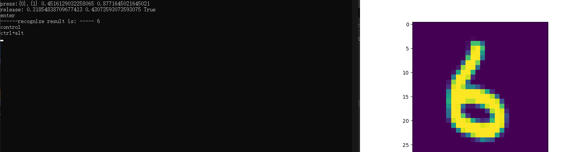

# 《人工智能概论》课程报告
## 一、
##人工智能的定义
#### 第一个层面，人们对人工智能的**期待**可以分为：
**智能地把某件特定的事情做好，在某个领域增强人类的智慧，这种方式又叫做智能增强。**
**像人类一样能认知，思考，判断：模拟人类的智能。**

#### 第二个层面，**从技术的特点来看**。

**机器学习：能让运行程序的电脑来学习并自动掌握某些规律。**
**机器学习可以大致地分为下面三种类型：1、监督学习 2、无监督学习 3、强化学习**
**机器学习领域出现了各种模型，其中，神经网络模型是一个重要的方法。**


图1-1 M-P神经元模型
#### 第三个层面，**从应用的角度来看**，我们看到狭义人工智能在各个领域都取得了很大的成果。

##  范式的演化

范式演化的四个阶段
#### 第一阶段：经验
**从几千年前到几百年前，人们描述自然现象，归纳总结一些规律。**

#### 第二阶段：理论
**在理论演算阶段，不但要定性，而且要定量，要通过数学公式严格的推
导得到结论。**

#### 第三阶段：计算仿真
**从二十世纪中期开始，利用电子计算机对科学实验进行模拟仿真的模式得到迅速普及，人们可以对复杂现象通过模拟仿真，推演更复杂的现象，典型案例如模拟核试验、天气预报等。**

#### 第四阶段：数据探索
**在这个阶段，科学家收集数据，分析数据，探索新的规律。在深度学习的浪潮中出现的许多结果就是基于海量数据学习得来的。**

###  神经元细胞的数学模型

神经网络由基本的神经元组成，图1就是一个神经元的数学/计算模型，便于我们用程序来实现。


图1 神经元计算模型

### 神经网络的主要功能

#### 回归（Regression）或者叫做拟合（Fitting）


图2 回归/拟合示意图

所谓回归或者拟合，其实就是给出x值输出y值的过程，并且让y值与样本数据形成的曲线的距离尽量小，可以理解为是对样本数据的一种骨架式的抽象。

### 神经网络中的三个基本概念

这三大概念是：反向传播，梯度下降，损失函数。
简单总结一下反向传播与梯度下降的基本工作原理：

1. 初始化；
2. 正向计算；
3. 损失函数为我们提供了计算损失的方法；
4. 梯度下降是在损失函数基础上向着损失最小的点靠近而指引了网络权重调整的方向；
5. 反向传播把损失值反向传给神经网络的每一层，让每一层都根据损失值反向调整权重；
6. 重复正向计算过程，直到精度满足要求（比如损失函数值小于 $0.001$）。

### 梯度下降的数学理解

梯度下降的数学公式：

$$\theta_{n+1} = \theta_{n} - \eta \cdot \nabla J(\theta) \tag{1}$$

其中：

- $\theta_{n+1}$：下一个值；
- $\theta_n$：当前值；
- $-$：减号，梯度的反向；
- $\eta$：学习率或步长，控制每一步走的距离，不要太快以免错过了最佳景点，不要太慢以免时间太长；
- $\nabla$：梯度，函数当前位置的最快上升点；
- $J(\theta)$：函数。

#### 梯度下降的三要素

1. 当前点；
2. 方向；
3. 步长。
   
#### 损失函数
“损失”就是所有样本的“误差”的总和，亦即（$m$ 为样本数）：

$$损失 = \sum^m_{i=1}误差_i$$

$$J = \sum_{i=1}^m loss_i$$
#### 损失函数的作用


损失函数的作用，就是计算神经网络每次迭代的前向计算结果与真实值的差距，从而指导下一步的训练向正确的方向进行。

#### 均方差函数
该函数就是最直观的一个损失函数了，计算预测值和真实值之间的欧式距离。预测值和真实值越接近，两者的均方差就越小。

均方差函数常用于线性回归(linear regression)，即函数拟合(function fitting)。公式如下：

$$
loss = {1 \over 2}(z-y)^2 \tag{单样本}
$$

$$
J=\frac{1}{2m} \sum_{i=1}^m (z_i-y_i)^2 \tag{多样本}
$$


#### 交叉熵损失函数

交叉熵（Cross Entropy）是Shannon信息论中一个重要概念，主要用于度量两个概率分布间的差异性信息。在信息论中，交叉熵是表示两个概率分布 $p,q$ 的差异，其中 $p$ 表示真实分布，$q$ 表示预测分布，那么 $H(p,q)$ 就称为交叉熵：

$$H(p,q)=\sum_i p_i \cdot \ln {1 \over q_i} = - \sum_i p_i \ln q_i \tag{1}$$

交叉熵可在神经网络中作为损失函数，$p$ 表示真实标记的分布，$q$ 则为训练后的模型的预测标记分布，交叉熵损失函数可以衡量 $p$ 与 $q$ 的相似性。

**交叉熵函数常用于逻辑回归(logistic regression)，也就是分类(classification)。**
```PythonPython
import numpy as np
import matplotlib.pyplot as plt

def target_function(x):
    y = x*x
    return y

def derivative_function(x):
    return 2*x

def draw_function():
    x = np.linspace(-1.2,1.2)
    y = target_function(x)
    plt.plot(x,y)

def draw_gd(X):
    Y = []
    for i in range(len(X)):
        Y.append(target_function(X[i]))
    
    plt.plot(X,Y)

if __name__ == '__main__':
    x = 1.2
    eta = 0.3
    error = 1e-3
    X = []
    X.append(x)
    y = target_function(x)
    while y > error:
        x = x - eta * derivative_function(x)
        X.append(x)
        y = target_function(x)
        print("x=%f, y=%f" %(x,y))


    draw_function()
    draw_gd(X)
    plt.show()
```

#### 线性回归

单层的神经网络，其实就是一个神经元，可以完成一些线性的工作，比如拟合一条直线，这用一个神经元就可以实现。当这个神经元只接收一个输入时，就是单变量线性回归，可以在二维平面上用可视化方法理解。当接收多个变量输入时，叫做多变量线性回归，此时可视化方法理解就比较困难了，通常会用变量两两组对的方式来表现。

#### 一元线性回归模型


最简单的情形是一元线性回归，由大体上有线性关系的一个自变量和一个因变量组成，模型是：

$$Y=a+bX+\varepsilon \tag{1}$$

$X$ 是自变量，$Y$ 是因变量，$\varepsilon$ 是随机误差，$a$ 和 $b$ 是参数，在线性回归模型中，$a,b$ 是我们要通过算法学习出来的。


线性回归和非线性回归的区别
##最小二乘法

#### 数学原理

线性回归试图学得：

$$z_i=w \cdot x_i+b \tag{1}$$

使得：

$$z_i \simeq y_i \tag{2}$$

其中，$x_i$ 是样本特征值，$y_i$ 是样本标签值，$z_i$ 是模型预测值。

如何学得 $w$ 和 $b$ 呢？均方差(MSE - mean squared error)是回归任务中常用的手段：
$$
J = \frac{1}{2m}\sum_{i=1}^m(z_i-y_i)^2 = \frac{1}{2m}\sum_{i=1}^m(y_i-wx_i-b)^2 \tag{3}
$$

$J$ 称为损失函数。实际上就是试图找到一条直线，使所有样本到直线上的残差的平方和最小
##  梯度计算

#### 计算z的梯度

$$
\frac{\partial loss}{\partial z_i}=z_i - y_i \tag{3}
$$

#### 计算 $w$ 的梯度


$$
\frac{\partial{loss}}{\partial{w}} = \frac{\partial{loss}}{\partial{z_i}}\frac{\partial{z_i}}{\partial{w}}=(z_i-y_i)x_i \tag{4}
$$

#### 计算 $b$ 的梯度
$$
\frac{\partial{loss}}{\partial{b}} = \frac{\partial{loss}}{\partial{z_i}}\frac{\partial{z_i}}{\partial{b}}=z_i-y_i \tag{5}
$$
### 标准化的常用方法

- Min-Max标准化（离差标准化），将数据映射到 $[0,1]$ 区间

$$x_{new}=\frac{x-x_{min}}{x_{max} - x_{min}} \tag{1}$$

- 平均值标准化，将数据映射到[-1,1]区间
   
$$x_{new} = \frac{x - \bar{x}}{x_{max} - x_{min}} \tag{2}$$

- 对数转换
$$x_{new}=\ln(x_i) \tag{3}$$

- 反正切转换
$$x_{new}=\frac{2}{\pi}\arctan(x_i) \tag{4}$$

- Z-Score法

把每个特征值中的所有数据，变成平均值为0，标准差为1的数据，最后为正态分布。Z-Score规范化（标准差标准化 / 零均值标准化，其中std是标准差）：

$$x_{new} = \frac{x_i - \bar{x}}{std} \tag{5}$$

- 中心化，平均值为0，无标准差要求
  
$$x_{new} = x_i - \bar{x} \tag{6}$$

- 比例法，要求数据全是正值

$$
x_{new} = \frac{x_k}{\sum_{i=1}^m{x_i}} \tag{7}
$$
损失函数定义：

$$
J(w,b)=\frac{1}{2m} \sum_{i=1}^m (z_i-y_i)^2 \tag{1}
$$
### 逻辑回归模型

回归问题可以分为两类：线性回归和逻辑回归。

逻辑回归（Logistic Regression），回归给出的结果是事件成功或失败的概率。当因变量的类型属于二值（1/0，真/假，是/否）变量时，我们就应该使用逻辑回归。

|线性二分类|非线性二分类|
|---|---|
|||


## 二分类函数

此函数对线性和非线性二分类都适用。


二分类任务中，叫做Logistic函数，而在作为激活函数时，叫做Sigmoid函数。

- Logistic函数公式

$$Logistic(z) = \frac{1}{1 + e^{-z}}$$

以下记 $a=Logistic(z)$。

- 导数

$$Logistic'(z) = a(1 - a)$$

具体求导过程可以参考8.1节。

- 输入值域

$$(-\infty, \infty)$$

- 输出值域

$$(0,1)$$

- 函数图像


Logistic函数图像
### 正向传播

#### 矩阵运算

$$
z=x \cdot w + b \tag{1}
$$

#### 分类计算

$$
a = Logistic(z)=\frac{1}{1 + e^{-z}} \tag{2}
$$

#### 损失函数计算

二分类交叉熵损失函数：

$$
loss(w,b) = -[y \ln a+(1-y) \ln(1-a)] \tag{3}
$$

###  反向传播

#### 求损失函数对 $a$ 的偏导

$$
\frac{\partial loss}{\partial a}=-\left[\frac{y}{a}-\frac{1-y}{1-a}\right]=\frac{a-y}{a(1-a)} \tag{4}
$$

#### 求 $a$ 对 $z$ 的偏导

$$
\frac{\partial a}{\partial z}= a(1-a) \tag{5}
$$

#### 求误差 $loss$ 对 $z$ 的偏导

使用链式法则链接公式4和公式5：

$$
\frac{\partial loss}{\partial z}=\frac{\partial loss}{\partial a}\frac{\partial a}{\partial z}=\frac{a-y}{a(1-a)} \cdot a(1-a)=a-y \tag{6}
$$
###  线性分类和线性回归的异同
此原理对线性和非线性二分类都适用。
线性回归和线性分类的比较

||线性回归|线性分类|
|---|---|---|
|相同点|需要在样本群中找到一条直线|需要在样本群中找到一条直线|
|不同点|用直线来拟合所有样本，使得各个样本到这条直线的距离尽可能最短|用直线来分割所有样本，使得正例样本和负例样本尽可能分布在直线两侧|

### 可视化的重要性

在实际的工程实践中，一般会把样本分成训练集、验证集、测试集，用测试集来测试训练结果的正确性。在本例中我们没有这样做，原因有二：

1. 样本数据量比较少，一共只有200个样本，如果再分成两部分，会造成数据集覆盖不全面，存在很大的差异，对训练、验证、测试都没有帮助
2. 由于本例的数据特征比较少，所以我们有更好的手段：可视化。在神经网络学习初期，可视化的训练过程与结果会对读者有巨大的帮助。

###  逻辑与或非门
5个逻辑门：

- 与门 AND
- 与非门 NAND
- 或门 OR
- 或非门 NOR
- 非门 NOT
  
## 线性多分类问题

#### 线性多分类和非线性多分类的区别

显示了线性多分类和非线性多分类的区别。


直观理解线性多分类与分线性多分类的区别

左侧为线性多分类，右侧为非线性多分类。它们的区别在于不同类别的样本点之间是否可以用一条直线来互相分割。对神经网络来说，线性多分类可以使用单层结构来解决，而分线性多分类需要使用双层结构。

#### 二分类与多分类的关系

多分类问题一共有三种解法：

1. 一对一方式
2. 一对多方式
3. 多对多方式

#### 线性多分类的神经网络实现  
这个网络只有输入层和输出层，由于输入层不算在内，所以是一层网络，如图所示。


多入多出单层神经网络

与前面的单层网络不同的是，图最右侧的输出层还多出来一个Softmax分类函数，这是多分类任务中的标准配置，可以看作是输出层的激活函数，并不单独成为一层，与二分类中的Logistic函数一样。

## 多分类结果可视化
神经网络到底是一对一方式，还是一对多方式呢？从Softmax公式，好像是一对多方式，因为只取一个最大值，那么理想中的一对多方式应该是图7所示的样子。


理想中的一对多方式的分割线

### 激活函数的基本作用

图激活函数在神经元中的位置

激活函数也就是 $a=\sigma(z)$ 这一步

1. 给神经网络增加非线性因素。
2. 把公式1的计算结果压缩到 $[0,1]$ 之间，便于后面的计算。

激活函数的基本性质：

+ 非线性：线性的激活函数和没有激活函数一样；
+ 可导性：做误差反向传播和梯度下降，必须要保证激活函数的可导性；
+ 单调性：单一的输入会得到单一的输出，较大值的输入得到较大值的输出。
  
激活函数用在神经网络的层与层之间的连接，神经网络的最后一层不用激活函数。

单层的神经网络的参数与功能

|网络|输入|输出|激活函数|分类函数|功能|
|---|---|---|---|---|---|
|单层|单变量|单输出|无|无|线性回归|
|单层|多变量|单输出|无|无|线性回归|
|单层|多变量|单输出|无|二分类函数|二分类|
|单层|多变量|多输出|无|多分类函数|多分类|

从上表可以看到，一直没有使用激活函数，而只使用了分类函数。对于多层神经网络也是如此，在最后一层只会用到分类函数来完成二分类或多分类任务，如果是拟合任务，则不需要分类函数。

简言之：

1. 神经网络最后一层不需要激活函数
2. 激活函数只用于连接前后两层神经网络
### 挤压型激活函数

当输入值域的绝对值较大的时候，其输出在两端是饱和的，都具有S形的函数曲线以及压缩输入值域的作用，所以叫挤压型激活函数，又可以叫饱和型激活函数。

在英文中，通常用Sigmoid来表示，在神经网络中，有两个常用的Sigmoid函数，一个是Logistic函数，另一个是Tanh函数。

### Logistic函数

对数几率函数（Logistic Function，简称对率函数）。

#### 公式

$$Sigmoid(z) = \frac{1}{1 + e^{-z}} \rightarrow a \tag{1}$$

#### 函数图像


图8-3 Sigmoid函数图像
#### 优点

从函数图像来看，Sigmoid函数的作用是将输入压缩到 $(0,1)$ 这个区间范围内，这种输出在0~1之间的函数可以用来模拟一些概率分布的情况。它还是一个连续函数，导数简单易求。  

从数学上来看，Sigmoid函数对中央区的信号增益较大，对两侧区的信号增益小，在信号的特征空间映射上，有很好的效果。 

从神经科学上来看，中央区酷似神经元的兴奋态，两侧区酷似神经元的抑制态，因而在神经网络学习方面，可以将重点特征推向中央区，
将非重点特征推向两侧区。

#### 缺点

指数计算代价大。

反向传播时梯度消失：从梯度图像中可以看到，Sigmoid的梯度在两端都会接近于0，根据链式法则，如果传回的误差是$\delta$，那么梯度传递函数是$\delta \cdot a'$，而$a'$这时接近零，也就是说整体的梯度也接近零。这就出现梯度消失的问题，并且这个问题可能导致网络收敛速度比较慢。


### Tanh函数

TanHyperbolic，即双曲正切函数。

#### 函数图像

图8-4是双曲正切的函数图像。


图8-4 双曲正切函数图像

#### 优点

具有Sigmoid的所有优点。

无论从理论公式还是函数图像，这个函数都是一个和Sigmoid非常相像的激活函数，他们的性质也确实如此。但是比起Sigmoid，Tanh减少了一个缺点，就是他本身是零均值的，也就是说，在传递过程中，输入数据的均值并不会发生改变，这就使他在很多应用中能表现出比Sigmoid优异一些的效果。

#### 缺点

exp指数计算代价大。梯度消失问题仍然存在。

###  ReLU函数 

Rectified Linear Unit，修正线性单元，线性整流函数，斜坡函数。

#### 公式

$$ReLU(z) = max(0,z) = \begin{cases} 
  z, & z \geq 0 \\\\ 
  0, & z < 0 
\end{cases}$$


#### 值域

- 输入值域：$(-\infty, \infty)$
- 输出值域：$(0,\infty)$
- 导数值域：$\\{0,1\\}$


图8-6 线性整流函数ReLU


#### 优点

- 反向导数恒等于1，更加有效率的反向传播梯度值，收敛速度快；
- 避免梯度消失问题；
- 计算简单，速度快；
- 活跃度的分散性使得神经网络的整体计算成本下降。

#### 缺点

无界。

梯度很大的时候可能导致的神经元“死”掉。

###  Leaky ReLU函数

LReLU，带泄露的线性整流函数。

#### 公式

$$LReLU(z) = \begin{cases} z & z \geq 0 \\\\ \alpha \cdot z & z < 0 \end{cases}$$

#### 导数

$$LReLU'(z) = \begin{cases} 1 & z \geq 0 \\\\ \alpha & z < 0 \end{cases}$$

#### 值域

输入值域：$(-\infty, \infty)$

输出值域：$(-\infty,\infty)$

导数值域：$\\{\alpha,1\\}$

#### 函数图像

函数图像如图8-7所示。


图8-7 LeakyReLU的函数图像

#### 优点

继承了ReLU函数的优点。

Leaky ReLU同样有收敛快速和运算复杂度低的优点，而且由于给了$z<0$时一个比较小的梯度$\alpha$,使得$z<0$时依旧可以进行梯度传递和更新，可以在一定程度上避免神经元“死”掉的问题。
## 非线性回归问题

#### 回归模型的评估标准

回归问题主要是求值，评价标准主要是看求得值与实际结果的偏差有多大，所以，回归问题主要以下方法来评价模型。

#### 平均绝对误差

MAE（Mean Abolute Error）。

$$MAE=\frac{1}{m} \sum_{i=1}^m \lvert a_i-y_i \rvert \tag{1}$$

对异常值不如均方差敏感，类似中位数。

#### 绝对平均值率误差

MAPE（Mean Absolute Percentage Error）。

$$MAPE=\frac{100}{m} \sum^m_{i=1} \left\lvert {a_i - y_i \over y_i} \right\rvert \tag{2}$$

#### 和方差

SSE（Sum Squared Error）。

$$SSE=\sum_{i=1}^m (a_i-y_i)^2 \tag{3}$$

得出的值与样本数量有关系，假设有1000个测试样本，得到的值是120；如果只有100个测试样本，得到的值可能是11，我们不能说11就比120要好。

#### 均方差

MSE（Mean Squared Error）。

$$MSE = \frac{1}{m} \sum_{i=1}^m (a_i-y_i)^2 \tag{4}$$

就是实际值减去预测值的平方再求期望，没错，就是线性回归的代价函数。由于MSE计算的是误差的平方，所以它对异常值是非常敏感的，因为一旦出现异常值，MSE指标会变得非常大。MSE越小，证明误差越小。

#### 均方根误差

RMSE（Root Mean Squard Error）。

$$RMSE = \sqrt{\frac{1}{m} \sum_{i=1}^m (a_i-y_i)^2} \tag{5}$$
## 用多项式回归法拟合正弦曲线

#### 一元一次线性模型


$$z = x w + b \tag{1}$$

#### 多元一次多项式

多变量的线性回归，其模型为：

$$z = x_1 w_1 + x_2 w_2 + ...+ x_m w_m + b \tag{2}$$

这里的多变量，是指样本数据的特征值为多个，上式中的 $x_1,x_2,...,x_m$ 代表了m个特征值。

#### 一元多次多项式
用公式描述：

$$z = x w_1 + x^2 w_2 + ... + x^m w_m + b \tag{3}$$
$$z = x_1 w_1 + x_2 w_2 + ... + x_m w_m + b \tag{4}$$

#### 多元多次多项式

多变量的非线性回归，其参数与特征组合繁复，但最终都可以归结为公式2和公式4的形式。


图9-3 对有噪音的正弦曲线的拟合

一堆散点，看上去像是一条带有很大噪音的正弦曲线，从左上到右下，分别是1次多项式、2次多项式......10次多项式，其中：

- 第4、5、6、7图是比较理想的拟合
- 第1、2、3图欠拟合，多项式的次数不够高
- 第8、9、10图，多项式次数过高，过拟合了

###  用二次多项式拟合

鉴于以上的认知，我们要考虑使用几次的多项式来拟合正弦曲线。在没有什么经验的情况下，可以先试一下二次多项式，即：

$$z = x w_1 + x^2 w_2 + b \tag{5}$$
#### 数据增强

在`ch08.train.npz`中，读出来的`XTrain`数组，只包含1列x的原始值，根据公式5，我们需要再增加一列x的平方值，所以代码如下：

```Python
file_name = "../../data/ch08.train.npz"
class DataReaderEx(SimpleDataReader):
    def Add(self):
        X = self.XTrain[:,]**2
        self.XTrain = np.hstack((self.XTrain, X))

        ### 主程序

在主程序中，先加载数据，做数据增强，然后建立一个net，参数`num_input=2`，对应着`XTrain`中的两列数据，相当于两个特征值，

```Python
if __name__ == '__main__':
    dataReader = DataReaderEx(file_name)
    dataReader.ReadData()
    dataReader.Add()
    # net
    num_input = 2
    num_output = 1
    params = HyperParameters(num_input, num_output, eta=0.2, max_epoch=10000, batch_size=10, eps=0.005, net_type=NetType.Fitting)
    net = NeuralNet(params)
    net.train(dataReader, checkpoint=10)
    ShowResult(net, dataReader, params.toString())
```

#### 运行结果

表9-4 二次多项式训练过程与结果

|损失函数值|拟合结果|
|---|---|
|||

###  用三次多项式拟合

三次多项式的公式：

$$z = x w_1 + x^2 w_2 + x^3 w_3 + b \tag{6}$$

在二次多项式的基础上，把训练数据的再增加一列x的三次方，作为一个新的特征。以下为数据增强代码：

```Python
class DataReaderEx(SimpleDataReader):
    def Add(self):
        X = self.XTrain[:,]**2
        self.XTrain = np.hstack((self.XTrain, X))
        X = self.XTrain[:,0:1]**3
        self.XTrain = np.hstack((self.XTrain, X))
```

同时不要忘记修改主过程参数中的`num_input`值：

```Python
    num_input = 3
```

再次运行，得到表9-5所示的结果。

表9-5 三次多项式训练过程与结果

|损失函数值|拟合结果|
|---|---|
|||

表9-5中左侧图显示损失函数值下降得很平稳，说明网络训练效果还不错。拟合的结果也很令人满意，虽然红色线没有严丝合缝地落在蓝色样本点内，但是这完全是因为训练的次数不够多，有兴趣的读者可以修改超参后做进一步的试验。

###  结果比较

表9-7 不同项数的多项式拟合结果比较

|多项式次数|迭代数|损失函数值|
|:---:|---:|---:|
|2|10000|0.095|
|3|2380|0.005|
|4|8290|0.005|

从表9-7的结果比较中可以得到以下结论：

1. 二次多项式的损失值在下降了一定程度后，一直处于平缓期，不再下降，说明网络能力到了一定的限制，直到10000次迭代也没有达到目的；
2. 损失值达到0.005时，四项式迭代了8290次，比三次多项式的2380次要多很多，说明四次多项式多出的一个特征值，没有给我们带来什么好处，反而是增加了网络训练的复杂度。

由此可以知道，多项式次数并不是越高越好，对不同的问题，有特定的限制，需要在实践中摸索，并无理论指导。
##  验证与测试

###  基本概念

#### 训练集

Training Set，用于模型训练的数据样本。

#### 验证集

Validation Set，或者叫做Dev Set，是模型训练过程中单独留出的样本集，它可以用于调整模型的超参数和用于对模型的能力进行初步评估。
  
在神经网络中，验证数据集用于：

- 寻找最优的网络深度
- 或者决定反向传播算法的停止点
- 或者在神经网络中选择隐藏层神经元的数量
- 在普通的机器学习中常用的交叉验证（Cross Validation）就是把训练数据集本身再细分成不同的验证数据集去训练模型。

#### 测试集

Test Set，用来评估最终模型的泛化能力。但不能作为调参、选择特征等算法相关的选择的依据。

三者之间的关系如图9-5所示。


图9-5 训练集、验证集、测试集的关系

###  交叉验证

#### 传统的机器学习

当样本很少时，这个方法很有用。
#### 神经网络/深度学习


举个例子：一个BP神经网络，我们无法确定隐层的神经元数目，因为没有理论支持。此时可以按图9-6的示意图这样做。


##  曲线拟合

###  正弦曲线的拟合

#### 隐层只有一个神经元的情况

令`n_hidden=1`，并指定模型名称为`sin_111`，训练过程见图9-10。图9-11为拟合效果图。


图9-10 训练过程中损失函数值和准确率的变化


图9-11 一个神经元的拟合效果

从图9-10可以看到，损失值到0.04附近就很难下降了。图9-11中，可以看到只有中间线性部分拟合了，两端的曲线部分没有拟合。
### 隐层有两个神经元的情况

```Python
if __name__ == '__main__':
    ......
    n_input, n_hidden, n_output = 1, 2, 1
    eta, batch_size, max_epoch = 0.05, 10, 5000
    eps = 0.001
    hp = HyperParameters2(n_input, n_hidden, n_output, eta, max_epoch, batch_size, eps, NetType.Fitting, InitialMethod.Xavier)
    net = NeuralNet2(hp, "sin_121")
    #net.LoadResult()
    net.train(dataReader, 50, True)
    ......
```
#### 运行结果


图9-12 两个神经元的训练过程中损失函数值和准确率的变化


图9-13 两个神经元的拟合效果

再看下面的打印输出结果，最后测试集的精度为98.8%。如果需要精度更高的话，可以增加迭代次数。

```
......
epoch=4999, total_iteration=224999
loss_train=0.007681, accuracy_train=0.971567
loss_valid=0.004366, accuracy_valid=0.979845
testing...
0.9881468747638157
```
### 较多项式回归和双层神经网络解法
表9-20 多项式回归和神经网络的比较

||多项式回归|双层神经网络|
|---|---|---|
|特征提取方式|特征值的高次方|线性变换拆分|
|特征值数量级|高几倍的数量级|数量级与原特征值相同|
|训练效率|低，需要迭代次数多|高，比前者少好几个数量级|
## 超参数优化的初步认识

超参数优化（Hyperparameter Optimization）主要存在两方面的困难：

1. 超参数优化是一个组合优化问题，无法像一般参数那样通过梯度下降方法来优化，也没有一种通用有效的优化方法。
2. 评估一组超参数配置（Configuration）的时间代价非常高，从而导致一些优化方法（比如演化算法）在超参数优化中难以应用。

对于超参数的设置，比较简单的方法有人工搜索、网格搜索和随机搜索。 
### 可调的参数


表9-21 参数配置

|参数|缺省值|是否可调|注释|
|---|---|---|---|
|输入层神经元数|1|No|
|隐层神经元数|4|Yes|影响迭代次数|
|输出层神经元数|1|No|
|学习率|0.1|Yes|影响迭代次数|
|批样本量|10|Yes|影响迭代次数|
|最大epoch|10000|Yes|影响终止条件,建议不改动|
|损失门限值|0.001|Yes|影响终止条件,建议不改动|
|损失函数|MSE|No|
|权重矩阵初始化方法|Xavier|Yes|参看15.1|

表9-21中的参数，最终可以调节的其实只有三个：

- 隐层神经元数
- 学习率
- 批样本量

###  手动调整参数

有效容量受限于3个因素：

- 模型的表示容量；
- 学习算法与代价函数的匹配程度；
- 代价函数和训练过程正则化模型的程度。

表9-22 各种超参数的作用

|超参数|目标|作用|副作用|
|---|---|---|---|
|学习率|调至最优|低的学习率会导致收敛慢，高的学习率会导致错失最佳解|容易忽略其它参数的调整|
|隐层神经元数量|增加|增加数量会增加模型的表示能力|参数增多、训练时间增长|
|批大小|有限范围内尽量大|大批量的数据可以保持训练平稳，缩短训练时间|可能会收敛速度慢|
###  网格搜索

表9-23 各种组合下的准确率

||eta=0.1|eta=0.3|eta=0.5|eta=0.7|
|---|---|---|---|---|
|ne=2|0.63|0.68|0.71|0.73|
|ne=4|0.86|0.89|0.91|0.3|
|ne=8|0.92|0.94|0.97|0.95|
|ne=12|0.69|0.84|0.88|0.87|

#### 学习率的调整
表9-24 四种学习率值的比较

|学习率|迭代次数|说明|
|----|----|----|
|0.1|10000|学习率小，收敛最慢，没有在规定的次数内达到精度要求|
|0.3|10000|学习率增大，收敛慢，没有在规定的次数内达到精度要求|
|0.5|8200|学习率增大，在8200次左右达到精度要求|
|0.7|3500|学习率进一步增大，在3500次达到精度|


图9-23 四种学习率值造成的损失函数值的变化
较大的学习率可以带来很快的收敛速度，但是有两点：

- 但并不是对所有问题都这样，有的问题可能需要0.001或者更小的学习率
- 学习率大时，开始时收敛快，但是到了后来有可能会错失最佳解
#### 批大小的调整
固定其它参数，即隐层神经元`ne=4`、`eta=0.5`不变，调整批大小，来试验网络训练情况，设置`eps=0.001`为精度要求。

表9-25和图9-24展示了四种批大小值的不同结果。

表9-25 四种批大小数值的比较

|批大小|迭代次数|说明|
|----|----|----|
|5|2500|批数据量小到1，收敛最快|
|10|8200|批数据量增大，收敛变慢|
|15|10000|批数据量进一步增大，收敛变慢|
|20|10000|批数据量太大，反而会降低收敛速度|


图9-24 四种批大小值造成的损失函数值的变化

合适的批样本量会带来较快的收敛，前提是我们固定了学习率。如果想用较大的批数据，底层数据库计算的速度较快，但是需要同时调整学习率，才会相应地提高收敛速度。
##  为什么必须用双层神经网络

###  分类

我们先回忆一下各种分类的含义：

- 从复杂程度上分，有线性/非线性之分；
- 从样本类别上分，有二分类/多分类之分。
表 各种分类的组合关系

||二分类|多分类|
|---|---|---|
|线性|||
|非线性|||

##  非线性二分类实现

### 定义神经网络结构

首先定义可以完成非线性二分类的神经网络结构图，如图10-6所示。


图 非线性二分类神经网络结构图

###  前向计算

根据网络结构，我们有了前向计算过程图10-8。


图10-8 前向计算过程

#### 5D图
```Python
def ShowResultContour(net, dr):
    DrawSamplePoints(dr.XTrain[:,0], dr.XTrain[:,1], dr.YTrain, "classification result", "x1", "x2", show=False)
    X,Y,Z = Prepare3DData(net, 50)
    plt.contourf(X, Y, Z, cmap=plt.cm.Spectral)
    plt.show()
```

在二维平面上，可以通过plt.contourf()函数画出着色的等高线图，Z作为等高线高度，可以得到图。


图 分类结果的等高线图
# 多入多出的双层神经网络 - 非线性多分类


图 可视化样本数据

一共有3个类别：

1. 蓝色方点
2. 红色叉点
3. 绿色圆点

样本组成了一个貌似铜钱的形状，我们就把这个问题叫做“铜钱孔形分类”问题
##  非线性多分类

###  定义神经网络结构

先设计出能完成非线性多分类的网络结构，如图11-2所示。


图 非线性多分类的神经网络结构图

##  学习率与批大小

在梯度下降公式中：

$$
w_{t+1} = w_t - \frac{\eta}{m} \sum_i^m \nabla J(w,b) \tag{1}
$$

其中，$\eta$是学习率，m是批大小。所以，学习率与批大小是对梯度下降影响最大的两个因子。
表 鞍点和驻点

|鞍点|驻点|
|---|---|
|||

##  深度神经网络框架设计

###  抽象与设计

图14-1是迷你框架的模块化设计，下面对各个模块做功能点上的解释。


图14-1 迷你框架设计
##  二分类任务功能测试

###  搭建模型

同样是一个双层神经网络，但是最后一层要接一个Logistic二分类函数来完成二分类任务，如图14-7所示。


图14-7 完成非线性二分类教学案例的抽象模型

```Python

def model(dataReader):
    num_input = 2
    num_hidden = 3
    num_output = 1

    max_epoch = 1000
    batch_size = 5
    learning_rate = 0.1

    params = HyperParameters_4_0(
        learning_rate, max_epoch, batch_size,
        net_type=NetType.BinaryClassifier,
        init_method=InitialMethod.Xavier,
        stopper=Stopper(StopCondition.StopLoss, 0.02))

    net = NeuralNet_4_0(params, "Arc")

    fc1 = FcLayer_1_0(num_input, num_hidden, params)
    net.add_layer(fc1, "fc1")
    sigmoid1 = ActivationLayer(Sigmoid())
    net.add_layer(sigmoid1, "sigmoid1")
    
    fc2 = FcLayer_1_0(num_hidden, num_output, params)
    net.add_layer(fc2, "fc2")
    logistic = ClassificationLayer(Logistic())
    net.add_layer(logistic, "logistic")

    net.train(dataReader, checkpoint=10, need_test=True)
    return net
```

###  运行结果


图14-8 训练过程中损失函数值和准确率的变化
图14-8是训练记录，再看下面的打印输出结果：

```
......
epoch=419, total_iteration=30239
loss_train=0.010094, accuracy_train=1.000000
loss_valid=0.019141, accuracy_valid=1.000000
time used: 2.149379253387451
testing...
1.0
```
最后的testing...的结果是1.0，表示100%正确，这初步说明mini框架在这个基本case上工作得很好。图14-9所示的分类效果也不错。


图14-9 分类效果

# 网络优化
#  权重矩阵初始化

###  零初始化

即把所有层的`W`值的初始值都设置为0。

$$
W = 0
$$

但是对于多层网络来说，绝对不能用零初始化，否则权重值不能学习到合理的结果。

###  标准初始化

标准正态初始化方法保证激活函数的输入均值为0，方差为1。将W按如下公式进行初始化：

$$
W \sim N \begin{bmatrix} 0, 1 \end{bmatrix}
$$

其中的W为权重矩阵，N表示高斯分布，Gaussian Distribution，也叫做正态分布，Normal Distribution，所以有的地方也称这种初始化为Normal初始化。

表15-3 学习率对SGD的影响

|学习率|损失函数与准确率|
|---|---|
|0.1||
|0.3||

###  动量算法 Momentum
#### 输入和参数

- $\eta$ - 全局学习率
- $\alpha$ - 动量参数，一般取值为0.5, 0.9, 0.99
- $v_t$ - 当前时刻的动量，初值为0
  
#### 算法

---

计算梯度：$g_t = \nabla_\theta J(\theta_{t-1})$

计算速度更新：$v_t = \alpha \cdot v_{t-1} + \eta \cdot g_t$ (公式1)
 
更新参数：$\theta_t = \theta_{t-1}  - v_t$ (公式2)

---
#### 实际效果

 SGD和动量法的比较

|算法|损失函数和准确率|
|---|---|
|SGD||
|Momentum||
##  过拟合

###  拟合程度比较
神经网络的两大功能：回归和分类。这两类任务，都会出现欠拟合和过拟合现象，如图16-1和16-2所示。


图16-1 回归任务中的欠拟合、正确的拟合、过拟合

图16-1是回归任务中的三种情况，依次为：欠拟合、正确的拟合、过拟合。


图16-2 分类任务中的欠拟合、正确的拟合、过拟合

图16-2是分类任务中的三种情况，依次为：分类欠妥、正确的分类、分类过度。由于分类可以看作是对分类边界的拟合，所以经常也统称其为拟合。
出现过拟合的原因：

1. 训练集的数量和模型的复杂度不匹配，样本数量级小于模型的参数
2. 训练集和测试集的特征分布不一致
3. 样本噪音大，使得神经网络学习到了噪音，正常样本的行为被抑制
4. 迭代次数过多，过分拟合了训练数据，包括噪音部分和一些非重要特征

##  偏差与方差
##  直观的解释

先用一个直观的例子来理解偏差和方差。比如打靶，如图16-9所示。


图16-9 打靶中的偏差和方差

总结一下，不同偏差和方差反映的射手的特点如表16-1所示。

表16-1 不同偏差和方差的射手特点

||低偏差|高偏差|
|---|---|---|
|低方差|射手很稳，枪的准星也很准。|射手很稳，但是枪的准星有问题，所有子弹都固定地偏向一侧。|
|高方差|射手不太稳，但枪的准星没问题，虽然弹着点分布很散，但没有整体偏移。|射手不稳，而且枪的准星也有问题，弹着点分布很散且有规律地偏向一侧。|
## 集成学习 Ensemble Learning

###  集成学习的概念

当数据集有问题，或者网络学习能力不足，或准确度不够时，我们可以采取集成学习的方法，来提升性能。说得通俗一些，就是发挥团队的智慧，根据团队中不同背景、不同能力的成员的独立意见，通过某种决策方法来解决一个问题。所以集成学习也称为多分类器系统(multi-classifier system)、基于委员会的学习(committee-based learning)等。

图16-36是一个简单的集成学习的示意图。


图16-36 集成学习的示意图
图中有两个组件：

#### Individual Learner 个体学习器

如果所有的个体学习器都是同一类型的学习器，即同质模式，比如都用神经网路，称为“基学习器”（base learner），相应的学习算法称为“基学习算法”（base learning algorithm）。

在传统的机器学习中，个体学习器可以是不同的，比如用决策树、支持向量机等，此时称为异质模式。

#### Aggregator 结合模块

个体学习器的输出，通过一定的结合策略，在结合模块中有机结合在一起，可以形成一个能力较强的学习器，所以有时称为强学习器，而相应地称个体学习器为弱学习器。

## 二、利用搭建的miniFramework实现手写数字的识别

#### 代码
```Python
# Copyright (c) Microsoft. All rights reserved.
# Licensed under the MIT license. See LICENSE file in the project root for full license information.

from matplotlib import pyplot as plt
import numpy as np
from PIL import Image

from HelperClass2.NeuralNet_3_0 import *

def ReadImage(img_file_name):
    img = Image.open(img_file_name)
    out1 = img.convert('L')
    out2 = out1.resize((28,28))
    a = np.array(out2)
    b = 255 - a
    x_max = np.max(b)
    x_min = np.min(b)
    X_NEW = (b - x_min)/(x_max-x_min)
    plt.cla()
    plt.imshow(X_NEW)
    plt.plot()
    return X_NEW.reshape(1,-1)

def Inference(img_array):
    output = net.inference(img_array)
    n = np.argmax(output)
    print("------recognize result is: -----", n)

def on_key_press(event):
    img_file_name = "handwriting.png"
    print(event.key)
    if event.key == 'enter':
        plt.axis('off')
        plt.savefig(img_file_name)
        plt.axis('on')
        img_array = ReadImage(img_file_name)
        Inference(img_array)
    elif event.key == 'backspace':
        plt.cla()
        plt.axis([0,1,0,1])
        ax.figure.canvas.draw()
    #end if

def on_mouse_press(event):
    global startx, starty, isdraw
    print(isdraw)
    isdraw = True
    startx = event.xdata
    starty = event.ydata
    print("press:{0},{1}", startx, starty)
    
def on_mouse_release(event):
    global isdraw, startx, starty
    print("release:", event.xdata, event.ydata, isdraw)
    isdraw = False

def on_mouse_move(event):
    global isdraw, startx, starty
    if isdraw:
        endx = event.xdata        
        endy = event.ydata        
        x1 = [startx, endx]
        y1 = [starty, endy]
        ax.plot(x1, y1, color='black', linestyle='-', linewidth='40')
        ax.figure.canvas.draw()
        startx = endx
        starty = endy
    # end if

def LoadNet():
    n_input = 784
    n_hidden1 = 64
    n_hidden2 = 16
    n_output = 10
    eta = 0.2
    eps = 0.01
    batch_size = 128
    max_epoch = 40

    hp = HyperParameters_3_0(
        n_input, n_hidden1, n_hidden2, n_output, 
        eta, max_epoch, batch_size, eps, 
        NetType.MultipleClassifier, 
        InitialMethod.Xavier)
    net = NeuralNet_3_0(hp, "MNIST_64_16")
    net.LoadResult()
    return net
   
if __name__ == "__main__":
    isdraw = False
    startx, starty = 0, 0

    print("need to run level3 first to get result")
    print("============================================================================")
    print("handwriting a digit, then press enter to recognize, press backspace to clear")
    print("resize the window to square, say, height == width")
    print("the handwriting should full fill the window")
    print("============================================================================")

    net = LoadNet()

    fig, ax = plt.subplots()
    fig.canvas.mpl_connect('key_press_event', on_key_press)
    fig.canvas.mpl_connect('button_release_event', on_mouse_release)
    fig.canvas.mpl_connect('button_press_event', on_mouse_press)
    fig.canvas.mpl_connect('motion_notify_event', on_mouse_move)
    
    plt.axis([0,1,0,1])
    plt.show()
```

#### 运行截图：


## 三、学习总结
人工智能(Artificial Intelligence)，英文缩写为AI。它是研究、开发用于模拟、延伸和扩展人的智能的理论、方法、技术及应用系统的一门新的技术科学。人工智能是计算机科学的一个分支，它企图了解智能的实质，并生产出一种新的能以人类智能相似的方式作出反应的智能机器，该领域的研究包括机器人、语言识别、图像识别、自然语言处理和专家系统等。人工智能的定义可以分为两部分，即“人工”和“智能”。“人工”比较好理解，争议性也不大。有时我们会要考虑什么是人力所能及制造的，或者人自身的智能程度有没有高到可以创造人工智能的地步，等等。但总的来说，“人工系统”就是通常意义下的人工系统。关于什么是“智能”，就问题多多了。这涉及到其它诸如意识、自我、思维(包括无意识的思维）等等问题。通过几周的学习，我学习到了很多人工智能领域的概念、模型、运用。从发现问题到提出问题最后到解决问题，一步步的发展规范，才有今天这样系统的人工智能方面的知识。让我对人工智能领域有了一定的了解，产生了浓厚的兴趣。


## 四、心得体会
人工智能目前在计算机领域内，得到了愈加广泛的重视。并在机器人，经济政治决策，控制系统，仿真系统中得到应用。如今，人工智能研究出现了新的高潮，这一方面是因为在人工智能理论方面有了新的进展，另一方面也是因为计算机硬件突飞猛进的发展。人工智能的学习，让我明白了人工智能始终处于计算机发展的最前沿。高级计算机语言、计算机界面及文字处理器的存在或多或少都得归功于人工智能的研究。人工智能研究带来的理论和洞察力指引了计算技术发展的未来方向。现有的人工智能产品相对于即将到来的人工智能应用可以说微不足道，但是它们预示着人工智能的未来。将来我们会对人工智有能更高层次的需求，人工智能也会继续影响我们的工作、学习和生活，我们也要支持人工智能的发展。通过几周学习，我发现这门学科概念非常多，而且很抽象，需要多方面知识的积累，尤其是数学方面要求高，才能对里面的理论、算法有一定的理解。想要真正领悟需要投入大量的时间，虽然课程已经结束，但我还会继续学习人工智能方面的知识。走在时代的前沿。


