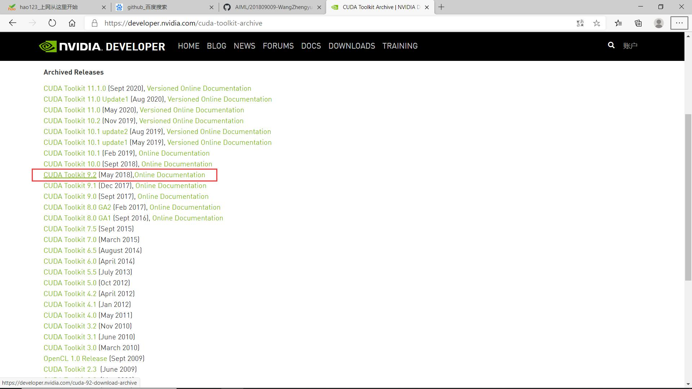
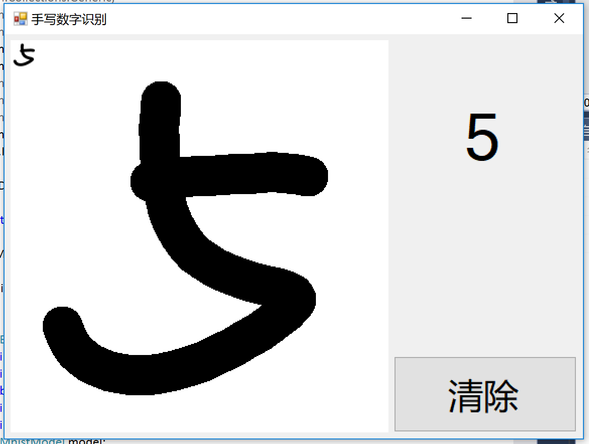

# 前言

**人的一生终究是要不断地去经历不同的事物，喜怒哀乐都可能会有，不用畏惧它，挑战他就可以**


###神经网络
深度神经网络示例


1. 基本概念
2. 线性回归
3. 线性分类
4. 非线性回归
5. 非线性分类
6. 模型的推理与部署
7. 深度神经网络
8. 卷积神经网络
9. 循环神经网络

## 概论

### 人工智能发展简史

既然这本书是人工智能入门书，我们就要先讲清楚一些定义。我们从“智能”开始。从计算机科学出现之时，科学家就开始探讨计算机是否能有“智能”。

1950年，英国科学家艾伦图灵发表了论文讨论创造出具有真正智能的机器的可能性，并提出了著名的图灵测试：如果一台机器能够与人类展开对话而不能被辨别出其机器身份，那么称这台机器具有智能。现在活跃于电脑，手机，还有各种硬件上的“智能助手”在各自的功能领域，通常被大众认为挺有智能的。

但是那些“智能助手”，聊天机器人真的有智能么？1980年就有学者（John Searle）提到了中文房间问题，如图1-1所示。


图1-1 中文房间问题

一个对中文一窍不通，只说英语的人关在一个封闭房间中。房间里有一本用英文写成的手册，指示该如何处理收到的汉语信息及如何以汉语相应地回复。房外的人向房间内递进用中文写成的问题。房内的人便按照手册的说明，查找到合适的指示，将相应的中文字符组合成对问题的解答，并将答案递出。

房间外面的人看到自己递进去的中文输入能得到回答，很可能就会认为房间内的人有智能，懂中文，就像现在的聊天机器人那样，那么这是“智能”么？读者们如果写过一些程序，就会想，我也可以写一个程序，根据一些规则和已有的数据，和用户进行某种程度的智能对话，那么AI和我的程序有区别么？图1-2是一个非常简单的程序流程图。


图1-2 简单的程序流程图

程序接到用户的输入句子后，如果不是结束会话的指令，就在一个数据库中寻找合适的回答句子，然后根据情况准备输出，然后再继续循环……

从1956年的达特茅斯会议开始，人工智能（Artificial Intelligence，AI）作为一个专门的研究领域出现，经历了超过半个世纪的起伏，终于在2007年前后，迎来了又一次大发展。图1-3展现了人工智能历史的一些里程碑事件。


图1-3 人工智能发展史

从图1-3中我们可以看出，人工智能的发展，有这样起伏的模式：

1.  研究（包括技术）取得进展。
2.  研究的进展让人们看到人工智能的潜力，产生非常乐观的期望，例如在1958年到1970年间科学家对人工智能各种突破的预计，当然他们的绝大多数预计都太乐观了。
3.  上述过高的期望让产业界开始热情地开发各种应用。
4.  但应用未能全部满足期望，于是人工智能行业进入低谷，直到下一波研究和技术取得突破性进展。在2007年之后，是大规模的数据和廉价的计算能力，让神经网络技术再度兴起，成为AI领域的明星技术。

# 线性回归

## 摘要

用线性回归作为学习神经网络的起点，是一个非常好的选择，因为线性回归问题本身比较容易理解，在它的基础上，逐步的增加一些新的知识点，会形成一条比较平缓的学习曲线，或者说是迈向神经网络的第一个小台阶。

单层的神经网络，其实就是一个神经元，可以完成一些线性的工作，比如拟合一条直线，这用一个神经元就可以实现。当这个神经元只接收一个输入时，就是单变量线性回归，可以在二维平面上用可视化方法理解。当接收多个变量输入时，叫做多变量线性回归，此时可视化方法理解就比较困难了，通常我们会用变量两两组对的方式来表现。

当变量多于一个时，两个变量的量纲和数值有可能差别很大，这种情况下，我们通常需要对样本特征数据做归一化，然后把数据喂给神经网络进行训练，否则会出现“消化不良”的情况。

# 型的推理与部署

## 摘要

我们已经用神经网络训练出来了一套权重矩阵，那么在实际生产环境中如何使用这些权重矩阵呢？

如果需要将训练好的网络用到后台服务中，可以直接复用前面章节中的代码：先搭建网络，然后加载权重矩阵，最后调用前向计算即可。

但是如何在桌面端或手机端应用中使用这些权重矩阵呢？这是一个跨平台、跨语言的需求，这就引出了模型文件的概念，后面也直接简称为模型。

模型文件中不仅包含了所有的权重矩阵，还记录了该神经网络的数据流图。这样不同平台、不同语言都可以根据模型文件里的信息构建网络、加载权重矩阵、执行前向计算。

接下来本章先用前面训练好的权重矩阵搭建一个可以手工测试训练效果的应用。然后以问答的形式对模型文件进行介绍，并使用工具观察模型文件的内部结构。再然后以开放式神经网络交换（Open Neural Network Exchange，简称ONNX）格式为例，动手将前面训练好的模型保存为ONNX格式。最后以Windows平台为例，介绍如何在桌面应用中使用ONNX模型。

# 深度神经网络

## 摘要

在前面的几步中，我们用简单的案例，逐步学习了众多的知识，使得我们可以更轻松地接触深度学习。

从这一部分开始，探讨深度学习的一些细节，如权重矩阵初始化、梯度下降优化算法、批量归一化等高级知识。

由于深度网络的学习能力强的特点，会造成网络对样本数据过分拟合，从而造成泛化能力不足，因此我们需要一些手段来改善网络的泛化能力。

参考于博客
https://blog.csdn.net/softwareteacher/article/details/80770079
https://blog.csdn.net/SoftwareTeacher/article/details/80770347
Miniframework平台的搭建
1安装CUDA9.2

选择9.2的版本

2.添加环境变量将\NVIDIA GPU Computing Toolkit  XXXXX\CUDA\v9.0\bin该目录添加至PATH环境变量下

3安装cuDNN
 https://developer.nvidia.com/rdp/cudnn-archive
 安装win10版本适合于CUDA9.2版本的

4.安装最新版本的Python

5.安装tools for ai插件该插件只有在Visual studio2017版本下才有

6.代码如下
```python
using System;
using System.Collections.Generic;
using System.ComponentModel;
using System.Data;
using System.Drawing;
using System.Drawing.Drawing2D;//用于优化绘制的结果
using System.Linq;
using System.Text;
using System.Threading.Tasks;
using System.Windows.Forms;
using MnistModel;

namespace DrawDigit
{
    public partial class Form1 : Form
    {
        public Form1()
        {
            InitializeComponent();
        }

        private Bitmap digitImage;//用来保存手写数字
        private Point startPoint;//用于绘制线段，作为线段的初始端点坐标
        private Mnist model;//用于识别手写数字
        private const int MnistImageSize = 28;//Mnist模型所需的输入图片大小

        private void Form1_Load(object sender, EventArgs e)
        {
            //当窗口加载时，绘制一个白色方框
            model = new Mnist();
            digitImage = new Bitmap(pictureBox1.Width, pictureBox1.Height);
            Graphics g = Graphics.FromImage(digitImage);
            g.Clear(Color.White);
            pictureBox1.Image = digitImage;
        }

        private void clean_click(object sender, EventArgs e)
        {
            //当点击清除时，重新绘制一个白色方框，同时清除label1显示的文本
            digitImage = new Bitmap(pictureBox1.Width, pictureBox1.Height);
            Graphics g = Graphics.FromImage(digitImage);
            g.Clear(Color.White);
            pictureBox1.Image = digitImage;
            label1.Text = "";
        }

        private void pictureBox1_MouseDown(object sender, MouseEventArgs e)
        {
            //当鼠标左键被按下时，记录下需要绘制的线段的起始坐标
            startPoint = (e.Button == MouseButtons.Left) ? e.Location : startPoint;
        }

        private void pictureBox1_MouseMove(object sender, MouseEventArgs e)
        {
            //当鼠标在移动，且当前处于绘制状态时，根据鼠标的实时位置与记录的起始坐标绘制线段，同时更新需要绘制的线段的起始坐标
            if (e.Button == MouseButtons.Left)
            {
                Graphics g = Graphics.FromImage(digitImage);
                Pen myPen = new Pen(Color.Black, 40);
                myPen.StartCap = LineCap.Round;
                myPen.EndCap = LineCap.Round;
                g.DrawLine(myPen,startPoint, e.Location);
                pictureBox1.Image = digitImage;
                g.Dispose();
                startPoint = e.Location;
            }
        }

        private void pictureBox1_MouseUp(object sender, MouseEventArgs e)
        {
            //当鼠标左键释放时
            //同时开始处理图片进行推理
            //暂时不处理这里的代码
        }
    }
}
```
手写体的识别结果如下


心得体会：人工智能在很多领域得到了发展，在我们的日常生活和学习中发挥了重要的作用。如:机器翻译，机器翻译是利用计算机把一种自然语言转变成另一种自然语言的过程，用以完成这一过程的软件系统叫做机器翻译系统。利用这些机器翻译系统我们可以很方便的完成一些语言翻译工作。目前，国内的机器翻译软件有很多，富有代表性意义的当属“金山词霸”，它可以迅速的查询英文单词和词组句子翻译，重要的是它还可以提供发音功能，为用户提供了极大的方便。
