## 人工智能导论凝练

### 第一章 神经网络概论与基本概念
人工神经网络是由简单神经元经过相互连接形成网状结构。通过调节各连接的权重值，改变连接的强度，进而实现感知判断。

反向传播算法的提出进一步推动了神经网络的发展。目前神经网络作为一种重要的数据挖掘方法，你在医学诊断，信用卡欺诈识别。手写数字识别以及发动机的故障诊断等领域得到了广泛的应用。

传统神经网络结构比较简单，训练时随机初始化输入参数并开启循环计算。输出结果与实际结果进行比较，从而得到损失函数并更新变量，使损失函数结果值变小。当达到的误差阈值时，即可停止循环。

神经网络的训练目的是希望能够学习到一个模型。实现输出一个期望的目标，只是学习的方式是在外界输入样本的刺激下不断改变网络的连接权值。传统神经网络主要分为以下几类。前馈型神经网络，反馈性神经网络和自组织神经网络这几类网络具有不同的学习训练算法，可以归结为监督性学习算法和非监督性学习算法。


### 神经元细胞的数学模型

神经网络由基本的神经元组成，下图就是一个神经元的数学/计算模型，便于我们用程序来实现。

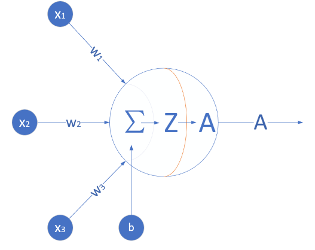

神经元计算模型

#### 输入 input

$(x_1,x_2,x_3)$ 是外界输入信号，一般是一个训练数据样本的多个属性，比如，我们要预测一套房子的价格，那么在房屋价格数据样本中，$x_1$ 可能代表了面积，$x_2$ 可能代表地理位置，$x_3$ 可能代表朝向。另外一个例子是，$(x_1,x_2,x_3)$ 分别代表了(红,绿,蓝)三种颜色，而此神经元用于识别输入的信号是暖色还是冷色。

#### 权重 weights

$(w_1,w_2,w_3)$ 是每个输入信号的权重值，以上面的 $(x_1,x_2,x_3)$ 的例子来说，$x_1$ 的权重可能是 $0.92$，$x_2$ 的权重可能是 $0.2$，$x_3$ 的权重可能是 $0.03$。当然权重值相加之后可以不是 $1$。

#### 偏移 bias

还有个 $b$ 是怎么来的？一般的书或者博客上会告诉你那是因为 $y=wx+b$，$b$ 是偏移值，使得直线能够沿 $Y$ 轴上下移动。这是用结果来解释原因，并非 $b$ 存在的真实原因。从生物学上解释，在脑神经细胞中，一定是输入信号的电平/电流大于某个临界值时，神经元细胞才会处于兴奋状态，这个 $b$ 实际就是那个临界值。亦即当：

$$w_1 \cdot x_1 + w_2 \cdot x_2 + w_3 \cdot x_3 \geq t$$

时，该神经元细胞才会兴奋。我们把t挪到等式左侧来，变成$(-t)$，然后把它写成 $b$，变成了：

$$w_1 \cdot x_1 + w_2 \cdot x_2 + w_3 \cdot x_3 + b \geq 0$$

###  神经网络的主要功能

#### 回归（Regression）或者叫做拟合（Fitting）

单层的神经网络能够模拟一条二维平面上的直线，从而可以完成线性分割任务。而理论证明，两层神经网络可以无限逼近任意连续函数。下图所示就是一个两层神经网络拟合复杂曲线的实例。

!([2](2.png)

 回归/拟合示意图

所谓回归或者拟合，其实就是给出x值输出y值的过程，并且让y值与样本数据形成的曲线的距离尽量小，可以理解为是对样本数据的一种骨架式的抽象。

以上图为例，蓝色的点是样本点，从中可以大致地看出一个轮廓或骨架，而红色的点所连成的线就是神经网络的学习结果，它可以“穿过”样本点群形成中心线，尽量让所有的样本点到中心线的距离的和最近。

#### 分类

如下图，二维平面中有两类点，红色的和蓝色的，用一条直线肯定不能把两者分开了。

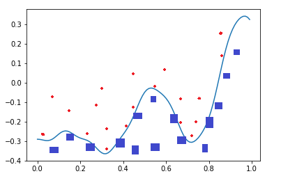

 分类示意图

我们使用一个两层的神经网络可以得到一个非常近似的结果，使得分类误差在满意的范围之内。上图中那条淡蓝色的曲线，本来并不存在，是通过神经网络训练出来的分界线，可以比较完美地把两类样本分开，所以分类可以理解为是对两类或多类样本数据的边界的抽象。

上面的两个图的曲线形态实际上是一个真实的函数在 $[0,1]$ 区间内的形状，其原型是：

$$y=0.4x^2 + 0.3x\sin(15x) + 0.01\cos(50x)-0.3$$

这么复杂的函数，一个两层的神经网络是如何做到的呢？其实从输入层到隐藏层的矩阵计算，就是对输入数据进行了空间变换，使其可以被线性可分，然后在输出层画出一个分界线。而训练的过程，就是确定那个空间变换矩阵的过程。因此，多层神经网络的本质就是对复杂函数的拟合。我们可以在后面的试验中来学习如何拟合上述的复杂函数的。

神经网络的训练结果，是一大堆的权重组成的数组（近似解），并不能得到上面那种精确的数学表达式（数学解析解）。

## 通俗地理解三大概念

这三大概念是：反向传播（线性与非线性），梯度下降，损失函数。

##  线性反向传播


假设有一个函数：

$$z = x \cdot y \tag{1}$$

其中:

$$x = 2w + 3b \tag{2}$$

$$y = 2b + 1 \tag{3}$$

计算图如下

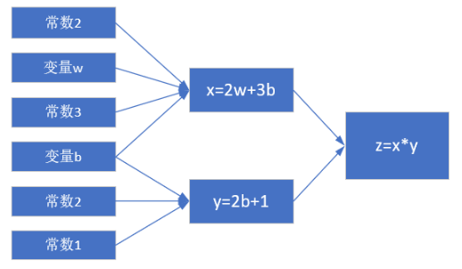

 简单线性计算的计算图

注意这里 $x,y,z$ 不是变量，只是中间计算结果；$w,b$ 才是变量。因为在后面要学习的神经网络中，要最终求解的目标是 $w$ 和 $b$ 的值，所以在这里先预热一下。

当 $w = 3, b = 4$ 时，会得到图2-5的结果。

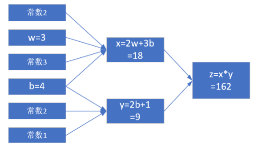

计算结果

最终的 $z$ 值，受到了前面很多因素的影响：变量 $w$，变量 $b$，计算式 $x$，计算式 $y$。

### 第二章 线性回归
#### 线性正向传播案例代码
import numpy as np

def target_function(w,b):
    x = 2*w+3*b
    y=2*b+1
    z=x*y
    return x,y,z

def single_variable(w,b,t):
    print("\nsingle variable: b ----- ")
    error = 1e-5
    while(True):
        x,y,z = target_function(w,b)
        delta_z = z - t
        print("w=%f,b=%f,z=%f,delta_z=%f"%(w,b,z,delta_z))
        if abs(delta_z) < error:
            break
        delta_b = delta_z /63
        print("delta_b=%f"%delta_b)
        b = b - delta_b

    print("done!")
    print("final b=%f"%b)

def single_variable_new(w,b,t):
    print("\nsingle variable new: b ----- ")
    error = 1e-5
    while(True):
        x,y,z = target_function(w,b)
        delta_z = z - t
        print("w=%f,b=%f,z=%f,delta_z=%f"%(w,b,z,delta_z))
        if abs(delta_z) < error:
            break
        factor_b = 2*x+3*y
        delta_b = delta_z/factor_b
        print("factor_b=%f, delta_b=%f"%(factor_b, delta_b))
        b = b - delta_b

    print("done!")
    print("final b=%f"%b)

(this version has a bug)

def double_variable(w,b,t):
    print("\ndouble variable: w, b -----")
    error = 1e-5
    while(True):
        x,y,z = target_function(w,b)
        delta_z = z - t
        print("w=%f,b=%f,z=%f,delta_z=%f"%(w,b,z,delta_z))
        if abs(delta_z) < error:
            break
        delta_b = delta_z/63/2
        delta_w = delta_z/18/2
        print("delta_b=%f, delta_w=%f"%(delta_b,delta_w))
        b = b - delta_b
        w = w - delta_w
    print("done!")
    print("final b=%f"%b)
    print("final w=%f"%w)

(this is correct version)

def double_variable_new(w,b,t):
    print("\ndouble variable new: w, b -----")
    error = 1e-5
    while(True):
        x,y,z = target_function(w,b)
        delta_z = z - t
        print("w=%f,b=%f,z=%f,delta_z=%f"%(w,b,z,delta_z))
        if abs(delta_z) < error:
            break

        factor_b, factor_w = calculate_wb_factor(x,y)
        delta_b = delta_z/factor_b/2
        delta_w = delta_z/factor_w/2
        print("factor_b=%f, factor_w=%f, delta_b=%f, delta_w=%f"%(factor_b, factor_w, delta_b,delta_w))
        b = b - delta_b
        w = w - delta_w
    print("done!")
    print("final b=%f"%b)
    print("final w=%f"%w)

def calculate_wb_factor(x,y):
    factor_b = 2*x+3*y
    factor_w = 2*y
    return factor_b, factor_w

if _name_ == '_main_':
    w = 3
    b = 4
    t = 150
    single_variable(w,b,t)
    single_variable_new(w,b,t)
    double_variable(w,b,t)
    double_variable_new(w,b,t)

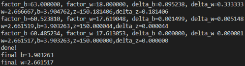

梯度下降

###  梯度下降的数学理解

梯度下降的数学公式：

$$\theta_{n+1} = \theta_{n} - \eta \cdot \nabla J(\theta) \tag{1}$$

其中：

- $\theta_{n+1}$：下一个值；
- $\theta_n$：当前值；
- $-$：减号，梯度的反向；
- $\eta$：学习率或步长，控制每一步走的距离，不要太快以免错过了最佳景点，不要太慢以免时间太长；
- $\nabla$：梯度，函数当前位置的最快上升点；
- $J(\theta)$：函数。

#### 梯度下降的三要素

1. 当前点；
2. 方向；
3. 步长。

#### 为什么说是“梯度下降”？

“梯度下降”包含了两层含义：

1. 梯度：函数当前位置的最快上升点；
2. 下降：与导数相反的方向，用数学语言描述就是那个减号。

亦即与上升相反的方向运动，就是下降。

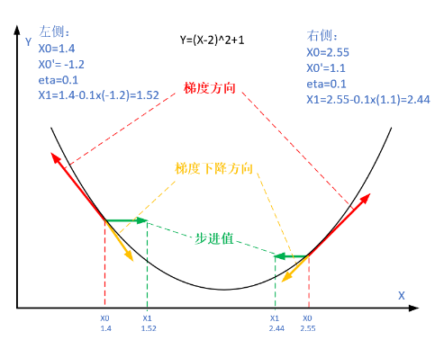

import numpy as np
import matplotlib.pyplot as plt

def targetFunction(x):
    y = (x-1)**2 + 0.1
    return y

def derivativeFun(x):
    y = 2*(x-1)
    return y

def create_sample():
    x = np.linspace(-1,3,num=100)
    y = targetFunction(x)
    return x,y

def draw_base():
    x,y=create_sample()
    plt.plot(x,y,'.')
    plt.show()
    return x,y
   
def gd(eta):
    x = -0.8
    a = np.zeros((2,10))
    for i in range(10):
        a[0,i] = x
        a[1,i] = targetFunction(x)
        dx = derivativeFun(x)
        x = x - eta*dx
    
    plt.plot(a[0,:],a[1,:],'x')
    plt.plot(a[0,:],a[1,:])
    plt.title("eta=%f" %eta)
    plt.show()

if _name_ == '_main_':

    eta = [1.1,1.,0.8,0.6,0.4,0.2,0.1]

    for e in eta:
        X,Y=create_sample()
        plt.plot(X,Y,'.')
        #plt.show()
        gd(e)

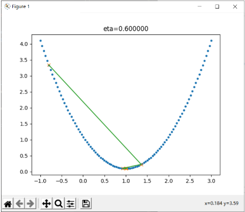

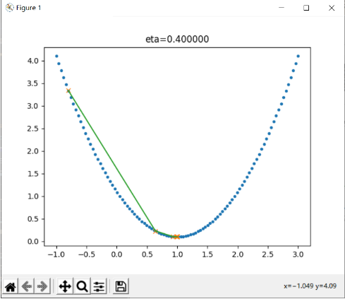

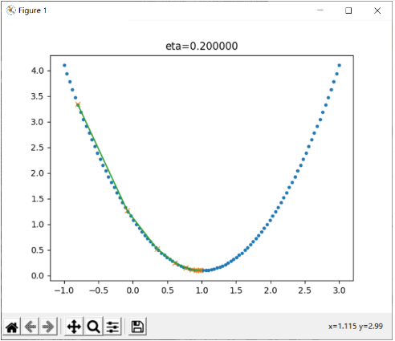

### 第三章 线性分类

####  用神经网络实现线性二分类

我们先看看如何用神经网络在两组不同标签的样本之间画一条明显的分界线。这条分界线可以是直线，也可以是曲线。这就是二分类问题。如果只画一条分界线的话，无论是直线还是曲线，我们可以用一支假想的笔（即一个神经元），就可以达到目的，也就是说笔的走向，完全依赖于这一个神经元根据输入信号的判断。

再看楚汉城池示意图，在两个颜色区域之间似乎存在一条分割的直线，即线性可分的。

1. 从视觉上判断是线性可分的，所以我们使用单层神经网络即可；
2. 输入特征是经度和纬度，所以我们在输入层设置两个输入单元。其中$x_1=$经度，$x_2=$纬度；
3. 最后输出的是一个二分类结果，分别是楚汉地盘，可以看成非0即1的二分类问题，所以我们只用一个输出单元就可以了。

##  线性二分类原理

###  线性分类和线性回归的异同

此原理对线性和非线性二分类都适用。

回忆一下前面学习过的线性回归，通过均方差函数误差反向传播的方法，不断矫正拟合直线的角度（Weights）和偏移（Bias），因为均方差函数能够准确地反映出当前的拟合程度。那么在线性分类中，我们能不能采取类似的方法呢？

线性分类，试图在含有两种样本的空间中划出一条分界线，让双方截然分开，就好像是中国象棋的棋盘中的楚河汉界一样。与线性回归相似的地方是，两者都需要划出那条“直线”来，但是不同的地方也很明显，见下表。

 线性回归和线性分类的比较

||线性回归|线性分类|
|---|---|---|
|相同点|需要在样本群中找到一条直线|需要在样本群中找到一条直线|
|不同点|用直线来拟合所有样本，使得各个样本到这条直线的距离尽可能最短|用直线来分割所有样本，使得正例样本和负例样本尽可能分布在直线两侧|

可以看到线性回归中的目标--“距离最短”，还是很容易理解的，但是线性分类的目标--“分布在两侧”，用数学方式如何描述呢？我们可以有代数和几何两种方式来描述。

###  二分类的代数原理

代数方式：通过一个分类函数计算所有样本点在经过线性变换后的概率值，使得正例样本的概率大于0.5，而负例样本的概率小于0.5。

##  实现逻辑与或非门

单层神经网络，又叫做感知机，它可以轻松实现逻辑与、或、非门。由于逻辑与、或门，需要有两个变量输入，而逻辑非门只有一个变量输入。但是它们共同的特点是输入为0或1，可以看作是正负两个类别。

所以，在学习了二分类知识后，我们可以用分类的思想来实现下列5个逻辑门：

- 与门 AND
- 与非门 NAND
- 或门 OR
- 或非门 NOR
- 非门 NOT

###  提出问题

在二分类问题中，一般都使用对率函数（Logistic Function，常被称为Sigmoid Function）作为分类函数，并配合二分类交叉熵损失函数：

$$a_i=Logisitc(z_i) = \frac{1}{1 + e^{-z_i}} $$

$$loss_i(w,b)=-[y_i \ln a_i + (1-y_i) \ln (1-a_i)] $$

还有一个与对率函数长得非常像的函数，即双曲正切函数（Tanh Function），公式如下：

$$Tanh(z) = \frac{e^{z} - e^{-z}}{e^{z} + e^{-z}} = \frac{2}{1 + e^{-2z}} - 1 $$

#### 二分类与多分类的关系

我们已经学习过了使用神经网络做二分类的方法，它并不能用于多分类。在传统的机器学习中，有些二分类算法可以直接推广到多分类，但是在更多的时候，我们会基于一些基本策略，利用二分类学习器来解决多分类问题。

多分类问题一共有三种解法：

1. 一对一方式
   
每次先只保留两个类别的数据，训练一个分类器。如果一共有 $N$ 个类别，则需要训练 $C^2_N$ 个分类器。以 $N=3$ 时举例，需要训练 $A|B，B|C，A|C$ 三个分类器。

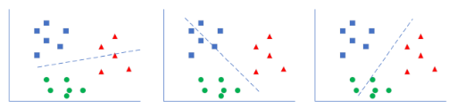

 一对一方式

如上图最左侧所示，这个二分类器只关心蓝色和绿色样本的分类，而不管红色样本的情况，也就是说在训练时，只把蓝色和绿色样本输入网络。
   
推理时，$(A|B)$ 分类器告诉你是A类时，需要到 $(A|C)$ 分类器再试一下，如果也是A类，则就是A类。如果 $(A|C)$ 告诉你是C类，则基本是C类了，不可能是B类，不信的话可以到 $(B|C)$ 分类器再去测试一下。

2. 一对多方式
   
如下图，处理一个类别时，暂时把其它所有类别看作是一类，这样对于三分类问题，可以得到三个分类器。

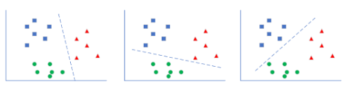

 一对多方式

如最左图，这种情况是在训练时，把红色样本当作一类，把蓝色和绿色样本混在一起当作另外一类。

推理时，同时调用三个分类器，再把三种结果组合起来，就是真实的结果。比如，第一个分类器告诉你是“红类”，那么它确实就是红类；如果告诉你是非红类，则需要看第二个分类器的结果，绿类或者非绿类；依此类推。

3. 多对多方式

假设有4个类别ABCD，我们可以把AB算作一类，CD算作一类，训练一个分类器1；再把AC算作一类，BD算作一类，训练一个分类器2。
    
推理时，第1个分类器告诉你是AB类，第二个分类器告诉你是BD类，则做“与”操作，就是B类。

## 第五章 非线性分类

#### 神经网络实现非线性回归

#####  万能近似定理

万能近似定理(universal approximation theorem) $^{[1]}$，是深度学习最根本的理论依据。它证明了在给定网络具有足够多的隐藏单元的条件下，配备一个线性输出层和一个带有任何“挤压”性质的激活函数（如Sigmoid激活函数）的隐藏层的前馈神经网络，能够以任何想要的误差量近似任何从一个有限维度的空间映射到另一个有限维度空间的Borel可测的函数。

### 定义神经网络结构

本节的目的是要用神经网络完成图9-1和图9-2中的曲线拟合。

根据万能近似定理的要求，我们定义一个两层的神经网络，输入层不算，一个隐藏层，含3个神经元，一个输出层。图9-7显示了此次用到的神经网络结构。

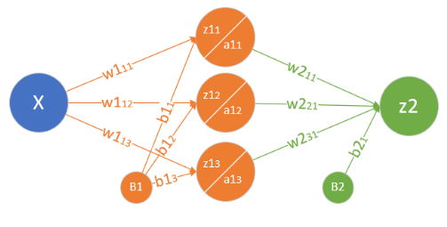

### 神经网络的非线性拟合工作原理

我们以正弦曲线的例子来讲解神经网络非线性回归的工作过程和原理。

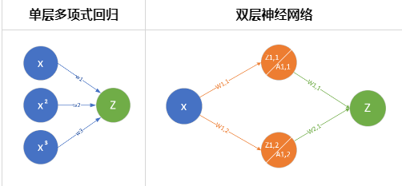

比较一下表中的两张图，左侧为单特征多项式拟合的示意图，右侧为双层神经网络的示意图。

左图中，通过人为的方式，给Z的输入增加了$x^2和x^3$项。

右图中，通过线性变换的方式，把x变成了两部分：$z_{11}/a_{11}，z_{12}/a_{12}$，然后再通过一次线性变换把两者组合成为Z，这种方式和多项式回归非常类似：

1. 隐层把x拆成不同的特征，根据问题复杂度决定神经元数量，神经元的数量相当于特征值的数量；
2. 隐层通过激活函数做一次非线性变换；
3. 输出层使用多变量线性回归，把隐层的输出当作输入特征值，再做一次线性变换，得出拟合结果。

与多项式回归不同的是，不需要指定变换参数，而是从训练中学习到参数，这样的话权重值不会大得离谱。

##  超参数优化的初步认识

超参数优化（Hyperparameter Optimization）主要存在两方面的困难：

1. 超参数优化是一个组合优化问题，无法像一般参数那样通过梯度下降方法来优化，也没有一种通用有效的优化方法。
2. 评估一组超参数配置（Configuration）的时间代价非常高，从而导致一些优化方法（比如演化算法）在超参数优化中难以应用。

对于超参数的设置，比较简单的方法有人工搜索、网格搜索和随机搜索。 

###——————————————————————————————————————

###  二分类模型的评估标准

#### 准确率 Accuracy

也可以称之为精度，我们在本书中混用这两个词。

对于二分类问题，假设测试集上一共1000个样本，其中550个正例，450个负例。测试一个模型时，得到的结果是：521个正例样本被判断为正类，435个负例样本被判断为负类，则正确率计算如下：

$$Accuracy=(521+435)/1000=0.956$$

即正确率为95.6%。这种方式对多分类也是有效的，即三类中判别正确的样本数除以总样本数，即为准确率。
但是这种计算方法丢失了很多细节，比如：是正类判断的精度高还是负类判断的精度高呢？因此，我们还有如下一种评估标准。

### 非线性的可能性

我们前边学习过如何实现与、与非、或、或非，我们看看如何
用已有的逻辑搭建异或门，如下图所示。

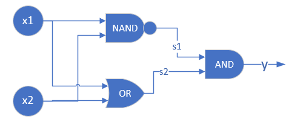

图中利用基本逻辑单元搭建异或运算单元

表中组合运算的过程

|样本与计算|1|2|3|4|
|----|----|----|----|----|
|$x_1$|0|0|1|1|
|$x_2$|0|1|0|1|
|$s_1=x_1$ NAND $x_2$|1|1|1|0|
|$s_2=x_1$ OR $x_2$|0|1|1|1|
|$y=s_1$ AND $s_2$|0|1|1|0|

经过表所示的组合运算后，可以看到$y$的输出与$x_1,x_2$
的输入相比，就是异或逻辑了。所以，实践证明两层逻辑电路
可以解决问题。另外，我们在地四步中学习了非线性回归，使
用双层神经网络可以完成一些神奇的事情，比如复杂曲线的拟
合，只需要6、7个参数就搞定了。我们可以模拟这个思路，用
两层神经网络搭建模型，来解决非线性分类问题。

### 双弧形二分类的工作原理
在异或问题中，我们知道了如果使用三维坐标系来分析平面上任意复杂的分类问题，都可以迎刃而解：只要把不同的类别的点通过三维线性变换把它们向上升起，就很容易地分开不同类别的样本。但是这种解释有些牵强，笔者不认为神经网络已经聪明到这个程度了。

所以，笔者试图在二维平面上继续研究，寻找真正的答案，恰巧读到了关于流式学习的一些资料，于是做了下述试验，来验证神经网络到底在二维平面上做了什么样的空间变换。

##  非线性二分类实现

###  定义神经网络结构

首先定义可以完成非线性二分类的神经网络结构图，如图10-6所示。

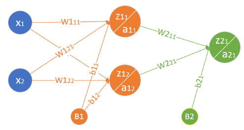

下图非线性二分类神经网络结构图

- 输入层两个特征值$x_1,x_2$
  $$
  X=\begin{pmatrix}
    x_1 & x_2
  \end{pmatrix}
  $$
- 隐层$2\times 2$的权重矩阵$W1$
$$
  W1=\begin{pmatrix}
    w1_{11} & w1_{12} \\\\
    w1_{21} & w1_{22} 
  \end{pmatrix}
$$
- 隐层$1\times 2$的偏移矩阵$B1$

$$
  B1=\begin{pmatrix}
    b1_{1} & b1_{2}
  \end{pmatrix}
$$

- 隐层由两个神经元构成
$$
Z1=\begin{pmatrix}
  z1_{1} & z1_{2}
\end{pmatrix}
$$
$$
A1=\begin{pmatrix}
  a1_{1} & a1_{2}
\end{pmatrix}
$$
- 输出层$2\times 1$的权重矩阵$W2$
$$
  W2=\begin{pmatrix}
    w2_{11} \\\\
    w2_{21}  
  \end{pmatrix}
$$

- 输出层$1\times 1$的偏移矩阵$B2$

$$
  B2=\begin{pmatrix}
    b2_{1}
  \end{pmatrix}
$$

- 输出层有一个神经元使用Logistic函数进行分类
$$
  Z2=\begin{pmatrix}
    z2_{1}
  \end{pmatrix}
$$
$$
  A2=\begin{pmatrix}
    a2_{1}
  \end{pmatrix}
$$

对于一般的用于二分类的双层神经网络可以是图10-7的样子。

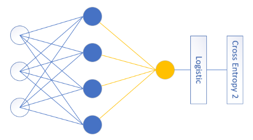

上图通用的二分类神经网络结构图

输入特征值可以有很多，隐层单元也可以有很多，输出单元只有一个，且后面要接Logistic分类函数和二分类交叉熵损失函数。

### 第七章 深度神经网络

#### 深度神经网络框架设计

##### 功能/模式分析

首先需要一个`NeuralNet`类，来包装基本的神经网络结构和功能：

- `Layers` - 神经网络各层的容器，按添加顺序维护一个列表
- `Parameters` - 基本参数，包括普通参数和超参
- `Loss Function` - 提供计算损失函数值，存储历史记录并最后绘图的功能
- `LayerManagement()` - 添加神经网络层
- `ForwardCalculation()` - 调用各层的前向计算方法
- `BackPropagation()` - 调用各层的反向传播方法
- `PreUpdateWeights()` - 预更新各层的权重参数
- `UpdateWeights()` - 更新各层的权重参数
- `Train()` - 训练
- `SaveWeights()` - 保存各层的权重参数
- `LoadWeights()` - 加载各层的权重参数

#### Layer

是一个抽象类，以及更加需要增加的实际类，包括：

- Fully Connected Layer
- Classification Layer
- Activator Layer
- Dropout Layer
- Batch Norm Layer

将来还会包括：

- Convolution Layer
- Max Pool Layer

每个Layer都包括以下基本方法：
 - `ForwardCalculation()` - 调用本层的前向计算方法
 - `BackPropagation()` - 调用本层的反向传播方法
 - `PreUpdateWeights()` - 预更新本层的权重参数
 - `UpdateWeights()` - 更新本层的权重参数
 - `SaveWeights()` - 保存本层的权重参数
 - `LoadWeights()` - 加载本层的权重参数

#### Activator Layer

激活函数和分类函数：

- `Identity` - 直传函数，即没有激活处理
- `Sigmoid`
- `Tanh`
- `Relu`

#### Classification Layer

分类函数，包括：

- `Sigmoid`二分类
- `Softmax`多分类


 #### Parameters

 基本神经网络运行参数：

 - 学习率
 - 最大`epoch`
 - `batch size`
 - 损失函数定义
 - 初始化方法
 - 优化器类型
 - 停止条件
 - 正则类型和条件

#### LossFunction

损失函数及帮助方法：

- 均方差函数
- 交叉熵函数二分类
- 交叉熵函数多分类
- 记录损失函数
- 显示损失函数历史记录
- 获得最小函数值时的权重参数

#### Optimizer

优化器：

- `SGD`
- `Momentum`
- `Nag`
- `AdaGrad`
- `AdaDelta`
- `RMSProp`
- `Adam`

#### WeightsBias

权重矩阵，仅供全连接层使用：

- 初始化 
  - `Zero`, `Normal`, `MSRA` (`HE`), `Xavier`
  - 保存初始化值
  - 加载初始化值
- `Pre_Update` - 预更新
- `Update` - 更新
- `Save` - 保存训练结果值
- `Load` - 加载训练结果值

#### DataReader

样本数据读取器：

- `ReadData` - 从文件中读取数据
- `NormalizeX` - 归一化样本值
- `NormalizeY` - 归一化标签值
- `GetBatchSamples` - 获得批数据
- `ToOneHot` - 标签值变成OneHot编码用于多分类
- `ToZeroOne` - 标签值变成0/1编码用于二分类
- `Shuffle` - 打乱样本顺序

从中派生出两个数据读取器：

- `MnistImageDataReader` - 读取MNIST数据
- `CifarImageReader` - 读取Cifar10数据

## 回归任务功能测试

用一个两层的神经网络，验证了万能近似定理。当时是用hard code方式写的，现在用迷你框架来搭建一下。

```Python
def model():
    dataReader = LoadData()
    num_input = 1
    num_hidden1 = 4
    num_output = 1

    max_epoch = 10000
    batch_size = 10
    learning_rate = 0.5

    params = HyperParameters_4_0(
        learning_rate, max_epoch, batch_size,
        net_type=NetType.Fitting,
        init_method=InitialMethod.Xavier,
        stopper=Stopper(StopCondition.StopLoss, 0.001))

    net = NeuralNet_4_0(params, "Level1_CurveFittingNet")
    fc1 = FcLayer_1_0(num_input, num_hidden1, params)
    net.add_layer(fc1, "fc1")
    sigmoid1 = ActivationLayer(Sigmoid())
    net.add_layer(sigmoid1, "sigmoid1")
    fc2 = FcLayer_1_0(num_hidden1, num_output, params)
    net.add_layer(fc2, "fc2")

    net.train(dataReader, checkpoint=100, need_test=True)

    net.ShowLossHistory()
    ShowResult(net, dataReader)
```
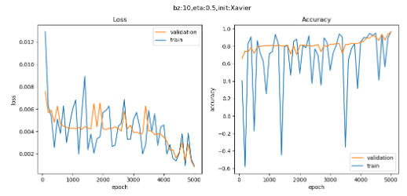

超参数说明：

1. 输入层1个神经元，因为只有一个`x`值
2. 隐层4个神经元，对于此问题来说应该是足够了，因为特征很少
3. 输出层1个神经元，因为是拟合任务
4. 学习率=0.5
5. 最大`epoch=10000`轮
6. 批量样本数=10
7. 拟合网络类型
8. Xavier初始化
9. 绝对损失停止条件=0.001

#### 数据处理

原始数据只有一个数据集，所以需要我们自己把它分成训练集和测试集，比例大概为4:1。此数据集为`csv`文件格式，为了方便，我们把它转换成了两个扩展名为`npz`的`numpy`压缩形式：

- `house_Train.npz`，训练数据集
- `house_Test.npz`，测试数据集

#### 加载数据

与上面第一个例子的代码相似，但是房屋数据属性繁杂，所以需要做归一化，房屋价格也是至少6位数，所以也需要做归一化。

这里有个需要注意的地方，即训练集和测试集的数据，需要合并在一起做归一化，然后再分开使用。为什么要先合并呢？假设训练集样本中的房屋面积的范围为150到220，而测试集中的房屋面积有可能是160到230，两者不一致。分别归一化的话，150变成0，160也变成0，这样预测就会产生误差。

## 集成学习 Ensemble Learning

###  集成学习的概念

当数据集有问题，或者网络学习能力不足，或准确度不够时，我们可以采取集成学习的方法，来提升性能。说得通俗一些，就是发挥团队的智慧，根据团队中不同背景、不同能力的成员的独立意见，通过某种决策方法来解决一个问题。所以集成学习也称为多分类器系统(multi-classifier system)、基于委员会的学习(committee-based learning)等。

图中有两个组件：

#### Individual Learner 个体学习器

如果所有的个体学习器都是同一类型的学习器，即同质模式，比如都用神经网路，称为“基学习器”（base learner），相应的学习算法称为“基学习算法”（base learning algorithm）。

在传统的机器学习中，个体学习器可以是不同的，比如用决策树、支持向量机等，此时称为异质模式。

#### Aggregator 结合模块

个体学习器的输出，通过一定的结合策略，在结合模块中有机结合在一起，可以形成一个能力较强的学习器，所以有时称为强学习器，而相应地称个体学习器为弱学习器。

个体学习器之间是否存在依赖关系呢？这取决于产生个体学习器的方法：

- Boosting系列算法，一系列的个体学习器需要一个个地串行生成，有前后依赖关系。
- Bagging算法和随机森林算法（Random Forest），个体学习器可以独立或并行生成，没有依赖关系。

我们只讨论使用神经网络的同质个体学习方法，和Bagging集成算法。由于神经网络的复杂性，即使使用相同的网络参数，由于初始化的不同或者训练数据的不同，也可以得到差别很大的模型。

从偏差-方差的角度看，Bagging主要起到降低方差的作用。在前面我们分析过，单个学习器的过拟合是高方差造成的，我们训练多个这样的学习器，随机选择的样本数据如果分布均匀的话，每个学习器在针对单个测试样本时都会有高方差风险，从而产生泛化误差。但是由于我们拥有9个神经网络，采用集成法后，一定程度上缓解了高方差的现象。


## 用搭建的miniFramework实现手写数字的识别

打开VS code 
选择文件>新建>新项目>选择C#>创建工作台

用VS code打开指定路径
打开解决方案资源管理器的minist.cs打开代码 

using System;
using System.Collections.Generic;
using System.ComponentModel;
using System.Data;
using System.Drawing;
using System.Drawing.Drawing2D;//用于优化绘制的结果
using System.Linq;
using System.Text;
using System.Threading.Tasks;
using System.Windows.Forms;
using MnistModel;

namespace DrawDigit
{
    public partial class Form1 : Form
    {
        public Form1()
        {
            InitializeComponent();
        }

    private Bitmap digitImage;//用来保存手写数字
    private Point startPoint;//用于绘制线段，作为线段的初始端点坐标
    private Mnist model;//用于识别手写数字
    private const int MnistImageSize = 28;//Mnist模型所需的输入图片大小

    private void Form1_Load(object sender, EventArgs e)
    {
        //当窗口加载时，绘制一个白色方框
        model = new Mnist();
        digitImage = new Bitmap(pictureBox1.Width, pictureBox1.Height);
        Graphics g = Graphics.FromImage(digitImage);
        g.Clear(Color.White);
        pictureBox1.Image = digitImage;
    }

    private void clean_click(object sender, EventArgs e)
    {
        //当点击清除时，重新绘制一个白色方框，同时清除label1显示的文本
        digitImage = new Bitmap(pictureBox1.Width, pictureBox1.Height);
        Graphics g = Graphics.FromImage(digitImage);
        g.Clear(Color.White);
        pictureBox1.Image = digitImage;
        label1.Text = "";
    }

    private void pictureBox1_MouseDown(object sender, MouseEventArgs e)
    {
        //当鼠标左键被按下时，记录下需要绘制的线段的起始坐标
        startPoint = (e.Button == MouseButtons.Left) ? e.Location : startPoint;
    }

    private void pictureBox1_MouseMove(object sender, MouseEventArgs e)
    {
        //当鼠标在移动，且当前处于绘制状态时，根据鼠标的实时位置与记录的起始坐标绘制线段，同时更新需要绘制的线段的起始坐标
        if (e.Button == MouseButtons.Left)
        {
            Graphics g = Graphics.FromImage(digitImage);
            Pen myPen = new Pen(Color.Black, 40);
            myPen.StartCap = LineCap.Round;
            myPen.EndCap = LineCap.Round;
            g.DrawLine(myPen,startPoint, e.Location);
            pictureBox1.Image = digitImage;
            g.Dispose();
            startPoint = e.Location;
        }
    }

    private void pictureBox1_MouseUp(object sender, MouseEventArgs e)
    {
        //当鼠标左键释放时
        //同时开始处理图片进行推理
        //暂时不处理这里的代码
    }
}
}

模型包装成一个类
在解决方案MnistForm下点击鼠标右键，选择添加->新建项目，在弹出的窗口里选择模型推理类库于是就会又多了一个工程项目

连接两个部分
给DrawDigit添加引用，让它能使用MnistModel。在DrawDigit项目的引用上点击鼠标右键，点击添加引用，在弹出的窗口中选择MnistModel，点击确定

在pictureBox1_MouseUp中添加上这些代码，并且在文件最初添加上using MnistModel。
private void pictureBox1_MouseUp(object sender, MouseEventArgs e)
{
    //当鼠标左键释放时
    //开始处理图片进行推理
    if (e.Button == MouseButtons.Left)
    {
        Bitmap digitTmp = (Bitmap)digitImage.Clone();//复制digitImage
               
        using (Graphics g = Graphics.FromImage(digitTmp))
        {
            g.InterpolationMode = InterpolationMode.HighQualityBicubic;
            g.DrawImage(digitTmp, 0, 0, MnistImageSize, MnistImageSize);
        }
        //将图片转为灰阶图，并将图片的像素信息保存在list中
        var image = new List<float>(MnistImageSize * MnistImageSize);
        for (var x = 0; x < MnistImageSize; x++)
        {
        for (var y = 0; y < MnistImageSize; y++)
        {
        var color = digitTmp.GetPixel(y, x);
            var a = (float)(0.5 - (color.R + color.G + color.B) / (3.0 * 255));
            image.Add(a);
        }
    }
            //将图片信息包装为mnist模型规定的输入格式
            var batch = new List<IEnumerable<float>>();
            batch.Add(image);
            //将图片传送给mnist模型进行推理
            var result = model.Infer(batch);
            //将推理结果输出
            label1.Text = result.First().First().ToString();
        }
    }

测试结果如下图所示：

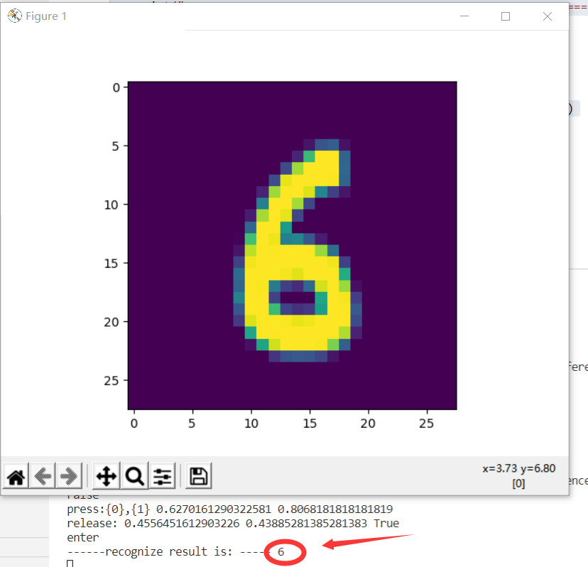

## 心得体会
从学习人工智能导论课，以及Python的相关使用语句，能够对人工智能有了许多简单的感性认识，人工智能比将是一种可以改变未来且具有挑战性的学科。
人工智能在许多的领域得到了发展并在我们的日常生活中发挥了重要的作用，用以完成这一过程的软件系统叫做机器翻译的相关系统，正是这个人工智能导论课的学习，给生活提供了极其巨大的遍历。

## 学习总结
对于回归问题通常用均方差损失函数，可以保证损失函数是个凸函数，即可以得到最优解。而分类问题如果用均方差的话，损失函数的表现不是凸函数，就很难得到最优解。而交叉熵函数可以保证区间内单调。
分类问题的最后一层网络，需要分类函数，Sigmoid或者Softmax，如果再接均方差函数的话，其求导结果复杂，运算量比较大。用交叉熵函数的话，可以得到比较简单的计算结果，一个简单的减法就可以得到反向误差。
对于一个很好的方法去处理非平衡数据问题，并且在理论上证明了。这个方法便是由Robert E. Schapire于1990年在Machine Learning提出的”The strength of weak learnability” ，该方法是一个boosting算法，它递归地训练三个弱学习器，然后将这三个弱学习器结合起形成一个强的学习器。我们可以使用这个算法的第一步去解决数据不平衡问题。
对人工智能导论课的学习之后，了解到了人工智能发展的历史过程非常的有趣，然后对于各种深度神经网络的基本工作原理的了解。以及其三大基本概念：反向传播、梯度下降、损失函数。智能是一个宽泛的概念。对于人类具有的特征之一。人工智能的应用以及显现出它极其明显的经济效益潜力。
