# 《人工智能概论》课程报告

**学号：201809043  姓名：周世顺**

# 前言收获

通过本课程的学习，我们了解了人工智能的基本概念和基本原理，掌握传统人工智能的知识表示方法和搜索求解策略，掌握计算智能的基本知识与方法，包括人工神经网络、深度机器学习、遗传进化算法、群体智能算法等主要内容，掌握人工智能的确定推理技术和不确定性推理，熟悉人工智能的主要应用，包括知识图谱、机器人规划、无人系统、人脸识别、自然语言理解等内容，了解人工智能的发展学派和当前主要前沿方向，为智能信息分析、专家系统以及智能决策支持系统等各类智能系统的建立和开发奠定基础。

最后我们手动实践搭建一个三层神经网络，来解决MNIST手写数字识别问题，并学习使用梯度检查来帮助我们测试反向传播代码的正确性。

通过上述理论知识的学习和实践操作，两者相结的方式，在了解人工智能的发展和现状的同时，学习和掌握人工智能的基本原理和方法，形成对人工智能的相关应用领域的全面认识，激发对人工智能的学习兴趣，提供新的思维方法和问题求解手段。

# 第一章 神经网络概论与基本概念

## 一、神经网络介绍
### 1.1.介绍
人工神经网络(Artificial Neural Netork,即ANN)是由简单神经元经过相互连接形成网状结构，通过调节各连接的权重值改变连接的强度，进而实现感知判断反向传播(Back Propagation,BP）算法的提出进一步推动了神经网络的发展。

目前，神经网络作为一种重要的数据挖掘方法，已在医学诊断、信用卡欺诈识别、手写数字识别以及发动机的故障诊断等领域得到了广泛的应用。

### 1.2.分类
`在外界输入样本能刺激下，不断改变网络连接的权值（加深记忆）`
	
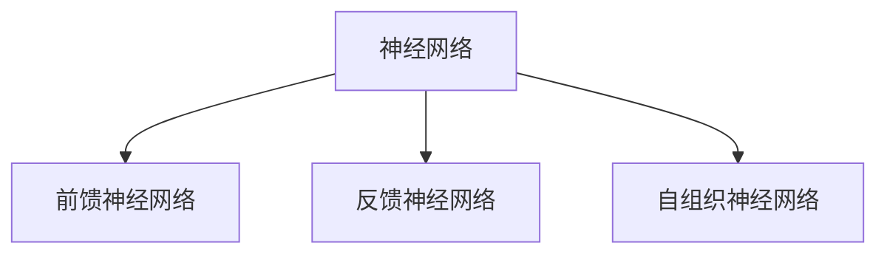
### 1.3.前馈神经网络
前馈神经网络(Feed Forward Neural Network)是一种单向多层的网络结构，即信息是从输入层开始，逐层向一个方向传递，一直到输出层结束。所谓的“前馈”是指输入信号的传播方向为前向，在此过程中并不调整各层的权值参数，而反传播时是将误差逐层向后传递，从而实现使用权值参数对特征的记忆，即通过反向传播(BP)算法来计算各层网络中神经元之间边的权重。BP算法具有非线性映射能力，理论上可逼近任意连续函，从而实现对模型的学习。
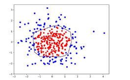

### 1.4.感知器

感知器是一种结构最简单的前馈神经网络，也称为感知机，它主要用于求解分类问题一个感知器可以接收n个输入
x=(x1,x2,..,xn)，对应n个权值w=(W1,w2,.., wn)，此外还有一个偏置项阈值，就是图中的b，神经元将所有输入参数与对应权值进行加权求和，得到的结果经过激活函数变换后输出，计算公式如下:
y=f ( x*w + b ) 


神经元的作用可以理解为对输入空间进行直线划分，单层感知机无法解决最简单的非线性可分问题----异或问题

感知器可以顺利求解与(AND)和或(OR)问题，但是对于异或(XOR)问题，单层感知机无法通过一条线进行分割。


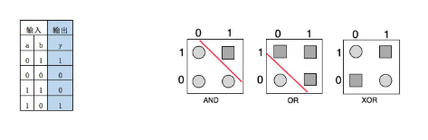

### 1.5.BP神经网络
BP(Back Propagation)神经网络也是前馈神经网络，只是它的参数权重值是由反向传播学习算法进行调整的BP神经网络模型拓扑结构包括输入层、隐层和输出层，利用激活函数来实现从输入到输出的任意非线性映射，从而模拟各层神经元之间的交互。

激活函数须满足处处可导的条件。例如，Sigmoid函数连续可微，求导合适，单调递增，输出值是0~1之间的连续量，这些特点使其适合作为神经网络的激活函数。

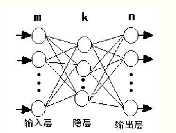

#### 1.5.1.结构
 同一层不连接，相邻层全连接，层与层之间传递权重

 
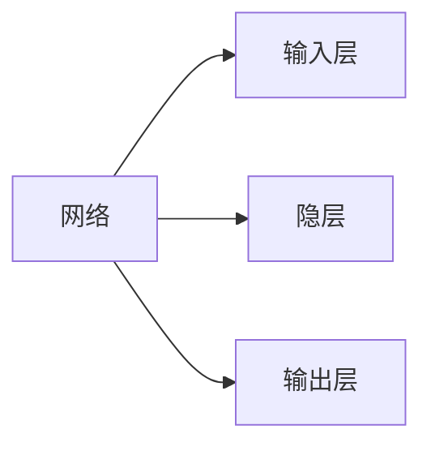
*[隐层]: 非线性（多层次） 

BP网络由输入层、隐层和输出层组成，隐层可以有一层或多层，图2是m×k×n的三层BP网络模型，网络选用s型传递函

$F(x)=\frac{1}{1+e^(-x)}$ 通过反传误差函数$E=	\frac{\sum_{t=1}^{n}(t_i+O_i)^2}{2}$ ( Ti为期望输出、0i为网络的计算输出），不断调节网络权值和阈值使误差函数E达到极小。

BP网络具有高度非线性和较强的泛化能力，但也存在收敛速度慢、迭代步数多、易于陷入局部极小和全局搜索能力差等缺点。可以先用遗传算法对“BP网络”进行优化在解析空间找出较好的搜索空间，再用BP网络在较小的搜索空间内搜索最优解。

#### 1.5.2.模型实现
此次预测选用MATLAB中的神经网络工具箱进行网络的训练.预测模型的具体实现步骤如下:将训练样本数据归一化后输入网络。设定网络隐层和输出层激励函数分别为tansig和logsig函数.网络训练函数为traingdx,网络性能函数为mse,隐层神经元数初设为6。设定网络参数。网络迭代次数epochs为5000次.期望误差goal为0.00000001，学习速率1r为0.01。设定完参数后，开始训练网络。
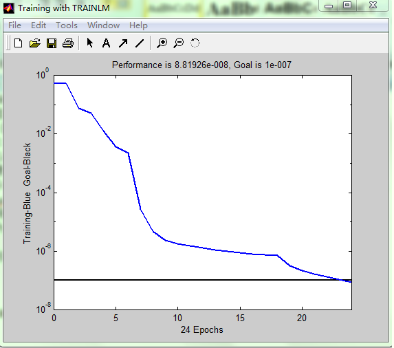

该网络通过24次重复学习达到期望误差后则完成学习。详细代码见附录网络训练完成后，只需要将各项素质指标输入网络即可得到预测数据。
预测结果为:2.20

## 二、神经网络的基本工作原理

### 2.1.神经元细胞的数学模型

神经网络由基本的神经元组成，下图就是一个神经元的数学/计算模型


由五部分组成：
 （1）输入 input：(x1,x2,x3) 是外界输入信号，一般是一个训练数据样本的多个属性；
 （2）权重 weights：(w1,w2,w3) 是每个输入信号的权重值。 
 （3）偏移 bias：从生物学上解释，在脑神经细胞中，一定是输入信号的电平/电流大于某个临界值时，神经元细胞才会处于兴奋状态，这个b实际就是那个临界值。 
（4）求和计算 sum：$$Z = w1 \cdot x1 + w2 \cdot x2 + w3 \cdot x3 + b = \sum_{i=1}^m(w_i \cdot x_i) + b$$ （5）激活函数 activation：求和之后，神经细胞已经处于兴奋状态了，已经决定要向下一个神经元传递信号了，但是要传递多强烈的信号，要由激活函数来确定。

### 2.2.神经网络的训练过程
单层神经网络模型
$(x_1,x_2,x_3)$ 是一个样本数据的三个特征值
$(w_{11},w_{21},w_{31})$ 是 $(x_1,x_2,x_3)$ 到 $n1$ 的权重
$(w_{12},w_{22},w_{32})$ 是 $(x_1,x_2,x_3)$ 到 $n2$ 的权重
$b_1$ 是 $n1$ 的偏移
$b_2$ 是 $n2$ 的偏移


梯度下降的三要素:当前点、方向、步长。

## 三、神经网络相关函数

### 3.1.激活函数
1.处处可导
	2.非线性
	3.可微性
	4.单调性
	5.输出值范围（可控）
	6.计算简单
	7.归一化
	8.函数值约等变量

     **范例：**

	Sigmoid函数
 
]
)
        1.连续可微
	    2.单调递增
	    3.输出值为0到1之内
 	    4.求导合适

-   **常见激活函数**

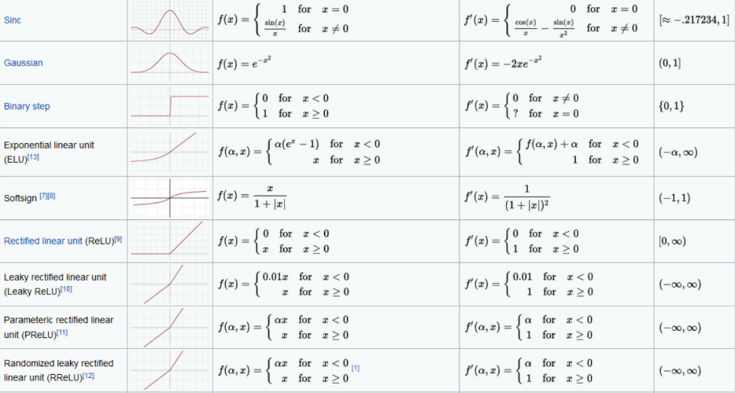

### 3.2.sigmoid函数
Sigmoid函数的优点在于输出范围有限，数据在传递的过程中不容易发散，并且其输出范围为(0,1)，可以在输出层表示概率值，如图6-8所示。Sigmoi函数的导数是非零的，很容易计算。

Sigmoid函数的主要缺点是梯度下降非常明显，且两头过于平坦，容易出现梯度消失的情况，输出的值域不对称，并非像tanh函数那样值域是-1到1
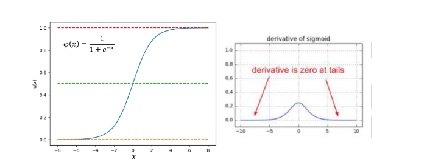

### 3.3.损失函数

•	**交叉熵**
    $loss = ylog(\hat{y}_n)+(1-y)\log (1-\hat{y}_n)$
•	**均方差**
    $loss = \frac{1}{n}\sum_{n=1}^{n=\infty}(\hat{x}_i-x_i)^2$

### 3.4.过拟合，调整

**过拟合**

训练集上效果好，测试集上效果差，在预测中

**方法**
    
    •	参数范数惩罚，惩罚性成本函数正则化
    •	将惩罚项添加至损失函数已获得高权重
    •	公式
    •	数据增强
    •	提前终止
    •	选择一些规则来提前终止训练
    •	Bagging，等集成方法
  Dropout
    •	以正则化
    •	动量方法
	
*[Drpout]: 在每次训练中随机删除一个神经元子集•	防止神经网络过度依赖某一个路径随机屏蔽掉某些神经元，然后再调节其权重.

*[动量方法]:	每次训练仅略微改变方向,保持不进方向的连续平均数，消除个别点的变化

## 四、基础应用

因为利用BP网络可以建立对象的结构模型，所以分类和预测问题是神经网络最常见的一种应用。举几个例子:根据商店前几年某商品的销量建立模型，用来预测今年的销量，提前备货;根据电影的关键词给电影分类(动作、爱情、悬疑....);建立数字/字母模型来识别车牌等。


百度百科中总结的应用类型有以下四个方面:
1)函数逼近:用输入向量和相应的输出向量训练一个网络逼近一个函数。
2)模式识别:用一个待定的输出向量将它与输入向量联系起来。
3)分类:把输入向量所定义的合适方式进行分类。
4)数据压缩:减少输出向量维数以便于传输或存储。

# 第二章  线性回归

基本公式

$$Y = X \cdot W + B \tag{1}$$

## 梯度下降的三种形式

### 1.最小二乘法

最小二乘法，也叫做最小平方法（Least Square），它通过最小化误差的平方和寻找数据的最佳函数匹配。利用最小二乘法可以简便地求得未知的数据，并使得这些求得的数据与实际数据之间误差的平方和为最小。最小二乘法还可用于曲线拟合。其他一些优化问题也可通过最小化能量或最小二乘法来表达。


实际上就是试图找到一条直线，使所有样本到直线上的残差的平方和最小。


图1-1 均方差函数的评估原理

图1-1中，圆形点是样本点，直线是当前的拟合结果。如左图所示，我们是要计算样本点到直线的垂直距离，需要再根据直线的斜率来求垂足然后再计算距离，这样计算起来很慢；但实际上，在工程上我们通常使用的是右图的方式，即样本点到直线的竖直距离，因为这样计算很方便，用一个减法就可以了。

**公式**：
$$
b = \frac{1}{m}\left(\sum_{i=1}^m{y_i} - w\sum_{i=1}^m{x_i}\right)=\bar y-w \bar x \tag{2}
$$
```Python
def calculate_b(X,Y,w):
    b = Y.mean() - w * X.mean()
    return b
```
$$
\bar y = \frac{1}{m}\sum_{i=1}^m y_i, \bar x=\frac{1}{m}\sum_{i=1}^m x_i \tag{3}
$$

$$
w = \frac{\sum_{i=1}^m(x_iy_i-x_i \bar y)}{\sum_{i=1}^m(x^2_i - \bar x x_i)} \tag{4}
$$

```Python
def method_w(X,Y,m):
    x_mean = X.mean()
    p = sum(Y*(X-x_mean))
    q = sum(X*X) - sum(X)*sum(X)/m
    w = p/q
    return w
```
### 2.梯度下降法

####  数学原理
在下面的公式中，我们规定 $x$ 是样本特征值（单特征），$y$ 是样本标签值，$z$ 是预测值，下标 $i$ 表示其中一个样本。

预设函数（Hypothesis Function）
线性函数：

$$z_i = x_i \cdot w + b \tag{1}$$

损失函数（Loss Function）
均方误差：

$$loss_i(w,b) = \frac{1}{2} (z_i-y_i)^2 \tag{2}$$

与最小二乘法比较可以看到，梯度下降法和最小二乘法的模型及损失函数是相同的，都是一个线性模型加均方差损失函数，模型用于拟合，损失函数用于评估效果。

区别在于，最小二乘法从损失函数求导，直接求得数学解析解，而梯度下降以及后面的神经网络，都是利用导数传递误差，再通过迭代方式一步一步（用近似解）逼近真实解。

计算z的梯度
根据公式2： $$ \frac{\partial loss}{\partial z_i}=z_i - y_i \tag{3} $$

计算 $w$ 的梯度
我们用 $loss$ 的值作为误差衡量标准，通过求 $w$ 对它的影响，也就是 $loss$ 对 $w$ 的偏导数，来得到 $w$ 的梯度。由于 $loss$ 是通过公式2->公式1间接地联系到 $w$ 的，所以我们使用链式求导法则，通过单个样本来求导。

根据公式1和公式3：

$$ \frac{\partial{loss}}{\partial{w}} = \frac{\partial{loss}}{\partial{z_i}}\frac{\partial{z_i}}{\partial{w}}=(z_i-y_i)x_i \tag{4} $$

计算 $b$ 的梯度
$$ \frac{\partial{loss}}{\partial{b}} = \frac{\partial{loss}}{\partial{z_i}}\frac{\partial{z_i}}{\partial{b}}=z_i-y_i \tag{5} $$

### 3.神经网络

在梯度下降法中，我们简单讲述了一下神经网络做线性拟合的原理，即：

1.初始化权重值
2.根据权重值放出一个解
3.根据均方差函数求误差
4.误差反向传播给线性计算部分以调整权重值
5.是否满足终止条件？不满足的话跳回2

- **输入层**
  
此神经元在输入层只接受一个输入特征，经过参数 $w,b$ 的计算后，直接输出结果。这样一个简单的“网络”，只能解决简单的一元线性回归问题，而且由于是线性的，我们不需要定义激活函数，这就大大简化了程序，而且便于大家循序渐进地理解各种知识点。

严格来说输入层在神经网络中并不能称为一个层。

权重 $w,b$
因为是一元线性问题，所以 $w,b$ 都是标量。

- **输出层**
  
输出层 $1$ 个神经元，线性预测公式是：

$$z_i = x_i \cdot w + b$$

$z$ 是模型的预测输出，$y$ 是实际的样本标签值，下标 $i$ 为样本。

损失函数
因为是线性回归问题，所以损失函数使用均方差函数。

$$loss(w,b) = \frac{1}{2} (z_i-y_i)^2$$

反向传播
由于我们使用了和上一节中的梯度下降法同样的数学原理，所以反向传播的算法也是一样的，细节请查看4.2.2。

计算 $w$ 的梯度
$$ {\partial{loss} \over \partial{w}} = \frac{\partial{loss}}{\partial{z_i}}\frac{\partial{z_i}}{\partial{w}}=(z_i-y_i)x_i $$

计算 $b$ 的梯度
$$ \frac{\partial{loss}}{\partial{b}} = \frac{\partial{loss}}{\partial{z_i}}\frac{\partial{z_i}}{\partial{b}}=z_i-y_i $$

为了简化问题，在本小节中，反向传播使用单样本方式，在下一小节中，我们将介绍多样本方式。

## 代码实现

### 前向计算

```Python
    def __forward(self, x):
        z = x * self.w + self.b
        return z
```
### 反向传播

```Python
    def __backward(self, x,y,z):
        dz = z - y
        db = dz
        dw = x * dz
        return dw, db
```

### 梯度更新

```Python
    def __update(self, dw, db):
        self.w = self.w - self.eta * dw
        self.b = self.b - self.eta * db
```
## 实例总结


- 1. 样本不做标准化的话，网络发散，训练无法进行；
- 2. 训练样本标准化后，网络训练可以得到结果，但是预测结果有问题；
- 3. 还原参数值后，预测结果正确，但是此还原方法并不能普遍适用；
- 4. 标准化测试样本，而不需要还原参数值，可以保证普遍适用；
- 5. 标准化标签值，可以使得网络训练收敛快，但是在预测时需要把结果反标准化，以便得到真实值。

# 第三章 线性分类

此函数对线性和非线性二分类都适用。

## 对率函数

对率函数(Logistic Function)，即可以做为激活函数使用，又可以当作二分类函数使用。在二分类任务中，称其为Logistic函数；而在作为激活函数时，成为Sigmoid函数。

### **Logistic函数公式**
$$Logistic(z) = \frac{1}{1 + e^{-z}}$$

以下记 $a=Logistic(z)$。

导数 $$Logistic'(z) = a(1 - a)$$
输入值域 $$(-\infty, \infty)$$
输出值域 $$(0,1)$$

正向传播
矩阵运算
$$ z=x \cdot w + b $$

分类计算
$$ a = Logistic(z)=\frac{1}{1 + e^{-z}} $$

  ### **损失函数计算**
    
二分类交叉熵损失函数： $$ loss(w,b) = -[y \ln a+(1-y) \ln(1-a)] $$

反向传播
求损失函数对 $a$ 的偏导
$$ \frac{\partial loss}{\partial a}=-\left[\frac{y}{a}-\frac{1-y}{1-a}\right]=\frac{a-y}{a(1-a)} $$

求 $a$ 对 $z$ 的偏导
$$ \frac{\partial a}{\partial z}= a(1-a) $$

求误差 $loss$ 对 $z$ 的偏导
$$ \frac{\partial loss}{\partial z}=\frac{\partial loss}{\partial a}\frac{\partial a}{\partial z}=\frac{a-y}{a(1-a)} \cdot a(1-a)=a-y $$

## 二分类函数的几何作用

二分类函数的最终结果是把正例都映射到图6-6中的上半部分的曲线上，而把负类都映射到下半部分的曲线上。


神经网络的工作原理和我们在二维平面上的直观感觉是相同的，即神经网络的工作就是找到这么一条合适的直线，尽量让所有正例样本都处于直线上方时，负例样本处于直线的下方。其实这与线性回归中找到一条直线穿过所有样本点的过程有异曲同工之处。

如图，正例全在这条直线上


实际训练时，要让训练的次数足够和精度设置合理否则在细微的相邻的点产生误差。

## 多分类问题

多分类学习中，虽然有多个类别，但是每个样本只属于一个类别。

如果有三个以上的分类同时存在，我们需要对每一类别分配一个神经元，这个神经元的作用是根据前端输入的各种数据，先做线性处理（$Z=WX+B$），然后做一次非线性处理，计算每个样本在每个类别中的预测概率，再和标签中的类别比较，看看预测是否准确，如果准确，则奖励这个预测，给与正反馈；如果不准确，则惩罚这个预测，给与负反馈。两类反馈都反向传播到神经网络系统中去调整参数。

这个网络只有输入层和输出层，由于输入层不算在内，所以是一层网络，如图1-3所示。


###  线性多分类原理

多分类过程

- 线性计算
  
$$z_1 = x_1 w_{11} + x_2 w_{21} + b_1 $$ $$z_2 = x_1 w_{12} + x_2 w_{22} + b_2 $$ $$z_3 = x_1 w_{13} + x_2 w_{23} + b_3 $$

- 分类计算
  
$$ a_1=\frac{e^{z_1}}{\sum_i e^{z_i}}=\frac{e^{z_1}}{e^{z_1}+e^{z_2}+e^{z_3}} $$ $$ a_2=\frac{e^{z_2}}{\sum_i e^{z_i}}=\frac{e^{z_2}}{e^{z_1}+e^{z_2}+e^{z_3}} $$ $$ a_3=\frac{e^{z_3}}{\sum_i e^{z_i}}=\frac{e^{z_3}}{e^{z_1}+e^{z_2}+e^{z_3}} $$

- 损失函数计算
  
单样本时，$n$表示类别数，$j$表示类别序号：

$$ \begin{aligned} loss(w,b)&=-(y_1 \ln a_1 + y_2 \ln a_2 + y_3 \ln a_3) \\ &=-\sum_{j=1}^{n} y_j \ln a_j \end{aligned} $$

批量样本时，$m$ 表示样本数，$i$ 表示样本序号：

$$ \begin{aligned} J(w,b) &=- \sum_{i=1}^m (y_{i1} \ln a_{i1} + y_{i2} \ln a_{i2} + y_{i3} \ln a_{i3}) \\ &=- \sum_{i=1}^m \sum_{j=1}^n y_{ij} \ln a_{ij} \end{aligned} $$

### 二分类函数的几何作用

二分类函数的最终结果是把正例都映射到图6-6中的上半部分的曲线上，而把负类都映射到下半部分的曲线上。


神经网络的工作原理和我们在二维平面上的直观感觉是相同的，即神经网络的工作就是找到这么一条合适的直线，尽量让所有正例样本都处于直线上方时，负例样本处于直线的下方。其实这与线性回归中找到一条直线穿过所有样本点的过程有异曲同工之处。

如图，正例全在这条直线上


实际训练时，要让训练的次数足够和精度设置合理否则在细微的相邻的点产生误差。

### 实现五个逻辑门

五种逻辑门的结果比较

|逻辑门|分类结果|参数值|
|---|---|---|
|非||W=-12.468<br/>B=6.031|
|与||W1=11.757<br/>W2=11.757<br/>B=-17.804|
|与非||W1=-11.763<br/>W2=-11.763<br/>B=17.812|
|或||W1=11.743<br/>W2=11.743<br/>B=-11.738|
|或非||W1=-11.738<br/>W2=-11.738<br/>B=5.409|


我们从数值和图形可以得到两个结论：

1. `W1`和`W2`的值基本相同而且符号相同，说明分割线一定是135°斜率
2. 精度越高，则分割线的起点和终点越接近四边的中点0.5的位置

# 第四章 非线性回归

## 激活函数

**函数特点**：

    非线性,可导的,单调性


**用途**：最后一层不用激活函数，`连接`前后的神经网络

- `二分类函数`
  
    <font face="STCAIYUN">logistic</font>
    **公式**：
    $logistic(z) = \frac1{1 + e^{-z}}$
    **导数**：
    $logisitic(z)' = a(1-a)$
    **描述**：`这是常用的分类函数，通过此函数将利用w,b而计算出的数据压缩在根据设定的阈值分类`

**函数图像**


```python
 def forward(self, z):
        a = 1.0 / (1.0 + np.exp(-z))
        return a   
```

<font face="STCAIYUN">tanh</font>
    
**公式**：
    
$tanh(z) = \frac{2}{1 + e^{-2z}} - 1$

 **导数**：
    $tanh(z) = (1+a)(1-a)$

**函数图像**：


### 激活函数作用：

给神经网络增加非线性因素
把公式1的计算结果压缩到 $[0,1]$ 之间，便于后面的计算。
基本性质：非线性：线性的激活函数和没有激活函数一样； 可导性：做误差反向传播和梯度下降，必须要保证激活函数的可导性； 单调性：单一的输入会得到单一的输出，较大值的输入得到较大值的输出。

##  挤压型激活函数


<font face="STCAIYUN">logistic</font>

**公式**：
    $logistic(z) = \frac1{1 + e^{-z}}$

**导数**：
    $logisitic(z)' = a(1-a)$

<font face="STCAIYUN">tanh</font>   

**公式**：
$tanh(z) = \frac{2}{1 + e^{-2z}} - 1$

 **导数**：
    $tanh(z) = (1+a)(1-a)$

### 挤压型激活函数特点

这一类函数的特点是，当输入值域的绝对值较大的时候，其输出在两端是饱和的，都具有S形的函数曲线以及压缩输入值域的作用，所以叫挤压型激活函数，又可以叫饱和型激活函数。 在英文中，通常用Sigmoid来表示，原意是S型的曲线，在数学中是指一类具有压缩作用的S型的函数，在神经网络中，有两个常用的Sigmoid函数，一个是Logistic函数，另一个是Tanh函数。下面我们分别来讲解它们。

## 多项式模拟

- **步骤**：
  
    - 确定模拟目标
    - 确定多项式类型
    - 初始化权重偏置
    - 训练-反向传播
    - 查损失函数最小值极限
    - 不符合就数据增强跳第3步
- **图示**
    
- **缺陷**：
  `多项式增加特征值时可能把网络复杂化，多项式运算代价较高`
#### 一元一次线性模型

因为只有一项，所以不能称为多项式了。它可以解决单变量的线性回归，我们在第4章学习过相关内容。其模型为：

$$z = x w + b \tag{1}$$

#### 多元一次多项式

多变量的线性回归，我们在第5章学习过相关内容。其模型为：

$$z = x_1 w_1 + x_2 w_2 + ...+ x_m w_m + b \tag{2}$$

这里的多变量，是指样本数据的特征值为多个，上式中的 $x_1,x_2,...,x_m$ 代表了m个特征值。

#### 一元多次多项式

单变量的非线性回归，比如上面这个正弦曲线的拟合问题，很明显不是线性问题，但是只有一个 $x$ 特征值，所以不满足前两种形式。如何解决这种问题呢？

有一个定理：任意一个函数在一个较小的范围内，都可以用多项式任意逼近。因此在实际工程实践中，有时候可以不管 $y$ 值与 $x$ 值的数学关系究竟是什么，而是强行用回归分析方法进行近似的拟合。

那么如何得到更多的特征值呢？对于只有一个特征值的问题，人们发明了一种聪明的办法，就是把特征值的高次方作为另外的特征值，加入到回归分析中，用公式描述：

$$z = x w_1 + x^2 w_2 + ... + x^m w_m + b \tag{3}$$

上式中x是原有的唯一特征值，$x^m$ 是利用 $x$ 的 $m$ 次方作为额外的特征值，这样就把特征值的数量从 $1$ 个变为 $m$ 个。

换一种表达形式，令：$x_1 = x,x_2=x^2,\ldots,x_m=x^m$，则：

$$z = x_1 w_1 + x_2 w_2 + ... + x_m w_m + b \tag{4}$$

可以看到公式4和上面的公式2是一样的，所以解决方案也一样。

#### 多元多次多项式

多变量的非线性回归，其参数与特征组合繁复，但最终都可以归结为公式2和公式4的形式。

所以，不管是几元几次多项式，我们都可以使用第5章学到的方法来解决。在用代码具体实现之前，我们先学习一些前人总结的经验。先看一个被经常拿出来讲解的例子，如图9-3所示。


图9-3 对有噪音的正弦曲线的拟合

一堆散点，看上去像是一条带有很大噪音的正弦曲线，从左上到右下，分别是1次多项式、2次多项式......10次多项式，其中：

- 第4、5、6、7图是比较理想的拟合
- 第1、2、3图欠拟合，多项式的次数不够高
- 第8、9、10图，多项式次数过高，过拟合了

再看表9-3中多项式的权重值，表示了拟合的结果，标题头的数字表示使用了几次多项式，比如第2列有两个值，表示该多项式的拟合结果是：

$$
y = 0.826x_1 -1.84x_2
$$

# 第五章 非线性分类

## 二分类模型

### 混淆矩阵

还是用上面的例子，如果具体深入到每个类别上，会分成4部分来评估：

- 正例中被判断为正类的样本数（TP-True Positive）：521
- 正例中被判断为负类的样本数（FN-False Negative）：550-521=29
- 负例中被判断为负类的样本数（TN-True Negative）：435
- 负例中被判断为正类的样本数（FP-False Positive）：450-435=15

可以用图10-3来帮助理解。


图10-3 二分类中四种类别的示意图

- 左侧实心圆点是正类，右侧空心圆是负类；
- 在圆圈中的样本是被模型判断为正类的，圆圈之外的样本是被判断为负类的；
- 左侧圆圈外的点是正类但是误判为负类，右侧圆圈内的点是负类但是误判为正类；
- 左侧圆圈内的点是正类且被正确判别为正类，右侧圆圈外的点是负类且被正确判别为负类。

用表格的方式描述矩阵的话是表10-1的样子。

表10-1 四类样本的矩阵关系

|预测值|被判断为正类|被判断为负类|Total|
|---|---|---|---|
|样本实际为正例|TP-True Positive|FN-False Negative|Actual Positive=TP+FN|
|样本实际为负例|FP-False Positive|TN-True Negative|Actual Negative=FP+TN|
|Total|Predicated Postivie=TP+FP|Predicated Negative=FN+TN|

从混淆矩阵中可以得出以下统计指标：

- 准确率 Accuracy

$$
\begin{aligned}
Accuracy &= \frac{TP+TN}{TP+TN+FP+FN} \\\\
&=\frac{521+435}{521+29+435+15}=0.956
\end{aligned}
$$

## 为什么必须用双层神经网络

**分类**

- 从复杂程度上分，有线性/非线性之分；
- 从样本类别上分，有二分类/多分类之分

## 非线性多分类的工作原理

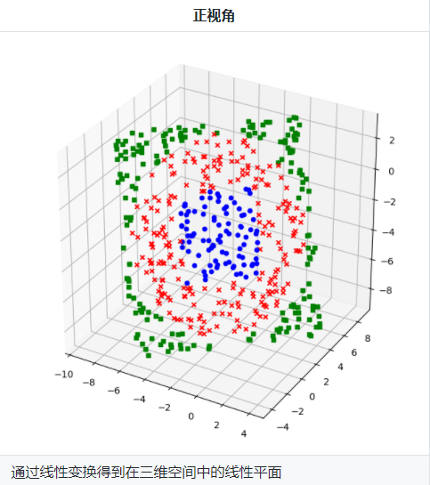
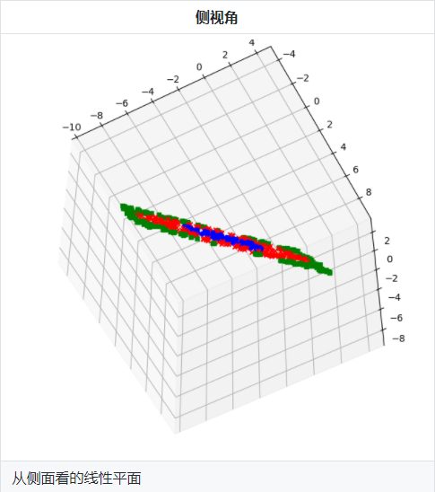
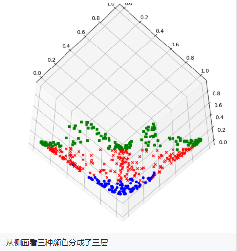
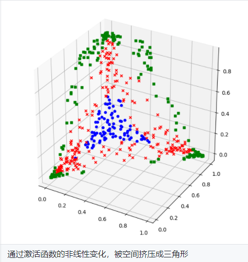

## 多入多出的三层神经网络 - 深度非线性多分类

**图片数据归一化**

```Python
    def __NormalizeData(self, XRawData):
        X_NEW = np.zeros(XRawData.shape)#初始化为0
        x_max = np.max(XRawData)#最大值
        x_min = np.min(XRawData)#最新之
        X_NEW = (XRawData - x_min)/(x_max-x_min)#归一化
        return X_NEW
```

## 学习率

- **AdaGrad**：
 
 在一般的梯度下降法中，对于每一个参数的训练都使用了相同的学习率α。Adagrad算法能够在训练中自动的对学习率进行调整，对于出现频率较低参数采用较大的α更新；相反，对于出现频率较高的参数采用较小的α更新。因此，Adagrad非常适合处理稀疏数据。

- **Adadelta**:
  
Adadelta是对Adagrad的扩展，最初方案依然是对学习率进行自适应约束，但是进行了计算上的简化。 Adagrad会累加之前所有的梯度平方，而Adadelta只累加固定大小的项，并且也不直接存储这些项，仅仅是近似计算对应的平均值。

- **RMSProp**:

RMSprop  使用的是指数加权平均，旨在消除梯度下降中的摆动，与Momentum的效果一样，某一维度的导数比较大，则指数加权平均就大，某一维度的导数比较小，则其指数加权平均就小，这样就保证了各维度导数都在一个量级，进而减少了摆动。允许使用一个更大的学习率η。

- **Adam**:
  
Adam(Adaptive Moment Estimation)本质上是带有动量项的RMSprop，它利用梯度的一阶矩估计和二阶矩估计动态调整每个参数的学习率。Adam的优点主要在于经过偏置校正后，每一次迭代学习率都有个确定范围，使得参数比较平稳。

# 第七章  DNN

##  深度神经网络框架设计

###  功能/模式分析

比较第12章中的三层神经网络的代码，我们可以看到大量的重复之处，比如前向计算中：

```Python
def forward3(X, dict_Param):
    ...
    # layer 1
    Z1 = np.dot(W1,X) + B1
    A1 = Sigmoid(Z1)
    # layer 2
    Z2 = np.dot(W2,A1) + B2
    A2 = Tanh(Z2)
    # layer 3
    Z3 = np.dot(W3,A2) + B3
    A3 = Softmax(Z3)
    ...    
```

1，2，3三层的模式完全一样：矩阵运算+激活/分类函数。

再看看反向传播：

```Python
def backward3(dict_Param,cache,X,Y):
    ...
    # layer 3
    dZ3= A3 - Y
    dW3 = np.dot(dZ3, A2.T)
    dB3 = np.sum(dZ3, axis=1, keepdims=True)
    # layer 2
    dZ2 = np.dot(W3.T, dZ3) * (1-A2*A2) # tanh
    dW2 = np.dot(dZ2, A1.T)
    dB2 = np.sum(dZ2, axis=1, keepdims=True)
    # layer 1
    dZ1 = np.dot(W2.T, dZ2) * A1 * (1-A1)   #sigmoid
    dW1 = np.dot(dZ1, X.T)
    dB1 = np.sum(dZ1, axis=1, keepdims=True)
    ...
```

## DNN框架实现

``` python
import numpy as np
class NeuralNet(object):
    #功能定义
    def __init__(self,num,eta,max_epoch,bat_size):
        #神经网络层
        self.layers = []#容纳神经网络各层
        self.layer_num = num #神经网络层数
        #神经网络运行参数
        self.eta = eta #学习率
        self.max_epoch = max_epoch #最大回合数
        self.bat_size = bat_size#每批数
        #损失函数
        self.j#损失函数值
        self.j_his#损失函数历史值
        self.j_graph#损失函数画图许可
    return print("Neural init is OK")
    #方法定义
    def Add_layer(self,lay): #神经网络层的添加
        len = self.layers.lenth()
        if len < self.layer_num:
            self.layers[len] = lay
        else print("神经网络层数已达上限")
        return print("lay添加成功")
    def Com_neural(self,X,i):#调用i层线性计算方法
        Z = np.dot(self.layer[i].w,X) + self.layer[i].b
        return Z
    def Back_method(self,Y,A):#反向传播
        dZ = A - Y
        dW = np.dot(A.dZ)
        dB = dZ
        return dW,dB
    def layer_u(self,dW,dB,i)：#本层的更新参数
        w = self.layers[i].w
        b = self.layers[i].b
        w = w - eta*dW
        b = b - eta*dB
        self.layers[i].w = w
        self.layers[i].b = b
    def train_N(self,X,Y):#训练
        A1 = X
        A2 = array([])
        A3 = Y
        for i in range(self.layer_num):
            Z = Com_neural(A1,i)
            A1 = Mothd_act.Identity(Z)
            A2[i] = A1
            A3[i] = Z
        for i in range(self.layer_num):
            dW,dB = Back_method(A3[self.layer_num-i],A2[self.layer_num-i])
            layer_u(dW,dB,i)


```
```python
class Mothd_act(object):# 激活函数与分类函数
    #激活函数
    @classmethod
    def Identity(cls,Z):
        A = Z
        return A
    @classmethod
    def Sigmoid(cls,Z):
        A = 1/1+np.exp(-Z)
        return A
    @classmethod
    def Tanh(cls,Z):
        A = (np.exp(Z) - np.exp(-Z)) /  (np.exp(Z) + np.exp(-Z))
        return A
    @classmethod
    def Relu(cls,Z):
        A = np.max(0,Z)
        return A
    #分类函数
    @classmethod
    def Sigmoid(cls,Z):
        A = 1/1+np.exp(-Z)
        return A
    @classmethod
    def Softmax(cls,Z):
        A = np.exp(z)/np.sum(np.exp(z),axis = 1,keepims = True)
        return A
```
```python
class Layer(object):
    def __init__(self,n,b):
        self.w = [] #权重
        self.w_num = n#每层连接数
        self.b = b #偏置
    def set_w(self,w): #权重添加
        i = self.w.lenth()
        if i < self.w_num:
            self.w[i] = w
        else print("权重个数已到最大值")
        return print("w初始化结束")

```

## 权重矩阵初始化

权重矩阵初始化是训练神经网络的第一步，选择正确的初始化方法尤为重要。每次重新初始化时会给训练结果带来影响。

零初始化
即把所有层的W值的初始值都设置为0。

$$ W = 0 $$

注：对于多层网络不能用零初始化，否则权重值不能学习到合理的结果。

标准初始化
标准正态初始化方法保证激活函数的输入均值为0，方差为1。

$$ W \sim N \begin{bmatrix} 0, 1 \end{bmatrix} $$

其中：

W：权重矩阵
N：高斯分布
Xavier初始化方法
正向传播时，激活值的方差保持不变；反向传播时，关于状态值的梯度的方差保持不变。

$$ W \sim N \begin{pmatrix} 0, \sqrt{\frac{2}{n_{in} + n_{out}}} \end{pmatrix} $$

$$ W \sim U \begin{pmatrix} -\sqrt{\frac{6}{n_{in} + n_{out}}}, \sqrt{\frac{6}{n_{in} + n_{out}}} \end{pmatrix} $$

其中： W：权重矩阵 N：正态分布（Normal Distribution） U：均匀分布（Uniform Distribution)

MSRA初始化方法（He方法）
正向传播时，状态值的方差保持不变；反向传播时，关于激活值的梯度的方差保持不变。

只考虑输入个数时，MSRA初始化是一个均值为0，方差为2/n的高斯分布，适合于ReLU激活函数：

$$ W \sim N \begin{pmatrix} 0, \sqrt{\frac{2}{n}} \end{pmatrix} $$

$$ W \sim U \begin{pmatrix} -\sqrt{\frac{6}{n_{in}}}, \sqrt{\frac{6}{n_{out}}} \end{pmatrix} $$

## 梯度下降

梯度下降是指在神经网络的反向传播过程中权重矩阵的更新方式

### 随机梯度下降

作为梯度下降法的提出，此方法借由损失函数，对要更新的参数的梯度计算来更新
  
$$
    g_t = \nabla_{\theta} J(\theta_{t-1})
    \\ \theta_t = \theta_{t-1} - \eta \cdot g_t
$$

```python
def update_S(self,dW,dB):
    self.layer.w =  self.layer.w - dW *self.eta
    return dW,dB
```

### 动量梯度下降
参考历史的梯度下降来更新本次的参数

$$
    g_t = \nabla_{\theta} J(\theta_{t-1}) \\
    v_t = \alpha \cdot v_{t-1} + \eta \cdot g_t \\ \theta_t = \theta_{t-1} - v_t
$$
```python
def update_M(self,dW,dB):
    alf =  0.9
    self.v = alf*self.v + self.eta * dW
    self.layer.w = self.layer.w - self.v  
```
### 加速梯度下降

预测到下一点的梯度方向，然后结合当前点的梯度方向，得到我们应该进行更新的方向

## 批量归一化：

### 简介

批量归一化（batch normalization）层能让较深的神经网络的训练变得更加容易

通常来说，数据标准化预处理对于浅层模型就足够有效了。随着模型训练的进行，当每层中参数更新时，靠近输出层的输出较难出现剧烈变化。
但对深层神经网络来说，即使输入数据已做标准化，训练中模型参数的更新依然很容易造成靠近输出层输出的剧烈变化。这种计算数值的不稳定性通常令我们难以训练出有效的深度模型。

批量归一化的提出正是为了应对深度模型训练的挑战。

在模型训练时，批量归一化利用小批量上的均值和标准差，不断调整神经网络中间输出，从而使整个神经网络在各层的中间输出的数值更稳定。

### 作用
  
- 1.加快训练速度
- 2.可以省去dropout，L1, L2等正则化处理方法
- 3.提高模型训练精度`


### 原理


## 过拟合

正则化用于防止过拟合。

**出现过拟合的原因**：

- 训练集的数量和模型的复杂度不匹配，样本数量级小于模型的参数
- 训练集和测试集的特征分布不一致
- 样本噪音大，使得神经网络学习到了噪音，正常样本的行为被抑制
- 迭代次数过多，过分拟合了训练数据，包括噪音部分和一些非重要特征

**学习算法期望的预测**： $$f_x=E[f_{x;D}] $$

**不同的训练集/验证集产生的预测方差**： $$var(x)=E[(f_{x;D}-f_x)^2] $$

**噪声**： $$\epsilon^2=E[(y_D-y)^2] $$

**期望输出与真实标记的偏差**： $$bias^2(x)=(f_x-y)^2 $$

**算法的期望泛化误差**： $$ \begin{aligned} E(f;D)&=var(x) + bias^2(x) + \epsilon^2 \end{aligned} $$

#### 各个项的含义为：

1、偏差：度量了学习算法的期望与真实结果的偏离程度，即学习算法的拟合能力。

2、方差：训练集与验证集的差异造成的模型表现的差异。

3、噪声：当前数据集上任何算法所能到达的泛化误差的下线，即学习问题本身的难度。

## L正则化

**范数**：
L0：L0范数是指向量中非0的元素的个数。
L1：L1范数是指向量中各个元素绝对值之和，也叫“稀疏规则算子”（Lasso regularization）。
L2:L2范数是向量所有元素的平方和的开平方

**正则化**：

L1：利用绝对值来作惩罚项
$$
\arg\min_wJ(w) = \sum_i^n(y_i-w^Tx_i)^2+\lambda\sum_j^m{\lvert w_j \rvert} 
$$
L2：利用平方值来作惩罚项
$$
\arg\min_wJ(w) = \sum_i^n(y_i-w^Tx_i)^2+\lambda\sum_j^m{w_j^2} 
$$

**异同点**：

相同点：都用于避免过拟合

不同点：1.L1可以让一部分特征的系数缩小到0，从而间接实现特征选择。所以L1适用于特征之间有关联的情况。

2.L2让所有特征的系数都缩小，但是不会减为0，它会使优化求解稳定快速。所以L2适用于特征之间没有关联的情况

**L1和L2的结合**：


## 集成学习与数据扩展

**数据扩展（图片处理使用较多）**

一般获得新的数据方法比较麻烦，需要大量的成本，
对数据进行增强，即利用已有的数据比如翻转、平移或旋转，创造出更多的数据，来使得神经网络具有更好的泛化效果。数据扩充方法包括：镜像、旋转、尺度变换、随机抠取、色彩抖动

## 集成学习

  ### 介绍：
  
  - 在机器学习的有监督学习算法中，我们的目标是学习出一个稳定的且在各个方面表现都较好的模型，但实际情况
  - 往往不这么理想，有时我们只能得到多个有偏好的模型（弱监督模型，在某些方面表现的比较好）。集成学习就
  - 是组合这里的多个弱监督模型以期得到一个更好更全面的强监督模型，集成学习潜在的思想是即便某一个弱分类器得到了错误的预测，其他的弱分类器也可以将错误纠正回来。

### 特点:

    - 序列集成方法，其中参与训练的基础学习器按照顺序生成（例如 AdaBoost）。序列方法的原理是利用基础学习器之间的依赖关系。通过对之前训练中错误标记的样本赋值较高的权重，可以提高整体的预测效果。
    - 并行集成方法，其中参与训练的基础学习器并行生成（例如 Random Forest）。并行方法的原理是利用基础学习器之间的独立性，通过平均可以显著降低错误。

# MNIST 手写数字识别

## 简介

主要内容有：

TensorFlow 处理MNIST数据集的基本操作

建立一个基础的识别模型
介绍 S o f t m a x SoftmaxSoftmax回归以及交叉熵等
MNIST是一个很有名的手写数字识别数据集（基本可以算是“Hello World”级别的了吧），我们要了解的情况是，对于每张图片，存储的方式是一个 28 * 28 的矩阵，但是我们在导入数据进行使用的时候会自动展平成 1 * 784（28 * 28）的向量，这在TensorFlow导入很方便，在使用命令下载数据。

## 流程思路

- **流程图**


  

## 模型搭建

**1.TensorFlow 对MNIST数据集的操作**

下载、导入，第一次运行会 自动下载到代码的所有路径，然后我们打印MNIST数据集的一些信息，通过这些我们就可以知道这些数据大致如何使用了。

然后输出结果，通过上面的代码可以看出数据集中的一些特点，下面建立一个简单的模型来识别这些数字。

**2.简单逻辑回归模型建立**

这是一个逻辑回归（分类）的问题，首先来建立一个最简单的模型，之后会逐渐地优化。分类模型一般会采用交叉熵方式作为损失函数，所以，对于这个模型的输出，首先使用 S o f t m a x SoftmaxSoftmax 回归方式处理为概率分布，然后采用交叉熵作为损失函数，使用梯度下降的方式进行优化。

Softmax回归可以将一组数据整理为一个概率分布，其实计算很简单，也很好理解，这里是用来处理模型的原本输出结果：
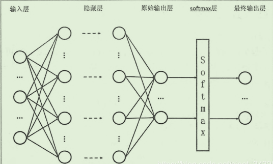

## 代码实例

```Python
# Copyright (c) Microsoft. All rights reserved.
# Licensed under the MIT license. See LICENSE file in the project root for full license information.

from matplotlib import pyplot as plt
import numpy as np
from PIL import Image

from HelperClass2.NeuralNet_3_0 import *

def ReadImage(img_file_name):
    img = Image.open(img_file_name)
    out1 = img.convert('L')
    out2 = out1.resize((28,28))
    a = np.array(out2)
    b = 255 - a
    x_max = np.max(b)
    x_min = np.min(b)
    X_NEW = (b - x_min)/(x_max-x_min)
    plt.cla()
    plt.imshow(X_NEW)
    plt.plot()
    return X_NEW.reshape(1,-1)

def Inference(img_array):
    output = net.inference(img_array)
    n = np.argmax(output)
    print("------recognize result is: -----", n)

def on_key_press(event):
    img_file_name = "handwriting.png"
    print(event.key)
    if event.key == 'enter':
        plt.axis('off')
        plt.savefig(img_file_name)
        plt.axis('on')
        img_array = ReadImage(img_file_name)
        Inference(img_array)
    elif event.key == 'backspace':
        plt.cla()
        plt.axis([0,1,0,1])
        ax.figure.canvas.draw()
    #end if

def on_mouse_press(event):
    global startx, starty, isdraw
    print(isdraw)
    isdraw = True
    startx = event.xdata
    starty = event.ydata
    print("press:{0},{1}", startx, starty)
    
def on_mouse_release(event):
    global isdraw, startx, starty
    print("release:", event.xdata, event.ydata, isdraw)
    isdraw = False

def on_mouse_move(event):
    global isdraw, startx, starty
    if isdraw:
        endx = event.xdata        
        endy = event.ydata        
        x1 = [startx, endx]
        y1 = [starty, endy]
        ax.plot(x1, y1, color='black', linestyle='-', linewidth='40')
        ax.figure.canvas.draw()
        startx = endx
        starty = endy
    # end if

def LoadNet():
    n_input = 784
    n_hidden1 = 64
    n_hidden2 = 16
    n_output = 10
    eta = 0.2
    eps = 0.01
    batch_size = 128
    max_epoch = 40

    hp = HyperParameters_3_0(
        n_input, n_hidden1, n_hidden2, n_output, 
        eta, max_epoch, batch_size, eps, 
        NetType.MultipleClassifier, 
        InitialMethod.Xavier)
    net = NeuralNet_3_0(hp, "MNIST_64_16")
    net.LoadResult()
    return net
   
if __name__ == "__main__":
    isdraw = False
    startx, starty = 0, 0

    print("need to run level3 first to get result")
    print("============================================================================")
    print("handwriting a digit, then press enter to recognize, press backspace to clear")
    print("resize the window to square, say, height == width")
    print("the handwriting should full fill the window")
    print("============================================================================")

    net = LoadNet()

    fig, ax = plt.subplots()
    fig.canvas.mpl_connect('key_press_event', on_key_press)
    fig.canvas.mpl_connect('button_release_event', on_mouse_release)
    fig.canvas.mpl_connect('button_press_event', on_mouse_press)
    fig.canvas.mpl_connect('motion_notify_event', on_mouse_move)
    
    plt.axis([0,1,0,1])
    plt.show()
```

## 测试结果

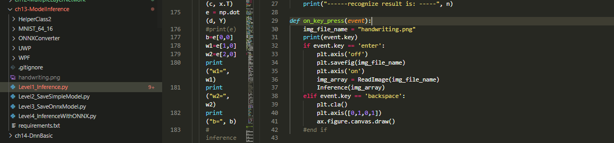
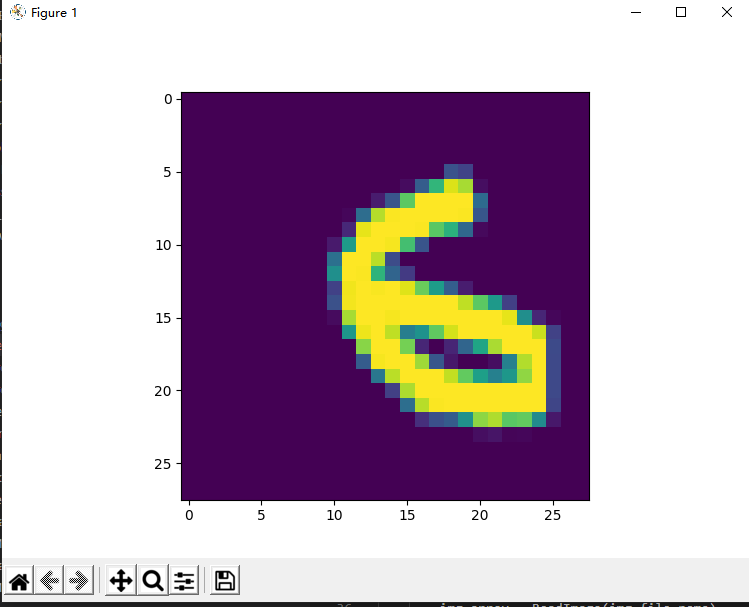
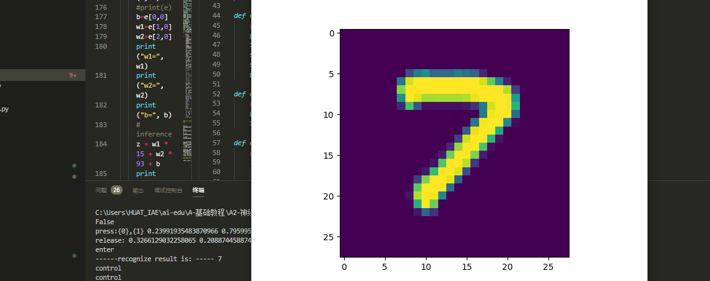
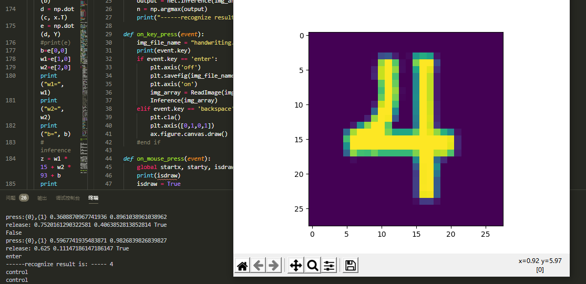
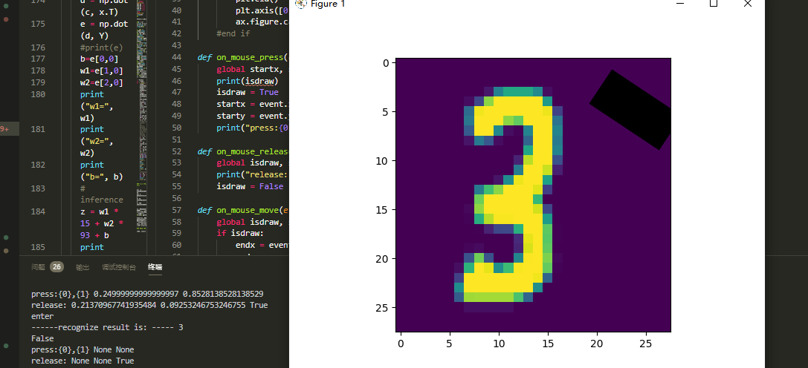

# 学习总结

## 课程收获


这门课程的内容是神经网络与深度学习。神经网络人工智能中的一种方法；深度学习，可以简单的理解为深层次的神经网络，神经网络是深度学习的基础。

我们从最基础的知识和最简单的应用开始，循序渐进的学习神经网络和深度学习的发展过程、基本理论、主要框架、和典型应用，以及如何基于TensorFlow2.0深度学习框架，构建人工智能模型，使学习者具备人工智能应用软件的开发能力。

通过人工智能课程的学习，我学到了很多关于深度学习方面的知识和理论，在此基础上学到了卷积神经网络、深度神经网络、循环神经网络的基本概念和工作原理，当然也学习了各种算法，比如梯度下降算法等等。在课程的学习中，在慕课中了解到PaddlePaddle框架和TensorFlow框架的工作原理，并在这个基础上实现了miniFramework手写数字识别等等应用。当然我还知道了深度学习常见的学习方式。不过，要学好深度学习，首先得有良好的数学知识和代码，因为中间有很多的算法和理论知识，不容易理解，学习的时候也会有些吃力，所以在学习的过程中，经常搜索相关知识，扩展自己的知识层面，并能快速的理解内容和实践。而且我知道只有深入理解了线性回归、逻辑回归，才能更好地理解神经网络，然后一步一步踏实地学习。除此之外，学习一个模型，很重要的一点就是要自己推导一遍公式，用代码实现一次模型。总的来说，收获很多，并且丰富了自己的知识领域，希望自己能够学到更多关于深度学习方面的知识，并灵活运用。在后面的学习中我也会更加努力，学习更多的知识，慢慢提升自己的能力和潜力。

## 课程技能点提升

1.更加熟练的掌握了markdown的阅读与书写规则

2.逐渐理解掌握了基于Python代码的神经网络代码

3.掌握了GitHub Desktop APP的应用方法

4.实现简单的界面，将用户用鼠标或者触屏的输入变成图片

5.双层神经网络实现非线性回归神经网络结构的定义

6.目标检测与识别的知识

7.手写数字识别代码的理解

8.图片输入的进行规范化，数据接口格式化。最后通过模型来推理(inference)出图片数字，并显示出来

9.掌握了深度神经网络、网络优化、正则化等等

10.安装了OPENVIVN软件，注册页面，并运行相关程序