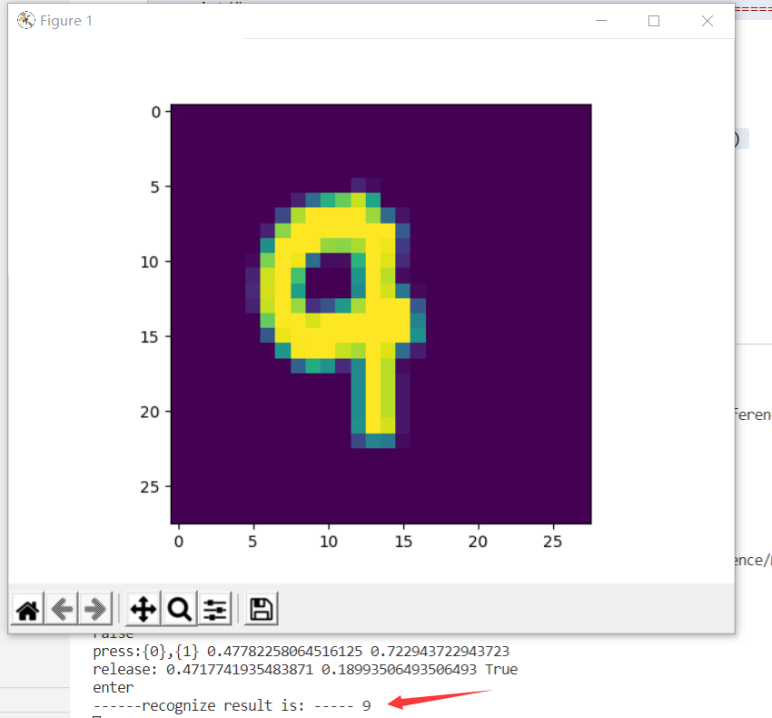

## 1.神经网络的训练过程

#### 单层神经网络模型

这是一个单层的神经网络，有 $m$ 个输入 (这里 $m=3$)，有 $n$ 个输出 (这里 $n=2$)。在神经网络中，$b$ 到每个神经元的权值来表示实际的偏移值，亦即 $(b_1,b_2)$，这样便于矩阵运算。也有些人把 $b$ 写成 $x_0$，其实是同一个效果，即把偏移值看做是神经元的一个输入。

- $(x_1,x_2,x_3)$ 是一个样本数据的三个特征值
- $(w_{11},w_{21},w_{31})$ 是 $(x_1,x_2,x_3)$ 到 $n1$ 的权重
- $(w_{12},w_{22},w_{32})$ 是 $(x_1,x_2,x_3)$ 到 $n2$ 的权重
- $b_1$ 是 $n1$ 的偏移
- $b_2$ 是 $n2$ 的偏移


图1 单层神经网络模型


#### 训练流程


图2 神经网络训练流程图

#### 前提条件

 1. 首先是我们已经有了训练数据；
 2. 我们已经根据数据的规模、领域，建立了神经网络的基本结构，比如有几层，每一层有几个神经元；
 3. 定义好损失函数来合理地计算误差。

#### 步骤

假设我们有表1-1所示的训练数据样本。

表1 训练样本示例

|Id|$x_1$|$x_2$|$x_3$|$Y$|
|---|---|---|---|---|
|1|0.5|1.4|2.7|3|
|2|0.4|1.3|2.5|5|
|3|0.1|1.5|2.3|9|
|4|0.5|1.7|2.9|1|

其中，$x_1,x_2,x_3$ 是每一个样本数据的三个特征值，$Y$ 是样本的真实结果值：

1. 随机初始化权重矩阵，可以根据正态分布等来初始化。这一步可以叫做“猜”，但不是瞎猜；
2. 拿一个或一批数据作为输入，带入权重矩阵中计算，再通过激活函数传入下一层，最终得到预测值。在本例中，我们先用Id-1的数据输入到矩阵中，得到一个 $A$ 值，假设 $A=5$；
3. 拿到Id-1样本的真实值 $Y=3$；
4. 计算损失，假设用均方差函数 $Loss = (A-Y)^2=(5-3)^2=4$；
5. 根据一些神奇的数学公式（反向微分），把 $Loss=4$ 这个值用大喇叭喊话，告诉在前面计算的步骤中，影响 $A=5$ 这个值的每一个权重矩阵，然后对这些权重矩阵中的值做一个微小的修改（当然是向着好的方向修改，这一点可以用数学家的名誉来保证）；
6. 用Id-2样本作为输入再次训练（Go to 2）；
7. 这样不断地迭代下去，直到以下一个或几个条件满足就停止训练：损失函数值非常小；准确度满足了要求；迭代到了指定的次数。

训练完成后，我们会把这个神经网络中的结构和权重矩阵的值导出来，形成一个计算图（就是矩阵运算加上激活函数）模型，然后嵌入到任何可以识别/调用这个模型的应用程序中，根据输入的值进行运算，输出预测值。


## 2.神经网络中的三个基本概念

#### 通俗地理解三大概念

这三大概念是：反向传播，梯度下降，损失函数。

神经网络训练的最基本的思想就是：先“猜”一个结果，称为预测结果 $a$，看看这个预测结果和事先标记好的训练集中的真实结果 $y$ 之间的差距，然后调整策略，再试一次，这一次就不是“猜”了，而是有依据地向正确的方向靠近。如此反复多次，一直到预测结果和真实结果之间相差无几，亦即 $|a-y|\rightarrow 0$，就结束训练。

在神经网络训练中，我们把“猜”叫做初始化，可以随机，也可以根据以前的经验给定初始值。即使是“猜”，也是有技术含量的。

### 总结
反向传播与梯度下降的基本工作原理：

1. 初始化；
2. 正向计算；
3. 损失函数为我们提供了计算损失的方法；
4. 梯度下降是在损失函数基础上向着损失最小的点靠近而指引了网络权重调整的方向；
5. 反向传播把损失值反向传给神经网络的每一层，让每一层都根据损失值反向调整权重；
6. Go to 2，直到精度足够好（比如损失函数值小于 $0.001$）。


## 3.梯度下降的数学理解

梯度下降的数学公式：

$$\theta_{n+1} = \theta_{n} - \eta \cdot \nabla J(\theta) \tag{1}$$

其中：

- $\theta_{n+1}$：下一个值；
- $\theta_n$：当前值；
- $-$：减号，梯度的反向；
- $\eta$：学习率或步长，控制每一步走的距离，不要太快以免错过了最佳景点，不要太慢以免时间太长；
- $\nabla$：梯度，函数当前位置的最快上升点；
- $J(\theta)$：函数。

#### 梯度下降的三要素

1. 当前点；
2. 方向；
3. 步长。

#### 为什么说是“梯度下降”？

“梯度下降”包含了两层含义：

1. 梯度：函数当前位置的最快上升点；
2. 下降：与导数相反的方向，用数学语言描述就是那个减号。

亦即与上升相反的方向运动，就是下降。


图3 梯度下降的步骤

图3解释了在函数极值点的两侧做梯度下降的计算过程，梯度下降的目的就是使得x值向极值点逼近。


## 4.损失函数

#### 损失函数概念

在各种材料中经常看到的中英文词汇有：误差，偏差，Error，Cost，Loss，损失，代价......意思都差不多，在本书中，使用“损失函数”和“Loss Function”这两个词汇，具体的损失函数符号用 $J$ 来表示，误差值用 $loss$ 表示。

“损失”就是所有样本的“误差”的总和，亦即（$m$ 为样本数）：

$$损失 = \sum^m_{i=1}误差_i$$

$$J = \sum_{i=1}^m loss_i$$

在黑盒子的例子中，我们如果说“某个样本的损失”是不对的，只能说“某个样本的误差”，因为样本是一个一个计算的。如果我们把神经网络的参数调整到完全满足独立样本的输出误差为 $0$，通常会令其它样本的误差变得更大，这样作为误差之和的损失函数值，就会变得更大。所以，我们通常会在根据某个样本的误差调整权重后，计算一下整体样本的损失函数值，来判定网络是不是已经训练到了可接受的状态。

#### 损失函数的作用

损失函数的作用，就是计算神经网络每次迭代的前向计算结果与真实值的差距，从而指导下一步的训练向正确的方向进行。

如何使用损失函数呢？具体步骤：

1. 用随机值初始化前向计算公式的参数；
2. 代入样本，计算输出的预测值；
3. 用损失函数计算预测值和标签值（真实值）的误差；
4. 根据损失函数的导数，沿梯度最小方向将误差回传，修正前向计算公式中的各个权重值；
5. 进入第2步重复, 直到损失函数值达到一个满意的值就停止迭代。


## 5.梯度下降的三种形式

我们比较一下目前我们用三种方法得到的 $w$ 和 $b$ 的值，见表4-2。

 三种方法的结果比较

|方法|$w$|$b$|
|----|----|----|
|最小二乘法|2.056827|2.965434|
|梯度下降法|1.71629006|3.19684087|
|神经网络法|1.71629006|3.19684087|

这个问题的原始值是可能是 $w=2,b=3$，由于样本噪音的存在，使用最小二乘法得到了 $2.05,2.96$ 这样的非整数解，这是完全可以接受的。但是使用梯度下降和神经网络两种方式，都得到 $1.71,3.19$ 这样的值，准确程度很低。从图4-6的神经网络的训练结果来看，拟合直线是斜着穿过样本点区域的，并没有在正中央的骨架上。


图5 拟合效果

难道是神经网络方法有什么问题吗？

初次使用神经网络，一定有水土不服的地方。最小二乘法可以得到数学解析解，所以它的结果是可信的。梯度下降法和神经网络法实际是一回事儿，只是梯度下降没有使用神经元模型而已。所以，接下来我们研究一下如何调整神经网络的训练过程，先从最简单的梯度下降的三种形式说起。

在下面的说明中，我们使用如下假设，以便简化问题易于理解：

1. 使用可以解决本章的问题的线性回归模型，即 $z=x \cdot w+b$；
2. 样本特征值数量为1，即 $x,w,b$ 都是标量；
3. 使用均方差损失函数。

计算 $w$ 的梯度：

$$
\frac{\partial{loss}}{\partial{w}} = \frac{\partial{loss}}{\partial{z_i}}\frac{\partial{z_i}}{\partial{w}}=(z_i-y_i)x_i
$$

计算 $b$ 的梯度：

$$
\frac{\partial{loss}}{\partial{b}} = \frac{\partial{loss}}{\partial{z_i}}\frac{\partial{z_i}}{\partial{b}}=z_i-y_i
$$

## 6.线性二分类原理

### 线性分类和线性回归的异同

此原理对线性和非线性二分类都适用。

回忆一下前面学习过的线性回归，通过均方差函数误差反向传播的方法，不断矫正拟合直线的角度（Weights）和偏移（Bias），因为均方差函数能够准确地反映出当前的拟合程度。那么在线性分类中，我们能不能采取类似的方法呢？

线性分类，试图在含有两种样本的空间中划出一条分界线，让双方截然分开，就好像是中国象棋的棋盘中的楚河汉界一样。与线性回归相似的地方是，两者都需要划出那条“直线”来，但是不同的地方也很明显，见表6-4。

表6 线性回归和线性分类的比较

||线性回归|线性分类|
|---|---|---|
|相同点|需要在样本群中找到一条直线|需要在样本群中找到一条直线|
|不同点|用直线来拟合所有样本，使得各个样本到这条直线的距离尽可能最短|用直线来分割所有样本，使得正例样本和负例样本尽可能分布在直线两侧|

可以看到线性回归中的目标--“距离最短”，还是很容易理解的，但是线性分类的目标--“分布在两侧”，用数学方式如何描述呢？我们可以有代数和几何两种方式来描述。

### 二分类的代数原理

代数方式：通过一个分类函数计算所有样本点在经过线性变换后的概率值，使得正例样本的概率大于0.5，而负例样本的概率小于0.5。

#### 基本公式

1. 正向计算

$$
z = x_1 w_1+ x_2 w_2 + b  \tag{1}
$$

2. 分类计算

$$
a={1 \over 1 + e^{-z}} \tag{2}
$$

3. 损失函数计算

$$
loss = -[y \ln (a)+(1-y) \ln (1-a)] \tag{3}
$$

## 7.线性多分类的神经网络实现  

####  定义神经网络结构

从图7-1来看，似乎在三个颜色区间之间有两个比较明显的分界线，而且是直线，即线性可分的。我们如何通过神经网络精确地找到这两条分界线呢？

- 从视觉上判断是线性可分的，所以我们使用单层神经网络即可
- 输入特征有两个，分别为经度、纬度
- 最后输出的是三个分类，分别是魏蜀吴，所以输出层有三个神经元

如果有三个以上的分类同时存在，我们需要对每一类别分配一个神经元，这个神经元的作用是根据前端输入的各种数据，先做线性处理（$Z=WX+B$），然后做一次非线性处理，计算每个样本在每个类别中的预测概率，再和标签中的类别比较，看看预测是否准确，如果准确，则奖励这个预测，给与正反馈；如果不准确，则惩罚这个预测，给与负反馈。两类反馈都反向传播到神经网络系统中去调整参数。

这个网络只有输入层和输出层，由于输入层不算在内，所以是一层网络，如图7所示。


图7 多入多出单层神经网络

与前面的单层网络不同的是，图7-7最右侧的输出层还多出来一个Softmax分类函数，这是多分类任务中的标准配置，可以看作是输出层的激活函数，并不单独成为一层，与二分类中的Logistic函数一样。

#### 输入层

输入经度 $x_1$ 和纬度 $x_2$ 两个特征：

$$
x=\begin{pmatrix}
x_1 & x_2
\end{pmatrix}
$$

#### 权重矩阵

$W$权重矩阵的尺寸，可以从前往后看，比如：输入层是2个特征，输出层是3个神经元，则$W$的尺寸就是 $2\times 3$。

$$
W=\begin{pmatrix}
w_{11} & w_{12} & w_{13}\\\\
w_{21} & w_{22} & w_{23} 
\end{pmatrix}
$$

$B$的尺寸是1x3，列数永远和神经元的数量一样，行数永远是1。

$$
B=\begin{pmatrix}
b_1 & b_2 & b_3 
\end{pmatrix}
$$

#### 输出层

输出层三个神经元，再加上一个Softmax计算，最后有$A1,A2,A3$三个输出，写作：

$$
Z = \begin{pmatrix}z_1 & z_2 & z_3 \end{pmatrix}
$$
$$
A = \begin{pmatrix}a_1 & a_2 & a_3 \end{pmatrix}
$$

其中，$Z=X \cdot W+B，A = Softmax(Z)$

## 8.激活函数

###  激活函数的基本作用

图8是神经网络中的一个神经元，假设该神经元有三个输入，分别为$x_1,x_2,x_3$，那么：

$$z=x_1 w_1 + x_2 w_2 + x_3 w_3 +b \tag{1}$$
$$a = \sigma(z) \tag{2}$$


图8 激活函数在神经元中的位置

激活函数也就是 $a=\sigma(z)$ 这一步了，他有什么作用呢？

1. 给神经网络增加非线性因素，这个问题在第1章神经网络基本工作原理中已经讲过了；
2. 把公式1的计算结果压缩到 $[0,1]$ 之间，便于后面的计算。

激活函数的基本性质：

+ 非线性：线性的激活函数和没有激活函数一样；
+ 可导性：做误差反向传播和梯度下降，必须要保证激活函数的可导性；
+ 单调性：单一的输入会得到单一的输出，较大值的输入得到较大值的输出。

####  何时会用到激活函数

激活函数用在神经网络的层与层之间的连接，神经网络的最后一层不用激活函数。

神经网络不管有多少层，最后的输出层决定了这个神经网络能干什么。在单层神经网络中，我们学习到了表8-1所示的内容。

表8-1 单层的神经网络的参数与功能

|网络|输入|输出|激活函数|分类函数|功能|
|---|---|---|---|---|---|
|单层|单变量|单输出|无|无|线性回归|
|单层|多变量|单输出|无|无|线性回归|
|单层|多变量|单输出|无|二分类函数|二分类|
|单层|多变量|多输出|无|多分类函数|多分类|

从上表可以看到，我们一直没有使用激活函数，而只使用了分类函数。对于多层神经网络也是如此，在最后一层只会用到分类函数来完成二分类或多分类任务，如果是拟合任务，则不需要分类函数。

简言之：

1. 神经网络最后一层不需要激活函数
2. 激活函数只用于连接前后两层神经网络

在后面的章节中，当不需要指定具体的激活函数形式时，会使用 $\sigma()$ 符号来代表激活函数运算。

## 9.回归模型的评估标准

回归问题主要是求值，评价标准主要是看求得值与实际结果的偏差有多大，所以，回归问题主要以下方法来评价模型。

#### 平均绝对误差

MAE（Mean Abolute Error）。

$$MAE=\frac{1}{m} \sum_{i=1}^m \lvert a_i-y_i \rvert \tag{1}$$

对异常值不如均方差敏感，类似中位数。

#### 绝对平均值率误差

MAPE（Mean Absolute Percentage Error）。

$$MAPE=\frac{100}{m} \sum^m_{i=1} \left\lvert {a_i - y_i \over y_i} \right\rvert \tag{2}$$

#### 和方差

SSE（Sum Squared Error）。

$$SSE=\sum_{i=1}^m (a_i-y_i)^2 \tag{3}$$

得出的值与样本数量有关系，假设有1000个测试样本，得到的值是120；如果只有100个测试样本，得到的值可能是11，我们不能说11就比120要好。

#### 均方差

MSE（Mean Squared Error）。

$$MSE = \frac{1}{m} \sum_{i=1}^m (a_i-y_i)^2 \tag{4}$$

就是实际值减去预测值的平方再求期望，没错，就是线性回归的代价函数。由于MSE计算的是误差的平方，所以它对异常值是非常敏感的，因为一旦出现异常值，MSE指标会变得非常大。MSE越小，证明误差越小。

#### 均方根误差

RMSE（Root Mean Squard Error）。

$$RMSE = \sqrt{\frac{1}{m} \sum_{i=1}^m (a_i-y_i)^2} \tag{5}$$

是均方差开根号的结果，其实质是一样的，只不过对结果有更好的解释。

例如：要做房价预测，每平方是万元，我们预测结果也是万元，那么MSE差值的平方单位应该是千万级别的。假设我们的模型预测结果与真实值相差1000元，则用MSE的计算结果是1000,000，这个值没有单位，如何描述这个差距？于是就求个平方根就好了，这样误差可以是标签值是同一个数量级的，在描述模型的时候就说，我们模型的误差是多少元。

#### R平方

R-Squared。

上面的几种衡量标准针对不同的模型会有不同的值。比如说预测房价，那么误差单位就是元，比如3000元、11000元等。如果预测身高就可能是0.1、0.2米之类的。也就是说，对于不同的场景，会有不同量纲，因而也会有不同的数值，无法用一句话说得很清楚，必须啰啰嗦嗦带一大堆条件才能表达完整。

我们通常用概率来表达一个准确率，比如89%的准确率。那么线性回归有没有这样的衡量标准呢？答案就是R-Squared。

$$R^2=1-\frac{\sum (a_i - y_i)^2}{\sum(\bar y_i-y_i)^2}=1-\frac{MSE(a,y)}{Var(y)} \tag{6}$$

R平方是多元回归中的回归平方和（分子）占总平方和（分母）的比例，它是度量多元回归方程中拟合程度的一个统计量。R平方值越接近1，表明回归平方和占总平方和的比例越大，回归线与各观测点越接近，回归的拟合程度就越好。

- 如果结果是0，说明模型跟瞎猜差不多；
- 如果结果是1，说明模型无错误；
- 如果结果是0-1之间的数，就是模型的好坏程度；
- 如果结果是负数，说明模型还不如瞎猜。


## 10.逻辑异或门的工作原理

上一节课的内容从实践上证明了两层神经网络是可以解决异或问题的，下面让我们来理解一下神经网络在这个异或问题的上工作原理，此原理可以扩展到更复杂的问题空间，但是由于高维空间无法可视化，给我们的理解带来了困难。

### 显示最后结果

到目前位置，我们只知道神经网络完成了异或问题，但它究竟是如何画分割线的呢？

也许读者还记得在第四步中学习线性分类的时候，我们成功地通过公式推导画出了分割直线，但是这一次不同了，这里使用了两层神经网络，很难再通过公式推导来解释W和B权重矩阵的含义了，所以我们换个思路。

思考一下，神经网络最后是通过什么方式判定样本的类别呢？在前向计算过程中，最后一个公式是Logistic函数，它把$(-\infty, +\infty)$压缩到了(0,1)之间，相当于计算了一个概率值，然后通过概率值大于0.5与否，判断是否属于正类。虽然异或问题只有4个样本点，但是如果：

1. 我们在[0,1]正方形区间内进行网格状均匀采样，这样每个点都会有坐标值；
2. 再把坐标值代入神经网络进行推理，得出来的应该会是一个网格状的结果；
3. 每个结果都是一个概率值，肯定处于(0,1)之间，所以不是大于0.5，就是小于0.5；
4. 我们把大于0.5的网格涂成粉色，把小于0.5的网格涂成黄色，就应该可以画出分界线来了。

好，有了这个令人激动人心的想法，我们立刻实现：

```Python
def ShowResult2D(net, dr, title):
    print("please wait for a while...")
    DrawSamplePoints(dr.XTest[:,0], dr.XTest[:,1], dr.YTest, title, "x1", "x2", show=False)
    count = 50
    x1 = np.linspace(0,1,count)
    x2 = np.linspace(0,1,count)
    for i in range(count):
        for j in range(count):
            x = np.array([x1[i],x2[j]]).reshape(1,2)
            output = net.inference(x)
            if output[0,0] >= 0.5:
                plt.plot(x[0,0], x[0,1], 's', c='m', zorder=1)
            else:
                plt.plot(x[0,0], x[0,1], 's', c='y', zorder=1)
            # end if
        # end for
    # end for
    plt.title(title)
    plt.show()
```

在上面的代码中，横向和竖向各取了50个点，形成一个50x50的网格，然后依次推理，得到output值后染色。由于一共要计算2500次，所以花费的时间稍长，我们打印"please wait for a while..."让程序跑一会儿。最后得到图10-12。


图10 分类结果的分割图

## 11.梯度检查

### 为何要做梯度检查

神经网络算法使用反向传播计算目标函数关于每个参数的梯度，可以看做解析梯度。由于计算过程中涉及到的参数很多，用代码实现的反向传播计算的梯度很容易出现误差，导致最后迭代得到效果很差的参数值。

为了确认代码中反向传播计算的梯度是否正确，可以采用梯度检验（gradient check）的方法。通过计算数值梯度，得到梯度的近似值，然后和反向传播得到的梯度进行比较，若两者相差很小的话则证明反向传播的代码是正确无误的。

###  数值微分

#### 导数概念回忆

$$
f'(x)=\lim_{h \to 0} \frac{f(x+h)-f(x)}{h} \tag{1}
$$

其含义就是$x$的微小变化$h$（$h$为无限小的值），会导致函数$f(x)$的值有多大变化。在`Python`中可以这样实现：

```Python
def numerical_diff(f, x):
    h = 1e-5
    d = (f(x+h) - f(x))/h
    return d
```

因为计算机的舍入误差的原因，`h`不能太小，比如`1e-10`，会造成计算结果上的误差，所以我们一般用`[1e-4,1e-7]`之间的数值

#### 泰勒公式

泰勒公式是将一个在$x=x_0$处具有n阶导数的函数$f(x)$利用关于$(x-x_0)$的n次多项式来逼近函数的方法。若函数$f(x)$在包含$x_0$的某个闭区间$[a,b]$上具有n阶导数，且在开区间$(a,b)$上具有$n+1$阶导数，则对闭区间$[a,b]$上任意一点$x$，下式成立：

$$f(x)=\frac{f(x_0)}{0!} + \frac{f'(x_0)}{1!}(x-x_0)+\frac{f''(x_0)}{2!}(x-x_0)^2 + ...+\frac{f^{(n)}(x_0)}{n!}(x-x_0)^n+R_n(x) \tag{3}$$

其中,$f^{(n)}(x)$表示$f(x)$的$n$阶导数，等号后的多项式称为函数$f(x)$在$x_0$处的泰勒展开式，剩余的$R_n(x)$是泰勒公式的余项，是$(x-x_0)^n$的高阶无穷小。 

利用泰勒展开公式，令$x=\theta + h, x_0=\theta$，我们可以得到：

$$f(\theta + h)=f(\theta) + f'(\theta)h + O(h^2) \tag{4}$$

#### 单边逼近误差

如果用单边逼近，把公式4两边除以$h$后变形：

$$f'(\theta) + O(h)=\frac{f(\theta+h)-f(\theta)}{h} \tag{5}$$

公式5已经和公式1的定义非常接近了，只是左侧多出来的第二项，就是逼近的误差，是个$O(h)$级别的误差项。

#### 双边逼近误差

如果用双边逼近，我们用三阶泰勒展开：

令$x=\theta + h, x_0=\theta$，我们可以得到：

$$f(\theta + h)=f(\theta) + f'(\theta)h + f''(\theta)h^2 + O(h^3) \tag{6}$$

再令$x=\theta - h, x_0=\theta$我们可以得到：

$$f(\theta - h)=f(\theta) - f'(\theta)h + f''(\theta)h^2 - O(h^3) \tag{7}$$

公式6减去公式7，有：

$$f(\theta + h) - f(\theta - h)=2f'(\theta)h + 2O(h^3) \tag{8}$$

两边除以$2h$：

$$f'(\theta) + O(h^2)={f(\theta + h) - f(\theta - h) \over 2h} \tag{9}$$

公式9中，左侧多出来的第二项，就是双边逼近的误差，是个$O(h^2)$级别的误差项，比公式5中的误差项小很多数量级。k

## 12.神经网络的基本构架
### 神经网络
神经网络可以看作为一个复合函数，当你输入一些数据时，它便对应输出相应的数据。首先我们来看神经元的结构 1.1.1，神经元 将一个神经元看做一个函数，里面包含了函数所需要的数据和操作，以函数y=ax+b来说这个神经元，数据首先输入到这个神经元然后将权重a与数据x相乘，然后再向相乘的数据添加偏置项b,最后从另一端输出.然后再通过激活函数将数据x的输出限制在一个范围内.总的来说就是从一个数据点传入数据，计算多个输出值，再传递到下一个单元，这样一系列的操作便组成了一个神经网络。

神经网络中的数据 连接是神经网络必须学习的数值. 权重代表神经网络认为权重与数据相乘之后应该添加的内容. 超参数是改变机器行为的一系列数据就是超参数，超参数需要手动设置. 偏置项：有利于神经网络的收敛和数据的精确度.

深度神经网络的模块划分
批量输入模块 各种深度学习零件搭建的深度学习网络 优化模块

深度神经网络常用层
dense层，activation层，dropout层， flatten层

卷积层 卷积就是一种把相对应位置数据相乘然后再相加的运算，卷积神经网络可以用更少的参数对数据进行计算，得到最终的数据处理结果，卷积神经网络是由输入层，卷积层，激活函数，池化层，全连接层组成。

池化层 池化层可以非常有效的缩小参数矩阵的尺寸，从而减少最后dense层中的参数数量，加快计算速度，防止过拟合。

正则化层 正则化就是规则化，为给需要训练的目标函数加上一些限制，让它们不要超过一定的范围，也是用来防止过拟合。

反卷积层 卷积层通过矩阵来理解 正向和反向分别乘以c和ct。反卷积就是正向和反向分别乘以ct和c反卷积就是将输入范围变大在实际情况中，输出的范围是大于输入的范围的要想还原输入，实际上是无法还原的，但是通过反卷积可以最大程度上进行模拟学习的得到。

### 回归任务功能测试
#### 搭建模型
模型如下所示：一个双层的神经网络，第一层后面接一个Sigmoid激活函数，第二层直接输出拟合数据


代码如下：

def model():
    dataReader = LoadData()(进行数据的读取)
    num_input = 1
    num_hidden1 = 4
    num_output = 1

    max_epoch = 10000
    batch_size = 10
    learning_rate = 0.5

    params = HyperParameters_4_0(
        learning_rate, max_epoch, batch_size,
        net_type=NetType.Fitting,（调用fittingh函数）
        init_method=InitialMethod.Xavier,(调用xavier函数)
        stopper=Stopper(StopCondition.StopLoss, 0.001))

    net = NeuralNet_4_0(params, "Level1_CurveFittingNet")
    (调用param参数)
    fc1 = FcLayer_1_0(num_input, num_hidden1, params)
    net.add_layer(fc1, "fc1")(调用fc1参数)
    sigmoid1 = ActivationLayer(Sigmoid())(调用激活函数)
    net.add_layer(sigmoid1, "sigmoid1")(调用sigmoid参数)
    fc2 = FcLayer_1_0(num_hidden1, num_output, params)
    net.add_layer(fc2, "fc2")(调用fc2参数)

    net.train(dataReader, checkpoint=100, need_test=True)(神经网络样本训练)

    net.ShowLossHistory()
    ShowResult(net, dataReader)
超参数说明：

输入层1个神经元，因为只有一个x值
隐层4个神经元，对于此问题来说应该是足够了，因为特征很少
输出层1个神经元，因为是拟合任务
学习率=0.5
最大epoch=10000轮
批量样本数=10
拟合网络类型
Xavier初始化
绝对损失停止条件=0.001

#### 训练结果
ch2 由上面的图可以看出：损失函数值在一段平缓期过后，开始陡降，这种现象在神经网络的训练中是常见的，最有可能的是当时处于一个梯度变化的平缓地带，算法在艰难地寻找下坡路，然后忽然就找到了。

ch3 上图左侧子图是拟合的情况，绿色点是测试集数据，红色点是神经网路的推理结果，可以看到除了最左侧开始的部分，其它部分都拟合相对较好。

右侧的子图是用下面的代码生成的：

    y_test_real = net.inference(dr.XTest)
    axes.scatter(y_test_real, y_test_real-dr.YTestRaw, marker='o')
以测试集的真实值为横坐标，以真实值和预测值的差为纵坐标。最理想的情况是所有点都在y=0处排成一条横线。从图上看，真实值和预测值二者的差异明显，但是请注意横坐标和纵坐标的间距相差一个数量级，所以差距其实不大。

再看打印输出的最后部分：

epoch=4999, total_iteration=449999
loss_train=0.000920, accuracy_train=0.968329
loss_valid=0.000839, accuracy_valid=0.962375
time used: 28.002626419067383
save parameters
total weights abs sum= 45.27530164993504
total weights = 8
little weights = 0
zero weights = 0
testing...
0.9817814550687021
0.9817814550687021
由于我们设置了eps=0.001，所以在5000多个epoch时便达到了要求，训练停止。最后用测试集得到的准确率为98.17%，已经非常不错了。如果训练更多的轮，可以得到更好的结果。


## 13.过拟合

### 拟合程度比较

在深度神经网络中，我们遇到的另外一个挑战，就是网络的泛化问题。所谓泛化，就是模型在测试集上的表现要和训练集上一样好。经常有这样的例子：一个模型在训练集上千锤百炼，能到达99%的准确率，拿到测试集上一试，准确率还不到90%。这说明模型过度拟合了训练数据，而不能反映真实世界的情况。解决过度拟合的手段和过程，就叫做泛化。

神经网络的两大功能：回归和分类。这两类任务，都会出现欠拟合和过拟合现象，如图16-1和16-2所示。


回归任务中的欠拟合、正确的拟合、过拟合

回归任务中的三种情况，依次为：欠拟合、正确的拟合、过拟合。


分类任务中的欠拟合、正确的拟合、过拟合

分类任务中的三种情况，依次为：分类欠妥、正确的分类、分类过度。由于分类可以看作是对分类边界的拟合，所以我们经常也统称其为拟合。

上图中对于“深入敌后”的那颗绿色点样本，正确的做法是把它当作噪音看待，而不要让它对网络产生影响。而对于上例中的欠拟合情况，如果简单的（线性）模型不能很好地完成任务，我们可以考虑使用复杂的（非线性或深度）模型，即加深网络的宽度和深度，提高神经网络的能力。

但是如果网络过于宽和深，就会出现第三张图展示的过拟合的情况。

出现过拟合的原因：

1. 训练集的数量和模型的复杂度不匹配，样本数量级小于模型的参数
2. 训练集和测试集的特征分布不一致
3. 样本噪音大，使得神经网络学习到了噪音，正常样本的行为被抑制
4. 迭代次数过多，过分拟合了训练数据，包括噪音部分和一些非重要特征

既然模型过于复杂，那么我们简化模型不就行了吗？为什么要用复杂度不匹配的模型呢？有两个原因：

1. 因为有的模型以及非常成熟了，比如VGG16，可以不调参而直接用于你自己的数据训练，此时如果你的数据数量不够多，但是又想使用现有模型，就需要给模型加正则项了。
2. 使用相对复杂的模型，可以比较快速地使得网络训练收敛，以节省时间。


## 实现手写数字的识别
1.文件路径要正确
2.python用3.5版本的
3.按照提示一步步下载插件
代码如下：

 #Copyright (c) Microsoft. All rights reserved.
 #Licensed under the MIT license. See LICENSE file in the project root for full license information.

from matplotlib import pyplot as plt
import numpy as np
from PIL import Image

    from HelperClass2.NeuralNet_3_0 import *

    def ReadImage(img_file_name):
    img = Image.open(img_file_name)
    out1 = img.convert('L')
    out2 = out1.resize((28,28))
    a = np.array(out2)
    b = 255 - a
    x_max = np.max(b)
    x_min = np.min(b)
    X_NEW = (b - x_min)/(x_max-x_min)
    plt.cla()
    plt.imshow(X_NEW)
    plt.plot()
    return X_NEW.reshape(1,-1)

    def Inference(img_array):
    output = net.inference(img_array)
    n = np.argmax(output)
    print("------recognize result is: -----", n)

    def on_key_press(event):
    img_file_name = "handwriting.png"
    print(event.key)
    if event.key == 'enter':
        plt.axis('off')
        plt.savefig(img_file_name)
        plt.axis('on')
        img_array = ReadImage(img_file_name)
        Inference(img_array)
    elif event.key == 'backspace':
        plt.cla()
        plt.axis([0,1,0,1])
        ax.figure.canvas.draw()
    #end if

    def on_mouse_press(event):
    global startx, starty, isdraw
    print(isdraw)
    isdraw = True
    startx = event.xdata
    starty = event.ydata
    print("press:{0},{1}", startx, starty)
    
    def on_mouse_release(event):
    global isdraw, startx, starty
    print("release:", event.xdata, event.ydata, isdraw)
    isdraw = False

    def on_mouse_move(event):
    global isdraw, startx, starty
    if isdraw:
        endx = event.xdata        
        endy = event.ydata        
        x1 = [startx, endx]
        y1 = [starty, endy]
        ax.plot(x1, y1, color='black', linestyle='-', linewidth='40')
        ax.figure.canvas.draw()
        startx = endx
        starty = endy
    # end if

    def LoadNet():
    n_input = 784
    n_hidden1 = 64
    n_hidden2 = 16
    n_output = 10
    eta = 0.2
    eps = 0.01
    batch_size = 128
    max_epoch = 40

    hp = HyperParameters_3_0(
        n_input, n_hidden1, n_hidden2, n_output, 
        eta, max_epoch, batch_size, eps, 
        NetType.MultipleClassifier, 
        InitialMethod.Xavier)
    net = NeuralNet_3_0(hp, "MNIST_64_16")
    net.LoadResult()
    return net
   
    if __name__ == "__main__":
    isdraw = False
    startx, starty = 0, 0

    print("need to run level3 first to get result")
    print("============================================================================")
    print("handwriting a digit, then press enter to recognize, press backspace to clear")
    print("resize the window to square, say, height == width")
    print("the handwriting should full fill the window")
    print("============================================================================")

    net = LoadNet()

    fig, ax = plt.subplots()
    fig.canvas.mpl_connect('key_press_event', on_key_press)
    fig.canvas.mpl_connect('button_release_event', on_mouse_release)
    fig.canvas.mpl_connect('button_press_event', on_mouse_press)
    fig.canvas.mpl_connect('motion_notify_event', on_mouse_move)
    
    plt.axis([0,1,0,1])
    plt.show()
实验运行结果：


### 总结
在深度学习中，对神经网络的权重进行初始化对模型的收敛速度和性能的提升有着重要的影响。而且在神经网络在计算过程中需要对权重参数w不断的迭代更新，已达到较好的性能效果。但在训练的过程中，会遇到梯度消失和梯度爆炸等现象。因此，一个好的初始化权重能够对这两个问题有很好的帮助，并且，初始化权重能够有利于模型性能的提升，以及增快收敛速度。

BP 神经网络的信息处理方式具有如下特点:
1. 信息分布存储。人脑存储信息的特点是利用突触效能的变化来调整存储内容， 即信息存储在神经元之间的连接强度的分布上， BP神经网络模拟人脑的这一特点，使信息以连接权值的形式分布于整个网络。
2. 信息并行处理。人脑神经元之间传递脉冲信号的速度远低于冯·诺依曼计算机的工作速度，但是在很多问题上却可以做出快速的判断、决策和处理，这是由于人脑是一个大规模并行与串行组合的处理系统。BP神经网络的基本结构模仿人脑，具有并行处理的特征，大大提高了网络功能。
3. 具有容错性。生物神经系统部分不严重损伤并不影响整体功能，BP神经网络也具有这种特性，网络的高度连接意味着少量的误差可能不会产生严重的后果，部分神经元的损伤不破坏整体，它可以自动修正误差。这与现代计算机的脆弱性形成鲜明对比。
4. 具有自学习、自组织、自适应的能力。BP神经网络具有初步的自适应与自组织能力，在学习或训练中改变突触权值以适应环境，可以在使用过程中不断学习完善自己的功能，并且同一网络因学习方式的不同可以具有不同的功能，它甚至具有创新能力，可以发展知识，以至超过设计者原有的知识水平。

梯度下降优化算法优势： 对于凸目标函数，可以保证全局最优； 对于非凸目标函数，可以保证一个局部最优。 缺点： 速度慢; 数据量大时不可行; 无法处理动态产生的新样本。对于批量归一化：如果激活函数是类似于sigmoid有一定的饱和区域则可以把归一化层放在激活函数之前，这样可以在一定程度上缓解梯度消失问题。 如果激活函数是类似于relu这样的激活函数，那么可以把归一化层放在激活函数之后，可以有效避免数据在激活之前被转化成相似的模式从而使得非线性特征分布趋于同化。

集成学习的主要思路是先通过一定的规则生成多个学习器，再采用某种集成策略进行组合，最后综合判断输出最终结果。一般而言，通常所说的集成学习中的多个学习器都是同质的"弱学习器"。基于该弱学习器，通过样本集扰动、输入特征扰动、输出表示扰动、算法参数扰动等方式生成多个学习器，进行集成后获得一个精度较好的"强学习器"。


### 心得体会
人工智能包括了十分广泛的科学，它由不同的领域组成，例如机器学习，计算机视觉等,总的来说，人工智能研究的主要目标是使机器能够胜任一些通常需要人类智能才能完成的复杂工作。人工智能在很多领域得到了发展川在我们的日常生活中发挥了重要的作用。如:机器翻译机器翻译是利用计算机把一种自然语言转换成其他语言的过程。用以完成这一过程的软件 系统叫做机器翻译系统,利用这个系统我们可以很方使的完成一些语言翻译工作。一些大公司在人工智能领域的投入和研究对于推动人工智能的发展起到了很大的作用，最值得一提的就是谷歌。谷歌的免费搜索表面上是为了方便人们的查询，但这款搜索弓|擎推出的初衷就是为了帮助人工智能的深度学习，通过上亿的用户一次又一次地查询，来锻炼人工智能的学习能力。
而人工神经网络就是模拟人思维的一种方式，是一个非线性动力学系统，其特色在于信息的分布式存储和并行协同处理。虽然单个神经元的结构极其简单，功能有限，但大量神经元构成的网络系统所能实现的行为却是极其丰富多彩的。
