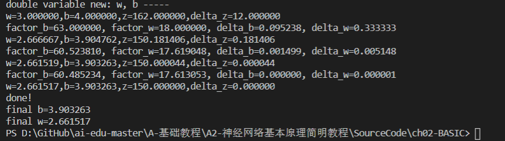
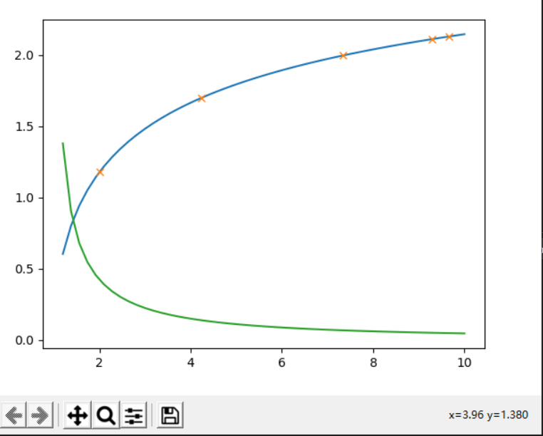
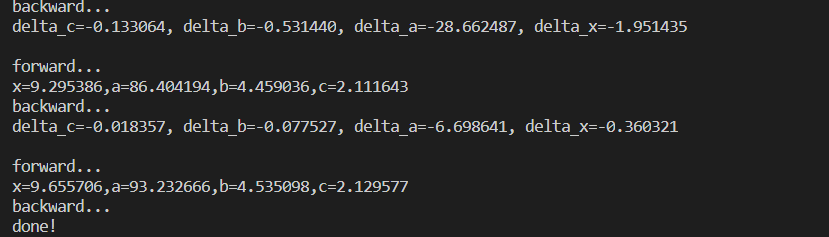
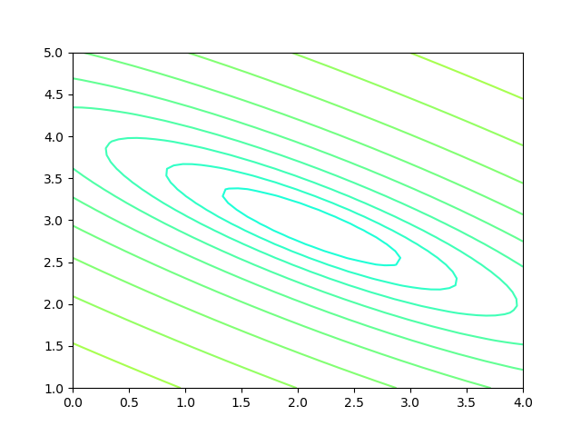
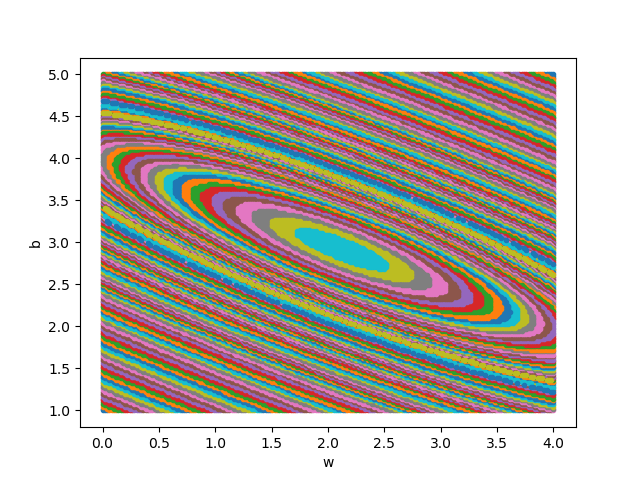
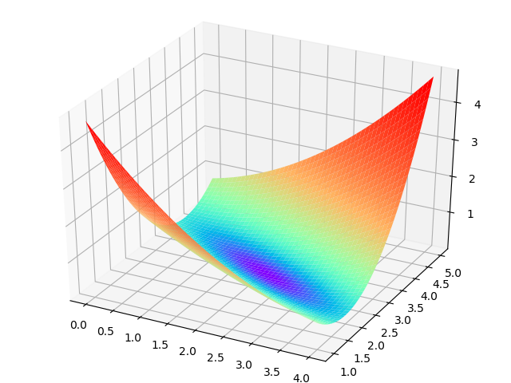
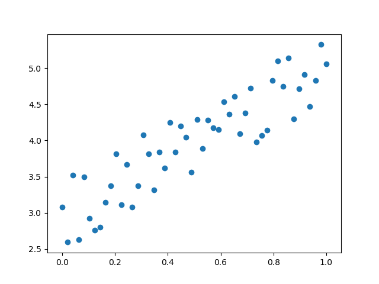
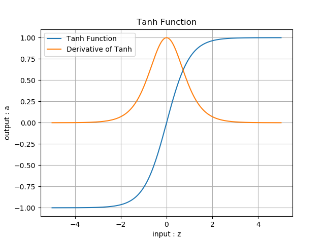
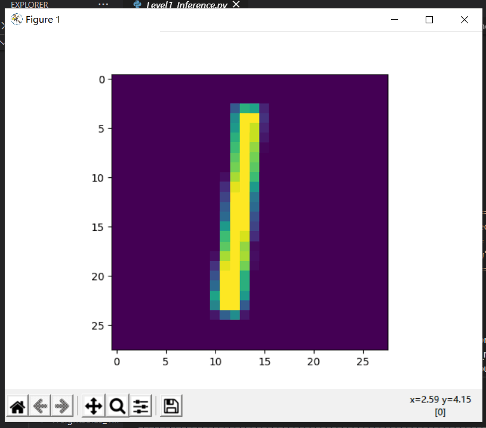
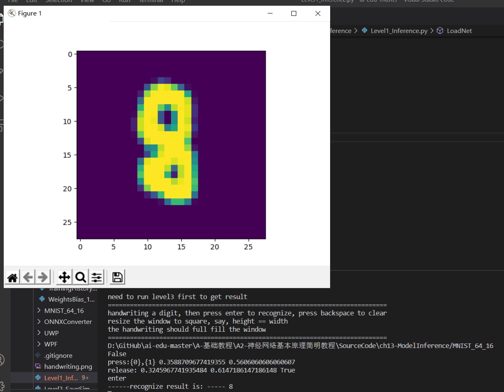

## 神经网络中的三个基本概念

### 1，反向传播

反向传播又分为线性传播和非线性传播

#### 1，线性反向传播

假设有一个函数：z=xy，其中x=2w+3b,y=2b+1 通过正向计算：当w=3，b=4时，计算得到x=18，y=9，z=162.
反向传播:求w的偏导数
$$链式法则：因为z=xy，其中x=2w+3b,y=2b+1 因而𝜕z/𝜕w=𝜕z/𝜕x*𝜕x/𝜕w=y*2=18$$
直接求导：z=xy=(2w+3b)(2b+1)=4wb+2w+6b*b+3b 因而𝜕z/𝜕w=4b+2=16+2=18
求w的近似变化值
$$目标：z=150$$
$$由上面梯度计算结果有：$$
$$△z = 𝜕z/𝜕w*△w △w = △z/18=0.6667$$
$$w = 2.33333$$
$$z = 150.0003$$

#### 2，非线性反向传播

$$y=f(x)，y=c，c=√b，b=ln(a)，a=x*x$$
$$其中1<x<=10，0<y<2.15。假设有5个人分别代表x、a、b、c、y：$$

正向过程
$$第1个人，输入层，随机输入第一个x值，x取值范围(1,10]，假设第一个数是2$$
$$第2个人，第一层网络计算，接收第1个人传入x的值，计算：a=x*x$$
$$第3个人，第二层网络计算，接收第2个人传入a的值，计算b：b=ln(a)$$
$$第4个人，第三层网络计算，接收第3个人传入b的值，计算c：c=√b$$
$$第5个人，输出层，接收第4个人传入c的值$$
反向过程
$$第5个人，计算y与c的差值：Δc=c−y，传回给第4个人$$
$$第4个人，接收第5个人传回Δc，计算Δb：Δb=Δc⋅2√b$$
$$第3个人，接收第4个人传回Δb，计算Δa：Δa=Δb⋅a$$
$$第2个人，接收第3个人传回Δa，计算Δx：Δx=Δa/2x$$
$$第1个人，接收第2个人传回Δx，更新x：x=x−Δx，回到第1步$$
$$提出问题：假设我们想最后得到c=2.13的值，x应该是多少？（误差小于0.001即可）$$

通过相关代码运行的结果如下。




### 2，梯度下降

梯度下降的基本过程就和下山的场景很类似。

首先，我们有一个可微分的函数。这个函数就代表着一座山。我们的目标就是找到这个函数的最小值，也就是山底。根据之前的场景假设，最快的下山的方式就是找到当前位置最陡峭的方向，然后沿着此方向向下走，对应到函数中，就是找到给定点的梯度 ，然后朝着梯度相反的方向，就能让函数值下降的最快！因为梯度的方向就是函数之变化最快的方向
所以，我们重复利用这个方法，反复求取梯度，最后就能到达局部的最小值，这就类似于我们下山的过程。而求取梯度就确定了最陡峭的方向，也就是场景中测量方向的手段。

关于代码解释首先，我们需要定义数据集和学习率:

### 代码

from numpy import *

$$数据集大小 即20个数据点$$
m = 20

$$x的坐标以及对应的矩阵$$
$$X0 = ones((m, 1))  # 生成一个m行1列的向量，也就是x0，全是1
X1 = arange(1, m+1).reshape(m, 1)  # 生成一个m行1列的向量，也就是x1，从1到m
X = hstack((X0, X1))  # 按照列堆叠形成数组，其实就是样本数据$$

$$对应的y坐标$$
$$y = np.array([
    3, 4, 5, 5, 2, 4, 7, 8, 11, 8, 12,
    11, 13, 13, 16, 17, 18, 17, 19, 21
]).reshape(m, 1)$$

$$学习率
alpha = 0.01$$

$$定义代价函数$$

$$def cost_function(theta, X, Y):
    diff = dot(X, theta) - Y  # dot() 数组需要像矩阵那样相乘，就需要用到dot()
    return (1/(2*m)) * dot(diff.transpose(), diff)$$


$$定义代价函数对应的梯度函数$$

$$def gradient_function(theta, X, Y):
    diff = dot(X, theta) - Y
    return (1/m) * dot(X.transpose(), diff)$$

$$根据数据画出对应的图像$$
$$def plot(X, Y, theta):
    import matplotlib.pyplot as plt
    ax = plt.subplot(111)  
    ax.scatter(X, Y, s=30, c="red", marker="s")
    plt.xlabel("X")
    plt.ylabel("Y")
    x = arange(0, 21, 0.2)  # x的范围
    y = theta[0] + theta[1]*x
    ax.plot(x, y)
    plt.show()
    plot(x1,y,optimal)
    $$


### 3，损失函数

$$分类任务的损失函数$$
$$假设某分类任务共有N个训练样本，针对网络最后分层第 i 个样本的输入特征为 XiXi ，其对应的标记为YiYi是最终的分类结果（C个分类结果中的一个），h=（h1,h2,...,hch1,h2,...,hc）为网络的最终输出，即样本 i 的预测结果。其中 C 是最后所有分类的数量.$$

$$交叉熵损失函数$$
$$交叉熵损失函数又叫 softmax 损失函数。 是目前卷积神经网络中最常用的分类目标损失函数。 
举个例子，比如 C = 3 ，也就是最后分类结果有三种，分别是0，1，2.假设对于第 i 个样本正确分类是1，h=（2，5，1），那么交叉熵损失函数就等于： 
-（1 / 3）* (log((e^5) / (e^2 + e^5 + e^1))) 
LcrossEntropyLoss=LsoftmaxLoss=−1Nlog(ehyi∑Cj=1ehj)
LcrossEntropyLoss=LsoftmaxLoss=−1Nlog(ehyi∑j=1Cehj)
合页损失函数（hinge loss）
合页函数广泛在支持向量机中使用，有时也会在损失函数中使用。

LhingeLoss=1N∑i=1Nmax(0,1−hyi)
LhingeLoss=1N∑i=1Nmax(0,1−hyi)
在分类任务中，通常使用交叉熵函数要优于使用合页损失函数。 
缺点：合页损失函数是对错误越大的样本施以更严重的惩罚。可是这样会导致损失函数对噪音敏感。举例，如果一个样本的标记错误或者是离群点，则由于错分导致分类误差会很大，如此便会影响整个分类超平面的学习，从而降低模型泛化能力$$

$$坡道损失函数$$
优点：克服了合页损失函数鲁棒性差的特点，对噪声数据和离群数据有很好的抗噪能力。因此也被称作鲁棒损失函数。这类损失函数的特点是在分类（回归）问题误差较大区域进行了截断，使得较大的误差不再影响整个损失函数。

LrampLoss=LhingeLoss−1Nmax(0,s−hyi)
LrampLoss=LhingeLoss−1Nmax(0,s−hyi)

=1N∑i=1N(max(0,1−hyi)−max(0,s−hyi))
=1N∑i=1N(max(0,1−hyi)−max(0,s−hyi))

### 代码

$$显示只变化b时loss的变化情况$$
def CalculateCostB(x,y,n,w,b):
    B = np.arange(b-1,b+1,0.05)
    Loss=[]
    for i in range(len(B)):
        z = w*x+B[i]
        loss = CostFunction(x,y,z,n)
        Loss.append(loss)
    plt.title("Loss according to b")
    plt.xlabel("b")
    plt.ylabel("J")
    plt.plot(B,Loss,'x')
    plt.show()

$$显示只变化w时loss的变化情况$$
def CalculateCostW(x,y,n,w,b):
    W = np.arange(w-1,w+1,0.05)
    Loss=[]
    for i in range(len(W)):
        z = W[i]*x+b
        loss = CostFunction(x,y,z,n)
        Loss.append(loss)
    plt.title("Loss according to w")
    plt.xlabel("w")
    plt.ylabel("J")
    plt.title = "Loss according to w"
    plt.plot(W,Loss,'o')
    plt.show()

$$显示同时变化w,b时loss的变化情况$$
def CalculateCostWB(x,y,n,w,b):
    W = np.arange(w-10,w+10,0.1)
    B = np.arange(b-10,b+10,0.1)
    Loss=np.zeros((len(W),len(B)))
    for i in range(len(W)):
        for j in range(len(B)):
            w = W[i]
            b = B[j]
            a = w*x+b
            loss = CostFunction(x,y,a,n)
            Loss[i,j] = loss

    fig = plt.figure()
    ax = fig.gca(projection='3d')
    ax.plot_surface(W,B,Loss)
    plt.show()







机器学习的算法的工作原理如下：
1）我们向学习算法提供训练集
2）学习算法的任务通常是输出一个函数，用h代表假设函数
3）假设函数的作用是，把相关的已知变量作为输入变量，而试着输出相应的预测值
当我们设计一个机器学习算法时，我们首先要做的是：决定怎样表达这个假设函数h
例如：有y(x)=a+bx 其中a,b是常量这个函数中只含有一个输入变量所以这样的问题就叫做单变量线性回归问题而且这个函数模型就叫做单变量线性回归。

$$1.2代价函数$$
在上面的函数y(x)=a+bx中a,b两个参数我们要如何确定，也就是输入x时我们预测的值最接近该样本对应的y值的参数a,b因此我们需要一定量的样本进行预测来画图进行求解所以我们就需要训练集，在线性回归中我们要解决的是一个最小化的问题，所以我们就要写出关于函数y(x)=a+bx中a,b两个参数的最小化这里就要用到我们的代价函数了。


m表示训练样本数量

(x(i),y(i))代表第i个训练样本

通过训练样本我们就可以绘制支出关于需想x,y的线性图

代码如下图所示：

import numpy as np

import matplotlib.pyplot as plt

def target_function(x):
    y = x*x
    return y

def derivative_function(x):
    return 2*x

def draw_function():
    x = np.linspace(-1.2,1.2)
    y = target_function(x)
    plt.plot(x,y)

def draw_gd(X):
   
    Y = []
    
    for i in range(len(X)):
      
        Y.append(target_function(X[i]))
    
    plt.plot(X,Y)

if __name__ == '__main__':

    x = 1.2
    
    eta = 0.3
    
    error = 1e-3
    
    X = []
    
    X.append(x)
    
    y = target_function(x)
    
    while y > error:
        
        x = x - eta * derivative_function(x)
        
        X.append(x)
        
        y = target_function(x)
        
        print("x=%f, y=%f" %(x,y))

    draw_function()
    
    draw_gd(X)
    
    plt.show()
    运行结果如图所示：


$$1.3最小二乘法$$

最小二乘法，也叫做最小平方法，它通过最小化误差的平方和寻找数据的最佳函数匹配。利用最小二乘法可以简便地求得未知的数据，并使得这些求得的数据与实际数据之间误差的平方和为最小。最小二乘法还可用于曲线拟合。其他一些优化问题也可通过最小化能量或最小二乘法来表达。

当我们在研究两个变量（x，y）之间的相互关系时，往往会有一系列的数据对[(x1,y1),(x2,y2)... (xm,ym)],那么将这些数据描绘到x-y直系坐标中若发现这些点都在一条直线附近时，那么初始令这条直线方程的表达式：


其中  是任意的实数，现在需要让当 x 取值为xi预测值yi与回归方程所预测的 之间的差值平方最小，但是对于整个回归方程而言，就是所有预测值与实际值之间差值平方之和最小。

用预测值与真实值之间的差值,需要比较两个Y值，必须有个不变的因子那就是X，在同一个X下比较两种Y才有意义。两个Y值之间做差值总会有正负的性质

故建立一下方程:


Q为关于预测方程中两个参数a0,a1的函数而已，此时将预测方程带入以上公式得到以下方程:


要使的方程Q的取值最小，那么需要对函数Q分别对a0,a1求一阶偏导数，并且零偏导之后的值为0。即


接下来就需要对两个参数进行变换求解了，经过一顿移项变换操作之后得到两个a0,a1参数关于x和y的表达式。


最小二乘法主要代码如下：

根据公式15
def method1(X,Y,m):
    x_mean = X.mean()
    p = sum(Y*(X-x_mean))
    q = sum(X*X) - sum(X)*sum(X)/m
    w = p/q
    return w

根据公式16
def method2(X,Y,m):
    x_mean = X.mean()
    y_mean = Y.mean()
    p = sum(X*(Y-y_mean))
    q = sum(X*X) - x_mean*sum(X)
    w = p/q
    return w

根据公式13
def method3(X,Y,m):
    p = m*sum(X*Y) - sum(X)*sum(Y)
    q = m*sum(X*X) - sum(X)*sum(X)
    w = p/q
    return w

根据公式14
def calculate_b_1(X,Y,w,m):
    b = sum(Y-w*X)/m
    return b

根据公式9
def calculate_b_2(X,Y,w):
    b = Y.mean() - w * X.mean()
    return b

最小二乘法结果如下：


多变量线性回归求解方法大致与单变量线性回归差不多在此就不在过多的描述

## 2，非线性回归 

### 1,激活函数 

所谓激活函数，就是在人工神经网络上运行的函数，负责将神经元的输入映射到输出。
激活函数它们将非线性特性引入带到网络中，在神经元中，输入经过加权求和，还要被作用于一个函数，就是激活函数，激活函数将神经网络赋予非线性的特性。如果没有激活函数，每一层网络乘以权值然后输出就相当于输入乘了一个矩阵，所以结果还是非线性的。
利用激活函数就会给神经网络增加非线性，可以让神经网络更加真实的逼近与非线性函数。

$$ 1.1 sigmoid函数 $$
sigmoid函数由于单增及其反函数单增的特性常用于神经网络的阀值函数公式如下：
f(x) = 1/(1+e(-x))
导数如下:
df(x)/dx = e(-x)/(1+e(-x)2) = f(x)(1-f(x))

sigmoid函数及其导数图像如下图所示：


函数特点：
优点：能把连续的输入值变换成0-1之间的值，可以引入非线性，容易求导。
缺点：1，当输入远离原点一定距离后，梯度会变得很小几乎为零。
2，函数输出不是以0为中心，导致权重更新效率变低。
3，sigmoid函数中有指数运算，对于较大的神经网络，会增加训练时间。

$$ 1.2 tanh函数 $$
tanh函数是双曲函数中的一个，tanh为双曲正切
函数公式如下：
f(x) = (ex-e(-x))/(ex+e(-x))
导数如下：
df(x)/dx = 2ex/(ex+e(-x))+f(x)2

tanh函数及其导数图像如下图所示：


tanh函数解决了sigmoid函数输出不是0均值的问题，但是没有解决梯度消失和指数运算的问题。

$$ 1.3 relu函数 $$
relu函数公式如下：
f(x) = max(0,x)
导数如下:
df(x)/dx = 0(x<=0) 1(x>0)

relu函数相比于sigmod函数和tanh函数，它有以下几个优点：
在输入为正数的时候，不存在梯度饱和问题。
计算速度要快很多。relu函数只有线性关系，不管是前向传播还是反向传播，都比sigmod和tanh要快很多。

缺点：
当输入是负数的时候，relu是完全不被激活的，这就表明一旦输入到了负数，relu就会死掉。这样在前向传播过程中，还不算什么问题，有的区域是敏感的，有的是不敏感的。但是到了反向传播过程中，输入负数，梯度就会完全到0，这个和sigmod函数、tanh函数有一样的问题。
relu函数的输出要么是0，要么是正数，这也就是说，ReLU函数也不是以0为中心的函数。
函数图像如下图所示：


$$ 1.4 elu函数 $$
elu函数公式如下：
f(x) = x(x>0) f(x) = a(ex-1)(x<=0)
导数如下所示：
df(x)/dx = 1(x>0) df(x)/dx = aex(x<=0)
elu函数是针对relu函数的一个改进型，相比于relu函数，在输入为负数的情况下，是有一定的输出的，而且这部分输出还具有一定的抗干扰能力。这样可以消除relu死掉的问题，不过还是有梯度饱和和指数运算的问题。
函数图像如下图所示：


$$ 1.5 leakyrelu函数 $$
leakyrelu函数公式如下：
f(x) = x(x=>0) f(x) = 1/a*x(x<0)
导数如下所示：
df(x)/dx = 1(x=>0) df(x)/dx = 1/a(x<0)
relu是将所有的负值都设为零，相反，leaky relu是给所有负值赋予一个非零斜率
函数图像如下图所示：


$$ 1.6 softplus函数 $$
softplus函数公式如下：
f(x) = log(1+ex)
导数如下所示：
df(x)/dx = ex/(1+ex)*lna(a是底数常数)
softplus可以看作是relu的平滑,而采用softplus激活函数，整个过程的计算量节省很多。
对于深层网络，softplus函数反向传播时，不容易会出现梯度消失的情况
softplus会使一部分神经元的输出为0，这样就造成了网络的稀疏性，并且减少了参数的相互依存关系，缓解了过拟合问题的发生.
函数图像如下图所示：


## 3 梯度下降优化算法

通过不停的迭代从而得到下面的图像


## 4 自适应学习率算法

通过不停的迭代从而得到下面的图像


## 5 正则化

### 5.1 拟合程度比较

正则化是用于防止过拟合。在深度神经网络中，我们经常遇到问题就是网络的泛化。所谓泛化，就是模型在测试集上的表现要和训练集上一样好。经常有这样的例子：一个模型在训练集上千锤百炼，能到达99%的准确率，拿到测试集上一试，准确率还不到90%。这说明模型过度拟合了训练数据，而不能反映真实世界的情况。解决过度拟合的手段和过程，就叫做泛化。
神经网络的两大功能：回归和分类。这两类任务，都会出现欠拟合和过拟合现象。


上图是回归任务中的三种情况，依次为：欠拟合、正确的拟合、过拟合。


上图是分类任务中的三种情况，依次为：分类欠妥、正确的分类、分类过度。由于分类可以看作是对分类边界的拟合，所以我们经常也统称其为拟合。

上图中对于位置很特别的那颗绿色点样本，正确的做法是把它当作噪音看待，而不要让它对网络产生影响。而对于上例中的欠拟合情况，如果简单的（线性）模型不能很好地完成任务，我们可以考虑使用复杂的（非线性或深度）模型，即加深网络的宽度和深度，提高神经网络的能力。

但是如果网络过于宽和深，就会出现第三张图展示的过拟合的情况。

出现过拟合的原因：

1. 训练集的数量和模型的复杂度不匹配，样本数量级小于模型的参数
2. 训练集和测试集的特征分布不一致
3. 样本噪音大，使得神经网络学习到了噪音，正常样本的行为被抑制
4. 迭代次数过多，过分拟合了训练数据，包括噪音部分和一些非重要特征

用复杂度不匹配的模型的两个原因：

1. 因为有的模型以及非常成熟了，比如VGG16，可以不调参而直接用于你自己的数据训练，此时如果你的数据数量不够多，但是又想使用现有模型，就需要给模型加正则项了。
2. 使用相对复杂的模型，可以比较快速地使得网络训练收敛，以节省时间。

正则化后的数据图像如下图所示：


代码如下：

```Python

def Model(dataReader, num_input, num_hidden, num_output, params):
    net = NeuralNet_4_2(params, "overfitting")
    fc1 = FcLayer_2_0(num_input, num_hidden, params)
    net.add_layer(fc1, "fc1")(调用fc1参数)
    s1 = ActivatorLayer(Sigmoid())
    net.add_layer(s1, "s1")
    fc2 = FcLayer_2_0(num_hidden, num_hidden, params)
    net.add_layer(fc2, "fc2")(调用fc2参数)
    t2 = ActivatorLayer(Tanh())
    net.add_layer(t2, "t2")(调用t2参数)
    fc3 = FcLayer_2_0(num_hidden, num_hidden, params)
    net.add_layer(fc3, "fc3")(调用fc3参数)
    t3 = ActivatorLayer(Tanh())
    net.add_layer(t3, "t3")(调用t3参数)
    fc4 = FcLayer_2_0(num_hidden, num_output, params)
    net.add_layer(fc4, "fc4")(调用fc4参数)
    net.train(dataReader, checkpoint=100, need_test=True)
    net.ShowLossHistory(XCoordinate.Epoch)
    return net
```

## 6 L1正则合L2正则

### 6.1 L2正则

L2 正则化公式非常简单，直接在原来的损失函数基础上加上权重参数的平方和：
$$L = E+\lambda\sum_j\lvert w_j^2 \$$
其中，E 是未包含正则化项的训练样本误差，λ 是正则化参数。

假设：

- W参数服从高斯分布，即：$w_j \sim N(0,\tau^2)$
- Y服从高斯分布，即：$y_i \sim N(w^Tx_i,\sigma^2)$

贝叶斯最大后验估计：

$$
\arg\max_wL(w) = \ln \prod_i^n \frac{1}{\sigma\sqrt{2 \pi}}\exp(-(\frac{y_i-w^Tx_i}{\sigma})^2/2) \cdot \prod_j^m{\frac{1}{\tau\sqrt{2\pi}}\exp(-(\frac{w_j}{\tau})^2/2)}
$$

$$
=-\frac{1}{2\sigma^2}\sum_i^n(y_i-w^Tx_i)^2-\frac{1}{2\tau^2}\sum_j^m{w_j^2}-n\ln\sigma\sqrt{2\pi}-m\ln \tau\sqrt{2\pi} \tag{3}
$$

因为$\sigma,b,n,\pi,m$等都是常数，所以损失函数$J(w)$的最小值可以简化为：

$$
\arg\min_wJ(w) = \sum_i^n(y_i-w^Tx_i)^2+\lambda\sum_j^m{w_j^2} \tag{4}
$$

看公式4，相当于是线性回归的均方差损失函数，再加上一个正则项，共同构成损失函数。如果想求这个函数的最小值，则需要两者协调，并不是说分别求其最小值就能实现整体最小，因为它们具有共同的W项，当W比较大时，第一项比较小，第二项比较大，或者正好相反。所以它们是矛盾组合体。

L2范数是指向量各元素的平方和然后求平方根。我们让L2范数的规则项最小，可以使得W的每个元素都很小，都接近于0，因为一般认为参数值小的模型比较简单，能适应不同的数据集，也在一定程度上避免了过拟合现象。可以设想一下对于一个线性回归方程，若参数很大，那么只要数据偏移一点点，就会对结果造成很大的影响；但如果参数足够小，数据偏移得多一点也不会对结果造成什么影响，专业一点的说法是“抗扰动能力强”。

代码如下：

```Python

if __name__ == '__main__':
    dr = LoadData()
    hp, num_hidden = SetParameters()
    hp.regular_name = RegularMethod.L2
    hp.regular_value = 0.01
    net = Model(dr, 1, num_hidden, 1, hp)
    ShowResult(net, dr, hp.toString())
```

运行结果如下图所示：


### 6.2 L1正则

L1正则化是在机器学习的Loss函数中，通常会添加一些正则化（正则化与一些贝叶斯先验本质上是一致的，L2正则化与高斯先验是一致的、L1正则化与拉普拉斯先验是一致）来降低模型的结构风险，这样可以使降低模型复杂度、防止参数过大
假设：

- W参数服从拉普拉斯分布，即$w_j \sim Laplace(0,b)$
- Y服从高斯分布，即$y_i \sim N(w^Tx_i,\sigma^2)$

贝叶斯最大后验估计：
$$
\begin{aligned}
\arg\max_wL(w) = &\ln \prod_i^n \frac{1}{\sigma\sqrt{2 \pi}}\exp(-\frac{1}{2}(\frac{y_i-w^Tx_i}{\sigma})^2) 
\cdot \prod_j^m{\frac{1}{2b}\exp(-\frac{\lvert w_j \rvert}{b})}
\\\\
=&-\frac{1}{2\sigma^2}\sum_i^n(y_i-w^Tx_i)^2-\frac{1}{2b}\sum_j^m{\lvert w_j \rvert}
-n\ln\sigma\sqrt{2\pi}-m\ln b\sqrt{2\pi} 
\end{aligned}
\tag{1}
$$

因为$\sigma,b,n,\pi,m$等都是常数，所以损失函数$J(w)$的最小值可以简化为：

$$
\arg\min_wJ(w) = \sum_i^n(y_i-w^Tx_i)^2+\lambda\sum_j^m{\lvert w_j \rvert} \tag{2}
$$

我们仍以两个参数为例，公式2的后半部分的正则形式为：

$$L_1 = \lvert w_1 \rvert + \lvert w_2 \rvert \tag{3}$$

因为$w_1,w_2$有可能是正数或者负数，我们令$x=|w_1|,y=|w_2|,c=L_1$，则公式3可以拆成以下4个公式的组合：

$$
y=-x+c \quad (当w_1 \gt 0, w_2 \gt 0时)
$$
$$
y=\quad x+c \quad (当w_1 \lt 0, w_2 \gt 0时)
$$
$$
y=\quad x-c \quad (当w_1 \gt 0, w_2 \lt 0时)
$$
$$
y=-x-c \quad (当w_1 \lt 0, w_2 \lt 0时)
$$

代码如下：

```Python

if __name__ == '__main__':
    dr = LoadData()
    hp, num_hidden = SetParameters()
    hp.regular_name = RegularMethod.L1
    hp.regular_value = 0.005
    net = Model(dr, 1, num_hidden, 1, hp)
    ShowResult(net, dr, hp.toString())

```

运行结果如下图所示:


## 总结：

$$反向传播$$

就我个人来说：反向传播就是一个利用链式法则，由外而内逐层计算最终输出对每层的变量的梯度的简便算法。该算法在神经网络中得以普遍应用，因为在神经网络中这样由外而内计算梯度的顺序是从输出层到输入层反向进行的。

训练神经网络通过优化一个损失函数loss，使其数值越来越小，那么我们的网络的性能就会越来越好。

通过改变我们网络每一层的参数，就能改变网络的输出，进而就可以改变loss的值。

计算loss对每层参数的梯度，每层参数都向loss对其的负梯度方略微改变，只要当前的loss不处于局部最小值且改变的幅度得当，这种操作一般是能够使loss减小的，这便是梯度下降GD的核心思想。

就我个人而言我认为可以将反向传播的过程拆成两个部分：计算loss对每层输出的梯度 和 计算每层的输出对其参数的梯度，可以把计算loss对每层输出的梯度看做反向传播路径的主干，而把计算每层的输出对其参数的梯度看做主干在每一层上的分支。

$$损失函数$$

损失函数或代价函数是将随机事件或其有关随机变量的取值映射为非负实数以表示该随机事件的“风险”或“损失”的函数。在应用中，损失函数通常作为学习准则与优化问题相联系，即通过最小化损失函数求解和评估模型。例如在统计学和机器学习中被用于模型的参数估计在宏观经济学中被用于风险管理和决策，在控制理论中被应用于最优控制理论

$$梯度下降$$
在最小化损失函数时，可以通过梯度下降法来一步一步的迭代求解，得到最小化的损失函数。梯度下降不一定能找到全局的最优解，有可能是一个局部的最优解。当损失函数是一个凸函数时，梯度下降就一定能得到最优解。梯度下降的相关概念有：
步长。步长决定在梯度下降的过程中，每一步沿梯度负方向前进的长度。
特征。指的是样本特征。
假设函数：在监督学习中，为了拟合输入样本，而使用假设函数。
损失函数：为了评估模型的好坏。通常用损失函数来度量拟合的程度。损失函数最小化，意味着拟合程度较好，参数对于模型是最优的。损失函数通常采用假设函数和样本输出的差取平方。

最后我想说这个东西有点难需要花时间和精力去一点一点的去理解去琢磨才能有一点点感觉的。

在构建深度神经网络时，ReLU 是最好的非线性（激活函数），但说实话，ReLU 确实是运行速度最快、最简便的，而且令人惊讶的是，它们在工作时梯度并不会逐渐减小（从而能够防止梯度消失）。尽管 sigmoid 是一个常用激活函数，但是它在 DNN 中传播梯度的效果并不太好。
不要在输出层使用激活函数。这应该是显而易见的，但是如果你通过一个共用的函数构建每一层，那这可能是一个很容易犯的错误：请确保在输出层不要使用激活函数。
为每一层添加一个偏置项。这是机器学习的入门知识：本质上，偏置项将一个平面转换到最佳拟合位置。在 y=mx+b 式中，b 是偏置项，使直线能够向上或向下移动到最佳的拟合位置。

在深度学习中，对神经网络的权重进行初始化对模型的收敛速度和性能的提升有着重要的影响。而且在神经网络在计算过程中需要对权重参数w不断的迭代更新，已达到较好的性能效果。但在训练的过程中，会遇到梯度消失和梯度爆炸等现象。因此，一个好的初始化权重能够对这两个问题有很好的帮助，并且，初始化权重能够有利于模型性能的提升，以及增快收敛速度。

梯度下降优化算法
1,BGD
优点：
对于凸目标函数，可以保证全局最优； 对于非凸目标函数，可以保证一个局部最优。
缺点：
速度慢; 数据量大时不可行; 无法处理动态产生的新样本。
2,SGD
优点：
更新频次快，优化速度更快; 可以无法处理动态产生的新样本；一定的随机性导致有几率跳出局部最优(随机性来自于用一个样本的梯度去代替整体样本的梯度)
缺点：
随机性可能导致收敛复杂化，即使到达最优点仍然会进行过度优化，因此SGD得优化过程相比BGD充满动荡；

正则化的目的：防止过拟合
正则化的本质：约束要优化的参数
L1正则化在实际中往往替代L0正则化，来防止过拟合。
L1正则化之所以可以防止过拟合，是因为L1范数就是各个参数的绝对值相加得到的，我们前面讨论了，参数值大小和模型复杂度是成正比的。因此复杂的模型，其L1范数就大，最终导致损失函数就大，说明这个模型就不够好。
L2正则化可以防止过拟合的原因和L1正则化一样，只是形式不太一样。
L2范数是各参数的平方和再求平方根，我们让L2范数的正则项最小，可以使W的每个元素都很小，都接近于0。但与L1范数不一样的是，它不会是每个元素为0，而只是接近于0。越小的参数说明模型越简单，越简单的模型越不容易产生过拟合现象。

### 手写数字图像识别

```Python

/*
from matplotlib import pyplot as plt
import numpy as np
from PIL import Image

from HelperClass2.NeuralNet_3_0 import *

dimg = Image.open(img_file_name)
out1 = img.convert('L')
out2 = out1.resize((28,28))
a = np.array(out2)
b = 255 - a
x_max = np.max(b)
x_min = np.min(b)
X_NEW = (b - x_min)/(x_max-x_min)
plt.cla()
plt.imshow(X_NEW)
plt.plot()
return X_NEW.reshape(1,-1)
def Inference(img_array):
output = net.inference(img_array)
n = np.argmax(output)
print("------recognize result is: -----", n)

def on_key_press(event):
img_file_name = "handwriting.png"
print(event.key)
if event.key == 'enter':
plt.axis('off')
plt.savefig(img_file_name)
plt.axis('on')
img_array = ReadImage(img_file_name)
Inference(img_array)
elif event.key == 'backspace':
plt.cla()
plt.axis([0,1,0,1])
ax.figure.canvas.draw()
#end if

def on_mouse_press(event):
global startx, starty, isdraw
print(isdraw)
isdraw = True
startx = event.xdata
starty = event.ydata
print("press:{0},{1}", startx, starty)
    
def on_mouse_release(event):
global isdraw, startx, starty
print("release:", event.xdata, event.ydata, isdraw)
isdraw = False

def on_mouse_move(event):
global isdraw, startx, starty
if isdraw:
endx = event.xdata        
endy = event.ydata        
x1 = [startx, endx]
y1 = [starty, endy]
ax.plot(x1, y1, color='black', linestyle='-', linewidth='40')
ax.figure.canvas.draw()
startx = endx
starty = endy
# end if

def LoadNet():
n_input = 784
n_hidden1 = 64
n_hidden2 = 16
n_output = 10
eta = 0.2
eps = 0.01
batch_size = 128
max_epoch = 40

hp = HyperParameters_3_0(
n_input, n_hidden1, n_hidden2, n_output, 
eta, max_epoch, batch_size, eps, 
NetType.MultipleClassifier, 
InitialMethod.Xavier)
net = NeuralNet_3_0(hp, "MNIST_64_16")
net.LoadResult()
return net 
if __name__ == "__main__":
isdraw = False
startx, starty = 0, 0

print("need to run level3 first to get result")
print("============================================================================")
print("handwriting a digit, then press enter to recognize, press backspace to clear")
print("resize the window to square, say, height == width")
print("the handwriting should full fill the window")
print("============================================================================")

net = LoadNet()

fig, ax = plt.subplots()
fig.canvas.mpl_connect('key_press_event', on_key_press)
fig.canvas.mpl_connect('button_release_event', on_mouse_release)
fig.canvas.mpl_connect('button_press_event', on_mouse_press)
fig.canvas.mpl_connect('motion_notify_event', on_mouse_move)
plt.plt.show()
*/
```






## 学习心得

通过人工智能概论的学习了解到：

机器学习是指程序在没有被明确编程的情况下，自动学习并提高其效率的能力。即给定一个训练集，训练机器学习模型，模型将理解其工作原理。经过测试集、验证集或任何其他看不见的数据测试后，模型仍然能够评估特定的任务。
机器学习主要有以下三种类型：
监督学习——这是用特定标记的数据集训练模型的方法。这些数据集可以是二分类或多分类，它们将有标记的数据，指定正确和不正确的选项或选项的范围。在监督下，即在标记数据的帮助下，对模型进行预训练。无监督学习——无监督学习是指在未标注的数据集上训练模型。这意味着模型没有任何先验信息，它通过将相似的特征和模式分组在一起进行自我训练，区分狗和猫就是无监督学习的例子。
强化学习——强化学习是一种尝试方法模型。这种模型通过反复失败来学习。没有达到预期的结果时，该模型将重新训练。这可以应用于像下棋这样的概念中，在下了几百万盘棋后，模型将学会正确的模式和步骤。
数据可以是任何有用的资源或可用的信息，适用于机器学习或深度学习任务。你想要构建的每个模型都有大量的数据可用，重要的是，找到完成评估所需的有价值的数据。
深度学习是机器学习的一个子领域，基于人工神经网络的概念来执行特定任务。人工神经网络的灵感来源于人脑。然而，理论上深度学习的运转并不像大脑。之所以将其命名为人工神经网络，是因为它们可以完成精确的任务，同时达到理想的精确度，不需要根据任何特定规则来编程。
深度学习如今非常流行，并且具有超越现代大多数机器学习算法的巨大潜力。