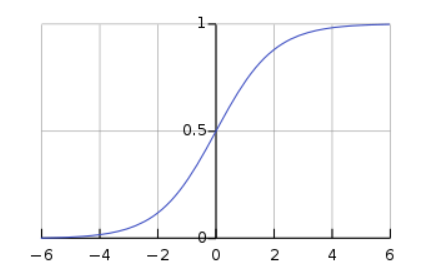
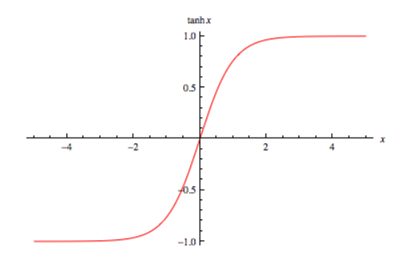
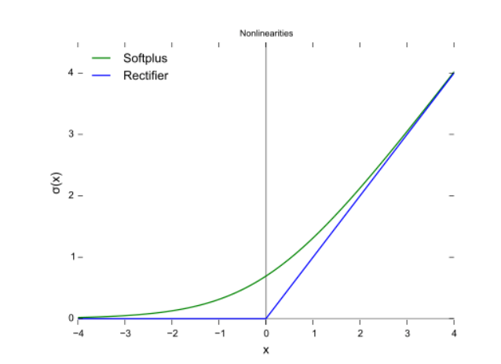
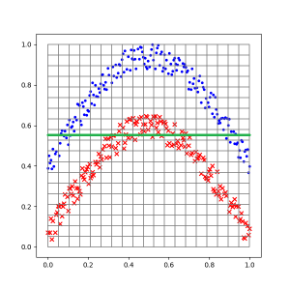
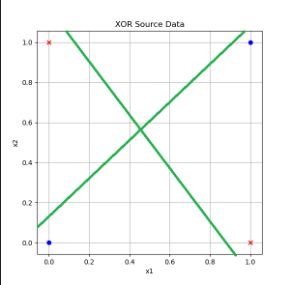
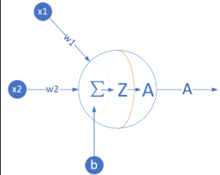
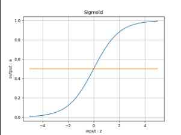

# <center> 人工智能概论 </center>

先来看一个 手写识别应用入门:

一、 思路

大致的步骤如下： 
1.实现简单的界面，将用户用鼠标或者触屏的输入变成图片。 2.将生成的模型包装起来，成为有公开数据接口的类。 3.将输入的图片进行规范化，成为数据接口能够使用的格式。 4.最后通过模型来推理(inference)出图片应该是哪个数字，并显示出来。

二、动手

首先，我们打开Visual Studio，选择文件->新建->项目。

在弹出的窗口里选择Visual C#->Windows窗体应用，项目名称不妨叫做DrawDigit，解决方案名称不妨叫做MnistForm，点击确定。


此时，Visual Studio也自动弹出了一个窗口的设计图。


---

 为何我们要用这个手写应用来引出这次的课程报告呢？

 因为：

```
通过手写输入文字，这属于人工智能技术中的模式识别。
```

这项应用已经广泛用于各个领域。

接下来我们详细来看人工智能概论。

---

# 概论
 

人工智能(Artificial Intelligence, AI) ，是研究、开发用于模拟、延伸和扩展人的智能的理论、方法、技术及应用系统的一门新的技术科学。人工智能作为计算机科学的一个分支，它企图了解智能的实质，并生产出一种新的能以人类智能相似的方式做出反应的智能机器，该领域的研究包括机器人、语言识别、图像识别、自然语言处理和专家系统等。二十世纪七十年代以来被称为世界三大尖端技术之一（空间技术、能源技术、人工智能），也被认为是二十一世纪（基因工程、纳米科学、人工智能）三大尖端技术之一。因此，随着计算机技术的发展以及人类对自我认知的深入，是否可以让计算机和人脑一样具有自动发现规律和利用规律智能地去帮助人类去解决更加复杂的问题，从而扩展和延伸人的智能，正是本课程开设的目的与意义所在

人工智能（Artificial Intelligence），英文缩写为AI。它是研究、开发用于模拟、延伸和扩展人的智能的理论、方法、技术及应用系统的一门新的技术科学。
人工智能是计算机科学的一个分支，它企图了解智能的实质，并生产出一种新的能以人类智能相似的方式做出反应的智能机器，该领域的研究包括机器人、语言识别、图像识别、自然语言处理和专家系统等。人工智能从诞生以来，理论和技术日益成熟，应用领域也不断扩大，可以设想，未来人工智能带来的科技产品，将会是人类智慧的“容器”。人工智能可以对人的意识、思维的信息过程的模拟。人工智能不是人的智能，但能像人那样思考、也可能超过人的智能。
人工智能是一门极富挑战性的科学，从事这项工作的人必须懂得计算机知识，心理学和哲学。人工智能是包括十分广泛的科学，它由不同的领域组成，如机器学习，计算机视觉等等，总的说来，人工智能研究的一个主要目标是使机器能够胜任一些通常需要人类智能才能完成的复杂工作。但不同的时代、不同的人对这种“复杂工作”的理解是不同的。


# 范式的演化

## 演化的四个阶段

### 第一阶段：经验
        归纳经验
### 第二阶段：理论
        这一阶段，科学家们开始明确定义，速度是什么，质量是什么，化学元素是什么（不再是五行和燃素）……也开始构建各种模型，在模型中尽量撇除次要和无关因素，例如我们在中学的物理实验中，要假设“斜面足够光滑，无摩擦力”，“空气阻力可以忽略不计”，等等
### 第三阶段：计算仿真
        从二十世纪中期开始，利用电子计算机对科学实验进行模拟仿真的模式得到迅速普及，人们可以对复杂现象通过模拟仿真，推演更复杂的现象，典型案例如模拟核试验、天气预报等。这样计算机仿真越来越多地取代实验，逐渐成为科研的常规方法。科学家先定义问题，确认假设，再利用数据进行分析和验证。
### 第四阶段：数据探索
        最后我们到了“数据探索”（Data Exploration）阶段。在这个阶段，科学家收集数据，分析数据，探索新的规律。在深度学习的浪潮中出现的许多结果就是基于海量数据学习得来的。有些数据并不是从现实世界中收集而来，而是由计算机程序自己生成，例如，在AlphaGo算法训练的过程中，它和自己对弈了数百万局，这个数量大大超过了所有记录下来的职业选手棋谱的数量。


# 神经网络


人工神经网络（artificial neural network，ANN），简称神经网络（neural network，NN），是一种模仿生物神经网络的结构和功能的数学模型或计算模型。神经网络由大量的人工神经元联结进行计算。大多数情况下人工神经网络能在外界信息的基础上改变内部结构，是一种自适应系统。现代神经网络是一种非线性统计性数据建模工具，常用来对输入和输出间复杂的关系进行建模，或用来探索数据的模式。

神经网络是一种运算模型，由大量的节点（或称“神经元”）和之间相互的联接构成。每个节点代表一种特定的输出函数，称为激励函数、激活函数（activation function）。每两个节点间的联接都代表一个对于通过该连接信号的加权值，称之为权重，这相当于人工神经网络的记忆。网络的输出则依网络的连接方式，权重值和激励函数的不同而不同。而网络自身通常都是对自然界某种算法或者函数的逼近，也可能是对一种逻辑策略的表达。

它的构筑理念是受到生物（人或其他动物）神经网络功能的运作启发而产生的。人工神经网络通常是通过一个基于数学统计学类型的学习方法得以优化，所以人工神经网络也是数学统计学方法的一种实际应用，通过统计学的标准数学方法我们能够得到大量的可以用函数来表达的局部结构空间，另一方面在人工智能学的人工感知领域，我们通过数学统计学的应用可以来做人工感知方面的决定问题(也就是说通过统计学的方法，人工神经网络能够类似人一样具有简单的决定能力和简单的判断能力)，这种方法比起正式的逻辑学推理演算更具有优势。


神经网络最重要的用途是分类，为了让大家对分类有个直观的认识，有几个例子：

    垃圾邮件识别：现在有一封电子邮件，把出现在里面的所有词汇提取出来，送进一个机器里，机器需要判断这封邮件是否是垃圾邮件。
    
    疾病判断：病人到医院去做了一大堆肝功、尿检测验，把测验结果送进一个机器里，机器需要判断这个病人是否得病，得的什么病。
    
    猫狗分类：有一大堆猫、狗照片，把每一张照片送进一个机器里，机器需要判断这幅照片里的东西是猫还是狗。

# M-P神经元模型
## 作用
接受其他多个神经元传入的信号，然后将这些信号汇总成总信号，对比总信号与阈值，如果超过阈值，则产生兴奋信号并输出出去，如果低于阈值，则处于抑制状态。

一条直线把平面一分为二，一个平面把三维空间一分为二，一个 n − 1 n-1 n−1 维超平面把 n n n 维空间一分为二，两边分属不同的两类，这种分类器就叫做神经元。

大家都知道平面上的直线方程是 a x + b y + c = 0 ax+by+c=0 ax+by+c=0，等式左边大于零和小于零分别表示点 ( x , y ) (x,y) (x,y)在直线的一侧还是另一侧，把这个式子推广到n维空间里，直线的高维形式称为超平面，它的方程是：

h = a 1 x 1 + a 2 x 2 + . . . + a n x n + a 0 = 0 h = a_1x_1+a_2 x_2+...+a_nx_n+a_0=0 h=a1​x1​+a2​x2​+...+an​xn​+a0​=0

神经元就是当h大于0时输出1，h小于0时输出0这么一个模型，它的实质就是把特征空间一切两半，认为两瓣分别属两个类。


# 三个基本概念
## 反向传播 梯度下降 损失函数

###  反向传播
反向传播计算流程

    反向传播，就是梯度下降使用reverse-mode autodiff前向传播，就是make predictions，计算输出误差，然后计算每个神经元节点对误差的贡献求贡献就是反向传播是根据前向传播的误差来求梯度然后根据贡献调整原来的权重

Reverse-mode Autodiff计算方法

    反向自动求导是TensorFlow实现的方案，首先，它执行图的前向阶段，从输入到输出，去计算节点值，然后是反向阶段，从输出到输入去计算所有的偏导。下面的图示第二阶段，在第一阶段中，从x=3和y=4开始去计算所有的节点值。f(x,y)= 2 ∗ y + y + 2 求解的思想是逐渐的从图上往下，计算f(x,y)的偏导，使用每一个连续的节点，知道我们到达变量节点，严重依赖链式求导法则！


### 梯度下降

 1. 批量梯度下降(Batch Gradient Descent)

每一次迭代时使用整个训练集的数据计算Cost Function来进行梯度更新。
神经网络训练的三个基本概念Epoch, Batch, Iteration

由于每一次参数更新都用到所有的训练集数据，当样本数量很大的时候，计算开销大，速度慢。

2. 随机梯度下降(Stochastic Gradient Descent)

每一次迭代时，针对单个样本计算Loss Function，然后计算梯度更新参数。这种方法速度比较快，但是收敛性能不好，可能造成目标函数剧烈震荡，并且大数据集的相似样本会造成梯度的冗余计算。
神经网络训练的三个基本概念Epoch, Batch, Iteration

3. 小批量梯度下降(Mini-Batch Gradient Descent)

每次迭代时，采用一小批样本，一方面这样可以降低参数更新时的方差，收敛更加稳定，另一方面可以充分利用深度学习库中的高度优化的矩阵操作进行有效的梯度计算。

Mini-Batch Gradient Descent并不能保证很好的收敛性，Learning Rate 如果选择的太小，收敛速度会很慢；如果选择的太大，Loss Function可能在局部最优解附近不停地震荡甚至偏离。有一种措施是先设定大一点的学习率，当两次迭代之间的变化低于某个阈值后，就减小Learning Rate。
神经网络训练的三个基本概念Epoch, Batch, Iteration

在大规模的神经网络训练中，一般采用小批量梯度下降的方式。 Batch Epoch Iteration 就是其中的重要的概念。

1. Batch

每次迭代时使用的一批样本就叫做一个Batch，样本的数量称为Batch Size。Batch大小是一个超参数，用于定义在更新内部模型参数之前要处理的样本数。深度学习每一次参数的更新的Loss Function并不是由一个样本得到的，而是由一个Batch的数据加权得到。

2. Iteration

使用Batch Size个样本训练一次的过程叫做一个Iteration。

3. Epoch

一个epoch就是使用训练集中的全部样本训练一次。通俗的讲，Epoch的值就是整个训练数据集被反复使用几次。

Epoch数是一个超参数，它定义了学习算法在整个训练数据集中的工作次数。一个Epoch意味着训练数据集中的每个样本都有机会更新内部模型参数。Epoch由一个或多个Batch组成。 


### 损失函数


损失函数用来评价模型的预测值和真实值不一样的程度，损失函数越好，通常模型的性能越好。不同的模型用的损失函数一般也不一样。

损失函数分为经验风险损失函数和结构风险损失函数。经验风险损失函数指预测结果和实际结果的差别，结构风险损失函数是指经验风险损失函数加上正则项。

常见的损失函数以及其优缺点如下：

    0-1损失函数(zero-one loss)

1. 0-1损失是指预测值和目标值不相等为1， 否则为0:


特点：

(1)0-1损失函数直接对应分类判断错误的个数，但是它是一个非凸函数，不太适用.

(2)感知机就是用的这种损失函数。但是相等这个条件太过严格，因此可以放宽条件

2. 交叉熵损失函数 (Cross-entropy loss function)

交叉熵损失函数的标准形式如下:


注意公式中 x 表示样本， y 表示实际的标签， a 表示预测的输出， n 表示样本总数量。

特点：

(1)本质上也是一种对数似然函数，可用于二分类和多分类任务中。

二分类问题中的loss函数（输入数据是softmax或者sigmoid函数的输出）：


多分类问题中的loss函数（输入数据是softmax或者sigmoid函数的输出）：


(2)当使用sigmoid作为激活函数的时候，常用交叉熵损失函数而不用均方误差损失函数，因为它可以完美解决平方损失函数权重更新过慢的问题，具有“误差大的时候，权重更新快；误差小的时候，权重更新慢”的良好性质。


# 单变量线性回归


我们首先用弄清楚什么是线性，什么是非线性。

    线性：两个变量之间的关系是一次函数关系的——图象是直线，叫做线性。

    注意：题目的线性是指广义的线性，也就是数据与数据之间的关系。

    非线性：两个变量之间的关系不是一次函数关系的——图象不是直线，叫做非线性。


    回归：人们在测量事物的时候因为客观条件所限，求得的都是测量值，而不是事物真实的值，为了能够得到真实值，无限次的进行测量，最后通过这些测量数据计算回归到真实值，这就是回归的由来。

    回归是监督学习的一个重要问题，回归用于预测输入变量和输出变量之间的关系，特别是当输入变量的值发生变化时，输出变量的值也随之发生变化。回归模型正是表示从输入变量到输出变量之间映射的函数


## 线性回归要解决的问题

    对大量的观测数据进行处理，从而得到比较符合事物内部规律的数学表达式。也就是说寻找到数据与数据之间的规律所在，从而就可以模拟出结果，也就是对结果进行预测。解决的就是通过已知的数据得到未知的结果。例如：对房价的预测、判断信用评价、电影票房预估等
### 线性回归的一般模型


## 线性回归问题的解决方法

1. 最小二乘法；
1. 梯度下降法；
2. 简单的神经网络法；
3. 更通用的神经网络算法。


## 1.1 最小二乘法

### 历史

最小二乘法是勒让德( A. M. Legendre)于1805年在其著作《计算慧星轨道的新方法》中提出的。它的主要思想就是求解未知参数，使得理论值与观测值之差（即误差，或者说残差）的平方和达到最小：
线性回归试图学得：

### 数学原理
$$z_i=w \cdot x_i+b \tag{1}$$

使得：

$$z_i \simeq y_i \tag{2}$$

其中，$x_i$ 是样本特征值，$y_i$ 是样本标签值，$z_i$ 是模型预测值。

如何学得 $w$ 和 $b$ 呢？均方差(MSE - mean squared error)是回归任务中常用的手段：
$$
J = \frac{1}{2m}\sum_{i=1}^m(z_i-y_i)^2 = \frac{1}{2m}\sum_{i=1}^m(y_i-wx_i-b)^2 \tag{3}
$$

$J$ 称为损失函数。实际上就是试图找到一条直线，使所有样本到直线上的残差的平方和最小。

## 1.2 梯度下降法
### 原理
    梯度下降法的基本思想可以类比为一个下山的过程。
    假设这样一个场景：一个人被困在山上，需要从山上下来(找到山的最低点，也就是山谷)。但此时山上的浓雾很大，导致可视度很低；因此，下山的路径就无法确定，必须利用自己周围的信息一步一步地找到下山的路。这个时候，便可利用梯度下降算法来帮助自己下山。怎么做呢，首先以他当前的所处的位置为基准，寻找这个位置最陡峭的地方，然后朝着下降方向走一步，然后又继续以当前位置为基准，再找最陡峭的地方，再走直到最后到达最低处；同理上山也是如此，只是这时候就变成梯度上升算法了


梯度下降的基本过程就和下山的场景很类似。

首先，我们有一个可微分的函数。这个函数就代表着一座山。我们的目标就是找到这个函数的最小值，也就是山底。根据之前的场景假设，最快的下山的方式就是找到当前位置最陡峭的方向，然后沿着此方向向下走，对应到函数中，就是找到给定点的梯度 ，然后朝着梯度相反的方向，就能让函数值下降的最快！因为梯度的方向就是函数之变化最快的方向(在后面会详细解释)
所以，我们重复利用这个方法，反复求取梯度，最后就能到达局部的最小值，这就类似于我们下山的过程。而求取梯度就确定了最陡峭的方向，也就是场景中测量方向的手段

### 计算
在下面的公式中，我们规定 $x$ 是样本特征值（单特征），$y$ 是样本标签值，$z$ 是预测值，下标 $i$ 表示其中一个样本。

预设函数（Hypothesis Function）

线性函数：

$$z_i = x_i \cdot w + b \tag{1}$$
 损失函数（Loss Function）

均方误差：

$$loss_i(w,b) = \frac{1}{2} (z_i-y_i)^2 \tag{2}$$


与最小二乘法比较可以看到，梯度下降法和最小二乘法的模型及损失函数是相同的，都是一个线性模型加均方差损失函数，模型用于拟合，损失函数用于评估效果。

区别在于，最小二乘法从损失函数求导，直接求得数学解析解，而梯度下降以及后面的神经网络，都是利用导数传递误差，再通过迭代方式一步一步（用近似解）逼近真实解。

### 梯度计算

### 计算z的梯度

根据公式2：
$$
\frac{\partial loss}{\partial z_i}=z_i - y_i \tag{3}
$$

#### 计算 $w$ 的梯度

我们用 $loss$ 的值作为误差衡量标准，通过求 $w$ 对它的影响，也就是 $loss$ 对 $w$ 的偏导数，来得到 $w$ 的梯度。由于 $loss$ 是通过公式2->公式1间接地联系到 $w$ 的，所以我们使用链式求导法则，通过单个样本来求导。

根据公式1和公式3：

$$
\frac{\partial{loss}}{\partial{w}} = \frac{\partial{loss}}{\partial{z_i}}\frac{\partial{z_i}}{\partial{w}}=(z_i-y_i)x_i \tag{4}
$$

# 非线性回归

## 激活函数

    "在人工神经网络中，激活函数是根据输入定义节点（或神经元）的输出。一般，该输出也会是下一个节点的输入。" - Activation function

为解决非线性问题（实际中大多数问题都是非线性问题），神经网络中引入了激活函数，给网络结构添加了非线性因素，使其能够处理较为复杂的非线性分类问题。

激活函数一般具有以下性质:

        非线性: 当激活函数是线性的时候，一个两层的神经网络就可以逼近基本上所有的函数了。但是，如果激活函数是恒等激活函数的时候，就不满足这个性质了，而且如果多层网络使用的是恒等激活函数，那么其实整个网络跟单层神经网络是等价的。
        连续可微: 当优化方法是基于梯度的时候，这个性质是必须的。
        范围: 当激活函数输出值是有限的时候，基于梯度的优化方法会更加稳定，因为特征的表示受有限权值的影响更显著；当激活函数的输出是无限的时候，模型的训练会更加高效，不过在这种情况下，一般需要更小的learning rate。
        单调性: 当激活函数是单调的时候，单层网络能够保证是凸函数。
        导数单调的光滑函数: 在某些情况下，这些已被证明具有更好的泛化性。
        初始时 f(x)≈x: 当激活函数满足这个性质的时候，如果参数的初始化是random的很小的值，那么神经网络的训练将会很高效；如果不满足这个性质，那么就需要很用心的去设置初始值。
        - Activation function

想要了解更多，可以阅读：

    深度学习-从线性到非线性

常用的激活函数

常用的激活函数有:

    Sigmoid
    Tanh
    ReLU
    Leaky ReLU，PReLU、R-ReLU
    ELU
    Maxout
    Softmax
    其他

Sigmoid

1844年（1845年发表） 就提出来了，经典的激活函数，但是目前使用的不太多。Sigmoid函数单调平滑可导，能够压缩输出数值，但Sigmoid函数左右两端饱和，梯度很小，容易导致梯度损失。除此之外，Sigmoid函数不是关于原点中心对称，函数中的幂运算也相对耗时。


$$Sigmoid(z) = \frac{1}{1 + e^{-z}} \rightarrow a \tag{1}$$




Tanh

与Sigmoid函数很类似，也是经典的激活函数。与Sigmoid函数相比，Tanh改进的地方是函数输出值关于原点中心对称。梯度损失和计算耗时的问题还是存在。
#### 公式  
$$Tanh(z) = \frac{e^{z} - e^{-z}}{e^{z} + e^{-z}} = (\frac{2}{1 + e^{-2z}}-1) \rightarrow a \tag{3}$$
即
$$Tanh(z) = 2 \cdot Sigmoid(2z) - 1 \tag{4}$$

#### 导数公式

$$Tanh'(z) = (1 + a)(1 - a)$$

利用基本导数公式23，令：$u={e^{z}-e^{-z}}，v=e^{z}+e^{-z}$ 则有：

$$
\begin{aligned}
Tanh'(z)&=\frac{u'v-v'u}{v^2} \\\\
&=\frac{(e^{z}-e^{-z})'(e^{z}+e^{-z})-(e^{z}+e^{-z})'(e^{z}-e^{-z})}{(e^{z}+e^{-z})^2} \\\\
&=\frac{(e^{z}+e^{-z})(e^{z}+e^{-z})-(e^{z}-e^{-z})(e^{z}-e^ {-z})}{(e^{z}+e^{-z})^2} \\\\
&=\frac{(e^{z}+e^{-z})^2-(e^{z}-e^{-z})^2}{(e^{z}+e^{-z})^2} \\\\
&=1-(\frac{(e^{z}-e^{-z}}{e^{z}+e^{-z}})^2=1-a^2
\end{aligned}
$$



## 用多项式回归法拟合正弦曲线

多项式回归有几种形式：

#### 一元一次线性模型

因为只有一项，所以不能称为多项式了。它可以解决单变量的线性回归。其模型为：

$$z = x w + b \tag{1}$$

#### 多元一次多项式

多变量的线性回归。其模型为：

$$z = x_1 w_1 + x_2 w_2 + ...+ x_m w_m + b \tag{2}$$

这里的多变量，是指样本数据的特征值为多个，上式中的 $x_1,x_2,...,x_m$ 代表了m个特征值。

#### 一元多次多项式

单变量的非线性回归，比如上面这个正弦曲线的拟合问题，很明显不是线性问题，但是只有一个 $x$ 特征值，所以不满足前两种形式。如何解决这种问题呢？

有一个定理：任意一个函数在一个较小的范围内，都可以用多项式任意逼近。因此在实际工程实践中，有时候可以不管 $y$ 值与 $x$ 值的数学关系究竟是什么，而是强行用回归分析方法进行近似的拟合。

那么如何得到更多的特征值呢？对于只有一个特征值的问题，人们发明了一种聪明的办法，就是把特征值的高次方作为另外的特征值，加入到回归分析中，用公式描述：

$$z = x w_1 + x^2 w_2 + ... + x^m w_m + b \tag{3}$$

上式中x是原有的唯一特征值，$x^m$ 是利用 $x$ 的 $m$ 次方作为额外的特征值，这样就把特征值的数量从 $1$ 个变为 $m$ 个。

换一种表达形式，令：$x_1 = x,x_2=x^2,\ldots,x_m=x^m$，则：

$$z = x_1 w_1 + x_2 w_2 + ... + x_m w_m + b \tag{4}$$

可以看到公式4和上面的公式2是一样的，所以解决方案也一样。

#### 多元多次多项式

多变量的非线性回归，其参数与特征组合繁复，但最终都可以归结为公式2和公式4的形式。

## 双层神经网络实现非线性回归

### 万能近似定理

万能近似定理(universal approximation theorem) $^{[1]}$，是深度学习最根本的理论依据。它证明了在给定网络具有足够多的隐藏单元的条件下，配备一个线性输出层和一个带有任何“挤压”性质的激活函数（如Sigmoid激活函数）的隐藏层的前馈神经网络，能够以任何想要的误差量近似任何从一个有限维度的空间映射到另一个有限维度空间的Borel可测的函数。

前馈网络的导数也可以以任意好地程度近似函数的导数。

万能近似定理其实说明了理论上神经网络可以近似任何函数。但实践上我们不能保证学习算法一定能学习到目标函数。即使网络可以表示这个函数，学习也可能因为两个不同的原因而失败：

1. 用于训练的优化算法可能找不到用于期望函数的参数值；
2. 训练算法可能由于过拟合而选择了错误的函数。

根据“没有免费的午餐”定理，说明了没有普遍优越的机器学习算法。前馈网络提供了表示函数的万能系统，在这种意义上，给定一个函数，存在一个前馈网络能够近似该函数。但不存在万能的过程既能够验证训练集上的特殊样本，又能够选择一个函数来扩展到训练集上没有的点。

总之，具有单层的前馈网络足以表示任何函数，但是网络层可能大得不可实现，并且可能无法正确地学习和泛化。在很多情况下，使用更深的模型能够减少表示期望函数所需的单元的数量，并且可以减少泛化误差。

###  定义神经网络结构


根据万能近似定理的要求，我们定义一个两层的神经网络，输入层不算，一个隐藏层，含3个神经元，一个输出层。


单入单出的双层神经网络

为什么用3个神经元呢？这也是笔者经过多次试验的最佳结果。因为输入层只有一个特征值，我们不需要在隐层放很多的神经元，先用3个神经元试验一下。如果不够的话再增加，神经元数量是由超参控制的。

#### 输入层

输入层就是一个标量x值，如果是成批输入，则是一个矢量或者矩阵，但是特征值数量总为1，因为只有一个横坐标值做为输入。

$$X = (x)$$

#### 权重矩阵W1/B1

$$
W1=
\begin{pmatrix}
w1_{11} & w1_{12} & w1_{13}
\end{pmatrix}
$$

$$
B1=
\begin{pmatrix}
b1_{1} & b1_{2} & b1_{3} 
\end{pmatrix}
$$

#### 隐层

我们用3个神经元：

$$
Z1 = \begin{pmatrix}
    z1_1 & z1_2 & z1_3
\end{pmatrix}
$$

$$
A1 = \begin{pmatrix}
    a1_1 & a1_2 & a1_3
\end{pmatrix}
$$


#### 权重矩阵W2/B2

W2的尺寸是3x1，B2的尺寸是1x1。

$$
W2=
\begin{pmatrix}
w2_{11} \\\\
w2_{21} \\\\
w2_{31}
\end{pmatrix}
$$

$$
B2=
\begin{pmatrix}
b2_{1}
\end{pmatrix}
$$

#### 输出层

由于我们只想完成一个拟合任务，所以输出层只有一个神经元，尺寸为1x1：

$$
Z2 = 
\begin{pmatrix}
    z2_{1}
\end{pmatrix}
$$

### 前向计算


#### 隐层

- 线性计算

$$
z1_{1} = x \cdot w1_{11} + b1_{1}
$$

$$
z1_{2} = x \cdot w1_{12} + b1_{2}
$$

$$
z1_{3} = x \cdot w1_{13} + b1_{3}
$$

矩阵形式：

$$
\begin{aligned}
Z1 &=x \cdot 
\begin{pmatrix}
    w1_{11} & w1_{12} & w1_{13}
\end{pmatrix}
+
\begin{pmatrix}
    b1_{1} & b1_{2} & b1_{3}
\end{pmatrix}
 \\\\
&= X \cdot W1 + B1  
\end{aligned} \tag{1}
$$

- 激活函数

$$
a1_{1} = Sigmoid(z1_{1})
$$

$$
a1_{2} = Sigmoid(z1_{2})
$$

$$
a1_{3} = Sigmoid(z1_{3})
$$

矩阵形式：

$$
A1 = Sigmoid(Z1) \tag{2}
$$

#### 输出层

由于我们只想完成一个拟合任务，所以输出层只有一个神经元：

$$
\begin{aligned}
Z2&=a1_{1}w2_{11}+a1_{2}w2_{21}+a1_{3}w2_{31}+b2_{1} \\\\
&= 
\begin{pmatrix}
a1_{1} & a1_{2} & a1_{3}
\end{pmatrix}
\begin{pmatrix}
w2_{11} \\\\ w2_{21} \\\\ w2_{31}
\end{pmatrix}
+b2_1 \\\\
&=A1 \cdot W2+B2
\end{aligned} \tag{3}
$$

#### 损失函数

均方差损失函数：

$$loss(w,b) = \frac{1}{2} (z2-y)^2 \tag{4}$$

其中，$z2$是预测值，$y$是样本的标签值。

# 非线性分类


为什么必须用双层神经网络

### 分类

我们先回忆一下各种分类的含义：

- 从复杂程度上分，有线性/非线性之分；
- 从样本类别上分，有二分类/多分类之分。

从直观上理解，这几个概念应该符合表10-2中的示例。

 各种分类的组合关系

||二分类|多分类|
|---|---|---|
|线性|||
|非线性|||


 线性分类结果

|XOR问题|弧形问题|
|---|---|
|||
|图中两根直线中的任何一根，都不可能把蓝色点分到一侧，同时红色点在另一侧|对于线性技术来说，它已经尽力了，使得两类样本尽可能地分布在直线的两侧|

###  简单证明异或问题的不可能性

用单个感知机或者单层神经网络，是否能完成异或任务呢？我们自己做个简单的证明。先看样本数据.

 异或的样本数据

|样本|$x_1$|$x_2$|$y$|
|---|---|---|---|
|1|0|0|0|
|2|0|1|1|
|3|1|0|1|
|4|1|1|0|


神经元结构与二分类函数

|神经元|分类函数Logistic|
|--|--|
|||

前向计算公式：

$$z = x_1  w_1 + x_2  w_2 + b \tag{1}$$
$$a = Logistic(z) \tag{2}$$

- 对于第一个样本数据

$x_1=0,x_2=0,y=0$。如果需要$a=y$的话，从Logistic函数曲线看，需要$z<0$，于是有：

$$x_1 w_1 + x_2  w_2 + b < 0$$

因为$x_1=0,x_2=0$，所以只剩下$b$项：

$$b < 0 \tag{3}$$

- 对于第二个样本数据

$x_1=0,x_2=1,y=1$。如果需要$a=y$，则要求$z>0$，不等式为：

$$x_1w_1 + x_2w_2+b=w_2+b > 0 \tag{4}$$

- 对于第三个样本数据

$x_1=1,x_2=0,y=1$。如果需要$a=y$，则要求$z>0$，不等式为：

$$x_1w_1 + x_2w_2+b=w_1+b > 0 \tag{5}$$

- 对于第四个样本

$x_1=1,x_2=1,y=0$。如果需要$a=y$，则要求$z<0$，不等式为：

$$x_1w_1 + x_2w_2+b=w_1+w_2+b < 0 \tag{6}$$

把公式6两边都加$b$，并把公式3接续：

$$(w_1 + b) + (w_2 + b) < b < 0 \tag{7}$$

再看公式4、5，不等式左侧括号内的两个因子都大于0，其和必然也大于0，不可能小于$b$。因此公式7不成立，无论如何也不能满足所有的4个样本的条件，所以单个神经元做异或运算是不可能的。

### 非线性的可能性

我们前边学习过如何实现与、与非、或、或非，我们看看如何用已有的逻辑搭建异或门，如图所示。


 用基本逻辑单元搭建异或运算单元

组合运算的过程

|样本与计算|1|2|3|4|
|----|----|----|----|----|
|$x_1$|0|0|1|1|
|$x_2$|0|1|0|1|
|$s_1=x_1$ NAND $x_2$|1|1|1|0|
|$s_2=x_1$ OR $x_2$|0|1|1|1|
|$y=s_1$ AND $s_2$|0|1|1|0|

经过组合运算后，可以看到$y$的输出与$x_1,x_2$的输入相比，就是异或逻辑了。所以，实践证明两层逻辑电路可以解决问题。另外，我们在地四步中学习了非线性回归，使用双层神经网络可以完成一些神奇的事情，比如复杂曲线的拟合，只需要6、7个参数就搞定了。我们可以模拟这个思路，用两层神经网络搭建模型，来解决非线性分类问题。


## 非线性二分类神经网络

- 输入层两个特征值$x_1,x_2$
  $$
  X=\begin{pmatrix}
    x_1 & x_2
  \end{pmatrix}
  $$
- 隐层$2\times 2$的权重矩阵$W1$
$$
  W1=\begin{pmatrix}
    w1_{11} & w1_{12} \\\\
    w1_{21} & w1_{22} 
  \end{pmatrix}
$$
- 隐层$1\times 2$的偏移矩阵$B1$

$$
  B1=\begin{pmatrix}
    b1_{1} & b1_{2}
  \end{pmatrix}
$$

- 隐层由两个神经元构成
$$
Z1=\begin{pmatrix}
  z1_{1} & z1_{2}
\end{pmatrix}
$$
$$
A1=\begin{pmatrix}
  a1_{1} & a1_{2}
\end{pmatrix}
$$
- 输出层$2\times 1$的权重矩阵$W2$
$$
  W2=\begin{pmatrix}
    w2_{11} \\\\
    w2_{21}  
  \end{pmatrix}
$$

- 输出层$1\times 1$的偏移矩阵$B2$

$$
  B2=\begin{pmatrix}
    b2_{1}
  \end{pmatrix}
$$

- 输出层有一个神经元使用Logistic函数进行分类
$$
  Z2=\begin{pmatrix}
    z2_{1}
  \end{pmatrix}
$$
$$
  A2=\begin{pmatrix}
    a2_{1}
  \end{pmatrix}
$$

## 非线性多分类

定义神经网络结构

先设计出能完成非线性多分类的网络结构，如图所示。


图11-2 非线性多分类的神经网络结构图

- 输入层两个特征值$x_1, x_2$
$$
x=
\begin{pmatrix}
    x_1 & x_2
\end{pmatrix}
$$
- 隐层$2\times 3$的权重矩阵$W1$
$$
W1=
\begin{pmatrix}
    w1_{11} & w1_{12} & w1_{13} \\\\
    w1_{21} & w1_{22} & w1_{23}
\end{pmatrix}
$$

- 隐层$1\times 3$的偏移矩阵$B1$

$$
B1=\begin{pmatrix}
    b1_1 & b1_2 & b1_3 
\end{pmatrix}
$$

- 隐层由3个神经元构成
- 输出层$3\times 3$的权重矩阵$W2$
$$
W2=\begin{pmatrix}
    w2_{11} & w2_{12} & w2_{13} \\\\
    w2_{21} & w2_{22} & w2_{23} \\\\
    w2_{31} & w2_{32} & w2_{33} 
\end{pmatrix}
$$

- 输出层$1\times 1$的偏移矩阵$B2$

$$
B2=\begin{pmatrix}
    b2_1 & b2_2 & b2_3 
  \end{pmatrix}
$$

- 输出层有3个神经元使用Softmax函数进行分类

## 三层神经网络

三层神经网络结构

#### 输入层

共计$28\times 28=784$个特征值：

$$
X=\begin{pmatrix}
    x_1 & x_2 & \cdots & x_{784}
  \end{pmatrix}
$$

#### 隐层1

- 权重矩阵$W1$形状为$784\times 64$

$$
W1=\begin{pmatrix}
    w1_{1,1} & w1_{1,2} & \cdots & w1_{1,64} \\\\
    \vdots & \vdots & \cdots & \vdots \\\\
    w1_{784,1} & w1_{784,2} & \cdots & w1_{784,64} 
  \end{pmatrix}
$$

- 偏移矩阵$B1$的形状为$1\times 64$

$$
B1=\begin{pmatrix}
    b1_{1} & b1_{2} & \cdots & b1_{64}
  \end{pmatrix}
$$

- 隐层1由64个神经元构成，其结果为$1\times 64$的矩阵

$$
Z1=\begin{pmatrix}
    z1_{1} & z1_{2} & \cdots & z1_{64}
  \end{pmatrix}
$$
$$
A1=\begin{pmatrix}
    a1_{1} & a1_{2} & \cdots & a1_{64}
  \end{pmatrix}
$$

#### 隐层2

- 权重矩阵$w2$形状为$64\times 16$

$$
W2=\begin{pmatrix}
    w2_{1,1} & w2_{1,2} & \cdots & w2_{1,16} \\\\
    \vdots & \vdots & \cdots & \vdots \\\\
    w2_{64,1} & w2_{64,2} & \cdots & w2_{64,16} 
  \end{pmatrix}
$$

- 偏移矩阵#B2#的形状是$1\times 16$

$$
B2=\begin{pmatrix}
    b2_{1} & b2_{2} & \cdots & b2_{16}
  \end{pmatrix}
$$

- 隐层2由16个神经元构成

$$
Z2=\begin{pmatrix}
    z2_{1} & z2_{2} & \cdots & z2_{16}
  \end{pmatrix}
$$
$$
A2=\begin{pmatrix}
    a2_{1} & a2_{2} & \cdots & a2_{16}
  \end{pmatrix}
$$

#### 输出层

- 权重矩阵$W3$的形状为$16\times 10$

$$
W3=\begin{pmatrix}
    w3_{1,1} & w3_{1,2} & \cdots & w3_{1,10} \\\\
    \vdots & \vdots & \cdots & \vdots \\\\
    w3_{16,1} & w3_{16,2} & \cdots & w3_{16,10} 
  \end{pmatrix}
$$

- 输出层的偏移矩阵$B3$的形状是$1\times 10$

$$
B3=\begin{pmatrix}
    b3_{1}& b3_{2} & \cdots & b3_{10}
  \end{pmatrix}
$$

- 输出层有10个神经元使用Softmax函数进行分类

$$
Z3=\begin{pmatrix}
    z3_{1} & z3_{2} & \cdots & z3_{10}
  \end{pmatrix}
$$
$$
A3=\begin{pmatrix}
    a3_{1} & a3_{2} & \cdots & a3_{10}
  \end{pmatrix}
$$

---

# 总结与心得


人工智能进入了一切领域——从自动驾驶汽车，到自动回复电子邮件，再到智能家居。 你似乎可以获得任何商品（例如医疗健康，飞行，旅行等），并通过人工智能的特殊应用使其更加智能。所以除非你相信事件具有终结者般的转折，你可能会问自己，人工智能能够预示着工作场所或整体的业务线的什么利益。

　　人工智能主要有三个分支：


1) 认知AI （cognitive AI）

　　认知计算是最受欢迎的一个人工智能分支，负责所有感觉“像人一样”的交互。认知AI必须能够轻松处理复杂性和二义性，同时还持续不断地在数据挖掘、NLP（自然语言处理）和智能自动化的经验中学习。

　　现在人们越来越倾向于认为认知AI混合了人工智能做出的最好决策和人类工作者们的决定，用以监督更棘手或不确定的事件。这可以帮助扩大人工智能的适用性，并生成更快、更可靠的答案。


2) 机器学习AI （Machine Learning AI）

　　机器学习（ML）AI是能在高速公路上自动驾驶你的特斯拉的那种人工智能。它还处于计算机科学的前沿，但将来有望对日常工作场所产生极大的影响。机器学习是要在大数据中寻找一些“模式”，然后在没有过多的人为解释的情况下，用这些模式来预测结果，而这些模式在普通的统计分析中是看不到的。

　　然而机器学习需要三个关键因素才能有效：

　　a) 数据，大量的数据

　　为了教给人工智能新的技巧，需要将大量的数据输入给模型，用以实现可靠的输出评分。例如特斯拉已经向其汽车部署了自动转向特征，同时发送它所收集的所有数据、驾驶员的干预措施、成功逃避、错误警报等到总部，从而在错误中学习并逐步锐化感官。 一个产生大量输入的好方法是通过传感器：无论你的硬件是内置的，如雷达，相机，方向盘等（如果它是一辆汽车的话），还是你倾向于物联网(Internet of Things)。蓝牙信标、健康跟踪器、智能家居传感器、公共数据库等只是越来越多的通过互联网连接的传感器中的一小部分，这些传感器可以生成大量数据（多到让任何正常的人来处理都太多）。

　　b) 发现

　　为了理解数据和克服噪声，机器学习使用的算法可以对混乱的数据进行排序、切片并转换成可理解的见解。（如果你想吓跑你的同事，请先听听常用的不同排序算法）

　　从数据中学习的算法有两种，无监督算法和有监督算法。

　　无监督算法只处理数字和原始数据，因此没有建立起可描述性标签和因变量。该算法的目的是找到一个人们没想到会有的内在结构。这对于深入了解市场细分，相关性，离群值等非常有用。

　　另一方面，有监督算法通过标签和变量知道不同数据集之间的关系，使用这些关系来预测未来的数据。这可能在气候变化模型、预测分析、内容推荐等方面都能派上用场。

　　c) 部署

　　机器学习需要从计算机科学实验室进入到软件当中。越来越多像CRM、Marketing、ERP等的供应商，正在提高嵌入式机器学习或与提供它的服务紧密结合的能力。


3) 深度学习(Deep Learning)

　　如果机器学习是前沿的，那么深度学习则是尖端的。这是一种你会把它送去参加智力问答的AI。它将大数据和无监督算法的分析相结合。它的应用通常围绕着庞大的未标记数据集，这些数据集需要结构化成互联的群集。深度学习的这种灵感完全来自于我们大脑中的神经网络，因此可恰当地称其为人工神经网络。

　　深度学习是许多现代语音和图像识别方法的基础，并且与以往提供的非学习方法相比，随着时间的推移具有更高的准确度。

　　希望在未来，深度学习AI可以自主回答客户的咨询，并通过聊天或电子邮件完成订单。 或者它们可以基于其巨大的数据池在建议新产品和规格上帮助营销。或者也许有一天他们可以成为工作场所里的全方位助理，完全模糊机器人和人类之间的界限。

　　人工智能通过在其上使用的数据规模来生存和改进，这意味着不但我们能够随着时间的推移看到更好的人工智能，而且它们的发展将会围绕着那些可以挖掘最大数据集的组织。


 深度学习是机器学习研究中的一个新的领域，其动机在于建立、模拟人脑进行分析学习的神经网络，它模仿人脑的机制来解释数据，例如图像，声音和文本。深度学习是无监督学习的一种。

总结了三个特点：

1、自然语言处理、语音识别、用户画像、无人驾驶……这些和深度神经网络（即深度学习）相关的技术在最近几年突然火了起来，随着AI、机器学习和智能机器人变得越来越普遍，在这些机器人将在制造、培训、销售、维修和车队管理方面担任新的岗位。人工智能和机器人将能够实现今天难以想象的新服务。但很显然，医疗保健和交通运输将是AI第一批颠覆的行业。

2、深度学习的进展和计算能力的提高和数据的增长密不可分。

3、如果是一辆无人驾驶车出现了错误，不但它自己会从中吸取教训，所有其他的无人驾驶车甚至是所有未来的无人驾驶车，也将从中获得新的经验。这意味着，一个错误就能训练世界上所有的无人驾驶车，无人车的学习速度远远超过了人类。

人工智能的出现，带来了无数便利。希望这项如此高水平的技术，会带领人类走向更光明的未来！
