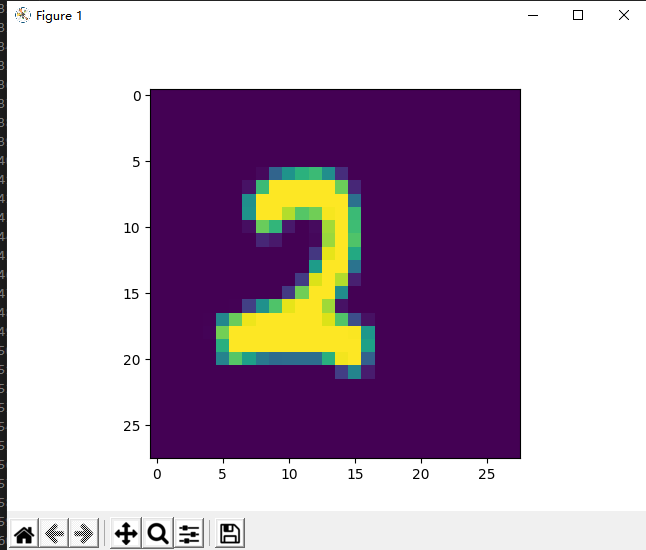
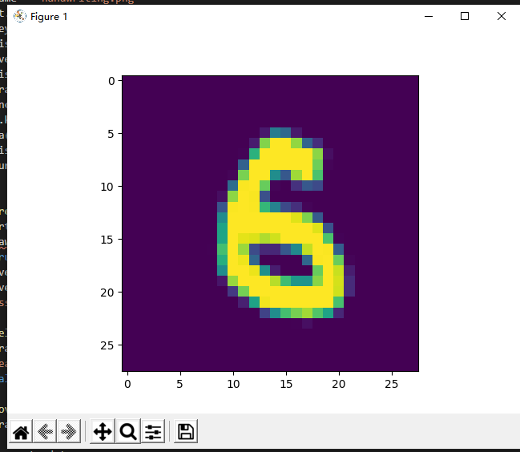
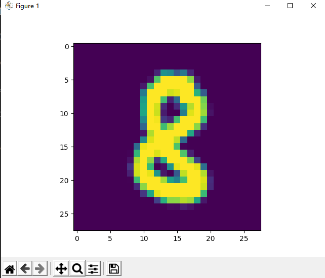

## MiniFrameWork架构的手写体识别
基于三层神经网络的代码：
```python
from matplotlib import pyplot as plt
import numpy as np
from PIL import Image

from HelperClass2.NeuralNet_3_0 import *

def ReadImage(img_file_name):
    img = Image.open(img_file_name)
    out1 = img.convert('L')
    out2 = out1.resize((28,28))
    a = np.array(out2)
    b = 255 - a
    x_max = np.max(b)
    x_min = np.min(b)
    X_NEW = (b - x_min)/(x_max-x_min)
    plt.cla()
    plt.imshow(X_NEW)
    plt.plot()
    return X_NEW.reshape(1,-1)

def Inference(img_array):
    output = net.inference(img_array)
    n = np.argmax(output)
    print("------recognize result is: -----", n)

def on_key_press(event):
    img_file_name = "handwriting.png"
    print(event.key)
    if event.key == 'enter':
        plt.axis('off')
        plt.savefig(img_file_name)
        plt.axis('on')
        img_array = ReadImage(img_file_name)
        Inference(img_array)
    elif event.key == 'backspace':
        plt.cla()
        plt.axis([0,1,0,1])
        ax.figure.canvas.draw()
    #end if

def on_mouse_press(event):
    global startx, starty, isdraw
    print(isdraw)
    isdraw = True
    startx = event.xdata
    starty = event.ydata
    print("press:{0},{1}", startx, starty)
    
def on_mouse_release(event):
    global isdraw, startx, starty
    print("release:", event.xdata, event.ydata, isdraw)
    isdraw = False

def on_mouse_move(event):
    global isdraw, startx, starty
    if isdraw:
        endx = event.xdata        
        endy = event.ydata        
        x1 = [startx, endx]
        y1 = [starty, endy]
        ax.plot(x1, y1, color='black', linestyle='-', linewidth='40')
        ax.figure.canvas.draw()
        startx = endx
        starty = endy
    # end if

def LoadNet():
    n_input = 784
    n_hidden1 = 64
    n_hidden2 = 16
    n_output = 10
    eta = 0.2
    eps = 0.01
    batch_size = 128
    max_epoch = 40

    hp = HyperParameters_3_0(
        n_input, n_hidden1, n_hidden2, n_output, 
        eta, max_epoch, batch_size, eps, 
        NetType.MultipleClassifier, 
        InitialMethod.Xavier)
    net = NeuralNet_3_0(hp, "MNIST_64_16")
    net.LoadResult()
    return net
   
if __name__ == "__main__":
    isdraw = False
    startx, starty = 0, 0

    print("need to run level3 first to get result")
    print("============================================================================")
    print("handwriting a digit, then press enter to recognize, press backspace to clear")
    print("resize the window to square, say, height == width")
    print("the handwriting should full fill the window")
    print("============================================================================")

    net = LoadNet()

    fig, ax = plt.subplots()
    fig.canvas.mpl_connect('key_press_event', on_key_press)
    fig.canvas.mpl_connect('button_release_event', on_mouse_release)
    fig.canvas.mpl_connect('button_press_event', on_mouse_press)
    fig.canvas.mpl_connect('motion_notify_event', on_mouse_move)
    
    plt.axis([0,1,0,1])
    plt.show()
```
运行结果：





## 人工智能的定义
#### 第一个层面，人们对人工智能的期待可以分为：
智能地把某件特定的事情做好，在某个领域增强人类的智慧，这种方式又叫做智能增强,像人类一样能认知，思考，判断：模拟人类的智能.

#### 第二个层面，从技术的特点来看
 如果一个程序解决任务（T）的效能（用P表示）随着经验（E）得到了提高，那么，这个程序就能从经验（E）中学到了关于任务（T）的知识，并让衡量值（P）得到提高。
 
 那么，机器学习的各种方法是如何从经验中学习呢？我们可以大致地分为下面三种类型：

1. 选择一个模型结构（例如逻辑回归，决策树等），这就是上面说的程序。
2. 用训练数据（输入和输出）输入模型。这就是上面的经验（E）。
3. 通过不断执行任务（T）并衡量结果（P），让P
不断提高，直到达到一个满意的值。. 监督学习（Supervised Learning）

    通过标注的数据来学习，例如，程序通过学习标注了正确答案的手写数字的图像数据，它就能认识其他的手写数字。

2. 无监督学习（Unsupervised Learning）

    通过没有标注的数据来学习。这种算法可以发现数据中自然形成的共同特性（聚类），可以用来发现不同数据之间的联系，例如，买了商品A的顾客往往也购买了商品B。

3. 强化学习（Reinforcement Learning）

    我们可以让程序选择和它的环境互动（例如玩一个游戏），环境给程序的反馈是一些“奖励”（例如游戏中获得高分），程序要学习到一个模型，能在这种环境中得到高的分数，不仅是当前局面要得到高分，而且最终的结果也要是高分才行。

综合来看，如果我们把机器学习当作一个小孩，那么，教育小孩的方式就有根据正确答案指导学习（监督学习）；根据小孩实践的过程给予各种鼓励（强化学习）；还有自由探索世界，让小孩自己总结规律（无监督学习）。

**神经网络**由基本的神经元组成，图1-1就是一个神经元的数学/计算模型，便于我们用程序来实现。


图1-1神经元的数学/计算模型  

&nbsp;
图1-2是个简单的神经网络训练的过程


图1-2  

&nbsp;

**神经网络**一般有 输入（inputs） 权重（weights） 偏置（bias） 求和（sum） 激活函数（activation）

#### 小结

- 一个神经元可以有多个输入。
- 一个神经元只能有一个输出，这个输出可以同时输入给多个神经元。
- 一个神经元的 $w$ 的数量和输入的数量一致。
- 一个神经元只有一个 $b$。
- $w$ 和 $b$ 有人为的初始值，在训练过程中被不断修改。
- $A$ 可以等于 $Z$，即激活函数不是必须有的。
- 一层神经网络中的所有神经元的激活函数必须一致。

神经网络一般是**矩阵运算**，输入的样本参数要进行预处理一般有**两种方法**：*标准化方法*，*归一化方法*。

神经网络的主要作用式**回归或者拟合**还有**分类**。

神经网络中的三个基本概念：反向传播，梯度下降，损失函数。 

**反向传播一步步求权重W和偏置B**

**梯度下降**的数学公式：

$$\theta_{n+1} = \theta_{n} - \eta \cdot \nabla J(\theta) \tag{1}$$
其中：

- $\theta_{n+1}$：下一个值；
- $\theta_n$：当前值；
- $-$：减号，梯度的反向；
- $\eta$：学习率或步长，控制每一步走的距离，不要太快以免错过了最佳景点，不要太慢以免时间太长；
- $\nabla$：梯度，函数当前位置的最快上升点；
- $J(\theta)$：函数。

#### 梯度下降的三要素

1. 当前点；
2. 方向；
3. 步长。

学习率太大，迭代的情况很糟糕，在一条水平线上跳来跳去，永远也不能下降。
学习率大，会有这种左右跳跃的情况发生。
学习率合适，损失值会从单侧下降。
学习率较小，损失值会从单侧下降，但下降速度非常慢。

###损失函数

“损失”就是所有样本的“误差”的总和，亦即（$m$ 为样本数）：

$$损失 = \sum^m_{i=1}误差_i$$

$$J = \sum_{i=1}^m loss_i$$


####损失函数种类：
- Gold Standard Loss，又称0-1误差
$$
loss=\begin{cases}
0 & a=y \\\\
1 & a \ne y 
\end{cases}
$$

- 绝对值损失函数

$$
loss = |y-a|
$$

- Hinge Loss，铰链/折页损失函数或最大边界损失函数，主要用于SVM（支持向量机）中

$$
loss=\max(0,1-y \cdot a) \qquad y=\pm 1
$$

- Log Loss，对数损失函数，又叫交叉熵损失函数(cross entropy error)

$$
loss = -[y \cdot \ln (a) + (1-y) \cdot \ln (1-a)]  \qquad y \in \\{ 0,1 \\} 
$$

- Squared Loss，均方差损失函数
$$
loss=(a-y)^2
$$

- Exponential Loss，指数损失函数
$$
loss = e^{-(y \cdot a)}
$$

**常用函数**:均方差函数，主要用于回归

交叉熵函数，主要用于分类

####均方差函数：
该函数就是最直观的一个损失函数了，计算预测值和真实值之间的欧式距离。预测值和真实值越接近，两者的均方差就越小。

均方差函数常用于线性回归(linear regression)，即函数拟合(function fitting)。公式如下：

$$
loss = {1 \over 2}(z-y)^2 \tag{单样本}
$$

$$
J=\frac{1}{2m} \sum_{i=1}^m (z_i-y_i)^2 \tag{多样本}
$$

####交叉熵函数：

交叉熵（Cross Entropy）是Shannon信息论中一个重要概念，主要用于度量两个概率分布间的差异性信息。在信息论中，交叉熵是表示两个概率分布 $p,q$ 的差异，其中 $p$ 表示真实分布，$q$ 表示预测分布，那么 $H(p,q)$ 就称为交叉熵：

$$H(p,q)=\sum_i p_i \cdot \ln {1 \over q_i} = - \sum_i p_i \ln q_i \tag{1}$$

交叉熵可在神经网络中作为损失函数，$p$ 表示真实标记的分布，$q$ 则为训练后的模型的预测标记分布，交叉熵损失函数可以衡量 $p$ 与 $q$ 的相似性。

**交叉熵函数常用于逻辑回归(logistic regression)，也就是分类(classification)。**


###线性回归
基本公式
$$Y = X \cdot W + B \tag{1}$$

####梯度下降的三种形式
#####最小二乘法
最小二乘法，也叫做最小平方法（Least Square），它通过最小化误差的平方和寻找数据的最佳函数匹配。利用最小二乘法可以简便地求得未知的数据，并使得这些求得的数据与实际数据之间误差的平方和为最小。最小二乘法还可用于曲线拟合。其他一些优化问题也可通过最小化能量或最小二乘法来表达。


实际上就是试图找到一条直线，使所有样本到直线上的残差的平方和最小。


图1-1 均方差函数的评估原理

图1-1中，圆形点是样本点，直线是当前的拟合结果。如左图所示，我们是要计算样本点到直线的垂直距离，需要再根据直线的斜率来求垂足然后再计算距离，这样计算起来很慢；但实际上，在工程上我们通常使用的是右图的方式，即样本点到直线的竖直距离，因为这样计算很方便，用一个减法就可以了。

**公式**：
$$
b = \frac{1}{m}\left(\sum_{i=1}^m{y_i} - w\sum_{i=1}^m{x_i}\right)=\bar y-w \bar x \tag{2}
$$
```Python
def calculate_b(X,Y,w):
    b = Y.mean() - w * X.mean()
    return b
```
$$
\bar y = \frac{1}{m}\sum_{i=1}^m y_i, \bar x=\frac{1}{m}\sum_{i=1}^m x_i \tag{3}
$$

$$
w = \frac{\sum_{i=1}^m(x_iy_i-x_i \bar y)}{\sum_{i=1}^m(x^2_i - \bar x x_i)} \tag{4}
$$

```Python
def method_w(X,Y,m):
    x_mean = X.mean()
    p = sum(Y*(X-x_mean))
    q = sum(X*X) - sum(X)*sum(X)/m
    w = p/q
    return w
```
####梯度下降法

与最小二乘法比较可以看到，梯度下降法和最小二乘法的模型及损失函数是相同的，都是一个线性模型加均方差损失函数，模型用于拟合，损失函数用于评估效果。

区别在于，最小二乘法从损失函数求导，直接求得数学解析解，而梯度下降以及后面的神经网络，都是利用导数传递误差，再通过迭代方式一步一步（用近似解）逼近真实解。

损失函数：
$$loss_i(w,b) = \frac{1}{2} (z_i-y_i)^2 \tag{5}$$

**计算Z的梯度**：
$$
\frac{\partial loss}{\partial z_i}=z_i - y_i \tag{6}
$$
**计算w的梯度**：
$$
\frac{\partial{loss}}{\partial{w}} = \frac{\partial{loss}}{\partial{z_i}}\frac{\partial{z_i}}{\partial{w}}=(z_i-y_i)x_i \tag{7}
$$

**计算b的梯度**：
$$
\frac{\partial{loss}}{\partial{b}} = \frac{\partial{loss}}{\partial{z_i}}\frac{\partial{z_i}}{\partial{b}}=z_i-y_i \tag{8}
$$

####神经网络法

其实神经网络法和梯度下降法在本质上是一样的，只不过神经网络法使用一个崭新的编程模型，即以神经元为中心的代码结构设计，这样便于以后的功能扩充。用神经元的编程模型把梯度下降法包装了一下，这样就进入了神经网络的世界，从而可以有成熟的方法论可以解决更复杂的问题，比如多个神经元协同工作、多层神经网络的协同工作等等。

#### 前向计算

```Python
    def __forward(self, x):
        z = x * self.w + self.b
        return z
```
####反向传播
```Python
    def __backward(self, x,y,z):
        dz = z - y
        db = dz
        dw = x * dz
        return dw, db
```

#### 梯度更新

```Python
    def __update(self, dw, db):
        self.w = self.w - self.eta * dw
        self.b = self.b - self.eta * db
```


图4-5 拟合效果

#### 单批量随机梯度下降训练特点
  
  - 训练样本：每次使用一个样本数据进行一次训练，更新一次梯度，重复以上过程。
  - 优点：训练开始时损失值下降很快，随机性大，找到最优解的可能性大。
  - 缺点：受单个样本的影响最大，损失函数值波动大，到后期徘徊不前，在最优解附近震荡。不能并行计算。

#### 小批量随机梯度下降训练特点
  - 训练样本：选择一小部分样本进行训练，更新一次梯度，然后再选取另外一小部分样本进行训练，再更新一次梯度。
  - 优点：不受单样本噪声影响，训练速度较快。
  - 缺点：batch size的数值选择很关键，会影响训练结果。

#### 全批量随机梯度下降训练特点
  - 训练样本：每次使用全部数据集进行一次训练，更新一次梯度，重复以上过程。
  - 优点：受单个样本的影响最小，一次计算全体样本速度快，损失函数值没有波动，到达最优点平稳。方便并行计算。
  - 缺点：数据量较大时不能实现（内存限制），训练过程变慢。初始值不同，可能导致获得局部最优解，并非全局最优解。

####三种方式的比较
表1-4 三种方式的比较

||单样本|小批量|全批量|
|---|---|---|---|
|梯度下降过程图解||||
|批大小|1|10|100|
|学习率|0.1|0.3|0.5|
|迭代次数|304|110|60|
|epoch|3|10|60|
|结果|w=2.003, b=2.990|w=2.006, b=2.997|w=1.993, b=2.998|

表1-4比较了三种方式的结果，从结果看，都接近于 $w=2,b=3$ 的原始解。最后的可视化结果图如图1-5，可以看到直线已经处于样本点比较中间的位置。


相关的概念：

- Batch Size：批大小，一次训练的样本数量。
- Iteration：迭代，一次正向 + 一次反向。
- Epoch：所有样本被使用了一次，叫做一个Epoch，中文的翻译比较杂乱，所以干脆就用原文比较清楚。

假设一共有样本1000个，batch size=20，则一个Epoch中，需要1000/20=50次Iteration才能训练完所有样本。

图1-5 较理想的拟合效果图

###多元线性回归模型

$$y=a_0+a_1x_1+a_2x_2+\dots+a_kx_k$$

为了保证回归模型具有优良的解释能力和预测效果，应首先注意自变量的选择，其准则是：

1. 自变量对因变量必须有显著的影响，并呈密切的线性相关；
2. 自变量与因变量之间的线性相关必须是真实的，而不是形式上的；
3. 自变量之间应具有一定的互斥性，即自变量之间的相关程度不应高于自变量与因变量之因的相关程度；
4. 自变量应具有完整的统计数据，其预测值容易确定。

表1-2 两种方法的比较

|方法|正规方程|梯度下降|
|---|-----|-----|
|原理|几次矩阵运算|多次迭代|
|特殊要求|$X^{\top}X$ 的逆矩阵存在|需要确定学习率|
|复杂度|$O(n^3)$|$O(n^2)$|
|适用样本数|$m \lt 10000$|$m \ge 10000$|

####多样本多特征神经网络法

当进行多样本计算时，我们用 $m=3$ 个样本做一个实例化推导：

$$
z_1 = x_{11}w_1+x_{12}w_2+b
$$

$$
z_2= x_{21}w_1+x_{22}w_2+b
$$

$$
z_3 = x_{31}w_1+x_{32}w_2+b
$$

$$
J(W,B) = \frac{1}{2 \times 3}[(z_1-y_1)^2+(z_2-y_2)^2+(z_3-y_3)^2]
$$

$$
\begin{aligned}  
\frac{\partial J}{\partial W}&=
\begin{pmatrix}
  \frac{\partial J}{\partial w_1} \\\\
  \frac{\partial J}{\partial w_2}
\end{pmatrix}
=\begin{pmatrix}
  \frac{\partial J}{\partial z_1}\frac{\partial z_1}{\partial w_1}+\frac{\partial J}{\partial z_2}\frac{\partial z_2}{\partial w_1}+\frac{\partial J}{\partial z_3}\frac{\partial z_3}{\partial w_1} \\\\
  \frac{\partial J}{\partial z_1}\frac{\partial z_1}{\partial w_2}+\frac{\partial J}{\partial z_2}\frac{\partial z_2}{\partial w_2}+\frac{\partial J}{\partial z_3}\frac{\partial z_3}{\partial w_2}  
\end{pmatrix}
\\\\
&=\begin{pmatrix}
  \frac{1}{3}(z_1-y_1)x_{11}+\frac{1}{3}(z_2-y_2)x_{21}+\frac{1}{3}(z_3-y_3)x_{31} \\\\
  \frac{1}{3}(z_1-y_1)x_{12}+\frac{1}{3}(z_2-y_2)x_{22}+\frac{1}{3}(z_3-y_3)x_{32}
\end{pmatrix}
\\\\
&=\frac{1}{3}
\begin{pmatrix}
  x_{11} & x_{21} & x_{31} \\\\
  x_{12} & x_{22} & x_{32}
\end{pmatrix}
\begin{pmatrix}
  z_1-y_1 \\\\
  z_2-y_2 \\\\
  z_3-y_3
\end{pmatrix}
\\\\
&=\frac{1}{3}
\begin{pmatrix}
  x_{11} & x_{12} \\\\
  x_{21} & x_{22} \\\\
  x_{31} & x_{32} 
\end{pmatrix}^{\top}
\begin{pmatrix}
  z_1-y_1 \\\\
  z_2-y_2 \\\\
  z_3-y_3
\end{pmatrix}
\\\\
&=\frac{1}{m}X^{\top}(Z-Y) 
\end{aligned}
\tag{7}
$$
注：3泛化为m。
$$
\frac{\partial J}{\partial B}=\frac{1}{m}(Z-Y) \tag{8}
$$


```Python
class NeuralNet(object):
    def __init__(self, params):
        self.params = params
        self.W = np.zeros((self.params.input_size, self.params.output_size))
        self.B = np.zeros((1, self.params.output_size))
```

#### 正向计算的代码

```Python
class NeuralNet(object):
    def __forwardBatch(self, batch_x):
        Z = np.dot(batch_x, self.W) + self.B
        return Z
```

#### 误差反向传播的代码

```Python
class NeuralNet(object):
    def __backwardBatch(self, batch_x, batch_y, batch_z):
        m = batch_x.shape[0]
        dZ = batch_z - batch_y
        dB = dZ.sum(axis=0, keepdims=True)/m
        dW = np.dot(batch_x.T, dZ)/m
        return dW, dB
```

为什么要做标准化

理论层面上，神经网络是以样本在事件中的统计分布概率为基础进行训练和预测的，所以它对样本数据的要求比较苛刻。具体说明如下：

1. 样本的各个特征的取值要符合概率分布，即 $[0,1]$。
2. 样本的度量单位要相同。我们并没有办法去比较1米和1公斤的区别，但是，如果我们知道了1米在整个样本中的大小比例，以及1公斤在整个样本中的大小比例，比如一个处于0.2的比例位置，另一个处于0.3的比例位置，就可以说这个样本的1米比1公斤要小。
3. 神经网络假设所有的输入输出数据都是标准差为1，均值为0，包括权重值的初始化，激活函数的选择，以及优化算法的设计。

4. 数值问题

    标准化可以避免一些不必要的数值问题。因为激活函数sigmoid/tanh的非线性区间大约在 $[-1.7，1.7]$。意味着要使神经元有效，线性计算输出的值的数量级应该在1（1.7所在的数量级）左右。这时如果输入较大，就意味着权值必须较小，一个较大，一个较小，两者相乘，就引起数值问题了。
    
5. 梯度更新
    
    若果输出层的数量级很大，会引起损失函数的数量级很大，这样做反向传播时的梯度也就很大，这时会给梯度的更新带来数值问题。
    
6. 学习率
   
    如果梯度非常大，学习率就必须非常小，因此，学习率（学习率初始值）的选择需要参考输入的范围，不如直接将数据标准化，这样学习率就不必再根据数据范围作调整。对 $w_1$ 适合的学习率，可能相对于 $w_2$ 来说会太小，若果使用适合 $w_1$ 的学习率，会导致在 $w_2$ 方向上步进非常慢，从而消耗非常多的时间；而使用适合 $w_2$ 的学习率，对 $w_1$ 来说又太大，搜索不到适合 $w_1$ 的解。
    
### 5.3.3 从损失函数等高线图分析标准化的必要性

在房价数据中，地理位置的取值范围是 $[2,20]$，而房屋面积的取值范围为 $[40,120]$，二者相差太远，放在一起计算会怎么样？

根据公式$z = x_1 w_1+x_2 w_2 + b$，神经网络想学习 $w_1$ 和 $w_2$，但是数值范围问题导致神经网络来说很难“理解”。图5-5展示了标准化前后的情况损失函数值的等高图，意思是地理位置和房屋面积取不同的值时，作为组合来计算损失函数值时，形成的类似地图的等高图，见图5-5，左侧为标准化前，右侧为标准化后。


图5-5 标准化前后的损失函数等高线图的对比

房屋面积的取值范围是 $[40,120]$，而地理位置的取值范围是 $[2,20]$，二者会形成一个很扁的椭圆，如左侧。这样在寻找最优解的时候，过程会非常曲折。运气不好的话，根本就没法训练。

### 5.3.4 标准化的常用方法

- Min-Max标准化（离差标准化），将数据映射到 $[0,1]$ 区间

$$x_{new}=\frac{x-x_{min}}{x_{max} - x_{min}} \tag{1}$$

- 平均值标准化，将数据映射到[-1,1]区间
   
$$x_{new} = \frac{x - \bar{x}}{x_{max} - x_{min}} \tag{2}$$

- 对数转换
$$x_{new}=\ln(x_i) \tag{3}$$

- 反正切转换
$$x_{new}=\frac{2}{\pi}\arctan(x_i) \tag{4}$$

- Z-Score法

把每个特征值中的所有数据，变成平均值为0，标准差为1的数据，最后为正态分布。Z-Score规范化（标准差标准化 / 零均值标准化，其中std是标准差）：

$$x_{new} = \frac{x_i - \bar{x}}{std} \tag{5}$$

- 中心化，平均值为0，无标准差要求
  
$$x_{new} = x_i - \bar{x} \tag{6}$$

- 比例法，要求数据全是正值

$$
x_{new} = \frac{x_k}{\sum_{i=1}^m{x_i}} \tag{7}
$$


总结


1. 样本不做标准化的话，网络发散，训练无法进行；
2. 训练样本标准化后，网络训练可以得到结果，但是预测结果有问题；
3. 还原参数值后，预测结果正确，但是此还原方法并不能普遍适用；
4. 标准化测试样本，而不需要还原参数值，可以保证普遍适用；
5. 标准化标签值，可以使得网络训练收敛快，但是在预测时需要把结果反标准化，以便得到真实值。


####线性分类

**逻辑回归**（Logistic Regression），回归给出的结果是事件成功或失败的概率。当因变量的类型属于二值（1/0，真/假，是/否）变量时，我们就应该使用逻辑回归。
线性回归使用一条直线拟合样本数据，而逻辑回归的目标是“拟合”0或1两个数值，而不是具体连续数值，所以称为广义线性模型。逻辑回归又称Logistic回归分析，常用于数据挖掘，疾病自动诊断，经济预测等领域。

逻辑回归的另外一个名字叫做分类器，分为线性分类器和非线性分类器，又分为两种：二分类问题和多分类问题

在二分类任务中，叫做Logistic函数，而在作为激活函数时，叫做Sigmoid函数。
- Logistic函数公式

$$Logistic(z) = \frac{1}{1 + e^{-z}}$$

以下记 $a=Logistic(z)$。

- 导数

$$Logistic'(z) = a(1 - a)$$

具体求导过程可以参考8.1节。

- 输入值域

$$(-\infty, \infty)$$

- 输出值域

$$(0,1)$$

- 函数图像（图1-1）


图1-1 Logistic函数图像

对于Logistic函数来说我们设定0.5为阈值，因为他的值域在(0,1)之间，靠近1则表示正类，接近0这位负类，对于其他的具体的函数则阈值不同需要自己判断。

#### 求损失函数对 $a$ 的偏导

$$
\frac{\partial loss}{\partial a}=-\left[\frac{y}{a}-\frac{1-y}{1-a}\right]=\frac{a-y}{a(1-a)} \tag{4}
$$

#### 求 $a$ 对 $z$ 的偏导

$$
\frac{\partial a}{\partial z}= a(1-a) \tag{5}
$$

#### 求误差 $loss$ 对 $z$ 的偏导

使用链式法则链接公式4和公式5：

$$
\frac{\partial loss}{\partial z}=\frac{\partial loss}{\partial a}\frac{\partial a}{\partial z}=\frac{a-y}{a(1-a)} \cdot a(1-a)=a-y \tag{6}
$$
PS：后面很多的函数loss对Z都是简单的减法。矩阵运算可以表示为$$\frac{\partial loss}{\partial z}=A-Y$$

分类学习的方法。这种方法的优点如下：

- 把线性回归的成功经验引入到分类问题中，相当于对“分界线”的预测进行建模，而“分界线”在二维空间上是一条直线，这就不需要考虑具体样本的分布（比如在二维空间上的坐标位置），避免了假设分布不准确所带来的问题；
- 不仅预测出类别（0/1），而且得到了近似的概率值（比如0.31或0.86），这对许多需要利用概率辅助决策的任务很有用；
- 对率函数是任意阶可导的凸函数，有很好的数学性，许多数值优化算法都可以直接用于求取最优解。
###线性二分类问题
损失函数为二分类交叉熵函数
$$
loss(W,B) = -[y\ln a+(1-y)\ln(1-a)]
$$
$$
\frac{\partial J(W,B)}{\partial W}==X^{\top}(A-Y)$$

#####代码
```Py
class NeuralNet(object):
    def __init__(self, params, input_size, output_size):
        self.params = params
        self.W = np.zeros((input_size, output_size))
        self.B = np.zeros((1, output_size))

    def __forwardBatch(self, batch_x):
        Z = np.dot(batch_x, self.W) + self.B
        if self.params.net_type == NetType.BinaryClassifier:
            A = Sigmoid().forward(Z)
            return A
        else:
            return Z
```

图1-2所示的损失函数值记录很平稳地下降，说明网络收敛了。


图1-2 训练过程中损失函数值的变化

####实现原理
线性回归和线性分类的比较

||线性回归|线性分类|
|---|---|---|
|相同点|需要在样本群中找到一条直线|需要在样本群中找到一条直线|
|不同点|用直线来拟合所有样本，使得各个样本到这条直线的距离尽可能最短|用直线来分割所有样本，使得正例样本和负例样本尽可能分布在直线两侧|


二分类函数的几何作用

二分类函数的最终结果是把正例都映射到图6-6中的上半部分的曲线上，而把负类都映射到下半部分的曲线上。


神经网络的工作原理和我们在二维平面上的直观感觉是相同的，即神经网络的工作就是找到这么一条合适的直线，尽量让所有正例样本都处于直线上方时，负例样本处于直线的下方。其实这与线性回归中找到一条直线穿过所有样本点的过程有异曲同工之处。

如图，正例全在这条直线上


实际训练时，要让训练的次数足够和精度设置合理否则在细微的相邻的点产生误差。

###实现五个逻辑门

五种逻辑门的结果比较

|逻辑门|分类结果|参数值|
|---|---|---|
|非||W=-12.468<br/>B=6.031|
|与||W1=11.757<br/>W2=11.757<br/>B=-17.804|
|与非||W1=-11.763<br/>W2=-11.763<br/>B=17.812|
|或||W1=11.743<br/>W2=11.743<br/>B=-11.738|
|或非||W1=-11.738<br/>W2=-11.738<br/>B=5.409|


我们从数值和图形可以得到两个结论：

1. `W1`和`W2`的值基本相同而且符号相同，说明分割线一定是135°斜率
2. 精度越高，则分割线的起点和终点越接近四边的中点0.5的位置

为什么达到相同的精度，逻辑OR和NOR只用2000次左右的epoch，而逻辑AND和NAND却需要4000次以上？
答：因为逻辑OR和NOR的数据使得分类线在右上角就可以达到很好的效果，而逻辑AND和NAND在输入[0,0]时不满足要求，输入[0,1]和[1,0]时不满足要求，所以需要继续迭代，使得逻辑AND与NAND的训练次数更多。

###多分类问题

多分类学习中，虽然有多个类别，但是每个样本只属于一个类别。

有一种情况也很常见，比如一幅图中，既有蓝天白云，又有花草树木，那么这张图片可以有两种标注方法：

- 标注为“风景”，而不是“人物”，属于风景图片，这叫做分类
- 被同时标注为“蓝天”、“白云”、“花草”、“树木”等多个标签，这样的任务不叫作多分类学习，而是“多标签”学习，multi-label learning

如果有三个以上的分类同时存在，我们需要对每一类别分配一个神经元，这个神经元的作用是根据前端输入的各种数据，先做线性处理（$Z=WX+B$），然后做一次非线性处理，计算每个样本在每个类别中的预测概率，再和标签中的类别比较，看看预测是否准确，如果准确，则奖励这个预测，给与正反馈；如果不准确，则惩罚这个预测，给与负反馈。两类反馈都反向传播到神经网络系统中去调整参数。

这个网络只有输入层和输出层，由于输入层不算在内，所以是一层网络，如图1-3所示。


图1-3多入多出单层神经网络

#### 引入Softmax

Softmax加了个"soft"来模拟max的行为，但同时又保留了相对大小的信息。

$$
a_j = \frac{e^{z_j}}{\sum\limits_{i=1}^m e^{z_i}}=\frac{e^{z_j}}{e^{z_1}+e^{z_2}+\dots+e^{z_m}}
$$

上式中:

- $z_j$ 是对第 $j$ 项的分类原始值，即矩阵运算的结果
- $z_i$ 是参与分类计算的每个类别的原始值
- $m$ 是总分类数
- $a_j$ 是对第 $j$ 项的计算结果

假设 $j=1,m=3$，上式为：
  
$$a_1=\frac{e^{z_1}}{e^{z_1}+e^{z_2}+e^{z_3}}$$

用图7-5来形象地说明这个过程。


图7-5 Softmax工作过程

当输入的数据$[z_1,z_2,z_3]$是$[3,1,-3]$时，按照图示过程进行计算，可以得出输出的概率分布是$[0.879,0.119,0.002]$。

对比MAX运算和Softmax的不同，如表7-2所示。

表7-2 MAX运算和Softmax的不同

|输入原始值|MAX计算|Softmax计算|
|:---:|:---:|:---:|
|$[3, 1, -3]$|$[1, 0, 0]$|$[0.879, 0.119, 0.002]$|

也就是说，在（至少）有三个类别时，通过使用Softmax公式计算它们的输出，比较相对大小后，得出该样本属于第一类，因为第一类的值为0.879，在三者中最大。注意这是对一个样本的计算得出的数值，而不是三个样本，亦即Softmax给出了某个样本分别属于三个类别的概率。

它有两个特点：

1. 三个类别的概率相加为1
2. 每个类别的概率都大于0

从继承关系的角度来说，Softmax函数可以视作Logistic函数扩展，比如一个二分类问题：

$$
a_1 = \frac{e^{z_1}}{e^{z_1} + e^{z_2}} = \frac{1}{1 + e^{z_2 - z_1}}
$$
输出层

输出层三个神经元，再加上一个Softmax计算，最后有$A1,A2,A3$三个输出，写作：

$$
Z = \begin{pmatrix}z_1 & z_2 & z_3 \end{pmatrix}
$$
$$
A = \begin{pmatrix}a_1 & a_2 & a_3 \end{pmatrix}
$$

其中，$Z=X \cdot W+B，A = Softmax(Z)$
####样本标准数据
OneHot的意思，在这一列数据中，只有一个1，其它都是0。1所在的列数就是这个样本的分类类别。标签数据对应到每个样本数据上，列对齐，只有$(1,0,0),(0,1,0),(0,0,1)$三种可能，分别表示第一类、第二类和第三类。

损失函数偏导一般性公式
$$
\frac{\partial loss}{\partial z_i}=a_i-y_i 
$$

 计算损失函数值

损失函数不再是均方差和二分类交叉熵了，而是交叉熵函数对于多分类的形式，并且添加条件分支来判断只在网络类型为多分类时调用此损失函数。

```Python
class LossFunction(object):
    # fcFunc: feed forward calculation
    def CheckLoss(self, A, Y):
        m = Y.shape[0]
        if self.net_type == NetType.Fitting:
            loss = self.MSE(A, Y, m)
        elif self.net_type == NetType.BinaryClassifier:
            loss = self.CE2(A, Y, m)
        elif self.net_type == NetType.MultipleClassifier:
            loss = self.CE3(A, Y, m)
        #end if
        return loss
    # end def

    # for multiple classifier
    def CE3(self, A, Y, count):
        ......
```

单样本时，$n$表示类别数，$j$表示类别序号：

$$
\begin{aligned}
loss(w,b)&=-(y_1 \ln a_1 + y_2 \ln a_2 + y_3 \ln a_3) \\\\
&=-\sum_{j=1}^{n} y_j \ln a_j 
\end{aligned}
$$

批量样本时，$m$ 表示样本数，$i$ 表示样本序号：

$$
\begin{aligned}
J(w,b) &=- \sum_{i=1}^m (y_{i1} \ln a_{i1} + y_{i2} \ln a_{i2} + y_{i3} \ln a_{i3}) \\\\
&=- \sum_{i=1}^m \sum_{j=1}^n y_{ij} \ln a_{ij}
\end{aligned}
$$


####为什么不能使用均方差做为分类问题的损失函数？

1. 回归问题通常用均方差损失函数，可以保证损失函数是个凸函数，即可以得到最优解。而分类问题如果用均方差的话，损失函数的表现不是凸函数，就很难得到最优解。而交叉熵函数可以保证区间内单调。

2. 分类问题的最后一层网络，需要分类函数，Sigmoid或者Softmax，如果再接均方差函数的话，其求导结果复杂，运算量比较大。用交叉熵函数的话，可以得到比较简单的计算结果，一个简单的减法就可以得到反向误差。

## 非线性分类

### 二分类模型的评估标准

#### 准确率 Accuracy

也可以称之为精度，我们在本书中混用这两个词。

#### 混淆矩阵

表1 四类样本的矩阵关系

|预测值|被判断为正类|被判断为负类|Total|
|---|---|---|---|
|样本实际为正例|TP-True Positive|FN-False Negative|Actual Positive=TP+FN|
|样本实际为负例|FP-False Positive|TN-True Negative|Actual Negative=FP+TN|
|Total|Predicated Postivie=TP+FP|Predicated Negative=FN+TN|

从混淆矩阵中可以得出以下统计指标：

- 准确率 Accuracy

$$
\begin{aligned}
Accuracy &= \frac{TP+TN}{TP+TN+FP+FN} \\\\
&=\frac{521+435}{521+29+435+15}=0.956
\end{aligned}
$$

这个就是准确率，越大越好。

- 精确率/查准率 Precision

分子为被判断为正类并且真的是正类的样本数，分母是被判断为正类的样本数。越大越好。

$$
Precision=\frac{TP}{TP+FP}=\frac{521}{521+15}=0.972
$$

- 召回率/查全率 Recall

$$
Recall = \frac{TP}{TP+FN}=\frac{521}{521+29}=0.947
$$

分子为被判断为正类并且真的是正类的样本数，分母是真的正类的样本数。越大越好。

- TPR - True Positive Rate 真正例率

$$
TPR = \frac{TP}{TP + FN}=Recall=0.947
$$

- FPR - False Positive Rate 假正例率

$$
FPR = \frac{FP}{FP+TN}=\frac{15}{15+435}=0.033
$$

分子为被判断为正类的负例样本数，分母为所有负类样本数。越小越好。

- 调和平均值 F1

$$
\begin{aligned}
F1&=\frac{2 \times Precision \times Recall}{recision+Recall}\\\\
&=\frac{2 \times 0.972 \times 0.947}{0.972+0.947}=0.959
\end{aligned}
$$

该值越大越好。

- ROC曲线与AUC

ROC，Receiver Operating Characteristic，接收者操作特征，又称为感受曲线（Sensitivity Curve），是反映敏感性和特异性连续变量的综合指标，曲线上各点反映着相同的感受性，它们都是对同一信号刺激的感受性。
ROC曲线的横坐标是FPR，纵坐标是TPR。

AUC，Area Under Roc，即ROC曲线下面的面积。

在二分类器中，如果使用Logistic函数作为分类函数，可以设置一系列不同的阈值，比如[0.1,0.2,0.3...0.9]，把测试样本输入，从而得到一系列的TP、FP、TN、FN，然后就可以绘制如下曲线，如图10-4。


图1 ROC曲线图

图中红色的曲线就是ROC曲线，曲线下的面积就是AUC值，取值区间为$[0.5,1.0]$，面积越大越好。

- ROC曲线越靠近左上角，该分类器的性能越好。
- 对角线表示一个随机猜测分类器。
- 若一个学习器的ROC曲线被另一个学习器的曲线完全包住，则可判断后者性能优于前者。
- 若两个学习器的ROC曲线没有包含关系，则可以判断ROC曲线下的面积，即AUC，谁大谁好。

当然在实际应用中，取决于阈值的采样间隔，红色曲线不会这么平滑，由于采样间隔会导致该曲线呈阶梯状。

#### Kappa statics 

Kappa值，即内部一致性系数(inter-rater,coefficient of internal consistency)，是作为评价判断的一致性程度的重要指标。取值在0～1之间。

$$
Kappa = \frac{p_o-p_e}{1-p_e}
$$

其中，$p_0$是每一类正确分类的样本数量之和除以总样本数，也就是总体分类精度。$p_e$的定义见以下公式。

- Kappa≥0.75两者一致性较好；
- 0.75>Kappa≥0.4两者一致性一般；
- Kappa<0.4两者一致性较差。 

该系数通常用于多分类情况，如：

||实际类别A|实际类别B|实际类别C|预测总数|
|--|--|--|--|--|
|预测类别A|239|21|16|276|
|预测类别B|16|73|4|93|
|预测类别C|6|9|280|295|
|实际总数|261|103|300|664|


$$
p_o=\frac{239+73+280}{664}=0.8916
$$
$$
p_e=\frac{261 \times 276 + 103 \times 93 + 300 \times 295}{664 \times 664}=0.3883
$$
$$
Kappa = \frac{0.8916-0.3883}{1-0.3883}=0.8228
$$

数据一致性较好，说明分类器性能好。

#### Mean absolute error 和 Root mean squared error 

平均绝对误差和均方根误差，用来衡量分类器预测值和实际结果的差异，越小越好。

#### Relative absolute error 和 Root relative squared error 

相对绝对误差和相对均方根误差，有时绝对误差不能体现误差的真实大小，而相对误差通过体现误差占真值的比重来反映误差大小。

## 非线性二分类实现

### 定义神经网络结构

首先定义可以完成非线性二分类的神经网络结构图，如图2所示。


图2 非线性二分类神经网络结构图

- 输出层有一个神经元使用Logistic函数进行分类
$$
  Z2=\begin{pmatrix}
    z2_{1}
  \end{pmatrix}
$$
$$
  A2=\begin{pmatrix}
    a2_{1}
  \end{pmatrix}
$$

对于一般的用于二分类的双层神经网络可以是图3的样子。


图3 通用的二分类神经网络结构图

输入特征值可以有很多，隐层单元也可以有很多，输出单元只有一个，且后面要接Logistic分类函数和二分类交叉熵损失函数。

###  前向计算

根据网络结构，我们有了前向计算过程图4。


图4 前向计算过程

### 10.2.3 反向传播

图5展示了反向传播的过程。


图5 反向传播过程

最后到达$Z1$的误差矩阵是：

$$
\begin{aligned}
\frac{\partial loss}{\partial Z1}&=\frac{\partial loss}{\partial A1}\frac{\partial A1}{\partial Z1}
\\\\
&=dZ2 \cdot W2^{\top} \odot dA1 \rightarrow dZ1 
\end{aligned}
$$

$$
dW1=X^{\top} \cdot dZ1 
$$
$$
dB1=dZ1 
$$

####隐层神经元数量的影响
###### 实现逻辑异或门
一般来说，隐层的神经元数量要大于等于输入特征的数量，在本例中特征值数量是2，请看表2中的比较图。

表2隐层神经元数量对分类结果的影响
|||
|---|---|
|||
|1个神经元，无法完成分类任务|2个神经元，迭代6200次到达精度要求|
|||
|3个神经元，迭代4900次到达精度要求|4个神经元，迭代4300次到达精度要求|
|||
|8个神经元，迭代4400次到达精度要求|16个神经元，迭代4500次到达精度要求|
	
1个神经元，无法完成分类任务	2个神经元，迭代6200次到达精度要求
	
3个神经元，迭代4900次到达精度要求	4个神经元，迭代4300次到达精度要求
	
8个神经元，迭代4400次到达精度要求	16个神经元，迭代4500次到达精度要求
以上各情况的迭代次数是在Xavier初始化的情况下测试一次得到的数值，并不意味着神经元越多越好，合适的数量才好。总结如下：

2个神经元肯定是足够的；
4个神经元肯定要轻松一些，用的迭代次数最少。
而更多的神经元也并不是更轻松，比如8个神经元，杀鸡用了宰牛刀，由于功能过于强大，出现了曲线的分类边界；
而16个神经元更是事倍功半地把4个样本分到了4个区域上，当然这也给了我们一些暗示：神经网络可以做更强大的事情！
表中图3的分隔带角度与前面几张图相反，但是红色样本点仍处于蓝色区，蓝色样本点仍处于红色区，这个性质没有变。这只是初始化参数不同造成的神经网络的多个解，与神经元数量无关。
#### 双弧形二分类原理
神经网络通过空间变换的方式，把线性不可分的样本变成了线性可分的样本，从而给最后的分类变得很容易。

#### 多分类模型的评估标准
混淆矩阵
当然也可以计算每个类别的Precision和Recall，但是只在需要时才去做具体计算。比如，当第2类和第3类混淆比较严重时，为了记录模型训练的历史情况，才会把第2类和第3类单独拿出来分析。

在他这里，只使用总体的准确率来衡量多分类器的好坏。

#### 非线性多分类

### 前向计算

根据网络结构，可以绘制前向计算图，如图11-3所示。


图9 前向计算图

#### 第一层

- 线性计算

$$
z1_1 = x_1 w1_{11} + x_2 w1_{21} + b1_1
$$
$$
z1_2 = x_1 w1_{12} + x_2 w1_{22} + b1_2
$$
$$
z1_3 = x_1 w1_{13} + x_2 w1_{23} + b1_3
$$
$$
Z1 = X \cdot W1 + B1
$$

- 激活函数

$$
a1_1 = Sigmoid(z1_1) 
$$
$$
a1_2 = Sigmoid(z1_2) 
$$
$$
a1_3 = Sigmoid(z1_3) 
$$
$$
A1 = Sigmoid(Z1)
$$

#### 第二层

- 线性计算

$$
z2_1 = a1_1 w2_{11} + a1_2 w2_{21} + a1_3 w2_{31} + b2_1
$$
$$
z2_2 = a1_1 w2_{12} + a1_2 w2_{22} + a1_3 w2_{32} + b2_2
$$
$$
z2_3 = a1_1 w2_{13} + a1_2 w2_{23} + a1_3 w2_{33} + b2_3
$$
$$
Z2 = A1 \cdot W2 + B2
$$

- 分类函数

$$
a2_1 = \frac{e^{z2_1}}{e^{z2_1} + e^{z2_2} + e^{z2_3}}
$$
$$
a2_2 = \frac{e^{z2_2}}{e^{z2_1} + e^{z2_2} + e^{z2_3}}
$$
$$
a2_3 = \frac{e^{z2_3}}{e^{z2_1} + e^{z2_2} + e^{z2_3}}
$$
$$
A2 = Softmax(Z2)
$$

#### 损失函数

使用多分类交叉熵损失函数：
$$
loss = -(y_1 \ln a2_1 + y_2 \ln a2_2 + y_3 \ln a2_3)
$$
$$
J(w,b) = -\frac{1}{m} \sum^m_{i=1} \sum^n_{j=1} y_{ij} \ln (a2_{ij})
$$

$m$为样本数，$n$为类别数。

### 反向传播

根据前向计算图，可以绘制出反向传播的路径如图11-4。


图10 反向传播图

在第7.1中学习过了Softmax与多分类交叉熵配合时的反向传播推导过程，最后是一个很简单的减法：

$$
\frac{\partial loss}{\partial Z2}=A2-y \rightarrow dZ2
$$

从Z2开始再向前推的话，和10.2节是一模一样的，所以直接把结论拿过来：

$$
\frac{\partial loss}{\partial W2}=A1^{\top} \cdot dZ2 \rightarrow dW2
$$
$$\frac{\partial{loss}}{\partial{B2}}=dZ2 \rightarrow dB2$$
$$
\frac{\partial A1}{\partial Z1}=A1 \odot (1-A1) \rightarrow dA1
$$
$$
\frac{\partial loss}{\partial Z1}=dZ2 \cdot W2^{\top} \odot dA1 \rightarrow dZ1 
$$
$$
dW1=X^{\top} \cdot dZ1
$$
$$
dB1=dZ1
$$

### 11.2.1 隐层神经元数量的影响

下面列出了隐层神经元为2、4、8、16、32、64的情况，设定好最大epoch数为10000，以比较它们各自能达到的最大精度值的区别。每个配置只测试一轮，所以测出来的数据有一定的随机性。

表11-3展示了隐层神经元数与分类结果的关系。

表11-3 神经元数与网络能力及分类结果的关系

|神经元数|损失函数|分类结果|
|---|---|---|
|2|||
||测试集准确度0.618，耗时49秒，损失函数值0.795。类似这种曲线的情况，损失函数值降不下去，准确度值升不上去，主要原因是网络能力不够。|没有完成分类任务|
|4|||
||测试准确度0.954，耗时51秒，损失函数值0.132。虽然可以基本完成分类任务，网络能力仍然不够。|基本完成，但是边缘不够清晰|
|8|||
||测试准确度0.97，耗时52秒，损失函数值0.105。可以先试试在后期衰减学习率，如果再训练5000轮没有改善的话，可以考虑增加网络能力。|基本完成，但是边缘不够清晰|
|16|||
||测试准确度0.978，耗时53秒，损失函数值0.094。同上，可以同时试着使用优化算法，看看是否能收敛更快。|较好地完成了分类任务|
|32|||
||测试准确度0.974，耗时53秒，损失函数值0.085。网络能力够了，从损失值下降趋势和准确度值上升趋势来看，可能需要更多的迭代次数。|较好地完成了分类任务|
|64|||
||测试准确度0.972，耗时64秒，损失函数值0.075。网络能力足够。|较好地完成了分类任务|

从以上的比较中可知，隐层必须用3个神经元以上。在这个例子中，使用3个神经元能完成基本的分类任务，但精度要差一些。但是如果必须使用更多的神经元才能达到基本要求的话，我们将无法进行下一步的试验，所以，这个例子的难度对我们来说恰到好处。

## 分类样本不平衡问题
####平衡数据集

有一句话叫做“更多的数据往往战胜更好的算法”。所以一定要先想办法扩充样本数量少的类别的数据，比如目前的正负类样本数量是1000:100，则可以再搜集2000个数据，最后得到了2800:300的比例，此时可以从正类样本中丢弃一些，变成500:300，就可以训练了。

一些经验法则：

- 考虑对大类下的样本（超过1万、十万甚至更多）进行欠采样，即删除部分样本；
- 考虑对小类下的样本（不足1万甚至更少）进行过采样，即添加部分样本的副本；
- 考虑尝试随机采样与非随机采样两种采样方法；
- 考虑对各类别尝试不同的采样比例，比一定是1:1，有时候1:1反而不好，因为与现实情况相差甚远；
- 考虑同时使用过采样（over-sampling）与欠采样（under-sampling）。

#### 尝试产生人工数据样本 

一种简单的人工样本数据产生的方法便是，对该类下的所有样本每个属性特征的取值空间中随机选取一个组成新的样本，即属性值随机采样。你可以使用基于经验对属性值进行随机采样而构造新的人工样本，或者使用类似朴素贝叶斯方法假设各属性之间互相独立进行采样，这样便可得到更多的数据，但是无法保证属性之前的线性关系（如果本身是存在的）。 

有一个系统的构造人工数据样本的方法SMOTE(Synthetic Minority Over-sampling Technique)。SMOTE是一种过采样算法，它构造新的小类样本而不是产生小类中已有的样本的副本，即该算法构造的数据是新样本，原数据集中不存在的。该基于距离度量选择小类别下两个或者更多的相似样本，然后选择其中一个样本，并随机选择一定数量的邻居样本对选择的那个样本的一个属性增加噪声，每次处理一个属性。这样就构造了更多的新生数据。

#### 尝试其它评价指标 

从前面的分析可以看出，准确度这个评价指标在类别不均衡的分类任务中并不能work，甚至进行误导（分类器不work，但是从这个指标来看，该分类器有着很好的评价指标得分）。因此在类别不均衡分类任务中，需要使用更有说服力的评价指标来对分类器进行评价。如何对不同的问题选择有效的评价指标参见这里。 

常规的分类评价指标可能会失效，比如将所有的样本都分类成大类，那么准确率、精确率等都会很高。这种情况下，AUC是最好的评价指标。

#### 尝试一个新的角度理解问题 

我们可以从不同于分类的角度去解决数据不均衡性问题，我们可以把那些小类的样本作为异常点(outliers)，因此该问题便转化为异常点检测(anomaly detection)与变化趋势检测问题(change detection)。 

异常点检测即是对那些罕见事件进行识别。如通过机器的部件的振动识别机器故障，又如通过系统调用序列识别恶意程序。这些事件相对于正常情况是很少见的。 

变化趋势检测类似于异常点检测，不同在于其通过检测不寻常的变化趋势来识别。如通过观察用户模式或银行交易来检测用户行为的不寻常改变。 

将小类样本作为异常点这种思维的转变，可以帮助考虑新的方法去分离或分类样本。这两种方法从不同的角度去思考，让你尝试新的方法去解决问题。


一个很好的方法去处理非平衡数据问题，并且在理论上证明了。这个方法便是由Robert E. Schapire于1990年在Machine Learning提出的”The strength of weak learnability” ，该方法是一个boosting算法，它递归地训练三个弱学习器，然后将这三个弱学习器结合起形成一个强的学习器。我们可以使用这个算法的第一步去解决数据不平衡问题。 

1. 首先使用原始数据集训练第一个学习器L1；
2. 然后使用50%在L1学习正确和50%学习错误的那些样本训练得到学习器L2，即从L1中学习错误的样本集与学习正确的样本集中，循环一边采样一个；
3. 接着，使用L1与L2不一致的那些样本去训练得到学习器L3；
4. 最后，使用投票方式作为最后输出。 

那么如何使用该算法来解决类别不平衡问题呢？ 

假设是一个二分类问题，大部分的样本都是true类。让L1输出始终为true。使用50%在L1分类正确的与50%分类错误的样本训练得到L2，即从L1中学习错误的样本集与学习正确的样本集中，循环一边采样一个。因此，L2的训练样本是平衡的。L使用L1与L2分类不一致的那些样本训练得到L3，即在L2中分类为false的那些样本。最后，结合这三个分类器，采用投票的方式来决定分类结果，因此只有当L2与L3都分类为false时，最终结果才为false，否则true。 


####多输入多输出非线性分类
**规律**：由于不是让我们识别26个英文字母或者3500多个常用汉字，所以问题还算是比较简单，不需要图像处理知识，也暂时不需要卷积神经网络的参与。咱们可以试试用一个三层的神经网络解决此问题，把每个图片的像素都当作一个向量来看，而不是作为点阵。

#### 图片数据归一化

我们学习了数据归一化，是针对数据的特征值做的处理，也就是针对样本数据的列做的处理。

要处理的对象是图片，需要把整张图片看作一个样本，因此使用下面这段代码做数据归一化方法：

```Python
    def __NormalizeData(self, XRawData):
        X_NEW = np.zeros(XRawData.shape)
        x_max = np.max(XRawData)
        x_min = np.min(XRawData)
        X_NEW = (XRawData - x_min)/(x_max-x_min)
        return X_NEW
```

##  三层神经网络的实现

###  定义神经网络

为了完成MNIST分类，我们需要设计一个三层神经网络结构，如图12-2所示。


图12 三层神经网络结构

### 12.1.2 前向计算

我们都是用大写符号的矩阵形式的公式来描述，在每个矩阵符号的右上角是其形状。

#### 隐层1

$$Z1 = X \cdot W1 + B1 \tag{1}$$

$$A1 = Sigmoid(Z1) \tag{2}$$

#### 隐层2

$$Z2 = A1 \cdot W2 + B2 \tag{3}$$

$$A2 = Tanh(Z2) \tag{4}$$

#### 输出层

$$Z3 = A2 \cdot W3  + B3 \tag{5}$$

$$A3 = Softmax(Z3) \tag{6}$$

我们的约定是行为样本，列为一个样本的所有特征，这里是784个特征，因为图片高和宽均为28，总共784个点，把每一个点的值做为特征向量。

两个隐层，分别定义64个神经元和16个神经元。第一个隐层用Sigmoid激活函数，第二个隐层用Tanh激活函数。

输出层10个神经元，再加上一个Softmax计算，最后有$a1,a2,...a10$共十个输出，分别代表0-9的10个数字。

### 12.1.3 反向传播

和以前的两层网络没有多大区别，只不过多了一层，而且用了tanh激活函数，目的是想把更多的梯度值回传，因为tanh函数比sigmoid函数稍微好一些，比如原点对称，零点梯度值大。

#### 输出层

$$dZ3 = A3-Y \tag{7}$$
$$dW3 = A2^{\top} \cdot dZ3 \tag{8}$$
$$dB3=dZ3 \tag{9}$$

#### 隐层2

$$dA2 = dZ3 \cdot W3^{\top} \tag{10}$$
$$dZ2 = dA2 \odot (1-A2 \odot A2) \tag{11}$$
$$dW2 = A1^{\top} \cdot dZ2 \tag{12}$$
$$dB2 = dZ2 \tag{13}$$

#### 隐层1

$$dA1 = dZ2 \cdot W2^{\top} \tag{14}$$
$$dZ1 = dA1 \odot A1 \odot (1-A1) \tag{15}$$
$$dW1 = X^{\top} \cdot dZ1 \tag{16}$$
$$dB1 = dZ1 \tag{17}$$

### 代码实现

在`HelperClass3` / `NeuralNet3.py`中，下面主要列出与两层网络不同的代码。

#### 初始化

```Python
class NeuralNet3(object):
    def __init__(self, hp, model_name):
        ...
        self.wb1 = WeightsBias(self.hp.num_input, self.hp.num_hidden1, self.hp.init_method, self.hp.eta)
        self.wb1.InitializeWeights(self.subfolder, False)
        self.wb2 = WeightsBias(self.hp.num_hidden1, self.hp.num_hidden2, self.hp.init_method, self.hp.eta)
        self.wb2.InitializeWeights(self.subfolder, False)
        self.wb3 = WeightsBias(self.hp.num_hidden2, self.hp.num_output, self.hp.init_method, self.hp.eta)
        self.wb3.InitializeWeights(self.subfolder, False)
```
初始化部分需要构造三组`WeightsBias`对象，请注意各组的输入输出数量，决定了矩阵的形状。

#### 前向计算

```Python
    def forward(self, batch_x):
        # 公式1
        self.Z1 = np.dot(batch_x, self.wb1.W) + self.wb1.B
        # 公式2
        self.A1 = Sigmoid().forward(self.Z1)
        # 公式3
        self.Z2 = np.dot(self.A1, self.wb2.W) + self.wb2.B
        # 公式4
        self.A2 = Tanh().forward(self.Z2)
        # 公式5
        self.Z3 = np.dot(self.A2, self.wb3.W) + self.wb3.B
        # 公式6
        if self.hp.net_type == NetType.BinaryClassifier:
            self.A3 = Logistic().forward(self.Z3)
        elif self.hp.net_type == NetType.MultipleClassifier:
            self.A3 = Softmax().forward(self.Z3)
        else:   # NetType.Fitting
            self.A3 = self.Z3
        #end if
        self.output = self.A3
```
前向计算部分增加了一层，并且使用`Tanh()`作为激活函数。

- 反向传播
```Python
    def backward(self, batch_x, batch_y, batch_a):
        # 批量下降，需要除以样本数量，否则会造成梯度爆炸
        m = batch_x.shape[0]

        # 第三层的梯度输入 公式7
        dZ3 = self.A3 - batch_y
        # 公式8
        self.wb3.dW = np.dot(self.A2.T, dZ3)/m
        # 公式9
        self.wb3.dB = np.sum(dZ3, axis=0, keepdims=True)/m 

        # 第二层的梯度输入 公式10
        dA2 = np.dot(dZ3, self.wb3.W.T)
        # 公式11
        dZ2,_ = Tanh().backward(None, self.A2, dA2)
        # 公式12
        self.wb2.dW = np.dot(self.A1.T, dZ2)/m 
        # 公式13
        self.wb2.dB = np.sum(dZ2, axis=0, keepdims=True)/m 

        # 第一层的梯度输入 公式8
        dA1 = np.dot(dZ2, self.wb2.W.T) 
        # 第一层的dZ 公式10
        dZ1,_ = Sigmoid().backward(None, self.A1, dA1)
        # 第一层的权重和偏移 公式11
        self.wb1.dW = np.dot(batch_x.T, dZ1)/m
        self.wb1.dB = np.sum(dZ1, axis=0, keepdims=True)/m 

    def update(self):
        self.wb1.Update()
        self.wb2.Update()
        self.wb3.Update()
```
反向传播也相应地增加了一层，注意要用对应的`Tanh()`的反向公式。梯度更新时也是三组权重值同时更新。

- 主过程

```Python
if __name__ == '__main__':
    ......
    n_input = dataReader.num_feature
    n_hidden1 = 64
    n_hidden2 = 16
    n_output = dataReader.num_category
    eta = 0.2
    eps = 0.01
    batch_size = 128
    max_epoch = 40

    hp = HyperParameters3(n_input, n_hidden1, n_hidden2, n_output, eta, max_epoch, batch_size, eps, NetType.MultipleClassifier, InitialMethod.Xavier)
    net = NeuralNet3(hp, "MNIST_64_16")
    net.train(dataReader, 0.5, True)
    net.ShowTrainingTrace(xline="iteration")
```
超参配置：第一隐层64个神经元，第二隐层16个神经元，学习率0.2，批大小128，Xavier初始化，最大训练40个epoch。


## 梯度检查
为了确认代码中反向传播计算的梯度是否正确，可以采用梯度检验（gradient check）的方法。通过计算数值梯度，得到梯度的近似值，然后和反向传播得到的梯度进行比较，若两者相差很小的话则证明反向传播的代码是正确无误的。

因为计算机的舍入误差的原因，`h`不能太小，比如`1e-10`，会造成计算结果上的误差，所以我们一般用`[1e-4,1e-7]`之间的数值。

但是如果使用上述方法会有一个问题，如图14所示。


图14数值微分方法

红色实线为真实的导数切线，蓝色虚线是上述方法的体现，即从$x$到$x+h$画一条直线，来模拟真实导数。但是可以明显看出红色实线和蓝色虚线的斜率是不等的。因此我们通常用绿色的虚线来模拟真实导数，公式变为：

$$
f'(x) = \lim_{h \to 0} \frac{f(x+h)-f(x-h)}{2h} \tag{2}
$$

公式2被称为双边逼近方法。

用双边逼近形式会比单边逼近形式的误差小100~10000倍左右，可以用泰勒展开来证明.

####参数向量化

我们需要检查的是关于$W$和$B$的梯度，而$W$和$B$是若干个矩阵，而不是一个标量，所以在进行梯度检验之前，我们先做好准备工作，那就是把矩阵$W$和$B$向量化，然后把神经网络中所有层的向量化的$W$和$B$连接在一起(concatenate)，成为一个大向量，我们称之为$J(\theta)$，然后对通过back-prop过程得到的W和B求导的结果$d\theta_{real}$也做同样的变换，接下来我们就要开始做检验了。

向量化的$W,B$连接以后，统一称作为$\theta$，按顺序用不同下标区分，于是有$J(\theta)$的表达式为：

$$J(w,b)=J(\theta_1,...,\theta_i,...,\theta_n)$$

对于上式中的每一个向量，我们依次使用公式2的方式做检查，于是有对第i个向量值的梯度检查公式：

$$\frac{\partial J}{\partial \theta_i}=\frac{J(\theta_1,...,\theta_i+h,...,\theta_n) - J(\theta_1,...,\theta_i-h,...,\theta_n)}{2h}$$

因为我们是要比较两个向量的对应分量的差别，这个可以用对应分量差的平方和的开方（欧氏距离）来刻画。但是我们不希望得到一个具体的刻画差异的值，而是希望得到一个比率，这也便于我们得到一个标准的梯度检验的要求。

为什么这样说呢？其实我们可以这样想，假设刚开始的迭代，参数的梯度很大，而随着不断迭代直至收敛，参数的梯度逐渐趋近于0，即越来越小，这个过程中，分子(欧氏距离)是跟梯度的值有关的，随着迭代次数的增加，也会减小。那在迭代过程中，我们只利用分子就没有一个固定标准去判断梯度检验的效果，而加上一个分母，将梯度的平方和考虑进去，大值比大值，小值比小值，我们就可以得到一个比率，同样也可以得到一个确定的标准去衡量梯度检验的效果。

#### 算法

1. 初始化神经网络的所有矩阵参数（可以使用随机初始化或其它非0的初始化方法）
2. 把所有层的$W,B$都转化成向量，按顺序存放在$\theta$中
3. 随机设置$X$值，最好是归一化之后的值，在[0,1]之间
4. 做一次前向计算，再紧接着做一次反向计算，得到各参数的梯度$d\theta_{real}$
5. 把得到的梯度$d\theta_{real}$变化成向量形式，其尺寸应该和第2步中的$\theta$相同，且一一对应（$W$对应$dW$, $B$对应$dB$）
6. 对2中的$\theta$向量中的每一个值，做一次双边逼近，得到$d\theta_{approx}$
7. 比较$d\theta_{real}$和$d\theta_{approx}$的值，通过计算两个向量之间的欧式距离：
   
$$diff = \frac{\parallel d\theta_{real} - d\theta_{approx}\parallel_2}{\parallel d\theta_{approx}\parallel_2 + \parallel d\theta_{real}\parallel_2}$$

结果判断：

1. $diff > 1e^{-2}$
   
   梯度计算肯定出了问题。

2. $1e^{-2} > diff > 1e^{-4}$
   
   可能有问题了，需要检查。

3. $1e^{-4} \gt diff \gt 1e^{-7}$
   
   不光滑的激励函数来说时可以接受的，但是如果使用平滑的激励函数如 tanh nonlinearities and softmax，这个结果还是太高了。

4. $1e^{-7} \gt diff$
   
   可以喝杯茶庆祝下。

另外要注意的是，随着网络深度的增加会使得误差积累，如果用了10层的网络，得到的相对误差为`1e-2`那么这个结果也是可以接受的。
  
### 12.2.5 注意事项

1. 首先，不要使用梯度检验去训练，即不要使用梯度检验方法去计算梯度，因为这样做太慢了，在训练过程中，我们还是使用backprop去计算参数梯度，而使用梯度检验去调试，去检验backprop的过程是否准确。

2. 其次，如果我们在使用梯度检验过程中发现backprop过程出现了问题，就需要对所有的参数进行计算，以判断造成计算偏差的来源在哪里，它可能是在求解$B$出现问题，也可能是在求解某一层的$W$出现问题，梯度检验可以帮助我们确定发生问题的范围，以帮助我们调试。

3. 别忘了正则化。如果我们添加了二范数正则化，在使用backprop计算参数梯度时，不要忘记梯度的形式已经发生了变化，要记得加上正则化部分，同理，在进行梯度检验时，也要记得目标函数$J$的形式已经发生了变化。

4. 注意，如果我们使用了drop-out正则化，梯度检验就不可用了。为什么呢？因为我们知道drop-out是按照一定的保留概率随机保留一些节点，因为它的随机性，目标函数$J$的形式变得非常不明确，这时我们便无法再用梯度检验去检验backprop。如果非要使用drop-out且又想检验backprop，我们可以先将保留概率设为1，即保留全部节点，然后用梯度检验来检验backprop过程，如果没有问题，我们再改变保留概率的值来应用drop-out。

5. 最后，介绍一种特别少见的情况。在刚开始初始化W和b时，W和b的值都还很小，这时backprop过程没有问题，但随着迭代过程的进行，$W$和$B$的值变得越来越大时，backprop过程可能会出现问题，且可能梯度差距越来越大。要避免这种情况，我们需要多进行几次梯度检验，比如在刚开始初始化权重时进行一次检验，在迭代一段时间之后，再使用梯度检验去验证backprop过程。

##  学习率与批大小

在梯度下降公式中：

$$
w_{t+1} = w_t - \frac{\eta}{m} \sum_i^m \nabla J(w,b) 
$$

其中，$\eta$是学习率，m是批大小。所以，学习率与批大小是对梯度下降影响最大的两个因子。

###  关于学习率的挑战

有一句业内人士的流传的话：如果所有超参中，只需要调整一个参数，那么就是学习率。由此可见学习率是多么的重要，将会发现，不论你改了批大小或是隐层神经元的数量，总会找到一个合适的学习率来适应上面的修改，最终得到理想的训练结果。

但是学习率是一个非常难调的参数，下面给出具体说明。

前面章节学习过，普通梯度下降法，包含三种形式：

1. 单样本
2. 全批量样本
3. 小批量样本

我们通常把1和3统称为SGD(Stochastic Gradient Descent)。当批量不是很大时，全批量也可以纳入此范围。大的含义是：万级以上的数据量。

使用梯度下降的这些形式时，我们通常面临以下挑战：

1. 很难选择出合适的学习率
   
   太小的学习率会导致网络收敛过于缓慢，而学习率太大可能会影响收敛，并导致损失函数在最小值上波动，甚至出现梯度发散。
   
2. 相同的学习率并不适用于所有的参数更新
   
   如果训练集数据很稀疏，且特征频率非常不同，则不应该将其全部更新到相同的程度，但是对于很少出现的特征，应使用更大的更新率。
   
3. 避免陷于多个局部最小值中。
   
   实际上，问题并非源于局部最小值，而是来自鞍点，即一个维度向上倾斜且另一维度向下倾斜的点。这些鞍点通常被相同误差值的平面所包围，这使得SGD算法很难脱离出来，因为梯度在所有维度上接近于零。

表3鞍点和驻点

|鞍点|驻点|
|---|---|
|||

表3中左图就是鞍点的定义，在鞍点附近，梯度下降算法经常会陷入泥潭，从而产生右图一样的历史记录曲线：有一段时间，Loss值随迭代次数缓慢下降，似乎在寻找突破口，然后忽然找到了，就一路下降，最终收敛。

为什么在3000至6000个epoch之间，有很大一段平坦地段，Loss值并没有显著下降？这其实也体现了这个问题的实际损失函数的形状，在这一区域上梯度比较平缓，以至于梯度下降算法并不能找到合适的突破方向寻找最优解，而是在原地徘徊。这一平缓地区就是损失函数的鞍点。

### 初始学习率的选择

我们前面一直使用固定的学习率，比如0.1或者0.05，而没有采用0.5、0.8这样高的学习率。这是因为在接近极小点时，损失函数的梯度也会变小，使用小的学习率时，不会担心步子太大越过极小点。

保证SGD收敛的充分条件是：

$$\sum_{k=1}^\infty \eta_k = \infty \tag{2}$$

且： 

$$\sum_{k=1}^\infty \eta^2_k < \infty \tag{3}$$ 

图14是不同的学习率的选择对训练结果的影响。


图14 学习率对训练的影响

- 黄色：学习率太大，loss值增高，网络发散
- 红色：学习率可以使网络收敛，但值较大，开始时loss值下降很快，但到达极值点附近时，在最优解附近来回跳跃
- 绿色：正确的学习率设置
- 蓝色：学习率值太小，loss值下降速度慢，训练次数长，收敛慢.


有一种方式可以帮助我们快速找到合适的初始学习率。

Leslie N. Smith 在2015年的一篇论文[Cyclical Learning Rates for Training Neural Networks](https://arxiv.org/abs/1506.01186)中的描述了一个非常棒的方法来找初始学习率。

这个方法在论文中是用来估计网络允许的最小学习率和最大学习率，我们也可以用来找我们的最优初始学习率，方法非常简单：

1. 首先我们设置一个非常小的初始学习率，比如`1e-5`；
2. 然后在每个`batch`之后都更新网络，计算损失函数值，同时增加学习率；
3. 最后我们可以描绘出学习率的变化曲线和loss的变化曲线，从中就能够发现最好的学习率。

表3就是随着迭代次数的增加，学习率不断增加的曲线，以及不同的学习率对应的loss的曲线（理想中的曲线）。

表3 试验最佳学习率

|随着迭代次数增加学习率|观察Loss值与学习率的关系|
|---|---|
|||

从表3的右图可以看到，学习率在0.3左右表现最好，再大就有可能发散了。我们把这个方法用于到我们的代码中试一下是否有效。

首先，设计一个数据结构，做出表4。

表4 学习率与迭代次数试验设计

|学习率段|0.0001~0.0009|0.001~0.009|0.01~0.09|0.1~0.9|1.0~1.1|
|----|----|----|----|---|---|
|步长|0.0001|0.001|0.01|0.1|0.01|
|迭代|10|10|10|10|10|

对于每个学习率段，在每个点上迭代10次，然后：

$$当前学习率+步长 \rightarrow 下一个学习率$$

以第一段为例，会在0.1迭代100次，在0.2上迭代100次，......，在0.9上迭代100次。步长和迭代次数可以分段设置，得到图14。


图14 第一轮的学习率测试

横坐标用了`np.log10()`函数来显示对数值，所以横坐标与学习率的对应关系如表7所示。

表4 横坐标与学习率的对应关系

|横坐标|-1.0|-0.8|-0.6|-0.4|-0.2|0.0|
|--|--|--|--|--|--|--|
|学习率|0.1|0.16|0.25|0.4|0.62|1.0|

前面一大段都是在下降，说明学习率为0.1、0.16、0.25、0.4时都太小了，那我们就继续探查-0.4后的段，得到第二轮测试结果如图15。


图15 第二轮的学习率测试

到-0.13时（对应学习率0.74）开始，损失值上升，所以合理的初始学习率应该是0.7左右，于是我们再次把范围缩小的0.6，0.7，0.8去做试验，得到第三轮测试结果，如图16。


图16 第三轮的学习率测试

最后得到的最佳初始学习率是0.8左右。由于loss值是渐渐从下降变为上升的，前面有一个积累的过程，如果想避免由于前几轮迭代带来的影响，可以使用比0.8小一些的数值，比如0.75作为初始学习率。

###  学习率的后期修正

用的MNIST的例子，固定批大小为128时，我们分别使用学习率为0.2，0.3，0.5，0.8来比较一下学习曲线。


图12-9 不同学习率对应的迭代次数与准确度值的

学习率为0.5时效果最好，虽然0.8的学习率开始时上升得很快，但是到了10个`epoch`时，0.5的曲线就超上来了，最后稳定在0.8的曲线之上。

这就给了我们一个提示：可以在开始时，把学习率设置大一些，让准确率快速上升，损失值快速下降；到了一定阶段后，可以换用小一些的学习率继续训练。用公式表示：

$$
LR_{new}=LR_{current} * DecayRate^{GlobalStep/DecaySteps} \tag{4}
$$

举例来说：

- 当前的LR = 0.1
- DecayRate = 0.9
- DecaySteps = 50

公式变为：

$$lr = 0.1 * 0.9^{GlobalSteps/50}$$

意思是初始学习率为0.1，每训练50轮计算一次新的$lr$，是当前的$0.9^n$倍，其中$n$是正整数，因为一般用$GlobalSteps/50$的结果取整，所以$n=1,2,3,\ldots$


图12-10 阶梯状学习率下降法

如果计算一下每50轮的衰减的具体数值，见表12-5。

表12-5 学习率衰减值计算

|迭代|0|50|100|150|200|250|300|...|
|---|---|---|---|---|---|---|---|---|
|学习率|0.1|0.09|0.081|0.073|0.065|0.059|0.053|...|

这样的话，在开始时可以快速收敛，到后来变得很谨慎，小心翼翼地向极值点逼近，避免由于步子过大而跳过去。

上面描述的算法叫做step算法，还有一些其他的算法如下。


图12-11 其他各种学习率下降算法

#### fixed

使用固定的学习率，比如全程都用0.1。要注意的是，这个值不能大，否则在后期接近极值点时不易收敛。

#### step

每迭代一个预订的次数后（比如500步），就调低一次学习率。离散型，简单实用。

#### multistep

预设几个迭代次数，到达后调低学习率。与step不同的是，这里的次数可以是不均匀的，比如3000、5500、8000。离散型，简单实用。

#### exp

连续的指数变化的学习率，公式为：

$$lr_{new}=lr_{base} * \gamma^{iteration} \tag{5}$$

由于一般的iteration都很大（训练需要很多次迭代），所以学习率衰减得很快。$\gamma$可以取值0.9、0.99等接近于1的数值，数值越大，学习率的衰减越慢。

#### inv

倒数型变化，公式为：

$$lr_{new}=lr_{base} * \frac{1}{( 1 + \gamma * iteration)^{p}} \tag{6}$$

$\gamma$控制下降速率，取值越大下降速率越快；$p$控制最小极限值，取值越大时最小值越小，可以用0.5来做缺省值。

#### poly

多项式衰减，公式为：

$$lr_{new}=lr_{base} * (1 - {iteration \over iteration_{max}})^p \tag{7}$$

$p=1$时，为线性下降；$p>1$时，下降趋势向上突起；$p<1$时，下降趋势向下凹陷。$p$可以设置为0.9。

### 12.3.4 学习率与批大小的关系

#### 试验结果

我们回到MNIST的例子中，继续做试验。当批大小为32时，还是0.5的学习率最好，如图12-12所示。


图12-12 批大小为32时的几种学习率的比较

难道0.5是一个全局最佳学习率吗？别着急，继续降低批大小到16时，再观察准确率曲线。由于批大小缩小了一倍，所以要完成相同的`epoch`时，图12-13中的迭代次数会是图12-12中的两倍。


图12-13 批大小为16时几种学习率的比较

这次有了明显变化，一下子变成了0.1的学习率最好，这说明当批大小小到一定数量级后，学习率要和批大小匹配，较大的学习率配和较大的批量，反之亦然。

#### 原因解释

我们从试验中得到了这个直观的认识：大的批数值应该对应大的学习率，否则收敛很慢；小的批数值应该对应小的学习率，否则会收敛不到最佳点。

一个极端的情况是，当批大小为1时，即单个样本，由于噪音的存在，我们不能确定这个样本所代表的梯度方向就是正确的方向，但是我们又不能忽略这个样本的作用，所以往往采用很小的学习率。这种情况很适合于online-learning的场景，即流式训练。

使用Mini-batch的好处是可以克服单样本的噪音，此时就可以使用稍微大一些的学习率，让收敛速度变快，而不会由于样本噪音问题而偏离方向。从偏差方差的角度理解，单样本的偏差概率较大，多样本的偏差概率较小，而由于I.I.D.（独立同分布）的假设存在，多样本的方差是不会有太大变化的，即16个样本的方差和32个样本的方差应该差不多，那它们产生的梯度的方差也应该相似。

通常当我们增加batch size为原来的N倍时，要保证经过同样的样本后更新的权重相等，按照线性缩放规则，学习率应该增加为原来的m倍。但是如果要保证权重的梯度方差不变，则学习率应该增加为原来的$\sqrt m$倍。

研究表明，衰减学习率可以通过增加batch size来实现类似的效果，这实际上从SGD的权重更新式子就可以看出来两者确实是等价的。对于一个固定的学习率，存在一个最优的batch size能够最大化测试精度，这个batch size和学习率以及训练集的大小正相关。对此实际上是有两个建议：

1. 如果增加了学习率，那么batch size最好也跟着增加，这样收敛更稳定。
2. 尽量使用大的学习率，因为很多研究都表明更大的学习率有利于提高泛化能力。如果真的要衰减，可以尝试其他办法，比如增加batch size，学习率对模型的收敛影响真的很大，慎重调整。

#### 数值理解

如果上述一些文字不容易理解的话，我们用一个最简单的示例来试图说明一下学习率与批大小的正比关系。


图12-14 学习率与批大小关系的数值理解

先看图12-14中的左图：假设有三个蓝色样本点，正确的拟合直线如绿色直线所示，但是目前的拟合结果是红色直线，其斜率为0.5。我们来计算一下它的损失函数值，假设虚线组成的网格的单位值为1。

$$loss = \frac{1}{2m} \sum_i^m (z-y)^2 = (1^2 + 0^2 + 1^2)/2/3=0.333$$

损失函数值可以理解为是反向传播的误差回传力度，也就是说此时需要回传0.333的力度，就可以让红色直线向绿色直线的位置靠近，即，让$W$值变小，斜率从0.5变为0。

注意，我们下面如果用一个不太准确的计算来说明学习率与样本的关系，这个计算并不是真实存在于神经网络的，只是个数值上的直观解释。

我们需要一个学习率$\eta_1$，令：

$$w = w - \eta_1 * 0.333 = 0.5 - \eta_1 * 0.333 = 0$$

则：

$$\eta_1 = 1.5 \tag{8}$$

再看图12-14的右图，样本点变成5个，多了两个橙色的样本点，相当于批大小从3变成了5，计算损失函数值：

$$loss = (1^2+0.5^2+0^2+0.5^2+1^2)/2/5=0.25$$

样本数量增加了，由于样本服从I.I.D.分布，因此新的橙色样本位于蓝色样本之间。也因此损失函数值没有增加，反而从三个样本点的0.333降低到了五个样本点的0.25，此时，如果想回传同样的误差力度，使得w的斜率变为0，则：

$$w = w - \eta_2 * 0.25 = 0.5 - \eta_2 * 0.25 = 0$$

则：

$$\eta_2 = 2 \tag{9}$$

比较公式8和公式9的结果，样本数量增加了，学习率需要相应地增加。

大的batch size可以减少迭代次数，从而减少训练时间；另一方面，大的batch size的梯度计算更稳定，曲线平滑。在一定范围内，增加batch size有助于收敛的稳定性，但是过大的batch size会使得模型的泛化能力下降，验证或测试的误差增加。

batch size的增加可以比较随意，比如从16到32、64、128等等，而学习率是有上限的，从公式2和3知道，学习率不能大于1.0，这一点就如同Sigmoid函数一样，输入值可以变化很大，但很大的输入值会得到接近于1的输出值。因此batch size和学习率的关系可以大致总结如下：

1. 增加batch size，需要增加学习率来适应，可以用线性缩放的规则，成比例放大
2. 到一定程度，学习率的增加会缩小，变成batch size的$\sqrt m$倍
3. 到了比较极端的程度，无论batch size再怎么增加，也不能增加学习率了

###激活函数
激活函数的基本性质：单调性，非线性，可导性
激活函数用在神经网络的层与层之间的连接，神经网络的最后一层不用激活函数。

###挤压型激活函数
这一类函数的特点是，当输入值域的绝对值较大的时候，其输出在两端是饱和的，都具有S形的函数曲线以及压缩输入值域的作用，像Sigmoid，Tanh

#### 公式

$$Sigmoid(z) = \frac{1}{1 + e^{-z}} \rightarrow a \tag{1}$$

#### 导数

$$Sigmoid'(z) = a(1 - a) \tag{2}$$

#### 公式  
$$Tanh(z) = \frac{e^{z} - e^{-z}}{e^{z} + e^{-z}} = (\frac{2}{1 + e^{-2z}}-1) \rightarrow a \tag{3}$$
即
$$Tanh(z) = 2 \cdot Sigmoid(2z) - 1 \tag{4}$$

#### 导数公式

$$Tanh'(z) = (1 + a)(1 - a)$$

他们**优点**都是把范围限定在某个小范围，来模拟概率分布情况，连续函数，导数简单易得。

从数学上来看，Sigmoid函数对中央区的信号增益较大，对两侧区的信号增益小，在信号的特征空间映射上，有很好的效果。

从神经科学上来看，中央区酷似神经元的兴奋态，两侧区酷似神经元的抑制态，因而在神经网络学习方面，可以将重点特征推向中央区，
将非重点特征推向两侧区。

Tanh函数没有压缩范围均值，而Sigmoid函数压缩了函数均值

**缺点**
指数计算代价太大，应为他门在范围边缘的梯度都非常小，接近于零，容易引起整体梯度为零，导致网络收敛比较慢。

###半线性活函数
####ReLU函数
Rectified Linear Unit，修正线性单元，线性整流函数，斜坡函数。

#### 公式

$$ReLU(z) = max(0,z) = \begin{cases} 
  z, & z \geq 0 \\\\ 
  0, & z < 0 
\end{cases}$$

#### 导数

$$ReLU'(z) = \begin{cases} 1 & z \geq 0 \\\\ 0 & z < 0 \end{cases}$$

#### 优点

- 反向导数恒等于1，更加有效率的反向传播梯度值，收敛速度快；
- 避免梯度消失问题；
- 计算简单，速度快；
- 活跃度的分散性使得神经网络的整体计算成本下降。

#### 缺点

无界。

梯度很大的时候可能导致的神经元“死”掉。

这个死掉的原因是什么呢？是因为很大的梯度导致更新之后的网络传递过来的输入是小于零的，从而导致ReLU的输出是0，计算所得的梯度是零，然后对应的神经元不更新，从而使ReLU输出恒为零，对应的神经元恒定不更新，等于这个ReLU失去了作为一个激活函数的作用。问题的关键点就在于输入小于零时，ReLU回传的梯度是零，从而导致了后面的不更新。在学习率设置不恰当的情况下，很有可能网络中大部分神经元“死”掉，也就是说不起作用了。

####Leaky ReLU函数

LReLU，带泄露的线性整流函数。

#### 公式

$$LReLU(z) = \begin{cases} z & z \geq 0 \\\\ \alpha \cdot z & z < 0 \end{cases}$$

#### 导数

$$LReLU'(z) = \begin{cases} 1 & z \geq 0 \\\\ \alpha & z < 0 \end{cases}$$


如图为 LeakyReLU的函数图像

###Softplus函数

#### 公式

$$Softplus(z) = \ln (1 + e^z)$$

#### 导数

$$Softplus'(z) = \frac{e^z}{1 + e^z}$$


如图Softplus的函数图像

### ELU函数

#### 公式

$$ELU(z) = \begin{cases} z & z \geq 0 \\ \alpha (e^z-1) & z < 0 \end{cases}$$

#### 导数

$$ELU'(z) = \begin{cases} 1 & z \geq 0 \\ \alpha e^z & z < 0 \end{cases}$$


如图为ELU的函数图像

非线性回归即自变量X和因变量Y之间不是线性关系。常用的传统的处理方法有线性迭代法、分段回归法、迭代最小二乘法等。在神经网络中，解决这类问题的思路非常简单，就是使用带有一个隐层的两层神经网络。

#### 回归模型的评估标准

回归问题主要是求值，评价标准主要是看求得值与实际结果的偏差有多大，所以，回归问题主要以下方法来评价模型。

#### 平均绝对误差

MAE（Mean Abolute Error）。

$$MAE=\frac{1}{m} \sum_{i=1}^m \lvert a_i-y_i \rvert \tag{1}$$

对异常值不如均方差敏感，类似中位数。

#### 绝对平均值率误差

MAPE（Mean Absolute Percentage Error）。

$$MAPE=\frac{100}{m} \sum^m_{i=1} \left\lvert {a_i - y_i \over y_i} \right\rvert \tag{2}$$

#### 和方差

SSE（Sum Squared Error）。

$$SSE=\sum_{i=1}^m (a_i-y_i)^2 \tag{3}$$

#### 均方差

MSE（Mean Squared Error）。

$$MSE = \frac{1}{m} \sum_{i=1}^m (a_i-y_i)^2 \tag{4}$$

就是实际值减去预测值的平方再求期望，没错，就是线性回归的代价函数。由于MSE计算的是误差的平方，所以它对异常值是非常敏感的，因为一旦出现异常值，MSE指标会变得非常大。MSE越小，证明误差越小。
#### 均方根误差

RMSE（Root Mean Squard Error）。

$$RMSE = \sqrt{\frac{1}{m} \sum_{i=1}^m (a_i-y_i)^2} \tag{5}$$

是均方差开根号的结果，其实质是一样的，只不过对结果有更好的解释。

#### R平方

R-Squared
线性回归的衡量标准式R平方

$$R^2=1-\frac{\sum (a_i - y_i)^2}{\sum(\bar y_i-y_i)^2}=1-\frac{MSE(a,y)}{Var(y)} \tag{6}$$

R平方是多元回归中的回归平方和（分子）占总平方和（分母）的比例，它是度量多元回归方程中拟合程度的一个统计量。R平方值越接近1，表明回归平方和占总平方和的比例越大，回归线与各观测点越接近，回归的拟合程度就越好。

- 如果结果是0，说明模型跟瞎猜差不多；
- 如果结果是1，说明模型无错误；
- 如果结果是0-1之间的数，就是模型的好坏程度；
- 如果结果是负数，说明模型还不如瞎猜。

####多项式回归法
$$z = x_1 w_1 + x_2 w_2 + ...+ x_m w_m + b $$
$$z = x w_1 + x^2 w_2 + ... + x^m w_m + b $$
特征值不够时可以进行数据增强，将原来的数据平方得到一组数据，3次方得到一组数据，m次方得到第m组数据。
**结论**：
1. 二次多项式的损失值在下降了一定程度后，一直处于平缓期，不再下降，说明网络能力到了一定的限制，直到10000次迭代也没有达到目的；
2. 损失值达到0.005时，四项式迭代了8290次，比三次多项式的2380次要多很多，说明四次多项式多出的一个特征值，没有给我们带来什么好处，反而是增加了网络训练的复杂度。
3. 多项式回归确实可以解决复杂曲线拟合问题，但是代价有些高，我们训练了一百万次，才得到初步满意的结果

由此可以知道，多项式次数并不是越高越好，对不同的问题，有特定的限制，需要在实践中摸索，并无理论指导。
###验证与测试
#### 训练集
#### 验证集

Validation Set，或者叫做Dev Set，是模型训练过程中单独留出的样本集，它可以用于调整模型的超参数和用于对模型的能力进行初步评估。
在神经网络中，验证数据集用于：

- 寻找最优的网络深度
- 或者决定反向传播算法的停止点
- 或者在神经网络中选择隐藏层神经元的数量
- 在普通的机器学习中常用的交叉验证（Cross Validation）就是把训练数据集本身再细分成不同的验证数据集去训练模型。

#### 测试集

Test Set，用来评估最终模型的泛化能力。但不能作为调参、选择特征等算法相关的选择的依据。
三者之间的关系如图所示。


交叉验证通过同一组数据不断改变训练集和验证集训练，这样的话，验证集也可以做训练，训练集数据也可以做验证，当样本很少时，这个方法很有用。

####神经网络的交叉训练


图9-6 交叉训练的数据配置方式

1. 随机将训练数据分成K等份（通常建议 $K=10$），得到$D_0,D_1,D_9$；
2. 对于一个模型M，选择 $D_9$ 为验证集，其它为训练集，训练若干轮，用 $D_9$ 验证，得到误差 $E$。再训练，再用 $D_9$ 测试，如此N次。对N次的误差做平均，得到平均误差；
3. 换一个不同参数的模型的组合，比如神经元数量，或者网络层数，激活函数，重复2，但是这次用 $D_8$ 去得到平均误差；
4. 重复步骤2，一共验证10组组合；
5. 最后选择具有最小平均误差的模型结构，用所有的 $D_0 \sim D_9$ 再次训练，成为最终模型，不用再验证；
6. 用测试集测试。

### 留出法 Hold out

使用交叉验证的方法虽然比较保险，但是非常耗时，尤其是在大数据量时，训练出一个模型都要很长时间，没有可能去训练出10个模型再去比较。

在深度学习中，有另外一种方法使用验证集，称为留出法。亦即从训练数据中保留出验证样本集，主要用于解决过拟合情况，这部分数据不用于训练。如果训练数据的准确度持续增长，但是验证数据的准确度保持不变或者反而下降，说明神经网络亦即过拟合了，此时需要停止训练，用测试集做最终测试。

所以，训练步骤的伪代码如下：

```
for each epoch
    shuffle
    for each iteraion
        获得当前小批量数据
        前向计算
        反向传播
        更新梯度
        if is checkpoint
            用当前小批量数据计算训练集的loss值和accuracy值并记录
            计算验证集的loss值和accuracy值并记录
            如果loss值不再下降，停止训练
            如果accuracy值满足要求，停止训练
        end if
    end for
end for
```
关于三者的比例关系，在传统的机器学习中，三者可以是6:2:2。在深度学习中，一般要求样本数据量很大，所以可以给训练集更多的数据，比如8:1:1。

#### 特征值归一化

```Python
    def NormalizeX(self):
        x_merge = np.vstack((self.XTrainRaw, self.XTestRaw))
        x_merge_norm = self.__NormalizeX(x_merge)
        train_count = self.XTrainRaw.shape[0]
        self.XTrain = x_merge_norm[0:train_count,:]
        self.XTest = x_merge_norm[train_count:,:]
```

如果需要归一化处理，则`XTrainRaw` -> `XTrain`、`YTrainRaw` -> `YTrain`、`XTestRaw` -> `XTest`、`YTestRaw` -> `YTest`。注意需要把`Train`、`Test`同时归一化，如上面代码中，先把`XTrainRaw`和`XTestRaw`合并，一起做归一化，然后再拆开，这样可以保证二者的值域相同。

比如，假设`XTrainRaw`中的特征值只包含1、2、3三种值，在对其归一化时，1、2、3会变成0、0.5、1；而`XTestRaw`中的特征值只包含2、3、4三种值，在对其归一化时，2、3、4会变成0、0.5、1。这就造成了0、0.5、1这三个值的含义在不同数据集中不一样。

把二者merge后，就包含了1、2、3、4四种值，再做归一化，会变成0、0.333、0.666、1，在训练和测试时，就会使用相同的归一化值。

#### 标签值归一化

根据不同的网络类型，标签值的归一化方法也不一样。

```Python
    def NormalizeY(self, nettype, base=0):
        if nettype == NetType.Fitting:
            ...
        elif nettype == NetType.BinaryClassifier:
            ...
        elif nettype == NetType.MultipleClassifier:
            ...
```

- 如果是`Fitting`任务，即线性回归、非线性回归，对标签值使用普通的归一化方法，把所有的值映射到[0,1]之间
- 如果是`BinaryClassifier`，即二分类任务，把标签值变成0或者1。`base`参数是指原始数据中负类的标签值。比如，原始数据的两个类别标签值是1、2，则`base=1`，把1、2变成0、1
- 如果是`MultipleClassifier`，即多分类任务，把标签值变成One-Hot编码。

#### 生成验证集

```Python
    def GenerateValidationSet(self, k = 10):
        self.num_validation = (int)(self.num_train / k)
        self.num_train = self.num_train - self.num_validation
        # validation set
        self.XVld = self.XTrain[0:self.num_validation]
        self.YVld = self.YTrain[0:self.num_validation]
        # train set
        self.XTrain = self.XTrain[self.num_validation:]
        self.YTrain = self.YTrain[self.num_validation:]
```

验证集是从归一化好的训练集中抽取出来的。上述代码假设`XTrain`已经做过归一化，并且样本是无序的。如果样本是有序的，则需要先打乱。

#### 获得批量样本
```Python
    def GetBatchTrainSamples(self, batch_size, iteration):
        start = iteration * batch_size
        end = start + batch_size
        batch_X = self.XTrain[start:end,:]
        batch_Y = self.YTrain[start:end,:]
        return batch_X, batch_Y
```
训练时一般采样Mini-batch梯度下降法，所以要指定批大小`batch_size`和当前批次`iteration`，就可以从已经打乱过的样本中获得当前批次的数据，在一个epoch中根据iteration的递增调用此函数。

#### 样本打乱
```Python
    def Shuffle(self):
        seed = np.random.randint(0,100)
        np.random.seed(seed)
        XP = np.random.permutation(self.XTrain)
        np.random.seed(seed)
        YP = np.random.permutation(self.YTrain)
        self.XTrain = XP
        self.YTrain = YP
```

样本打乱操作只涉及到训练集，在每个epoch开始时调用此方法。打乱时，要注意特征值X和标签值Y是分开存放的，所以要使用相同的`seed`来打乱，保证打乱顺序后的特征值和标签值还是一一对应的。

### 万能近似定理

万能近似定理(universal approximation theorem) $^{[1]}$，是深度学习最根本的理论依据。它证明了在给定网络具有足够多的隐藏单元的条件下，配备一个线性输出层和一个带有任何“挤压”性质的激活函数（如Sigmoid激活函数）的隐藏层的前馈神经网络，能够以任何想要的误差量近似任何从一个有限维度的空间映射到另一个有限维度空间的Borel可测的函数。

前馈网络的导数也可以以任意好地程度近似函数的导数。

万能近似定理其实说明了理论上神经网络可以近似任何函数。但实践上我们不能保证学习算法一定能学习到目标函数。即使网络可以表示这个函数，学习也可能因为两个不同的原因而失败：

1. 用于训练的优化算法可能找不到用于期望函数的参数值；
2. 训练算法可能由于过拟合而选择了错误的函数。

根据“没有免费的午餐”定理，说明了没有普遍优越的机器学习算法。前馈网络提供了表示函数的万能系统，在这种意义上，给定一个函数，存在一个前馈网络能够近似该函数。但不存在万能的过程既能够验证训练集上的特殊样本，又能够选择一个函数来扩展到训练集上没有的点。

总之，具有单层的前馈网络足以表示任何函数，但是网络层可能大得不可实现，并且可能无法正确地学习和泛化。在很多情况下，使用更深的模型能够减少表示期望函数所需的单元的数量，并且可以减少泛化误差。

神经网络非线性回归的实现

根据万能近似定理的要求，我们定义一个两层的神经网络，输入层不算，一个隐藏层，含3个神经元，一个输出层。此图显示了此次用到的神经网络结构。


如图 单入单出的双层神经网络

前向计算


工作原理


|单层多项式回归|双层神经网络|
|---|---|
|||

####多项式回归和神经网络的比较

||多项式回归|双层神经网络|
|---|---|---|
|特征提取方式|特征值的高次方|线性变换拆分|
|特征值数量级|高几倍的数量级|数量级与原特征值相同|
|训练效率|低，需要迭代次数多|高，比前者少好几个数量级|

####参数调优初步
超参数优化（Hyperparameter Optimization）主要存在两方面的困难：

1. 超参数优化是一个组合优化问题，无法像一般参数那样通过梯度下降方法来优化，也没有一种通用有效的优化方法。
2. 评估一组超参数配置（Configuration）的时间代价非常高，从而导致一些优化方法（比如演化算法）在超参数优化中难以应用。

对于超参数的设置，比较简单的方法有人工搜索、网格搜索和随机搜索。 

####可调的参数

|参数|缺省值|是否可调|注释|
|---|---|---|---|
|输入层神经元数|1|No|
|隐层神经元数|4|Yes|影响迭代次数|
|输出层神经元数|1|No|
|学习率|0.1|Yes|影响迭代次数|
|批样本量|10|Yes|影响迭代次数|
|最大epoch|10000|Yes|影响终止条件,建议不改动|
|损失门限值|0.001|Yes|影响终止条件,建议不改动|
|损失函数|MSE|No|
|权重矩阵初始化方法|Xavier|Yes|参看15.1|

表中的参数，最终可以调节的其实只有三个：

- 隐层神经元数
- 学习率
- 批样本量

#### 避免权重矩阵初始化的影响

权重矩阵中的参数，是神经网络要学习的参数，所以不能称作超参数。

权重矩阵初始化是神经网络训练非常重要的环节之一，不同的初始化方法，甚至是相同的方法但不同的随机值，都会给结果带来或多或少的影响。

### 手动调整参数

手动调整超参数，我们必须了解超参数、训练误差、泛化误差和计算资源（内存和运行时间）之间的关系。手动调整超参数的主要目标是调整模型的有效容量以匹配任务的复杂性。有效容量受限于3个因素：

- 模型的表示容量；
- 学习算法与代价函数的匹配程度；
- 代价函数和训练过程正则化模型的程度。

下表比较了几个超参数的作用。具有更多网络层、每层有更多隐藏单元的模型具有较高的表示能力，能够表示更复杂的函数。学习率是最重要的超参数。如果你只有一个超参数调整的机会，那就调整学习率。

 各种超参数的作用

|超参数|目标|作用|副作用|
|---|---|---|---|
|学习率|调至最优|低的学习率会导致收敛慢，高的学习率会导致错失最佳解|容易忽略其它参数的调整|
|隐层神经元数量|增加|增加数量会增加模型的表示能力|参数增多、训练时间增长|
|批大小|有限范围内尽量大|大批量的数据可以保持训练平稳，缩短训练时间|可能会收敛速度慢|

通常的做法是，按经验设置好隐层神经元数量和批大小，并使之相对固定，然后调整学习率。

###  网格搜索

当有3个或更少的超参数时，常见的超参数搜索方法是网格搜索（grid search）。对于每个超参数，选择一个较小的有限值集去试验。然后，这些超参数的笛卡儿乘积（所有的排列组合）得到若干组超参数，网格搜索使用每组超参数训练模型。挑选验证集误差最小的超参数作为最好的超参数组合。

||eta=0.1|eta=0.3|eta=0.5|eta=0.7|
|---|---|---|---|---|
|ne=2|0.63|0.68|0.71|0.73|
|ne=4|0.86|0.89|0.91|0.3|
|ne=8|0.92|0.94|0.97|0.95|
|ne=12|0.69|0.84|0.88|0.87|

针对我们这个曲线拟合问题，规模较小，模型简单，所以可以用上表列出的数据做搜索。对于大规模模型问题，学习率的取值集合可以是 $\\{0.1,0.01,0.001,0.0001,0.00001\\}$，隐层单元数集合可以是 $\\{50,100,200,500,1000,2000\\}$，亦即在对数尺度上搜索，确定范围后，可以做进一步的小颗粒步长的搜索。

网格搜索带来的一个明显问题是，计算代价会随着超参数数量呈指数级增长。如果有m个超参数，每个最多取n个值，那么训练和估计所需的试验数将是$O(n^m)$。我们可以并行地进行实验，并且并行要求十分宽松（进行不同搜索的机器之间几乎没有必要进行通信）。令人遗憾的是，由于网格搜索指数级增长计算代价，即使是并行，我们也无法提供令人满意的搜索规模。

### 随机搜索

随机搜索（Bergstra and Bengio，2012），是一个替代网格搜索的方法，并且编程简单，使用更方便，能更快地收敛到超参数的良好取值。

随机搜索过程如下：

首先，我们为每个超参 数定义一个边缘分布，例如，Bernoulli分布或范畴分布（分别对应着二元超参数或离散超参数），或者对数尺度上的均匀分布（对应着正实 值超参数）。例如，其中，$U(a,b)$ 表示区间$(a,b)$ 上均匀采样的样本。类似地，`log_number_of_hidden_units`可以从 $U(\ln(50),\ln(2000))$ 上采样。

与网格搜索不同，我们不需要离散化超参数的值。这允许我们在一个更大的集合上进行搜索，而不产生额外的计算代价。实际上，当有几个超参数对性能度量没有显著影响时，随机搜索相比于网格搜索指数级地高效。

Bergstra and Bengio（2012）进行了详细的研究并发现相比于网格搜索，随机搜索能够更快地减小验证集误差（就每个模型运行的试验数而 言）。

与网格搜索一样，我们通常会重复运行不同 版本的随机搜索，以基于前一次运行的结果改进下一次搜索。

随机搜索能比网格搜索更快地找到良好超参数的原因是，没有浪费的实验，不像网格搜索有时会对一个超参数的两个不同值（给定其他超参 数值不变）给出相同结果。在网格搜索中，其他超参数将在这两次实验中拥有相同的值，而在随机搜索中，它们通常会具有不同的值。因此，如果这两个值的变化所对应的验证集误差没有明显区别的话，网格搜索没有必要重复两个等价的实验，而随机搜索仍然会对其他超参数进行两次独立的探索。


##DNN
###  抽象与设计

图1是迷你框架的模块化设计，下面对各个模块做功能点上的解释。


图14-1 迷你框架设计

#### NeuralNet

首先需要一个`NeuralNet`类，来包装基本的神经网络结构和功能：

- `Layers` - 神经网络各层的容器，按添加顺序维护一个列表
- `Parameters` - 基本参数，包括普通参数和超参
- `Loss Function` - 提供计算损失函数值，存储历史记录并最后绘图的功能
- `LayerManagement()` - 添加神经网络层
- `ForwardCalculation()` - 调用各层的前向计算方法
- `BackPropagation()` - 调用各层的反向传播方法
- `PreUpdateWeights()` - 预更新各层的权重参数
- `UpdateWeights()` - 更新各层的权重参数
- `Train()` - 训练
- `SaveWeights()` - 保存各层的权重参数
- `LoadWeights()` - 加载各层的权重参数

#### Layer

是一个抽象类，以及更加需要增加的实际类，包括：

- Fully Connected Layer
- Classification Layer
- Activator Layer
- Dropout Layer
- Batch Norm Layer

将来还会包括：

- Convolution Layer
- Max Pool Layer

每个Layer都包括以下基本方法：
 - `ForwardCalculation()` - 调用本层的前向计算方法
 - `BackPropagation()` - 调用本层的反向传播方法
 - `PreUpdateWeights()` - 预更新本层的权重参数
 - `UpdateWeights()` - 更新本层的权重参数
 - `SaveWeights()` - 保存本层的权重参数
 - `LoadWeights()` - 加载本层的权重参数

#### Activator Layer

激活函数和分类函数：

- `Identity` - 直传函数，即没有激活处理
- `Sigmoid`
- `Tanh`
- `Relu`

#### Classification Layer

分类函数，包括：

- `Sigmoid`二分类
- `Softmax`多分类


 #### Parameters

 基本神经网络运行参数：

 - 学习率
 - 最大`epoch`
 - `batch size`
 - 损失函数定义
 - 初始化方法
 - 优化器类型
 - 停止条件
 - 正则类型和条件

#### LossFunction

损失函数及帮助方法：

- 均方差函数
- 交叉熵函数二分类
- 交叉熵函数多分类
- 记录损失函数
- 显示损失函数历史记录
- 获得最小函数值时的权重参数

#### Optimizer

优化器：

- `SGD`
- `Momentum`
- `Nag`
- `AdaGrad`
- `AdaDelta`
- `RMSProp`
- `Adam`

#### WeightsBias

权重矩阵，仅供全连接层使用：

- 初始化 
  - `Zero`, `Normal`, `MSRA` (`HE`), `Xavier`
  - 保存初始化值
  - 加载初始化值
- `Pre_Update` - 预更新
- `Update` - 更新
- `Save` - 保存训练结果值
- `Load` - 加载训练结果值

#### DataReader

样本数据读取器：

- `ReadData` - 从文件中读取数据
- `NormalizeX` - 归一化样本值
- `NormalizeY` - 归一化标签值
- `GetBatchSamples` - 获得批数据
- `ToOneHot` - 标签值变成OneHot编码用于多分类
- `ToZeroOne` - 标签值变成0/1编码用于二分类
- `Shuffle` - 打乱样本顺序

从中派生出两个数据读取器：

- `MnistImageDataReader` - 读取MNIST数据
- `CifarImageReader` - 读取Cifar10数据
## 网络优化
###  标准初始化

标准正态初始化方法保证激活函数的输入均值为0，方差为1。将W按如下公式进行初始化：

$$
W \sim N \begin{bmatrix} 0, 1 \end{bmatrix}
$$

其中的W为权重矩阵，N表示高斯分布，Gaussian Distribution，也叫做正态分布，Normal Distribution，所以有的地方也称这种初始化为Normal初始化。

一般会根据全连接层的输入和输出数量来决定初始化的细节：

$$
W \sim N
\begin{pmatrix} 
0, \frac{1}{\sqrt{n_{in}}}
\end{pmatrix}
$$

$$
W \sim U
\begin{pmatrix} 
-\frac{1}{\sqrt{n_{in}}}, \frac{1}{\sqrt{n_{in}}}
\end{pmatrix}
$$

当目标问题较为简单时，网络深度不大，所以用标准初始化就可以了。但是当使用深度网络时，会遇到如图2所示的问题。


图2 标准初始化在Sigmoid激活函数上的表现

图2是一个6层的深度网络，使用全连接层+Sigmoid激活函数，图中表示的是各层激活函数的直方图。可以看到各层的激活值严重向两侧[0,1]靠近，从Sigmoid的函数曲线可以知道这些值的导数趋近于0，反向传播时的梯度逐步消失。处于中间地段的值比较少，对参数学习非常不利。
### 初始化方法Xavier
条件：正向传播时，激活值的方差保持不变；反向传播时，关于状态值的梯度的方差保持不变。

$$
W \sim N
\begin{pmatrix}
0, \sqrt{\frac{2}{n_{in} + n_{out}}} 
\end{pmatrix}
$$

$$
W \sim U 
\begin{pmatrix}
 -\sqrt{\frac{6}{n_{in} + n_{out}}}, \sqrt{\frac{6}{n_{in} + n_{out}}} 
\end{pmatrix}
$$

其中的W为权重矩阵，N表示正态分布（Normal Distribution），U表示均匀分布（Uniform Distribution)。下同。

假设激活函数关于0对称，且主要针对于全连接神经网络。适用于tanh和softsign。

即权重矩阵参数应该满足在该区间内的均匀分布。其中的W是权重矩阵，U是Uniform分布，即均匀分布。

Xavier初始化方法比直接用高斯分布进行初始化W的优势所在： 

一般的神经网络在前向传播时神经元输出值的方差会不断增大，而使用Xavier等方法理论上可以保证每层神经元输入输出方差一致。 

图3是深度为6层的网络中的表现情况，可以看到，后面几层的激活函数输出值的分布仍然基本符合正态分布，利于神经网络的学习。


图3 Xavier初始化在Sigmoid激活函数上的表现

表1 随机初始化和Xavier初始化的各层激活值与反向传播梯度比较

| |各层的激活值|各层的反向传播梯度|
|---|---|---|
| 随机初始化 |<br/>激活值分布渐渐集中|<br/>反向传播力度逐层衰退|
| Xavier初始化 |<br/>激活值分布均匀|<br/>反向传播力度保持不变|

但是，随着深度学习的发展，人们觉得Sigmoid的反向力度受限，又发明了ReLU激活函数。图4显示了Xavier初始化在ReLU激活函数上的表现。


图4 Xavier初始化在ReLU激活函数上的表现
### 初始化方法MSRA
只考虑输入个数时，MSRA初始化是一个均值为0，方差为2/n的高斯分布，适合于ReLU激活函数：

$$
W \sim N 
\begin{pmatrix} 
0, \sqrt{\frac{2}{n}} 
\end{pmatrix}
$$

$$
W \sim U 
\begin{pmatrix} 
-\sqrt{\frac{6}{n_{in}}}, \sqrt{\frac{6}{n_{out}}} 
\end{pmatrix}
$$

图5中的激活值从0到1的分布，在各层都非常均匀，不会由于层的加深而梯度消失，所以，在使用ReLU时，推荐使用MSRA法初始化。


图5 MSRA初始化在ReLU激活函数上的表现

对于Leaky ReLU：

$$
W \sim N \begin{bmatrix} 0, \sqrt{\frac{2}{(1+\alpha^2) \hat n_i}} \end{bmatrix}
\\\\ \hat n_i = h_i \cdot w_i \cdot d_i
\\\\ h_i: 卷积核高度，w_i: 卷积核宽度，d_i: 卷积核个数
$$

### 总结
表2 几种初始化方法的应用场景

|ID|网络深度|初始化方法|激活函数|说明|
|---|---|---|---|---|
|1|单层|零初始化|无|可以|
|2|双层|零初始化|Sigmoid|错误，不能进行正确的反向传播|
|3|双层|随机初始化|Sigmoid|可以|
|4|多层|随机初始化|Sigmoid|激活值分布成凹形，不利于反向传播|
|5|多层|Xavier初始化|Tanh|正确|
|6|多层|Xavier初始化|ReLU|激活值分布偏向0，不利于反向传播|
|7|多层|MSRA初始化|ReLU|正确|

从表2可以看到，由于网络深度和激活函数的变化，使得人们不断地研究新的初始化方法来适应，最终得到1、3、5、7这几种组合。

### 梯度下降优化算法
###  随机梯度下降 SGD

先回忆一下随机梯度下降的基本算法，便于和后面的各种算法比较。图5中的梯度搜索轨迹为示意图。


图5 随机梯度下降算法的梯度搜索轨迹示意图

#### 输入和参数

- $\eta$ - 全局学习率

#### 算法

---

计算梯度：$g_t = \nabla_\theta J(\theta_{t-1})$

更新参数：$\theta_t = \theta_{t-1}  - \eta \cdot g_t$

---

随机梯度下降算法，在当前点计算梯度，根据学习率前进到下一点。到中点附近时，由于样本误差或者学习率问题，会发生来回徘徊的现象，很可能会错过最优解。

#### 实际效果

表3 学习率对SGD的影响

|学习率|损失函数与准确率|
|---|---|
|0.1||
|0.3||

SGD的另外一个缺点就是收敛速度慢，见表3，在学习率为0.1时，训练10000个epoch不能收敛到预定损失值；学习率为0.3时，训练5000个epoch可以收敛到预定水平。

###  动量算法 Momentum

SGD方法的一个缺点是其更新方向完全依赖于当前batch计算出的梯度，因而十分不稳定，因为数据有噪音。

Momentum算法借用了物理中的动量概念，它模拟的是物体运动时的惯性，即更新的时候在一定程度上保留之前更新的方向，同时利用当前batch的梯度微调最终的更新方向。这样一来，可以在一定程度上增加稳定性，从而学习地更快，并且还有一定摆脱局部最优的能力。Momentum算法会观察历史梯度，若当前梯度的方向与历史梯度一致（表明当前样本不太可能为异常点），则会增强这个方向的梯度。若当前梯度与历史梯度方向不一致，则梯度会衰减。


图6 动量算法的前进方向

图6中，第一次的梯度更新完毕后，会记录$v_1$的动量值。在“求梯度点”进行第二次梯度检查时，得到2号方向，与$v_1$的动量组合后，最终的更新为2'方向。这样一来，由于有$v_1$的存在，会迫使梯度更新方向具备“惯性”，从而可以减小随机样本造成的震荡。

#### 输入和参数

- $\eta$ - 全局学习率
- $\alpha$ - 动量参数，一般取值为0.5, 0.9, 0.99
- $v_t$ - 当前时刻的动量，初值为0
  
#### 算法

---

计算梯度：$g_t = \nabla_\theta J(\theta_{t-1})$

计算速度更新：$v_t = \alpha \cdot v_{t-1} + \eta \cdot g_t$ (公式1)
 
更新参数：$\theta_t = \theta_{t-1}  - v_t$ (公式2)

---

但是在花书上的公式是这样的：

---

$v_t = \alpha \cdot v_{t-1} - \eta \cdot g_t (公式3)$
 
$\theta_{t} = \theta_{t-1} + v_t (公式4)$

---
手推一下迭代过程。

根据算法公式(1)(2)，以$W$参数为例，有：

1. $v_0 = 0$
2. $dW_0 = \nabla J(w)$
3. $v_1 = \alpha v_0 + \eta \cdot dW_0 = \eta \cdot dW_0$
4. $W_1 = W_0 - v_1=W_0 - \eta \cdot dW_0$
5. $dW_1 = \nabla J(w)$
6. $v_2 = \alpha v_1 + \eta dW_1$
7. $W_2 = W_1 - v_2 = W_1 - (\alpha v_1 +\eta dW_1) = W_1 - \alpha \cdot \eta \cdot dW_0 - \eta \cdot dW_1$
8. $dW_2 = \nabla J(w)$
9. $v_3=\alpha v_2 + \eta dW_2$
10. $W_3 = W_2 - v_3=W_2-(\alpha v_2 + \eta dW_2) = W_2 - \alpha^2 \eta dW_0 - \alpha \eta dW_1 - \eta dW_2$


根据公式(3)(4)有：

0. $v_0 = 0$
1. $dW_0 = \nabla J(w)$
2. $v_1 = \alpha v_0 - \eta \cdot dW_0 = -\eta \cdot dW_0$
3. $W_1 = W_0 + v_1=W_0 - \eta \cdot dW_0$
4. $dW_1 = \nabla J(w)$
5. $v_2 = \alpha v_1 - \eta dW_1$
6. $W_2 = W_1 + v_2 = W_1 + (\alpha v_1 - \eta dW_1) = W_1 - \alpha \cdot \eta \cdot dW_0 - \eta \cdot dW_1$
7. $dW_2 = \nabla J(w)$
8. $v_3=\alpha v_2 - \eta dW_2$
9. $W_3 = W_2 + v_3=W_2 + (\alpha v_2 - \eta dW_2) = W_2 - \alpha^2 \eta dW_0 - \alpha \eta dW_1-\eta dW_2$

通过手工推导迭代，得到两个结论：

1. 可以看到两种方式的第9步结果是相同的，即公式(1)(2)等同于(3)(4)
2. 与普通SGD的算法$W_3 = W_2 - \eta dW_2$相比，动量法不但每次要减去当前梯度，还要减去历史梯度$W_0,W_1$乘以一个不断减弱的因子$\alpha$，因为$\alpha$小于1，所以$\alpha^2$比$\alpha$小，$\alpha^3$比$\alpha^2$小。这种方式的学名叫做指数加权平均。

#### 实际效果

表5 SGD和动量法的比较

|算法|损失函数和准确率|
|---|---|
|SGD||
|Momentum||

从表5的比较可以看到，使用同等的超参数设置，普通梯度下降算法经过epoch=10000次没有到达预定0.001的损失值；动量算法经过2000个epoch迭代结束。

在损失函数历史数据图中，中间有一大段比较平坦的区域，梯度值很小，或者是随机梯度下降算法找不到合适的方向前进，只能慢慢搜索。而下侧的动量法，利用惯性，判断当前梯度与上次梯度的关系，如果方向相同，则会加速前进；如果不同，则会减速，并趋向平衡。所以很快地就达到了停止条件。

当我们将一个小球从山上滚下来时，没有阻力的话，它的动量会越来越大，但是如果遇到了阻力，速度就会变小。加入的这一项，可以使得梯度方向不变的维度上速度变快，梯度方向有所改变的维度上的更新速度变慢，这样就可以加快收敛并减小震荡。

###  梯度加速算法 NAG

Nesterov Accelerated Gradient，或者叫做Nesterov Momentum。

在小球向下滚动的过程中，我们希望小球能够提前知道在哪些地方坡面会上升，这样在遇到上升坡面之前，小球就开始减速。这方法就是Nesterov Momentum，其在凸优化中有较强的理论保证收敛。并且，在实践中Nesterov Momentum也比单纯的Momentum 的效果好。

#### 输入和参数

- $\eta$ - 全局学习率
- $\alpha$ - 动量参数，缺省取值0.9
- $v$ - 动量，初始值为0
  
#### 算法

---

临时更新：$\hat \theta = \theta_{t-1} - \alpha \cdot v_{t-1}$

前向计算：$f(\hat \theta)$

计算梯度：$g_t = \nabla_{\hat\theta} J(\hat \theta)$

计算速度更新：$v_t = \alpha \cdot v_{t-1} + \eta \cdot g_t$

更新参数：$\theta_t = \theta_{t-1}  - v_t$

---

其核心思想是：注意到 momentum 方法，如果只看 $\alpha \cdot v_{t-1}$ 项，那么当前的θ经过momentum的作用会变成 $\theta - \alpha \cdot v_{t-1}$。既然我们已经知道了下一步的走向，我们不妨先走一步，到达新的位置”展望”未来，然后在新位置上求梯度, 而不是原始的位置。

所以，同Momentum相比，梯度不是根据当前位置θ计算出来的，而是在移动之后的位置$\theta - \alpha \cdot v_{t-1}$计算梯度。理由是，既然已经确定会移动$\theta - \alpha \cdot v_{t-1}$，那不如之前去看移动后的梯度。

图7是NAG的前进方向。


图7 梯度加速算法的前进方向

这个改进的目的就是为了提前看到前方的梯度。如果前方的梯度和当前梯度目标一致，那我直接大步迈过去； 如果前方梯度同当前梯度不一致，那我就小心点更新。

#### 实际效果

表5 动量法和NAG法的比较

|算法|损失函数和准确率|
|---|---|
|Momentum||
|NAG||

表6显示，使用动量算法经过2000个epoch迭代结束，NAG算法是加速的动量法，因此只用1400个epoch迭代结束。

NAG 可以使 RNN 在很多任务上有更好的表现。


##  自适应学习率算法

###  AdaGrad

Adaptive subgradient method.$^{[1]}$

AdaGrad是一个基于梯度的优化算法，它的主要功能是：它对不同的参数调整学习率，具体而言，对低频出现的参数进行大的更新，对高频出现的参数进行小的更新。因此，他很适合于处理稀疏数据。

在这之前，我们对于所有的参数使用相同的学习率进行更新。但 Adagrad 则不然，对不同的训练迭代次数t，AdaGrad 对每个参数都有一个不同的学习率。这里开方、除法和乘法的运算都是按元素运算的。这些按元素运算使得目标函数自变量中每个元素都分别拥有自己的学习率。

#### 输入和参数

- $\eta$ - 全局学习率
- $\epsilon$ - 用于数值稳定的小常数，建议缺省值为`1e-6`
- $r=0$ 初始值
  
#### 算法

---

计算梯度：$g_t = \nabla_\theta J(\theta_{t-1})$

累计平方梯度：$r_t = r_{t-1} + g_t \odot g_t$

计算梯度更新：$\Delta \theta = {\eta \over \epsilon + \sqrt{r_t}} \odot g_t$

更新参数：$\theta_t=\theta_{t-1} - \Delta \theta$

---

从AdaGrad算法中可以看出，随着算法不断迭代，$r$会越来越大，整体的学习率会越来越小。所以，一般来说AdaGrad算法一开始是激励收敛，到了后面就慢慢变成惩罚收敛，速度越来越慢。$r$值的变化如下：

0. $r_0 = 0$
1. $r_1=g_1^2$
2. $r_2=g_1^2+g_2^2$
3. $r_3=g_1^2+g_2^2+g_3^2$

在SGD中，随着梯度的增大，我们的学习步长应该是增大的。但是在AdaGrad中，随着梯度$g$的增大，$r$也在逐渐的增大，且在梯度更新时$r$在分母上，也就是整个学习率是减少的，这是为什么呢？

这是因为随着更新次数的增大，我们希望学习率越来越慢。因为我们认为在学习率的最初阶段，我们距离损失函数最优解还很远，随着更新次数的增加，越来越接近最优解，所以学习率也随之变慢。

但是当某个参数梯度较小时，累积和也会小，那么更新速度就大。

经验上已经发现，对于训练深度神经网络模型而言，从训练开始时积累梯度平方会导致有效学习率过早和过量的减小。AdaGrad在某些深度学习模型上效果不错，但不是全部。

#### 实际效果

表7 AdaGrad算法的学习率设置

|初始学习率|损失函数值变化|
|---|---|
|eta=0.3||
|eta=0.5||
|eta=0.7||

表15-6表明，我们设定不同的初始学习率，分别为0.3、0.5、0.7，可以看到学习率为0.7时，收敛得最快，只用1750个epoch；学习率为0.5时用了3000个epoch；学习率为0.3时用了8000个epoch。所以，对于AdaGrad来说，可以在开始时把学习率的值设置大一些，因为它会衰减得很快。

###  AdaDelta

Adaptive Learning Rate Method. $^{[2]}$

AdaDelta法是AdaGrad 法的一个延伸，它旨在解决它学习率不断单调下降的问题。相比计算之前所有梯度值的平方和，AdaDelta法仅计算在一个大小为w的时间区间内梯度值的累积和。

但该方法并不会存储之前梯度的平方值，而是将梯度值累积值按如下的方式递归地定义：关于过去梯度值的衰减均值，当前时间的梯度均值是基于过去梯度均值和当前梯度值平方的加权平均，其中是类似上述动量项的权值。

#### 输入和参数

- $\epsilon$ - 用于数值稳定的小常数，建议缺省值为1e-5
- $\alpha \in [0,1)$ - 衰减速率，建议0.9
- $s$ - 累积变量，初始值0
- $r$ - 累积变量变化量，初始为0
 
#### 算法

---

计算梯度：$g_t = \nabla_\theta J(\theta_{t-1})$

累积平方梯度：$s_t = \alpha \cdot s_{t-1} + (1-\alpha) \cdot g_t \odot g_t$

计算梯度更新：$\Delta \theta = \sqrt{r_{t-1} + \epsilon \over s_t + \epsilon} \odot g_t$

更新梯度：$\theta_t = \theta_{t-1} - \Delta \theta$

更新变化量：$r = \alpha \cdot r_{t-1} + (1-\alpha) \cdot \Delta \theta \odot \Delta \theta$

---

#### 实际效果

表8 AdaDelta法的学习率设置

|初始学习率|损失函数值|
|---|---|
|eta=0.1||
|eta=0.01||

从表15-7可以看到，初始学习率设置为0.1或者0.01，对于本算法来说都是一样的，这是因为算法中用r来代替学习率。

### 均方根反向传播 RMSProp

Root Mean Square Prop。$^{[3]}$

RMSprop 是由 Geoff Hinton 在他 Coursera 课程中提出的一种适应性学习率方法，至今仍未被公开发表。RMSprop法要解决AdaGrad的学习率缩减问题。

#### 输入和参数

- $\eta$ - 全局学习率，建议设置为0.001
- $\epsilon$ - 用于数值稳定的小常数，建议缺省值为1e-8
- $\alpha$ - 衰减速率，建议缺省取值0.9
- $r$ - 累积变量矩阵，与$\theta$尺寸相同，初始化为0
  
#### 算法

---

计算梯度：$g_t = \nabla_\theta J(\theta_{t-1})$

累计平方梯度：$r = \alpha \cdot r + (1-\alpha)(g_t \odot g_t)$

计算梯度更新：$\Delta \theta = {\eta \over \sqrt{r + \epsilon}} \odot g_t$

更新参数：$\theta_{t}=\theta_{t-1} - \Delta \theta$

---

RMSprop也将学习率除以了一个指数衰减的衰减均值。为了进一步优化损失函数在更新中存在摆动幅度过大的问题，并且进一步加快函数的收敛速度，RMSProp算法对权重$W$和偏置$b$的梯度使用了微分平方加权平均数，这种做法有利于消除了摆动幅度大的方向，用来修正摆动幅度，使得各个维度的摆动幅度都较小。另一方面也使得网络函数收敛更快。

其中，$r$值的变化如下：

0. $r_0 = 0$
1. $r_1=0.1g_1^2$
2. $r_2=0.9r_1+0.1g_2^2=0.09g_1^2+0.1g_2^2$
3. $r_3=0.9r_2+0.1g_3^2=0.081g_1^2+0.09g_2^2+0.1g_3^2$
 
与AdaGrad相比，$r_3$要小很多，那么计算出来的学习率也不会衰减的太厉害。注意，在计算梯度更新时，分母开始时是个小于1的数，而且非常小，所以如果全局学习率设置过大的话，比如0.1，将会造成开始的步子迈得太大，而且久久不能收缩步伐，损失值也降不下来。

#### 实际效果

表9 RMSProp的学习率设置

|初始学习率|损失函数值|
|---|---|
|eta=0.1||<
||迭代了10000次，损失值一直在0.005下不来，说明初始学习率太高了，需要给一个小一些的初值|
|eta=0.01||
||合适的学习率初值设置||
|eta=0.005||
||初值稍微小了些，造成迭代次数增加才能到达精度要求||

从上面的试验可以看出，0.01是本示例最好的设置。


###  Adam - Adaptive Moment Estimation

计算每个参数的自适应学习率，相当于RMSProp + Momentum的效果，Adam$^{[4]}$算法在RMSProp算法基础上对小批量随机梯度也做了指数加权移动平均。和AdaGrad算法、RMSProp算法以及AdaDelta算法一样，目标函数自变量中每个元素都分别拥有自己的学习率。

#### 输入和参数

- $t$ - 当前迭代次数
- $\eta$ - 全局学习率，建议缺省值为0.001
- $\epsilon$ - 用于数值稳定的小常数，建议缺省值为1e-8
- $\beta_1, \beta_2$ - 矩估计的指数衰减速率，$\in[0,1)$，建议缺省值分别为0.9和0.999

#### 算法

---

计算梯度：$g_t = \nabla_\theta J(\theta_{t-1})$

计数器加一：$t=t+1$

更新有偏一阶矩估计：$m_t = \beta_1 \cdot m_{t-1} + (1-\beta_1) \cdot g_t$

更新有偏二阶矩估计：$v_t = \beta_2 \cdot v_{t-1} + (1-\beta_2)(g_t \odot g_t)$

修正一阶矩的偏差：$\hat m_t = m_t / (1-\beta_1^t)$

修正二阶矩的偏差：$\hat v_t = v_t / (1-\beta_2^t)$

计算梯度更新：$\Delta \theta = \eta \cdot \hat m_t /(\epsilon + \sqrt{\hat v_t})$

更新参数：$\theta_t=\theta_{t-1} - \Delta \theta$

---

#### 实际效果

表10 Adam法的学习率设置

|初始学习率|损失函数值|
|---|---|
|eta=0.1||
||迭代了10000次，但是损失值没有降下来，因为初始学习率0.1太高了|
|eta=0.01||
||比较合适的学习率|
|eta=0.005||
||学习率较低|
|eta=0.001||
||初始学习率太低，收敛到目标损失值的速度慢|

由于Adam继承了RMSProp的传统，所以学习率不宜设置太高，从表15-9的比较可以看到，初始学习率设置为0.01时比较理想。

放大后各优化器的训练轨迹

- SGD：接近中点的过程很曲折，步伐很慢，甚至有反方向的，容易陷入局部最优。
- Momentum：快速接近中点，但中间跳跃较大。
- RMSProp：接近中点很曲折，但是没有反方向的，用的步数比SGD少，跳动较大，有可能摆脱局部最优解的。
- Adam：快速接近中点，难怪很多人喜欢用这个优化器。

####批量归一化的作用

||不使用批量归一化|使用批量归一化|
|---|---|---|
|停止条件|loss < 0.12|loss < 0.12|
|训练次数|6个epoch(5763次迭代)|4个epoch(4267次迭代)|
|花费时间|17秒|19秒|
|准确率|96.97%|96.63%|

使用批量归一化后，迭代速度提升，但是花费时间多了2秒，这是因为批量归一化的正向和反向计算过程还是比较复杂的，需要花费一些时间，但是批量归一化确实可以帮助网络快速收敛。如果使用GPU的话，花费时间上的差异应该可以忽略。

在准确率上的差异可以忽略，由于样本误差问题和随机初始化参数的差异，会造成最后的训练结果有细微差别。

#### 正则化
解决过度拟合的手段和过程，就叫做泛化。
有些样本过于特殊应该当作噪音处理，从我们的训练中剔除
出现过拟合的原因：

1. 训练集的数量和模型的复杂度不匹配，样本数量级小于模型的参数
2. 训练集和测试集的特征分布不一致
3. 样本噪音大，使得神经网络学习到了噪音，正常样本的行为被抑制
4. 迭代次数过多，过分拟合了训练数据，包括噪音部分和一些非重要特征
### 解决过拟合的方法
1. 数据扩展
2. 正则
3. 丢弃法
4. 早停法
5. 集成学习法
6. 特征工程（属于传统机器学习范畴，不在此处讨论）
7. 简化模型，减小网络的宽度和深度

####不同偏差和方差反映的四种情况

|情况|训练集误差A|验证集误差B|偏差|方差|说明|
|---|---|---|---|---|---|
|情况1|1.5%|1.7%|低偏差|低方差|A和B都很好，适度拟合|
|情况2|12.3%|11.4%|高偏差|低方差|A和B都很不好，欠拟合|
|情况3|1.2%|13.1%|低偏差|高方差|A很好，但B不好，过拟合|
|情况4|12.3%|21.5%|高偏差|高方差|A不好，B更不好，欠拟合|

在本例中，偏差衡量训练集误差，方差衡量训练集误差和验证集误差的比值。

上述四种情况的应对措施：

- 情况1
  
  效果很好，可以考虑进一步降低误差值，提高准确度。

- 情况2

  训练集和验证集同时出现较大的误差，有可能是：迭代次数不够、数据不好、网络设计不好，需要继续训练，观察误差变化情况。

- 情况3

  训练集的误差已经很低了，但验证集误差很高，说明过拟合了，即训练集中的某些特殊样本影响了网络参数，但类似的样本在验证集中并没有出现

- 情况4

  两者误差都很大，目前还看不出来是什么问题，需要继续训练


- 偏差：度量了学习算法的期望与真实结果的偏离程度，即学习算法的拟合能力。
- 方差：训练集与验证集的差异造成的模型表现的差异。
- 噪声：当前数据集上任何算法所能到达的泛化误差的下线，即学习问题本身的难度。
### L2正则
范数的基本概念：

$$L_p = \lVert x \rVert_p = ({\sum^n_{i=1}\lvert x_i \rvert^p})^{1/p} \tag{1}$$
L<sub>0</sub>:向量中非零的元素的个数
L<sub>1</sub>:向量中元素的绝对值之和
L<sub>2</sub>：模，既距离
L<sub>无穷</sub>:向量元素中最大值的绝对值

在回归里面，把具有L2项的回归叫“岭回归”（Ridge Regression），也叫它“权值衰减”(weight decay)。 weight decay还有一个好处，它使得目标函数变为凸函数，梯度下降法和L-BFGS都能收敛到全局最优解。

L2范数是指向量各元素的平方和然后求平方根。我们让L2范数的规则项最小，可以使得W的每个元素都很小，都接近于0，因为一般认为参数值小的模型比较简单，能适应不同的数据集，也在一定程度上避免了过拟合现象。可以设想一下对于一个线性回归方程，若参数很大，那么只要数据偏移一点点，就会对结果造成很大的影响；但如果参数足够小，数据偏移得多一点也不会对结果造成什么影响，专业一点的说法是“抗扰动能力强”。

#### L1正则
参数稀疏有什么好处呢？有两点：

1. 特征选择(Feature Selection)：

    大家对稀疏规则化趋之若鹜的一个关键原因在于它能实现特征的自动选择。一般来说，x的大部分元素（也就是特征）都是和最终的输出y没有关系或者不提供任何信息的，在最小化目标函数的时候考虑x这些额外的特征，虽然可以获得更小的训练误差，但在预测新的样本时，这些没用的信息反而会被考虑，从而干扰了对正确y的预测。稀疏规则化算子的引入就是为了完成特征自动选择的光荣使命，它会学习地去掉这些没有信息的特征，也就是把这些特征对应的权重置为0。

2. 可解释性(Interpretability)：

    另一个青睐于稀疏的理由是，模型更容易解释。例如患某种病的概率是y，然后我们收集到的数据x是1000维的，也就是我们需要寻找这1000种因素到底是怎么影响患上这种病的概率的。假设我们这个是个回归模型：$y=w_1x_1+w_2x_2+…+w_{1000}x_{1000}+b$（当然了，为了让y限定在$[0,1]$的范围，一般还得加个Logistic函数）。通过学习，如果最后学习到的w就只有很少的非零元素，例如只有5个非零的wi，那么我们就有理由相信，这些对应的特征在患病分析上面提供的信息是巨大的，决策性的。也就是说，患不患这种病只和这5个因素有关，那医生就好分析多了。但如果1000个$w_i$都非0，医生面对这1000种因素，无法采取针对性治疗。


###  L1和L2的比较

表9展示了L1和L2两种正则方法的比较项目。

表9 L1和L2的比较

|比较项|无正则项|L2|L1|
|---|---|---|---|
|代价函数|$J(w,b)$|$J(w,b)+\lambda \Vert w \Vert^2_2$|$J(w,b)+\lambda \Vert w \Vert_1$|
|梯度计算|$dw$|$dw+\lambda \cdot w/m$|$dw+\lambda \cdot sign(w)/m$|
|准确率|0.961|0.982|0.987||
|总参数数量|544|544|544|
|小值参数数量(<1e-2)|7|204|524|
|极小值参数数量(<1e-5)|0|196|492|
|第1层参数Norm1|8.66|6.84|4.09|
|第2层参数Norm1|104.26|34.44|6.38|
|第3层参数Norm1|97.74|18.96|6.73|
|第4层参数Norm1|9.03|4.22|4.41|
|第1层参数Norm2|2.31|1.71|1.71|
|第2层参数Norm2|6.81|2.15|2.23|
|第3层参数Norm2|5.51|2.45|2.81|
|第4层参数Norm2|2.78|2.13|2.59|

#### 第一范数值的比较

通过比较各层的权重值的第一范数值Norm1，可以看到L1正则化的值最小，因为L1正则的效果就是让权重参数矩阵稀疏化，以形成特征选择。用通俗的话讲就是权重值矩阵中很多为项0或者接近0，这把有用的特征提出来，无用特征的影响非常小甚至为0。

这一点从参数值小于`1e-4`的数量中也可以看出来，一共才有544个参数，L1达到了492个，90%的参数都是很小的数。

L2正则化的Norm1的值，比无正则项时也小很多，说明参数值普遍减小了。

#### 第二范数值的比较

比较各层的第二范数值Norm2，可以看到L2正则化的值最小，也就是说L2正则化的结果，是使得权重矩阵中的值普遍减小，拉向坐标原点。权重值变小，就会对特征不敏感，大部分特征都能起作用时。

这一点从参数值小于`1e-2`的数量中也可以看出来，有204个参数都小于`1e-2`，与没有正则项时的7个形成了鲜明对比。

为什么L2和L1的Norm2值相差无几呢？原因是虽然L1的权重矩阵值为0的居多，但是针对有些特征的权重值比较大，形成了“一枝独秀”的效果，所以Norm2的值并不会很小。而L2的权重矩阵值普遍较小，小于`1e-4`的个数比L1少很多，属于“百花齐放”的效果。
#### 早停法
根据损失率和准确率记录当前最好的权重矩阵，设置一定的忍耐值，当超过loss过大并且超过忍耐值时停止训练。
### 早停法的后续办法
#### 彻底停止

就是啥也不做了，最多再重复几次早停的试验，看看是不是稳定，然后就使用$\theta_{best}$做为训练结果。

#### 再次训练

由于第一次早停是通过验证集计算loss值来实现的，所以这次不再分训练集和验证集，记住了早停时的迭代次数，可以重新初始化权重矩阵参数，使用所有数据再次训练，然后到达第一次的$i_{best}$时停止。

但是由于样本多了，更新批次也会变多，所以可以比较两种策略：

1) 总迭代次数`epoch`保持不变
2) 总更新梯度的次数保持不变

优点：使用更多的样本可以达到更好的泛化能力。

缺点：需要重新花时间训练。

#### 继续训练

得到$\theta_{best}$后，用全部训练数据（不再分训练集和验证集），在此基础上继续训练若干轮，并且继续用以前的验证集来监控损失函数值，如果能得到比以前更低的损失值，将会是比较理想的情况。

优点：可以避免重新训练的成本。

缺点：有可能不能达到目的，损失值降不到理想位置，从而不能终止训练。
#### 丢弃法（Drop out）
Dropout可以作为训练深度神经网络的一种正则方法供选择。在每个训练批次中，通过忽略一部分的神经元（让其隐层节点值为0），可以明显地减少过拟合现象。这种方式可以减少隐层节点间的相互作用，高层的神经元需要低层的神经元的输出才能发挥作用，如果高层神经元过分依赖某个低层神经元，就会有过拟合发生。在一次正向/反向的过程中，通过随机丢弃一些神经元，迫使高层神经元和其它的一些低层神经元协同工作，可以有效地防止神经元因为接收到过多的同类型参数而陷入过拟合的状态，来提高泛化程度。

#### 对Dropout的直观理解

关于Dropout，论文中没有给出任何数学解释，Hintion的直观解释和理由如下：

1. 由于每次用输入网络的样本进行权值更新时，隐含节点都是以一定概率随机出现，因此不能保证每2个隐含节点每次都同时出现，这样权值的更新不再依赖于有固定关系隐含节点的共同作用，阻止了某些特征仅仅在其它特定特征下才有效果的情况。

2. 可以将Dropout看作是模型平均的一种。对于每次输入到网络中的样本（可能是一个样本，也可能是一个batch的样本），其对应的网络结构都是不同的，但所有的这些不同的网络结构又同时share隐含节点的权值。这样不同的样本就对应不同的模型，是Bagging方法的一种极端情况。

3. 还有一个比较有意思的解释是，Dropout类似于性别在生物进化中的角色，物种为了使适应不断变化的环境，性别的出现有效地阻止了过拟合，即避免环境改变时物种可能面临的灭亡。由于性别是一半一半的比例，所以Dropout中的p一般设置为0.5。

#### 数据扩展
在数据不够的时候可以用
### 图像数据增强
**旋转**
定义图片中心和旋转角度，进行微小的旋转。
**缩放**
可以垂直或者水平方向扩张收缩。
**平移和添加噪音**

#### 其它图像处理方法

- 翻转图像：即左右镜像，或者上下镜像，但是对于数字识别来说不合适
- 剪裁图像：从图像中随机选择一部分，再调整为原始图像大小，对于本例也不适合
- 颜色变化：对图像进行颜色抖动，即对RGB值进行随机扰动，如椒盐噪声和高斯噪声
- 对比度变化：通过修改HSV空间中的色调和饱和度来改变图像的对比度，也可以用直方图均衡化
- 亮度变化：改变整个图像的亮度
- 颜色增强：对于颜色暗淡的图片进行全图的颜色增强

以上这些方法，其实就相当于用照相机在不同的角度、光线、背景、远近的条件下，对目标数据进行再次采样，所以从原理上来说是完全合理的。

###  多样本合成法

#### SMOTE

SMOTE,Synthetic Minority Over-sampling Technique$^{[1]}$，通过人工合成新样本来处理样本不平衡问题，提升分类器性能。

类不平衡现象是数据集中各类别数量不近似相等。如果样本类别之间相差很大，会影响分类器的分类效果。假设小样本数据数量极少，仅占总体的1%，所能提取的相应特征也极少，即使小样本被错误地全部识别为大样本，在经验风险最小化策略下的分类器识别准确率仍能达到99%，但在验证环节分类效果不佳。

基于插值的SMOTE方法为小样本类合成新的样本，主要思路为：

1. 定义好特征空间，将每个样本对应到特征空间中的某一点，根据样本不平衡比例确定采样倍率N；
2. 对每一个小样本类样本$(x,y)$，按欧氏距离找K个最近邻样本，从中随机选取一个样本点，假设选择的近邻点为$(x_n,y_n)$。在特征空间中样本点与最近邻样本点的连线段上随机选取一点作为新样本点，满足以下公式:

$$(x_{new},y_{new})=(x,y)+rand(0,1)\times ((x_n-x),(y_n-y))$$

3. 重复选取取样，直到大、小样本数量平衡。


#### SamplePairing

SamplePairing$^{[2]}$方法的处理流程如图12所示，从训练集中随机抽取两张图片分别经过基础数据增强操作（如随机翻转等）处理后经像素取平均值的形式叠加合成一个新的样本，标签为原样本标签中的一种。


图12 SamplePairing方法的处理流程

经SamplePairing处理后可使训练集的规模从N扩增到N*N，在CPU上也能完成处理。

训练过程是交替禁用与使用SamplePairing处理操作的结合：

1. 使用传统的数据增强训练网络，不使用SamplePairing 数据增强训练。
2. 在ILSVRC数据集上完成一个epoch或在其他数据集上完成100个epoch后，加入SamplePairing 数据增强训练。
3. 间歇性禁用 SamplePairing。对于 ILSVRC 数据集，为其中的300000 个图像启用SamplePairing，然后在接下来的100000个图像中禁用它。对于其他数据集，在开始的8个epoch中启用，在接下来的2个epoch中禁止。
4. 在训练损失函数和精度稳定后进行微调，禁用SamplePairing。

实验结果表明，因SamplePairing数据增强操作可能引入不同标签的训练样本，导致在各数据集上使用SamplePairing训练的误差明显增加，而在检测误差方面使用SamplePairing训练的验证误差有较大幅度降低。

尽管SamplePairing思路简单，性能上提升效果可观，符合奥卡姆剃刀原理，遗憾的是的可解释性不强，目前尚缺理论支撑。目前仅有图片数据的实验，还需下一步的实验与解读。

#### Mixup

Mixup$^{[3]}$是基于邻域风险最小化（VRM）原则的数据增强方法，使用线性插值得到新样本数据。在邻域风险最小化原则下，根据特征向量线性插值将导致相关目标线性插值的先验知识，可得出简单且与数据无关的mixup公式：

$$
x_n=\lambda x_i + (1-\lambda)x_j \\\\
y_n=\lambda y_i + (1-\lambda)y_j
$$

其中$(x_n，y_n)$是插值生成的新数据，$(x_i,y_i)$和$(x_j，y_j)$是训练集中随机选取的两个数据，λ的取值满足贝塔分布，取值范围介于0到1，超参数α控制特征目标之间的插值强度。

Mixup的实验丰富，实验结果表明可以改进深度学习模型在ImageNet数据集、CIFAR数据集、语音数据集和表格数据集中的泛化误差，降低模型对已损坏标签的记忆，增强模型对对抗样本的鲁棒性和训练对抗生成网络的稳定性。

Mixup处理实现了边界模糊化，提供平滑的预测效果，增强模型在训练数据范围之外的预测能力。随着超参数α增大，实际数据的训练误差就会增加，而泛化误差会减少。说明Mixup隐式地控制着模型的复杂性。随着模型容量与超参数的增加，训练误差随之降低。

尽管有着可观的效果改进，但mixup在偏差—方差平衡方面尚未有较好的解释。在其他类型的有监督学习、无监督、半监督和强化学习中，Mixup还有很大的发展空间。

#### 小结

Mixup、SMOTE、SamplePairing三者思路上有相同之处，都是试图将离散样本点连续化来拟合真实样本分布，但所增加的样本点在特征空间中仍位于已知小样本点所围成的区域内。但在特征空间中，小样本数据的真实分布可能并不限于该区域中，在给定范围之外适当插值，也许能实现更好的数据增强效果。
### 集成学习的概念
当数据集有问题，或者网络学习能力不足，或准确度不够时，我们可以采取集成学习的方法，来提升性能。说得通俗一些，就是发挥团队的智慧，根据团队中不同背景、不同能力的成员的独立意见，通过某种决策方法来解决一个问题。所以集成学习也称为多分类器系统(multi-classifier system)、基于委员会的学习(committee-based learning)等。

图12是一个简单的集成学习的示意图。


图12 集成学习的示意图

图中有两个组件：

#### Individual Learner 个体学习器

如果所有的个体学习器都是同一类型的学习器，即同质模式，比如都用神经网路，称为“基学习器”（base learner），相应的学习算法称为“基学习算法”（base learning algorithm）。

在传统的机器学习中，个体学习器可以是不同的，比如用决策树、支持向量机等，此时称为异质模式。

#### Aggregator 结合模块

个体学习器的输出，通过一定的结合策略，在结合模块中有机结合在一起，可以形成一个能力较强的学习器，所以有时称为强学习器，而相应地称个体学习器为弱学习器。

个体学习器之间是否存在依赖关系呢？这取决于产生个体学习器的方法：

- Boosting系列算法，一系列的个体学习器需要一个个地串行生成，有前后依赖关系。
- Bagging算法和随机森林算法（Random Forest），个体学习器可以独立或并行生成，没有依赖关系。


###  Bagging法集成学习的基本流程

图13是Bagging集成学习的示意图。


图13 Bagging集成学习示意图

1. 首先是数据集的使用，采用自助采样法（Bootstrap Sampling）。假设原始数据集Training Set中有1000个样本，我们从中随机取一个样本的拷贝放到Training Set-1中，此样本不会从原始数据集中被删除，原始数据集中还有1000个样本，而不是999个，这样下次再随机取样本时，此样本还有可能被再次选到。如此重复m次（此例m=1000），我们可以生成Training Set-1。一共重复N次（此例N=9），可以得到N个数据集。
2. 然后搭建一个神经网络模型，可以参数相同。在N个数据集上，训练出N个模型来。
3. 最后再进入Aggregator。N值不能太小，否则无法提供差异化的模型，也不能太大而带来训练模型的时间花销，一般来说取5到10就能满足要求。

### 集成框架
###  集成方法选择

#### 平均法

在回归任务中，输出为一个数值，可以使用平均法来处理多个神经网络的输出值。下面公式中的$h_i(x)$表示第i个神经网络的输出，$H(x)$表示集成后的输出。

- 简单平均法：所有值加起来除以N。
  $$H(x)=\frac{1}{N} \sum_{i=1}^N h_i(x)$$

- 加权平均法：给每个输出值一个人为定义的权重。
$$H(x)=\sum_{i=1}^N w_i \cdot h_i(x)$$

权重值如何给出呢？假设第一个神经网络的准确率为80%，第二个为85%，我们可以令：

$$w_1=0.8,w_2=0.85$$

这样准确率高的网络会得到较大的权重值。

#### 投票法

对于分类任务，将会从类别标签集合$\\{c_1, c_2, ...,c_n\\}$中预测出一个值，多个神经网络可能会预测出不一样的值，此时可以采样投票法。

- 绝对多数投票法（majority voting）

    当有半数以上的神经网路预测出同一个类别标签时，我们可以认为此预测有效。如果少于半数，则可以认为预测无效。

    比如9个神经网络，5个预测图片上的数字为7，则最终结果就是7。如果有4个神经网络预测为7，3个预测为4，2个预测为1，则认为预测失败。

- 加权投票法(weighted voting)

    与加权平均法类似。

- 相对多数投票法（plurality voting）

    即得票最多的标签获胜。如果有多个标签获得相同的票数，随机选一个。

我们在代码中使用了相对多数投票法，具体过程如下。

假设9个神经网络对于同一张图片的预测结果为表16-5所示。

图15 9个神经网络对某张图片的预测结果

|神经网络ID|1|2|3|4|5|6|7|8|9|
|---|---|---|---|---|---|---|---|---|---|
|预测输出|7|4|7|4|7|7|9|7|7|


可以看到，在9个结果中，有6个结果预测为7，2个预测为4，1个预测为9，我们选择多数投票法，最终的预测结果为7。

为了验证真实的准确率，我们可以用MNIST的测试集中的10000个样本，来测试这9个模型，得到10000行上面表格中的数据，最后再统计最终的准确率。

此处代码比较复杂，最关键的一行语句是：

```Python
ra[i] = np.argmax(np.bincount(predict_array[:,i]))
```
先使用`np.bincount`得到9个神经网络的预测结果中，每个结果出现的次数，得到：

$$[0,1,0,0,2,0,0,6,0,1]$$

其含义是：数字0出现了0次，数字1出现了1次，......数字4出现了2次，......，数字7出现了6次，等等。然后再用`np.argmax([0,1,0,0,2,0,0,6,0,1])`得到最大的数字6的下标，结果为7。这样就可以得到9个神经网络的投票结果为该图片上的数字是7，因为有6个神经网络认为是7，占相对多数。

#### 学习法

学习法，就是用另外一个神经网络，通过训练的方式，把9个神经网路的输出结果作为输入，把图片的真实数字作为标签，得到一个强学习器。

假设9个神经网络的表现如表13所示。

表13 9个神经网络对于原始数据集中的1000个样本的预测结果

|神经网络ID|1|2|3|4|5|6|7|8|9|标签值|
|---|---|---|---|---|---|---|---|---|---|---|
|预测输出1|7|4|7|4|7|7|9|7|7|7|
|预测输出2|4|4|7|4|7|4|9|4|7|4|
|预测输出N|0|9|0|0|5|0|0|6|0|0|
|预测输出1000|7|2|2|6|2|2|2|5|2|2|

接下来我们可以建立一个两层的神经网络，输入层为9，用于接收9个神经网络的预测输出，隐层神经元数量不要大于16，输出层为10分类，标签值为上述表格中的最后一列。

###  运行结果

我们使用了相对多数投票法，其测试结果为表14所示。

表14 9个神经网络的预测准确率

|神经网络ID|准确率|
|---|---|
|1|0.8526|
|2|0.8482|
|3|0.8438|
|4|0.8327|
|5|0.8410|
|6|0.8452|
|7|0.8443|
|8|0.8397|
|9|0.8389|

9个神经网络的准确率如上表所示，最大的为0.8526，最小的为0.8327。用投票法得到的最后的准确率为0.8751，得到了提升，达到了集成学习的目的。

从偏差-方差的角度看，Bagging主要起到降低方差的作用。在前面我们分析过，单个学习器的过拟合是高方差造成的，我们训练多个这样的学习器，随机选择的样本数据如果分布均匀的话，每个学习器在针对单个测试样本时都会有高方差风险，从而产生泛化误差。但是由于我们拥有9个神经网络，采用集成法后，一定程度上缓解了高方差的现象。


激活函数**Sigmoid**和**RELU**用一句简单的话来描述二者的差别：Relu能直则直，对方形边界适用；Sigmoid能弯则弯，对圆形边界适用。

## 总结：
学习了整个人工智能神经网络的基本架构，和概念，数据预处理，前向传播，反向传递，权重和偏置初始化的方法，详细了解了和运行实践了他们，学习了CNN和DNN两种基本网络和它的用途，学习了多种问题的方式，分类和多分类，线性和非线性。很多的传递函数，和基本处理分类问题的函数，和数学标准。

## 心得
完全打开了我对人工智能神经网络的大门，让我了解和实践了许多的问题和解决方案。使我对神经网络有了一个清晰的架构，学习了数学和统计的知识和一些简单的思维方式，拓宽了我的思维视野。


