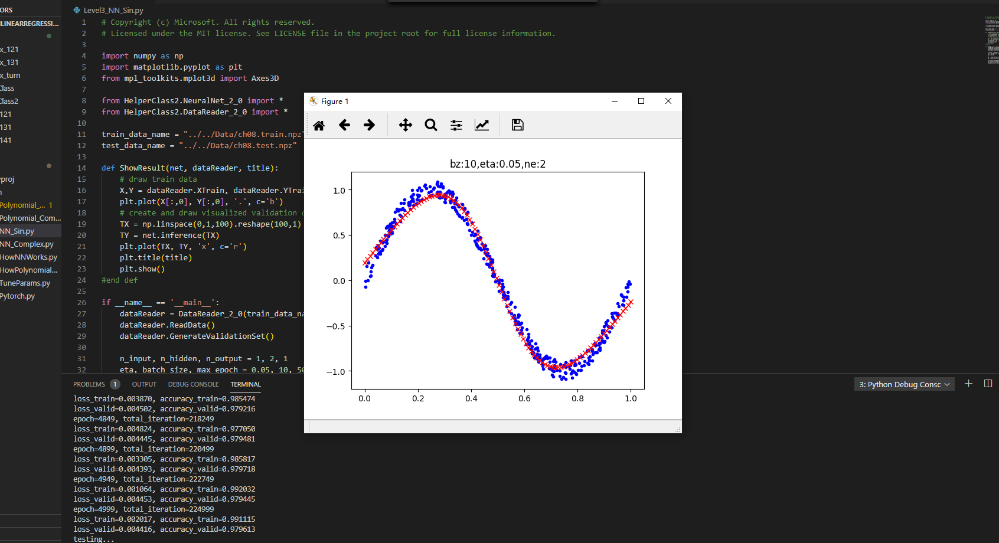
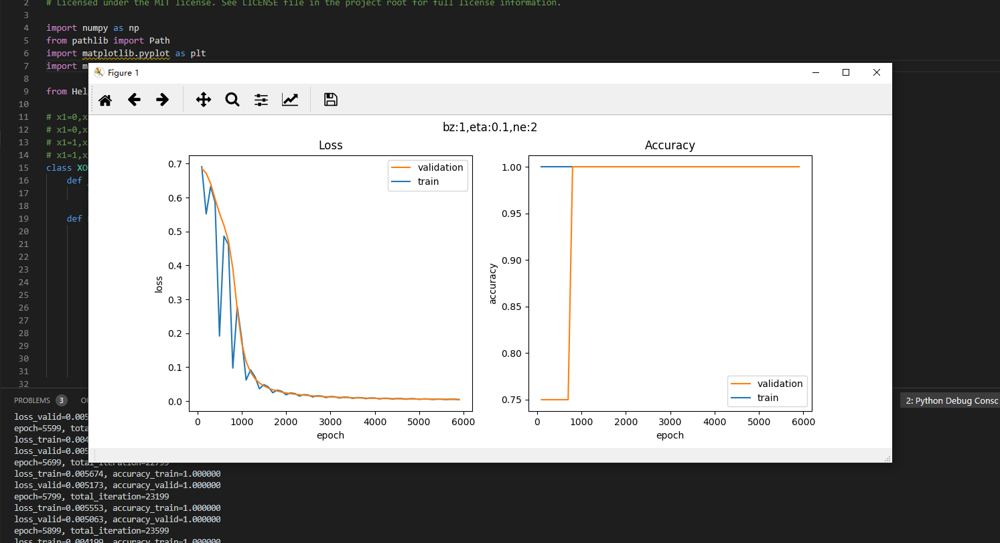

201809057  智能182  王世松  AIML课程报告

# <center>AIML课程报告

## **基于miniFramework的手写数字识别

#### 实验代码：
```

from matplotlib import pyplot as plt
import numpy as np
from PIL import Image

from HelperClass2.NeuralNet_3_0 import *

def ReadImage(img_file_name):
    img = Image.open(img_file_name)
    out1 = img.convert('L')
    out2 = out1.resize((28,28))
    a = np.array(out2)
    b = 255 - a
    x_max = np.max(b)
    x_min = np.min(b)
    X_NEW = (b - x_min)/(x_max-x_min)
    plt.cla()
    plt.imshow(X_NEW)
    plt.plot()
    return X_NEW.reshape(1,-1)

def Inference(img_array):
    output = net.inference(img_array)
    n = np.argmax(output)
    print("------recognize result is: -----", n)

def on_key_press(event):
    img_file_name = "handwriting.png"
    print(event.key)
    if event.key == 'enter':
        plt.axis('off')
        plt.savefig(img_file_name)
        plt.axis('on')
        img_array = ReadImage(img_file_name)
        Inference(img_array)
    elif event.key == 'backspace':
        plt.cla()
        plt.axis([0,1,0,1])
        ax.figure.canvas.draw()
    #end if

def on_mouse_press(event):
    global startx, starty, isdraw
    print(isdraw)
    isdraw = True
    startx = event.xdata
    starty = event.ydata
    print("press:{0},{1}", startx, starty)
    
def on_mouse_release(event):
    global isdraw, startx, starty
    print("release:", event.xdata, event.ydata, isdraw)
    isdraw = False

def on_mouse_move(event):
    global isdraw, startx, starty
    if isdraw:
        endx = event.xdata        
        endy = event.ydata        
        x1 = [startx, endx]
        y1 = [starty, endy]
        ax.plot(x1, y1, color='black', linestyle='-', linewidth='40')
        ax.figure.canvas.draw()
        startx = endx
        starty = endy
    # end if

def LoadNet():
    n_input = 784
    n_hidden1 = 64
    n_hidden2 = 16
    n_output = 10
    eta = 0.2
    eps = 0.01
    batch_size = 128
    max_epoch = 40

    hp = HyperParameters_3_0(
        n_input, n_hidden1, n_hidden2, n_output, 
        eta, max_epoch, batch_size, eps, 
        NetType.MultipleClassifier, 
        InitialMethod.Xavier)
    net = NeuralNet_3_0(hp, "MNIST_64_16")
    net.LoadResult()
    return net
   
if __name__ == "__main__":
    isdraw = False
    startx, starty = 0, 0

    print("need to run level3 first to get result")
    print("============================================================================")
    print("handwriting a digit, then press enter to recognize, press backspace to clear")
    print("resize the window to square, say, height == width")
    print("the handwriting should full fill the window")
    print("============================================================================")

    net = LoadNet()

    fig, ax = plt.subplots()
    fig.canvas.mpl_connect('key_press_event', on_key_press)
    fig.canvas.mpl_connect('button_release_event', on_mouse_release)
    fig.canvas.mpl_connect('button_press_event', on_mouse_press)
    fig.canvas.mpl_connect('motion_notify_event', on_mouse_move)
    
    plt.axis([0,1,0,1])
    plt.show()

```

#### <center>实验结果


<center>图1 手写数字0识别</center>


<center>图1 手写数字3识别</center>


<center>图1 手写数字7识别</center>


##  第一章学习总结

### 1.1 神经网络的基本工作原理

神经网络由基本的神经元组成，

#### 输入 input

$(x_1,x_2,x_3)$ 是外界输入信号，一般是一个训练数据样本的多个属性。

#### 权重 weights

$(w_1,w_2,w_3)$ 是每个输入信号的权重值。当然权重值相加之后可以不是 $1$。

#### 求和计算 sum

$$
\begin{aligned}
Z &= w_1 \cdot x_1 + w_2 \cdot x_2 + w_3 \cdot x_3 + b \\\\
&= \sum_{i=1}^m(w_i \cdot x_i) + b
\end{aligned}
$$

在上面的例子中 $m=3$。我们把$w_i \cdot x_i$变成矩阵运算的话，就变成了：

$$Z = W \cdot X + b$$


#### 小结

- 一个神经元可以有多个输入。
- 一个神经元只能有一个输出，这个输出可以同时输入给多个神经元。
- 一个神经元的 $w$ 的数量和输入的数量一致。
- 一个神经元只有一个 $b$。
- $w$ 和 $b$ 有人为的初始值，在训练过程中被不断修改。
- $A$ 可以等于 $Z$，即激活函数不是必须有的。
- 一层神经网络中的所有神经元的激活函数必须一致。

#### 1.2 神经网络的训练过程

#### 步骤


1. 随机初始化权重矩阵，可以根据正态分布等来初始化。
2. 拿一个或一批数据作为输入，带入权重矩阵中计算，再通过激活函数传入下一层，最终得到预测值。在本例中，我们先用Id-1的数据输入到矩阵中，得到一个 $A$ 值，假设 $A=5$；
3. 拿到Id-1样本的真实值 $Y=3$；
4. 计算损失，假设用均方差函数 $Loss = (A-Y)^2=(5-3)^2=4$；
5. 根据一些神奇的数学公式（反向微分），把 $Loss=4$ 这个值用大喇叭喊话，告诉在前面计算的步骤中，影响 $A=5$ 这个值的每一个权重矩阵，然后对这些权重矩阵中的值做一个微小的修改（当然是向着好的方向修改，这一点可以用数学家的名誉来保证）；
6. 用Id-2样本作为输入再次训练（Go to 2）；
7. 这样不断地迭代下去，直到以下一个或几个条件满足就停止训练：损失函数值非常小；准确度满足了要求；迭代到了指定的次数。

训练完成后，我们会把这个神经网络中的结构和权重矩阵的值导出来，形成一个计算图（就是矩阵运算加上激活函数）模型，然后嵌入到任何可以识别/调用这个模型的应用程序中，根据输入的值进行运算，输出预测值。


### 1.4 神经网络中的三个基本概念

#### 反向传播

##### 求 $w$ 的偏导

目前 $z=162$，如果想让 $z$ 变小一些，比如目标是 $z=150$，$w$ 应该如何变化呢？为了简化问题，先只考虑改变 $w$ 的值，而令 $b$ 值固定为 $4$。

如果想解决这个问题，最笨的办法是可以在输入端一点一点的试，把 $w$ 变成 $3.5$ 试试，再变成 $3$ 试试......直到满意为止。现在我们将要学习一个更好的解决办法：反向传播。

从 $z$ 开始一层一层向回看，图中各节点关于变量 $w$ 的偏导计算结果如下：

因为 $$z = x \cdot y$$，其中 $$x = 2w + 3b, y = 2b + 1$$

所以：

$$\frac{\partial{z}}{\partial{w}}=\frac{\partial{z}}{\partial{x}} \cdot \frac{\partial{x}}{\partial{w}}=y \cdot 2=18 \tag{4}$$

其中：

$$\frac{\partial{z}}{\partial{x}}=\frac{\partial{}}{\partial{x}}(x \cdot y)=y=9$$

$$\frac{\partial{x}}{\partial{w}}=\frac{\partial{}}{\partial{w}}(2w+3b)=2$$


图2-6 对 $w$ 的偏导求解过程

图2-6其实就是链式法则的具体表现，$z$ 的误差通过中间的 $x$ 传递到 $w$。如果不是用链式法则，而是直接用 $z$ 的表达式计算对 $w$ 的偏导数，会怎么样呢？我们来试验一下。

根据公式1、2、3，我们有：

$$z=x \cdot y=(2w+3b)(2b+1)=4wb+2w+6b^2+3b \tag{5}$$

对上式求 $w$ 的偏导：

$$
\frac{\partial z}{\partial w}=4b+2=4 \cdot 4 + 2=18 \tag{6}
$$

公式4和公式6的结果完全一致！所以，请大家相信链式法则的科学性。

##### 求 $w$ 的具体变化值

公式4和公式6的含义是：当 $w$ 变化一点点时，$z$ 会产生 $w$ 的变化值18倍的变化。记住我们的目标是让 $z=150$，目前在初始状态时是 $z=162$，所以，问题转化为：当需要 $z$ 从 $162$ 变到 $150$ 时，$w$ 需要变化多少？

既然：

$$
\Delta z = 18 \cdot \Delta w
$$

则：

$$
\Delta w = {\Delta z \over 18}=\frac{162-150}{18}= 0.6667
$$

所以：

$$w = w - 0.6667=2.3333$$
$$x=2w+3b=16.6667$$
$$z=x \cdot y=16.6667 \times 9=150.0003$$

我们一下子就成功地让 $z$ 值变成了 $150.0003$，与 $150$ 的目标非常地接近，这就是偏导数的威力所在。


#### 2.1 梯度下降

梯度下降的三要素：
> 1、当前点；

> 2、方向；

> 3、步长； 

梯度下降包含两层含义：
> 1、梯度：函数当前位置的最快上升点；

> 2、下降：与导数相反的方向，用数学语言描述就是那个减号；

### 2.2 单变量函数的梯度下降

假设一个单变量函数：

$$J(x) = x ^2$$

我们的目的是找到该函数的最小值，于是计算其微分：

$$J'(x) = 2x$$

假设初始位置为：

$$x_0=1.2$$

假设学习率：

$$\eta = 0.3$$

根据公式(1)，迭代公式：

$$x_{n+1} = x_{n} - \eta \cdot \nabla J(x)= x_{n} - \eta \cdot 2x$$

假设终止条件为 $J(x)<0.01$，迭代过程是：
```
x=0.480000, y=0.230400
x=0.192000, y=0.036864
x=0.076800, y=0.005898
x=0.030720, y=0.000944
```

上面的过程如图2-10所示。


图2-10 使用梯度下降法迭代的过程

### 2.3 双变量的梯度下降

假设一个双变量函数：

$$J(x,y) = x^2 + \sin^2(y)$$

我们的目的是找到该函数的最小值，于是计算其微分：

$${\partial{J(x,y)} \over \partial{x}} = 2x$$
$${\partial{J(x,y)} \over \partial{y}} = 2 \sin y \cos y$$

假设初始位置为：

$$(x_0,y_0)=(3,1)$$

假设学习率：

$$\eta = 0.1$$

根据公式(1)，迭代过程是的计算公式：
$$(x_{n+1},y_{n+1}) = (x_n,y_n) - \eta \cdot \nabla J(x,y)$$
$$ = (x_n,y_n) - \eta \cdot (2x,2 \cdot \sin y \cdot \cos y) \tag{1}$$

根据公式(1)，假设终止条件为 $J(x,y)<0.01$，迭代过程如表2-3所示。

表2-3 双变量梯度下降的迭代过程

|迭代次数|x|y|J(x,y)|
|---|---|---|---|
|1|3|1|9.708073|
|2|2.4|0.909070|6.382415|
|...|...|...|...|
|15|0.105553|0.063481|0.015166|
|16|0.084442|0.050819|0.009711|

迭代16次后，$J(x,y)$ 的值为 $0.009711$，满足小于 $0.01$ 的条件，停止迭代。

上面的过程如表2-4所示，由于是双变量，所以需要用三维图来解释。请注意看两张图中间那条隐隐的黑色线，表示梯度下降的过程，从红色的高地一直沿着坡度向下走，直到蓝色的洼地。

表2-4 在三维空间内的梯度下降过程

|观察角度1|观察角度2|
|--|--|
|||

### 2.4 学习率η的选择

在公式表达时，学习率被表示为$\eta$。在代码里，我们把学习率定义为`learning_rate`，或者`eta`。针对上面的例子，试验不同的学习率对迭代情况的影响，如表2-5所示。

表2-5 不同学习率对迭代情况的影响

|学习率|迭代路线图|说明|
|---|---|---|
|1.0||学习率太大，迭代的情况很糟糕，在一条水平线上跳来跳去，永远也不能下降。|
|0.8||学习率大，会有这种左右跳跃的情况发生，这不利于神经网络的训练。|
|0.4||学习率合适，损失值会从单侧下降，4步以后基本接近了理想值。|
|0.1||学习率较小，损失值会从单侧下降，但下降速度非常慢，10步了还没有到达理想状态。

#### 损失函数

> “损失”就是所有样本的“误差”的总和，亦即（$m$ 为样本数）：
> $$损失 = \sum^m_{i=1}误差_i$$
> $$J = \sum_{i=1}^m loss_i$$

>损失函数的作用：损失函数的作用，就是计算神经网络每次迭代的前向计算结果与真实值的差距，从而指导下一步的训练向正确的方向进行。

使用损失函数的步骤：

> 1. 用随机值初始化前向计算公式的参数；

> 2. 代入样本，计算输出的预测值；

> 3. 用损失函数计算预测值和标签值（真实值）的误差；

> 4. 根据损失函数的导数，沿梯度最小方向将误差回传，修正前向计算公式中的各个权重值；

> 5. 进入第2步重复, 直到损失函数值达到一个满意的值就停止迭代。

##### 均方差函数


均方差函数常用于线性回归(linear regression)，即函数拟合(function fitting)。公式如下：

$$
loss = {1 \over 2}(z-y)^2 \tag{单样本}
$$

$$
J=\frac{1}{2m} \sum_{i=1}^m (z_i-y_i)^2 \tag{多样本}
$$


##### 交叉熵损失函数

交叉熵（Cross Entropy）是Shannon信息论中一个重要概念，主要用于度量两个概率分布间的差异性信息。在信息论中，交叉熵是表示两个概率分布 $p,q$ 的差异，其中 $p$ 表示真实分布，$q$ 表示预测分布，那么 $H(p,q)$ 就称为交叉熵：

$$H(p,q)=\sum_i p_i \cdot \ln {1 \over q_i} = - \sum_i p_i \ln q_i \tag{1}$$


**交叉熵函数常用于逻辑回归(logistic regression)，也就是分类(classification)。**


## <center>实验代码测试结果

### Level1_BP_Linear.py

> 代码运行截图


### Level2_BP_NoneLinear>py

> 代码运行截图

> 代码运行截图

> 代码运行截图


### Level3_GDSingleVariable.py

> 代码运行截图


### Level4_GDDoubleVariable.py

> 代码运行截图


### Level5_LearningRate.py

> 代码运行截图


> 代码运行截图


> 代码运行截图


> 代码运行截图


> 代码运行截图


> 代码运行截图


> 代码运行截图


### <center>第一节学习心得
通过本章节的学习，我学到了神经网络的基本概念。对神经网络及其基本运算有了初步的了解。希望在后续的课程中能有更深入、具体的学习内容。


---
# <center>第二节学习报告

## 第二步  线性回归

回归的定义：给出一个点集D，用一个函数去拟合这个点集，并且使得点集与拟合函数间的误差最小，如果这个函数曲线是一条直线，那就被称为线性回归，如果曲线是一条二次曲线，就被称为二次回归。

### 用几种方法来解决问题：

1. 最小二乘法；
2. 梯度下降法；
3. 简单的神经网络法；
4. 更通用的神经网络算法。

## 1.最小二乘法

$$z_i=w \cdot x_i+b \tag{1}$$

使得：

$$z_i \simeq y_i \tag{2}$$

其中，$x_i$ 是样本特征值，$y_i$ 是样本标签值，$z_i$ 是模型预测值。

如何学得 $w$ 和 $b$ 呢？均方差(MSE - mean squared error)是回归任务中常用的手段：
$$
J = \frac{1}{2m}\sum_{i=1}^m(z_i-y_i)^2 = \frac{1}{2m}\sum_{i=1}^m(y_i-wx_i-b)^2 \tag{3}
$$

$J$ 称为损失函数。实际上就是试图找到一条直线，使所有样本到直线上的残差的平方和最小。


图4-3 均方差函数的评估原理

## 2.梯度下降法

代码实现

```Python
if __name__ == '__main__':

    reader = SimpleDataReader()
    reader.ReadData()
    X,Y = reader.GetWholeTrainSamples()

    eta = 0.1
    w, b = 0.0, 0.0
    for i in range(reader.num_train):
        # get x and y value for one sample
        xi = X[i]
        yi = Y[i]
        # 公式1
        zi = xi * w + b
        # 公式3
        dz = zi - yi
        # 公式4
        dw = dz * xi
        # 公式5
        db = dz
        # update w,b
        w = w - eta * dw
        b = b - eta * db

    print("w=", w)    
    print("b=", b)
```

## 3.神经网络法 
#### 主程序

```Python
if __name__ == '__main__':
    # read data
    sdr = SimpleDataReader()
    sdr.ReadData()
    # create net
    eta = 0.1
    net = NeuralNet(eta)
    net.train(sdr)
    # result
    print("w=%f,b=%f" %(net.w, net.b))
    # predication
    result = net.inference(0.346)
    print("result=", result)
    ShowResult(net, sdr)
```


## 梯度下降的三种形式：
- 1.单样本随机梯度下降（SGD）
  
  特点：每次使用一个样本数据进行一次训练，更新一次梯度，重复以上过程。
  优点：训练开始时损失值下降很快，随机性大，找到最优解的可能性大。
  缺点：受单个样本的影响最大，损失函数值波动大，到后期徘徊不前，在最优解附近震荡。不能并行计算。

- 2.小批量样本梯度下降（MBGD）
  
  特点：选择一小部分样本进行训练，更新一次梯度，然后再选取另外一小部分样本进行训练，再更新一次梯度。
  优点：不受单样本噪声影响，训练速度较快。
  缺点：batch size的数值选择很关键，会影响训练结果。

- 3.全批量样本梯度下降（BGD）
  特点：每次使用全部数据集进行一次训练，更新一次梯度，重复以上过程。
  优点：受单个样本的影响最小，一次计算全体样本速度快，损失函数值没有波动，到达最优点平稳。方便并行计算。
  缺点：数据量较大时不能实现（内存限制），训练过程变慢。初始值不同，可能导致获得局部最优解，并非全局最优解。

### 三种方式比较
1、批量梯度下降（BGD）每次更新使用了所有的训练数据，最小化损失函数，如果只有一个极小值，那么批量梯度下降是考虑了训练集所有的数据，是朝着最小值迭代运动的，但是缺点是如果样本值很大的话，更新速度会很慢。
2、随机梯度下降（SGD）在每次更新的时候，只考虑一个样本点，这样会大大加快训练数据，也恰好是批量梯度下降的缺点，但是有可能由于训练数据的噪声点较多，那么每一次利用噪声点进行更新的过程中，就不一定是朝着极小值方向更新，但是由于更新多轮，整体方向还是朝着极小值方向更新，又提高了速度。
3、小批量梯度下降（MBGD）是为了解决批量梯度下降的训练速度慢，以及随机梯度下降法的准确性综合而来，但是这里注意，不同问题的batch是不一样的，要通过实验结果来进行超参数的调整。


## 多变量线性回归
定义：
h0(x) = L0+L1x1+l2x2+......lnxn
其中，n = 特征数目；

x j  = 每个训练样本第j个特征的值，可以认为是特征向量中的第j个值。

### 正规方程法 Normal Equations
```Python
if __name__ == '__main__':
    reader = SimpleDataReader()
    reader.ReadData()
    X,Y = reader.GetWholeTrainSamples()
    num_example = X.shape[0]
    one = np.ones((num_example,1))
    x = np.column_stack((one, (X[0:num_example,:])))
    a = np.dot(x.T, x)
    # need to convert to matrix, because np.linalg.inv only works on matrix instead of array
    b = np.asmatrix(a)
    c = np.linalg.inv(b)
    d = np.dot(c, x.T)
    e = np.dot(d, Y)
    #print(e)
    b=e[0,0]
    w1=e[1,0]
    w2=e[2,0]
    print("w1=", w1)
    print("w2=", w2)
    print("b=", b)
    # inference
    z = w1 * 15 + w2 * 93 + b
    print("z=",z)
```

#### 运行结果

```
w1= -2.0184092853092226
w2= 5.055333475112755
b= 46.235258613837644
z= 486.1051325196855
```

### 神经网络法
```Python
class NeuralNet(object):
    def __init__(self, params):
        self.params = params
        self.W = np.zeros((self.params.input_size, self.params.output_size))
        self.B = np.zeros((1, self.params.output_size))
```

#### 正向计算的代码

```Python
class NeuralNet(object):
    def __forwardBatch(self, batch_x):
        Z = np.dot(batch_x, self.W) + self.B
        return Z
```

#### 误差反向传播的代码

```Python
class NeuralNet(object):
    def __backwardBatch(self, batch_x, batch_y, batch_z):
        m = batch_x.shape[0]
        dZ = batch_z - batch_y
        dB = dZ.sum(axis=0, keepdims=True)/m
        dW = np.dot(batch_x.T, dZ)/m
        return dW, dB
```


## 第三章课程笔记
###   线性分类


分类问题又可以称为逻辑回归，Logistic Regression。

###  线性二分类

#### 输入层

输入经度 $x_1$ 和纬度 $x_2$ 两个特征：

$$
X=\begin{pmatrix}
x_{1} & x_{2}
\end{pmatrix}
$$

#### 权重矩阵

输入是2个特征，输出一个数，则 $W$ 的尺寸就是 $2\times 1$：

$$
W=\begin{pmatrix}
w_{1} \\\\ w_{2}
\end{pmatrix}
$$

$B$ 的尺寸是 $1\times 1$，行数永远是1，列数永远和 $W$ 一样。

$$
B=\begin{pmatrix}
b
\end{pmatrix}
$$

#### 输出层

$$
\begin{aligned}    
z &= X \cdot W + B
=\begin{pmatrix}
    x_1 & x_2
\end{pmatrix}
\begin{pmatrix}
    w_1 \\\\ w_2
\end{pmatrix} + b \\\\
&=x_1 \cdot w_1 + x_2 \cdot w_2 + b 
\end{aligned}
\tag{1}
$$
$$a = Logistic(z) \tag{2}$$

#### 损失函数

二分类交叉熵损失函数：

$$
loss(W,B) = -[y\ln a+(1-y)\ln(1-a)] \tag{3}
$$


### 代码实现
```Python
class HyperParameters(object):
    def __init__(self, eta=0.1, max_epoch=1000, batch_size=5, eps=0.1, net_type=NetType.Fitting):
        self.eta = eta
        self.max_epoch = max_epoch
        self.batch_size = batch_size
        self.eps = eps
        self.net_type = net_type
```
再增加一个`Logistic`分类函数：

```Python
class Logistic(object):
    def forward(self, z):
        a = 1.0 / (1.0 + np.exp(-z))
        return a
```

以前只有均方差函数，现在我们增加了交叉熵函数，所以新建一个类便于管理：

```Python
class LossFunction(object):
    def __init__(self, net_type):
        self.net_type = net_type
    # end def

    def MSE(self, A, Y, count):
        ...

    # for binary classifier
    def CE2(self, A, Y, count):
        ...
```
```Python
class NeuralNet(object):
    def __init__(self, params, input_size, output_size):
        self.params = params
        self.W = np.zeros((input_size, output_size))
        self.B = np.zeros((1, output_size))

    def __forwardBatch(self, batch_x):
        Z = np.dot(batch_x, self.W) + self.B
        if self.params.net_type == NetType.BinaryClassifier:
            A = Sigmoid().forward(Z)
            return A
        else:
            return Z
```

最后是主过程：

```Python
if __name__ == '__main__':
    ......
    params = HyperParameters(eta=0.1, max_epoch=100, batch_size=10, eps=1e-3, net_type=NetType.BinaryClassifier)
    ......
```
##  实现逻辑与或非门
###  实现逻辑非门
表6-6 逻辑非问题的样本数据

|样本序号|样本值$x$|标签值$y$|
|:---:|:---:|:---:|
|1|0|1|
|2|1|0|

建立样本数据的代码如下：

```Python
    def Read_Logic_NOT_Data(self):
        X = np.array([0,1]).reshape(2,1)
        Y = np.array([1,0]).reshape(2,1)
        self.XTrain = self.XRaw = X
        self.YTrain = self.YRaw = Y
        self.num_train = self.XRaw.shape[0]
```

### 实现逻辑与或门
#### 训练样本

每个类型的逻辑门都只有4个训练样本，如表6-7所示。

表6-7 四种逻辑门的样本和标签数据

|样本|$x_1$|$x_2$|逻辑与$y$|逻辑与非$y$|逻辑或$y$|逻辑或非$y$|
|:---:|:--:|:--:|:--:|:--:|:--:|:--:|
|1|0|0|0|1|0|1|
|2|0|1|0|1|1|0|
|3|1|0|0|1|1|0|
|4|1|1|1|0|1|0|

#### 读取数据
  
```Python
class LogicDataReader(SimpleDataReader):
    def Read_Logic_AND_Data(self):
        X = np.array([0,0,0,1,1,0,1,1]).reshape(4,2)
        Y = np.array([0,0,0,1]).reshape(4,1)
        self.XTrain = self.XRaw = X
        self.YTrain = self.YRaw = Y
        self.num_train = self.XRaw.shape[0]

    def Read_Logic_NAND_Data(self):
        ......

    def Read_Logic_OR_Data(self):
        ......

    def Read_Logic_NOR_Data(self):        
        ......
```

以逻辑AND为例，我们从`SimpleDataReader`派生出自己的类`LogicDataReader`，并加入特定的数据读取方法`Read_Logic_AND_Data()`，其它几个逻辑门的方法类似，在此只列出方法名称。

#### 测试函数

```Python
def Test(net, reader):
    X,Y = reader.GetWholeTrainSamples()
    A = net.inference(X)
    print(A)
    diff = np.abs(A-Y)
    result = np.where(diff < 1e-2, True, False)
    if result.sum() == 4:
        return True
    else:
        return False
```

我们知道了神经网络只能给出近似解，但是这个“近似”能到什么程度，是需要我们在训练时自己指定的。相应地，我们要有测试手段，比如当输入为 $(1，1)$ 时，AND的结果是$1$，但是神经网络只能给出一个 $0.721$ 的概率值，这是不满足精度要求的，必须让4个样本的误差都小于`1e-2`。

#### 训练函数

```Python
def train(reader, title):
    ...
    params = HyperParameters(eta=0.5, max_epoch=10000, batch_size=1, eps=2e-3, net_type=NetType.BinaryClassifier)
    num_input = 2
    num_output = 1
    net = NeuralNet(params, num_input, num_output)
    net.train(reader, checkpoint=1)
    # test
    print(Test(net, reader))
    ......
```


###  多分类函数定义 - Softmax
### 7.1.2 正向传播

#### 矩阵运算

$$
z=x \cdot w + b \tag{1}
$$

#### 分类计算

$$
a_j = \frac{e^{z_j}}{\sum\limits_{i=1}^m e^{z_i}}=\frac{e^{z_j}}{e^{z_1}+e^{z_2}+\dots+e^{z_m}} \tag{2}
$$

#### 损失函数计算

计算单样本时，m是分类数：
$$
loss(w,b)=-\sum_{i=1}^m y_i \ln a_i \tag{3}
$$

计算多样本时，m是分类数，n是样本数：
$$J(w,b) =- \sum_{j=1}^n \sum_{i=1}^m y_{ij} \log a_{ij} \tag{4}$$

如图7-6示意。


图7-6 Softmax在神经网络结构中的示意图


## <center>公式推导


### 总结

总结困难及解决办法：

1. 样本不做标准化的话，网络发散，训练无法进行；
2. 训练样本标准化后，网络训练可以得到结果，但是预测结果有问题；
3. 还原参数值后，预测结果正确，但是此还原方法并不能普遍适用；
4. 标准化测试样本，而不需要还原参数值，可以保证普遍适用；
5. 标准化标签值，可以使得网络训练收敛快，但是在预测时需要把结果反标准化，以便得到真实值。
---
# Step4&5 

# 第四章  非线性回归

## 8.0 激活函数

### 8.1.1 Logistic函数

对数几率函数（Logistic Function，简称对率函数）。

#### 公式

$$Sigmoid(z) = \frac{1}{1 + e^{-z}} \rightarrow a \tag{1}$$

#### 导数

$$Sigmoid'(z) = a(1 - a) \tag{2}$$


#### 值域

- 输入值域：$(-\infty, \infty)$
- 输出值域：$(0,1)$
- 导数值域：$(0,0.25]$

#### 函数图像


图8-3 Sigmoid函数图像

### 8.1.2 Tanh函数

TanHyperbolic，即双曲正切函数。

#### 公式  
$$Tanh(z) = \frac{e^{z} - e^{-z}}{e^{z} + e^{-z}} = (\frac{2}{1 + e^{-2z}}-1) \rightarrow a \tag{3}$$
即
$$Tanh(z) = 2 \cdot Sigmoid(2z) - 1 \tag{4}$$

#### 导数公式

$$Tanh'(z) = (1 + a)(1 - a)$$

利用基本导数公式23，令：$u={e^{z}-e^{-z}}，v=e^{z}+e^{-z}$ 则有：

$$
\begin{aligned}
Tanh'(z)&=\frac{u'v-v'u}{v^2} \\\\
&=\frac{(e^{z}-e^{-z})'(e^{z}+e^{-z})-(e^{z}+e^{-z})'(e^{z}-e^{-z})}{(e^{z}+e^{-z})^2} \\\\
&=\frac{(e^{z}+e^{-z})(e^{z}+e^{-z})-(e^{z}-e^{-z})(e^{z}-e^ {-z})}{(e^{z}+e^{-z})^2} \\\\
&=\frac{(e^{z}+e^{-z})^2-(e^{z}-e^{-z})^2}{(e^{z}+e^{-z})^2} \\\\
&=1-(\frac{(e^{z}-e^{-z}}{e^{z}+e^{-z}})^2=1-a^2
\end{aligned}
$$

#### 值域

- 输入值域：$(-\infty,\infty)$
- 输出值域：$(-1,1)$
- 导数值域：$(0,1)$


#### 函数图像

图8-4是双曲正切的函数图像。


图8-4 双曲正切函数图像

## 8.2 半线性激活函数（非饱和型激活函数）

### 8.2.1 ReLU函数 

Rectified Linear Unit，修正线性单元，线性整流函数，又称斜坡函数。

#### 公式

$$ReLU(z) = max(0,z) = \begin{cases} 
  z, & z \geq 0 \\\\ 
  0, & z < 0 
\end{cases}$$

#### 导数

$$ReLU'(z) = \begin{cases} 1 & z \geq 0 \\\\ 0 & z < 0 \end{cases}$$

#### 值域

- 输入值域：$(-\infty, \infty)$
- 输出值域：$(0,\infty)$
- 导数值域：$\\{0,1\\}$


图8-6 线性整流函数ReLU

### 8.2.2 Leaky ReLU函数

LReLU，带泄露的线性整流函数。

#### 公式

$$LReLU(z) = \begin{cases} z & z \geq 0 \\\\ \alpha \cdot z & z < 0 \end{cases}$$

#### 导数

$$LReLU'(z) = \begin{cases} 1 & z \geq 0 \\\\ \alpha & z < 0 \end{cases}$$

#### 值域

输入值域：$(-\infty, \infty)$

输出值域：$(-\infty,\infty)$

导数值域：$\\{\alpha,1\\}$

#### 函数图像

函数图像如图8-7所示。


图8-7 LeakyReLU的函数图像

### 8.2.3 Softplus函数

#### 公式

$$Softplus(z) = \ln (1 + e^z)$$

#### 导数

$$Softplus'(z) = \frac{e^z}{1 + e^z}$$

#### 

输入值域：$(-\infty, \infty)$

输出值域：$(0,\infty)$

导数值域：$(0,1)$

#### 函数图像

Softplus的函数图像如图8-8所示。


图8-8 Softplus的函数图像

### 8.2.4 ELU函数

#### 公式

$$ELU(z) = \begin{cases} z & z \geq 0 \\ \alpha (e^z-1) & z < 0 \end{cases}$$

#### 导数

$$ELU'(z) = \begin{cases} 1 & z \geq 0 \\ \alpha e^z & z < 0 \end{cases}$$

#### 值域

输入值域：$(-\infty, \infty)$

输出值域：$(-\alpha,\infty)$

导数值域：$(0,1]$

#### 函数图像

ELU的函数图像如图8-9所示。


图8-9 ELU的函数图像

## 9.0 非线性回归
#### 平均绝对误差

MAE（Mean Abolute Error）。

$$MAE=\frac{1}{m} \sum_{i=1}^m \lvert a_i-y_i \rvert \tag{1}$$

对异常值不如均方差敏感，类似中位数。

#### 绝对平均值率误差

MAPE（Mean Absolute Percentage Error）。

$$MAPE=\frac{100}{m} \sum^m_{i=1} \left\lvert {a_i - y_i \over y_i} \right\rvert \tag{2}$$

#### 和方差

SSE（Sum Squared Error）。

$$SSE=\sum_{i=1}^m (a_i-y_i)^2 \tag{3}$$

得出的值与样本数量有关系。

#### 均方差

MSE（Mean Squared Error）。

$$MSE = \frac{1}{m} \sum_{i=1}^m (a_i-y_i)^2 \tag{4}$$

就是实际值减去预测值的平方再求期望，MSE越小，证明误差越小。

#### 均方根误差

RMSE（Root Mean Squard Error）。

$$RMSE = \sqrt{\frac{1}{m} \sum_{i=1}^m (a_i-y_i)^2} \tag{5}$$

是均方差开根号的结果，其实质是一样的，只不过对结果有更好的解释。

#### R平方

R-Squared。

$$R^2=1-\frac{\sum (a_i - y_i)^2}{\sum(\bar y_i-y_i)^2}=1-\frac{MSE(a,y)}{Var(y)} \tag{6}$$

R平方是多元回归中的回归平方和（分子）占总平方和（分母）的比例，它是度量多元回归方程中拟合程度的一个统计量。R平方值越接近1，表明回归平方和占总平方和的比例越大，回归线与各观测点越接近，回归的拟合程度就越好。

## 9.1 多项式回归法拟合正弦曲线

### 1. 多项式回归有几种形式：

#### 一元一次线性模型

$$z = x w + b \tag{1}$$

#### 多元一次多项式

$$z = x_1 w_1 + x_2 w_2 + ...+ x_m w_m + b \tag{2}$$

上式中的 $x_1,x_2,...,x_m$ 代表了m个特征值。

#### 一元多次多项式

$$z = x w_1 + x^2 w_2 + ... + x^m w_m + b \tag{3}$$

上式中x是原有的唯一特征值，$x^m$ 是利用 $x$ 的 $m$ 次方作为额外的特征值，这样就把特征值的数量从 $1$ 个变为 $m$ 个。

换一种表达形式，令：$x_1 = x,x_2=x^2,\ldots,x_m=x^m$，则：

$$z = x_1 w_1 + x_2 w_2 + ... + x_m w_m + b \tag{4}$$

#### 用二次多项式拟合

#### 数据增强

在`ch08.train.npz`中，读出来的`XTrain`数组，只包含1列x的原始值，根据公式5，我们需要再增加一列x的平方值，所以代码如下：

```Python
file_name = "../../data/ch08.train.npz"
class DataReaderEx(SimpleDataReader):
    def Add(self):
        X = self.XTrain[:,]**2
        self.XTrain = np.hstack((self.XTrain, X))
```

从`SimpleDataReader`类中派生出子类`DataReaderEx`，然后添加`Add()`方法，先计算`XTrain`第一列的平方值，放入矩阵X中，然后再把X合并到`XTrain`右侧，这样`XTrain`就变成了两列，第一列是x的原始值，第二列是x的平方值。

#### 主程序

在主程序中，先加载数据，做数据增强，然后建立一个net，参数`num_input=2`，对应着`XTrain`中的两列数据，相当于两个特征值，

```Python
if __name__ == '__main__':
    dataReader = DataReaderEx(file_name)
    dataReader.ReadData()
    dataReader.Add()
    # net
    num_input = 2
    num_output = 1
    params = HyperParameters(num_input, num_output, eta=0.2, max_epoch=10000, batch_size=10, eps=0.005, net_type=NetType.Fitting)
    net = NeuralNet(params)
    net.train(dataReader, checkpoint=10)
    ShowResult(net, dataReader, params.toString())
```

#### 运行结果

表9-4 二次多项式训练过程与结果

|损失函数值|拟合结果|
|---|---|
|||

从表9-4的损失函数曲线上看，没有任何损失值下降的趋势；再看拟合情况，只拟合成了一条直线。说明二次多项式不能满足要求。以下是最后几行的打印输出：

```
......
9989 49 0.09410913779071385
9999 49 0.09628814270449357
W= [[-1.72915813]
 [-0.16961507]]
B= [[0.98611283]]
```

### 9.1.3 用三次多项式拟合

三次多项式的公式：

$$z = x w_1 + x^2 w_2 + x^3 w_3 + b \tag{6}$$

在二次多项式的基础上，把训练数据的再增加一列x的三次方，作为一个新的特征。以下为数据增强代码：

```Python
class DataReaderEx(SimpleDataReader):
    def Add(self):
        X = self.XTrain[:,]**2
        self.XTrain = np.hstack((self.XTrain, X))
        X = self.XTrain[:,0:1]**3
        self.XTrain = np.hstack((self.XTrain, X))
```

修改主过程参数中的`num_input`值：

```Python
    num_input = 3
```

再次运行，得到表9-5所示的结果。

表9-5 三次多项式训练过程与结果

|损失函数值|拟合结果|
|---|---|
|||

以下为打印输出：

```
......
2369 49 0.0050611643902918856
2379 49 0.004949680631526745
W= [[ 10.49907256]
 [-31.06694195]
 [ 20.73039288]]
B= [[-0.07999603]]
```

可以观察到达到0.005的损失值，这个神经网络迭代了2379个`epoch`。

## 9.2 验证与测试

#### 训练集

Training Set，用于模型训练的数据样本。

#### 验证集

在神经网络中，验证数据集用于：

- 寻找最优的网络深度
- 决定反向传播算法的停止点
- 在神经网络中选择隐藏层神经元的数量

#### 测试集

Test Set，用来评估最终模型的泛化能力。但不能作为调参、选择特征等算法相关的选择的依据。

三者之间的关系如图9-5所示。


图9-5 训练集、验证集、测试集的关系


## 9.3 双层神经网络实现非线性回归

### 9.3.1 万能近似定理

万能近似定理(universal approximation theorem) $^{[1]}$，是深度学习最根本的理论依据。它证明了在给定网络具有足够多的隐藏单元的条件下，配备一个线性输出层和一个带有任何“挤压”性质的激活函数（如Sigmoid激活函数）的隐藏层的前馈神经网络，能够以任何想要的误差量近似任何从一个有限维度的空间映射到另一个有限维度空间的Borel可测的函数。


## 9.5 曲线拟合


### 9.5.1 正弦曲线的拟合

#### 隐层只有一个神经元的情况

令`n_hidden=1`，并指定模型名称为`sin_111`，训练过程见图9-10。图9-11为拟合效果图。


图9-10 训练过程中损失函数值和准确率的变化


图9-11 一个神经元的拟合效果

从图9-10可以看到，损失值到0.04附近就很难下降了。图9-11中，可以看到只有中间线性部分拟合了，两端的曲线部分没有拟合。

```
......
epoch=4999, total_iteration=224999
loss_train=0.015787, accuracy_train=0.943360
loss_valid=0.038609, accuracy_valid=0.821760
testing...
0.8575700023301912
```

打印输出最后的测试集精度值为85.7%，不是很理想。所以隐层1个神经元是基本不能工作的，这只比单层神经网络的线性拟合强一些，距离目标还差很远。


# 第五步  非线性分类


### 10.2.1 定义神经网络结构

首先定义可以完成非线性二分类的神经网络结构图，如图10-6所示。


图10-6 非线性二分类神经网络结构图

- 输入层两个特征值$x_1,x_2$
  $$
  X=\begin{pmatrix}
    x_1 & x_2
  \end{pmatrix}
  $$
- 隐层$2\times 2$的权重矩阵$W1$
$$
  W1=\begin{pmatrix}
    w1_{11} & w1_{12} \\\\
    w1_{21} & w1_{22} 
  \end{pmatrix}
$$
- 隐层$1\times 2$的偏移矩阵$B1$

$$
  B1=\begin{pmatrix}
    b1_{1} & b1_{2}
  \end{pmatrix}
$$

- 隐层由两个神经元构成
$$
Z1=\begin{pmatrix}
  z1_{1} & z1_{2}
\end{pmatrix}
$$
$$
A1=\begin{pmatrix}
  a1_{1} & a1_{2}
\end{pmatrix}
$$
- 输出层$2\times 1$的权重矩阵$W2$
$$
  W2=\begin{pmatrix}
    w2_{11} \\\\
    w2_{21}  
  \end{pmatrix}
$$

- 输出层$1\times 1$的偏移矩阵$B2$

$$
  B2=\begin{pmatrix}
    b2_{1}
  \end{pmatrix}
$$

- 输出层有一个神经元使用Logistic函数进行分类
$$
  Z2=\begin{pmatrix}
    z2_{1}
  \end{pmatrix}
$$
$$
  A2=\begin{pmatrix}
    a2_{1}
  \end{pmatrix}
$$


### 10.2.2 前向计算

根据网络结构，我们有了前向计算过程图10-8。


图10-8 前向计算过程

#### 第一层

- 线性计算

$$
z1_{1} = x_{1} w1_{11} + x_{2} w1_{21} + b1_{1}
$$
$$
z1_{2} = x_{1} w1_{12} + x_{2} w1_{22} + b1_{2}
$$
$$
Z1 = X \cdot W1 + B1
$$

- 激活函数

$$
a1_{1} = Sigmoid(z1_{1})
$$
$$
a1_{2} = Sigmoid(z1_{2})
$$
$$
A1=\begin{pmatrix}
  a1_{1} & a1_{2}
\end{pmatrix}=Sigmoid(Z1)
$$

#### 第二层

- 线性计算

$$
z2_1 = a1_{1} w2_{11} + a1_{2} w2_{21} + b2_{1}
$$
$$
Z2 = A1 \cdot W2 + B2
$$

- 分类函数

$$a2_1 = Logistic(z2_1)$$
$$A2 = Logistic(Z2)$$

#### 损失函数

我们把异或问题归类成二分类问题，所以使用二分类交叉熵损失函数：

$$
loss = -Y \ln A2 + (1-Y) \ln (1-A2) \tag{12}
$$

在二分类问题中，$Y,A2$都是一个单一的数值，而非矩阵，但是为了前后统一，我们可以把它们看作是一个$1\times 1$的矩阵。

### 10.2.3 反向传播

图10-9展示了反向传播的过程。


图10-9 反向传播过程


## 10.5 实现双弧形二分类

### 10.5.1 代码实现

#### 主过程代码

```Python
if __name__ == '__main__':
    ......
    n_input = dataReader.num_feature
    n_hidden = 2
    n_output = 1
    eta, batch_size, max_epoch = 0.1, 5, 10000
    eps = 0.08

    hp = HyperParameters2(n_input, n_hidden, n_output, eta, max_epoch, batch_size, eps, NetType.BinaryClassifier, InitialMethod.Xavier)
    net = NeuralNet2(hp, "Arc_221")
    net.train(dataReader, 5, True)
    net.ShowTrainingTrace()
```

### 10.5.2 运行结果

经过快速的迭代，训练完毕后，会显示损失函数曲线和准确率曲线如图10-15。


图10-15 训练过程中的损失函数值和准确率值的变化


## 12.1 三层神经网络的实现

### 12.1.1 定义神经网络

设计一个三层神经网络结构，如图12-2所示。


图12-2 三层神经网络结构


## 12.2 梯度检查

#### 泰勒公式

泰勒公式是将一个在$x=x_0$处具有n阶导数的函数$f(x)$利用关于$(x-x_0)$的n次多项式来逼近函数的方法。若函数$f(x)$在包含$x_0$的某个闭区间$[a,b]$上具有n阶导数，且在开区间$(a,b)$上具有$n+1$阶导数，则对闭区间$[a,b]$上任意一点$x$，下式成立：

$$f(x)=\frac{f(x_0)}{0!} + \frac{f'(x_0)}{1!}(x-x_0)+\frac{f''(x_0)}{2!}(x-x_0)^2 + ...+\frac{f^{(n)}(x_0)}{n!}(x-x_0)^n+R_n(x) \tag{3}$$

其中,$f^{(n)}(x)$表示$f(x)$的$n$阶导数，等号后的多项式称为函数$f(x)$在$x_0$处的泰勒展开式，剩余的$R_n(x)$是泰勒公式的余项，是$(x-x_0)^n$的高阶无穷小。 

利用泰勒展开公式，令$x=\theta + h, x_0=\theta$，可以得到：

$$f(\theta + h)=f(\theta) + f'(\theta)h + O(h^2) \tag{4}$$


## 推导公式


---

# 深度神经网络 


## 1.搭建深度神经网络平台

前向计算：
```Python
def forward3(X, dict_Param):
    ...
    # layer 1
    Z1 = np.dot(W1,X) + B1
    A1 = Sigmoid(Z1)
    # layer 2
    Z2 = np.dot(W2,A1) + B2
    A2 = Tanh(Z2)
    # layer 3
    Z3 = np.dot(W3,A2) + B3
    A3 = Softmax(Z3)
    ...    
```

反向传播：

```Python
def backward3(dict_Param,cache,X,Y):
    ...
    # layer 3
    dZ3= A3 - Y
    dW3 = np.dot(dZ3, A2.T)
    dB3 = np.sum(dZ3, axis=1, keepdims=True)
    # layer 2
    dZ2 = np.dot(W3.T, dZ3) * (1-A2*A2) # tanh
    dW2 = np.dot(dZ2, A1.T)
    dB2 = np.sum(dZ2, axis=1, keepdims=True)
    # layer 1
    dZ1 = np.dot(W2.T, dZ2) * A1 * (1-A1)   #sigmoid
    dW1 = np.dot(dZ1, X.T)
    dB1 = np.sum(dZ1, axis=1, keepdims=True)
    ...
```
每一层的模式也非常相近：计算本层的`dZ`，再根据`dZ`计算`dW`和`dB`。


---
# <center> 网络优化 </center>


## 梯度下降算法

输入和参数

- $\eta$ - 全局学习率

#### 算法

---

计算梯度：$g_t = \nabla_\theta J(\theta_{t-1})$

更新参数：$\theta_t = \theta_{t-1}  - \eta \cdot g_t$

---

随机梯度下降算法，在当前点计算梯度，根据学习率前进到下一点。到中点附近时，由于样本误差或者学习率问题，会发生来回徘徊的现象，很可能会错过最优解。


### 输入和参数

- $\eta$ - 全局学习率
- $\alpha$ - 动量参数，一般取值为0.5, 0.9, 0.99
- $v_t$ - 当前时刻的动量，初值为0

### 算法

---

计算梯度：$g_t = \nabla_\theta J(\theta_{t-1})$

计算速度更新：$v_t = \alpha \cdot v_{t-1} + \eta \cdot g_t$ (公式1)
 
更新参数：$\theta_t = \theta_{t-1}  - v_t$ (公式2)

---
---
# 第四章学习总结

权重矩阵初始化、梯度下降优化算法、批量归一化

随着网络的加深，训练变得越来越困难，时间越来越长，由于深度网络的学习能力强的特点，会造成网络对样本数据过分拟合，从而造成泛化能力不足，因此我们需要一些手段来改善网络的泛化能力。

随着网络的加深，训练变得越来越困难，时间越来越长，原因可能是：
- 参数多
- 数据量大
- 梯度消失
- 损失函数坡度平缓
 

为了解决以上的问题，深入研究网络表现，发现了这些方向上经过一些努力，可以给深度网络的训练带来或多或少的改善：

- 权重矩阵初始化
- 批量归一化
- 梯度下降优化算法
- 自适应学习率算法

## 测试结果：
10.5 复合函数拟合
> 代码运行截图


实现逻辑异或门
> 代码运行截图


实现双弧形二分类
> 代码运行截图


反向传播
> 代码运行截图


神经网络反向传播
> 代码运行截图


# <center>AIML课程学习总结</center> #

1. 我学到了人工智能的定义、范式，与发展。
2. 我学到了实现人工智能算法的数学知识，巩固了高等数学的内容。例如：激活函数、多项式回归、曲线拟合、泰勒公式等。
3. 我了解到非线性分类与各类门的工作原理及实现。
4. 我了解到在对回归任务、二分类任务、多分类任务的学习过程中我学习到了如何分析训练过程中损失函数值和准确率的变化。
5. 我了解到有关梯度下降优化算法，了解了RNN的定义与多种RNN之间的工作关系，其中包括——NAG 可以使 RNN 在许多任务处理上有更优性能。

# <center>AIML课程学习心得&&收获</center> #

- 通过这门课程，我深入浅出的了解和回顾了高等数学的相关知识，我可以列举的有：梯度下降、损失函数、最小二乘法等，也学习到了人工智能算法实现的一些实际应用，例如：梯度下降法、网络神经法、二分类函数、线性二分类、激活函数的性质等，为我在未来的人工智能算法实操奠定了理论知识基础。
- 
- 通过MOOC商务计算课程的学习，我对人工智能在实际的应用有了更深更广的了解，其中有关RNN部分的知识我非常感兴趣：seq2seq（RNN）的运用让人工智能在机器翻译部分有了长足的进步，对于正在学习英语法语，我感到非常有趣。
- 我总结了“seq2seq是一类特殊的RNN。在进行机器翻译时，会生成两个RNN，一个作为编码器，一个作为解码器。整个翻译的关键是输入一个完整的语句作为文本序列，做编码器的seq2seq先将语句进行编码，将语句转换为表示语义的向量，然后将向量传递给做解码器的seq2seq进行向量解码，最终输出翻译结果。”
