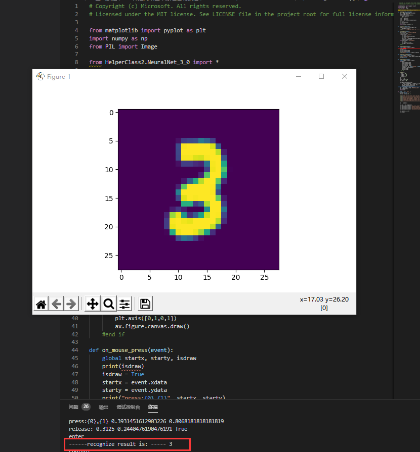
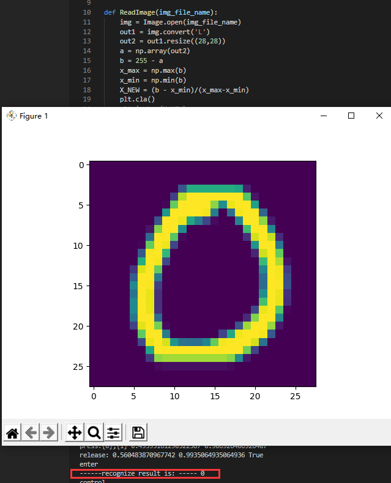

201809058  Wang Yulong    Final  Report
<font face=楷体>
## 基于miniFramework的手写数字识别

代码呈现：
```python

from matplotlib import pyplot as plt
import numpy as np
from PIL import Image

from HelperClass2.NeuralNet_3_0 import *

def ReadImage(img_file_name):
    img = Image.open(img_file_name)
    out1 = img.convert('L')
    out2 = out1.resize((28,28))
    a = np.array(out2)
    b = 255 - a
    x_max = np.max(b)
    x_min = np.min(b)
    X_NEW = (b - x_min)/(x_max-x_min)
    plt.cla()
    plt.imshow(X_NEW)
    plt.plot()
    return X_NEW.reshape(1,-1)

def Inference(img_array):
    output = net.inference(img_array)
    n = np.argmax(output)
    print("------recognize result is: -----", n)

def on_key_press(event):
    img_file_name = "handwriting.png"
    print(event.key)
    if event.key == 'enter':
        plt.axis('off')
        plt.savefig(img_file_name)
        plt.axis('on')
        img_array = ReadImage(img_file_name)
        Inference(img_array)
    elif event.key == 'backspace':
        plt.cla()
        plt.axis([0,1,0,1])
        ax.figure.canvas.draw()
    #end if

def on_mouse_press(event):
    global startx, starty, isdraw
    print(isdraw)
    isdraw = True
    startx = event.xdata
    starty = event.ydata
    print("press:{0},{1}", startx, starty)
    
def on_mouse_release(event):
    global isdraw, startx, starty
    print("release:", event.xdata, event.ydata, isdraw)
    isdraw = False

def on_mouse_move(event):
    global isdraw, startx, starty
    if isdraw:
        endx = event.xdata        
        endy = event.ydata        
        x1 = [startx, endx]
        y1 = [starty, endy]
        ax.plot(x1, y1, color='black', linestyle='-', linewidth='40')
        ax.figure.canvas.draw()
        startx = endx
        starty = endy
    # end if

def LoadNet():
    n_input = 784
    n_hidden1 = 64
    n_hidden2 = 16
    n_output = 10
    eta = 0.2
    eps = 0.01
    batch_size = 128
    max_epoch = 40

    hp = HyperParameters_3_0(
        n_input, n_hidden1, n_hidden2, n_output, 
        eta, max_epoch, batch_size, eps, 
        NetType.MultipleClassifier, 
        InitialMethod.Xavier)
    net = NeuralNet_3_0(hp, "MNIST_64_16")
    net.LoadResult()
    return net
   
if __name__ == "__main__":
    isdraw = False
    startx, starty = 0, 0

    print("need to run level3 first to get result")
    print("============================================================================")
    print("handwriting a digit, then press enter to recognize, press backspace to clear")
    print("resize the window to square, say, height == width")
    print("the handwriting should full fill the window")
    print("============================================================================")

    net = LoadNet()

    fig, ax = plt.subplots()
    fig.canvas.mpl_connect('key_press_event', on_key_press)
    fig.canvas.mpl_connect('button_release_event', on_mouse_release)
    fig.canvas.mpl_connect('button_press_event', on_mouse_press)
    fig.canvas.mpl_connect('motion_notify_event', on_mouse_move)
    
    plt.axis([0,1,0,1])
    plt.show()

```

<center>图1 手写数字3识别</center>


<center>图1 手写数字7识别</center>


<center>图1 手写数字0识别</center>

人工智能英文为(Artificial Intelligence)。它是研究、开发用于模拟、延伸和扩展人的智能的理论、方法、技术及应用系统的一门新的技术科学。 人工智能是计算机科学的一个分支。它企图了解智能的实质并生产出一种新的能以人类智能相似的方式作出反应的智能机器。

这个数字识别的程序使用python编写的，python作为当下人工智能的热门语言，散发出的魅力让人难以抗拒。手写数字通过鼠标在面板上手写并识别的过程令我十分惊奇，这令我对人工智能的前景充满憧憬。


## 1.1 人工智能的定义 
人工智能是一个非常庞杂的概念———从人们的期待、技术、应用等角度，人工智能都有不同的定义。

### 第一层面：人们对人工智能的期待 
- **可以智能地把某件特定的事情做好，在某个领域增强人类的智慧，即“智能增强”。** 如搜索引擎、自动语言翻译等，也称作“弱人工智能”，或“狭义人工智能”
- **像人类一样能认知，思考，判断，即“模拟人类的智能”。** 也称作“通用人工智能”（Artificial General Intelligence，AGI），或“强人工智能”。这类人工智能暂时未能取得实际应用。

### 第二层面：技术特点 ###
机器学习可以大致分为三种类型：
1. 监督学习（Supervised Learning）
    通过标注的数据来学习。

2. 无监督学习（Unsupervised Learning）
    通过没有标注的数据来学习。这种算法可以发现数据中自然形成的共同特性（聚类），可以用来发现不同数据之间的联系。
3. 强化学习（Reinforcement Learning）
    我们可以让程序选择和它的环境互动，环境给程序的反馈，程序从反馈中学习到新的模型。

#### 神经网络模型 ####
在生物神经网络中，每个神经元与其他神经元相连，当它兴奋时，就会像相邻的神经元发送化学物质，从而改变这些神经元内的电位；如果某神经元的电位超过了一个阈值，那么它就会激活（兴奋），向其他神经元发送化学物质。把许多这样的神经元按照一定的层次结构连接起来，我们就构建了一个神经网络，如图所示：


                        图1.1 M-P神经元模型

### 第三层面：应用角度 ###
1. 标杆式任务。
2. AI技术和其他技术结合，解决实际需求。
狭义人工智能已在各个领域取得很大成果。

## 1.2 范式的演化 ##
### 范式演化的四个阶段 ###
1. **第一阶段——经验总结**：描述自然现象，归纳总结规律。
2. **第二阶段——理论推导**：定量定性计算，构建各种模型。
3. **第三阶段——计算仿真**：实验模拟仿真，推演复杂现象。
4. **第四阶段——数据探索**：收集分析数据，探索全兴规律。


## 1.3 神经网络基本工作原理 ##
神经网络由基本的神经元组成。

### 神经元细胞的数学模型 ###


            图1.3.1 神经元计算模型
1. **输入 input**【多个】：$(x_1,x_2,x_3)$ 是外界输入信号，一般是一个训练数据样本的多个属性。
2. **输出 output**【一个】：输出可同时输入给多个神经元。
3. **权重 weights**【数量与输入量一致】：$(w_1,w_2,w_3)$ 是每个输入信号的权重值。
4. **偏移 bias**【一个】：使得直线能够沿 $Y$ 轴上下移动。
5. **求和计算 sum**：
$$
\begin{aligned}
Z &= w_1 \cdot x_1 + w_2 \cdot x_2 + w_3 \cdot x_3 + b = \sum_{i=1}^m(w_i \cdot x_i) + b
\end{aligned}
$$
5. **激活函数 activation**【非必须存在】：$$A=\sigma{(Z)}$$
  若激活函数是一个阶跃信号的话，信号传输口会不断开启、闭合。但在生物体中信号的变化一定是一个渐渐变化的过程。所以一般激活函数都有一个渐变的过程，即**激活函数是曲线**。

### 神经网络训练过程 ###
#### 单层神经网络模型 ####


              图1.2 单层神经网络模型
由图易得，单层神经网络中有 $m$ 个输入 (示例模型中 $m=3$)，有 $n$ 个输出 (示例模型中 $n=2$)。在神经网络中，$b$ 到每个神经元的权值表示实际的偏移值，即 $(b_1,b_2)$。

- $(x_1,x_2,x_3)$ 是一个样本数据的三个特征值
- $(w_{11},w_{21},w_{31})$ 是 $(x_1,x_2,x_3)$ 到 $n1$ 的权重
- $(w_{12},w_{22},w_{32})$ 是 $(x_1,x_2,x_3)$ 到 $n2$ 的权重
- $b_1$ 是 $n1$ 的偏移
- $b_2$ 是 $n2$ 的偏移   


>>>简要回顾与总结
### 搭建深度神经网络框架
   [](https://imgchr.com/i/DgGVPg)
1. NeuralNet:来包装基本的神经网络结构和功能
    + Layers：神经网络各层的容器，按添加顺序维护一个列表。
    + Parameters：基本参数（包括普参和超参）
    + Loss Function：提供计算损失函数值，存储历史记录并最后绘图的功能
    + LayerManagement()：添加神经网络层
    + ForwardCalculation():调用各层的前向计算方法
    + BackPropagation()：调用各层的反向传播方法
    + PreUpdateWeights() ：预更新各层的权重参数
    + UpdateWeights()：更新各层的权重参数
    + Train()：训练
    + SaveWeights()：保存各层的权重参数
    + LoadWeights()：加载各层的权重参数
2. Layer：是一个抽象类，以及更加需要增加的实际类
    + 包括：
        + Fully Connected Layer
        + Classification Layer
        + Activator Layer
        + Dropout Layer
        + Batch Norm Layer
        + Convolution Layer（将来会包括）
        + Max Pool Layer（将来会包括）
    + 每个Layer都包括以下基本方法：
        + ForwardCalculation():调用各层的前向计算方法
        + BackPropagation()：调用各层的反向传播方法
        + PreUpdateWeights() ：预更新各层的权重参数
        + UpdateWeights()：更新各层的权重参数
        + SaveWeights()：保存各层的权重参数
        + LoadWeights()：加载各层的权重参数
3. Activator Layer：激活函数和分类函数
    + Identity：直传函数，即没有激活处理
    + Sigmoid：S型函数，也成S型生长曲线。由于其单增以及反函数单增等性质，在信息科学中，Sigmoid函数常被用作神经网络的阈值函数。
    + Tanh:双曲函数中的一个，tanh()双曲正切。
        + 公式：tanh(x)=2*sigmoid(2*x)-1和
    + Relu：线性整流函数，又称修正线性单元。
4. Classification Layer：分类函数
    + Sigmoid二分类
    + Softmax多分类
5. Parameters：基本神经网络运行参数：
    + 学习率
    + 最大epoch
    + batch size
    + 损失函数定义
    + 初始化方法
    + 优化器类型
    + 停止条件
    + 正则类型和条件
6. LossFunction：损失函数及帮助方法（之前有学过）
    + 均方差函数
    + 交叉熵函数二分类
    + 交叉熵函数多分类
    + 记录损失函数
    + 显示损失函数历史记录
    + 获得最小函数值时的权重参数
7. Optimizer：优化器
    + SGD：随机梯度下降。以单个样本为训练单元训练速度会很快，但牺牲了向量化运算所带来的便利性，在较大数据集上效率并不高。
    + Momentum：带动量的梯度下降。带动量的梯度下降考虑历史梯度的加权平均值作为速率进行优化。
        + 执行公式：  
    + Nag:
    + AdaGrad
    + AdaDelta
    + RMSProp
    + Adam:是在带动量的梯度下降法的基础上融合了一种称为 RMSprop（加速梯度下降）的算法而成的。
        + 计算公式： 
8. WeightsBias:权重矩阵，仅供全连接层使用
   + 初始化：
        + Zero, Normal, MSRA (HE), Xavier
        + 保存初始化值
        + 加载初始化值
    + Pre_Update：预更新
    + Update：更新
    + Save：保存训练结果值
    + Load：加载训练结果值
9.  DataReader 样本数据读取器
    + ReadData：从文件中读取数据
    + NormalizeX：归一化样本值
    + NormalizeY：归一化标签值
    + GetBatchSamples：获得批数据
    + ToOneHot：标签值变成OneHot编码用于多分类
    + ToZeorOne：标签值变成0/1编码用于二分类
    + Shuffle：打乱样本顺序
    + MnistImageDataReader：读取MNIST数据（从中派生的数据读取器）
    + CifarImageReader：读取Cifar10数据（从中派生的数据读取器）

### 回归测试-万能近似定理
1. 搭建模型：一个双层的神经网络，第一层后面接一个Sigmoid激活函数，第二层直接输出拟合数据。


2. 超参数说明：
    + 输入层1个神经元，因为只有一个x值
    + 隐层4个神经元，对于此问题来说应该是足够了，因为特征很少
    + 输出层1个神经元，因为是拟合任务
    + 学习率=0.5
    + 最大epoch=10000轮
    + 批量样本数=10
    + 拟合网络类型
    + Xavier初始化
    + 绝对损失停止条件=0.001 
3. 训练结果：代码测试：
    + 

### 反向传播四大公式推导
+ 著名的反向传播四大公式：
     + $$\delta^{L} = \nabla_{a}C \odot \sigma_{'}(Z^L) \tag{80}$$ 
     + $$\delta^{l} = ((W^{l + 1})^T\delta^{l+1})\odot\sigma_{'}(Z^l) \tag{81}$$ 
     + $$\frac{\partial{C}}{\partial{b_j^l}} = \delta_j^l \tag{82}$$ 
     + $$\frac{\partial{C}}{\partial{w_{jk}^{l}}} = a_k^{l-1}\delta_j^l \tag{83}$$
+ 这个也挺难的，参考书是：矩阵求导术

### 回归任务 - 房价预测
+ 数据处理：
    + 原始数据只有一个数据集，需要自己把它分成训练集和测试集，比例大概为4:1。此数据集为csv文件格式，为了方便，我们把它转换成了两个扩展名为npz的numpy压缩形式：
        + house_Train.npz，训练数据集
        + house_Test.npz，测试数据集 
+ 搭建模型：
    +  个模型包含了四组全连接层-Relu层的组合，最后是一个单输出做拟合。
    +  超参数说明：
        + 学习率=0.1
        + 最大epoch=1000
        + 批大小=16
        + 拟合网络
        + 初始化方法Xavier
        + 停止条件为相对误差1e-7
        + net.train()函数是一个阻塞函数，只有当训练完毕后才返回
+ 代码运行结果：
    +[](https://imgchr.com/i/DgG3IU)


### 二分类试验 - 双弧形非线性二分类
+ 搭建模型：同样是一个双层神经网络，但是最后一层要接一个Logistic二分类函数来完成二分类任务。
+ 超参数说明：
    + 输入层神经元数为2
    + 隐层的神经元数为3，使用Sigmoid激活函数
    + 由于是二分类任务，所以输出层只有一个神经元，用Logistic做二分类函数
    + 最多训练1000轮
    + 批大小=5
    + 学习率=0.1
    + 绝对误差停止条件=0.02
+ 代码运行结果：
    + [](https://imgchr.com/i/DgJtk8)


### 二分类任务 - 居民收入
+ 字段解读：年龄、工作性质、权重、教育程度、受教育时长、婚姻状况、职业、家庭角色、性别、资本收益、资本损失、每周工作时长、祖籍
+ 数据处理：对于连续值，我们可以直接使用原始数据。对于枚举型，我们需要把它们转成连续值。以性别举例，Female=0，Male=1即可。对于其它枚举型，都可以用从0开始的整数编码。
+ 搭建模型：搭建一个与房价预测一样的网络结构，不同的是为了完成二分类任务，在最后接一个Logistic函数。
+ 超参数说明：
    + 学习率=0.1
    + 最大epoch=100
    + 批大小=16
    + 二分类网络类型
    + MSRA初始化
    + 相对误差停止条件1e-3
    + net.train()是一个阻塞函数，只有当训练完毕后才返回
+ 训练结果：
    + [](https://imgchr.com/i/DgJdpQ)
### 多分类功能测试 - “铜钱孔分类”问题
+ 搭建模型
    + 模型一：
        + 模型：使用Sigmoid做为激活函数的两层网络
        + 超参数说明
            + 隐层8个神经元
            + 最大epoch=5000
            + 批大小=10
            + 学习率0.1
            + 绝对误差停止条件=0.08
            + 多分类网络类型
            + 初始化方法为Xavier
            + net.train()函数是一个阻塞函数，只有当训练完毕后才返回。
    + 模型二：
        + 模型：使用Relu做为激活函数的三层网络。 
        + 超参数说明
            + 隐层8个神经元
            + 最大epoch=5000
            + 批大小=10
            + 学习率0.1
            + 绝对误差停止条件=0.08
            + 多分类网络类型
            + 初始化方法为MSRA
+ 运行结果：
    +[](https://imgchr.com/i/DgJznI)


### 2.3 梯度下降 ###
梯度下降的数学公式：

$$\theta_{n+1} = \theta_{n} - \eta \cdot \nabla J(\theta) $$

其中：
1. $\theta_{n+1}$：下一个值；
2. $\theta_n$：当前值；
3. $-$：减号，梯度的反向；
4. $\eta$：学习率/步长；
5. $\nabla$：梯度，函数当前位置的最快上升点；
6. $J(\theta)$：函数。

#### 梯度下降的三要素 ####

1. 当前点；
2. 方向；
3. 步长。

**梯度**：函数当前位置的最快上升点；
**下降**：与导数相反的方向，用数学语言描述就是那个减号。
**梯度下降的目的就是使得x值向极值点逼近。**

                表2.3.1 在三维空间内的梯度下降过程

|观察角度1|观察角度2|
|--|--|
|||

#### 学习率η的选择 ####
在公式表达时，学习率被表示为$\eta$。

                 表2.3.2 不同学习率对迭代情况的影响

|学习率|迭代路线图|说明|
|---|---|---|
|1.0||学习率太大，迭代的情况很糟糕，在一条水平线上跳来跳去，永远也不能下降。|
|0.8||学习率大，会有这种左右跳跃的情况发生，这不利于神经网络的训练。|
|0.4||学习率合适，损失值会从单侧下降，4步以后基本接近了理想值。|
|0.1||学习率较小，损失值会从单侧下降，但下降速度非常慢，10步了还没有到达理想状态。|

**代码测试**
**1. GDSingleVariable**
**运行终端**
```
PS C:\Users\DELL\Desktop\apprendre\人工智能\ai-edu\A-基础教程\A2-神经网络基本原理简明教程\SourceCode\ch02-BASIC> & C:/Users/DELL/AppData/Local/Programs/Python/Python38-32/python.exe c:/Users/DELL/Desktop/apprendre/人工智能/ai-edu/A-基础教程/A2-神经网络基本原理简明教程/SourceCode/ch02-BASIC/Level3_GDSingleVariable.py
x=0.480000, y=0.230400
x=0.192000, y=0.036864
x=0.076800, y=0.005898
x=0.030720, y=0.000944
```
**运行结果图像**


**2. GDDoubleVariable**
**运行终端**
```
PS C:\Users\DELL\Desktop\apprendre\人工智能\ai-edu\A-基础教程\A2-神经网络基本原理简明教程\SourceCode2-BASIC> & C:/Users/DELL/AppData/Local/Programs/Python/Python38-32/python.exe c:/Users/DELL/Desktop/endre/人工智能/ai-edu/A-基础教程/A2-神经网络基本原理简明教程/SourceCode/ch02-BASIC/Level4_GDDoubleVale.py
[3 1]
0: x=3.000000, y=1.000000, z=9.708073
     [6.         0.90929743]
[2.4        0.90907026]
1: x=2.400000, y=0.909070, z=6.382415
     [4.8        0.96956606]
[1.92       0.81211365]
2: x=1.920000, y=0.812114, z=4.213103
     [3.84      0.9985729]
[1.536      0.71225636]
3: x=1.536000, y=0.712256, z=2.786415
     [3.072      0.98931962]
[1.2288    0.6133244]
4: x=1.228800, y=0.613324, z=1.841252
     [2.4576     0.94136341]
[0.98304    0.51918806]
5: x=0.983040, y=0.519188, z=1.212558
     [1.96608    0.86158105]
[0.786432   0.43302995]
6: x=0.786432, y=0.433030, z=0.794559
     [1.572864   0.76178233]
[0.6291456  0.35685172]
7: x=0.629146, y=0.356852, z=0.517853
     [1.2582912  0.65463784]
[0.50331648 0.29138794]
8: x=0.503316, y=0.291388, z=0.335858
     [1.00663296 0.55034373]
[0.40265318 0.23635356]
9: x=0.402653, y=0.236354, z=0.216960
     [0.80530637 0.45529821]
[0.32212255 0.19082374]
10: x=0.322123, y=0.190824, z=0.139737
     [0.64424509 0.37244992]
[0.25769804 0.15357875]
11: x=0.257698, y=0.153579, z=0.089810
     [0.51539608 0.3023504 ]
[0.20615843 0.12334371]
12: x=0.206158, y=0.123344, z=0.057638
     [0.41231686 0.24419301]
[0.16492674 0.09892441]
13: x=0.164927, y=0.098924, z=0.036955
     [0.32985349 0.19656057]
[0.1319414  0.07926835]
14: x=0.131941, y=0.079268, z=0.023679
15: x=0.105553, y=0.063481, z=0.015166
     [0.21110623 0.1266212 ]
     [0.16888499 0.10146288]
PS C:\Users\DELL\Desktop\apprendre\人工智能\ai-edu\A-基础教程\A2-神经网络基本原理简明教程\SourceCodeurceCode\ch02-BASIC> & C:/Users/DELL/AppData/Local/Programs/Python/Python38-32/python.exe c:Desktop/ode/ch02-BASIC/Level5_LearningRate.py                                                       arningRa
PS C:\Users\DELL\Desktop\apprendre\人工智能\ai-edu\A-基础教程\A2-神经网络基本原理简明教程\SourceCode\ch02-BASIC> & C:/Users/DELL/AppData/Local/Programs/Python/Python38-32/python.exe c:urceCode/Users/DELL/Desktop/apprendre/人工智能/ai-edu/A-基础教程/A2-神经网络基本原理简明教程/SourceCDesktop/ode/ch02-BASIC/Level5_LearningRate.py                                                       arningRa
PS C:\Users\DELL\Desktop\apprendre\人工智能\ai-edu\A-基础教程\A2-神经网络基本原理简明教程\SourceCod> & C:/Users/DELL/AppData/Local/Programs/Python/Python38-32/python.exe c:/Users/DELL/urceCodeDesktop/apprendre/人工智能/ai-edu/A-基础教程/A2-神经网络基本原理简明教程/SourceCode/ch02-BASIC/Level4_GDDoubleVariable.py
[3 1]
0: x=3.000000, y=1.000000, z=9.708073
     [6.         0.90929743]
[2.4        0.90907026]
1: x=2.400000, y=0.909070, z=6.382415
     [4.8        0.96956606]
[1.92       0.81211365]
2: x=1.920000, y=0.812114, z=4.213103
     [3.84      0.9985729]
[1.536      0.71225636]
3: x=1.536000, y=0.712256, z=2.786415
     [3.072      0.98931962]
[1.2288    0.6133244]
4: x=1.228800, y=0.613324, z=1.841252
     [2.4576     0.94136341]
[0.98304    0.51918806]
5: x=0.983040, y=0.519188, z=1.212558
     [1.96608    0.86158105]
[0.786432   0.43302995]
6: x=0.786432, y=0.433030, z=0.794559
     [1.572864   0.76178233]
[0.6291456  0.35685172]
7: x=0.629146, y=0.356852, z=0.517853
     [1.2582912  0.65463784]
[0.50331648 0.29138794]
8: x=0.503316, y=0.291388, z=0.335858
     [1.00663296 0.55034373]
[0.40265318 0.23635356]
9: x=0.402653, y=0.236354, z=0.216960
     [0.80530637 0.45529821]
[0.32212255 0.19082374]
10: x=0.322123, y=0.190824, z=0.139737
     [0.64424509 0.37244992]
[0.25769804 0.15357875]
11: x=0.257698, y=0.153579, z=0.089810
     [0.51539608 0.3023504 ]
[0.20615843 0.12334371]
12: x=0.206158, y=0.123344, z=0.057638
     [0.41231686 0.24419301]
[0.16492674 0.09892441]
13: x=0.164927, y=0.098924, z=0.036955
     [0.32985349 0.19656057]
[0.1319414  0.07926835]
PS C:\Users\DELL\Desktop\apprendre\人工智能\ai-edu\A-基础教程\A2-神经网络基本原理简明教程\SourceCode\ch02-BASIC> & C:/Users/DELL/AppData/Local/Programs/Python/Python38-32/python.exe c:/Users/DELL/Desktop/apprendre/人工智能/ai-edu/A-基础教程/A2-神经网络基本原理简明教程/SourceCode/ch02-BASIC/Level4_GDDoubleVariable.py
[3 1]
0: x=3.000000, y=1.000000, z=9.708073
     [6.         0.90929743]
[2.4        0.90907026]
1: x=2.400000, y=0.909070, z=6.382415
     [4.8        0.96956606]
[1.92       0.81211365]
2: x=1.920000, y=0.812114, z=4.213103
     [3.84      0.9985729]
[1.536      0.71225636]
3: x=1.536000, y=0.712256, z=2.786415
     [3.072      0.98931962]
[1.2288    0.6133244]
4: x=1.228800, y=0.613324, z=1.841252
     [2.4576     0.94136341]
[0.98304    0.51918806]
5: x=0.983040, y=0.519188, z=1.212558
     [1.96608    0.86158105]
[0.786432   0.43302995]
6: x=0.786432, y=0.433030, z=0.794559
     [1.572864   0.76178233]
[0.6291456  0.35685172]
7: x=0.629146, y=0.356852, z=0.517853
     [1.2582912  0.65463784]
[0.50331648 0.29138794]
8: x=0.503316, y=0.291388, z=0.335858
     [1.00663296 0.55034373]
[0.40265318 0.23635356]
9: x=0.402653, y=0.236354, z=0.216960
     [0.80530637 0.45529821]
[0.32212255 0.19082374]
10: x=0.322123, y=0.190824, z=0.139737
     [0.64424509 0.37244992]
[0.25769804 0.15357875]
11: x=0.257698, y=0.153579, z=0.089810
     [0.51539608 0.3023504 ]
[0.20615843 0.12334371]
12: x=0.206158, y=0.123344, z=0.057638
     [0.41231686 0.24419301]
[0.16492674 0.09892441]
13: x=0.164927, y=0.098924, z=0.036955
     [0.32985349 0.19656057]
[0.1319414  0.07926835]
14: x=0.131941, y=0.079268, z=0.023679
     [0.26388279 0.15787343]
[0.10555312 0.06348101]
15: x=0.105553, y=0.063481, z=0.015166
     [0.21110623 0.1266212 ]
[0.08444249 0.05081889]
16: x=0.084442, y=0.050819, z=0.009711
     [0.16888499 0.10146288]
PS C:\Users\DELL\Desktop\apprendre\人工智能\ai-edu\A-基础教程\A2-神经网络基本原理简明教程\SourceCode\ch02-BASIC>
```
**运行结果图像**


**3. LearningRate**
**运行终端**
```
PS C:\Users\DELL\Desktop\apprendre\人工智能\ai-edu\A-基础教程\A2-神经网络基本原理简明教程\SourceCode\ch02-BASIC> & C:/Users/DELL/AppData/Local/Programs/Python/Python38-32/python.exe c:/Users/DELL/Desktop/apprendre/人工智能/ai-edu/A-基础教程/A2-神经网络基本原理简明教程/SourceCode/ch02-BASIC/Level5_LearningRate.py
```
**运行结果图像**


 
## 3.0 损失函数 ##
**“损失”就是所有样本的“误差”的总和**，亦即（$m$ 为样本数）：

$$损失 = \sum^m_{i=1}误差_i$$

$$J = \sum_{i=1}^m loss_i$$
其中：
1.  $J$ ：具体的损失函数。
2.  $loss$ ：误差值。

### 损失函数的作用 ###
计算神经网络每次迭代的前向计算结果与真实值的差距，从而指导下一步的训练向正确的方向进行。
#### 损失函数使用方法 ####

1. 用随机值初始化前向计算公式的参数；
2. 代入样本，计算输出的预测值；
3. 用损失函数计算预测值和标签值（真实值）的误差；
4. 根据损失函数的导数，沿梯度最小方向将误差回传，修正前向计算公式中的各个权重值；
5. 进入第2步重复, 直到损失函数值达到一个满意的值就停止迭代。

### 机器学习常用损失函数 ###

1. Gold Standard Loss $/$ 0-1误差
$$
loss=\begin{cases}
0 & a=y \\\\
1 & a \ne y 
\end{cases}
$$

2. 绝对值损失函数

$$
loss = |y-a|
$$

3.  Hinge Loss，铰链/折页损失函数 $/$ 最大边界损失函数

$$
loss=\max(0,1-y \cdot a) \qquad y=\pm 1
$$

4. Log Loss，对数损失函数 $/$ 交叉熵损失函数(cross entropy error)【主要用于分类】

$$
loss = -[y \cdot \ln (a) + (1-y) \cdot \ln (1-a)]  \qquad y \in { (0,1) } 
$$

5. Squared Loss，均方差损失函数【主要用于回归】
$$
loss=(a-y)^2
$$

6. Exponential Loss，指数损失函数
$$
loss = e^{-(y \cdot a)}
$$

### 损失函数和图像理解 ###
#### 二维函数图像理解单变量对损失函数的影响


           图3.0.1 单变量的损失函数图
其中：
1. 纵坐标：损失函数值
2. 横坐标：变量。
3. 不断地改变变量的值，会造成损失函数值的上升或下降。
4. 梯度下降算法会让函数图像沿着损失函数值下降的方向前进。

**训练过程** 
1. 假设我们的初始位置在 $A$ 点，$x=x_0$，损失函数值（纵坐标）较大，回传给网络做训练；
2. 经过一次迭代后，我们移动到了 $B$ 点，$x=x_1$，损失函数值也相应减小，再次回传重新训练；
3. 以此节奏不断向损失函数的最低点靠近，经历了 $x_2,x_3,x_4,x_5$；
4. 直到损失值达到可接受的程度，比如 $x_5$ 的位置，就停止训练。

#### 用等高线图理解双变量对损失函数影响


           图3.0.2 双变量的损失函数图
其中：
1. 横坐标是变量 $w$.
2. 纵坐标是变量 $b$。
3. 两个变量的组合形成的损失函数值，在图中对应处于等高线上的唯一的一个坐标点。$w,b$ 所有不同值的组合会形成一个损失函数值的矩阵，我们把矩阵中具有相同（相近）损失函数值的点连接起来，可以形成一个不规则椭圆，其圆心位置，是损失值为 $0$ 的位置，也是我们要逼近的目标。
---
# <center>总结与心得</center> #
<font face=楷体>
1. 通过对人工智能概论的学习，我了解到了人工智能最基本的发展、定义，学习了人工智能实现所需的范式、反向传播、梯度下降、损失函数等数学知识。
2. 学习到了激活函数、多项式回归、曲线拟合等方面。
3. 了解了非线性分类，介绍了各类门的工作原理及实现、非线性多分类的工作原理等。
4. 在对回归任务、二分类任务、多分类任务的学习过程中我学习到了如何分析训练过程中损失函数值和准确率的变化。
5. 在对网络优化的学习过程中，我了解到了有关梯度下降优化算法的知识，包括——NAG 可以使 RNN 在很多任务上有更好的表现等。
6. 通过对正则化的部分的学习，我了解到Mixup、SMOTE、SamplePairing三者思路上有相同之处，都是试图将离散样本点连续化来拟合真实样本分布，但所增加的样本点在特征空间中仍位于已知小样本点所围成的区域内。但在特征空间中，小样本数据的真实分布可能并不限于该区域中，在给定范围之外适当插值，也许能实现更好的数据增强效果。

<font color=green>
人工智能目前在计算机领域内，得到了愈加广泛的重视。并在机器人，经济政治决策，控制系统，仿真系统中得到应用。如今，人工智能研究出现了新的高潮，这一方面是因为在人工智能理论方面有了新的进展，另一方面也是因为计算机硬件突飞猛进的发展。人工智能的学习，让我明白了人工智能始终处于计算机发展的最前沿。高级计算机语言、计算机界面及文字处理器的存在或多或少都得归功于人工智能的研究。人工智能研究带来的理论和洞察力指引了计算技术发展的未来方向。现有的人工智能产品相对于即将到来的人工智能应用可以说微不足道，但是它们预示着人工智能的未来。</font>


反向传播、梯度下降、损失函数、正向传播、最小二乘法、梯度下降法、网络神经法、二分类函数、线性二分类、激活函数的性质（Sigmoid、Logistic、Tanh）、非线性分类、梯度检查、学习率概念、梯度检测查。其中反向传播、梯度下降、损失函数、正向传播是最基础的也是最重要的，因为后面会频繁地使用它，而且后面要使用他们来分析问题。梯度下降，“梯度”是指函数当前位置变化最快的值。“下降”是指与导数相反的方向，用数学语言描述就是那个减号，就是与上升相反的方向。另外在讲解中我也学到了单变量梯度下降与双变量梯度下降的差别，了解到梯度下降对神经网络研究的重要性。另外我学习了神经网络中常用的两种损失函数，其中均方差函数，主要用于回归；交叉熵函数，主要用于分类。这两种损失函数对我们解决神经网络中的一些问题是很有用的，线性回归问题的方：1最小二乘法2 梯度下降法3 简单的神经网络法4 更通用的神经网络算法。梯度下降的三种形式，即最小二乘法、梯度下降法、神经网络法；另外神经网络中的线性分类问题，神经网络的一个重要功能就是分类，在线性多分类问题中主要讲解了一对一、一对多、多对多的问题，两层神经网络的学习，在两层神经网络之间，必须有激活函数连接，从而加入非线性因素，提高神经网络的能力。所以，我们先从激活函数学起，一类是挤压型的激活函数，常用于简单网络的学习；另一类是半线性的激活函数，常用于深度网络的学习。