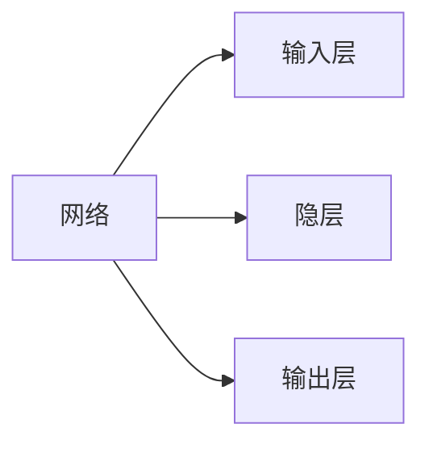
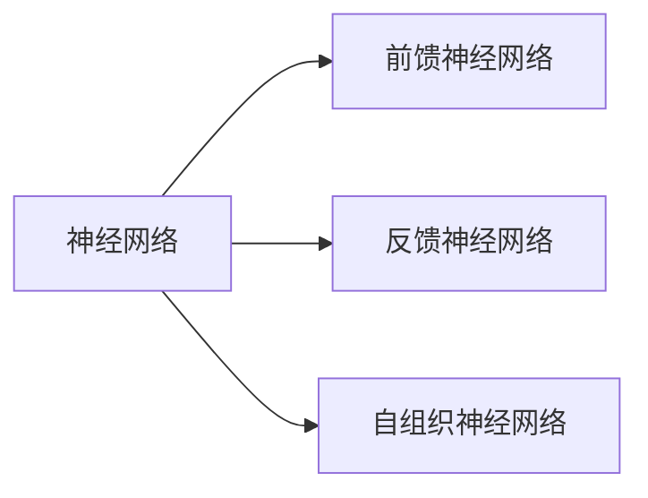
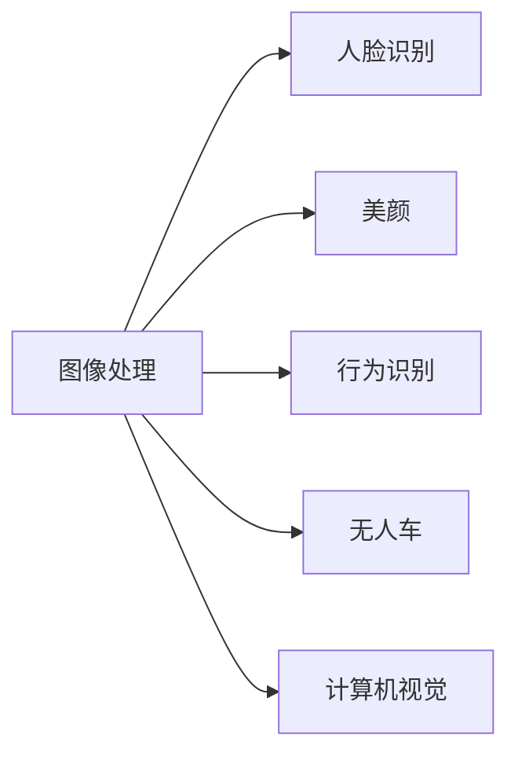
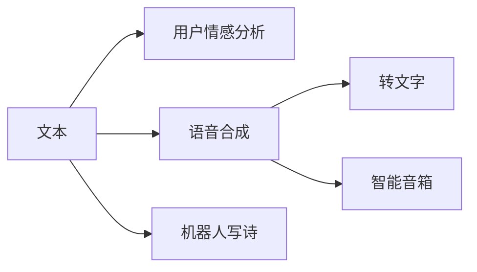
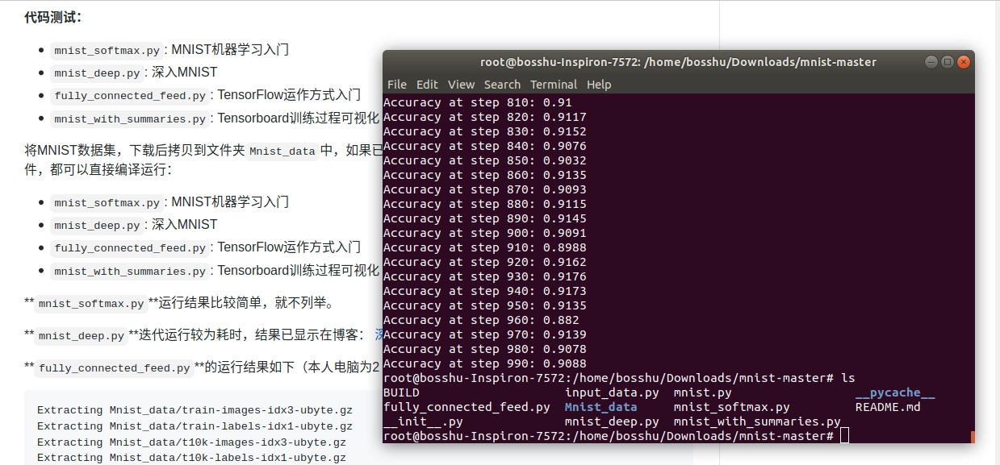

# 神经网络

## 1.	介绍

### 1.1.	ANN(``神经网络``)

### 1.2.	反向传播算法

    将误差逐层向后传递，从而实现使用权值参数对
    特征的记忆也是一种前馈神经网络可以拟合个总非线性关系

#### 1.2.1.	结构

    同一层不连接，相邻层全连接，层与层之间传递权重

 

*[隐层]: 非线性（多层次） 

### 1.2.2.	输入输出

    形式为数值型

### 1.2.3.	激活函数

	1.处处可导
	2.非线性
	3.可微性
	4.单调性
	5.输出值范围（可控）
	6.计算简单
	7.归一化
	8.函数值约等变量

**范例：**

	Sigmoid函数

        1.连续可微
	    2.单调递增
	    3.输出值为0到1之内
 	    4.求导合适

### 1.2.4.	损失函数

•	**交叉熵**
    $loss = ylog(\hat{y}_n)+(1-y)\log (1-\hat{y}_n)$
•	**均方差**
    $loss = \frac{1}{n}\sum_{n=1}^{n=\infty}(\hat{x}_i-x_i)^2$

### 1.2.5.	训练

•	一次过程

    	初始化网络权值和神经元的阈值
    	计算隐层神经元和输出神经元的输出
    	感觉目标函数公式修正权值
•	定义损失函数
•	反向调整偏置

### 1.2.6.	学习率调整策略

•	基于经验的手动调整
•	固定学习率
•	动量法动态调整
•	随机梯度下降
•	自动调整Adam

### 1.2.7.	过拟合，调整

**过拟合**
`训练集上效果好，测试集上效果差，在预测中`

**方法**
    
    •	参数范数惩罚，惩罚性成本函数正则化
    •	将惩罚项添加至损失函数已获得高权重
    •	公式
    •	数据增强
    •	提前终止
    •	选择一些规则来提前终止训练
    •	Bagging，等集成方法
    •       Dropout
    •	以正则化
    •	动量方法
	
*[Drpout]: 在每次训练中随机删除一个神经元子集•	防止神经网络过度依赖某一个路径随机屏蔽掉某些神经元，然后再调节其权重.

*[动量方法]:	每次训练仅略微改变方向,保持不进方向的连续平均数，消除个别点的变化

### 1.2.8.	还要考虑的问题

    •	选择恰当的激活函数
    •	权重初始化
    •	均匀分布
    •	学习率
    •	周期/训练的迭代次数
    •	训练过程可视化
    •	防止局部极值小
    •	防止过拟合

## 1.3.	分类

`在外界输入样本能刺激下，不断改变网络连接的权值（加深记忆）`
	

# 2.	感知器


	可以接收多个输入
	输入参数和对应权值进行加权求和
	激活函数
	可以生成结果
	有偏置

# 3.	应用
 
	



# 最小二乘法

**要求**：`利用直接计算的方式求得渐进曲线，但要保证样本特征有逆矩阵`

**原理**:利用导数计算使得所有离散点到所要求直线的纵距离最小

计算公式

$$
w = \frac{\sum_{i=1}^m y_i(x_i-\bar x)}{\sum_{i=1}^m x^2_i - (\sum_{i=1}^m x_i)^2/m} \tag{15}
$$

`b值可以由原式求出`

```Python
def methd(X,Y,m):
#X,Y都是样本特征矩阵，m为样本个数。
    x_mean = X.mean()    
"""
mean是numpy的函数
若A为矩阵，则输出每一列的均值（一个向量）
若A为列向量，则输出均值（一个数）
若A为行向量，则也是输出均值（一个数），和列向量一样
"""
    p = sum(Y*(X-x_mean))
#sum是numpy的函数，元素求和
    q = sum(X**2)-(sum(X)**2)/m
    w = p/q
```

# 梯度下降法

**要求**：`先随机的确定权值和偏置，计算出损失函数，然后再通过梯度下降的办法，在反向修改权重，让损失函数达到最小值`
**原理**：学习率的大小需要自己进行定义

```python
#当损失函数形式为均值平方差时
def __mothd(X,Y,w,b,eta):
#w,b随机，eta为固定值
    for i in range(reader.num_train):
#reader.num_train为reader的函数
    x = X[i]
    y = Y[i]
    z = x*w+b
    dz = z - y
    dw = dz*x
    w = w - eta*dw
    b = b - eta*dz
#公式还原
```
# 神经网络法

**要求**：`初始化权重值，根据权重值放出一个解，根据损失函数求误差误差反向传播给线性计算部分以调整权重值是否满足终止条件？不满足的话跳回2`

**原理**：运用了神经元的结构，其原理与梯度下降法相似

```python
#神经元定义
class NeuralNet(object):
    def __init__(self, eta):
        self.eta = eta
        self.w = 0
        self.b = 0
```
# 多样本形式

**原理**：`多样本计算，就是把每次循环，所计算的一个数值变成一个矩阵的形式`

**要求**：在最小二乘法和神经网络法中均适用

$$x=x_1  -> 
X=\begin{pmatrix}
    x_1 \\\\ 
    x_2 \\\\ 
    x_3
\end{pmatrix}
$$

# 梯度训练形式

## 单次

优点：训练开始时损失值下降很快，随机性大，找到最优解的可能性大。
缺点：受单个样本的影响最大，损失函数值波动大，到后期徘徊不前，在最优解附近震荡。不能并行计算。

## 小批量

优点：不受单样本噪声影响，训练速度较快。
缺点：每批量的数值选择很关键，会影响训练结果。

## 全部

优点：受单个样本的影响最小，一次计算全体样本速度快，损失函数值没有波动，到达最优点平稳。方便并行计算。
缺点：数据量较大时不能实现（内存限制），训练过程变慢。初始值不同，可能导致获得局部最优解，并非全局最优解。

# 一般框架

- 1.定义神经元结构
  
    - 神经元的输入和输出的方式和个数
    - 神经元的偏置和激活函数的选择

- 2.定义神经网络

    - 输入层 `输入的特征数`
    - 隐层 `数目可多个`
    - 输出层 `类别数目)`

- 3.损失函数定义
    
    - 选择与问题相对应的损失函数

        **如**：`线性回归问题使用均方差公式，二分类使用交叉熵公式`

# 数据标准化

**原理**：`计算机计算每条数据的时候，数据的大小可能过大或发散，或者在运算过程中造成数值问题，有可能导致学习力选择不太理想。`

**常用方法**：样本特征值和样本标签值都标准化，但预测值需要反标准化。

**非常用方法所带来的问题**：如果就只有特征值标准化，有两种方法，可以使预测值准确：

- 还原参数法，
- 将预测指标准化

**可选标准化方法**：

- Min-Max标准化（离差标准化），将数据映射到 $[0,1]$ 区间

$$x_{new}=\frac{x-x_{min}}{x_{max} - x_{min}} \tag{1}$$

- 平均值标准化，将数据映射到[-1,1]区间
   
$$x_{new} = \frac{x - \bar{x}}{x_{max} - x_{min}} \tag{2}$$

- 对数转换
$$x_{new}=\ln(x_i) \tag{3}$$

- 反正切转换
$$x_{new}=\frac{2}{\pi}\arctan(x_i) \tag{4}$$

- Z-Score法

把每个特征值中的所有数据，变成平均值为0，标准差为1的数据，最后为正态分布。Z-Score规范化（标准差标准化 / 零均值标准化，其中std是标准差）：

$$x_{new} = \frac{x_i - \bar{x}}{std} \tag{5}$$

- 中心化，平均值为0，无标准差要求
  
$$x_{new} = x_i - \bar{x} \tag{6}$$

- 比例法，要求数据全是正值

$$
x_{new} = \frac{x_k}{\sum_{i=1}^m{x_i}} \tag{7}
$$


# 分类

## 神经元

`主要定义神经元的输入个数和输出个数，初始化神经元的权值和偏置也可以使用辅助的类来为神经元的使用添加功能`
```python
class Nuralnet(objcet):
    def __init()__(self):
        self.w = 0
        self.b = 0

```
## 前向计算

`根据样本定义输入的特征数和神经网络层数，若要多样本，小批量则使用矩阵`

$z = w*x + b$
**范例**：
```python
    def forward(self, batch_x):#定义神经网络
        #  层一
        self.Z1 = np.dot(batch_x, self.wb1.W) + self.wb1.B
        self.A1 = Sigmoid().forward(self.Z1)
        # 层二
        self.Z2 = np.dot(self.A1, self.wb2.W) + self.wb2.B
        self.A2 = Logistic().forward(self.Z2)
        #输出
        self.output = self.A2
```

## 激活函数

**要求**：
<font color=red> 
    非线性,可导的,单调性
</font>

**用途**：最后一层不用激活函数，`连接`前后的神经网络

- `二分类函数`
  
    <font face="STCAIYUN">logistic</font>
    **公式**：
    $logistic(z) = \frac1{1 + e^{-z}}$
    **导数**：
    $logisitic(z)' = a(1-a)$
    **描述**：`这是常用的分类函数，通过此函数将利用w,b而计算出的数据压缩在根据设定的阈值分类`

**函数图像**


```python
 def forward(self, z):
        a = 1.0 / (1.0 + np.exp(-z))
        return a   
```

<font face="STCAIYUN">tanh</font>
    
**公式**：
    
$tanh(z) = \frac{2}{1 + e^{-2z}} - 1$

 **导数**：
    $tanh(z) = (1+a)(1-a)$

**函数图像**：


- `多分类函数`
   <font face="STCAIYUN">softmax</font>
    **公式**：
    $$
    a_j = \frac{e^{z_j}}{\sum\limits_{i=1}^m e^{z_i}}=\frac{e^{z_j}}{e^{z_1}+e^{z_2}+\dots+e^{z_m}}
    $$
   
    **描述**：`由原来的logistic和max改进而来可用于多分类，给予样本在每个类别的概率`
    
    示例：
    
    ```python
    def Softmax2(Z):
    shift_Z = Z - np.max(Z)
    exp_Z = np.exp(shift_Z)
    A = exp_Z / np.sum(exp_Z)
    return A
    ```

## 损失函数

-  <font face="STCAIYUN">交叉熵</font>
  
  **说明**`多样本时用矩阵形式,多分类时应运用求和的方式，求导易实现`
  **反向计算**：`在反向传播时，1.计算z,再计算dz,然后计算dw,db,db如果是多样本，则为矩阵计算，且计算dw,db时要求平均值`
    **公式**：
    $loss(w,b) = -[ylna + (1-y)ln(1-a)]$
    **导数**：
    $\frac {\delta loss(w,b)} {\delta z} = a - y$
    **示例**：
```python
 def CheckLoss(self, A, Y):
        m = Y.shape[0]
        if self.net_type == NetType.Fitting:
            loss = self.MSE(A, Y, m)
        elif self.net_type == NetType.BinaryClassifier:
            loss = self.CE2(A, Y, m)
        elif self.net_type == NetType.MultipleClassifier:
            loss = self.CE3(A, Y, m)
        #end if
        return loss
```
**图示**：


# DNN(框架)

## 本章思维导图


**要点**:

- `损失函数值在训练过程中一般的表现情况为一段平缓期之后会急速下降（在训练过程中，需要根据经验来判断神经网络是否还要继续训练）`
- `规划的时候需要将所有样本数据同时做归一化`
- `在设计模型的时候，就可以直接设计神经网络就行了`
- `在对原始数据的手工处理当中，将不需要的数据给去掉，将没有代表的数据给去掉，将数据之间进行比较，选其中较好性能的数据，数据集最好转换成扩展名为npz的numpy压缩形式`
- `Simoid弯曲用，Relu直线适用`
  
**小技巧**：
s
- `应用python的list功能，取元素的下标用作整数编码`

**DNN框架搭建**：

``` python
import numpy as np
class NeuralNet(object):
    #功能定义
    def __init__(self,num,eta,max_epoch,bat_size):
        #神经网络层
        self.layers = []#容纳神经网络各层
        self.layer_num = num #神经网络层数
        #神经网络运行参数
        self.eta = eta #学习率
        self.max_epoch = max_epoch #最大回合数
        self.bat_size = bat_size#每批数
        #损失函数
        self.j#损失函数值
        self.j_his#损失函数历史值
        self.j_graph#损失函数画图许可
    return print("Neural init is OK")
    #方法定义
    def Add_layer(self,lay): #神经网络层的添加
        len = self.layers.lenth()
        if len < self.layer_num:
            self.layers[len] = lay
        else print("神经网络层数已达上限")
        return print("lay添加成功")
    def Com_neural(self,X,i):#调用i层线性计算方法
        Z = np.dot(self.layer[i].w,X) + self.layer[i].b
        return Z
    def Back_method(self,Y,A):#反向传播
        dZ = A - Y
        dW = np.dot(A.dZ)
        dB = dZ
        return dW,dB
    def layer_u(self,dW,dB,i)：#本层的更新参数
        w = self.layers[i].w
        b = self.layers[i].b
        w = w - eta*dW
        b = b - eta*dB
        self.layers[i].w = w
        self.layers[i].b = b
    def train_N(self,X,Y):#训练
        A1 = X
        A2 = array([])
        A3 = Y
        for i in range(self.layer_num):
            Z = Com_neural(A1,i)
            A1 = Mothd_act.Identity(Z)
            A2[i] = A1
            A3[i] = Z
        for i in range(self.layer_num):
            dW,dB = Back_method(A3[self.layer_num-i],A2[self.layer_num-i])
            layer_u(dW,dB,i)


```
```python
class Mothd_act(object):# 激活函数与分类函数
    #激活函数
    @classmethod
    def Identity(cls,Z):
        A = Z
        return A
    @classmethod
    def Sigmoid(cls,Z):
        A = 1/1+np.exp(-Z)
        return A
    @classmethod
    def Tanh(cls,Z):
        A = (np.exp(Z) - np.exp(-Z)) /  (np.exp(Z) + np.exp(-Z))
        return A
    @classmethod
    def Relu(cls,Z):
        A = np.max(0,Z)
        return A
    #分类函数
    @classmethod
    def Sigmoid(cls,Z):
        A = 1/1+np.exp(-Z)
        return A
    @classmethod
    def Softmax(cls,Z):
        A = np.exp(z)/np.sum(np.exp(z),axis = 1,keepims = True)
        return A
```
```python
class Layer(object):
    def __init__(self,n,b):
        self.w = [] #权重
        self.w_num = n#每层连接数
        self.b = b #偏置
    def set_w(self,w): #权重添加
        i = self.w.lenth()
        if i < self.w_num:
            self.w[i] = w
        else print("权重个数已到最大值")
        return print("w初始化结束")

```

**心得**：

`在搭建DNN框架的过程中，遇到了很多的困难，最终还是不能完美的运行，展示的代码只是其中的一部分，剩下的代码还有一点不知所措，写的比较杂乱。通过阅读已有的代码，和自己的实践，使我对机器学习模型的理解更加的深入了 `
# 网络优化

## 思维导图


## 权重矩阵优化


- **零初始化**：在初始化时将权重值设为0，对于多层网络来说，不能用零初始化。

$$
    W = 0
$$
```python
def init_0(self):
    for i in range(self.w.lenth()):
        self.w[i] = 0
    print("init：0 is OK")
```

- **标准初始化**： 对于权重进行随机初始化，并使其满足正态分布或者是均匀分布，但神经网络的层数过多的时候不适用此初始化
  
$$  
    W \sim N\begin{pmatrix} 0, \frac{1}{\sqrt{n_{in}}}\end{pmatrix}
    W \sim U\begin{pmatrix} -\frac{1}{\sqrt{n_{in}}}, \frac{1}{\sqrt{n_{in}}}\end{pmatrix}

$$
```python
def init_S(self):
    for i in range(self.layer_num)
        self.layer.w = np.random.randn(1,self.layer.w_num)*0.01
        #乘0.01是因为要把W随机初始化到一个相对较小的值，因为如果X很大的话，W又相对较大，会导致Z非常大，这样如果激活函数是sigmoid，就会导致sigmoid的输出值1或者0，然后会导致一系列问题（比如cost function计算的时候，log里是0，这样会有点麻烦）
    print("init: S is Ok")
```

- **Xavier初始化**：正向传播时，激活值的方差保持不变；反向传播时，关于状态值的梯度的方差保持不变，也就是说他们在输入输出的分布要保持相似(适用于Sigmoid函数)

$$
W \sim N\begin{pmatrix} 0, \sqrt{\frac{2}{{n_{in}+n_{out}}}}\end{pmatrix}
    W \sim U\begin{pmatrix} -\sqrt{\frac{6}{n_{in}+n_{out}}}, \sqrt{\frac{6}{n_{in}+n_{out}}}\end{pmatrix}
$$
```python
def init_X(self)
     for i in range(self.layer_num)
        self.layer.w = np.random.randn(1,self.layer.w_num)*np.sqrt(1/(layer_num))
    print("init: X is OK")
```

- **MSRA初始化**：正向传播时，状态值的方差保持不变；反向传播时，关于激活值的梯度的方差保持不变（适用于ReLu函数）

$$
W \sim N \begin{pmatrix}0, \sqrt{\frac{2}{n_{in} + n_{out}}}\end{pmatrix}
W \sim U \begin{pmatrix} -\sqrt{\frac{6}{n_{in} + n_{out}}}, \sqrt{\frac{6}{n_{in} + n_{out}}} \end{pmatrix}
$$
```python
def init_M(self)
     for i in range(self.layer_num)
        self.layer.w = np.random.randn(1,self.layer.w_num)*np.sqrt(2/(layer_num))
    print("init: M is OK")
```
## 梯度下降

`梯度下降是指在神经网络的反向传播过程中权重矩阵的更新方式`

- **随机梯度下降**：`作为梯度下降法的提出，此方法借由损失函数，对要更新的参数的梯度计算来更新`
  
$$
    g_t = \nabla_{\theta} J(\theta_{t-1})
    \\ \theta_t = \theta_{t-1} - \eta \cdot g_t
$$

```python
def update_S(self,dW,dB):
    self.layer.w =  self.layer.w - dW *self.eta
    return dW,dB
```
- **动量梯度下降**：`参考历史的梯度下降来更新本次的参数`

$$
    g_t = \nabla_{\theta} J(\theta_{t-1}) \\
    v_t = \alpha \cdot v_{t-1} + \eta \cdot g_t \\ \theta_t = \theta_{t-1} - v_t
$$
```python
def update_M(self,dW,dB):
    alf =  0.9
    self.v = alf*self.v + self.eta * dW
    self.layer.w = self.layer.w - self.v  
```
- **加速梯度下降**：`预测到下一点的梯度方向，然后结合当前点的梯度方向，得到我们应该进行更新的方向`
  

**进一步理解**：`在原始形式中，Nesterov Accelerated Gradient（NAG）算法相对于Momentum的改进在于，以“向前看”看到的梯度而不是当前位置梯度去更新。经过变换之后的等效形式中，NAG算法相对于Momentum多了一个本次梯度相对上次梯度的变化量，这个变化量本质上是对目标函数二阶导的近似。由于利用了二阶导的信息，NAG算法才会比Momentum具有更快的收敛速度。`

## 自适应学习率

- **AdaGrad**：
 
 `在一般的梯度下降法中，对于每一个参数的训练都使用了相同的学习率α。Adagrad算法能够在训练中自动的对学习率进行调整，对于出现频率较低参数采用较大的α更新；相反，对于出现频率较高的参数采用较小的α更新。
因此，Adagrad非常适合处理稀疏数据`

- **Adadelta**:
  
  `Adadelta是对Adagrad的扩展，最初方案依然是对学习率进行自适应约束，但是进行了计算上的简化。 Adagrad会累加之前所有的梯度平方，而Adadelta只累加固定大小的项，并且也不直接存储这些项，仅仅是近似计算对应的平均值`

- **RMSProp**:

`RMSprop  使用的是指数加权平均，旨在消除梯度下降中的摆动，与Momentum的效果一样，某一维度的导数比较大，则指数加权平均就大，某一维度的导数比较小，则其指数加权平均就小，这样就保证了各维度导数都在一个量级，进而减少了摆动。允许使用一个更大的学习率η`

- **Adam**:
  
  `Adam(Adaptive Moment Estimation)本质上是带有动量项的RMSprop，它利用梯度的一阶矩估计和二阶矩估计动态调整每个参数的学习率。Adam的优点主要在于经过偏置校正后，每一次迭代学习率都有个确定范围，使得参数比较平稳`

## 批量归一化：

- **简介**：

批量归一化（batch normalization）层能让较深的神经网络的训练变得更加容易

通常来说，数据标准化预处理对于浅层模型就足够有效了。随着模型训练的进行，当每层中参数更新时，靠近输出层的输出较难出现剧烈变化。
但对深层神经网络来说，即使输入数据已做标准化，训练中模型参数的更新依然很容易造成靠近输出层输出的剧烈变化。这种计算数值的不稳定性通常令我们难以训练出有效的深度模型。

批量归一化的提出正是为了应对深度模型训练的挑战。

在模型训练时，批量归一化利用小批量上的均值和标准差，不断调整神经网络中间输出，从而使整个神经网络在各层的中间输出的数值更稳定。

- **作用**：
  
`1.加快训练速度
2.可以省去dropout，L1, L2等正则化处理方法
3.提高模型训练精度`

- **原理**：


# 正则化


## 偏差与方差

**介绍**：
- 偏差：度量了学习算法的期望与真实结果的偏离程度，即学习算法的拟合能力。
- 方差：训练集与验证集的差异造成的模型表现的差异。
- 噪声：当前数据集上任何算法所能到达的泛化误差的下线，即学习问题本身的难度。

**定理**：

- 对于基于迭代的最优化算法，不存在某种算法对所有问题（有限的搜索空间内）都有效。如果一个算法对某些问题有效，那么它一定在另外一些问题上比纯随机搜索算法更差。

## L正则化

**范数**：
L0：L0范数是指向量中非0的元素的个数。
L1：L1范数是指向量中各个元素绝对值之和，也叫“稀疏规则算子”（Lasso regularization）。
L2:L2范数是向量所有元素的平方和的开平方

**正则化**：

L1：利用绝对值来作惩罚项
$$
\arg\min_wJ(w) = \sum_i^n(y_i-w^Tx_i)^2+\lambda\sum_j^m{\lvert w_j \rvert} 
$$
L2：利用平方值来作惩罚项
$$
\arg\min_wJ(w) = \sum_i^n(y_i-w^Tx_i)^2+\lambda\sum_j^m{w_j^2} 
$$

**异同点**：

相同点：都用于避免过拟合

不同点：1.L1可以让一部分特征的系数缩小到0，从而间接实现特征选择。所以L1适用于特征之间有关联的情况。

2.L2让所有特征的系数都缩小，但是不会减为0，它会使优化求解稳定快速。所以L2适用于特征之间没有关联的情况

**L1和L2的结合**：


## 过拟合（缓解办法）

**过拟合**：
过拟合是指为了得到一致假设而使假设变得过度严格。避免过拟合是分类器设计中的一个核心任务。通常采用增大数据量和测试样本集的方法对分类器性能进行评价。

**产生原因**：

1.样本数量级过⼩
2.训练集和测试集特征分布不⼀致
3.样本噪⾳过⼤
4.迭代次数过多

**早停法**：
1. 将原始的训练数据集划分成训练集和验证集
2. 只在训练集上进行训练，并每个一个周期计算模型在验证集上的误差，例如，每15次epoch（mini batch训练中的一个周期）
3. 当模型在验证集上的误差比上一次训练结果差的时候停止训练
4. 使用上一次迭代结果中的参数作为模型的最终参数

**丢弃法（MOOC有讲）**：

为了确保测试模型的确定性，丢弃法的使用只发生在训练模型时，并非测试模型时。当神经网络中的某一层使用丢弃法时，该层的神经元将有一定概率被丢弃掉。保证了模型不受某一元素支配

## 集成学习与数据扩展

**数据扩展（图片处理使用较多）**

一般获得新的数据方法比较麻烦，需要大量的成本，
对数据进行增强，即利用已有的数据比如翻转、平移或旋转，创造出更多的数据，来使得神经网络具有更好的泛化效果。数据扩充方法包括：镜像、旋转、尺度变换、随机抠取、色彩抖动

**集成学习**：

- 介绍：
  
  - 在机器学习的有监督学习算法中，我们的目标是学习出一个稳定的且在各个方面表现都较好的模型，但实际情况
  - 往往不这么理想，有时我们只能得到多个有偏好的模型（弱监督模型，在某些方面表现的比较好）。集成学习就
  - 是组合这里的多个弱监督模型以期得到一个更好更全面的强监督模型，集成学习潜在的思想是即便某一个弱分类器得到了错误的预测，其他的弱分类器也可以将错误纠正回来。

- 特点:

    - 序列集成方法，其中参与训练的基础学习器按照顺序生成（例如 AdaBoost）。序列方法的原理是利用基础学习器之间的依赖关系。通过对之前训练中错误标记的样本赋值较高的权重，可以提高整体的预测效果。
    - 并行集成方法，其中参与训练的基础学习器并行生成（例如 Random Forest）。并行方法的原理是利用基础学习器之间的独立性，通过平均可以显著降低错误。
  
**Bagging**:

Bagging即套袋法，先说一下bootstrap，bootstrap也称为自助法，它是一种有放回的抽样方法.

A）从原始样本集中抽取训练集。每轮从原始样本集中使用Bootstraping的方法抽取n个训练样本（在训练集中，有些样本可能被多次抽取到，而有些样本可能一次都没有被抽中）。共进行k轮抽取，得到k个训练集。（k个训练集之间是相互独立的）

B）每次使用一个训练集得到一个模型，k个训练集共得到k个模型。（注：这里并没有具体的分类算法或回归方法，我
们可以根据具体问题采用不同的分类或回归方法，如决策树、感知器等）

C）对分类问题：将上步得到的k个模型采用投票的方式得到分类结果；对回归问题，计算上述模型的均值作为最后的结果。（所有模型的重要性相同）

**Boosting**

其主要思想是将弱分类器组装成一个强分类器。在PAC（probably approximately correct，概率近似正确）学习框架下，则一定可以将弱分类器组装成一个强分类器。

**Stacking**:

Stacking方法是指训练一个模型用于组合其他各个模型。首先我们先训练多个不同的模型，然后把之前训练的各个模型的输出为输入来训练一个模型，以得到一个最终的输出。
理论上，Stacking可以表示上面提到的两种Ensemble方法，只要我们采用合适的模型组合策略即可。但在实际中，我们通常使用logistic回归作为组合策略。

# 学习总结


本次人工智能课程，的学习使我对机器学习的框架有了一个大致的了解，想要利用深度学习网络去解决一个问题，或者说对一个数据集进行分类，首先需要对这个数据集进行预处理，预处理的方式有归一化方法，正则化方法，数据增强等方法，将数据预处理之后，就可以输入神经网络进行训练，但在此之前，需要搭建一个神经网络
搭建神经网络，依据我的实践经验，最开始需要先确定权重和偏置，所放的位置，然后由此展开，依次次决定其他参数放的位置，然后将本类的基本方法放到本类中，比如说是对数据的管理和更新。
在前项计算的过程中，计算的方式一般是矩形计算，需要调用各种函数，从而得到结果。计算的方式是根据数学公式来翻译代码，而不是直接用一个数据结构去表示神经元，当然，在前项计算开始之前，需要对权重数据进行初始化，所选择的初始化方法取决于我们对深度学习的神经网络的层数来判断。
计算之后需要再计算损失函数，而对于损失函数需要专门创建一个类，用这个类来放置损失函数及这个损失函数需要做的一些其他的操作，同样的，对于每个激活层也是如此，这样再反向计算的过程中，程序的代码会更加的简洁，在实践过程中，也需要对超餐进行调节，一般利用动量的方法，更新权重也是如此。在每次训练的过程中，都会涉及到梯度下降法。在经过多次训练的过程之后还需要对结果进行评估，避免过拟合的出现，这样多次训练之后的模型，就有了更显著的代表性

# 代码

```python
# Copyright (c) Microsoft. All rights reserved.
# Licensed under the MIT license. See LICENSE file in the project root for full license information.

from matplotlib import pyplot as plt
import numpy as np
from PIL import Image

from HelperClass2.NeuralNet_3_0 import *

def ReadImage(img_file_name):
    img = Image.open(img_file_name)
    out1 = img.convert('L')
    out2 = out1.resize((28,28))
    a = np.array(out2)
    b = 255 - a
    x_max = np.max(b)
    x_min = np.min(b)
    X_NEW = (b - x_min)/(x_max-x_min)
    plt.cla()
    plt.imshow(X_NEW)
    plt.plot()
    return X_NEW.reshape(1,-1)

def Inference(img_array):
    output = net.inference(img_array)
    n = np.argmax(output)
    print("------recognize result is: -----", n)

def on_key_press(event):
    img_file_name = "handwriting.png"
    print(event.key)
    if event.key == 'enter':
        plt.axis('off')
        plt.savefig(img_file_name)
        plt.axis('on')
        img_array = ReadImage(img_file_name)
        Inference(img_array)
    elif event.key == 'backspace':
        plt.cla()
        plt.axis([0,1,0,1])
        ax.figure.canvas.draw()
    #end if

def on_mouse_press(event):
    global startx, starty, isdraw
    print(isdraw)
    isdraw = True
    startx = event.xdata
    starty = event.ydata
    print("press:{0},{1}", startx, starty)
    
def on_mouse_release(event):
    global isdraw, startx, starty
    print("release:", event.xdata, event.ydata, isdraw)
    isdraw = False

def on_mouse_move(event):
    global isdraw, startx, starty
    if isdraw:
        endx = event.xdata        
        endy = event.ydata        
        x1 = [startx, endx]
        y1 = [starty, endy]
        ax.plot(x1, y1, color='black', linestyle='-', linewidth='40')
        ax.figure.canvas.draw()
        startx = endx
        starty = endy
    # end if

def LoadNet():
    n_input = 784
    n_hidden1 = 64
    n_hidden2 = 16
    n_output = 10
    eta = 0.2
    eps = 0.01
    batch_size = 128
    max_epoch = 40

    hp = HyperParameters_3_0(
        n_input, n_hidden1, n_hidden2, n_output, 
        eta, max_epoch, batch_size, eps, 
        NetType.MultipleClassifier, 
        InitialMethod.Xavier)
    net = NeuralNet_3_0(hp, "MNIST_64_16")
    net.LoadResult()
    return net
   
if __name__ == "__main__":
    isdraw = False
    startx, starty = 0, 0

    print("need to run level3 first to get result")
    print("============================================================================")
    print("handwriting a digit, then press enter to recognize, press backspace to clear")
    print("resize the window to square, say, height == width")
    print("the handwriting should full fill the window")
    print("============================================================================")

    net = LoadNet()

    fig, ax = plt.subplots()
    fig.canvas.mpl_connect('key_press_event', on_key_press)
    fig.canvas.mpl_connect('button_release_event', on_mouse_release)
    fig.canvas.mpl_connect('button_press_event', on_mouse_press)
    fig.canvas.mpl_connect('motion_notify_event', on_mouse_move)
    
    plt.axis([0,1,0,1])
    plt.show()

```
结果：


```C++
using System;
using System.Collections.Generic;
using System.Diagnostics;
using System.Linq;
using System.Threading.Tasks;
using Windows.UI.Xaml.Controls;
using Windows.Graphics.Imaging;
using Windows.UI.Xaml.Media.Imaging;
using Windows.Media;

namespace MNIST_Demo
{
    public class Helper
    {
        VideoFrame cropped_vf = null;

        public async Task<VideoFrame> GetHandWrittenImage(Grid grid)
        {
            RenderTargetBitmap renderBitmap = new RenderTargetBitmap();

            await renderBitmap.RenderAsync(grid);
            var buffer = await renderBitmap.GetPixelsAsync();
            var softwareBitmap = SoftwareBitmap.CreateCopyFromBuffer(buffer, BitmapPixelFormat.Bgra8, renderBitmap.PixelWidth, renderBitmap.PixelHeight, BitmapAlphaMode.Ignore);

            buffer = null;
            renderBitmap = null;

            VideoFrame vf = VideoFrame.CreateWithSoftwareBitmap(softwareBitmap);
            await CropAndDisplayInputImageAsync(vf);

            return cropped_vf;
        }


        private async Task CropAndDisplayInputImageAsync(VideoFrame inputVideoFrame)
        {
            bool useDX = inputVideoFrame.SoftwareBitmap == null;

            BitmapBounds cropBounds = new BitmapBounds();
            uint h = 28;
            uint w = 28;
            var frameHeight = useDX ? inputVideoFrame.Direct3DSurface.Description.Height : inputVideoFrame.SoftwareBitmap.PixelHeight;
            var frameWidth = useDX ? inputVideoFrame.Direct3DSurface.Description.Width : inputVideoFrame.SoftwareBitmap.PixelWidth;

            var requiredAR = ((float)28 / 28);
            w = Math.Min((uint)(requiredAR * frameHeight), (uint)frameWidth);
            h = Math.Min((uint)(frameWidth / requiredAR), (uint)frameHeight);
            cropBounds.X = (uint)((frameWidth - w) / 2);
            cropBounds.Y = 0;
            cropBounds.Width = w;
            cropBounds.Height = h;

            cropped_vf = new VideoFrame(BitmapPixelFormat.Bgra8, 28, 28, BitmapAlphaMode.Ignore);

            await inputVideoFrame.CopyToAsync(cropped_vf, cropBounds, null);
        }

    }
}

```
结果：


```python
# load MNIST data
import input_data
mnist = input_data.read_data_sets("Mnist_data/", one_hot=True)

# start tensorflow interactiveSession
import tensorflow as tf
sess = tf.InteractiveSession()

# weight initialization
def weight_variable(shape):
    initial = tf.truncated_normal(shape, stddev=0.1)
    return tf.Variable(initial)

def bias_variable(shape):
    initial = tf.constant(0.1, shape = shape)
    return tf.Variable(initial)

# convolution
def conv2d(x, W):
    return tf.nn.conv2d(x, W, strides=[1, 1, 1, 1], padding='SAME')
# pooling
def max_pool_2x2(x):
    return tf.nn.max_pool(x, ksize=[1, 2, 2, 1], strides=[1, 2, 2, 1], padding='SAME')

# Create the model
# placeholder
x = tf.placeholder("float", [None, 784])
y_ = tf.placeholder("float", [None, 10])
# variables
W = tf.Variable(tf.zeros([784,10]))
b = tf.Variable(tf.zeros([10]))

y = tf.nn.softmax(tf.matmul(x,W) + b)

# first convolutinal layer
w_conv1 = weight_variable([5, 5, 1, 32])
b_conv1 = bias_variable([32])

x_image = tf.reshape(x, [-1, 28, 28, 1])

h_conv1 = tf.nn.relu(conv2d(x_image, w_conv1) + b_conv1)
h_pool1 = max_pool_2x2(h_conv1)

# second convolutional layer
w_conv2 = weight_variable([5, 5, 32, 64])
b_conv2 = bias_variable([64])

h_conv2 = tf.nn.relu(conv2d(h_pool1, w_conv2) + b_conv2)
h_pool2 = max_pool_2x2(h_conv2)

# densely connected layer
w_fc1 = weight_variable([7*7*64, 1024])
b_fc1 = bias_variable([1024])

h_pool2_flat = tf.reshape(h_pool2, [-1, 7*7*64])
h_fc1 = tf.nn.relu(tf.matmul(h_pool2_flat, w_fc1) + b_fc1)

# dropout
keep_prob = tf.placeholder("float")
h_fc1_drop = tf.nn.dropout(h_fc1, keep_prob)

# readout layer
w_fc2 = weight_variable([1024, 10])
b_fc2 = bias_variable([10])

y_conv = tf.nn.softmax(tf.matmul(h_fc1_drop, w_fc2) + b_fc2)

# train and evaluate the model
cross_entropy = -tf.reduce_sum(y_*tf.log(y_conv))
train_step = tf.train.AdagradOptimizer(1e-4).minimize(cross_entropy)
correct_prediction = tf.equal(tf.argmax(y_conv, 1), tf.argmax(y_, 1))
accuracy = tf.reduce_mean(tf.cast(correct_prediction, "float"))
sess.run(tf.initialize_all_variables())
for i in range(20000):
    batch = mnist.train.next_batch(50)
    if i%100 == 0:
        train_accuracy = accuracy.eval(feed_dict={x:batch[0], y_:batch[1], keep_prob:1.0})
        print "step %d, train accuracy %g" %(i, train_accuracy)
    train_step.run(feed_dict={x:batch[0], y_:batch[1], keep_prob:0.5})

print "test accuracy %g" % accuracy.eval(feed_dict={x:mnist.test.images, y_:mnist.test.labels, keep_prob:1.0})
```
结果：

# 结果分析
 
图一和图二是miniFramework，运行的结果，可以看出来识别率比较低，虽然图片中的识别已经出来了，且结果是正确的，但是这是学生试验多次的结果
 
图三和图四，是，计算机视觉中的huat，的解决方案，识别率特别高，感觉相当丝滑
最后一张图是博客，
上面写的框架，这个框架并没有前两个框架里面的图显示，且本框架是，从网上直接拉取数据集，先进行训练，最后再进行测试，图片所显示的也是，本框架的可视化训练过程。

