# 实现手写数字的识别

1.注意路径不要整错了
2.python好像3.7版本不行（用3.5版本或3.6版本都ok）
3.有些组件根据提示去安装pip install xxx

```python
# Copyright (c) Microsoft. All rights reserved.
# Licensed under the MIT license. See LICENSE file in the project root for full license information.

from matplotlib import pyplot as plt
import numpy as np
from PIL import Image

from HelperClass2.NeuralNet_3_0 import *

def ReadImage(img_file_name):
    img = Image.open(img_file_name)
    out1 = img.convert('L')
    out2 = out1.resize((28,28))
    a = np.array(out2)
    b = 255 - a
    x_max = np.max(b)
    x_min = np.min(b)
    X_NEW = (b - x_min)/(x_max-x_min)
    plt.cla()
    plt.imshow(X_NEW)
    plt.plot()
    return X_NEW.reshape(1,-1)

def Inference(img_array):
    output = net.inference(img_array)
    n = np.argmax(output)
    print("------recognize result is: -----", n)

def on_key_press(event):
    img_file_name = "handwriting.png"
    print(event.key)
    if event.key == 'enter':
        plt.axis('off')
        plt.savefig(img_file_name)
        plt.axis('on')
        img_array = ReadImage(img_file_name)
        Inference(img_array)
    elif event.key == 'backspace':
        plt.cla()
        plt.axis([0,1,0,1])
        ax.figure.canvas.draw()
    #end if

def on_mouse_press(event):
    global startx, starty, isdraw
    print(isdraw)
    isdraw = True
    startx = event.xdata
    starty = event.ydata
    print("press:{0},{1}", startx, starty)
    
def on_mouse_release(event):
    global isdraw, startx, starty
    print("release:", event.xdata, event.ydata, isdraw)
    isdraw = False

def on_mouse_move(event):
    global isdraw, startx, starty
    if isdraw:
        endx = event.xdata        
        endy = event.ydata        
        x1 = [startx, endx]
        y1 = [starty, endy]
        ax.plot(x1, y1, color='black', linestyle='-', linewidth='40')
        ax.figure.canvas.draw()
        startx = endx
        starty = endy
    # end if

def LoadNet():
    n_input = 784
    n_hidden1 = 64
    n_hidden2 = 16
    n_output = 10
    eta = 0.2
    eps = 0.01
    batch_size = 128
    max_epoch = 40

    hp = HyperParameters_3_0(
        n_input, n_hidden1, n_hidden2, n_output, 
        eta, max_epoch, batch_size, eps, 
        NetType.MultipleClassifier, 
        InitialMethod.Xavier)
    net = NeuralNet_3_0(hp, "MNIST_64_16")
    net.LoadResult()
    return net
   
if __name__ == "__main__":
    isdraw = False
    startx, starty = 0, 0

    print("need to run level3 first to get result")
    print("============================================================================")
    print("handwriting a digit, then press enter to recognize, press backspace to clear")
    print("resize the window to square, say, height == width")
    print("the handwriting should full fill the window")
    print("============================================================================")

    net = LoadNet()

    fig, ax = plt.subplots()
    fig.canvas.mpl_connect('key_press_event', on_key_press)
    fig.canvas.mpl_connect('button_release_event', on_mouse_release)
    fig.canvas.mpl_connect('button_press_event', on_mouse_press)
    fig.canvas.mpl_connect('motion_notify_event', on_mouse_move)
    
    plt.axis([0,1,0,1])
    plt.show()


```
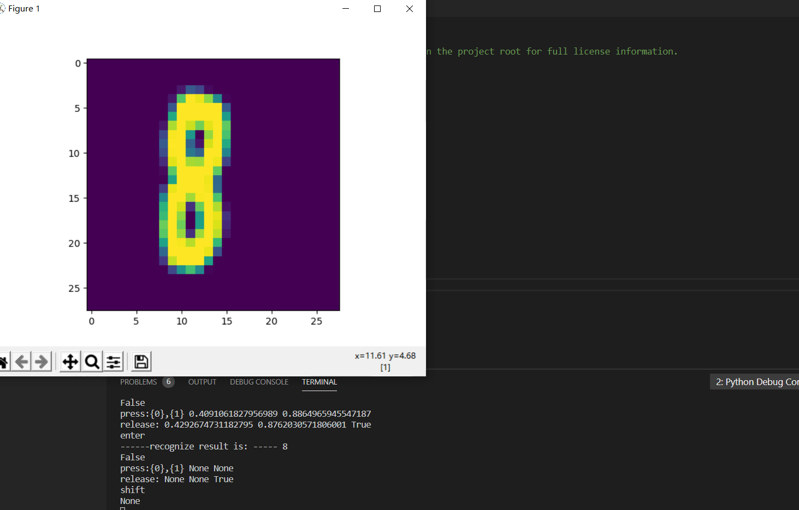
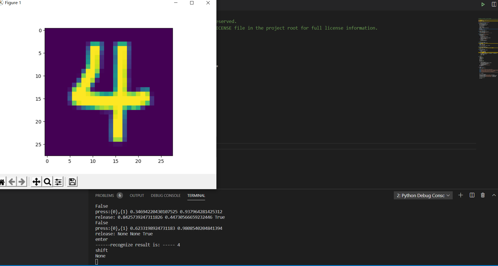
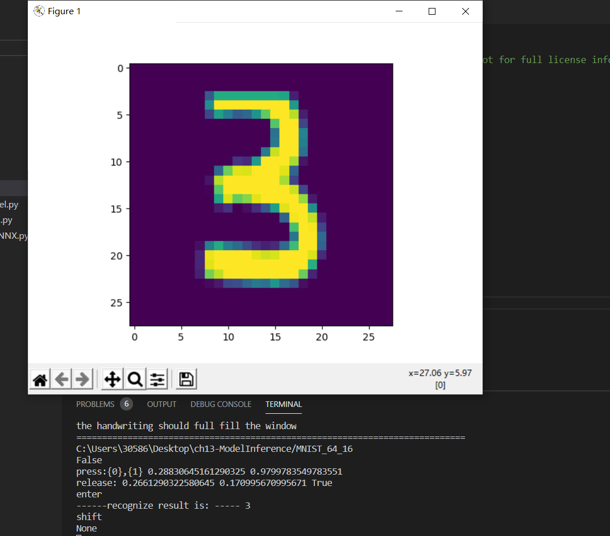
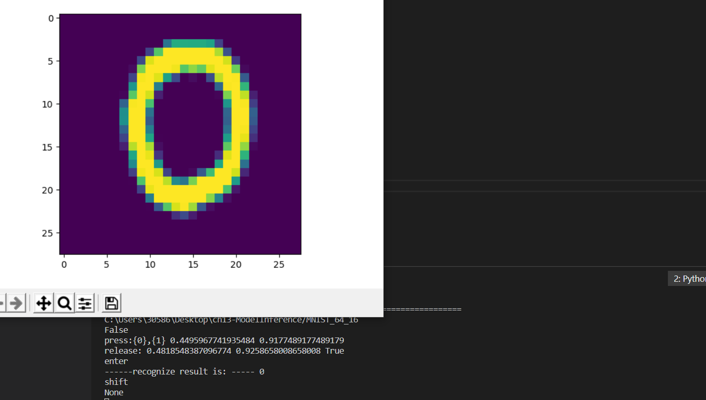
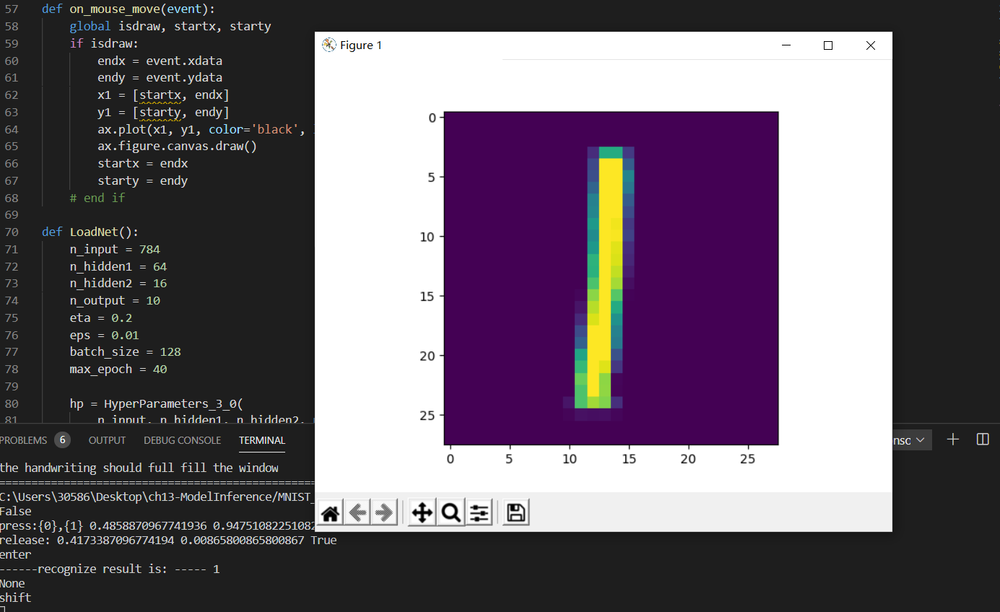


# 神经网络基本原理简明教程

## 神经网络中的三大重要概念

神经网络的三大概念是：反向传播、梯度下降、损失函数
神经网络训练基本思想是：先猜(初始化)观察与y的差距，然后慢慢调整它。直至预测结果与真实结果接近。

总结反向传播与梯度下降的基本工作原理和步骤如下：
1.初始化。
2.正向计算。
3.损失函数： 为我们提供了计算损失的方法。
4.梯度下降： 在损失函数基础上向着损失最小的点靠近， 从而指引了网络权重调整的方向。
5.反向传播： 把损失值反向传给神经网络的各层， 让各层都可以根据损失值反向调整权重。
6.重复正向计算过程， 直到精度满足要求（比如损失函数值小于 0.001）

### 线性反向传播

反向线性传播例题

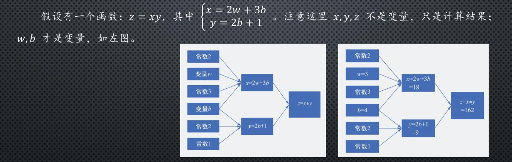
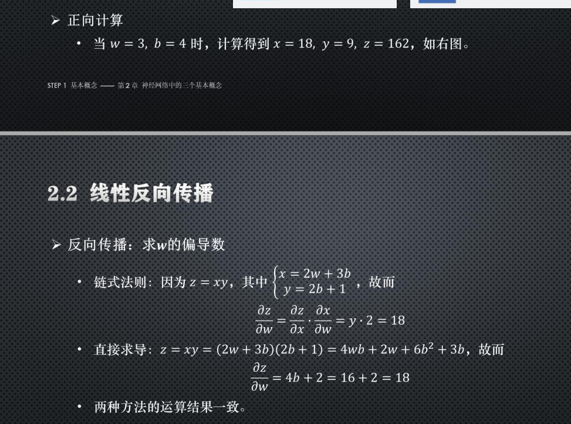
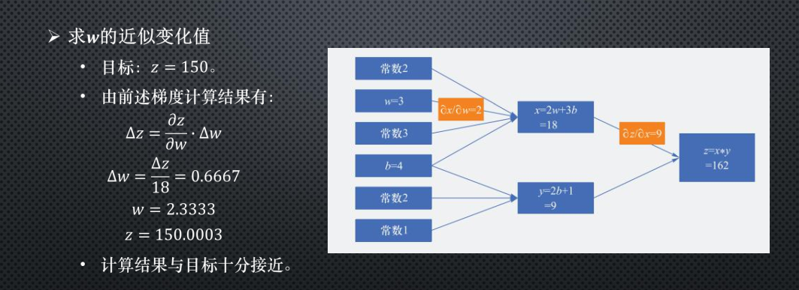

思路：1.正向计算，通过经验去猜测两个变量的值；然后我们计算一些函数值 2.对任意一个变量求偏导3. 题目条件给出目标值，那么我们函数的变化量=刚刚计算的偏导*该参数的变化量4.对这个公式进行变化，把那个变化量变为变量，因为题目已经给出目标值所以这就可以通过变化公式计算出真正变量的变化值(与估算的偏差值)，然后可以算出目标变量，然后带入就全部出来了

如果是同时就两个参数其实步骤都是一直只是最后将函数值的估计偏差除以二然后计算

## 梯度下降

公式
$$\theta_{n+1} = \theta_{n} - \eta \cdot \nabla J(\theta) \tag{1}$$

所谓梯度下降

梯度：函数当前位置的最快上升点；
下降：与导数相反的方向，用数学语言描述就是那个减号。
需要注意的当前点、方向、步长。

目的 梯度下降的目的就是使得x值向极值点逼近。

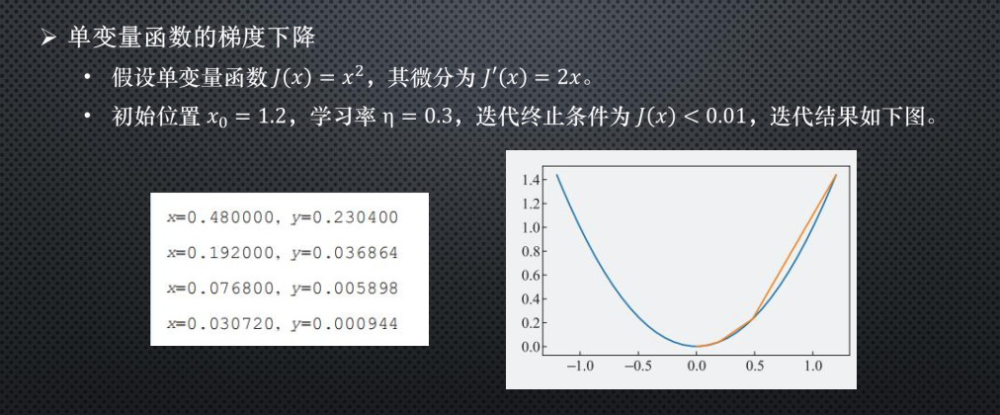
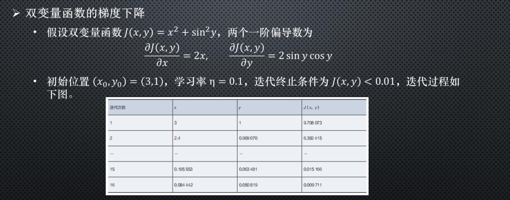

思路：首先从公式我们就可以看出这是一个迭代的过程，无论是单变量还是双变量我们只需要对每一个变量求偏导，带入初始值然后将 $\nabla$ $J(\theta)$带入公式对代，达到或者小于题目给定偏差值结束

## 损失函数

用随机值初始化前向计算公式的参数。
1.代入样本， 计算输出的预测值。
2.用损失函数计算预测值和标签值（真实值） 的误差。
3.根据损失函数的导数， 沿梯度最小方向将误差回传， 修正前向计算公式中的各个权重值。
4.重复步骤2， 直到损失函数值达到一个满意的值就停止迭代。

## 常用样本损失

符号规则：$a$ 是预测值，$y$ 是样本标签值，$loss$ 是损失函数值。

- Gold Standard Loss，又称0-1误差
$$
loss=\begin{cases}
0 & a=y \\\\
1 & a \ne y 
\end{cases}
$$

- 绝对值损失函数

$$
loss = |y-a|
$$

- Hinge Loss，铰链/折页损失函数或最大边界损失函数，主要用于SVM（支持向量机）中

$$
loss=\max(0,1-y \cdot a) \qquad y=\pm 1
$$

- Log Loss，对数损失函数，又叫交叉熵损失函数(cross entropy error)

$$
loss = -[y \cdot \ln (a) + (1-y) \cdot \ln (1-a)]  \qquad y \in \\{ 0,1 \\} 
$$

- Squared Loss，均方差损失函数
$$
loss=(a-y)^2
$$

- Exponential Loss，指数损失函数
$$
loss = e^{-(y \cdot a)}
$$


## 用二维函数解释梯度下降与损失函数

下面的图，纵坐标是损失函数值，横坐标是变量。 我们改变横坐标，损失函数值下降或者上升，梯度下降算法就是让计算沿着损失函数下降的方向前进
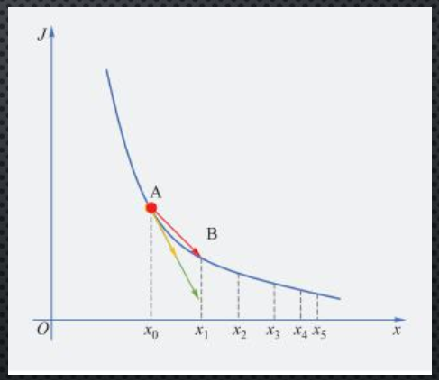

## 均方差函数

MSE - Mean Square Error。

该函数就是最直观的一个损失函数了，计算预测值和真实值之间的欧式距离。预测值和真实值越接近，两者的均方差就越小。

均方差函数常用于线性回归(linear regression)，即函数拟合(function fitting)。公式如下：

$$
loss = {1 \over 2}(z-y)^2 \tag{单样本}
$$

$$
J=\frac{1}{2m} \sum_{i=1}^m (z_i-y_i)^2 \tag{多样本}
$$

### 工作原理

要想得到预测值 $a$ 与真实值 $y$ 的差距，最朴素的想法就是用 $Error=a_i-y_i$。

对于单个样本来说，这样做没问题，但是多个样本累计时，$a_i-y_i$ 可能有正有负，误差求和时就会导致相互抵消，从而失去价值。所以有了绝对值差的想法，即 $Error=|a_i-y_i|$ 。这看上去很简单，并且也很理想，那为什么还要引入均方差损失函数呢？两种损失函数的比较如表3-1所示。

表3-1 绝对值损失函数与均方差损失函数的比较

|样本标签值|样本预测值|绝对值损失函数|均方差损失函数|
|------|------|------|------|
|$[1,1,1]$|$[1,2,3]$|$(1-1)+(2-1)+(3-1)=3$|$(1-1)^2+(2-1)^2+(3-1)^2=5$|
|$[1,1,1]$|$[1,3,3]$|$(1-1)+(3-1)+(3-1)=4$|$(1-1)^2+(3-1)^2+(3-1)^2=8$|
|||$4/3=1.33$|$8/5=1.6$|

可以看到5比3已经大了很多，8比4大了一倍，而8比5也放大了某个样本的局部损失对全局带来的影响，用术语说，就是“对某些偏离大的样本比较敏感”，从而引起监督训练过程的足够重视，以便回传误差。

## 梯度下降

### 公式理解
梯度下降的数学公式：

$$\theta_{n+1} = \theta_{n} - \eta \cdot \nabla J(\theta) \tag{1}$$


其中：

 $\theta_{n+1}$：下一个值；
 $\theta_n$：当前值；
  $-$：减号，梯度的反向；
  $\eta$：学习率或步长，控制每一步走的距离，不要太快以免错过了最佳景点，不要太慢以免时间太长；
  $\nabla$：梯度，函数当前位置的最快上升点；
  $J(\theta)$：函数。
  
#### 定义理解
所谓梯度下降
1. **梯度**：函数当前位置的最快上升点；
2. **下降**：与导数相反的方向，用数学语言描述就是那个减号。

需要注意的
1. **当前点**；
2. **方向**；
3. **步长**。

**目的**
梯度下降的目的就是使得x值向极值点逼近。

### 试例

假设一个单变量函数：

$$J(x) = x ^2$$

我们的目的是找到该函数的最小值，于是计算其微分：

$$J'(x) = 2x ---梯度$$

假设初始位置为：

$$x_0=1.2$$

假设学习率：

  $$\eta = 0.3$$

根据公式(1)，迭代公式：

$$x_{n+1} = x_{n} - \eta \cdot \nabla J(x)= x_{n} - \eta \cdot 2x$$

假设终止条件为 $J(x)<0.01$，迭代过程是：

```
x=0.480000, y=0.230400
x=0.192000, y=0.036864
x=0.076800, y=0.005898
x=0.030720, y=0.000944
```

**慢慢接近目标极值**

### 双变量的梯度下降

假设一个双变量函数：

$$J(x,y) = x^2 + \sin^2(y)$$

**由于涉及两个变量我们可以对每一个变量去分析，单独对每一个变量求偏导**

我们的目的是找到该函数的最小值，于是计算其微分：

$${\partial{J(x,y)} \over \partial{x}} = 2x$$
$${\partial{J(x,y)} \over \partial{y}} = 2 \sin y \cos y$$

假设初始位置为：**和之前一样假设初始位置《猜》**

$$(x_0,y_0)=(3,1)$$

假设学习率：

$$\eta = 0.1$$

根据公式(1)，迭代过程是的计算公式：
$$(x_{n+1},y_{n+1}) = (x_n,y_n) - \eta \cdot \nabla J(x,y)$$
$$ = (x_n,y_n) - \eta \cdot (2x,2 \cdot \sin y \cdot \cos y) \tag{1}$$

根据公式(1)，假设终止条件为 $J(x,y)<0.01$，迭代过程如表2-3所示。

表2-3 双变量梯度下降的迭代过程

|迭代次数|x|y|J(x,y)|
|---|---|---|---|
|1|3|1|9.708073|
|2|2.4|0.909070|6.382415|
|...|...|...|...|
|15|0.105553|0.063481|0.015166|
|16|0.084442|0.050819|0.009711|

迭代16次后，$J(x,y)$ 的值为 $0.009711$，满足小于 $0.01$ 的条件，停止迭代。

### 学习率η的分析与选择

|学习率|迭代路线图|说明|
|---|---|---|
|1.0|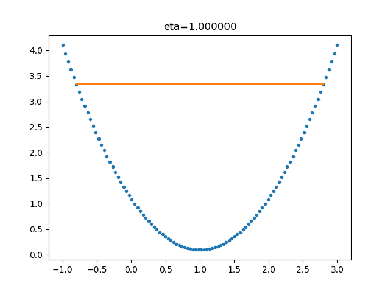|学习率太大，迭代的情况很糟糕，在一条水平线上跳来跳去，永远也不能下降。|
|0.8|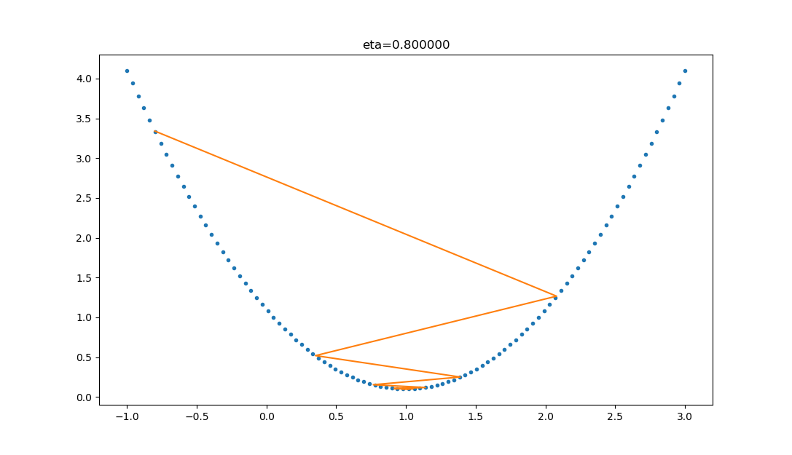|学习率大，会有这种左右跳跃的情况发生，这不利于神经网络的训练。|
|0.4|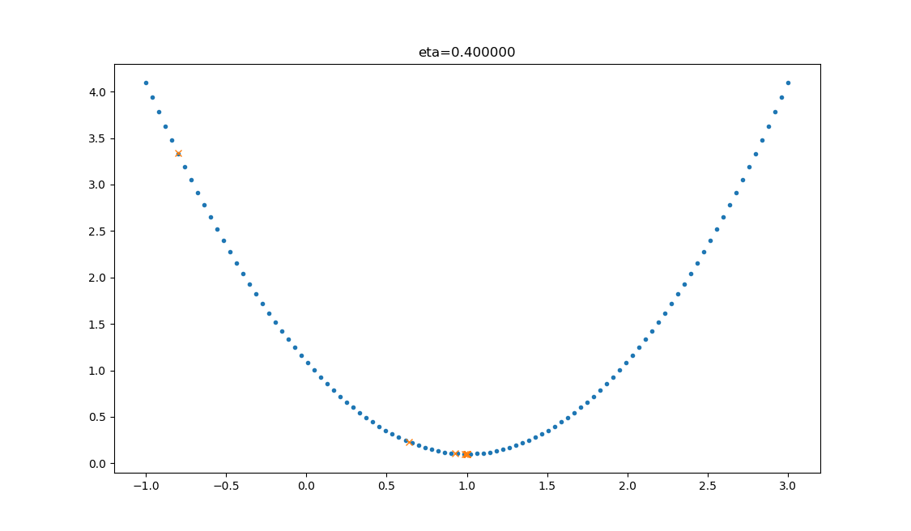|学习率合适，损失值会从单侧下降，4步以后基本接近了理想值。|
|0.1|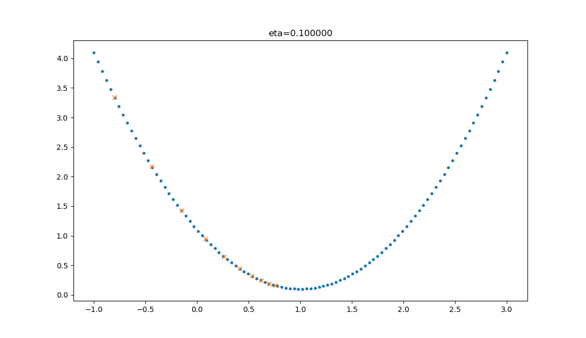|学习率较小，损失值会从单侧下降，但下降速度非常慢，10步了还没有到达理想状态。|

学习率并不是越大越好，也不是越小越好

## 分类函数

### 概念

对线性和非线性二分类都适用。
对率函数Logistic Function，即可以做为激活函数使用，又可以当作二分类函数使用。
在二分类任务中，叫做Logistic函数，而在作为激活函数时，叫做Sigmoid函数。

Logistic函数公式

$$Logistic(z) = \frac{1}{1 + e^{-z}}$$

以下记 $a=Logistic(z)$。

导数

$$Logistic'(z) = a(1 - a)$$

具体求导过程可以参考8.1节。

输入值域

$$(-\infty, \infty)$$

输出值域

$$(0,1)$$

函数图像

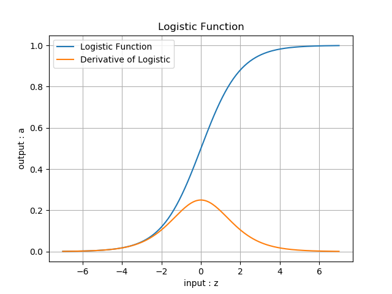

## 用神经网络实现线性二分类

### 定义神经网络结构

根据前面的猜测，看来我们只需要一个二入一出的神经元就可以搞定。这个网络只有输入层和输出层，由于输入层不算在内，所以是一层网络，见图6-3。


完成二分类任务的神经元结构

与上一章的网络结构图的区别是，这次我们在神经元输出时使用了分类函数，所以输出为 $A$，而不是以往直接输出的 $Z$。

#### 输入层

输入经度 $x_1$ 和纬度 $x_2$ 两个特征：

$$
X=\begin{pmatrix}
x_{1} & x_{2}
\end{pmatrix}
$$

#### 权重矩阵

输入是2个特征，输出一个数，则 $W$ 的尺寸就是 $2\times 1$：

$$
W=\begin{pmatrix}
w_{1} \\\\ w_{2}
\end{pmatrix}
$$

$B$ 的尺寸是 $1\times 1$，行数永远是1，列数永远和 $W$ 一样。

$$
B=\begin{pmatrix}
b
\end{pmatrix}
$$

#### 输出层

$$
\begin{aligned}    
z &= X \cdot W + B
=\begin{pmatrix}
    x_1 & x_2
\end{pmatrix}
\begin{pmatrix}
    w_1 \\\\ w_2
\end{pmatrix} + b \\\\
&=x_1 \cdot w_1 + x_2 \cdot w_2 + b 
\end{aligned}
\tag{1}
$$
$$a = Logistic(z) \tag{2}$$

#### 损失函数

二分类交叉熵损失函数：

$$
loss(W,B) = -[y\ln a+(1-y)\ln(1-a)] \tag{3}
$$

### 反向传播

我们在6.1节已经推导了 $loss$ 对 $z$ 的偏导数，结论为 $A-Y$。接下来，我们求 $loss$ 对 $W$ 的导数。本例中，$W$ 的形式是一个2行1列的向量，所以求 $W$ 的偏导时，要对向量求导：

$$
\frac{\partial loss}{\partial w}=
\begin{pmatrix}
    \frac{\partial loss}{\partial w_1} \\\\ 
    \frac{\partial loss}{\partial w_2}
\end{pmatrix}
$$
$$
=\begin{pmatrix}
 \frac{\partial loss}{\partial z}\frac{\partial z}{\partial w_1} \\\\
 \frac{\partial loss}{\partial z}\frac{\partial z}{\partial w_2}   
\end{pmatrix}
=\begin{pmatrix}
    (a-y)x_1 \\\\
    (a-y)x_2
\end{pmatrix}
$$
$$
=(x_1 \ x_2)^{\top} (a-y) \tag{4}
$$

上式中$x_1,x_2$是一个样本的两个特征值。如果是多样本的话，公式4将会变成其矩阵形式，以3个样本为例：

$$
\frac{\partial J(W,B)}{\partial W}=
\begin{pmatrix}
    x_{11} & x_{12} \\\\
    x_{21} & x_{22} \\\\
    x_{31} & x_{32} 
\end{pmatrix}^{\top}
\begin{pmatrix}
    a_1-y_1 \\\\
    a_2-y_2 \\\\
    a_3-y_3 
\end{pmatrix}
=X^{\top}(A-Y) \tag{5}
$$

## 线性二分类原理

### 基本公式回顾

下面我们以单样本双特征值为例来说明神经网络的二分类过程，这是用代数方式来解释其工作原理。

1. 正向计算

$$
z = x_1 w_1+ x_2 w_2 + b  \tag{1}
$$

2. 分类计算

$$
a={1 \over 1 + e^{-z}} \tag{2}
$$

3. 损失函数计算

$$
loss = -[y \ln (a)+(1-y) \ln (1-a)] \tag{3}
$$

## 线性回归

围绕的方法
1. 最小二乘法；
2. 梯度下降法；
3. 简单的神经网络法；
4. 更通用的神经网络算法。

线性公式中 $W$ 和 $X$ 的顺序问题

$$Y = W^{\top}X+B \tag{1}$$

或者：

$$Y = W \cdot X + B \tag{2}$$

而我们在本书中使用：

$$Y = X \cdot W + B \tag{3}$$

这三者的主要区别是样本数据 $X$ 的形状定义，相应地会影响到 $W$ 的形状定义。举例来说，如果 $X$ 有三个特征值，那么 $W$ 必须有三个权重值与特征值对应，则：

### 公式1的矩阵形式

$X$ 是列向量：

$$
X=
\begin{pmatrix}
x_{1} \\\\
x_{2} \\\\
x_{3}
\end{pmatrix}
$$

$W$ 也是列向量：

$$
W=
\begin{pmatrix}
w_{1} \\\\ w_{2} \\\\ w_{3}
\end{pmatrix}
$$
$$
Y=W^{\top}X+B=
\begin{pmatrix}
w_1 & w_2 & w_3
\end{pmatrix}
\begin{pmatrix}
x_{1} \\\\
x_{2} \\\\
x_{3}
\end{pmatrix}
+b
$$
$$
=w_1 \cdot x_1 + w_2 \cdot x_2 + w_3 \cdot x_3 + b \tag{4}
$$

$W$ 和 $X$ 都是列向量，所以需要先把 $W$ 转置后，再与 $X$ 做矩阵乘法。

### 公式2的矩阵形式

公式2与公式1的区别是 $W$ 的形状，在公式2中，$W$ 是个行向量：

$$
W=
\begin{pmatrix}
w_{1} & w_{2} & w_{3}
\end{pmatrix}
$$

而 $X$ 的形状仍然是列向量：

$$
X=
\begin{pmatrix}
x_{1} \\\\
x_{2} \\\\
x_{3}
\end{pmatrix}
$$

这样相乘之前不需要做矩阵转置了：

$$
Y=W \cdot X+B=
\begin{pmatrix}
w_1 & w_2 & w_3
\end{pmatrix}
\begin{pmatrix}
x_{1} \\\\
x_{2} \\\\
x_{3}
\end{pmatrix}
+b
$$
$$
=w_1 \cdot x_1 + w_2 \cdot x_2 + w_3 \cdot x_3 + b \tag{5}
$$

### 公式3的矩阵形式

$X$ 是个行向量：

$$
X=
\begin{pmatrix}
x_{1} & x_{2} & x_{3}
\end{pmatrix}
$$

$W$ 是列向量：

$$
W=
\begin{pmatrix}
w_{1} \\\\ w_{2} \\\\ w_{3}
\end{pmatrix}
$$

所以 $X$ 在前，$W$ 在后：

$$
Y=X \cdot W+B=
\begin{pmatrix}
x_1 & x_2 & x_3
\end{pmatrix}
\begin{pmatrix}
w_{1} \\\\
w_{2} \\\\
w_{3}
\end{pmatrix}
+b
$$
$$
=x_1 \cdot w_1 + x_2 \cdot w_2 + x_3 \cdot w_3 + b \tag{6}
$$

## 最小二乘法

### 概念及其意义

小二乘法，也叫做最小平方法（Least Square），它通过最小化误差的平方和寻找数据的最佳函数匹配。利用最小二乘法可以简便地求得未知的数据，并使得这些求得的数据与实际数据之间误差的平方和为最小。最小二乘法还可用于曲线拟合。其他一些优化问题也可通过最小化能量或最小二乘法来表达。

### 原理

线性回归试图学得：

$$z_i=w \cdot x_i+b \tag{1}$$

使得：

$$z_i \simeq y_i \tag{2}$$

其中，$x_i$ 是样本特征值，$y_i$ 是样本标签值，$z_i$ 是模型预测值。

如何学得 $w$ 和 $b$ 呢？均方差(MSE - mean squared error)是回归任务中常用的手段：
$$
J = \frac{1}{2m}\sum_{i=1}^m(z_i-y_i)^2 = \frac{1}{2m}\sum_{i=1}^m(y_i-wx_i-b)^2 \tag{3}
$$

$J$ 称为损失函数。实际上就是试图找到一条直线，使所有样本到直线上的残差的平方和最小。

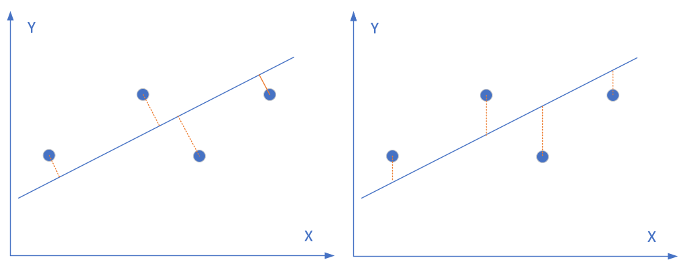

圆形点是样本点，直线是当前的拟合结果。如左图所示，我们是要计算样本点到直线的垂直距离，需要再根据直线的斜率来求垂足然后再计算距离，这样计算起来很慢；但实际上，在工程上我们通常使用的是右图的方式，即样本点到直线的竖直距离，因为这样计算很方便，用一个减法就可以了。
因为图中的几个点不在一条直线上，所以不存在一条直线能同时穿过它们。所以，我们只能想办法让总体误差最小，就意味着整体偏差最小，那么最终的那条直线就是要求的结果。

如果想让误差的值最小，通过对 $w$ 和 $b$ 求导，再令导数为 $0$（到达最小极值），就是 $w$ 和 $b$ 的最优解。

**思路**：通过对 $w$ 和 $b$ 求导，再令导数为 $0$（到达最小极值），就是 $w$ 和 $b$ 的最优解

$$
w = \frac{m\sum_{i=1}^m x_i y_i - \sum_{i=1}^m x_i \sum_{i=1}^m y_i}{m\sum_{i=1}^m x^2_i - (\sum_{i=1}^m x_i)^2} \tag{4}
$$

$$
b= \frac{1}{m} \sum_{i=1}^m(y_i-wx_i) \tag{5}
$$

而事实上，式4有很多个变种，大家会在不同的文章里看到不同版本，往往感到困惑，比如下面两个公式也是正确的解：

$$
w = \frac{\sum_{i=1}^m y_i(x_i-\bar x)}{\sum_{i=1}^m x^2_i - (\sum_{i=1}^m x_i)^2/m} \tag{6}
$$

$$
w = \frac{\sum_{i=1}^m x_i(y_i-\bar y)}{\sum_{i=1}^m x^2_i - \bar x \sum_{i=1}^m x_i} \tag{7}
$$

## 梯度下降法


### 概念及其意义

用梯度下降法求解 $w$ 和 $b$，从而可以比较二者的结果。我们规定 $x$ 是样本特征值（单特征），$y$ 是样本标签值，$z$ 是预测值，下标 $i$ 表示其中一个样本。

### 计算

线性函数：

$$z_i = x_i \cdot w + b \tag{1}$$

均方误差：

$$loss_i(w,b) = \frac{1}{2} (z_i-y_i)^2 \tag{2}$$

#### 计算z的梯度

根据公式2：
$$
\frac{\partial loss}{\partial z_i}=z_i - y_i \tag{3}
$$

#### 计算 $w$ 的梯度

我们用 $loss$ 的值作为误差衡量标准，通过求 $w$ 对它的影响，也就是 $loss$ 对 $w$ 的偏导数，来得到 $w$ 的梯度。由于 $loss$ 是通过公式2->公式1间接地联系到 $w$ 的，所以我们使用链式求导法则，通过单个样本来求导。

根据公式1和公式3：

$$
\frac{\partial{loss}}{\partial{w}} = \frac{\partial{loss}}{\partial{z_i}}\frac{\partial{z_i}}{\partial{w}}=(z_i-y_i)x_i \tag{4}
$$

#### 计算 $b$ 的梯度

$$
\frac{\partial{loss}}{\partial{b}} = \frac{\partial{loss}}{\partial{z_i}}\frac{\partial{z_i}}{\partial{b}}=z_i-y_i \tag{5}
$$

## 神经网络法

在梯度下降法中，我们简单讲述了一下神经网络做线性拟合的原理，即：

1. 初始化权重值
2. 根据权重值放出一个解
3. 根据均方差函数求误差
4. 误差反向传播给线性计算部分以调整权重值
5. 是否满足终止条件？不满足的话跳回2

## 定义神经网络结构

我们是首次尝试建立神经网络，先用一个最简单的单层单点神经元，如图4-4所示。

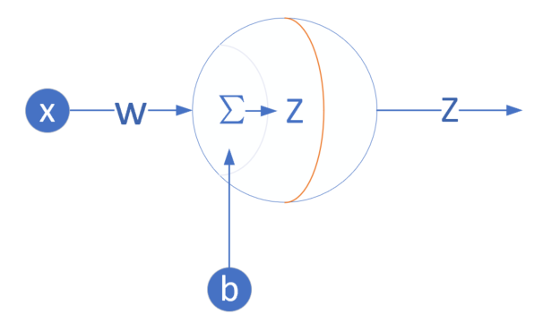

图4-4 单层单点神经元

下面，我们用这个最简单的线性回归的例子，来说明神经网络中最重要的反向传播和梯度下降的概念、过程以及代码实现。

### 输入层

此神经元在输入层只接受一个输入特征，经过参数 $w,b$ 的计算后，直接输出结果。这样一个简单的“网络”，只能解决简单的一元线性回归问题，而且由于是线性的，我们不需要定义激活函数，这就大大简化了程序，而且便于大家循序渐进地理解各种知识点。

严格来说输入层在神经网络中并不能称为一个层。

### 权重 $w,b$

因为是一元线性问题，所以 $w,b$ 都是标量。

### 输出层

输出层 $1$ 个神经元，线性预测公式是：

$$z_i = x_i \cdot w + b$$

$z$ 是模型的预测输出，$y$ 是实际的样本标签值，下标 $i$ 为样本。

### 损失函数

因为是线性回归问题，所以损失函数使用均方差函数。

$$loss(w,b) = \frac{1}{2} (z_i-y_i)^2$$

## 激活函数

### 介绍

神经网络中的一个神经元，假设该神经元有三个输入，分别为$x_1,x_2,x_3$，那么：

$$z=x_1 w_1 + x_2 w_2 + x_3 w_3 +b \tag{1}$$
$$a = \sigma(z) \tag{2}$$

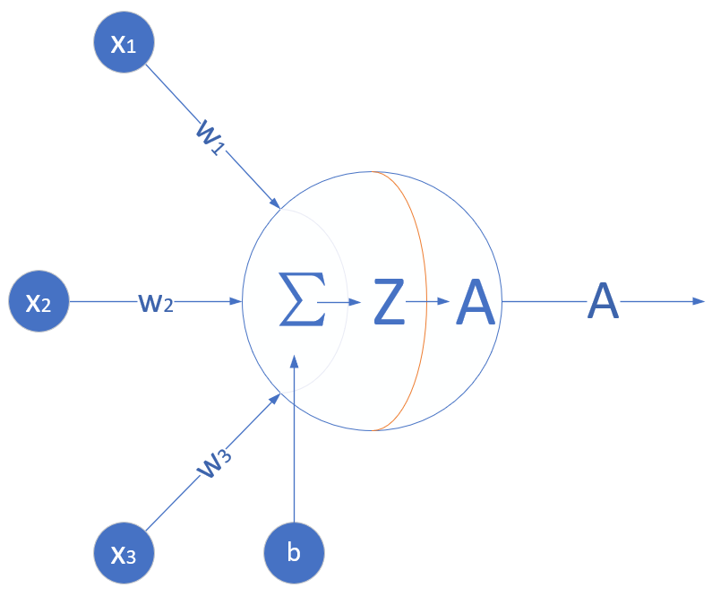

激活函数(2)
作用：

1. 给神经网络增加非线性因素
2. 把公式1的计算结果压缩到 $[0,1]$ 之间，便于后面的计算。

基本性质：非线性：线性的激活函数和没有激活函数一样；
         可导性：做误差反向传播和梯度下降，必须要保证激活函数的可导性；
         单调性：单一的输入会得到单一的输出，较大值的输入得到较大值的输出。

### Logistic函数

对数几率函数（Logistic Function，简称对率函数）。

很多文字材料中通常把激活函数和分类函数混淆在一起说，有一个原因是：在二分类任务中最后一层使用的对率函数与在神经网络层与层之间连接的Sigmoid激活函数，是同样的形式。所以它既是激活函数，又是分类函数，是个特例。

对这个函数的叫法比较混乱，在本书中我们约定一下，凡是用到“Logistic”词汇的，指的是二分类函数；而用到“Sigmoid”词汇的，指的是本激活函数。

**公式**
$$Sigmoid(z) = \frac{1}{1 + e^{-z}} \rightarrow a \tag{1}$$
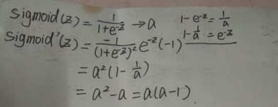
**导数**
$$Sigmoid'(z) = a(1 - a) \tag{2}$$

注意，如果是矩阵运算的话，需要在公式2中使用$\odot$符号表示按元素的矩阵相乘：$a\odot (1-a)$，后面不再强调。

**值域**

- 输入值域：$(-\infty, \infty)$
- 输出值域：$(0,1)$
- 导数值域：$(0,0.25]$

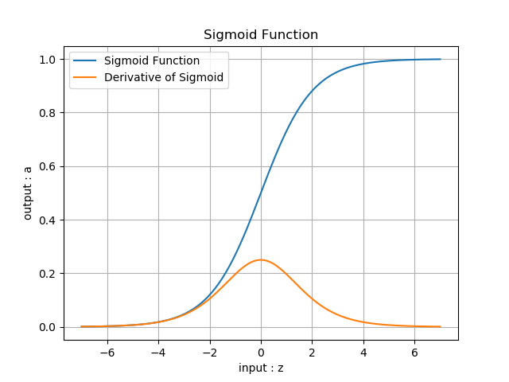

### Tanh函数

公式  
$$Tanh(z) = \frac{e^{z} - e^{-z}}{e^{z} + e^{-z}} = (\frac{2}{1 + e^{-2z}}-1) \rightarrow a \tag{3}$$
即

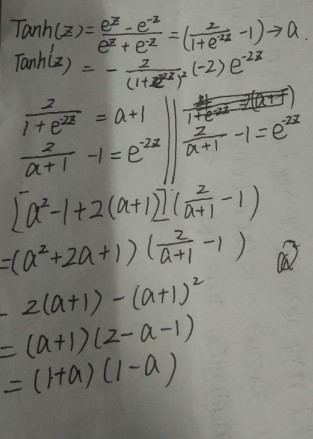

$$Tanh'(z) = (1 + a)(1 - a)$$

**值域**

- 输入值域：$(-\infty,\infty)$
- 输出值域：$(-1,1)$
- 导数值域：$(0,1)$

函数图像

图8-4是双曲正切的函数图像。


## ReLU函数 

Rectified Linear Unit，修正线性单元，线性整流函数，斜坡函数。

**公式**

$$ReLU(z) = max(0,z) = \begin{cases} 
  z, & z \geq 0 \\\\ 
  0, & z < 0 
\end{cases}$$

**导数**

$$ReLU'(z) = \begin{cases} 1 & z \geq 0 \\\\ 0 & z < 0 \end{cases}$$

**值域**

- 输入值域：$(-\infty, \infty)$
- 输出值域：$(0,\infty)$
- 导数值域：$\\{0,1\\}$


<font face="宋体" color = "orange"> 

## **学习总结**
  讲了很多内容但是我认为我们现在这个阶段能够掌握的或者必须掌握的有反向传播、梯度下降、损失函数、正向传播、最小二乘法、梯度下降法、网络神经法、二分类函数、线性二分类、激活函数的性质（Sigmoid、Logistic、Tanh）、非线性分类、梯度检查、学习率概念、梯度检测查。其中反向传播、梯度下降、损失函数、正向传播是最基础的也是最重要的，因为后面会频繁地使用它，而且后面要使用他们来分析问题，这里我简要分析一下他们，梯度下降，“梯度”是指函数当前位置的最快上升点。“下降”是指与导数相反的方向，用数学语言描述就是那个减号，就是与上升相反的方向。另外在讲解中我也学到了单变量梯度下降与双变量梯度下降的差别，了解到梯度下降对神经网络研究的重要性。另外我学习了神经网络中常用的两种损失函数，其中均方差函数，主要用于回归；交叉熵函数，主要用于分类。这两种损失函数对我们解决神经网络中的一些问题是很有用的，线性回归问题的方：1最小二乘法2 梯度下降法3 简单的神经网络法4 更通用的神经网络算法。梯度下降的三种形式，即最小二乘法、梯度下降法、神经网络法；另外神经网络中的线性分类问题，神经网络的一个重要功能就是分类，在线性多分类问题中主要讲解了一对一、一对多、多对多的问题，两层神经网络的学习，在两层神经网络之间，必须有激活函数连接，从而加入非线性因素，提高神经网络的能力。所以，我们先从激活函数学起，一类是挤压型的激活函数，常用于简单网络的学习；另一类是半线性的激活函数，常用于深度网络的学习。然后，我们又学习了生活中非线性问题的解决方法--非线性回归，另外用一些回归方法去拟合一些曲线。非线性问题在工程实践中比较常见，我学到了用线性回归的方法去解决这个问题，这就体现出了神经网络的作用，它能为我们解决一些常见的难题。另外之前学习了上面的python代码，算法明白了，代码有很多方法去实现，而且前面几章我发现书给的代码是很相似的。

## **心得体会**

这门课其实我们如果全部看就会感觉很难，但是如果我们从一些基础的地方开始学，把基础的地方搞懂，后面就容易理解些，而且每一本教材的章节编排都是有一定的道理的。如果只看书的话肯定是不能理解的，我们还需要查阅资料和将代码在自己电脑上跑一边，慢慢分析，学习就是这样从啥都不会慢慢积累深入，当然开始是很难的，但后面就逐渐好起来了
</font>


