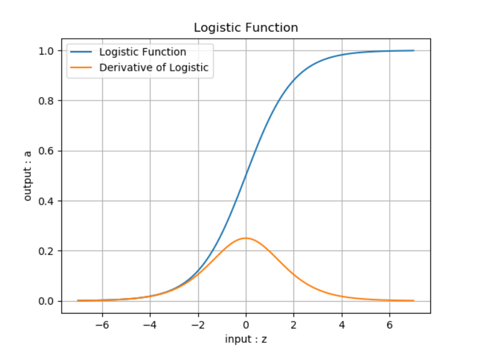
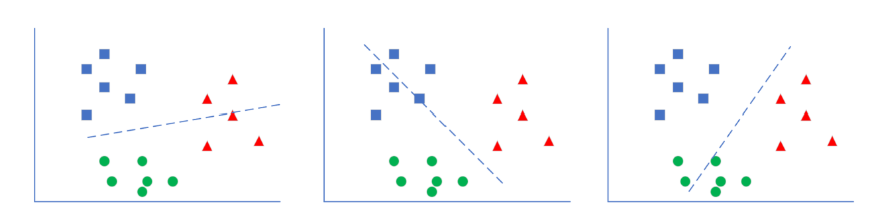
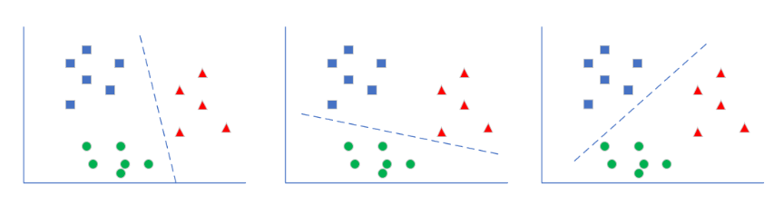
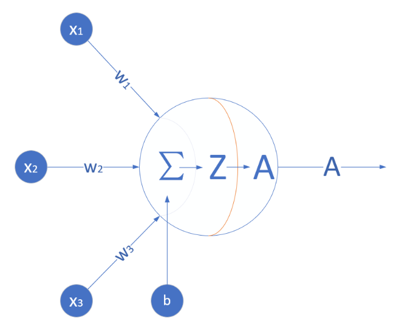
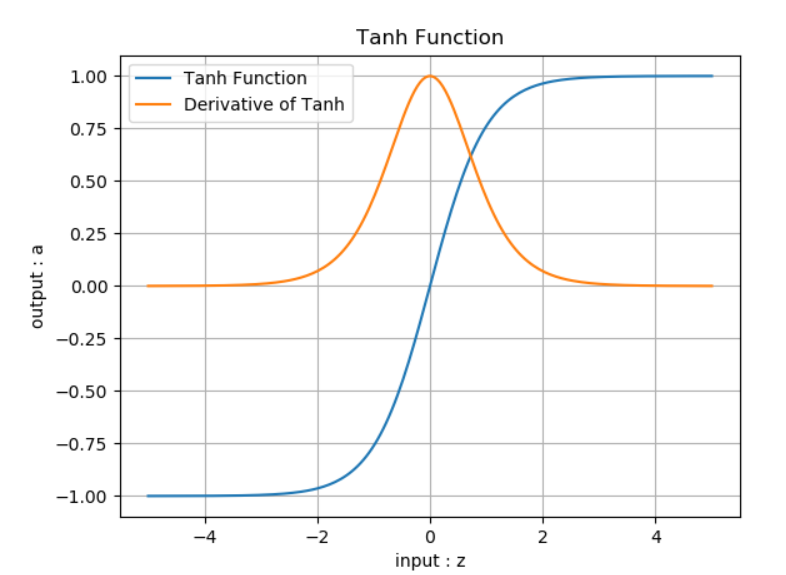
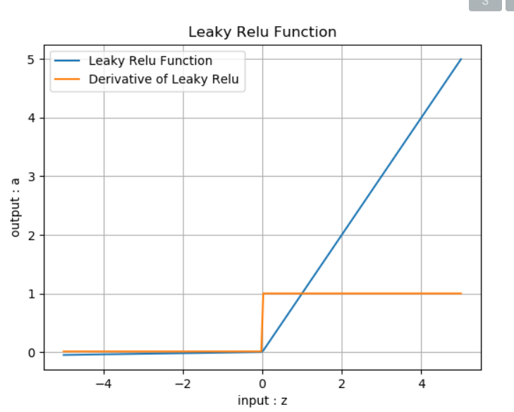
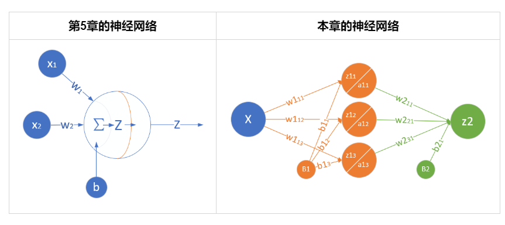

# 单入单出的单层神经网络 - 单变量线性回归

## 单变量线性回归问题

### 一元线性回归模型
模型是：

$$Y=a+bX+\varepsilon $$

$X$ 是自变量，$Y$ 是因变量，$\varepsilon$ 是随机误差，$a$ 和 $b$ 是参数，在线性回归模型中，$a,b$ 是我们要通过算法学习出来的。

对于线性回归模型，有如下一些概念：

- 通常假定随机误差 $\varepsilon$ 的均值为 $0$，方差为$σ^2$（$σ^2>0$，$σ^2$ 与 $X$ 的值无关）
- 若进一步假定随机误差遵从正态分布，就叫做正态线性模型
- 一般地，若有 $k$ 个自变量和 $1$ 个因变量（即公式1中的 $Y$），则因变量的值分为两部分：一部分由自变量影响，即表示为它的函数，函数形式已知且含有未知参数；另一部分由其他的未考虑因素和随机性影响，即随机误差
- 当函数为参数未知的线性函数时，称为线性回归分析模型
- 当函数为参数未知的非线性函数时，称为非线性回归分析模型
- 当自变量个数大于 $1$ 时称为多元回归
- 当因变量个数大于 $1$ 时称为多重回归


### 公式形态

$$Y = X \cdot W + B $$

## 最小二乘法

### 数学原理

线性回归试图学得：

$$z_i=w \cdot x_i+b $$

使得：

$$z_i \simeq y_i $$

其中，$x_i$ 是样本特征值，$y_i$ 是样本标签值，$z_i$ 是模型预测值。

通过推导得到：

$$
w = \frac{m\sum_{i=1}^m x_i y_i - \sum_{i=1}^m x_i \sum_{i=1}^m y_i}{m\sum_{i=1}^m x^2_i - (\sum_{i=1}^m x_i)^2} 
$$

$$
b= \frac{1}{m} \sum_{i=1}^m(y_i-wx_i) 
$$

## 梯度下降法

### 数学原理
规定 $x$ 是样本特征值（单特征），$y$ 是样本标签值，$z$ 是预测值，下标 $i$ 表示其中一个样本。

#### 预设函数（Hypothesis Function）

线性函数：

$$z_i = x_i \cdot w + b $$

#### 损失函数（Loss Function）

均方误差：

$$loss_i(w,b) = \frac{1}{2} (z_i-y_i)^2$$


与最小二乘法比较可以看到，梯度下降法和最小二乘法的模型及损失函数是相同的，都是一个线性模型加均方差损失函数，模型用于拟合，损失函数用于评估效果。

区别在于，最小二乘法从损失函数求导，直接求得数学解析解，而梯度下降以及后面的神经网络，都是利用导数传递误差，再通过迭代方式一步一步（用近似解）逼近真实解。

### 梯度计算

#### 计算z的梯度

$$
\frac{\partial loss}{\partial z_i}=z_i - y_i
$$

#### 计算 $w$ 的梯度
$$
\frac{\partial{loss}}{\partial{w}} = \frac{\partial{loss}}{\partial{z_i}}\frac{\partial{z_i}}{\partial{w}}=(z_i-y_i)x_i 
$$

#### 计算 $b$ 的梯度

$$
\frac{\partial{loss}}{\partial{b}} = \frac{\partial{loss}}{\partial{z_i}}\frac{\partial{z_i}}{\partial{b}}=z_i-y_i 
$$
## 神经网络法


### 定义神经网络结构
尝试建立神经网络，先用一个最简单的单层单点神经元，如图所示。


#### 输入层

此神经元在输入层只接受一个输入特征，经过参数 $w,b$ 的计算后，直接输出结果。这样一个简单的“网络”，只能解决简单的一元线性回归问题，而且由于是线性的，我们不需要定义激活函数，这就大大简化了程序，而且便于大家循序渐进地理解各种知识点。

严格来说输入层在神经网络中并不能称为一个层。

#### 权重 $w,b$

因为是一元线性问题，所以 $w,b$ 都是标量。

#### 输出层

输出层 $1$ 个神经元，线性预测公式是：

$$z_i = x_i \cdot w + b$$

$z$ 是模型的预测输出，$y$ 是实际的样本标签值，下标 $i$ 为样本。

#### 损失函数

因为是线性回归问题，所以损失函数使用均方差函数。

$$loss(w,b) = \frac{1}{2} (z_i-y_i)^2$$

### 反向传播

#### 计算 $w$ 的梯度

$$
{\partial{loss} \over \partial{w}} = \frac{\partial{loss}}{\partial{z_i}}\frac{\partial{z_i}}{\partial{w}}=(z_i-y_i)x_i
$$

#### 计算 $b$ 的梯度

$$
\frac{\partial{loss}}{\partial{b}} = \frac{\partial{loss}}{\partial{z_i}}\frac{\partial{z_i}}{\partial{b}}=z_i-y_i
$$

## 多样本单特征值计算
### 前向计算
 $x_i$ 表示第 $i$ 个样本，$X$ 是样本组成的矩阵，$Z$ 是计算结果矩阵，$w$ 和 $b$ 都是标量：

$$
Z = X \cdot w + b 
$$

把它展开成3个样本（3行，每行代表一个样本）的形式：

$$
X=\begin{pmatrix}
    x_1 \\\\ 
    x_2 \\\\ 
    x_3
\end{pmatrix}
$$

$$
Z= 
\begin{pmatrix}
    x_1 \\\\ 
    x_2 \\\\ 
    x_3
\end{pmatrix} \cdot w + b 
=\begin{pmatrix}
    x_1 \cdot w + b \\\\ 
    x_2 \cdot w + b \\\\ 
    x_3 \cdot w + b
\end{pmatrix}
=\begin{pmatrix}
    z_1 \\\\ 
    z_2 \\\\ 
    z_3
\end{pmatrix}
$$
### 损失函数

用传统的均方差函数，其中，$z$ 是每一次迭代的预测输出，$y$ 是样本标签数据。我们使用 $m$ 个样本参与计算，因此损失函数为：

$$J(w,b) = \frac{1}{2m}\sum_{i=1}^{m}(z_i - y_i)^2$$

其中的分母中有个2，实际上是想在求导数时把这个2约掉，没有什么原则上的区别。

我们假设每次有3个样本参与计算，即 $m=3$，则损失函数实例化后的情形是：

$$
\begin{aligned}
J(w,b) &= \frac{1}{2\times3}[(z_1-y_1)^2+(z_2-y_2)^2+(z_3-y_3)^2] \\\\
&=\frac{1}{2\times3}\sum_{i=1}^3[(z_i-y_i)^2]
\end{aligned} 
$$
### 求 $w$ 的梯度

我们用 $J$ 的值作为基准，去求 $w$ 对它的影响，也就是 $J$ 对 $w$ 的偏导数，就可以得到 $w$ 的梯度了。从公式3看 $J$ 的计算过程，$z_1,z_2,z_3$都对它有贡献；再从公式2看 $z_1,z_2,z_3$ 的生成过程，都有 $w$ 的参与。所以，$J$ 对 $w$ 的偏导应该是这样的：

$$
\begin{aligned}
\frac{\partial{J}}{\partial{w}}&=\frac{\partial{J}}{\partial{z_1}}\frac{\partial{z_1}}{\partial{w}}+\frac{\partial{J}}{\partial{z_2}}\frac{\partial{z_2}}{\partial{w}}+\frac{\partial{J}}{\partial{z_3}}\frac{\partial{z_3}}{\partial{w}} \\\\
&=\frac{1}{3}[(z_1-y_1)x_1+(z_2-y_2)x_2+(z_3-y_3)x_3] \\\\
&=\frac{1}{3}
\begin{pmatrix}
    x_1 & x_2 & x_3
\end{pmatrix}
\begin{pmatrix}
    z_1-y_1 \\\\
    z_2-y_2 \\\\
    z_3-y_3 
\end{pmatrix} \\\\
&=\frac{1}{m} \sum^m_{i=1} (z_i-y_i)x_i \\\\ 
&=\frac{1}{m} X^{\top} \cdot (Z-Y) \\\\ 
\end{aligned} \tag{4}
$$

其中：
$$X = 
\begin{pmatrix}
    x_1 \\\\ 
    x_2 \\\\ 
    x_3
\end{pmatrix}, X^{\top} =
\begin{pmatrix}
    x_1 & x_2 & x_3
\end{pmatrix}
$$

公式4中最后两个等式其实是等价的，只不过倒数第二个公式用求和方式计算每个样本，最后一个公式用矩阵方式做一次性计算。

###  求 $b$ 的梯度

$$
\begin{aligned}    
\frac{\partial{J}}{\partial{b}}&=\frac{\partial{J}}{\partial{z_1}}\frac{\partial{z_1}}{\partial{b}}+\frac{\partial{J}}{\partial{z_2}}\frac{\partial{z_2}}{\partial{b}}+\frac{\partial{J}}{\partial{z_3}}\frac{\partial{z_3}}{\partial{b}} \\\\
&=\frac{1}{3}[(z_1-y_1)+(z_2-y_2)+(z_3-y_3)] \\\\
&=\frac{1}{m} \sum^m_{i=1} (z_i-y_i) \\\\ 
&=\frac{1}{m}(Z-Y)
\end{aligned} \tag{5}
$$

## 梯度下降的三种形式
最小二乘法
梯度下降法
神经网络法

# 多入单出的单层神经网络 - 多变量线性回归

## 多变量线性回归问题

### 多元线性回归模型
多元线性回归的函数模型如下：

$$y=a_0+a_1x_1+a_2x_2+\dots+a_kx_k$$

对于一般的应用问题，建立多元线性回归模型时，为了保证回归模型具有优良的解释能力和预测效果，应首先注意自变量的选择，其准则是：

1. 自变量对因变量必须有显著的影响，并呈密切的线性相关；
2. 自变量与因变量之间的线性相关必须是真实的，而不是形式上的；
3. 自变量之间应具有一定的互斥性，即自变量之间的相关程度不应高于自变量与因变量之因的相关程度；
4. 自变量应具有完整的统计数据，其预测值容易确定。

### 解决方案

两种方法的比较

|方法|正规方程|梯度下降|
|---|-----|-----|
|原理|几次矩阵运算|多次迭代|
|特殊要求|$X^{\top}X$ 的逆矩阵存在|需要确定学习率|
|复杂度|$O(n^3)$|$O(n^2)$|
|适用样本数|$m \lt 10000$|$m \ge 10000$|

## 正规方程解法
### 简单的推导方法

在做函数拟合（回归）时，我们假设函数 $H$ 为：

$$H(w,b) = b + x_1 w_1+x_2 w_2+ \dots +x_n w_n \tag{2}$$

令 $b=w_0$，则：

$$H(W) = w_0 + x_1 \cdot w_1 + x_2 \cdot w_2 + \dots + x_n \cdot w_n\tag{3}$$

公式3中的 $x$ 是一个样本的 $n$ 个特征值，如果我们把 $m$ 个样本一起计算，将会得到下面这个矩阵：

$$H(W) = X \cdot W \tag{4}$$

公式5中的 $X$ 和 $W$ 的矩阵形状如下：

$$
X = 
\begin{pmatrix} 
1 & x_{1,1} & x_{1,2} & \dots & x_{1,n} \\\\
1 & x_{2,1} & x_{2,2} & \dots & x_{2,n} \\\\
\vdots & \vdots & \vdots & \ddots & \vdots \\\\
1 & x_{m,1} & x_{m,2} & \dots & x_{m,n}
\end{pmatrix} \tag{5}
$$

$$
W= \begin{pmatrix}
w_0 \\\\
w_1 \\\\
\vdots \\\\
 w_n
\end{pmatrix}  \tag{6}
$$

然后我们期望假设函数的输出与真实值一致，则有：

$$H(W) = X \cdot W = Y \tag{7}$$

其中，Y的形状如下：

$$
Y= \begin{pmatrix}
y_1 \\\\
y_2 \\\\
\vdots \\\\
y_m
\end{pmatrix}  \tag{8}
$$


直观上看，$W = Y/X$，但是这里三个值都是矩阵，而矩阵没有除法，所以需要得到 $X$ 的逆矩阵，用 $Y$ 乘以 $X$ 的逆矩阵即可。但是又会遇到一个问题，只有方阵才有逆矩阵，而 $X$ 不一定是方阵，所以要先把左侧变成方阵，就可能会有逆矩阵存在了。所以，先把等式两边同时乘以 $X$ 的转置矩阵，以便得到 $X$ 的方阵：

$$X^{\top} X W = X^{\top} Y \tag{9}$$

其中，$X^{\top}$ 是 $X$ 的转置矩阵，$ X^{\top}X$ 一定是个方阵，并且假设其存在逆矩阵，把它移到等式右侧来：

$$W = (X^{\top} X)^{-1}{X^{\top} Y} \tag{10}$$

至此可以求出 $W$ 的正规方程。

### 复杂的推导方法

我们仍然使用均方差损失函数（略去了系数$\frac{1}{2m}$）：

$$J(w,b) = \sum_{i=1}^m (z_i - y_i)^2 \tag{11}$$

把 $b$ 看作是一个恒等于 $1$ 的feature，并把 $Z=XW$ 计算公式带入，并变成矩阵形式：

$$J(W) = \sum_{i=1}^m \left(\sum_{j=0}^nx_{ij}w_j -y_i\right)^2=(XW - Y)^{\top} \cdot (XW - Y) \tag{12}$$

对 $W$ 求导，令导数为 $0$，可得到 $W$ 的最小值解：

$$
\begin{aligned}
\frac{\partial J(W)}{\partial W} &= \frac{\partial}{\partial W}[(XW - Y)^{\top} \cdot (XW - Y)] \\\\
&=\frac{\partial}{\partial W}[(W^{\top}X^{\top} - Y^{\top}) \cdot (XW - Y)] \\\\
&=\frac{\partial}{\partial W}[(W^{\top}X^{\top}XW -W^{\top}X^{\top}Y - Y^{\top}XW + Y^{\top}Y)] 
\end{aligned}
\tag{13}
$$

求导后（请参考矩阵/向量求导公式）：

第一项的结果是：$2X^{\top}XW$（分母布局，denominator layout）

第二项的结果是：$X^{\top}Y$（分母布局方式，denominator layout）

第三项的结果是：$X^{\top}Y$（分子布局方式，numerator layout，需要转置$Y^{\top}X$）

第四项的结果是：$0$

再令导数为 $0$：

$$
\frac{\partial J}{\partial W}=2X^{\top}XW - 2X^{\top}Y=0 \tag{14}
$$
$$
X^{\top}XW = X^{\top}Y \tag{15}
$$
$$
W=(X^{\top}X)^{-1}X^{\top}Y \tag{16}
$$

结论和公式10一样。

以上推导的基本公式可以参考第0章的公式60-69。

逆矩阵 $(X^{\top}X)^{-1}$ 可能不存在的原因是：

1. 特征值冗余，比如 $x_2=x^2_1$，即正方形的边长与面积的关系，不能作为两个特征同时存在；
2. 特征数量过多，比如特征数 $n$ 比样本数 $m$ 还要大。

以上两点在我们这个具体的例子中都不存在。

## 神经网络解法
### 定义神经网络结构

我们定义一个如图2所示的一层的神经网络，输入层为2或者更多，反正大于2了就没区别。这个一层的神经网络的特点是：

1. 没有中间层，只有输入项和输出层（输入项不算做一层）；
2. 输出层只有一个神经元；
3. 神经元有一个线性输出，不经过激活函数处理，即在下图中，经过 $\Sigma$ 求和得到 $Z$ 值之后，直接把 $Z$ 值输出。


#### 输入层

单独看第一个样本是这样的：

$$
x_1 =
\begin{pmatrix}
x_{11} & x_{12}
\end{pmatrix} = 
\begin{pmatrix}
10.06 & 60
\end{pmatrix} 
$$

$$
y_1 = \begin{pmatrix} 302.86 \end{pmatrix}
$$

一共有1000个样本，每个样本2个特征值，X就是一个$1000 \times 2$的矩阵：

$$
X = 
\begin{pmatrix} 
x_1 \\\\ x_2 \\\\ \vdots \\\\ x_{1000}
\end{pmatrix} =
\begin{pmatrix} 
x_{1,1} & x_{1,2} \\\\
x_{2,1} & x_{2,2} \\\\
\vdots & \vdots \\\\
x_{1000,1} & x_{1000,2}
\end{pmatrix}
$$

$$
Y =
\begin{pmatrix}
y_1 \\\\ y_2 \\\\ \vdots \\\\ y_{1000}
\end{pmatrix}=
\begin{pmatrix}
302.86 \\\\ 393.04 \\\\ \vdots \\\\ 450.59
\end{pmatrix}
$$


$x_1$ 表示第一个样本，$x_{1,1}$ 表示第一个样本的一个特征值，$y_1$ 是第一个样本的标签值。

#### 权重 $W$ 和 $B$

由于输入层是两个特征，输出层是一个变量，所以 $W$ 的形状是 $2\times 1$，而 $B$ 的形状是 $1\times 1$。

$$
W=
\begin{pmatrix}
w_1 \\\\ w_2
\end{pmatrix}
$$

$$B=(b)$$

$B$ 是个单值，因为输出层只有一个神经元，所以只有一个bias，每个神经元对应一个bias，如果有多个神经元，它们都会有各自的b值。

#### 输出层

由于我们只想完成一个回归（拟合）任务，所以输出层只有一个神经元。由于是线性的，所以没有用激活函数。
$$
\begin{aligned}
Z&=
\begin{pmatrix}
  x_{11} & x_{12}
\end{pmatrix}
\begin{pmatrix}
  w_1 \\\\ w_2
\end{pmatrix}
+(b) \\\\
&=x_{11}w_1+x_{12}w_2+b
\end{aligned}
$$

写成矩阵形式：

$$Z = X\cdot W + B$$

#### 损失函数

因为是线性回归问题，所以损失函数使用均方差函数。

$$loss_i(W,B) = \frac{1}{2} (z_i-y_i)^2 \tag{1}$$

其中，$z_i$ 是样本预测值，$y_i$ 是样本的标签值。

### 反向传播

#### 单样本多特征计算
$$\begin{aligned}
z_i &= x_{i1} \cdot w_1 + x_{i2} \cdot w_2 + b \\\\
&=\begin{pmatrix}
  x_{i1} & x_{i2}
\end{pmatrix}
\begin{pmatrix}
  w_1 \\\\
  w_2
\end{pmatrix}+b
\end{aligned} \tag{2}
$$

因为 $x$ 有两个特征值，对应的 $W$ 也有两个权重值。$x_{i1}$ 表示第 $i$ 个样本的第 $1$ 个特征值，所以无论是 $x$ 还是 $W$ 都是一个向量或者矩阵。
由于 $W$ 被分成了 $w_1$ 和 $w_2$ 两部分，根据公式1和公式2，我们单独对它们求导：

$$
\frac{\partial loss_i}{\partial w_1}=\frac{\partial loss_i}{\partial z_i}\frac{\partial z_i}{\partial w_1}=(z_i-y_i) \cdot x_{i1} \tag{3}
$$
$$
\frac{\partial loss_i}{\partial w_2}=\frac{\partial loss_i}{\partial z_i}\frac{\partial z_i}{\partial w_2}=(z_i-y_i) \cdot x_{i2} \tag{4}
$$

求损失函数对 $W$ 矩阵的偏导是无法直接求的，所以要变成求各个 $W$ 的分量的偏导。由于 $W$ 的形状是：

$$
W=
\begin{pmatrix}
w_1 \\\\ w_2
\end{pmatrix}
$$

所以求 $loss_i$ 对 $W$ 的偏导，应该这样写：

$$
\begin{aligned}  
\frac{\partial loss_i}{\partial W}&=
\begin{pmatrix}
  \frac{\partial loss_i}{\partial w_1} \\\\
  \frac{\partial loss_i}{\partial w_2}
\end{pmatrix} 
=\begin{pmatrix}
  (z_i-y_i) \cdot x_{i1} \\\\
  (z_i-y_i) \cdot x_{i2}
\end{pmatrix}  \\\\
&=\begin{pmatrix}
  x_{i1} \\\\
  x_{i2}
\end{pmatrix}
(z_i-y_i) 
=\begin{pmatrix}
  x_{i1} & x_{i2}
\end{pmatrix}^{\top}(z_i-y_i) \\\\
&=x_i^{\top}(z_i-y_i)
\end{aligned} \tag{5}
$$

$$
\frac{\partial loss_i}{\partial B}=z_i-y_i \tag{6}
$$

#### 多样本多特征计算

当进行多样本计算时，我们用 $m=3$ 个样本做一个实例化推导：

$$
z_1 = x_{11}w_1+x_{12}w_2+b
$$

$$
z_2= x_{21}w_1+x_{22}w_2+b
$$

$$
z_3 = x_{31}w_1+x_{32}w_2+b
$$

$$
J(W,B) = \frac{1}{2 \times 3}[(z_1-y_1)^2+(z_2-y_2)^2+(z_3-y_3)^2]
$$

$$
\begin{aligned}  
\frac{\partial J}{\partial W}&=
\begin{pmatrix}
  \frac{\partial J}{\partial w_1} \\\\
  \frac{\partial J}{\partial w_2}
\end{pmatrix}
=\begin{pmatrix}
  \frac{\partial J}{\partial z_1}\frac{\partial z_1}{\partial w_1}+\frac{\partial J}{\partial z_2}\frac{\partial z_2}{\partial w_1}+\frac{\partial J}{\partial z_3}\frac{\partial z_3}{\partial w_1} \\\\
  \frac{\partial J}{\partial z_1}\frac{\partial z_1}{\partial w_2}+\frac{\partial J}{\partial z_2}\frac{\partial z_2}{\partial w_2}+\frac{\partial J}{\partial z_3}\frac{\partial z_3}{\partial w_2}  
\end{pmatrix}
\\\\
&=\begin{pmatrix}
  \frac{1}{3}(z_1-y_1)x_{11}+\frac{1}{3}(z_2-y_2)x_{21}+\frac{1}{3}(z_3-y_3)x_{31} \\\\
  \frac{1}{3}(z_1-y_1)x_{12}+\frac{1}{3}(z_2-y_2)x_{22}+\frac{1}{3}(z_3-y_3)x_{32}
\end{pmatrix}
\\\\
&=\frac{1}{3}
\begin{pmatrix}
  x_{11} & x_{21} & x_{31} \\\\
  x_{12} & x_{22} & x_{32}
\end{pmatrix}
\begin{pmatrix}
  z_1-y_1 \\\\
  z_2-y_2 \\\\
  z_3-y_3
\end{pmatrix}
\\\\
&=\frac{1}{3}
\begin{pmatrix}
  x_{11} & x_{12} \\\\
  x_{21} & x_{22} \\\\
  x_{31} & x_{32} 
\end{pmatrix}^{\top}
\begin{pmatrix}
  z_1-y_1 \\\\
  z_2-y_2 \\\\
  z_3-y_3
\end{pmatrix}
\\\\
&=\frac{1}{m}X^{\top}(Z-Y) 
\end{aligned}
\tag{7}
$$
注：3泛化为m。
$$
\frac{\partial J}{\partial B}=\frac{1}{m}(Z-Y) \tag{8}
$$

## 样本特征数据标准化

数据标准化（Normalization），又可以叫做数据归一化。

### 标准化的常用方法

- Min-Max标准化（离差标准化），将数据映射到 $[0,1]$ 区间

$$x_{new}=\frac{x-x_{min}}{x_{max} - x_{min}} \tag{1}$$

- 平均值标准化，将数据映射到[-1,1]区间
   
$$x_{new} = \frac{x - \bar{x}}{x_{max} - x_{min}} \tag{2}$$

- 对数转换
$$x_{new}=\ln(x_i) \tag{3}$$

- 反正切转换
$$x_{new}=\frac{2}{\pi}\arctan(x_i) \tag{4}$$

- Z-Score法

把每个特征值中的所有数据，变成平均值为0，标准差为1的数据，最后为正态分布。Z-Score规范化（标准差标准化 / 零均值标准化，其中std是标准差）：

$$x_{new} = \frac{x_i - \bar{x}}{std} \tag{5}$$

- 中心化，平均值为0，无标准差要求
  
$$x_{new} = x_i - \bar{x} \tag{6}$$

- 比例法，要求数据全是正值

$$
x_{new} = \frac{x_k}{\sum_{i=1}^m{x_i}} \tag{7}
$$


## 还原参数值

### 还原真实的 $W,B$ 值

假设在标准化之前，真实的样本值是 $X$，真实的权重值是 $W$；在标准化之后，样本值变成了 $X'$，训练出来的权重值是 $W'$：

$$
y = x_1 w_1 + x_2 w_2 + b \tag{y是标签值}
$$

$$
z = x_1' w_1' + x_2' w_2' + b' \tag{z是预测值}
$$

由于训练时标签值（房价）并没有做标准化，意味着我们是用真实的房价做的训练，所以预测值和标签值应该相等，所以：
$$
y = z $$
$$
x_1 w_1 + x_2 w_2 + b = x_1' w_1' + x_2' w_2' + b' \tag{1}
$$

标准化的公式是：
$$
x' = \frac{x - x_{min}}{x_{max}-x_{min}} \tag{2}
$$

为了简化书写，我们令$xm=x_{max}-x_{min}$，把公式2代入公式1：

$$
x_1 w_1 + x_2 w_2 + b = \frac{x_1 - x_{1min}}{xm_1} w_1' + \frac{x_2 - x_{2min}}{xm_2} w_2' + b' \\
=x_1 \frac{w_1'}{xm_1} + x_2 \frac{w_2'}{xm_2}+b'-\frac{w_1'x_{1min}}{xm_1}-\frac{w_2'x_{2min}}{xm_2} 
\tag{3}
$$

公式3中，$x1,x2$ 是变量，其它都是常量，如果想让公式3等式成立，则变量项和常数项分别相等，即：

$$
w_1 = \frac{w_1'}{xm_1} \tag{4}
$$
$$
w_2 = \frac{w_2'}{xm_2} \tag{5}
$$
$$ 
b = b'-\frac{w_1'x_{1min}}{xm_1}-\frac{w_2'x_{2min}}{xm_2} \tag{6}
$$

# 多入单出的单层神经网路 - 线性二分类
## 二分类函数

此函数对线性和非线性二分类都适用。

## 二分类函数

对率函数Logistic Function，即可以做为激活函数使用，又可以当作二分类函数使用。而在很多不太正规的文字材料中，把这两个概念混用了，比如下面这个说法：“我们在最后使用Sigmoid激活函数来做二分类”，这是不恰当的。在本书中，我们会根据不同的任务区分激活函数和分类函数这两个概念，在二分类任务中，叫做Logistic函数，而在作为激活函数时，叫做Sigmoid函数。

- Logistic函数公式

$$Logistic(z) = \frac{1}{1 + e^{-z}}$$

以下记 $a=Logistic(z)$。

- 导数

$$Logistic'(z) = a(1 - a)$$

具体求导过程可以参考8.1节。

- 输入值域

$$(-\infty, \infty)$$

- 输出值域

$$(0,1)$$

- 函数图像



- 使用方式

此函数实际上是一个概率计算，它把 $(-\infty, \infty)$ 之间的任何数字都压缩到 $(0,1)$ 之间，返回一个概率值，这个概率值接近 $1$ 时，认为是正例，否则认为是负例。

训练时，一个样本 $x$ 在经过神经网络的最后一层的矩阵运算结果作为输入 $z$，经过Logistic计算后，输出一个 $(0,1)$ 之间的预测值。我们假设这个样本的标签值为 $0$ 属于负类，如果其预测值越接近 $0$，就越接近标签值，那么误差越小，反向传播的力度就越小。

推理时，我们预先设定一个阈值比如 $0.5$，则当推理结果大于 $0.5$ 时，认为是正类；小于 $0.5$ 时认为是负类；等于 $0.5$ 时，根据情况自己定义。阈值也不一定就是 $0.5$，也可以是 $0.65$ 等等，阈值越大，准确率越高，召回率越低；阈值越小则相反，准确度越低，召回率越高。

比如：

- input=2时，output=0.88，而0.88>0.5，算作正例
- input=-1时，output=0.27，而0.27<0.5，算作负例

### 正向传播

#### 矩阵运算

$$
z=x \cdot w + b \tag{1}
$$

#### 分类计算

$$
a = Logistic(z)=\frac{1}{1 + e^{-z}} \tag{2}
$$

#### 损失函数计算

二分类交叉熵损失函数：

$$
loss(w,b) = -[y \ln a+(1-y) \ln(1-a)] \tag{3}
$$

### 反向传播

#### 求损失函数对 $a$ 的偏导

$$
\frac{\partial loss}{\partial a}=-\left[\frac{y}{a}-\frac{1-y}{1-a}\right]=\frac{a-y}{a(1-a)} \tag{4}
$$

#### 求 $a$ 对 $z$ 的偏导

$$
\frac{\partial a}{\partial z}= a(1-a) \tag{5}
$$

#### 求误差 $loss$ 对 $z$ 的偏导

使用链式法则链接公式4和公式5：

$$
\frac{\partial loss}{\partial z}=\frac{\partial loss}{\partial a}\frac{\partial a}{\partial z}=\frac{a-y}{a(1-a)} \cdot a(1-a)=a-y \tag{6}
$$

我们惊奇地发现，使用交叉熵函数求导得到的分母，与Logistic分类函数求导后的结果，正好可以抵消，最后只剩下了 $a-y$ 这一项。真的有这么巧合的事吗？实际上这是依靠科学家们的聪明才智寻找出了这种匹配关系，以满足以下条件：

1. 损失函数满足二分类的要求，无论是正例还是反例，都是单调的；
2. 损失函数可导，以便于使用反向传播算法；
3. 计算过程非常简单，一个减法就可以搞定。

#### 多样本情况

我们用三个样本做实例化推导：

$$Z=
\begin{pmatrix}
  z_1 \\\\ z_2 \\\\ z_3
\end{pmatrix},
A=Logistic\begin{pmatrix}
  z_1 \\\\ z_2 \\\\ z_3
\end{pmatrix}=
\begin{pmatrix}
  a_1 \\\\ a_2 \\\\ a_3
\end{pmatrix}
$$

$$
\begin{aligned}
J(w,b)=&-[y_1 \ln a_1+(1-y_1)\ln(1-a_1)]  \\\\
&-[y_2 \ln a_2+(1-y_2)\ln(1-a_2)]  \\\\
&-[y_3 \ln a_3+(1-y_3)\ln(1-a_3)]  \\\\
\end{aligned}
$$
代入公式6结果：
$$ 
\frac{\partial J(w,b)}{\partial Z}=
\begin{pmatrix}
  \frac{\partial J(w,b)}{\partial z_1} \\\\
  \frac{\partial J(w,b)}{\partial z_2} \\\\
  \frac{\partial J(w,b)}{\partial z_3}
\end{pmatrix}
=\begin{pmatrix}
  a_1-y_1 \\\\
  a_2-y_2 \\\\
  a_3-y_3 
\end{pmatrix}=A-Y
$$

所以，用矩阵运算时可以简化为矩阵相减的形式：$A-Y$。

## 用神经网络实现线性二分类
### 定义神经网络结构

网络有输入层和输出层，由于输入层不算在内，所以是一层网络，见4。


与上一章的网络结构图的区别是，这次我们在神经元输出时使用了分类函数，所以输出为 $A$，而不是以往直接输出的 $Z$。

#### 输入层

输入经度 $x_1$ 和纬度 $x_2$ 两个特征：

$$
X=\begin{pmatrix}
x_{1} & x_{2}
\end{pmatrix}
$$

#### 权重矩阵

输入是2个特征，输出一个数，则 $W$ 的尺寸就是 $2\times 1$：

$$
W=\begin{pmatrix}
w_{1} \\\\ w_{2}
\end{pmatrix}
$$

$B$ 的尺寸是 $1\times 1$，行数永远是1，列数永远和 $W$ 一样。

$$
B=\begin{pmatrix}
b
\end{pmatrix}
$$

#### 输出层

$$
\begin{aligned}    
z &= X \cdot W + B
=\begin{pmatrix}
    x_1 & x_2
\end{pmatrix}
\begin{pmatrix}
    w_1 \\\\ w_2
\end{pmatrix} + b \\\\
&=x_1 \cdot w_1 + x_2 \cdot w_2 + b 
\end{aligned}
\tag{1}
$$
$$a = Logistic(z) \tag{2}$$

#### 损失函数

二分类交叉熵损失函数：

$$
loss(W,B) = -[y\ln a+(1-y)\ln(1-a)] \tag{3}
$$

### 反向传播
本例中，$W$ 的形式是一个2行1列的向量，所以求 $W$ 的偏导时，要对向量求导：

$$
\frac{\partial loss}{\partial w}=
\begin{pmatrix}
    \frac{\partial loss}{\partial w_1} \\\\ 
    \frac{\partial loss}{\partial w_2}
\end{pmatrix}
$$
$$
=\begin{pmatrix}
 \frac{\partial loss}{\partial z}\frac{\partial z}{\partial w_1} \\\\
 \frac{\partial loss}{\partial z}\frac{\partial z}{\partial w_2}   
\end{pmatrix}
=\begin{pmatrix}
    (a-y)x_1 \\\\
    (a-y)x_2
\end{pmatrix}
$$
$$
=(x_1 \ x_2)^{\top} (a-y) \tag{4}
$$

上式中$x_1,x_2$是一个样本的两个特征值。如果是多样本的话，公式4将会变成其矩阵形式，以3个样本为例：

$$
\frac{\partial J(W,B)}{\partial W}=
\begin{pmatrix}
    x_{11} & x_{12} \\\\
    x_{21} & x_{22} \\\\
    x_{31} & x_{32} 
\end{pmatrix}^{\top}
\begin{pmatrix}
    a_1-y_1 \\\\
    a_2-y_2 \\\\
    a_3-y_3 
\end{pmatrix}
=X^{\top}(A-Y) \tag{5}
$$

## 线性二分类原理

### 线性分类和线性回归的异同

此原理对线性和非线性二分类都适用
表 线性回归和线性分类的比较

||线性回归|线性分类|
|---|---|---|
|相同点|需要在样本群中找到一条直线|需要在样本群中找到一条直线|
|不同点|用直线来拟合所有样本，使得各个样本到这条直线的距离尽可能最短|用直线来分割所有样本，使得正例样本和负例样本尽可能分布在直线两侧|

### 二分类的代数原理

代数方式：通过一个分类函数计算所有样本点在经过线性变换后的概率值，使得正例样本的概率大于0.5，而负例样本的概率小于0.5。
### 二分类的几何原理

几何方式：让所有正例样本处于直线的一侧，所有负例样本处于直线的另一侧，直线尽可能处于两类样本的中间。

#### 二分类函数的几何作用

二分类函数的最终结果是把正例都映射到图5中的上半部分的曲线上，而把负类都映射到下半部分的曲线上。


## 实现逻辑与或非门
用分类的思想来实现下列5个逻辑门：

- 与门 AND
- 与非门 NAND
- 或门 OR
- 或非门 NOR
- 非门 NOT
 
以逻辑AND为例，图6中的4个点分别代表4个样本数据，蓝色圆点表示负例（$y=0$），红色三角表示正例（$y=1$）。


如果用分类思想的话，根据前面学到的知识，应该在红色点和蓝色点之间划出一条分割线来，可以正好把正例和负例完全分开。由于样本数据稀疏，所以这条分割线的角度和位置可以比较自由，比如图中的三条直线，都可以是这个问题的解。

# 多入多出的单层神经网路 - 线性多分类

## 线性多分类问题

### 多分类学习策略

#### 线性多分类和非线性多分类的区别

图7显示了线性多分类和非线性多分类的区别。


左侧为线性多分类，右侧为非线性多分类。它们的区别在于不同类别的样本点之间是否可以用一条直线来互相分割。对神经网络来说，线性多分类可以使用单层结构来解决，而分线性多分类需要使用双层结构。

#### 二分类与多分类的关系

多分类问题一共有三种解法：

1. 一对一方式
   
每次先只保留两个类别的数据，训练一个分类器。如果一共有 $N$ 个类别，则需要训练 $C^2_N$ 个分类器。以 $N=3$ 时举例，需要训练 $A|B，B|C，A|C$ 三个分类器。




如图8最左侧所示，这个二分类器只关心蓝色和绿色样本的分类，而不管红色样本的情况，也就是说在训练时，只把蓝色和绿色样本输入网络。
   
推理时，$(A|B)$ 分类器告诉你是A类时，需要到 $(A|C)$ 分类器再试一下，如果也是A类，则就是A类。如果 $(A|C)$ 告诉你是C类，则基本是C类了，不可能是B类。

1. 一对多方式
   
如图9，处理一个类别时，暂时把其它所有类别看作是一类，这样对于三分类问题，可以得到三个分类器。



如最左图，这种情况是在训练时，把红色样本当作一类，把蓝色和绿色样本混在一起当作另外一类。

推理时，同时调用三个分类器，再把三种结果组合起来，就是真实的结果。比如，第一个分类器告诉你是“红类”，那么它确实就是红类；如果告诉你是非红类，则需要看第二个分类器的结果，绿类或者非绿类；依此类推。

3. 多对多方式

假设有4个类别ABCD，我们可以把AB算作一类，CD算作一类，训练一个分类器1；再把AC算作一类，BD算作一类，训练一个分类器2。
    
推理时，第1个分类器告诉你是AB类，第二个分类器告诉你是BD类，则做“与”操作，就是B类。

#### 多分类与多标签

多分类学习中，虽然有多个类别，但是每个样本只属于一个类别。

有一种情况也很常见，比如一幅图中，既有蓝天白云，又有花草树木，那么这张图片可以有两种标注方法：

- 标注为“风景”，而不是“人物”，属于风景图片，这叫做分类
- 被同时标注为“蓝天”、“白云”、“花草”、“树木”等多个标签，这样的任务不叫作多分类学习，而是“多标签”学习，multi-label learning。我们此处不涉及这类问题。
## 多分类函数

此函数对线性多分类和非线性多分类都适用。
### 多分类函数定义 - Softmax
$$
a_j = \frac{e^{z_j}}{\sum\limits_{i=1}^m e^{z_i}}=\frac{e^{z_j}}{e^{z_1}+e^{z_2}+\dots+e^{z_m}}
$$

上式中:

- $z_j$ 是对第 $j$ 项的分类原始值，即矩阵运算的结果
- $z_i$ 是参与分类计算的每个类别的原始值
- $m$ 是总分类数
- $a_j$ 是对第 $j$ 项的计算结果

### 正向传播

#### 矩阵运算

$$
z=x \cdot w + b \tag{1}
$$

#### 分类计算

$$
a_j = \frac{e^{z_j}}{\sum\limits_{i=1}^m e^{z_i}}=\frac{e^{z_j}}{e^{z_1}+e^{z_2}+\dots+e^{z_m}} \tag{2}
$$

#### 损失函数计算

计算单样本时，m是分类数：
$$
loss(w,b)=-\sum_{i=1}^m y_i \ln a_i \tag{3}
$$

计算多样本时，m是分类数，n是样本数：
$$J(w,b) =- \sum_{j=1}^n \sum_{i=1}^m y_{ij} \log a_{ij} \tag{4}$$

如10示意。


### 反向传播
#### 一般性推导

1. Softmax函数自身的求导

由于Softmax涉及到求和，所以有两种情况：

- 求输出项 $a_1$ 对输入项 $z_1$ 的导数，此时：$j=1, i=1, i=j$，可以扩展到 $i,j$ 为任意相等值
- 求输出项 $a_2$ 或 $a_3$ 对输入项 $z_1$ 的导数，此时：$j$ 为 $2$ 或 $3$, $i=1,i \neq j$，可以扩展到 $i,j$ 为任意不等值

Softmax函数的分子：因为是计算 $a_j$，所以分子是 $e^{z_j}$。

Softmax函数的分母：
$$
\sum\limits_{i=1}^m e^{z_i} = e^{z_1} + \dots + e^{z_j} + \dots +e^{z_m} \Rightarrow E
$$

- $i=j$时（比如输出分类值 $a_1$ 对 $z_1$ 的求导），求 $a_j$ 对 $z_i$ 的导数，此时分子上的 $e^{z_j}$ 要参与求导。参考基本数学导数公式33：

$$
\begin{aligned}
\frac{\partial{a_j}}{\partial{z_i}} &= \frac{\partial{}}{\partial{z_i}}(e^{z_j}/E) \\\\
&= \frac{\partial{}}{\partial{z_j}}(e^{z_j}/E) \quad (因为z_i==z_i)\\\\
&=\frac{e^{z_j}E-e^{z_j}e^{z_j}}{E^2} 
=\frac{e^{z_j}}{E} - \frac{(e^{z_j})^2}{E^2} \\\\
&= a_j-a^2_j=a_j(1-a_j)  \\\\
\end{aligned}
\tag{21}
$$

- $i \neq j$时（比如输出分类值 $a_1$ 对 $z_2$ 的求导，$j=1,i=2$），$a_j$对$z_i$的导数，分子上的 $z_j$ 与 $i$ 没有关系，求导为0，分母的求和项中$e^{z_i}$要参与求导。同样是公式33，因为分子$e^{z_j}$对$e^{z_i}$求导的结果是0：

$$
\frac{\partial{a_j}}{\partial{z_i}}=\frac{-(E)'e^{z_j}}{E^2}
$$
求和公式对$e^{z_i}$的导数$(E)'$，除了$e^{z_i}$项外，其它都是0：
$$
(E)' = (e^{z_1} + \dots + e^{z_i} + \dots +e^{z_m})'=e^{z_i}
$$
所以：
$$
\begin{aligned}
\frac{\partial{a_j}}{\partial{z_i}}&=\frac{-(E)'e^{z_j}}{(E)^2}=-\frac{e^{z_j}e^{z_i}}{{(E)^2}} \\\\
&=-\frac{e^{z_j}}{{E}}\frac{e^{z_j}}{{E}}=-a_{i}a_{j} 
\end{aligned}
\tag{22}
$$

2. 结合损失函数的整体反向传播公式

看上图，我们要求Loss值对Z1的偏导数。和以前的Logistic函数不同，那个函数是一个z对应一个a，所以反向关系也是一对一。而在这里，a1的计算是有z1,z2,z3参与的，a2的计算也是有z1,z2,z3参与的，即所有a的计算都与前一层的z有关，所以考虑反向时也会比较复杂。

先从Loss的公式看，$loss=-(y_1lna_1+y_2lna_2+y_3lna_3)$，a1肯定与z1有关，那么a2,a3是否与z1有关呢？

再从Softmax函数的形式来看：

无论是a1，a2，a3，都是与z1相关的，而不是一对一的关系，所以，想求Loss对Z1的偏导，必须把Loss->A1->Z1， Loss->A2->Z1，Loss->A3->Z1，这三条路的结果加起来。于是有了如下公式：

$$
\begin{aligned}    
\frac{\partial{loss}}{\partial{z_i}} &= \frac{\partial{loss}}{\partial{a_1}}\frac{\partial{a_1}}{\partial{z_i}} + \frac{\partial{loss}}{\partial{a_2}}\frac{\partial{a_2}}{\partial{z_i}} + \frac{\partial{loss}}{\partial{a_3}}\frac{\partial{a_3}}{\partial{z_i}} \\\\
&=\sum_j \frac{\partial{loss}}{\partial{a_j}}\frac{\partial{a_j}}{\partial{z_i}}
\end{aligned}
$$

当上式中$i=1,j=3$，就完全符合我们的假设了，而且不失普遍性。

前面说过了，因为Softmax涉及到各项求和，A的分类结果和Y的标签值分类是否一致，所以需要分情况讨论：

$$
\frac{\partial{a_j}}{\partial{z_i}} = \begin{cases} a_j(1-a_j), & i = j \\\\ -a_ia_j, & i \neq j \end{cases}
$$

因此，$\frac{\partial{loss}}{\partial{z_i}}$应该是 $i=j$ 和 $i \neq j$两种情况的和：

- $i = j$ 时，loss通过 $a_1$ 对 $z_1$ 求导（或者是通过 $a_2$ 对 $z_2$ 求导）：

$$
\begin{aligned}
\frac{\partial{loss}}{\partial{z_i}} &= \frac{\partial{loss}}{\partial{a_j}}\frac{\partial{a_j}}{\partial{z_i}}=-\frac{y_j}{a_j}a_j(1-a_j) \\\\
&=y_j(a_j-1)=y_i(a_i-1) 
\end{aligned}
\tag{23}
$$

- $i \neq j$，loss通过 $a_2+a_3$ 对 $z_1$ 求导：

$$
\begin{aligned}    
\frac{\partial{loss}}{\partial{z_i}} &= \frac{\partial{loss}}{\partial{a_j}}\frac{\partial{a_j}}{\partial{z_i}}=\sum_j^m(-\frac{y_j}{a_j})(-a_ja_i) \\\\
&=\sum_j^m(y_ja_i)=a_i\sum_{j \neq i}{y_j} 
\end{aligned}
\tag{24}
$$

把两种情况加起来：

$$
\begin{aligned}    
\frac{\partial{loss}}{\partial{z_i}} &= y_i(a_i-1)+a_i\sum_{j \neq i}y_j \\\\
&=-y_i+a_iy_i+a_i\sum_{j \neq i}y_j \\\\
&=-y_i+a_i(y_i+\sum_{j \neq i}y_j) \\\\
&=-y_i + a_i*1 \\\\
&=a_i-y_i 
\end{aligned}
\tag{25}$$

因为$y_j$取值$[1,0,0]$或者$[0,1,0]$或者$[0,0,1]$，这三者加起来，就是$[1,1,1]$，在矩阵乘法运算里乘以$[1,1,1]$相当于什么都不做，就等于原值。

我们惊奇地发现，最后的反向计算过程就是：$a_i-y_i$，假设当前样本的$a_i=[0.879, 0.119, 0.002]$，而$y_i=[0, 1, 0]$，则：
$$a_i - y_i = [0.879, 0.119, 0.002]-[0,1,0]=[0.879,-0.881,0.002]$$

其含义是，样本预测第一类，但实际是第二类，所以给第一类0.879的惩罚值，给第二类0.881的奖励，给第三类0.002的惩罚，并反向传播给神经网络。

## 线性多分类的神经网络实现  

###  定义神经网络结构
这个网络只有输入层和输出层，由于输入层不算在内，所以是一层网络，如图11所示。


与前面的单层网络不同的是，图11最右侧的输出层还多出来一个Softmax分类函数，这是多分类任务中的标准配置，可以看作是输出层的激活函数，并不单独成为一层，与二分类中的Logistic函数一样。

#### 输入层

输入经度 $x_1$ 和纬度 $x_2$ 两个特征：

$$
x=\begin{pmatrix}
x_1 & x_2
\end{pmatrix}
$$

#### 权重矩阵

$W$权重矩阵的尺寸，可以从前往后看，比如：输入层是2个特征，输出层是3个神经元，则$W$的尺寸就是 $2\times 3$。

$$
W=\begin{pmatrix}
w_{11} & w_{12} & w_{13}\\\\
w_{21} & w_{22} & w_{23} 
\end{pmatrix}
$$

$B$的尺寸是1x3，列数永远和神经元的数量一样，行数永远是1。

$$
B=\begin{pmatrix}
b_1 & b_2 & b_3 
\end{pmatrix}
$$

#### 输出层

输出层三个神经元，再加上一个Softmax计算，最后有$A1,A2,A3$三个输出，写作：

$$
Z = \begin{pmatrix}z_1 & z_2 & z_3 \end{pmatrix}
$$
$$
A = \begin{pmatrix}a_1 & a_2 & a_3 \end{pmatrix}
$$

其中，$Z=X \cdot W+B，A = Softmax(Z)$

## 线性多分类原理

此原理对线性多分类和非线性多分类都适用。

### 多分类过程
以具有两个特征值的三分类举例。可以扩展到更多的分类或任意特征值，比如在ImageNet的图像分类任务中，最后一层全连接层输出给分类器的特征值有成千上万个，分类有1000个。

1. 线性计算

$$z_1 = x_1 w_{11} + x_2 w_{21} + b_1 \tag{1}$$
$$z_2 = x_1 w_{12} + x_2 w_{22} + b_2 \tag{2}$$
$$z_3 = x_1 w_{13} + x_2 w_{23} + b_3 \tag{3}$$

2. 分类计算

$$
a_1=\frac{e^{z_1}}{\sum_i e^{z_i}}=\frac{e^{z_1}}{e^{z_1}+e^{z_2}+e^{z_3}}  \tag{4}
$$
$$
a_2=\frac{e^{z_2}}{\sum_i e^{z_i}}=\frac{e^{z_2}}{e^{z_1}+e^{z_2}+e^{z_3}}  \tag{5}
$$
$$
a_3=\frac{e^{z_3}}{\sum_i e^{z_i}}=\frac{e^{z_3}}{e^{z_1}+e^{z_2}+e^{z_3}}  \tag{6}
$$

3. 损失函数计算

单样本时，$n$表示类别数，$j$表示类别序号：

$$
\begin{aligned}
loss(w,b)&=-(y_1 \ln a_1 + y_2 \ln a_2 + y_3 \ln a_3) \\\\
&=-\sum_{j=1}^{n} y_j \ln a_j 
\end{aligned}
\tag{7}
$$

批量样本时，$m$ 表示样本数，$i$ 表示样本序号：

$$
\begin{aligned}
J(w,b) &=- \sum_{i=1}^m (y_{i1} \ln a_{i1} + y_{i2} \ln a_{i2} + y_{i3} \ln a_{i3}) \\\\
&=- \sum_{i=1}^m \sum_{j=1}^n y_{ij} \ln a_{ij}
\end{aligned}
 \tag{8}
$$

### 多分类的几何原理

在前面的二分类原理中，很容易理解为我们用一条直线分开两个部分。对于多分类问题，是否可以沿用二分类原理中的几何解释呢？答案是肯定的，只不过需要单独判定每一个类别。

假设一共有三类样本，蓝色为1，红色为2，绿色为3，那么Softmax的形式应该是：

$$
a_j = \frac{e^{z_j}}{\sum\limits_{i=1}^3 e^{z_i}}=\frac{e^{z_j}}{e^{z_1}+e^{z_2}+^{z_3}}
$$

#### 当样本属于第一类时

把蓝色点与其它颜色的点分开。

如果判定一个点属于第一类，则 $a_1$ 概率值一定会比 $a_2,a_3$ 大，表示为公式：

$$a_1 > a_2 且 a_1 > a_3 \tag{9}$$

由于Softmax的特殊形式，分母都一样，所以只比较分子就行了。而分子是一个自然指数，输出值域大于零且单调递增，所以只比较指数就可以了，因此，公式9等同于下式：

$$z_1 > z_2, z_1 > z_3 \tag{10}$$

把公式1、2、3引入到10：

$$x_1 w_{11}  + x_2 w_{21} + b_1  > x_1 w_{12} + x_2 w_{22} + b_2 \tag{11}$$
$$x_1 w_{11}  + x_2 w_{21} + b_1  > x_1 w_{13} + x_2 w_{23} + b_3 \tag{12}$$

变形：

$$(w_{21} - w_{22})x_2 > (w_{12} - w_{11})x_1 + (b_2 - b_1) \tag{13}$$

$$(w_{21} - w_{23})x_2 > (w_{13} - w_{11})x_1 + (b_3 - b_1) \tag{14}$$

我们先假设：

$$w_{21} > w_{22}, w_{21}> w_{23} \tag{15}$$

所以公式13、14左侧的系数都大于零，两边同时除以系数：

$$x_2 > \frac{w_{12} - w_{11}}{w_{21} - w_{22}}x_1 + \frac{b_2 - b_1}{w_{21} - w_{22}} \tag{16}$$

$$x_2 > \frac{w_{13} - w_{11}}{w_{21} - w_{23}} x_1 + \frac{b_3 - b_1}{w_{21} - w_{23}} \tag{17}$$

简化，即把公式16、17的分数形式的因子分别简化成一个变量$W$和$B$，并令$y = x_2,x = x_1$，利于理解：

$$y > W_{12} \cdot x + B_{12} \tag{18}$$

$$y > W_{13} \cdot x + B_{13} \tag{19}$$

此时y代表了第一类的蓝色点。


图12 如何把蓝色样本与其它两色的样本分开

借用二分类中的概念，公式18的几何含义是：有一条直线可以分开第一类（蓝色点）和第二类（红色点），使得所有蓝色点都在直线的上方，所有的红色点都在直线的下方。于是我们可以画出图12中的那条绿色直线。

而公式19的几何含义是：有一条直线可以分开第一类（蓝色点）和第三类（绿色点），使得所有蓝色点都在直线的上方，所有的绿色点都在直线的下方。于是我们可以画出图12中的那条红色直线。

也就是说在图中画两条直线，所有蓝点都同时在红线和绿线这两条直线的上方。

#### 当样本属于第二类时

即如何把红色点与其它两色点分开。

$$z_2 > z_1,z_2 > z_3 \tag{20}$$

同理可得

$$y < W_{12} \cdot x + B_{12} \tag{21}$$

$$y > W_{23} \cdot x + B_{23} \tag{22}$$


图13 如何把红色样本与其它两色的样本分开


此时$y$代表了第二类的红色点。

公式21和公式18几何含义相同，不等号相反，代表了图13中绿色直线的分割作用，即红色点在绿色直线下方。

公式22的几何含义是，有一条蓝色直线可以分开第二类（红色点）和第三类（绿色点），使得所有红色点都在直线的上方，所有的绿色点都在直线的下方。

#### 当样本属于第三类时

即如何把绿色点与其它两色点分开。

$$z_3 > z_1,z_3 > z_2 \tag{22}$$

最后可得：

$$y < W_{13} \cdot x + B_{13} \tag{23}$$

$$y < W_{23} \cdot x + B_{23} \tag{24}$$

此时$y$代表了第三类的绿色点。


图14 如何把绿色样本与其它两色的样本分开

公式23与公式19不等号相反，几何含义相同，代表了图14中红色直线的分割作用，绿色点在红色直线下方。

公式24与公式22不等号相反，几何含义相同，代表了图14中蓝色直线的分割作用，绿色点在蓝色直线下方。

#### 综合效果

把三张图综合在一起，应该是图15的样子。


#  非线性回归

## 摘要

从这一步开始，我们进入双层神经网络的学习，并解决非线性问题。

在两层神经网络之间，必须有激活函数连接，从而加入非线性因素，提高神经网络的能力。所以，我们先从激活函数学起，一类是挤压型的激活函数，常用于简单网络的学习；另一类是半线性的激活函数，常用于深度网络的学习。

接下来我们将验证著名的万能近似定理，建立一个双层的神经网络，来拟合一个比较复杂的函数。

在上面的双层神经网络中，已经出现了很多的超参，都会影响到神经网络的训练结果。所以在完成了基本的拟合任务之后，我们将尝试着调试这些参数，得到又快又好的训练效果，从而得到超参调试的第一手经验。
<!--Copyright © Microsoft Corporation. All rights reserved.
  适用于[License](https://github.com/Microsoft/ai-edu/blob/master/LICENSE.md)版权许可-->

# 激活函数

## 激活函数概论

### 激活函数的基本作用

图16是神经网络中的一个神经元，假设该神经元有三个输入，分别为$x_1,x_2,x_3$，那么：

$$z=x_1 w_1 + x_2 w_2 + x_3 w_3 +b \tag{1}$$
$$a = \sigma(z) \tag{2}$$



激活函数也就是 $a=\sigma(z)$ 的作用：

1. 给神经网络增加非线性因素，这个问题在第1章神经网络基本工作原理中已经讲过了；
2. 把公式1的计算结果压缩到 $[0,1]$ 之间，便于后面的计算。

激活函数的基本性质：

+ 非线性：线性的激活函数和没有激活函数一样；
+ 可导性：做误差反向传播和梯度下降，必须要保证激活函数的可导性；
+ 单调性：单一的输入会得到单一的输出，较大值的输入得到较大值的输出。

### 何时会用到激活函数

激活函数用在神经网络的层与层之间的连接，神经网络的最后一层不用激活函数。

神经网络不管有多少层，最后的输出层决定了这个神经网络能干什么。在单层神经网络中，我们学习到了表8-1所示的内容。

表8-1 单层的神经网络的参数与功能

|网络|输入|输出|激活函数|分类函数|功能|
|---|---|---|---|---|---|
|单层|单变量|单输出|无|无|线性回归|
|单层|多变量|单输出|无|无|线性回归|
|单层|多变量|单输出|无|二分类函数|二分类|
|单层|多变量|多输出|无|多分类函数|多分类|

从上表可以看到，我们一直没有使用激活函数，而只使用了分类函数。对于多层神经网络也是如此，在最后一层只会用到分类函数来完成二分类或多分类任务，如果是拟合任务，则不需要分类函数。

## 挤压型激活函数

这一类函数的特点是，当输入值域的绝对值较大的时候，其输出在两端是饱和的，都具有S形的函数曲线以及压缩输入值域的作用，所以叫挤压型激活函数，又可以叫饱和型激活函数。
在神经网络中，有两个常用的Sigmoid函数，一个是Logistic函数，另一个是

### Logistic函数

对数几率函数（Logistic Function，简称对率函数）。
#### 公式

$$Sigmoid(z) = \frac{1}{1 + e^{-z}} \rightarrow a \tag{1}$$

#### 导数

$$Sigmoid'(z) = a(1 - a) \tag{2}$$
推导过程如下：

令：$u=1,v=1+e^{-z}$ 则：

$$
\begin{aligned}
Sigmoid'(z)&= (\frac{u}{v})'=\frac{u'v-v'u}{v^2} \\\\
&=\frac{0-(1+e^{-z})'}{(1+e^{-z})^2}=\frac{e^{-z}}{(1+e^{-z})^2} \\\\
&=\frac{1+e^{-z}-1}{(1+e^{-z})^2}=\frac{1}{1+e^{-z}}-(\frac{1}{1+e^{-z}})^2 \\\\
&=a-a^2=a(1-a)
\end{aligned}
$$

#### 值域

- 输入值域：$(-\infty, \infty)$
- 输出值域：$(0,1)$
- 导数值域：$(0,0.25]$

#### 函数图像


#### 优点

从函数图像来看，Sigmoid函数的作用是将输入压缩到 $(0,1)$ 这个区间范围内，这种输出在0~1之间的函数可以用来模拟一些概率分布的情况。它还是一个连续函数，导数简单易求。  

从数学上来看，Sigmoid函数对中央区的信号增益较大，对两侧区的信号增益小，在信号的特征空间映射上，有很好的效果。 

从神经科学上来看，中央区酷似神经元的兴奋态，两侧区酷似神经元的抑制态，因而在神经网络学习方面，可以将重点特征推向中央区，将非重点特征推向两侧区。

Sigmoid函数在这里就起到了如何把一个数值转化成一个通俗意义上的“把握”的表示。z坐标值越大，经过Sigmoid函数之后的结果就越接近1，把握就越大。

#### 缺点

指数计算代价大。

反向传播时梯度消失：从梯度图像中可以看到，Sigmoid的梯度在两端都会接近于0，根据链式法则，如果传回的误差是$\delta$，那么梯度传递函数是$\delta \cdot a'$，而$a'$这时接近零，也就是说整体的梯度也接近零。这就出现梯度消失的问题，并且这个问题可能导致网络收敛速度比较慢。

### Tanh函数

TanHyperbolic，即双曲正切函数。

#### 公式  
$$Tanh(z) = \frac{e^{z} - e^{-z}}{e^{z} + e^{-z}} = (\frac{2}{1 + e^{-2z}}-1) \rightarrow a \tag{3}$$
即
$$Tanh(z) = 2 \cdot Sigmoid(2z) - 1 \tag{4}$$

#### 导数公式

$$Tanh'(z) = (1 + a)(1 - a)$$

利用基本导数公式23，令：$u={e^{z}-e^{-z}}，v=e^{z}+e^{-z}$ 则有：

$$
\begin{aligned}
Tanh'(z)&=\frac{u'v-v'u}{v^2} \\\\
&=\frac{(e^{z}-e^{-z})'(e^{z}+e^{-z})-(e^{z}+e^{-z})'(e^{z}-e^{-z})}{(e^{z}+e^{-z})^2} \\\\
&=\frac{(e^{z}+e^{-z})(e^{z}+e^{-z})-(e^{z}-e^{-z})(e^{z}-e^ {-z})}{(e^{z}+e^{-z})^2} \\\\
&=\frac{(e^{z}+e^{-z})^2-(e^{z}-e^{-z})^2}{(e^{z}+e^{-z})^2} \\\\
&=1-(\frac{(e^{z}-e^{-z}}{e^{z}+e^{-z}})^2=1-a^2
\end{aligned}
$$

#### 值域

- 输入值域：$(-\infty,\infty)$
- 输出值域：$(-1,1)$
- 导数值域：$(0,1)$


#### 函数图像

图18是双曲正切的函数图像。



#### 优点

具有Sigmoid的所以优点并且他本身是零均值的，也就是说，在传递过程中，输入数据的均值并不会发生改变，这就使他在很多应用中能表现出比Sigmoid优异一些的效果。

#### 缺点

exp指数计算代价大。梯度消失问题仍然存在。

## 半线性激活函数

又可以叫非饱和型激活函数。

### ReLU函数 

Rectified Linear Unit，修正线性单元，线性整流函数，斜坡函数。

#### 公式

$$ReLU(z) = max(0,z) = \begin{cases} 
  z, & z \geq 0 \\\\ 
  0, & z < 0 
\end{cases}$$

#### 导数

$$ReLU'(z) = \begin{cases} 1 & z \geq 0 \\\\ 0 & z < 0 \end{cases}$$

#### 值域

- 输入值域：$(-\infty, \infty)$
- 输出值域：$(0,\infty)$
- 导数值域：$\\{0,1\\}$
#### 函数图像

#### 优点

- 反向导数恒等于1，更加有效率的反向传播梯度值，收敛速度快；
- 避免梯度消失问题；
- 计算简单，速度快；
- 活跃度的分散性使得神经网络的整体计算成本下降。

#### 缺点

无界。

梯度很大的时候可能导致的神经元“死”掉。
也就是说，同样的学习速率，ReLU函数只需要两步就可以做到Sigmoid需要67步才能达到的数值！

###  Leaky ReLU函数

LReLU，带泄露的线性整流函数。

#### 公式

$$LReLU(z) = \begin{cases} z & z \geq 0 \\\\ \alpha \cdot z & z < 0 \end{cases}$$

#### 导数

$$LReLU'(z) = \begin{cases} 1 & z \geq 0 \\\\ \alpha & z < 0 \end{cases}$$

#### 值域

输入值域：$(-\infty, \infty)$

输出值域：$(-\infty,\infty)$

导数值域：$\\{\alpha,1\\}$

#### 函数图像



#### 优点

继承了ReLU函数的优点。

Leaky ReLU同样有收敛快速和运算复杂度低的优点，而且由于给了$z<0$时一个比较小的梯度$\alpha$,使得$z<0$时依旧可以进行梯度传递和更新，可以在一定程度上避免神经元“死”掉的问题。

###  Softplus函数

#### 公式

$$Softplus(z) = \ln (1 + e^z)$$

#### 导数

$$Softplus'(z) = \frac{e^z}{1 + e^z}$$

#### 

输入值域：$(-\infty, \infty)$

输出值域：$(0,\infty)$

导数值域：$(0,1)$

#### 函数图像


### ELU函数

#### 公式

$$ELU(z) = \begin{cases} z & z \geq 0 \\ \alpha (e^z-1) & z < 0 \end{cases}$$

#### 导数

$$ELU'(z) = \begin{cases} 1 & z \geq 0 \\ \alpha e^z & z < 0 \end{cases}$$

#### 值域

输入值域：$(-\infty, \infty)$

输出值域：$(-\alpha,\infty)$

导数值域：$(0,1]$

#### 函数图像


# 单入单出的双层神经网络 - 非线性回归

## 用多项式回归法拟合正弦曲线

### 多项式回归的概念

多项式回归有几种形式：

#### 一元一次线性模型

$$z = x w + b \tag{1}$$

#### 多元一次多项式

$$z = x_1 w_1 + x_2 w_2 + ...+ x_m w_m + b \tag{2}$$

这里的多变量，是指样本数据的特征值为多个，上式中的 $x_1,x_2,...,x_m$ 代表了m个特征值。

#### 一元多次多项式

$$z = x w_1 + x^2 w_2 + ... + x^m w_m + b \tag{3}$$

上式中x是原有的唯一特征值，$x^m$ 是利用 $x$ 的 $m$ 次方作为额外的特征值，这样就把特征值的数量从 $1$ 个变为 $m$ 个。

换一种表达形式，令：$x_1 = x,x_2=x^2,\ldots,x_m=x^m$，则：

$$z = x_1 w_1 + x_2 w_2 + ... + x_m w_m + b \tag{4}$$

可以看到公式4和上面的公式2是一样的，所以解决方案也一样。

## 双层神经网络实现非线性回归

### 定义神经网络结构


#### 输入层

输入层就是一个标量x值，如果是成批输入，则是一个矢量或者矩阵，但是特征值数量总为1，因为只有一个横坐标值做为输入。

$$X = (x)$$

#### 权重矩阵W1/B1

$$
W1=
\begin{pmatrix}
w1_{11} & w1_{12} & w1_{13}
\end{pmatrix}
$$

$$
B1=
\begin{pmatrix}
b1_{1} & b1_{2} & b1_{3} 
\end{pmatrix}
$$

#### 隐层

我们用3个神经元：

$$
Z1 = \begin{pmatrix}
    z1_1 & z1_2 & z1_3
\end{pmatrix}
$$

$$
A1 = \begin{pmatrix}
    a1_1 & a1_2 & a1_3
\end{pmatrix}
$$


#### 权重矩阵W2/B2

W2的尺寸是3x1，B2的尺寸是1x1。

$$
W2=
\begin{pmatrix}
w2_{11} \\\\
w2_{21} \\\\
w2_{31}
\end{pmatrix}
$$

$$
B2=
\begin{pmatrix}
b2_{1}
\end{pmatrix}
$$

#### 输出层

由于我们只想完成一个拟合任务，所以输出层只有一个神经元，尺寸为1x1：

$$
Z2 = 
\begin{pmatrix}
    z2_{1}
\end{pmatrix}
$$

### 前向计算


图24 前向计算图

#### 隐层

- 线性计算

$$
z1_{1} = x \cdot w1_{11} + b1_{1}
$$

$$
z1_{2} = x \cdot w1_{12} + b1_{2}
$$

$$
z1_{3} = x \cdot w1_{13} + b1_{3}
$$

矩阵形式：

$$
\begin{aligned}
Z1 &=x \cdot 
\begin{pmatrix}
    w1_{11} & w1_{12} & w1_{13}
\end{pmatrix}
+
\begin{pmatrix}
    b1_{1} & b1_{2} & b1_{3}
\end{pmatrix}
 \\\\
&= X \cdot W1 + B1  
\end{aligned} \tag{1}
$$

- 激活函数

$$
a1_{1} = Sigmoid(z1_{1})
$$

$$
a1_{2} = Sigmoid(z1_{2})
$$

$$
a1_{3} = Sigmoid(z1_{3})
$$

矩阵形式：

$$
A1 = Sigmoid(Z1) \tag{2}
$$

#### 输出层

由于我们只想完成一个拟合任务，所以输出层只有一个神经元：

$$
\begin{aligned}
Z2&=a1_{1}w2_{11}+a1_{2}w2_{21}+a1_{3}w2_{31}+b2_{1} \\\\
&= 
\begin{pmatrix}
a1_{1} & a1_{2} & a1_{3}
\end{pmatrix}
\begin{pmatrix}
w2_{11} \\\\ w2_{21} \\\\ w2_{31}
\end{pmatrix}
+b2_1 \\\\
&=A1 \cdot W2+B2
\end{aligned} \tag{3}
$$

#### 损失函数

均方差损失函数：

$$loss(w,b) = \frac{1}{2} (z2-y)^2 \tag{4}$$

其中，$z2$是预测值，$y$是样本的标签值。

### 反向传播
 本章中的神经网络与第5章的神经网络的对比



本章使用了真正的“网络”，而第5章充其量只是一个神经元而已。再看本章的网络的右半部分，从隐层到输出层的结构，和第5章的神经元结构一摸一样，只是输入为3个特征，而第5章的输入为两个特征。比较正向计算公式的话，也可以得到相同的结论。这就意味着反向传播的公式应该也是一样的。

#### 求损失函数对输出层的反向误差

根据公式4：

$$
\frac{\partial loss}{\partial z2} = z2 - y \rightarrow dZ2 \tag{5}
$$

#### 求W2的梯度

根据公式3和W2的矩阵形状，把标量对矩阵的求导分解到矩阵中的每一元素：

$$
\begin{aligned}
\frac{\partial loss}{\partial W2} &= 
\begin{pmatrix}
    \frac{\partial loss}{\partial z2}\frac{\partial z2}{\partial w2_{11}} \\\\
    \frac{\partial loss}{\partial z2}\frac{\partial z2}{\partial w2_{21}} \\\\
    \frac{\partial loss}{\partial z2}\frac{\partial z2}{\partial w2_{31}}
\end{pmatrix}
\begin{pmatrix}
    dZ2 \cdot a1_{1} \\\\
    dZ2 \cdot a1_{2} \\\\
    dZ2 \cdot a1_{3}
\end{pmatrix} \\\\
&=\begin{pmatrix}
    a1_{1} \\\\ a1_{2} \\\\ a1_{3}
\end{pmatrix} \cdot dZ2
=A1^{\top} \cdot dZ2 \rightarrow dW2
\end{aligned} \tag{6}
$$

#### 求B2的梯度

$$
\frac{\partial loss}{\partial B2}=dZ2 \rightarrow dB2 \tag{7}
$$

与第5章相比，除了把X换成A以外，其它的都一样。对于输出层来说，A就是它的输入，也就相当于是X。

#### 求损失函数对隐层的反向误差


图26 正向计算和反向传播路径图

图26中：

- 蓝色矩形表示数值或矩阵；
- 蓝色圆形表示计算单元；
- 蓝色的箭头表示正向计算过程；
- 红色的箭头表示反向计算过程。

如果想计算W1和B1的反向误差，必须先得到Z1的反向误差，再向上追溯，可以看到Z1->A1->Z2->Loss这条线，Z1->A1是一个激活函数的运算，比较特殊，所以我们先看Loss->Z->A1如何解决。

根据公式3和A1矩阵的形状：

$$
\begin{aligned}
\frac{\partial loss}{\partial A1}&=
\begin{pmatrix}
    \frac{\partial loss}{\partial Z2}\frac{\partial Z2}{\partial a1_{11}}
    &
    \frac{\partial loss}{\partial Z2}\frac{\partial Z2}{\partial a1_{12}}
    &
    \frac{\partial loss}{\partial Z2}\frac{\partial Z2}{\partial a1_{13}}
\end{pmatrix} \\\\
&=
\begin{pmatrix}
dZ2 \cdot w2_{11} & dZ2 \cdot w2_{12} & dZ2 \cdot w2_{13}
\end{pmatrix} \\\\
&=dZ2 \cdot
\begin{pmatrix}
    w2_{11} & w2_{21} & w2_{31}
\end{pmatrix} \\\\
&=dZ2 \cdot
\begin{pmatrix}
    w2_{11} \\\\ w2_{21} \\\\ w2_{31}
\end{pmatrix}^{\top}=dZ2 \cdot W2^{\top}
\end{aligned} \tag{8}
$$

现在来看激活函数的误差传播问题，由于公式2在计算时，并没有改变矩阵的形状，相当于做了一个矩阵内逐元素的计算，所以它的导数也应该是逐元素的计算，不改变误差矩阵的形状。根据Sigmoid激活函数的导数公式，有：

$$
\frac{\partial A1}{\partial Z1}= Sigmoid'(A1) = A1 \odot (1-A1) \tag{9}
$$

所以最后到达Z1的误差矩阵是：

$$
\begin{aligned}
\frac{\partial loss}{\partial Z1}&=\frac{\partial loss}{\partial A1}\frac{\partial A1}{\partial Z1} \\\\
&=dZ2 \cdot W2^T \odot Sigmoid'(A1) \rightarrow dZ1
\end{aligned} \tag{10}
$$

有了dZ1后，再向前求W1和B1的误差，就和第5章中一样了，我们直接列在下面：

$$
dW1=X^T \cdot dZ1 \tag{11}
$$

$$
dB1=dZ1 \tag{12}
$$

## 非线性回归的工作原理

### 比较多项式回归和双层神经网络解法

||多项式回归|双层神经网络|
|---|---|---|
|特征提取方式|特征值的高次方|线性变换拆分|
|特征值数量级|高几倍的数量级|数量级与原特征值相同|
|训练效率|低，需要迭代次数多|高，比前者少好几个数量级|


## 抽象与设计
#### NeuralNet

首先需要一个`NeuralNet`类，来包装基本的神经网络结构和功能：

- `Layers` - 神经网络各层的容器，按添加顺序维护一个列表
- `Parameters` - 基本参数，包括普通参数和超参
- `Loss Function` - 提供计算损失函数值，存储历史记录并最后绘图的功能
- `LayerManagement()` - 添加神经网络层
- `ForwardCalculation()` - 调用各层的前向计算方法
- `BackPropagation()` - 调用各层的反向传播方法
- `PreUpdateWeights()` - 预更新各层的权重参数
- `UpdateWeights()` - 更新各层的权重参数
- `Train()` - 训练
- `SaveWeights()` - 保存各层的权重参数
- `LoadWeights()` - 加载各层的权重参数

#### Layer

是一个抽象类，以及更加需要增加的实际类，包括：

- Fully Connected Layer
- Classification Layer
- Activator Layer
- Dropout Layer
- Batch Norm Layer

将来还会包括：

- Convolution Layer
- Max Pool Layer

每个Layer都包括以下基本方法：
 - `ForwardCalculation()` - 调用本层的前向计算方法
 - `BackPropagation()` - 调用本层的反向传播方法
 - `PreUpdateWeights()` - 预更新本层的权重参数
 - `UpdateWeights()` - 更新本层的权重参数
 - `SaveWeights()` - 保存本层的权重参数
 - `LoadWeights()` - 加载本层的权重参数

#### Activator Layer

激活函数和分类函数：

- `Identity` - 直传函数，即没有激活处理
- `Sigmoid`
- `Tanh`
- `Relu`

#### Classification Layer

分类函数，包括：

- `Sigmoid`二分类
- `Softmax`多分类


 #### Parameters

 基本神经网络运行参数：

 - 学习率
 - 最大`epoch`
 - `batch size`
 - 损失函数定义
 - 初始化方法
 - 优化器类型
 - 停止条件
 - 正则类型和条件

#### LossFunction

损失函数及帮助方法：

- 均方差函数
- 交叉熵函数二分类
- 交叉熵函数多分类
- 记录损失函数
- 显示损失函数历史记录
- 获得最小函数值时的权重参数

#### Optimizer

优化器：

- `SGD`
- `Momentum`
- `Nag`
- `AdaGrad`
- `AdaDelta`
- `RMSProp`
- `Adam`

#### WeightsBias

权重矩阵，仅供全连接层使用：

- 初始化 
  - `Zero`, `Normal`, `MSRA` (`HE`), `Xavier`
  - 保存初始化值
  - 加载初始化值
- `Pre_Update` - 预更新
- `Update` - 更新
- `Save` - 保存训练结果值
- `Load` - 加载训练结果值

#### DataReader

样本数据读取器：

- `ReadData` - 从文件中读取数据
- `NormalizeX` - 归一化样本值
- `NormalizeY` - 归一化标签值
- `GetBatchSamples` - 获得批数据
- `ToOneHot` - 标签值变成OneHot编码用于多分类
- `ToZeroOne` - 标签值变成0/1编码用于二分类
- `Shuffle` - 打乱样本顺序

从中派生出两个数据读取器：

- `MnistImageDataReader` - 读取MNIST数据
- `CifarImageReader` - 读取Cifar10数据
- 

超参数说明：

1. 输入层1个神经元，因为只有一个`x`值
2. 隐层4个神经元，对于此问题来说应该是足够了，因为特征很少
3. 输出层1个神经元，因为是拟合任务
4. 学习率=0.5
5. 最大`epoch=10000`轮
6. 批量样本数=10
7. 拟合网络类型
8. Xavier初始化
9. 绝对损失停止条件=0.001

### 二分类任务


超参数说明：

1. 输入层神经元数为2
2. 隐层的神经元数为3，使用Sigmoid激活函数
3. 由于是二分类任务，所以输出层只有一个神经元，用Logistic做二分类函数
4. 最多训练1000轮
5. 批大小=5
6. 学习率=0.1
7. 绝对误差停止条件=0.02

## 多分类功能测试

#### 超参数说明

1. 隐层8个神经元
2. 最大`epoch=5000`
3. 批大小=10
4. 学习率0.1
5. 绝对误差停止条件=0.08
6. 多分类网络类型
7. 初始化方法为Xavier

# 网络优化

随着网络的加深，训练变得越来越困难，时间越来越长，原因可能是：

- 参数多
- 数据量大
- 梯度消失
- 损失函数坡度平缓

为了解决上面这些问题，科学家们在深入研究网络表现的前提下，发现在下面这些方向上经过一些努力，可以给深度网络的训练带来或多或少的改善：

- 权重矩阵初始化
- 批量归一化
- 梯度下降优化算法
- 自适应学习率算法

## 权重矩阵初始化
### 零初始化

即把所有层的`W`值的初始值都设置为0。

$$
W = 0
$$

但是对于多层网络来说，绝对不能用零初始化，否则权重值不能学习到合理的结果

### 标准初始化

标准正态初始化方法保证激活函数的输入均值为0，方差为1。将W按如下公式进行初始化：

$$
W \sim N \begin{bmatrix} 0, 1 \end{bmatrix}
$$

其中的W为权重矩阵，N表示高斯分布，Gaussian Distribution，也叫做正态分布，Normal Distribution，所以有的地方也称这种初始化为Normal初始化。

### Xavier初始化方法

基于上述观察，Xavier Glorot等人研究出了下面的Xavier$^{[1]}$初始化方法。

条件：正向传播时，激活值的方差保持不变；反向传播时，关于状态值的梯度的方差保持不变。

$$
W \sim N
\begin{pmatrix}
0, \sqrt{\frac{2}{n_{in} + n_{out}}} 
\end{pmatrix}
$$

$$
W \sim U 
\begin{pmatrix}
 -\sqrt{\frac{6}{n_{in} + n_{out}}}, \sqrt{\frac{6}{n_{in} + n_{out}}} 
\end{pmatrix}
$$

其中的W为权重矩阵，N表示正态分布（Normal Distribution），U表示均匀分布（Uniform Distribution)
### MSRA初始化方法

MSRA初始化方法$^{[2]}$，又叫做He方法，

条件：正向传播时，状态值的方差保持不变；反向传播时，关于激活值的梯度的方差保持不变。

网络初始化是一件很重要的事情。但是，传统的固定方差的高斯分布初始化，在网络变深的时候使得模型很难收敛。

### 小结

表 几种初始化方法的应用场景

|ID|网络深度|初始化方法|激活函数|说明|
|---|---|---|---|---|
|1|单层|零初始化|无|可以|
|2|双层|零初始化|Sigmoid|错误，不能进行正确的反向传播|
|3|双层|随机初始化|Sigmoid|可以|
|4|多层|随机初始化|Sigmoid|激活值分布成凹形，不利于反向传播|
|5|多层|Xavier初始化|Tanh|正确|
|6|多层|Xavier初始化|ReLU|激活值分布偏向0，不利于反向传播|
|7|多层|MSRA初始化|ReLU|正确|

从表可以看到，由于网络深度和激活函数的变化，使得人们不断地研究新的初始化方法来适应，最终得到1、3、5、7这几种组合。


## 梯度下降优化算法

### 随机梯度下降 SGD

#### 输入和参数

- $\eta$ - 全局学习率

#### 算法

---

计算梯度：$g_t = \nabla_\theta J(\theta_{t-1})$

更新参数：$\theta_t = \theta_{t-1}  - \eta \cdot g_t$

---

随机梯度下降算法，在当前点计算梯度，根据学习率前进到下一点。到中点附近时，由于样本误差或者学习率问题，会发生来回徘徊的现象，很可能会错过最优解。


### 动量算法 Momentum

SGD方法的一个缺点是其更新方向完全依赖于当前batch计算出的梯度，因而十分不稳定，因为数据有噪音。

Momentum算法借用了物理中的动量概念，它模拟的是物体运动时的惯性，即更新的时候在一定程度上保留之前更新的方向，同时利用当前batch的梯度微调最终的更新方向。这样一来，可以在一定程度上增加稳定性，从而学习地更快，并且还有一定摆脱局部最优的能力。Momentum算法会观察历史梯度，若当前梯度的方向与历史梯度一致（表明当前样本不太可能为异常点），则会增强这个方向的梯度。若当前梯度与历史梯度方向不一致，则梯度会衰减。


#### 输入和参数

- $\eta$ - 全局学习率
- $\alpha$ - 动量参数，一般取值为0.5, 0.9, 0.99
- $v_t$ - 当前时刻的动量，初值为0
  
#### 算法

---

计算梯度：$g_t = \nabla_\theta J(\theta_{t-1})$

计算速度更新：$v_t = \alpha \cdot v_{t-1} + \eta \cdot g_t$ (公式1)
 
更新参数：$\theta_t = \theta_{t-1}  - v_t$ (公式2)

---


###  梯度加速算法 NAG

Nesterov Accelerated Gradient，或者叫做Nesterov Momentum。

#### 输入和参数

- $\eta$ - 全局学习率
- $\alpha$ - 动量参数，缺省取值0.9
- $v$ - 动量，初始值为0
  
#### 算法

---

临时更新：$\hat \theta = \theta_{t-1} - \alpha \cdot v_{t-1}$

前向计算：$f(\hat \theta)$

计算梯度：$g_t = \nabla_{\hat\theta} J(\hat \theta)$

计算速度更新：$v_t = \alpha \cdot v_{t-1} + \eta \cdot g_t$

更新参数：$\theta_t = \theta_{t-1}  - v_t$

---

## 自适应学习率算法

### AdaGrad

#### 输入和参数

- $\eta$ - 全局学习率
- $\epsilon$ - 用于数值稳定的小常数，建议缺省值为`1e-6`
- $r=0$ 初始值
  
#### 算法

---

计算梯度：$g_t = \nabla_\theta J(\theta_{t-1})$

累计平方梯度：$r_t = r_{t-1} + g_t \odot g_t$

计算梯度更新：$\Delta \theta = {\eta \over \epsilon + \sqrt{r_t}} \odot g_t$

更新参数：$\theta_t=\theta_{t-1} - \Delta \theta$

---

### AdaDelta

Adaptive Learning Rate Method. $^{[2]}$

AdaDelta法是AdaGrad 法的一个延伸，它旨在解决它学习率不断单调下降的问题。相比计算之前所有梯度值的平方和，AdaDelta法仅计算在一个大小为w的时间区间内梯度值的累积和。

但该方法并不会存储之前梯度的平方值，而是将梯度值累积值按如下的方式递归地定义：关于过去梯度值的衰减均值，当前时间的梯度均值是基于过去梯度均值和当前梯度值平方的加权平均，其中是类似上述动量项的权值。

#### 输入和参数

- $\epsilon$ - 用于数值稳定的小常数，建议缺省值为1e-5
- $\alpha \in [0,1)$ - 衰减速率，建议0.9
- $s$ - 累积变量，初始值0
- $r$ - 累积变量变化量，初始为0
 
#### 算法

---

计算梯度：$g_t = \nabla_\theta J(\theta_{t-1})$

累积平方梯度：$s_t = \alpha \cdot s_{t-1} + (1-\alpha) \cdot g_t \odot g_t$

计算梯度更新：$\Delta \theta = \sqrt{r_{t-1} + \epsilon \over s_t + \epsilon} \odot g_t$

更新梯度：$\theta_t = \theta_{t-1} - \Delta \theta$

更新变化量：$r = \alpha \cdot r_{t-1} + (1-\alpha) \cdot \Delta \theta \odot \Delta \theta$

---

### 均方根反向传播 RMSProp

Root Mean Square Prop。$^{[3]}$

RMSprop 是由 Geoff Hinton 在他 Coursera 课程中提出的一种适应性学习率方法，至今仍未被公开发表。RMSprop法要解决AdaGrad的学习率缩减问题。

#### 输入和参数

- $\eta$ - 全局学习率，建议设置为0.001
- $\epsilon$ - 用于数值稳定的小常数，建议缺省值为1e-8
- $\alpha$ - 衰减速率，建议缺省取值0.9
- $r$ - 累积变量矩阵，与$\theta$尺寸相同，初始化为0
  
#### 算法

---

计算梯度：$g_t = \nabla_\theta J(\theta_{t-1})$

累计平方梯度：$r = \alpha \cdot r + (1-\alpha)(g_t \odot g_t)$

计算梯度更新：$\Delta \theta = {\eta \over \sqrt{r + \epsilon}} \odot g_t$

更新参数：$\theta_{t}=\theta_{t-1} - \Delta \theta$

---


### Adam - Adaptive Moment Estimation

计算每个参数的自适应学习率，相当于RMSProp + Momentum的效果，Adam$^{[4]}$算法在RMSProp算法基础上对小批量随机梯度也做了指数加权移动平均。和AdaGrad算法、RMSProp算法以及AdaDelta算法一样，目标函数自变量中每个元素都分别拥有自己的学习率。

#### 输入和参数

- $t$ - 当前迭代次数
- $\eta$ - 全局学习率，建议缺省值为0.001
- $\epsilon$ - 用于数值稳定的小常数，建议缺省值为1e-8
- $\beta_1, \beta_2$ - 矩估计的指数衰减速率，$\in[0,1)$，建议缺省值分别为0.9和0.999

#### 算法

---

计算梯度：$g_t = \nabla_\theta J(\theta_{t-1})$

计数器加一：$t=t+1$

更新有偏一阶矩估计：$m_t = \beta_1 \cdot m_{t-1} + (1-\beta_1) \cdot g_t$

更新有偏二阶矩估计：$v_t = \beta_2 \cdot v_{t-1} + (1-\beta_2)(g_t \odot g_t)$

修正一阶矩的偏差：$\hat m_t = m_t / (1-\beta_1^t)$

修正二阶矩的偏差：$\hat v_t = v_t / (1-\beta_2^t)$

计算梯度更新：$\Delta \theta = \eta \cdot \hat m_t /(\epsilon + \sqrt{\hat v_t})$

更新参数：$\theta_t=\theta_{t-1} - \Delta \theta$

---
## 算法在等高线图上的效果比较

### 模拟效果比较

我们依次测试4种方法：

- 普通SGD, 学习率0.95
- 动量Momentum, 学习率0.1
- RMPSProp，学习率0.5
- Adam，学习率0.5


## 批量归一化的原理

### 基本数学知识

#### 正态分布

正态分布，又叫做高斯分布。

若随机变量$X$，服从一个位置参数为$\mu$、尺度参数为$\sigma$的概率分布，且其概率密度函数为：

$$
f(x)=\frac{1}{\sigma\sqrt{2 \pi} } e^{- \frac{{(x-\mu)^2}}{2\sigma^2}} \tag{1}
$$

则这个随机变量就称为正态随机变量，正态随机变量服从的分布就称为正态分布，记作：

$$
X \sim N(\mu,\sigma^2) \tag{2}
$$

当μ=0,σ=1时，称为标准正态分布：

$$X \sim N(0,1) \tag{3}$$

此时公式简化为：

$$
f(x)=\frac{1}{\sqrt{2 \pi}} e^{- \frac{x^2}{2}} \tag{4}
$$

图 不同参数的正态分布函数曲线

### 批量归一化

既然可以把原始训练样本做归一化，那么如果在深度神经网络的每一层，都可以有类似的手段，也就是说把层之间传递的数据移到0点附近，那么训练效果就应该会很理想。这就是批归一化BN的想法的来源。

深度神经网络随着网络深度加深，训练起来越困难，收敛越来越慢，这是个在DL领域很接近本质的问题。很多论文都是解决这个问题的，比如ReLU激活函数，再比如Residual Network。BN本质上也是解释并从某个不同的角度来解决这个问题的。

BN就是在深度神经网络训练过程中使得每一层神经网络的输入保持相同的分布，致力于将每一层的输入数据正则化成$N(0,1)$的分布。因次，每次训练的数据必须是mini-batch形式，一般取32，64等数值。


### 前向计算

#### 符号表
m表示batch_size的大小，比如32或64个样本/批；n表示features数量，即样本特征值数量。

|符号|数据类型|数据形状|
|:---------:|:-----------:|:---------:|
|$X$| 输入数据矩阵 | [m, n] |
|$x_i$|输入数据第i个样本| [1, n] |
|$N$| 经过归一化的数据矩阵 | [m, n] |
|$n_i$| 经过归一化的单样本 | [1, n] |
|$\mu_B$| 批数据均值 | [1, n] |
|$\sigma^2_B$| 批数据方差 | [1, n] |
|$m$|批样本数量| [1] |
|$\gamma$|线性变换参数| [1, n] |
|$\beta$|线性变换参数| [1, n] |
|$Z$|线性变换后的矩阵| [1, n] |
|$z_i$|线性变换后的单样本| [1, n] |
|$\delta$| 反向传入的误差 | [m, n] |

如无特殊说明，以下乘法为元素乘，即element wise的乘法。

具体的算法步骤是：

$$
\mu_B = \frac{1}{m}\sum_1^m x_i \tag{6}
$$

$$
\sigma^2_B = \frac{1}{m} \sum_1^m (x_i-\mu_B)^2 \tag{7}
$$

$$
n_i = \frac{x_i-\mu_B}{\sqrt{\sigma^2_B + \epsilon}} \tag{8}
$$

$$
z_i = \gamma n_i + \beta \tag{9}
$$

其中，$\gamma,\beta$是训练出来的，$\epsilon$是防止$\sigma_B^2$为0时加的一个很小的数值，通常为`1e-5`。

### 批量归一化的优点

1. 可以选择比较大的初始学习率，让你的训练速度提高。
   
    以前还需要慢慢调整学习率，甚至在网络训练到一定程度时，还需要想着学习率进一步调小的比例选择多少比较合适，现在我们可以采用初始很大的学习率，因为这个算法收敛很快。当然这个算法即使你选择了较小的学习率，也比以前的收敛速度快，因为它具有快速训练收敛的特性；

2. 减少对初始化的依赖
   
    一个不太幸运的初始化，可能会造成网络训练实际很长，甚至不收敛。

3. 减少对正则的依赖
   
  采用BN算法后，我们会逐步减少对正则的依赖，比如令人头疼的dropout、L2正则项参数的选择问题，或者可以选择更小的L2正则约束参数了，因为BN具有提高网络泛化能力的特性；


# 正则化

正则化的英文为Regularization，用于防止过拟合。

##  过拟合

###  拟合程度比较

神经网络的两大功能：回归和分类。这两类任务，都会出现欠拟合和过拟合现象。

回归任务中的三种情况，依次为：欠拟合、正确的拟合、过拟合。

分类任务中的三种情况，依次为：分类欠妥、正确的分类、分类过度。由于分类可以看作是对分类边界的拟合，所以我们经常也统称其为拟合。

出现过拟合的原因：

1. 训练集的数量和模型的复杂度不匹配，样本数量级小于模型的参数
2. 训练集和测试集的特征分布不一致
3. 样本噪音大，使得神经网络学习到了噪音，正常样本的行为被抑制
4. 迭代次数过多，过分拟合了训练数据，包括噪音部分和一些非重要特征

###  解决过拟合问题

有了直观感受和理论知识，下面我们看看如何解决过拟合问题：

1. 数据扩展
2. 正则
3. 丢弃法
4. 早停法
5. 集成学习法
6. 特征工程（属于传统机器学习范畴，不在此处讨论）
7. 简化模型，减小网络的宽度和深度

##  偏差与方差

###  偏差-方差分解

除了用上面的试验来估计泛化误差外，我们还希望在理论上分析其必然性，这就是偏差-方差分解的作用。

符号含义

|符号|含义|
|---|---|
|$x$|测试样本|
|$D$|数据集|
|$y$|x的真实标记|
|$y_D$|x在数据集中标记(可能有误差)|
|$f$|从数据集D学习的模型|
|$f_{x;D}$|从数据集D学习的模型对x的预测输出|
|$f_x$|模型f对x的期望预测输出|

学习算法期望的预测：
$$f_x=E[f_{x;D}] \tag{1}$$
不同的训练集/验证集产生的预测方差：
$$var(x)=E[(f_{x;D}-f_x)^2] \tag{2}$$
噪声：
$$\epsilon^2=E[(y_D-y)^2] \tag{3}$$
期望输出与真实标记的偏差：
$$bias^2(x)=(f_x-y)^2 \tag{4}$$
算法的期望泛化误差：

$$
\begin{aligned}
E(f;D)&=E[(f_{x;D}-y_D)^2]=E[(f_{x;D}-f_x+f_x-y_D)^2] \\\\
&=E[(f_{x;D}-f_x)^2]+E[(f_x-y_D)^2]+E[2(f_{x;D}-f_x)(f_x-y_D)]=E[(f_{x;D}-f_x)^2]+E[(f_x-y_D)^2] \\\\
&=E[(f_{x;D}-f_x)^2]+E[(f_x-y+y-y_D)^2]=E[(f_{x;D}-f_x)^2]+E[(f_x-y)^2]+E(y-y_D)^2]+E[2(f_x-y)(y-y_D)] \\\\
&=E[(f_{x;D}-f_x)^2]+(f_x-y)^2+E[(y-y_D)^2]=var(x) + bias^2(x) + \epsilon^2
\end{aligned}
$$

各个项的含义是：

- 偏差：度量了学习算法的期望与真实结果的偏离程度，即学习算法的拟合能力。
- 方差：训练集与验证集的差异造成的模型表现的差异。
- 噪声：当前数据集上任何算法所能到达的泛化误差的下线，即学习问题本身的难度。

想当然地，我们希望偏差与方差越小越好，但实际并非如此。一般来说，偏差与方差是有冲突的，称为偏差-方差窘境 (bias-variance dilemma)。


###  基本数学知识

#### 范数
范数的基本概念：

$$L_p = \lVert x \rVert_p = ({\sum^n_{i=1}\lvert x_i \rvert^p})^{1/p} \tag{1}$$

范数包含向量范数和矩阵范数，我们只关心向量范数。我们用具体的数值来理解范数。假设有一个向量a：

$$a=[1,-2,0,-4]$$

$$L_0=3 \tag{非0元素数}$$
$$L_1 = \sum^3_{i=0}\lvert x_i \rvert = 1+2+0+4=7 \tag{绝对值求和}$$
$$L_2 = \sqrt[2]{\sum^3_{i=0}\lvert x_i \rvert^2} =\sqrt[2]{21}=4.5826 \tag{平方和求方根}$$
$$L_{\infty}=4 \tag{最大值的绝对值}$$

注意p可以是小数

###  基本数学知识

#### 拉普拉斯分布

$$
\begin{aligned}
f(x)&=\frac{1}{2b}\exp(-\frac{|x-\mu|}{b})\\\\
&= \frac{1}{2b} \begin{cases} \exp(\frac{x-\mu}{b}), & x \lt \mu \\\\ \exp(\frac{\mu-x}{b}), & x \gt \mu \end{cases}
\end{aligned}
$$


#### L0范数与L1范数

L0范数是指向量中非0的元素的个数。如果我们用L0范数来规则化一个参数矩阵W的话，就是希望W的大部分元素都是0，即让参数W是稀疏的。

L1范数是指向量中各个元素绝对值之和，也叫“稀疏规则算子”（Lasso regularization）。为什么L1范数会使权值稀疏？有人可能会这样给你回答“它是L0范数的最优凸近似”。实际上，还存在一个更美的回答：任何的规则化算子，如果他在$w_i=0$的地方不可微，并且可以分解为一个“求和”的形式，那么这个规则化算子就可以实现稀疏。w的L1范数是绝对值，所以$|w|$在$w=0$处是不可微。

为什么L0和L1都可以实现稀疏，但常用的为L1？一是因为L0范数很难优化求解，二是L1范数是L0范数的最优凸近似，而且它比L0范数要容易优化求解。所以大家才把目光转于L1范数。

综上，L1范数和L0范数可以实现稀疏，L1因具有比L0更好的优化求解特性而被广泛应用。

###  L1正则化

假设：

- W参数服从拉普拉斯分布，即$w_j \sim Laplace(0,b)$
- Y服从高斯分布，即$y_i \sim N(w^Tx_i,\sigma^2)$

贝叶斯最大后验估计：
$$
\begin{aligned}
\arg\max_wL(w) = &\ln \prod_i^n \frac{1}{\sigma\sqrt{2 \pi}}\exp(-\frac{1}{2}(\frac{y_i-w^Tx_i}{\sigma})^2) 
\cdot \prod_j^m{\frac{1}{2b}\exp(-\frac{\lvert w_j \rvert}{b})}
\\\\
=&-\frac{1}{2\sigma^2}\sum_i^n(y_i-w^Tx_i)^2-\frac{1}{2b}\sum_j^m{\lvert w_j \rvert}
-n\ln\sigma\sqrt{2\pi}-m\ln b\sqrt{2\pi} 
\end{aligned}
\tag{1}
$$

因为$\sigma,b,n,\pi,m$等都是常数，所以损失函数$J(w)$的最小值可以简化为：

$$
\arg\min_wJ(w) = \sum_i^n(y_i-w^Tx_i)^2+\lambda\sum_j^m{\lvert w_j \rvert} \tag{2}
$$

我们仍以两个参数为例，公式2的后半部分的正则形式为：

$$L_1 = \lvert w_1 \rvert + \lvert w_2 \rvert \tag{3}$$

因为$w_1,w_2$有可能是正数或者负数，我们令$x=|w_1|,y=|w_2|,c=L_1$，则公式3可以拆成以下4个公式的组合：

$$
y=-x+c \quad (当w_1 \gt 0, w_2 \gt 0时)
$$
$$
y=\quad x+c \quad (当w_1 \lt 0, w_2 \gt 0时)
$$
$$
y=\quad x-c \quad (当w_1 \gt 0, w_2 \lt 0时)
$$
$$
y=-x-c \quad (当w_1 \lt 0, w_2 \lt 0时)
$$

所以上述4个公式（4条直线）会组成一个二维平面上的一个菱形。


##  早停法 Early Stopping

###  理论基础

早停法，实际上也是一种正则化的策略，可以理解为在网络训练不断逼近最优解的过程种（实际上这个最优解是过拟合的），在梯度等高线的外围就停止了训练，所以其原理上和L2正则是一样的，区别在于得到解的过程。

###  算法

一般的做法是，在训练的过程中，记录到目前为止最好的validation 准确率，当连续N次Epoch（比如N=10或者更多次）没达到最佳准确率时，则可以认为准确率不再提高了。此时便可以停止迭代了（Early Stopping）。这种策略也称为“No-improvement-in-N”，N即Epoch的次数，可以根据实际情况取，如10、20、30……

算法描述如下：

***

```
初始化
    初始权重均值参数：theta = theta_0
    迭代次数：i = 0
    忍耐次数：patience = N (e.g. N=10)
    忍耐次数计数器：counter = 0
    验证集损失函数值：lastLoss = 10000 (给一个特别大的数值)

while (epoch < maxEpoch) 循环迭代训练过程
    正向计算，反向传播更新theta
    迭代次数加1：i++
    计算验证集损失函数值：newLoss = loss
    if (newLoss < lastLoss) // 新的损失值更小
        忍耐次数计数器归零：counter = 0
        记录当前最佳权重矩阵训练参数：theta_best = theta
        记录当前迭代次数：i_best = i
        更新最新验证集损失函数值：lastLoss = newLoss
    else // 新的损失值大于上一步的损失值
        忍耐次数计数器加1：counter++
        if (counter >= patience) 停止训练！！！
    end if
end while
```

***

此时，`theta_best`和`i_best`就是最佳权重值和迭代次数。

#### 要注意的问题

1. 门限值`patience`不能太小，比如小于5，因为很可能在5个`epoch`之外，损失函数值又会再次下降
2. `patience`不能太大，比如大于30，因为在这30个`epoch`之内，由于样本数量少和数据`shuffle`的关系，很可能某个`epoch`的损失函数值会比上一次低，这样忍耐次数计数器`counter`就清零了，从而不能及时停止。
3. 当样本数量少时，为了获得平滑的变化曲线，可以考虑使用加权平均的方式处理当前和历史损失函数值，以避免某一次的高低带来的影响。


##  丢弃法 Dropout

###  算法与实现

#### 前向计算

正常的隐层计算公式是：

$$
Z = W \cdot X + B \tag{1}
$$

加入随机丢弃步骤后，变成了：

$$
r \sim Bernoulli(p) \tag{2}
$$
$$Y = r \cdot X \tag{3}$$
$$Z = Y \cdot W + B \tag{4}
$$

公式2是得到一个分布概率为p的伯努利分布，伯努利分布在这里可以简单地理解为0-1分布，$p=0.5$时，会以相同概率产生0、1，假设一共10个数，则：
$$
r=[0,0,1,1,0,1,0,1,1,0]
$$
或者
$$
r=[0,1,1,0,0,1,0,1,0,1]
$$
或者其它一些分布。

从公式3，Y将会是X经过r的mask的结果，1的位置保留原x值，0的位置相乘后为0。

#### 反向传播

在反向传播时，和Relu函数的反向差不多，需要记住正向计算时得到的mask值，反向的误差矩阵直接乘以这个mask值就可以了。

## 数据增强 Data Augmentation

###  图像数据增强

#### 旋转

定义图片中心和旋转角度，进行微小的旋转。


#### 缩放

#### 平移和添加噪音

#### 其它图像处理方法

- 翻转图像：即左右镜像，或者上下镜像，但是对于数字识别来说不合适
- 剪裁图像：从图像中随机选择一部分，再调整为原始图像大小，对于本例也不适合
- 颜色变化：对图像进行颜色抖动，即对RGB值进行随机扰动，如椒盐噪声和高斯噪声
- 对比度变化：通过修改HSV空间中的色调和饱和度来改变图像的对比度，也可以用直方图均衡化
- 亮度变化：改变整个图像的亮度
- 颜色增强：对于颜色暗淡的图片进行全图的颜色增强

###  多样本合成法

#### SMOTE

SMOTE,Synthetic Minority Over-sampling Technique$^{[1]}$，通过人工合成新样本来处理样本不平衡问题，提升分类器性能。

类不平衡现象是数据集中各类别数量不近似相等。如果样本类别之间相差很大，会影响分类器的分类效果。假设小样本数据数量极少，仅占总体的1%，所能提取的相应特征也极少，即使小样本被错误地全部识别为大样本，在经验风险最小化策略下的分类器识别准确率仍能达到99%，但在验证环节分类效果不佳。

基于插值的SMOTE方法为小样本类合成新的样本，主要思路为：

1. 定义好特征空间，将每个样本对应到特征空间中的某一点，根据样本不平衡比例确定采样倍率N；
2. 对每一个小样本类样本$(x,y)$，按欧氏距离找K个最近邻样本，从中随机选取一个样本点，假设选择的近邻点为$(x_n,y_n)$。在特征空间中样本点与最近邻样本点的连线段上随机选取一点作为新样本点，满足以下公式:

$$(x_{new},y_{new})=(x,y)+rand(0,1)\times ((x_n-x),(y_n-y))$$

#### SamplePairing

SamplePairing$^{[2]}$方法，从训练集中随机抽取两张图片分别经过基础数据增强操作（如随机翻转等）处理后经像素取平均值的形式叠加合成一个新的样本，标签为原样本标签中的一种。

#### Mixup

Mixup$^{[3]}$是基于邻域风险最小化（VRM）原则的数据增强方法，使用线性插值得到新样本数据。在邻域风险最小化原则下，根据特征向量线性插值将导致相关目标线性插值的先验知识，可得出简单且与数据无关的mixup公式：

$$
x_n=\lambda x_i + (1-\lambda)x_j \\\\
y_n=\lambda y_i + (1-\lambda)y_j
$$

其中$(x_n，y_n)$是插值生成的新数据，$(x_i,y_i)$和$(x_j，y_j)$是训练集中随机选取的两个数据，λ的取值满足贝塔分布，取值范围介于0到1，超参数α控制特征目标之间的插值强度。

#### 小结

Mixup、SMOTE、SamplePairing三者思路上有相同之处，都是试图将离散样本点连续化来拟合真实样本分布，但所增加的样本点在特征空间中仍位于已知小样本点所围成的区域内。但在特征空间中，小样本数据的真实分布可能并不限于该区域中，在给定范围之外适当插值，也许能实现更好的数据增强效果。


##  集成学习 Ensemble Learning

###  集成学习的概念

当数据集有问题，或者网络学习能力不足，或准确度不够时，我们可以采取集成学习的方法，来提升性能。说得通俗一些，就是发挥团队的智慧，根据团队中不同背景、不同能力的成员的独立意见，通过某种决策方法来解决一个问题。所以集成学习也称为多分类器系统(multi-classifier system)、基于委员会的学习(committee-based learning)等。


#### Individual Learner 个体学习器

如果所有的个体学习器都是同一类型的学习器，即同质模式，比如都用神经网路，称为“基学习器”（base learner），相应的学习算法称为“基学习算法”（base learning algorithm）。

在传统的机器学习中，个体学习器可以是不同的，比如用决策树、支持向量机等，此时称为异质模式。

#### Aggregator 结合模块

个体学习器的输出，通过一定的结合策略，在结合模块中有机结合在一起，可以形成一个能力较强的学习器，所以有时称为强学习器，而相应地称个体学习器为弱学习器。

个体学习器之间是否存在依赖关系呢？这取决于产生个体学习器的方法：

- Boosting系列算法，一系列的个体学习器需要一个个地串行生成，有前后依赖关系。
- Bagging算法和随机森林算法（Random Forest），个体学习器可以独立或并行生成，没有依赖关系。

###  Bagging法集成学习的基本流程

图16-37是Bagging集成学习的示意图。

1. 首先是数据集的使用，采用自助采样法（Bootstrap Sampling）。假设原始数据集Training Set中有1000个样本，我们从中随机取一个样本的拷贝放到Training Set-1中，此样本不会从原始数据集中被删除，原始数据集中还有1000个样本，而不是999个，这样下次再随机取样本时，此样本还有可能被再次选到。如此重复m次（此例m=1000），我们可以生成Training Set-1。一共重复N次（此例N=9），可以得到N个数据集。
2. 然后搭建一个神经网络模型，可以参数相同。在N个数据集上，训练出N个模型来。
3. 最后再进入Aggregator。N值不能太小，否则无法提供差异化的模型，也不能太大而带来训练模型的时间花销，一般来说取5到10就能满足要求。

###  集成方法选择

#### 平均法

在回归任务中，输出为一个数值，可以使用平均法来处理多个神经网络的输出值。下面公式中的$h_i(x)$表示第i个神经网络的输出，$H(x)$表示集成后的输出。

- 简单平均法：所有值加起来除以N。
  $$H(x)=\frac{1}{N} \sum_{i=1}^N h_i(x)$$

- 加权平均法：给每个输出值一个人为定义的权重。
$$H(x)=\sum_{i=1}^N w_i \cdot h_i(x)$$

权重值如何给出呢？假设第一个神经网络的准确率为80%，第二个为85%，我们可以令：

$$w_1=0.8,w_2=0.85$$

这样准确率高的网络会得到较大的权重值。

#### 投票法

对于分类任务，将会从类别标签集合$\\{c_1, c_2, ...,c_n\\}$中预测出一个值，多个神经网络可能会预测出不一样的值，此时可以采样投票法。

- 绝对多数投票法（majority voting）

    当有半数以上的神经网路预测出同一个类别标签时，我们可以认为此预测有效。如果少于半数，则可以认为预测无效。

    比如9个神经网络，5个预测图片上的数字为7，则最终结果就是7。如果有4个神经网络预测为7，3个预测为4，2个预测为1，则认为预测失败。

- 加权投票法(weighted voting)

    与加权平均法类似。

- 相对多数投票法（plurality voting）

    即得票最多的标签获胜。如果有多个标签获得相同的票数，随机选一个。

#### 学习法

学习法，就是用另外一个神经网络，通过训练的方式，把9个神经网路的输出结果作为输入，把图片的真实数字作为标签，得到一个强学习器。